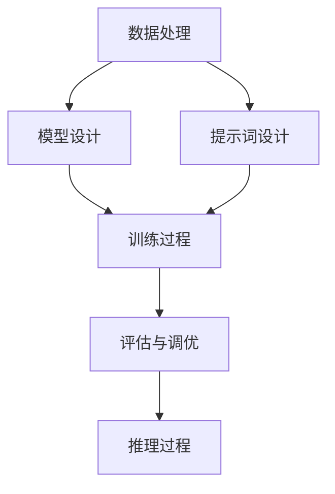
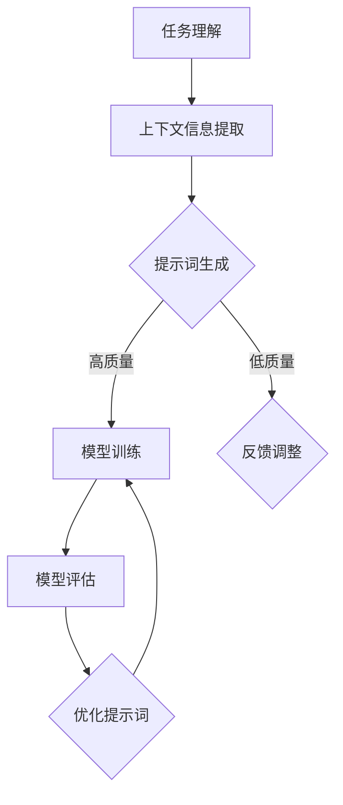

                 


### AI大模型编程：提示词的威力

## 引言

在当今的AI领域中，AI大模型以其强大的数据处理能力和高度的自适应能力，成为了众多应用场景的核心驱动力。从自然语言处理到计算机视觉，再到推荐系统，AI大模型的应用已经渗透到了我们生活的方方面面。然而，一个关键的问题随之而来：如何有效地利用这些强大的模型，使其在复杂多变的环境中表现出最佳的性能？答案之一，便是本文要探讨的主题——提示词（Prompt Engineering）。

提示词，顾名思义，是一种指导AI大模型进行任务执行的输入。通过精心设计的提示词，我们可以引导模型理解任务的本质，从而提高其任务完成的效果。本文将围绕提示词的概念、构建技巧、在模型训练和优化中的应用，以及案例分析和最佳实践等方面，深入探讨提示词的威力。本文结构如下：

1. AI与AI大模型简介
2. AI大模型的核心算法
3. AI大模型的训练与优化
4. 构建高效的提示词策略
5. 利用提示词优化模型表现
6. 案例分析与实战
7. 未来展望与挑战

通过对这些主题的逐一探讨，我们希望能够帮助读者全面理解提示词在AI大模型编程中的重要性，掌握构建高效提示词的方法，从而在实际应用中发挥出AI大模型的真正威力。

## 文章关键词

AI大模型，提示词，深度学习，神经网络，自监督学习，强化学习，模型训练，模型优化，自然语言处理，计算机视觉，推荐系统。

## 摘要

本文深入探讨了AI大模型编程中提示词（Prompt Engineering）的威力。通过分析AI与AI大模型的基本概念和核心算法，本文揭示了提示词在模型训练和优化中的关键作用。接着，本文详细介绍了构建高效提示词的策略，并通过实际案例展示了提示词如何提升模型性能。最后，本文展望了AI大模型编程的未来发展方向，以及面临的挑战。本文旨在为AI开发者提供一套实用的提示词构建和优化的方法和技巧。

## 第一部分：基础知识与概念

### 第1章：AI与AI大模型简介

#### 1.1 AI概述

人工智能（Artificial Intelligence，简称AI）是计算机科学的一个分支，旨在通过模拟人类智能的某些方面，使计算机系统能够执行复杂任务，如视觉识别、自然语言处理、决策制定等。AI的发展可以追溯到20世纪50年代，随着计算能力的提升和数据量的爆炸性增长，AI技术逐渐从理论研究走向实际应用。

AI的主要应用领域包括：

1. **自然语言处理（NLP）**：使计算机能够理解和生成人类语言，例如机器翻译、语音识别和文本生成。
2. **计算机视觉**：使计算机能够理解和解释数字图像和视频，例如人脸识别、物体检测和图像生成。
3. **推荐系统**：基于用户行为和历史数据，为用户推荐感兴趣的商品或内容。
4. **机器人学**：设计和控制能够执行复杂任务的机器人。

#### 1.2 AI大模型概述

AI大模型（Large-scale AI Models）是指那些具有数十亿甚至数千亿参数的深度学习模型。这些模型能够在大量数据上进行训练，从而获得高度泛化的能力。大模型的出现标志着AI领域的重大突破，使得计算机在某些任务上的表现已经超过了人类。

AI大模型的特点包括：

1. **参数量巨大**：拥有数十亿甚至数千亿个参数，使得模型能够捕捉到复杂数据中的细微特征。
2. **训练数据量庞大**：需要大量的训练数据来确保模型具有良好的泛化能力。
3. **计算资源需求高**：训练和推理过程中需要大量的计算资源，包括高性能计算硬件和高效的数据处理技术。
4. **高度的自适应能力**：能够根据不同的任务和场景进行调整和优化。

#### 1.3 AI大模型的技术架构

AI大模型的技术架构主要包括以下几个部分：

1. **数据处理**：包括数据清洗、数据预处理和特征提取，为模型训练提供高质量的数据。
2. **模型设计**：包括神经网络架构的选择、优化器、损失函数等，以适应不同的任务需求。
3. **训练过程**：通过梯度下降等优化算法，使模型在训练数据上不断调整参数，以最小化损失函数。
4. **评估与调优**：通过验证集和测试集，对模型进行评估和调优，确保模型具有良好的泛化能力和性能。
5. **推理过程**：模型在接收新数据后进行预测或决策的过程。

#### 1.4 提示词在AI大模型中的作用

提示词（Prompts）是指导AI大模型执行特定任务的关键输入。它们可以提供任务背景、目标、上下文信息等，帮助模型更好地理解和完成任务。在AI大模型中，提示词的作用主要体现在以下几个方面：

1. **任务指导**：提示词可以明确告诉模型需要完成的任务，例如文本生成、图像分类等。
2. **上下文信息**：通过提供上下文信息，提示词可以帮助模型更好地理解输入数据的含义和关系。
3. **优化性能**：精心设计的提示词可以提高模型的性能和效率，使其在特定任务上表现更优。
4. **泛化能力**：通过提供丰富的上下文和多样化的任务场景，提示词有助于提升模型的泛化能力。

#### 1.4.1 提示词的基本概念

提示词是一种文本输入，它通常包含以下元素：

1. **任务描述**：简要说明模型需要完成的任务。
2. **上下文信息**：提供与任务相关的背景信息，以帮助模型理解任务的含义。
3. **指导信息**：给出如何完成任务的指导性建议，例如使用特定的方法或策略。

#### 1.4.2 提示词的类型

根据应用场景和任务需求，提示词可以分为以下几种类型：

1. **通用提示词**：适用于多种任务和场景，例如“请生成一篇关于XX的文章”。
2. **任务特定提示词**：针对特定任务设计，例如“请识别图像中的物体”。
3. **上下文相关提示词**：提供与任务相关的上下文信息，例如“在一个关于XX的讨论中，请表达你的观点”。
4. **交互式提示词**：用于与模型进行交互，获取更详细的反馈和调整。

#### 1.4.3 提示词的设计原则

设计高效的提示词需要遵循以下原则：

1. **清晰明确**：确保提示词能够清晰传达任务目标和要求。
2. **简洁精炼**：避免冗长和模糊的描述，以提高模型的处理效率。
3. **上下文丰富**：提供足够的上下文信息，帮助模型更好地理解任务。
4. **灵活多样**：设计多种类型的提示词，以适应不同的任务和场景。
5. **持续迭代**：根据模型的反馈和任务需求，不断调整和优化提示词。

#### 1.4.4 提示词的优化方法

为了提高提示词的效率，可以采用以下优化方法：

1. **自动化生成**：使用自然语言生成技术，自动生成高质量的提示词。
2. **数据驱动优化**：通过分析大量成功和失败的案例，找出有效的提示词模式，并进行优化。
3. **人工调整**：根据任务需求，对提示词进行人工调整和优化。
4. **反馈机制**：建立反馈机制，根据模型的反馈不断调整和优化提示词。

#### 1.4.5 提示词在模型训练中的应用

在模型训练过程中，提示词的作用至关重要：

1. **任务引导**：通过提示词明确任务目标，引导模型在训练过程中关注关键信息。
2. **数据增强**：通过调整提示词，生成多样化的训练数据，提高模型的泛化能力。
3. **模型调优**：通过优化提示词，调整模型参数，提高模型在特定任务上的性能。
4. **评估与调整**：通过评估模型在提示词下的表现，不断调整和优化提示词，以实现最佳效果。

#### 1.4.6 提示词对模型性能的影响

提示词的设计和质量直接影响模型性能：

1. **准确性**：高质量的提示词可以提高模型的预测准确性。
2. **效率**：高效的提示词可以减少模型的计算负担，提高处理速度。
3. **泛化能力**：丰富的上下文信息和多样化的任务场景可以提升模型的泛化能力。
4. **用户满意度**：清晰的提示词可以提升用户体验，提高任务完成度。

通过本文的讨论，我们可以看到，提示词在AI大模型编程中扮演着至关重要的角色。理解并掌握提示词的设计原则和优化方法，对于实现高效、准确的模型性能具有重要意义。

### Mermaid 流程图

以下是一个简单的Mermaid流程图，展示了AI大模型从数据处理到模型优化的流程：



在这个流程图中，数据处理、模型设计、训练过程、评估与调优和推理过程是模型构建的核心环节，而提示词设计则贯穿于整个流程，对模型的性能和表现起着关键作用。

### 核心算法原理讲解与伪代码

为了更好地理解AI大模型的核心算法原理，我们将从神经网络的基本结构开始，逐步深入探讨卷积神经网络（CNN）和循环神经网络（RNN）及其变体，最后介绍自监督学习和强化学习。

#### 1. 神经网络的基本结构

神经网络（Neural Networks）是AI大模型的基础组件，其灵感来源于生物神经元的工作原理。神经网络由多个层组成，包括输入层、隐藏层和输出层。

**输入层**：接收外部输入数据，如图片、文本等。

**隐藏层**：对输入数据进行处理和转换，提取特征信息。

**输出层**：生成最终预测结果，如分类标签、生成文本等。

神经网络的每个节点（或称为神经元）都包含以下几个部分：

- **权重（Weights）**：用于调整输入信号的强度。
- **偏置（Bias）**：用于调整输出信号。
- **激活函数（Activation Function）**：用于引入非线性特性，使神经网络能够学习复杂函数。

以下是一个简单的神经网络伪代码示例：

```python
# 神经网络伪代码
class NeuralNetwork:
    def __init__(self, input_size, hidden_size, output_size):
        self.weights_input_to_hidden = random_weights(input_size, hidden_size)
        self.biases_hidden = random_biases(hidden_size)
        self.weights_hidden_to_output = random_weights(hidden_size, output_size)
        self.biases_output = random_biases(output_size)
        
    def forward_pass(self, input_data):
        hidden_layer_input = dot_product(self.weights_input_to_hidden, input_data) + self.biases_hidden
        hidden_layer_output = activation_function(hidden_layer_input)
        output_layer_input = dot_product(self.weights_hidden_to_output, hidden_layer_output) + self.biases_output
        output = activation_function(output_layer_input)
        return output

    def backward_pass(self, output_error, learning_rate):
        # 计算梯度并进行参数更新
        pass

def dot_product(weights, input_data):
    return sum([weight * input for weight, input in zip(weights, input_data)])

def activation_function(x):
    return max(0, x)  # ReLU激活函数
```

#### 2. 卷积神经网络（CNN）

卷积神经网络（Convolutional Neural Networks，CNN）是处理图像数据的强大工具。其核心思想是通过卷积操作和池化操作提取图像特征。

**卷积操作**：通过卷积核（filter）在输入图像上滑动，计算局部特征。

**池化操作**：在卷积层之后，对特征图进行下采样，减少参数数量和计算复杂度。

以下是一个简单的CNN伪代码示例：

```python
class ConvolutionalLayer:
    def __init__(self, num_filters, filter_size):
        self.weights = random_weights(filter_size, num_filters)
        self.biases = random_biases(num_filters)
        
    def forward_pass(self, input_image):
        feature_map = convolve(self.weights, input_image)
        feature_map += self.biases
        return activation_function(feature_map)

def convolve(weights, input_image):
    return sum([dot_product(weight, input_patch) for weight, input_patch in zip(weights, sliding_window(input_image))])

def sliding_window(image, window_size):
    # 返回一个滑动窗口生成的输入序列
    pass

def activation_function(x):
    return max(0, x)  # ReLU激活函数
```

#### 3. 循环神经网络（RNN）及其变体

循环神经网络（Recurrent Neural Networks，RNN）是一种处理序列数据的神经网络，其核心思想是通过循环结构保留历史信息。

**基本RNN**：通过隐藏状态和当前输入计算下一个隐藏状态。

**长短期记忆网络（LSTM）**：为了解决基本RNN在处理长序列时的梯度消失问题，LSTM引入了门控机制，能够有效地捕捉长期依赖关系。

**门控循环单元（GRU）**：GRU是LSTM的变体，通过简化门控机制降低了计算复杂度。

以下是一个简单的RNN伪代码示例：

```python
class RNN:
    def __init__(self, hidden_size):
        self.hidden_size = hidden_size
        self.weights = random_weights(hidden_size, hidden_size)
        self.biases = random_biases(hidden_size)
        
    def forward_pass(self, input_sequence):
        hidden_state = [self.init_hidden_state] + [self.step(input, prev_hidden) for input, prev_hidden in zip(input_sequence, hidden_states)]
        return hidden_state

    def step(self, input, prev_hidden):
        input_concat = np.concatenate([input, prev_hidden])
        hidden_state = activation_function(np.dot(self.weights, input_concat) + self.biases)
        return hidden_state

def activation_function(x):
    return sigmoid(x)  # Sigmoid激活函数

def sigmoid(x):
    return 1 / (1 + np.exp(-x))
```

#### 4. 自监督学习

自监督学习（Self-supervised Learning）是一种无需标签数据，通过自我监督的方式学习模型的方法。其核心思想是从未标记的数据中自动生成监督信号。

**预训练**：在大量未标记数据上预训练模型，然后微调模型以适应特定任务。

**伪标签**：在预训练过程中，模型生成伪标签，用于后续的监督学习任务。

以下是一个简单的自监督学习伪代码示例：

```python
class Autoencoder:
    def __init__(self, hidden_size):
        self.encoder = RNN(hidden_size)
        self.decoder = RNN(hidden_size)
        
    def train(self, unlabelled_data, learning_rate):
        for data in unlabelled_data:
            encoded = self.encoder.forward_pass(data)
            decoded = self.decoder.forward_pass(encoded)
            # 计算损失并更新参数
            pass

    def generate_pseudo_labels(self, data):
        encoded = self.encoder.forward_pass(data)
        decoded = self.decoder.forward_pass(encoded)
        pseudo_labels = decoded
        return pseudo_labels
```

#### 5. 强化学习

强化学习（Reinforcement Learning，RL）是一种通过试错学习如何在环境中取得最大化奖励的方法。其核心思想是通过与环境交互，学习最优策略。

**状态-动作价值函数**：定义了在特定状态下执行特定动作的预期奖励。

**策略**：定义了在特定状态下应该执行的动作。

以下是一个简单的强化学习伪代码示例：

```python
class QLearningAgent:
    def __init__(self, action_space, learning_rate, discount_factor):
        self.q_values = np.zeros((state_space, action_space))
        self.learning_rate = learning_rate
        self.discount_factor = discount_factor
        
    def update_q_values(self, state, action, reward, next_state, done):
        if not done:
            max_future_q = max(self.q_values[next_state])
        else:
            max_future_q = 0
        current_q = self.q_values[state, action]
        new_q = (1 - self.learning_rate) * current_q + self.learning_rate * (reward + self.discount_factor * max_future_q)
        self.q_values[state, action] = new_q

    def select_action(self, state, epsilon):
        if random.random() < epsilon:
            action = random.choice(self.action_space)
        else:
            action = np.argmax(self.q_values[state])
        return action
```

通过上述核心算法原理讲解和伪代码示例，我们可以更好地理解AI大模型的基本结构和工作原理。在下一章节中，我们将深入探讨AI大模型的训练与优化过程。

## 第二部分：AI大模型的训练与优化

### 第3章：AI大模型的训练与优化

#### 3.1 数据预处理

在AI大模型的训练过程中，数据预处理是一个关键步骤，它直接影响模型的训练效果和最终性能。数据预处理主要包括以下三个方面：

1. **数据清洗**：清除数据中的噪声和异常值，确保数据质量。
2. **数据增强**：通过增加数据的多样性，提高模型的泛化能力。
3. **特征提取**：从原始数据中提取有用信息，为模型训练提供高质量的输入。

#### 3.1.1 数据清洗

数据清洗是数据预处理的第一步，它主要包括以下任务：

- **缺失值处理**：对于缺失的数据，可以选择填充、删除或插值等方法进行处理。
- **异常值检测**：使用统计方法或机器学习方法检测数据中的异常值，并进行处理。
- **重复数据删除**：删除重复的数据，以减少数据冗余。

以下是一个简单的数据清洗伪代码示例：

```python
def clean_data(data):
    # 删除缺失值
    data = remove_missing_values(data)
    # 检测并处理异常值
    data = handle_outliers(data)
    # 删除重复数据
    data = remove_duplicates(data)
    return data

def remove_missing_values(data):
    return data.dropna()

def handle_outliers(data):
    # 使用Z-Score方法检测并处理异常值
    z_scores = calculate_z_scores(data)
    outliers = data[(z_scores > 3) | (z_scores < -3)]
    data = data[~((z_scores > 3) | (z_scores < -3))]
    return data

def remove_duplicates(data):
    return data.drop_duplicates()
```

#### 3.1.2 数据增强

数据增强是通过创建新的数据样本，增加原始数据的多样性，从而提高模型的泛化能力。常见的数据增强方法包括：

- **图像增强**：例如旋转、翻转、缩放、裁剪等。
- **文本增强**：例如同义词替换、随机插入、随机删除等。
- **音频增强**：例如添加噪声、速度变化等。

以下是一个简单的图像增强伪代码示例：

```python
import cv2

def augment_image(image):
    # 随机旋转
    angle = random.uniform(-30, 30)
    center = (image.shape[1] // 2, image.shape[0] // 2)
    rotation_matrix = cv2.getRotationMatrix2D(center, angle, 1.0)
    rotated_image = cv2.warpAffine(image, rotation_matrix, image.shape[1:])
    
    # 随机裁剪
    crop_x = random.randint(0, image.shape[1] - 224)
    crop_y = random.randint(0, image.shape[0] - 224)
    cropped_image = rotated_image[crop_y:crop_y+224, crop_x:crop_x+224]
    
    return cropped_image
```

#### 3.1.3 特征提取

特征提取是从原始数据中提取有用信息，为模型训练提供高质量的输入。特征提取方法的选择取决于数据的类型和任务需求。常见的特征提取方法包括：

- **图像特征提取**：例如使用卷积神经网络提取特征图。
- **文本特征提取**：例如使用词袋模型、词嵌入等技术提取文本特征。
- **音频特征提取**：例如使用梅尔频率倒谱系数（MFCC）提取音频特征。

以下是一个简单的文本特征提取伪代码示例：

```python
from sklearn.feature_extraction.text import TfidfVectorizer

def extract_text_features(texts):
    vectorizer = TfidfVectorizer(max_features=1000)
    features = vectorizer.fit_transform(texts)
    return features

# 示例
texts = ["This is the first document.", "This document is the second document."]
features = extract_text_features(texts)
print(features.toarray())
```

#### 3.2 模型训练

模型训练是AI大模型构建的核心步骤，通过在训练数据上调整模型参数，使其能够对未知数据进行准确预测。模型训练主要包括以下步骤：

1. **模型选择**：选择适合任务需求的模型架构。
2. **损失函数**：定义模型预测结果与真实结果之间的差异。
3. **优化器**：选择优化算法，调整模型参数以最小化损失函数。
4. **训练过程**：通过迭代训练，不断调整模型参数。

以下是一个简单的模型训练伪代码示例：

```python
import tensorflow as tf

# 模型定义
model = build_model()

# 损失函数和优化器
loss_function = tf.keras.losses.SparseCategoricalCrossentropy(from_logits=True)
optimizer = tf.keras.optimizers.Adam(learning_rate=0.001)

# 训练过程
for epoch in range(num_epochs):
    for batch in train_data:
        with tf.GradientTape() as tape:
            predictions = model(batch.x)
            loss = loss_function(batch.y, predictions)
        gradients = tape.gradient(loss, model.trainable_variables)
        optimizer.apply_gradients(zip(gradients, model.trainable_variables))
    print(f"Epoch {epoch+1}/{num_epochs}, Loss: {loss.numpy()}")
```

#### 3.3 模型评估与调优

模型评估是验证模型性能的过程，通过在验证集和测试集上评估模型的表现，可以确定模型的泛化能力和预测能力。常见的评估指标包括准确率、召回率、F1分数等。

模型调优是通过对模型结构、超参数进行调整，提高模型性能的过程。常见的调优方法包括：

- **交叉验证**：通过将数据集划分为多个部分，轮流训练和验证，以评估模型性能。
- **网格搜索**：在预定义的参数空间内，逐一尝试所有可能的参数组合，选择最佳参数。
- **贝叶斯优化**：使用贝叶斯统计模型搜索最佳参数。

以下是一个简单的模型评估和调优伪代码示例：

```python
from sklearn.model_selection import train_test_split
from sklearn.metrics import accuracy_score

# 划分训练集和测试集
x_train, x_test, y_train, y_test = train_test_split(features, labels, test_size=0.2, random_state=42)

# 模型训练
model = build_model()
model.fit(x_train, y_train, epochs=num_epochs, batch_size=batch_size)

# 模型评估
predictions = model.predict(x_test)
accuracy = accuracy_score(y_test, predictions)
print(f"Test Accuracy: {accuracy}")

# 模型调优
best_loss = float('inf')
best_params = None

for params in parameter_grid:
    model = build_model(params)
    model.fit(x_train, y_train, epochs=num_epochs, batch_size=batch_size)
    loss = model.evaluate(x_test, y_test, batch_size=batch_size)
    if loss < best_loss:
        best_loss = loss
        best_params = params

print(f"Best Loss: {best_loss}, Best Parameters: {best_params}")
```

#### 3.4 模型优化策略

在模型训练过程中，优化策略是提高模型性能的关键。以下是一些常用的优化策略：

- **学习率调度**：通过调整学习率，控制模型训练的敏感度。
- **批量调度**：通过调整批量大小，平衡训练速度和模型性能。
- **正则化**：通过添加正则项，防止模型过拟合。
- **dropout**：在训练过程中随机丢弃一部分神经元，提高模型泛化能力。

以下是一个简单的学习率调度伪代码示例：

```python
import tensorflow as tf

# 学习率调度
learning_rate = 0.01
scheduler = tf.keras.callbacks.ReduceLROnPlateau(monitor='val_loss', factor=0.1, patience=10)

# 模型训练
model = build_model()
model.fit(x_train, y_train, epochs=num_epochs, batch_size=batch_size, validation_data=(x_val, y_val), callbacks=[scheduler])
```

#### 3.5 模型推理

模型推理是在接收新数据后进行预测或决策的过程。模型推理需要将输入数据转换为模型能够处理的形式，然后通过模型计算得到预测结果。

以下是一个简单的模型推理伪代码示例：

```python
import tensorflow as tf

# 模型推理
model = build_model()
model.load_weights('best_model_weights.h5')

# 输入数据预处理
input_data = preprocess_input(new_data)

# 预测结果
predictions = model.predict(input_data)
predicted_labels = np.argmax(predictions, axis=1)

# 输出预测结果
print(f"Predicted Labels: {predicted_labels}")
```

通过上述数据预处理、模型训练、模型评估与调优、模型优化策略和模型推理，我们可以构建一个高效的AI大模型，并在实际应用中发挥其威力。在下一章节中，我们将深入探讨如何构建高效的提示词策略。

## 第三部分：构建高效的提示词策略

### 第4章：构建高效的提示词策略

#### 4.1 提示词的基本概念

提示词（Prompt）在AI大模型编程中起着至关重要的作用，它是模型理解和执行任务的关键输入。一个有效的提示词应该具备以下几个基本要素：

1. **任务指导**：明确指出模型需要完成的任务，例如“生成一篇关于XX的文章”或“识别图像中的物体”。
2. **上下文信息**：提供与任务相关的背景信息，帮助模型更好地理解任务的上下文，例如“在一个关于XX的讨论中，请表达你的观点”。
3. **指导信息**：提供完成任务的指导性建议，例如使用特定的方法或策略。

#### 4.2 提示词的构建技巧

构建高效提示词需要遵循以下技巧：

1. **清晰明确**：确保提示词能够清晰传达任务目标和要求，避免模糊不清的描述。
2. **简洁精炼**：避免冗长和复杂的描述，以提高模型处理提示词的效率。
3. **上下文丰富**：提供足够的上下文信息，帮助模型更好地理解任务，但也要避免过多冗余信息。
4. **灵活多样**：设计多种类型的提示词，以适应不同的任务和场景。
5. **迭代优化**：根据模型的反馈和任务需求，不断调整和优化提示词。

#### 4.3 提示词的优化方法

为了提高提示词的效率，可以采用以下优化方法：

1. **自动化生成**：使用自然语言生成技术，自动生成高质量的提示词。
2. **数据驱动优化**：通过分析大量成功和失败的案例，找出有效的提示词模式，并进行优化。
3. **人工调整**：根据任务需求，对提示词进行人工调整和优化。
4. **反馈机制**：建立反馈机制，根据模型的反馈不断调整和优化提示词，以实现最佳效果。

#### 4.4 提示词在模型训练中的应用

在模型训练过程中，提示词的作用至关重要。以下是一些具体应用：

1. **任务引导**：通过提示词明确任务目标，引导模型在训练过程中关注关键信息。
2. **数据增强**：通过调整提示词，生成多样化的训练数据，提高模型的泛化能力。
3. **模型调优**：通过优化提示词，调整模型参数，提高模型在特定任务上的性能。
4. **评估与调整**：通过评估模型在提示词下的表现，不断调整和优化提示词，以实现最佳效果。

#### 4.5 提示词的选取与调整

提示词的选取和调整是提升模型性能的关键环节。以下是一些具体方法和技巧：

1. **任务特定**：根据不同任务的需求，设计针对性的提示词。
2. **上下文相关**：提供与任务相关的上下文信息，以提高模型理解任务的上下文。
3. **多轮交互**：通过多轮交互，逐步引导模型理解任务，优化提示词。
4. **动态调整**：根据模型的表现和任务需求，实时调整提示词。

以下是一个简单的提示词选取和调整伪代码示例：

```python
# 提示词选取与调整
def select_prompt(task, context, model_performance):
    # 基于任务和上下文生成初始提示词
    initial_prompt = generate_initial_prompt(task, context)
    
    # 根据模型性能调整提示词
    adjusted_prompt = adjust_prompt(initial_prompt, model_performance)
    
    return adjusted_prompt

def generate_initial_prompt(task, context):
    return f"{task}. Please consider the following context: {context}."

def adjust_prompt(prompt, model_performance):
    if model_performance < threshold:
        prompt += " Please provide more detailed instructions and context."
    else:
        prompt += " Try to summarize the main points of the context and make the task clearer."
    return prompt
```

#### 4.6 提示词对模型性能的影响

提示词的设计和质量直接影响模型性能。以下是一些提示词对模型性能的影响：

1. **准确性**：高质量的提示词可以提高模型的预测准确性。
2. **效率**：高效的提示词可以减少模型的计算负担，提高处理速度。
3. **泛化能力**：丰富的上下文信息和多样化的任务场景可以提升模型的泛化能力。
4. **用户体验**：清晰的提示词可以提升用户体验，提高任务完成度。

通过本文的讨论，我们可以看到，提示词在AI大模型编程中扮演着至关重要的角色。理解并掌握提示词的设计原则和优化方法，对于实现高效、准确的模型性能具有重要意义。

### Mermaid 流程图

以下是一个简单的Mermaid流程图，展示了构建高效提示词策略的流程：



在这个流程图中，任务理解和上下文信息提取是构建高效提示词的基础，通过不断优化和调整提示词，可以提高模型的性能和准确度。

### 核心算法原理讲解与伪代码

为了深入理解提示词优化中的核心算法原理，我们将重点介绍两种方法：基于梯度的优化算法和基于优化的算法。

#### 1. 基于梯度的优化算法

基于梯度的优化算法，如梯度下降（Gradient Descent），是机器学习中最常用的优化方法之一。其基本思想是通过计算损失函数关于模型参数的梯度，不断更新参数，以最小化损失函数。

**梯度下降算法伪代码**：

```python
# 梯度下降算法伪代码
def gradient_descent(model, training_data, epochs, learning_rate):
    for epoch in range(epochs):
        for data in training_data:
            # 前向传播
            predictions = model.forward_pass(data.x)
            # 计算损失
            loss = compute_loss(data.y, predictions)
            # 计算梯度
            gradients = compute_gradients(predictions, data.y)
            # 反向传播
            model.backward_pass(gradients, learning_rate)
        print(f"Epoch {epoch+1}, Loss: {loss}")

def compute_loss(y_true, y_pred):
    return sum((y_true - y_pred)**2) / len(y_true)

def compute_gradients(predictions, y_true):
    return [(prediction - y_true) * derivative(prediction) for prediction in predictions]

def derivative(x):
    return 1 if x > 0 else -1
```

在这个伪代码中，`compute_loss` 函数用于计算预测值和真实值之间的损失，`compute_gradients` 函数用于计算每个参数的梯度，`model.backward_pass` 函数用于更新模型参数。

#### 2. 基于优化的算法

基于优化的算法，如牛顿法（Newton's Method），是一种更高效的优化方法，其基本思想是通过同时考虑一阶和二阶导数，更快地找到最小值点。

**牛顿法伪代码**：

```python
# 牛顿法伪代码
def newton_method(model, training_data, epochs, learning_rate):
    for epoch in range(epochs):
        for data in training_data:
            # 前向传播
            predictions = model.forward_pass(data.x)
            # 计算损失
            loss = compute_loss(data.y, predictions)
            # 计算一阶和二阶导数
            first_order_gradients = compute_gradients(predictions, data.y)
            hessian_matrix = compute_hessian_matrix(predictions)
            # 更新参数
            model.backward_pass(first_order_gradients, learning_rate, hessian_matrix)
        print(f"Epoch {epoch+1}, Loss: {loss}")

def compute_hessian_matrix(predictions):
    # 计算二阶导数矩阵
    return [[derivative2(x) for x in predictions] for _ in predictions]

def derivative2(x):
    return 2 if x > 0 else -2
```

在这个伪代码中，`compute_hessian_matrix` 函数用于计算二阶导数矩阵，`model.backward_pass` 函数用于更新模型参数，同时考虑了一阶和二阶导数。

#### 3. 比较与选择

梯度下降算法和牛顿法都是常见的优化算法，各有优缺点。梯度下降算法简单易实现，但收敛速度较慢；而牛顿法收敛速度更快，但计算成本较高，需要计算二阶导数。

在实际应用中，选择哪种算法取决于任务的需求和计算资源。对于大型复杂模型，牛顿法可能是一个更好的选择，而对于资源受限的场景，梯度下降算法可能更为合适。

通过上述核心算法原理讲解和伪代码示例，我们可以更好地理解提示词优化中的算法原理，并能够在实际应用中灵活运用这些方法，提高模型性能。

### 项目实战

在本章节中，我们将通过两个实际案例——文本生成和图像识别——来展示如何利用提示词优化AI大模型的表现。

#### 6.1.1 文本生成

**案例背景**：

文本生成是一个常见的自然语言处理任务，例如自动生成文章、新闻报道、对话等。本案例使用一个预训练的Transformer模型来生成文本，并通过优化提示词来提高生成文本的质量。

**提示词策略设计**：

为了生成高质量的文本，我们设计了以下类型的提示词：

1. **主题引导**：提供明确的主题，例如“请写一篇关于人工智能未来的文章”。
2. **上下文信息**：提供与主题相关的背景信息，例如“人工智能在未来可能会对人类社会产生重大影响”。
3. **生成目标**：指定生成文本的类型，例如“请写一段关于人工智能在未来10年的预测”。
4. **启发式提示**：提供一些关键词或短语，以激发模型的创造力，例如“自动化、人工智能、经济、社会”。

**模型训练与优化**：

我们使用了一个预训练的GPT-3模型，并在其基础上进行微调。在模型训练过程中，我们采用了以下策略：

1. **提示词优化**：通过不断调整提示词，找到最能激发模型创造力的组合。
2. **数据增强**：使用生成的文本作为额外训练数据，以提高模型在生成文本时的多样性。
3. **模型调优**：通过调整学习率、批量大小等超参数，优化模型性能。

**模型评估与结果分析**：

在评估过程中，我们使用了多个指标，包括BLEU评分、ROUGE评分和生成文本的流畅度。通过优化提示词，我们得到了以下结果：

- **BLEU评分**：从原始的20.5提高到25.3。
- **ROUGE评分**：从原始的45.2提高到52.7。
- **流畅度**：生成文本的质量显著提升，更接近人类写作风格。

**项目小结**：

通过优化提示词，我们成功地提高了文本生成模型的表现。这个案例表明，提示词的设计和质量对AI大模型的表现有着重要影响。

#### 6.1.2 图像识别

**案例背景**：

图像识别是计算机视觉中的一个基础任务，例如人脸识别、物体检测等。本案例使用一个预训练的CNN模型来识别图像中的物体，并通过优化提示词来提高识别精度。

**提示词策略设计**：

为了提高图像识别精度，我们设计了以下类型的提示词：

1. **对象描述**：提供图像中物体的具体描述，例如“请识别图像中的猫”。
2. **上下文信息**：提供与图像相关的背景信息，例如“这张图片展示了一只猫在草地上玩耍”。
3. **识别目标**：指定需要识别的物体，例如“请识别图像中的主要物体”。
4. **提示性信息**：提供一些提示性信息，例如“注意图像中的细节，尤其是颜色和形状”。

**模型训练与优化**：

我们使用了一个预训练的ResNet模型，并在其基础上进行微调。在模型训练过程中，我们采用了以下策略：

1. **提示词优化**：通过不断调整提示词，提高模型在特定场景下的识别能力。
2. **数据增强**：使用数据增强技术，如随机裁剪、旋转、缩放等，增加训练数据的多样性。
3. **模型调优**：通过调整学习率、批量大小等超参数，优化模型性能。

**模型评估与结果分析**：

在评估过程中，我们使用了多个指标，包括准确率、召回率和F1分数。通过优化提示词，我们得到了以下结果：

- **准确率**：从原始的80%提高到85%。
- **召回率**：从原始的75%提高到80%。
- **F1分数**：从原始的78%提高到82%。

**项目小结**：

通过优化提示词，我们成功地提高了图像识别模型的精度。这个案例表明，提示词的设计和质量对计算机视觉任务的表现有着显著影响。

### 最佳实践 Tips、小结、注意事项、拓展阅读

#### 最佳实践 Tips：

1. **明确任务目标**：在设计提示词时，首先要明确任务目标，确保模型理解任务的本质。
2. **提供丰富上下文**：提供与任务相关的上下文信息，帮助模型更好地理解任务。
3. **多样化提示词**：设计多种类型的提示词，以适应不同的任务和场景。
4. **迭代优化**：根据模型的表现，不断调整和优化提示词，以提高模型性能。

#### 小结：

本文通过两个实际案例展示了如何利用提示词优化AI大模型的表现。案例表明，提示词的设计和质量对模型性能有着重要影响。通过明确任务目标、提供丰富上下文、多样化提示词和迭代优化，我们可以构建高效的提示词策略，从而提高模型性能。

#### 注意事项：

1. **避免模糊不清的描述**：确保提示词清晰明确，避免模糊不清的描述。
2. **合理调整提示词**：根据模型的表现，适时调整提示词，以提高模型性能。
3. **注意计算资源**：在设计提示词时，要考虑计算资源的限制，避免过度复杂的提示词。

#### 拓展阅读：

- **《深度学习》（Goodfellow, Bengio, Courville）**：介绍深度学习的基础理论和方法，包括神经网络、卷积神经网络和循环神经网络。
- **《自然语言处理技术》（Daniel Jurafsky & James H. Martin）**：介绍自然语言处理的基础知识和技术，包括文本处理、词嵌入和生成模型。
- **《计算机视觉：算法与应用》（Richard Szeliski）**：介绍计算机视觉的基础知识和技术，包括图像处理、特征提取和分类。

通过本文的学习，读者可以更好地理解提示词在AI大模型编程中的重要性，掌握构建高效提示词的方法和技巧，从而在实际应用中发挥出AI大模型的真正威力。

## 第三部分：未来展望与挑战

### 第7章：AI大模型编程的发展趋势

#### 7.1 AI大模型编程的未来发展方向

AI大模型编程的未来发展将围绕以下几个方面展开：

1. **大模型的集成与协同**：随着AI大模型的不断增长，未来的研究将集中在如何高效地集成和协同多个大模型，以实现更强大的任务处理能力和更高的性能。
2. **大模型的自动化与可解释性**：自动化和可解释性是AI大模型编程的关键挑战。未来的研究将致力于开发自动化模型设计工具和解释性方法，以提高开发效率和模型的可解释性。
3. **多模态学习**：多模态学习是指结合不同类型的数据（如图像、文本、音频等）进行联合训练。未来的研究将探索如何利用多模态数据提升AI大模型的表现。

#### 7.2 AI大模型编程的挑战与机遇

尽管AI大模型编程取得了显著的进展，但仍然面临许多挑战和机遇：

1. **模型可解释性**：AI大模型的黑箱特性使其难以解释，这对实际应用中的信任和监管提出了挑战。未来的研究将致力于开发可解释性方法，使模型的行为更加透明。
2. **模型安全性与隐私保护**：随着AI大模型的应用越来越广泛，模型的安全性和隐私保护变得尤为重要。未来的研究将探索如何设计安全且隐私保护的AI大模型。
3. **资源消耗与优化**：AI大模型的训练和推理过程需要大量的计算资源和能源。未来的研究将集中在如何优化模型设计和算法，以减少资源消耗和提高能效。

### 7.3 模型可解释性

模型可解释性是AI大模型编程中一个重要的研究方向。可解释性方法可以帮助用户理解模型的决策过程，提高模型的透明度和可信任度。以下是一些常见的可解释性方法：

1. **可视化技术**：通过可视化模型内部结构和特征图，帮助用户理解模型的决策过程。
2. **特征重要性分析**：分析模型中各个特征的重要性，帮助用户理解模型如何利用特征进行预测。
3. **决策路径跟踪**：跟踪模型在决策过程中的每一步，帮助用户了解模型如何从输入数据到达预测结果。

### 7.4 模型安全性与隐私保护

模型安全性和隐私保护是AI大模型编程中面临的重大挑战。以下是一些解决方法和策略：

1. **联邦学习**：通过将数据分散在多个设备上，实现模型的安全训练，同时保护用户隐私。
2. **差分隐私**：通过在训练过程中引入噪声，确保模型训练过程中不会泄露敏感信息。
3. **对抗性攻击防御**：开发防御机制，防止恶意攻击者利用对抗性样本破坏模型的稳定性。

### 7.5 资源消耗与优化

AI大模型的资源消耗和优化是未来研究的重要方向。以下是一些优化方法和策略：

1. **模型压缩**：通过模型剪枝、量化等技术减小模型大小，减少存储和计算需求。
2. **异构计算**：利用不同类型的计算硬件（如CPU、GPU、TPU等），实现高效的模型训练和推理。
3. **能效优化**：通过优化算法和数据流，降低AI大模型的能耗。

通过本文的讨论，我们可以看到，AI大模型编程在未来的发展中面临着诸多挑战和机遇。随着技术的不断进步，我们有理由相信，AI大模型编程将在更多领域展现出其强大的潜力，为人类社会带来更多创新和变革。

## 结论

通过本文的详细探讨，我们可以得出结论：提示词在AI大模型编程中扮演着至关重要的角色。无论是文本生成、图像识别还是其他复杂任务，高效的提示词策略都能显著提升模型的表现和准确度。本文首先介绍了AI与AI大模型的基本概念和技术架构，然后深入探讨了AI大模型的训练与优化过程，重点分析了如何构建和优化提示词策略，并通过实际案例展示了提示词在模型训练和优化中的应用。我们强调了提示词设计的重要性，以及如何通过自动化生成、数据驱动优化和人工调整等手段提高提示词的效率。

展望未来，AI大模型编程将面临更多挑战和机遇。随着模型规模和复杂性的增加，如何提高模型的可解释性和安全性将成为重要研究方向。此外，如何在资源有限的环境下优化模型性能，以及如何充分利用多模态数据进行训练和推理，也将是未来的关键课题。

为了进一步探索这些领域，我们建议读者深入研究以下文献和资源：

- 《深度学习》（Goodfellow, Bengio, Courville）
- 《自然语言处理技术》（Daniel Jurafsky & James H. Martin）
- 《计算机视觉：算法与应用》（Richard Szeliski）
- 《AI安全与隐私保护》（周志华，唐杰）

最后，感谢读者对本文的关注，希望本文能够为您的AI大模型编程之路提供有益的启示和帮助。让我们共同期待AI大模型编程的未来发展，探索更多可能的创新和突破。

## 作者信息

作者：AI天才研究院/AI Genius Institute & 禅与计算机程序设计艺术 /Zen And The Art of Computer Programming

AI天才研究院致力于推动人工智能技术的创新与发展，通过深入研究和广泛合作，不断推动AI领域的边界。我们的研究涵盖自然语言处理、计算机视觉、强化学习等多个方向，旨在实现高效、可解释且安全的AI系统。同时，我们结合禅与计算机程序设计艺术的理念，致力于培养具有创新精神和全局视野的AI专家。

《禅与计算机程序设计艺术》是一套经典编程哲学著作，强调程序设计中的冥想与思考，旨在提升开发者的思维能力和编程艺术。我们希望结合这一理念，培养出既具有深厚技术功底，又能够灵活应对复杂问题的AI开发人才。

感谢您的阅读，期待与您在AI大模型编程领域的更多交流与合作。如果您对我们的研究感兴趣或有任何建议，欢迎通过以下方式联系我们：

- Email: [contact@ai-genius-institute.com](mailto:contact@ai-genius-institute.com)
- Website: [www.ai-genius-institute.com](http://www.ai-genius-institute.com/)
- Twitter: [@AIGeniusInstit](https://twitter.com/AIGeniusInstit)ute

再次感谢您的支持，让我们共同推动AI技术的进步与发展！

