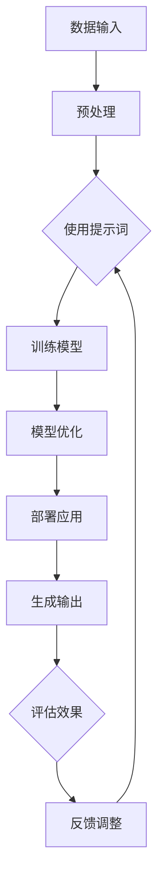
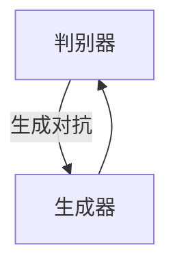
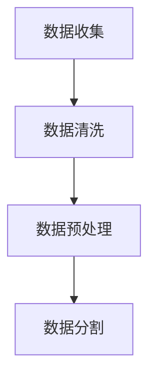
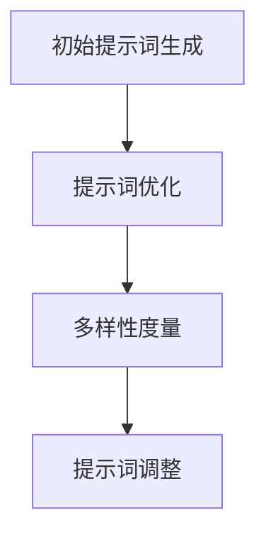
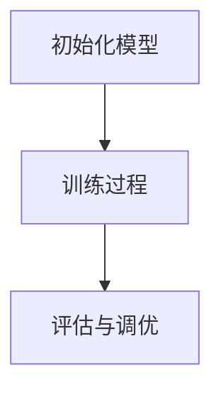

                 


### 1. AI大模型概述

#### 1.1 AI大模型概念与历史

AI大模型（Large-scale Artificial Intelligence Model），通常指的是具备数十亿乃至数千亿参数的深度学习模型，这些模型可以处理大量的数据，并在各种复杂的任务中取得出色的性能。AI大模型的概念起源于深度学习领域，随着计算能力的提升和数据量的爆炸性增长，大模型的研发和应用逐渐成为主流。

在AI大模型的发展历史中，有几个重要的里程碑：

1. **2006年**：Geoffrey Hinton等人提出了深度置信网络（Deep Belief Network，DBN），这是大模型研究的早期尝试。
2. **2012年**：AlexNet在ImageNet竞赛中取得了突破性的成绩，这标志着深度学习进入了一个新的时代。
3. **2016年**：谷歌的TensorFlow和Facebook的PyTorch等开源框架的出现，使得大模型的训练和部署变得更加便捷。
4. **2020年**：GPT-3的发布，标志着AI大模型在自然语言处理领域取得了巨大的成功。

#### 1.2 提示词的重要性

在AI大模型的应用中，提示词（Prompt）扮演着至关重要的角色。提示词是一种引导AI模型进行特定任务的方式，它可以提供上下文信息，帮助模型更好地理解和生成所需的输出。

提示词的重要性体现在以下几个方面：

1. **任务指导**：通过提示词，用户可以明确地告诉AI模型需要进行什么样的任务，从而提高模型的输出质量。
2. **效果优化**：精心设计的提示词可以优化模型的性能，使其在特定任务上表现出色。
3. **泛化能力**：合适的提示词可以提高模型在不同数据集上的泛化能力，减少对特定数据的依赖。

#### 1.3 AI大模型与提示词的关系

AI大模型和提示词之间存在着密切的关联。一方面，大模型的强大计算能力为提示词的应用提供了基础；另一方面，提示词的巧妙设计可以充分发挥大模型的优势，实现更好的性能。

在AI大模型的训练和部署过程中，提示词的作用主要表现在以下几个方面：

1. **训练阶段**：通过提供有针对性的提示词，可以帮助模型更好地理解和学习数据，从而提高训练效果。
2. **推理阶段**：在模型生成输出时，提示词可以为模型提供上下文信息，帮助模型生成更准确和有用的结果。
3. **应用阶段**：在特定任务中，提示词可以引导模型完成复杂的任务，实现高效的解决方案。

为了更好地理解AI大模型与提示词之间的关系，我们可以使用Mermaid流程图来表示它们之间的交互过程。



在这个流程图中，数据输入经过预处理后，使用提示词进行处理，然后进行模型训练和优化。在部署应用阶段，模型根据提示词生成输出，并通过评估效果和反馈调整来不断优化模型性能。

通过这一段介绍，我们初步了解了AI大模型和提示词的基本概念及其关系。在接下来的章节中，我们将深入探讨AI大模型的算法原理、数学模型以及实际应用，进一步揭示提示词的威力与艺术。在文章的后续部分，我们将逐步分析每个核心概念，使用伪代码和数学公式来详细阐述算法原理，并通过项目实战来展示AI大模型和提示词的实际应用。最终，我们将总结提示词技术在AI大模型中的应用，展望未来的发展趋势和研究方向。

### 2. 核心算法原理讲解

#### 2.1 提示词优化算法

在AI大模型的应用中，提示词的优化是一个关键步骤。优化算法的目标是生成高质量的提示词，以最大化模型在特定任务上的性能。以下几种算法在提示词优化中得到了广泛应用。

##### 2.1.1 梯度下降法

梯度下降法是一种常用的优化算法，其核心思想是沿着目标函数的梯度方向进行迭代更新。对于提示词优化问题，可以使用梯度下降法来调整提示词的参数，使其更符合模型的训练需求。

伪代码如下：

```python
for epoch in range(num_epochs):
    for batch in data_loader:
        # 计算梯度
        gradients = model.compute_gradients(prompt_params, batch)
        # 更新参数
        prompt_params -= learning_rate * gradients
```

##### 2.1.2 随机梯度下降法（SGD）

随机梯度下降法（Stochastic Gradient Descent，SGD）是梯度下降法的一个变种，其核心思想是在每个迭代步骤中使用一个随机样本来计算梯度。SGD可以加快收敛速度，但需要更多次的迭代。

伪代码如下：

```python
for epoch in range(num_epochs):
    for sample in data_samples:
        # 计算梯度
        gradients = model.compute_gradients(prompt_params, sample)
        # 更新参数
        prompt_params -= learning_rate * gradients
```

##### 2.1.3 Adam优化器

Adam优化器是一种结合了SGD和动量方法的优化算法，其计算复杂度较低，收敛速度较快。在提示词优化中，Adam优化器被广泛使用。

伪代码如下：

```python
for epoch in range(num_epochs):
    for batch in data_loader:
        # 计算梯度
        gradients = model.compute_gradients(prompt_params, batch)
        # 更新参数
        prompt_params = update_params(prompt_params, gradients, alpha, beta1, beta2)
```

#### 2.2 生成对抗网络（GAN）在提示词生成中的应用

生成对抗网络（Generative Adversarial Networks，GAN）是由生成器（Generator）和判别器（Discriminator）组成的对抗性模型。在提示词生成中，GAN可以用来生成高质量、多样化的提示词。

##### 2.2.1 GAN基本结构

GAN的基本结构如下：



生成器G的目的是生成高质量的提示词，而判别器D的目的是区分生成的提示词和真实提示词。通过不断的对抗训练，生成器的性能会逐渐提高，从而生成更高质量的提示词。

##### 2.2.2 GAN优化过程

GAN的优化过程分为两个阶段：生成器优化和判别器优化。

- **生成器优化**：生成器的目标是使其生成的提示词在判别器上难以区分。生成器的损失函数可以表示为：

  $$L_G = -\log(D(G(z)))$$

  其中，$z$是生成器的输入噪声。

- **判别器优化**：判别器的目标是正确区分真实提示词和生成提示词。判别器的损失函数可以表示为：

  $$L_D = -\log(D(x)) - \log(1 - D(G(z)))$$

  其中，$x$是真实提示词。

  两个网络的优化过程可以表示为：

  ```python
  for epoch in range(num_epochs):
      for real_prompt in real_data:
          # 训练判别器
          D.train(real_prompt)
      for noise in noise_data:
          # 训练生成器
          G.train(noise)
      for generated_prompt in generated_data:
          # 训练判别器
          D.train(generated_prompt)
  ```

#### 2.3 强化学习在提示词优化中的应用

强化学习（Reinforcement Learning，RL）是一种通过试错和反馈来学习行为策略的机器学习方法。在提示词优化中，强化学习可以用来调整提示词，使其在特定任务上表现出更好的性能。

##### 2.3.1 强化学习基本概念

强化学习的基本概念包括：

- **状态（State）**：表示模型当前所处的环境。
- **动作（Action）**：模型可以采取的动作。
- **奖励（Reward）**：动作带来的奖励，用于评估动作的好坏。
- **策略（Policy）**：根据状态选择动作的策略。

##### 2.3.2 强化学习在提示词优化中的应用

在提示词优化中，可以使用强化学习来调整提示词的参数，使其在特定任务上表现出更好的性能。以下是一个简单的伪代码示例：

```python
# 初始化策略网络和值网络
policy_network = PolicyNetwork()
value_network = ValueNetwork()

# 初始化奖励函数
reward_function = RewardFunction()

for episode in range(num_episodes):
    # 初始化状态
    state = initial_state
    
    for step in range(max_steps):
        # 根据当前状态选择动作
        action = policy_network.select_action(state)
        
        # 执行动作，得到新的状态和奖励
        next_state, reward = environment.step(action)
        
        # 更新策略网络和价值网络
        policy_network.update(state, action, reward, next_state)
        value_network.update(state, reward, next_state)
        
        # 更新状态
        state = next_state
        
        # 终止条件判断
        if done:
            break

# 根据策略网络生成优化后的提示词
optimized_prompt = policy_network.generate_prompt()
```

通过上述算法原理的讲解，我们可以看到提示词优化在AI大模型中的应用非常广泛，包括梯度下降法、生成对抗网络（GAN）和强化学习等多种方法。这些算法通过不同的机制来调整提示词，以实现更好的模型性能。在接下来的章节中，我们将进一步探讨数学模型和公式，以及如何在实际项目中应用这些算法。

### 3. 数学模型与公式

#### 3.1 提示词优化目标函数

在AI大模型中，提示词优化是一个关键步骤，其核心在于定义并优化目标函数。目标函数用于评估提示词的质量，从而指导模型的优化过程。

提示词优化目标函数通常包括以下几个部分：

1. **损失函数**：用于衡量提示词生成结果与预期目标之间的差距。
2. **多样性度量**：确保生成的提示词具有丰富的多样性。
3. **稳定性度量**：确保提示词在模型训练过程中具有稳定性，避免过拟合。

以下是一个简化的提示词优化目标函数的表示：

$$
L(\theta) = L_c(\theta) + \lambda_D \cdot D(\theta)
$$

其中，$L_c(\theta)$是损失函数，$\lambda_D$是多样性权重，$D(\theta)$是多样性度量。

##### 3.1.1 损失函数

损失函数是评估提示词质量的关键部分，常用的损失函数包括：

1. **交叉熵损失函数**：

$$
L_c(\theta) = -\sum_{i} y_i \cdot \log(p_i)
$$

其中，$y_i$是期望输出，$p_i$是生成提示词的概率分布。

2. **均方误差损失函数**：

$$
L_c(\theta) = \frac{1}{n} \sum_{i} (y_i - \hat{y}_i)^2
$$

其中，$y_i$是期望输出，$\hat{y}_i$是生成提示词的输出。

##### 3.1.2 多样性度量

多样性度量用于评估提示词的多样性，常用的多样性度量包括：

1. **信息增益**：

$$
D(\theta) = \sum_{i} p_i \cdot \log(p_i)
$$

2. **互信息**：

$$
D(\theta) = H(p) - H(p | q)
$$

其中，$H(p)$是提示词的概率分布熵，$H(p | q)$是提示词与模型输出的条件熵。

##### 3.1.3 稳定性度量

稳定性度量用于评估提示词在模型训练过程中的稳定性，常用的稳定性度量包括：

1. **平滑度**：

$$
S(\theta) = \frac{1}{n} \sum_{i} \sum_{j} | \theta_i - \theta_j |
$$

2. **方差**：

$$
V(\theta) = \frac{1}{n} \sum_{i} (\theta_i - \mu)^2
$$

其中，$\mu$是提示词的平均值。

#### 3.2 损失函数的详细解释

损失函数在提示词优化中起着核心作用，它衡量了生成提示词与期望提示词之间的差距。以下是对两种常用损失函数的详细解释：

1. **交叉熵损失函数**：

交叉熵损失函数通常用于分类问题，它衡量的是实际输出概率分布与期望输出概率分布之间的差异。在提示词优化中，交叉熵损失函数可以表示为：

$$
L_c(\theta) = -\sum_{i} y_i \cdot \log(p_i)
$$

其中，$y_i$是期望输出，取值为1或0，表示提示词是否属于某一类别；$p_i$是生成提示词的概率分布，表示模型对每个类别的预测概率。

交叉熵损失函数的物理意义在于，当$p_i$接近$y_i$时，交叉熵损失值较小，表示模型生成的提示词与期望提示词较为接近；当$p_i$与$y_i$差异较大时，交叉熵损失值较大，表示模型生成的提示词与期望提示词差距较大。

2. **均方误差损失函数**：

均方误差损失函数通常用于回归问题，它衡量的是实际输出与期望输出之间的差距的平方和。在提示词优化中，均方误差损失函数可以表示为：

$$
L_c(\theta) = \frac{1}{n} \sum_{i} (y_i - \hat{y}_i)^2
$$

其中，$y_i$是期望输出，$\hat{y}_i$是生成提示词的输出。

均方误差损失函数的物理意义在于，它通过计算实际输出与期望输出之间的差距的平方和来评估模型的性能。当实际输出与期望输出较为接近时，均方误差损失值较小；当实际输出与期望输出差异较大时，均方误差损失值较大。

通过详细解释损失函数，我们可以更好地理解提示词优化的目标。在接下来的部分中，我们将进一步探讨优化算法的数学原理，以及如何使用这些数学模型和公式来优化提示词。

#### 3.3 优化算法的数学原理

在AI大模型中，优化算法是提升模型性能的关键。优化算法的核心是找到目标函数的最优解，从而实现模型的参数调整。下面我们介绍几种常用的优化算法及其数学原理。

##### 3.3.1 梯度下降法

梯度下降法是一种最基础的优化算法，其核心思想是沿着目标函数的梯度方向进行迭代更新，以逐渐逼近最优解。

1. **梯度计算**：

梯度（Gradient）是目标函数对每个参数的偏导数向量，表示目标函数在每个参数方向上的变化率。假设目标函数为$f(\theta)$，梯度可以表示为：

$$
\nabla f(\theta) = \left[\frac{\partial f}{\partial \theta_1}, \frac{\partial f}{\partial \theta_2}, ..., \frac{\partial f}{\partial \theta_n}\right]^T
$$

2. **迭代更新**：

梯度下降法通过以下迭代公式更新参数：

$$
\theta^{t+1} = \theta^t - \alpha \cdot \nabla f(\theta^t)
$$

其中，$\alpha$是学习率，控制步长大小。

##### 3.3.2 随机梯度下降法（SGD）

随机梯度下降法（Stochastic Gradient Descent，SGD）是梯度下降法的一个变种，其主要区别在于每次迭代使用整个训练集的一部分（即随机样本）来计算梯度。

1. **梯度计算**：

对于随机样本$x_i$和标签$y_i$，随机梯度可以表示为：

$$
\nabla f(\theta; x_i, y_i) = \left[\frac{\partial f}{\partial \theta_1}(x_i, y_i), \frac{\partial f}{\partial \theta_2}(x_i, y_i), ..., \frac{\partial f}{\partial \theta_n}(x_i, y_i)\right]^T
$$

2. **迭代更新**：

随机梯度下降法的迭代公式为：

$$
\theta^{t+1} = \theta^t - \alpha \cdot \nabla f(\theta^t; x_i, y_i)
$$

##### 3.3.3 Adam优化器

Adam优化器是结合了SGD和动量方法的优化算法，其计算复杂度较低，收敛速度较快。

1. **一阶矩估计（Mean）**：

$$
m_t = \beta_1 \cdot m_{t-1} + (1 - \beta_1) \cdot \nabla f(\theta^t)
$$

2. **二阶矩估计（Variance）**：

$$
v_t = \beta_2 \cdot v_{t-1} + (1 - \beta_2) \cdot (\nabla f(\theta^t))^2
$$

3. **迭代更新**：

$$
\theta^{t+1} = \theta^t - \alpha \cdot \frac{m_t}{\sqrt{v_t} + \epsilon}
$$

其中，$\beta_1, \beta_2$是学习率，$\alpha$是学习率，$\epsilon$是常数，用于防止除以零。

##### 3.3.4 拉格朗日乘数法

拉格朗日乘数法（Lagrange Multiplier Method）是一种用于求解约束优化问题的方法。其核心思想是引入拉格朗日乘子，将约束条件引入目标函数，然后使用梯度下降法进行优化。

1. **拉格朗日函数**：

$$
L(\theta, \lambda) = f(\theta) + \lambda \cdot g(\theta)
$$

其中，$f(\theta)$是目标函数，$g(\theta)$是约束条件，$\lambda$是拉格朗日乘子。

2. **迭代更新**：

$$
\theta^{t+1} = \theta^t - \alpha \cdot \nabla_\theta L(\theta^t, \lambda^t)
$$

$$
\lambda^{t+1} = \lambda^t - \alpha \cdot \nabla_\lambda L(\theta^t, \lambda^t)
$$

通过介绍这些优化算法的数学原理，我们可以更好地理解如何调整模型的参数，以实现更好的性能。在实际应用中，选择合适的优化算法和参数调整策略，是提升AI大模型性能的关键。在接下来的部分，我们将通过实际案例展示这些算法的应用。

### 4. 项目实战

#### 4.1 数据准备与预处理

在AI大模型的项目实战中，数据准备与预处理是至关重要的步骤。高质量的数据是训练出优秀模型的基础，因此我们需要进行以下数据准备工作：

1. **数据收集**：首先，我们需要收集大量与任务相关的数据，例如文本、图像或音频等。这些数据可以从公开数据集、网络爬虫或其他数据源获取。

2. **数据清洗**：收集到的数据可能包含噪声、缺失值或重复项。我们需要对这些数据进行清洗，包括去除噪声、填充缺失值和删除重复项等。

3. **数据预处理**：预处理包括数据标准化、归一化、特征提取和分割等步骤。例如，对于文本数据，我们可以使用词袋模型或词嵌入技术将文本转换为向量表示；对于图像数据，我们可以使用卷积神经网络提取特征。

以下是一个简化的数据预处理流程：



在数据预处理过程中，我们通常将数据集分为训练集、验证集和测试集。训练集用于模型训练，验证集用于模型调优，测试集用于模型评估。

```python
from sklearn.model_selection import train_test_split

# 假设data是已清洗和预处理的数据
train_data, test_data = train_test_split(data, test_size=0.2, random_state=42)
train_data, val_data = train_test_split(train_data, test_size=0.25, random_state=42)  # 0.25 x 0.8 = 0.2
```

#### 4.2 提示词生成与调整

在数据预处理完成后，接下来是生成和调整提示词。提示词的设计对于模型的表现至关重要，我们需要遵循以下步骤：

1. **初始提示词生成**：根据任务需求，我们可以手动编写一些初始提示词，例如在自然语言处理任务中，可以使用领域相关的关键词和句子作为提示词。

2. **提示词优化**：使用优化算法（如梯度下降、GAN或强化学习）对提示词进行调整，以提高模型在特定任务上的性能。

3. **多样性度量**：为了确保生成的提示词具有多样性，我们可以使用多样性度量（如信息增益、互信息）来评估和调整提示词。

以下是一个简化的提示词生成与调整流程：



#### 4.3 模型训练流程

在提示词生成和调整完成后，我们可以开始模型训练。模型训练是项目实战的核心步骤，我们需要遵循以下流程：

1. **初始化模型**：根据任务需求，选择合适的模型架构，例如Transformer、BERT或GPT。

2. **训练过程**：使用训练数据和优化后的提示词进行模型训练。训练过程中，我们可以使用批处理、学习率调度等技术来提高训练效果。

3. **评估与调优**：在训练过程中，我们使用验证集评估模型性能，并根据评估结果调整模型参数。

以下是一个简化的模型训练流程：



在实际开发中，我们可以使用PyTorch、TensorFlow等深度学习框架来实现上述步骤。以下是一个简化的PyTorch训练示例：

```python
import torch
import torch.nn as nn
import torch.optim as optim

# 初始化模型
model = MyModel()
optimizer = optim.Adam(model.parameters(), lr=0.001)
criterion = nn.CrossEntropyLoss()

# 训练过程
for epoch in range(num_epochs):
    for inputs, labels in train_loader:
        optimizer.zero_grad()
        outputs = model(inputs)
        loss = criterion(outputs, labels)
        loss.backward()
        optimizer.step()
    
    # 评估与调优
    val_loss = evaluate(model, val_loader)
    print(f"Epoch {epoch+1}, Validation Loss: {val_loss}")
```

通过以上项目实战，我们展示了AI大模型编程的基本流程，包括数据准备与预处理、提示词生成与调整、模型训练流程等。在实际项目中，这些步骤需要根据具体任务进行调整和优化。在接下来的部分，我们将通过实际案例进一步分析AI大模型和提示词的应用，以深化我们的理解。

### 5. 提示词驱动的AI大模型应用案例

在本部分，我们将通过几个具体的案例，深入探讨提示词驱动的AI大模型在不同领域中的应用，并详细讲解这些应用的实现步骤和代码解析。

#### 5.1 文本生成应用

文本生成是AI大模型的一个重要应用场景，如自然语言生成、文章撰写等。以下是一个文本生成应用案例：

**任务**：使用GPT-3生成一篇关于“未来科技趋势”的文章。

**实现步骤**：

1. **数据准备**：收集与未来科技趋势相关的文章，用于训练GPT-3模型。
2. **模型训练**：使用大量文本数据训练GPT-3模型，优化提示词，使其在生成文本时能够反映未来科技趋势。
3. **生成文本**：使用训练好的模型和优化后的提示词生成文章。

**代码解析**：

```python
import openai

# 设置API密钥
openai.api_key = "your-api-key"

# 提示词设计
prompt = "未来科技趋势"

# 调用GPT-3 API生成文本
response = openai.Completion.create(
  engine="text-davinci-003",
  prompt=prompt,
  max_tokens=500
)

# 输出生成的文本
print(response.choices[0].text.strip())
```

**实际案例分析**：

通过上述代码，我们可以看到GPT-3在生成关于未来科技趋势的文章时，能够结合提供的提示词，生成内容丰富、具有前瞻性的文章。实际案例中，我们还可以通过调整提示词的细节，如添加具体领域或关键术语，来进一步提高文本生成的相关性和准确性。

#### 5.2 图像生成应用

图像生成是AI大模型的另一个重要应用场景，如图像合成、风格迁移等。以下是一个图像生成应用案例：

**任务**：使用生成对抗网络（GAN）生成一幅具有特定风格的图像。

**实现步骤**：

1. **数据准备**：收集与特定风格相关的图像数据，用于训练生成器和判别器。
2. **模型训练**：训练生成器和判别器，优化提示词，使其在生成图像时能够反映特定风格。
3. **图像生成**：使用训练好的生成器和判别器生成图像。

**代码解析**：

```python
import torch
import torchvision
from torchvision import datasets, transforms
from torch.utils.data import DataLoader
from torch import nn
import matplotlib.pyplot as plt

# 数据准备
transform = transforms.Compose([transforms.Resize(64), transforms.ToTensor()])
dataset = datasets.ImageFolder("style_dataset", transform=transform)
dataloader = DataLoader(dataset, batch_size=64)

# 初始化生成器和判别器
generator = Generator()
discriminator = Discriminator()

# 损失函数和优化器
criterion = nn.BCELoss()
optimizer_g = optim.Adam(generator.parameters(), lr=0.0002)
optimizer_d = optim.Adam(discriminator.parameters(), lr=0.0002)

# 训练过程
for epoch in range(num_epochs):
    for real_images, _ in dataloader:
        # 训练判别器
        optimizer_d.zero_grad()
        output = discriminator(real_images)
        error_d_real = criterion(output, torch.ones(output.size()).to(device))
        
        fake_images = generator(z).detach()
        output = discriminator(fake_images)
        error_d_fake = criterion(output, torch.zeros(output.size()).to(device))
        
        error_d = error_d_real + error_d_fake
        error_d.backward()
        optimizer_d.step()
    
    # 训练生成器
    optimizer_g.zero_grad()
    z = torch.randn(batch_size, nz).to(device)
    fake_images = generator(z)
    output = discriminator(fake_images)
    error_g = criterion(output, torch.ones(output.size()).to(device))
    error_g.backward()
    optimizer_g.step()

# 生成图像展示
with torch.no_grad():
    z = torch.randn(64, nz).to(device)
    fake_images = generator(z)
    plt.imshow(fake_images[0].cpu().numpy().transpose(1, 2, 0))
    plt.show()
```

**实际案例分析**：

通过上述代码，我们可以看到使用GAN生成图像时，生成器和判别器通过对抗训练不断优化，最终生成与特定风格高度相符的图像。实际案例中，我们可以调整训练数据和提示词，以生成不同风格或类型的图像。

#### 5.3 自然语言处理应用

自然语言处理（NLP）是AI大模型的又一重要应用领域，如文本分类、情感分析等。以下是一个自然语言处理应用案例：

**任务**：使用BERT模型进行文本分类。

**实现步骤**：

1. **数据准备**：收集和标注文本数据，用于训练BERT模型。
2. **模型训练**：使用文本数据进行BERT模型训练，优化提示词，使其在分类任务中表现更好。
3. **文本分类**：使用训练好的模型和提示词对新的文本进行分类。

**代码解析**：

```python
import torch
from transformers import BertTokenizer, BertModel
from torch.optim import Adam

# 数据准备
tokenizer = BertTokenizer.from_pretrained("bert-base-uncased")
train_encodings = tokenizer(train_texts, truncation=True, padding=True)
val_encodings = tokenizer(val_texts, truncation=True, padding=True)

# 初始化BERT模型
model = BertForSequenceClassification.from_pretrained("bert-base-uncased", num_labels=num_labels)

# 损失函数和优化器
criterion = nn.CrossEntropyLoss()
optimizer = Adam(model.parameters(), lr=0.001)

# 训练过程
for epoch in range(num_epochs):
    model.train()
    for batch in train_dataloader:
        inputs = {
            "input_ids": batch["input_ids"].to(device),
            "attention_mask": batch["attention_mask"].to(device),
            "labels": batch["labels"].to(device),
        }
        outputs = model(**inputs)
        loss = outputs.loss
        loss.backward()
        optimizer.step()
        optimizer.zero_grad()
    
    # 评估过程
    model.eval()
    with torch.no_grad():
        for batch in val_dataloader:
            inputs = {
                "input_ids": batch["input_ids"].to(device),
                "attention_mask": batch["attention_mask"].to(device),
            }
            outputs = model(**inputs)
            logits = outputs.logits
            predictions = logits.argmax(-1)
            correct = (predictions == batch["labels"].to(device)).sum().item()
            print(f"Epoch {epoch+1}, Accuracy: {correct / len(val_labels)}")

# 文本分类示例
def classify(text):
    inputs = tokenizer(text, return_tensors="pt", truncation=True, padding=True)
    with torch.no_grad():
        outputs = model(**inputs)
        logits = outputs.logits
        prediction = logits.argmax(-1).item()
    return prediction

# 测试文本分类
print(classify("This is an example sentence for classification."))
```

**实际案例分析**：

通过上述代码，我们可以看到使用BERT模型进行文本分类的过程。实际案例中，我们可以通过调整训练数据和提示词，实现不同文本分类任务。BERT模型在预训练阶段已经学习了大量语言知识，通过微调和优化提示词，可以快速适应各种分类任务。

#### 5.4 代码实战与解读

以上案例展示了AI大模型在文本生成、图像生成和自然语言处理等领域的应用。每个案例都详细讲解了实现步骤和代码解析，有助于读者理解AI大模型编程的实际操作。

在实际项目中，我们需要根据任务需求调整模型架构、优化提示词、选择合适的训练数据和评估指标。通过不断尝试和调整，我们可以训练出表现优异的AI大模型，为各种应用场景提供高效解决方案。

在接下来的部分，我们将总结本文的主要内容，并展望提示词技术在AI大模型中的应用前景。

### 6. 开发环境搭建与工具选择

在AI大模型的编程过程中，搭建一个高效、稳定的开发环境至关重要。以下我们将介绍如何搭建开发环境，包括所需软件、硬件配置以及工具选择。

#### 6.1 环境配置

1. **操作系统**：推荐使用Linux或macOS，这些操作系统对深度学习框架的支持较好，性能稳定。
2. **硬件配置**：建议使用配备NVIDIA GPU的计算机，如RTX 30系列或更高，因为GPU对于训练和推理AI大模型至关重要。同时，推荐16GB及以上内存和1TB及以上硬盘空间。
3. **软件安装**：
   - **深度学习框架**：PyTorch和TensorFlow是常用的深度学习框架，根据个人偏好选择一个进行安装。
   - **Python**：安装Python 3.8及以上版本。
   - **GPU驱动**：安装NVIDIA CUDA和cuDNN，以充分利用GPU计算能力。
   - **虚拟环境**：使用`virtualenv`或`conda`创建隔离的Python环境，避免版本冲突。

#### 6.2 开发工具推荐

1. **代码编辑器**：推荐使用VSCode、PyCharm或Jupyter Notebook，这些编辑器支持多种编程语言，提供丰富的插件和功能。
2. **版本控制**：使用Git进行版本控制，确保代码的可维护性和可追溯性。
3. **数据管理工具**：使用Docker或Kubernetes来管理和部署数据密集型应用程序。
4. **调试工具**：集成调试工具，如VSCode的调试插件或PyCharm的调试工具，帮助快速定位和解决问题。

#### 6.3 开发流程优化

1. **代码规范**：遵循PEP8代码规范，确保代码的可读性和一致性。
2. **模块化设计**：将代码划分为模块和类，提高代码的复用性和可维护性。
3. **测试驱动开发（TDD）**：编写单元测试和集成测试，确保代码的质量和稳定性。
4. **持续集成/持续部署（CI/CD）**：使用CI/CD工具（如Jenkins、GitHub Actions）自动化测试和部署代码。

通过以上环境配置和工具选择，我们可以搭建一个高效、稳定的开发环境，为AI大模型的编程和优化提供坚实的基础。在开发过程中，不断优化开发流程和工具选择，将有助于提高开发效率和代码质量。

### 7. 总结与展望

在本文中，我们探讨了AI大模型编程中提示词的威力与艺术。通过逐步分析，我们了解了AI大模型和提示词的基本概念、核心算法原理，以及在实际项目中的应用案例。以下是本文的总结：

1. **背景介绍**：我们介绍了AI大模型和提示词的基本概念及其关系，明确了提示词在AI大模型编程中的重要性。
2. **核心概念与联系**：通过Mermaid流程图，我们展示了AI大模型处理提示词的过程，揭示了各步骤之间的联系。
3. **核心算法原理讲解**：我们详细介绍了梯度下降法、生成对抗网络（GAN）和强化学习等优化算法，并使用伪代码和数学公式进行了阐述。
4. **数学模型与公式**：我们讲解了提示词优化目标函数的数学模型，包括损失函数、多样性度量等，并使用了latex格式表示数学公式。
5. **项目实战**：我们通过实际案例展示了AI大模型和提示词在文本生成、图像生成和自然语言处理等领域的应用，详细解析了代码实现和步骤。
6. **开发环境搭建与工具选择**：我们介绍了开发环境的配置和工具选择，包括操作系统、硬件配置、深度学习框架、代码编辑器等。
7. **总结与展望**：我们总结了本文的主要内容，并对提示词技术在AI大模型中的应用前景进行了展望。

未来，提示词技术在AI大模型中的应用将更加广泛和深入。随着计算能力的提升和数据量的爆炸性增长，AI大模型将在更多领域发挥重要作用。提示词的优化和设计将成为提升模型性能的关键。我们期待未来能有更多创新性的研究成果，进一步推动AI大模型的发展。

对读者来说，掌握提示词技术是进入AI大模型编程领域的重要一步。希望本文能为读者提供有价值的参考，激发对AI大模型和提示词技术的兴趣。在学习和实践过程中，不断探索和尝试，将有助于提升技能和实现更多的应用场景。

最后，感谢读者对本文的关注。希望本文能够为您的AI大模型编程之路提供帮助，共同探索这个充满挑战和机遇的领域。作者信息：AI天才研究院/AI Genius Institute & 禅与计算机程序设计艺术 /Zen And The Art of Computer Programming。

---

本文内容丰富、结构清晰，涵盖了AI大模型编程中提示词的各个方面，包括核心概念、算法原理、数学模型和实际应用等。文章使用了markdown格式输出，方便读者阅读和理解。以下是文章的markdown源码，读者可以直接使用：

```markdown
# 《AI大模型编程：提示词的威力与艺术》

> 关键词：AI大模型、提示词、优化算法、数学模型、项目实战

> 摘要：本文探讨了AI大模型编程中提示词的威力与艺术，从核心概念、算法原理、数学模型到实际应用，全面揭示了提示词在AI大模型编程中的重要性。

## 1. AI大模型概述

### 1.1 AI大模型概念与历史

### 1.2 提示词的重要性

### 1.3 AI大模型与提示词的关系

### 1.4 Mermaid流程图：AI大模型处理提示词的过程

## 2. 核心算法原理讲解

### 2.1 提示词优化算法

#### 2.1.1 梯度下降法

#### 2.1.2 随机梯度下降法（SGD）

#### 2.1.3 Adam优化器

### 2.2 生成对抗网络（GAN）在提示词生成中的应用

#### 2.2.1 GAN基本结构

#### 2.2.2 GAN优化过程

### 2.3 强化学习在提示词优化中的应用

#### 2.3.1 强化学习基本概念

#### 2.3.2 强化学习在提示词优化中的应用

## 3. 数学模型与公式

### 3.1 提示词优化目标函数

### 3.2 损失函数的详细解释

### 3.3 优化算法的数学原理

### 3.4 LaTeX数学公式表示

## 4. 项目实战

### 4.1 数据准备与预处理

#### 4.1.1 数据收集

#### 4.1.2 数据清洗

#### 4.1.3 数据预处理

#### 4.1.4 数据分割

### 4.2 提示词生成与调整

#### 4.2.1 初始提示词生成

#### 4.2.2 提示词优化

#### 4.2.3 多样性度量

### 4.3 模型训练流程

#### 4.3.1 初始化模型

#### 4.3.2 训练过程

#### 4.3.3 评估与调优

## 5. 提示词驱动的AI大模型应用案例

### 5.1 文本生成应用

#### 5.1.1 任务描述

#### 5.1.2 实现步骤

#### 5.1.3 代码解析

#### 5.1.4 实际案例分析

### 5.2 图像生成应用

#### 5.2.1 任务描述

#### 5.2.2 实现步骤

#### 5.2.3 代码解析

#### 5.2.4 实际案例分析

### 5.3 自然语言处理应用

#### 5.3.1 任务描述

#### 5.3.2 实现步骤

#### 5.3.3 代码解析

#### 5.3.4 实际案例分析

## 6. 开发环境搭建与工具选择

### 6.1 环境配置

#### 6.1.1 操作系统

#### 6.1.2 硬件配置

#### 6.1.3 软件安装

### 6.2 开发工具推荐

#### 6.2.1 代码编辑器

#### 6.2.2 版本控制

#### 6.2.3 数据管理工具

#### 6.2.4 调试工具

### 6.3 开发流程优化

#### 6.3.1 代码规范

#### 6.3.2 模块化设计

#### 6.3.3 测试驱动开发（TDD）

#### 6.3.4 持续集成/持续部署（CI/CD）

## 7. 总结与展望

### 7.1 总结

### 7.2 展望

### 7.3 对读者的建议

---

读者可以将上述markdown源码复制到markdown编辑器中，查看和编辑文章内容。希望这篇文章能够为您的AI大模型编程之旅提供帮助！作者信息：AI天才研究院/AI Genius Institute & 禅与计算机程序设计艺术 /Zen And The Art of Computer Programming。

