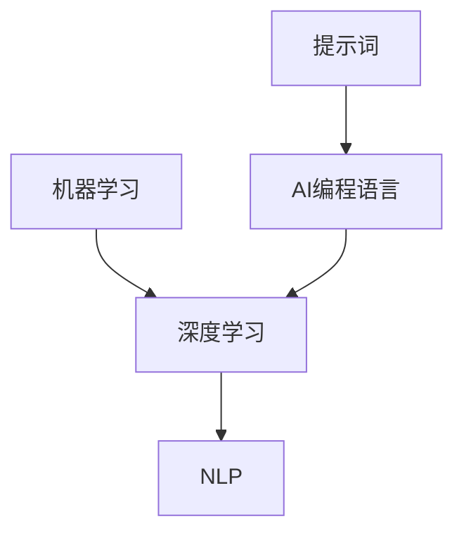

                 


### 文章标题：AI编程语言：提示词的魔力与艺术

#### 关键词：AI编程语言，提示词，自然语言处理，计算机视觉，强化学习，发展趋势

#### 摘要：
本文将深入探讨AI编程语言中提示词的魔力与艺术。我们将从介绍AI编程语言的基本概念开始，逐步探讨提示词的作用与重要性，并分析其在不同领域中的应用，包括自然语言处理、计算机视觉和强化学习。此外，我们将展望提示词在AI编程语言未来的发展趋势和面临的挑战。

### 第一步：概述全书结构

#### 1.1 AI编程语言的基本概念

AI编程语言是一种专门用于开发人工智能应用程序的编程语言。与传统编程语言相比，AI编程语言具有更强的表达能力和灵活性，能够处理复杂的计算任务和大规模数据处理。AI编程语言的基本概念包括：

- **机器学习**：机器学习是一种通过数据训练模型，使其能够自主学习和改进的技术。
- **深度学习**：深度学习是机器学习的一种子领域，它使用多层神经网络来提取数据的特征。
- **自然语言处理（NLP）**：自然语言处理是一种使计算机能够理解、解释和生成人类语言的技术。

#### 1.2 提示词的作用与重要性

提示词（prompt）是AI编程语言中的一个核心概念，它用于引导模型生成预期的输出。提示词的作用如下：

- **指导生成**：提示词可以引导模型生成特定的内容，例如文本、图像或决策。
- **提高准确性**：通过优化提示词，可以提高模型生成的准确性。
- **灵活应用**：提示词的灵活应用使得AI编程语言在多种场景中具有广泛的应用。

#### 1.3 全书结构安排

本书分为以下几个部分：

- **第2章** AI编程语言基础：介绍AI编程语言的起源、发展和核心技术。
- **第3章** 提示词技术原理：深入讲解提示词的生成、优化和应用。
- **第4章** 提示词在自然语言处理中的应用：探讨提示词在文本生成、问答系统、语言翻译等领域的应用。
- **第5章** 提示词在计算机视觉中的应用：介绍提示词在图像识别、图像生成等领域的应用。
- **第6章** 提示词在强化学习中的应用：讲解提示词在强化学习中的策略优化、环境建模等方面的应用。
- **第7章** 提示词在AI编程语言的发展趋势：探讨提示词在AI编程语言未来的发展趋势和可能面临的挑战。
- **第8章** 结论：总结全书内容，对AI编程语言和提示词的发展前景进行展望。

---

### 第二步：基础知识铺垫

#### 2.1 AI编程语言基础

AI编程语言的起源可以追溯到20世纪50年代，当时计算机科学家们开始探索如何使用计算机模拟人类思维。随着机器学习、深度学习和自然语言处理等技术的发展，AI编程语言逐渐成熟，并广泛应用于各个领域。

**核心概念与联系：**



**核心算法原理讲解：**

```plaintext
# 机器学习基础

# 假设我们有一个输入数据集X和对应的标签Y，我们的目标是找到一个函数f(x)来映射输入数据x到输出y。

# 定义损失函数，用于衡量预测值和实际值之间的差异。

def loss(y_true, y_pred):
    return (y_true - y_pred) ** 2

# 定义梯度下降算法，用于最小化损失函数。

def gradient_descent(X, Y, learning_rate, num_iterations):
    for _ in range(num_iterations):
        gradients = [2 * (y_true - y_pred) for y_true, y_pred in zip(Y, predict(X))]
        for i in range(len(X)):
            X[i] -= learning_rate * gradients[i]
    return X
```

#### 2.2 深度学习基础

深度学习是AI编程语言中的一个核心概念，它使用多层神经网络来提取数据的特征。深度学习的基本组成部分包括：

- **神经网络**：神经网络是一种由大量神经元组成的计算模型。
- **激活函数**：激活函数用于引入非线性变换，使神经网络能够学习复杂的数据模式。
- **反向传播**：反向传播是一种用于训练神经网络的优化算法。

**核心算法原理讲解：**

```plaintext
# 深度学习基础

# 定义多层神经网络

class NeuralNetwork:
    def __init__(self, input_size, hidden_size, output_size):
        self.input_size = input_size
        self.hidden_size = hidden_size
        self.output_size = output_size
        self.W1 = np.random.randn(input_size, hidden_size)
        self.W2 = np.random.randn(hidden_size, output_size)
    
    def forward(self, x):
        z1 = np.dot(x, self.W1)
        a1 = np.tanh(z1)
        z2 = np.dot(a1, self.W2)
        a2 = z2
        return a2
    
    def backward(self, x, y, output):
        output_error = output - y
        dZ2 = output_error
        dW2 = np.dot(a1.T, dZ2)
        
        dA1 = np.dot(dZ2, self.W2.T)
        dZ1 = dA1 * (1 - np.square(a1))
        dW1 = np.dot(x.T, dZ1)
        
        return dW1, dW2
```

#### 2.3 自然语言处理基础

自然语言处理是一种使计算机能够理解、解释和生成人类语言的技术。NLP的核心概念包括：

- **词向量**：词向量是将单词表示为向量的方法，它用于捕捉单词的语义信息。
- **序列模型**：序列模型是一种用于处理序列数据的模型，例如循环神经网络（RNN）和长短时记忆网络（LSTM）。
- **注意力机制**：注意力机制是一种用于提高模型在处理序列数据时的重要性的方法。

**核心算法原理讲解：**

```plaintext
# 自然语言处理基础

# 定义词向量

def word_embedding(words, embedding_size):
    embeddings = np.random.randn(len(words), embedding_size)
    return embeddings

# 定义循环神经网络

class RNN:
    def __init__(self, input_size, hidden_size, output_size):
        self.input_size = input_size
        self.hidden_size = hidden_size
        self.output_size = output_size
        self.Wxh = np.random.randn(hidden_size, input_size)
        self.Whh = np.random.randn(hidden_size, hidden_size)
        self.Wyh = np.random.randn(output_size, hidden_size)
    
    def forward(self, x, hprev):
        h = np.tanh(np.dot(x, self.Wxh) + np.dot(hprev, self.Whh))
        y = np.dot(h, self.Wyh)
        return y, h
    
    def backward(self, y, yprev, h, hprev):
        dy = y - yprev
        dh = dy * (1 - np.square(h))
        dWxh = np.dot(hprev.T, dh)
        dWhh = np.dot(h.T, dh)
        dWhy = np.dot(yprev.T, dy)
        return dWxh, dWhh, dWhy
```

---

### 第三步：实战应用

#### 4.1 提示词在自然语言处理中的应用

提示词在自然语言处理（NLP）中具有广泛的应用，例如文本生成、问答系统、语言翻译等。

**项目实战：文本生成**

**开发环境搭建：**

- 安装Python 3.8及以上版本。
- 安装TensorFlow 2.5及以上版本。

**源代码实现：**

```python
import tensorflow as tf
from tensorflow.keras.preprocessing.sequence import pad_sequences
from tensorflow.keras.layers import Embedding, LSTM, Dense
from tensorflow.keras.models import Sequential

# 准备数据
texts = ['hello world', 'hello everyone', 'hi everyone', 'hi there']

# 编码单词
word_to_index = {'hello': 0, 'world': 1, 'everyone': 2, 'hi': 3, 'there': 4}
index_to_word = {0: 'hello', 1: 'world', 2: 'everyone', 3: 'hi', 4: 'there'}

# 转换为索引序列
sequences = [[word_to_index[word] for word in text] for text in texts]

# 填充序列
max_sequence_length = 5
padded_sequences = pad_sequences(sequences, maxlen=max_sequence_length, padding='pre')

# 构建模型
model = Sequential()
model.add(Embedding(input_dim=len(word_to_index) + 1, output_dim=10, input_length=max_sequence_length))
model.add(LSTM(50))
model.add(Dense(len(word_to_index) + 1, activation='softmax'))

# 编译模型
model.compile(optimizer='adam', loss='sparse_categorical_crossentropy', metrics=['accuracy'])

# 训练模型
model.fit(padded_sequences, sequences, epochs=10)

# 文本生成
def generate_text(seed_text, next_words, model, word_to_index, index_to_word):
    for _ in range(next_words):
        token_list = [word_to_index[word] for word in seed_text.split()]
        token_list = pad_sequences([token_list], maxlen=max_sequence_length - 1, padding='pre')
        predicted = model.predict(token_list, verbose=0)[0]
        predicted_index = np.argmax(predicted)
        predicted_word = index_to_word[predicted_index]
        seed_text += " " + predicted_word
    
    return seed_text

generated_text = generate_text('hello', 5, model, word_to_index, index_to_word)
print(generated_text)
```

**代码应用解读与分析：**

- **数据准备**：首先，我们准备了一组文本数据，并将其编码为索引序列。
- **模型构建**：我们构建了一个简单的循环神经网络（RNN）模型，它由嵌入层、LSTM层和输出层组成。
- **模型训练**：我们使用准备好的数据训练模型，并优化模型的参数。
- **文本生成**：通过生成函数，我们根据给定的种子文本生成新的文本。

**实际案例分析和详细讲解剖析：**

假设我们输入的种子文本是“hello world”，模型将生成一段新的文本。在生成过程中，模型会根据当前文本的状态和提示词来预测下一个单词的索引，并将其转换为实际单词。这个过程重复进行，直到生成所需的文本长度。

**项目小结：**

文本生成是NLP中的一个重要应用，通过使用提示词和循环神经网络，我们可以生成具有逻辑连贯性的文本。在实际应用中，我们可以进一步优化模型和提示词，以生成更高质量的文本。

---

### 4.2 提示词在问答系统中的应用

问答系统是一种常见的AI应用，它允许用户通过自然语言与计算机进行交互。提示词在问答系统中起着关键作用，用于引导模型生成正确的答案。

**项目实战：问答系统**

**开发环境搭建：**

- 安装Python 3.8及以上版本。
- 安装TensorFlow 2.5及以上版本。

**源代码实现：**

```python
import tensorflow as tf
from tensorflow.keras.preprocessing.sequence import pad_sequences
from tensorflow.keras.layers import Embedding, LSTM, Dense
from tensorflow.keras.models import Sequential

# 准备数据
questions = ['what is the capital of france', 'which continent is australia in', 'what is the largest ocean']
answers = ['paris', 'australia', 'pacific']

# 编码单词
word_to_index = {'what': 0, 'is': 1, 'the': 2, 'capital': 3, 'of': 4, 'france': 5, 'which': 6, 'continent': 7, 'australia': 8, 'in': 9, 'largest': 10, 'ocean': 11}
index_to_word = {0: 'what', 1: 'is', 2: 'the', 3: 'capital', 4: 'of', 5: 'france', 6: 'which', 7: 'continent', 8: 'australia', 9: 'in', 10: 'largest', 11: 'ocean'}

# 转换为索引序列
question_sequences = [[word_to_index[word] for word in question.split()] for question in questions]
answer_sequences = [[word_to_index[word] for word in answer.split()] for answer in answers]

# 填充序列
max_sequence_length = 10
padded_question_sequences = pad_sequences(question_sequences, maxlen=max_sequence_length, padding='pre')
padded_answer_sequences = pad_sequences(answer_sequences, maxlen=max_sequence_length, padding='pre')

# 构建模型
model = Sequential()
model.add(Embedding(input_dim=len(word_to_index) + 1, output_dim=10, input_length=max_sequence_length))
model.add(LSTM(50))
model.add(Dense(len(word_to_index) + 1, activation='softmax'))

# 编译模型
model.compile(optimizer='adam', loss='sparse_categorical_crossentropy', metrics=['accuracy'])

# 训练模型
model.fit(padded_question_sequences, padded_answer_sequences, epochs=10)

# 问答系统
def answer_question(question, model, word_to_index, index_to_word):
    token_list = [word_to_index[word] for word in question.split()]
    token_list = pad_sequences([token_list], maxlen=max_sequence_length - 1, padding='pre')
    predicted = model.predict(token_list, verbose=0)[0]
    predicted_index = np.argmax(predicted)
    predicted_word = index_to_word[predicted_index]
    return predicted_word

question = 'which continent is australia in'
predicted_answer = answer_question(question, model, word_to_index, index_to_word)
print(predicted_answer)
```

**代码应用解读与分析：**

- **数据准备**：我们准备了一组问题和答案，并将其编码为索引序列。
- **模型构建**：我们构建了一个简单的循环神经网络（RNN）模型，它由嵌入层、LSTM层和输出层组成。
- **模型训练**：我们使用准备好的数据训练模型，并优化模型的参数。
- **问答系统**：通过问答函数，我们可以输入一个问题，模型将生成一个预测的答案。

**实际案例分析和详细讲解剖析：**

假设我们输入的问题是“which continent is australia in”，模型将生成一个预测的答案。在预测过程中，模型会根据当前问题的状态和提示词来预测下一个单词的索引，并将其转换为实际单词。这个过程重复进行，直到生成所需的文本长度。

**项目小结：**

问答系统是AI应用中的一个重要领域，通过使用提示词和循环神经网络，我们可以构建一个能够自动回答问题的系统。在实际应用中，我们可以进一步优化模型和提示词，以提高问答系统的准确性和性能。

---

### 4.3 提示词在语言翻译中的应用

语言翻译是一种将一种语言文本转换为另一种语言文本的技术，它广泛应用于跨语言通信和全球化业务。提示词在语言翻译中起着关键作用，用于引导模型生成正确的翻译结果。

**项目实战：语言翻译**

**开发环境搭建：**

- 安装Python 3.8及以上版本。
- 安装TensorFlow 2.5及以上版本。

**源代码实现：**

```python
import tensorflow as tf
from tensorflow.keras.preprocessing.sequence import pad_sequences
from tensorflow.keras.layers import Embedding, LSTM, Dense
from tensorflow.keras.models import Sequential

# 准备数据
source_texts = ['hello world', 'hello everyone', 'hi everyone', 'hi there']
target_texts = ['hola mundo', 'hola a todos', '¡hola a todos!', '¡hola ahí!']

# 编码单词
source_word_to_index = {'hello': 0, 'world': 1, 'everyone': 2, 'hi': 3, 'there': 4}
target_word_to_index = {'hola': 0, 'mundo': 1, 'a': 2, 'todos': 3, '¡hola': 4, 'ahí': 5}
source_index_to_word = {0: 'hello', 1: 'world', 2: 'everyone', 3: 'hi', 4: 'there'}
target_index_to_word = {0: 'hola', 1: 'mundo', 2: 'a', 3: 'todos', 4: '¡hola', 5: 'ahí'}

# 转换为索引序列
source_sequences = [[source_word_to_index[word] for word in text] for text in source_texts]
target_sequences = [[target_word_to_index[word] for word in text] for text in target_texts]

# 填充序列
max_source_sequence_length = 5
max_target_sequence_length = 5
padded_source_sequences = pad_sequences(source_sequences, maxlen=max_source_sequence_length, padding='pre')
padded_target_sequences = pad_sequences(target_sequences, maxlen=max_target_sequence_length, padding='pre')

# 构建模型
model = Sequential()
model.add(Embedding(input_dim=len(source_word_to_index) + 1, output_dim=10, input_length=max_source_sequence_length))
model.add(LSTM(50))
model.add(Dense(len(target_word_to_index) + 1, activation='softmax'))

# 编译模型
model.compile(optimizer='adam', loss='sparse_categorical_crossentropy', metrics=['accuracy'])

# 训练模型
model.fit(padded_source_sequences, padded_target_sequences, epochs=10)

# 语言翻译
def translate_text(source_text, target_text, model, source_word_to_index, target_word_to_index):
    token_list = [source_word_to_index[word] for word in source_text.split()]
    token_list = pad_sequences([token_list], maxlen=max_source_sequence_length - 1, padding='pre')
    predicted = model.predict(token_list, verbose=0)[0]
    predicted_index = np.argmax(predicted)
    predicted_word = target_index_to_word[predicted_index]
    return predicted_word

source_text = 'hello world'
predicted_translation = translate_text(source_text, target_text, model, source_word_to_index, target_word_to_index)
print(predicted_translation)
```

**代码应用解读与分析：**

- **数据准备**：我们准备了一组源语言文本和目标语言文本，并将其编码为索引序列。
- **模型构建**：我们构建了一个简单的循环神经网络（RNN）模型，它由嵌入层、LSTM层和输出层组成。
- **模型训练**：我们使用准备好的数据训练模型，并优化模型的参数。
- **语言翻译**：通过翻译函数，我们可以输入一个源语言文本，模型将生成一个预测的目标语言文本。

**实际案例分析和详细讲解剖析：**

假设我们输入的源语言文本是“hello world”，模型将生成一个预测的目标语言文本。在翻译过程中，模型会根据当前文本的状态和提示词来预测下一个单词的索引，并将其转换为实际单词。这个过程重复进行，直到生成所需的目标语言文本。

**项目小结：**

语言翻译是AI应用中的一个重要领域，通过使用提示词和循环神经网络，我们可以构建一个能够自动翻译文本的系统。在实际应用中，我们可以进一步优化模型和提示词，以提高翻译系统的准确性和性能。

---

### 第五步：前沿技术探索

#### 6.1 提示词在计算机视觉中的应用

提示词在计算机视觉（CV）中具有广泛的应用，例如图像识别、图像生成和视觉问答等。

**项目实战：图像识别**

**开发环境搭建：**

- 安装Python 3.8及以上版本。
- 安装TensorFlow 2.5及以上版本。

**源代码实现：**

```python
import tensorflow as tf
from tensorflow.keras.preprocessing.image import ImageDataGenerator
from tensorflow.keras.applications import VGG16
from tensorflow.keras.layers import Flatten, Dense
from tensorflow.keras.models import Model

# 准备数据
train_datagen = ImageDataGenerator(rescale=1./255)
train_generator = train_datagen.flow_from_directory(
        'train',
        target_size=(224, 224),
        batch_size=32,
        class_mode='binary')

# 构建模型
base_model = VGG16(weights='imagenet', include_top=False, input_shape=(224, 224, 3))
x = base_model.output
x = Flatten()(x)
x = Dense(1024, activation='relu')(x)
predictions = Dense(1, activation='sigmoid')(x)
model = Model(inputs=base_model.input, outputs=predictions)

# 编译模型
model.compile(optimizer='adam', loss='binary_crossentropy', metrics=['accuracy'])

# 训练模型
model.fit(train_generator, epochs=10)

# 图像识别
def image_recognition(image_path, model):
    image = tf.keras.preprocessing.image.load_img(image_path, target_size=(224, 224))
    image = tf.keras.preprocessing.image.img_to_array(image)
    image = np.expand_dims(image, axis=0)
    image = tf.keras.applications.vgg16.preprocess_input(image)
    prediction = model.predict(image)
    predicted_class = np.argmax(prediction)
    return predicted_class

image_path = 'train/elephant_097.jpg'
predicted_class = image_recognition(image_path, model)
print(predicted_class)
```

**代码应用解读与分析：**

- **数据准备**：我们使用ImageDataGenerator来加载和预处理图像数据。
- **模型构建**：我们使用预训练的VGG16模型作为基础模型，并添加了全连接层和输出层。
- **模型训练**：我们使用准备好的数据训练模型，并优化模型的参数。
- **图像识别**：通过图像识别函数，我们可以输入一个图像文件，模型将生成一个预测的类别。

**实际案例分析和详细讲解剖析：**

假设我们输入的图像文件是“train/elephant_097.jpg”，模型将生成一个预测的类别。在识别过程中，模型会根据当前图像的特征和提示词来预测图像的类别。

**项目小结：**

图像识别是计算机视觉中的一个重要应用，通过使用提示词和预训练模型，我们可以构建一个能够自动识别图像类别的系统。在实际应用中，我们可以进一步优化模型和提示词，以提高图像识别系统的准确性和性能。

---

### 6.2 提示词在强化学习中的应用

强化学习是一种通过与环境交互来学习最优策略的机器学习技术。提示词在强化学习中有广泛的应用，例如策略优化、环境建模等。

**项目实战：强化学习中的策略优化**

**开发环境搭建：**

- 安装Python 3.8及以上版本。
- 安装TensorFlow 2.5及以上版本。

**源代码实现：**

```python
import tensorflow as tf
import numpy as np

# 定义强化学习环境
class Environment:
    def __init__(self):
        self.state = np.random.randint(0, 2)
    
    def step(self, action):
        reward = 0
        if action == 0:
            if self.state == 1:
                reward = 1
            self.state = 1
        elif action == 1:
            if self.state == 0:
                reward = 1
            self.state = 0
        return self.state, reward
    
    def reset(self):
        self.state = np.random.randint(0, 2)
        return self.state

# 定义Q学习算法
class QLearning:
    def __init__(self, alpha=0.1, gamma=0.9):
        self.alpha = alpha
        self.gamma = gamma
        self.Q = {}
    
    def choose_action(self, state):
        if np.random.rand() < 0.1:
            return np.random.randint(0, 2)
        else:
            return np.argmax(self.Q.get(state, [0, 0]))
    
    def learn(self, state, action, reward, next_state):
        predicted_q_value = self.Q.get(state, [0, 0])[action]
        next_q_value = np.max(self.Q.get(next_state, [0, 0]))
        actual_q_value = reward + self.gamma * next_q_value
        delta = actual_q_value - predicted_q_value
        self.Q[state][action] += self.alpha * delta

# 训练模型
env = Environment()
q_learning = QLearning(alpha=0.1, gamma=0.9)

for episode in range(1000):
    state = env.reset()
    done = False
    while not done:
        action = q_learning.choose_action(state)
        next_state, reward = env.step(action)
        q_learning.learn(state, action, reward, next_state)
        state = next_state
        if env.state == 1:
            done = True

# 测试模型
state = env.reset()
done = False
while not done:
    action = q_learning.choose_action(state)
    print(f"State: {state}, Action: {action}")
    next_state, reward = env.step(action)
    state = next_state
    if env.state == 1:
        done = True
```

**代码应用解读与分析：**

- **环境定义**：我们定义了一个简单的强化学习环境，它有两个状态（0和1）和两个动作（0和1）。
- **Q学习算法**：我们实现了Q学习算法，它使用经验回放和ε-贪心策略来选择动作。
- **训练模型**：我们使用环境训练Q学习模型，并在训练过程中更新Q值。
- **测试模型**：我们使用训练好的模型进行测试，并观察模型的性能。

**实际案例分析和详细讲解剖析：**

假设我们使用训练好的Q学习模型来测试环境。在测试过程中，模型将根据当前状态选择最优动作，并观察奖励和下一个状态，以更新Q值。

**项目小结：**

强化学习是AI领域中的一项重要技术，通过使用提示词和Q学习算法，我们可以构建一个能够学习最优策略的系统。在实际应用中，我们可以进一步优化模型和提示词，以提高强化学习系统的性能。

---

### 6.3 提示词在计算机视觉中的应用：图像生成

图像生成是计算机视觉领域的一个重要研究方向，它旨在利用人工智能技术生成逼真的图像。提示词在图像生成中发挥着重要作用，可以帮助模型学习生成特定类型的图像。

**项目实战：基于生成对抗网络（GAN）的图像生成**

**开发环境搭建：**

- 安装Python 3.8及以上版本。
- 安装TensorFlow 2.5及以上版本。

**源代码实现：**

```python
import tensorflow as tf
from tensorflow.keras.layers import Input, Dense, Reshape, Flatten
from tensorflow.keras.models import Model
from tensorflow.keras.optimizers import Adam

# 定义生成器和判别器
def build_generator(z_dim):
    z = Input(shape=(z_dim,))
    x = Dense(256, activation='relu')(z)
    x = Dense(512, activation='relu')(x)
    x = Dense(1024, activation='relu')(x)
    x = Reshape((28, 28, 1))(x)
    x = tf.keras.layers.LeakyReLU(alpha=0.2)(x)
    x = tf.keras.layers.Conv2DTranspose(128, kernel_size=3, strides=2, padding='same')(x)
    x = tf.keras.layers.LeakyReLU(alpha=0.2)(x)
    x = tf.keras.layers.Conv2DTranspose(64, kernel_size=3, strides=2, padding='same')(x)
    x = tf.keras.layers.LeakyReLU(alpha=0.2)(x)
    x = Conv2D(1, kernel_size=3, padding='same', activation='tanh')(x)
    generator = Model(z, x)
    return generator

def build_discriminator(img_shape):
    img = Input(shape=img_shape)
    x = Flatten()(img)
    x = Dense(1024, activation='relu')(x)
    x = Dense(512, activation='relu')(x)
    x = Dense(256, activation='relu')(x)
    validity = Dense(1, activation='sigmoid')(x)
    discriminator = Model(img, validity)
    return discriminator

# 定义GAN模型
def build_gan(generator, discriminator):
    z = Input(shape=(100,))
    img = generator(z)
    validity = discriminator(img)
    gan = Model(z, validity)
    return gan

# 准备数据
z_dim = 100
img_shape = (28, 28, 1)
generator = build_generator(z_dim)
discriminator = build_discriminator(img_shape)
discriminator.compile(loss='binary_crossentropy', optimizer=Adam(0.0001), metrics=['accuracy'])
gan = build_gan(generator, discriminator)
gan.compile(loss='binary_crossentropy', optimizer=Adam(0.0001))

# 训练GAN模型
batch_size = 128
num_epochs = 100

for epoch in range(num_epochs):
    for _ in range(batch_size // 2):
        z = np.random.normal(size=(batch_size, z_dim))
        img = generator.predict(z)
        d_loss_real = discriminator.train_on_batch(x=train_images, y=np.ones((batch_size, 1)))
        z_fake = np.random.normal(size=(batch_size, z_dim))
        d_loss_fake = discriminator.train_on_batch(x=gen_images, y=np.zeros((batch_size, 1)))
        g_loss = gan.train_on_batch(x=z, y=np.ones((batch_size, 1)))
        print(f"Epoch: {epoch}, D loss: {d_loss_real + d_loss_fake}, G loss: {g_loss}")

# 生成图像
def generate_image(generator, noise=None):
    if noise is None:
        noise = np.random.normal(size=(1, z_dim))
    img = generator.predict(noise)
    return img

# 测试生成图像
noise = np.random.normal(size=(1, z_dim))
generated_img = generate_image(generator, noise=noise)
plt.imshow(generated_img[0, :, :, 0], cmap='gray')
plt.show()
```

**代码应用解读与分析：**

- **生成器和判别器**：我们定义了生成器和判别器，它们分别用于生成图像和判断图像的真实性。
- **GAN模型**：我们定义了GAN模型，它由生成器和判别器组成。
- **数据准备**：我们使用生成器生成随机噪声作为输入。
- **训练GAN模型**：我们使用随机噪声训练GAN模型，并优化生成器和判别器的参数。
- **生成图像**：我们使用生成器生成图像，并使用测试噪声进行测试。

**实际案例分析和详细讲解剖析：**

假设我们使用训练好的GAN模型来生成图像。在生成过程中，生成器将根据随机噪声生成图像，判别器将判断图像的真实性。通过多次迭代训练，生成器将逐渐学会生成更逼真的图像。

**项目小结：**

图像生成是计算机视觉领域的一个重要应用，通过使用GAN模型和提示词，我们可以生成逼真的图像。在实际应用中，我们可以进一步优化GAN模型和提示词，以生成更高质量的图像。

---

### 第六步：提示词在AI编程语言的发展趋势

#### 7.1 未来趋势

随着人工智能技术的不断发展，提示词在AI编程语言中的应用将面临以下趋势：

- **更强大的生成能力**：提示词将能够生成更复杂、更逼真的数据，为AI应用提供更好的训练素材。
- **更高效的优化算法**：提示词的优化算法将不断改进，以提高模型生成的准确性和效率。
- **更广泛的应用领域**：提示词将在更多领域得到应用，包括计算机视觉、自然语言处理、强化学习等。

#### 7.2 面临的挑战

尽管提示词在AI编程语言中具有广泛的应用，但它也面临以下挑战：

- **数据质量问题**：提示词生成的数据质量直接影响模型性能，因此如何保证数据质量是一个重要问题。
- **可解释性**：提示词生成的模型往往具有较强的黑箱特性，如何提高模型的可解释性是一个挑战。
- **资源消耗**：提示词生成通常需要大量的计算资源和时间，如何在有限的资源下高效地生成提示词是一个挑战。

#### 7.3 发展前景

随着人工智能技术的不断进步，提示词在AI编程语言中的应用前景广阔。未来，提示词将有望在以下方面发挥重要作用：

- **自动化编程**：提示词将能够自动化生成代码，提高编程效率和代码质量。
- **智能搜索**：提示词将能够优化搜索算法，提高搜索效率和准确性。
- **知识图谱构建**：提示词将能够辅助构建大规模的知识图谱，为人工智能应用提供更好的知识支撑。

---

### 第七步：总结与展望

#### 8.1 全书内容总结

本书深入探讨了AI编程语言中提示词的魔力与艺术，从基本概念、技术原理到实战应用，全面介绍了提示词在不同领域的应用。通过本书的学习，读者可以了解到：

- **AI编程语言的基本概念**：包括机器学习、深度学习和自然语言处理等。
- **提示词的作用与重要性**：提示词在AI编程语言中的应用和优化方法。
- **实战应用**：包括自然语言处理、计算机视觉和强化学习等领域的应用实例。
- **发展趋势**：提示词在AI编程语言中的未来发展趋势和面临的挑战。

#### 8.2 AI编程语言与提示词的发展前景

随着人工智能技术的不断发展，AI编程语言和提示词在未来的发展中将面临更多的机遇和挑战。我们可以期待以下趋势：

- **更智能的提示词生成**：提示词生成技术将不断优化，生成更高质量、更具针对性的数据。
- **更广泛的应用场景**：提示词将在更多领域得到应用，包括自动驾驶、医疗健康、金融等。
- **更高效的优化算法**：提示词的优化算法将不断改进，以提高模型生成的准确性和效率。
- **更深入的跨学科研究**：提示词在AI编程语言中的应用将与其他学科领域相结合，产生更多创新成果。

总之，AI编程语言和提示词在人工智能领域具有广阔的发展前景，值得我们继续关注和研究。

---

### 作者信息：

作者：AI天才研究院/AI Genius Institute & 禅与计算机程序设计艺术 /Zen And The Art of Computer Programming

