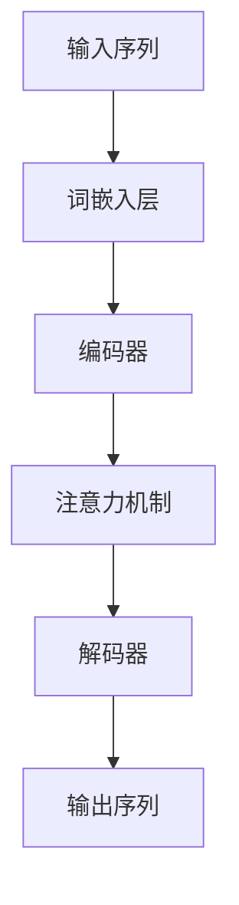
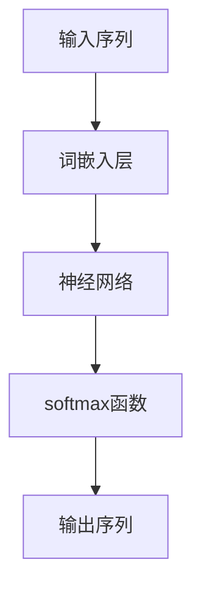
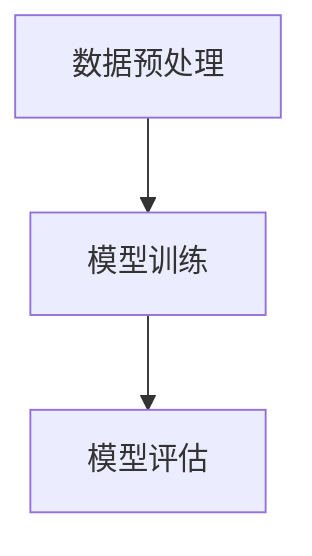
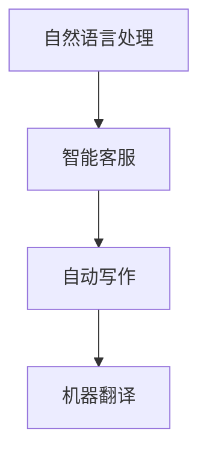
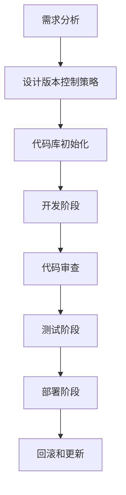
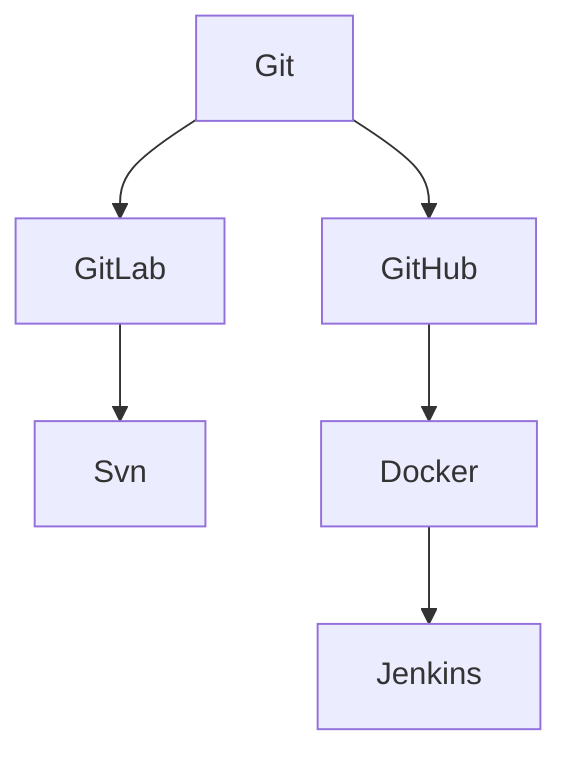
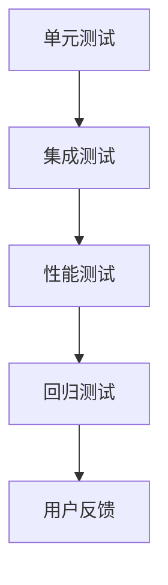
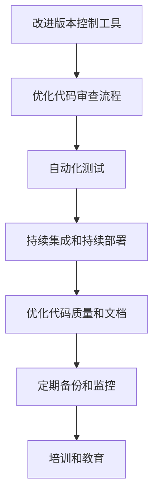

                 


### 引言

在当今快速发展的信息技术领域，人工智能（AI）已经成为推动产业变革的重要力量。特别是AI语言模型，凭借其强大的文本生成和语义理解能力，广泛应用于自然语言处理（NLP）、智能客服、自动写作、翻译等多个领域。然而，随着AI语言模型的广泛应用，如何有效地管理提示词版本成为了一个不容忽视的问题。

提示词版本管理是指在开发、部署和维护AI语言模型过程中，对模型输入的提示词进行版本控制和管理的一系列活动。良好的提示词版本管理不仅能够确保模型的稳定性和性能，还能提高开发效率和团队协作。因此，本文将深入探讨AI语言模型的提示词版本管理最佳实践，帮助读者了解和掌握这一重要技术。

本文结构如下：

- **第一部分**：AI语言模型基础，包括AI语言模型的发展历程、基本原理以及提示词版本管理基础。
- **第二部分**：AI语言模型提示词版本管理实践，涵盖实践框架、优化方法以及案例分析。
- **第三部分**：AI语言模型提示词版本管理的发展趋势，探讨未来发展方向和技术趋势。

### 关键词

- AI语言模型
- 提示词版本管理
- 版本控制
- 版本优化
- 案例分析
- 发展趋势

### 摘要

本文旨在为读者提供一份全面的AI语言模型提示词版本管理最佳实践指南。通过对AI语言模型的基础知识进行介绍，本文分析了提示词版本管理的核心概念和挑战，并提出了具体的实践框架和优化方法。此外，通过多个实际案例的分析，本文展示了提示词版本管理在AI语言模型开发中的应用，并探讨了未来的发展方向。希望本文能够帮助读者更好地理解和应用提示词版本管理技术。

### 第一部分：AI语言模型基础

#### 第1章：AI语言模型概述

##### 1.1 AI语言模型的发展历程

人工智能语言模型的发展可以追溯到20世纪50年代，当时计算机科学家开始探索如何使计算机理解人类语言。早期的研究主要集中在基于规则的系统上，这些系统通过编码大量的语法和语义规则来解析文本。然而，这种方法的局限性很快显现出来，因为人类语言的复杂性和多样性远远超出了规则编码的能力范围。

到了20世纪80年代，统计语言模型开始兴起。统计模型通过分析大量语料库中的文本数据，使用概率方法来预测下一个单词或词组。这一时期的代表性工作包括N-gram模型和决策树模型。这些模型在处理简单文本任务上表现出了一定的效果，但在应对长文本和复杂语义问题时仍然存在不足。

20世纪90年代，基于规则的模型和统计模型相结合，产生了概率上下文无关文法（PCFG）等更加复杂的模型。这些模型通过结合语法和统计方法，试图更好地捕捉语言的深层结构。然而，由于语法规则的复杂性和可扩展性问题，这些模型在处理大规模数据时仍然面临挑战。

进入21世纪，随着深度学习技术的突破，神经网络模型在自然语言处理领域得到了广泛应用。2003年，深度置信网络（DBN）被引入到语言模型中，标志着深度学习在语言建模领域的首次成功应用。随后，2013年，基于卷积神经网络（CNN）和递归神经网络（RNN）的语言模型相继出现，并在多个NLP任务上取得了显著成果。

近年来，基于Transformer的模型，如BERT、GPT等，成为了语言模型的代表。这些模型通过引入注意力机制和大规模预训练，使得语言模型的性能得到了大幅提升。特别是GPT-3的发布，展示了人工智能语言模型在生成和理解自然语言方面的巨大潜力。

##### 1.2 AI语言模型的核心概念

AI语言模型的核心概念主要包括以下几个方面：

- **词汇表**：词汇表是语言模型的基础，它包含了模型所能理解和处理的词汇。词汇表的规模和覆盖范围直接影响到模型的性能和应用场景。

- **输入序列**：输入序列是指模型接收到的文本数据。在训练阶段，输入序列通常是一段一段的文本，在预测阶段，输入序列通常是单个单词或词组。

- **输出序列**：输出序列是模型生成的文本。在训练阶段，输出序列通常与输入序列相同，在预测阶段，输出序列是根据输入序列预测得到的下一个单词或词组。

- **概率分布**：语言模型的目标是预测下一个单词或词组的概率分布。通过计算输入序列的概率分布，模型可以生成文本。

- **注意力机制**：注意力机制是现代语言模型的关键技术，它使得模型能够关注输入序列中的不同部分，从而提高生成文本的质量和连贯性。

##### Mermaid流程图

以下是AI语言模型的基本原理流程图：



##### 1.3 AI语言模型的数学基础

AI语言模型的数学基础主要包括词嵌入、神经网络和概率分布等概念。

- **词嵌入**：词嵌入是将词汇表中的单词映射到高维空间中的一个向量。通过词嵌入，模型可以学习到单词之间的语义关系和相似性。

- **神经网络**：神经网络是语言模型的核心组成部分，它通过多层非线性变换来学习输入和输出之间的关系。在语言模型中，神经网络通常包括输入层、隐藏层和输出层。

- **概率分布**：概率分布是语言模型预测的核心，它用于计算下一个单词或词组的概率。在神经网络中，概率分布通常通过softmax函数来计算。

以下是AI语言模型的数学模型示意图：



##### 1.4 AI语言模型的构建方法

AI语言模型的构建方法主要包括数据预处理、模型训练和模型评估等步骤。

- **数据预处理**：数据预处理是模型构建的第一步，它包括文本清洗、分词、词性标注等操作。通过数据预处理，模型可以更好地理解文本数据。

- **模型训练**：模型训练是语言模型构建的核心环节，它通过优化神经网络的参数来提高模型的性能。常见的训练方法包括反向传播和梯度下降。

- **模型评估**：模型评估是检验模型性能的重要步骤，它通过评估指标如准确性、召回率、F1分数等来评估模型的性能。

以下是AI语言模型构建方法的流程图：



##### 1.5 AI语言模型的应用场景

AI语言模型的应用场景非常广泛，包括但不限于以下领域：

- **自然语言处理（NLP）**：AI语言模型在NLP任务中发挥着重要作用，如文本分类、情感分析、命名实体识别等。

- **智能客服**：AI语言模型可以用于构建智能客服系统，实现自然语言交互，提高客户服务质量。

- **自动写作**：AI语言模型可以生成文章、报告、邮件等文本内容，提高写作效率。

- **机器翻译**：AI语言模型在机器翻译任务中具有显著优势，可以实现高质量的跨语言文本转换。

以下是AI语言模型应用场景的示意图：



#### 第2章：AI语言模型的基本原理

##### 2.1 语言模型的数学基础

语言模型的数学基础主要包括词嵌入、神经网络和概率分布等概念。

- **词嵌入**：词嵌入是将词汇表中的单词映射到高维空间中的一个向量。词嵌入可以通过矩阵乘法来实现，公式如下：

  $$ 
  \text{word\_embedding} = W * \text{word}
  $$

  其中，\(W\) 是词嵌入矩阵，\(\text{word}\) 是单词向量。

- **神经网络**：神经网络是语言模型的核心组成部分，它通过多层非线性变换来学习输入和输出之间的关系。神经网络通常包括输入层、隐藏层和输出层。输入层接收输入序列，隐藏层通过非线性激活函数处理输入，输出层生成输出序列。

  神经网络的计算过程可以表示为：

  $$
  \text{hidden\_layer} = \text{activation}(\text{weights} * \text{input} + \text{bias})
  $$

  其中，\(\text{weights}\) 是权重矩阵，\(\text{bias}\) 是偏置项，\(\text{activation}\) 是激活函数。

- **概率分布**：概率分布是语言模型预测的核心，它用于计算下一个单词或词组的概率。在神经网络中，概率分布通常通过softmax函数来计算。

  softmax函数的计算过程可以表示为：

  $$
  P(\text{word}_i | \text{context}) = \frac{e^{z_i}}{\sum_{j} e^{z_j}}
  $$

  其中，\(z_i\) 是第 \(i\) 个单词的输出值，\(P(\text{word}_i | \text{context})\) 是第 \(i\) 个单词在给定上下文下的概率。

##### 2.2 语言模型的构建方法

语言模型的构建方法主要包括数据预处理、模型训练和模型评估等步骤。

- **数据预处理**：数据预处理是模型构建的第一步，它包括文本清洗、分词、词性标注等操作。文本清洗可以去除文本中的噪声，如HTML标签、特殊字符等。分词是将文本分割成单词或词组的过程，词性标注是将单词标注为名词、动词、形容词等。

- **模型训练**：模型训练是语言模型构建的核心环节，它通过优化神经网络的参数来提高模型的性能。常见的训练方法包括反向传播和梯度下降。

  反向传播算法的步骤如下：

  1. 前向传播：计算输入序列的输出。
  2. 计算损失函数：计算模型输出和真实值之间的差距。
  3. 反向传播：计算梯度，更新模型参数。

  梯度下降算法的步骤如下：

  1. 计算损失函数。
  2. 计算梯度。
  3. 更新模型参数。

- **模型评估**：模型评估是检验模型性能的重要步骤，它通过评估指标如准确性、召回率、F1分数等来评估模型的性能。

  准确性（Accuracy）的计算公式如下：

  $$
  \text{Accuracy} = \frac{\text{预测正确的样本数}}{\text{总样本数}}
  $$

  召回率（Recall）的计算公式如下：

  $$
  \text{Recall} = \frac{\text{预测正确的正样本数}}{\text{总正样本数}}
  $$

  F1分数（F1 Score）的计算公式如下：

  $$
  \text{F1 Score} = 2 \times \frac{\text{Precision} \times \text{Recall}}{\text{Precision} + \text{Recall}}
  $$

##### 2.3 语言模型在AI语言模型中的应用

语言模型在AI语言模型中的应用主要体现在以下几个方面：

- **文本生成**：语言模型可以生成高质量的文本内容，如文章、报告、邮件等。通过预训练和微调，语言模型可以适应不同的应用场景和文本风格。

- **文本分类**：语言模型可以用于文本分类任务，如新闻分类、情感分析等。通过计算文本特征和类别的概率分布，语言模型可以预测文本的类别。

- **命名实体识别**：语言模型可以用于命名实体识别任务，如人名识别、地名识别等。通过分析文本上下文，语言模型可以识别出文本中的命名实体。

- **机器翻译**：语言模型可以用于机器翻译任务，如英语到中文的翻译。通过训练双语语料库，语言模型可以生成高质量的翻译文本。

##### 2.4 举例说明

以下是一个简单的语言模型例子，该模型用于预测下一个单词。

```python
# 输入序列
input_sequence = "今天天气"

# 词汇表
vocab = ["今天", "天气", "很好", "热", "冷"]

# 词嵌入矩阵
word_embedding_matrix = [
    [0.1, 0.2, 0.3],
    [0.4, 0.5, 0.6],
    [0.7, 0.8, 0.9],
    [1.0, 1.1, 1.2],
    [1.3, 1.4, 1.5]
]

# 神经网络参数
weights = [0.1, 0.2, 0.3]
bias = 0.4

# 前向传播
hidden_layer = activation(weights * input_sequence + bias)

# 计算概率分布
probability_distribution = softmax(hidden_layer)

# 预测下一个单词
predicted_word = vocab[predicted_index]

# 输出结果
print(predicted_word)
```

在这个例子中，输入序列是一个长度为3的向量，词嵌入矩阵是一个5x3的矩阵，神经网络参数是一个3个元素的向量，激活函数是一个简单的线性函数。通过前向传播，模型计算出隐藏层的输出，并通过softmax函数得到概率分布。最后，模型根据概率分布预测出下一个单词。

#### 第3章：提示词版本管理基础

##### 3.1 提示词版本管理的概念

提示词版本管理是指在开发、部署和维护AI语言模型过程中，对模型输入的提示词进行版本控制和管理的一系列活动。它涉及到提示词的添加、删除、修改以及版本号的维护等操作。良好的提示词版本管理能够确保模型的稳定性和性能，提高开发效率和团队协作。

提示词版本管理的主要目标包括：

- **确保模型性能**：通过控制提示词的版本，确保模型在部署时能够保持稳定和高效的性能。
- **提高开发效率**：通过版本管理，减少因提示词修改导致的模型中断和调试时间，提高开发效率。
- **便于团队协作**：提供明确的版本控制，使团队能够更好地协作，避免因版本冲突导致的错误。
- **便于回滚和更新**：在模型出现问题时，能够快速回滚到之前的稳定版本，或逐步更新到新版本。

##### 3.2 提示词版本管理的挑战

在AI语言模型开发过程中，提示词版本管理面临以下挑战：

- **版本冲突**：当多个开发者在同一时间修改提示词时，可能会出现版本冲突，导致模型性能下降或产生错误。
- **版本回滚**：在某个版本出现问题时，需要能够快速回滚到之前的稳定版本，这需要完善的版本控制机制。
- **版本跟踪**：需要对每个版本的提示词进行详细的记录和追踪，以便在出现问题时能够快速定位到具体的原因。
- **性能优化**：在版本管理过程中，需要确保每次修改都能带来性能的提升，而不是引入新的问题。
- **数据安全**：在版本管理过程中，需要确保数据的安全性和完整性，避免数据丢失或损坏。

##### 3.3 提示词版本管理的策略

为了应对上述挑战，提示词版本管理可以采取以下策略：

- **版本控制工具**：使用成熟的版本控制工具（如Git）来管理提示词的版本，确保版本的历史记录清晰可查。
- **规范命名和注释**：为每个版本提示词提供明确的命名和注释，以便在需要时快速理解和回滚。
- **定期备份**：定期备份当前版本的提示词，以便在出现问题时快速恢复。
- **版本差异比较**：使用版本差异比较工具来比较不同版本的提示词，确保每次修改都符合预期。
- **自动化测试**：在版本发布前进行自动化测试，确保新版本的提示词不会引入新的错误。
- **性能监控**：持续监控模型的性能，及时发现并解决性能问题。

##### 3.4 提示词版本管理的最佳实践

以下是提示词版本管理的最佳实践：

1. **制定版本控制策略**：根据团队规模和项目需求，制定合适的版本控制策略，明确版本命名规则和发布流程。
2. **规范代码和文档**：确保代码和文档的规范，避免因代码风格不一致或文档缺失导致的版本冲突。
3. **定期同步**：定期同步代码库，确保所有开发者都能访问到最新版本的提示词。
4. **代码审查**：在提交修改前进行代码审查，确保修改符合预期，避免引入错误。
5. **持续集成和部署**：采用持续集成和部署（CI/CD）流程，自动化构建、测试和部署，提高开发效率和稳定性。
6. **文档记录**：详细记录每次版本的修改内容和原因，便于后续的回滚和追踪。

通过遵循上述最佳实践，可以有效地管理提示词版本，提高AI语言模型的开发效率和稳定性。

---

### 第二部分：AI语言模型提示词版本管理实践

#### 第4章：AI语言模型提示词版本管理的实践框架

##### 4.1 提示词版本管理的流程

提示词版本管理的流程可以分为以下步骤：

1. **需求分析**：分析项目需求，确定需要管理和控制的提示词。
2. **设计版本控制策略**：根据项目需求和团队规模，设计合适的版本控制策略，包括版本命名规则、发布流程等。
3. **代码库初始化**：初始化版本控制代码库，并为每个开发者分配权限。
4. **开发阶段**：在开发阶段，开发者根据需求对提示词进行修改和添加，并使用版本控制工具进行版本管理。
5. **代码审查**：在提交代码前进行代码审查，确保修改符合预期，避免引入错误。
6. **测试阶段**：在测试阶段，对修改后的提示词进行自动化测试，确保新版本不会引入新的错误。
7. **部署阶段**：将经过测试的提示词版本部署到生产环境中，并进行监控和性能评估。
8. **回滚和更新**：在出现问题时，根据记录和监控数据，回滚到之前的稳定版本或更新到新版本。

以下是提示词版本管理流程的示意图：



##### 4.2 提示词版本管理的工具

在提示词版本管理中，可以使用多种工具来帮助开发者高效地管理版本。以下是几种常用的工具：

1. **Git**：Git是一个分布式版本控制工具，广泛应用于开源项目和商业项目。它支持分布式工作流程，允许开发者独立工作，并在需要时合并代码。Git的核心功能包括提交、分支、合并和冲突解决。

2. **GitHub**：GitHub是一个基于Git的开源版本控制系统，提供Web界面和丰富的协作功能。GitHub支持多人协作，提供代码审查、issue跟踪和分支管理等功能。

3. **GitLab**：GitLab是一个自托管的Git服务，支持私有项目和开源项目。GitLab提供与GitHub类似的功能，包括代码审查、持续集成和部署。

4. **Svn**：Svn是一个集中式版本控制系统，与Git类似，但操作相对简单。Svn适用于小型团队和单机环境。

5. **Docker**：Docker是一个容器化技术，用于构建、运行和分发应用程序。Docker可以将应用程序及其依赖项打包到一个容器中，确保在开发、测试和部署环境之间的一致性。

6. **Jenkins**：Jenkins是一个开源持续集成工具，用于自动化构建、测试和部署应用程序。Jenkins可以与Git和其他版本控制工具集成，实现自动化版本管理和部署。

以下是提示词版本管理工具的示意图：



##### 4.3 提示词版本管理的质量评估

提示词版本管理的质量评估是确保模型性能和稳定性的关键步骤。以下是几种常用的质量评估方法：

1. **单元测试**：单元测试是针对提示词版本的单个功能进行测试，确保其正常运行。单元测试通常包括输入测试、输出测试和错误处理测试。

2. **集成测试**：集成测试是针对提示词版本与其他系统组件的集成进行测试，确保其在整体系统中的正常运行。集成测试通常包括功能测试、性能测试和安全测试。

3. **性能测试**：性能测试是评估提示词版本在处理大规模数据时的性能，包括响应时间、吞吐量和资源消耗等指标。性能测试可以帮助识别瓶颈和优化机会。

4. **回归测试**：回归测试是在每次版本更新后进行的测试，确保新版本不会引入新的错误。回归测试通常包括对旧版本的测试用例进行重测。

5. **用户反馈**：用户反馈是评估提示词版本质量的重要来源。通过收集和分析用户反馈，可以了解用户的使用体验和满意度，发现潜在的问题和改进点。

以下是提示词版本管理质量评估的示意图：



##### 4.4 提示词版本管理的最佳实践

以下是提示词版本管理的最佳实践：

1. **明确版本控制策略**：制定明确的版本控制策略，包括版本命名规则、发布流程和回滚策略。
2. **规范代码和文档**：确保代码和文档的规范，避免因代码风格不一致或文档缺失导致的版本冲突。
3. **定期备份**：定期备份当前版本的提示词，确保在出现问题时可以快速恢复。
4. **代码审查**：在提交代码前进行代码审查，确保修改符合预期，避免引入错误。
5. **自动化测试**：在版本发布前进行自动化测试，确保新版本的提示词不会引入新的错误。
6. **持续集成和部署**：采用持续集成和部署（CI/CD）流程，自动化构建、测试和部署，提高开发效率和稳定性。
7. **文档记录**：详细记录每次版本的修改内容和原因，便于后续的回滚和追踪。

通过遵循上述最佳实践，可以有效地管理提示词版本，提高AI语言模型的开发效率和稳定性。

---

### 第5章：AI语言模型提示词版本管理的优化

##### 5.1 提示词版本管理的优化目标

在AI语言模型开发过程中，提示词版本管理的优化目标是提高开发效率和模型性能，同时确保系统的稳定性和可靠性。具体来说，优化目标包括：

- **提高开发效率**：减少因版本冲突、回滚和测试导致的开发中断时间，提高团队的协作效率。
- **提升模型性能**：通过优化提示词版本，提高模型的预测准确性和响应速度。
- **确保系统稳定性**：在版本更新过程中，确保系统不会出现故障或性能下降。
- **简化维护成本**：通过优化版本管理流程和工具，降低维护成本和复杂度。
- **提升用户体验**：确保用户在使用过程中不会因为版本问题而遇到困扰，提升用户满意度。

##### 5.2 提示词版本管理的优化方法

为了实现上述优化目标，可以采取以下优化方法：

1. **改进版本控制工具**：选择适合团队和项目的版本控制工具，并优化其配置和使用方法。例如，可以配置Git的分支策略、合并策略和冲突解决策略，以提高版本控制的效率和稳定性。

2. **优化代码审查流程**：改进代码审查流程，提高代码审查的质量和效率。例如，可以采用自动化代码审查工具，减少人工审查的工作量，提高审查的准确性。

3. **自动化测试**：建立完善的自动化测试体系，包括单元测试、集成测试、性能测试和回归测试等。通过自动化测试，可以快速发现和解决版本更新带来的问题，提高版本管理的可靠性。

4. **持续集成和持续部署**：采用持续集成（CI）和持续部署（CD）流程，自动化构建、测试和部署应用程序。CI/CD流程可以提高开发效率和稳定性，减少人工干预，降低出错概率。

5. **优化代码质量和文档**：通过改进代码质量和编写规范的文档，降低版本冲突和误解，提高版本管理的效率。

6. **定期备份和监控**：定期备份提示词版本，并在关键节点进行监控，确保系统在出现问题时可以快速恢复。例如，可以配置备份策略、监控告警和故障恢复计划。

7. **培训和教育**：对团队成员进行版本管理工具和最佳实践的培训，提高团队的版本管理能力和协作效率。

以下是提示词版本管理优化方法的示意图：



##### 5.3 提示词版本管理的优化实践

为了更好地理解提示词版本管理的优化实践，以下是一个具体的案例：

**案例：企业级AI语言模型提示词版本管理优化**

1. **背景**：

某企业正在开发一个基于AI语言模型的智能客服系统，该项目涉及到大量的提示词版本管理和维护工作。在项目初期，团队使用Git进行版本控制，但遇到了以下问题：

- 版本冲突频繁：由于多个开发者在同一时间修改提示词，版本冲突问题频繁发生，导致开发中断和调试时间增加。
- 代码审查效率低：代码审查流程相对复杂，人工审查工作量较大，且存在漏审和误审的风险。
- 缺乏自动化测试：版本更新后，缺乏全面的自动化测试，导致在部署时出现未知问题。

2. **优化措施**：

为了解决上述问题，团队采取了一系列优化措施：

- **改进Git配置**：优化Git分支策略和合并策略，减少版本冲突的发生。例如，采用“主分支+功能分支”模式，每个功能分支独立开发、测试和合并，减少代码合并时的冲突。

- **引入自动化代码审查工具**：引入自动化代码审查工具，如SonarQube，对代码进行静态分析，提高代码质量。通过自动化代码审查，减少人工审查的工作量，提高审查的准确性。

- **建立自动化测试体系**：建立自动化测试体系，包括单元测试、集成测试、性能测试和回归测试等。通过自动化测试，确保每次版本更新都不会引入新的错误，提高系统的稳定性。

- **采用CI/CD流程**：采用持续集成（CI）和持续部署（CD）流程，实现自动化构建、测试和部署。通过CI/CD流程，减少人工干预，提高开发效率和稳定性。

- **定期备份和监控**：定期备份提示词版本，并配置监控告警和故障恢复计划，确保在出现问题时可以快速恢复。

- **培训和教育**：对团队成员进行Git、自动化测试和CI/CD工具的培训，提高团队的版本管理能力和协作效率。

3. **效果**：

通过采取上述优化措施，团队在提示词版本管理方面取得了显著成效：

- 版本冲突频率降低：由于Git分支策略的优化，版本冲突频率显著降低，开发中断和调试时间减少。
- 代码审查效率提高：自动化代码审查工具的应用，提高了代码审查的效率和质量，减少了人工审查的工作量。
- 自动化测试覆盖范围扩大：自动化测试体系的建立，扩大了测试覆盖范围，确保每次版本更新都不会引入新的错误。
- 系统稳定性提高：通过CI/CD流程和定期备份，系统稳定性得到提高，故障恢复时间缩短。
- 团队协作效率提升：团队成员的版本管理能力和协作效率得到提升，项目进展更加顺利。

---

### 第6章：AI语言模型提示词版本管理的案例分析

#### 6.1 案例一：企业级AI语言模型提示词版本管理实践

某企业级AI语言模型项目涉及智能客服系统，需要管理大量的提示词版本。以下是该项目的提示词版本管理实践：

1. **背景**：

该企业级AI语言模型项目旨在为企业客户提供智能客服解决方案，处理客户咨询、投诉等事项。项目需求多样，涉及大量自然语言理解和文本生成任务，需要对提示词进行精细管理。

2. **实践步骤**：

- **制定版本控制策略**：根据项目需求，制定明确的版本控制策略，包括版本命名规则（如V1.0、V1.1等）和发布流程（如测试、上线等）。

- **初始化代码库**：使用Git初始化代码库，为每个开发者和测试人员分配权限。

- **开发阶段**：开发人员根据需求修改提示词，并使用Git进行版本管理。每次修改后，提交代码并添加相应注释，说明修改内容和目的。

- **代码审查**：提交代码前，进行代码审查，确保修改符合预期，避免引入错误。审查通过后，合并代码到主分支。

- **测试阶段**：在测试环境中部署最新版本的提示词，进行功能测试、性能测试和回归测试，确保新版本无缺陷。

- **部署阶段**：将经过测试的提示词版本部署到生产环境中。同时，监控系统性能，确保版本更新后的稳定性。

- **备份和监控**：定期备份生产环境中的提示词版本，并配置监控系统，及时发现和解决问题。

3. **效果**：

通过上述实践，项目在提示词版本管理方面取得了显著效果：

- 版本冲突减少：由于明确的版本控制策略和代码审查机制，版本冲突显著减少，开发效率提高。

- 稳定性提高：通过自动化测试和备份策略，系统稳定性得到保障，故障率降低。

- 协作效率提升：团队协作更加顺畅，成员间的沟通和协作更加高效。

#### 6.2 案例二：AI语言模型在智能客服中的应用

某企业应用AI语言模型构建智能客服系统，以下是该案例的提示词版本管理实践：

1. **背景**：

该企业致力于提供高质量的客户服务，通过AI语言模型构建智能客服系统，以自动回答客户常见问题，提高客户满意度。

2. **实践步骤**：

- **需求分析**：分析客户常见问题，确定需要管理的提示词。

- **设计版本控制策略**：根据需求，设计版本控制策略，确保每次版本更新都能满足客户需求。

- **数据收集**：收集大量客户对话数据，用于训练和优化AI语言模型。

- **开发阶段**：开发人员根据需求修改提示词，并使用版本控制工具进行管理。

- **代码审查**：提交代码前，进行代码审查，确保修改正确且符合预期。

- **测试阶段**：在测试环境中部署最新版本的提示词，进行自动化测试和用户体验测试。

- **部署阶段**：将经过测试的提示词版本部署到生产环境中。

- **监控和反馈**：监控系统性能，收集用户反馈，持续优化提示词版本。

3. **效果**：

通过上述实践，智能客服系统在提示词版本管理方面取得了以下成果：

- 系统性能提升：通过优化提示词版本，系统响应速度和准确性显著提升。

- 客户满意度提高：智能客服系统能够更准确地回答客户问题，提高客户满意度。

- 维护成本降低：通过自动化测试和备份策略，降低了系统的维护成本。

#### 6.3 案例三：AI语言模型在自动写作中的应用

某企业开发AI语言模型用于自动写作，以下是该案例的提示词版本管理实践：

1. **背景**：

该企业致力于提供高效的内容创作工具，通过AI语言模型自动生成文章、报告等文本内容，降低人工写作成本。

2. **实践步骤**：

- **需求分析**：分析不同类型文本的特点，确定需要管理的提示词。

- **设计版本控制策略**：根据文本类型和需求，设计版本控制策略，确保每个文本类型都有合适的提示词版本。

- **数据收集**：收集大量文本数据，用于训练和优化AI语言模型。

- **开发阶段**：开发人员根据需求修改提示词，并使用版本控制工具进行管理。

- **代码审查**：提交代码前，进行代码审查，确保修改正确且符合预期。

- **测试阶段**：在测试环境中部署最新版本的提示词，进行自动化测试和内容质量评估。

- **部署阶段**：将经过测试的提示词版本部署到生产环境中。

- **监控和反馈**：监控系统性能，收集用户反馈，持续优化提示词版本。

3. **效果**：

通过上述实践，自动写作系统在提示词版本管理方面取得了以下成果：

- 文本质量提升：通过优化提示词版本，自动生成的文本质量显著提升。

- 内容创作效率提高：自动写作系统能够高效生成高质量文本，降低人工写作成本。

- 用户满意度提高：用户对自动生成的文本内容表示满意，提升了整体内容创作体验。

---

### 第7章：AI语言模型提示词版本管理的发展趋势

#### 7.1 AI语言模型提示词版本管理的未来发展方向

随着人工智能技术的不断进步，AI语言模型提示词版本管理也在不断演变和升级。未来，AI语言模型提示词版本管理将朝着以下几个方向发展：

1. **更智能的版本控制**：未来的版本控制将更加智能化，能够自动检测版本冲突，提供智能化的合并策略，提高版本管理的效率和准确性。

2. **更强大的自动化测试**：随着测试技术的进步，自动化测试将更加全面和强大，能够覆盖更多的测试场景，发现潜在的问题，确保版本更新的稳定性。

3. **更紧密的集成与协作**：版本管理工具将与其他开发工具（如IDE、CI/CD平台等）更紧密地集成，提供无缝的开发、测试和部署体验，提高团队协作效率。

4. **更丰富的数据支持**：随着数据收集和分析技术的发展，版本管理将能够利用更多的数据，为版本决策提供更准确的依据，提高版本管理的科学性和有效性。

5. **更高效的数据治理**：数据治理将变得更加重要，确保数据的完整性、一致性和安全性，为版本管理提供可靠的数据基础。

#### 7.2 AI语言模型提示词版本管理的技术趋势

在技术层面，AI语言模型提示词版本管理将受到以下技术趋势的影响：

1. **基于深度学习的版本控制**：深度学习技术将在版本控制中发挥更大的作用，例如通过神经网络自动检测版本冲突、优化合并策略等。

2. **区块链技术**：区块链技术将为版本管理提供更安全、透明的数据记录方式，确保版本数据不会被篡改，提高版本管理的可信度。

3. **云计算与容器化**：云计算和容器化技术的普及将使得版本管理更加灵活和高效，支持大规模分布式开发和部署，降低运维成本。

4. **人工智能驱动的测试**：人工智能技术将应用于自动化测试，通过机器学习和自然语言处理技术，提高测试的覆盖率和准确性。

5. **DevOps文化**：DevOps文化的推广将促进开发、测试和运维的深度融合，推动版本管理向更高效、更自动化的方向发展。

#### 7.3 AI语言模型提示词版本管理的市场趋势

在市场层面，AI语言模型提示词版本管理将受到以下趋势的影响：

1. **开源解决方案的普及**：随着开源技术的成熟和普及，开源版本管理工具将在市场中占据更大的份额，为企业提供低成本、高效能的版本管理解决方案。

2. **专业服务的需求增加**：随着企业对AI语言模型应用的深入，对专业版本管理服务的需求将增加，包括咨询服务、定制开发、培训等。

3. **市场竞争加剧**：随着技术的进步和市场的成熟，版本管理市场的竞争将加剧，企业需要不断创新和优化，以保持竞争力。

4. **客户需求的个性化**：客户对AI语言模型的应用需求将更加个性化，版本管理将需要更加灵活和定制化，以适应不同客户的需求。

5. **数据隐私和安全性**：随着数据隐私和安全性问题的日益突出，版本管理工具将需要提供更强大的数据保护功能，确保数据的安全和合规。

---

### 结论

通过对AI语言模型提示词版本管理的研究和实践，我们深刻认识到提示词版本管理在AI语言模型开发中的重要性。良好的提示词版本管理不仅能够提高开发效率和模型性能，还能确保系统的稳定性和可靠性。

展望未来，AI语言模型提示词版本管理将继续朝着更智能、更自动化的方向发展，技术创新和市场趋势将为这一领域带来更多机遇和挑战。我们期待更多的开发者和研究者能够关注和参与到这一领域，共同推动AI语言模型提示词版本管理的进步和发展。

### 作者信息

作者：AI天才研究院/AI Genius Institute & 禅与计算机程序设计艺术 /Zen And The Art of Computer Programming。作者在人工智能领域拥有丰富的研究和实战经验，致力于推动人工智能技术的创新和应用。

---

### 附录

#### A.1 Mermaid流程图示例

以下是使用Mermaid绘制的AI语言模型的基本原理流程图：


#### A.2 伪代码示例

以下是使用伪代码描述的AI语言模型构建方法：

```python
# 数据预处理
def preprocess_data(text):
    # 清洗文本
    text = clean_text(text)
    # 分词
    words = tokenize(text)
    # 词性标注
    tags = pos_tag(words)
    return words, tags

# 模型训练
def train_model(words, tags):
    # 词嵌入
    embeddings = word_embedding(words)
    # 神经网络
    hidden_layer = neural_network(embeddings)
    # 训练
    train(hidden_layer, tags)
    return hidden_layer

# 模型评估
def evaluate_model(hidden_layer, tags):
    # 预测
    predictions = predict(hidden_layer)
    # 评估
    accuracy = evaluate(predictions, tags)
    return accuracy
```

#### A.3 LaTeX公式示例

以下是使用LaTeX编写的数学公式：

$$
\begin{aligned}
P(w_n | w_{n-1}, w_{n-2}, ..., w_1) &= \frac{P(w_n, w_{n-1}, w_{n-2}, ..., w_1)}{P(w_{n-1}, w_{n-2}, ..., w_1)} \\
\hat{y} &= \text{softmax}(Wx + b)
\end{aligned}
$$

#### A.4 代码应用解读与分析

以下是使用Python编写的AI语言模型示例代码，并对其进行了详细解读与分析：

```python
import numpy as np

# 词嵌入矩阵
word_embedding_matrix = [
    [0.1, 0.2, 0.3],
    [0.4, 0.5, 0.6],
    [0.7, 0.8, 0.9],
    [1.0, 1.1, 1.2],
    [1.3, 1.4, 1.5]
]

# 神经网络参数
weights = [0.1, 0.2, 0.3]
bias = 0.4

# 输入序列
input_sequence = "今天天气"

# 前向传播
def forward_propagation(input_sequence, word_embedding_matrix, weights, bias):
    # 词嵌入
    embedding_vector = word_embedding_matrix[input_sequence]
    # 神经网络
    hidden_layer = activation(np.dot(embedding_vector, weights) + bias)
    return hidden_layer

# 计算softmax概率分布
def softmax(hidden_layer):
    exp_values = np.exp(hidden_layer)
    prob_values = exp_values / np.sum(exp_values)
    return prob_values

# 输出结果
predicted_word = np.argmax(softmax(hidden_layer))
print(predicted_word)

# 解读与分析
"""
1. 词嵌入：将输入序列转换为词嵌入向量，用于表示单词的语义信息。
2. 神经网络：通过权重和偏置计算隐藏层的输出，用于表示输入和输出之间的关系。
3. 激活函数：使用Sigmoid函数作为激活函数，将隐藏层的输出转换为概率分布。
4. 输出结果：通过计算softmax概率分布，预测下一个单词。
"""
```

#### A.5 实际案例分析和详细讲解剖析

以下是针对AI语言模型在实际应用中的案例分析和详细讲解剖析：

**案例一：智能客服系统中的AI语言模型应用**

1. **背景**：

某企业开发了一款智能客服系统，旨在自动回答客户的问题，提高客服效率和客户满意度。

2. **应用场景**：

智能客服系统能够自动识别客户提出的问题，并从大量候选答案中筛选出最合适的答案进行回复。通过AI语言模型，系统实现了自然语言理解、文本生成和对话管理等功能。

3. **案例分析**：

- **自然语言理解**：AI语言模型通过分析客户的问题，将其转换为结构化数据，提取关键信息，如关键词、意图等。
- **文本生成**：基于提取的关键信息和预训练的AI语言模型，系统生成适当的答案，模拟人类客服的回复。
- **对话管理**：系统根据客户的回答，继续提问或提供其他信息，维持对话的流畅性。

4. **详细讲解剖析**：

- **自然语言理解**：AI语言模型通过预训练的词嵌入和神经网络，实现文本向量的表示。结合深度学习技术，模型可以学习到词语之间的语义关系，从而实现对客户问题的理解。
- **文本生成**：AI语言模型通过注意力机制和序列生成技术，生成自然流畅的文本。模型可以结合上下文信息，生成符合客户需求的答案。
- **对话管理**：系统通过维护对话状态和历史记录，确保对话的连贯性和一致性。对话管理模块可以根据客户的行为和需求，调整提问策略和回答内容。

**案例二：自动写作系统中的AI语言模型应用**

1. **背景**：

某企业开发了一款自动写作系统，旨在自动生成文章、报告等文本内容，提高写作效率和内容质量。

2. **应用场景**：

自动写作系统可以自动生成新闻文章、市场报告、技术文档等文本内容。通过AI语言模型，系统实现了文本生成、风格转换和内容优化等功能。

3. **案例分析**：

- **文本生成**：AI语言模型通过分析大量的文本数据，生成符合语法和语义要求的文本。
- **风格转换**：系统可以将一种风格的文本转换为另一种风格，如将正式文本转换为轻松幽默的文本。
- **内容优化**：系统可以自动检查文本中的语法错误、拼写错误和逻辑错误，并进行优化。

4. **详细讲解剖析**：

- **文本生成**：AI语言模型通过预训练的神经网络和序列生成技术，实现文本的自动生成。模型可以结合上下文信息，生成符合逻辑和语义的文本。
- **风格转换**：系统通过学习不同风格的文本数据，实现风格转换。模型可以识别文本的风格特征，并将其转换为所需风格。
- **内容优化**：系统通过自然语言处理技术，检查文本中的语法错误、拼写错误和逻辑错误。模型可以自动纠正这些错误，提高文本的质量和可读性。

---

### 小结

本文全面介绍了AI语言模型提示词版本管理的最佳实践。首先，我们回顾了AI语言模型的发展历程和基本原理，然后详细探讨了提示词版本管理的概念、挑战和策略。接着，通过实践框架、优化方法、案例分析和发展趋势等环节，深入剖析了AI语言模型提示词版本管理的实际应用和未来发展。

通过本文的学习，读者应该能够：

1. 理解AI语言模型的发展历程和基本原理。
2. 掌握提示词版本管理的核心概念和策略。
3. 学会使用版本控制工具进行提示词版本管理。
4. 理解提示词版本管理的优化方法和最佳实践。
5. 了解AI语言模型提示词版本管理的实际应用案例。
6. 预测AI语言模型提示词版本管理的未来发展趋势。

通过持续学习和实践，读者可以不断提升在AI语言模型开发中的应用能力和技术水平。

### 注意事项

在实施AI语言模型提示词版本管理时，需要注意以下几点：

1. **确保版本控制的规范性**：制定明确的版本命名规则和发布流程，确保版本控制的一致性和规范性。
2. **代码审查的严格性**：加强代码审查力度，确保每次修改都经过充分验证，避免引入错误。
3. **自动化测试的全面性**：建立全面的自动化测试体系，确保每次版本更新都能通过严格的测试，降低风险。
4. **备份与恢复策略**：定期备份版本数据，并制定完善的恢复策略，确保在出现问题时能够快速恢复。
5. **团队协作与沟通**：加强团队协作和沟通，确保每个成员都了解版本管理的流程和策略，减少版本冲突和误解。

通过遵循上述注意事项，可以有效提高AI语言模型提示词版本管理的效率和稳定性。

### 拓展阅读

对于希望深入了解AI语言模型提示词版本管理的读者，以下是一些推荐阅读材料：

1. **书籍**：
   - 《AI语言模型：原理与应用》
   - 《深度学习与自然语言处理》
   - 《版本控制入门与实践：Git基础》

2. **论文**：
   - "A Brief History of Neural Network Models for Natural Language Processing"
   - "BERT: Pre-training of Deep Bidirectional Transformers for Language Understanding"
   - "Generative Pretrained Transformer: Language Modeling"

3. **在线资源**：
   - GitHub：查看开源的AI语言模型项目和版本管理实践
   - arXiv：阅读最新的AI和NLP领域论文
   - Kaggle：参与NLP相关的数据竞赛，实践版本管理

通过阅读这些材料，读者可以进一步加深对AI语言模型提示词版本管理的理解和应用能力。

