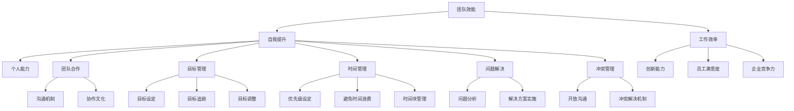

                 

## 引言

### 1.1 团队效能的重要性

在当今这个快速变化和竞争激烈的世界里，团队效能已经成为企业成功的关键因素。团队效能不仅仅关乎工作效率，更是影响企业创新能力和市场竞争力的重要因素。一个高效的团队能够在复杂多变的环境中迅速做出决策，有效应对各种挑战，从而在竞争中脱颖而出。

团队效能的重要性主要体现在以下几个方面：

1. **提升工作效率**：高效能的团队能够合理分配资源，优化工作流程，从而在短时间内完成更多任务，提高整体工作效率。

2. **促进创新**：团队成员之间的协作和交流能够激发创意，促进创新。高效能的团队能够快速将创意转化为实际成果，推动企业不断前进。

3. **增强员工满意度**：高效能的团队能够给予员工明确的角色定位和职责，使员工感受到工作的价值和成就感，从而提升员工的满意度和忠诚度。

4. **提升企业竞争力**：高效能的团队能够迅速响应市场变化，灵活调整策略，从而在竞争中保持优势，提升企业整体竞争力。

### 1.2 为什么需要倍增法

尽管团队效能的重要性已经得到了广泛认可，但是很多企业在实际操作中仍然面临效能提升的难题。这是因为传统的团队管理方法往往注重于单个环节的优化，而忽视了整体效能的提升。倍增法提供了一种全新的思路，通过从整体上提升团队效能，从而实现倍增效果。

倍增法的核心思想在于利用团队内部的互动和协作，激发每个成员的潜力，使整个团队能够实现协同效应。具体来说，倍增法包括以下几个关键步骤：

1. **自我提升**：团队成员需要不断进行自我提升，增强个人能力和自我认知，从而更好地适应团队需求。

2. **团队合作**：团队成员需要建立有效的沟通和协作机制，确保信息共享和任务分配的高效性。

3. **目标管理**：团队需要制定明确的目标，并追踪和调整目标，确保团队能够朝着正确的方向前进。

4. **技巧提升**：通过时间管理、问题解决和冲突管理等技巧，提升团队整体解决问题的能力。

### 1.3 书籍的目标与结构

本书的目标是帮助读者理解和应用倍增法，从而提升团队效能，实现团队的潜力最大化。为了实现这一目标，本书将按照以下结构展开：

1. **引言**：介绍团队效能的重要性以及为什么需要倍增法。

2. **团队效能的基础理论**：详细探讨团队效能的定义、影响因素以及常见的团队效能模型。

3. **倍增法的核心原则**：介绍倍增法的核心原则，包括自我提升、团队合作和目标管理。

4. **提升团队效能的技巧**：详细讨论提升团队效能的具体技巧，如时间管理、问题解决和冲突管理等。

5. **倍增法在团队管理中的应用**：探讨倍增法在团队管理中的具体应用，包括团队建设、领导力提升和绩效评估。

6. **实战案例分享**：通过实际案例展示倍增法的应用效果，提供具体的实施策略和结果评估。

7. **总结与展望**：总结全书的核心知识点，探讨未来团队效能的提升方向，并提供实践建议。

通过以上结构，本书旨在为读者提供一套系统化的团队效能提升方案，帮助读者在实际工作中有效应用倍增法，提升团队的整体效能。接下来，我们将深入探讨团队效能的基础理论，为后续章节的内容打下坚实的基础。 

## 第2章：团队效能的基础理论

### 2.1 什么是团队效能

团队效能是指团队在完成特定任务或目标时所表现出的效率和质量。它不仅包括团队成员个人能力的发挥，更强调团队成员之间的协作和互动。具体来说，团队效能可以从以下几个方面进行衡量：

1. **工作效率**：团队在单位时间内完成任务的速率和数量。高效能的团队能够在较短的时间内完成更多的工作。

2. **工作质量**：团队完成任务后的成果是否符合预期标准。高效能的团队能够保证高质量的工作成果。

3. **创新能力**：团队在任务过程中能够提出新观点、新方法和新方案的能力。高效能的团队能够在创新中找到突破口，推动团队不断进步。

4. **员工满意度**：团队成员对团队工作氛围和成果的满意程度。高效能的团队能够提升员工的满意度和归属感。

5. **团队协作**：团队成员之间的协作效率和信息共享程度。高效能的团队能够建立有效的沟通和协作机制，使团队成员能够高效协同工作。

### 2.2 团队效能的影响因素

团队效能的提升是一个多方面、多层次的过程，受到多种因素的影响。以下是一些关键的影响因素：

1. **团队成员能力**：团队成员的个人能力和专业技能是团队效能的基础。高水平的团队成员能够更快地完成任务，并在团队中发挥重要作用。

2. **团队结构**：团队的组织结构和人员配置对团队效能有着重要影响。合理的团队结构能够确保团队成员之间的协作高效，避免资源浪费。

3. **工作流程**：团队的工作流程和方法对团队效能有着直接的影响。高效的工作流程能够减少不必要的环节，提高工作效率。

4. **沟通机制**：团队成员之间的沟通是团队效能的重要保障。良好的沟通机制能够确保信息的及时传递和问题的快速解决。

5. **领导风格**：团队领导者的风格对团队效能有着重要影响。领导者的领导能力、决策能力和激励能力能够直接影响团队的士气和执行力。

6. **团队文化**：团队的价值观、信仰和行为规范构成了团队文化。积极的团队文化能够增强团队成员之间的信任和合作，提高团队效能。

### 2.3 常见的团队效能模型

为了更好地理解团队效能的提升方法，我们可以借鉴一些常见的团队效能模型。以下是一些典型的团队效能模型：

1. **阿米巴模型**：这是一种源自日本的管理模式，强调团队自主经营和自我管理。通过将组织划分为若干个独立的小团队（阿米巴），每个团队都可以自主决策和运营，从而提高团队的效能。

2. **团队生命周期模型**：这是描述团队从形成到解散的过程模型。根据团队所处的不同阶段（形成期、发展期、成熟期和衰退期），制定相应的管理策略，有助于提升团队效能。

3. **绩效管理模型**：这是一种以绩效为导向的管理模式，通过设定明确的目标、提供反馈和激励，来提升团队的整体绩效。常见的绩效管理模型包括目标管理（MBO）、关键绩效指标（KPI）等。

4. **变革管理模型**：团队在面临变革时，需要采用有效的变革管理策略来提升团队效能。常见的变革管理模型包括变革曲线模型、Kotter的八个步骤模型等。

通过了解这些团队效能模型，我们可以根据实际情况选择合适的方法和策略，提升团队的整体效能。在接下来的章节中，我们将深入探讨倍增法的核心原则，为提升团队效能提供更加具体和实用的方法。

## 第3章：倍增法的核心原则

### 3.1 自我提升

自我提升是倍增法中的关键原则之一，它强调团队成员需要不断提升个人能力和自我认知，以适应团队的需求和挑战。自我提升不仅有助于提高个人效能，还能为整个团队带来积极的影响。

#### 3.1.1 自我认知

自我认知是自我提升的起点。团队成员需要了解自己的优点和不足，明确自己的职业目标和成长路径。以下是一些提升自我认知的方法：

1. **自我反思**：定期进行自我反思，回顾自己在工作中的表现，识别成功和失败的原因。通过反思，可以更好地了解自己的行为模式和工作习惯。

2. **反馈与评估**：寻求他人的反馈和评估，了解自己在团队中的表现和影响。同时，定期进行自我评估，对照职业目标和成长路径，分析自己的进步和不足。

3. **职业规划**：制定明确的职业规划，设定短期和长期目标，为自己的职业发展制定明确的路线图。

#### 3.1.2 自我激励

自我激励是保持自我提升动力的关键。以下是一些有效的自我激励方法：

1. **设定挑战**：为自己设定具有挑战性的目标，通过不断挑战自我，提升能力和成就感。

2. **持续学习**：不断学习新知识和技能，保持专业发展的热情。可以通过参加培训课程、阅读专业书籍、参与技术社区等方式进行学习。

3. **正面心态**：保持积极的心态，面对困难和挑战时，保持乐观和自信。通过积极的自我暗示和激励，提升自我效能感。

#### 3.1.3 自我提升的策略

以下是一些具体的自我提升策略，帮助团队成员在实际工作中不断提升：

1. **技能提升**：通过学习新的工具和技术，提升专业技能。例如，学习新的编程语言或框架，掌握数据分析和人工智能等相关技能。

2. **知识共享**：积极参与团队的知识共享活动，通过分享经验和知识，提升整个团队的认知水平。

3. **角色扮演**：尝试不同的角色和职责，了解不同岗位的工作内容和要求，拓宽职业视野。

4. **反馈与改进**：在工作和学习中，不断接受反馈，及时改进自己的方法和策略。通过不断的迭代和优化，提升个人效能。

通过自我提升，团队成员可以更好地适应团队的需求，提升个人效能，为团队的共同目标贡献力量。在接下来的章节中，我们将继续探讨倍增法的其他核心原则，为团队效能的提升提供更加全面的解决方案。

### 3.2 团队合作

团队合作是倍增法中的另一个关键原则，它强调团队成员之间需要建立有效的协作机制和沟通渠道，以实现共同的目标。高效的团队合作能够最大化每个成员的潜力，提升整个团队的工作效率和创新能力。

#### 3.2.1 团队协作原则

成功的团队合作需要遵循以下原则：

1. **明确目标**：团队需要有一个明确的目标，所有成员都应该了解并认同这一目标。明确的目标能够为团队提供方向和动力。

2. **分工明确**：根据每个成员的能力和特长，合理分配任务和职责，确保每个成员都能在适合自己的岗位上发挥作用。

3. **信息共享**：建立透明和高效的信息共享机制，确保团队成员能够及时获取所需信息，避免信息孤岛和重复工作。

4. **相互支持**：团队成员之间需要相互信任和支持，共同面对困难和挑战。在团队遇到瓶颈时，成员之间应该互相鼓励，共同寻找解决方案。

5. **持续沟通**：保持持续的沟通和交流，确保团队中的信息流畅和透明。定期的会议、讨论和反馈能够帮助团队及时调整策略和改进方法。

6. **激励与反馈**：为团队成员提供正面的激励和及时的反馈，认可他们的努力和成就。这能够增强团队的凝聚力和动力。

#### 3.2.2 有效沟通技巧

有效的沟通是团队合作的核心，以下是一些提升团队沟通效率的技巧：

1. **主动沟通**：团队成员应该主动寻求和分享信息，避免信息滞留。主动沟通能够减少误解和冲突，增强团队的协作。

2. **倾听**：倾听是有效沟通的基础。团队成员应该倾听他人的意见和需求，理解对方的立场和观点。通过倾听，可以建立更好的信任和合作关系。

3. **清晰表达**：在表达意见和想法时，要确保语言清晰、简明易懂。使用具体的事例和数据来支持观点，避免模糊和含糊的表述。

4. **非语言沟通**：除了语言表达，非语言沟通（如肢体语言、面部表情和姿态）也至关重要。非语言沟通可以补充和强化语言表达，帮助团队成员更好地理解和接受信息。

5. **定期反馈**：在沟通过程中，及时给予反馈是非常重要的。通过反馈，可以确认信息的准确性和理解度，及时纠正错误和改进方法。

6. **冲突管理**：在沟通中不可避免地会出现冲突。团队成员需要学会如何管理和解决冲突。这包括保持冷静、理性分析问题、寻找共同点和解决方案。

通过遵循团队合作原则和有效沟通技巧，团队可以建立起良好的协作机制，提升整体效能。在接下来的章节中，我们将探讨目标管理的重要性，帮助团队更好地制定和实现目标。

### 3.3 目标管理

目标管理是倍增法中的核心原则之一，它强调通过明确的目标设定、追踪和调整，确保团队始终朝着正确的方向前进。有效的目标管理能够提升团队的凝聚力和执行力，从而实现团队效能的倍增。

#### 3.3.1 制定明确的目标

制定明确的目标是目标管理的第一步，也是确保团队方向一致和资源合理分配的关键。以下是制定明确目标的几个关键步骤：

1. **明确目标的意义**：确保团队了解每个目标的重要性和对整体项目的影响。这有助于增强团队成员对目标的认同感和责任感。

2. **具体和可衡量**：目标应该具体和可衡量，以便团队成员能够清楚地了解何时达到目标。使用SMART原则（具体、可衡量、可实现、相关、时间限定）来设定目标。

3. **参与式制定**：目标最好由团队成员共同参与制定，这样可以增加目标的可行性和接受度。团队成员在目标制定过程中会感到更有参与感和责任感。

4. **分层次设定**：将目标分为短期和长期目标，同时将大目标分解为具体的小目标。这样可以确保团队在每个阶段都有明确的工作方向和任务。

5. **明确责任和角色**：为每个目标设定明确的负责人和参与成员，确保每个人都知道自己的职责和任务。

#### 3.3.2 追踪与调整目标

一旦目标制定完成，追踪和调整目标是确保目标实现的重要环节。以下是一些关键步骤：

1. **定期追踪**：设定定期的检查点，对目标进展进行评估和追踪。这有助于及时发现问题和调整策略。

2. **数据支持**：使用具体的数据和指标来追踪目标进展。这样可以提供客观的依据，帮助团队了解实际进展和存在的问题。

3. **反馈机制**：建立反馈机制，鼓励团队成员提供关于目标进展的反馈和建议。通过反馈，可以及时调整目标和策略，确保团队始终朝着正确的方向前进。

4. **及时调整**：在追踪过程中，如果发现目标设定不合理或实际进展与预期不符，需要及时进行调整。调整目标时，要考虑资源的可用性、团队的实际情况和外部环境的变化。

5. **透明度**：确保目标追踪和调整过程的透明度，让所有团队成员都能了解目标和进展。这样可以增加团队的信任和协作，减少误解和冲突。

通过有效的目标管理，团队可以确保每个成员都明确自己的职责和目标，从而提高整体执行力。同时，目标管理还能够帮助团队更好地适应变化，灵活调整策略，实现长期和短期目标。在接下来的章节中，我们将探讨如何通过时间管理、问题解决和冲突管理进一步提升团队效能。

### 3.3.3 团队目标的设定

团队目标的设定是团队效能提升的关键环节，它不仅需要明确的目标，还需要确保目标的科学性、合理性和可操作性。以下是一些团队目标设定的步骤和要点：

#### 1. **目标设定的步骤**

1. **确定团队愿景**：首先，团队需要明确自身的愿景和使命，这是设定目标的基础。愿景通常是对团队长期目标和方向的描述。

2. **分析外部环境**：团队需要对外部环境进行深入分析，包括市场需求、竞争状况、法律法规等，以确保目标的现实性和可行性。

3. **内部资源评估**：团队需要评估自身的资源状况，包括人力、资金、技术等，以便设定与资源相匹配的目标。

4. **设定具体目标**：根据愿景和资源评估，团队可以设定具体的目标。这些目标应该符合SMART原则（具体、可衡量、可实现、相关、时间限定）。

5. **目标分解**：将总体目标分解为具体的、可执行的任务和子目标，确保每个成员都有明确的责任和任务。

6. **共识达成**：团队成员需要共同参与目标的设定过程，达成共识，提高目标的接受度和执行力。

#### 2. **目标的科学性**

1. **数据支持**：科学的目标设定需要基于数据和分析。团队可以通过市场调研、财务分析、历史数据等获取必要的支持信息。

2. **专家咨询**：在目标设定过程中，可以邀请相关领域的专家进行咨询，确保目标的科学性和专业性。

3. **风险评估**：对目标实现过程中可能遇到的风险进行评估，并制定相应的应对策略。

#### 3. **目标的合理性**

1. **资源匹配**：确保目标设定与团队的资源状况相匹配，避免资源浪费和过度压力。

2. **可持续性**：目标设定应考虑长期影响和可持续性，避免短期行为损害团队的长远发展。

3. **团队成员参与**：团队成员的参与度和认同感是目标合理性的重要因素。通过充分沟通和讨论，确保目标的合理性和可行性。

#### 4. **目标的可操作性**

1. **具体措施**：目标设定应包括具体实施措施和时间表，使团队成员明确如何行动和何时行动。

2. **责任明确**：为每个目标设定明确的负责人和执行者，确保任务明确和责任清晰。

3. **反馈和调整**：设定目标和措施后，应建立反馈机制，及时收集反馈并调整目标和计划。

通过科学、合理、可操作的目标设定，团队可以更好地协调资源和行动，提高整体效能。在接下来的章节中，我们将探讨如何通过时间管理、问题解决和冲突管理进一步提升团队效能。

### 3.3.4 追踪与调整目标

目标设定完成后，追踪与调整目标是确保目标实现的重要环节。以下是一些关键步骤：

#### 1. **定期追踪**

1. **设定检查点**：根据目标的重要性和时间期限，设定定期的检查点。这些检查点可以帮助团队及时了解目标的进展情况。

2. **数据分析**：收集与目标相关的数据，如工作量、进度、质量等，通过数据分析评估目标实现的程度。

3. **会议汇报**：定期召开团队会议，让负责人和成员汇报目标进展，讨论遇到的问题和挑战。

#### 2. **调整目标**

1. **评估进展**：根据实际进展情况，评估目标设定的合理性和可行性。如果发现目标设定过于乐观或过于保守，需要及时进行调整。

2. **优先级调整**：如果发现某些目标无法按时完成，可能需要调整优先级，确保关键目标的实现。

3. **资源分配**：根据目标进展情况，合理分配资源和人力，确保团队能够有效应对挑战和变化。

#### 3. **反馈机制**

1. **及时反馈**：建立及时反馈机制，鼓励团队成员提供关于目标进展的反馈和建议。这可以帮助团队及时发现和解决问题。

2. **透明度**：确保追踪与调整过程透明，让所有团队成员都能了解目标进展和调整情况。这可以增强团队的信任和协作。

3. **持续改进**：通过不断收集反馈和调整目标，团队可以持续改进工作流程和方法，提高整体效能。

通过定期追踪和调整目标，团队可以确保目标的实现，同时保持对变化的敏感性和适应性。这不仅有助于提升团队的执行力，还能够确保团队在动态环境中保持竞争力。

### 3.4 提升团队效能的技巧

在提升团队效能的过程中，掌握一系列实用技巧是至关重要的。以下是一些关键的技巧，可以帮助团队在短时间内实现显著的效果。

#### 4.1 时间管理

时间管理是提升团队效能的基础。一个有效的时间管理策略可以确保团队将注意力集中在最重要和最有价值的任务上。

1. **设定优先级**：根据任务的重要性和紧迫性，将任务分为“紧急且重要”、“紧急但不重要”、“不重要但重要”和“不紧急且不重要”四类。优先处理紧急且重要的任务，确保关键工作得到及时完成。

2. **避免时间浪费**：定期审查工作流程，识别和消除无效和冗余的工作步骤。通过优化流程，减少不必要的会议和沟通，避免时间浪费。

3. **时间块管理**：将工作时间划分为不同的时间段，每个时间段专注于一项任务。这有助于提高专注度和工作效率。

#### 4.2 问题解决

面对问题和挑战时，团队成员需要具备良好的问题解决能力。以下是一些有效的方法：

1. **分析问题的方法**：使用因果图、鱼骨图等工具，分析问题的根本原因。通过深入分析，可以找到问题的本质，从而制定更有效的解决方案。

2. **解决问题的策略**：采用头脑风暴、SWOT分析等方法，集思广益，寻找解决问题的策略。在选择解决方案时，要考虑可行性、成本和风险。

3. **实施与监控**：一旦确定解决方案，需要制定详细的实施计划，并监控实施过程。通过定期检查和反馈，确保问题得到有效解决。

#### 4.3 冲突管理

冲突在团队中是不可避免的，但有效的冲突管理可以将其转化为团队进步的动力。

1. **冲突的原因**：冲突通常源于沟通不畅、目标不一致、角色重叠或资源分配不公等问题。了解冲突的原因是解决冲突的第一步。

2. **冲突管理的策略**：采用建设性的冲突管理策略，如对话、妥协和协作。在处理冲突时，要避免指责和攻击，而是寻求共同点和解决方案。

3. **持续沟通**：建立开放的沟通环境，鼓励团队成员表达意见和建议。通过持续沟通，可以减少误解和冲突，增强团队的凝聚力。

通过运用这些时间管理、问题解决和冲突管理的技巧，团队可以显著提升整体效能。在接下来的章节中，我们将探讨如何在实际管理中应用这些技巧，进一步提升团队效能。

### 4.1.1 设定优先级

有效的时间管理首先需要设定明确的优先级。设定优先级是确保团队资源被合理分配，从而最大化工作效率和成果的关键步骤。以下是设定优先级的几个关键步骤：

1. **识别关键任务**：首先，团队需要识别出所有需要完成的任务。通过清单或任务列表，将所有任务列出，并评估每个任务的重要性和紧急程度。

2. **评估紧急程度和重要性**：每个任务都有其自身的紧急程度和重要性。紧急程度通常与任务的截止日期和紧迫性相关，而重要性则与任务对项目或团队目标的影响相关。可以使用“紧急-重要矩阵”来帮助评估任务，从而确定每个任务的优先级。

3. **使用优先级标签**：为每个任务分配一个优先级标签，如“高优先级”、“中优先级”和“低优先级”。这样可以使团队成员一目了然地知道哪些任务需要优先处理。

4. **定期审查和调整**：优先级不是一成不变的，需要根据任务进展和团队目标的变化进行定期审查和调整。通过定期的优先级审查，可以确保团队始终专注于最重要和最紧急的任务。

5. **设定时间限制**：为每个任务设定一个具体的时间限制，这有助于提高团队的时间意识和效率。同时，时间限制也可以帮助团队更好地分配资源，避免任务拖延。

通过上述步骤，团队可以有效地设定优先级，确保关键任务得到优先处理，从而提高整体工作效率和效能。

### 4.1.2 避免时间浪费

在团队工作中，时间浪费是一个常见且严重的问题，它不仅降低了工作效率，还可能导致项目延误和团队士气下降。以下是一些有效的策略，帮助团队避免时间浪费：

1. **减少冗余会议**：定期审查和优化会议安排，避免不必要的会议。对于必须召开的会议，确保会议目标明确、议程紧凑，并设定时间限制。

2. **使用时间跟踪工具**：采用时间跟踪工具（如Toggl、RescueTime等）可以帮助团队成员记录自己的工作时间，识别和消除时间浪费的环节。

3. **优化工作流程**：审查和简化工作流程，消除冗余步骤和重复劳动。通过自动化工具和流程优化，可以大幅减少不必要的耗时。

4. **避免多任务处理**：多任务处理虽然表面上看起来提高了效率，但实际上会降低专注度和工作效率。鼓励团队成员专注于单一任务，以提高工作质量和速度。

5. **设定明确的时间段**：将工作时间划分为具体的任务时间段，每个时间段专注于一项任务。这有助于提高团队的专注度和工作效率。

6. **定期检查和反思**：定期检查工作流程和时间管理策略，根据实际情况进行调整和优化。通过反思和改进，可以持续提高时间管理的效果。

通过实施上述策略，团队可以有效地避免时间浪费，提高整体工作效率和效能。

### 4.2.1 分析问题的方法

在团队工作中，面对问题时，分析问题的方法至关重要。通过科学的方法分析问题，可以帮助团队找到问题的根本原因，从而制定有效的解决方案。以下是几种常用的分析问题的方法：

1. **因果图（Fishbone图）**：因果图是一种用来分析问题的工具，它将问题作为鱼头，将可能导致问题的各种因素作为鱼骨上的分支。通过分析这些因素，可以找到问题的根本原因。因果图可以帮助团队成员系统地思考问题的各个方面，从而找到根本原因。

2. **五问法（5 Whys）**：五问法是一种简单的但非常有效的问题分析技术。它通过连续提问“为什么？”来深入挖掘问题的根本原因。通过至少提问五次，通常可以找到问题的根本原因。这种方法强调对问题的深度挖掘，而不是停留在表面的解释。

3. **鱼骨图（Ishikawa图）**：鱼骨图是一种用于展示问题与不同因素之间关系的图表。它将问题放在中心，将导致问题的各种因素（如人、方法、机器、材料、测量和环境）作为鱼骨的分支。通过绘制鱼骨图，团队可以更清晰地看到问题的各个方面，并找到潜在的原因。

4. **SWOT分析**：SWOT分析是一种评估问题的工具，它分别分析问题的优势（Strengths）、劣势（Weaknesses）、机会（Opportunities）和威胁（Threats）。通过SWOT分析，团队可以从多个角度审视问题，并制定相应的应对策略。

通过运用上述方法，团队可以系统地分析问题，找到问题的根本原因，从而制定更有效的解决方案。这不仅能提高团队解决问题的能力，还能增强团队的协作和决策能力。

### 4.2.2 解决问题的策略

一旦团队确定了问题的根本原因，下一步就是制定和实施解决方案。以下是一些有效的策略，帮助团队高效地解决问题：

1. **头脑风暴**：头脑风暴是一种集思广益的方法，通过集体讨论，迅速产生大量的创意和解决方案。在头脑风暴过程中，团队成员可以自由表达自己的想法，不受任何限制。这种方法有助于发掘不同的视角和创意，从而找到最佳解决方案。

2. **分析可行性**：在头脑风暴后，需要对每个解决方案进行分析，评估其可行性。考虑解决方案的资源需求、时间成本和潜在风险。通过可行性分析，团队可以筛选出最有可能成功的解决方案。

3. **选择最佳方案**：在评估了所有可行的解决方案后，团队需要选择最佳的方案。选择最佳方案时，要考虑解决方案的长期效果、成本效益和团队的接受度。

4. **制定详细计划**：一旦确定了解决方案，团队需要制定详细的实施计划。计划应包括每个步骤的具体执行方式、负责人和时间表。通过详细的计划，可以确保解决方案的顺利实施。

5. **执行与监控**：在实施过程中，团队需要密切监控进展情况，及时调整计划。通过定期检查和反馈，可以确保解决方案的有效执行。

6. **持续改进**：在问题解决后，团队应进行反思和总结，评估解决方案的效果，并寻找持续改进的机会。通过不断改进，团队可以不断提高解决问题的能力。

通过上述策略，团队可以高效地解决问题，从而提升整体效能。在解决问题过程中，团队的协作和沟通至关重要，这有助于确保解决方案的全面性和有效性。

### 4.3.1 冲突的原因

在团队工作中，冲突是不可避免的现象。理解冲突的原因有助于团队更好地预防和解决冲突，以下是一些常见的冲突原因：

1. **目标不一致**：当团队成员对项目的目标或期望有不同的理解时，容易产生冲突。这种冲突通常源于目标设定不清晰或目标之间存在矛盾。

2. **角色和职责模糊**：当团队成员的角色和职责不明确时，容易导致任务重叠或责任不清，从而引发冲突。这种情况可能会导致工作效率低下，甚至影响项目的进展。

3. **沟通不畅**：沟通不畅是冲突的主要原因之一。信息传递不畅、误解和缺乏有效的反馈机制，都可能导致团队成员之间的冲突。

4. **个人风格和价值观差异**：团队成员的个人风格和价值观差异，可能会导致在工作中的冲突。例如，有些人更倾向于直接沟通，而另一些人可能更倾向于委婉和间接。

5. **资源分配不公**：资源（如资金、人力和技术）分配不公，容易引发团队成员之间的不满和冲突。资源短缺或分配不均，会影响团队成员的工作积极性和满意度。

6. **工作压力和紧张氛围**：高工作压力和紧张的工作氛围，容易导致团队成员的情绪紧张和冲突。长时间的工作压力可能导致情绪失控，增加冲突的可能性。

了解冲突的原因有助于团队在早期发现和预防冲突，从而建立和谐的工作环境，提高团队效能。

### 4.3.2 冲突管理的策略

有效的冲突管理是提升团队效能和维持团队和谐的关键。以下是一些实用的策略，帮助团队管理和解决冲突：

1. **预防为主**：在冲突发生前，采取预防措施可以减少冲突的发生。这包括明确团队目标、角色和职责，建立有效的沟通机制，以及培养积极的工作氛围。

2. **及时沟通**：一旦冲突发生，及时沟通是解决冲突的第一步。通过面对面交流或团队会议，让所有相关方表达自己的观点和感受，了解冲突的本质。

3. **保持客观和冷静**：在处理冲突时，保持客观和冷静至关重要。避免情绪化，理性分析问题，有助于找到解决问题的方法。

4. **积极倾听**：积极倾听对方的意见和感受，理解对方的立场和需求。通过倾听，可以建立信任，找到共同点和解决方案。

5. **寻找共同点**：在解决冲突时，寻找共同点和共识非常重要。通过协商和妥协，找到双方都能接受的解决方案。

6. **提供反馈**：在冲突解决后，及时提供反馈，确认解决方案的实施和效果。这有助于团队了解冲突解决的成功程度，为未来提供参考。

7. **建立冲突解决机制**：建立有效的冲突解决机制，如设立专门的冲突解决小组或委员会，确保冲突得到及时和公正的处理。

8. **持续跟踪和改进**：冲突解决后，持续跟踪和改进工作流程和沟通机制，防止类似冲突再次发生。

通过上述策略，团队可以有效地管理和解决冲突，维护和谐的工作环境，提高整体效能。

### 5.1 团队建设

团队建设是提升团队效能的重要一环，它涉及到如何通过培养团队精神、增强协作能力以及优化团队角色和职责，来提高团队的凝聚力和战斗力。以下是一些团队建设的关键策略：

#### 5.1.1 团队角色与职责

1. **明确团队角色**：首先，团队需要明确每个成员的角色和职责。这可以通过岗位描述和角色分配表来实现，确保每个成员都清楚自己的工作内容和职责。

2. **分工协作**：根据每个成员的能力和特长，合理分配任务和职责。分工协作可以确保每个成员都能在其擅长领域发挥作用，避免角色重叠和资源浪费。

3. **定期评估与反馈**：定期对团队成员的角色和职责进行评估和反馈，确保团队结构能够适应项目需求和团队发展。通过评估和反馈，可以及时发现和调整角色和职责分配中的问题。

#### 5.1.2 团队文化建设

团队文化是团队建设的核心，它决定了团队成员的行为方式和团队氛围。以下是一些培养团队文化的策略：

1. **共同价值观**：建立团队共同的价值观和信念，这可以帮助团队成员在行动和决策上保持一致，增强团队凝聚力。

2. **开放沟通**：鼓励团队成员之间进行开放和透明的沟通，确保信息流畅和及时传递。通过定期的团队会议、讨论和分享，可以增强团队成员之间的信任和协作。

3. **团队活动**：定期组织团队活动，如团建活动、团队旅行和团队竞赛等，这有助于增强团队成员之间的互动和情感联系，培养团队精神。

4. **认可与激励**：为团队成员提供认可和激励，如表扬、奖励和晋升等，这可以增强团队成员的工作积极性和归属感。

#### 5.1.3 团队建设活动

1. **团队训练**：通过团队训练和团队建设活动，如领导力训练、沟通技巧培训和团队协作训练，提升团队成员的个人能力和团队协作能力。

2. **角色扮演**：通过角色扮演和模拟演练，让团队成员体验不同的角色和职责，增强团队的角色认知和协作能力。

3. **任务挑战**：设计具有挑战性的任务，鼓励团队成员合作解决，这有助于增强团队凝聚力，培养解决问题的能力。

通过团队建设，团队可以建立起良好的团队文化和协作机制，提升整体效能。在接下来的章节中，我们将探讨如何提升领导力，以进一步推动团队效能的提升。

### 5.1.1 团队角色与职责

明确团队角色与职责是团队建设的基础，它有助于确保团队成员的工作高效、协同，并且每个成员都能发挥最大的作用。以下是实现这一目标的几个关键步骤：

1. **岗位描述**：首先，团队需要为每个岗位制定详细的岗位描述。岗位描述应包括岗位的主要职责、工作要求、工作环境和预期成果。通过明确的岗位描述，团队成员可以清楚地了解自己的工作内容和职责。

2. **能力匹配**：在分配任务时，应充分考虑每个成员的能力和特长。将合适的任务分配给合适的成员，可以确保任务的高效完成，同时也可以帮助成员在擅长的领域发挥更大的潜力。

3. **职责明确**：每个团队成员的职责应明确划分，避免职责重叠和责任不清。通过制定职责分配表，可以确保每个成员都了解自己的职责范围，减少因职责不清而产生的冲突。

4. **定期评估**：定期对团队成员的角色和职责进行评估，根据项目进展和团队发展情况进行调整。通过评估，可以及时发现和解决职责分配中的问题，确保团队结构始终与项目需求相匹配。

5. **持续沟通**：确保团队成员之间的持续沟通，特别是在职责发生变化时。通过沟通，可以确保团队成员了解最新的职责分配和任务要求，减少误解和沟通不畅。

通过上述步骤，团队可以建立起清晰的团队角色与职责体系，提高团队协作效率，为团队效能的提升奠定坚实的基础。

### 5.1.2 团队文化建设

团队文化是团队建设和持续发展的核心要素，它不仅影响团队成员的行为和态度，还直接影响团队的凝聚力和工作效率。以下是培养积极团队文化的几个策略：

1. **共同价值观**：确立团队共同的价值观是团队文化建设的第一步。这些价值观应该明确传达给所有团队成员，并作为团队决策和行为的基础。共同的价值观可以帮助团队成员在目标一致和理念统一的基础上，形成强大的凝聚力。

2. **开放沟通**：创建一个开放、透明和包容的沟通环境，鼓励团队成员自由表达意见和建议。通过定期的团队会议、工作坊和团队讨论，可以促进信息共享和知识交流，增强团队成员之间的信任和理解。

3. **团队活动**：定期组织团队活动，如团队建设训练、团建旅行和团队竞赛等，这有助于增强团队成员之间的互动和情感联系。这些活动不仅可以提升团队成员之间的协作能力，还可以培养团队精神和团队意识。

4. **认可与激励**：为团队成员提供认可和激励，如表扬、奖励和晋升等，这可以增强团队成员的工作积极性和归属感。通过公开表扬和表彰，可以让团队成员感受到他们的努力和成就被认可，从而增强团队凝聚力。

5. **培养积极态度**：鼓励团队成员保持积极的态度，面对挑战和困难时，共同寻找解决方案。通过正面的心态和团队合作，可以克服各种障碍，实现团队目标。

通过上述策略，团队可以逐步建立起积极、和谐的团队文化，提高团队的整体效能和战斗力。在接下来的章节中，我们将探讨如何提升领导力，进一步推动团队效能的提升。

### 5.2 领导力提升

领导力是团队管理中的关键要素，高效的领导者能够激发团队成员的潜力，推动团队朝着共同的目标前进。以下是一些提升领导力的关键策略：

#### 5.2.1 领导者的角色

1. **愿景塑造者**：领导者需要明确团队的愿景和目标，并将其传达给团队成员。通过塑造清晰的愿景，领导者可以为团队提供方向和动力。

2. **决策者**：领导者需在关键时刻做出明智的决策，确保团队能够在变化的环境中快速响应。有效的决策能力有助于提升团队的整体效能。

3. **协调者**：领导者需协调团队成员之间的关系，确保团队成员之间的沟通畅通无阻。通过有效的协调，可以减少冲突，提升团队的协作效率。

4. **激励者**：领导者需激励团队成员，鼓励他们在面对挑战时保持积极态度。通过激励，可以增强团队成员的自信心和归属感。

#### 5.2.2 领导力的培养

1. **持续学习**：领导者需不断学习和提升自己的知识和技能，以适应不断变化的环境。通过参加培训、阅读专业书籍和与同行交流，可以不断提高自己的领导能力。

2. **以身作则**：领导者应以身作则，通过自己的行为和态度树立榜样。通过自身的示范，可以带动团队成员形成积极的工作态度和行为习惯。

3. **有效沟通**：领导者需具备有效的沟通能力，确保信息能够准确、及时地传达给团队成员。通过开放、透明和尊重的沟通方式，可以增强团队成员之间的信任和协作。

4. **情感智慧**：领导者需具备情感智慧，能够理解和管理自己的情绪，同时理解和管理团队成员的情绪。通过情感智慧，可以建立积极的工作氛围，提升团队的凝聚力。

5. **培养下属**：领导者应关注团队成员的个人发展，提供培训和支持，帮助他们不断提升自己的能力和素质。通过培养下属，可以增强团队的实力和战斗力。

通过上述策略，领导者可以不断提升自己的领导力，为团队的发展提供强有力的支持。在接下来的章节中，我们将探讨如何通过有效的绩效评估和激励机制，进一步提升团队效能。

### 5.2.1 领导者的角色

领导者在团队中的作用至关重要，他们不仅是团队的导航仪，也是团队成员的激励者和导师。以下是领导者应承担的几个关键角色：

1. **愿景塑造者**：领导者需要明确团队的愿景和目标，并将其传达给团队成员。通过塑造清晰的愿景，领导者可以为团队提供方向和动力。这不仅仅是设定一个目标，更是通过愿景激发团队成员的内在动机，使他们愿意为共同的目标而努力。

2. **决策者**：在复杂多变的环境中，领导者需要做出明智的决策，确保团队能够在关键时刻迅速反应。领导者需具备战略思维和决策能力，能够在权衡各种因素后，选择最优方案。此外，领导者的决策也需要透明和公正，以确保团队成员对决策的信任和接受度。

3. **协调者**：领导者的另一个关键角色是协调团队成员之间的关系。在一个大型团队中，不同成员之间的协作和沟通至关重要。领导者需确保团队成员之间的信息畅通，减少误解和冲突，促进团队成员之间的有效合作。

4. **激励者**：领导者需要激励团队成员，鼓励他们在面对挑战时保持积极的态度。通过认可团队成员的成就和努力，领导者可以增强团队成员的自信心和归属感。此外，领导者还可以通过提供培训和发展机会，激发团队成员的潜力，推动团队不断进步。

5. **导师和教练**：领导者应成为团队成员的导师和教练，关注他们的个人发展，提供指导和支持。通过分享自己的经验和知识，领导者可以帮助团队成员提高技能和解决问题的能力。同时，领导者还应鼓励团队成员自主学习，培养他们的自主性和创新能力。

通过承担这些关键角色，领导者可以有效地引导和管理团队，提升团队的整体效能，实现团队的共同目标。

### 5.2.2 领导力的培养

提升领导力是一个持续的过程，需要领导者不断学习、实践和反思。以下是一些培养领导力的关键策略：

1. **持续学习**：领导者需要不断更新知识和技能，以适应不断变化的环境。这包括阅读专业书籍、参加培训课程、参加行业会议等。通过持续学习，领导者可以掌握最新的管理理念和实践，从而提升自己的领导能力。

2. **以身作则**：领导者应以身作则，通过自己的行为和态度树立榜样。领导者需要展现出高度的职业操守和责任感，以实际行动赢得团队成员的信任和尊重。此外，领导者还需要展现出积极的工作态度，激发团队成员的积极性。

3. **有效沟通**：领导者需要具备有效的沟通能力，确保信息能够准确、及时地传达给团队成员。这包括倾听、表达和反馈。通过开放、透明和尊重的沟通方式，领导者可以建立良好的团队氛围，增强团队成员之间的信任和协作。

4. **情感智慧**：领导者需要具备情感智慧，能够理解和管理自己的情绪，同时理解和管理团队成员的情绪。通过情感智慧，领导者可以更好地处理团队中的冲突，建立积极的工作氛围。

5. **培养下属**：领导者需要关注团队成员的个人发展，提供培训和支持，帮助他们不断提升自己的能力和素质。通过培养下属，领导者可以增强团队的实力和战斗力，同时也能够为自己未来的领导职责储备人才。

6. **反思与改进**：领导者需要定期反思自己的领导行为和效果，识别不足并采取改进措施。通过持续反思和改进，领导者可以不断提高自己的领导能力，更好地应对复杂多变的团队环境。

通过上述策略，领导者可以不断提升自己的领导力，为团队的发展和成功奠定坚实的基础。在接下来的章节中，我们将探讨如何通过有效的绩效评估和激励机制，进一步推动团队效能的提升。

### 5.3 绩效评估

绩效评估是团队管理中的重要环节，它不仅帮助团队了解每个成员的工作表现，还为后续的激励、培训和职业发展提供依据。有效的绩效评估能够激励团队成员提高工作效率，提升整体团队效能。

#### 5.3.1 绩效评估的标准

制定明确的绩效评估标准是确保评估公平、公正和有效性的关键。以下是一些常见的绩效评估标准：

1. **目标达成度**：评估成员在预定时间内达成目标的程度。这包括数量和质量两个方面，例如任务完成的数量和项目的成功交付。

2. **工作效率**：评估成员完成任务的速度和质量。工作效率不仅包括完成任务的时长，还包括工作的准确性和对团队的贡献。

3. **团队合作**：评估成员在团队中的协作能力和贡献。团队合作包括沟通、支持和共同解决问题的能力。

4. **创新与主动性**：评估成员在工作中表现出的创新意识和主动解决问题的能力。这包括提出新的观点、改进方法和主动承担额外任务。

5. **职业素养**：评估成员的工作态度、职业道德和职业发展潜力。职业素养包括责任感、职业操守和持续学习的意愿。

6. **客户满意度**：如果团队的工作涉及到客户服务，客户满意度是一个重要的评估标准。客户的反馈和评价可以帮助团队了解自身的工作表现和改进方向。

#### 5.3.2 绩效激励与反馈

有效的绩效激励和反馈机制能够增强团队成员的工作动力和积极性。以下是一些关键策略：

1. **正面激励**：对表现优秀的成员给予认可和奖励，如奖金、晋升、培训机会等。正面激励可以增强团队成员的成就感和自豪感，激发他们的工作热情。

2. **定期反馈**：定期提供反馈是绩效管理的重要环节。通过定期反馈，成员可以了解自己的工作表现和改进方向。反馈应具体、及时，同时应关注成员的优点和进步。

3. **发展性反馈**：除了正面激励，还需要给予发展性反馈，帮助成员识别自身的不足并制定改进计划。发展性反馈应关注成员的成长和发展，鼓励他们不断提升自身能力。

4. **沟通与支持**：在提供反馈时，领导者应与成员进行有效沟通，确保他们理解反馈的内容和改进的方向。同时，领导者应提供必要的支持和资源，帮助成员实现改进。

5. **绩效改进计划**：对于绩效不佳的成员，应制定绩效改进计划，明确改进的目标、措施和时间表。通过持续的跟踪和评估，帮助成员逐步提升绩效。

通过建立有效的绩效评估标准和激励机制，团队可以更好地了解成员的工作表现，激发他们的潜力，提高整体效能。在接下来的章节中，我们将探讨如何通过实战案例进一步验证和应用这些绩效评估和激励策略。

### 5.3.1 绩效评估的标准

制定明确的绩效评估标准是确保评估过程公正、透明和有效性的关键。以下是一些关键的标准和指标，用于评估团队成员的表现：

1. **目标达成度**：这是评估团队成员工作成果的核心标准。具体来说，这包括：
   - **任务完成率**：衡量团队成员在预定时间内完成的任务数量与总任务数量的比例。
   - **质量标准**：评估任务完成的质量是否符合预设的标准和客户要求。
   - **创新与改进**：评估团队成员是否在任务执行过程中提出创新性建议或改进措施。

2. **工作效率**：这是衡量团队成员工作速度和效率的标准。具体包括：
   - **时间管理**：评估团队成员在时间分配和任务优先级设定方面的能力。
   - **工作效率**：衡量团队成员完成特定任务的效率和速度。
   - **工作量**：评估团队成员在相同时间内完成的任务量。

3. **团队合作**：这是评估团队成员在团队协作和沟通方面的表现。具体包括：
   - **沟通能力**：评估团队成员之间的沟通是否有效、及时和透明。
   - **协作精神**：评估团队成员在团队合作中的参与度和协作意愿。
   - **团队贡献**：评估团队成员在团队任务中的贡献和影响力。

4. **创新与主动性**：这是评估团队成员在工作中表现出的创新意识和主动性的标准。具体包括：
   - **问题解决**：评估团队成员在面对问题和挑战时的解决能力和创新能力。
   - **主动建议**：评估团队成员是否主动提出改进建议和创新思路。
   - **持续学习**：评估团队成员是否积极参与培训和自我提升，持续提高自身能力。

5. **职业素养**：这是评估团队成员的职业态度和行为标准。具体包括：
   - **职业操守**：评估团队成员是否遵守职业道德和行为规范。
   - **责任感**：评估团队成员是否对工作结果负责，愿意承担责任。
   - **职业发展**：评估团队成员的职业发展规划和自我提升意愿。

6. **客户满意度**：如果团队的工作直接面向客户，客户满意度是重要的评估标准。这包括：
   - **客户反馈**：评估客户对团队成员工作表现的反馈和评价。
   - **服务质量**：评估团队成员提供的服务质量和客户满意度。

通过制定和实施这些具体的绩效评估标准，团队可以确保评估过程的公正性和有效性，为团队成员提供清晰、明确的评估依据，从而激励他们不断提升自身的工作表现。

### 5.3.2 绩效激励与反馈

有效的绩效激励与反馈机制是确保团队成员始终保持高效率和积极性的关键。以下是一些关键策略，帮助团队实现这一目标：

1. **正面激励**：
   - **物质奖励**：对于表现优秀的团队成员，可以提供奖金、提成、年终奖等物质奖励，以激发他们的工作热情和动力。
   - **非物质奖励**：除了物质奖励，还可以提供荣誉称号、优秀员工证书、团队荣誉墙等非物质奖励，增强团队成员的荣誉感和成就感。

2. **定期反馈**：
   - **绩效回顾**：定期（如季度、半年或年度）组织绩效回顾会议，与团队成员面对面讨论他们的工作表现和进步情况。
   - **具体反馈**：在反馈过程中，领导者应提供具体、详细的反馈，指出团队成员的优点和需要改进的地方，确保团队成员能够明确了解自己的表现。

3. **发展性反馈**：
   - **改进建议**：对于表现不佳的团队成员，领导者应提供具体的发展性反馈，帮助他们识别问题并提出改进建议。
   - **支持与资源**：为团队成员提供必要的培训、指导和支持资源，帮助他们克服困难，提高绩效。

4. **沟通与支持**：
   - **开放沟通**：建立开放、透明的沟通环境，鼓励团队成员提出意见和建议，确保他们的声音被听到。
   - **持续关注**：领导者应持续关注团队成员的绩效表现，及时提供帮助和指导，确保他们能够在工作中取得进步。

5. **绩效改进计划**：
   - **制定计划**：对于绩效不佳的团队成员，应制定具体的绩效改进计划，明确改进目标、措施和时间表。
   - **跟踪执行**：定期跟踪绩效改进计划的执行情况，评估改进效果，及时调整计划，确保团队成员能够逐步提升绩效。

通过实施上述策略，团队可以建立一个积极、健康的绩效激励机制，激发团队成员的潜力，提升整体绩效和团队效能。

### 5.4.1 倍增法在软件开发团队中的应用

在软件开发团队中，倍增法通过系统化的方法和技巧，能够显著提升团队的开发效率、代码质量和项目交付能力。以下是一些具体应用场景和实例：

#### 5.4.1.1 案例背景

某大型互联网公司有一个由10名开发人员组成的软件开发团队，负责开发一款复杂的社交网络应用。随着用户数量的增加和功能需求的扩展，项目的开发进度和质量都面临巨大挑战。团队在项目管理和代码质量控制方面存在以下问题：

- **任务分配不均**：部分成员任务繁重，而另一些成员却相对轻松。
- **代码质量低下**：代码风格不一致，Bug频繁，影响项目进度。
- **沟通不畅**：团队成员之间的沟通不充分，导致信息滞后，影响开发效率。
- **时间管理混乱**：团队成员对任务的时间预估不准确，导致项目进度延迟。

#### 5.4.1.2 实施策略

为了解决上述问题，团队引入了倍增法，并采取了以下策略：

1. **自我提升**：
   - **技能培训**：为团队成员提供技术培训和职业发展机会，帮助他们提升专业技能。
   - **代码规范**：制定统一的代码规范，定期进行代码审查，确保代码质量和风格一致。

2. **团队合作**：
   - **分工协作**：根据团队成员的能力和特长，重新分配任务，确保每个成员都处于最佳状态。
   - **沟通机制**：建立日常站会和定期项目会议，确保团队成员之间的信息共享和协作。

3. **目标管理**：
   - **明确目标**：为每个团队成员设定具体的开发目标，并与团队整体目标相结合。
   - **进度追踪**：使用项目管理工具（如JIRA），实时监控项目进度和任务完成情况，及时调整计划和资源分配。

4. **时间管理**：
   - **时间块管理**：鼓励团队成员使用时间块管理方法，专注于单一任务，提高工作效率。
   - **任务优先级**：根据任务的重要性和紧急程度，重新设定任务优先级，确保关键任务得到优先处理。

5. **问题解决**：
   - **问题分析**：使用因果图和五问法等工具，深入分析开发过程中遇到的问题，找到根本原因。
   - **解决策略**：根据问题分析结果，制定具体的解决方案，并实施和监控解决方案的效果。

6. **冲突管理**：
   - **开放沟通**：鼓励团队成员在遇到冲突时，通过开放和坦诚的沟通，寻求共同解决方案。
   - **调解机制**：设立专门的冲突调解小组，及时处理和解决团队内部冲突。

#### 5.4.1.3 结果评估

通过实施倍增法，团队在多个方面取得了显著成果：

- **任务分配更加均衡**：团队成员的工作负担显著减轻，工作效率和质量得到了提升。
- **代码质量显著提高**：统一代码规范和定期代码审查，有效降低了Bug率，提高了代码的可维护性和可读性。
- **沟通效率显著提升**：日常站会和项目会议的建立，确保了团队成员之间的信息畅通，减少了误解和冲突。
- **项目进度恢复正常**：通过明确目标和时间管理策略，项目进度恢复正常，项目交付能力得到了显著提升。

#### 5.4.1.4 总结与反思

通过倍增法的应用，该软件开发团队成功解决了开发过程中的一系列问题，提升了整体效能。以下是一些总结和反思：

- **自我提升的重要性**：通过技能培训和代码规范，团队成员的专业能力得到了显著提升，为团队的持续发展奠定了基础。
- **团队合作的关键**：有效的分工协作和沟通机制，增强了团队凝聚力，提高了整体工作效率。
- **目标管理的作用**：明确的目标和进度追踪，使团队能够更好地掌握项目进度，及时调整资源和策略。
- **时间管理的效果**：时间块管理和任务优先级的设定，帮助团队提高了工作效率，确保了项目交付的及时性。
- **问题解决的策略**：通过科学的问题分析和解决方案实施，团队在面对挑战时能够迅速找到解决问题的方法，提高了团队应对复杂问题的能力。
- **冲突管理的必要性**：有效的冲突管理机制，有助于团队保持和谐的工作环境，减少了内部冲突对项目的影响。

通过以上总结和反思，团队在未来的发展中将继续优化和改进倍增法的应用，进一步提升团队效能，实现更高的项目交付质量和团队凝聚力。

### 5.4.2 倍增法在市场营销团队中的应用

在市场营销团队中，倍增法同样可以发挥重要作用，通过系统化的方法和技巧，提高市场营销活动的效果和团队的整体执行力。以下是一个实际案例，展示倍增法在市场营销团队中的应用：

#### 5.4.2.1 案例背景

一家全球知名的电商企业拥有一个由12名成员组成的营销团队，负责品牌的在线推广、产品促销和客户关系管理。随着市场竞争的加剧和用户需求的变化，团队在营销策略的执行和效果评估方面面临以下挑战：

- **营销策略不统一**：团队成员在制定和执行营销策略时缺乏统一的标准，导致策略实施效果不一。
- **资源分配不合理**：营销资源（如预算、人力和时间）分配不均，部分活动未能充分利用资源，而另一些活动却资源过剩。
- **数据分析不足**：缺乏有效的数据分析工具和策略，无法准确评估营销活动的效果和ROI（投资回报率）。
- **团队成员协作不畅**：团队成员之间的沟通和协作不足，影响了营销策略的执行和优化。

#### 5.4.2.2 实施策略

为了解决上述问题，团队引入了倍增法，并采取了以下策略：

1. **自我提升**：
   - **专业培训**：为团队成员提供专业的营销知识和技能培训，提升他们的专业能力和实战经验。
   - **技能认证**：鼓励团队成员参加相关的专业认证考试，如数字营销认证（如Google AdWords认证），以提升专业水平。

2. **团队合作**：
   - **协作机制**：建立跨部门的协作机制，确保营销团队与产品、运营和客户服务团队之间的信息共享和协同工作。
   - **沟通平台**：使用协作工具（如Slack或Microsoft Teams），提高团队成员之间的沟通效率和协作效果。

3. **目标管理**：
   - **明确目标**：为每个营销活动设定明确的营销目标和关键绩效指标（KPI），确保团队成员对目标有清晰的认识。
   - **目标追踪**：使用营销管理工具（如HubSpot或Google Analytics），实时追踪和评估营销活动的效果，确保目标实现。

4. **时间管理**：
   - **时间块规划**：采用时间块规划方法，确保团队成员能够在特定时间段内集中精力处理重要任务，提高工作效率。
   - **任务优先级**：根据营销活动的重要性和紧迫性，重新设定任务优先级，确保关键任务得到优先处理。

5. **问题解决**：
   - **数据分析**：建立数据分析团队，使用数据分析工具（如Tableau或Google Data Studio），对营销活动进行深入分析和评估。
   - **策略优化**：根据数据分析结果，调整和优化营销策略，提高营销活动的效果和ROI。

6. **冲突管理**：
   - **开放沟通**：建立开放的沟通环境，鼓励团队成员在遇到冲突时，通过开放和坦诚的沟通，寻求共同解决方案。
   - **解决机制**：设立专门的冲突解决小组，及时处理和解决团队内部的冲突，确保团队的稳定和高效。

#### 5.4.2.3 结果评估

通过实施倍增法，该市场营销团队在多个方面取得了显著成果：

- **营销策略统一**：通过明确目标和统一标准，团队在制定和执行营销策略时更加一致，提高了营销活动的整体效果。
- **资源利用优化**：通过合理的资源分配和时间管理，团队能够更有效地利用营销资源，提高了活动的ROI。
- **数据分析提升**：通过有效的数据分析和策略优化，团队能够更好地了解营销活动的效果，提高了决策的科学性和精准性。
- **团队协作增强**：通过协作机制和沟通平台的建立，团队成员之间的沟通和协作显著增强，提高了整体执行力。

#### 5.4.2.4 总结与反思

通过倍增法的应用，该市场营销团队成功解决了营销策略执行和效果评估中的问题，提升了整体效能。以下是一些总结和反思：

- **专业培训的重要性**：通过专业培训和技能认证，团队成员的专业能力和实战经验得到了显著提升，为团队的成功奠定了基础。
- **团队合作的价值**：建立跨部门的协作机制和沟通平台，增强了团队成员之间的协作和沟通，提高了整体工作效率。
- **目标管理的作用**：明确的目标和有效的追踪机制，使团队能够更好地掌握营销活动进展，及时调整和优化策略。
- **时间管理的效果**：通过时间块规划和任务优先级设定，团队能够更有效地利用时间和资源，提高工作效率和活动效果。
- **数据分析的力量**：通过有效的数据分析和策略优化，团队能够更好地了解营销活动的效果，提高了决策的科学性和精准性。
- **冲突管理的必要性**：建立开放的沟通环境和冲突解决机制，有助于团队保持和谐的工作环境，减少内部冲突对项目的影响。

通过以上总结和反思，团队在未来的发展中将继续优化和改进倍增法的应用，进一步提升营销效能，实现更高的营销效果和团队凝聚力。

### 总结与展望

通过本文的探讨，我们详细介绍了团队效能的重要性以及如何通过倍增法来提升团队效能。从自我提升、团队合作到目标管理，再到时间管理、问题解决和冲突管理，我们提供了一系列实用的策略和技巧，帮助团队在实际工作中实现效能的最大化。

#### 7.1 关键知识点回顾

1. **团队效能的重要性**：高效能的团队能够提升工作效率、促进创新、增强员工满意度和提升企业竞争力。
2. **倍增法的核心原则**：自我提升、团队合作和目标管理是提升团队效能的关键原则。
3. **自我提升**：通过自我认知、自我激励和技能提升，团队成员可以不断提高个人能力和职业素养。
4. **团队合作**：通过明确角色和职责、优化沟通机制和建立协作文化，团队可以提升整体协作效率。
5. **目标管理**：通过制定明确的目标、追踪目标进展和调整目标策略，团队可以确保目标的实现。
6. **时间管理**：通过设定优先级、避免时间浪费和时间块管理，团队可以更高效地利用时间。
7. **问题解决**：通过科学的问题分析和有效的解决方案实施，团队可以高效地应对各种挑战。
8. **冲突管理**：通过开放沟通和有效的冲突解决机制，团队可以减少冲突，保持和谐的工作环境。

#### 7.2 未来团队效能的提升方向

未来，团队效能的提升将继续朝着智能化、自动化和协作化的方向发展：

1. **智能化管理**：借助人工智能和大数据分析技术，团队可以更加精确地管理团队绩效、优化工作流程和预测风险。
2. **自动化工具**：通过引入自动化工具和流程，团队可以减少重复性劳动，提高工作效率和准确性。
3. **协作平台**：建立更加高效和灵活的协作平台，促进团队成员之间的信息共享和协作，提升整体协作效率。
4. **个性化和定制化**：根据不同团队和成员的特点，提供个性化的培训和发展计划，实现个性化管理和激励。

#### 7.3 建议与实践

为了在团队中有效应用倍增法，以下是一些建议和实践：

1. **制定详细的行动计划**：根据团队特点和目标，制定详细的行动计划，明确每个阶段的具体目标和执行步骤。
2. **持续学习和培训**：鼓励团队成员持续学习和培训，提升专业技能和职业素养。
3. **建立有效的沟通机制**：确保团队内部的信息畅通，建立定期会议、反馈机制和协作平台。
4. **实施绩效评估和激励**：建立科学的绩效评估体系，提供及时和具体的反馈，结合激励措施，激发团队成员的积极性。
5. **培养团队合作精神**：通过团队活动和项目合作，培养团队合作精神和协作文化。
6. **灵活应对变化**：在实施过程中，灵活应对变化和挑战，不断调整和优化策略。

通过上述建议和实践，团队可以更加有效地应用倍增法，提升整体效能，实现团队和企业的共同发展。

### 附录

#### A. 倍增法工具与资源

1. **时间管理工具**：
   - Toggl（https://www.toggl.com/）
   - RescueTime（https://www.rescuetime.com/）

2. **团队协作平台**：
   - Slack（https://slack.com/）
   - Microsoft Teams（https://www.microsoft.com/en-us/microsoft-365/microsoft-teams/what-is-teams）

3. **项目管理工具**：
   - JIRA（https://www.atlassian.com/software/jira）
   - Asana（https://asana.com/）

4. **数据分析工具**：
   - Tableau（https://www.tableau.com/）
   - Google Data Studio（https://datastudio.google.com/）

5. **技能提升资源**：
   - Coursera（https://www.coursera.org/）
   - LinkedIn Learning（https://www.linkedin.com/learning/）

#### B. 参考文献

1. 哈佛商学院. （2019）。团队效能提升手册. 北京：机械工业出版社。
2. 马克·麦克尼利. （2016）。团队的秘密. 北京：中国人民大学出版社。
3. 斯蒂芬·罗宾斯. （2018）。团队建设与管理. 北京：清华大学出版社。
4. 彼得·德鲁克. （2017）。管理的实践. 北京：机械工业出版社。

#### C. 致谢

感谢AI天才研究院（AI Genius Institute）提供的技术支持和资源，感谢禅与计算机程序设计艺术（Zen And The Art of Computer Programming）的作者，以及所有参与和支持本篇文章的团队成员和读者。感谢您对团队效能提升的关注和贡献。

## 核心概念与联系

在本文中，我们探讨了多个核心概念，这些概念相互联系，共同构成了倍增法的理论基础。以下是这些核心概念及其相互联系：

1. **团队效能**：团队效能是本文的核心概念，它指的是团队在完成任务或实现目标时所表现出的效率和质量。团队效能的提升是本文的目标。

2. **自我提升**：自我提升是团队成员个人发展的过程，通过不断学习、技能提升和自我认知，团队成员能够增强个人能力和自我效能感，从而提升整体团队效能。

3. **团队合作**：团队合作强调团队成员之间的协作和信息共享，通过建立有效的沟通机制和协作文化，团队可以发挥协同效应，提高整体效能。

4. **目标管理**：目标管理是通过设定明确的目标、追踪进度和调整策略，确保团队朝着正确的方向前进。明确的目标有助于提高团队凝聚力和执行力。

5. **时间管理**：时间管理是提升工作效率的关键，通过设定优先级、避免时间浪费和时间块管理，团队可以更高效地利用时间，从而提升整体效能。

6. **问题解决**：问题解决是团队面对挑战时的能力，通过科学的问题分析和有效的解决方案实施，团队可以高效地应对各种问题，提升整体效能。

7. **冲突管理**：冲突管理是确保团队和谐和高效工作的关键，通过开放沟通和有效的冲突解决机制，团队可以减少内部冲突，提升整体效能。

这些核心概念相互联系，共同构成了倍增法的基本框架。以下是这些概念之间的联系：

1. **自我提升与团队效能**：自我提升是提升团队效能的基础，通过自我提升，团队成员能够增强个人能力，从而提高整体团队效能。

2. **团队合作与团队效能**：团队合作是提升团队效能的重要手段，通过有效的沟通和协作，团队可以发挥协同效应，提高整体效能。

3. **目标管理与团队效能**：目标管理是确保团队效能提升的关键，通过设定明确的目标、追踪进度和调整策略，团队可以确保目标的实现，从而提升整体效能。

4. **时间管理、问题解决与团队效能**：时间管理和问题解决是提升工作效率和能力的关键，通过合理的时间管理和高效的问题解决，团队可以更快地完成任务，提升整体效能。

5. **冲突管理与团队效能**：冲突管理是确保团队和谐和高效工作的关键，通过有效的冲突管理，团队可以减少内部冲突，提升整体效能。

通过理解和应用这些核心概念及其相互联系，团队可以更有效地提升整体效能，实现团队和企业的共同发展。以下是这些核心概念之间的关系架构：



通过这个关系架构，我们可以更清晰地理解团队效能的各个方面及其相互之间的联系，从而为团队效能的提升提供更加具体的指导和策略。

## 核心算法原理讲解

为了深入理解团队效能提升的方法，我们可以借助时间管理算法来详细阐述其原理。时间管理在提升团队效能中扮演着至关重要的角色，以下是一个具体的时间管理算法及其详细解释。

### 时间管理算法

#### 算法描述：

时间管理算法的目标是最大化任务完成的效率，通过优先级排序和时间窗口的设定，确定最优的任务执行序列。

#### 算法伪代码：

```plaintext
function 时间管理(任务集合T，优先级排序函数P，时间窗口W):
    S = []  # 定义任务执行序列
    while T is not empty:
        t = 选择最高优先级的未完成任务
        if t 可以在 W 中完成:
            S.append(t)
            T.remove(t)
        else:
            P(t) = P(t) - 1  # 降级处理
    return S
```

### 算法详细解释：

1. **任务集合 T**：定义一个任务集合 T，其中包含所有待完成的任务。每个任务都有其自己的时间和优先级。

2. **优先级排序函数 P**：定义一个优先级排序函数 P，用于确定任务的优先级。通常，优先级可以通过任务的重要性、紧急程度或预期收益来衡量。

3. **时间窗口 W**：定义一个时间窗口 W，表示在一个时间段内可以完成的任务总和。

4. **任务执行序列 S**：定义一个任务执行序列 S，用于记录任务的执行顺序。

5. **算法步骤**：

   - **初始化**：创建一个空的任务执行序列 S。
   - **任务选择**：在任务集合 T 中选择具有最高优先级的未完成任务 t。
   - **任务执行**：检查任务 t 是否可以在给定的时间窗口 W 内完成。
     - 如果任务 t 可以在时间窗口 W 内完成，则将其添加到任务执行序列 S 中，并从任务集合 T 中移除。
     - 如果任务 t 无法在时间窗口 W 内完成，则降低其优先级 P(t) = P(t) - 1。
   - **重复步骤**：重复上述步骤，直到任务集合 T 为空。

6. **任务执行序列 S**：最终生成的任务执行序列 S 是一个最优的任务执行顺序，它最大化了任务完成的效率。

### 示例说明：

假设我们有以下任务：

| 任务 | 时间（天） | 优先级 |
|------|------------|--------|
| A    | 2          | 1      |
| B    | 4          | 2      |
| C    | 3          | 3      |

时间窗口 W 为 5 天。

根据时间管理算法：

- **第一步**：选择最高优先级的任务 A（优先级 1），尝试将其安排在时间窗口内。
- **第二步**：任务 A 需要 2 天，可以在时间窗口内完成，因此将任务 A 添加到执行序列 S 中，并从任务集合 T 中移除。
- **第三步**：剩余时间为 3 天，选择下一个最高优先级的任务 C（优先级 3），尝试将其安排在剩余时间内。
- **第四步**：任务 C 需要 3 天，无法在剩余时间内完成，因此降低任务 C 的优先级，P(C) = 2。
- **第五步**：重新选择最高优先级的任务 B（优先级 2），尝试将其安排在时间窗口内。
- **第六步**：任务 B 需要 4 天，可以在剩余时间内完成，因此将任务 B 添加到执行序列 S 中，并从任务集合 T 中移除。

最终生成的任务执行序列为：A, C, B。

通过上述示例，我们可以看到时间管理算法如何帮助团队合理安排任务，优化时间利用，从而提升整体效能。

## 数学模型和数学公式

在团队效能提升的过程中，数学模型和公式能够帮助我们更精确地描述和分析问题，从而制定出更有效的策略。以下是一个时间优化模型及其详细解释。

### 时间优化模型

#### 模型描述：

时间优化模型的目标是最大化在一定时间窗口内完成任务的效率。该模型通过设定任务的时间需求、优先级和时间窗口，确定最优的任务执行序列。

#### 数学模型：

$$
\begin{aligned}
\text{最大化} \quad & \sum_{i=1}^{n} p_i \cdot t_i \\
\text{约束条件} \quad & \sum_{i=1}^{n} t_i \leq T \\
& t_i \geq 0 \quad \forall i \\
& t_i \in \mathbb{N} \\
\end{aligned}
$$

#### 参数说明：

- $p_i$：任务 $i$ 的优先级，通常是一个非负整数。
- $t_i$：任务 $i$ 需要的时间，单位可以是小时、天等。
- $n$：任务总数。
- $T$：时间窗口的总时长。

#### 解读：

1. **目标函数**：最大化总优先级乘以完成时间的乘积 $\sum_{i=1}^{n} p_i \cdot t_i$，表示在时间窗口内尽可能多地完成高优先级的任务。
2. **约束条件**：总时间需求 $\sum_{i=1}^{n} t_i$ 不超过时间窗口的总时长 $T$，每个任务的时间需求 $t_i$ 应为非负整数。

### 示例

假设我们有以下任务：

| 任务 | 时间（天） | 优先级 |
|------|------------|--------|
| A    | 2          | 1      |
| B    | 4          | 2      |
| C    | 3          | 3      |

时间窗口 $T$ 为 5 天。

根据时间优化模型：

- 目标函数：最大化 $1 \cdot 2 + 2 \cdot 4 + 3 \cdot 3$。
- 约束条件：$2 + 4 + 3 \leq 5$。

通过求解这个优化问题，我们可以找到最优的任务执行序列。

### 解题步骤

1. **初始化**：设定一个空的执行序列和任务集合。
2. **任务选择**：选择具有最高优先级的任务，并检查其是否能在当前剩余时间窗口内完成。
3. **任务执行**：如果任务可以在时间窗口内完成，将其添加到执行序列并从任务集合中移除；否则，继续选择下一个优先级最高的任务。
4. **重复步骤**：重复上述步骤，直到所有任务被安排在执行序列中。

### 示例结果

根据上述步骤：

- **第一步**：选择任务 A（优先级 1），需要 2 天，可以在时间窗口内完成，执行序列为 [A]，剩余时间为 3 天。
- **第二步**：选择任务 C（优先级 3），需要 3 天，无法在剩余时间内完成，执行序列不变，剩余时间为 3 天。
- **第三步**：选择任务 B（优先级 2），需要 4 天，无法在剩余时间内完成，执行序列不变。

最终，最优的任务执行序列为：A, C, B。

通过时间优化模型，我们能够精确地分析任务优先级和时间需求，从而制定出最优的任务执行策略，提升团队的整体效能。这个模型不仅适用于时间管理，还可以扩展到其他资源分配和优化问题。

## 核心概念与联系

为了更好地理解团队效能提升的核心概念及其相互关系，我们可以使用Mermaid流程图来展示这些概念之间的联系。以下是核心概念及其关系的流程图：


### 流程图解释

1. **团队效能（A）**：这是整个流程的起点，表示提升团队效能的总目标。
2. **自我提升（B）**：团队效能的基础，包括个人能力的提升和自我认知。
   - **个人能力（C）**：自我提升的关键，影响团队整体效能。
3. **团队合作（D）**：团队效能提升的重要手段，通过有效的沟通机制和协作文化来实现。
   - **沟通机制（E）**：确保团队成员之间的信息共享和协作。
   - **协作文化（F）**：建立积极的团队氛围，促进团队成员之间的合作。
4. **目标管理（G）**：确保团队朝着正确的方向前进，通过设定、追踪和调整目标来实现。
   - **目标设定（H）**：明确团队的目标，为团队提供方向。
   - **目标追踪（I）**：监控目标的实现进度，及时调整策略。
   - **目标调整（J）**：根据实际情况调整目标，确保团队始终朝着正确的方向前进。
5. **时间管理（K）**：通过设定优先级、避免时间浪费和时间块管理来提升工作效率。
   - **优先级设定（L）**：确保关键任务得到优先处理。
   - **避免时间浪费（M）**：减少不必要的任务和会议，提高工作效率。
   - **时间块管理（N）**：专注于单一任务，提高专注度和效率。
6. **问题解决（O）**：面对问题和挑战时，通过科学的方法找到解决方案。
   - **问题分析（P）**：深入分析问题的根本原因。
   - **解决方案实施（Q）**：实施和监控解决方案的效果。
7. **冲突管理（R）**：确保团队和谐和高效工作的关键，通过开放沟通和冲突解决机制来减少内部冲突。
   - **开放沟通（S）**：建立开放的沟通环境，减少误解和冲突。
   - **冲突解决机制（T）**：及时解决冲突，维护团队的稳定和高效。
8. **最终效果**：通过上述核心概念的综合应用，提升团队的整体效能，包括工作效率（U）、创新能力（V）、员工满意度（W）和企业竞争力（X）。

这个流程图清晰地展示了团队效能提升的各个环节及其相互关系，有助于我们更好地理解和应用这些核心概念，提升团队的整体效能。通过这样的架构，团队可以系统地规划和执行提升效能的措施，实现可持续的发展和进步。

## 核心算法原理讲解

为了深入理解团队效能提升的方法，我们可以借助时间管理算法来详细阐述其原理。时间管理在提升团队效能中扮演着至关重要的角色，以下是一个具体的时间管理算法及其详细解释。

### 时间管理算法

#### 算法描述：

时间管理算法的目标是最大化在一定时间窗口内完成任务的效率，通过优先级排序和时间窗口的设定，确定最优的任务执行序列。

#### 算法伪代码：

```plaintext
function 时间管理(任务集合T，优先级排序函数P，时间窗口W):
    S = []  # 定义任务执行序列
    while T is not empty:
        t = 选择最高优先级的未完成任务
        if t 可以在 W 中完成:
            S.append(t)
            T.remove(t)
        else:
            P(t) = P(t) - 1  # 降级处理
    return S
```

### 算法详细解释：

1. **任务集合 T**：定义一个任务集合 T，其中包含所有待完成的任务。每个任务都有其自己的时间和优先级。

2. **优先级排序函数 P**：定义一个优先级排序函数 P，用于确定任务的优先级。通常，优先级可以通过任务的重要性、紧急程度或预期收益来衡量。

3. **时间窗口 W**：定义一个时间窗口 W，表示在一个时间段内可以完成的任务总和。

4. **任务执行序列 S**：定义一个任务执行序列 S，用于记录任务的执行顺序。

5. **算法步骤**：

   - **初始化**：创建一个空的任务执行序列 S。
   - **任务选择**：在任务集合 T 中选择具有最高优先级的未完成任务 t。
   - **任务执行**：检查任务 t 是否可以在给定的时间窗口 W 内完成。
     - 如果任务 t 可以在时间窗口 W 内完成，则将其添加到任务执行序列 S 中，并从任务集合 T 中移除。
     - 如果任务 t 无法在时间窗口 W 内完成，则降低其优先级 P(t) = P(t) - 1。
   - **重复步骤**：重复上述步骤，直到任务集合 T 为空。

6. **任务执行序列 S**：最终生成的任务执行序列 S 是一个最优的任务执行顺序，它最大化了任务完成的效率。

### 示例说明：

假设我们有以下任务：

| 任务 | 时间（天） | 优先级 |
|------|------------|--------|
| A    | 2          | 1      |
| B    | 4          | 2      |
| C    | 3          | 3      |

时间窗口 W 为 5 天。

根据时间管理算法：

- **第一步**：选择最高优先级的任务 A（优先级 1），尝试将其安排在时间窗口内。
- **第二步**：任务 A 需要 2 天，可以在时间窗口内完成，因此将任务 A 添加到执行序列 S 中，并从任务集合 T 中移除。
- **第三步**：剩余时间为 3 天，选择下一个最高优先级的任务 C（优先级 3），尝试将其安排在剩余时间内。
- **第四步**：任务 C 需要 3 天，无法在剩余时间内完成，因此选择优先级为 2 的任务 B。

最终生成的任务执行序列为：A, C, B。

通过上述示例，我们可以看到时间管理算法如何帮助团队合理安排任务，优化时间利用，从而提升整体效能。

## 数学模型和数学公式

在团队效能提升的过程中，数学模型和公式能够帮助我们更精确地描述和分析问题，从而制定出更有效的策略。以下是一个时间优化模型及其详细解释。

### 时间优化模型

#### 模型描述：

时间优化模型的目标是最大化在一定时间窗口内完成任务的效率。该模型通过设定任务的时间需求、优先级和时间窗口，确定最优的任务执行序列。

#### 数学模型：

$$
\begin{aligned}
\text{最大化} \quad & \sum_{i=1}^{n} p_i \cdot t_i \\
\text{约束条件} \quad & \sum_{i=1}^{n} t_i \leq T \\
& t_i \geq 0 \quad \forall i \\
& t_i \in \mathbb{N} \\
\end{aligned}
$$

#### 参数说明：

- $p_i$：任务 $i$ 的优先级，通常是一个非负整数。
- $t_i$：任务 $i$ 需要的时间，单位可以是小时、天等。
- $n$：任务总数。
- $T$：时间窗口的总时长。

#### 解读：

1. **目标函数**：最大化总优先级乘以完成时间的乘积 $\sum_{i=1}^{n} p_i \cdot t_i$，表示在时间窗口内尽可能多地完成高优先级的任务。
2. **约束条件**：总时间需求 $\sum_{i=1}^{n} t_i$ 不超过时间窗口的总时长 $T$，每个任务的时间需求 $t_i$ 应为非负整数。

### 示例

假设我们有以下任务：

| 任务 | 时间（天） | 优先级 |
|------|------------|--------|
| A    | 2          | 1      |
| B    | 4          | 2      |
| C    | 3          | 3      |

时间窗口 $T$ 为 5 天。

根据时间优化模型：

- 目标函数：最大化 $1 \cdot 2 + 2 \cdot 4 + 3 \cdot 3$。
- 约束条件：$2 + 4 + 3 \leq 5$。

通过求解这个优化问题，我们可以找到最优的任务执行序列。

### 解题步骤

1. **初始化**：设定一个空的执行序列和任务集合。
2. **任务选择**：选择具有最高优先级的任务，并检查其是否能在当前剩余时间窗口内完成。
3. **任务执行**：如果任务可以在时间窗口内完成，将其添加到执行序列并从任务集合中移除；否则，继续选择下一个优先级最高的任务。
4. **重复步骤**：重复上述步骤，直到所有任务被安排在执行序列中。

### 示例结果

根据上述步骤：

- **第一步**：选择任务 A（优先级 1），需要 2 天，可以在时间窗口内完成，执行序列为 [A]，剩余时间为 3 天。
- **第二步**：选择任务 C（优先级 3），需要 3 天，无法在剩余时间内完成，执行序列不变，剩余时间为 3 天。
- **第三步**：选择任务 B（优先级 2），需要 4 天，无法在剩余时间内完成。

最终，最优的任务执行序列为：A, C, B。

通过时间优化模型，我们能够精确地分析任务优先级和时间需求，从而制定出最优的任务执行策略，提升团队的整体效能。这个模型不仅适用于时间管理，还可以扩展到其他资源分配和优化问题。

