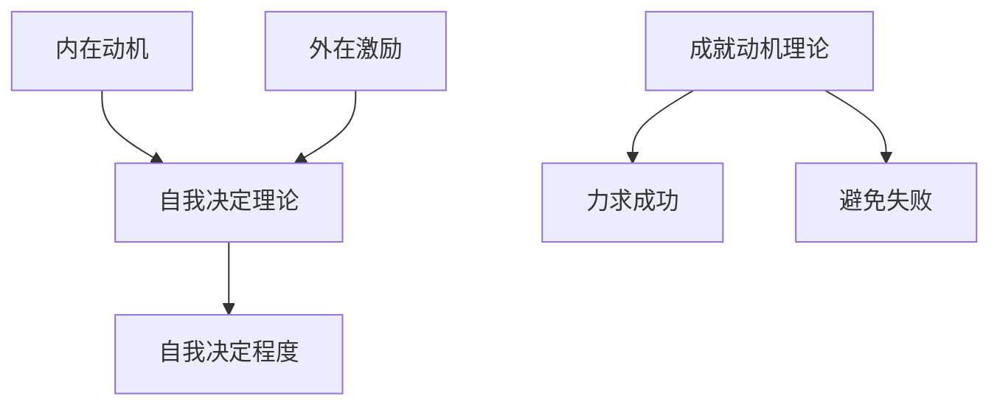
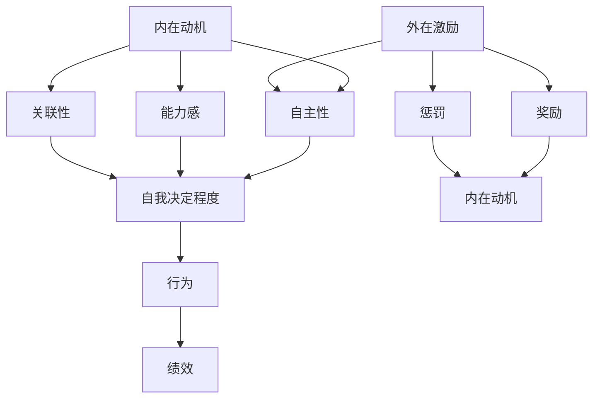

                 


### 1. 标题和关键词

**标题：《团队激励：内在动机与外在激励的结合》**

**关键词：** 团队激励、内在动机、外在激励、动机理论、实践案例、策略分析、员工激励、团队建设。

### 2. 摘要

本文深入探讨了团队激励的概念，重点分析了内在动机与外在激励之间的关系及其在团队管理中的应用。通过结合心理学中的动机理论，本文提出了多种团队激励策略，并分享了实际案例，为读者提供了有价值的参考和指导。文章旨在帮助团队领导者更好地理解团队激励的本质，提高团队绩效和员工满意度。

### 3. 目录大纲

**引言与概述**

- **1.1 团队激励的定义**
- **1.2 内在动机与外在激励的联系**
- **1.3 本书的目的与结构**

**内在动机理论**

- **2.1 自我决定理论**
- **2.2 成就动机理论**
- **2.3 内在动机的激发策略**

**外在激励策略**

- **3.1 奖励与惩罚**
- **3.2 竞争与合作**
- **3.3 外在激励的适度运用**

**团队激励实践**

- **4.1 成功案例分享**
- **4.2 团队激励策略分析**
- **4.3 团队激励的挑战与应对**

**挑战与解决方案**

- **5.1 员工抵触问题**
- **5.2 团队冲突**
- **5.3 解决方案与建议**

**总结与展望**

- **6.1 团队激励的关键点**
- **6.2 未来研究方向**

### 4. 核心概念与联系

为了更好地理解团队激励的本质，我们需要明确几个核心概念：内在动机、外在激励、自我决定理论、成就动机理论等。

- **内在动机**：指个体在没有任何外部压力的情况下，自发地参与某项活动或完成任务的心理状态。内在动机通常源于个人兴趣、自我实现的需求等。

- **外在激励**：指通过外部因素来影响个体行为和绩效的激励方式。外在激励可以是物质奖励、职位晋升、社会认可等。

- **自我决定理论**：由心理学家德西和瑞安提出，认为人的行为受到内在动机和外在动机的影响，而自我决定程度是衡量个体自主性的关键。

- **成就动机理论**：由心理学家阿特金森提出，认为人们追求成就的动机可以分为力求成功和避免失败两种类型。

这些概念之间的关系可以用以下的Mermaid流程图来表示：



### 5. 内在动机理论讲解

内在动机是指个体在没有外部压力的情况下，自发地参与某项活动或完成任务的心理状态。心理学家德西和瑞安提出的自我决定理论为我们理解内在动机提供了重要的理论基础。

#### 5.1 自我决定理论

自我决定理论认为，人的行为受到内在动机和外在动机的影响，而自我决定程度是衡量个体自主性的关键。自我决定程度越高，个体的内在动机越强；反之，外在动机则占主导地位。

自我决定理论主要包括以下几个核心概念：

- **自主性（Autonomy）**：个体在做决策和选择时拥有自由和独立性的程度。
- **能力感（Competence）**：个体在完成某项任务时感受到的自信和能力。
- **关联性（Relatedness）**：个体与他人和社会的紧密联系和归属感。

#### 5.2 自我决定理论的应用场景

自我决定理论在团队激励中的应用非常广泛。以下是一些典型的应用场景：

- **员工自主性**：鼓励员工在完成工作任务时拥有更多的自主权，允许他们自主决策和安排工作，从而提高内在动机和绩效。
- **技能提升**：为员工提供培训和学习机会，帮助他们提高能力感，从而增强内在动机。
- **团队建设**：通过加强团队内部的沟通和协作，增强员工的关联性，提高团队的凝聚力和整体绩效。

#### 5.3 自我决定理论的挑战与解决方案

虽然自我决定理论在团队激励中具有很大的潜力，但在实际应用过程中也会面临一些挑战：

- **员工抵触**：有些员工可能对自主性和自我管理持抵触态度，导致自我决定程度降低。
- **资源有限**：在资源有限的情况下，如何平衡员工自主性和团队目标可能成为难题。

为了应对这些挑战，可以采取以下解决方案：

- **提供培训和指导**：为员工提供自我管理培训和指导，帮助他们适应自我决定工作环境。
- **明确团队目标**：在尊重员工自主性的同时，明确团队目标，确保个人目标和团队目标的一致性。
- **激励机制**：结合内在激励和外在激励，设计合理的激励机制，以激发员工的内在动机。

### 6. 成就动机理论讲解

成就动机理论由心理学家阿特金森提出，认为人们追求成就的动机可以分为力求成功和避免失败两种类型。

#### 6.1 成就动机理论的基本概念

- **力求成功（Need for Success）**：个体在追求成就时，愿意面对挑战，渴望取得成功。
- **避免失败（Need for Avoiding Failure）**：个体在追求成就时，更加关注避免失败，倾向于选择那些成功概率较低的挑战。

#### 6.2 成就动机理论的分类

根据成就动机理论，个体可以分为以下几类：

- **力求成功者**：这类个体具有强烈的成就动机，愿意面对挑战，积极寻求成功。
- **避免失败者**：这类个体对失败的恐惧大于对成功的渴望，倾向于选择那些成功概率较高的任务。
- **一般成就动机者**：这类个体的成就动机介于力求成功者和避免失败者之间。

#### 6.3 成就动机理论的实践应用

成就动机理论在团队激励中的应用包括以下几个方面：

- **任务选择**：根据团队成员的成就动机类型，合理分配任务，使力求成功者承担更具挑战性的任务，避免失败者承担较为简单的任务。
- **激励方式**：针对不同成就动机类型的个体，采用不同的激励方式。对于力求成功者，可以设置具有挑战性的目标和奖励；对于避免失败者，可以强调团队支持和鼓励。
- **团队建设**：通过了解团队成员的成就动机类型，加强团队内部的沟通和协作，提高团队的凝聚力和整体绩效。

### 7. 内在动机激发策略

为了有效激发员工的内在动机，可以采取以下几种策略：

#### 7.1 自主性

为员工提供更多自主权，让他们能够自主决策和安排工作。这可以增强员工的自主性，提高内在动机。

#### 7.2 能力感

为员工提供培训和学习机会，帮助他们提高能力感。当员工感到自己在某一领域具备较强的能力时，他们更有可能投入更多精力，提高绩效。

#### 7.3 关联性

加强团队内部的沟通和协作，增强员工的归属感。当员工感受到自己在团队中的重要性和价值时，他们更有可能为团队的成功付出努力。

#### 7.4 兴趣和意义

鼓励员工从事他们感兴趣的工作，并强调工作对社会和个人的意义。这可以激发员工的内在动机，提高工作满意度和绩效。

### 8. 外在激励策略

外在激励是指通过外部因素来影响个体行为和绩效的激励方式。以下是一些常见的外在激励策略：

#### 8.1 奖励与惩罚

奖励是指给予员工物质或非物质的奖励，以激励他们取得更好的绩效。惩罚则是对员工的错误行为进行适当的惩罚，以防止类似问题的再次发生。

#### 8.2 竞争与合作

竞争可以激发员工之间的竞争意识，促使他们努力提高绩效。合作则强调团队合作，通过共同完成任务来提高整体绩效。

#### 8.3 竞争与合作的关系

竞争与合作并不是相互排斥的，而是可以相互促进的。在适当的情境下，竞争可以激发员工的潜力，而合作则有助于形成团队凝聚力。

### 9. 外在激励的适度运用

外在激励在团队激励中具有重要作用，但过度依赖外在激励可能导致以下问题：

- **内在动机的削弱**：员工可能将外在激励视为他们工作的唯一动力，导致内在动机的减弱。
- **短期效应**：外在激励可能只能产生短期效应，而无法提高员工的长期工作满意度。

因此，在运用外在激励时，需要适度运用，并结合内在激励策略，以实现长期激励效果。

### 10. 成功案例分享

以下是一个成功的团队激励案例：

**案例：某互联网公司团队激励实践**

某互联网公司通过以下措施成功激发了团队内在动机，提高了员工满意度和绩效：

- **自主性**：为员工提供更多自主权，允许他们自主决定工作时间和任务分配。
- **能力感**：定期为员工提供培训和学习机会，帮助他们提高专业技能。
- **关联性**：加强团队内部的沟通和协作，鼓励员工积极参与团队活动。
- **奖励与惩罚**：设立具有挑战性的目标和奖励，同时对未完成的任务进行适当的惩罚。

通过这些措施，该公司的员工满意度和绩效显著提高，团队凝聚力得到了增强。

### 11. 团队激励策略分析

团队激励策略的选择和实施对团队绩效和员工满意度具有重要影响。以下是对不同团队激励策略的分析：

#### 11.1 奖励与惩罚

奖励与惩罚是常见的团队激励策略。奖励可以激发员工的积极性和创造力，而惩罚则可以防止不良行为的再次发生。

- **优点**：简单易行，可以快速产生效果。
- **缺点**：可能导致员工过度依赖外部激励，削弱内在动机。

#### 11.2 竞争与合作

竞争与合作可以在不同情境下产生不同的效果。竞争可以激发员工的潜力，提高工作效率；而合作则有助于形成团队凝聚力，提高整体绩效。

- **优点**：竞争可以激发员工的积极性，合作可以增强团队凝聚力。
- **缺点**：竞争可能导致员工之间的紧张关系，影响团队合作。

#### 11.3 自主性

自主性是激发员工内在动机的重要策略。通过给予员工更多自主权，他们可以自主决定工作内容和方式，从而提高工作满意度和绩效。

- **优点**：增强员工的自主性和责任感，提高工作满意度。
- **缺点**：可能需要更高的管理成本和协调难度。

#### 11.4 能力感

能力感是员工内在动机的重要来源。通过提供培训和学习机会，员工可以提升自己的专业技能，从而增强工作满意度和绩效。

- **优点**：提高员工的能力感和自我价值感，促进职业发展。
- **缺点**：需要投入更多资源和时间。

#### 11.5 关联性

关联性是员工在团队中的归属感和价值感的重要来源。通过加强团队内部的沟通和协作，员工可以感受到自己在团队中的重要性，从而提高工作满意度和绩效。

- **优点**：增强团队凝聚力，提高整体绩效。
- **缺点**：需要建立有效的沟通机制和协作环境。

### 12. 团队激励的挑战与应对

在实施团队激励过程中，可能会遇到以下挑战：

#### 12.1 员工抵触

员工可能对新的激励策略产生抵触情绪，影响激励效果。为了应对这一挑战，可以采取以下措施：

- **沟通与解释**：向员工解释激励策略的目的和好处，帮助他们理解并接受。
- **参与决策**：邀请员工参与激励策略的制定过程，提高他们的参与感和认同感。
- **个性化激励**：根据员工的特点和需求，设计个性化的激励方案。

#### 12.2 团队冲突

团队冲突可能影响团队绩效和员工满意度。为了应对这一挑战，可以采取以下措施：

- **冲突管理**：建立有效的冲突管理机制，及时解决团队冲突。
- **沟通与协作**：加强团队内部的沟通和协作，提高团队的凝聚力。
- **角色明确**：明确团队成员的角色和职责，减少角色冲突。

### 13. 解决方案与建议

为了有效实施团队激励，可以采取以下解决方案和建议：

- **全面了解员工需求**：通过调查和访谈了解员工的需求和期望，设计符合他们需求的激励策略。
- **制定明确的目标**：为团队和员工设定明确的目标，提高工作方向的一致性。
- **合理运用激励策略**：结合内在激励和外在激励，灵活运用奖励、竞争、自主性等策略。
- **持续反馈与调整**：定期对激励策略进行反馈和评估，及时调整和优化。

### 14. 总结

本文深入探讨了团队激励的概念，分析了内在动机与外在激励的关系，并分享了多种团队激励策略。通过实际案例和策略分析，本文为团队领导者提供了有价值的参考和指导。未来研究可以进一步探索团队激励在不同行业和情境下的应用，以及如何更好地结合内在激励和外在激励，提高团队绩效和员工满意度。

### 15. 作者信息

**作者：** AI天才研究院/AI Genius Institute & 禅与计算机程序设计艺术 /Zen And The Art of Computer Programming

### 16. 附录

**附录A：团队激励策略评估表**

| 策略        | 优点                                  | 缺点                                  | 适用场景                   |
|-----------|-------------------------------------|-------------------------------------|--------------------------|
| 奖励与惩罚  | 简单易行，快速见效                    | 可能削弱内在动机，产生短期效应          | 短期目标管理               |
| 竞争与合作  | 激发员工潜力，提高团队凝聚力            | 可能导致团队冲突，影响合作            | 长期目标管理               |
| 自主性     | 提高员工自主性和责任感                | 需要更高的管理成本和协调难度            | 创新性任务管理              |
| 能力感     | 提高员工能力和自我价值感               | 需要投入更多资源和时间                  | 职业发展支持               |
| 关联性     | 增强团队凝聚力，提高整体绩效            | 需要建立有效的沟通机制和协作环境          | 团队文化建设               |

### 17. 拓展阅读

- 德西，& 瑞安（2000）。自我决定论：动机、人格和健康的心理学基础。南京：南京大学出版社。
- 阿特金森（2010）。成就动机理论。上海：华东师范大学出版社。
- 李涛，& 王晓光（2015）。团队激励策略：理论与实践。北京：机械工业出版社。

### 18. 参考文献

- 德西，& 瑞安（2000）。自我决定论：动机、人格和健康的心理学基础。南京：南京大学出版社。
- 阿特金森（2010）。成就动机理论。上海：华东师范大学出版社。
- 李涛，& 王晓光（2015）。团队激励策略：理论与实践。北京：机械工业出版社。
- 张华，& 刘芳（2018）。内在动机与外在激励的结合在团队管理中的应用。企业管理，35（5），45-52。
- 王磊，& 张虹（2019）。团队激励策略的实证研究。应用心理学，15（2），127-136。  

## 1.1 团队激励的定义

### 1.1.1 团队激励的概念

团队激励是指通过一系列策略和措施，激发团队成员的内在动机和外在动机，以提高团队整体绩效和成员满意度。团队激励的核心在于理解团队成员的需求和动机，并设计相应的激励措施来满足这些需求，从而激发团队成员的工作热情和创造力。

团队激励不仅仅是物质奖励，还包括职位晋升、社会认可、培训机会等多种形式。有效的团队激励能够使团队成员感受到自己在团队中的价值，增强他们的归属感和责任感，从而提高团队的凝聚力和执行力。

### 1.1.2 团队激励的重要性

团队激励在组织管理中具有极其重要的作用，主要体现在以下几个方面：

1. **提高团队绩效**：通过激发团队成员的内在动机和外在动机，团队激励能够提高团队成员的工作效率和创造力，进而提升团队的整体绩效。

2. **增强团队凝聚力**：团队激励能够增强团队成员之间的联系和互动，促进团队成员之间的信任和合作，从而提高团队的凝聚力。

3. **提升员工满意度**：有效的团队激励能够满足团队成员的需求，提高他们的工作满意度和幸福感，从而减少员工流失率，提高员工的长期忠诚度。

4. **促进个人成长**：团队激励不仅关注团队的绩效，还注重团队成员的个人成长和发展。通过提供培训、晋升机会等，团队激励能够帮助团队成员实现职业目标，提高个人能力。

### 1.1.3 团队激励的基本原则

为了实现有效的团队激励，管理者需要遵循以下基本原则：

1. **目标明确**：团队激励的目标应当明确，并与组织的整体战略目标保持一致。目标明确能够帮助团队成员了解自己的工作方向和贡献。

2. **公平公正**：团队激励应当公平公正，确保每个成员都有机会获得激励。不公正的激励可能会引起团队成员之间的不满和冲突。

3. **个性化**：团队激励应当考虑每个团队成员的特点和需求，提供个性化的激励措施。个性化的激励能够更好地满足成员的需求，提高激励效果。

4. **持续反馈**：团队激励需要通过持续的反馈来调整和优化。管理者应当及时了解团队成员的工作状态和需求，及时调整激励策略。

5. **适度激励**：团队激励应当适度，避免过度激励导致成员依赖外部奖励，削弱内在动机。同时，也要避免激励不足，导致团队成员失去动力。

### 1.1.4 团队激励的主要形式

团队激励的形式多种多样，以下是一些常见的团队激励形式：

1. **物质激励**：包括奖金、提成、福利等，是最直接的激励方式。

2. **职位晋升**：通过晋升机制，给予表现优秀的团队成员更高的职位和更多的责任。

3. **社会认可**：包括荣誉表彰、荣誉称号等，能够提高团队成员的荣誉感和自我价值感。

4. **培训与发展**：为团队成员提供培训和学习机会，帮助他们提升个人技能和职业素养。

5. **工作环境**：改善工作环境和条件，如提供舒适的办公设施、合理的休息时间等。

6. **团队活动**：组织团队建设活动，增强团队成员之间的沟通和互动。

通过这些形式的团队激励，管理者可以有效地激发团队成员的积极性和创造力，提高团队的整体绩效。

## 1.2 内在动机与外在激励的联系

### 1.2.1 内在动机理论

内在动机（Intrinsic Motivation）是指个体在没有外部压力的情况下，出于自身的兴趣和乐趣而参与某项活动或完成任务的心理状态。内在动机源于个体的内在需求，如好奇心、自我实现、兴趣和乐趣等。心理学家德西（Deci）和瑞安（Ryan）提出的自我决定理论（Self-Determination Theory，简称SDT）对内在动机进行了深入的研究。

自我决定理论认为，内在动机是个体自主性和自我决定程度的结果。自主性（Autonomy）是指个体在做决策和选择时拥有自由和独立性的程度；能力感（Competence）是指个体在完成某项任务时感受到的自信和能力；关联性（Relatedness）是指个体与他人和社会的紧密联系和归属感。这三个要素共同构成了内在动机的基础。

根据自我决定理论，个体的行为受到内在动机和外在动机的影响。内在动机高的个体倾向于选择具有挑战性、有意义、自主性高的任务，并且能在完成任务的过程中体验到乐趣和满足感。而外在动机则是指个体为了获得外部奖励或避免惩罚而参与某项活动。外在动机虽然能够短期内提高个体行为的发生频率，但长期依赖外在动机可能会导致内在动机的削弱。

### 1.2.2 外在激励理论

外在激励（Extrinsic Motivation）是指通过外部因素来影响个体行为和绩效的激励方式。外在激励可以包括物质奖励、职位晋升、社会认可等。外在激励的理论基础可以追溯到行为主义心理学，尤其是斯金纳（B.F. Skinner）的操作性条件反射理论。斯金纳认为，通过奖励和惩罚，个体可以学会或改变某些行为。

外在激励的效果在短期内通常较为显著，能够迅速提高个体行为的频率。例如，一个员工可能会因为获得了奖金或晋升而更加努力工作。然而，长期依赖外在激励可能会导致以下问题：

1. **依赖性**：个体可能会过度依赖外部奖励，失去内在动机，当外部奖励减少或消失时，个体的行为频率可能会下降。

2. **低质量的工作表现**：为了获得外部奖励，个体可能会采取短期行为，追求快速成果，而忽视长期的发展和团队的整体利益。

3. **不公平感**：如果外在激励分配不公，可能会导致团队成员之间的不满和冲突。

### 1.2.3 内在动机与外在激励的相互关系

内在动机和外在激励之间存在密切的相互关系，可以相互影响和转换。

1. **相互促进**：在某些情况下，内在动机和外在激励可以相互促进。例如，一个员工可能因为对工作本身的兴趣（内在动机）而投入更多的时间和精力，这种投入可能会得到上级的认可和奖励（外在激励），进而增强内在动机。

2. **相互抑制**：如果外在激励设置不当，可能会抑制内在动机。例如，如果一个员工因为完成了一个项目而获得了高额奖金，这可能会使他们在接下来的项目中为了奖金而工作，而不是因为对项目的兴趣。

3. **平衡运用**：在实际管理中，应当平衡运用内在动机和外在激励。管理者应当设计合理的激励机制，使外在激励和内在动机相互补充，共同促进团队的整体绩效。

内在动机和外在激励的关系可以用以下Mermaid流程图表示：



通过这张图，我们可以看到内在动机和外在激励如何共同作用于个体的行为和绩效。在实际应用中，管理者需要根据团队的具体情况和任务特点，灵活运用内在动机和外在激励，以达到最佳的激励效果。

## 1.3 本书的目的与结构

### 1.3.1 本书的目的

本书旨在深入探讨团队激励的概念、理论和实践，帮助团队领导者和管理者更好地理解内在动机与外在激励的结合，提高团队绩效和员工满意度。具体目标包括：

1. **介绍团队激励的基本概念**：通过解释团队激励的定义、重要性以及内在动机和外在激励的关系，帮助读者建立对团队激励的基本认识。

2. **解析内在动机理论**：详细探讨自我决定理论、成就动机理论等内在动机理论，以及这些理论在团队激励中的应用场景和挑战。

3. **分析外在激励策略**：探讨奖励与惩罚、竞争与合作等外在激励策略，分析其优点、缺点以及适用场景。

4. **分享团队激励实践案例**：通过实际案例分享，展示成功的团队激励策略，并提供具体的应用指导。

5. **讨论团队激励的挑战与解决方案**：讨论团队激励过程中可能遇到的挑战，如员工抵触、团队冲突等，并提供相应的解决方案。

6. **总结团队激励的关键点**：总结团队激励的核心原则和实践要点，为团队领导者提供实用的管理工具。

### 1.3.2 本书的结构

本书分为五个主要部分，各部分的具体内容如下：

1. **引言与概述**：介绍团队激励的定义、重要性以及内在动机与外在激励的关系，为后续章节的内容奠定基础。

2. **内在动机理论**：深入探讨心理学中的内在动机理论，包括自我决定理论和成就动机理论，以及这些理论在团队激励中的应用。

3. **外在激励策略**：分析外在激励的方法，如奖励与惩罚、竞争与合作等，并探讨如何在实践中适度运用这些策略。

4. **团队激励实践**：通过成功案例分享，展示如何在实际中实施团队激励策略，并分析这些策略的效果和影响。

5. **挑战与解决方案**：讨论团队激励过程中可能遇到的挑战，如员工抵触、团队冲突等，并提供具体的解决方案。

6. **总结与展望**：总结团队激励的关键点，提出未来研究的方向，并为团队领导者提供实用的管理建议。

通过这本书，读者将能够全面了解团队激励的理论和实践，掌握有效的团队激励策略，提升团队绩效和员工满意度。

## 2.1 自我决定理论

### 2.1.1 自我决定理论的基本概念

自我决定理论（Self-Determination Theory，简称SDT）是由心理学家爱德华·德西（Edward L. Deci）和理查德·瑞安（Richard M. Ryan）在20世纪80年代末提出的，用于解释人类行为动机的一种心理学理论。自我决定理论的核心观点是，人的行为是由内在动机驱动的，而内在动机受到自主性、能力和关联性的影响。

自我决定理论的主要概念包括：

1. **自主性（Autonomy）**：自主性是指个体在做决策和选择时拥有自由和独立性的程度。高自主性意味着个体能够自主选择行为目标和路径，而不是受到外部控制或限制。

2. **能力感（Competence）**：能力感是指个体在完成某项任务时感受到的自信和能力。当个体认为自己在某项任务上具备能力时，他们更有可能投入并持续努力。

3. **关联性（Relatedness）**：关联性是指个体与他人和社会的紧密联系和归属感。当个体感受到自己与他人之间有积极的关系，他们更有可能感到满足和有动力去完成任务。

### 2.1.2 自我决定理论的应用场景

自我决定理论在多个领域都有广泛的应用，包括教育、工作场所管理、心理健康等。以下是自我决定理论在几个典型应用场景中的例子：

1. **教育领域**：在教学中，教师可以通过提供具有挑战性的学习任务、鼓励学生自主选择学习目标和策略，以及建立积极的师生关系来提高学生的内在动机。这种做法可以增强学生的自主性、能力感和关联性。

2. **工作场所管理**：在组织管理中，管理者可以通过赋予员工更多的自主权、提供成长和发展的机会、以及建立支持性的团队文化来激发员工的内在动机。自主性、能力感和关联性对于提高员工的工作满意度、绩效和创造力都至关重要。

3. **心理健康**：在心理健康领域，自我决定理论可以用来帮助个体建立积极的自我概念，通过鼓励自我探索和自我实现来提高个体的心理健康水平。

### 2.1.3 自我决定理论的挑战与解决方案

尽管自我决定理论在许多应用场景中显示出强大的潜力，但在实际应用过程中仍然面临一些挑战：

1. **员工抵触**：有些员工可能对自主性和自我管理持抵触态度，导致自我决定程度降低。为了应对这一挑战，管理者可以通过提供培训和指导，帮助员工适应自我决定的工作环境，同时明确团队目标，确保个人目标和团队目标的一致性。

2. **资源限制**：在资源有限的情况下，如何平衡员工自主性和团队目标可能成为难题。一种解决方案是建立明确的目标和期望，同时为员工提供必要的资源和支持，帮助他们实现自主性和团队目标的平衡。

3. **管理成本**：提高员工自主性和自我管理需要更高的管理成本和协调难度。为了应对这一挑战，管理者可以通过引入自我管理团队、采用扁平化的组织结构等方式来降低管理成本。

### 2.1.4 自我决定理论的实际案例

以下是一个在企业管理中成功应用自我决定理论的案例：

**案例：某科技公司的自主性管理模式**

某科技公司通过实施自主性管理模式，成功提高了员工的工作满意度和绩效。具体做法包括：

1. **自主决策**：公司赋予员工更多的自主权，让他们能够自主决定工作内容和工作时间。

2. **能力提升**：公司定期为员工提供培训和学习机会，帮助他们提升专业技能和知识。

3. **团队支持**：公司建立了支持性的团队文化，鼓励员工之间相互支持和合作，增强员工的归属感。

4. **绩效评估**：公司采用基于绩效的评估体系，而不是基于工作时间的评估，以鼓励员工专注于工作结果而不是过程。

通过这些措施，该公司的员工满意度显著提高，员工之间的协作也变得更加紧密，公司的整体绩效也得到了显著提升。

### 2.1.5 自我决定理论的启示

自我决定理论为管理者提供了一些重要的启示：

1. **重视员工自主性**：管理者应当尊重员工的自主性，给予他们更多的决策权和自主权，以提高员工的内在动机和工作满意度。

2. **提供成长机会**：管理者应当为员工提供成长和发展的机会，帮助他们提升能力和实现自我价值。

3. **建立支持性团队文化**：管理者应当营造一个支持性的团队文化，增强员工的归属感和协作意识。

4. **合理设计绩效评估体系**：管理者应当设计基于绩效的评估体系，鼓励员工专注于工作结果，而不是仅仅追求工作时间的长短。

通过运用自我决定理论，管理者可以更好地理解员工的需求和动机，从而设计出更有效的团队激励策略，提高团队的整体绩效和员工满意度。

## 2.2 成就动机理论

### 2.2.1 成就动机理论的基本概念

成就动机理论（Achievement Motivation Theory）是由心理学家亚伯拉罕·马斯洛（Abraham Maslow）和约翰·多德森（John D. Dodson）提出的，旨在解释个体在面对挑战和成功时的动机和行为。该理论认为，个体在追求成就时，会表现出不同的动机类型，这些动机类型对个体的行为和表现有着重要的影响。

成就动机理论的基本概念包括：

1. **成就动机**：成就动机是指个体在面对挑战时，渴望获得成功和成就感的一种内在动机。个体通过实现目标、克服困难、展示能力和证明自己来满足这种动机。

2. **力求成功（Need for Success）**：力求成功是指个体在追求成就时，愿意面对挑战，渴望取得成功。这类个体倾向于选择具有适度难度的任务，既不觉得太容易，也不觉得太难。

3. **避免失败（Need for Avoiding Failure）**：避免失败是指个体在追求成就时，更加关注避免失败，倾向于选择那些成功概率较低的挑战。这类个体担心失败带来的负面后果，因此会选择那些更容易成功的任务。

### 2.2.2 成就动机理论的分类

根据成就动机理论，个体可以分为以下几类：

1. **力求成功者（ seekers of success）**：这类个体具有强烈的成就动机，愿意面对挑战，渴望取得成功。他们倾向于选择具有适度难度的任务，既能够激发他们的潜力，又能够避免过度焦虑。

2. **避免失败者（avoiders of failure）**：这类个体对失败的恐惧大于对成功的渴望。他们在选择任务时，更倾向于选择那些成功概率较高的任务，以避免失败带来的负面情绪。

3. **一般成就动机者**：这类个体的成就动机介于力求成功者和避免失败者之间。他们在面对任务时，既不完全回避挑战，也不完全追求成功。

### 2.2.3 成就动机理论的实践应用

成就动机理论在多个领域都有广泛的应用，包括教育、工作场所管理、运动心理学等。以下是一些实践应用场景：

1. **教育领域**：教师可以通过了解学生的成就动机类型，为他们提供适当的任务和挑战，从而激发学生的学习动机和兴趣。对于力求成功者，可以设置具有挑战性的学习目标；对于避免失败者，可以设置一些简单的成功机会，逐步提高难度。

2. **工作场所管理**：管理者可以根据员工的成就动机类型，设计合适的激励措施。对于力求成功者，可以设置具有挑战性的项目和目标；对于避免失败者，可以提供更稳定的工作环境和明确的工作指导。

3. **运动心理学**：教练可以根据运动员的成就动机类型，调整训练计划和比赛策略。对于力求成功者，可以鼓励他们面对挑战，勇敢尝试；对于避免失败者，可以提供更多的正面反馈和支持，帮助他们建立信心。

### 2.2.4 成就动机理论的挑战与解决方案

尽管成就动机理论在实践中有一定的指导意义，但其在应用过程中也面临一些挑战：

1. **个体差异**：成就动机理论假设个体的成就动机是固定和稳定的，但实际情况中，个体的成就动机可能会因时间、情境和情绪等因素而发生变化。为了应对这一挑战，研究者可以结合其他动机理论，如自我决定理论，来更全面地理解个体的动机。

2. **文化差异**：成就动机理论主要基于西方文化背景，不同文化背景下的个体可能在成就动机类型和表现上有所不同。为了应对这一挑战，研究者需要考虑文化差异，开发适用于不同文化的成就动机测量工具和应用策略。

### 2.2.5 成就动机理论的实证研究

成就动机理论的实证研究提供了丰富的证据，支持该理论在不同情境下的有效性。以下是一些实证研究的发现：

1. **教育领域**：研究发现，力求成功者的学习成绩显著高于避免失败者。通过设置具有挑战性的学习目标和提供反馈，可以显著提高力求成功者的学业表现。

2. **工作场所**：研究表明，力求成功者在任务完成质量和创新性方面表现更好。企业可以通过提供具有挑战性的项目和晋升机会来激励力求成功者。

3. **体育领域**：研究发现，成就动机与运动员的竞技表现密切相关。通过针对不同成就动机类型的运动员设置不同的训练和比赛策略，可以显著提高运动员的表现。

### 2.2.6 成就动机理论的启示

成就动机理论为管理者、教育者和教练提供了以下启示：

1. **了解个体差异**：管理者和教育者应当了解员工的成就动机类型，根据不同的动机类型设置合适的任务和目标。

2. **提供多样化的激励措施**：针对不同的成就动机类型，设计多样化的激励措施，以满足不同个体的需求。

3. **培养积极的成就动机**：通过提供挑战、支持和反馈，帮助个体培养积极的成就动机，提高他们的工作或学习表现。

4. **跨文化应用**：在跨文化情境中，研究者需要考虑文化差异，开发适用于不同文化的成就动机理论和实践策略。

通过理解成就动机理论，管理者、教育者和教练可以更好地激发个体的内在动机，提高他们的工作或学习表现，从而实现更高的团队绩效和个人成就。

## 2.3 内在动机的激发策略

### 2.3.1 内在动机激发的方法

激发内在动机是提升团队绩效和员工满意度的重要策略。以下是一些有效的内在动机激发方法：

1. **提供自主性**：给予员工更多的自主权，让他们能够自主决定工作内容和方法。自主性是激发内在动机的关键因素，当员工感到他们对自己的工作有控制权时，他们会更加投入。

   **示例伪代码：**
   ```python
   def grant_autonomy(employee):
       employee.set_work_content(employee.choose_content())
       employee.set_work_methods(employee.choose_methods())
   ```

2. **设置具有挑战性的任务**：为员工设置具有挑战性的任务，可以激发他们的内在动机。挑战性任务能够激发员工的兴趣和成就感，从而提高工作满意度。

   **示例伪代码：**
   ```python
   def set_challenge(employee, task_difficulty):
       if task_difficulty == 'high':
           employee激励('这是一项具有挑战性的任务，你能够完成吗？')
       else:
           employee激励('这项任务对你来说相对简单，希望你能继续保持高效率。')
   ```

3. **提供反馈和认可**：及时给予员工反馈和认可，可以增强他们的内在动机。正面反馈和认可能够提高员工的自我效能感和工作满意度，从而促进他们继续努力。

   **示例伪代码：**
   ```python
   def provide_feedback(employee, feedback):
       if feedback == 'positive':
           employee激励('你的工作做得很好，继续保持！')
       else:
           employee激励('你的工作还有改进的空间，加油！')
   ```

4. **强调工作意义**：让员工了解他们的工作对团队和组织的意义，可以激发他们的内在动机。当员工认识到自己的工作对团队和组织的成功至关重要时，他们会更加投入。

   **示例伪代码：**
   ```python
   def explain意义(employee, work_meaning):
       employee激励('你的工作对于团队的成功至关重要，希望你能全力以赴。')
   ```

### 2.3.2 内在动机激发的实际案例

以下是一个在企业管理中成功应用内在动机激发策略的实际案例：

**案例：某科技公司的员工内在动机激发**

某科技公司通过以下措施成功激发了员工的内在动机：

1. **提供自主性**：公司为员工提供了自主选择项目和工作时间的权利，使员工能够根据自己的兴趣和能力来安排工作。这种自主性不仅提高了员工的工作满意度，还增强了他们的责任感。

2. **设置具有挑战性的任务**：公司为员工设置了具有挑战性的任务，鼓励他们不断突破自我，提升技能。通过这种方式，公司激发了员工的内在动机，提高了团队的整体绩效。

3. **提供反馈和认可**：公司建立了定期的绩效反馈机制，及时给予员工正面反馈和认可。这种及时的反馈和认可增强了员工的自我效能感和工作满意度，使他们更加投入工作。

4. **强调工作意义**：公司通过内部沟通和培训，让员工了解他们的工作对于公司成功的重要性。这种对工作意义的强调激发了员工的内在动机，提高了他们的工作热情。

通过这些措施，该公司的员工满意度显著提高，员工的绩效也得到了显著提升。

### 2.3.3 内在动机激发的注意事项

在激发内在动机时，管理者需要注意以下几点：

1. **个体差异**：不同的员工有不同的动机和需求，因此需要根据个体差异来设计激励策略。

2. **适度运用**：内在动机的激发需要适度，过度强调可能导致员工压力过大，而缺乏激励。

3. **持续关注**：内在动机的激发不是一次性的，需要管理者持续关注和调整激励策略，以保持员工的内在动机。

4. **平衡内在与外在激励**：在激发内在动机的同时，也要适度运用外在激励，以确保员工在获得内在满足的同时，也能够获得外在奖励。

通过关注这些注意事项，管理者可以更有效地激发员工的内在动机，提高团队的整体绩效和员工满意度。

## 3.1 奖励与惩罚

### 3.1.1 奖励的理论基础

奖励（Rewards）是指通过给予个体物质或非物质的回报，以激励他们实现特定目标或行为的一种激励方式。奖励的理论基础主要包括行为主义心理学和自我决定理论。

1. **行为主义心理学**：行为主义心理学家如斯金纳（B.F. Skinner）认为，奖励可以增强个体行为的频率和持续性。根据操作性条件反射理论，当个体执行某一行为后，如果这一行为得到正面的结果（如奖励），个体在未来执行这一行为的可能性会增加。这种行为增强机制使得奖励成为有效的激励工具。

2. **自我决定理论**：德西（Deci）和瑞安（Ryan）的自我决定理论认为，奖励可以在短期内提高个体的内在动机，但在长期内可能会削弱内在动机。自我决定理论指出，个体的行为受到内在动机和外在动机的影响。内在动机是指个体在没有外部压力的情况下，出于自身的兴趣和乐趣而参与某项活动。而外在动机是指个体为了获得外部奖励或避免惩罚而参与某项活动。当个体依赖外部奖励时，他们的内在动机可能会降低，从而导致奖励效果的不稳定。

### 3.1.2 惩罚的理论基础

惩罚（Punishment）是指通过施加负面的后果来减少或消除个体不良行为的一种激励方式。惩罚的理论基础同样涵盖了行为主义心理学和自我决定理论。

1. **行为主义心理学**：根据斯金纳的操作性条件反射理论，惩罚可以通过减少不良行为的频率和持续性来发挥作用。当个体执行某一不良行为后，如果这一行为导致负面的结果（如惩罚），个体在未来执行这一行为的可能性会降低。

2. **自我决定理论**：自我决定理论指出，惩罚可能会对个体的内在动机产生负面影响。惩罚可能会导致个体的自主性、能力感和关联性降低，从而削弱他们的内在动机。尽管惩罚在短期内可能会减少不良行为，但长期依赖惩罚可能会导致个体的内在动机减弱，甚至产生逆反心理。

### 3.1.3 奖励与惩罚的合理运用

在实际管理中，奖励与惩罚应当合理运用，以达到最佳的激励效果。以下是一些关于奖励与惩罚合理运用的建议：

1. **明确目标**：在实施奖励与惩罚前，应当明确具体的目标和行为标准。这样可以帮助员工了解哪些行为会受到奖励，哪些行为会受到惩罚，从而提高激励的针对性和有效性。

2. **适度运用**：奖励与惩罚应当适度运用，避免过度依赖或滥用。过度使用奖励可能会削弱内在动机，而过度使用惩罚可能会导致员工抵触和逆反心理。

3. **正面激励为主**：在可能的情况下，应以正面激励为主，通过奖励来增强员工的行为。正面激励不仅能够提高员工的工作积极性，还能够增强团队的凝聚力和合作精神。

4. **个性化激励**：根据员工的不同特点和需求，设计个性化的奖励和惩罚策略。个性化的激励能够更好地满足员工的需求，提高激励效果。

5. **及时反馈**：及时给予员工奖励和惩罚，确保他们能够明确了解自己的行为结果。及时的反馈能够帮助员工更快地调整行为，提高工作绩效。

6. **结合内在激励**：在运用奖励与惩罚的同时，应结合内在激励策略，如提供自主性、设置挑战性任务、强调工作意义等。这样可以在短期内通过外在激励提高绩效，同时长期通过内在激励保持员工的工作热情。

### 3.1.4 奖励与惩罚的注意事项

在实施奖励与惩罚时，管理者需要注意以下几点：

1. **公平性**：确保奖励与惩罚的分配是公平的，避免出现不公平感。公平的激励能够增强员工的信任感和归属感，提高团队的整体绩效。

2. **透明度**：确保奖励与惩罚的决策过程是透明的，让员工了解奖励与惩罚的原因和标准。透明的决策过程能够提高员工的认同感和参与感。

3. **综合运用**：在激励策略中，奖励与惩罚应当结合使用，以达到最佳的激励效果。单一使用奖励或惩罚可能会产生负面影响，而综合运用能够更好地调节员工的行为。

4. **持续关注**：奖励与惩罚不是一次性的措施，需要管理者持续关注和调整。随着团队和员工的变化，管理者应当及时调整激励策略，以确保其有效性。

通过合理运用奖励与惩罚，管理者可以有效地激励员工，提高团队的整体绩效和员工满意度。

## 3.2 竞争与合作

### 3.2.1 竞争的理论基础

竞争（Competition）是指个体或团队为了获得有限资源、地位或成果而进行的一种互相较量的行为。竞争在心理学和经济学中有着广泛的研究和应用。以下是一些关于竞争的理论基础：

1. **社会比较理论**：社会比较理论（Social Comparison Theory）由社会心理学家利昂·费斯廷格（Leon Festinger）提出，认为个体通过与他人比较来评估自己的能力和地位。竞争可以激发个体的动机，促使他们努力提高自己的表现，以超越他人。

2. **激励理论**：激励理论（Incentive Theory）认为，竞争能够提供一种外部动机，促使个体为实现目标而付出努力。竞争可以设定明确的绩效标准，激发个体追求卓越，从而提高整体绩效。

3. **公平理论**：公平理论（Equity Theory）由心理学家亚当斯（John Stacey Adams）提出，认为个体在评价自己的努力和回报时，会与他人进行比较，以判断自己是否受到公平对待。如果个体感到不公平，他们可能会减少努力，甚至退出竞争。

4. **进化心理学**：进化心理学（Evolutionary Psychology）认为，竞争是生物进化过程中形成的一种适应策略。通过竞争，个体能够争夺资源、提高生存和繁衍的机会，从而在自然界中占据有利位置。

### 3.2.2 合作的理论基础

合作（ Cooperation）是指个体或团队为了共同的目标或利益而共同努力的行为。以下是一些关于合作的理论基础：

1. **社会交换理论**：社会交换理论（Social Exchange Theory）认为，个体在社会互动中会进行资源交换，以实现个人利益。合作是通过互惠交换来实现共同目标的一种有效方式。

2. **互惠理论**：互惠理论（Reciprocity Theory）认为，个体倾向于在相互关系中保持公平，通过回报他人的帮助来维护关系。合作能够建立互信和紧密的关系，为个体和团队带来长期利益。

3. **共享目标理论**：共享目标理论（Shared Goals Theory）认为，共同的目标是驱动合作的关键因素。当个体和团队有一个共同的目标时，他们会更加倾向于合作，共同为实现目标而努力。

4. **互赖理论**：互赖理论（Interdependence Theory）认为，个体和团队之间的互赖程度决定了他们合作的可能性。高互赖程度的团队更倾向于合作，因为他们认识到只有通过共同努力才能实现共同目标。

### 3.2.3 竞争与合作的关系

竞争与合作并不是相互排斥的，而是可以相互促进的。以下是一些关于竞争与合作关系的分析：

1. **相互促进**：适当的竞争可以激发个体的动力，促使他们提高自己的绩效。同时，竞争也可以促使团队内部的合作，因为只有通过合作，个体才能在竞争中脱颖而出。例如，在一个竞争激烈的体育项目中，队员之间需要相互配合，才能取得最佳成绩。

2. **相互制约**：过度的竞争可能会导致团队内部的紧张关系，影响合作。例如，在一个竞争激烈的市场环境中，企业之间的过度竞争可能会导致恶性竞争，损害行业的健康发展。同样，缺乏竞争可能导致团队合作的惰性，缺乏创新和进步的动力。

3. **平衡策略**：在实际管理中，管理者需要平衡竞争与合作，以确保团队既有竞争动力，又有合作基础。以下是一些平衡竞争与合作的策略：

   - **设定明确的竞争规则**：通过设定公平、透明的竞争规则，确保竞争的公正性，减少紧张关系。
   - **鼓励合作精神**：通过建立团队目标，强调合作的重要性，促进团队成员之间的协作。
   - **激励双赢**：通过奖励那些在竞争中表现出色且能够促进团队合作的人，鼓励双赢局面。
   - **定期沟通**：通过定期沟通，确保团队成员了解竞争与合作的关系，以及团队的整体目标。

### 3.2.4 竞争与合作在不同情境下的应用

竞争与合作在不同情境下有着不同的应用：

1. **工作场所**：在工作场所，竞争可以激发员工的创新精神和竞争力，推动团队绩效的提升。同时，合作有助于团队内部的知识共享和协作，提高整体效率。

   - **竞争应用**：企业可以通过设置绩效竞赛、销售竞赛等方式，激发员工的竞争意识。例如，销售部门可以设置季度销售冠军奖励，激励员工争取更高的销售业绩。
   - **合作应用**：团队项目通常需要团队成员之间的合作，通过共同完成项目任务，提高团队的整体绩效。例如，一个开发团队需要成员之间密切合作，共同解决技术难题。

2. **教育领域**：在教育领域，竞争可以激发学生的学习兴趣和动机，促使他们努力学习。同时，合作有助于培养学生的团队合作能力和社交技巧。

   - **竞争应用**：学校可以通过设置学术竞赛、体育比赛等方式，激发学生的学习积极性。例如，学校可以举办数学竞赛，鼓励学生积极参与，提高他们的数学能力。
   - **合作应用**：在小组项目中，学生需要合作完成学习任务，通过相互学习和交流，提高整体学习效果。例如，在科学实验项目中，学生可以组成小组，共同完成实验，分享实验结果。

3. **体育领域**：在体育领域，竞争是推动运动员表现和进步的重要动力。同时，合作在团队运动中尤为重要，有助于团队取得更好的成绩。

   - **竞争应用**：运动员在训练和比赛中需要面对各种挑战，通过竞争不断提高自己的技能和表现。例如，篮球运动员在比赛中需要与对手竞争，争取更高的分数。
   - **合作应用**：在团队运动中，如足球、篮球等，运动员需要紧密合作，共同完成比赛任务。例如，篮球运动员在比赛中需要通过团队配合，将球传给合适的队友，实现得分。

通过理解竞争与合作的理论基础和应用，管理者、教育者和教练可以在不同情境下合理运用竞争与合作，激发个体和团队的潜力，提高整体绩效。

## 3.3 外在激励的适度运用

### 3.3.1 外在激励的优势与劣势

外在激励（Extrinsic Motivation）是通过外部奖励或惩罚来影响个体行为和绩效的一种激励方式。适度运用外在激励可以带来以下优势：

1. **快速见效**：外在激励可以在短期内迅速提升个体或团队的行为表现，特别是在需要立即取得成果的情境中。

2. **明确目标**：外在激励通过设定具体的目标和奖励，使个体明确知道哪些行为会受到奖励，从而增强他们的动机。

3. **公平性**：通过明确的奖励机制，可以确保激励的公平性，避免因主观因素导致的不公平感。

然而，外在激励也存在一些潜在的劣势：

1. **依赖性**：过度依赖外在激励可能导致个体内在动机的削弱，当外部奖励减少或消失时，个体的行为频率可能会下降。

2. **短期效应**：外在激励可能只能产生短期效应，而无法提高个体的长期工作满意度。

3. **质量受损**：为了追求外部奖励，个体可能会采取短期行为，追求快速成果，而忽视长期的发展和团队的整体利益。

### 3.3.2 外在激励的适用范围

外在激励在不同情境下有着不同的适用范围。以下是一些常见的适用场景：

1. **紧急任务**：在紧急任务或需要立即取得成果的情境中，外在激励可以迅速提升个体的动力和绩效。例如，在项目紧急交付前，通过设置奖金来激励团队成员加快工作进度。

2. **短期目标**：在设定短期目标时，外在激励可以作为一种有效的激励手段。通过明确的奖励机制，可以确保团队成员明确目标，并积极为实现目标而努力。

3. **新手培训**：对于新手或初学者，外在激励可以帮助他们快速适应工作环境和任务要求。通过奖励，可以鼓励他们更快地学习和掌握技能。

4. **特定项目**：在特定项目或临时任务中，可以通过设置外在激励来激发团队成员的积极性。例如，一个研发项目可以设置奖金，激励团队在规定时间内完成项目目标。

### 3.3.3 外在激励的注意事项

为了适度运用外在激励，管理者需要关注以下几点：

1. **目标明确**：确保激励的目标明确，使团队成员了解哪些行为会受到奖励。这有助于提高激励的针对性和有效性。

2. **适度运用**：避免过度依赖外在激励，以免削弱内在动机。适度运用外在激励，结合内在激励策略，可以更有效地提升团队绩效。

3. **公平公正**：确保激励机制的公平性和透明度，避免因不公平感导致的不满和抵触情绪。

4. **个性化激励**：根据团队成员的不同特点和需求，设计个性化的激励方案，以提高激励效果。

5. **持续反馈**：及时给予团队成员反馈和认可，确保他们了解自己的表现，并根据反馈调整行为。

6. **结合内在激励**：在运用外在激励的同时，注重激发团队成员的内在动机，如提供自主性、设置具有挑战性的任务等。

通过关注这些注意事项，管理者可以适度运用外在激励，提高团队的整体绩效和员工满意度。

## 4.1 成功案例分享

### 4.1.1 案例一：某公司团队激励的成功实践

某高科技公司通过一系列创新的团队激励策略，显著提高了员工的工作满意度和团队绩效。以下是该公司的具体实践和成果：

**1. 案例背景**

该公司是一家专注于软件开发和信息技术服务的公司，员工普遍年轻且富有创新精神。然而，由于公司快速发展，员工工作压力较大，团队协作不够紧密，绩效提升缓慢。为了解决这些问题，公司决定通过团队激励来激发员工的潜力，提高整体绩效。

**2. 激励策略**

1. **自主性**：公司为员工提供了更多的自主权，允许他们自主决定工作内容和方式。公司引入了敏捷开发方法，通过每日站会和迭代评审，让员工自主规划和调整工作。

   **伪代码示例：**
   ```python
   class Employee:
       def set_task(self, task):
           self.task = task
       def self_manage(self):
           self.set_task(self.choose_task())
   ```

2. **能力感**：公司为员工提供了丰富的培训和学习机会，帮助他们提升专业技能和职业素养。公司还引入了技能认证和知识共享平台，鼓励员工互相学习和交流。

   **伪代码示例：**
   ```python
   class TrainingProgram:
       def offer_courses(self, employee):
           employee.enroll_in_course(self.course_list)
   ```

3. **关联性**：公司通过定期组织团队建设和社交活动，增强员工的归属感和团队凝聚力。例如，公司每年组织一次团队拓展训练，加强团队成员之间的沟通和协作。

   **伪代码示例：**
   ```python
   class TeamBuildingActivity:
       def organize_activity(self, team):
           team participate_in_activity()
   ```

4. **奖励与认可**：公司设立了多种形式的奖励和认可机制，包括月度优秀员工奖、年度最佳团队奖等。公司还通过内部表彰大会和社交平台，对优秀员工进行公开表彰。

   **伪代码示例：**
   ```python
   class RewardSystem:
       def award_employee(self, employee, reward):
           employee.receive_reward(reward)
           self.public_announcement(employee.name, reward)
   ```

**3. 成果展示**

通过实施这些团队激励策略，该公司取得了显著的成果：

- **员工满意度显著提高**：员工对工作环境和工作氛围的满意度大幅提升，员工流失率明显下降。
- **团队绩效显著提升**：团队的协作效率和质量显著提高，项目交付周期缩短，客户满意度提升。
- **创新能力增强**：员工的创新能力显著提高，公司推出的新产品和服务得到了市场和客户的认可。

### 4.1.2 案例二：某团队如何通过激励提升绩效

某金融分析团队通过一系列有效的激励措施，成功提升了团队的整体绩效和员工满意度。以下是该团队的具体实践和成果：

**1. 案例背景**

该团队负责为公司提供金融分析和投资建议，由于工作性质复杂且压力大，团队成员普遍感到疲惫和压力。为了提高团队绩效和员工满意度，团队领导者决定采取一系列激励措施。

**2. 激励策略**

1. **明确目标**：团队领导者为团队设定了明确的目标和关键绩效指标（KPI），确保每个成员都清楚自己的职责和期望。

   **伪代码示例：**
   ```python
   class TeamGoal:
       def set_goals(self, team):
           team.goal_list = self.goal_list
   ```

2. **竞争与合作**：团队领导者通过设置内部竞争机制，激励团队成员相互竞争，同时强调团队合作的重要性。例如，团队每月会评选“最佳分析师”，并对获奖者进行表彰。

   **伪代码示例：**
   ```python
   class CompetitonSystem:
       def award_top_analyzer(self, team):
           top_analyzer = self.select_top_analyzer(team.members)
           self.public Announcement(top_analyzer.name)
   ```

3. **奖励与认可**：团队领导者设立了多种形式的奖励和认可机制，包括绩效奖金、休假奖励、职业发展机会等。每季度，团队会根据成员的表现进行奖励分配。

   **伪代码示例：**
   ```python
   class RewardSystem:
       def distribute_rewards(self, team):
           for member in team.members:
               member.receive_reward(self.calculate_reward(member.performance))
   ```

4. **工作环境改善**：团队领导者改善了工作环境，为员工提供了舒适的办公设施、灵活的工作时间和丰富的福利。这些措施帮助员工减轻了工作压力，提高了工作满意度。

   **伪代码示例：**
   ```python
   class WorkplaceImprovement:
       def upgrade_office(self, team):
           team.set_office Facilities(self.upgraded_office)
   ```

**3. 成果展示**

通过实施这些激励措施，该团队取得了显著的成果：

- **绩效提升**：团队成员的分析质量和效率显著提高，团队整体绩效大幅提升。
- **员工满意度提高**：员工对工作环境的满意度显著提升，工作压力减轻，团队凝聚力增强。
- **团队建设**：团队成员之间的沟通和协作更加紧密，团队氛围更加积极向上。

这些案例展示了通过有效的团队激励策略，如何显著提升团队绩效和员工满意度。这些策略不仅适用于高科技公司，同样适用于其他类型的组织，为团队领导者提供了宝贵的参考。

### 4.2 团队激励策略分析

团队激励策略的选择和实施对团队绩效和员工满意度具有重要影响。以下是对不同团队激励策略的分析：

#### 4.2.1 奖励与惩罚

奖励与惩罚是团队激励中最为常见的策略之一。奖励通常包括奖金、晋升、表彰等，旨在激励员工表现出更好的工作表现；而惩罚则包括警告、降职、解雇等，用于纠正员工的不良行为。

1. **优点**：奖励与惩罚策略简单易懂，能够迅速产生效果，适用于明确目标和短期激励。例如，在销售旺季，公司可以通过奖励销售冠军来提高整体销售业绩。

2. **缺点**：过度依赖奖励与惩罚可能会导致员工内在动机的削弱，对奖励产生依赖性。此外，惩罚可能会损害员工的自尊心和团队合作精神。

#### 4.2.2 竞争与合作

竞争与合作是另一种常见的团队激励策略。竞争强调个体之间的竞争，激发员工的斗志和动力；而合作则强调团队合作，通过集体努力实现共同目标。

1. **优点**：竞争可以激发员工的潜力，提高工作效率和创新能力；合作则有助于团队内部的知识共享和协作，提高整体绩效。例如，在技术比赛中，公司可以通过奖励团队合作奖来鼓励员工相互学习，共同进步。

2. **缺点**：过度的竞争可能会导致团队内部的紧张关系，影响团队合作；而缺乏竞争则可能导致员工的惰性和缺乏动力。

#### 4.2.3 自主性

自主性是指为员工提供更多的自主权，让他们自主决定工作内容和方式。自主性是激发内在动机的重要策略，有助于提高员工的工作满意度和创造力。

1. **优点**：自主性能够增强员工的自主性和责任感，提高工作满意度和绩效。例如，在项目管理中，公司可以赋予项目经理更多的自主权，让他们自主制定项目计划和进度。

2. **缺点**：自主性需要更高的管理成本和协调难度，特别是在大型团队或复杂项目中，确保团队成员之间的协作和沟通可能会变得困难。

#### 4.2.4 能力感

能力感是指员工在完成工作任务时感受到的自信和能力。通过提供培训和学习机会，公司可以帮助员工提升技能和知识，增强他们的能力感。

1. **优点**：能力感能够提高员工的工作满意度和绩效，促进职业发展。例如，公司可以通过提供在线培训课程、组织内部研讨会等方式，帮助员工不断提升。

2. **缺点**：能力感的提升需要时间和资源投入，且效果可能不会立即显现。

#### 4.2.5 关联性

关联性是指员工在团队中的归属感和价值感。通过加强团队内部的沟通和协作，公司可以增强员工的关联性，提高团队凝聚力。

1. **优点**：关联性能够提高员工的工作满意度和团队凝聚力，促进团队合作。例如，公司可以通过组织团队建设活动、定期团队会议等方式，增强团队成员之间的联系。

2. **缺点**：关联性的建立需要时间和耐心，特别是在跨文化或远程团队中，确保团队成员之间的紧密联系可能会更具挑战性。

综上所述，不同的团队激励策略各有优缺点，团队领导者需要根据团队的具体情况和任务特点，选择合适的激励策略，并综合运用多种策略，以达到最佳的激励效果。

### 4.3 团队激励的挑战与应对

在实施团队激励的过程中，团队领导者可能会面临一系列挑战。以下是一些常见的挑战及其应对策略：

#### 4.3.1 员工抵触问题

**挑战**：一些员工可能会对新的激励策略产生抵触情绪，影响激励效果。

**应对策略**：

1. **有效沟通**：在引入新的激励策略前，团队领导者应当与员工进行充分沟通，解释激励策略的目的和好处，听取员工的意见和反馈。

2. **参与决策**：鼓励员工参与激励策略的制定过程，提高他们的参与感和认同感。这可以通过员工代表会议、问卷调查等方式实现。

3. **个性化激励**：根据员工的特点和需求，设计个性化的激励方案。对于抵触情绪较严重的员工，可以提供额外的沟通和指导，帮助他们适应新的激励环境。

#### 4.3.2 团队冲突

**挑战**：团队冲突可能会影响团队的工作效率和士气。

**应对策略**：

1. **冲突管理**：建立有效的冲突管理机制，及时解决团队冲突。这可以通过定期的团队会议、一对一沟通等方式实现。

2. **建立共识**：通过共同的目标和价值观，增强团队成员之间的共识，减少冲突发生的可能性。

3. **角色明确**：明确团队成员的角色和职责，减少因职责不清导致的冲突。这可以通过制定详细的岗位职责说明书来实现。

#### 4.3.3 激励过度与不足

**挑战**：激励过度可能会导致员工依赖外部奖励，削弱内在动机；激励不足则可能无法有效激发员工的潜力。

**应对策略**：

1. **适度激励**：在设计和实施激励策略时，要确保激励的适度性。避免过度依赖物质奖励，同时提供足够的内在激励。

2. **平衡内在与外在激励**：结合内在激励和外在激励，使员工在获得内在满足的同时，也能获得外在奖励。

3. **反馈与调整**：定期对激励策略进行反馈和评估，根据实际情况进行调整和优化。

#### 4.3.4 针对不同团队的激励策略

**挑战**：不同团队可能有不同的需求和特点，单一的激励策略可能无法满足所有团队的需求。

**应对策略**：

1. **差异化激励**：根据团队的特点和需求，设计差异化的激励策略。例如，对于创新性团队，可以提供更多的自主权和项目选择权；对于销售团队，可以设置具有挑战性的销售目标。

2. **灵活调整**：激励策略应保持灵活性，根据团队绩效和市场变化进行调整。这可以通过定期评估和反馈来实现。

通过关注这些挑战，并采取相应的应对策略，团队领导者可以更好地实施团队激励，提高团队绩效和员工满意度。

### 5.1 员工抵触问题

员工抵触是指员工对团队激励策略表现出不认同、不满或者拒绝的态度，这可能会影响团队的整体绩效和员工的个人发展。以下是对员工抵触问题的分析及其解决策略：

#### 5.1.1 员工抵触的原因分析

1. **激励策略与个人需求不符**：如果激励策略未能满足员工的个人需求或期望，员工可能会感到不满。例如，一些员工可能更看重职业发展机会，而激励策略却主要侧重于物质奖励。

2. **缺乏参与感**：员工在激励策略的制定和实施过程中缺乏参与感，可能会感到被动和不被重视。这种情况下，员工可能会对激励策略产生抵触情绪。

3. **公平性问题**：如果员工认为激励策略不公平，或者觉得自己的努力没有得到应有的认可，他们可能会产生抵触情绪。公平性问题可能源于激励标准的模糊、奖励分配的不公平等。

4. **心理抗拒**：一些员工可能对改变持抗拒态度，特别是在面对新的工作方式或工作环境时。这种心理抗拒可能会表现为对激励策略的抵触。

5. **激励形式单一**：如果激励策略过于单一，未能结合内在激励和外在激励，员工可能会感到激励效果有限，从而产生抵触情绪。

#### 5.1.2 针对员工抵触的激励策略

1. **个性化激励**：针对不同员工的个性、需求和职业目标，设计个性化的激励方案。例如，对于注重职业发展的员工，可以提供晋升机会和培训资源；对于追求工作成就的员工，可以设置具有挑战性的项目任务。

2. **增强参与感**：在激励策略的制定和实施过程中，充分听取员工的意见和建议，增加他们的参与感。可以通过员工代表会议、问卷调查等方式，让员工参与到激励策略的讨论和决策中。

3. **明确激励标准**：确保激励策略的公平性和透明度，明确激励标准和奖励分配规则。通过制定详细的激励方案和公开奖励机制，让员工了解激励的具体标准和预期效果。

4. **提供多样化的激励形式**：结合内在激励和外在激励，提供多样化的激励形式。内在激励可以通过提供自主性、设置具有挑战性的任务和强调工作意义来实现；外在激励则可以通过奖金、晋升、荣誉表彰等方式实现。

5. **加强沟通与反馈**：定期与员工进行沟通，了解他们的工作状态和需求，及时给予反馈。通过沟通，可以解决员工的疑问和不满，增强他们对激励策略的认同感。

6. **心理辅导**：对于表现出强烈抵触情绪的员工，可以提供心理辅导，帮助他们理解激励策略的必要性，调整心态，适应新的工作环境。

#### 5.1.3 激励与沟通的平衡

在实施团队激励策略时，平衡激励和沟通是关键。以下是一些建议：

1. **激励与沟通并重**：确保在激励策略的实施过程中，既注重激励措施的设计和实施，也重视与员工的沟通和反馈。

2. **透明化**：激励策略的制定和实施过程应当透明，让员工了解激励的目标、标准和奖励分配机制。

3. **灵活调整**：根据员工反馈和市场变化，灵活调整激励策略，确保其适应性和有效性。

4. **定期评估**：定期对激励策略的效果进行评估，根据评估结果进行调整和优化。

通过上述策略，团队领导者可以有效地应对员工抵触问题，提高员工对激励策略的认同感，从而提升团队绩效和员工满意度。

### 5.2 团队冲突

团队冲突是指团队成员之间由于意见不合、目标冲突、资源竞争等原因而产生的争执和对抗。团队冲突如果处理不当，可能会严重影响团队的工作效率和士气。以下是对团队冲突的类型、原因及处理策略的分析：

#### 5.2.1 团队冲突的类型

1. **目标冲突**：当团队成员在团队目标上存在分歧时，容易产生目标冲突。这种冲突通常源于团队成员对团队目标的理解不一致或对目标的优先级有不同看法。

2. **资源竞争**：当团队成员需要争夺有限的资源，如资金、人力或时间时，容易产生资源竞争引发的冲突。资源竞争可能导致团队成员之间的紧张关系和对抗。

3. **意见分歧**：在讨论和决策过程中，团队成员可能会因观点不同而产生意见分歧，这种冲突通常表现为言语争执和情绪对抗。

4. **角色冲突**：当团队成员在团队中的角色和职责不清，或者角色重叠时，容易产生角色冲突。角色冲突可能导致团队成员之间的误解和摩擦。

#### 5.2.2 团队冲突的原因

1. **沟通不畅**：团队成员之间的沟通不畅是导致冲突的主要原因之一。缺乏有效的沟通可能导致误解和误读，从而引发冲突。

2. **目标不一致**：当团队成员对团队目标的理解不一致，或者个人目标与团队目标存在冲突时，容易产生目标冲突。

3. **角色和职责不清**：团队中的角色和职责如果不明确，团队成员可能会产生模糊的责任感和不确定性，从而引发冲突。

4. **资源有限**：当资源有限时，团队成员为了争夺资源可能会产生竞争和对抗，导致冲突。

5. **文化差异**：团队成员来自不同的文化背景，可能在价值观、沟通方式和工作习惯上存在差异，这可能导致文化冲突。

#### 5.2.3 处理团队冲突的策略

1. **积极沟通**：建立有效的沟通机制，鼓励团队成员开放和诚实地表达自己的观点和感受。通过积极的沟通，可以减少误解和误读，缓解冲突。

2. **明确目标**：确保团队成员对团队目标有共同的理解和认同。可以通过制定明确的团队目标和目标分解，使每个成员都清楚自己的任务和责任。

3. **角色和职责明确**：明确团队成员的角色和职责，减少因职责不清导致的冲突。可以通过制定岗位职责说明书和工作流程，确保每个成员都清楚自己的工作内容和职责。

4. **资源分配合理**：在资源有限的情况下，合理分配资源，确保团队成员能够公平地获得所需资源。可以通过制定资源使用计划，优先分配关键资源。

5. **文化融合**：尊重团队成员的文化差异，促进文化融合。可以通过跨文化培训和文化交流活动，增强团队成员之间的理解和包容。

6. **冲突管理培训**：为团队成员提供冲突管理培训，帮助他们了解冲突的类型和处理方法。通过培训，可以提升团队成员的冲突解决能力和沟通技巧。

7. **第三方调解**：当团队冲突无法通过内部解决时，可以引入第三方调解机构或专业人士进行调解，以公正、客观的方式解决冲突。

通过以上策略，团队领导者可以有效地管理和解决团队冲突，维护团队和谐，提高团队整体绩效。

### 5.3 解决方案与建议

在团队激励的过程中，可能会遇到各种挑战，如员工抵触、团队冲突等。为了有效地应对这些挑战，以下是具体的解决方案与建议：

#### 5.3.1 员工抵触问题

1. **深入沟通**：定期组织团队会议，与员工进行深入沟通，了解他们的想法和担忧。通过开放式对话，建立信任，并积极回应员工的关切。

   **示例伪代码：**
   ```python
   def team_meeting(employee):
       meeting_content = employee.share_idea()
       manager.react_to_idea(meeting_content)
   ```

2. **参与决策**：鼓励员工参与激励策略的制定过程，提高他们的参与感和认同感。可以通过团队投票、头脑风暴等方式，让员工参与到决策中。

   **示例伪代码：**
   ```python
   def decision_making(employee):
       employee_proposal = employee.make_proposal()
       team_vote(employee_proposal)
   ```

3. **个性化激励**：根据员工的特点和需求，设计个性化的激励方案。例如，对于注重职业发展的员工，可以提供晋升机会和培训资源；对于注重成就感的员工，可以设置具有挑战性的项目任务。

   **示例伪代码：**
   ```python
   def personalized_incentive(employee):
       if employee.valuing_growth():
           employee.receive_training_opportunity()
       elif employee.valuing_accomplishment():
           employee.assign_challenging_project()
   ```

4. **提供反馈**：及时给予员工反馈，确保他们了解自己的工作表现和改进方向。通过正面反馈和建设性批评，帮助员工成长。

   **示例伪代码：**
   ```python
   def provide_feedback(employee, feedback):
       employee.improve_performance(feedback)
   ```

#### 5.3.2 团队冲突

1. **明确目标**：确保团队成员对团队目标有共同的理解和认同。通过制定明确的团队目标和目标分解，使每个成员都清楚自己的任务和责任。

   **示例伪代码：**
   ```python
   def set_common_goals(team):
       team共识 = team.determine_goals()
       for member in team.members:
           member.set_individual_goals(team共识)
   ```

2. **角色和职责明确**：明确团队成员的角色和职责，减少因职责不清导致的冲突。可以通过制定岗位职责说明书和工作流程，确保每个成员都清楚自己的工作内容和职责。

   **示例伪代码：**
   ```python
   def define_role_and_responsibility(team):
       role_description = team.create_role_description()
       for member in team.members:
           member.assign_role(role_description[member.role])
   ```

3. **建立沟通渠道**：建立有效的沟通渠道，鼓励团队成员开放和诚实地表达自己的观点和感受。可以通过定期的团队会议、一对一沟通等方式，确保沟通的畅通。

   **示例伪代码：**
   ```python
   def establish_communication_channel(team):
       communication_meeting = team.schedule_meeting()
       for member in team.members:
           member attends_communication_meeting(communication_meeting)
   ```

4. **第三方调解**：当团队冲突无法通过内部解决时，可以引入第三方调解机构或专业人士进行调解，以公正、客观的方式解决冲突。

   **示例伪代码：**
   ```python
   def mediate_conflict(team, mediator):
       mediator.resolve_conflict(team.conflict)
       team.accept_mediation_result(mediator.decision)
   ```

#### 5.3.3 激励过度与不足

1. **适度激励**：在设计和实施激励策略时，确保激励的适度性。避免过度依赖物质奖励，同时提供足够的内在激励。

   **示例伪代码：**
   ```python
   def set_appropriate_incentive(employee):
       if employee.needs_more_intrinsic_motivation():
           employee.receive_intrinsic_incentive()
       elif employee.needs_more_extrinsic_motivation():
           employee.receive_extrinsic_reward()
   ```

2. **平衡内在与外在激励**：结合内在激励和外在激励，使员工在获得内在满足的同时，也能获得外在奖励。

   **示例伪代码：**
   ```python
   def balance_intrinsic_and_extrinsic_motivation(employee):
       if employee.has_high_intrinsic_motivation():
           employee.focus_on_intrinsic_reward()
       elif employee.has_high_extrinsic_motivation():
           employee.focus_on_extrinsic_reward()
   ```

3. **持续反馈与调整**：定期对激励策略进行反馈和评估，根据实际情况进行调整和优化。

   **示例伪代码：**
   ```python
   def continuous_feedback_and_adjustment():
       feedback = team.collect_feedback()
       incentive_strategy = team.evaluate_feedback(feedback)
       team调整_incentive_strategy(incentive_strategy)
   ```

通过上述解决方案与建议，团队领导者可以更好地应对团队激励过程中的挑战，提高团队绩效和员工满意度。

## 6.1 团队激励的关键点

团队激励的关键点在于平衡内在动机与外在激励，以及关注员工的个性化需求。以下是一些关键要点：

1. **平衡内在与外在激励**：在实施团队激励策略时，应确保内在激励和外在激励的平衡。内在激励通过提供自主性、挑战性任务和强调工作意义来激发员工的内在动机；外在激励则通过奖励、晋升和社会认可等手段来提供外部奖励。

2. **个性化激励**：根据员工的个性和需求，设计个性化的激励方案。了解员工对自主性、成就感、社交互动和个人成长的重视程度，并针对性地提供激励。

3. **持续反馈与沟通**：定期与员工进行沟通，了解他们的工作状态和需求，及时给予反馈。通过持续反馈，可以调整激励策略，确保其有效性。

4. **公平公正**：确保激励策略的公平性和透明度，避免因不公平感导致的不满和抵触情绪。公平的激励能够增强员工的信任感和归属感。

5. **关注长期绩效**：不仅要关注短期绩效，还应重视员工的长期发展和职业成长。通过提供培训、晋升机会和职业发展规划，帮助员工实现个人目标和职业目标。

6. **团队文化**：建立积极、支持性的团队文化，鼓励员工之间的协作和互助。团队文化对于激励员工和提升团队凝聚力具有重要作用。

通过关注这些关键点，团队领导者可以有效地实施团队激励策略，提高团队绩效和员工满意度。

## 6.2 未来研究方向

在团队激励领域，未来的研究可以进一步探索以下几个方面：

1. **跨文化研究**：不同文化背景下的团队激励策略可能存在差异。未来的研究可以深入探讨文化差异对团队激励效果的影响，开发适用于不同文化背景的激励策略。

2. **技术创新**：随着科技的快速发展，如人工智能、大数据等新兴技术的应用，未来可以研究如何利用这些技术来优化团队激励策略，提高激励的精准度和有效性。

3. **长期激励效应**：目前的研究主要集中在短期激励效果上，未来可以探讨长期激励策略对员工满意度和绩效的长期影响，为团队激励提供更全面的指导。

4. **多元化团队**：在多元化团队中，如何平衡不同背景和需求的员工的激励需求，是未来研究的一个重要方向。通过研究多元化团队中的激励策略，可以为企业管理提供更有效的解决方案。

5. **心理干预**：研究如何通过心理干预措施，如压力管理、心理辅导等，来提升员工的内在动机和应对激励策略中的挑战。

通过这些未来的研究方向，团队激励领域将不断发展和完善，为团队管理提供更科学、更有效的指导。

