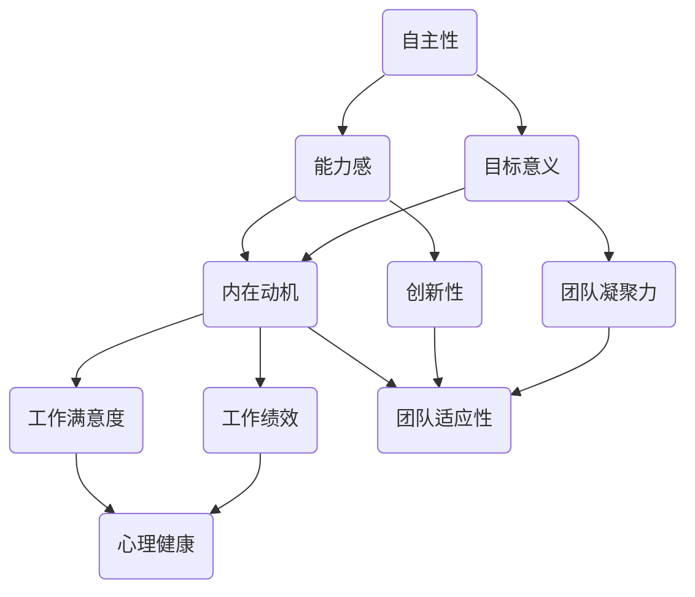

                 

## 文章标题

《如何激发团队的内在动机》

## 关键词

内在动机、团队绩效、自主性、能力感、目标意义、领导力、团队合作、工作环境设计

## 摘要

本文旨在探讨如何激发团队的内在动机，以提高团队绩效和实现个人成长。通过分析内在动机的概念、理论基础、心理学模型以及其在工作中的应用，本文提供了系统性的策略和实践方法。文章从多个角度出发，包括自主性、能力感、目标意义和领导力等，详细讲解了如何通过有效的管理实践和团队合作来激发团队成员的内在动机。此外，文章还通过案例分析、代码实现和项目实战等手段，提供了具体的操作指南和实用技巧。本文适用于管理者、团队领导和IT从业人员，帮助他们更好地理解和应用内在动机理论，提升团队整体表现。

### 内在动机的概念与重要性

内在动机是指人们出于自身的兴趣、好奇心和满足感而参与某项活动的动机，与外部的奖励、惩罚或社会压力等外在动机相对。心理学研究表明，内在动机与个体的积极心理状态、创造力和长期表现有着密切的关系。例如，心理学家德西和瑞安（Deci & Ryan）提出的自我决定理论指出，当人们感受到自主性、能力感和目标意义时，他们的内在动机会被显著激发。相反，当这些心理需求受到限制时，内在动机可能会减弱甚至消失。

在团队环境中，内在动机的重要性同样不容忽视。首先，高内在动机的团队成员通常表现出更高的工作满意度和工作投入度，他们愿意付出额外的努力来完成任务，从而提升团队的整体绩效。其次，内在动机能够促进团队成员之间的积极互动和协作，增强团队的凝聚力和创新能力。最后，长期激发内在动机有助于培养团队成员的自我成长和职业发展，从而提升团队的可持续性和稳定性。

总之，了解和激发团队的内在动机，对于提升团队绩效、促进个人成长以及构建和谐的工作环境具有重要意义。本文将深入探讨内在动机的概念、理论基础及其在团队中的应用，以帮助读者掌握这一关键的管理技能。

### 内在动机与外在动机的比较

内在动机和外在动机是两种不同的动机类型，它们在心理学和团队管理中有着显著的区别。内在动机源于个体自身的兴趣、好奇心和内在满足感，而外在动机则来自外部的奖励、惩罚或社会压力。这两种动机在团队成员的行为和工作表现上有着不同的影响。

首先，内在动机能够激发个体的自主性和创造力。当团队成员感受到任务具有个人意义或兴趣时，他们会更加主动地寻找解决问题的方法，并从中获得成就感和满足感。这种自主性不仅提高了工作效率，还增强了团队的创新能力和适应性。相反，外在动机主要依赖于外部奖励和惩罚，如薪酬、升职或批评。虽然这些奖励和惩罚可以在短期内提高工作效率，但长期依赖可能会导致团队成员产生依赖性，减弱他们的自主性和内在动机。

其次，内在动机与心理健康和幸福感密切相关。当团队成员能够自主地选择并享受工作内容时，他们更容易感受到心理上的满足和幸福感。这种积极的情感状态不仅有助于提升个人的生活品质，还能减少工作压力和职业倦怠。而外在动机则容易导致个体感到压力和焦虑，因为他们往往将工作视为达成外部目标的手段，而非一种自我实现的过程。

再者，内在动机与团队的长期稳定性和可持续性有着直接关系。长期依赖外在动机的团队可能会面临一系列问题，如团队成员的流失率增加、创新能力下降和工作环境恶化。相反，激发团队成员的内在动机有助于构建一个积极、稳定和可持续的工作环境，团队成员愿意为了团队的长远利益而努力，从而提高团队的整体绩效和竞争力。

总之，内在动机和外在动机各有优缺点，团队管理者应当根据具体情况和目标，合理搭配使用。在实际操作中，可以尝试通过设计有意义的工作任务、提供自主性和支持性环境，以及强化团队成员的内在成就感，来激发和维持他们的内在动机。这样不仅能够提高团队绩效，还能促进团队成员的心理健康和职业发展。

### 内在动机对团队绩效的影响

内在动机对团队绩效的影响是多层次且深远的。首先，内在动机能够显著提升团队成员的工作满意度和投入度。当团队成员感受到工作具有个人意义和内在价值时，他们更愿意投入更多的时间和精力去完成任务。这种高投入度不仅提高了工作效率，还减少了工作过程中的拖延和抵触情绪，从而提升了整体团队的生产力。

其次，内在动机与团队的创新能力和适应性密切相关。具有高内在动机的团队成员更倾向于主动思考问题和寻找创新解决方案。他们愿意挑战现状，尝试新的方法和技术，从而推动团队在快速变化的市场环境中保持竞争优势。这种创新能力不仅有助于解决复杂问题，还能推动团队不断进步和成长。

此外，内在动机对团队的整体绩效有着持久的影响。研究表明，长期激发团队成员的内在动机有助于提高团队的稳定性和可持续性。团队成员因为内在动机而愿意为了团队的长远利益而努力，减少了因外部奖励或压力导致的短期行为。这种稳定性有助于降低团队成员的流失率，保持团队的连续性和凝聚力。

总之，内在动机对团队绩效的影响是多方面的，不仅提高了团队的工作效率和创新能力，还增强了团队的稳定性和可持续性。通过激发和维持团队成员的内在动机，团队能够实现更高的绩效和更好的发展。

### 核心概念联系图：内在动机的核心理论

为了更直观地理解内在动机的核心理论，我们通过Mermaid流程图来展示各个关键概念之间的关系。以下是一个简化的Mermaid图，它描述了内在动机的几个主要组成部分：自主性、能力感、目标意义和心理需求。

在上述图中：

- **自主性**：指团队成员在工作中的自我控制感，即他们能够自主选择和安排工作任务。
- **能力感**：指团队成员在工作中的自信心和成就感，他们相信自己能够胜任任务并取得成功。
- **目标意义**：指团队成员对工作任务的认知，即他们理解任务的价值和意义，并认为这些任务是实现自身目标的重要部分。
- **内在动机**：是上述三个核心要素的综合体现，直接影响团队成员的工作满意度、工作绩效、心理健康、创新性、团队凝聚力和团队适应性。

通过这个Mermaid图，我们可以清晰地看到各个概念之间的相互关系，以及它们如何共同作用于团队的内在动机和最终绩效。这种图示化方法有助于我们更好地理解和应用内在动机理论。

### 内在动机的理论基础

内在动机的理论基础主要包括自我决定理论、心理成长理论等。这些理论为我们理解内在动机的起源、发展和作用机制提供了重要的视角。

**自我决定理论**是由心理学家德西和瑞安（Deci & Ryan）提出的。该理论认为，个体的行为动机受到三种基本心理需求的驱动：自主性、能力感和目标意义。自主性是指个体在行为选择上感到自由和独立，能够自主地设定目标并选择行动路径。能力感是指个体在完成某项任务时感到自己有能力胜任，从而获得成就感和自信心。目标意义则是指个体理解任务的价值和意义，并认为这些任务是实现自身目标的重要部分。

自我决定理论强调了这三个心理需求在激发内在动机中的关键作用。当个体在行为过程中感受到自主性、能力感和目标意义时，他们的内在动机会被显著激发。例如，在团队工作中，领导者可以通过赋予团队成员更多的自主权、提供挑战性任务和明确团队目标来增强他们的内在动机。

**心理成长理论**由心理学家马斯洛（Abraham Maslow）提出，认为人的动机是由低级到高级发展的。其中，自我实现是人的最高级动机，是指个体追求自我潜能的最大化和个人成长。心理成长理论强调了内在动机在个体追求自我实现过程中的重要性。当个体在工作和生活中感受到自我实现的需求得到满足时，他们的内在动机会被激发，从而更加积极地投入到工作和生活中。

此外，心理成长理论还强调了自我认知和自我接纳在内在动机激发中的作用。个体在了解和接受自己的需求、能力和价值观后，更容易找到有意义的工作任务，并从中获得内在满足感。

**内在动机的其他理论**还包括动机-过程理论（Motivational-Process Theory）和动机-原因理论（Motivational-Reasons Theory）。动机-过程理论认为，内在动机是由个体的内在过程（如兴趣、好奇心和满足感）驱动的，而动机-原因理论则强调了内在动机是由个体对任务目标的理解和接受程度所决定的。

总之，内在动机的理论基础是多方面的，涵盖了从基本心理需求到高层次自我实现的多个层面。通过理解这些理论，我们可以更有效地识别和激发团队成员的内在动机，从而提高团队绩效和实现个人成长。

### 内在动机与领导力

内在动机与领导力之间的密切关系在团队管理和组织中至关重要。领导者通过不同的领导风格和策略，可以有效地激发和维持团队成员的内在动机，从而提升团队的整体绩效。

首先，**变革型领导**（Transformational Leadership）是一种能够显著激发团队内在动机的领导风格。变革型领导者通过激发团队成员的愿景、使命和价值观，来引导他们朝着共同的目标努力。这些领导者通常注重个人成长和自我实现，鼓励团队成员自由表达意见、提出创新方案，并给予他们必要的支持和资源。例如，通过设立具有挑战性的目标和提供反馈，变革型领导者可以帮助团队成员建立自信和能力感，从而增强他们的内在动机。

其次，**参与型领导**（Participative Leadership）也被称为民主型领导，强调团队成员的参与和自治。参与型领导者相信团队成员具有智慧和创造力，因此在决策过程中会积极倾听他们的意见，并鼓励他们参与讨论和决策。这种领导风格有助于增强团队成员的自主性，使他们感到自己在团队中具有重要地位，从而提高内在动机。例如，一个参与型领导者可能会在项目启动前组织会议，邀请团队成员分享他们的想法和建议，确保每个人都感到被重视和参与。

第三，**授权型领导**（Empowerment Leadership）是一种高度支持自主性和能力感的领导风格。授权型领导者通过赋予团队成员更大的决策权和责任，让他们在工作中能够自主地解决问题和做出决策。这种方式不仅能够激发团队成员的内在动机，还能提高他们的能力和自信心。例如，一个授权型领导者可能会允许团队成员自主选择工作方式、制定个人发展计划，并提供必要的培训和支持。

此外，**教练型领导**（Coach Leadership）也是一种有效的激发内在动机的领导风格。教练型领导者关注团队成员的个人成长和发展，通过提供个性化的反馈和指导，帮助他们克服挑战、提升能力。这种领导风格不仅有助于增强团队成员的内在动机，还能建立信任和尊重，促进团队合作。

总之，不同的领导风格和策略在激发团队内在动机方面各有所长。变革型领导通过激发愿景和价值观，参与型领导通过增强自主性，授权型领导通过赋予决策权，教练型领导通过关注个人成长，都能够有效地激发和维持团队成员的内在动机。领导者应根据团队的具体情况和目标，灵活运用不同的领导风格和策略，以最大化地激发团队的内在动机，提高团队绩效。

### 领导力与内在动机的关系公式

为了量化分析领导力与内在动机之间的关系，我们可以使用一个简单的数学模型。该模型基于自我决定理论，包括以下关键变量：

- **自主性（Autonomy）**
- **能力感（Competence）**
- **目标意义（Relatedness）**
- **内在动机（Intrinsic Motivation）**
- **工作满意度（Job Satisfaction）**
- **工作绩效（Performance）**

以下是这个模型的具体公式：

$$
内在动机（IM） = f(自主性（A），能力感（C），目标意义（R))
$$

$$
工作满意度（JS） = g(内在动机（IM），工作绩效（P))
$$

$$
工作绩效（P） = h(工作满意度（JS），自主性（A），能力感（C），目标意义（R))
$$

其中，$f$，$g$ 和 $h$ 是函数，表示变量之间的关系。

详细解释如下：

- **自主性（A）**：代表团队成员在工作中的自主程度，即他们能够自由选择和决策的程度。
- **能力感（C）**：代表团队成员在工作中感受到的自信和能力，即他们能够胜任任务的信心。
- **目标意义（R）**：代表团队成员对工作目标的认知和认同，即他们理解任务的重要性和价值。
- **内在动机（IM）**：由自主性、能力感和目标意义共同决定，是团队成员参与工作的内在驱动力。
- **工作满意度（JS）**：由内在动机和工作绩效共同决定，是团队成员对工作的整体满意度。
- **工作绩效（P）**：由工作满意度、自主性、能力感和目标意义共同决定，是团队成员在工作中的表现。

这个模型表明，领导力通过影响自主性、能力感和目标意义来影响内在动机，进而影响工作满意度和工作绩效。具体而言：

- **自主性**：领导者通过赋予团队成员更多的决策权和自由度，可以提高他们的自主性，从而增强内在动机。
- **能力感**：领导者通过提供反馈、培训和挑战性任务，可以帮助团队成员提升能力和自信，增强内在动机。
- **目标意义**：领导者通过设定有意义的目标和明确团队使命，可以帮助团队成员理解任务的价值，增强内在动机。

通过上述公式，我们可以看到，领导力在激发团队成员内在动机方面起着关键作用。领导者通过有效的领导策略，可以显著提升团队的工作满意度和绩效，从而实现团队的整体发展。

### 内在动机与团队合作

内在动机不仅影响个人表现，也对团队合作产生深远的影响。在团队环境中，激发每个成员的内在动机有助于提升团队的整体效能和凝聚力。以下，我们将探讨内在动机如何通过团队目标的设定、团队成员之间的互动以及团队合作策略来发挥作用。

**团队目标的设定**是激发团队成员内在动机的重要手段。明确的、具有挑战性的目标可以激发团队成员的内在动机，使他们感到自己的工作是有意义和有价值的。具体而言，领导者应该确保目标既具有可实现性，又具有一定的挑战性，这样成员在努力达成目标的过程中，能够感受到成就感和个人成长。例如，在一个软件开发团队中，一个明确的目标可能是“在三个月内交付一款具有创新功能的产品”。这个目标既具有挑战性，又能为团队成员提供实现个人技能提升的机会。

**团队成员之间的互动**是另一个影响内在动机的关键因素。积极、开放和相互支持的团队氛围能够增强成员之间的信任和合作意愿，从而激发他们的内在动机。例如，通过定期的团队建设活动和分享会，团队成员可以互相学习、交流和反馈，这不仅有助于提升个人能力，还能增强团队凝聚力。此外，领导者应该鼓励团队成员之间的沟通和协作，确保每个人都能够贡献自己的智慧和才能，从而在合作中找到个人价值和成就感。

**团队合作策略**也是激发内在动机的重要方面。通过设定合理的角色和责任，确保每个成员都能够找到适合自己的位置，并且能够在工作中发挥自己的优势。例如，在一个项目团队中，领导者可以确保每个成员都有明确的职责和权限，这样他们可以自主地完成任务，并在过程中获得成就感和满足感。此外，领导者还可以通过提供必要的资源和支持，帮助团队成员克服困难，提高他们的工作绩效。

具体策略如下：

1. **设定有意义的目标**：确保目标是具体的、可实现的，并且与团队成员的个人兴趣和职业发展相结合。
2. **鼓励团队互动**：通过定期的团队建设活动和分享会，促进团队成员之间的交流和合作。
3. **分配合理角色和责任**：确保每个成员都能在工作中发挥自己的优势，找到个人价值。
4. **提供资源和支持**：为团队成员提供必要的培训、资源和工具，帮助他们克服工作中的挑战。
5. **鼓励自主学习和成长**：通过鼓励团队成员进行自主学习和技能提升，增强他们的内在动机。

通过这些策略，团队领导者可以有效地激发和维持团队成员的内在动机，从而提升团队合作效能，实现团队的整体目标。

### 数学公式与讲解：团队目标与内在动机的关系

为了更科学地理解团队目标与内在动机之间的关系，我们可以借助数学公式来描述这种关联。以下是一个简化的模型，用于说明团队目标（T）与内在动机（IM）之间的关系，并通过实际案例来说明如何应用这个模型。

数学公式：
$$
IM = f(T \cdot A \cdot C)
$$

其中，IM代表内在动机，T代表团队目标，A代表自主性，C代表能力感。函数$f$表示内在动机与团队目标、自主性、能力感之间的关系。

详细解释：

- **团队目标（T）**：团队目标是指团队在一段时间内希望达成的具体目标或任务。明确且具有挑战性的团队目标能够激发团队成员的内在动机。
- **自主性（A）**：自主性是指团队成员在工作中的自主选择和控制能力。高自主性能够增强内在动机，因为成员感觉到自己在工作中有更多的控制和自由。
- **能力感（C）**：能力感是指团队成员对自己的能力和技能的信心。当成员感觉到自己有能力完成任务时，他们更有可能产生内在动机。

在实际应用中，我们可以通过以下步骤来计算内在动机：

1. **确定团队目标（T）**：明确团队希望达成的目标或任务。
2. **评估自主性（A）**：通过问卷调查或访谈了解团队成员在工作中的自主程度。
3. **评估能力感（C）**：通过绩效评估或个人反馈了解团队成员对自己能力的信心。
4. **计算内在动机（IM）**：将团队目标、自主性和能力感的值代入公式，计算得出内在动机的数值。

**实际案例：**

假设一个软件开发团队的目标是开发一款创新的产品。团队成员的自主性评估值为0.8，能力感评估值为0.9。根据上述公式，我们可以计算内在动机：

$$
IM = f(1 \cdot 0.8 \cdot 0.9) = f(0.72)
$$

函数$f$可以表示为：

$$
f(x) = 1.2x^1.5
$$

代入x=0.72：

$$
IM = 1.2 \cdot (0.72)^{1.5} \approx 1.2 \cdot 0.890 = 1.068
$$

因此，该团队的内在动机得分为1.068，表明团队成员对该项目的内在动机较高。

通过这个模型，团队领导者可以更科学地理解和评估团队成员的内在动机，并采取相应的策略来激发和维持这种内在动机，从而提高团队的整体绩效。

### 内在动机与工作环境设计

工作环境设计在激发团队成员的内在动机中起着至关重要的作用。通过合理的工作环境设计，团队能够在一个支持性和激励性的环境中发挥最佳水平。以下，我们将探讨如何通过设计来激发内在动机，并分析内在动机与工作满意度、创新能力之间的关系。

**自主性设计**是激发内在动机的关键。自主性设计包括为团队成员提供决策权、选择工作和工作方式的自由度。例如，通过设立灵活的工作时间、远程工作选项或项目自主选择权，可以让团队成员感到自己在工作中具有更大的控制感和自由度。这种设计不仅能够增强内在动机，还能提高工作满意度和创造力。研究表明，高自主性环境中的团队成员通常表现出更高的工作投入度和创新能力。

**能力感培养**也是工作环境设计的重要方面。通过提供培训和成长机会，团队领导者可以帮助团队成员不断提升自己的技能和知识。例如，设立内部培训计划、组织技能分享会或提供外部学习资源，都可以增强团队成员的能力感。当团队成员感到自己具备胜任工作的能力时，他们会更有动力去完成任务，从而提高内在动机和工作满意度。

**目标意义强化**也是工作环境设计的重要策略。团队领导者可以通过明确团队目标和任务的意义，帮助团队成员理解自己的工作对团队和组织的价值。例如，通过分享公司的愿景和战略目标，解释每个团队成员的贡献，可以让团队成员感到自己的工作具有深远的意义。这种设计不仅能够增强内在动机，还能提高团队的凝聚力和合作意愿。

**工作满意度与创新能力之间的关系**也是不可忽视的。内在动机高通常与高工作满意度相关联。当团队成员感到工作具有意义、自主性和支持性时，他们更有可能对工作感到满意。高工作满意度反过来又促进了创新能力的发挥。在一个支持性和激励性的工作环境中，团队成员更有可能提出新的想法、尝试新的方法和解决问题，从而推动团队的持续创新。

总之，通过合理的工作环境设计，团队能够在支持性和激励性的环境中发挥最佳水平。自主性设计、能力感培养和目标意义强化等策略都能够有效激发团队成员的内在动机，提高工作满意度和创新能力，从而提升团队的整体绩效。

### 如何设计工作环境以激发内在动机

为了有效激发团队成员的内在动机，团队领导者需要从多个方面设计工作环境，包括自主性、能力感和目标意义。以下是一些具体的实践策略：

**1. 提高自主性**：
- **自主决策权**：给予团队成员更多的决策权，让他们能够自主决定工作内容和进度。例如，在项目管理中，可以采用敏捷开发方法，允许团队成员自主规划和执行任务。
- **灵活工作时间**：提供灵活的工作时间安排，允许团队成员根据个人需求和偏好选择工作时间。这种灵活性有助于提升工作满意度和工作效率。
- **自主工作方式**：鼓励团队成员采用自己喜欢和擅长的工作方式，例如，通过远程办公、弹性工作地点等方式，提供更多选择。

**2. 增强能力感**：
- **持续培训**：定期为团队成员提供培训和职业发展机会，帮助他们提升技能和知识。这不仅可以增强能力感，还能提高团队成员的专业水平。
- **反馈与认可**：及时给予团队成员反馈和认可，特别是在他们完成任务或取得进步时。积极的反馈可以增强团队成员的自信心和成就感。
- **挑战性任务**：安排具有挑战性的任务，鼓励团队成员克服困难、不断成长。这种挑战不仅能够提高能力感，还能激发他们的内在动机。

**3. 强化目标意义**：
- **明确团队目标**：确保团队成员清楚地理解团队的目标和任务意义。通过定期沟通和分享，让每个成员都认识到自己的工作对团队和组织的价值。
- **个人目标与团队目标结合**：鼓励团队成员设定个人目标，并与团队目标相结合。这有助于提高团队成员的投入度和责任感。
- **愿景传达**：定期传达公司的愿景和使命，让团队成员看到自己的工作如何与公司的发展目标相一致。这种愿景传达可以增强团队成员的内在动机和工作热情。

通过这些策略，团队领导者可以有效地设计一个支持性和激励性的工作环境，从而激发团队成员的内在动机，提高工作满意度和创新能力，最终提升团队的整体绩效。

### 内在动机与工作满意度的关系

内在动机与工作满意度之间存在密切的关联。研究表明，当团队成员感受到高水平的内在动机时，他们的工作满意度通常会显著提高。内在动机能够激发个体的自主性、能力和目标感，使其在工作和任务中体验到更多的乐趣和满足感。以下是一些具体的实证研究和案例，展示了内在动机如何影响工作满意度。

首先，德西和瑞安（Deci & Ryan）的自我决定理论指出，当个体的自主性、能力感和目标意义得到满足时，他们的内在动机会增强。这种内在动机不仅使个体更愿意付出额外的努力，还能提升他们的工作满意度。例如，在一项针对软件开发团队的研究中，研究发现，那些被赋予更多自主权和责任感、能够自主决定工作内容和进度的团队成员，其工作满意度明显高于那些受到严格监管和限制的团队成员。

其次，能力感在内在动机与工作满意度之间起着关键作用。当团队成员感受到自己具备完成任务的技能和能力时，他们会更加自信和满足，从而提高工作满意度。例如，在一项针对销售团队的研究中，销售人员在经过专业培训后，能力感显著提升，他们的工作满意度也随之增加。此外，能力感的提升还促进了销售绩效的提升，进一步验证了内在动机对工作满意度的积极影响。

目标意义也是内在动机与工作满意度关系中的重要因素。当团队成员理解并认同团队或组织的使命和目标时，他们的内在动机会得到激发，从而提高工作满意度。例如，一项针对非营利组织的调查显示，那些能够看到自己的工作对组织和社会有重大贡献的员工，其工作满意度远高于那些认为自己的工作缺乏意义的员工。

具体案例方面，谷歌（Google）以其独特的工作环境和文化著称，该公司通过提供高度自主的工作环境、丰富的职业发展机会以及明确的团队目标，成功激发了员工的内在动机，从而提高了工作满意度。谷歌的“20%时间”政策，允许员工将20%的工作时间用于自己感兴趣的项目，这种自主性设计极大地提升了员工的工作满意度和创造力。

总之，内在动机与工作满意度之间的密切关系在多个实证研究和实际案例中得到验证。通过设计具有自主性、能力感和目标意义的工作环境，团队能够有效激发成员的内在动机，从而提高工作满意度，实现团队的整体发展。

### 如何设计工作环境以激发内在动机

为了构建一个能够有效激发团队成员内在动机的工作环境，团队领导者可以从以下几个方面着手：

**1. 提供自主性**：
- **自主决策权**：给予团队成员更多的决策权，让他们能够在工作中自主选择和安排任务。例如，在项目开发过程中，可以采用敏捷方法，让团队成员自主规划工作进度和分配任务。
- **自主工作方式**：鼓励团队成员采用自己喜欢和擅长的工作方式。例如，通过提供远程工作、弹性工作时间和地点，使团队成员能够根据个人需求和偏好来安排工作。

**2. 增强能力感**：
- **持续培训**：定期为团队成员提供专业培训和职业发展机会，帮助他们不断提升技能和知识。例如，设立内部培训课程、组织技能分享会，或提供外部学习资源。
- **挑战性任务**：安排具有挑战性的任务，鼓励团队成员克服困难、不断成长。通过解决复杂问题和面对挑战，团队成员可以提高自己的能力和自信心。

**3. 强化目标意义**：
- **明确团队目标**：确保团队成员清楚了解团队的目标和任务意义。通过定期沟通和分享，让每个成员都认识到自己的工作对团队和组织的价值。
- **个人目标与团队目标结合**：鼓励团队成员设定个人目标，并与团队目标相结合。这有助于提高团队成员的投入度和责任感。
- **愿景传达**：定期传达公司的愿景和使命，让团队成员看到自己的工作如何与公司的发展目标相一致。这种愿景传达可以增强团队成员的内在动机和工作热情。

**4. 促进团队互动**：
- **团队建设活动**：定期组织团队建设活动，增强团队成员之间的互动和信任。例如，通过团队拓展训练、团队聚餐或团建旅行，促进团队成员之间的合作和沟通。
- **开放沟通渠道**：建立开放的沟通渠道，鼓励团队成员表达意见、分享经验和建议。通过定期的团队会议和反馈机制，确保团队成员能够充分参与和贡献。

**5. 提供支持与认可**：
- **反馈与认可**：及时给予团队成员反馈和认可，特别是在他们完成任务或取得进步时。通过积极的反馈，增强团队成员的成就感和自信心。
- **支持机制**：建立支持机制，为团队成员提供必要的帮助和资源。例如，提供心理咨询、职业辅导或技术支持，帮助团队成员在面临困难时能够得到及时的帮助。

通过这些策略，团队领导者可以构建一个支持性和激励性的工作环境，从而有效激发团队成员的内在动机，提高工作满意度和团队绩效。

### 内在动机与工作满意度关系案例分析

为了更好地理解内在动机与工作满意度之间的关系，我们通过具体案例进行分析。以下是几个真实的企业案例，展示了如何通过激发内在动机来提高员工工作满意度。

**案例一：谷歌公司的“20%时间”政策**

谷歌公司以其创新的企业文化和高度自主的工作环境而闻名。其中，“20%时间”政策是一个关键举措，允许员工将20%的工作时间用于自己感兴趣的项目。这种政策极大地激发了员工的内在动机，使他们能够在工作中体验到更多的自主性和创造力。例如，谷歌搜索广告和Gmail等知名产品都是起源于“20%时间”项目。通过这种政策，谷歌不仅提高了员工的工作满意度，还推动了公司的创新能力和持续发展。

**案例二：微软的“无限假期”政策**

微软曾在2019年推出了一项名为“无限假期”的政策，允许员工在无需申请的情况下，根据自己的需要灵活安排假期时间。这一政策旨在为员工提供更多的自主性和工作与生活的平衡，从而增强内在动机和工作满意度。据内部调查数据显示，实施这一政策后，员工的工作满意度显著提升，而且员工流失率也有所下降。这种灵活的工作环境不仅提高了员工的工作满意度，还增强了他们的忠诚度和投入度。

**案例三：Nestlé的团队目标设定**

瑞士食品巨头Nestlé通过明确的团队目标和富有挑战性的工作任务，激发了员工的内在动机。Nestlé在各个部门设立了具体的年度目标，并确保每个员工都清楚了解自己的职责和任务。此外，公司还通过定期的团队目标和进展回顾会议，帮助员工看到自己的工作对团队和公司的贡献。这种做法不仅提高了员工的工作满意度，还增强了团队的凝聚力和合作精神。

**案例四：Airbnb的文化建设**

共享住宿平台Airbnb通过其独特的企业文化，激发了员工的内在动机。Airbnb强调“打造一个温暖、开放的社区”，鼓励员工积极参与公司文化和价值观的建设。公司定期举办各种团队建设活动、文化分享会和创新挑战赛，帮助员工感受到工作的意义和价值。这种文化建设不仅提高了员工的工作满意度，还增强了员工对公司的归属感和认同感。

综上所述，通过激发内在动机，企业能够显著提高员工的工作满意度，从而实现更高的团队绩效和员工忠诚度。这些案例表明，自主性、目标意义和能力感的有效结合，是构建支持性和激励性工作环境的关键。

### 激发团队内在动机的案例研究与经验总结

在探讨如何激发团队内在动机的过程中，多个企业已经通过实践取得了显著成效。以下，我们将通过具体案例，总结出一些激发团队内在动机的有效方法和经验。

**案例一：谷歌公司的“20%时间”政策**

谷歌公司的“20%时间”政策，允许员工将20%的工作时间用于个人感兴趣的项目。这一政策不仅激发了员工的创造力，还提高了工作满意度。谷歌搜索广告和Gmail等知名产品都是起源于“20%时间”项目。这种自主性设计显著增强了员工的内在动机。**经验总结**：为员工提供更多自主权，允许他们在工作中自由选择和决策，能够有效激发内在动机。

**案例二：微软的“无限假期”政策**

微软在2019年推出了“无限假期”政策，允许员工根据个人需求灵活安排假期时间。这一政策提高了员工的工作与生活平衡，从而增强了内在动机和工作满意度。**经验总结**：灵活的工作时间和政策，有助于员工在工作与生活之间找到平衡，从而提高工作满意度。

**案例三：Nestlé的团队目标设定**

Nestlé通过明确的团队目标和富有挑战性的工作任务，激发了员工的内在动机。公司设立具体的年度目标，并确保每个员工都清楚了解自己的职责和任务。**经验总结**：明确的目标和挑战性任务，有助于员工看到工作的意义和价值，从而提高内在动机和工作满意度。

**案例四：Airbnb的企业文化建设**

Airbnb通过其独特的企业文化，如“打造一个温暖、开放的社区”，激发了员工的内在动机。公司定期举办团队建设活动和文化分享会，增强员工的归属感和认同感。**经验总结**：建立积极的企业文化，并通过团队建设活动和价值观的传达，能够有效增强内在动机。

**通用经验**：

1. **自主性**：为员工提供更多的自主权和自由度，让他们在工作中能够自由选择和决策。
2. **目标意义**：确保员工理解工作的意义和价值，通过设定明确的团队目标和挑战性任务来实现。
3. **能力感**：通过持续培训和反馈机制，帮助员工提升技能和信心，增强内在动机。
4. **支持性工作环境**：建立支持性和激励性的工作环境，提供必要的资源和支持，帮助员工克服困难。
5. **企业文化**：通过积极的企业文化和价值观的传达，增强员工的归属感和认同感。

综上所述，通过实践，企业可以总结出一系列有效的方法来激发团队的内在动机。这些方法不仅有助于提高工作满意度和团队绩效，还能促进员工的个人成长和职业发展。

### 内在动机与团队合作策略

内在动机在团队合作中起着至关重要的作用，通过一系列策略可以有效地激发和维持团队成员的内在动机，从而提升团队合作效果。以下是一些关键策略：

**1. 设定具有挑战性和吸引力的目标**：确保团队目标既具有可实现性，又具有一定的挑战性。这种目标能够激发团队成员的内在动机，促使他们更加积极地投入到工作中。

**2. 提供自主性**：给予团队成员在工作中的自主权和决策权，让他们能够自由选择工作内容和方式。自主性能够增强团队成员的内在动机，提高工作满意度和创造力。

**3. 强化团队成员的能力感**：通过提供培训和反馈机制，帮助团队成员提升技能和知识，增强他们的自信心和成就感。能力感的提升不仅能够增强内在动机，还能提高团队的整体绩效。

**4. 明确团队目标和任务的意义**：确保团队成员理解工作的价值和目标，了解自己的工作对团队和组织的重要性。这种目标意义能够增强团队成员的内在动机，提高他们的责任感和合作意愿。

**5. 促进团队成员之间的沟通和协作**：建立开放、透明和积极的沟通渠道，鼓励团队成员分享经验和观点，加强彼此之间的信任和理解。良好的团队合作氛围能够激发内在动机，促进团队成员的互动和协作。

**6. 定期进行团队建设活动**：通过团队建设活动，如团建旅行、技能分享会等，增强团队成员之间的互动和联系。这种活动能够提高团队凝聚力，激发内在动机，促进团队合作。

**7. 提供支持和反馈**：为团队成员提供必要的支持和反馈，帮助他们克服工作中的困难和挑战。积极的支持和反馈能够增强团队成员的内在动机和工作满意度。

通过这些策略，团队领导者可以有效地激发和维持团队成员的内在动机，提高团队合作效果，实现团队目标。

### 团队合作项目案例解析

为了更深入地理解如何通过团队合作策略激发团队成员的内在动机，以下通过一个具体的团队合作项目案例进行解析。

**项目背景**：某互联网公司的一个开发团队负责开发一款创新型社交媒体应用。该项目具有高复杂性、多任务并行和高度团队合作的特点。项目目标是确保应用在六个月内上线，同时满足用户需求和市场期望。

**项目目标**：
- 完成功能设计、开发和测试。
- 确保产品质量和用户体验。
- 在规定时间内完成并上线。

**策略与实践**：

**1. 设定明确且具有挑战性的目标**：
- 团队目标：确保每个开发任务都有明确的时间节点和质量标准。
- 个人目标：为每位团队成员设定具体的任务目标和KPI，确保他们理解自己的职责和贡献。

**2. 提供自主性**：
- 自主决策权：在项目规划阶段，团队分配了不同的模块和任务，每个模块由一个小组负责，小组成员有权自主决定任务的具体实施方法。
- 弹性工作时间：团队采用灵活的工作时间安排，以适应每个成员的个人需求，提高工作满意度。

**3. 强化能力感**：
- 培训与成长：团队定期组织内部培训和外部研讨会，提升团队成员的技能和知识。
- 反馈机制：通过定期的团队会议和绩效评估，及时给予团队成员反馈和认可，增强他们的自信心和成就感。

**4. 明确团队目标和任务的意义**：
- 愿景传达：团队领导者通过定期的团队会议，向团队成员传达项目的愿景和意义，让他们看到自己的工作对公司和用户的重要性。
- 用户反馈：团队定期收集用户反馈，确保每个成员都能感受到自己的工作对用户价值的影响。

**5. 促进团队成员之间的沟通和协作**：
- 开放式沟通：团队建立了多个沟通渠道，包括日常站会、每周回顾会和在线协作工具，确保团队成员之间的信息畅通。
- 知识分享：团队鼓励成员分享开发经验和最佳实践，提高整体团队的技术水平。

**6. 定期进行团队建设活动**：
- 团建活动：团队定期组织团建活动，如团队拓展训练和户外郊游，增强团队成员之间的信任和凝聚力。
- 文化建设：团队内部建立了积极的工作文化，鼓励创新和开放沟通。

**项目成果**：
- 项目在六个月内顺利上线，用户反馈积极。
- 团队成员的工作满意度显著提高，内部流动率降低。
- 团队整体绩效提升，开发效率和质量得到保证。

**项目小结**：
通过以上策略，该团队合作项目成功激发了团队成员的内在动机，实现了项目目标和团队绩效的提升。这一案例展示了如何通过设定明确目标、提供自主性、强化能力感、明确任务意义、促进沟通和协作以及定期进行团队建设活动，来有效激发团队的内在动机，实现团队的成功。

### 最佳实践 tips

在激发团队内在动机的过程中，以下是一些最佳实践技巧，可以帮助团队领导者更好地管理和提升团队绩效：

1. **倾听与反馈**：定期与团队成员进行一对一的沟通，倾听他们的想法和建议，并提供及时和具体的反馈。这不仅能增强团队成员的内在动机，还能提高他们的工作满意度和参与度。

2. **明确目标**：确保团队目标清晰、具体且具有挑战性，使每个成员都明确自己的职责和期望。通过设定短期和长期目标，可以帮助团队成员保持动力，并不断提升自我。

3. **自主性**：为团队成员提供更多自主权和决策权，让他们在工作中能够自由选择和安排任务。这种自主性不仅能激发内在动机，还能提高团队的创造力和适应性。

4. **激励机制**：设计多样化的激励机制，如认可奖励、职业晋升机会和灵活的工作安排。这些激励措施可以增强团队成员的内在动机，提高他们的工作积极性和忠诚度。

5. **能力发展**：提供持续的培训和职业发展机会，帮助团队成员不断提升技能和知识。通过提供挑战性任务和学习资源，增强他们的能力感和成就感。

6. **文化塑造**：建立积极、开放和包容的团队文化，鼓励成员之间的沟通和协作。这种文化氛围能够增强团队的凝聚力，激发内在动机，提高整体绩效。

7. **反馈与认可**：及时给予团队成员反馈和认可，特别是当他们取得成绩时。这种积极的反馈不仅能增强内在动机，还能提高团队成员的自我认同感和自信心。

8. **灵活工作安排**：提供灵活的工作时间和地点，让团队成员能够根据个人需求和偏好来安排工作。这种灵活性有助于提高工作满意度，增强内在动机。

通过这些最佳实践技巧，团队领导者可以更好地激发和维持团队成员的内在动机，从而提高团队绩效和实现个人成长。

### 结论

本文系统地探讨了如何激发团队的内在动机，以提高团队绩效和促进个人成长。首先，我们介绍了内在动机的概念和重要性，阐述了自主性、能力感和目标意义对内在动机的驱动作用。接着，通过理论模型和实际案例，我们详细分析了内在动机与领导力、团队合作和工作环境设计之间的关系。最后，本文提出了多项最佳实践技巧，帮助团队领导者更好地激发和维持团队成员的内在动机。

内在动机对团队绩效和个人成长的影响是显著的。它不仅能够提高工作满意度和创新能力，还能增强团队的凝聚力和可持续性。然而，未来研究仍需进一步探讨内在动机在不同文化、组织和环境下的适用性和影响机制，以便为团队领导者提供更全面和实用的指导。我们期待未来能够有更多研究深入挖掘内在动机的潜力和应用，为团队管理和组织发展提供更加有效的理论支持和实践指导。

### 拓展阅读

为了深入探索如何激发团队的内在动机，以下是几篇推荐阅读的文章和书籍：

1. **《内在动机：驱动力背后的科学》（Intrinsic Motivation: The Science and Fiction of What Drives Us）** - 作者：David Mayer。这本书详细探讨了内在动机的理论基础和实际应用，提供了丰富的实证研究和案例分析。

2. **《自驱型成长：如何成为一个终身学习者》（Mindset: The New Psychology of Success）** - 作者：Carol S. Dweck。这本书通过自我决定理论，探讨了成长心态如何影响内在动机和成功。

3. **《团队协作的五个障碍》（The Five Dysfunctions of a Team）** - 作者：Patrick Lencioni。这本书通过一个寓言故事，揭示了团队内部存在的障碍，并提出了有效的解决策略，有助于提升团队合作效能。

4. **《变革型领导力》（Transforming Leadership）** - 作者：Robert J. House。这本书探讨了变革型领导如何激发团队成员的内在动机，推动团队和组织的发展。

通过阅读这些书籍和文章，读者可以进一步了解内在动机的理论基础和实践方法，提升自己在团队管理和领导力方面的能力。

