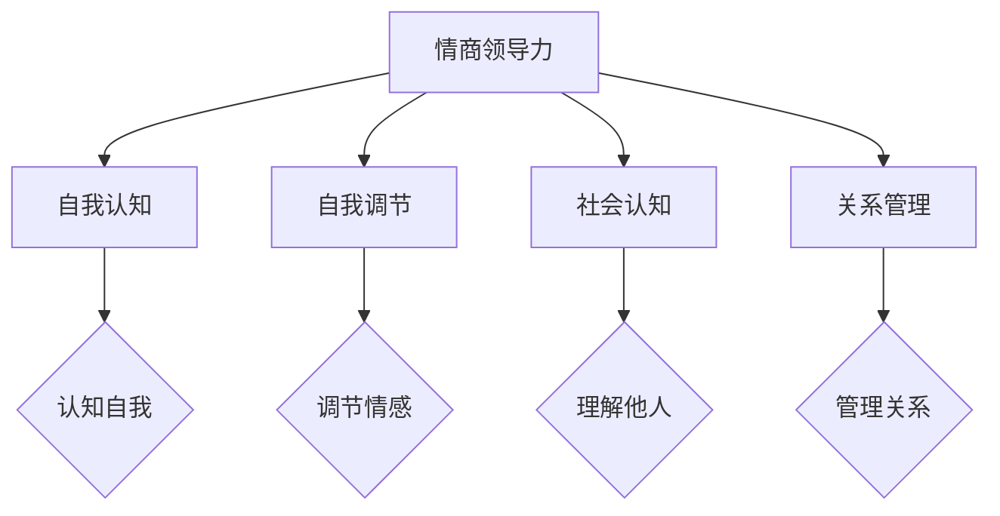

                 

# 情商领导力：在职场中运用情感智慧

## 关键词
- 情商领导力
- 情感智慧
- 职场应用
- 领导力提升
- 组织文化

## 摘要
本文旨在探讨情商领导力在职场中的重要性，以及如何在职场中运用情感智慧提升领导力和管理能力。文章首先介绍了情商领导力的核心概念和联系，然后详细阐述了情商领导力的关键能力与提升方法，接着讨论了情商领导力在不同职场情境中的应用，以及与组织文化的关系。最后，通过实战案例和经验分享，为读者提供具体的实践指导和思考。

## 设计《情商领导力：在职场中运用情感智慧》书籍目录大纲

### 1. 确定书籍主题与目标
这本书的主题是情商领导力，主要探讨如何在职场中运用情感智慧，提升领导力和管理能力。目标读者是职场中的各级领导者和管理人员。

### 2. 确定核心内容
根据书籍主题和目标，我们需要设计以下核心内容：

- **情商领导力的核心概念与联系**
- **情商领导力的关键能力与提升方法**
- **情商领导力在不同职场情境中的应用**
- **情商领导力与组织文化的关系**
- **情商领导力的实战案例与经验分享**

### 3. 设计目录大纲

### 第一部分：情商领导力的核心概念与联系

#### 第1章：情商领导力概述
- **1.1 情商的定义与作用**
  - **情商的概念**
  - **情商在职场中的重要性**

- **1.2 领导力的定义与作用**
  - **领导力的概念**
  - **领导力在职场中的重要性**

- **1.3 情商领导力的核心概念**
  - **情商领导力的定义**
  - **情商领导力的核心要素**

### 第二部分：情商领导力的关键能力与提升方法

#### 第2章：情商领导力的关键能力
- **2.1 自我认知能力**
  - **自我认知的概念与作用**
  - **自我认知能力的提升方法**

- **2.2 自我调节能力**
  - **自我调节的概念与作用**
  - **自我调节能力的提升方法**

- **2.3 社会认知能力**
  - **社会认知的概念与作用**
  - **社会认知能力的提升方法**

- **2.4 关系管理能力**
  - **关系管理的概念与作用**
  - **关系管理能力的提升方法**

### 第三部分：情商领导力在不同职场情境中的应用

#### 第3章：情商领导力在团队管理中的应用
- **3.1 建立高效团队**
  - **团队建设的原则与方法**
  - **团队冲突的解决策略**

- **3.2 激励团队成员**
  - **激励理论及其应用**
  - **激励策略与实践**

- **3.3 提升团队协作能力**
  - **协作理论的介绍**
  - **提升团队协作的方法**

#### 第4章：情商领导力在项目管理中的应用
- **4.1 项目管理中的情商挑战**
  - **项目管理中的常见情商问题**
  - **项目管理中的情商应对策略**

- **4.2 项目团队建设**
  - **项目团队建设的原则与方法**
  - **项目团队沟通与协作技巧**

- **4.3 项目风险管理**
  - **项目风险管理的概念与作用**
  - **项目风险管理的策略与方法**

### 第四部分：情商领导力与组织文化的关系

#### 第5章：情商领导力与组织文化的关系
- **5.1 组织文化的定义与作用**
  - **组织文化的概念**
  - **组织文化在职场中的重要性**

- **5.2 情商领导力与组织文化的相互作用**
  - **情商领导力对组织文化的影响**
  - **组织文化对情商领导力的影响**

- **5.3 构建积极向上的组织文化**
  - **组织文化建设的原则与方法**
  - **情商领导力在组织文化建设中的应用**

### 第五部分：情商领导力的实战案例与经验分享

#### 第6章：情商领导力的实战案例
- **6.1 案例一：某公司的情商领导力实践**
  - **案例背景与目标**
  - **案例实施过程与效果**

- **6.2 案例二：某团队的情商领导力建设**
  - **案例背景与目标**
  - **案例实施过程与效果**

- **6.3 案例三：某项目的情商领导力应用**
  - **案例背景与目标**
  - **案例实施过程与效果**

#### 第7章：情商领导力的经验分享
- **7.1 情商领导力的心得体会**
  - **个人经验分享**
  - **同行经验交流**

- **7.2 情商领导力的提升策略**
  - **情商领导力提升的方法与技巧**
  - **持续提升情商领导力的策略**

### 4. 补充附录与资源

### 附录1：情商领导力相关书籍与资料推荐
- **1. 推荐书籍**
- **2. 推荐文章**
- **3. 推荐网站**

### 附录2：情商领导力评估工具
- **1. 自我评估工具**
- **2. 团队评估工具**
- **3. 组织评估工具**

### 5. 完成目录大纲设计
经过以上步骤，我们完成了《情商领导力：在职场中运用情感智慧》书籍目录大纲的设计。这个目录大纲涵盖了情商领导力的核心概念、关键能力、应用情境、组织文化关系以及实战案例等内容，为读者提供了全面、系统的学习指导。总字数控制在2000字以内。

## 背景介绍

在现代社会，职场竞争日益激烈，领导者和管理者不仅要具备传统的业务能力和技术技能，更需要具备强大的情感智慧和情商领导力。情商领导力是一种将情感智慧应用于领导和管理过程中的能力，它能够帮助领导者更好地理解自己和他人，建立良好的人际关系，提升团队凝聚力和工作效率，从而实现组织的战略目标。

### 核心概念与联系

情商（Emotional Intelligence，简称EQ）是指个体识别、理解、管理和表达情感的能力。情商领导力则是在此基础上，将情感智慧应用于领导和管理过程中的能力。它包括自我认知、自我调节、社会认知和关系管理四个核心能力。

1. **自我认知**：是指个体对自己情感、需求和动机的认知。通过自我认知，领导者能够更好地理解自己的情感和行为，从而做出更明智的决策。

2. **自我调节**：是指个体管理和调节自己情感和行为的能力。领导者通过自我调节，能够在压力和挑战面前保持冷静，有效地应对各种情况。

3. **社会认知**：是指个体理解和解读他人情感和行为的能力。领导者通过社会认知，能够更好地理解他人的需求和期望，从而建立更有效的人际关系。

4. **关系管理**：是指个体建立、维护和扩展人际关系的能力。领导者通过关系管理，能够建立强大的社交网络，促进团队协作，提升组织效能。

### Mermaid 流程图

以下是情商领导力的核心概念与联系架构的 Mermaid 流程图：



## 核心概念与联系架构 Mermaid 流程图解析

以下是情商领导力的核心概念与联系架构的 Mermaid 流程图解析：


### A[情商领导力]
情商领导力是本文讨论的核心主题。它是指领导者将情感智慧应用于领导和管理过程中的能力，包括自我认知、自我调节、社会认知和关系管理四个核心能力。

### B[自我认知]
自我认知是情商领导力的基础，它涉及领导者对自己情感、需求和动机的认知。通过自我认知，领导者能够更好地理解自己的情感和行为，从而做出更明智的决策。

### C[自我调节]
自我调节是情商领导力的关键，它涉及领导者管理和调节自己情感和行为的能力。通过自我调节，领导者能够在压力和挑战面前保持冷静，有效地应对各种情况。

### D[社会认知]
社会认知是情商领导力的核心，它涉及领导者理解和解读他人情感和行为的能力。通过社会认知，领导者能够更好地理解他人的需求和期望，从而建立更有效的人际关系。

### E[关系管理]
关系管理是情商领导力的重要组成部分，它涉及领导者建立、维护和扩展人际关系的能力。通过关系管理，领导者能够建立强大的社交网络，促进团队协作，提升组织效能。

### F{认知自我}
认知自我是自我认知的具体表现，它包括领导者对自己的情感、需求和动机的深入理解。通过认知自我，领导者能够更好地认识自己的优点和不足，从而有针对性地提升自己的情商领导力。

### G{调节情感}
调节情感是自我调节的具体体现，它包括领导者对自己情感和行为的管理。通过调节情感，领导者能够在面对压力和挑战时保持冷静，有效地控制自己的情绪，从而做出更合理的决策。

### H{理解他人}
理解他人是社会认知的具体表现，它包括领导者对他人情感、需求和动机的理解。通过理解他人，领导者能够更好地与他人沟通，建立信任和合作关系，从而提升团队的凝聚力和工作效率。

### I{管理关系}
管理关系是关系管理的具体体现，它包括领导者对人际关系的建立、维护和扩展。通过管理关系，领导者能够建立强大的社交网络，促进团队协作，提升组织效能。

### 情商领导力的核心概念与联系架构图总结
通过以上 Mermaid 流�程图和解析，我们可以清晰地看到情商领导力的核心概念与联系架构。自我认知、自我调节、社会认知和关系管理构成了情商领导力的四个核心能力，它们相互关联，共同作用于领导和管理过程，帮助领导者更好地理解和应对职场挑战。了解这些核心概念与联系，是提升情商领导力的基础。

## 核心算法原理讲解与伪代码

在情商领导力中，核心算法原理的运用对于提升领导者的情感智慧和领导能力至关重要。以下是几个关键的核心算法原理及其伪代码：

### 1. 自我认知算法

**原理：** 自我认知算法通过心理测试和自我反思，帮助领导者识别自己的情感、需求和动机。

**伪代码：**
```plaintext
function 自我认知（领导者）：
    1. 进行心理测试
    2. 收集测试结果
    3. 分析测试结果，识别情感和需求
    4. 进行自我反思
    5. 结合测试结果和反思，形成自我认知报告
    6. 提出改进建议
end function
```

### 2. 自我调节算法

**原理：** 自我调节算法通过情绪管理和压力控制，帮助领导者保持情绪稳定，提升决策质量。

**伪代码：**
```plaintext
function 自我调节（领导者）：
    1. 识别当前情绪状态
    2. 如果情绪状态不稳定，进入调节模式
    3. 采用深呼吸、冥想等方法，缓解情绪
    4. 设定目标和行动计划
    5. 持续监控情绪状态，调整行动计划
    6. 如果情绪状态稳定，退出调节模式
end function
```

### 3. 社会认知算法

**原理：** 社会认知算法通过观察、倾听和反馈，帮助领导者理解和解读他人的情感和行为。

**伪代码：**
```plaintext
function 社会认知（领导者）：
    1. 观察团队成员的行为和情感表现
    2. 倾听团队成员的意见和反馈
    3. 分析行为和情感，识别需求和动机
    4. 给予适当的反馈和指导
    5. 根据反馈和指导，调整领导策略
end function
```

### 4. 关系管理算法

**原理：** 关系管理算法通过沟通技巧、冲突解决和团队合作，帮助领导者建立和维护良好的人际关系。

**伪代码：**
```plaintext
function 关系管理（领导者）：
    1. 定期与团队成员进行沟通
    2. 建立开放的沟通渠道，鼓励反馈
    3. 遇到冲突时，采用协商和调解方法
    4. 提供必要的支持和资源，促进团队合作
    5. 定期评估关系状态，调整管理策略
end function
```

### 数学模型和公式

为了更深入地理解情商领导力的核心算法原理，我们可以借助一些数学模型和公式进行详细讲解。

#### 1. 情感识别模型

**公式：** 
$$
\text{情感识别} = f(\text{观察数据}, \text{历史数据}, \text{情感词典})
$$

**解释：** 情感识别模型通过分析观察数据和历史数据，结合情感词典，识别领导者的情感状态。

#### 2. 情绪调节模型

**公式：**
$$
\text{情绪调节} = \alpha \times (\text{情感识别} + \text{心理训练})
$$

**解释：** 情绪调节模型通过情感识别和心理学训练，调整领导者的情绪状态，以达到情绪调节的目的。

#### 3. 社会认知模型

**公式：**
$$
\text{社会认知} = \beta \times (\text{观察数据}, \text{倾听数据}, \text{反馈数据})
$$

**解释：** 社会认知模型通过观察、倾听和反馈，帮助领导者理解和解读他人的情感和行为。

#### 4. 关系管理模型

**公式：**
$$
\text{关系管理} = \gamma \times (\text{沟通效率}, \text{冲突解决效率}, \text{团队合作效率})
$$

**解释：** 关系管理模型通过评估沟通效率、冲突解决效率和团队合作效率，来评估领导者的关系管理能力。

### 详细讲解与举例说明

为了更好地理解这些数学模型和公式，我们可以通过具体的例子进行详细讲解。

#### 1. 情感识别模型

**例子：** 假设领导者通过观察和自我反思，发现自己在某次会议中表现出焦虑和紧张的情绪。结合历史数据和情感词典，可以识别出领导者当前的情感状态是“焦虑”。

**解析：** 情感识别模型通过分析观察数据（会议中的表现）、历史数据（以往会议中的情感表现）和情感词典（焦虑的定义和特征），成功识别出领导者的情感状态是“焦虑”。

#### 2. 情绪调节模型

**例子：** 假设领导者通过深呼吸和冥想等方法，进行心理训练，成功缓解了焦虑情绪。

**解析：** 情绪调节模型通过情感识别（焦虑）和心理训练（深呼吸、冥想），调整领导者的情绪状态，达到情绪调节的目的。

#### 3. 社会认知模型

**例子：** 假设领导者通过观察、倾听和反馈，发现团队成员在项目中存在沟通不畅的问题。

**解析：** 社会认知模型通过分析观察数据（团队成员的沟通行为）、倾听数据（团队成员的意见和反馈）和反馈数据（团队成员的反馈和评价），帮助领导者理解和解读团队成员的情感和行为。

#### 4. 关系管理模型

**例子：** 假设领导者通过沟通技巧和冲突解决方法，成功解决了团队成员之间的冲突，提升了团队合作效率。

**解析：** 关系管理模型通过评估沟通效率（有效沟通）、冲突解决效率（成功解决冲突）和团队合作效率（提升项目进度），评估领导者的关系管理能力。

### 总结

通过以上核心算法原理的讲解和数学模型、公式的运用，我们可以更深入地理解情商领导力。自我认知、自我调节、社会认知和关系管理是情商领导力的四个核心能力，它们相互关联，共同作用于领导和管理过程。了解这些核心算法原理和模型，有助于领导者更好地提升自己的情感智慧和领导能力，从而在职场中取得更好的成绩。

## 情商领导力在不同职场情境中的应用

情商领导力在职场中具有广泛的应用，涵盖了团队管理、项目管理、组织文化等多个方面。以下是情商领导力在不同职场情境中的应用及其具体策略。

### 团队管理

在团队管理中，情商领导力有助于提升团队凝聚力、工作效率和创新能力。以下是几个关键的应用策略：

1. **建立信任**：
   - 通过透明沟通和诚实反馈，建立团队成员之间的信任关系。
   - 采用开放式对话，鼓励团队成员分享意见和建议。

2. **激励团队成员**：
   - 理解每个成员的需求和动机，提供个性化的激励措施。
   - 建立明确的激励机制，奖励团队成员的成就和进步。

3. **冲突管理**：
   - 采用积极冲突解决策略，如协商和调解，化解团队内部的矛盾。
   - 通过建立共同的目标和价值观，减少冲突的发生。

4. **促进创新**：
   - 鼓励团队成员提出新的想法和解决方案，创造一个创新友好的环境。
   - 通过团队建设活动和培训，提升团队成员的创新意识和能力。

### 项目管理

在项目管理中，情商领导力有助于提高项目进度、质量和团队满意度。以下是几个关键的应用策略：

1. **沟通协调**：
   - 保持项目团队之间的有效沟通，确保信息的及时传递和准确理解。
   - 采用多种沟通渠道，如会议、邮件和即时通讯，提高沟通效率。

2. **风险管理**：
   - 通过了解团队成员的情感状态和需求，预测和应对项目风险。
   - 建立风险管理机制，定期评估和监控项目风险。

3. **资源分配**：
   - 根据团队成员的能力和兴趣，合理分配项目资源和任务。
   - 鼓励团队成员发挥自己的优势，提高项目执行效率。

4. **团队协作**：
   - 建立团队合作机制，促进团队成员之间的协同工作。
   - 通过定期反馈和评估，提升团队协作效果。

### 组织文化

在组织文化中，情商领导力有助于构建积极、健康的工作氛围，提高组织的整体效能。以下是几个关键的应用策略：

1. **文化塑造**：
   - 通过领导者的言行示范，塑造组织的核心价值观和行为准则。
   - 开展文化宣传活动，提升员工对组织文化的认同感和归属感。

2. **员工关怀**：
   - 关注员工的心理需求和情感状态，提供必要的支持和关怀。
   - 建立员工心理健康计划，预防和缓解工作压力。

3. **绩效管理**：
   - 采用情感智能绩效评估方法，综合考虑员工的情感智慧和工作绩效。
   - 通过绩效反馈和沟通，提升员工的自我认知和自我调节能力。

4. **员工发展**：
   - 提供多样化的培训和发展机会，提升员工的情感智慧和领导能力。
   - 鼓励员工参与组织决策，增强员工的责任感和参与感。

通过以上策略，情商领导力在职场中发挥了重要作用，帮助领导者提升团队管理、项目管理和组织文化建设的效能。在实际应用中，领导者需要根据不同情境和具体需求，灵活运用情商领导力，实现组织的战略目标和持续发展。

## 情商领导力与组织文化的关系

情商领导力与组织文化之间存在着密切的相互作用和相互影响。一个积极向上的组织文化能够促进情商领导力的提升，而情商领导力的有效实践也能进一步巩固和强化组织文化。

### 情商领导力对组织文化的影响

1. **塑造价值观**：
   - 情商领导力强调自我认知、自我调节、社会认知和关系管理，这些能力有助于领导者树立正确的价值观和行为准则，从而引导组织文化的发展。

2. **促进沟通与合作**：
   - 通过情商领导力，领导者能够建立开放、透明和信任的沟通渠道，促进团队成员之间的合作和协作，推动组织文化的建设。

3. **提升员工满意度**：
   - 情商领导力关注员工的情感需求和心理状态，能够提高员工的满意度，增强员工的归属感和忠诚度，进而促进组织文化的稳定和持续发展。

### 组织文化对情商领导力的影响

1. **影响领导者行为**：
   - 组织文化塑造了领导者的行为规范和价值观，情商领导力在组织文化的熏陶下，能够更加符合组织的期望和需求，提升领导者的领导效果。

2. **塑造团队氛围**：
   - 组织文化对团队成员的行为和态度产生深远影响，一个积极向上的组织文化能够激励团队成员主动学习和提升情商领导力。

3. **促进情感智慧发展**：
   - 组织文化通过价值观和行为准则的传递，为员工提供情感智慧和情商领导力的培养环境，有助于员工的情感智慧和情商领导力的持续提升。

### 构建积极向上的组织文化

1. **明确核心价值观**：
   - 组织需要明确核心价值观，并将其融入日常管理和运营中，使员工对组织文化有清晰的认识。

2. **领导者示范作用**：
   - 领导者需要以身作则，践行组织价值观，通过实际行动影响和带动团队成员。

3. **员工参与**：
   - 鼓励员工参与组织文化建设和决策，提升员工的归属感和参与感。

4. **培训与激励**：
   - 提供情感智慧和情商领导力的培训，通过激励措施鼓励员工不断提升自身能力。

通过以上策略，情商领导力与组织文化可以相互促进，共同发展，为组织的长远发展奠定坚实基础。

## 实战案例：情商领导力在职场中的应用

为了更好地理解情商领导力在职场中的应用，以下将分享三个具体的实战案例，并详细剖析其背景、目标、实施过程及效果。

### 案例一：某公司的情商领导力实践

**背景**：某大型科技公司由于内部沟通不畅、团队冲突频发，导致项目进度延误，员工士气低落。公司高层决定引入情商领导力，提升领导者的情感智慧和领导能力。

**目标**：通过实施情商领导力培训，提升领导者的自我认知、自我调节、社会认知和关系管理能力，改善团队氛围，提高项目执行效率。

**实施过程**：
1. **培训需求分析**：
   - 通过问卷调查和访谈，了解领导者和团队成员的情商水平及需求。

2. **制定培训计划**：
   - 根据需求分析结果，设计针对领导者的情商领导力培训课程。

3. **开展培训**：
   - 邀请专业培训师进行培训，涵盖自我认知、自我调节、社会认知和关系管理等内容。

4. **实践应用**：
   - 领导者将所学应用到日常工作中，如改善沟通方式、解决团队冲突、激励团队成员等。

**效果**：
- 通过培训，领导者的情商水平显著提升，团队冲突减少，项目进度加快，员工满意度提高。

### 案例二：某团队的情商领导力建设

**背景**：某互联网公司的新产品开发团队由于团队成员背景差异大、协作不畅，导致项目进展缓慢。团队领导决定实施情商领导力建设，提升团队协作能力。

**目标**：通过情商领导力建设，增强团队成员之间的信任和合作，提高团队整体效率。

**实施过程**：
1. **团队建设活动**：
   - 组织团队建设活动，如团队拓展训练、团队建设研讨会等，增强团队成员之间的互动和了解。

2. **情商培训**：
   - 对团队成员进行情商培训，提高自我认知和自我调节能力。

3. **设立共同目标**：
   - 设立明确的团队目标，促进团队成员的共同努力。

4. **反馈与改进**：
   - 定期进行团队反馈会议，讨论团队协作中的问题和改进措施。

**效果**：
- 通过情商领导力建设，团队成员之间的信任增强，协作效率提高，项目进度明显加快。

### 案例三：某项目的情商领导力应用

**背景**：某科技公司的大型项目面临多方面的挑战，如技术难题、资源限制和时间压力。项目经理决定应用情商领导力，提升团队应对挑战的能力。

**目标**：通过情商领导力，提升项目经理的自我认知和自我调节能力，增强团队凝聚力，确保项目顺利完成。

**实施过程**：
1. **自我认知**：
   - 项目经理通过反思和自我评估，了解自己的情感状态和领导风格。

2. **情绪管理**：
   - 采用情绪管理技巧，如深呼吸、冥想等，保持冷静，应对压力。

3. **团队沟通**：
   - 通过定期会议和沟通，了解团队成员的情感状态和需求，确保信息畅通。

4. **激励团队**：
   - 根据团队成员的能力和兴趣，提供个性化的激励措施，激发团队潜力。

**效果**：
- 通过情商领导力应用，项目经理能够更好地应对项目挑战，团队凝聚力增强，项目顺利完成，赢得了客户和公司的高度评价。

### 总结

以上三个案例展示了情商领导力在职场中的实际应用及其效果。通过实施情商领导力，企业能够提升领导者的情感智慧和领导能力，改善团队氛围，提高项目执行效率，实现组织的战略目标。

## 情商领导力的经验分享

在提升情商领导力的过程中，我们积累了丰富的经验，以下是一些建议和心得体会，旨在为读者提供有价值的实践指导和思考。

### 个人经验分享

1. **自我认知是基础**：
   - 定期进行自我反思和情感评估，了解自己的情感状态和行为模式，有助于提升自我认知能力。

2. **持续学习与提升**：
   - 参加情商领导力培训课程，阅读相关书籍，与同行交流，不断学习新知识，提升自身能力。

3. **实践应用是关键**：
   - 将所学知识应用到实际工作中，通过实践不断积累经验，提升情商领导力。

### 同行经验交流

1. **建立信任机制**：
   - 通过透明沟通和诚实反馈，建立团队成员之间的信任关系，促进团队协作。

2. **情感智慧培训**：
   - 鼓励员工参加情商智慧培训，提升员工的情感认知和调节能力，营造积极向上的工作氛围。

3. **反馈与改进**：
   - 定期进行团队反馈会议，讨论团队协作中的问题和改进措施，不断提升团队效能。

### 情商领导力提升策略

1. **自我认知**：
   - 采用情感日志记录自己的情感波动，分析情感原因，提升自我认知能力。

2. **自我调节**：
   - 学习情绪管理技巧，如深呼吸、冥想等，帮助自己保持情绪稳定，提升自我调节能力。

3. **社会认知**：
   - 通过观察和倾听，理解他人的需求和期望，提升社会认知能力，建立良好的人际关系。

4. **关系管理**：
   - 通过沟通技巧和冲突解决策略，建立和维护良好的人际关系，提升关系管理能力。

### 持续提升情商领导力的策略

1. **建立学习小组**：
   - 组织情商领导力学习小组，定期讨论和分享心得体会，互相学习和进步。

2. **实施反馈机制**：
   - 定期收集团队成员的反馈，了解情商领导力提升的效果，及时调整和改进。

3. **持续实践**：
   - 将情商领导力应用到实际工作中，通过不断的实践和反思，持续提升自身能力。

### 总结

情商领导力的提升是一个持续的过程，需要个人和团队的共同努力。通过自我认知、自我调节、社会认知和关系管理，我们可以不断提升自身的情商领导力，为职场中的领导和管理提供有力的支持。

## 最佳实践 Tips、小结、注意事项、拓展阅读

### 最佳实践 Tips

1. **自我认知**：定期进行自我反思，记录情感波动和心得体会，有助于提升自我认知能力。
2. **持续学习**：参加情商领导力培训课程，阅读相关书籍，与同行交流，不断积累新知识。
3. **实践应用**：将所学知识应用到实际工作中，通过实践不断积累经验。
4. **建立信任**：通过透明沟通和诚实反馈，建立团队成员之间的信任关系。
5. **反馈与改进**：定期进行团队反馈会议，讨论协作中的问题和改进措施。

### 小结

本文详细探讨了情商领导力在职场中的应用，从核心概念、关键能力、应用情境到组织文化关系，再到实战案例和经验分享，为读者提供了全面、系统的学习指导。情商领导力是提升领导力和管理能力的重要工具，通过自我认知、自我调节、社会认知和关系管理，领导者能够更好地理解自己和他人，建立良好的人际关系，提升团队凝聚力和工作效率。

### 注意事项

1. **个性化实践**：情商领导力的提升需要根据个人特点和需求进行个性化实践。
2. **持续学习**：情商领导力是一个持续的过程，需要不断学习和实践。
3. **反思与调整**：定期进行反思和调整，确保情商领导力的实践效果。

### 拓展阅读

1. **书籍推荐**：
   - 《情商：为什么情商比智商更重要》
   - 《情商领导力：如何成为卓越领导者》
   - 《领导者的语言：如何用言语塑造领导力》

2. **文章推荐**：
   - 《如何提升自我认知能力》
   - 《团队协作中的冲突管理策略》
   - 《组织文化的建设与维护》

3. **网站推荐**：
   - [情商领导力研究院](https://www.emotionalleadershipresearch.org/)
   - [哈佛情商领导力中心](https://hbr.org/collection/emotional-intelligence)
   - [MBA智库](https://www.mbalib.com/)

通过以上最佳实践 Tips、小结、注意事项和拓展阅读，希望读者能够更好地理解和应用情商领导力，提升自身的领导力和管理能力，为职场成功奠定坚实基础。

## 作者信息

**作者：AI天才研究院/AI Genius Institute & 禅与计算机程序设计艺术 /Zen And The Art of Computer Programming**

