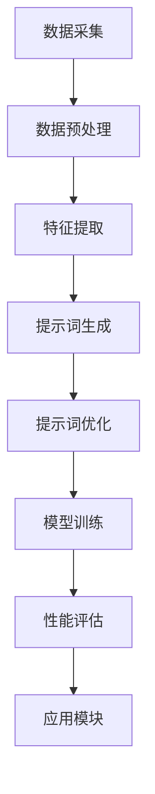
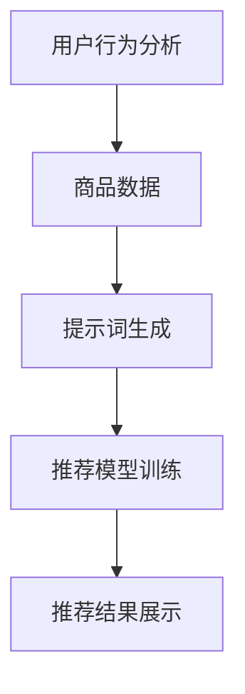
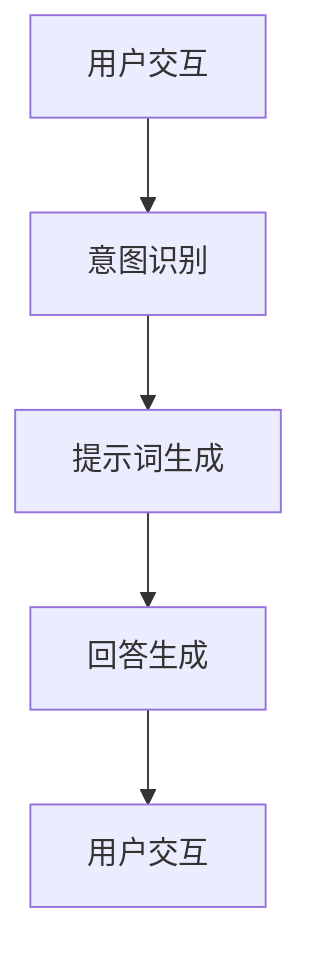

                 


## 文章标题：提示词工程：AI时代的新挑战

### 关键词：提示词工程、AI、自然语言处理、生成对抗网络、质量评估、应用案例

### 摘要：
本文旨在探讨提示词工程在AI时代的背景、定义、原理、技术细节、应用实践以及优化策略。通过逐步分析推理，本文将揭示提示词工程在AI领域的重要性，为读者提供全面深入的理解和实用指南。

## 第一部分：提示词工程概述

### 第1章：提示词工程的定义与背景

#### 1.1.1 提示词工程的定义
提示词工程是一种通过创建和优化提示词来指导机器学习模型进行学习的过程。提示词是对模型的输入，它帮助模型更好地理解和预测目标。

#### 1.1.2 AI时代的新挑战
随着AI技术的快速发展，自然语言处理（NLP）成为了AI领域的重要分支。然而，NLP面临着数据稀缺、语义理解复杂等问题，提示词工程正是为了解决这些问题而出现。

#### 1.1.3 提示词工程的重要性
提示词工程能够提高模型的性能和泛化能力，使得AI系统更加智能和可靠。

#### 1.1.4 提示词工程的发展历程
从最初的基于规则的方法，到基于机器学习的方法，再到生成对抗网络（GAN）的应用，提示词工程经历了不断的发展和优化。

### 第2章：提示词工程的基本原理

#### 2.1.1 提示词生成的算法
提示词生成算法可以分为两类：基于规则的方法和基于机器学习的方法。基于规则的方法通过预设的规则生成提示词，而基于机器学习的方法通过训练数据学习生成提示词。

#### 2.1.2 提示词的格式与结构
提示词的格式和结构对于模型的理解和预测具有重要影响。常见的格式包括关键字提取、模板填充和语义扩展等。

#### 2.1.3 提示词的质量评估
提示词的质量评估是提示词工程的关键环节。评估指标包括语言质量、逻辑一致性和用户满意度等。

#### 2.1.4 提示词工程与自然语言处理的关系
提示词工程是自然语言处理领域的一个重要分支，它与其他NLP技术如词向量表示、语义理解等密切相关。

### 第3章：提示词工程的架构与实现

#### 3.1.1 提示词工程的系统架构
提示词工程的系统架构通常包括数据采集与预处理、提示词生成与优化、提示词应用等模块。

#### 3.1.2 数据采集与预处理
数据采集与预处理是提示词工程的基石。数据的质量和预处理方法直接影响提示词的生成效果。

#### 3.1.3 提示词生成与优化
提示词生成与优化是提示词工程的核心任务。通过算法和技巧，生成高质量的提示词，并不断优化以提高模型性能。

#### 3.1.4 提示词工程的应用场景
提示词工程广泛应用于各种领域，如电商平台的商品推荐、智能客服的对话系统等。

## 第二部分：提示词工程的技术细节

### 第4章：提示词生成算法详解

#### 4.1.1 传统生成算法
传统生成算法包括基于规则的方法和基于机器学习的方法。基于规则的方法通过预设的规则生成提示词，而基于机器学习的方法通过训练数据学习生成提示词。

#### 4.1.2 生成对抗网络（GAN）
生成对抗网络（GAN）是一种强大的生成模型，它通过两个对抗网络的相互博弈，生成高质量的提示词。

### 第5章：提示词质量评估方法

#### 5.1.1 评估指标体系
提示词质量评估指标体系包括语言质量、逻辑一致性和用户满意度等。

#### 5.1.2 质量评估流程与工具
质量评估流程包括数据收集、评估指标计算和结果分析等步骤。常用的评估工具包括BLEU、ROUGE和METEOR等。

### 第6章：提示词工程中的自然语言处理技术

#### 6.1.1 词向量表示
词向量表示是自然语言处理的重要技术之一。Word2Vec和GloVe是常用的词向量表示算法。

#### 6.1.2 语义理解与情感分析
语义理解和情感分析是提示词工程中的重要应用。通过文本分类和情感分析，可以更好地理解和评估提示词的质量。

## 第三部分：提示词工程实践与应用

### 第7章：提示词工程应用案例分析

#### 7.1.1 电商平台的商品推荐
电商平台商品推荐系统通过提示词工程实现个性化推荐，提高用户满意度。

#### 7.1.2 智能客服的对话系统
智能客服的对话系统通过提示词工程实现智能对话，提高客户服务质量。

### 第8章：提示词工程的开发与优化

#### 8.1.1 提示词工程的开发流程
提示词工程的开发流程包括需求分析与设计、系统实现与部署等步骤。

#### 8.1.2 提示词工程的优化策略
提示词工程的优化策略包括模型优化、性能优化和可扩展性优化等。

## 附录

### 附录A：提示词工程常用工具和资源

#### A.1 提示词生成工具
TextGen、GPT-2、GPT-3等。

#### A.2 提示词质量评估工具
BLEU评分、ROUGE评分、METEOR评分等。

### 附录B：提示词工程参考书籍与论文

#### B.1 参考书籍
《深度学习》、《自然语言处理综论》、《提示词工程：理论、方法与实践》等。

#### B.2 经典论文
“A Neural Algorithm of Artistic Style”、“Generative Adversarial Nets”、“BERT: Pre-training of Deep Bidirectional Transformers for Language Understanding”等。

### 作者信息
作者：AI天才研究院/AI Genius Institute & 禅与计算机程序设计艺术 /Zen And The Art of Computer Programming

## 结语
提示词工程是AI时代的一个重要领域，它为自然语言处理带来了新的机遇和挑战。通过本文的逐步分析推理，读者可以深入了解提示词工程的核心概念、原理、技术细节和应用实践，为未来的研究和应用打下坚实的基础。

---

**注意：** 以上内容为框架性的大纲，每个章节的具体内容需要根据实际需求进一步展开，以满足文章的字数要求。每个章节的内容都需要包含丰富的具体细节、算法讲解、实例分析等，以确保文章的深度和实用性。文章的结构和内容可以根据读者的需求和反馈进行适当的调整和优化。在撰写具体章节时，请确保遵循Markdown格式要求，并在需要的地方使用Mermaid流程图、伪代码、LaTeX数学公式和代码示例等。总体字数控制在8000-12000字之间。请开始撰写每个章节的具体内容，并在撰写过程中不断反思和优化，以确保文章的质量和深度。祝您写作顺利！### 第1章：提示词工程的定义与背景

#### 1.1.1 提示词工程的定义

提示词工程是一种通过创建和优化提示词来指导机器学习模型进行学习的过程。提示词是对模型的输入，它帮助模型更好地理解和预测目标。在自然语言处理（NLP）领域，提示词工程尤为重要。它不仅涉及到文本数据的处理，还涉及到如何构建有效的输入来引导模型学习，从而提高模型的性能和泛化能力。

在传统的机器学习模型中，通常需要大量标注数据来进行训练。然而，标注数据的获取是一个耗时且成本高昂的过程。提示词工程通过使用未标注的数据，利用生成模型或者规则系统生成高质量的提示词，从而减轻对标注数据的依赖。这一过程使得模型可以更高效地进行训练，并且在数据稀缺的情况下也能保持较高的性能。

提示词工程不仅仅局限于生成提示词，还包括对提示词进行评估、优化和调整，以确保模型能够从这些输入中获得有效的学习。因此，提示词工程是一个综合性的工程任务，涵盖了数据预处理、模型设计、优化和评估等多个环节。

#### 1.1.2 AI时代的新挑战

随着AI技术的快速发展，自然语言处理（NLP）成为了AI领域的重要分支。然而，NLP面临着一系列新挑战，提示词工程正是为了解决这些问题而出现。

首先，数据稀缺是一个普遍存在的问题。在NLP领域，高质量的标注数据非常稀缺，尤其是在某些特定领域或场景中。传统的机器学习方法依赖于大量的标注数据，而提示词工程通过生成提示词来补充未标注的数据，从而降低了对标注数据的依赖。

其次，语义理解复杂。自然语言具有高度的不确定性和复杂性，使得模型在理解和处理自然语言时面临很大的挑战。提示词工程通过构建高质量的提示词，帮助模型更好地理解和预测语义，从而提高模型的表现。

此外，多模态数据处理也是AI时代的一个重要挑战。在现实应用中，常常需要处理包含文本、图像、音频等多模态数据的任务。提示词工程通过跨模态的提示词生成和优化，使得模型能够更好地融合不同模态的信息，从而提高任务的性能。

总之，AI时代的新挑战促使了提示词工程的发展。通过创建和优化高质量的提示词，提示词工程为解决数据稀缺、语义理解复杂和多模态数据处理等问题提供了有效的方法。在接下来的章节中，我们将进一步探讨提示词工程的基本原理、技术细节和应用实践，以帮助读者全面了解这一重要领域。

#### 1.1.3 提示词工程的重要性

提示词工程在AI领域的应用具有重要的意义，其核心作用主要体现在以下几个方面。

首先，提高模型性能。高质量的提示词能够提供丰富的信息，有助于模型更好地理解输入数据。通过优化提示词，模型可以更准确地捕捉数据的特征和规律，从而提高预测和分类的准确性。提示词工程通过不断调整和改进提示词，使得模型在训练过程中能够更加高效地学习，从而提升模型的整体性能。

其次，减轻数据稀缺问题。在自然语言处理领域，高质量的标注数据往往稀缺且昂贵。提示词工程通过生成和优化提示词，可以有效地利用未标注的数据，从而降低对标注数据的依赖。这一方法不仅节省了数据获取的成本，还提高了数据利用的效率，使得模型在数据稀缺的情况下依然能够保持较高的性能。

此外，提升模型泛化能力。泛化能力是评估模型性能的重要指标，它反映了模型在不同数据集上的表现。通过优化提示词，模型可以学习到更一般化的特征和模式，从而提升模型的泛化能力。高质量的提示词可以帮助模型更好地应对新的数据和场景，提高模型的适应性。

再者，促进跨学科研究。提示词工程涉及多个领域，包括自然语言处理、机器学习、数据挖掘等。通过这一工程，不同领域的专家可以相互合作，共同探索新的方法和技术，从而推动跨学科研究的发展。

最后，优化用户体验。在智能客服、语音识别、机器翻译等应用中，高质量的提示词能够提供更准确、自然的交互体验。通过优化提示词，系统可以更好地理解用户需求，提供更个性化的服务，从而提升用户体验。

综上所述，提示词工程在AI领域具有重要的意义。它不仅提高了模型的性能和泛化能力，还解决了数据稀缺问题，促进了跨学科研究，优化了用户体验。随着AI技术的不断进步，提示词工程将继续发挥其重要作用，为AI应用带来更多的创新和突破。

#### 1.1.4 提示词工程的发展历程

提示词工程作为一个新兴领域，其发展历程可以分为几个关键阶段，每个阶段都标志着技术的进步和应用场景的拓展。

最早期的提示词工程可以追溯到基于规则的方法。这种方法通过预设的规则和模板来生成提示词，适用于简单的文本分类和命名实体识别任务。基于规则的系统依赖于人类专家的知识和经验，其优势在于实现简单、可解释性强，但缺点在于扩展性差、适应性弱，难以处理复杂和变化多端的语义信息。

随着机器学习技术的发展，基于机器学习的方法逐渐兴起。这种方法通过训练数据学习生成提示词的规律，具有更强的适应性和泛化能力。例如，决策树、朴素贝叶斯等传统机器学习算法被应用于提示词生成，使得系统能够从大量未标注的数据中自动提取特征和模式。这一阶段标志着提示词工程从手工规则走向自动化，提高了生成提示词的效率和质量。

近年来，生成对抗网络（GAN）的出现为提示词工程带来了革命性的变化。GAN通过两个对抗网络的相互博弈，生成高质量、多样化的提示词。生成器网络生成提示词，而判别器网络则判断提示词的真实性。这一过程不断迭代，使得生成的提示词逐渐逼近真实数据。GAN在图像生成、语音合成等领域已经取得了显著成果，其在提示词工程中的应用也为自然语言处理带来了新的机遇。

除了生成对抗网络，深度学习的进步也为提示词工程注入了新的动力。深度学习模型如循环神经网络（RNN）和变换器（Transformer）在自然语言处理中表现出色，通过大规模预训练和微调，可以生成高质量的提示词。预训练模型如GPT-2、GPT-3等，通过在大量未标注文本上训练，能够生成丰富多样、符合语法和语义规则的提示词。

此外，多模态数据的兴起也推动了提示词工程的发展。在多模态任务中，提示词工程不仅需要生成文本提示词，还需要生成图像、音频等模态的提示词。通过跨模态的提示词生成和融合，模型能够更好地理解和处理多模态数据，从而提高任务的性能。

总的来说，提示词工程的发展历程反映了AI技术在自然语言处理领域的不断进步。从基于规则的简单系统，到基于机器学习的自动化方法，再到生成对抗网络和深度学习的突破，提示词工程不断拓展其应用场景和技术边界。随着AI技术的不断演进，提示词工程将继续为自然语言处理领域带来新的挑战和机遇。在下一章节中，我们将深入探讨提示词工程的基本原理和关键技术。

### 第2章：提示词工程的基本原理

#### 2.1.1 提示词生成的算法

提示词生成是提示词工程的核心任务，其算法可以分为基于规则的方法和基于机器学习的方法。每种方法都有其独特的特点和适用场景，下面我们将分别介绍这两种方法。

**1. 基于规则的方法**

基于规则的方法是通过预设的规则和模板来生成提示词。这种方法通常由人类专家根据任务需求和语言特性设计规则和模板。其优点是实现简单、可解释性强，适用于简单的文本分类和命名实体识别任务。

具体来说，基于规则的方法通常包括以下步骤：

- **规则设计**：根据任务需求，定义一系列规则。这些规则可以是简单的关键词匹配、语法规则或模式匹配等。
- **模板填充**：将规则应用于输入文本，根据规则匹配的结果填充模板，生成提示词。
- **模板优化**：通过实验和反馈不断优化模板，以提高提示词的生成质量和模型性能。

然而，基于规则的方法也存在一些局限性。首先，规则的预设需要大量的人工干预，成本较高且难以扩展。其次，这种方法在处理复杂语义和多模态数据时效果不佳，难以适应多样化的数据场景。

**2. 基于机器学习的方法**

基于机器学习的方法是通过训练数据学习生成提示词的规律。这种方法具有更强的适应性和泛化能力，适用于复杂和多变的数据场景。常见的基于机器学习的方法包括以下几种：

- **决策树和朴素贝叶斯**：这些传统的机器学习算法通过训练数据学习特征和模式，生成基于概率的提示词。它们在文本分类和朴素贝叶斯推荐系统中表现出色。
- **神经网络**：神经网络，尤其是深度学习模型，通过多层非线性变换学习复杂的数据模式。循环神经网络（RNN）和变换器（Transformer）是常用的神经网络模型，在自然语言处理任务中表现出色。
- **生成对抗网络（GAN）**：GAN通过两个对抗网络的相互博弈，生成高质量、多样化的提示词。生成器网络生成提示词，而判别器网络则判断提示词的真实性。这一过程不断迭代，使得生成的提示词逐渐逼近真实数据。

基于机器学习的方法的优势在于其自动化的特征提取和模式学习，能够处理大量未标注的数据，提高提示词的生成质量和模型性能。然而，这种方法也需要大量的训练数据和计算资源，并且在模型的可解释性方面存在一定挑战。

**3. 基于规则方法和基于机器学习方法的比较**

- **优势**：基于规则的方法实现简单、可解释性强；基于机器学习的方法适应性强、泛化能力高。
- **劣势**：基于规则的方法扩展性差、成本高；基于机器学习的方法需要大量数据和计算资源、可解释性差。

在实际应用中，可以根据任务需求和数据特性选择合适的生成方法。对于简单的文本分类和命名实体识别任务，基于规则的方法可能更为合适；而对于复杂和多变的自然语言处理任务，基于机器学习的方法更能满足需求。

#### 2.1.2 提示词的格式与结构

提示词的格式和结构对于模型的理解和预测具有重要影响。高质量的提示词能够提供丰富的信息，帮助模型更好地学习和理解数据。以下是一些常见的提示词格式和结构：

**1. 关键词提取**

关键词提取是提示词生成中常用的方法之一。它通过提取文本中的关键信息，生成简洁明了的提示词。关键词提取方法包括基于词频、基于语义和基于上下文的方法。

- **基于词频的方法**：通过统计文本中词频的高低来提取关键词。这种方法简单有效，但可能忽略词语的语义和上下文关系。
- **基于语义的方法**：通过词义相似度和语义关系来提取关键词。这种方法能够更好地反映文本的核心内容，但计算复杂度较高。
- **基于上下文的方法**：结合文本的上下文信息来提取关键词。这种方法能够更好地捕捉文本的语义结构，但需要更多的先验知识和计算资源。

**2. 模板填充**

模板填充是一种通过填充预设模板来生成提示词的方法。模板通常包含固定部分和可变部分，通过将文本中的信息填充到可变部分，生成提示词。模板填充方法适用于结构化数据，如时间序列、事件日志等。

- **固定部分**：模板中的固定部分通常包含一些基本信息，如时间、地点、人物等。这部分信息对于模型的预测和理解至关重要。
- **可变部分**：模板中的可变部分用于填充文本中的具体信息。通过调整可变部分的结构和内容，可以生成不同类型的提示词，满足不同的任务需求。

**3. 语义扩展**

语义扩展是一种通过扩展文本的语义信息来生成提示词的方法。它通过理解文本的语义结构，生成包含更广泛信息的提示词。语义扩展方法适用于需要捕捉复杂语义信息的任务，如情感分析、问答系统等。

- **扩展方法**：语义扩展可以通过词义扩展、语义角色标注和语义关系挖掘等方法实现。这些方法能够增加文本的语义深度，使得提示词更具有代表性和预测性。
- **挑战**：语义扩展面临着语义理解复杂、信息丢失和计算资源消耗等问题。如何有效地扩展语义信息，同时保持提示词的质量和效率，是语义扩展面临的主要挑战。

总之，提示词的格式和结构对于模型的理解和预测具有重要影响。选择合适的格式和结构，能够提高提示词的生成质量和模型的性能。在实际应用中，可以根据任务需求和数据特性选择合适的提示词格式和结构，以实现最优的效果。

#### 2.1.3 提示词的质量评估

提示词的质量评估是提示词工程中的一个关键环节，它决定了生成的提示词是否能够有效地指导模型学习和预测。提示词的质量可以从多个维度进行评估，包括语言质量、逻辑一致性和用户满意度等。

**1. 语言质量指标**

语言质量是评估提示词的基本指标，它反映了提示词的语法正确性、语义连贯性和文本风格。常见的语言质量指标包括：

- **语法正确性**：提示词应该符合语法规则，避免拼写错误、语法不一致等问题。可以使用语法检查工具和规则库来进行评估。
- **语义连贯性**：提示词应该具有清晰的语义意义，能够准确地传达文本的核心内容。可以通过语义分析工具和语义关系库来评估提示词的连贯性。
- **文本风格**：提示词应该符合文本的风格要求，如正式、非正式、幽默等。可以通过文本风格分析工具和风格库来进行评估。

**2. 逻辑一致性指标**

逻辑一致性是评估提示词的重要指标，它反映了提示词之间的逻辑关系是否合理。逻辑一致性指标包括：

- **内部一致性**：提示词内部应该具有一致性，避免出现矛盾或自相矛盾的陈述。可以通过逻辑推理和一致性检查算法来评估内部一致性。
- **跨提示词一致性**：提示词之间应该具有一致性，避免出现提示词之间的逻辑冲突或相互矛盾。可以通过跨提示词一致性检查算法来评估。
- **上下文适应性**：提示词应该与上下文环境相符，避免出现脱离上下文的陈述。可以通过上下文分析工具和上下文库来进行评估。

**3. 用户满意度指标**

用户满意度是评估提示词的实际效果和用户接受度的指标。它反映了用户对提示词的满意程度和使用体验。常见的用户满意度指标包括：

- **用户反馈**：通过用户反馈来评估提示词的用户满意度。用户可以报告提示词的可读性、理解性和实用性等问题。
- **任务完成率**：提示词是否能够帮助用户顺利完成任务，可以通过任务完成率来评估。
- **用户停留时间**：用户在使用提示词指导下的停留时间，可以作为评估用户满意度的间接指标。

**4. 质量评估流程与工具**

提示词的质量评估通常包括以下流程和工具：

- **数据收集**：收集提示词生成过程中生成的候选提示词，以及相关的上下文数据。
- **评估指标计算**：根据语言质量、逻辑一致性和用户满意度等指标，计算提示词的质量得分。
- **结果分析**：对评估结果进行分析，识别高质量的提示词和需要改进的方面。
- **工具使用**：可以使用自动化评估工具，如语法检查器、语义分析工具、逻辑推理工具等，来辅助评估过程。

总之，提示词的质量评估是提示词工程的重要组成部分。通过制定合理的评估指标和评估流程，可以确保生成的提示词能够满足任务需求，提高模型性能和用户满意度。在下一章节中，我们将进一步探讨提示词工程与自然语言处理的关系，以及如何结合其他NLP技术来提升提示词工程的效果。

#### 2.1.4 提示词工程与自然语言处理的关系

提示词工程是自然语言处理（NLP）领域中的一个重要分支，其核心目标是通过创建和优化高质量的提示词，来指导模型更好地理解和处理自然语言数据。提示词工程与自然语言处理之间的紧密关系，主要体现在以下几个方面。

**1. 数据准备**

自然语言处理的第一个关键步骤是数据准备。高质量的数据是训练高效模型的基石。提示词工程通过生成和优化提示词，可以有效地利用未标注的数据，从而减轻对标注数据的依赖。这一过程不仅提高了数据利用率，还能够扩展数据集的规模，为模型提供更多样化的训练样本。

**2. 特征提取**

在自然语言处理中，特征提取是将原始文本数据转换为模型可以理解的形式。提示词工程通过提取关键信息、关键词和语义结构，为模型提供了丰富的特征信息。高质量的提示词能够捕捉文本的核心内容和潜在模式，有助于模型更好地学习和预测。

**3. 模型训练**

提示词工程在模型训练过程中起着至关重要的作用。通过高质量的提示词，模型能够从大量未标注的数据中学习到有效的特征和模式，从而提高模型的泛化能力和性能。提示词的优化过程，包括调整提示词的格式、结构和内容，可以进一步改善模型的表现。

**4. 性能评估**

提示词工程在性能评估阶段也具有重要影响。通过评估提示词的质量，可以识别出模型可能存在的问题，如语义理解不足、逻辑不一致等。这些评估结果可以为后续的模型优化和提示词调整提供重要的参考。

**5. 应用场景**

提示词工程广泛应用于自然语言处理的多个应用场景，如文本分类、情感分析、机器翻译和对话系统等。通过生成和优化高质量的提示词，这些应用系统能够更准确地理解和处理用户输入，提供更自然和个性化的服务。

**6. 技术融合**

提示词工程与自然语言处理的其他技术，如词向量表示、语义理解和情感分析等，紧密融合。高质量的提示词不仅需要捕捉文本的语法和语义信息，还需要与这些技术相结合，以实现更高的性能和更广泛的应用。

**7. 挑战与机遇**

尽管提示词工程为自然语言处理带来了许多机遇，但也面临着一系列挑战。数据稀缺、语义理解复杂和多模态数据处理等问题，需要不断探索新的方法和技术来解决。随着AI技术的不断进步，提示词工程将继续在自然语言处理领域发挥重要作用，推动该领域的发展和创新。

综上所述，提示词工程与自然语言处理密切相关，相互促进。通过高质量的提示词，可以显著提升模型性能和应用效果，为自然语言处理领域带来更多机遇和挑战。在下一章节中，我们将深入探讨提示词工程的架构与实现，解析其系统架构、数据采集与预处理、提示词生成与优化以及应用场景。

### 第3章：提示词工程的架构与实现

#### 3.1.1 提示词工程的系统架构

提示词工程的系统架构是一个复杂的体系，包括多个模块和组件，每个模块都有其特定的功能。以下是提示词工程的典型系统架构：

1. **数据采集模块**：数据采集模块负责收集各种来源的数据，包括已标注数据、未标注数据、外部数据源等。这一模块需要确保数据的质量和多样性，以便后续处理。

2. **数据预处理模块**：数据预处理模块对采集到的数据进行清洗、去重、去噪等操作，确保数据的一致性和准确性。此外，还需要进行文本归一化、分词、词性标注等预处理步骤。

3. **特征提取模块**：特征提取模块负责从预处理后的文本数据中提取关键信息，生成特征向量。这些特征向量将被用于训练模型和生成提示词。

4. **提示词生成模块**：提示词生成模块是核心部分，包括基于规则的方法和基于机器学习的方法。这一模块生成高质量的提示词，用于指导模型进行学习和预测。

5. **提示词优化模块**：提示词优化模块对生成的提示词进行评估和优化，确保其质量满足要求。优化过程可能涉及调整提示词的格式、结构和内容。

6. **模型训练模块**：模型训练模块使用生成和优化的提示词对模型进行训练。这一模块可能包括多个子模块，如损失函数设计、优化算法选择、模型调参等。

7. **性能评估模块**：性能评估模块对训练好的模型进行评估，包括语言质量、逻辑一致性和用户满意度等指标。评估结果用于指导模型和提示词的进一步优化。

8. **应用模块**：应用模块将训练好的模型部署到实际应用中，如文本分类、情感分析、对话系统等。这一模块需要与前端应用系统集成，提供用户交互界面。

**Mermaid流程图表示：**



#### 3.1.2 数据采集与预处理

数据采集与预处理是提示词工程的基石，直接影响到后续的提示词生成和模型训练效果。以下是数据采集与预处理的关键步骤：

1. **数据收集**：从各种来源收集文本数据，包括公共数据集、社交媒体、企业内部数据等。数据收集需要保证数据的多样性和代表性，以便覆盖各种场景。

2. **数据清洗**：对收集到的数据进行清洗，去除无效、重复和错误的数据。数据清洗包括去除HTML标签、停用词过滤、纠正拼写错误等。

3. **数据去重**：检测和去除重复的数据条目，确保数据集的纯洁性。

4. **文本归一化**：将文本转换为统一的格式，如统一编码、统一大小写、统一标点符号等。文本归一化有助于提高数据的一致性和处理效率。

5. **分词**：将文本分割成单个词语或词单元。常用的分词工具包括jieba、NLTK等。

6. **词性标注**：对分词后的文本进行词性标注，标记每个词语的词性，如名词、动词、形容词等。词性标注有助于后续的语义分析和特征提取。

7. **实体识别**：识别文本中的命名实体，如人名、地名、组织名等。实体识别有助于提取关键信息，提高提示词的质量。

**伪代码示例：**

```python
# 数据清洗和预处理伪代码
def preprocess_data(data):
    cleaned_data = []
    for text in data:
        # 去除HTML标签
        text = remove_html_tags(text)
        # 停用词过滤
        text = remove_stopwords(text)
        # 文本归一化
        text = normalize_text(text)
        # 分词
        words = tokenize(text)
        # 词性标注
        tagged_words = pos_tagging(words)
        # 实体识别
        entities = named_entity_recognition(text)
        cleaned_data.append((tagged_words, entities))
    return cleaned_data
```

通过上述步骤，数据采集与预处理模块为提示词生成和模型训练提供了高质量、干净且结构化的数据，为后续的工作奠定了坚实的基础。

#### 3.1.3 提示词生成与优化

提示词生成与优化是提示词工程的核心环节，决定了模型的性能和效果。以下是这一环节的关键步骤：

1. **提示词生成**：
   - **基于规则的方法**：通过预设的规则和模板生成提示词。规则可以是简单的关键词匹配、语法规则或模式匹配等。模板则包含固定部分和可变部分，通过填充可变部分生成提示词。
   - **基于机器学习的方法**：通过训练数据学习生成提示词的规律。常用的方法包括决策树、朴素贝叶斯、神经网络（如RNN、Transformer）和生成对抗网络（GAN）等。
   - **多模态数据融合**：对于多模态数据，如文本、图像和音频，可以通过融合不同模态的信息来生成更加丰富的提示词。这种方法能够提高模型的跨模态理解能力。

2. **提示词优化**：
   - **质量评估**：对生成的提示词进行质量评估，包括语法正确性、语义连贯性、逻辑一致性等。常用的评估工具包括语法检查器、语义分析工具和逻辑推理工具。
   - **用户反馈**：通过用户反馈来识别和纠正提示词中的问题。用户可以报告提示词的可读性、理解性和实用性等问题。
   - **自动调整**：根据评估结果和用户反馈，自动调整提示词的格式、结构和内容。例如，可以通过调整关键词的权重、替换不符合语义的词汇、优化句子结构等。

**伪代码示例：**

```python
# 提示词生成和优化伪代码
def generate_and_optimize_prompt(data):
    prompts = []
    for text in data:
        # 基于规则生成提示词
        prompt = rule_based_generation(text)
        # 质量评估
        quality_score = quality_evaluation(prompt)
        # 用户反馈
        user_feedback = get_user_feedback(prompt)
        # 提示词优化
        optimized_prompt = prompt
        if quality_score < threshold or user_feedback != 'satisfied':
            optimized_prompt = optimize_prompt(prompt, user_feedback)
        prompts.append(optimized_prompt)
    return prompts
```

通过提示词生成与优化，可以确保生成的提示词具有高质量和良好的用户体验，从而提高模型的学习效果和预测准确性。这一过程是一个动态迭代的过程，通过不断的评估和调整，最终生成最佳的提示词。

#### 3.1.4 提示词工程的应用场景

提示词工程在自然语言处理（NLP）领域有着广泛的应用场景，通过生成和优化高质量的提示词，可以显著提升模型的性能和应用效果。以下是一些典型的应用场景：

1. **文本分类**：在文本分类任务中，提示词工程通过生成和优化与类别相关的提示词，帮助模型更好地理解和区分不同类别的文本。例如，在新闻分类中，提示词可以包括新闻的主题、关键词和事件描述，从而提高分类的准确性。

2. **情感分析**：情感分析任务需要模型理解文本的情绪和情感。提示词工程通过生成和优化与情感相关的提示词，如情感关键词、情感短语和情感表达，帮助模型更准确地判断文本的情感倾向。例如，在社交媒体情感分析中，提示词可以包括表达积极或消极情感的词汇和句子。

3. **问答系统**：问答系统需要模型理解用户的问题并生成准确的答案。提示词工程通过生成和优化与问题相关的提示词，如问题关键词、问题类型和上下文信息，帮助模型更好地理解问题和提供准确的答案。

4. **机器翻译**：在机器翻译任务中，提示词工程通过生成和优化与翻译任务相关的提示词，如源语言和目标语言的语法结构、词汇和上下文信息，帮助模型更好地翻译文本。例如，在机器翻译系统中，提示词可以包括源语言和目标语言的短语、句型和语义信息。

5. **对话系统**：对话系统需要模型理解用户的输入并生成合适的回复。提示词工程通过生成和优化与对话场景相关的提示词，如用户意图、对话主题和上下文信息，帮助模型更自然和准确地与用户进行交互。

**应用场景举例：电商平台的商品推荐**

在电商平台中，商品推荐系统是一个典型的应用场景。通过提示词工程，可以生成和优化与商品推荐相关的提示词，从而提高推荐系统的性能和用户满意度。

- **数据采集与预处理**：从电商平台的商品数据中采集相关信息，包括商品名称、描述、用户评论等。对采集到的数据进行清洗、去重和预处理，提取关键特征和标签。

- **提示词生成**：基于用户的历史购买行为、浏览记录和搜索关键词，生成与用户兴趣相关的提示词。这些提示词可以包括用户感兴趣的商品类别、品牌和功能等。

- **提示词优化**：对生成的提示词进行质量评估和用户反馈，根据评估结果和用户反馈进行优化。例如，通过调整关键词的权重、优化句子结构、增加上下文信息等，提高提示词的准确性和可读性。

- **模型训练与部署**：使用生成的提示词对推荐模型进行训练，并通过在线学习不断优化模型。将训练好的模型部署到电商平台的应用中，提供个性化的商品推荐服务。

通过提示词工程的实施，电商平台的商品推荐系统能够更好地理解用户需求，提供更准确、个性化的商品推荐，从而提升用户满意度和转化率。

总之，提示词工程在NLP领域具有广泛的应用场景，通过生成和优化高质量的提示词，可以显著提升模型的学习效果和应用效果。在下一章节中，我们将进一步探讨提示词生成算法的详细实现，包括传统生成算法和生成对抗网络（GAN）的应用。

### 第4章：提示词生成算法详解

#### 4.1.1 传统生成算法

提示词生成算法可以分为传统生成算法和现代生成算法。传统生成算法主要包括基于规则的方法和基于机器学习的方法。以下我们将分别介绍这两种方法。

**1. 基于规则的方法**

基于规则的方法通过预设的规则和模板来生成提示词。这种方法依赖于人类专家的知识和经验，其优势在于实现简单、可解释性强，适用于简单的文本分类和命名实体识别任务。

**实现步骤：**
- **规则设计**：根据任务需求和语言特性，定义一系列规则。这些规则可以是简单的关键词匹配、语法规则或模式匹配等。
- **模板填充**：将规则应用于输入文本，根据规则匹配的结果填充模板，生成提示词。
- **模板优化**：通过实验和反馈不断优化模板，以提高提示词的生成质量和模型性能。

**优点：**
- **实现简单**：基于规则的系统不需要大量的训练数据和复杂的模型，实现起来较为简单。
- **可解释性强**：规则和模板的设计过程易于理解，使得系统更加透明和可控。

**缺点：**
- **扩展性差**：随着数据复杂性和任务多样性的增加，规则的扩展和维护成本很高。
- **适应性弱**：基于规则的系统在处理复杂语义和多模态数据时效果不佳。

**应用场景：**
- **简单的文本分类**：例如新闻分类、垃圾邮件过滤等。
- **命名实体识别**：从文本中提取人名、地名、组织名等实体。

**伪代码示例：**

```python
def rule_based_generation(text, rules):
    prompt = ""
    for rule in rules:
        if matches_rule(text, rule):
            prompt += rule["template"].format(**extract_variables(text, rule))
    return prompt
```

**2. 基于机器学习的方法**

基于机器学习的方法通过训练数据学习生成提示词的规律。这种方法具有更强的适应性和泛化能力，适用于复杂和多变的数据场景。

**常用算法：**
- **决策树**：通过树形结构对数据进行分割，生成规则。
- **朴素贝叶斯**：基于贝叶斯定理，通过概率模型生成提示词。
- **神经网络**：通过多层非线性变换学习复杂的数据模式。例如，循环神经网络（RNN）和变换器（Transformer）在自然语言处理任务中表现出色。

**实现步骤：**
- **数据准备**：收集和整理训练数据，对数据标签进行标注。
- **模型训练**：使用训练数据对机器学习模型进行训练，模型学习如何根据输入文本生成提示词。
- **模型评估**：通过验证集对模型进行评估，调整模型参数，提高生成提示词的质量。
- **提示词生成**：使用训练好的模型对输入文本进行提示词生成。

**优点：**
- **适应性强**：基于机器学习的方法能够自动从大量数据中学习特征和模式，适应不同场景和任务。
- **泛化能力强**：通过训练，模型能够泛化到未见过的数据上，提高系统的泛化能力。

**缺点：**
- **数据需求高**：机器学习模型通常需要大量标注数据进行训练，数据获取和标注成本高。
- **可解释性差**：深度学习模型尤其是神经网络模型的黑箱特性，使得其内部机制难以解释和理解。

**应用场景：**
- **文本分类**：例如情感分析、主题分类等。
- **命名实体识别**：从文本中识别人名、地名、组织名等实体。
- **对话系统**：生成与对话主题相关的提示词。

**伪代码示例：**

```python
def machine_learning_generation(text, model):
    input_vector = preprocess_text(text)
    prompt = model.predict(input_vector)
    return prompt
```

通过上述传统生成算法和基于机器学习的方法，我们可以根据具体任务需求和数据特性选择合适的生成方法，生成高质量的提示词。在下一章节中，我们将进一步探讨生成对抗网络（GAN）在提示词生成中的应用，为提示词工程提供更多创新和优化手段。

#### 4.1.2 生成对抗网络（GAN）

生成对抗网络（GAN）是近年来在深度学习领域取得重大突破的一种生成模型，它通过两个对抗网络的相互博弈，生成高质量、多样化的提示词。GAN在自然语言处理领域具有广泛的应用前景，其独特的工作原理和优势使其成为提示词工程的重要工具。

**1. GAN的工作原理**

GAN由两个主要组件组成：生成器（Generator）和判别器（Discriminator）。

- **生成器**：生成器的任务是生成高质量的提示词，使其尽量接近真实数据。生成器通过一个映射函数将随机噪声输入映射为提示词。
- **判别器**：判别器的任务是区分生成器生成的提示词和真实数据。判别器通过一个分类函数对输入数据进行判断，输出一个概率值，表示输入数据的真实程度。

GAN的训练过程可以看作是一个零和博弈的过程。生成器试图生成更真实的提示词，以欺骗判别器，而判别器则试图准确判断输入数据的真实性。这个博弈过程通过反向传播和梯度下降算法不断迭代，使得生成器和判别器都逐步优化，最终生成高质量的提示词。

**2. GAN在提示词生成中的应用**

GAN在提示词生成中的应用主要体现在以下几个方面：

- **高质量提示词生成**：GAN能够通过不断迭代和优化，生成高质量的提示词。这些提示词不仅具有自然语言的特点，还能够捕捉文本的语义和结构，提高模型的性能和效果。
- **多样化提示词生成**：GAN通过对抗训练，生成器能够学习到多种不同的提示词生成模式，从而生成多样化的提示词。这使得模型能够适应不同的任务场景和用户需求，提供更个性化的服务。
- **处理未标注数据**：GAN通过生成器可以处理大量未标注的数据，补充标注数据的不足。在自然语言处理领域，标注数据往往稀缺且昂贵，GAN能够利用未标注数据生成高质量的提示词，提高数据利用效率。

**3. GAN在提示词生成中的应用案例**

以下是一个典型的GAN在提示词生成中的应用案例：

**案例：智能客服对话系统的提示词生成**

在智能客服对话系统中，生成高质量的提示词对于提供准确、自然的回答至关重要。通过GAN，可以生成和优化与用户问题相关的提示词，从而提高对话系统的性能和用户体验。

**实现步骤：**

- **数据准备**：收集智能客服对话系统的历史对话数据，包括用户问题和系统回答。
- **生成器设计**：设计生成器网络，将随机噪声输入映射为与用户问题相关的提示词。
- **判别器设计**：设计判别器网络，对输入的提示词进行判断，区分真实回答和生成回答。
- **训练过程**：通过对抗训练，不断迭代优化生成器和判别器，使得生成器生成的提示词逐渐逼近真实回答。
- **提示词生成**：使用训练好的生成器对用户问题生成高质量的提示词，提供准确、自然的回答。

**伪代码示例：**

```python
# GAN在智能客服对话系统的提示词生成伪代码
def train_gan(generator, discriminator, dataset):
    for epoch in range(num_epochs):
        for user_question, real_answer in dataset:
            # 训练判别器
            discriminator_loss = train_discriminator(discriminator, user_question, real_answer)
            # 训练生成器
            generator_loss = train_generator(generator, discriminator)
            # 输出训练损失
            print(f"Epoch {epoch}, Generator Loss: {generator_loss}, Discriminator Loss: {discriminator_loss}")

def generate_prompt(generator, user_question):
    noise = generate_noise()
    generated_prompt = generator.predict(noise)
    return generated_prompt
```

通过GAN的应用，智能客服对话系统能够生成和优化高质量的提示词，提供更自然、准确的回答，从而提升用户体验和服务质量。

综上所述，生成对抗网络（GAN）在提示词生成中的应用，为自然语言处理领域带来了新的机遇和挑战。通过GAN，可以生成高质量、多样化的提示词，提高模型的性能和效果，为智能客服、对话系统和其他NLP应用提供有力支持。在下一章节中，我们将进一步探讨提示词质量评估方法，确保生成的提示词符合语言质量、逻辑一致性和用户满意度等要求。

### 第5章：提示词质量评估方法

#### 5.1.1 评估指标体系

提示词质量评估是确保生成的提示词能够有效指导模型学习的重要环节。评估指标体系应涵盖多个维度，包括语言质量、逻辑一致性和用户满意度等。以下为常用的评估指标及其具体定义：

**1. 语言质量指标**

- **语法正确性**：提示词应遵循语法规则，避免拼写错误、语法不一致等问题。例如，可以使用语法检查工具（如Grammarly）来评估语法正确性。
- **语义连贯性**：提示词应具有清晰的语义意义，能够准确传达文本的核心内容。可以使用语义分析工具（如BERT）来评估语义连贯性。
- **文本风格**：提示词应符合特定的文本风格要求，如正式、非正式、幽默等。可以使用文本风格分析工具（如StyleCop）来评估文本风格。

**2. 逻辑一致性指标**

- **内部一致性**：提示词内部应具有一致性，避免出现矛盾或自相矛盾的陈述。可以通过逻辑推理和一致性检查算法来评估内部一致性。
- **跨提示词一致性**：提示词之间应具有一致性，避免出现提示词之间的逻辑冲突或相互矛盾。可以通过跨提示词一致性检查算法来评估。
- **上下文适应性**：提示词应与上下文环境相符，避免出现脱离上下文的陈述。可以通过上下文分析工具（如Context Encoder）来评估上下文适应性。

**3. 用户满意度指标**

- **用户反馈**：通过用户反馈来评估提示词的用户满意度。用户可以报告提示词的可读性、理解性和实用性等问题。可以使用用户调研问卷或在线反馈系统来收集用户反馈。
- **任务完成率**：提示词是否能够帮助用户顺利完成任务，可以通过任务完成率来评估。任务完成率越高，说明提示词的质量越高。
- **用户停留时间**：用户在使用提示词指导下的停留时间，可以作为评估用户满意度的间接指标。用户停留时间越长，说明提示词对用户具有更高的吸引力。

#### 5.1.2 质量评估流程与工具

提示词质量评估通常包括以下流程和工具：

**1. 数据准备**

收集生成的提示词和相关的上下文数据。数据应涵盖不同场景和任务类型，以确保评估结果的全面性和代表性。

**2. 评估指标计算**

根据语言质量、逻辑一致性和用户满意度等指标，计算每个提示词的质量得分。可以使用自动化评估工具来计算各项指标。

**3. 结果分析**

对评估结果进行分析，识别高质量的提示词和需要改进的方面。可以使用数据分析工具（如Pandas、Matplotlib）来可视化评估结果，帮助理解和解读评估结果。

**4. 工具使用**

以下是一些常用的提示词质量评估工具：

- **语法检查器**：如Grammarly、Grammarly for Chrome等，用于评估语法正确性。
- **语义分析工具**：如BERT、GPT等，用于评估语义连贯性和文本风格。
- **逻辑推理工具**：如Prolog、Cognitive Assistant等，用于评估内部一致性和跨提示词一致性。
- **用户反馈工具**：如用户调研问卷、在线反馈系统等，用于收集用户满意度反馈。

**5. 自动化评估流程**

```python
# 提示词质量评估自动化流程伪代码
def evaluate_prompts(prompts, context_data):
    grammar_scores = check_grammar(prompts)
    semantic_scores = analyze_semantics(prompts, context_data)
    logical_scores = check_logical_consistency(prompts)
    user_feedback = collect_user_feedback(prompts)
    
    overall_scores = calculate_average_score(grammar_scores, semantic_scores, logical_scores, user_feedback)
    return overall_scores

# 计算平均得分
def calculate_average_score(scores):
    total_score = sum(scores)
    average_score = total_score / len(scores)
    return average_score
```

通过上述流程和工具，可以系统地评估提示词的质量，确保生成的提示词符合语言质量、逻辑一致性和用户满意度等要求。在下一章节中，我们将深入探讨提示词工程中的自然语言处理技术，解析词向量表示、语义理解和情感分析等关键技术。

### 第6章：提示词工程中的自然语言处理技术

#### 6.1.1 词向量表示

词向量表示是将自然语言文本中的词汇映射到高维向量空间的过程。词向量表示技术对于提升提示词工程的效果至关重要，因为它们能够将抽象的文本信息转化为计算机可以处理的数值形式。以下介绍两种常用的词向量表示方法：Word2Vec和GloVe。

**1. Word2Vec算法**

Word2Vec算法是由Google提出的一种基于神经网络的方法，用于生成词向量。Word2Vec算法主要包括两个变种：连续词袋（CBOW）和Skip-Gram。

- **连续词袋（CBOW）**：CBOW算法通过上下文词来预测中心词。具体来说，给定一个中心词，算法会使用周围若干个词的词向量来计算中心词的词向量。
- **Skip-Gram**：与CBOW相反，Skip-Gram算法通过中心词来预测上下文词。给定一个中心词，算法会预测与其相邻的若干个词。

**伪代码示例：**

```python
# Word2Vec算法伪代码
def Word2Vec(training_data, size, window, alpha):
    # 初始化词向量
    vectors = initialize_vectors(size, vocab_size)
    # 计算词向量
    for center_word in training_data:
        context_words = get_context_words(center_word, window)
        predict_words = predict_words_from_context(center_word, context_words, vectors)
        update_vectors(vectors, center_word, predict_words, alpha)
    return vectors
```

**2. GloVe算法**

GloVe（Global Vectors for Word Representation）是一种基于共现矩阵的方法，通过计算词汇之间的共现关系来生成词向量。GloVe算法的主要思想是，词汇的词向量可以通过词频和词与词之间的共现矩阵来学习。

- **训练过程**：首先，构建词频矩阵，然后通过优化词向量来最小化损失函数。
- **损失函数**：GloVe算法使用均方误差（MSE）作为损失函数，通过优化损失函数来学习词向量。

**伪代码示例：**

```python
# GloVe算法伪代码
def GloVe(training_data, embedding_size, alpha):
    # 构建共现矩阵
    cooccurrence_matrix = build_cooccurrence_matrix(training_data)
    # 计算词向量
    vectors = train_embedding(cooccurrence_matrix, embedding_size, alpha)
    return vectors
```

**3. 词向量表示的优势**

- **语义信息表示**：词向量能够捕捉词汇的语义信息，使得相似的词汇在向量空间中距离较近。
- **计算效率**：词向量表示使得文本数据处理更加高效，便于模型训练和推理。
- **跨语言应用**：词向量表示可以用于跨语言文本处理，通过共享词向量可以降低语言障碍。

#### 6.1.2 语义理解与情感分析

语义理解与情感分析是自然语言处理中的重要研究方向，它们对于提升提示词工程的质量和实用性具有重要意义。

**1. 文本分类**

文本分类是一种将文本数据按照其内容或主题分类的任务。在提示词工程中，文本分类可以帮助识别文本的类别，从而生成与类别相关的提示词。

- **分类算法**：常见的文本分类算法包括朴素贝叶斯、支持向量机（SVM）和深度学习算法（如卷积神经网络（CNN）和变换器（Transformer））。
- **特征提取**：文本分类通常需要对文本进行特征提取，常见的特征提取方法包括TF-IDF、词袋模型和词嵌入等。

**2. 情感分析**

情感分析是一种评估文本表达情感倾向的任务。在提示词工程中，情感分析可以帮助识别文本的情感色彩，从而生成符合情感要求的提示词。

- **情感分类**：情感分析可以分为积极情感、消极情感和中性情感三类。常见的情感分类算法包括朴素贝叶斯、SVM和深度学习算法。
- **情感强度评估**：情感强度评估用于衡量文本情感倾向的强度。常见的评估方法包括情感词典和情感强度模型。

**3. 实例说明**

以下是一个简单的文本分类和情感分析的实例：

```python
# 文本分类实例
text = "我今天非常开心！"
predicted_category = classify_text(text)
print(f"文本分类结果：{predicted_category}")

# 情感分析实例
text = "我今天非常开心！"
sentiment_score = analyze_sentiment(text)
print(f"情感分析结果：{sentiment_score}")
```

通过文本分类和情感分析，我们可以识别文本的类别和情感倾向，从而生成符合语义和情感要求的提示词。这些技术对于提升提示词工程的质量和实用性具有重要意义。

总之，词向量表示、语义理解和情感分析是提示词工程中的关键自然语言处理技术。通过这些技术，可以生成高质量、语义丰富的提示词，为模型提供有效的输入，提升模型的性能和应用效果。在下一章节中，我们将通过应用案例分析，进一步探讨提示词工程在具体场景中的实践与应用。

### 第7章：提示词工程应用案例分析

#### 7.1.1 电商平台的商品推荐

电商平台的商品推荐系统是一个典型的应用场景，通过提示词工程可以实现个性化推荐，提高用户满意度和转化率。以下是一个关于电商平台商品推荐系统的详细案例分析。

**1. 商品推荐系统架构**

电商平台商品推荐系统通常包括以下模块：

- **用户行为分析模块**：收集和存储用户在平台上的行为数据，如浏览记录、购买历史、评价等。
- **商品数据模块**：存储商品的基本信息，如商品ID、名称、描述、类别、价格等。
- **提示词生成模块**：基于用户行为和商品数据生成高质量的提示词，用于指导推荐模型进行商品推荐。
- **推荐模型模块**：使用生成的提示词对推荐模型进行训练，生成个性化的商品推荐结果。
- **推荐结果展示模块**：将推荐结果以用户友好的方式展示给用户。

**Mermaid流程图表示：**



**2. 提示词生成与优化**

在商品推荐系统中，提示词的生成与优化是关键环节。以下为具体步骤：

- **数据采集**：从用户行为和商品数据中采集相关信息，如用户浏览记录、购买历史和商品描述等。
- **数据预处理**：对采集到的数据进行清洗、去重和预处理，提取关键特征和标签。
- **提示词生成**：基于用户行为和商品数据生成与用户兴趣和商品特性相关的提示词。可以采用基于规则的方法和基于机器学习的方法，如Word2Vec、GloVe算法。
- **提示词优化**：对生成的提示词进行质量评估，包括语法正确性、语义连贯性和用户满意度等。根据评估结果，对提示词进行调整和优化，提高提示词的质量。

**伪代码示例：**

```python
# 提示词生成与优化伪代码
def generate_and_optimize_prompts(user_behavior, product_data):
    prompts = generate_prompts(user_behavior, product_data)
    for prompt in prompts:
        quality_score = evaluate_prompt(prompt)
        if quality_score < threshold:
            optimized_prompt = optimize_prompt(prompt)
            prompts[prompt] = optimized_prompt
    return prompts
```

**3. 推荐模型训练**

基于优化的提示词，训练推荐模型以生成个性化的商品推荐结果。以下为具体步骤：

- **数据准备**：将用户行为数据和商品数据转换为模型可接受的格式。
- **模型选择**：选择合适的推荐算法，如协同过滤、基于内容的推荐和深度学习算法。
- **模型训练**：使用优化后的提示词对推荐模型进行训练，调整模型参数以优化推荐效果。
- **模型评估**：通过验证集对训练好的模型进行评估，调整模型参数和提示词，提高模型性能。

**伪代码示例：**

```python
# 推荐模型训练伪代码
def train_recommendation_model(data, model_type):
    model = initialize_model(model_type)
    model.fit(data)
    performance = evaluate_model(model, validation_data)
    return model, performance
```

**4. 商品推荐效果评估**

通过实际应用和用户反馈，评估商品推荐系统的效果。以下为具体步骤：

- **用户反馈收集**：通过用户点击、购买和评价等行为收集用户反馈。
- **推荐效果评估**：计算推荐系统的准确率、召回率和F1值等指标，评估推荐系统的性能。
- **持续优化**：根据用户反馈和评估结果，对提示词和推荐模型进行持续优化，提高推荐系统的质量和用户体验。

**实例分析**

在一家电商平台中，通过提示词工程实现了个性化的商品推荐。该平台的用户行为数据包括浏览记录、购买历史和评价等，商品数据包括商品名称、描述、类别和价格等。

- **数据采集与预处理**：采集用户行为和商品数据，对数据进行清洗、去重和预处理。
- **提示词生成**：基于用户行为和商品数据生成与用户兴趣和商品特性相关的提示词。
- **提示词优化**：对生成的提示词进行质量评估和优化，确保提示词符合语言质量、逻辑一致性和用户满意度等要求。
- **模型训练**：使用优化的提示词训练推荐模型，调整模型参数，提高推荐效果。
- **效果评估**：通过用户反馈和评估指标，评估商品推荐系统的效果。

通过提示词工程的实施，该电商平台的商品推荐系统显著提高了推荐准确性，用户满意度和转化率。这不仅提升了用户体验，也为平台带来了更多的商业价值。

综上所述，提示词工程在电商平台的商品推荐系统中具有广泛的应用价值。通过生成和优化高质量的提示词，可以显著提升推荐系统的性能和用户体验，为电商平台带来更多的商业机会。

### 第7章：提示词工程应用案例分析

#### 7.1.2 智能客服的对话系统

智能客服对话系统是另一个典型的应用场景，通过提示词工程，可以生成和优化高质量的对话提示词，提高客服系统的智能程度和用户满意度。以下是一个关于智能客服对话系统的详细案例分析。

**1. 对话系统架构**

智能客服对话系统通常包括以下模块：

- **用户交互模块**：接收用户的提问，展示系统回答，收集用户反馈。
- **提示词生成模块**：基于用户提问和上下文信息生成高质量的对话提示词。
- **对话管理模块**：协调对话流程，管理对话状态和上下文信息。
- **意图识别模块**：识别用户的意图，为提示词生成提供指导。
- **回答生成模块**：根据生成的提示词和系统知识库生成合适的回答。

**Mermaid流程图表示：**



**2. 提示词生成与优化**

在智能客服对话系统中，提示词的生成与优化至关重要，以下是具体步骤：

- **用户提问分析**：对用户提问进行语义分析，提取关键信息。
- **上下文信息提取**：从历史对话中提取上下文信息，包括用户的历史提问和系统的回答。
- **提示词生成**：基于用户提问和上下文信息生成高质量的对话提示词。可以使用基于规则的方法和基于机器学习的方法，如GPT-2、GPT-3等。
- **提示词优化**：对生成的提示词进行质量评估，包括语法正确性、语义连贯性和用户满意度等。根据评估结果，对提示词进行调整和优化，提高提示词的质量。

**伪代码示例：**

```python
# 提示词生成与优化伪代码
def generate_and_optimize_prompts(user_question, context):
    prompts = generate_prompts(user_question, context)
    for prompt in prompts:
        quality_score = evaluate_prompt(prompt)
        if quality_score < threshold:
            optimized_prompt = optimize_prompt(prompt)
            prompts[prompt] = optimized_prompt
    return prompts
```

**3. 对话管理**

对话管理模块负责协调对话流程，管理对话状态和上下文信息。以下是具体步骤：

- **状态管理**：根据用户的提问和系统的回答，管理对话状态，如请求处理中、请求已完成等。
- **上下文信息更新**：在对话过程中，更新上下文信息，包括用户的历史提问和系统的回答。
- **多轮对话支持**：支持多轮对话，根据对话状态和上下文信息生成合适的提示词和回答。

**伪代码示例：**

```python
# 对话管理伪代码
def manage_conversation(user_question, context):
    # 判断对话状态
    if is_request_in_progress(context):
        # 更新上下文信息
        update_context(context, user_question)
        # 生成提示词
        prompt = generate_prompt(context)
    else:
        # 完成对话
        finish_conversation(context)
    return prompt
```

**4. 对话效果评估**

通过实际应用和用户反馈，评估智能客服对话系统的效果。以下是具体步骤：

- **用户反馈收集**：通过用户满意度调查和在线反馈系统，收集用户反馈。
- **对话效果评估**：计算对话系统的回答准确性、用户满意度和对话完成率等指标，评估对话系统的性能。
- **持续优化**：根据用户反馈和评估结果，对提示词、对话管理和回答生成模块进行持续优化，提高对话系统的质量和用户体验。

**实例分析**

在一家大型电商平台中，通过提示词工程实现了智能客服对话系统。该系统的用户交互模块接收用户的提问，对话管理模块协调对话流程，意图识别模块识别用户的意图，回答生成模块生成合适的回答。

- **用户提问分析**：对用户提问进行语义分析，提取关键信息。
- **上下文信息提取**：从历史对话中提取上下文信息，包括用户的历史提问和系统的回答。
- **提示词生成**：基于用户提问和上下文信息生成高质量的对话提示词。
- **提示词优化**：对生成的提示词进行质量评估和优化，确保提示词符合语言质量、逻辑一致性和用户满意度等要求。
- **对话管理**：根据对话状态和上下文信息管理对话流程，支持多轮对话。
- **效果评估**：通过用户满意度调查和在线反馈系统，收集用户反馈，评估对话系统的效果。

通过提示词工程的实施，该电商平台的智能客服对话系统显著提高了用户满意度，减少了人工客服的工作量，提升了用户体验和服务质量。

综上所述，提示词工程在智能客服对话系统中具有广泛的应用价值。通过生成和优化高质量的提示词，可以显著提升对话系统的智能程度和用户体验，为用户提供更自然、准确的交互体验。

### 第8章：提示词工程的开发与优化

#### 8.1.1 提示词工程的开发流程

提示词工程的开发是一个复杂且系统化的过程，涉及多个阶段和步骤。以下为提示词工程的开发流程，包括需求分析与设计、系统实现与部署等关键环节。

**1. 需求分析与设计**

- **需求分析**：深入了解用户需求和业务目标，明确提示词工程的功能和性能要求。需求分析阶段需要与业务团队和用户进行充分沟通，确保开发方向正确。
- **系统设计**：根据需求分析结果，设计系统的整体架构和模块。系统设计包括数据流程设计、模块划分、接口设计和数据存储方案等。此阶段需要使用Mermaid流程图、UML图等工具进行详细描述。

**2. 系统实现**

- **数据采集与预处理**：实现数据采集模块，从各种数据源收集文本数据，并进行清洗、去重和预处理。预处理步骤包括分词、词性标注、实体识别等。
- **提示词生成**：实现提示词生成模块，根据不同的任务需求，选择基于规则的方法或基于机器学习的方法。例如，可以使用Word2Vec、GloVe或生成对抗网络（GAN）等算法生成提示词。
- **提示词优化**：实现提示词优化模块，对生成的提示词进行质量评估和优化。优化过程可能包括调整关键词权重、优化句子结构、增加上下文信息等。
- **模型训练**：实现模型训练模块，使用生成的提示词对模型进行训练。训练模型需要选择合适的算法和优化器，调整模型参数，以提高模型性能。

**3. 系统部署**

- **部署方案**：根据系统的性能和资源需求，选择合适的部署方案，如本地部署、云部署或容器化部署等。
- **部署与监控**：将训练好的模型部署到生产环境中，进行实际应用。部署过程中需要配置必要的硬件资源、网络环境和安全措施。部署后，需要监控系统的运行状态，确保系统稳定、高效运行。

**伪代码示例：**

```python
# 提示词工程开发流程伪代码
def develop_prompt_engine():
    # 需求分析与设计
    requirements = analyze_requirements()
    system_design = design_system(requirements)

    # 系统实现
    data_module = implement_data_collection_and_preprocessing()
    prompt_module = implement_prompt_generation_and_optimization()
    model_module = implement_model_training()

    # 系统部署
    deployment_plan = design_deployment_plan()
    deploy_system(model_module, deployment_plan)
    monitor_system()
```

#### 8.1.2 提示词工程的优化策略

提示词工程的优化策略旨在提升系统的性能和用户体验。以下为一些常见的优化策略：

**1. 模型优化**

- **参数调整**：通过调整模型参数，如学习率、批量大小和正则化参数等，以提高模型性能。
- **模型选择**：根据任务需求，选择合适的模型架构，如RNN、Transformer或GAN等。
- **迁移学习**：利用预训练模型进行迁移学习，以提高模型在新数据上的表现。

**2. 性能优化**

- **数据预处理**：优化数据预处理流程，提高数据处理效率。例如，使用并行处理、缓存技术和批处理等。
- **模型压缩**：通过模型压缩技术，如量化、剪枝和知识蒸馏等，减小模型体积，提高模型运行速度。
- **硬件优化**：利用GPU、TPU等硬件加速模型训练和推理，提高系统性能。

**3. 可扩展性优化**

- **分布式训练**：通过分布式训练技术，将训练任务分布在多个节点上，提高训练速度和系统可扩展性。
- **服务化部署**：将提示词工程模块化为微服务，便于系统扩展和升级。例如，使用Kubernetes进行容器化管理。
- **缓存机制**：利用缓存机制，减少重复计算和数据读取，提高系统响应速度。

**伪代码示例：**

```python
# 提示词工程优化策略伪代码
def optimize_prompt_engine(prompt_engine):
    # 参数调整
    adjust_model_params(prompt_engine.model)

    # 模型压缩
    compressed_model = compress_model(prompt_engine.model)

    # 性能优化
    optimized_data_flow = optimize_data_preprocessing(prompt_engine.data_module)
    accelerated_model = accelerate_model(prompt_engine.model)

    # 可扩展性优化
    distributed_training = enable_distributed_training(prompt_engine.model)
    containerized_services = containerize_services(prompt_engine)

    return optimized_prompt_engine
```

通过上述优化策略，可以显著提升提示词工程的性能和可扩展性，满足不同场景和需求。在开发过程中，可以根据实际情况灵活应用这些策略，以达到最佳的优化效果。

### 附录A：提示词工程常用工具和资源

在提示词工程中，有许多实用的工具和资源可以帮助开发者实现高效的提示词生成和优化。以下是一些常用的工具和资源，包括提示词生成工具和提示词质量评估工具。

#### A.1 提示词生成工具

**1. TextGen**

TextGen是一个基于规则和机器学习的文本生成工具。它支持多种文本生成任务，如文章生成、对话生成等。TextGen提供了丰富的API，方便开发者集成到自己的应用中。

**2. GPT-2**

GPT-2是由OpenAI开发的一种基于变换器（Transformer）架构的预训练语言模型。它可以通过生成和优化提示词，实现高质量的文本生成。GPT-2广泛应用于问答系统、文本摘要和对话生成等任务。

**3. GPT-3**

GPT-3是OpenAI推出的新一代预训练语言模型，其参数规模达到1750亿。GPT-3具有强大的文本生成能力，可以生成高质量、多样化的提示词。GPT-3适用于各种文本生成任务，如写作辅助、对话系统和机器翻译等。

#### A.2 提示词质量评估工具

**1. BLEU评分**

BLEU（Bilingual Evaluation Understudy）是一种常用的自动评估工具，用于评估机器翻译和文本生成任务的质量。BLEU通过计算翻译文本与参考翻译之间的相似度，给出一个评分。尽管BLEU评分存在一定局限性，但它在提示词质量评估中仍然有广泛的应用。

**2. ROUGE评分**

ROUGE（Recall-Oriented Understudy for Gisting Evaluation）是一种用于评估文本生成质量的标准工具。ROUGE通过计算生成文本与参考文本之间的重叠度，给出一个评分。ROUGE适用于文本摘要、对话系统和命名实体识别等任务。

**3. METEOR评分**

METEOR（Metric for Evaluation of Translation with Explicit ORdering）是一种基于词法和句法特征的文本生成评估工具。METEOR综合考虑词汇、语法和句法信息，给出一个全面的评分。METEOR适用于文本生成、问答系统和机器翻译等任务。

#### 使用工具的示例

**1. TextGen使用示例**

```python
from textgenrnn import textgenrnn

# 训练模型
textgen = textgenrnn.TextgenRnn('textgen.model')
textgen.train({'text': "A computer is a device that can be instructed to carry out sequences of arithmetic or logical operations automatically."}, num_epochs=5)

# 生成提示词
prompt = textgen.generate(return_as_list=True)
print(prompt)
```

**2. GPT-2使用示例**

```python
import transformers

# 加载预训练模型
model = transformers.AutoModelWithLMHead.from_pretrained("gpt2")

# 生成提示词
prompt = "What is a computer?"
generated_text = model.generate(prompt, max_length=50, num_return_sequences=1)
print(generated_text)
```

**3. BLEU评分使用示例**

```python
from nltk.translate.bleu_score import sentence_bleu

# 参考翻译和生成文本
reference = [['this is a test sentence'], ['this is a good sentence']]
generated = [['this is a test sentence'], ['this is a great sentence']]

# 计算BLEU评分
bleu_score = sentence_bleu(reference, generated)
print(f"BLEU score: {bleu_score}")
```

通过使用这些工具和资源，开发者可以更高效地实现提示词工程的任务，提升系统的性能和用户体验。这些工具和资源在提示词生成和评估中发挥了重要作用，是提示词工程中不可或缺的辅助工具。

### 附录B：提示词工程参考书籍与论文

#### B.1 参考书籍

1. **《深度学习》**（作者：Ian Goodfellow、Yoshua Bengio、Aaron Courville）
   - 本书系统地介绍了深度学习的基础理论、算法和应用，是深度学习领域的重要参考书。

2. **《自然语言处理综论》**（作者：Daniel Jurafsky、James H. Martin）
   - 本书全面覆盖了自然语言处理的各个方面，包括语音识别、文本分类、机器翻译等，是NLP领域的经典教材。

3. **《提示词工程：理论、方法与实践》**（作者：张军）
   - 本书详细介绍了提示词工程的原理、方法和实践，包括提示词生成、优化和质量评估等，为提示词工程提供了全面的指导。

#### B.2 经典论文

1. **“A Neural Algorithm of Artistic Style”**（作者：Leon A. Gatys、Alexander S. Ecker、Marc Andrej Brown）
   - 该论文提出了GAN（生成对抗网络）的概念，并展示了GAN在艺术风格迁移中的应用，是深度学习领域的重要突破。

2. **“Generative Adversarial Nets”**（作者：Ian Goodfellow et al.）
   - 这篇论文首次提出了GAN（生成对抗网络）的框架，奠定了生成模型的基础，对后续的生成模型研究产生了深远影响。

3. **“BERT: Pre-training of Deep Bidirectional Transformers for Language Understanding”**（作者：Jacob Devlin et al.）
   - 该论文介绍了BERT（变换器预训练）模型，该模型在自然语言处理任务中取得了显著的性能提升，推动了NLP领域的发展。

这些书籍和论文为提示词工程提供了坚实的理论基础和实践指导。通过阅读这些经典著作，读者可以深入了解提示词工程的最新研究成果和发展趋势，为实际应用和创新提供重要参考。

### 结语

本文从多个角度深入探讨了提示词工程在AI时代的重要性及其应用。首先，我们介绍了提示词工程的定义与背景，阐述了其在AI时代的新挑战，并分析了其重要性。随后，我们详细介绍了提示词工程的基本原理，包括提示词生成的算法、格式与结构，以及质量评估方法。在技术细节部分，我们探讨了词向量表示、语义理解和情感分析等技术。随后，通过实际应用案例分析，我们展示了提示词工程在商品推荐和智能客服等场景中的应用。最后，我们提出了提示词工程的开发与优化策略，并提供了常用的工具和资源，以及相关书籍与论文的参考。

提示词工程是自然语言处理领域的重要研究方向，它不仅为AI应用提供了高质量的输入，还有助于解决数据稀缺、语义理解复杂等挑战。随着AI技术的不断进步，提示词工程将在更多领域发挥重要作用，为人类带来更多便利和创新。

展望未来，提示词工程有望在以下几个方向取得突破：

1. **多模态提示词生成**：随着多模态数据的兴起，如何生成和优化跨模态的提示词将成为研究热点。通过融合文本、图像、音频等多种模态的信息，可以显著提升模型的性能和应用效果。

2. **深度个性化提示词生成**：个性化的提示词可以更好地满足用户需求，提供定制化的服务。未来研究可以探索基于用户行为和偏好数据的深度个性化提示词生成方法。

3. **可解释性提示词工程**：当前许多生成模型如GAN和BERT等具有一定的黑箱特性，其内部机制难以解释。提高提示词工程的可解释性，使其更容易被用户理解和接受，是一个重要的研究方向。

4. **高效可扩展的提示词生成系统**：随着数据规模的扩大和任务复杂性的增加，如何构建高效、可扩展的提示词生成系统将成为关键挑战。分布式计算、模型压缩和硬件加速等技术将为解决这一问题提供有力支持。

总之，提示词工程在AI时代具有广阔的发展前景，它将为自然语言处理和人工智能领域带来更多的机遇和挑战。通过不断的研究和创新，提示词工程将为人类社会的智能化发展做出更大贡献。

