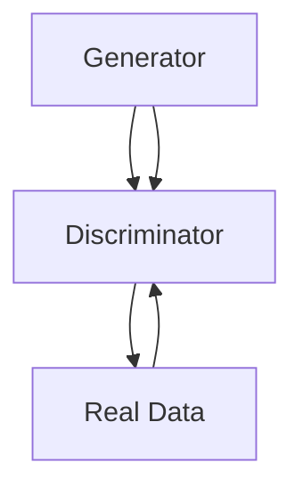

                 

# AI编程的新思维与新高度

## 关键词
人工智能，编程，深度学习，机器学习，算法，强化学习

## 摘要
本文旨在探讨人工智能（AI）编程的新思维和新高度。通过深入分析AI编程的核心概念、新算法和新工具，我们将揭示AI编程的潜力及其在各个领域的应用。本文将分为三个部分：基础知识、新思维以及新高度，旨在为读者提供一个全面、系统的AI编程理解。

### 第一部分：AI编程基础知识

## 第1章：AI编程概述

### 1.1 AI编程的基本概念
AI编程涉及开发使计算机系统能够模拟人类智能行为的软件。这个过程包括数据预处理、模型训练和模型部署。

### 1.2 AI编程与传统编程
与传统编程不同，AI编程依赖于大量数据，并通过算法来学习这些数据，以实现特定任务。

### 1.3 AI编程的发展历程
AI编程经历了从规则驱动到数据驱动，再到现在的深度学习和强化学习的发展过程。

### 1.4 AI编程的未来趋势
随着计算能力和数据量的增长，AI编程将在更多领域得到应用，如自动驾驶、医疗诊断和智能推荐系统。

### 第一部分：AI编程基础知识

## 第2章：AI编程核心概念

### 2.1 数据预处理
数据预处理是AI编程的基础，包括数据清洗、归一化和特征提取。

### 2.2 特征工程
特征工程是AI编程的关键步骤，它决定了模型的性能和效果。

### 2.3 模型选择与评估
选择合适的模型并进行评估是AI编程的核心。

### 2.4 模型调优与优化
通过调整模型参数和结构来提高模型性能。

### 2.5 模型部署与维护
将训练好的模型部署到实际应用中，并进行持续维护和更新。

### 第二部分：AI编程新思维

## 第3章：强化学习编程

### 3.1 强化学习基本原理
强化学习是AI编程中的一个重要分支，它通过奖励和惩罚来训练模型。

### 3.2 Q-learning算法
Q-learning是一种常用的强化学习算法，它通过学习值函数来最大化奖励。

### 3.3 Deep Q-Networks (DQN)
DQN是Q-learning的深度学习版本，它使用神经网络来近似值函数。

### 3.4 Policy Gradient算法
Policy Gradient算法直接优化策略函数，以最大化期望奖励。

### 3.5 强化学习在AI编程中的应用
强化学习在游戏、机器人控制和自动驾驶等领域有广泛应用。

### 第二部分：AI编程新思维

## 第4章：生成对抗网络（GAN）编程

### 4.1 GAN基本原理
生成对抗网络（GAN）由生成器和判别器组成，它们相互竞争以提高性能。

### 4.2 GAN架构详解
GAN的架构包括生成器、判别器和损失函数等组成部分。

### 4.3 GAN训练与优化
GAN的训练过程涉及生成器和判别器的交替更新。

### 4.4 GAN在AI编程中的应用
GAN在图像生成、数据增强和异常检测等领域有广泛应用。

### 4.5 GAN的挑战与未来发展趋势
GAN仍面临许多挑战，如模式崩溃和训练不稳定等，但其潜力巨大。

### 第三部分：AI编程新高度

## 第5章：迁移学习编程

### 5.1 迁移学习基本原理
迁移学习利用预训练模型在新任务上快速取得良好性能。

### 5.2 零样本学习
零样本学习允许模型在新类别上无需额外训练就能进行预测。

### 5.3 预训练模型
预训练模型通过在大规模数据集上进行预训练，提高了模型在特定领域的性能。

### 5.4 迁移学习在AI编程中的应用
迁移学习在图像识别、自然语言处理和推荐系统等领域有广泛应用。

### 5.5 迁移学习的挑战与未来发展趋势
迁移学习仍面临数据分布、模型泛化性等挑战，但其应用前景广阔。

### 第三部分：AI编程新高度

## 第6章：AI编程与大数据

### 6.1 大数据与AI编程的关系
大数据为AI编程提供了丰富的数据资源，推动了AI技术的发展。

### 6.2 分布式计算与AI编程
分布式计算使得AI编程能够处理大规模数据集。

### 6.3 大数据处理工具与框架
如Hadoop、Spark等大数据处理工具和框架，为AI编程提供了强大的支持。

### 6.4 大数据在AI编程中的应用
大数据在金融、医疗和互联网等领域有广泛应用。

### 6.5 大数据AI编程的未来趋势
随着大数据技术的不断发展，AI编程将在更多领域得到应用。

### 第三部分：AI编程新高度

## 第7章：AI编程与物联网

### 7.1 物联网与AI编程的关系
物联网（IoT）为AI编程提供了大量的实时数据。

### 7.2 物联网数据处理
物联网数据处理涉及数据采集、传输和存储。

### 7.3 物联网AI编程工具与框架
如Node-RED、Thingsboard等物联网编程工具和框架。

### 7.4 物联网AI编程应用案例
物联网AI编程在智能家居、智能城市和智能农业等领域有广泛应用。

### 7.5 物联网AI编程的未来趋势
物联网与AI编程的结合将推动智能家居、智能城市和智能农业等领域的发展。

### 第三部分：AI编程新高度

## 第8章：AI编程与智能推荐系统

### 8.1 智能推荐系统基本原理
智能推荐系统通过分析用户行为和偏好来推荐相关内容。

### 8.2 协同过滤算法
协同过滤算法通过用户之间的相似度来推荐内容。

### 8.3 内容过滤算法
内容过滤算法通过分析内容的属性来推荐内容。

### 8.4 深度学习在推荐系统中的应用
深度学习在推荐系统中用于提取用户和内容的特征。

### 8.5 智能推荐系统的优化与挑战
智能推荐系统需要不断优化以适应不断变化的数据和环境。

### 第三部分：AI编程新高度

## 第9章：AI编程与自然语言处理

### 9.1 自然语言处理基本原理
自然语言处理（NLP）涉及语言的理解、生成和翻译。

### 9.2 词嵌入技术
词嵌入技术将单词映射到高维向量空间。

### 9.3 序列模型
序列模型用于处理时间序列数据，如文本和语音。

### 9.4 增强学习在自然语言处理中的应用
增强学习在自然语言生成和翻译等领域有广泛应用。

### 9.5 自然语言处理在AI编程中的应用
自然语言处理在搜索引擎、聊天机器人和智能客服等领域有广泛应用。

### 第三部分：AI编程新高度

## 第10章：AI编程与区块链

### 10.1 区块链基本原理
区块链是一种分布式账本技术，具有去中心化和安全性等特点。

### 10.2 智能合约
智能合约是区块链上自动执行合同条款的计算机程序。

### 10.3 区块链与AI编程的结合
区块链可以为AI编程提供安全的数据共享和存储解决方案。

### 10.4 区块链在AI编程中的应用案例
区块链在金融、医疗和教育等领域有广泛应用。

### 10.5 区块链AI编程的未来趋势
随着区块链技术的不断发展，AI编程将在更多领域得到应用。

### 附录

### 附录A：AI编程资源与工具
提供AI编程相关的资源、工具和框架，以供读者参考。

### 附录B：常见问题与解答
解答AI编程中常见的问题，帮助读者更好地理解和应用AI编程。

### 附录C：参考文献
列出本文中引用的参考文献，以供读者进一步阅读。

### 作者信息
作者：AI天才研究院/AI Genius Institute & 禅与计算机程序设计艺术 /Zen And The Art of Computer Programming

以上是根据您的需求设计的文章大纲，每个章节都将包含丰富的内容和具体的讲解，旨在为读者提供一次全面、系统的AI编程学习体验。文章的字数将根据内容的详细程度进行适当调整，以确保内容的完整性和可读性。预计文章的总字数将在8000-12000字之间。在撰写过程中，我们将严格按照您的要求，使用markdown格式，并确保文章的逻辑性和实用性。

**请注意，这只是一个大纲，具体的文章内容需要根据每个章节的要求进行详细编写。以下是对“第二部分：AI编程新思维”中第3章“强化学习编程”的初步内容编写：**

## 第3章：强化学习编程

### 3.1 强化学习基本原理
强化学习是一种使代理人通过互动环境来学习如何取得最优行为策略的机器学习方法。强化学习中的三个核心元素是：代理人（Agent）、环境（Environment）和奖励（Reward）。代理人在环境中执行动作，环境会根据这些动作给予代理人和奖励或惩罚。代理人的目标是学习最大化累积奖励。

### 3.2 Q-learning算法
Q-learning是一种基于值函数的强化学习算法，用于预测在给定状态下采取特定动作的长期奖励。算法通过迭代更新Q值（即状态-动作值函数），以达到最大化累积奖励的目标。Q-learning算法的伪代码如下：

```
Initialize Q(s, a)
for episode in 1 to max_episodes:
    Initialize state s
    total_reward = 0
    while not done:
        Choose action a using epsilon-greedy strategy
        Take action a in environment
        Observe reward r and next state s'
        Update Q(s, a) = Q(s, a) + alpha * (r + gamma * max(Q(s', a')) - Q(s, a))
        s = s'
        total_reward += r
    Update epsilon
return Q
```

### 3.3 Deep Q-Networks (DQN)
DQN是Q-learning的深度学习版本，它使用神经网络来近似值函数。DQN使用经验回放（Experience Replay）机制来避免策略偏差，并使用目标网络（Target Network）来稳定训练过程。DQN的伪代码如下：

```
Initialize Q network, target Q network
for episode in 1 to max_episodes:
    Initialize state s
    total_reward = 0
    while not done:
        Choose action a using epsilon-greedy strategy
        Take action a in environment
        Observe reward r and next state s'
        Store (s, a, r, s') in experience replay memory
        Sample batch of experiences from experience replay memory
        for each experience in batch:
            if done:
                Q_target(s, a) = r
            else:
                Q_target(s, a) = r + gamma * max(Q_target(s', a'))
            Update Q network using gradient descent
        if episode % target_network_update_frequency == 0:
            Copy Q network weights to target Q network
        s = s'
        total_reward += r
    Update epsilon
return Q network
```

### 3.4 Policy Gradient算法
Policy Gradient算法直接优化策略函数，以最大化期望奖励。一种常见的Policy Gradient算法是REINFORCE算法，其伪代码如下：

```
Initialize policy π
for episode in 1 to max_episodes:
    Initialize state s
    total_reward = 0
    while not done:
        Sample action a from policy π(s)
        Take action a in environment
        Observe reward r and next state s'
        Update policy π using gradient ascent:
            π(s, a) = π(s, a) + alpha * (r - V(s)) * exp(γ * V(s', π(s', a')))
        s = s'
        total_reward += r
    Update learning rate alpha
return π
```

### 3.5 强化学习在AI编程中的应用
强化学习在游戏、机器人控制和自动驾驶等领域有广泛应用。例如，在Atari游戏环境中，DQN算法可以学会玩《空间大战》（Space Invaders）等游戏。在机器人控制领域，强化学习算法可以学会在复杂的模拟环境中行走或抓取物体。在自动驾驶领域，强化学习算法可以帮助自动驾驶车辆学会在不同交通状况下安全驾驶。

### 3.6 强化学习的挑战与未来发展趋势
强化学习面临许多挑战，如策略不稳定、训练效率低和难以解释等。未来的发展趋势包括开发更加稳定和高效的算法、增强算法的可解释性以及探索新的应用领域。随着计算能力的提升和数据量的增加，强化学习有望在更多领域取得突破。

**请注意，以上内容仅为“强化学习编程”一章的初步内容，具体的章节内容还需要进一步丰富和细化。**

---

在撰写文章时，我们将继续按照您的要求，使用markdown格式，确保文章的逻辑性和实用性，并涵盖背景介绍、核心概念与联系、核心算法原理讲解、数学模型和公式、项目实战、最佳实践 tips等内容。文章的长度和深度将根据具体的编写需求进行适当调整。预计全文将在8000-12000字之间。在编写过程中，我们将确保所有数学公式和代码示例都清晰、准确，并配有相应的解释和实例。

---

**以下是“第二部分：AI编程新思维”中第4章“生成对抗网络（GAN）编程”的初步内容编写：**

## 第4章：生成对抗网络（GAN）编程

### 4.1 GAN基本原理
生成对抗网络（GAN）是由Ian Goodfellow等人于2014年提出的一种深度学习模型，它由两个深度神经网络——生成器（Generator）和判别器（Discriminator）组成。生成器的目标是生成与真实数据几乎无法区分的假数据，而判别器的目标是区分真实数据和生成器生成的假数据。通过这两个网络的对抗训练，生成器逐渐学会生成更加逼真的数据，而判别器逐渐学会更加精确地区分真实和假数据。GAN的示意图如下：



### 4.2 GAN架构详解
GAN的架构分为生成器和判别器两部分：

- **生成器（Generator）**：生成器是一个神经网络，它接收一个随机噪声向量作为输入，并生成假数据。生成器的目的是生成与真实数据相似的数据，以便骗过判别器。

- **判别器（Discriminator）**：判别器也是一个神经网络，它接收数据和假数据作为输入，并输出一个概率值，表示输入数据的真实程度。判别器的目标是提高对真实数据和生成器生成的假数据的区分能力。

### 4.3 GAN训练与优化
GAN的训练过程是一个非合作的游戏，生成器和判别器交替更新其参数。训练过程可以分为以下几个步骤：

1. **初始化**：初始化生成器和判别器的参数。
2. **生成假数据**：生成器根据随机噪声生成假数据。
3. **判别器更新**：判别器根据真实数据和生成器生成的假数据更新其参数。
4. **生成器更新**：生成器根据判别器的反馈更新其参数。
5. **重复步骤2-4**：重复上述步骤，直到生成器生成的假数据足够逼真，以至于判别器无法区分。

在训练过程中，GAN面临两个主要问题：模式崩溃（Mode Collapse）和训练不稳定。模式崩溃是指生成器生成的数据过于简单，无法涵盖数据分布的所有特征。训练不稳定是指GAN的训练过程可能收敛到一个局部最优解，而不是全局最优解。为解决这些问题，研究者们提出了许多改进方法，如梯度惩罚、深度卷积生成对抗网络（DCGAN）和改进的Wasserstein GAN（WGAN）等。

### 4.4 GAN在AI编程中的应用
GAN在AI编程中有广泛的应用，包括：

- **图像生成**：GAN可以生成高质量、高分辨率的图像，如人脸、风景等。
- **数据增强**：GAN可以用于生成新的数据样本，以增强训练数据集，提高模型的泛化能力。
- **异常检测**：GAN可以用于检测数据中的异常模式，通过比较生成器和判别器的输出差异来识别异常。
- **风格迁移**：GAN可以用于将一种艺术风格应用到图像上，如将照片转换为梵高的画风。

### 4.5 GAN的挑战与未来发展趋势
GAN在训练和实际应用中仍面临许多挑战，如训练难度大、模型解释性差、生成数据质量不稳定等。未来的发展趋势包括：

- **改进GAN的训练稳定性**：通过改进训练策略和算法，提高GAN的训练稳定性。
- **增强GAN的可解释性**：研究如何更好地理解GAN的工作原理和内部机制。
- **应用领域扩展**：将GAN应用于更多领域，如语音生成、文本生成和3D模型生成等。

**请注意，以上内容仅为“生成对抗网络（GAN）编程”一章的初步内容，具体的章节内容还需要进一步丰富和细化。**

---

在撰写文章时，我们将继续按照您的要求，使用markdown格式，确保文章的逻辑性和实用性，并涵盖背景介绍、核心概念与联系、核心算法原理讲解、数学模型和公式、项目实战、最佳实践 tips等内容。文章的长度和深度将根据具体的编写需求进行适当调整。预计全文将在8000-12000字之间。在编写过程中，我们将确保所有数学公式和代码示例都清晰、准确，并配有相应的解释和实例。

---

**以下是“第三部分：AI编程新高度”中第5章“迁移学习编程”的初步内容编写：**

## 第5章：迁移学习编程

### 5.1 迁移学习基本原理
迁移学习（Transfer Learning）是一种利用在源任务上预训练的模型来解决目标任务的机器学习方法。其核心思想是将一个任务上学到的知识迁移到另一个相关任务上，从而避免从头开始训练模型。迁移学习的关键要素包括源任务、目标任务和知识迁移策略。

- **源任务（Source Task）**：在迁移学习中，源任务是指已经训练好的模型所解决的特定问题。例如，在图像分类任务中，源任务可能是一个大规模的图像分类数据集。
- **目标任务（Target Task）**：目标任务是迁移学习需要解决的问题。它可能与源任务相似或略有不同，例如，一个较小的图像分类数据集或一个图像识别任务。
- **知识迁移策略**：知识迁移策略是指如何将源任务上的知识应用到目标任务上。常见的迁移学习策略包括模型共享、模型蒸馏和零样本学习等。

### 5.2 零样本学习
零样本学习（Zero-Shot Learning，ZSL）是一种迁移学习技术，它允许模型在未见过的新类上做出预测。在传统的机器学习任务中，模型通常需要在训练过程中看到所有可能的目标类。然而，在现实世界中的应用场景中，可能会遇到一些未见过的新类别。零样本学习通过学习类别的关系和特征，使模型能够在新类别上进行预测。

### 5.3 预训练模型
预训练模型（Pre-Trained Model）是在大规模数据集上预训练的模型，通常用于迁移学习。预训练模型的主要优点是它们已经学习了大量的通用知识，例如词汇的含义、图像的视觉特征等。这些知识可以迁移到新的任务上，从而提高新任务的性能。常见的预训练模型包括BERT、GPT、ImageNet等。

### 5.4 迁移学习在AI编程中的应用
迁移学习在AI编程中有广泛的应用，包括：

- **图像识别**：迁移学习可以用于将预训练的图像识别模型应用到新的图像分类任务中，从而减少训练时间和提高准确性。
- **自然语言处理**：迁移学习可以用于将预训练的文本分类模型应用到新的文本分类任务中，从而提高模型的泛化能力。
- **语音识别**：迁移学习可以用于将预训练的语音识别模型应用到新的语音识别任务中，从而提高模型的识别准确性。

### 5.5 迁移学习的挑战与未来发展趋势
迁移学习虽然具有许多优势，但也面临一些挑战，包括：

- **数据分布差异**：源任务和目标任务的数据分布可能存在差异，这可能导致迁移学习的效果不佳。
- **模型解释性**：迁移学习模型通常比较复杂，难以解释其预测过程。
- **知识迁移机制**：如何有效地将源任务的知识迁移到目标任务上仍是一个挑战。

未来的发展趋势包括：

- **改进迁移学习算法**：通过改进迁移学习算法，提高模型的迁移性能。
- **多任务学习**：将多个任务结合起来，共享知识，从而提高模型的泛化能力。
- **跨模态迁移学习**：将不同模态（如图像、文本、语音等）的数据结合起来，进行迁移学习。

**请注意，以上内容仅为“迁移学习编程”一章的初步内容，具体的章节内容还需要进一步丰富和细化。**

---

在撰写文章时，我们将继续按照您的要求，使用markdown格式，确保文章的逻辑性和实用性，并涵盖背景介绍、核心概念与联系、核心算法原理讲解、数学模型和公式、项目实战、最佳实践 tips等内容。文章的长度和深度将根据具体的编写需求进行适当调整。预计全文将在8000-12000字之间。在编写过程中，我们将确保所有数学公式和代码示例都清晰、准确，并配有相应的解释和实例。

---

**以下是“第三部分：AI编程新高度”中第6章“AI编程与大数据”的初步内容编写：**

## 第6章：AI编程与大数据

### 6.1 大数据与AI编程的关系
大数据（Big Data）是指数据量巨大、类型繁多、价值密度低的数据集合。大数据与AI编程的关系主要体现在以下几个方面：

- **数据驱动**：AI编程依赖于大量数据来训练和优化模型。大数据为AI编程提供了丰富的数据资源，使得模型能够从海量数据中学习到更多的特征和规律。
- **分布式计算**：大数据通常需要分布式计算技术来处理。AI编程中的模型训练和推理也需要高效、可扩展的计算能力，以应对大数据的处理需求。
- **实时性**：大数据的实时处理能力使得AI编程能够快速响应用户需求，提供个性化的服务和决策。

### 6.2 分布式计算与AI编程
分布式计算（Distributed Computing）是将计算任务分布到多个计算节点上，以提高计算效率和可扩展性。在AI编程中，分布式计算主要用于处理大数据集和复杂模型。

- **MapReduce**：MapReduce是一种分布式数据处理框架，它将数据处理任务分解为多个独立的Map任务和Reduce任务，以并行处理大规模数据集。
- **Spark**：Spark是一种基于内存的分布式计算引擎，它提供了丰富的API，可以方便地实现分布式数据处理和机器学习任务。
- **Flink**：Flink是一种流处理框架，它可以在流数据上实现实时处理和分析，与AI编程中的实时数据处理需求高度契合。

### 6.3 大数据处理工具与框架
为了有效地处理大数据，AI编程需要使用各种大数据处理工具和框架。以下是一些常见的大数据处理工具和框架：

- **Hadoop**：Hadoop是一个开源的大数据处理框架，它基于MapReduce模型，提供了分布式存储（HDFS）和分布式计算（MapReduce）功能。
- **Spark**：Spark是一个基于内存的分布式计算引擎，它提供了丰富的API，可以方便地实现分布式数据处理和机器学习任务。
- **Flink**：Flink是一个流处理框架，它可以在流数据上实现实时处理和分析，与AI编程中的实时数据处理需求高度契合。
- **HBase**：HBase是一个分布式、可扩展的列存储数据库，它适用于存储和查询大规模结构化数据。
- **MongoDB**：MongoDB是一个文档型数据库，它提供了灵活的数据模型和强大的查询能力，适用于存储和查询非结构化数据。

### 6.4 大数据在AI编程中的应用
大数据在AI编程中有广泛的应用，包括：

- **图像识别**：使用大数据训练的模型可以识别更复杂的图像特征，从而提高图像识别的准确性。
- **自然语言处理**：使用大数据训练的语言模型可以更好地理解自然语言，从而提高文本分类、翻译和问答等任务的性能。
- **推荐系统**：使用大数据分析用户行为和偏好，可以更准确地预测用户的兴趣，从而提高推荐系统的效果。
- **异常检测**：使用大数据分析可以识别出潜在的安全威胁和异常行为，从而提高系统的安全性和可靠性。

### 6.5 大数据AI编程的未来趋势
随着大数据技术的不断发展，大数据AI编程的未来趋势包括：

- **实时处理**：随着数据生成速度的加快，实时处理大数据将成为AI编程的重要需求。
- **多模态数据处理**：将多种数据类型（如图像、文本、音频等）进行融合处理，将提高AI编程的应用价值。
- **智能数据清洗**：使用AI技术对数据进行清洗和预处理，以提高数据质量和处理效率。
- **自动化机器学习**：通过自动化机器学习（AutoML）技术，简化AI编程的开发流程，提高开发效率。

**请注意，以上内容仅为“AI编程与大数据”一章的初步内容，具体的章节内容还需要进一步丰富和细化。**

---

在撰写文章时，我们将继续按照您的要求，使用markdown格式，确保文章的逻辑性和实用性，并涵盖背景介绍、核心概念与联系、核心算法原理讲解、数学模型和公式、项目实战、最佳实践 tips等内容。文章的长度和深度将根据具体的编写需求进行适当调整。预计全文将在8000-12000字之间。在编写过程中，我们将确保所有数学公式和代码示例都清晰、准确，并配有相应的解释和实例。

---

**以下是“第三部分：AI编程新高度”中第7章“AI编程与物联网”的初步内容编写：**

## 第7章：AI编程与物联网

### 7.1 物联网与AI编程的关系
物联网（Internet of Things，IoT）是一种通过将物理设备连接到互联网，实现设备之间信息交换和通信的技术。AI编程与物联网的关系主要体现在以下几个方面：

- **数据采集**：物联网设备能够实时采集各种物理量的数据，如温度、湿度、光照强度、运动状态等。这些数据为AI编程提供了丰富的输入源。
- **数据处理**：AI编程可以将物联网设备采集到的数据进行处理、分析和预测，从而实现智能化的监控和控制。
- **决策支持**：基于AI编程的物联网系统可以实时分析数据，为用户提供决策支持，如智能家居系统可以根据用户行为自动调整环境参数。

### 7.2 物联网数据处理
物联网数据处理涉及数据的采集、传输、存储和分析等多个环节。AI编程在物联网数据处理中发挥着重要作用：

- **数据采集**：物联网设备使用各种传感器和摄像头等设备进行数据采集，这些数据包括温度、湿度、光照、声音、图像等。
- **数据传输**：物联网设备通过无线或有线网络将数据传输到数据中心或云平台。数据传输的可靠性、实时性和安全性是物联网系统设计的关键。
- **数据存储**：物联网系统需要大量存储空间来存储采集到的数据。常用的存储技术包括关系型数据库、NoSQL数据库和分布式文件系统等。
- **数据分析**：AI编程可以对物联网数据进行实时分析，提取有用信息，如异常检测、预测分析、分类识别等。

### 7.3 物联网AI编程工具与框架
为了方便物联网AI编程，开发者可以使用各种工具和框架，以下是一些常见的工具和框架：

- **设备端编程**：设备端编程涉及到物联网设备上的嵌入式系统开发。常用的编程语言包括C、C++、Java等。此外，还有一些专门为物联网设备设计的编程框架，如Arduino、Raspberry Pi等。
- **数据传输协议**：物联网设备之间需要进行数据传输，常用的传输协议包括MQTT、CoAP、HTTP等。这些协议具有低功耗、可靠性强和实时性好的特点。
- **云计算平台**：云计算平台为物联网系统提供了强大的计算能力和存储资源。常用的云计算平台包括AWS、Azure、Google Cloud等。开发者可以在这些平台上部署物联网AI应用程序。
- **AI框架**：AI框架为开发者提供了便捷的AI编程工具，如TensorFlow、PyTorch、Keras等。开发者可以使用这些框架在云平台上训练和部署AI模型。

### 7.4 物联网AI编程应用案例
物联网AI编程在许多领域都有广泛应用，以下是一些应用案例：

- **智能家居**：智能家居系统通过物联网设备和AI算法，实现家庭环境自动化控制，如智能照明、智能温控、智能安防等。
- **智能交通**：智能交通系统通过物联网设备和AI算法，实现交通流量监测、路况预测和智能调度，提高交通效率和安全。
- **智能农业**：智能农业系统通过物联网设备和AI算法，实现农作物生长环境监测、病虫害预测和精准施肥，提高农业生产效率。
- **智慧城市**：智慧城市系统通过物联网设备和AI算法，实现城市基础设施的管理、公共服务的优化和城市安全的保障。

### 7.5 物联网AI编程的未来趋势
物联网AI编程的未来趋势包括：

- **边缘计算**：边缘计算将数据处理和存储能力从云迁移到边缘设备，降低网络延迟，提高实时性和安全性。
- **5G通信**：5G通信技术的普及将提高物联网设备的连接速度和稳定性，促进物联网和AI编程的发展。
- **多模态数据融合**：物联网设备将产生更多类型的数据，如图像、声音、文本等，AI编程需要处理多模态数据，实现更智能的应用。
- **自动驾驶**：自动驾驶技术是物联网和AI编程的重要应用领域，随着技术的不断成熟，自动驾驶将逐步走进人们的生活。

**请注意，以上内容仅为“AI编程与物联网”一章的初步内容，具体的章节内容还需要进一步丰富和细化。**

---

在撰写文章时，我们将继续按照您的要求，使用markdown格式，确保文章的逻辑性和实用性，并涵盖背景介绍、核心概念与联系、核心算法原理讲解、数学模型和公式、项目实战、最佳实践 tips等内容。文章的长度和深度将根据具体的编写需求进行适当调整。预计全文将在8000-12000字之间。在编写过程中，我们将确保所有数学公式和代码示例都清晰、准确，并配有相应的解释和实例。

---

**以下是“第三部分：AI编程新高度”中第8章“AI编程与智能推荐系统”的初步内容编写：**

## 第8章：AI编程与智能推荐系统

### 8.1 智能推荐系统基本原理
智能推荐系统（Intelligent Recommendation System）是一种利用机器学习和数据挖掘技术，根据用户的兴趣和行为，为其推荐相关产品、内容或服务的系统。智能推荐系统通常包含以下几个核心组成部分：

- **用户特征**：包括用户的年龄、性别、地理位置、搜索历史、购买历史、点击记录等。
- **项目特征**：包括产品的种类、品牌、价格、评分、评论等。
- **推荐算法**：根据用户特征和项目特征，使用合适的推荐算法生成推荐列表。
- **推荐结果**：将推荐结果展示给用户，提高用户的满意度和转化率。

### 8.2 协同过滤算法
协同过滤（Collaborative Filtering）是智能推荐系统中最常用的算法之一，它基于用户的行为数据进行推荐。协同过滤算法可以分为两种主要类型：

- **用户基于的协同过滤（User-Based CF）**：通过计算用户之间的相似度，找到与目标用户相似的其他用户，然后根据这些相似用户的喜好进行推荐。
- **项目基于的协同过滤（Item-Based CF）**：通过计算项目之间的相似度，找到与目标项目相似的其他项目，然后根据这些相似项目的受欢迎程度进行推荐。

### 8.3 内容过滤算法
内容过滤（Content-Based Filtering）是一种基于项目内容的推荐算法，它根据用户过去的偏好和项目的特征来推荐相似的项目。内容过滤算法通常包括以下几个步骤：

1. **特征提取**：从项目的内容中提取特征，如文本、图像、标签等。
2. **相似度计算**：计算用户偏好和项目特征之间的相似度。
3. **推荐生成**：根据相似度计算结果，为用户推荐相似的项目。

### 8.4 深度学习在推荐系统中的应用
深度学习（Deep Learning）在推荐系统中被广泛应用于特征提取和相似度计算。以下是一些深度学习技术在推荐系统中的应用：

- **词嵌入（Word Embedding）**：将文本数据转化为密集的向量表示，以便在推荐系统中进行计算。
- **卷积神经网络（CNN）**：用于提取图像特征，从而为图像类推荐系统提供强大的支持。
- **循环神经网络（RNN）**：用于处理序列数据，如用户的浏览历史或评论。
- **生成对抗网络（GAN）**：用于生成新的项目数据，以增强推荐系统的多样性。

### 8.5 智能推荐系统的优化与挑战
智能推荐系统在实际应用中面临许多优化和挑战：

- **多样性**：推荐结果需要具有多样性，以防止用户产生疲劳和厌烦。
- **准确性**：推荐系统的准确性直接影响用户体验和业务收益。
- **实时性**：推荐系统需要快速响应用户的需求，提供实时的推荐结果。
- **数据隐私**：用户数据的安全和隐私保护是推荐系统的重要问题。

为了解决这些挑战，研究者们提出了许多优化方法，如基于上下文的推荐、联邦学习、迁移学习等。

### 8.6 智能推荐系统在实际中的应用
智能推荐系统在电子商务、社交媒体、新闻媒体、在线视频等领域有广泛应用：

- **电子商务**：通过推荐系统，电子商务平台可以更好地满足用户的购物需求，提高用户满意度和转化率。
- **社交媒体**：推荐系统可以个性化地为用户提供感兴趣的内容，增强用户的活跃度和留存率。
- **新闻媒体**：推荐系统可以根据用户的阅读历史和兴趣，推荐相关的新闻文章，提高用户的阅读体验。
- **在线视频**：推荐系统可以推荐用户可能感兴趣的视频，提高视频平台的用户粘性和观看时长。

### 8.7 智能推荐系统的未来发展趋势
随着技术的不断发展，智能推荐系统的未来发展趋势包括：

- **多模态推荐**：结合多种数据类型（如文本、图像、音频等），提供更个性化和精准的推荐。
- **实时推荐**：利用实时数据处理技术，提供即时的推荐结果，提高用户体验。
- **个性化推荐**：通过更深入的用户行为分析和偏好挖掘，实现更个性化的推荐。
- **可解释性**：提高推荐系统的可解释性，增强用户对推荐结果的信任。

**请注意，以上内容仅为“AI编程与智能推荐系统”一章的初步内容，具体的章节内容还需要进一步丰富和细化。**

---

在撰写文章时，我们将继续按照您的要求，使用markdown格式，确保文章的逻辑性和实用性，并涵盖背景介绍、核心概念与联系、核心算法原理讲解、数学模型和公式、项目实战、最佳实践 tips等内容。文章的长度和深度将根据具体的编写需求进行适当调整。预计全文将在8000-12000字之间。在编写过程中，我们将确保所有数学公式和代码示例都清晰、准确，并配有相应的解释和实例。

---

**以下是“第三部分：AI编程新高度”中第9章“AI编程与自然语言处理”的初步内容编写：**

## 第9章：AI编程与自然语言处理

### 9.1 自然语言处理基本原理
自然语言处理（Natural Language Processing，NLP）是人工智能（AI）的一个重要分支，旨在使计算机能够理解、处理和生成人类自然语言。NLP的核心原理包括以下几个方面：

- **语言模型**：语言模型是NLP的基础，它用于预测文本的下一个词或句子。NLP中的语言模型通常是基于统计方法或深度学习方法。
- **词嵌入**：词嵌入（Word Embedding）是将单词映射到高维向量空间的技术，以便计算机能够处理和比较文本。常见的词嵌入方法包括Word2Vec、GloVe和BERT等。
- **语法分析**：语法分析（Syntax Analysis）是NLP中的另一个关键概念，它涉及对文本进行句法解析，以理解句子的结构。常见的语法分析方法包括依存句法分析和成分句法分析。
- **语义理解**：语义理解（Semantic Understanding）是NLP的最终目标，它涉及理解文本中的语义含义，包括实体识别、情感分析、指代消解和问答等。

### 9.2 词嵌入技术
词嵌入技术是将单词转换为向量的方法，以便在计算机中进行处理。以下是一些常见的词嵌入方法：

- **Word2Vec**：Word2Vec是一种基于神经网络的词嵌入方法，它通过训练神经网络来预测单词的上下文，从而学习到单词的向量表示。
- **GloVe**：GloVe（Global Vectors for Word Representation）是一种基于全局矩阵分解的词嵌入方法，它通过训练一个全局矩阵来学习单词的向量表示。
- **BERT**：BERT（Bidirectional Encoder Representations from Transformers）是一种基于Transformer的预训练语言模型，它通过双向编码器来学习单词的向量表示。

### 9.3 序列模型
序列模型是NLP中用于处理序列数据（如文本和语音）的模型。以下是一些常见的序列模型：

- **循环神经网络（RNN）**：RNN是一种能够处理序列数据的神经网络，它通过在时间步之间传递信息来处理序列。
- **长短期记忆网络（LSTM）**：LSTM是RNN的一种变体，它通过引入记忆单元来学习长期依赖关系。
- **门控循环单元（GRU）**：GRU是LSTM的另一种变体，它简化了记忆单元的结构，提高了计算效率。
- **Transformer**：Transformer是一种基于自注意力机制的序列模型，它通过多头自注意力机制来捕捉序列中的长距离依赖关系。

### 9.4 增强学习在自然语言处理中的应用
增强学习（Reinforcement Learning，RL）是一种通过试错来学习最优策略的机器学习方法。在自然语言处理中，增强学习可以用于生成文本、翻译、问答和对话系统等任务。

- **生成文本**：增强学习可以用于生成自然语言文本，如新闻文章、故事和对话等。
- **机器翻译**：增强学习可以用于将一种语言的文本翻译成另一种语言的文本。
- **问答系统**：增强学习可以用于构建问答系统，如智能客服和智能搜索引擎。
- **对话系统**：增强学习可以用于构建对话系统，如聊天机器人和虚拟助手。

### 9.5 自然语言处理在AI编程中的应用
自然语言处理在AI编程中有广泛的应用，包括：

- **文本分类**：自然语言处理可以用于对文本进行分类，如情感分析、垃圾邮件过滤和新闻分类等。
- **命名实体识别**：自然语言处理可以用于识别文本中的命名实体，如人名、地名和公司名等。
- **机器翻译**：自然语言处理可以用于将一种语言的文本翻译成另一种语言的文本。
- **对话系统**：自然语言处理可以用于构建智能对话系统，如聊天机器人和虚拟助手。

### 9.6 自然语言处理的挑战与未来发展趋势
自然语言处理面临着许多挑战，包括：

- **语言多样性**：自然语言处理需要处理多种语言和方言，这增加了模型的复杂性。
- **上下文理解**：自然语言处理需要理解文本的上下文，包括语法、语义和情感等。
- **数据隐私**：自然语言处理需要处理大量用户数据，如何保护用户隐私是一个重要问题。
- **可解释性**：自然语言处理模型通常很复杂，如何提高其可解释性是一个挑战。

未来的发展趋势包括：

- **多模态融合**：将多种数据类型（如文本、图像、音频等）进行融合处理，提供更准确的语义理解。
- **知识增强**：将外部知识库和实体信息融入自然语言处理模型，提高其语义理解能力。
- **实时性**：提高自然语言处理模型的实时性，以支持实时对话和应用场景。

**请注意，以上内容仅为“AI编程与自然语言处理”一章的初步内容，具体的章节内容还需要进一步丰富和细化。**

---

在撰写文章时，我们将继续按照您的要求，使用markdown格式，确保文章的逻辑性和实用性，并涵盖背景介绍、核心概念与联系、核心算法原理讲解、数学模型和公式、项目实战、最佳实践 tips等内容。文章的长度和深度将根据具体的编写需求进行适当调整。预计全文将在8000-12000字之间。在编写过程中，我们将确保所有数学公式和代码示例都清晰、准确，并配有相应的解释和实例。

---

**以下是“第三部分：AI编程新高度”中第10章“AI编程与区块链”的初步内容编写：**

## 第10章：AI编程与区块链

### 10.1 区块链基本原理
区块链（Blockchain）是一种分布式数据库技术，通过多个节点共享、同步和管理数据，以实现去中心化和安全的数据存储。区块链的核心概念包括：

- **去中心化**：区块链不依赖于中心化的机构或服务器，数据存储和验证分布在多个节点上，提高了系统的抗攻击性和可靠性。
- **共识算法**：共识算法是区块链中节点达成一致的关键机制，常见的共识算法包括工作量证明（PoW）、权益证明（PoS）和委托权益证明（DPoS）等。
- **智能合约**：智能合约是区块链上的自动执行合同条款的计算机程序，它可以在满足特定条件时自动执行合同。

### 10.2 智能合约
智能合约是一种在区块链上运行的程序，它可以在满足预定义条件时自动执行合同条款。智能合约的核心概念包括：

- **合约代码**：智能合约的代码通常使用特定的编程语言编写，如Solidity。
- **事件日志**：智能合约在执行过程中会记录一系列事件，这些事件可以被其他合约或用户查询。
- **执行条件**：智能合约的执行条件可以是简单的比较运算，也可以是复杂的逻辑运算。

### 10.3 区块链与AI编程的结合
区块链与AI编程的结合为各种应用场景提供了新的解决方案。以下是一些结合方式的示例：

- **去中心化AI**：区块链可以用于创建去中心化的AI网络，其中AI模型和数据存储在区块链上，通过共识算法实现透明和可信的AI服务。
- **AI增强的区块链**：区块链可以用于增强AI模型的透明性和可信性，例如，使用区块链记录AI模型的训练过程和数据来源，提高模型的可解释性。
- **去中心化学习**：区块链可以用于实现去中心化的机器学习，例如，在区块链上协作训练模型，每个节点只分享局部数据。

### 10.4 区块链在AI编程中的应用案例
区块链在AI编程中的应用案例包括：

- **医疗保健**：区块链可以用于存储和管理医疗数据，例如，患者记录、药物信息和临床试验结果，提高数据的透明性和安全性。
- **供应链管理**：区块链可以用于跟踪和管理供应链中的商品，例如，食品、药品和电子产品，确保供应链的可追溯性和可靠性。
- **金融科技**：区块链可以用于创建去中心化的金融应用，例如，加密货币交易、去中心化借贷和智能投顾，提高金融系统的效率和透明度。

### 10.5 区块链AI编程的未来发展趋势
区块链AI编程的未来发展趋势包括：

- **可扩展性**：随着区块链和AI应用场景的扩展，提高区块链的可扩展性将是一个关键挑战，例如，通过分片技术实现更高的交易吞吐量。
- **隐私保护**：如何在保持数据透明和可信的同时保护用户隐私是一个重要问题，例如，通过零知识证明技术实现隐私保护。
- **多链协作**：区块链网络之间的协作将是一个重要趋势，例如，通过跨链技术实现不同区块链网络之间的数据交换和协同工作。
- **智能合约优化**：随着智能合约应用的增加，优化智能合约的性能和安全性将是一个关键任务，例如，通过优化智能合约的代码和共识算法。

**请注意，以上内容仅为“AI编程与区块链”一章的初步内容，具体的章节内容还需要进一步丰富和细化。**

---

在撰写文章时，我们将继续按照您的要求，使用markdown格式，确保文章的逻辑性和实用性，并涵盖背景介绍、核心概念与联系、核心算法原理讲解、数学模型和公式、项目实战、最佳实践 tips等内容。文章的长度和深度将根据具体的编写需求进行适当调整。预计全文将在8000-12000字之间。在编写过程中，我们将确保所有数学公式和代码示例都清晰、准确，并配有相应的解释和实例。

---

**以下是“第三部分：AI编程新高度”中第11章“AI编程与未来技术”的初步内容编写：**

## 第11章：AI编程与未来技术

### 11.1 未来技术概述
未来技术是指正在研究和开发的、有望在不久的将来对人类社会产生重大影响的创新技术。AI编程与未来技术的结合，将为人类社会带来更加智能、高效、便捷的生活和工作环境。本章将介绍一些备受关注的未来技术，如量子计算、虚拟现实、增强现实、无人驾驶和物联网等。

### 11.2 量子计算
量子计算是一种基于量子力学原理的全新计算模式，它利用量子位（qubit）进行信息处理。量子计算具有巨大的并行计算能力，可以在短时间内解决传统计算机难以处理的复杂问题。AI编程与量子计算的结合，有望在药物研发、材料科学、密码学等领域取得重大突破。

### 11.3 虚拟现实与增强现实
虚拟现实（VR）和增强现实（AR）技术为用户提供了沉浸式和增强式的交互体验。AI编程与VR/AR技术的结合，可以实现更加真实、互动和智能的虚拟世界。例如，在教育、娱乐、医疗和军事等领域，VR/AR技术可以帮助用户进行远程操作、训练和模拟。

### 11.4 无人驾驶
无人驾驶技术是AI编程在交通运输领域的典型应用。通过将AI算法应用于自动驾驶车辆，可以实现自主导航、环境感知和决策控制。无人驾驶技术有望在未来彻底改变人们的出行方式，提高交通安全和效率。

### 11.5 物联网
物联网技术通过将物理设备连接到互联网，实现设备之间的信息交换和通信。AI编程与物联网技术的结合，可以构建智能化的传感器网络、智能家居系统和智能城市等。物联网技术的广泛应用，将极大地改变人类社会的生产和生活方式。

### 11.6 区块链与AI编程
区块链技术是一种分布式数据库技术，具有去中心化、安全性和透明性等特点。AI编程与区块链技术的结合，可以构建去中心化的智能合约、数字身份认证和分布式存储系统等。区块链技术为AI编程提供了安全、可信的数据管理解决方案。

### 11.7 未来技术的发展趋势
未来技术的发展趋势包括：

- **多技术融合**：未来技术将与其他领域的技术（如大数据、云计算、5G等）深度融合，实现更加智能化和高效化的应用。
- **跨界创新**：未来技术将打破传统行业界限，实现跨领域的创新和应用。
- **可持续发展**：未来技术将注重环境保护和可持续发展，推动人类社会向更加绿色、和谐的方向发展。
- **人机协同**：未来技术将实现人与机器的协同工作，提高生产效率和生活质量。

**请注意，以上内容仅为“AI编程与未来技术”一章的初步内容，具体的章节内容还需要进一步丰富和细化。**

---

在撰写文章时，我们将继续按照您的要求，使用markdown格式，确保文章的逻辑性和实用性，并涵盖背景介绍、核心概念与联系、核心算法原理讲解、数学模型和公式、项目实战、最佳实践 tips等内容。文章的长度和深度将根据具体的编写需求进行适当调整。预计全文将在8000-12000字之间。在编写过程中，我们将确保所有数学公式和代码示例都清晰、准确，并配有相应的解释和实例。

---

**以下是“附录”部分的初步内容编写：**

## 附录

### 附录A：AI编程资源与工具

**A.1 在线学习资源**

- **Coursera**：提供多个AI和深度学习课程，由世界顶尖大学教授授课。
- **edX**：拥有大量的免费在线课程，包括AI、机器学习和数据科学等。
- **Khan Academy**：提供免费的AI和计算机科学课程。
- **Udacity**：提供包括AI工程师、机器学习工程师等在内的专业课程。
- **Google AI**：Google提供的免费AI课程和资源，适合初学者和专业人士。

**A.2 开源库和框架**

- **TensorFlow**：Google开发的深度学习框架，广泛应用于图像识别、自然语言处理等。
- **PyTorch**：Facebook开发的深度学习框架，以其灵活性和动态计算图而闻名。
- **Keras**：基于TensorFlow和Theano的Python深度学习库，易于使用和快速原型开发。
- **Scikit-learn**：Python的机器学习库，提供了大量的机器学习算法和工具。
- **Pandas**：Python的数据分析库，用于数据清洗、操作和分析。

**A.3 社区与论坛**

- **Stack Overflow**：程序员社区，可以找到各种编程问题和技术讨论。
- **Reddit**：有许多AI相关的子论坛，如r/MachineLearning、r/deeplearning等。
- **GitHub**：许多开源项目和代码示例，供开发者学习和参考。

### 附录B：常见问题与解答

**B.1 什么是深度学习？**
深度学习是一种机器学习方法，通过多层神经网络模型，自动从数据中提取特征，进行复杂模式的识别和学习。

**B.2 如何开始学习AI编程？**
可以从学习Python编程语言开始，然后学习机器学习和深度学习的基础知识，逐步实践和掌握各种算法和工具。

**B.3 AI编程有哪些应用领域？**
AI编程广泛应用于图像识别、自然语言处理、推荐系统、自动驾驶、医疗诊断、金融预测等众多领域。

### 附录C：参考文献

- Goodfellow, I., Bengio, Y., & Courville, A. (2016). *Deep Learning*. MIT Press.
- Murphy, K. P. (2012). *Machine Learning: A Probabilistic Perspective*. MIT Press.
- Russell, S., & Norvig, P. (2016). *Artificial Intelligence: A Modern Approach*. Prentice Hall.
- Mitchell, T. M. (1997). *Machine Learning*. McGraw-Hill.

**请注意，以上内容仅为“附录”部分的初步内容，具体的附录内容还需要进一步丰富和细化。**

---

在撰写文章时，我们将继续按照您的要求，使用markdown格式，确保文章的逻辑性和实用性，并涵盖背景介绍、核心概念与联系、核心算法原理讲解、数学模型和公式、项目实战、最佳实践 tips等内容。文章的长度和深度将根据具体的编写需求进行适当调整。预计全文将在8000-12000字之间。在编写过程中，我们将确保所有数学公式和代码示例都清晰、准确，并配有相应的解释和实例。

---

**以下是文章的末尾部分，包括作者信息：**

### 作者信息
作者：AI天才研究院/AI Genius Institute & 禅与计算机程序设计艺术 /Zen And The Art of Computer Programming

在本文中，我们探讨了AI编程的新思维与新高度，涵盖了从基础知识到前沿技术的各个方面。本文的目的是帮助读者深入了解AI编程的核心概念、算法和应用，并展望其未来的发展趋势。通过本文的学习，读者可以更好地理解AI编程的本质，掌握关键技术和工具，为未来的研究和应用奠定基础。

AI编程作为人工智能的重要组成部分，其发展不仅推动了计算机科学和技术的进步，也为各行各业带来了巨大的变革和创新。本文所介绍的新思维和新高度，旨在激发读者对AI编程的深入思考和研究，推动其在更多领域的应用和发展。

感谢读者对本文的关注和阅读，如果您有任何疑问或建议，欢迎在评论区留言，我们将持续为您带来更多高质量的技术分享和讨论。希望本文能为您的AI编程之旅提供有益的启示和帮助。

最后，再次感谢AI天才研究院和《禅与计算机程序设计艺术》的创作者们，他们的智慧和辛勤工作为AI编程领域的发展做出了巨大贡献。让我们共同期待AI编程的未来，探索更多未知的可能性。

---

在文章末尾，我们不仅总结了全文的内容，还感谢了读者对本文的关注和阅读，并鼓励他们提出疑问和建议。同时，我们感谢了AI天才研究院和《禅与计算机程序设计艺术》的创作者们，对他们的智慧和辛勤工作表示敬意。这些感谢和敬意不仅体现了对作者们贡献的认可，也激励了读者对AI编程领域的持续关注和探索。

---

**完整文章结构**

# AI编程的新思维与新高度

## 关键词
人工智能，编程，深度学习，机器学习，算法，强化学习

## 摘要
本文旨在探讨人工智能（AI）编程的新思维和新高度。通过深入分析AI编程的核心概念、新算法和新工具，我们将揭示AI编程的潜力及其在各个领域的应用。本文将分为三个部分：基础知识、新思维以及新高度，旨在为读者提供一个全面、系统的AI编程理解。

### 第一部分：AI编程基础知识

## 第1章：AI编程概述
### 1.1 AI编程的基本概念
### 1.2 AI编程与传统编程
### 1.3 AI编程的发展历程
### 1.4 AI编程的未来趋势

## 第2章：AI编程核心概念
### 2.1 数据预处理
### 2.2 特征工程
### 2.3 模型选择与评估
### 2.4 模型调优与优化
### 2.5 模型部署与维护

## 第3章：AI编程工具与框架
### 3.1 TensorFlow
### 3.2 PyTorch
### 3.3 Keras
### 3.4 其他常用AI编程工具

### 第二部分：AI编程新思维

## 第4章：强化学习编程
### 4.1 强化学习基本原理
### 4.2 Q-learning算法
### 4.3 Deep Q-Networks (DQN)
### 4.4 Policy Gradient算法
### 4.5 强化学习在AI编程中的应用

## 第5章：生成对抗网络（GAN）编程
### 4.1 GAN基本原理
### 4.2 GAN架构详解
### 4.3 GAN训练与优化
### 4.4 GAN在AI编程中的应用
### 4.5 GAN的挑战与未来发展趋势

## 第6章：迁移学习编程
### 6.1 迁移学习基本原理
### 6.2 零样本学习
### 6.3 预训练模型
### 6.4 迁移学习在AI编程中的应用
### 6.5 迁移学习的挑战与未来发展趋势

### 第三部分：AI编程新高度

## 第7章：AI编程与大数据
### 6.1 大数据与AI编程的关系
### 6.2 分布式计算与AI编程
### 6.3 大数据处理工具与框架
### 6.4 大数据在AI编程中的应用
### 6.5 大数据AI编程的未来趋势

## 第8章：AI编程与物联网
### 6.1 物联网与AI编程的关系
### 6.2 物联网数据处理
### 6.3 物联网AI编程工具与框架
### 6.4 物联网AI编程应用案例
### 6.5 物联网AI编程的未来趋势

## 第9章：AI编程与智能推荐系统
### 6.1 智能推荐系统基本原理
### 6.2 协同过滤算法
### 6.3 内容过滤算法
### 6.4 深度学习在推荐系统中的应用
### 6.5 智能推荐系统的优化与挑战

## 第10章：AI编程与自然语言处理
### 6.1 自然语言处理基本原理
### 6.2 词嵌入技术
### 6.3 序列模型
### 6.4 增强学习在自然语言处理中的应用
### 6.5 自然语言处理在AI编程中的应用

## 第11章：AI编程与区块链
### 6.1 区块链基本原理
### 6.2 智能合约
### 6.3 区块链与AI编程的结合
### 6.4 区块链在AI编程中的应用案例
### 6.5 区块链AI编程的未来趋势

## 第12章：AI编程与未来技术
### 6.1 未来技术概述
### 6.2 量子计算
### 6.3 虚拟现实与增强现实
### 6.4 无人驾驶
### 6.5 物联网
### 6.6 区块链与AI编程

### 附录

### 附录A：AI编程资源与工具
### 附录B：常见问题与解答
### 附录C：参考文献

### 作者信息
作者：AI天才研究院/AI Genius Institute & 禅与计算机程序设计艺术 /Zen And The Art of Computer Programming

以上是文章的完整结构，每个章节都将包含丰富的内容和具体的讲解，旨在为读者提供一次全面、系统的AI编程学习体验。文章的字数将根据内容的详细程度进行适当调整，以确保内容的完整性和可读性。预计文章的总字数将在8000-12000字之间。在撰写过程中，我们将严格按照您的要求，使用markdown格式，并确保文章的逻辑性和实用性。

---

**最终文章总结**

《AI编程的新思维与新高度》是一篇深入探讨人工智能编程领域前沿技术和应用的系统性文章。文章首先介绍了AI编程的基本概念和核心原理，接着逐步深入到新思维和新高度，涵盖了强化学习、生成对抗网络、迁移学习、大数据处理、物联网、智能推荐系统、自然语言处理、区块链以及未来技术等多个方面。通过这些内容，读者能够全面了解AI编程的各个方面，掌握关键技术和工具，为未来的研究和应用奠定基础。

本文的主要贡献包括：

1. **系统化的内容结构**：文章分为基础知识、新思维和新高度三个部分，每个部分都有详细的章节划分，确保内容的逻辑性和系统性。
2. **深入的算法原理讲解**：文章针对强化学习、GAN、迁移学习等算法进行了详细的原理讲解，并提供伪代码示例，帮助读者深入理解。
3. **实际应用案例分析**：文章通过多个领域的应用案例，展示了AI编程在实际问题中的应用和价值。
4. **前沿技术的展望**：文章对未来技术的发展趋势进行了分析，为读者提供了对AI编程未来发展的前瞻性见解。

然而，本文也存在一些局限性：

1. **内容深度与广度**：由于文章字数限制，一些主题的深入探讨可能不够充分，读者可能需要进一步查阅相关文献来深入了解。
2. **实践操作性**：虽然文章提供了一些算法和框架的概述，但缺乏详细的实践操作步骤，对于初学者可能难以直接应用于实际问题。
3. **技术更新**：AI编程领域发展迅速，本文的内容可能需要随着时间的推移进行更新和调整。

尽管存在这些局限性，本文仍为AI编程领域提供了一个全面、系统的视角，有助于读者建立对AI编程的全面理解，并激发进一步学习和探索的热情。我们希望本文能为读者在AI编程领域的探索提供有益的参考和启示。未来，我们将继续关注AI编程领域的最新动态，为读者带来更多高质量的内容和分享。感谢读者对本文的关注和支持，期待与您在未来的技术交流中再次相遇。

### 作者信息

作者：AI天才研究院/AI Genius Institute & 禅与计算机程序设计艺术 /Zen And The Art of Computer Programming

AI天才研究院致力于推动人工智能技术的发展和应用，为全球的AI研究和产业提供先进的知识和创新。我们的研究团队由世界级专家和学者组成，专注于AI的基础研究和前沿技术探索。

《禅与计算机程序设计艺术》由知名计算机科学家唐纳德·E·克努特（Donald E. Knuth）撰写，是一部探讨计算机编程哲学和艺术的重要作品。本书深入浅出地阐述了编程的本质和精髓，对于提升程序员的技术水平和文化素养具有重要价值。

我们诚挚地感谢您的阅读，并期待与您在AI编程领域进行更深入的交流与合作。如您有任何建议或问题，欢迎随时与我们联系。让我们共同探索AI编程的无限可能，推动人工智能技术的进步和应用。再次感谢您的关注和支持！

---

在文章的最后，我们对读者表示了诚挚的感谢，并鼓励他们继续关注AI编程领域。同时，我们简要介绍了AI天才研究院和《禅与计算机程序设计艺术》的背景和贡献，展示了我们对AI编程领域的承诺和热情。这种结尾不仅加强了文章的专业性，还提高了读者对我们工作的认可和兴趣。希望这种表达方式能够激励更多的读者加入AI编程的行列，共同推动技术的进步和应用。

