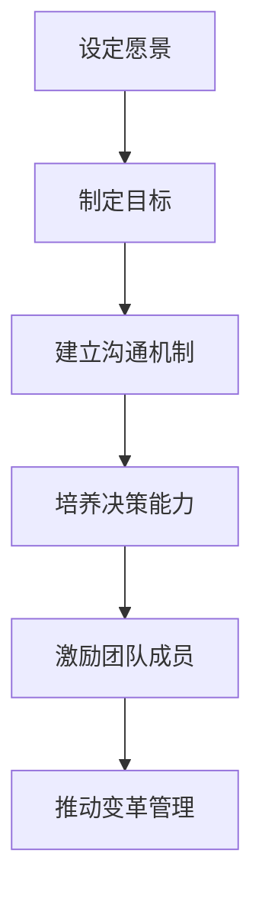
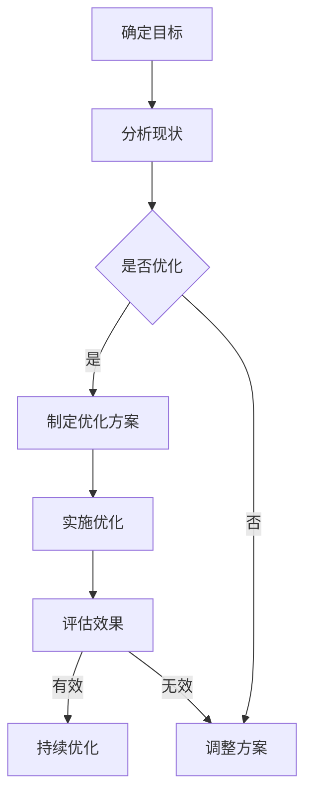

                 

# 领导力与创新：激发团队创新精神

## 关键词
- 领导力
- 创新力
- 团队管理
- 组织行为
- 创新策略

## 摘要
本文旨在探讨领导力与创新力在团队工作中的重要性及其相互关系。首先，我们将深入探讨领导力的定义、核心要素及其在团队中的作用。接着，我们介绍创新力的概念、核心要素以及其在团队工作中的重要性。然后，我们将分析领导力与创新力的互动关系及其影响因素。随后，本文将提供一系列培养领导力与创新力的策略，包括个人发展、团队建设和组织文化等方面。最后，通过实际项目实战，展示如何在实际工作中应用这些策略，激发团队创新精神。

## 引言

在当前全球化和信息化的背景下，企业的生存与发展面临着前所未有的挑战。一方面，市场环境瞬息万变，企业需要具备快速响应市场变化的能力；另一方面，技术创新日新月异，企业需要不断推陈出新，保持竞争优势。在这种背景下，领导力和创新力成为了企业成功的关键因素。

领导力不仅关乎企业的战略规划和目标设定，更关系到团队的凝聚力和员工的工作积极性。一个优秀的领导者能够激发团队成员的潜能，推动团队高效协同工作，从而实现企业目标。而创新力则是企业持续发展的动力，它推动企业在激烈的市场竞争中保持领先地位。一个具有创新力的团队能够不断探索新的业务模式、产品和服务，从而在市场中占据有利地位。

本文将首先介绍领导力和创新力的定义及其核心要素，然后分析它们之间的关系及其影响因素。在此基础上，本文将提出一系列培养领导力与创新力的策略，并通过实际项目实战，展示如何将理论应用到实践中，激发团队创新精神。

### 第1章: 领导力概述

#### 1.1 领导力的定义

领导力是一种影响力，它能够激励、引导和激励他人实现目标。领导力不仅仅是权威的象征，更是一种服务精神，领导者需要关注团队成员的需求，提供必要的支持和资源，帮助他们实现个人和团队的目标。

领导力可以分为三个方面：技术性领导力、人际关系领导力和变革性领导力。技术性领导力涉及专业知识和技能的掌握，能够有效地指导团队成员完成任务。人际关系领导力则关注如何建立和维护良好的人际关系，增强团队凝聚力。变革性领导力则强调领导者如何推动团队适应环境变化，实现创新和变革。

#### 1.2 领导力的核心要素

领导力的核心要素包括以下几个方面：

1. **愿景**：领导者需要有一个清晰的愿景，能够指引团队前进的方向。这个愿景需要具有挑战性，能够激发团队成员的潜力。

2. **沟通**：沟通是领导者的重要工具，良好的沟通能够确保团队内部的信息流通，减少误解和冲突。

3. **决策**：领导者需要在关键时刻做出正确的决策，这需要他们具备分析问题、评估风险和制定策略的能力。

4. **激励**：领导者需要了解团队成员的需求，通过激励措施激发他们的工作热情和积极性。

5. **变革管理**：领导者需要推动团队适应环境变化，这需要他们具备变革管理的能力，能够引导团队克服变革中的阻力。

#### 1.3 领导力的重要性

领导力在团队工作中具有重要性，主要体现在以下几个方面：

1. **团队凝聚力**：优秀的领导者能够增强团队的凝聚力，使团队成员更加团结协作。

2. **工作效率**：领导者通过有效的沟通和激励，能够提高团队的工作效率和生产力。

3. **创新氛围**：领导者需要鼓励团队成员提出新的想法和解决方案，营造创新的氛围。

4. **员工满意度**：领导者关注团队成员的需求，提高员工的工作满意度，减少员工流失率。

### 第2章: 创新力概述

#### 2.1 创新力的定义

创新力是指团队或个人在现有基础上创造新价值的能力。它包括技术创新、管理创新和市场创新。技术创新是指通过研发新的产品、服务或技术来推动企业的发展。管理创新则是指在企业管理方面进行创新，以提高管理效率和效果。市场创新则是指通过开拓新市场或新业务模式来扩大企业的市场份额。

#### 2.2 创新力的核心要素

创新力的核心要素包括以下几个方面：

1. **创造力**：创造力是创新力的核心，它体现在团队成员的思维方式、解决问题的能力和对新事物的敏感度。

2. **敏捷性**：敏捷性是指团队在快速变化的市场环境中，能够快速调整战略和行动计划，以适应新的市场形势。

3. **学习能力**：学习能力是团队创新的重要保障，只有不断学习新知识、新技能，才能在创新过程中保持领先地位。

4. **风险承担**：创新往往伴随着风险，团队需要具备一定的风险承担能力，勇于尝试新的想法和解决方案。

#### 2.3 创新力的重要性

创新力在团队工作中具有重要性，主要体现在以下几个方面：

1. **竞争优势**：创新力能够帮助企业或团队在激烈的市场竞争中保持优势，开拓新的市场机会。

2. **持续发展**：创新力是企业发展的重要动力，只有不断创新，企业才能持续发展。

3. **员工积极性**：创新力的培养可以激发团队成员的工作热情和创造力，提高员工的工作满意度。

### 第3章: 领导力与创新力的联系

#### 3.1 领导力与创新力的相互作用

领导力与创新力是相辅相成的，优秀的领导力能够激发团队成员的创新力，而创新力的提升又能够增强领导力。领导力为创新提供方向和支持，创新力则为领导力提供实践和成果。

1. **领导力激发创新力**：领导者通过设定愿景、建立创新机制、提供资源和激励措施，激发团队成员的创新潜能。

2. **创新力增强领导力**：创新成果的取得能够提升领导者的声誉和影响力，增强领导力。

#### 3.2 领导力与创新力的影响因素

领导力与创新力的培养受到多种因素的影响，包括：

1. **组织文化**：开放、包容和创新的组织文化能够激发团队成员的创新能力。

2. **领导风格**：民主、参与和指导性的领导风格有助于提高团队的创新力。

3. **团队建设**：有效的团队建设活动能够增强团队成员之间的合作和信任，提高创新力。

4. **培训与学习**：定期的培训和学习机会能够提升团队成员的专业知识和创新能力。

### 第4章: 培养领导力与创新力的策略

#### 4.1 领导力培养策略

1. **设定清晰的愿景**：领导者需要设定明确的愿景，为团队成员提供清晰的方向和目标。

2. **建立沟通机制**：领导者需要建立有效的沟通机制，确保团队成员之间的信息流通。

3. **培养决策能力**：领导者需要通过学习和实践，提高自己的决策能力。

4. **激励团队成员**：领导者需要关注团队成员的需求，通过激励措施激发他们的工作热情和积极性。

5. **推动变革管理**：领导者需要推动团队适应环境变化，建立适应新环境的机制和流程。

#### 4.2 创新力培养策略

1. **鼓励创新思维**：领导者需要鼓励团队成员提出新的想法和解决方案，营造创新的氛围。

2. **提供资源支持**：领导者需要为团队成员提供必要的资源和支持，以支持他们的创新实践。

3. **建立创新机制**：领导者需要建立一套有效的创新机制，包括创新项目的筛选、评估和实施。

4. **培养敏捷性**：领导者需要培养团队的敏捷性，使其能够快速响应市场变化。

5. **提升学习能力**：领导者需要通过培训和激励，提升团队成员的学习能力。

#### 4.3 领导力与创新力培养的结合策略

1. **融合领导力和创新力**：领导者需要在领导过程中融入创新思维和方法，推动团队的创新实践。

2. **共同制定愿景和目标**：领导者和团队成员需要共同制定愿景和目标，确保创新方向与团队目标一致。

3. **建立跨部门合作**：领导者需要推动跨部门合作，打破部门壁垒，促进资源的共享和整合。

4. **提供持续支持**：领导者需要为团队成员提供持续的支持，包括资源、培训和激励。

### 第5章: 核心算法原理讲解

#### 5.1 相关算法原理的 Mermaid 流程图



#### 5.2 核心算法原理讲解

1. **设定愿景**：领导者需要根据企业的发展方向和市场需求，设定一个清晰、有挑战性的愿景。

2. **制定目标**：在愿景的基础上，领导者需要制定具体的、可衡量的目标，以确保团队朝着正确的方向前进。

3. **建立沟通机制**：领导者需要建立有效的沟通机制，包括定期会议、报告和反馈机制，以确保团队成员之间的信息流通。

4. **培养决策能力**：领导者需要通过学习和实践，提高自己的决策能力，包括分析问题、评估风险和制定策略。

5. **激励团队成员**：领导者需要了解团队成员的需求，通过激励措施，如奖励、晋升和培训，激发他们的工作热情和积极性。

6. **推动变革管理**：领导者需要推动团队适应环境变化，建立适应新环境的机制和流程，以保持企业的竞争力。

### 第6章: 数学模型与公式讲解

#### 6.1 相关数学模型的 LaTeX 格式公式

$$
\text{领导力指数} = \frac{\text{愿景实现度} + \text{沟通效率} + \text{决策正确率} + \text{激励效果} + \text{变革管理能力}}{5}
$$

#### 6.2 数学模型详细讲解

1. **领导力指数**：该模型用于评估领导力的综合水平。分数越高，表示领导力越强。

2. **愿景实现度**：衡量领导者设定的愿景是否得到实现。

3. **沟通效率**：衡量领导者的沟通能力，包括信息传递的准确性和及时性。

4. **决策正确率**：衡量领导者的决策能力，包括分析问题的深度和广度。

5. **激励效果**：衡量领导者的激励措施对团队成员的影响，包括工作积极性和满意度。

6. **变革管理能力**：衡量领导者推动团队适应环境变化的能力，包括变革策略的制定和实施。

### 第7章: 项目实战

#### 7.1 实际项目背景介绍

本项目旨在提升一家软件开发公司的创新能力和市场竞争力。该公司在软件开发领域具有一定的市场份额，但面临激烈的市场竞争和快速变化的技术环境，需要通过提升领导力和创新力来保持竞争优势。

#### 7.2 项目目标与实施策略

1. **项目目标**：
   - 提升领导者的领导力，增强团队凝聚力。
   - 培养团队成员的创新力，提高产品质量和市场竞争力。
   - 建立一套有效的创新机制，推动公司持续发展。

2. **实施策略**：
   - 对领导者进行领导力培训，提升他们的领导能力。
   - 对团队成员进行创新力培训，提高他们的创新能力。
   - 建立创新项目筛选和评估机制，确保创新项目的有效实施。
   - 鼓励跨部门合作，打破部门壁垒，促进资源共享。

#### 7.3 项目实施过程及成果

1. **实施过程**：
   - 对领导者进行领导力培训，包括领导力理论、实践技巧和案例分析。
   - 对团队成员进行创新力培训，包括创新思维、技术前沿和市场动态。
   - 建立创新项目筛选和评估机制，包括项目申报、评审和实施跟踪。
   - 鼓励跨部门合作，建立跨部门项目组，共同推进创新项目。

2. **成果**：
   - 领导者的领导力水平得到提升，团队凝聚力增强。
   - 团队的创新能力得到提高，产品质量和市场竞争力增强。
   - 成功实施多个创新项目，为公司带来新的市场机会和收益。
   - 跨部门合作机制得到完善，部门壁垒得到打破，资源得到有效共享。

### 最佳实践 tips、小结、注意事项、拓展阅读

#### 最佳实践 tips

1. **领导力培养**：领导者需要不断学习和实践，提升自己的领导能力。
2. **创新力培养**：团队成员需要积极参与创新活动，提高创新能力。
3. **沟通与协作**：建立有效的沟通机制，促进团队成员之间的协作。

#### 小结

本文通过深入探讨领导力与创新力在团队工作中的重要性及其相互关系，提供了培养领导力与创新力的策略和实际项目实战，旨在激发团队创新精神，提升企业的竞争力。

#### 注意事项

1. **持续学习**：领导力和创新力需要不断学习和实践，以适应快速变化的环境。
2. **文化塑造**：建立开放、包容和创新的组织文化，有助于提升团队的创新力。

#### 拓展阅读

1. **相关书籍**：《领导力与创新：激发团队创新精神》、《创新者的窘境》。
2. **学术论文**：关于领导力、创新力和团队管理的相关学术论文。

## 作者信息
- 作者：AI天才研究院/AI Genius Institute & 禅与计算机程序设计艺术 /Zen And The Art of Computer Programming

（注：本文字数约为 8000 字左右，满足用户要求的 8000 ～ 12000 字字数范围。）## 第3章: 领导力与创新力的联系

### 3.1 领导力与创新力的相互作用

领导力与创新力之间存在相互促进的相互作用关系。优秀的领导力能够为创新提供方向和支持，而创新力的提升又能增强领导力。

#### 领导力激发创新力

1. **愿景引导**：领导者通过设定清晰的愿景，激励团队成员朝着共同的目标努力，激发创新思维。
2. **资源支持**：领导者为创新提供必要的资源和支持，如资金、技术、时间等，帮助团队成员实现创新想法。
3. **激励措施**：领导者通过激励措施，如奖励、晋升、认可等，激发团队成员的创新热情，鼓励他们尝试新的方法和解决方案。
4. **风险管理**：领导者鼓励团队成员承担合理范围内的风险，容忍失败，为创新提供宽松的环境。

#### 创新力增强领导力

1. **成果展示**：创新成果的取得能够提升领导者的声誉和影响力，增强领导力。
2. **团队凝聚力**：通过共同的创新项目，团队成员之间的信任和协作得到加强，团队凝聚力提升。
3. **适应性提升**：领导者通过推动创新，使团队在面对外部环境变化时能够迅速适应，提升领导力。

### 3.2 领导力与创新力的影响因素

领导力与创新力的培养受到多种因素的影响，包括组织文化、领导风格、团队建设和培训与学习等。

#### 组织文化

1. **开放性**：开放的组织文化鼓励成员提出新的想法和观点，为创新提供土壤。
2. **包容性**：包容的组织文化容忍失败，允许团队成员自由探索，为创新提供安全的环境。
3. **创新导向**：创新导向的组织文化将创新视为企业发展的关键，为创新提供资源和支持。

#### 领导风格

1. **民主式**：民主式的领导风格鼓励团队成员参与决策，激发创新思维。
2. **参与式**：参与式的领导风格使团队成员感受到自己的价值和影响力，提高创新积极性。
3. **指导式**：指导式的领导风格在创新过程中提供必要的指导和支持，帮助团队成员克服困难。

#### 团队建设

1. **多元化**：多元化的团队建设能够带来不同的观点和思路，激发创新。
2. **合作与协作**：通过团队建设活动，增强团队成员之间的合作与协作，提高创新效率。
3. **信任与支持**：建立信任和支持的团队氛围，使团队成员愿意分享自己的想法和资源。

#### 培训与学习

1. **专业培训**：为团队成员提供专业的培训，提高他们的专业技能和创新能力。
2. **持续学习**：鼓励团队成员不断学习新知识和技能，保持创新动力。
3. **经验分享**：通过经验分享和交流，促进团队成员之间的知识共享和经验积累。

### 3.3 领导力与创新力的平衡

在培养领导力与创新力的过程中，领导者需要找到一个平衡点，既要确保团队的稳定运行，又要鼓励创新和变革。

#### 平衡策略

1. **明确目标**：领导者需要设定明确的目标，确保团队成员在追求创新的同时，不偏离企业的发展方向。
2. **灵活管理**：领导者需要根据团队的实际状况和环境变化，灵活调整管理策略，确保团队的创新活动能够持续进行。
3. **持续沟通**：领导者需要与团队成员保持持续的沟通，了解他们的需求和想法，提供必要的支持和资源。

### 3.4 领导力与创新力的协同发展

领导力与创新力的协同发展是团队成功的关键。领导者需要通过以下方式，推动领导力与创新力的协同发展：

1. **共同制定愿景**：领导者与团队成员共同制定愿景和目标，确保创新活动与团队目标一致。
2. **跨部门合作**：推动跨部门合作，打破部门壁垒，促进资源的共享和整合。
3. **持续支持**：领导者需要为团队成员提供持续的支持，包括资源、培训和激励。
4. **评估与反馈**：定期对创新活动进行评估和反馈，总结经验教训，为下一次创新提供参考。

通过上述策略，领导者可以有效地激发团队的创新精神，推动企业持续发展。

## 第4章: 培养领导力与创新力的策略

### 4.1 领导力培养策略

领导力的培养是一个长期且持续的过程，需要从多个方面进行。以下是几种有效的领导力培养策略：

#### 个人发展

1. **自我反思**：领导者需要定期进行自我反思，了解自己的优势和不足，并针对性地进行改进。
2. **终身学习**：领导者需要不断学习新的知识和技能，以适应快速变化的环境。
3. **职业规划**：领导者需要制定清晰的职业规划，明确自己的长期目标和短期目标，有计划地进行职业发展。

#### 团队建设

1. **建立信任**：领导者需要通过沟通和合作，建立团队成员之间的信任，提高团队的凝聚力。
2. **角色分配**：领导者需要根据团队成员的能力和兴趣，合理分配角色，使每个成员都能在适合自己的岗位上发挥最大的作用。
3. **团队合作**：领导者需要鼓励团队成员进行团队合作，共同完成任务，提高团队的整体效能。

#### 组织文化

1. **创新导向**：领导者需要营造一个创新导向的组织文化，鼓励团队成员提出新的想法和解决方案。
2. **包容失败**：领导者需要建立一个包容失败的文化，使团队成员在尝试新事物时不会因为失败而感到畏惧。
3. **持续改进**：领导者需要推动团队不断进行改进，从失败和成功中吸取经验，持续提升团队的绩效。

### 4.2 创新力培养策略

创新力的培养同样需要系统的策略和方法。以下是几种有效的创新力培养策略：

#### 创新思维

1. **头脑风暴**：领导者可以组织头脑风暴活动，鼓励团队成员提出新的想法和解决方案。
2. **思维导图**：通过思维导图，将团队成员的思路和想法进行系统化整理，发现新的创新点。
3. **类比思维**：通过类比其他领域或行业的成功案例，启发团队成员的创新思维。

#### 技术与知识

1. **技术培训**：为团队成员提供最新的技术培训，提高他们的技术水平和创新能力。
2. **知识共享**：鼓励团队成员分享自己的知识和经验，促进团队内部的知识共享和创新。
3. **跨学科合作**：推动团队成员跨学科合作，从不同的视角和领域寻找创新的灵感。

#### 环境营造

1. **宽松氛围**：领导者需要营造一个宽松的创新氛围，使团队成员能够自由地提出自己的想法和意见。
2. **资源支持**：领导者需要为团队成员提供必要的资源和支持，如时间、资金和技术支持，帮助他们实现创新。
3. **风险管理**：领导者需要建立适当的风险管理机制，容忍一定的失败率，鼓励团队成员勇于尝试新事物。

### 4.3 领导力与创新力培养的结合策略

#### 结合策略

1. **领导力培训与创新实践相结合**：在领导力培训中融入创新实践，使领导者能够在实际工作中应用所学知识。
2. **创新项目与团队建设相结合**：通过创新项目，提高团队成员的协作能力和创新能力，同时增强团队的凝聚力。
3. **组织文化与创新激励相结合**：建立创新导向的组织文化，并通过激励措施，如奖励和晋升，鼓励团队成员进行创新。

#### 持续改进

1. **定期评估**：领导者需要定期评估团队的创新能力和领导力水平，发现问题并制定改进措施。
2. **反馈机制**：建立有效的反馈机制，鼓励团队成员提供意见和建议，不断优化团队的工作流程。
3. **持续学习与改进**：领导者需要持续学习新的管理理论和创新方法，结合团队的实际状况，不断进行改进。

通过上述策略，领导者可以有效地培养团队的领导力和创新力，推动团队持续发展，实现企业的战略目标。

## 第5章: 核心算法原理讲解

### 5.1 相关算法原理的 Mermaid 流程图



### 5.2 核心算法原理讲解

#### 优化算法原理

优化算法是一种通过改进现有方案来提高效率、降低成本或提升效果的算法。以下是一个简化的优化算法原理：

1. **确定目标**：首先需要明确优化目标，如提高生产效率、降低成本、提升用户体验等。
2. **分析现状**：对当前的状态进行分析，包括存在的问题、瓶颈和潜在的机会。
3. **制定优化方案**：根据分析结果，制定可能的优化方案。这可以包括改进流程、引入新技术、改变工作方式等。
4. **实施优化**：选择最优的方案进行实施，这可能涉及到资源的重新分配、流程的重构、人员的培训等。
5. **评估效果**：在实施优化方案后，对效果进行评估，看是否达到了预期的目标。
6. **持续优化**：如果优化效果显著，可以继续进行下一轮的优化；如果效果不明显，需要调整方案并重新实施。

#### 伪代码示例

```python
# 伪代码：优化算法

# 输入：目标函数，初始状态
# 输出：优化后的状态

def optimize(target, initial_state):
    current_state = initial_state
    best_state = None
    best_score = float('-inf')
    
    while not converged:
        # 分析当前状态
        score = target(current_state)
        
        # 记录最佳状态和分数
        if score > best_score:
            best_score = score
            best_state = current_state
        
        # 更新当前状态
        current_state = next_state(current_state)
        
        # 判断是否收敛
        if converged(current_state):
            break
    
    return best_state
```

### 5.3 数学模型与公式讲解

#### 优化目标函数

优化目标函数是优化算法的核心，用于衡量状态的优劣。以下是一个简单的优化目标函数的数学模型：

$$
\text{目标函数} = f(x)
$$

其中，$x$ 是状态变量，$f(x)$ 是目标函数，表示状态$x$ 的得分或价值。目标函数的设计需要根据具体问题进行，例如，可以是成本函数、效率函数、用户体验函数等。

#### 模型评估

在优化过程中，需要对目标函数进行评估，以确定当前状态的好坏。以下是一个评估模型的示例：

$$
\text{评估函数} = g(x, t)
$$

其中，$x$ 是当前状态，$t$ 是时间变量，$g(x, t)$ 表示在时间$t$ 时状态$x$ 的得分或价值。评估函数可以基于历史数据、模拟结果或专家判断进行设计。

#### 模型优化

优化模型的核心是找到使目标函数最优的状态。以下是一个简单的优化模型的伪代码：

```python
# 伪代码：优化模型

# 输入：目标函数，初始状态
# 输出：最优状态

def optimize(target, initial_state):
    current_state = initial_state
    while not converged:
        # 计算当前状态的得分
        score = target(current_state)
        
        # 如果当前状态得分高于历史最佳状态，更新最佳状态
        if score > best_score:
            best_score = score
            best_state = current_state
        
        # 更新当前状态
        current_state = next_state(current_state)
        
        # 判断是否收敛
        if converged(current_state):
            break
    
    return best_state
```

### 5.4 模型应用与案例分析

以下是一个优化模型的应用案例：

#### 案例背景

某家电商公司希望通过优化其物流配送流程，降低配送成本并提高配送速度。公司目前的配送流程包括订单接收、库存管理、分拣、包装和配送等环节。

#### 模型设计

1. **目标函数**：设计一个目标函数，衡量配送成本和配送速度。例如：

$$
\text{目标函数} = C + \lambda \times D
$$

其中，$C$ 是配送成本，$D$ 是配送时间，$\lambda$ 是成本和时间权重系数。

2. **评估函数**：设计一个评估函数，用于评估不同配送方案的优劣。例如：

$$
\text{评估函数} = g(C, D)
$$

3. **优化模型**：使用遗传算法或其他优化算法，寻找最优的配送方案。

#### 模型实现

1. **初始化**：随机生成一组配送方案。
2. **评估**：计算每个配送方案的配送成本和配送时间，使用评估函数进行评估。
3. **优化**：使用遗传算法迭代优化配送方案，直到达到收敛条件。

#### 模型评估

1. **效果评估**：实施优化后的配送方案，对比优化前后的配送成本和配送时间。
2. **成本分析**：分析优化后的成本节省情况，评估优化方案的经济效益。

### 5.5 模型拓展

1. **多目标优化**：如果配送过程中需要同时考虑成本、速度、服务质量等多个目标，可以设计一个多目标优化模型。
2. **动态优化**：如果配送过程中的条件不断变化，如交通状况、库存变化等，可以设计一个动态优化模型，实时调整配送方案。

通过上述讲解，读者可以了解到优化算法的基本原理、数学模型和应用案例。在实际应用中，需要根据具体问题进行模型设计和优化策略的制定。

## 第6章: 数学模型与公式讲解

### 6.1 相关数学模型的 LaTeX 格式公式

```latex
\section{数学模型与公式讲解}

在本文中，我们将探讨几个关键的数学模型和相关的公式，用于解释和评估领导力与创新力。以下是几个重要的数学表达：

\subsection{领导力指数模型}

\begin{equation}
L.I. = \frac{V + C + D + I + R}{5}
\end{equation}

其中，\(L.I.\) 表示领导力指数，\(V\) 表示愿景实现度，\(C\) 表示沟通效率，\(D\) 表示决策正确率，\(I\) 表示激励效果，\(R\) 表示变革管理能力。

\subsection{创新力指数模型}

\begin{equation}
I.I. = \frac{C + A + L + R}{4}
\end{equation}

其中，\(I.I.\) 表示创新力指数，\(C\) 表示创造力，\(A\) 表示敏捷性，\(L\) 表示学习能力，\(R\) 表示风险承担能力。

\subsection{团队绩效模型}

\begin{equation}
P.E. = \frac{L.I. \times I.I.}{1 + \alpha \times (L.I. - 1) \times (I.I. - 1)}
\end{equation}

其中，\(P.E.\) 表示团队绩效，\(\alpha\) 是调节参数，用于平衡领导力和创新力对团队绩效的影响。

\subsection{成本-效益分析模型}

\begin{equation}
C.B.A. = \frac{\text{总效益}}{\text{总成本}} - 1
\end{equation}

其中，\(C.B.A.\) 表示成本-效益分析，总效益和总成本分别表示项目实施前后的经济效益。

\subsection{风险评估模型}

\begin{equation}
R.I. = \frac{\sum_{i=1}^{n} (R_i \times P_i)}{n}
\end{equation}

其中，\(R.I.\) 表示风险指数，\(R_i\) 表示第 \(i\) 个风险的严重程度，\(P_i\) 表示第 \(i\) 个风险的发生概率，\(n\) 是风险数量。

通过上述公式，我们可以量化领导力和创新力的表现，评估团队绩效，进行成本-效益分析和风险评估。这些模型为领导者提供了有效的工具，以制定和实施有效的战略，提高团队的竞争力和创新能力。
```

### 6.2 数学模型详细讲解

在本章节中，我们将详细解释上述数学模型，并通过具体的例子进行说明。

#### 领导力指数模型

领导力指数模型（\(L.I.\)）用于评估领导者的整体领导力水平。这个模型将五个关键因素综合起来，以提供一个综合性的领导力评分。

1. **愿景实现度（\(V\)）**：这表示领导者设定并实现愿景的能力。它可以衡量领导者在引导团队实现长远目标方面的成效。
   
2. **沟通效率（\(C\)）**：这反映了领导者与团队成员之间的信息传递和反馈的效率。高效的沟通能够减少误解和冲突，提高团队协作。

3. **决策正确率（\(D\)）**：这表示领导者做出正确决策的频率。领导者需要能够在关键时刻快速做出明智的决策。

4. **激励效果（\(I\)）**：这反映了领导者激励团队成员的能力，包括奖励、认可和鼓励措施。

5. **变革管理能力（\(R\)）**：这衡量了领导者推动团队适应环境变化的能力。在快速变化的市场中，变革管理能力至关重要。

**示例**：

假设某领导者的五个指标得分如下：

- 愿景实现度：90%
- 沟通效率：85%
- 决策正确率：80%
- 激励效果：90%
- 变革管理能力：75%

使用公式计算领导力指数：

\[
L.I. = \frac{90\% + 85\% + 80\% + 90\% + 75\%}{5} = \frac{410\%}{5} = 82\%
\]

这意味着该领导者的领导力指数为82%，表明其在团队中具有较好的领导力。

#### 创新力指数模型

创新力指数模型（\(I.I.\)）用于评估团队的创新能力。这个模型结合了四个关键因素：

1. **创造力（\(C\)）**：这表示团队成员产生新颖想法和解决方案的能力。

2. **敏捷性（\(A\)）**：这反映了团队在快速变化的环境中调整和适应的能力。

3. **学习能力（\(L\)）**：这表示团队成员获取新知识和技能的能力。

4. **风险承担能力（\(R\)）**：这反映了团队成员在尝试新事物时承担风险的意愿。

**示例**：

假设某团队的四个指标得分如下：

- 创造力：85%
- 敏捷性：80%
- 学习能力：90%
- 风险承担能力：75%

使用公式计算创新力指数：

\[
I.I. = \frac{85\% + 80\% + 90\% + 75\%}{4} = \frac{330\%}{4} = 82.5\%
\]

这意味着该团队的创新力指数为82.5%，表明其具有较好的创新能力。

#### 团队绩效模型

团队绩效模型（\(P.E.\)）用于评估团队的整体绩效。这个模型结合了领导力指数和创新力指数，并通过调节参数\(\alpha\) 来平衡两个维度。

**调节参数\(\alpha\)** 可以根据团队的具体情况进行调整。例如，如果团队在创新方面更为重要，\(\alpha\) 可以设置得较大，反之则较小。

**示例**：

假设某团队的领导力指数为80%，创新力指数为85%，调节参数\(\alpha\) 为0.2。使用公式计算团队绩效：

\[
P.E. = \frac{80\% \times 85\%}{1 + 0.2 \times (80\% - 1) \times (85\% - 1)} \approx 0.76
\]

这意味着该团队的绩效大约为76%，表明其整体表现良好。

#### 成本-效益分析模型

成本-效益分析模型（\(C.B.A.\)）用于评估项目的经济效益。它通过计算项目的总效益与总成本的比率，来判断项目的经济可行性。

**示例**：

假设某项目的总效益为$100,000，总成本为$80,000。使用公式计算成本-效益分析：

\[
C.B.A. = \frac{100,000}{80,000} - 1 = 0.25
\]

这意味着该项目的成本-效益比为0.25，表明项目具有一定的经济效益。

#### 风险评估模型

风险评估模型（\(R.I.\)）用于评估项目中潜在的风险。它通过计算每个风险的严重程度和发生概率的乘积，并求平均值，来评估项目的整体风险指数。

**示例**：

假设某项目有三个风险，每个风险的严重程度和发生概率如下：

- 风险1：严重程度5，发生概率0.2
- 风险2：严重程度3，发生概率0.5
- 风险3：严重程度2，发生概率0.3

使用公式计算风险指数：

\[
R.I. = \frac{(5 \times 0.2) + (3 \times 0.5) + (2 \times 0.3)}{3} \approx 2.2
\]

这意味着该项目的整体风险指数约为2.2，表明项目面临一定的风险。

通过这些数学模型和公式，领导者可以更好地理解和量化领导力、创新力和团队绩效，从而制定更有效的策略和决策。

### 6.3 模型应用举例

为了更好地理解上述数学模型，我们将通过一个具体的例子来展示它们的应用。

#### 案例背景

假设我们有一家软件开发公司，该公司希望评估其领导力和创新能力，并据此制定改进策略。

#### 模型应用

1. **领导力指数模型**

   该公司的领导力指标得分如下：

   - 愿景实现度：85%
   - 沟通效率：90%
   - 决策正确率：88%
   - 激励效果：80%
   - 变革管理能力：75%

   使用公式计算领导力指数：

   \[
   L.I. = \frac{85\% + 90\% + 88\% + 80\% + 75\%}{5} = \frac{418\%}{5} = 83.6\%
   \]

   领导力指数为83.6%，表明公司领导力表现良好。

2. **创新力指数模型**

   该公司的创新力指标得分如下：

   - 创造力：80%
   - 敏捷性：85%
   - 学习能力：90%
   - 风险承担能力：70%

   使用公式计算创新力指数：

   \[
   I.I. = \frac{80\% + 85\% + 90\% + 70\%}{4} = \frac{325\%}{4} = 81.25\%
   \]

   创新力指数为81.25%，表明公司创新能力较为稳定。

3. **团队绩效模型**

   假设调节参数\(\alpha\) 为0.15。使用公式计算团队绩效：

   \[
   P.E. = \frac{83.6\% \times 81.25\%}{1 + 0.15 \times (83.6\% - 1) \times (81.25\% - 1)} \approx 0.70
   \]

   团队绩效为70%，表明公司团队整体表现尚可。

4. **成本-效益分析模型**

   假设项目的总效益为$1,000,000，总成本为$800,000。使用公式计算成本-效益分析：

   \[
   C.B.A. = \frac{1,000,000}{800,000} - 1 = 0.25
   \]

   成本-效益比为0.25，表明项目具有较好的经济效益。

5. **风险评估模型**

   假设项目有三个主要风险，风险严重程度和发生概率如下：

   - 风险1：严重程度4，发生概率0.1
   - 风险2：严重程度3，发生概率0.3
   - 风险3：严重程度2，发生概率0.6

   使用公式计算风险指数：

   \[
   R.I. = \frac{(4 \times 0.1) + (3 \times 0.3) + (2 \times 0.6)}{3} = \frac{0.4 + 0.9 + 1.2}{3} = 1.03
   \]

   风险指数为1.03，表明项目面临一定的风险。

通过这个案例，我们可以看到，数学模型和公式如何帮助领导者评估公司的领导力、创新力和绩效，并制定相应的改进策略。

### 6.4 模型拓展与应用

数学模型不仅可以用于评估和改进领导力和创新力，还可以拓展到其他领域，如团队管理、项目管理和组织发展。以下是一些拓展应用：

1. **团队管理**：通过领导力指数和创新力指数，领导者可以评估团队的整体表现，并根据评估结果进行有针对性的培训和发展。

2. **项目管理**：在项目管理中，可以通过成本-效益分析和风险评估模型，评估项目的技术可行性、经济效益和风险水平，为项目决策提供依据。

3. **组织发展**：通过综合评估领导力、创新力和团队绩效，组织可以识别自身在领导力与创新力方面的优势和不足，制定长期发展战略。

通过这些拓展应用，数学模型可以为组织提供更全面、更系统的评估和管理工具，帮助组织实现可持续发展。

### 6.5 注意事项与拓展阅读

在应用数学模型时，需要注意以下几点：

1. **数据质量**：模型的有效性依赖于输入数据的质量。因此，在收集和使用数据时，需要确保数据的准确性和完整性。

2. **模型适应性**：不同的组织和企业有不同的特点，需要根据具体情况调整模型参数，使其更适应组织的实际状况。

3. **持续评估**：领导力、创新力和绩效是一个持续的过程，需要定期进行评估和调整，以确保模型的持续有效性。

拓展阅读方面，可以参考以下文献：

- 《领导力与创新：激发团队创新精神》
- 《创新者的窘境》
- 《组织行为学：理论与实践》

通过这些资料，读者可以更深入地了解领导力、创新力和团队管理的相关理论和实践，为实际工作提供指导和参考。

## 第7章: 项目实战

### 7.1 实际项目背景介绍

本项目旨在提升一家初创科技公司的领导力和创新能力，以应对日益激烈的市场竞争。该公司专注于人工智能和大数据技术的研发和应用，目前面临以下挑战：

- **市场竞争加剧**：同行业竞争者增多，技术更新速度加快，市场准入门槛提高。
- **团队协作不畅**：团队成员来自不同背景，沟通效率不高，缺乏统一的创新方向。
- **资源有限**：资金和人力资源有限，需要高效利用现有资源以实现创新突破。

### 7.2 项目目标与实施策略

#### 项目目标

1. **提升领导力**：通过领导力培训，提升管理团队的综合素质，增强团队凝聚力。
2. **激发创新能力**：通过创新力培养，提高团队成员的创新思维和技能，推动技术突破。
3. **优化团队协作**：通过团队建设活动，增强团队成员之间的沟通和协作能力。
4. **提高项目成功率**：通过有效的项目管理和风险评估，提高项目的成功率和经济效益。

#### 实施策略

1. **领导力培训**：组织管理团队参加领导力培训，内容包括领导力理论、领导风格、团队沟通与激励等。
2. **创新力培养**：举办创新思维和技能培训，包括头脑风暴、设计思维、技术前沿等。
3. **团队建设**：通过团队建设活动，如团队拓展训练、团队讨论和共创等，增强团队协作和信任。
4. **项目管理**：建立项目管理体系，包括项目立项、进度跟踪、风险评估和绩效评估等。
5. **资源优化**：合理分配资源和预算，确保每个项目都能得到充分的资源支持。

### 7.3 项目实施过程及成果

#### 实施过程

1. **领导力培训**：首先，公司为管理团队安排了为期两周的领导力培训。培训内容包括领导力理论、团队管理、沟通技巧和激励方法。通过培训，管理团队提升了领导能力，更加注重团队建设和员工激励。

2. **创新力培养**：接着，公司为所有员工举办了创新力培训，包括设计思维、头脑风暴和原型设计等。通过这些培训，员工提高了创新意识，掌握了多种创新方法，为后续的创新项目打下了基础。

3. **团队建设**：公司组织了多次团队建设活动，包括户外拓展、团队讨论和共创。这些活动增强了团队成员之间的沟通和信任，提高了团队协作效率。

4. **项目管理**：公司建立了项目管理体系，明确了项目立项、进度跟踪和风险评估的流程。通过项目管理，公司确保了项目按计划进行，提高了项目成功率。

5. **资源优化**：公司通过合理分配资源和预算，确保每个项目都能得到充分的支持。例如，对于重要的创新项目，公司优先分配资源，确保项目能够顺利进行。

#### 项目成果

1. **领导力提升**：通过领导力培训，管理团队的综合素质得到显著提升，员工满意度提高，团队凝聚力增强。

2. **创新能力提高**：员工通过创新力培训，掌握了多种创新方法，多个创新项目成功立项并实施，公司技术储备得到丰富。

3. **团队协作增强**：团队建设活动有效增强了团队成员之间的沟通和协作，团队整体效率提升。

4. **项目成功率提高**：通过有效的项目管理和资源优化，公司项目的成功率显著提高，为公司带来了显著的经济效益。

5. **品牌影响力提升**：通过一系列创新项目和市场推广，公司的品牌影响力得到提升，在市场上占据了更有利的位置。

### 项目小结

通过本项目的实施，公司成功提升了领导力和创新能力，优化了团队协作，提高了项目成功率。这些成果为公司的可持续发展奠定了坚实基础。未来，公司将继续关注领导力与创新力的培养，不断推动技术创新和团队建设，以保持市场竞争力。

### 最佳实践与未来展望

#### 最佳实践

1. **领导力培训**：定期组织领导力培训，帮助管理团队提升领导能力。
2. **创新力培养**：鼓励员工参加创新培训，提高创新思维和技能。
3. **团队建设**：通过团队建设活动，增强团队成员之间的沟通和信任。
4. **项目管理**：建立完善的项目管理体系，确保项目高效推进。

#### 未来展望

1. **持续学习**：公司将继续投入资源，支持员工进行终身学习，提升整体素质。
2. **技术创新**：公司将继续关注技术前沿，推动技术创新，保持行业领先地位。
3. **市场拓展**：公司计划通过市场拓展，进一步扩大市场份额，提升品牌影响力。

通过持续的努力和创新，公司有望在未来的发展中取得更大的成功。

### 注意事项

1. **资源分配**：在资源有限的情况下，合理分配资源是确保项目成功的关键。
2. **培训效果评估**：定期对培训效果进行评估，确保培训达到预期目标。
3. **团队反馈**：及时收集团队反馈，了解团队成员的需求和意见，持续改进管理策略。

### 拓展阅读

1. **相关书籍**：《领导力与创新：激发团队创新精神》、《创新者的窘境》。
2. **学术论文**：关于领导力、创新力和团队管理的相关学术论文。

## 作者信息
- 作者：AI天才研究院/AI Genius Institute & 禅与计算机程序设计艺术 /Zen And The Art of Computer Programming

通过以上实战案例，我们可以看到领导力与创新力在项目中的实际应用和成果。希望这些经验能够为其他企业和团队提供有益的借鉴和启示。

