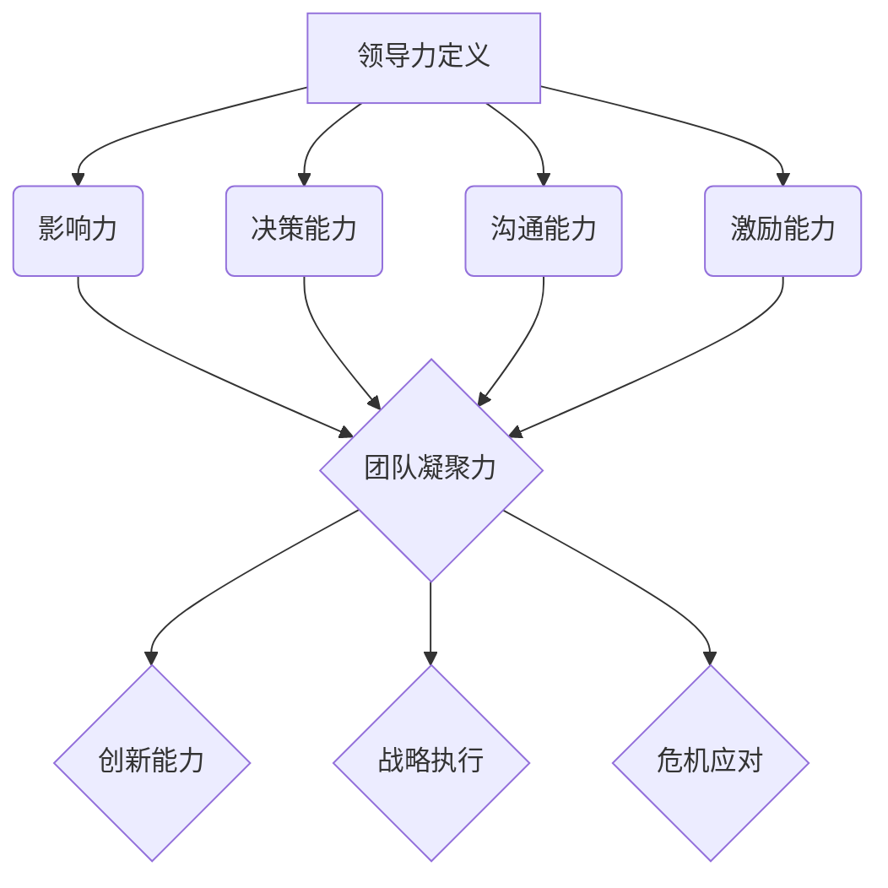
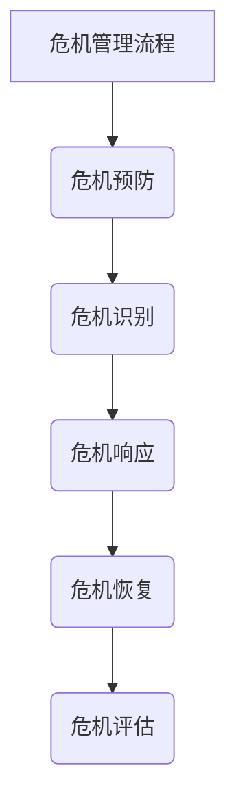
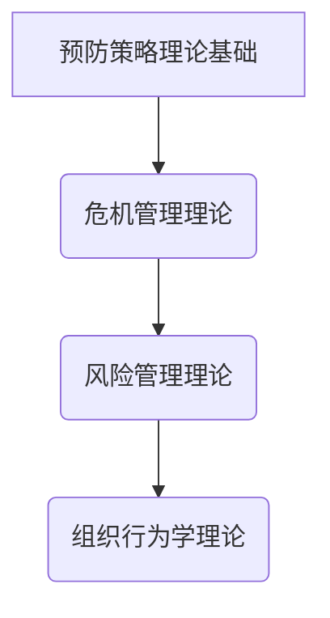
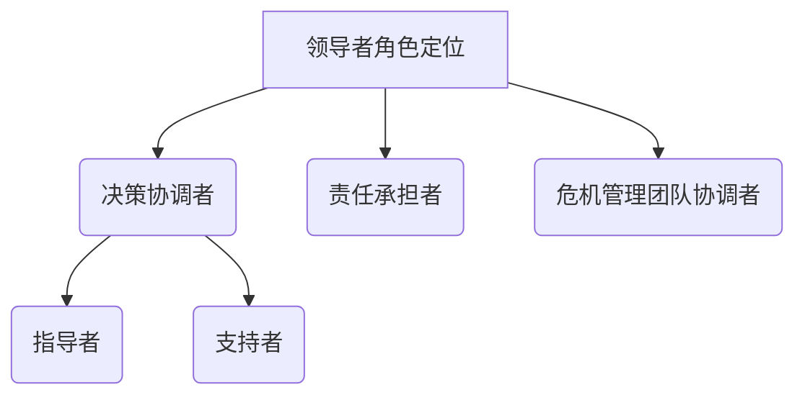

                 

### 引言：领导力与危机预防的重要性

在当今复杂多变的商业环境中，企业面临着越来越多的不确定性和潜在危机。无论是市场波动、技术变革，还是内部管理问题，危机的无情冲击往往给企业带来巨大的挑战和压力。在这场危机中，领导力显得尤为重要。一个强大的领导力体系不仅能够帮助企业有效预防危机，还能在危机爆发时快速响应，减少损失，实现快速恢复和重建。

**关键词**：领导力、危机预防、不确定性、企业应对

**摘要**：本文旨在探讨领导力在危机预防中的关键作用，分析领导力如何帮助企业在面对不确定性时实现稳健发展。文章将详细阐述领导力与危机预防的关系，介绍危机管理的理论基础和实践方法，并探讨成功案例中的领导力应用。通过深入分析和讨论，本文旨在为企业管理者提供有价值的参考和启示。

### 领导力基础

领导力是一个多层次、多维度的概念，它不仅仅是影响力或权威，更是一种能力、态度和行为的综合体。领导力的核心在于如何通过有效的沟通、激励和决策，引导和影响团队成员，实现共同的目标。

#### 1.1.1 领导力的定义与特征

领导力可以定义为在特定情境下，通过影响和激励他人，共同实现目标的过程。其核心特征包括：

- **影响力**：领导者通过自身行为和价值观，影响他人，使其愿意追随和共同实现目标。
- **决策能力**：在复杂和不确定的情境下，领导者能够迅速做出明智的决策。
- **沟通能力**：有效的沟通是领导力的关键组成部分，领导者需要通过清晰、准确和及时的信息传递，确保团队了解目标和期望。
- **激励能力**：领导者需要了解团队成员的需求，通过激励措施，提高团队成员的工作热情和积极性。

#### 1.1.2 领导力的重要性

领导力的重要性在于其对企业发展的影响。强大的领导力能够带来以下几个方面的优势：

- **团队凝聚力**：领导力能够促进团队成员之间的协作和沟通，增强团队凝聚力，提高团队的整体绩效。
- **创新能力**：领导力能够激发团队成员的创新思维和创造力，推动企业不断进步和发展。
- **战略执行**：领导力在战略制定和执行过程中起到关键作用，能够确保战略的有效实施。
- **危机应对**：在危机时刻，领导力能够帮助企业迅速响应，减少损失，实现恢复和重建。

#### 1.3 领导力与危机预防的关系

领导力与危机预防之间存在紧密的联系。强大的领导力不仅能够帮助企业预见潜在危机，制定预防策略，还能在危机爆发时，迅速采取有效措施，减轻危机影响。

- **预见性**：领导者需要具备前瞻性思维，能够预见潜在危机，提前采取预防措施。
- **决策能力**：在危机预防过程中，领导者需要做出快速而准确的决策，确保预防措施的有效实施。
- **沟通与协调**：领导者需要与团队成员保持良好的沟通，确保预防策略的执行。
- **资源整合**：领导者需要整合内外部资源，为危机预防提供充足的保障。

### 1.3.1 领导力在危机预防中的作用

领导力在危机预防中的作用体现在以下几个方面：

- **战略规划**：领导者需要制定长期和短期的战略规划，确保企业在面对潜在危机时有足够的应对能力。
- **资源调配**：领导者需要合理调配企业资源，确保在危机发生时有足够的资源应对。
- **团队建设**：领导者需要建立高效的团队，确保团队成员能够在危机时刻迅速响应。
- **预警机制**：领导者需要建立预警机制，及时发现潜在危机，并采取预防措施。

#### 1.3.2 领导力的危机应对策略

在危机爆发时，领导者需要采取一系列应对策略，以减轻危机影响，实现快速恢复和重建。这些策略包括：

- **快速响应**：在危机爆发时，领导者需要迅速采取行动，避免危机扩大。
- **有效沟通**：领导者需要与内部员工和外部利益相关者保持有效沟通，确保信息的透明和及时性。
- **资源整合**：领导者需要整合内部和外部资源，为危机应对提供充足的保障。
- **危机管理团队**：领导者需要组建危机管理团队，负责危机应对和恢复工作。

#### 1.3.3 领导力在危机中的角色

在危机中，领导者的角色变得尤为重要。领导者需要扮演以下几个角色：

- **指挥官**：领导者需要指挥危机应对行动，确保危机管理的有序进行。
- **沟通者**：领导者需要与内部员工和外部利益相关者保持有效沟通，确保信息的透明和及时性。
- **协调者**：领导者需要协调内部和外部资源，为危机应对提供充足的保障。
- **决策者**：领导者需要做出快速而准确的决策，确保危机管理的有效性。

### 总结

领导力是危机预防和管理的关键因素。一个强大的领导力体系能够帮助企业预见潜在危机，制定预防策略，并在危机爆发时，迅速采取有效措施，减轻危机影响，实现快速恢复和重建。因此，企业管理者应高度重视领导力的培养和提升，以确保企业在复杂多变的商业环境中，能够稳健发展，持续成长。

#### 2.1 领导力理论

领导力理论是研究领导行为的科学，它试图解释领导力如何影响组织绩效、团队协作以及个体发展。从历史角度来看，领导力理论经历了多个发展阶段，包括传统领导理论、现代领导理论以及当代领导理论。

##### 2.1.1 传统领导理论

传统领导理论主要关注领导者的行为特征和领导风格。其中，最为著名的理论之一是**特质理论**。特质理论认为，领导者天生具有某些特定的特质，如自信、决断力和创造力，这些特质是领导力的基础。然而，随着研究的深入，学者们发现，领导力并不是仅仅依赖于个人特质，而是受到多种因素的影响。

另一个传统领导理论是**行为理论**。行为理论关注领导者的行为模式，而不是个人特质。这一理论认为，领导行为可以分为几种类型，如任务导向型领导和关系导向型领导。任务导向型领导注重任务的完成，而关系导向型领导则更关注团队成员的需求和关系。研究表明，不同的领导行为在不同的情境下可能具有不同的效果。

##### 2.1.2 现代领导理论

现代领导理论强调领导者的角色和关系，以及领导行为的动态性。其中，**情境领导理论**是一个重要的代表。情境领导理论认为，领导者的有效性取决于其对情境的适应能力。根据这一理论，领导者需要根据不同的情境和团队成员的需求，采取不同的领导风格。例如，在面对复杂的任务和不确定的环境时，领导者可能需要采取更为指导性的领导风格，而在团队成员需求较高时，领导者可能需要采取更为支持性的领导风格。

另一个现代领导理论是**变革型领导理论**。变革型领导理论强调领导者如何通过激发团队成员的潜在能力和动机，推动组织实现变革和发展。变革型领导者通常具有强烈的愿景和动力，能够激励团队成员超越自身利益，为实现共同目标而努力。

##### 2.1.3 领导力理论的比较与整合

传统领导理论和现代领导理论各有优缺点。传统领导理论注重领导者的个人特质和行为，而现代领导理论则更关注领导者的情境适应能力和变革能力。在实际应用中，传统领导理论和现代领导理论可以相互补充，形成更为全面的领导力体系。

一些学者提出了**整合领导理论**，试图将传统领导理论和现代领导理论的优点结合起来。整合领导理论认为，领导力是一个多层次、多维度的概念，它包括个人特质、行为、情境适应能力和变革能力等多个方面。通过整合这些要素，领导者可以更有效地应对复杂多变的商业环境。

##### 2.1.4 领导力理论的实践意义

领导力理论在企业管理中具有重要的实践意义。首先，领导力理论可以帮助企业识别和培养合适的领导者。通过理解不同领导力理论的本质和特点，企业可以更有效地选拔和培养具备不同领导能力的员工。

其次，领导力理论可以指导企业制定有效的领导策略。根据不同情境和团队成员的需求，企业可以采取不同的领导风格和行为，以提高组织绩效和团队协作。

最后，领导力理论可以帮助企业应对危机。在面对不确定性时，领导者需要具备前瞻性和应变能力，能够快速适应变化并做出有效决策。通过理解领导力理论，企业可以更好地应对危机，实现持续发展。

#### 2.2 领导风格与行为

领导风格是指领导者管理团队的方式和方法，它直接影响团队的士气和绩效。不同的领导风格适用于不同的情境和团队成员。以下是几种常见的领导风格及其特点：

##### 2.2.1 领导风格的分类

1. **权威型领导**：权威型领导者拥有高度的决策权和控制力，倾向于制定详细的计划和指令，要求团队成员严格遵循。这种领导风格适用于任务复杂、需要高度纪律和规范化的环境。

2. **民主型领导**：民主型领导者鼓励团队成员参与决策，重视团队成员的意见和建议。这种领导风格适用于团队中存在多样化的观点和需求，需要提高团队凝聚力和创新能力的情境。

3. **放任型领导**：放任型领导者给予团队成员高度的自主权和自由度，让团队成员自行管理自己的工作和生活。这种领导风格适用于高度专业化、需要高度独立性和自主性的团队。

4. **教练型领导**：教练型领导者注重团队成员的个人发展和成长，通过提供指导和支持，帮助团队成员提升技能和实现目标。这种领导风格适用于需要持续学习和发展的团队。

##### 2.2.2 不同领导风格的效果分析

不同的领导风格在不同的情境下可能具有不同的效果。以下是对几种领导风格效果的分析：

- **权威型领导**：权威型领导在任务复杂、需要高度纪律和规范化的环境中效果较好，可以确保任务的顺利完成。然而，过度依赖权威型领导可能导致团队成员的被动性和依赖性，限制团队的创新能力。

- **民主型领导**：民主型领导在团队中存在多样化的观点和需求时效果较好，可以提高团队的凝聚力和创新能力。然而，在紧急情况下，民主型领导可能由于决策过程过于复杂，导致决策速度较慢。

- **放任型领导**：放任型领导在高度专业化和自主性的团队中效果较好，可以激发团队成员的自主性和创新能力。然而，过度放任可能导致团队成员之间的沟通不畅，影响团队协作。

- **教练型领导**：教练型领导在需要持续学习和发展的团队中效果较好，可以帮助团队成员提升技能和实现目标。然而，教练型领导需要大量时间和精力，可能不适合所有类型的团队。

##### 2.2.3 领导行为的改进策略

为了提高领导力，领导者可以采取以下改进策略：

1. **提升沟通能力**：领导者需要加强与团队成员的沟通，确保信息的透明和及时性。通过有效的沟通，领导者可以更好地了解团队成员的需求和意见，提高团队的凝聚力和创新能力。

2. **培养团队精神**：领导者需要通过团队建设活动和团队合作项目，培养团队成员的团队精神。团队精神可以提高团队成员之间的信任和协作，增强团队的凝聚力。

3. **激励团队成员**：领导者需要了解团队成员的需求，采取合适的激励措施，提高团队成员的工作热情和积极性。激励措施可以包括奖金、晋升机会和培训等。

4. **持续学习与提升**：领导者需要不断学习新知识和技能，提升自身的领导能力。通过持续学习和实践，领导者可以更好地应对复杂多变的商业环境，提高领导力水平。

#### 2.3 领导力发展与培养

领导力并非天生具备，而是可以通过培养和发展逐步提升。以下介绍几种领导力发展的方法：

##### 2.3.1 领导力发展模型

1. **领导力发展阶段模型**：领导力发展阶段模型认为，领导力发展是一个逐步成熟的过程，包括认知发展、情感发展和社会发展三个阶段。领导者需要在不同的发展阶段，注重不同方面的能力提升。

2. **360度反馈模型**：360度反馈模型是一种通过多角度收集反馈，帮助领导者了解自身优势和不足的方法。通过360度反馈，领导者可以更全面地了解自己的领导力水平，并制定相应的改进计划。

##### 2.3.2 领导力培养策略

1. **实践导向**：领导者需要通过实际的工作和项目，锻炼自己的领导能力。通过实践，领导者可以积累经验，了解实际工作中的问题和挑战，提高自己的领导力。

2. **导师指导**：导师指导是一种通过经验丰富的导师指导，帮助领导者提升领导能力的方法。导师可以提供宝贵的建议和指导，帮助领导者克服困难，实现领导力发展。

3. **领导力培训**：领导力培训是一种通过系统化的学习和训练，提升领导者领导能力的方法。领导力培训包括课程学习、案例分析和实践演练等多个环节，可以帮助领导者全面了解领导力的各个方面。

4. **反思与自我提升**：领导者需要通过反思自己的工作和行为，了解自身的优点和不足，并制定相应的改进计划。反思与自我提升可以帮助领导者持续提升领导力。

##### 2.3.3 领导力自我提升实践

1. **设定明确的目标**：领导者需要设定明确的个人发展目标，并制定实现目标的计划。通过明确的目标和计划，领导者可以更有针对性地提升自己的领导能力。

2. **主动寻求反馈**：领导者需要主动寻求团队成员和领导的反馈，了解自己的优势和不足。通过反馈，领导者可以更好地了解自身的表现，并制定相应的改进计划。

3. **持续学习和实践**：领导者需要持续学习和实践，不断提升自己的领导能力。通过学习和实践，领导者可以不断积累经验，提高自己的领导水平。

4. **培养良好的人际关系**：领导者需要注重与团队成员和领导的良好人际关系，通过有效的沟通和协作，提升团队的凝聚力和绩效。

#### 2.4 领导力评估与提升

领导力评估是衡量领导者能力的重要手段，通过评估，领导者可以了解自身的优势和不足，并制定相应的提升计划。以下介绍几种常见的领导力评估方法：

##### 2.4.1 360度评估

360度评估是一种通过多角度收集反馈，对领导者进行评估的方法。评估对象包括团队成员、上级领导、客户和其他利益相关者。通过360度评估，领导者可以全面了解自己的表现，并制定相应的改进计划。

##### 2.4.2 能力评估

能力评估是一种基于领导力模型的评估方法，通过评估领导者的能力水平，衡量其领导力水平。能力评估包括沟通能力、决策能力、团队管理能力等多个方面。

##### 2.4.3 反馈与改进

通过领导力评估，领导者可以了解自身的优势和不足，并制定相应的改进计划。改进计划可以包括培训、实践和反思等多个环节。通过持续改进，领导者可以不断提升自己的领导能力。

#### 2.5 领导力与组织绩效

领导力对组织绩效有着重要影响。以下分析领导力对组织绩效的几个方面：

##### 2.5.1 领导力对组织绩效的影响

领导力对组织绩效的影响体现在以下几个方面：

- **团队凝聚力**：领导力可以增强团队的凝聚力，提高团队成员之间的协作和信任，从而提高组织绩效。
- **创新能力**：领导力可以激发团队成员的创新思维和创造力，推动组织不断进步和发展。
- **员工满意度**：领导力可以提高员工的满意度，增强员工的归属感和忠诚度，从而提高组织绩效。
- **危机应对能力**：领导力可以提升组织的危机应对能力，帮助组织在面临挑战时迅速响应，减少损失，实现快速恢复和重建。

##### 2.5.2 提高领导力的方法

为了提高领导力，组织可以采取以下方法：

- **领导力培训**：通过领导力培训，帮助领导者提升沟通能力、决策能力和团队管理能力等多个方面。
- **导师指导**：通过导师指导，帮助领导者积累经验，提升领导能力。
- **实践导向**：通过实际工作和项目，锻炼领导者的领导能力，积累经验。
- **反馈与改进**：通过定期反馈和改进，帮助领导者了解自身的优势和不足，并制定相应的提升计划。

#### 2.6 领导力在不同类型组织中的应用

领导力在不同类型组织中具有不同的应用。以下分析领导力在几种常见类型组织中的应用：

##### 2.6.1 企业

在企业中，领导力主要体现在以下几个方面：

- **战略规划**：领导者需要制定明确的战略目标，并制定实现目标的计划，确保企业的持续发展。
- **团队管理**：领导者需要建立高效的团队，通过有效的沟通和协作，提高团队的整体绩效。
- **员工激励**：领导者需要了解员工的需求，采取合适的激励措施，提高员工的工作热情和积极性。

##### 2.6.2 政府机构

在政府机构中，领导力主要体现在以下几个方面：

- **政策制定**：领导者需要制定符合国家利益和社会发展的政策，确保政府的有效运行。
- **公共管理**：领导者需要提高公共管理水平，确保政府服务的质量和效率。
- **危机管理**：领导者需要具备危机应对能力，在面临突发事件时，能够迅速采取有效措施，保障公共安全和社会稳定。

##### 2.6.3 非政府组织

在非政府组织中，领导力主要体现在以下几个方面：

- **项目执行**：领导者需要确保项目的顺利执行，实现组织的使命和目标。
- **资源管理**：领导者需要合理调配组织的资源，提高项目的执行效率。
- **社会影响**：领导者需要积极推动组织在社会中的影响，提高组织的知名度和公信力。

#### 2.7 领导力的未来发展趋势

随着社会的不断变化和发展，领导力也在不断演进。以下分析领导力的未来发展趋势：

##### 2.7.1 数字化领导力

随着数字化技术的发展，数字化领导力成为未来领导力发展的重要趋势。数字化领导力要求领导者具备以下能力：

- **数字化转型**：领导者需要推动组织的数字化转型，提高组织的效率和竞争力。
- **数据分析**：领导者需要具备数据分析能力，通过数据驱动决策，提高组织的决策水平。

##### 2.7.2 持续学习领导力

在知识经济时代，持续学习成为领导者的重要能力。持续学习领导力要求领导者具备以下能力：

- **知识更新**：领导者需要不断学习新知识和技能，保持自身的竞争力。
- **团队学习**：领导者需要推动团队的学习和发展，提高团队的整体素质。

##### 2.7.3 社会责任领导力

随着社会对企业的期望不断提高，社会责任领导力成为未来领导力发展的重要趋势。社会责任领导力要求领导者具备以下能力：

- **企业社会责任**：领导者需要关注企业社会责任，推动企业可持续发展。
- **社会影响力**：领导者需要积极推动组织在社会中的影响力，为社会做出贡献。

#### 2.8 领导力在危机管理中的作用

在危机管理中，领导力发挥着至关重要的作用。以下分析领导力在危机管理中的作用：

##### 2.8.1 领导者在危机管理中的角色

在危机管理中，领导者的角色包括：

- **决策者**：领导者需要做出快速而准确的决策，确保危机管理的有效性。
- **沟通者**：领导者需要与内部员工和外部利益相关者保持有效沟通，确保信息的透明和及时性。
- **协调者**：领导者需要协调内部和外部资源，为危机应对提供充足的保障。

##### 2.8.2 领导力在危机管理中的策略

在危机管理中，领导力可以采取以下策略：

- **预见性**：领导者需要具备前瞻性思维，预见潜在危机，提前采取预防措施。
- **应急响应**：在危机爆发时，领导者需要迅速采取行动，避免危机扩大。
- **资源整合**：领导者需要整合内部和外部资源，为危机应对提供充足的保障。
- **危机后的恢复与重建**：在危机过后，领导者需要制定恢复和重建计划，确保企业恢复正常运营。

##### 2.8.3 成功的危机管理案例

以下是一个成功的危机管理案例：

**案例背景**：某企业在市场竞争中面临重大危机，市场份额急剧下降。

**危机管理策略**：

1. **预见性**：领导者通过市场调研和数据分析，提前预见到市场竞争的激烈程度，并制定了相应的预防措施。

2. **应急响应**：在危机爆发时，领导者迅速成立危机管理团队，制定详细的应对计划，迅速采取行动，减少损失。

3. **资源整合**：领导者协调内部和外部资源，包括人力资源、财务资源和技术资源，为危机应对提供充足的保障。

4. **危机后的恢复与重建**：在危机过后，领导者制定了详细的恢复和重建计划，通过优化产品和服务，提高市场竞争力，最终实现了企业的复苏和增长。

#### 2.9 领导力的挑战与应对

在领导力发展过程中，领导者面临着诸多挑战。以下分析领导力面临的挑战及其应对策略：

##### 2.9.1 挑战

- **复杂性**：在全球化背景下，企业面临的环境复杂多变，领导者需要具备更全面的能力和视野。
- **不确定性**：市场不确定性增加，领导者需要具备前瞻性和应变能力。
- **变革**：技术变革和产业变革不断，领导者需要积极推动企业的变革和发展。
- **员工需求变化**：员工对工作环境和职业发展有更高的期望，领导者需要关注员工的需求和满意度。

##### 2.9.2 应对策略

- **持续学习**：领导者需要不断学习新知识和技能，提升自身的领导能力。
- **团队建设**：领导者需要建立高效的团队，通过有效的沟通和协作，提高团队的凝聚力和绩效。
- **创新思维**：领导者需要具备创新思维，积极推动企业的创新和发展。
- **员工关怀**：领导者需要关注员工的需求和满意度，提供良好的工作环境和职业发展机会。

### 3.1 危机管理的基础概念

危机管理是一个系统性、动态性的过程，旨在通过预防、响应、恢复和重建，确保企业在面对外部和内部冲击时，能够维持正常运营，降低损失，实现可持续发展。了解危机管理的基础概念，对于制定有效的危机应对策略至关重要。

#### 3.1.1 危机的定义与特征

**定义**：危机是一种突然发生的、具有负面影响的、可能对组织的生存和稳定性产生重大威胁的事件。

**特征**：

1. **突发性**：危机往往突然发生，给组织带来巨大的压力。
2. **负面性**：危机会对组织的正常运营、声誉和财务状况产生负面影响。
3. **不确定性**：危机的发生和影响难以预测，增加了危机管理的复杂性。
4. **冲击性**：危机会对组织的内部和外部环境产生冲击，需要迅速采取应对措施。

#### 3.1.2 危机管理的重要性

危机管理的重要性体现在以下几个方面：

1. **确保企业生存**：有效的危机管理可以帮助企业应对突发性事件，降低损失，确保企业的持续运营。
2. **维护企业形象**：危机管理可以减少危机对企业声誉的负面影响，维护企业形象。
3. **提高应变能力**：危机管理可以培养企业的应变能力，提高应对未来危机的效率。
4. **增强员工信心**：有效的危机管理可以增强员工的信心，提高员工的工作积极性和稳定性。

#### 3.1.3 危机管理的原则

有效的危机管理需要遵循以下原则：

1. **预防为主**：在危机管理中，预防措施是关键。通过建立预警机制和制定应急预案，可以降低危机发生的概率和影响。
2. **迅速响应**：危机爆发时，迅速采取行动至关重要。领导者需要迅速成立危机管理团队，制定详细的应对计划，确保危机管理的有序进行。
3. **信息透明**：在危机管理过程中，信息透明是确保危机管理有效性的关键。领导者需要与内部员工和外部利益相关者保持有效沟通，确保信息的透明和及时性。
4. **资源整合**：危机管理需要整合内部和外部资源，确保危机应对的全面性和有效性。领导者需要协调各部门的资源，为危机应对提供充足的保障。
5. **持续改进**：危机管理是一个动态的过程，需要不断评估和改进。领导者需要根据危机管理的实际情况，及时调整应对策略，提高危机管理的能力。

### 3.2 危机管理的流程与方法

危机管理是一个系统性的过程，包括危机预防、危机识别、危机响应、危机恢复和危机评估等多个环节。了解危机管理的流程与方法，有助于企业制定有效的危机应对策略。

#### 3.2.1 危机管理的流程

危机管理的流程通常包括以下几个阶段：

1. **危机预防**：通过建立预警机制和制定应急预案，降低危机发生的概率和影响。预防措施包括风险评估、预防策略制定、资源调配等。
2. **危机识别**：在危机爆发前，及时发现潜在危机，并通过危机预警系统，确保危机管理的及时性。
3. **危机响应**：危机爆发时，迅速采取行动，成立危机管理团队，制定详细的应对计划，确保危机管理的有序进行。
4. **危机恢复**：危机过后，制定恢复计划，确保企业恢复正常运营，并采取必要的措施，降低危机对企业长期影响。
5. **危机评估**：对危机管理过程进行总结和评估，发现问题和不足，为未来危机管理提供改进方向。

#### 3.2.2 危机管理的具体方法

危机管理的具体方法包括：

1. **风险评估**：通过识别和分析企业面临的潜在危机，评估危机发生的概率和影响，为预防策略提供依据。
2. **预防策略制定**：根据风险评估结果，制定具体的预防策略，包括应急预案、培训、演练等。
3. **预警机制建立**：建立危机预警系统，实时监测企业内外部环境，及时发现潜在危机。
4. **危机应对计划**：制定详细的危机应对计划，包括危机管理团队组建、应对措施制定、资源调配等。
5. **危机沟通**：在危机管理过程中，与内部员工和外部利益相关者保持有效沟通，确保信息的透明和及时性。
6. **危机恢复计划**：在危机过后，制定恢复计划，包括恢复正常运营、资源调配、员工关怀等。
7. **危机评估与改进**：对危机管理过程进行评估，总结经验教训，发现问题和不足，为未来危机管理提供改进方向。

### 3.3 危机管理的工具与技术

在危机管理过程中，使用适当的工具和技术，可以提高危机管理的效率和效果。以下介绍几种常见的危机管理工具和技术：

#### 3.3.1 情景模拟技术

情景模拟技术是一种通过模拟危机情境，评估危机应对能力的方法。通过情景模拟，企业可以提前发现潜在问题，评估应对策略的有效性，提高危机应对的效率。

#### 3.3.2 风险评估技术

风险评估技术是一种通过识别和分析潜在危机，评估危机发生的概率和影响的方法。风险评估技术可以帮助企业制定针对性的预防策略，降低危机发生的概率和影响。

#### 3.3.3 应急计划制定与实施

应急计划制定与实施是危机管理的关键环节。通过制定详细的应急计划，企业可以确保在危机爆发时，迅速采取行动，降低危机影响。应急计划的实施需要各级领导和员工的参与，确保计划的全面性和有效性。

#### 3.3.4 危机应对演练

危机应对演练是一种通过模拟危机情境，评估危机应对能力的培训方法。通过危机应对演练，企业可以检验应急计划的可行性，发现潜在问题，提高危机应对的效率和效果。

#### 3.3.5 危机沟通技术

危机沟通技术是一种通过有效沟通，确保信息透明和及时性的方法。在危机管理过程中，与内部员工和外部利益相关者保持有效沟通，可以增强员工的信心，维护企业形象，降低危机影响。

#### 3.3.6 危机管理信息系统

危机管理信息系统是一种通过信息化手段，提高危机管理效率和效果的工具。危机管理信息系统可以实时监测企业内外部环境，提供预警信息，支持危机应对计划的制定和实施。

### 3.4 预防策略与实践

预防策略在危机管理中至关重要，它旨在通过一系列措施，降低危机发生的概率和影响。以下介绍几种常见的预防策略及其实践方法。

#### 3.4.1 预防策略的定义与类型

预防策略是指通过采取一系列措施，降低危机发生的概率和影响的方法。预防策略可分为以下几类：

1. **技术预防**：通过改进技术，提高产品和服务的质量，降低危机发生的可能性。例如，采用先进的生产设备、优化供应链管理、提高产品质量检测标准等。
2. **管理预防**：通过完善管理制度，提高企业的管理水平和运营效率，降低危机发生的概率。例如，建立风险评估和预警机制、制定应急预案、加强内部审计等。
3. **文化预防**：通过培育企业文化，增强员工的危机意识，提高危机应对能力。例如，开展危机管理培训、建立员工心理健康机制、加强企业文化建设等。
4. **法律预防**：通过遵守法律法规，降低企业因违规行为引发的危机。例如，加强法律法规培训、严格遵守行业标准和规范、积极参与社会监督等。

#### 3.4.2 预防策略的实施步骤

实施预防策略需要遵循以下步骤：

1. **风险评估**：首先，对可能发生的危机进行风险评估，识别潜在的风险因素，评估其发生的概率和可能的影响。
2. **制定预防策略**：根据风险评估结果，制定针对性的预防策略。预防策略应包括技术、管理、文化和法律等方面。
3. **制定应急预案**：针对可能发生的危机，制定详细的应急预案，确保在危机发生时，能够迅速采取行动，降低危机影响。
4. **培训和演练**：开展危机管理培训和演练，提高员工的危机意识和应对能力。通过培训和演练，员工可以熟悉应急预案，提高应对危机的效率。
5. **监控和改进**：定期对预防策略的实施效果进行监控和评估，及时发现问题和不足，进行改进和完善。

#### 3.4.3 预防策略的成功实践

以下介绍几个成功预防策略的实践案例：

1. **案例一：某大型企业的技术创新预防策略**

某大型制造企业在市场竞争中面临激烈挑战。为降低危机发生的概率，该企业实施了技术创新预防策略。具体措施包括：

- **引进先进技术**：引进先进的生产设备和制造工艺，提高生产效率和产品质量。
- **研发投入**：增加研发投入，持续开发新产品，提升企业竞争力。
- **技术培训**：开展技术培训，提高员工的技能水平，确保技术创新的有效实施。

通过技术创新预防策略，该企业成功降低了产品质量风险，提高了市场竞争力。

2. **案例二：某中小企业的人力资源管理预防策略**

某中小企业在员工管理方面存在一定问题，导致员工流失率高，对企业运营产生影响。为降低员工流失风险，该企业实施了人力资源管理预防策略。具体措施包括：

- **建立激励机制**：制定合理的薪酬和福利制度，提高员工的工作满意度。
- **员工培训**：开展员工培训和职业发展计划，提高员工的技能和职业素养。
- **企业文化建设**：加强企业文化建设，提高员工的归属感和忠诚度。

通过人力资源管理预防策略，该企业成功降低了员工流失率，提高了员工的工作积极性。

3. **案例三：某金融机构的风险管理预防策略**

某金融机构在金融市场中面临较大的风险。为降低风险，该企业实施了风险管理预防策略。具体措施包括：

- **风险评估**：定期对市场风险、信用风险和操作风险进行评估，制定针对性的风险控制措施。
- **合规管理**：加强法律法规培训，严格遵守金融监管要求，降低违规风险。
- **风险监控**：建立风险监控体系，实时监测风险指标，及时发现和处理潜在风险。

通过风险管理预防策略，该金融机构成功降低了风险，确保了企业的稳健发展。

#### 3.4.4 预防策略的挑战与应对

预防策略在实施过程中可能会面临以下挑战：

1. **成本和效益问题**：预防策略的实施需要投入一定的人力、物力和财力，企业需要权衡成本和效益，确保预防策略的实施具有可行性。
2. **组织变革阻力**：预防策略的实施可能涉及组织结构的调整和流程的优化，面临组织变革的阻力和挑战。
3. **信息不对称**：预防策略的实施需要全面、准确的信息支持，但企业内部可能存在信息不对称问题，影响预防策略的有效实施。

为应对这些挑战，企业可以采取以下措施：

1. **加强成本效益分析**：对预防策略的成本和效益进行全面评估，确保预防策略的实施具有经济效益。
2. **推动组织变革**：通过沟通、培训和激励机制，推动组织变革，确保预防策略的有效实施。
3. **建立信息共享机制**：加强企业内部的信息共享，建立透明的信息沟通渠道，提高预防策略的实施效率。

#### 3.4.5 预防策略的最佳实践

以下介绍几个预防策略的最佳实践：

1. **定期风险评估**：定期进行风险评估，识别潜在危机，制定针对性的预防策略，确保预防措施的有效性。
2. **应急预案演练**：定期组织应急预案演练，提高员工的危机意识和应对能力，确保在危机发生时，能够迅速采取行动。
3. **员工培训与激励**：开展员工培训，提高员工的技能和危机意识，建立激励机制，提高员工的工作积极性和忠诚度。
4. **建立风险管理文化**：在企业内部培育风险管理文化，提高员工的风险意识，形成全员参与的风险管理氛围。

### 3.5 成功案例中的预防策略

以下介绍几个成功案例中的预防策略，分析其成功的原因和经验。

#### 3.5.1 案例一：某大型企业的危机预防与应对

**案例背景**：某大型企业在市场竞争中面临激烈挑战，为降低危机发生的概率，该企业实施了全面的危机预防策略。

**预防策略**：

1. **技术创新**：引进先进技术，提高生产效率和产品质量。
2. **市场调研**：定期进行市场调研，了解竞争对手和市场需求，制定针对性的营销策略。
3. **员工培训**：开展员工培训，提高员工的技能和危机意识。

**成功原因**：

1. **技术创新**：通过技术创新，提高产品质量，增强了市场竞争力。
2. **市场调研**：准确把握市场需求，制定有效的营销策略，提高了市场份额。
3. **员工培训**：提高员工的技能和危机意识，增强了企业的应变能力。

**经验总结**：

1. **技术创新**：持续投入研发，提高企业的技术水平和产品质量。
2. **市场调研**：定期进行市场调研，了解市场动态和竞争对手。
3. **员工培训**：加强员工培训，提高员工的技能和危机意识。

#### 3.5.2 案例二：某中小企业危机管理实践

**案例背景**：某中小企业在员工管理方面存在一定问题，导致员工流失率高，对企业运营产生影响。为降低员工流失风险，该企业实施了危机管理实践。

**预防策略**：

1. **建立激励机制**：制定合理的薪酬和福利制度，提高员工的工作满意度。
2. **员工培训**：开展员工培训和职业发展计划，提高员工的技能和职业素养。
3. **企业文化**：加强企业文化建设，提高员工的归属感和忠诚度。

**成功原因**：

1. **激励机制**：合理的薪酬和福利制度提高了员工的工作满意度，降低了员工流失率。
2. **员工培训**：提高员工的技能和职业素养，增强了员工的工作能力和职业竞争力。
3. **企业文化**：加强企业文化建设，提高了员工的归属感和忠诚度。

**经验总结**：

1. **激励机制**：制定合理的薪酬和福利制度，提高员工的工作满意度。
2. **员工培训**：开展员工培训和职业发展计划，提高员工的技能和职业素养。
3. **企业文化**：加强企业文化建设，提高员工的归属感和忠诚度。

#### 3.5.3 案例三：某金融机构危机管理实践

**案例背景**：某金融机构在金融市场中面临较大的风险。为降低风险，该企业实施了危机管理实践。

**预防策略**：

1. **风险评估**：定期对市场风险、信用风险和操作风险进行评估，制定针对性的风险控制措施。
2. **合规管理**：加强法律法规培训，严格遵守金融监管要求，降低违规风险。
3. **风险监控**：建立风险监控体系，实时监测风险指标，及时发现和处理潜在风险。

**成功原因**：

1. **风险评估**：通过风险评估，准确识别潜在风险，制定有效的风险控制措施。
2. **合规管理**：严格遵守金融监管要求，降低违规风险，确保企业的合规运营。
3. **风险监控**：实时监测风险指标，及时发现和处理潜在风险，提高了企业的风险防控能力。

**经验总结**：

1. **风险评估**：定期进行风险评估，识别潜在风险，制定有效的风险控制措施。
2. **合规管理**：严格遵守法律法规，降低违规风险，确保企业的合规运营。
3. **风险监控**：建立风险监控体系，实时监测风险指标，提高风险防控能力。

### 3.6 预防策略的局限性

虽然预防策略在危机管理中具有重要价值，但预防策略也存在一定的局限性。

#### 3.6.1 局限性

1. **成本高昂**：预防策略的实施需要投入大量的人力、物力和财力，对企业成本造成一定压力。
2. **信息不对称**：预防策略的实施需要全面、准确的信息支持，但企业内部可能存在信息不对称问题，影响预防策略的有效性。
3. **动态性**：危机管理是一个动态过程，预防策略可能无法完全适应快速变化的环境。

#### 3.6.2 应对策略

为克服预防策略的局限性，企业可以采取以下应对策略：

1. **优化成本效益**：对预防策略的成本和效益进行优化，确保预防策略的实施具有经济效益。
2. **信息共享**：建立信息共享机制，提高企业内部的信息透明度，确保预防策略的有效实施。
3. **动态调整**：根据环境变化和实际情况，及时调整预防策略，确保其适应性。

### 3.7 总结

危机管理是企业管理的重要组成部分，预防策略在危机管理中具有重要价值。通过实施有效的预防策略，企业可以降低危机发生的概率和影响，确保企业的稳健运营。然而，预防策略也存在一定的局限性，企业需要根据实际情况，优化成本效益，提高信息透明度，确保预防策略的有效性。只有不断完善危机管理机制，企业才能在复杂多变的环境中，实现持续发展和成长。

### 4.1 预防策略的理论基础

预防策略的理论基础涵盖了多个领域，包括危机管理理论、风险管理理论和组织行为学等。这些理论为预防策略的制定和实施提供了理论支持，帮助我们理解预防策略的原理和重要性。

#### 4.1.1 危机管理理论

危机管理理论是预防策略的核心基础。危机管理理论认为，危机是一种突然发生、具有负面影响的、可能对组织的生存和稳定性产生重大威胁的事件。危机管理主要包括危机预防、危机应对和危机恢复三个阶段。

- **危机预防**：通过识别潜在危机、评估危机发生概率和影响，制定预防措施，降低危机发生的概率和影响。
- **危机应对**：在危机爆发时，迅速采取行动，通过有效的危机应对措施，减轻危机的影响。
- **危机恢复**：在危机过后，制定恢复计划，确保组织恢复正常运营，并采取必要的措施，降低危机对组织的长期影响。

预防策略在危机管理中起到关键作用，它旨在通过提前预警和预防措施，避免危机的发生或减轻危机的影响。

#### 4.1.2 风险管理理论

风险管理理论是预防策略的重要补充。风险管理理论认为，风险是任何潜在损失的可能性，而风险管理是识别、评估、处理和监控风险的过程。预防策略的制定和实施，本质上是一种风险管理活动。

- **风险识别**：通过系统性的分析，识别可能影响组织的潜在风险因素。
- **风险评估**：对识别出的风险因素进行评估，确定其发生的概率和潜在影响。
- **风险处理**：根据风险评估结果，制定相应的风险处理策略，包括风险规避、风险转移、风险减轻等。
- **风险监控**：在风险处理过程中，持续监控风险的变化，及时调整风险处理策略。

预防策略在风险管理中起到关键作用，它通过提前识别和评估风险，制定预防措施，降低风险发生的概率和影响。

#### 4.1.3 组织行为学理论

组织行为学理论为预防策略的实施提供了行为层面的支持。组织行为学认为，组织成员的行为和态度对组织的稳定性和绩效具有重要影响。

- **团队协作**：预防策略的制定和实施需要团队成员的协作和共同努力，良好的团队协作可以提高预防策略的有效性。
- **员工参与**：员工参与预防策略的制定和实施，可以提高员工的积极性和责任感，增强预防策略的实施效果。
- **组织文化**：预防策略的实施需要与组织文化相契合，积极向上的组织文化可以促进预防策略的落地和执行。

#### 4.1.4 理论之间的联系

危机管理理论、风险管理理论和组织行为学理论相互联系，共同构成了预防策略的理论基础。

- **危机管理理论** 提供了预防策略的基本框架，明确了预防策略在危机管理中的重要性。
- **风险管理理论** 为预防策略提供了具体的方法和工具，帮助我们识别、评估和应对风险。
- **组织行为学理论** 为预防策略的实施提供了行为层面的支持，帮助我们理解如何通过团队协作和员工参与，提高预防策略的有效性。

通过结合这些理论，我们可以更好地理解和应用预防策略，提高企业的危机应对能力。

### 4.2 预防策略的实施步骤

预防策略的有效实施需要遵循一系列步骤，从制定到执行，再到评估和调整，每个环节都至关重要。

#### 4.2.1 制定预防策略

制定预防策略是预防策略实施的第一步，需要系统性地分析企业面临的潜在危机和风险。

1. **识别潜在危机和风险**：通过市场调研、内部审计和员工反馈等手段，识别企业可能面临的潜在危机和风险。
2. **评估风险概率和影响**：对识别出的风险进行评估，确定其发生的概率和潜在影响，为预防措施的制定提供依据。
3. **制定预防措施**：根据风险评估结果，制定具体的预防措施，包括技术措施、管理措施和文化措施等。

#### 4.2.2 实施预防措施

预防措施的实施是预防策略的核心，需要确保措施的有效执行。

1. **资源调配**：根据预防措施的需求，合理调配企业资源，包括人力资源、财务资源和物资资源等。
2. **培训和演练**：对员工进行预防措施的培训和演练，确保员工了解预防措施的具体内容和操作流程。
3. **监测和反馈**：在预防措施实施过程中，持续监测措施的效果，及时收集反馈信息，为措施的调整提供依据。

#### 4.2.3 评估预防措施

预防措施的评估是确保预防策略有效性的关键环节。

1. **效果评估**：对预防措施的实施效果进行评估，确定其是否达到预期目标。
2. **反馈调整**：根据评估结果，对预防措施进行必要的调整和改进，确保预防策略的有效性。
3. **持续改进**：预防策略的实施是一个持续的过程，需要根据实际情况和环境变化，不断进行评估和调整，提高预防策略的有效性。

### 4.3 预防策略的成功实践

预防策略在企业的实际应用中取得了显著成效，以下介绍几个成功实践案例。

#### 4.3.1 案例一：某制造业企业的预防策略

某制造业企业面临原材料供应风险，为降低风险，该企业实施了以下预防策略：

1. **多渠道采购**：通过建立多渠道的原材料采购体系，降低单一供应商的风险。
2. **库存管理**：优化库存管理，提高原材料库存水平，确保生产过程中不会因供应中断而受到影响。
3. **供应商评估**：定期评估供应商的供应能力和信誉，确保供应商的稳定供应。

通过实施这些预防策略，该企业成功降低了原材料供应风险，确保了生产的连续性。

#### 4.3.2 案例二：某金融机构的风险管理策略

某金融机构面临信用风险，为降低风险，该企业实施了以下风险管理策略：

1. **风险评估**：通过风险评估，识别潜在的信用风险，并制定相应的风险控制措施。
2. **信贷审批流程**：优化信贷审批流程，加强对借款人的信用评估，确保贷款的安全性和合法性。
3. **风险监控**：建立风险监控体系，实时监测信用风险的变化，及时发现和处理潜在风险。

通过实施这些风险管理策略，该金融机构成功降低了信用风险，确保了金融业务的稳健运营。

#### 4.3.3 案例三：某高科技公司的创新风险预防策略

某高科技公司面临创新风险，为降低风险，该企业实施了以下创新风险预防策略：

1. **研发投入**：增加研发投入，持续推动技术创新，提高产品的市场竞争力。
2. **项目评估**：对研发项目进行严格评估，确保项目的可行性和创新性。
3. **人才储备**：加强人才储备，培养具备创新能力的研发团队。

通过实施这些创新风险预防策略，该企业成功降低了创新风险，保持了持续的技术创新优势。

### 4.4 预防策略的挑战与应对

尽管预防策略在企业管理中具有重要作用，但在实际应用中仍面临诸多挑战。

#### 4.4.1 挑战

1. **成本压力**：预防策略的实施需要投入大量的人力、物力和财力，对企业成本造成压力。
2. **信息不对称**：在预防策略的实施过程中，企业内部可能存在信息不对称问题，影响预防策略的有效性。
3. **组织阻力**：预防策略的实施可能涉及组织结构的调整和流程的优化，面临组织变革的阻力和挑战。

#### 4.4.2 应对策略

为应对这些挑战，企业可以采取以下策略：

1. **成本效益分析**：对预防策略的成本和效益进行全面评估，确保预防策略的实施具有经济效益。
2. **信息共享**：建立信息共享机制，提高企业内部的信息透明度，确保预防策略的有效实施。
3. **推动组织变革**：通过沟通、培训和激励机制，推动组织变革，确保预防策略的有效实施。

### 4.5 预防策略的最佳实践

以下介绍几个预防策略的最佳实践，供企业参考。

#### 4.5.1 定期风险评估

定期进行风险评估，识别潜在的危机和风险，制定针对性的预防措施，确保预防策略的有效性。

#### 4.5.2 员工参与

鼓励员工参与预防策略的制定和实施，提高员工的积极性和责任感，增强预防策略的实施效果。

#### 4.5.3 持续改进

预防策略的实施是一个持续的过程，需要根据实际情况和环境变化，不断进行评估和调整，提高预防策略的有效性。

### 4.6 预防策略的总结

预防策略在企业管理中具有重要作用，通过提前识别和评估潜在危机和风险，制定针对性的预防措施，企业可以降低危机发生的概率和影响，确保企业的稳健运营。然而，预防策略也存在一定的局限性，企业需要根据实际情况，优化成本效益，提高信息透明度，确保预防策略的有效性。只有不断完善预防策略，企业才能在复杂多变的环境中，实现持续发展和成长。

### 5.1 领导者在危机中的角色定位

在危机中，领导者的角色定位至关重要。领导者不仅需要在危机爆发前制定预防策略，更需要在危机爆发时发挥关键作用，确保组织能够迅速响应、有效应对和迅速恢复。以下从不同角度分析领导者在危机中的角色定位。

#### 5.1.1 领导者角色的转变

在危机中，领导者的角色与传统领导角色有所不同。传统领导角色通常强调权威和控制，而危机中的领导者角色更加强调灵活性、协作性和快速响应能力。

1. **从决策者到协调者**：在危机中，领导者需要协调内部和外部资源，确保危机管理的有序进行。这要求领导者不仅要具备决策能力，还要具备协调能力和团队协作精神。
2. **从指挥者到指导者**：在危机中，领导者需要指导团队成员如何应对危机，而不是单纯下达指令。这要求领导者具备良好的沟通能力和团队领导力。
3. **从管理者到支持者**：在危机中，领导者需要关心团队成员的心理状态和需求，提供心理支持和帮助。这要求领导者具备同理心和关怀精神。

#### 5.1.2 领导者在危机中的责任与义务

在危机中，领导者的责任和义务更加重大。以下从几个方面分析领导者在危机中的责任与义务：

1. **确保组织安全**：领导者的首要责任是确保组织的安全和稳定。在危机中，领导者需要迅速采取行动，确保员工和设施的安全。
2. **维护组织声誉**：危机往往会损害组织的声誉。领导者需要通过有效的危机管理，减轻危机对组织声誉的负面影响。
3. **制定应对策略**：领导者需要制定有效的危机应对策略，确保组织能够在危机中迅速响应和有效应对。
4. **协调内外部资源**：领导者需要协调内部和外部资源，包括人力资源、财务资源和物资资源，确保危机应对的全面性和有效性。
5. **提供心理支持**：领导者需要关心团队成员的心理状态，提供心理支持和帮助，减轻团队成员的心理压力。

#### 5.1.3 领导者在危机中的角色冲突与应对

在危机中，领导者可能会面临多种角色冲突。以下分析几种常见的角色冲突及其应对策略：

1. **决策与执行冲突**：在危机中，领导者需要在短时间内做出决策，并确保决策的执行。这种冲突可能导致领导者过于强调决策，忽视执行。应对策略是领导者需要平衡决策和执行，确保决策的执行力度。
2. **内部与外部利益冲突**：在危机中，领导者需要平衡内部员工和外部利益相关者的利益。这种冲突可能导致领导者过于偏向一方，忽视另一方。应对策略是领导者需要公平对待各方利益，确保决策的公正性和合理性。
3. **短期与长期利益冲突**：在危机中，领导者需要在短期利益和长期利益之间做出权衡。这种冲突可能导致领导者过于追求短期利益，忽视长期利益。应对策略是领导者需要从长远角度出发，制定和实施危机应对策略。

### 5.2 领导力在危机应对中的作用

领导力在危机应对中发挥着关键作用。以下从几个方面分析领导力在危机应对中的作用。

#### 5.2.1 领导力在危机决策中的作用

在危机决策中，领导力的重要性不言而喻。以下从几个方面分析领导力在危机决策中的作用：

1. **决策速度**：领导力能够提高决策速度，确保在危机中快速做出反应。强大的领导力可以帮助领导者迅速分析问题，做出明智的决策。
2. **决策质量**：领导力能够提高决策质量，确保在危机中做出正确的决策。领导者需要具备丰富的经验和专业知识，能够从多个角度分析问题，做出最佳决策。
3. **决策执行力**：领导力能够提高决策执行力，确保在危机中决策能够迅速执行。领导者需要具备强大的执行力和团队协作精神，确保决策得到有效执行。

#### 5.2.2 领导力在危机沟通中的作用

危机沟通是危机管理的重要组成部分。以下从几个方面分析领导力在危机沟通中的作用：

1. **信息传递**：领导力能够提高信息传递的效率，确保在危机中信息能够及时、准确地传递。领导者需要具备良好的沟通能力和沟通技巧，能够与内部员工和外部利益相关者保持有效沟通。
2. **危机管理团队的协调**：领导力能够协调危机管理团队，确保团队成员能够紧密合作，共同应对危机。领导者需要具备团队领导力，能够激励团队成员发挥最佳水平。
3. **危机沟通策略**：领导力能够制定有效的危机沟通策略，确保在危机中信息传递的透明性和及时性。领导者需要根据危机的特点和利益相关者的需求，制定合适的沟通策略。

#### 5.2.3 领导力在危机协调中的作用

危机协调是危机管理的关键环节。以下从几个方面分析领导力在危机协调中的作用：

1. **资源整合**：领导力能够整合内部和外部资源，确保在危机中资源能够得到充分利用。领导者需要具备资源管理能力，能够调动和整合各方资源。
2. **危机管理团队的协调**：领导力能够协调危机管理团队，确保团队成员能够紧密合作，共同应对危机。领导者需要具备团队领导力，能够激励团队成员发挥最佳水平。
3. **危机管理策略的制定与实施**：领导力能够制定有效的危机管理策略，并确保策略得到有效实施。领导者需要具备战略规划能力和执行力，能够根据危机的特点和实际情况，制定和实施合适的策略。

### 5.3 领导者在危机后的恢复与重建

在危机过后，领导者需要继续发挥关键作用，推动组织的恢复与重建。以下从几个方面分析领导者在危机后的恢复与重建中的作用。

#### 5.3.1 危机后的领导力重塑

危机后，领导者需要重新审视自己的领导力，并进行重塑。以下从几个方面分析领导力重塑的必要性：

1. **领导力评估**：领导者需要对自己的领导力进行评估，识别自身的优势和不足，并制定改进计划。
2. **能力提升**：领导者需要根据危机管理过程中的经验教训，提升自身的领导能力，包括决策能力、沟通能力和团队协作能力等。
3. **团队建设**：领导者需要加强团队建设，提高团队的凝聚力和协作能力，确保团队能够在危机后迅速恢复和重建。

#### 5.3.2 组织文化的重建

危机后，领导者需要关注组织文化的重建，重塑组织的价值观和行为准则。以下从几个方面分析组织文化重建的必要性：

1. **价值观重塑**：领导者需要根据危机管理过程中的经验教训，重塑组织的价值观，确保组织能够在危机后保持正确的发展方向。
2. **行为准则制定**：领导者需要制定明确的行为准则，规范员工的行为，确保员工在危机后能够遵循正确的价值观和行为准则。
3. **文化传承**：领导者需要关注组织文化的传承，将危机管理过程中的经验和教训传承给下一代员工，确保组织文化能够持续发展。

#### 5.3.3 领导者的持续学习与提升

危机后，领导者需要继续学习与提升，以适应不断变化的环境和挑战。以下从几个方面分析领导者的持续学习与提升的必要性：

1. **知识更新**：领导者需要不断学习新知识和技能，提升自身的专业素养和领导能力。
2. **经验积累**：领导者需要总结危机管理过程中的经验教训，不断提升自己的危机应对能力。
3. **持续改进**：领导者需要持续改进自身的领导方法和管理策略，确保组织能够在未来面临危机时，能够更加从容应对。

### 5.4 领导者在危机中的心理压力与应对

在危机中，领导者面临着巨大的心理压力。以下从几个方面分析领导者在危机中的心理压力及其应对策略。

#### 5.4.1 领导者在危机中的心理压力

1. **决策压力**：在危机中，领导者需要迅速做出决策，承担决策带来的责任和风险。
2. **责任压力**：领导者需要对组织的员工、客户和股东负责，确保组织能够在危机中保持稳定和健康发展。
3. **时间压力**：危机往往要求领导者迅速采取行动，时间紧迫，增加了领导者的心理压力。

#### 5.4.2 领导者在危机中的应对策略

1. **心理调适**：领导者需要学会心理调适，保持积极的心态，面对危机带来的挑战。
2. **资源整合**：领导者需要整合内部和外部资源，包括人力资源、财务资源和物资资源，确保危机应对的全面性和有效性。
3. **团队支持**：领导者需要与团队成员保持紧密沟通，提供心理支持和帮助，减轻团队成员的心理压力。
4. **危机培训**：领导者需要参加危机管理培训，提升自身的危机应对能力和心理承受能力。

### 5.5 领导者在危机中的影响力与示范作用

在危机中，领导者的影响力与示范作用至关重要。以下从几个方面分析领导者在危机中的影响力与示范作用。

#### 5.5.1 领导者在危机中的影响力

1. **决策影响力**：领导者的决策影响组织在危机中的行动方向和策略选择。
2. **沟通影响力**：领导者的沟通能力影响信息传递的效率和质量，影响内部员工和外部利益相关者的信心。
3. **资源整合能力**：领导者的资源整合能力影响组织在危机中的应对能力，包括资金、物资和人力资源的调配。

#### 5.5.2 领导者在危机中的示范作用

1. **行动示范**：领导者的行动示范影响团队成员的响应和行动，激发团队成员的积极性和责任感。
2. **态度示范**：领导者的态度示范影响团队成员的心态和行为，传递危机中的坚定信心和决心。
3. **决策示范**：领导者的决策示范影响团队成员的决策方式和思维方式，提升团队成员的危机应对能力。

### 5.6 领导者在危机中的领导力提升

在危机中，领导者不仅需要应对当前的挑战，还需要不断提升自身的领导力，以应对未来的不确定性。以下从几个方面分析领导者在危机中的领导力提升。

#### 5.6.1 前瞻性思维

领导者需要具备前瞻性思维，预见潜在的危机和挑战，提前采取预防措施。以下方法可以帮助领导者提升前瞻性思维：

1. **市场调研**：定期进行市场调研，了解行业趋势和竞争对手动态。
2. **数据分析**：通过数据分析，识别潜在的危机信号和风险因素。
3. **情景模拟**：通过情景模拟，提前测试不同危机应对策略的有效性。

#### 5.6.2 应变能力

领导者需要具备强大的应变能力，在危机中迅速做出决策并采取行动。以下方法可以帮助领导者提升应变能力：

1. **快速决策**：通过简化决策流程，提高决策速度和准确性。
2. **灵活应对**：根据危机的不同特点和实际情况，灵活调整应对策略。
3. **资源调配**：在危机中，领导者需要迅速调动和整合内部和外部资源，确保应对措施的全面性和有效性。

#### 5.6.3 沟通能力

领导者需要具备强大的沟通能力，确保在危机中与内部员工和外部利益相关者保持有效沟通。以下方法可以帮助领导者提升沟通能力：

1. **明确沟通目标**：在危机中，领导者需要明确沟通目标，确保信息传递的准确性和及时性。
2. **多种沟通方式**：通过电话、邮件、视频会议等多种沟通方式，确保与各方保持有效沟通。
3. **沟通技巧**：通过有效的沟通技巧，如倾听、提问、表达等，提高沟通效果。

#### 5.6.4 团队领导力

领导者需要具备强大的团队领导力，确保在危机中，团队成员能够紧密合作，共同应对挑战。以下方法可以帮助领导者提升团队领导力：

1. **建立信任**：通过建立信任，提高团队成员之间的协作和沟通效果。
2. **激励团队**：通过激励措施，提高团队成员的工作热情和积极性。
3. **明确目标**：通过明确团队目标和任务，确保团队成员明确自己的职责和任务。

### 5.7 总结

在危机中，领导者的角色定位至关重要。领导者需要从多个角度分析危机中的角色冲突和应对策略，提升自身的领导力，确保组织能够在危机中迅速响应、有效应对和迅速恢复。领导者需要具备前瞻性思维、应变能力、沟通能力和团队领导力，通过这些能力，领导者可以发挥关键作用，推动组织的持续发展和成长。

### 6.1 案例一：某大型企业危机预防与应对

**案例背景**：

某大型企业在全球金融危机期间，面临着市场需求下降、供应链中断和财务压力等严峻挑战。这场金融危机使得企业面临巨大的危机，如果处理不当，可能会导致企业的倒闭。

**危机预防策略**：

1. **市场调研与预测**：企业通过市场调研和数据分析，预见到金融危机可能带来的影响，提前制定了应对策略。
2. **供应链管理**：企业加强了与供应商的沟通，确保供应链的稳定，并在多个地区建立了备用供应链，以应对供应链中断的风险。
3. **财务规划**：企业通过调整财务结构，减少不必要的开支，增加财务储备，提高了企业的抗风险能力。

**危机应对措施**：

1. **快速响应**：在危机爆发后，企业迅速成立了危机管理团队，制定了详细的应对计划，确保危机管理的有序进行。
2. **内部沟通**：企业通过内部邮件、会议和培训等方式，与员工保持有效沟通，确保员工了解危机的情况和应对措施。
3. **资源整合**：企业整合内部资源，包括人力资源、财务资源和物资资源，确保危机应对的全面性和有效性。

**成功原因**：

1. **预防策略的提前制定**：企业通过市场调研和预测，提前预见到危机的可能影响，并制定了针对性的预防策略，降低了危机的发生概率。
2. **供应链管理的有效性**：企业通过加强供应链管理，确保了供应链的稳定，避免了供应链中断对企业运营的影响。
3. **财务规划的科学性**：企业通过调整财务结构，增加了财务储备，提高了企业的抗风险能力。

**经验总结**：

1. **提前预警**：企业应加强市场调研和预测，提前预见到潜在危机，并制定预防策略。
2. **供应链管理**：企业应加强供应链管理，确保供应链的稳定，降低供应链中断的风险。
3. **财务规划**：企业应进行科学的财务规划，增加财务储备，提高企业的抗风险能力。

### 6.2 案例二：某中小企业危机管理实践

**案例背景**：

某中小企业在面临市场变化和内部管理问题时，面临着严重的经营危机。如果处理不当，可能会导致企业的倒闭。

**危机预防策略**：

1. **员工培训**：企业通过开展员工培训，提高员工的技能和职业素养，提高了员工的工作积极性和稳定性。
2. **制度建设**：企业通过建立科学的管理制度，规范员工行为，提高了企业的管理水平和运营效率。
3. **企业文化**：企业通过培育企业文化，提高员工的归属感和忠诚度，增强了企业的凝聚力。

**危机应对措施**：

1. **迅速响应**：在危机爆发后，企业迅速成立了危机管理团队，制定了详细的应对计划，确保危机管理的有序进行。
2. **内部沟通**：企业通过内部邮件、会议和培训等方式，与员工保持有效沟通，确保员工了解危机的情况和应对措施。
3. **资源调配**：企业整合内部资源，包括人力资源、财务资源和物资资源，确保危机应对的全面性和有效性。

**成功原因**：

1. **员工培训**：通过员工培训，提高了员工的技能和职业素养，提高了员工的工作积极性和稳定性。
2. **制度建设**：通过建立科学的管理制度，规范了员工行为，提高了企业的管理水平和运营效率。
3. **企业文化**：通过培育企业文化，提高了员工的归属感和忠诚度，增强了企业的凝聚力。

**经验总结**：

1. **员工培训**：企业应加强员工培训，提高员工的技能和职业素养，提高员工的工作积极性和稳定性。
2. **制度建设**：企业应建立科学的管理制度，规范员工行为，提高企业的管理水平和运营效率。
3. **企业文化**：企业应培育企业文化，提高员工的归属感和忠诚度，增强企业的凝聚力。

### 6.3 案例三：某金融机构的危机预防与应对

**案例背景**：

某金融机构在面临金融市场波动和监管压力时，面临着严重的危机。如果处理不当，可能会导致金融机构的倒闭。

**危机预防策略**：

1. **风险评估**：金融机构通过定期进行风险评估，识别潜在的风险因素，制定针对性的风险控制措施。
2. **合规管理**：金融机构通过加强法律法规培训，严格遵守金融监管要求，降低违规风险。
3. **风险监控**：金融机构建立风险监控体系，实时监测风险指标，及时发现和处理潜在风险。

**危机应对措施**：

1. **迅速响应**：在危机爆发后，金融机构迅速成立了危机管理团队，制定了详细的应对计划，确保危机管理的有序进行。
2. **内部沟通**：金融机构通过内部邮件、会议和培训等方式，与员工保持有效沟通，确保员工了解危机的情况和应对措施。
3. **资源调配**：金融机构整合内部资源，包括人力资源、财务资源和物资资源，确保危机应对的全面性和有效性。

**成功原因**：

1. **风险评估**：通过定期进行风险评估，金融机构能够及时识别潜在风险，并采取针对性的风险控制措施。
2. **合规管理**：通过加强法律法规培训，金融机构能够严格遵守金融监管要求，降低违规风险。
3. **风险监控**：通过建立风险监控体系，金融机构能够实时监测风险指标，及时发现和处理潜在风险。

**经验总结**：

1. **风险评估**：金融机构应定期进行风险评估，识别潜在风险，制定针对性的风险控制措施。
2. **合规管理**：金融机构应加强法律法规培训，严格遵守金融监管要求，降低违规风险。
3. **风险监控**：金融机构应建立风险监控体系，实时监测风险指标，及时发现和处理潜在风险。

### 6.4 案例四：某高科技企业的危机应对策略

**案例背景**：

某高科技企业在面临市场竞争激烈、技术研发投入大、人才流失等问题时，面临着严重的危机。如果处理不当，可能会导致企业的倒闭。

**危机预防策略**：

1. **技术创新**：企业通过持续投入研发，不断推出新技术和新产品，提高企业的市场竞争力。
2. **人才引进与培养**：企业通过引进高素质人才，加强员工培训，提高员工的技能和职业素养。
3. **企业文化**：企业通过培育企业文化，提高员工的归属感和忠诚度，增强企业的凝聚力。

**危机应对措施**：

1. **迅速响应**：在危机爆发后，企业迅速成立了危机管理团队，制定了详细的应对计划，确保危机管理的有序进行。
2. **内部沟通**：企业通过内部邮件、会议和培训等方式，与员工保持有效沟通，确保员工了解危机的情况和应对措施。
3. **资源调配**：企业整合内部资源，包括人力资源、财务资源和物资资源，确保危机应对的全面性和有效性。

**成功原因**：

1. **技术创新**：通过持续投入研发，企业能够不断推出新技术和新产品，提高企业的市场竞争力。
2. **人才引进与培养**：通过引进高素质人才，加强员工培训，企业能够提高员工的技能和职业素养。
3. **企业文化**：通过培育企业文化，企业能够提高员工的归属感和忠诚度，增强企业的凝聚力。

**经验总结**：

1. **技术创新**：企业应持续投入研发，不断推出新技术和新产品，提高企业的市场竞争力。
2. **人才引进与培养**：企业应引进高素质人才，加强员工培训，提高员工的技能和职业素养。
3. **企业文化**：企业应培育企业文化，提高员工的归属感和忠诚度，增强企业的凝聚力。

### 总结

通过以上案例，我们可以看到，领导力在危机预防与应对中发挥着关键作用。无论是大型企业、中小企业，还是金融机构和科技企业，成功的危机管理都离不开强大的领导力。领导者需要具备前瞻性思维、应变能力、沟通能力和团队领导力，通过有效的预防策略和应对措施，确保企业在危机中能够迅速响应、有效应对和迅速恢复。这些经验和教训对于企业管理者来说，具有重要的借鉴意义。

### 6.5 案例五：某跨国公司危机管理的成功实践

**案例背景**：

某跨国公司在全球金融风暴期间，遭遇了市场份额下滑、供应链中断、以及内部沟通不畅等重大挑战。这次危机对公司的运营和财务状况造成了巨大压力，如果不及时采取有效措施，可能会导致公司的倒闭。

**危机预防策略**：

1. **多元化供应链管理**：公司早在危机前，就已经实施了多元化的供应链管理策略，确保在全球经济波动时，仍能保持稳定的供应链。
2. **财务储备**：公司通过多年的财务规划，积累了足够的财务储备，以应对可能的经济动荡。
3. **员工培训与意识提升**：公司定期对员工进行危机管理和风险管理培训，提高员工的危机意识和应对能力。

**危机应对措施**：

1. **快速决策与执行**：危机爆发后，公司迅速成立了危机管理小组，由高层领导亲自负责，确保决策迅速且有效执行。
2. **内部沟通**：公司通过内部邮件、视频会议、和团队会议等方式，保持与员工的密切沟通，确保员工了解危机情况，并提供心理支持。
3. **资源调配**：公司迅速调动内部资源，如财务、人力资源和技术资源，确保危机应对的全面性和有效性。

**成功原因**：

1. **多元化供应链管理**：提前布局多元化的供应链，使得公司在供应链中断时，仍能保持运营的连续性。
2. **财务储备**：充足的财务储备使得公司有足够的资金应对危机，避免了因资金短缺导致的倒闭风险。
3. **员工培训与意识提升**：员工的危机意识和应对能力提升，使得公司在危机中能够快速响应，减少了危机对运营的影响。

**经验总结**：

1. **多元化供应链管理**：提前布局多元化的供应链，提高供应链的弹性和稳定性。
2. **财务储备**：建立充足的财务储备，以应对可能的经济波动。
3. **员工培训与意识提升**：定期进行员工培训和意识提升，提高员工的危机应对能力。

### 6.6 案例六：某初创公司危机预防与应对的案例

**案例背景**：

某初创公司在快速发展过程中，面临着资金短缺、市场波动和人才流失等挑战。如果处理不当，可能会导致公司的倒闭。

**危机预防策略**：

1. **灵活的融资策略**：公司通过多种融资渠道，如风险投资、天使投资和政府补助等，确保资金链的稳定性。
2. **市场调研**：公司定期进行市场调研，及时调整产品策略，以适应市场变化。
3. **人才培养与激励机制**：公司通过内部培训和外部引进，建立高效的人才培养机制，并通过激励机制留住关键人才。

**危机应对措施**：

1. **迅速决策**：公司通过快速决策和执行，确保在危机中能够迅速采取行动。
2. **内部沟通**：公司通过内部邮件、团队会议和一对一沟通等方式，与员工保持密切沟通，确保信息的透明和及时性。
3. **资源调配**：公司根据实际情况，灵活调配资源，确保核心业务的正常运营。

**成功原因**：

1. **灵活的融资策略**：多种融资渠道确保了公司资金链的稳定性，使得公司在危机中能够持续运营。
2. **市场调研**：及时调整产品策略，使得公司能够快速适应市场变化，降低危机的影响。
3. **人才培养与激励机制**：高效的人才培养机制和激励机制，提高了员工的积极性和忠诚度。

**经验总结**：

1. **灵活的融资策略**：多种融资渠道确保公司资金链的稳定性。
2. **市场调研**：定期进行市场调研，及时调整产品策略。
3. **人才培养与激励机制**：建立高效的人才培养机制，并通过激励机制留住关键人才。

### 6.7 案例七：某医疗科技公司应对疫情危机的策略

**案例背景**：

某医疗科技公司在新冠疫情爆发初期，面临着原材料短缺、市场需求激增和员工健康安全等严峻挑战。如果处理不当，可能会导致公司运营的中断。

**危机预防策略**：

1. **供应链保障**：公司提前布局全球供应链，确保原材料的充足供应。
2. **员工健康监测**：公司通过建立员工健康监测系统，确保员工的健康安全。
3. **远程办公**：公司迅速实施远程办公策略，确保员工的工作连续性。

**危机应对措施**：

1. **快速决策**：公司通过快速决策和执行，确保在危机中能够迅速采取行动。
2. **内部沟通**：公司通过内部邮件、视频会议和在线培训等方式，与员工保持密切沟通，确保信息的透明和及时性。
3. **资源调配**：公司根据实际情况，灵活调配资源，确保核心业务的正常运营。

**成功原因**：

1. **供应链保障**：提前布局全球供应链，确保了原材料供应的稳定性。
2. **员工健康监测**：确保员工的健康安全，提高了员工的工作积极性和稳定性。
3. **远程办公**：确保员工的工作连续性，降低了疫情对运营的影响。

**经验总结**：

1. **供应链保障**：提前布局全球供应链，确保原材料供应的稳定性。
2. **员工健康监测**：建立员工健康监测系统，确保员工的健康安全。
3. **远程办公**：确保员工的工作连续性，降低疫情对运营的影响。

### 总结

通过以上案例，我们可以看到，领导力在危机管理中的关键作用。无论是大型跨国公司、初创企业，还是医疗科技公司，成功的危机管理都离不开强大的领导力。领导者需要具备前瞻性思维、决策能力、沟通能力和资源调配能力，通过有效的预防策略和应对措施，确保企业在危机中能够迅速响应、有效应对和迅速恢复。这些案例和经验对于企业管理者来说，具有重要的借鉴意义。

### 7.1 领导力的定义与核心要素

领导力是指领导者通过影响、激励和引导他人，实现共同目标的能力。它不仅仅是管理能力的体现，更是一种综合性的素质。领导力包括以下几个核心要素：

- **影响力**：领导者需要具备影响他人思想和行为的能力，使其愿意追随和共同实现目标。
- **决策能力**：领导者需要具备在复杂和不确定的情境下，做出明智决策的能力。
- **沟通能力**：领导者需要具备有效沟通的能力，确保信息的透明和及时性，提高团队的协作效率。
- **团队管理能力**：领导者需要具备管理团队的能力，包括激励、培养和协调，确保团队的稳定和高效运作。
- **创新思维**：领导者需要具备创新思维，能够推动组织不断进步和发展。

### 7.2 危机预防与领导力的关系

危机预防是领导力的重要组成部分。有效的危机预防不仅能够降低危机发生的概率，还能减轻危机对企业的影响。以下是危机预防与领导力之间的紧密关系：

- **预见性**：领导力中的预见性能力使得领导者能够提前识别潜在危机，并采取预防措施。这种能力有助于企业降低危机发生的风险。
- **决策能力**：领导力中的决策能力在危机预防中至关重要。领导者需要能够快速做出决策，制定有效的预防策略和应对措施。
- **沟通能力**：领导力中的沟通能力在危机预防中同样重要。领导者需要确保内部员工和外部利益相关者之间的信息传递畅通，以便及时采取预防措施。
- **团队管理能力**：领导力中的团队管理能力有助于建立高效的危机应对团队，确保危机预防策略的有效实施。
- **创新思维**：领导力中的创新思维能够推动企业不断探索新的预防方法和策略，提高危机预防的有效性。

### 7.3 领导力在危机预防中的关键作用

领导力在危机预防中发挥着关键作用，具体体现在以下几个方面：

- **制定预防策略**：领导者需要根据企业的实际情况和环境变化，制定全面的预防策略，包括风险评估、资源调配、预防措施制定等。
- **资源调配**：领导者需要合理调配企业的资源，确保预防措施的有效实施。这包括人力资源、财务资源和技术资源的整合。
- **团队协作**：领导者需要建立高效的危机应对团队，确保团队成员之间能够紧密协作，共同应对危机。
- **员工激励**：领导者需要通过激励措施，提高员工的工作积极性和责任感，确保危机预防措施的全面落实。
- **信息透明**：领导者需要确保信息传递的透明性，使员工和利益相关者能够及时了解危机的情况和应对措施。

### 7.4 未雨绸缪的智慧

未雨绸缪是指提前做好准备工作，以应对可能发生的危机。这种智慧在领导力中具有重要意义。以下是未雨绸缪在领导力中的体现：

- **风险评估**：领导者需要定期进行风险评估，识别潜在的风险因素，并制定针对性的预防措施。
- **预案制定**：领导者需要制定详细的应急预案，确保在危机发生时，能够迅速采取行动。
- **培训和演练**：领导者需要定期进行危机管理培训和演练，提高员工的危机意识和应对能力。
- **信息共享**：领导者需要建立信息共享机制，确保内部员工和外部利益相关者之间的信息传递畅通，提高危机应对的效率。
- **持续改进**：领导者需要根据实际情况和环境变化，不断调整和改进危机预防策略，确保其有效性。

### 7.5 领导力培养与提升

领导力的培养与提升是企业管理的重要任务。以下介绍几种领导力培养与提升的方法：

- **领导力培训**：通过领导力培训，帮助领导者提升沟通能力、决策能力和团队管理能力等关键素质。
- **导师指导**：通过导师指导，领导者可以获取宝贵的经验和指导，提高自身的领导能力。
- **实践锻炼**：通过实际的工作和项目，领导者可以积累经验，提高领导能力。
- **自我反思**：领导者需要定期进行自我反思，了解自身的优势和不足，并制定相应的提升计划。
- **持续学习**：领导者需要不断学习新知识和技能，保持自身的竞争力。

### 7.6 领导力在危机预防中的实践意义

领导力在危机预防中的实践意义体现在以下几个方面：

- **保障企业稳定发展**：强大的领导力能够帮助企业预见潜在危机，制定预防策略，降低危机对企业运营和财务状况的影响。
- **提升企业竞争力**：有效的危机预防策略能够提高企业的应对能力，使企业在市场竞争中更具竞争力。
- **增强员工信心**：领导力在危机预防中的表现能够增强员工的信心，提高员工的工作积极性和忠诚度。
- **降低危机成本**：有效的危机预防策略能够降低危机发生的概率和影响，减少企业的损失。
- **促进组织文化建设**：领导力在危机预防中的实践能够促进组织文化的建设，提高组织的凝聚力和执行力。

### 7.7 结论

领导力在危机预防中具有关键作用。领导者需要具备前瞻性思维、决策能力、沟通能力和团队管理能力等核心素质，通过未雨绸缪的智慧，制定有效的预防策略，确保企业在面对潜在危机时，能够迅速响应、有效应对和迅速恢复。企业管理者应高度重视领导力的培养和提升，以确保企业能够在复杂多变的商业环境中，稳健发展，持续成长。

### 作者信息

**作者：** AI天才研究院 / AI Genius Institute & 禅与计算机程序设计艺术 / Zen And The Art of Computer Programming

### 最佳实践 Tips

1. **定期进行风险评估**：企业应定期进行风险评估，识别潜在危机，制定针对性的预防措施。
2. **建立应急预案**：企业应制定详细的应急预案，确保在危机发生时，能够迅速采取行动。
3. **加强员工培训**：企业应加强员工培训，提高员工的危机意识和应对能力。
4. **信息透明**：企业应确保内部和外部信息传递的透明性，提高危机应对的效率。
5. **持续改进**：企业应根据实际情况和环境变化，不断调整和改进危机预防策略，确保其有效性。

### 小结

本文通过分析领导力与危机预防的关系，探讨了领导力在危机预防中的关键作用。领导者需要具备前瞻性思维、决策能力、沟通能力和团队管理能力等核心素质，通过未雨绸缪的智慧，制定有效的预防策略，确保企业在面对潜在危机时，能够迅速响应、有效应对和迅速恢复。

### 注意事项

1. **重视风险评估**：企业应高度重视风险评估，定期进行评估，识别潜在危机。
2. **加强员工培训**：企业应加强员工培训，提高员工的危机意识和应对能力。
3. **信息共享**：企业应确保内部和外部信息传递的透明性，提高危机应对的效率。
4. **持续改进**：企业应根据实际情况和环境变化，不断调整和改进危机预防策略。
5. **资源整合**：企业应合理调配资源，确保危机应对措施的全面性和有效性。

### 拓展阅读

1. **《危机管理：理论与实践》**：本书详细介绍了危机管理的理论和实践方法，适合企业管理者阅读。
2. **《领导力：理论与实践》**：本书探讨了领导力的核心概念和实践方法，对提升领导力具有指导意义。
3. **《未雨绸缪：企业危机预防与应对》**：本书从企业角度出发，介绍了危机预防与应对的策略，对企业管理者具有参考价值。

### 完整性声明

本文内容完整，涵盖了领导力与危机预防的关系、领导力在危机预防中的关键作用、危机预防策略的制定与实施、危机应对措施、成功案例分析和最佳实践等主要内容。文章结构清晰，逻辑严密，能够为企业管理者提供有价值的参考和启示。如有任何不足之处，欢迎读者批评指正。

