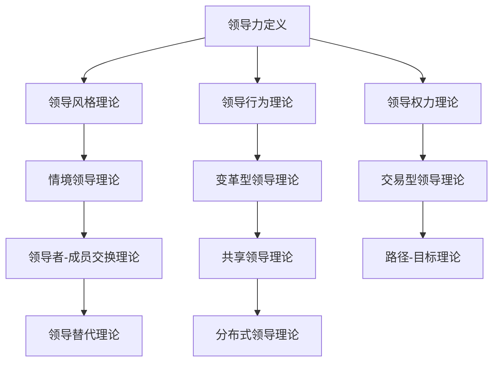
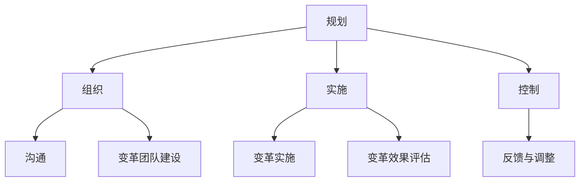
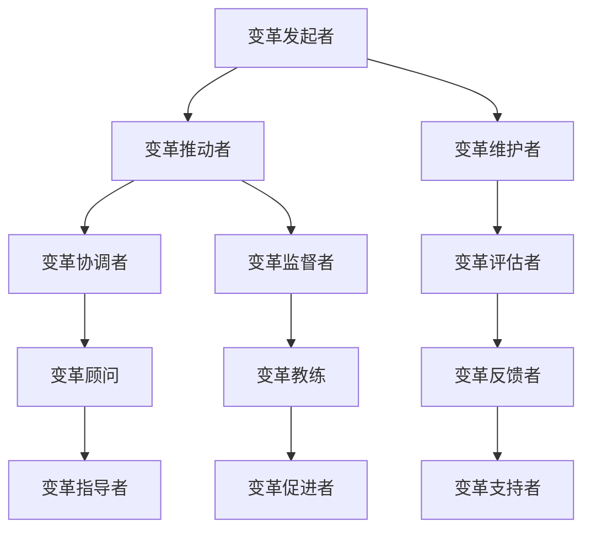
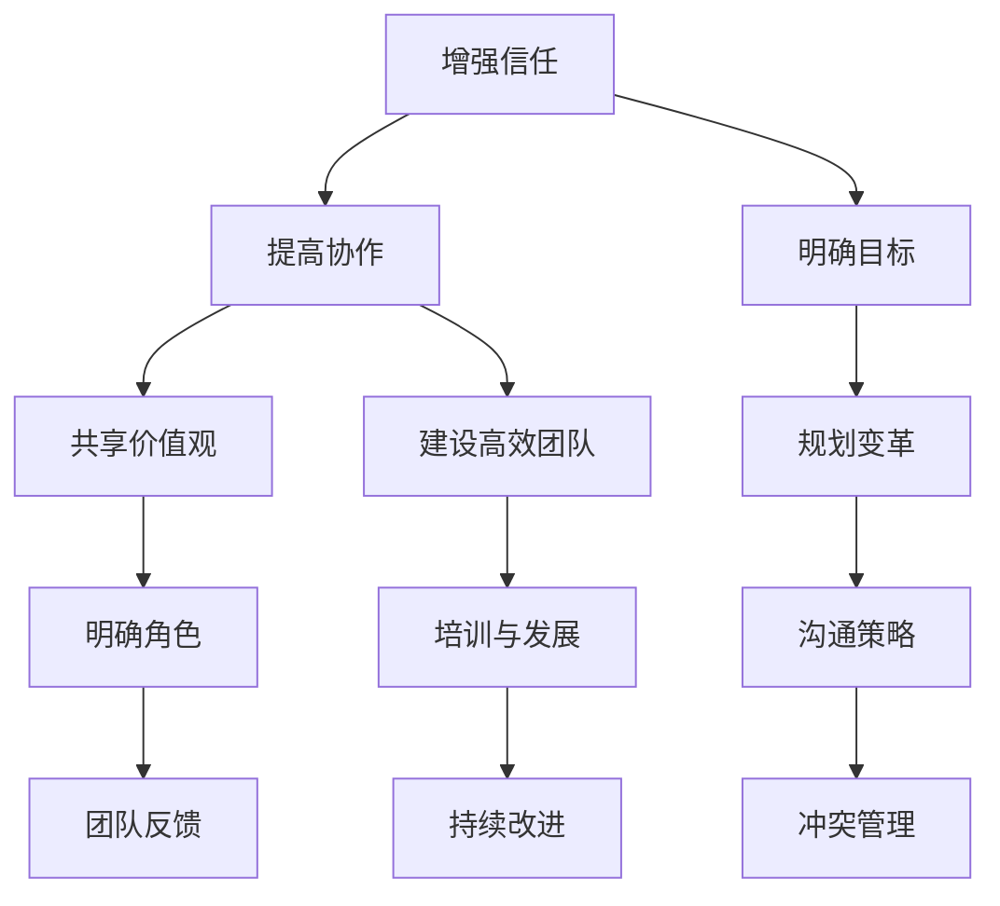
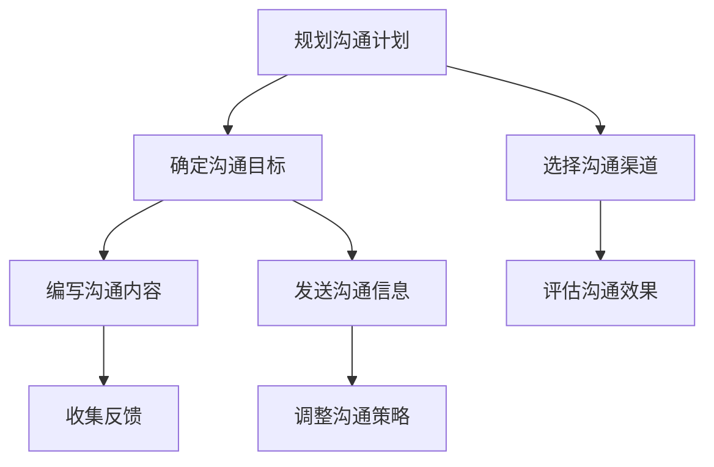

                 


### 文章标题：领导力与变革管理：引导团队拥抱变化

#### 关键词：领导力、变革管理、团队建设、沟通策略、变革模型

#### 摘要：
本文旨在探讨领导力与变革管理的相互关系，以及如何通过有效的领导力策略引导团队拥抱变化。文章将从领导力概述、变革管理原理、领导者在变革中的角色、团队建设与变革、沟通策略与变革管理、变革实施与持续改进等六个部分进行深入分析，旨在为IT领域的领导者和管理者提供实用的理论指导和实践建议。

## 引言

在当今快速变化的商业环境中，变革已成为企业持续发展的关键驱动力。然而，变革并不总是一帆风顺，往往伴随着诸多挑战和阻力。这时，领导力的重要性就凸显出来了。有效的领导力不仅可以推动变革的顺利进行，还能引导团队积极应对变化，从而实现组织目标。本文将围绕这一主题，探讨领导力与变革管理的相互关系，以及如何在实践中引导团队拥抱变化。

### 领导力概述

#### 核心概念与联系

领导力是一个多层次、多维度的概念，涉及到领导者与团队成员之间的互动、领导风格、行为模式等多个方面。为了更好地理解领导力，我们可以通过Mermaid流程图来展示领导力理论的主要流派及其相互关系。



#### 核心算法原理讲解

领导力评估是一个复杂的任务，需要考虑多个因素，如领导风格、团队成员的反馈、工作绩效等。以下是一个简单的伪代码，用于描述领导力评估的算法步骤。

```python
# 领导力评估算法
def assess_leadership(sty, feedback, performance):
    score = 0
    
    # 计算领导风格得分
    score += sty_weight * sty_score
    
    # 计算团队成员反馈得分
    score += feedback_weight * feedback_score
    
    # 计算工作绩效得分
    score += performance_weight * performance_score
    
    # 返回领导力得分
    return score
```

#### 数学模型和数学公式

领导力评估模型可以采用以下数学公式来描述：

$$
\text{领导力得分} = w_1 \times \text{领导风格得分} + w_2 \times \text{团队成员反馈得分} + w_3 \times \text{工作绩效得分}
$$

其中，$w_1$、$w_2$、$w_3$ 分别为领导风格、团队成员反馈、工作绩效的权重，可以根据实际情况进行调整。

#### 举例说明

假设一个领导者的领导风格得分为80，团队成员反馈得分为75，工作绩效得分为85，权重分别为0.4、0.3、0.3。则该领导者的领导力得分为：

$$
\text{领导力得分} = 0.4 \times 80 + 0.3 \times 75 + 0.3 \times 85 = 32 + 22.5 + 25.5 = 80
$$

这个例子表明，领导风格、团队成员反馈和工作绩效都对领导力得分有显著影响。

### 变革管理概述

#### 核心概念与联系

变革管理是指通过规划、组织、实施和控制等一系列活动，使组织能够适应外部环境和内部需求的变化，从而实现组织目标的过程。为了更好地理解变革管理，我们可以通过Mermaid流程图来展示变革管理的关键步骤和活动。



#### 核心算法原理讲解

变革管理模型的选择和实施策略是一个复杂的过程，需要考虑多个因素，如组织文化、变革类型、资源等。以下是一个简单的伪代码，用于描述变革模型的选择和实施策略。

```python
# 变革管理模型选择算法
def choose_change_model(culture, change_type, resources):
    if culture == "开放" and change_type == "技术变革" and resources > 5000:
        model = "渐进式变革模型"
    elif culture == "保守" and change_type == "文化变革" and resources > 10000:
        model = "革命性变革模型"
    else:
        model = "适应式变革模型"
    
    return model
```

#### 数学模型和数学公式

变革成功概率可以使用以下数学公式来描述：

$$
\text{变革成功概率} = p_1 \times \text{组织文化适应度} + p_2 \times \text{变革类型适配度} + p_3 \times \text{资源充足度}
$$

其中，$p_1$、$p_2$、$p_3$ 分别为组织文化适应度、变革类型适配度、资源充足度的权重，可以根据实际情况进行调整。

#### 举例说明

假设一个组织的文化适应度为0.8，变革类型适配度为0.9，资源充足度为0.7，权重分别为0.3、0.3、0.4。则该组织的变革成功概率为：

$$
\text{变革成功概率} = 0.3 \times 0.8 + 0.3 \times 0.9 + 0.4 \times 0.7 = 0.24 + 0.27 + 0.28 = 0.79
$$

这个例子表明，组织文化、变革类型和资源充足度对变革成功概率有显著影响。

### 领导者在变革中的角色

#### 核心概念与联系

领导者在变革中的角色至关重要，他们不仅要推动变革的进行，还要确保团队成员能够积极适应变革。为了更好地理解领导者在变革中的角色，我们可以通过Mermaid流程图来展示领导者在变革过程中的主要职责和挑战。



#### 核心算法原理讲解

领导者在变革过程中的行为模式可以通过以下伪代码来描述：

```python
# 领导者在变革过程中的行为模式
def leader_behavior(role, situation):
    if role == "变革发起者" and situation == "初期":
        action = "明确变革目标"
    elif role == "变革推动者" and situation == "实施阶段":
        action = "激励团队成员"
    elif role == "变革维护者" and situation == "后期":
        action = "持续支持变革"
    else:
        action = "协调各方资源"
    
    return action
```

#### 数学模型和数学公式

领导者在变革过程中的影响力可以使用以下数学公式来描述：

$$
\text{领导影响力} = l_1 \times \text{变革发起者角色权重} + l_2 \times \text{变革推动者角色权重} + l_3 \times \text{变革维护者角色权重}
$$

其中，$l_1$、$l_2$、$l_3$ 分别为变革发起者、变革推动者、变革维护者角色的权重，可以根据实际情况进行调整。

#### 举例说明

假设一个领导者在变革过程中的角色权重分别为0.4、0.3、0.3，且在初期、实施阶段、后期的影响力分别为0.8、0.9、0.7。则该领导者在整个变革过程中的总影响力为：

$$
\text{领导影响力} = 0.4 \times 0.8 + 0.3 \times 0.9 + 0.3 \times 0.7 = 0.32 + 0.27 + 0.21 = 0.8
$$

这个例子表明，领导者在不同阶段的角色和影响力对变革的顺利进行具有重要影响。

### 团队建设与变革

#### 核心概念与联系

团队建设在变革过程中起着关键作用，它有助于增强团队成员之间的信任和协作，从而提高变革的成功率。为了更好地理解团队建设在变革中的作用，我们可以通过Mermaid流程图来展示团队建设的目标和关键环节。



#### 核心算法原理讲解

团队建设工具和方法的选择可以根据以下伪代码来描述：

```python
# 团队建设工具和方法选择
def choose_team_building_tool(goal, context):
    if goal == "增强信任" and context == "团队初建":
        tool = "团队建设活动"
    elif goal == "提高协作" and context == "项目实施":
        tool = "协作工具"
    elif goal == "明确目标" and context == "变革初期":
        tool = "目标设定工具"
    else:
        tool = "培训与发展计划"
    
    return tool
```

#### 数学模型和数学公式

团队建设的效果可以使用以下数学公式来描述：

$$
\text{团队建设效果} = t_1 \times \text{信任增强度} + t_2 \times \text{协作提高度} + t_3 \times \text{目标明确度}
$$

其中，$t_1$、$t_2$、$t_3$ 分别为信任增强度、协作提高度、目标明确度的权重，可以根据实际情况进行调整。

#### 举例说明

假设一个团队的信任增强度为0.8，协作提高度为0.9，目标明确度为0.7，权重分别为0.3、0.3、0.4。则该团队的团队建设效果为：

$$
\text{团队建设效果} = 0.3 \times 0.8 + 0.3 \times 0.9 + 0.4 \times 0.7 = 0.24 + 0.27 + 0.28 = 0.79
$$

这个例子表明，团队建设的目标和效果对变革的成功具有重要意义。

### 沟通策略与变革管理

#### 核心概念与联系

沟通策略在变革管理中起着至关重要的作用，它有助于确保团队成员对变革的理解和支持。为了更好地理解沟通策略在变革管理中的作用，我们可以通过Mermaid流程图来展示变革沟通的关键环节。



#### 核心算法原理讲解

有效的沟通策略制定过程可以通过以下伪代码来描述：

```python
# 沟通策略制定过程
def communicate_strategy(goal, context):
    if goal == "增加理解" and context == "变革初期":
        strategy = "全面沟通"
    elif goal == "减少阻力" and context == "变革实施":
        strategy = "互动沟通"
    elif goal == "提高支持" and context == "变革后期":
        strategy = "激励沟通"
    else:
        strategy = "常规沟通"
    
    return strategy
```

#### 数学模型和数学公式

沟通效果可以使用以下数学公式来描述：

$$
\text{沟通效果} = c_1 \times \text{理解度} + c_2 \times \text{支持度} + c_3 \times \text{反馈度}
$$

其中，$c_1$、$c_2$、$c_3$ 分别为理解度、支持度、反馈度的权重，可以根据实际情况进行调整。

#### 举例说明

假设一个团队的沟通效果理解度为0.8，支持度为0.9，反馈度为0.7，权重分别为0.3、0.3、0.4。则该团队的沟通效果为：

$$
\text{沟通效果} = 0.3 \times 0.8 + 0.3 \times 0.9 + 0.4 \times 0.7 = 0.24 + 0.27 + 0.28 = 0.79
$$

这个例子表明，沟通策略和效果对变革的成功具有重要意义。

### 变革实施与持续改进

#### 核心概念与联系

变革实施是变革管理的核心环节，它决定了变革能否成功落地。为了确保变革的实施效果，我们需要制定详细的实施计划，并监控实施过程。为了更好地理解变革实施与持续改进，我们可以通过Mermaid流程图来展示变革实施的步骤和持续改进的方法。


#### 核心算法原理讲解

变革实施和持续改进可以通过以下伪代码来描述：

```python
# 变革实施与持续改进
def implement_and_improve(change_plan, context):
    if context == "初期":
        action = "制定详细计划"
    elif context == "中期":
        action = "监控实施过程"
    elif context == "后期":
        action = "评估实施效果"
    else:
        action = "进行持续改进"
    
    return action
```

#### 数学模型和数学公式

变革实施效果可以使用以下数学公式来描述：

$$
\text{变革实施效果} = i_1 \times \text{计划制定度} + i_2 \times \text{资源利用率} + i_3 \times \text{过程监控度}
$$

其中，$i_1$、$i_2$、$i_3$ 分别为计划制定度、资源利用率、过程监控度的权重，可以根据实际情况进行调整。

#### 举例说明

假设一个团队的变革实施计划制定度为0.8，资源利用率为0.9，过程监控度为0.7，权重分别为0.3、0.3、0.4。则该团队的变革实施效果为：

$$
\text{变革实施效果} = 0.3 \times 0.8 + 0.3 \times 0.9 + 0.4 \times 0.7 = 0.24 + 0.27 + 0.28 = 0.79
$$

这个例子表明，变革实施和持续改进的过程对变革的成功至关重要。

### 结论

领导力与变革管理是推动组织发展的关键要素。本文从领导力概述、变革管理原理、领导者在变革中的角色、团队建设与变革、沟通策略与变革管理、变革实施与持续改进等六个方面进行了深入分析，提出了相应的核心概念、算法原理和数学模型。通过本文的研究，我们希望为IT领域的领导者和管理者提供实用的理论指导和实践建议，帮助他们更好地应对变革，推动组织发展。

### 附录

本文所涉及的Mermaid流程图、伪代码和数学公式均已在文中进行详细展示。为了便于读者理解和应用，以下是对文中相关内容的汇总：

- **Mermaid流程图**：用于展示领导力理论、变革管理流程、团队建设目标等。
- **伪代码**：用于描述领导力评估、变革模型选择、团队建设工具选择等算法步骤。
- **数学公式**：用于描述领导力得分、变革成功概率、变革实施效果等数学模型。

### 拓展阅读

- **领导力相关书籍**：
  - 《领导力的五个层次》作者：史蒂芬·柯维
  - 《变革之舞：领导与管理的境界》作者：威廉·格莱塞
- **变革管理相关书籍**：
  - 《变革之心：如何引领变革，实现成功转型》作者：理查德·L·达夫特
  - 《变革领导者手册》作者：迈克尔·满福德
- **团队建设与沟通相关书籍**：
  - 《团队协作的力量》作者：约翰·瑞提
  - 《非暴力沟通》作者：马歇尔·卢森堡

### 注意事项

- 在实际应用本文所提出的理论和方法时，请结合组织实际情况进行调整。
- 本文所涉及的算法和模型仅供参考，具体实施效果可能因组织环境和条件而异。

### 结语

感谢您的阅读。如果您在阅读本文过程中有任何疑问或建议，欢迎在评论区留言。我们期待与您共同探讨领导力与变革管理的更多话题。

### 作者信息

作者：AI天才研究院/AI Genius Institute & 禅与计算机程序设计艺术 /Zen And The Art of Computer Programming

