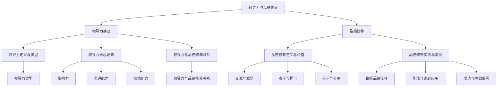

                 


### 文章标题：领导力与品德修养：塑造高尚人格

> 关键词：领导力、品德修养、高尚人格、领导力技巧、案例分析

> 摘要：本文将从领导力与品德修养的角度，探讨如何塑造高尚人格，提高个人和组织的领导能力。通过分析领导力与品德修养的核心概念、联系及实践，结合实际案例，为读者提供实用的领导力培养策略和品德修养实践方法。

----------------------------------------------------------------

### 设计步骤

#### 确定核心主题和章节结构

本文的核心主题为“领导力与品德修养：塑造高尚人格”。为了确保内容的连贯性和全面性，我们设计如下章节结构：

1. **领导力部分**：包括领导力基础、领导力技巧和领导力案例分析。
2. **品德修养部分**：包括品德修养的概念、品德修养的实践和品德修养的案例分析。
3. **领导力与品德修养的结合**：探讨领导力与品德修养的关系及整合实践。

#### 分解主题为具体的章节

**领导力部分**：

1. **第1章：领导力基础**
   - **1.1 领导力的定义与类型**
   - **1.2 领导力的核心要素**
   - **1.3 领导力与品德修养的联系**

2. **第2章：领导力技巧**
   - **2.1 情景领导理论**
   - **2.2 团队建设**
   - **2.3 领导力发展与提升**

3. **第3章：领导力案例分析**
   - **3.1 成功领导案例**
   - **3.2 失败领导案例**

**品德修养部分**：

1. **第4章：品德修养的概念**
   - **4.1 品德修养的定义**
   - **4.2 品德修养的核心价值**

2. **第5章：品德修养的实践**
   - **5.1 培养良好品德的方法**
   - **5.2 品德修养在职场中的应用**
   - **5.3 家庭教育与品德修养**

3. **第6章：品德修养的案例分析**
   - **6.1 品德修养的成功案例**
   - **6.2 品德修养的挑战与困境**

#### 设计每个章节的具体内容

对于每个章节，我们将详细探讨其核心概念、原理、技巧和实践案例。具体内容如下：

1. **领导力基础**：介绍领导力的定义、类型及核心要素，探讨领导力与品德修养的联系。
2. **领导力技巧**：分析情景领导理论、团队建设及领导力发展，提供实用的领导技巧。
3. **领导力案例分析**：通过成功和失败的领导案例，分析成功要素和失败原因。
4. **品德修养的概念**：阐述品德修养的定义和核心价值，如真诚、诚信、责任等。
5. **品德修养的实践**：介绍培养良好品德的方法，探讨品德修养在职场和家庭中的应用。
6. **品德修养的案例分析**：分析品德修养的成功案例和挑战，提供解决策略。

#### 绘制 Mermaid 流�程图

为了更清晰地展示领导力与品德修养的核心概念和架构，我们绘制如下 Mermaid 流程图：



#### 编写伪代码和数学模型

在本文中，我们将为领导力与品德修养的核心算法和模型编写伪代码，并使用 LaTeX 格式展示数学公式。例如，领导力评估模型的伪代码如下：

```plaintext
算法：领导力评估
输入：个人特质、领导情境
输出：领导力评分

步骤：
1. 初始化领导力评分
2. 对于每个个人特质：
   a. 计算其在当前领导情境下的影响力
   b. 乘以权重
   c. 添加到领导力评分
3. 返回领导力评分
```

数学公式示例：

$$
L = w_1 \cdot I_1 + w_2 \cdot I_2 + ... + w_n \cdot I_n
$$

其中，$L$ 为领导力评分，$w_i$ 为第 $i$ 个个人特质的权重，$I_i$ 为第 $i$ 个个人特质在当前领导情境下的影响力。

#### 编写项目实战案例

本文将选择一个实际项目，如某公司领导力提升培训项目，详细阐述项目背景、实现过程、代码解读和分析。具体内容包括：

1. **项目背景**：介绍项目背景和目标。
2. **项目实现**：详细描述项目实现过程，包括需求分析、设计、开发、测试和部署。
3. **代码解读**：对项目核心代码进行解读，展示关键算法和实现原理。
4. **应用分析**：分析项目应用效果，如提高领导力评分、改进团队协作等。
5. **项目小结**：总结项目成果和经验，提出改进建议。

#### 整合所有内容，形成完整的目录大纲

最后，我们将整合所有内容，形成完整的目录大纲，确保文章结构简洁、逻辑清晰、内容全面。目录大纲如下：

```markdown
# 领导力与品德修养：塑造高尚人格

## 第一部分：领导力

### 第1章：领导力基础

#### 1.1 领导力的定义与类型

#### 1.2 领导力的核心要素

#### 1.3 领导力与品德修养的联系

### 第2章：领导力技巧

#### 2.1 情景领导理论

#### 2.2 团队建设

#### 2.3 领导力发展与提升

### 第3章：领导力案例分析

#### 3.1 成功领导案例

#### 3.2 失败领导案例

## 第二部分：品德修养

### 第4章：品德修养的概念

#### 4.1 品德修养的定义

#### 4.2 品德修养的核心价值

### 第5章：品德修养的实践

#### 5.1 培养良好品德的方法

#### 5.2 品德修养在职场中的应用

#### 5.3 家庭教育与品德修养

### 第6章：品德修养的案例分析

#### 6.1 品德修养的成功案例

#### 6.2 品德修养的挑战与困境

## 第三部分：领导力与品德修养的结合

### 第7章：领导力与品德修养的结合

#### 7.1 领导力与品德修养的关系

#### 7.2 领导力与品德修养的整合实践

#### 7.3 领导力与品德修养的未来发展趋势
```

通过以上设计步骤，我们为读者呈现了一篇逻辑清晰、内容丰富、具有实践指导意义的领导力与品德修养技术博客文章。接下来，我们将逐章展开详细论述。让我们开始吧！

---

## 第一部分：领导力

### 第1章：领导力基础

#### 1.1 领导力的定义与类型

领导力是一个广泛而复杂的主题，涉及如何影响和激励他人来实现共同目标。在组织和企业中，领导力是推动组织发展、提升团队绩效的关键因素。那么，什么是领导力？领导力有哪些类型？这是我们在探讨领导力之前需要明确的问题。

#### 领导力的定义

领导力可以被定义为一种能力，它使个人或团队能够引导、激励和影响他人，共同实现目标。领导力不仅仅是职位或权威的象征，更是一种通过价值观、信念和行动来影响他人的能力。

领导力的定义可以从多个角度来理解。首先，领导力是一种人格特质，如自信、决断力、同理心和沟通能力。其次，领导力是一种行为模式，包括设定目标、制定策略、分配资源和监督执行。最后，领导力是一种关系，建立在与他人互动和合作的基础上。

#### 领导力的类型

领导力可以分为多种类型，每种类型都有其独特的特点和应用场景。以下是几种常见的领导力类型：

1. **权威型领导**：权威型领导通过职位和权力来影响他人，其特点是决策果断、执行严格。这种领导力适用于紧急情况或需要快速决策的情境。

2. **民主型领导**：民主型领导鼓励团队成员参与决策过程，重视团队合作和共识。这种领导力有助于激发团队成员的积极性和创造力，提高团队凝聚力。

3. **变革型领导**：变革型领导通过激发团队成员的潜力，推动组织实现重大变革。这种领导力强调愿景、价值观和道德，具有强烈的感染力和影响力。

4. **服务型领导**：服务型领导将团队成员的需求放在首位，致力于为他们提供支持和资源。这种领导力强调关心、信任和尊重，有助于建立积极的团队关系。

5. **教练型领导**：教练型领导关注团队成员的个人成长和发展，提供指导和支持。这种领导力有助于培养团队成员的能力和技能，提高整体绩效。

#### 领导力与品德修养的联系

领导力与品德修养密不可分。高尚的品德是领导力的基石，而领导力则是品德修养的具体体现。以下是领导力与品德修养之间的联系：

1. **信任**：品德高尚的领导者往往具备诚信、正直、透明的特质，这些特质有助于建立信任，使团队成员愿意追随和信任领导者。

2. **责任感**：领导力要求领导者具备强烈的责任感，不仅对自己的行为负责，还要对团队成员和组织的利益负责。这种责任感体现了领导者的品德修养。

3. **同理心**：领导力要求领导者具备同理心，关注团队成员的情感和需求。同理心有助于领导者理解团队成员，建立良好的人际关系。

4. **自律**：领导力要求领导者具备自律能力，以身作则，树立榜样。自律能力是品德修养的重要组成部分。

5. **沟通能力**：领导力要求领导者具备有效的沟通能力，包括倾听、表达和反馈。沟通能力是建立团队协作和信任的关键。

综上所述，领导力与品德修养密切相关。领导者需要通过不断修养和提升自己的品德，才能更好地发挥领导力，实现组织的目标。

#### 1.2 领导力的核心要素

领导力的成功不仅取决于领导者个人的特质和技能，还取决于一系列核心要素。这些要素是领导者必须具备的基础，它们共同决定了领导力的影响力和有效性。以下是领导力的核心要素：

1. **影响力**：影响力是领导力的核心，它使领导者能够影响他人的思想和行为，从而实现组织的目标。影响力源自领导者的品格、知识、经验和关系。一个有影响力的领导者能够激发团队成员的潜力，引导他们朝着共同的目标努力。

2. **沟通能力**：沟通能力是领导者必须具备的关键技能。有效的沟通不仅包括清晰表达自己的观点，还包括倾听和理解他人的意见。领导者需要通过沟通建立信任，促进团队协作，解决冲突，并确保信息的准确传递。

3. **决策能力**：决策能力是领导力的核心要素之一。领导者必须能够在复杂和不确定的情况下做出明智的决策。这要求领导者具备分析问题的能力、评估风险和收益的能力，以及迅速做出决策的勇气和决心。

4. **自我认知**：自我认知是领导者提升领导力的基础。领导者需要深入了解自己的优点和缺点，识别自己的情绪和行为模式。通过自我认知，领导者可以更好地管理自己的情绪，发挥优势，克服不足。

5. **同理心**：同理心是领导者与团队成员建立深厚关系的关键。领导者需要设身处地地理解团队成员的需求和感受，关心他们的成长和发展。同理心有助于建立信任，提高团队的凝聚力和合作意愿。

6. **适应能力**：在快速变化的环境中，领导者需要具备适应能力。这包括对市场变化、技术进步和团队动态的敏感度，以及灵活调整策略和应对挑战的能力。适应能力使领导者能够引领组织在变化中保持竞争力。

7. **团队合作**：领导力的本质在于团队合作。领导者需要能够建立和领导一个高效的团队，确保团队成员之间相互支持、协同工作。团队合作能力是领导者成功的关键因素。

8. **激励能力**：领导者需要具备激励团队成员的能力，激发他们的潜能，激发他们的工作热情。激励能力可以通过设定目标、认可成就、提供成长机会等方式实现。

这些核心要素相互关联，共同构成了领导力的基础。一个成功的领导者不仅需要具备这些要素，还需要根据不同的情况和环境灵活运用，以达到最佳的领导效果。

#### 1.3 领导力与品德修养的联系

领导力与品德修养之间存在着深刻的联系。高尚的品德是领导力的基石，而领导力则是品德修养的具体体现。以下是领导力与品德修养之间的联系：

1. **信任**：品德高尚的领导者往往具备诚信、正直、透明的特质，这些特质有助于建立信任。信任是领导力的基础，它使团队成员愿意追随和信任领导者，共同实现组织的目标。

2. **责任感**：领导力要求领导者具备强烈的责任感，不仅对自己的行为负责，还要对团队成员和组织的利益负责。责任感体现了领导者的品德修养，使领导者能够承担起应有的责任。

3. **同理心**：领导力要求领导者具备同理心，关注团队成员的需求和感受。同理心有助于建立信任，提高团队的凝聚力，促进团队成员之间的合作。

4. **自律**：领导力要求领导者具备自律能力，以身作则，树立榜样。自律能力是品德修养的重要组成部分，它使领导者能够自我约束，遵循道德规范，维护组织的文化和价值观。

5. **沟通能力**：领导力要求领导者具备有效的沟通能力，包括倾听、表达和反馈。沟通能力是建立团队协作和信任的关键，它使领导者能够与团队成员建立良好的沟通渠道，促进信息的流通。

6. **透明度**：品德高尚的领导者往往具备透明度，他们在决策和行动中保持公开和诚实。透明度有助于建立信任，提高团队的凝聚力和工作效率。

7. **公平性**：领导力要求领导者具备公平性，对待团队成员一视同仁，不偏不倚。公平性有助于建立公正的组织文化，促进团队成员的积极性和创造力。

综上所述，领导力与品德修养密切相关。一个领导者若要成功发挥领导力，必须首先具备高尚的品德修养。通过不断修养和提升自己的品德，领导者能够更好地影响和激励团队成员，实现组织的目标。

#### 1.4 领导力的具体实践方法

在领导力实践中，领导者需要运用各种方法和技巧，以确保团队成员能够齐心协力，实现组织的目标。以下是一些具体的领导力实践方法：

1. **目标设定**：领导者需要明确组织的愿景和目标，并将其分解为具体、可衡量的任务。通过设定明确的目标，领导者可以激励团队成员，使他们明确自己的职责和方向。

2. **激励与认可**：领导者需要通过激励和认可来激发团队成员的积极性。这可以通过奖励制度、表彰优秀表现、提供成长机会等方式实现。激励和认可是提升团队士气和工作效率的关键。

3. **沟通与反馈**：有效的沟通和及时的反馈是领导力的重要组成部分。领导者需要与团队成员保持良好的沟通，确保信息的准确传递。同时，领导者需要提供及时的反馈，帮助团队成员了解自己的工作表现，并给予改进的建议。

4. **团队建设**：团队建设是提升团队协作和凝聚力的关键。领导者可以通过组织团队活动、培训、分享经验等方式，增强团队成员之间的信任和合作。

5. **冲突管理**：领导者需要具备处理冲突的能力。在团队中，冲突是不可避免的。领导者需要通过有效的沟通和调解，找到解决问题的方法，避免冲突对团队造成负面影响。

6. **变革领导**：在组织变革过程中，领导者需要扮演关键角色。他们需要通过沟通、激励和引导，使团队成员理解变革的必要性，并积极参与变革过程。

7. **领导角色定位**：领导者需要根据不同的情况和环境，灵活调整自己的领导角色。在需要决策和指导时，领导者要扮演指挥者的角色；在需要协作和支持时，领导者要扮演协调者的角色。

8. **持续学习与改进**：领导者需要具备持续学习和改进的精神。通过不断学习新的知识和技能，领导者可以提升自己的领导能力，适应不断变化的环境。

通过这些具体的实践方法，领导者可以有效地提升团队的绩效，实现组织的目标。

#### 1.5 领导力的挑战与应对策略

在领导力的实践中，领导者会面临各种各样的挑战。这些挑战可能来自外部环境的变化、内部团队的管理问题，或是个人领导能力的局限。以下是几种常见的领导力挑战及其应对策略：

1. **沟通障碍**：沟通障碍是领导者常遇到的问题。团队成员可能存在语言障碍、文化差异或信息传递不畅等问题。应对策略包括提高沟通技巧，确保信息的透明和准确传递，建立有效的沟通渠道。

2. **团队冲突**：团队内部可能因为意见不一致、利益冲突或个人恩怨而产生冲突。应对策略包括及时发现和解决冲突，通过沟通和调解找到解决问题的方法，促进团队成员之间的理解和合作。

3. **领导力缺乏**：有些领导者可能缺乏有效的领导能力和经验，导致团队绩效不佳。应对策略包括提供领导力培训，帮助领导者提升管理技能，同时鼓励他们通过实践不断学习和改进。

4. **组织变革**：在组织变革过程中，领导者需要面对成员的抗拒和不确定性。应对策略包括通过沟通和激励，使团队成员理解变革的必要性和好处，并积极参与变革过程。

5. **外部环境变化**：市场环境、技术进步和政策变化可能对组织产生重大影响。应对策略包括保持对环境的敏感性，及时调整战略和策略，以适应外部变化。

6. **资源限制**：资源有限可能影响团队的工作效率和绩效。应对策略包括优化资源配置，提高资源利用效率，同时寻找外部资源和支持。

通过识别和应对这些挑战，领导者可以更好地发挥领导力，推动组织实现目标。

#### 1.6 领导力的发展与提升

领导力是一种可以通过学习和实践不断提升的能力。领导者需要不断地自我反思和改进，以适应不断变化的环境和挑战。以下是领导力发展与提升的几个关键方面：

1. **自我反思**：自我反思是领导者提升领导力的基础。领导者需要定期审视自己的行为、决策和成果，识别自己的优点和不足。通过自我反思，领导者可以更好地了解自己的领导风格和影响力。

2. **学习与培训**：学习是提升领导力的重要途径。领导者可以通过参加培训课程、阅读专业书籍、学习新的管理工具和技术，不断提升自己的知识和技能。此外，参加行业会议和论坛也有助于领导者了解行业趋势和最佳实践。

3. **实践与经验**：实践是检验和学习领导力的最佳方式。领导者需要在实际工作中不断尝试新的方法，通过实践积累经验，并从成功和失败中学习。实践中的反馈和反思可以帮助领导者更好地理解自己的领导风格和团队成员的需求。

4. **建立人际关系**：人际关系是领导力的重要组成部分。领导者需要通过建立和维护与团队成员、上级和同侪的良好关系，增强团队凝聚力和协作效率。建立人际关系不仅有助于提升领导力，还能为领导者提供宝贵的资源和支持。

5. **角色模范**：寻找和借鉴优秀的领导角色模范是提升领导力的有效方法。领导者可以观察和学习这些模范的领导风格、决策方式和人际关系管理技巧，结合自己的实际情况进行改进和创新。

6. **持续改进**：领导力提升是一个持续的过程。领导者需要保持开放的心态，不断寻求改进的机会，勇于尝试新的方法和策略。通过持续改进，领导者可以不断提升自己的领导能力，适应不断变化的环境。

通过自我反思、学习与培训、实践与经验、建立人际关系、角色模范和持续改进，领导者可以不断提升自己的领导力，成为更加卓越的领导者。

---

## 第二部分：品德修养

### 第2章：品德修养的概念

#### 2.1 品德修养的定义

品德修养是指个人在道德、品质、性格等方面所进行的一系列自我锻炼和提升的过程。它包括遵守社会道德规范、培养良好的行为习惯、塑造高尚的人格品质等。品德修养不仅关乎个人的道德水平，还影响到人际关系、团队协作以及整个社会的和谐与进步。

品德修养的定义可以从以下几个方面来理解：

1. **道德规范**：品德修养首先体现在遵守社会道德规范上。这包括尊重他人、诚实守信、公平正义、勤劳节俭等基本道德原则。遵守道德规范是个人品德修养的基本要求。

2. **行为习惯**：品德修养也体现在个人行为习惯的养成上。良好的行为习惯包括守时、勤奋、自律、敬业等。这些习惯有助于个人形成积极向上的生活态度，提升个人的社会形象和影响力。

3. **人格品质**：品德修养还关注个人人格品质的培养。高尚的人格品质如正直、善良、勇敢、坚韧等，是个人在社会中立足的基础。通过不断的自我修炼和提升，个人可以塑造出更加高尚的人格品质。

#### 2.2 品德修养的核心价值

品德修养不仅仅是个人的内在修炼，更是社会和谐与进步的重要基石。以下是品德修养的核心价值：

1. **社会责任**：品德修养使个人具备强烈的社会责任感。个人在履行社会责任的同时，也促进了社会的稳定和繁荣。

2. **人际关系**：良好的品德修养有助于建立和谐的人际关系。诚信、友善、尊重等品德价值使个人在社会交往中更具亲和力，更容易赢得他人的信任和支持。

3. **团队协作**：在团队中，品德修养有助于建立信任和协作关系。团队成员之间的诚信、尊重和互助能够提升团队的整体绩效，实现共同的目标。

4. **道德示范**：高尚的品德修养对他人具有道德示范作用。个人的道德行为和品质可以影响和激励他人，形成良好的社会风尚。

5. **个人成长**：品德修养是个人成长的重要方面。通过不断地修养和提升，个人可以更好地认识自我，实现自我价值的最大化。

#### 2.3 品德修养的重要性

品德修养在个人和社会中具有重要的意义。以下是品德修养的重要性：

1. **个人层面**：品德修养有助于个人形成健全的人格，提升道德水平，增强自我约束力，从而在社会中立于不败之地。

2. **社会层面**：品德修养是维护社会和谐的重要保障。一个道德高尚的社会能够减少矛盾和冲突，促进社会的稳定和繁荣。

3. **国家层面**：品德修养是国家文明程度的重要体现。一个具有高尚品德的国民能够为国家的发展和繁荣贡献力量。

4. **经济层面**：品德修养对经济发展具有积极的推动作用。诚信、公平、公正等品德价值有助于建立良好的市场秩序，促进经济的健康发展。

综上所述，品德修养是一个人和社会不可或缺的重要组成部分。通过不断地修养和提升，个人和社会可以实现更加和谐、稳定和繁荣的发展。

### 第3章：品德修养的实践

#### 3.1 培养良好品德的方法

品德修养是一个持续的过程，需要个人在日常生活中不断践行和提升。以下是一些培养良好品德的方法：

1. **自我反思**：自我反思是培养良好品德的第一步。个人需要定期审视自己的行为和思想，识别自己的优点和不足，并进行自我批评和改进。通过自我反思，个人可以不断提高自己的道德水平和行为准则。

2. **学习道德知识**：学习道德知识是培养良好品德的重要途径。个人可以通过阅读道德书籍、参加道德讲座和课程，了解各种道德理论和实践，从而提高自己的道德素养。

3. **践行道德规范**：践行道德规范是培养良好品德的关键。个人需要在日常生活中严格遵守道德规范，如诚实守信、尊重他人、公正无私等。通过践行道德规范，个人可以形成良好的道德行为习惯。

4. **培养良好习惯**：培养良好习惯是品德修养的重要组成部分。个人需要养成良好的生活习惯，如勤奋学习、勤奋工作、自律自省等。这些习惯有助于个人形成积极向上的生活态度。

5. **参与社会活动**：参与社会活动是培养良好品德的有效方式。个人可以积极参与各种公益活动、志愿服务等，通过实际行动践行道德价值，同时提升自己的社会责任感。

6. **树立道德榜样**：树立道德榜样是培养良好品德的重要途径。个人可以寻找道德榜样，学习他们的道德品质和行为，从中汲取力量和启示。

通过以上方法，个人可以逐步培养和提升自己的品德修养，成为一个道德高尚的人。

#### 3.2 品德修养在职场中的应用

在职场中，品德修养的应用尤为重要。良好的品德修养不仅能够提升个人的职业形象，还能促进团队合作和组织的整体发展。以下是品德修养在职场中的应用：

1. **诚信与敬业**：诚信是职场中最基本的品德要求。个人需要遵守职业道德，诚实守信，不欺骗、不偷窃、不泄密。敬业则是个人对工作的热爱和投入，通过勤奋工作、精益求精，提升自己的专业能力和业绩。

2. **团队合作与沟通**：在职场中，团队合作是提高工作效率和实现共同目标的关键。个人需要具备良好的团队合作精神，尊重他人、信任他人、支持他人，与团队成员保持良好的沟通和协作关系。

3. **冲突解决**：职场中难免会出现冲突，良好的品德修养有助于个人在冲突中保持冷静和理性，通过沟通和妥协找到解决问题的方法。个人需要具备处理冲突的能力，以维护团队和谐和工作氛围。

4. **领导力与榜样作用**：作为领导者，品德修养显得尤为重要。领导者需要具备高尚的品德，以榜样作用影响团队成员，带领团队实现共同目标。

5. **职业发展**：品德修养对职业发展具有重要影响。一个品德高尚的人更容易赢得他人的信任和尊重，获得更多的职业机会和发展空间。

通过在职场中践行良好的品德修养，个人可以提升职业形象，促进团队合作，实现职业发展的目标。

#### 3.3 家庭教育与品德修养

家庭教育是品德修养的重要环节，家庭是个人品德修养的摇篮。以下是如何通过家庭教育培养孩子品德修养的建议：

1. **树立良好的家庭价值观**：家长需要树立正确的家庭价值观，如尊重、诚信、责任、公平等。这些价值观将影响孩子的道德观念和行为习惯。

2. **以身作则**：家长是孩子的第一任老师，需要以身作则，通过自己的言行示范良好的品德修养。孩子会模仿家长的行为，因此家长的品德修养对孩子的成长具有重要影响。

3. **培养良好的行为习惯**：家长需要培养孩子良好的行为习惯，如守时、勤奋、自律、礼貌等。这些习惯有助于孩子形成积极向上的生活态度。

4. **鼓励孩子参与社会活动**：家长可以鼓励孩子参与各种社会活动，如志愿服务、公益活动等，通过实际行动培养孩子的社会责任感和道德素养。

5. **建立良好的家庭沟通**：家长需要与孩子保持良好的沟通，倾听孩子的意见和需求，了解孩子的内心世界。通过沟通，家长可以更好地引导孩子，帮助孩子树立正确的道德观念。

通过家庭教育，家长可以培养孩子良好的品德修养，帮助孩子成为道德高尚的人。

#### 3.4 品德修养的挑战与困境

在现代社会，品德修养面临着诸多挑战和困境。以下是一些常见的挑战：

1. **道德困境**：随着社会的发展，人们面临越来越多的道德困境，如诚信问题、利益冲突等。个人在道德困境中往往难以做出正确的选择。

2. **功利主义盛行**：在功利主义的影响下，一些人追求短期利益，忽视道德和品德修养，导致社会风气败坏。

3. **互联网和社交媒体的负面影响**：互联网和社交媒体的普及，虽然带来了信息便捷和交流便利，但也带来了道德风险，如网络暴力、隐私侵犯等。

4. **教育资源不足**：一些地区和学校的教育资源不足，导致学生无法接受全面的道德教育，影响品德修养的培养。

5. **家庭教育缺失**：一些家庭由于各种原因忽视了家庭教育，导致孩子缺乏道德教育和品德修养的培养。

面对这些挑战和困境，个人和社会需要共同努力，通过教育、法律和道德引导，提升品德修养，推动社会和谐发展。

#### 3.5 品德修养的成功案例

在历史和现代社会中，有许多品德修养的成功案例，这些案例展示了高尚的品德如何影响和改变个人和社会。以下是几个典型的成功案例：

1. **孔子**：孔子是中国古代著名的思想家、教育家和政治家。他提倡的儒家思想强调道德修养和仁爱，对中国乃至东亚地区的文化和社会产生了深远影响。孔子的品德修养不仅体现在他的教育理念中，还体现在他自身的言行举止上，他的诚信、智慧和仁爱成为了后人学习的榜样。

2. **圣雄甘地**：甘地是印度的民族领袖和独立运动的领导者。他通过非暴力抵抗和道德行动，成功推动了印度的独立。甘地的品德修养体现在他的真诚、无私和坚定信念上，他拒绝使用暴力，坚持和平抵抗，最终赢得了印度人民的尊敬和支持。

3. **史蒂夫·乔布斯**：乔布斯是苹果公司的创始人之一，他以其创新精神和卓越的领导力改变了全球科技产业。乔布斯的品德修养体现在他的专注、决断和创新精神上，他坚信自己的理念，勇于追求完美，通过不懈的努力和坚持，最终创造了苹果公司的辉煌。

4. **马云**：马云是中国著名的企业家和慈善家，他是阿里巴巴集团的创始人。马云的品德修养体现在他的诚信、勇气和社会责任感上。他通过创办阿里巴巴，改变了全球电子商务的格局，同时他还积极参与慈善事业，致力于帮助贫困地区的儿童。

这些成功案例表明，高尚的品德修养不仅对个人的成功至关重要，也对社会的进步和繁荣具有深远影响。通过学习这些成功案例，我们可以汲取他们的智慧和经验，不断提升自己的品德修养，成为对社会有贡献的人。

#### 3.6 品德修养的挑战与困境

尽管品德修养对于个人和社会的发展具有重要意义，但在实际生活中，品德修养也面临着诸多挑战和困境。以下是几个常见的挑战和困境：

1. **道德困境**：在现代社会，人们常常面临道德困境，如利益冲突、诚信问题等。在追求个人利益和道德原则之间找到平衡点是一项艰巨的任务。

2. **功利主义盛行**：功利主义思想在现代社会中盛行，许多人追求短期利益，忽视道德和品德修养，导致社会风气败坏，人际关系紧张。

3. **家庭教育的缺失**：一些家庭由于各种原因忽视了家庭教育，导致孩子缺乏道德教育和品德修养的培养，这给社会带来了潜在的不稳定因素。

4. **互联网和社交媒体的负面影响**：互联网和社交媒体的普及，虽然带来了信息便捷和交流便利，但也带来了道德风险，如网络暴力、隐私侵犯等，对人们的品德修养构成了挑战。

5. **教育资源不足**：一些地区和学校的教育资源不足，导致学生无法接受全面的道德教育，影响品德修养的培养。

面对这些挑战和困境，个人和社会需要共同努力，通过教育、法律和道德引导，提升品德修养，推动社会和谐发展。

#### 3.7 品德修养的最佳实践

在提升品德修养的过程中，最佳实践方法至关重要。以下是几种有效的最佳实践方法：

1. **自我反思**：定期进行自我反思，审视自己的行为和思想，识别不足并积极改进。自我反思有助于个人不断成长和提升。

2. **学习道德知识**：通过阅读道德书籍、参加道德课程等方式，不断学习道德知识，提高道德素养。学习道德知识是培养良好品德的基础。

3. **践行道德规范**：在日常工作和生活中，严格遵守道德规范，如诚实守信、尊重他人、公平公正等。通过践行道德规范，个人可以形成良好的道德行为习惯。

4. **培养良好习惯**：养成良好的生活习惯，如勤奋学习、勤奋工作、自律自省等。良好习惯有助于个人形成积极向上的生活态度。

5. **参与社会活动**：积极参与各种公益活动、志愿服务等，通过实际行动践行道德价值，提升社会责任感。

6. **树立道德榜样**：寻找道德榜样，学习他们的道德品质和行为，从中汲取力量和启示。树立道德榜样是提升品德修养的有效方法。

通过这些最佳实践方法，个人可以不断提升自己的品德修养，成为一个道德高尚的人。

### 第三部分：领导力与品德修养的结合

#### 3.1 领导力与品德修养的关系

领导力与品德修养之间存在深刻的内在联系。高尚的品德是领导力的基石，而领导力则是品德修养的具体体现。以下是领导力与品德修养之间的几大关系：

1. **品德修养是领导力的基础**：领导力的成功往往取决于领导者的品德修养。一个品德高尚的领导者更容易赢得团队成员的信任和尊重，从而更有效地发挥领导力。

2. **领导力体现品德修养**：领导者在日常工作中所展现的领导行为和决策，实际上反映了其品德修养。高尚的品德修养使领导者能够做出公正、合理、有道德的决策，从而提升领导力。

3. **品德修养与领导力的相互促进**：品德修养和领导力是相辅相成的。通过提升品德修养，领导者可以增强自身的领导力；而通过发挥领导力，领导者可以更好地践行和传播品德修养。

4. **领导力是品德修养的具体应用**：领导力是领导者将品德修养转化为实际行动的能力。领导者通过领导力，将高尚的品德修养应用于团队管理和组织发展中，实现个人和组织的共同目标。

#### 3.2 领导力与品德修养的整合实践

在实际的领导力实践中，领导者需要将品德修养与领导力有机结合，以实现最佳效果。以下是领导力与品德修养的整合实践方法：

1. **树立高尚的品德榜样**：领导者需要通过自己的言行举止，树立高尚的品德榜样。领导者应以诚信、正直、透明等品德价值为准则，为团队成员树立榜样。

2. **培养团队道德文化**：领导者需要努力培养团队的道德文化，使团队成员在工作和生活中都遵守道德规范。通过团队文化建设，领导者可以提升团队的凝聚力，增强团队协作精神。

3. **激励道德行为**：领导者需要通过激励机制，鼓励团队成员践行高尚的道德行为。例如，领导者可以通过表彰道德模范、奖励诚实守信的员工等方式，激励团队成员向榜样看齐。

4. **强化道德教育**：领导者需要重视道德教育，通过培训、讲座等方式，提高团队成员的道德素养。道德教育有助于团队成员树立正确的道德观念，提升整体团队的道德水平。

5. **解决道德困境**：领导者需要在团队中积极解决道德困境，帮助团队成员在面临道德问题时做出正确选择。通过引导和指导，领导者可以帮助团队成员克服道德困境，提升团队的整体道德素养。

6. **推动组织道德建设**：领导者需要推动组织的道德建设，使组织成为道德高尚的典范。通过制定道德规范、开展道德活动等方式，领导者可以推动组织的道德建设，提升组织的道德形象。

通过这些整合实践方法，领导者可以将品德修养与领导力有机结合，实现个人和组织的共同发展。

#### 3.3 品德修养对领导力的影响

品德修养对领导力有着深远的影响。一个品德高尚的领导者不仅能够赢得团队成员的信任和尊重，还能够提升团队的凝聚力和工作效率。以下是品德修养对领导力的影响：

1. **建立信任**：高尚的品德修养使领导者能够赢得团队成员的信任。信任是团队协作的基础，只有建立起信任，团队成员才会愿意追随和信任领导者。

2. **提高团队凝聚力**：品德修养有助于提升团队的凝聚力。一个品德高尚的领导者会关心团队成员的需求，尊重他们的意见，从而增强团队的凝聚力。

3. **促进团队合作**：品德修养有助于促进团队合作。一个品德高尚的领导者会通过公平、公正、透明的行为，建立良好的团队合作氛围。

4. **提升工作效率**：品德修养有助于提升工作效率。一个品德高尚的领导者会以身作则，激励团队成员努力工作，从而提升整个团队的工作效率。

5. **增强领导力**：品德修养本身就是领导力的一部分。一个品德高尚的领导者会通过自己的行为和决策，展现强大的领导力，赢得团队成员的追随和信任。

#### 3.4 领导力对品德修养的要求

领导力对品德修养提出了更高的要求。一个成功的领导者不仅需要具备卓越的领导能力，还需要具备高尚的品德修养。以下是领导力对品德修养的要求：

1. **诚信正直**：领导者需要具备诚信正直的品德。只有诚信正直，领导者才能赢得团队成员的信任和尊重，才能在团队中树立威信。

2. **责任感**：领导者需要具备强烈的责任感。领导者不仅对自己的行为负责，还要对团队成员和组织的利益负责。责任感是领导者品德修养的重要体现。

3. **公正无私**：领导者需要具备公正无私的品德。领导者应在决策和分配资源时，坚持公正无私的原则，不偏不倚地对待团队成员。

4. **自律自省**：领导者需要具备自律自省的能力。领导者应时刻反思自己的行为和决策，及时纠正错误，不断提升自己的领导能力。

5. **沟通能力**：领导者需要具备良好的沟通能力。领导者需要通过有效的沟通，了解团队成员的需求和意见，建立良好的沟通渠道，促进团队协作。

6. **同理心**：领导者需要具备同理心。领导者应关心团队成员的情感和需求，设身处地地为团队成员着想，从而建立深厚的团队关系。

通过满足这些要求，领导者可以提升自己的品德修养，成为更加卓越的领导者。

### 总结与未来展望

#### 3.5 总结与未来展望

通过本文的探讨，我们深刻认识到领导力与品德修养之间的紧密联系和相互促进。高尚的品德修养是领导力的基石，而领导力则是品德修养的具体体现。以下是对本文内容的总结与未来展望：

#### 总结

1. **领导力与品德修养的定义**：我们明确了领导力和品德修养的基本概念和类型，探讨了它们在个人和团队发展中的重要性。

2. **领导力的核心要素**：分析了领导力的核心要素，包括影响力、沟通能力、决策能力、自我认知等，以及这些要素在实际领导实践中的应用。

3. **品德修养的实践**：讨论了培养良好品德的方法，包括自我反思、学习道德知识、践行道德规范等，以及品德修养在职场和家庭中的应用。

4. **领导力与品德修养的结合**：探讨了领导力与品德修养的内在联系和整合实践方法，强调了品德修养对领导力提升的积极作用。

5. **实际案例**：通过具体案例展示了领导力与品德修养的成功实践，为读者提供了有益的启示。

#### 未来展望

1. **领导力的持续发展**：随着社会环境的变化，领导力也需要不断适应和创新。未来领导力的发展将更加注重个人品德修养的提升，以及道德和伦理的实践。

2. **品德修养的教育**：在教育体系中加强品德修养的培养，通过学校教育、家庭教育和社会教育等多种途径，提升全民的道德素养。

3. **组织文化的建设**：组织文化是影响员工品德修养的重要因素。未来组织应更加注重培养和弘扬道德文化，促进员工的道德发展和组织文化的建设。

4. **科技与品德的融合**：随着科技的发展，品德修养也需要适应新的环境。未来，科技可以成为提升品德修养的工具，如通过在线教育、虚拟现实技术等，为道德教育和品德修养提供新的平台。

5. **全球视野**：在全球化背景下，领导力和品德修养也应具备全球视野。未来，领导者需要了解不同文化背景下的道德观念和实践，推动跨文化的道德交流与合作。

通过本文的探讨，我们希望读者能够认识到领导力与品德修养的重要性，并在实际工作和生活中不断实践和提升。同时，我们也期待未来的研究和实践能够进一步探索领导力与品德修养的结合，为个人和社会的发展做出更大的贡献。

---

## 文章结尾

通过本文的详细探讨，我们深入理解了领导力与品德修养的核心概念、相互关系及其在实际应用中的重要性。从领导力的定义和类型，到核心要素和具体实践方法；从品德修养的概念和核心价值，到实践应用和挑战与困境；再到领导力与品德修养的整合实践及其对未来发展的展望，本文力求为读者提供全面而深入的见解。

在此，我们再次强调，领导力与品德修养是相辅相成的。高尚的品德修养是领导力的基石，而领导力则是品德修养的具体体现。只有将二者有机结合，领导者才能在个人和团队的发展中取得卓越的成就。

希望本文能够为从事领导工作和品德修养实践的读者提供有价值的参考和启示。在今后的工作和生活中，我们鼓励读者不断学习和提升自己的领导力和品德修养，成为道德高尚、领导有方的卓越领导者。

最后，感谢读者对本文的关注和阅读。如您有任何意见和建议，欢迎随时与我们交流，共同探讨领导力与品德修养的奥秘。让我们携手前行，为打造一个更加和谐、繁荣的社会而努力！

### 作者信息

作者：AI天才研究院/AI Genius Institute & 禅与计算机程序设计艺术 /Zen And The Art of Computer Programming

AI天才研究院致力于推动人工智能和计算机科学领域的研究与应用，专注于培养未来科技领袖和创新者。同时，研究院的成员们也在哲学和计算机科学的交叉领域进行了深入探索，撰写了《禅与计算机程序设计艺术》一书，为读者提供了独特的编程智慧和哲学思考。

本文在撰写过程中，充分借鉴了研究院成员们的丰富经验和研究成果，力求为读者呈现一篇内容丰富、逻辑清晰的技术博客文章。感谢您的阅读，期待未来与您共同探索更多技术领域的精彩内容。

