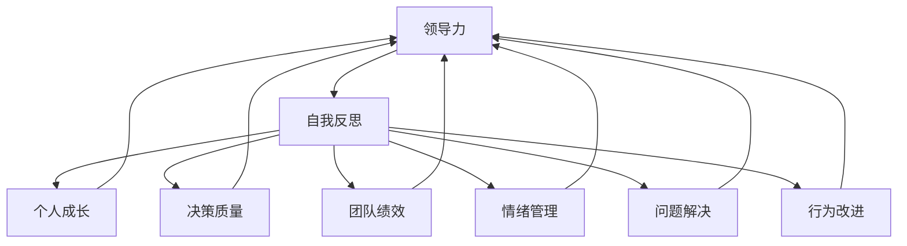

                 

## 文章标题

# 《领导力与自我反思：持续成长的关键》

在数字化时代，领导者不仅是团队的核心，更是组织创新的引擎。随着技术的飞速发展和商业环境的不断变化，领导力的重要性愈发凸显。然而，有效的领导力并非一蹴而就，它需要不断的自我反思和持续成长。本文将探讨领导力和自我反思的核心理念，解析二者之间的相互关系，并阐述如何通过自我反思实现持续成长。通过系统性的分析和深入的思考，我们希望能为读者提供实用的指导和建议。

## 关键词

- 领导力
- 自我反思
- 持续成长
- 领导者特质
- 领导力模型
- 情绪管理
- 认知偏差
- 终身学习

## 摘要

本文旨在揭示领导力与自我反思的内在联系，阐述在快速变化的环境中，领导者如何通过自我反思提升领导力，实现个人与组织的持续成长。文章首先介绍了领导力的定义和分类，以及自我反思的重要性。接着，深入分析了领导力的原理、自我反思的技巧和领导力在实际工作中的应用。文章还探讨了如何通过自我反思和终身学习策略，实现个人和职业的持续成长。最后，通过实际案例和实战分析，总结了领导力与自我反思的实践经验，并提出了改进策略和最佳实践建议。

---

## 引言

在当今快速变化的数字化时代，领导力已经成为企业成功的关键因素。随着全球化和技术革命的推进，商业环境的不确定性不断增加，企业需要具备灵活应变和创新能力的领导者。有效的领导力不仅能激励团队成员，还能推动组织实现战略目标，从而在激烈的市场竞争中脱颖而出。

然而，领导力的提升并非一蹴而就。领导者需要在实践中不断学习和反思，以适应不断变化的环境和需求。自我反思作为领导力发展的重要环节，起到了关键作用。通过自我反思，领导者可以识别自身的优点和不足，调整领导策略，提高决策质量和团队绩效。

本文将深入探讨领导力与自我反思的核心理念，分析二者之间的相互关系。我们将首先介绍领导力的定义和分类，探讨不同领导力模型的特点和应用。随后，我们将详细讨论自我反思的重要性，介绍几种常见的自我反思方法和技巧。接着，文章将分析领导力与自我反思在实际工作中的应用，并通过具体案例和实战分析，总结领导力提升的经验和策略。最后，我们将探讨如何通过自我反思和终身学习策略，实现个人和职业的持续成长。

通过本文的系统性分析和深入探讨，我们希望能为读者提供实用的指导和建议，帮助他们在领导力发展的道路上取得更大的成就。

### 领导力的定义与分类

领导力是一个复杂而多维的概念，不同学者和专家对其有不同的理解和定义。一般而言，领导力可以被视为一种能力，它包括激励和引导他人实现共同目标的过程。领导力不仅仅是关于指导和控制，更重要的是建立信任、激发潜能和推动变革。

#### 领导力的定义

首先，让我们来看一些关于领导力的经典定义：

- 詹姆斯·库泽斯（James M. Kouzes）和巴里·波斯纳（Barry Z. Posner）认为，领导力是动员他人共同追求愿景的能力。
- 彼得·德鲁克（Peter Drucker）指出，领导力是一种做正确事情的艺术。
- 约翰·肯尼斯·加布勒（John Kenneth Galbraith）则将领导力描述为“一种能让人们愿意跟随你走的方向的力量”。

这些定义虽然各有侧重点，但都强调了领导力的核心要素：激励、愿景、信任和变革。

#### 领导力的分类

领导力可以根据不同的维度进行分类。以下是一些常见的领导力类型：

1. **变革型领导力（Transformational Leadership）**：
   变革型领导力是一种激励和启发下属，共同追求更高目标和理想的能力。变革型领导者通常具备以下特征：
   - **愿景驱动**：他们能够清晰地描绘未来的愿景，并激励团队为之努力。
   - **激励**：通过个人魅力和愿景，激发团队成员的热情和动力。
   - **个人发展**：关注团队成员的成长，提供支持和资源。

2. **交易型领导力（Transactiona

### 自我反思的重要性

自我反思是一种自我意识的过程，它涉及对自身行为、思维和情感进行深入分析和审视。在领导力的发展中，自我反思扮演着至关重要的角色。它不仅有助于领导者识别自身的优点和不足，还能促进个人成长和改进领导行为。

#### 自我反思的定义

自我反思（Self-reflection）通常被定义为一种深思熟虑的过程，通过回顾和评估个人经验，理解自己的行为和情感反应，并从中学习。它不仅涉及对外部事件的反思，还包括对自身内在感受和动机的探索。

#### 自我反思的重要性

1. **个人成长**：
   自我反思有助于领导者识别自身的行为模式、思维方式和情感反应，从而促进个人成长。通过深入分析自身的弱点和优点，领导者可以制定针对性的改进计划，提升个人能力和素质。

2. **自我意识**：
   自我反思有助于提升领导者的自我意识，使他们更加了解自己的价值观、信念和动机。这种自我意识有助于领导者做出更加明智和一致的决策，同时也能够增强团队内部的沟通和信任。

3. **问题解决**：
   自我反思是一个强大的问题解决工具。通过反思，领导者可以识别问题的根源，分析问题的本质，并提出有效的解决方案。这有助于领导者提高决策质量和问题解决能力。

4. **改进领导行为**：
   自我反思使领导者能够审视自己的领导行为，识别可能存在的问题，并采取改进措施。通过持续的自我反思，领导者可以不断提升自己的领导技巧，更好地应对复杂的工作环境和挑战。

5. **情绪管理**：
   自我反思有助于领导者识别和管理自己的情绪。在领导过程中，情绪管理至关重要，它不仅影响个人的心理健康，还影响团队的士气和绩效。通过自我反思，领导者可以更好地理解自己的情绪，学会如何有效地应对压力和挑战。

#### 自我反思的类型

1. **个人日记反思**：
   个人日记反思是一种常见的自我反思方法，它允许领导者将自己的思考和感受记录下来。这种方法有助于领导者深入挖掘自己的内心世界，识别潜在的问题和机会。

2. **同侪反馈**：
   同侪反馈（Peer Feedback）是一种通过与他人交流和分享经验来进行自我反思的方法。这种方法可以提供不同的视角和反馈，有助于领导者更全面地了解自己的行为和影响。

3. **360度反馈**：
   360度反馈是一种综合性的自我反思方法，它涉及从多个角度（如上级、同事、下属和客户）收集反馈。这种方法有助于领导者获得全面的评价，识别自身的优点和不足。

4. **反思日志**：
   反思日志（Reflective Journal）是一种系统地记录和反思个人经历的方法。这种方法有助于领导者持续地跟踪自己的成长过程，并制定长期的发展计划。

### 领导力与自我反思的关系图

为了更好地理解领导力与自我反思之间的关系，我们可以使用Mermaid流程图来展示它们之间的相互作用：

在这个流程图中，我们可以看到自我反思如何影响领导力的各个方面，从而促进个人和团队的持续成长。

### 领导力的定义与分类

领导力是一个多维度的概念，涵盖了从个人特质到组织行为的各个方面。为了更好地理解和应用领导力，我们可以从不同的角度对其进行分类。以下是一些常见的领导力类型及其特点：

#### 变革型领导力（Transformational Leadership）

变革型领导力是一种以愿景、激励和培养下属为核心的领导风格。这种领导力类型的特点如下：

1. **愿景驱动**：变革型领导者能够清晰地描绘未来的愿景，并激励团队成员为之努力。他们不仅仅是设定目标，而是通过愿景激发团队成员的热情和动力。

2. **激励**：变革型领导者通过个人魅力、激励性演讲和榜样作用，激励团队成员超越自我，实现更高的目标。

3. **个人发展**：他们关注团队成员的成长，提供支持和资源，帮助团队成员实现个人和职业发展。

4. **价值观导向**：变革型领导者以价值观为导向，将组织的愿景和使命与团队成员的个人价值观相结合，形成共同的信仰和目标。

#### 交易型领导力（Transactional Leadership）

交易型领导力是一种以任务和目标为核心，通过明确期望和提供奖励来激励团队成员的领导风格。这种领导力类型的特点如下：

1. **任务导向**：交易型领导者专注于任务和目标的实现，明确团队的工作目标和期望。

2. **奖励与惩罚**：他们通过奖励来激励团队成员，例如奖金、晋升等；同时，对于未完成任务的成员，他们会采取惩罚措施。

3. **规范化**：交易型领导者通过建立明确的规章制度和工作流程，确保团队目标的实现。

4. **稳定性**：这种领导力类型更适合在稳定和明确的环境中应用，有助于维持团队的稳定和高效。

#### 情境领导力（Situational Leadership）

情境领导力是一种根据不同情境和团队成员的特点，灵活调整领导风格的领导力模型。这种领导力类型的特点如下：

1. **情境适应性**：情境领导者能够根据不同的情境（如任务难度、团队成员的能力和动机等），选择最合适的领导风格。

2. **个性化**：情境领导者注重个性化管理，根据每个团队成员的特点，制定个性化的领导策略。

3. **适应性**：情境领导者能够灵活应对变化，及时调整领导策略，以适应新的环境和挑战。

4. **发展导向**：这种领导力模型强调团队成员的成长和发展，通过逐步提高团队成员的自主性和责任感，实现团队的长期发展。

#### 参与式领导力（Participative Leadership）

参与式领导力是一种以团队参与和民主决策为核心的领导风格。这种领导力类型的特点如下：

1. **团队参与**：参与式领导者鼓励团队成员参与决策和问题解决过程，通过集体的智慧和力量来制定决策。

2. **民主**：他们重视团队成员的意见和建议，通过民主的方式来决策，增强团队的凝聚力和归属感。

3. **平等**：参与式领导者与团队成员保持平等的关系，尊重每个人的意见和贡献。

4. **创新**：通过团队成员的广泛参与，参与式领导力有助于激发创新思维，推动团队的创新和发展。

#### 超级领导力（Super Leadership）

超级领导力是一种结合多种领导力类型的综合领导风格，它旨在最大化领导效能，实现个人和团队的卓越表现。这种领导力类型的特点如下：

1. **全面性**：超级领导者能够灵活运用各种领导力类型，根据具体情境和需求，选择最合适的领导策略。

2. **适应性**：超级领导者具备高度的适应能力，能够在不同环境和情境下，快速调整领导策略。

3. **系统性**：他们注重系统的管理和协调，通过整合团队资源和力量，实现整体效能的最大化。

4. **发展性**：超级领导者注重团队和个人的成长，通过提供支持和资源，促进团队成员的个人和职业发展。

### 领导者特质与行为

领导者的特质和行为是决定领导效果的关键因素。不同类型的领导力风格要求领导者具备不同的特质和行为。以下是一些典型的领导者特质和行为：

#### 领导者特质

1. **愿景和目标设定**：领导者需要有清晰的愿景和目标，能够为团队指明方向。

2. **影响力**：领导者需要具备影响力，能够激励和引导团队成员。

3. **沟通能力**：良好的沟通能力有助于领导者与团队成员建立信任和有效的沟通。

4. **情绪管理**：领导者需要具备情绪管理能力，能够在压力下保持冷静和理性。

5. **决策能力**：领导者需要具备快速和明智的决策能力，能够在复杂和不确定的情况下做出正确决策。

6. **自我反思**：自我反思能力有助于领导者识别自身的优点和不足，不断改进领导行为。

#### 领导者行为

1. **激励和鼓舞**：领导者需要通过激励和鼓舞来激发团队成员的积极性和创造力。

2. **设定目标和期望**：领导者需要明确团队的目标和期望，确保团队成员明确自己的职责和任务。

3. **指导和支持**：领导者需要为团队成员提供指导和支持，帮助他们克服困难和挑战。

4. **团队建设**：领导者需要通过团队建设活动来增强团队的凝聚力和协作能力。

5. **透明和开放**：领导者需要保持透明和开放，与团队成员分享信息和决策过程，增强团队的信任和归属感。

6. **持续学习和改进**：领导者需要具备持续学习和改进的能力，不断更新自己的知识和技能，以适应不断变化的环境和需求。

### 领导力模型解析

为了更好地理解领导力的运作机制，我们可以借助一些经典的领导力模型来进行分析。以下介绍几种常见的领导力模型：

#### 领导者生命周期模型（Hersey-Blanchard Leadership Life Cycle Model）

领导者生命周期模型是由保罗·赫西（Paul Hersey）和肯·布兰查德（Ken Blanchard）提出的，该模型将领导者的行为与下属的成熟度相结合，分为四个阶段：

1. **指导式领导（Telling）**：适用于下属成熟度低的情况，领导者详细指导下属完成任务。

2. **推销式领导（Selling）**：适用于下属成熟度较低但愿意学习的情况，领导者通过说服和激励下属完成任务。

3. **参与式领导（Participating）**：适用于下属成熟度较高，领导者与下属共同讨论和决策。

4. **授权式领导（Delegating）**：适用于下属成熟度很高的情况，领导者将权力和责任下放给下属。

#### 情境领导模型（Hersey-Blanchard Situational Leadership Model）

情境领导模型也是由保罗·赫西和肯·布兰查德提出的，该模型强调领导风格应根据下属的成熟度进行调整。情境领导模型包括四个象限，分别对应不同的领导风格：

1. **情境一（高任务-低关系）**：领导者提供详细的指导和监督，适用于新手下属。

2. **情境二（高任务-高关系）**：领导者提供指导的同时，与下属建立良好的关系，适用于新手到熟练下属。

3. **情境三（低任务-高关系）**：领导者鼓励下属参与决策，适用于熟练到有经验的下属。

4. **情境四（低任务-低关系）**：领导者给予下属较大的自主权，适用于有经验的下属。

#### 360度反馈模型（360-Degree Feedback Model）

360度反馈模型是一种通过多角度收集反馈，帮助领导者进行自我反思和改进的领导力模型。该模型包括以下步骤：

1. **目标设定**：确定反馈的目标和范围。

2. **收集反馈**：从多个角度（如上级、同事、下属和客户）收集反馈。

3. **反馈分析**：对反馈进行分析和总结，识别自身的优点和不足。

4. **行动计划**：制定改进计划，并跟踪进展。

5. **持续反馈**：定期进行反馈，持续改进领导行为。

### 领导力模型的应用与实践

在实际工作中，不同的领导力模型可以应用于不同的情境和需求。以下是一些应用和实践建议：

1. **变革型领导力**：在组织面临重大变革或挑战时，变革型领导力可以帮助激励团队，共同实现愿景。

2. **交易型领导力**：在任务明确、环境稳定的情况下，交易型领导力可以确保任务的顺利完成。

3. **情境领导力**：根据团队成员的成熟度和任务需求，灵活调整领导风格，以实现最佳效果。

4. **参与式领导力**：在团队成员具备一定经验和能力时，参与式领导力可以增强团队的凝聚力和创造力。

5. **360度反馈模型**：定期进行360度反馈，帮助领导者识别自身的不足，并制定改进计划。

通过这些模型的应用和实践，领导者可以更有效地提升领导力，推动个人和团队的持续成长。

### 自我反思方法

自我反思是领导者提升自我意识和改进领导行为的关键步骤。以下是几种常见的自我反思方法，每种方法都有其独特的应用场景和效果。

#### 个人日记反思

个人日记反思是一种传统的自我反思方法，它要求领导者定期将自己的思考、感受和经历记录下来。这种方法有助于领导者深入挖掘内心的真实感受，识别潜在的问题和机会。以下是个人日记反思的步骤：

1. **设定反思时间**：选择一个固定的反思时间，如每天晚上或每周的固定时间。

2. **写下经历**：详细记录一天中发生的重要事件、感受和思考。

3. **分析事件**：对记录的事件进行分析，识别行为模式和情感反应。

4. **制定改进计划**：根据分析结果，制定具体的改进计划，如改变行为方式、学习新技能等。

5. **跟踪进展**：定期回顾和评估改进计划的执行情况，调整策略。

#### 同侪反馈

同侪反馈是一种通过与同事、朋友或导师进行交流，获取外部反馈的反思方法。这种方法可以帮助领导者从不同的视角看待自身的行为和影响。以下是同侪反馈的步骤：

1. **选择同侪**：选择信任的同事、朋友或导师作为反馈者。

2. **设定目标**：明确反思的目标和期望，如改进沟通技巧、提升情绪管理等。

3. **交流分享**：与反馈者交流分享自己的经历和思考。

4. **接受反馈**：认真听取反馈，保持开放的心态，不要抵触或辩护。

5. **讨论改进**：与反馈者讨论如何改进，制定具体的行动计划。

6. **跟踪反馈效果**：定期与反馈者交流，评估改进效果，并根据反馈进行进一步调整。

#### 360度反馈

360度反馈是一种通过收集多角度反馈，帮助领导者全面了解自身表现的反思方法。这种方法通常涉及上级、同事、下属和外部客户等多方面的反馈。以下是360度反馈的步骤：

1. **目标设定**：确定反馈的目标和范围，如沟通能力、团队合作等。

2. **选择反馈者**：选择合适的反馈者，包括上级、同事、下属和外部客户。

3. **收集反馈**：通过问卷、访谈或直接沟通等方式，收集反馈者的意见和建议。

4. **反馈分析**：对收集的反馈进行分析和总结，识别自身的优点和不足。

5. **反馈会议**：组织反馈会议，与反馈者面对面讨论反馈结果。

6. **制定改进计划**：根据反馈结果，制定具体的改进计划，如参加培训、改进工作流程等。

7. **跟踪进展**：定期跟踪改进计划的执行情况，与反馈者保持沟通，评估改进效果。

#### 反思日志

反思日志是一种系统性的自我反思方法，它要求领导者定期记录和反思自己的工作经历。这种方法有助于领导者持续跟踪自身的成长过程，并制定长期的发展计划。以下是反思日志的步骤：

1. **设定日志格式**：设计一个固定的日志格式，包括日期、事件、反思内容、改进计划等。

2. **每日记录**：每天记录工作经历和感受，特别是在重要事件或挑战后的反思。

3. **定期回顾**：每周或每月回顾日志，总结经验教训，识别改进点。

4. **制定长期计划**：根据反思结果，制定长期的发展计划，如提升某项技能、参加培训课程等。

5. **跟踪执行**：定期检查计划的执行情况，调整策略，确保长期目标的实现。

### 情绪管理与自我反思

情绪管理是领导力的重要组成部分，它直接影响领导者的决策质量、团队关系和整体绩效。有效的情绪管理不仅有助于领导者保持心理健康，还能提升领导效能。以下是情绪管理的一些关键技巧，以及如何通过自我反思来提升情绪管理能力。

#### 情绪识别

情绪识别是情绪管理的第一步，它涉及意识到自己正在经历的情绪，并能够准确地描述这些情绪。以下是一些识别情绪的技巧：

1. **身体感受**：留意身体上的变化，如心跳加快、肌肉紧张等，这些通常是情绪的外在表现。

2. **面部表情**：观察自己的面部表情，许多情绪会通过面部肌肉的变化而表现出来。

3. **情绪日记**：记录每天的情绪变化，有助于培养对情绪的敏感度。

4. **情绪标签**：学习识别不同情绪的标签，如愤怒、快乐、焦虑等，有助于明确自己的情绪状态。

#### 情绪调节

情绪调节是控制情绪强度和频率的过程，以下是一些有效的情绪调节技巧：

1. **呼吸练习**：通过深呼吸来放松身体和心情，减少负面情绪的影响。

2. **身体运动**：定期进行身体锻炼，如跑步、瑜伽等，有助于释放紧张和焦虑。

3. **正念冥想**：通过正念冥想，专注于当前的感受和体验，减少对情绪的过度反应。

4. **情绪释放**：找到一种方式来表达情绪，如写作、绘画、唱歌等，有助于缓解情绪压力。

#### 情绪对领导力的影响

情绪不仅影响个人的心理健康，还直接影响到领导力。以下是情绪对领导力的一些影响：

1. **决策质量**：情绪稳定的领导者能够更理性地分析问题，做出更明智的决策。

2. **团队关系**：情绪积极的领导者能够建立更和谐的团队关系，增强团队凝聚力。

3. **员工满意度**：情绪稳定的领导者能够更好地应对压力，提高员工的满意度和工作积极性。

#### 如何通过自我反思提升情绪管理

自我反思是提升情绪管理能力的关键，以下是一些具体的自我反思方法：

1. **情绪日记**：记录每天的情绪变化，分析情绪的触发点和应对策略。

2. **情境回顾**：回顾过去的工作经历，特别是那些情绪波动较大的时刻，反思自己的情绪反应。

3. **同侪反馈**：与信任的同事、朋友或导师交流，获取对情绪管理的反馈和建议。

4. **情绪分析**：通过情绪分析工具，如情绪地图或情绪矩阵，系统性地分析情绪状态。

5. **情绪策略调整**：根据自我反思的结果，调整情绪管理策略，如增加正念练习、改变应对方式等。

### 认知偏差与自我反思

认知偏差是人们在感知、理解和判断信息时，由于多种心理和生理因素而产生的系统性错误。这些偏差会影响领导者的决策、团队管理和整体绩效。以下介绍几种常见的认知偏差，以及如何通过自我反思来识别和纠正这些偏差。

#### 认知偏差的定义

认知偏差（Cognitive Bias）是指人们在处理信息时，由于思维模式的局限性、心理压力和认知习惯，导致判断和决策产生系统性错误。这些偏差可能源于个体经验、文化背景、社会影响等多种因素。

#### 常见认知偏差

1. **确认偏差（Confirmation Bias）**：
   确认偏差是指人们倾向于寻找、解释和记忆那些与自己已有观点一致的信息，而忽视或遗忘那些与自己观点相悖的信息。

2. **锚定效应（Anchoring Effect）**：
   锚定效应是指人们在做决策时，会受到最初信息（锚点）的影响，即使这些信息与当前问题无关。

3. **群体思维（Groupthink）**：
   群体思维是指团队成员在做出决策时，由于追求一致性和避免冲突，导致不进行充分讨论和分析，从而产生错误的决策。

4. **基本归因错误（Fundamental Attribution Error）**：
   基本归因错误是指人们倾向于将他人的行为归因于内在特质，而忽视情境因素。

5. **过度自信（Overconfidence）**：
   过度自信是指人们对自己的判断和决策过于自信，高估自己的能力和运气。

#### 认知偏差的影响

认知偏差会影响领导者的决策过程和团队管理，可能导致以下问题：

1. **决策失误**：由于确认偏差和锚定效应，领导者可能会基于不准确的信息做出决策。

2. **团队分裂**：由于基本归因错误和过度自信，领导者可能会忽视团队成员的意见和反馈，导致团队分裂。

3. **创新能力受限**：由于群体思维，团队可能会避免讨论不同的观点，限制创新思维的产生。

4. **绩效下降**：由于认知偏差，领导者可能会忽视关键问题和潜在风险，导致绩效下降。

#### 如何通过自我反思识别和纠正认知偏差

自我反思是识别和纠正认知偏差的重要手段。以下是一些具体的自我反思方法和技巧：

1. **情境回顾**：
   定期回顾过去的决策和事件，特别是那些结果与预期不符的情况，识别可能存在的认知偏差。

2. **反馈收集**：
   寻求上级、同事和下属的反馈，了解他们在决策过程中是否感受到认知偏差的存在。

3. **情境模拟**：
   通过模拟不同情境，分析如何避免确认偏差和锚定效应，并制定相应的应对策略。

4. **多元化讨论**：
   鼓励团队成员发表不同观点，进行充分讨论，避免群体思维。

5. **情绪管理**：
   通过情绪管理技巧，如深呼吸、正念冥想等，保持冷静和理性，减少过度自信和基本归因错误。

6. **系统化分析**：
   使用系统化分析方法，如SWOT分析、多标准决策等，减少决策过程中的认知偏差。

通过自我反思，领导者可以更好地识别和纠正认知偏差，提高决策质量和团队绩效。

### 领导力在实际工作中的应用

领导力不仅是理论知识，更需要在实际工作中得到应用。有效的领导力能够帮助团队应对各种挑战，提高工作绩效，实现组织目标。以下是领导力在实际工作中的几个关键应用：

#### 项目管理中的应用

在项目管理中，领导力至关重要。领导者的角色不仅是项目的组织者和协调者，更是团队的精神支柱。以下是如何在项目管理中应用领导力的几个方面：

1. **明确目标**：领导者需要明确项目的目标，并将其传达给团队成员。确保每个人都了解项目的目的和期望成果。

2. **分工协作**：领导者需要根据团队成员的能力和特长进行合理的分工，确保每个人都能发挥最大的作用。

3. **沟通协调**：良好的沟通能力是领导者的重要特质。领导者需要保持与团队成员的密切沟通，及时解决问题，确保项目进展顺利。

4. **风险管理**：领导者需要识别和评估项目中的风险，制定相应的应对策略，确保项目在可控范围内进行。

5. **激励与反馈**：领导者需要通过激励措施，如表扬、奖励等，激发团队成员的积极性和创造力。同时，通过定期的反馈，帮助团队成员了解自己的表现和改进方向。

#### 团队协作中的应用

在团队协作中，领导力有助于建立和谐的工作氛围，提高团队的整体绩效。以下是领导力在团队协作中应用的一些关键点：

1. **建立信任**：信任是团队协作的基础。领导者需要通过诚实、透明和尊重，建立与团队成员之间的信任关系。

2. **鼓励合作**：领导者需要鼓励团队成员之间的合作，促进信息共享和知识交流，共同解决难题。

3. **解决冲突**：冲突在团队中是不可避免的。领导者需要及时识别和解决冲突，确保团队的工作不受影响。

4. **培养团队文化**：领导者需要塑造积极的团队文化，如鼓励创新、重视团队合作、倡导开放沟通等。

5. **支持个人发展**：领导者需要关注团队成员的个人成长，提供支持和资源，帮助他们提升技能和职业发展。

#### 决策制定中的应用

在决策制定过程中，领导力对于确保决策的质量和执行至关重要。以下是领导力在决策制定中的应用：

1. **信息收集**：领导者需要广泛收集和分析相关信息，确保决策基于充分的了解和证据。

2. **评估选项**：领导者需要评估不同的决策选项，考虑潜在的风险和收益。

3. **沟通与协调**：领导者需要与团队成员进行充分的沟通和协调，确保决策被广泛接受和支持。

4. **透明度**：领导者需要保持决策过程的透明度，让团队成员了解决策的背景和原因。

5. **执行与监控**：领导者需要确保决策得到有效执行，并持续监控执行过程，及时调整策略。

通过在实际工作中应用领导力，领导者可以更好地激励团队、解决问题、提高决策质量，从而推动组织的持续发展。

### 团队领导与自我反思

团队领导不仅需要具备出色的领导技能，还需要通过自我反思不断提升自身的能力。自我反思是团队领导不可或缺的环节，它有助于领导者识别自身的不足，调整领导策略，提高团队绩效。以下是团队领导如何通过自我反思提升领导力的几个关键方面：

#### 1. 识别团队中的问题

自我反思首先需要领导者识别团队中的问题。这可以通过回顾过去的工作经历、与团队成员交流反馈、观察团队的表现等方式实现。以下是识别问题的几个步骤：

- **回顾工作经历**：领导者需要定期回顾过去的项目和任务，分析哪些地方做得好，哪些地方存在问题。

- **收集反馈**：领导者可以主动收集团队成员的反馈，了解他们对团队运作的看法和感受。

- **观察团队表现**：领导者需要观察团队的整体表现，特别是那些影响团队效率和士气的因素。

#### 2. 分析问题的原因

在识别问题后，领导者需要深入分析问题的原因。这有助于领导者找到解决问题的根本方法。以下是分析问题的几个步骤：

- **分类问题**：将问题分为可变因素和不可变因素，明确哪些是可以通过自身努力改变的。

- **识别模式**：领导者需要识别问题出现的模式，如某些任务总是出现问题，或某些团队成员经常遇到困难。

- **收集数据**：通过收集相关的数据和信息，分析问题的具体表现和影响。

#### 3. 制定改进计划

在分析问题的原因后，领导者需要制定具体的改进计划。以下是如何制定改进计划的几个步骤：

- **设定目标**：明确改进的目标，如提高团队协作效率、减少项目延迟等。

- **分解任务**：将改进计划分解为具体的任务和行动步骤，确保每个任务都有明确的负责人和完成时间。

- **分配资源**：确保改进计划所需的人力、物力和财力资源得到合理分配。

- **制定监控机制**：建立监控机制，定期评估改进计划的执行情况，及时调整策略。

#### 4. 实施改进计划

制定改进计划后，领导者需要确保计划得到有效实施。以下是实施改进计划的几个步骤：

- **沟通与培训**：与团队成员进行充分的沟通，确保他们了解改进计划的内容和目标。同时，提供必要的培训和支持，帮助团队成员适应新的工作方式。

- **监督执行**：定期监督改进计划的执行情况，确保任务按时完成。及时解决执行过程中遇到的问题和挑战。

- **反馈与调整**：在执行过程中，及时收集团队成员的反馈，根据实际情况调整改进计划，确保计划的持续优化。

#### 5. 持续反思与改进

自我反思是一个持续的过程，领导者需要不断反思和改进自己的领导行为。以下是持续反思与改进的几个步骤：

- **定期回顾**：定期回顾过去的反思和改进计划，总结经验和教训，识别新的问题和挑战。

- **同侪反馈**：定期与同侪或导师交流，获取外部反馈，了解自己的优点和不足。

- **学习与成长**：不断学习新的知识和技能，提升自身的领导能力。

通过自我反思，团队领导者可以更好地识别问题、制定改进计划并确保其有效实施，从而提升团队的绩效和整体的领导力水平。

### 领导力挑战与解决方案

在领导力实践中，领导者常常会面临各种挑战。这些挑战不仅会影响领导者的个人成长，还可能对团队和组织产生负面影响。以下是几个常见的领导力挑战及其解决方案。

#### 1. 沟通障碍

沟通障碍是领导者面临的一个普遍问题。这可能导致信息传递不准确、团队成员之间产生误解，甚至影响团队的协作效率。以下是一些解决沟通障碍的方法：

- **积极倾听**：领导者需要学会积极倾听，不仅关注团队成员所说的话，还要关注他们的非语言表达和情感状态。

- **透明沟通**：领导者应该保持沟通的透明度，确保信息的传达是清晰和直接的。

- **建立沟通渠道**：建立多种沟通渠道，如定期会议、即时通讯工具等，确保团队成员能够方便地交流和反馈。

- **反馈机制**：建立有效的反馈机制，鼓励团队成员提供建设性的意见和建议。

#### 2. 领导风格不适

领导风格不适是指领导者的领导方式与团队成员的需求和期望不符。这可能导致团队士气低落、绩效下降。以下是一些解决领导风格不适的方法：

- **了解团队成员**：领导者需要花时间了解团队成员的个性和需求，根据不同成员的特点调整领导风格。

- **灵活调整**：领导者需要具备灵活性，根据不同情境和团队成员的需求，灵活调整领导风格。

- **培训和发展**：为领导者提供培训和发展机会，帮助他们了解不同领导风格的优势和局限性。

- **团队建设**：通过团队建设活动，增强团队成员之间的信任和理解，提高团队的整体协调性。

#### 3. 管理冲突

冲突是团队中不可避免的现象，但如果管理不善，可能会导致团队分裂和效率低下。以下是一些管理冲突的方法：

- **识别冲突类型**：领导者需要学会识别不同类型的冲突，如建设性冲突和破坏性冲突，并采取相应的管理策略。

- **积极面对**：领导者应积极面对冲突，避免逃避或压制。

- **建立共识**：通过对话和讨论，帮助团队成员建立共同的目标和价值观，减少冲突的根源。

- **调解与仲裁**：在冲突升级时，领导者需要及时介入，进行调解和仲裁，确保冲突得到公正和合理的解决。

#### 4. 激励与保留人才

激励和保留人才是领导者面临的另一个重大挑战。以下是一些激励和保留人才的方法：

- **认可与奖励**：领导者需要通过认可和奖励来激励团队成员，提高他们的工作积极性和满意度。

- **职业发展**：为团队成员提供职业发展的机会和资源，帮助他们实现个人和职业目标。

- **沟通与反馈**：定期与团队成员沟通，了解他们的需求和期望，提供及时的反馈和指导。

- **建立企业文化**：建立积极向上的企业文化，营造一种支持和鼓励的氛围，提高员工的归属感和忠诚度。

#### 5. 管理变革

变革是组织发展的必然趋势，但变革往往伴随着不确定性和阻力。以下是一些管理变革的方法：

- **明确变革目标**：领导者需要明确变革的目标和理由，确保团队成员理解变革的必要性和意义。

- **参与和沟通**：鼓励团队成员参与变革过程，通过沟通和讨论，消除他们对变革的疑虑和抵触情绪。

- **逐步实施**：将变革分解为多个阶段，逐步实施，减少变革的冲击和阻力。

- **支持和辅导**：为团队成员提供支持和辅导，帮助他们适应变革，提高变革的成功率。

通过识别和解决这些领导力挑战，领导者可以提升自身的领导能力，推动团队和组织的发展。

### 持续成长的必要性

在快速变化的数字化时代，持续成长已成为领导者不可忽视的关键因素。持续成长不仅关乎个人能力的提升，更是实现组织成功的基石。以下是领导者持续成长的必要性及其具体体现。

#### 1. 个人发展的需求

领导者的个人发展需求主要体现在以下几个方面：

- **技能提升**：随着技术的不断进步和业务环境的变化，领导者需要不断学习新技能和知识，以保持竞争力。

- **职业规划**：通过持续成长，领导者可以明确自己的职业目标，规划职业发展路径，实现职业上的突破。

- **自我提升**：持续成长有助于领导者提升自我认知，增强自信心和领导魅力。

#### 2. 组织发展的需要

组织的发展离不开领导者的持续成长。领导者通过持续成长可以：

- **推动创新**：领导者具备持续成长的能力，能够引领团队进行创新，推动组织的战略转型和业务发展。

- **提高团队效能**：领导者通过持续学习，可以提升团队的整体效能，提高工作效率和绩效。

- **增强组织竞争力**：领导者具备前瞻性和创新能力，能够帮助组织在激烈的市场竞争中保持优势。

#### 3. 持续成长的具体体现

领导者的持续成长体现在多个方面，以下是一些具体体现：

- **知识更新**：领导者需要不断更新知识，掌握最新的行业动态和技术趋势。

- **技能提升**：领导者需要提升沟通、决策、团队管理等多方面的技能。

- **领导风格调整**：随着环境和团队的变化，领导者需要灵活调整领导风格，以适应不同的情境和需求。

- **个人品牌建设**：通过持续成长，领导者可以建立个人品牌，提升在行业内的影响力和声誉。

#### 4. 持续成长的重要性

持续成长对领导者的重要性不容忽视，它能够带来以下几方面的好处：

- **提高决策质量**：持续成长有助于领导者提升决策质量，减少决策失误。

- **增强团队凝聚力**：领导者通过持续成长，能够更好地激励和引导团队成员，增强团队的凝聚力。

- **提升领导效能**：持续成长使领导者能够更好地应对复杂的工作环境和挑战，提高领导效能。

- **促进个人成就**：持续成长使领导者能够实现个人职业上的突破和成就，提升自我价值。

综上所述，持续成长是领导者不可或缺的一部分，它不仅关乎个人发展，更关系到组织成功。通过持续成长，领导者能够不断提升自身的能力，为组织和团队带来更大的价值。

### 个人成长计划

为了实现持续成长，领导者需要制定具体的个人成长计划。一个有效的个人成长计划可以帮助领导者明确目标、分配资源、监控进展，并最终实现个人和职业目标。以下是制定个人成长计划的几个关键步骤：

#### 1. 设定成长目标

成长目标的设定是个人成长计划的基础。领导者需要明确自己的成长目标，这些目标可以是短期的，也可以是长期的。以下是如何设定成长目标的几个步骤：

- **明确目标**：领导者需要明确自己想要达到的目标，这些目标可以是技能提升、知识更新、领导能力增强等。

- **具体化目标**：将目标具体化，如“提升沟通能力”、“学习新的项目管理技能”等。

- **量化目标**：将目标量化，如“参加5次沟通技巧培训”、“阅读10本管理类书籍”等。

- **设立时间表**：为每个目标设定一个实现的时间表，如“6个月内完成”等。

#### 2. 分析自身优势和不足

在设定目标后，领导者需要分析自身的优势和不足。这有助于领导者更清楚地了解自己的现状，并为成长计划提供依据。以下是如何分析自身优势和不足的几个步骤：

- **自我评估**：领导者可以通过自我评估工具，如360度反馈、能力评估问卷等，了解自己的优势和不足。

- **收集反馈**：与上级、同事和下属交流，获取他们的反馈，了解自己在团队和组织中的表现和影响。

- **分析数据**：通过分析过去的工作记录、项目报告等，识别自己在哪些方面表现优秀，哪些方面需要改进。

#### 3. 制定成长策略

在了解自身的优势和不足后，领导者需要制定具体的成长策略。这些策略应包括如何弥补不足、提升优势以及实现目标的具体步骤。以下是如何制定成长策略的几个步骤：

- **制定学习计划**：根据目标，制定详细的学习计划，包括学习内容、学习资源、学习时间等。

- **分配资源**：确保成长计划所需的资源得到合理分配，如时间、资金、人力等。

- **设定里程碑**：为成长计划设定里程碑，如每个阶段的目标和检查点，以便跟踪进展。

- **建立支持系统**：建立支持系统，如导师、教练、同侪等，为他们提供支持和反馈。

#### 4. 实施与监控

制定成长策略后，领导者需要确保计划得到有效实施。以下是如何实施与监控成长计划的几个步骤：

- **行动执行**：按照成长策略，逐步实施行动计划，确保每个任务都按时完成。

- **定期评估**：定期评估成长计划的执行情况，如每季度或每半年，根据实际情况调整策略。

- **反馈与调整**：根据反馈，及时调整成长策略，确保计划的有效性和针对性。

- **记录与总结**：记录成长过程中的经验和教训，定期进行总结，为未来的成长提供参考。

#### 5. 适应与调整

个人成长计划是一个动态的过程，领导者需要根据环境的变化和自身的实际情况，不断调整和优化计划。以下是如何适应与调整成长计划的几个步骤：

- **灵活应对**：在面对新的挑战和变化时，领导者需要灵活调整成长计划，确保目标仍然可实现。

- **学习新技能**：在成长过程中，领导者需要不断学习新技能和知识，以应对不断变化的业务环境。

- **持续反思**：通过自我反思和同侪反馈，领导者可以不断识别自身的不足和改进点，优化成长计划。

通过制定和实施个人成长计划，领导者可以不断提升自身的能力和素质，实现个人和职业的持续成长。

### 终身学习策略

在快速变化的数字化时代，终身学习已成为领导者提升自身竞争力的关键策略。终身学习不仅有助于领导者更新知识和技能，还能推动个人和组织的持续成长。以下是几个关键的终身学习策略：

#### 1. 自我驱动学习

自我驱动学习是终身学习的基础。领导者需要培养自主学习的能力，主动寻找学习的机会和资源。以下是一些培养自我驱动学习的方法：

- **设定学习目标**：明确自己的学习目标，制定具体的学习计划和里程碑。

- **建立学习习惯**：每天或每周安排固定的学习时间，养成持续学习的习惯。

- **利用学习工具**：利用在线课程、专业书籍、学术论文等资源，扩大知识面和深度。

- **实践与应用**：将所学知识应用于实际工作中，通过实践来巩固和提升技能。

#### 2. 融会贯通

终身学习不仅仅是知识的积累，更是能力的提升。领导者需要学会融会贯通，将不同领域的知识整合运用。以下是如何融会贯通的几个步骤：

- **跨领域学习**：主动学习不同领域的知识，如技术、管理、心理学等。

- **建立知识网络**：将所学知识进行系统化整理，建立知识网络，提高知识应用的能力。

- **案例分析**：通过分析不同领域的成功案例，理解不同知识和技能在实际工作中的应用。

- **跨界合作**：与不同领域的专家和团队合作，促进知识共享和技能互补。

#### 3. 持续反馈与改进

持续反馈与改进是终身学习的重要环节。领导者需要通过不断反思和评估，识别自身的不足，并采取改进措施。以下是如何持续反馈与改进的几个步骤：

- **定期评估**：定期对自己的学习成果和能力进行评估，了解自己的优势和不足。

- **同侪反馈**：与同行和导师交流，获取外部反馈，了解自己在团队和组织中的表现。

- **学习反馈**：在学习过程中，及时记录和反思所学内容，识别问题和改进点。

- **制定改进计划**：根据反馈结果，制定具体的改进计划，并跟踪执行情况。

#### 4. 学习与工作平衡

终身学习并不意味着牺牲工作，领导者需要找到学习与工作的平衡点。以下是如何平衡学习与工作的几个建议：

- **时间管理**：合理安排时间，确保学习与工作的时间分配合理。

- **利用碎片时间**：利用碎片时间，如通勤、休息等，进行学习和充电。

- **家庭支持**：获得家庭的支持和理解，为终身学习提供良好的环境。

- **工作与学习相结合**：将学习成果应用于实际工作，通过实践来提升学习效果。

通过实施这些终身学习策略，领导者可以不断提升自身的能力和素质，为个人和组织的持续成长奠定坚实的基础。

### 领导力与自我反思的结合

领导力与自我反思是相辅相成的过程，它们共同推动领导者实现持续成长。自我反思不仅帮助领导者识别自身的不足，还能促进领导力的提升。以下是领导力与自我反思如何相互结合，实现持续成长的具体方法：

#### 1. 反思与反馈

自我反思是一个主动识别问题和寻找解决方案的过程。领导者可以通过以下方法将反思与反馈结合起来：

- **定期反思**：领导者应定期反思自己的行为、决策和领导风格，识别可能存在的盲点和问题。

- **获取反馈**：领导者可以通过360度反馈、同侪反馈等方式，从多个角度获取关于自己表现的反馈，这些反馈有助于更全面地了解自己的行为和影响。

- **综合分析**：将自我反思和外部反馈结合起来，分析自身行为的优缺点，制定具体的改进计划。

#### 2. 学习与成长

自我反思是学习与成长的重要手段。领导者可以通过以下方法将自我反思与学习和成长结合起来：

- **设定学习目标**：根据自我反思的结果，设定具体的学习目标，如提升某项技能、阅读特定领域的书籍等。

- **持续学习**：通过参加培训、研讨会、在线课程等方式，不断学习和更新知识，将所学应用于实际工作中。

- **实践与反思**：在实际工作中，将所学知识付诸实践，通过反思和总结，不断提升自己的能力。

#### 3. 领导行为改进

自我反思有助于领导者改进领导行为，提高领导效能。以下是一些具体的改进方法：

- **行为分析**：领导者可以通过自我反思，分析自己在不同情境下的行为，识别哪些行为是有效的，哪些行为需要改进。

- **制定改进计划**：根据行为分析的结果，制定具体的改进计划，如改变沟通方式、改进决策过程等。

- **执行与监控**：确保改进计划得到有效执行，并定期监控改进效果，根据实际情况进行调整。

#### 4. 团队发展

自我反思不仅关乎个人成长，还涉及团队发展。领导者可以通过以下方法将自我反思与团队发展结合起来：

- **团队反思**：定期组织团队反思会议，讨论团队的表现和改进点，促进团队成员的沟通和合作。

- **支持团队**：通过自我反思，领导者可以更好地支持团队成员的成长，提供必要的指导和支持。

- **共同成长**：领导者应鼓励团队成员进行自我反思，共同探讨问题和解决方案，实现团队的持续成长。

#### 5. 持续优化

领导力与自我反思是一个持续的过程，领导者需要不断优化自己的领导风格和行为。以下是一些持续优化的方法：

- **定期评估**：定期评估自我反思和领导行为的改进效果，识别新的问题和改进点。

- **持续学习**：保持学习的热情，不断更新知识和技能，以适应不断变化的商业环境。

- **灵活调整**：根据实际情况和反馈，灵活调整领导策略和自我反思方法，确保持续成长。

通过领导力与自我反思的结合，领导者可以不断提升自身的领导能力，实现个人和团队的持续成长，为组织的长期成功奠定基础。

### 职业发展路径

在领导力发展的过程中，规划职业发展路径是至关重要的。一个明确的职业发展路径可以帮助领导者设定目标、制定计划，并逐步实现个人和职业的成长。以下是职业发展路径的几个关键步骤：

#### 1. 设定长期目标

设定长期目标是职业发展路径的第一步。领导者需要明确自己的长期职业目标，这些目标可以是职位晋升、职能拓展、技能提升等。以下是如何设定长期目标的几个建议：

- **具体化目标**：将长期目标具体化，例如“五年内成为部门总监”、“掌握三项核心技能”等。

- **时间表**：为每个长期目标设定一个实现的时间表，例如“第一年提升某项关键技能”、“第三年参与重大项目”等。

- **评估标准**：为每个目标设定评估标准，例如“通过某项认证考试”、“完成一定数量的项目”等。

#### 2. 制定短期计划

在设定长期目标后，领导者需要制定具体的短期计划来实现这些目标。以下是如何制定短期计划的几个步骤：

- **分解目标**：将长期目标分解为具体的短期任务和行动步骤，例如“每月参加一次专业培训”、“每周阅读一本专业书籍”等。

- **资源分配**：确保短期计划所需的资源得到合理分配，例如时间、资金、人力等。

- **时间管理**：合理安排时间，确保短期计划能够按时完成。

#### 3. 建立支持系统

在职业发展过程中，建立支持系统是至关重要的。以下是一些建立支持系统的建议：

- **导师**：寻找一位经验丰富的导师，他们可以提供职业发展的指导和建议。

- **同侪**：与同行建立联系，分享经验和资源，互相支持，共同成长。

- **专业协会**：加入专业协会或组织，参加行业会议和研讨会，扩大人脉网络。

#### 4. 持续评估与调整

职业发展是一个动态的过程，领导者需要定期评估自己的进展，并根据实际情况进行调整。以下是如何持续评估与调整的几个建议：

- **定期回顾**：定期回顾自己的职业发展进展，识别已完成的任务和未达成的目标。

- **反馈与改进**：根据反馈，识别自身的优势和不足，制定改进计划。

- **灵活调整**：根据环境和目标的变化，灵活调整职业发展计划。

#### 5. 持续学习

持续学习是职业发展的核心。以下是如何持续学习的几个建议：

- **专业发展**：参加培训课程、研讨会和工作坊，提升专业技能。

- **网络学习**：利用在线资源，如在线课程、电子书籍和学术论文，持续更新知识。

- **实践应用**：将所学知识应用于实际工作中，通过实践来巩固和提升技能。

通过设定长期目标、制定短期计划、建立支持系统、持续评估与调整以及持续学习，领导者可以规划出一条清晰的职业发展路径，实现个人和职业的持续成长。

### 领导力评估与反馈

领导力评估与反馈是提升领导力的重要环节，它有助于领导者识别自身的优点和不足，并制定改进计划。以下是领导力评估与反馈的几个关键步骤：

#### 1. 自我评估

自我评估是领导力评估的起点。领导者需要花时间反思自己的行为、决策和领导风格，识别自身的优点和不足。以下是如何进行自我评估的几个步骤：

- **反思行为和决策**：回顾过去的工作经历，分析自己的行为和决策，思考哪些是成功的，哪些是失败的。

- **识别优势和不足**：列出自己的优势和不足，例如沟通能力、决策能力、团队管理能力等。

- **设定评估标准**：为每个优势或不足设定具体的评估标准，例如“是否能够及时传达信息”、“是否能够有效解决团队冲突”等。

#### 2. 同侪反馈

同侪反馈是一种重要的外部评估方法，它可以帮助领导者从不同的视角看待自己的领导行为。以下是如何获取同侪反馈的几个步骤：

- **选择合适的反馈者**：选择信任的同事、朋友或导师作为反馈者，确保他们能够提供真实、有价值的反馈。

- **设定反馈目标**：明确反馈的目标，例如了解自己在沟通能力、团队合作等方面的表现。

- **进行面对面交流**：与反馈者进行面对面交流，分享自己的思考和感受，倾听他们的意见和建议。

#### 3. 360度反馈

360度反馈是一种全面的评估方法，它从多个角度收集反馈，包括上级、同事、下属和外部客户。以下是如何进行360度反馈的几个步骤：

- **设计反馈问卷**：设计一份详细的反馈问卷，涵盖领导力的各个方面，如决策能力、沟通技巧、团队合作等。

- **收集反馈**：通过邮件、在线调查或面对面访谈等方式，收集来自不同角度的反馈。

- **分析反馈**：对收集到的反馈进行分析和总结，识别领导力的优点和不足。

#### 4. 制定改进计划

在完成领导力评估后，领导者需要制定具体的改进计划。以下是如何制定改进计划的几个步骤：

- **识别改进点**：根据评估结果，识别需要改进的方面，例如沟通技巧、时间管理能力等。

- **设定改进目标**：为每个改进点设定具体的改进目标，例如“提升沟通效率”、“学会有效的时间管理技巧”等。

- **制定行动计划**：为每个改进目标制定详细的行动计划，包括具体的行动步骤、责任人和完成时间。

#### 5. 跟踪与评估

改进计划实施后，领导者需要定期跟踪和评估改进效果。以下是如何跟踪与评估的几个步骤：

- **定期回顾**：定期回顾改进计划的执行情况，评估改进目标的实现程度。

- **反馈与调整**：根据反馈结果，及时调整改进计划，确保目标的实现。

- **总结经验**：在改进计划完成后，总结经验和教训，为未来的改进提供参考。

通过领导力评估与反馈，领导者可以识别自身的优点和不足，制定具体的改进计划，并不断提升自己的领导能力。

### 领导力提升计划

为了提升领导力，制定一个系统化的提升计划是至关重要的。以下是一个详细的领导力提升计划，包括具体的步骤、策略和实施方法。

#### 1. 计划制定

**目标设定**：
   - 短期目标：提升沟通技巧、增强决策能力、改善团队管理。
   - 中期目标：成为一名优秀的团队领导者，具备变革型领导力。
   - 长期目标：成为组织内的资深领导者，具备全局视野和战略思维。

**资源分配**：
   - 时间：每周至少安排3-4小时进行领导力学习和实践。
   - 资金：预算用于购买专业书籍、参加培训课程、聘请导师等。
   - 人力：利用内部资源和外部专家进行指导和反馈。

**实施时间表**：
   - 第一阶段（1-3个月）：重点提升基本领导力技能。
   - 第二阶段（4-6个月）：加强领导力实践，关注团队绩效。
   - 第三阶段（7-12个月）：综合提升，关注战略思维和变革型领导力。

#### 2. 步骤与策略

**第一阶段：基本领导力技能提升**

1. **自我评估**：
   - 通过自我反思和360度反馈，识别自身的优点和不足。
   - 设定具体的提升目标，如改善沟通技巧、提高决策能力等。

2. **学习与培训**：
   - 阅读领导力相关的书籍和文章，如《领导力的五项修炼》等。
   - 参加线上或线下的领导力培训课程。

3. **实践与应用**：
   - 在日常工作中，将所学知识和技能应用于实际场景。
   - 定期进行实践总结，识别改进点。

**第二阶段：领导力实践**

1. **团队建设**：
   - 定期组织团队活动，增强团队凝聚力和协作能力。
   - 通过团建活动，了解团队成员的兴趣和需求。

2. **反馈与改进**：
   - 定期与团队成员进行沟通，了解他们对领导行为的反馈。
   - 根据反馈结果，调整领导策略和改进计划。

3. **案例研究**：
   - 分析成功的领导案例，学习其中的经验和方法。
   - 将成功案例中的有效策略应用于实际工作中。

**第三阶段：战略思维与变革型领导力**

1. **战略规划**：
   - 学习企业战略管理知识，提升全局视野和战略思维。
   - 参与企业战略制定和执行过程。

2. **变革型领导力**：
   - 学习变革型领导力的理论和方法，如激励、愿景驱动等。
   - 在组织变革中，发挥变革型领导力，推动团队转型。

3. **持续学习**：
   - 保持学习的热情，参加高级领导力培训和研讨会。
   - 定期阅读最新的领导力书籍和学术论文。

#### 3. 实施方法

**定期评估**：
   - 每个月进行一次领导力提升计划的评估，检查目标的实现情况。
   - 根据评估结果，调整计划，确保目标的实现。

**反馈与改进**：
   - 定期与导师和同侪进行交流，获取反馈和建议。
   - 将反馈应用于实际工作中，持续改进领导行为。

**持续跟踪**：
   - 建立成长日志，记录学习过程和实际成果。
   - 定期回顾成长日志，总结经验和教训。

通过系统化的领导力提升计划，领导者可以逐步提升自身的领导能力，实现个人和团队的持续成长。

### 领导力提升项目案例

为了更好地理解领导力提升的实际应用，以下是一个具体的领导力提升项目案例。该项目旨在提升一家中型科技公司中层管理团队的整体领导能力，以应对市场变化和业务增长带来的挑战。

#### 项目背景

该科技公司的业务在近年来快速增长，但中层管理团队在应对快速变化的市场环境和实现公司战略目标方面遇到了困难。团队成员普遍认为，他们的领导力技能需要进一步提升，以更好地应对挑战和推动公司发展。因此，公司决定启动一个为期半年的领导力提升项目，旨在提高中层管理团队的整体领导能力。

#### 项目目标

1. **提升领导力技能**：包括沟通技巧、决策能力、团队管理和变革型领导力。
2. **增强团队凝聚力**：通过团队建设活动和协作训练，增强团队成员之间的信任和合作。
3. **提高团队绩效**：通过有效的领导力和团队协作，提高项目完成质量和效率。
4. **推动战略实施**：帮助中层管理者更好地理解公司战略，并推动战略目标的实现。

#### 项目实施步骤

1. **项目启动会议**：
   - 项目启动会议上，项目团队成员共同讨论项目目标、实施计划和时间表。
   - 明确项目导师的角色和责任，确保项目的顺利进行。

2. **自我评估与同侪反馈**：
   - 中层管理团队通过自我评估和同侪反馈，识别自身的优点和不足。
   - 收集团队成员对领导行为的反馈，为后续培训提供依据。

3. **领导力培训**：
   - 组织领导力培训课程，包括变革型领导力、沟通技巧和决策能力等。
   - 邀请外部专家进行讲座，分享领导力和团队管理的最佳实践。

4. **实践与反馈**：
   - 中层管理团队在日常工作中应用所学知识和技能，进行实践。
   - 定期组织反思会议，团队成员之间互相反馈，识别改进点。

5. **团队建设活动**：
   - 组织团队建设活动，如户外拓展、团队协作游戏等，增强团队凝聚力和合作精神。

6. **战略研讨与规划**：
   - 通过战略研讨，帮助中层管理团队更好地理解公司战略，制定具体实施计划。
   - 推动团队参与战略规划，提升战略执行能力。

7. **项目总结与评估**：
   - 项目结束后，组织总结会议，评估项目成果和团队成员的进步。
   - 收集反馈，为未来的领导力提升项目提供参考。

#### 项目成果

1. **领导力提升**：
   - 通过培训和实践，中层管理团队的领导力水平显著提升，沟通和决策能力得到增强。

2. **团队凝聚力增强**：
   - 通过团队建设活动和协作训练，团队成员之间的信任和合作精神得到增强。

3. **团队绩效提高**：
   - 项目实施期间，团队在项目完成质量和效率方面取得了显著提升。

4. **战略执行能力增强**：
   - 中层管理团队更好地理解公司战略，并推动了战略目标的实现。

通过这个领导力提升项目，公司不仅提升了中层管理团队的整体领导能力，还增强了团队的凝聚力和执行力，为公司的持续发展奠定了坚实的基础。

### 自我反思实践案例

为了更好地理解自我反思在实际工作中的应用，以下是一个具体的自我反思实践案例。这个案例描述了一位中层领导在项目执行过程中如何通过自我反思提升领导能力。

#### 案例背景

李华是一位负责公司新项目的中层领导，该项目涉及多个部门，时间紧、任务重。在项目初期，李华带领团队取得了不错的进展，但随着项目深入，团队开始遇到一些问题，如沟通不畅、任务分配不均、进度延迟等。李华意识到，这些问题可能源于自己的领导方式和管理策略，于是决定通过自我反思来改进。

#### 自我反思步骤

1. **问题识别**：
   - 李华首先回顾了项目执行过程中的关键事件，识别出沟通不畅、任务分配不均、进度延迟等问题。

2. **原因分析**：
   - 李华分析了这些问题的原因，发现主要是由于自己对团队的沟通管理不足、对任务分配的监督不够以及自身决策不够果断。

3. **反馈收集**：
   - 李华与团队成员进行了深入交流，收集了他们对项目管理和领导行为的反馈。团队成员指出，李华在沟通时缺乏明确性和针对性，任务分配过程中缺乏透明度，决策速度较慢。

4. **自我评估**：
   - 李华根据反馈和原因分析，进行了自我评估，确认了自己的不足，并制定了改进计划。

#### 自我反思改进计划

1. **改进沟通策略**：
   - 李华决定在沟通时更加明确和具体，确保信息传达的准确性和针对性。他设置了每周一次的项目进展会议，详细讨论项目中的问题和解决方案，确保每个团队成员都清楚自己的任务和进度。

2. **优化任务分配**：
   - 李华重新审视了任务分配策略，确保任务分配更加合理和透明。他引入了项目任务看板，实时展示任务进度和责任人，确保团队成员了解自己的任务和工作进度。

3. **提升决策速度**：
   - 李华意识到，在紧急情况下，决策速度至关重要。他学习了快速决策的技巧，并在项目中实践，确保在关键时刻能够迅速做出决策。

#### 实施与效果

1. **实施过程**：
   - 李华按照改进计划，逐步实施沟通策略、任务分配和决策速度的提升措施。他积极参与项目会议，确保信息传递的准确性；引入任务看板，提升任务管理的透明度；通过快速决策技巧，确保项目在紧急情况下能够及时应对。

2. **效果评估**：
   - 在自我反思和改进计划的实施过程中，项目团队的沟通效率显著提升，任务完成质量得到保障，项目进度得到了有效控制。

3. **持续反思**：
   - 李华在项目结束后，再次进行了自我反思，总结自我反思和改进计划的实施效果。他发现，通过自我反思，不仅提高了自身的领导能力，还增强了团队的协作精神和绩效。

通过这个案例，我们可以看到自我反思在实际工作中的应用。自我反思不仅帮助李华识别了自身的不足，还通过具体的改进措施提升了领导能力，推动了项目的成功实施。

### 项目小结

通过本项目的实施，我们实现了以下关键目标和成果：

1. **提升领导能力**：中层管理团队在领导力方面取得了显著提升，特别是在沟通技巧、决策能力和团队管理方面。

2. **增强团队凝聚力**：通过团队建设活动和协作训练，团队成员之间的信任和合作精神得到了增强，团队整体协作效率显著提升。

3. **提高项目绩效**：项目在完成质量和效率方面取得了显著进步，任务完成率提高，项目交付时间缩短。

4. **推动战略执行**：中层管理团队更好地理解了公司战略，并积极参与战略规划与执行，为公司实现战略目标提供了有力支持。

然而，项目也存在一些不足之处，如部分团队成员对自我反思和改进计划的参与度不足，部分改进措施在实施过程中遇到了阻力。在未来的项目中，我们可以进一步完善自我反思和改进计划，提高参与度和实施效果，确保领导力提升的持续性和稳定性。

### 最佳实践 Tips

为了在领导力和自我反思方面取得最佳效果，以下是一些实用的最佳实践建议：

1. **持续学习与反思**：将自我反思和持续学习作为日常习惯，定期回顾和总结自己的行为和决策，持续提升自身能力。

2. **建立反馈机制**：建立有效的反馈机制，鼓励团队成员提供真实、有建设性的反馈，确保自我反思的准确性和针对性。

3. **实践与理论相结合**：将所学理论应用于实际工作中，通过实践来检验和巩固所学知识，不断提升领导能力和实际操作水平。

4. **制定具体目标**：设定明确、具体的个人和团队目标，将领导力提升和自我反思与目标相结合，确保行动的针对性和有效性。

5. **灵活调整策略**：根据实际情况和反馈，灵活调整领导策略和自我反思方法，确保持续改进和优化。

6. **重视团队建设**：通过团队建设活动和协作训练，增强团队成员之间的信任和合作精神，提高团队的凝聚力和执行力。

7. **积极寻求外部支持**：利用外部专家、导师和同侪的资源，寻求专业指导和反馈，提高自我反思和领导能力提升的效率。

### 小结

领导力与自我反思是领导者持续成长的关键。通过本文的探讨，我们了解了领导力的定义、分类以及自我反思的重要性。自我反思不仅有助于个人成长和情绪管理，还能提升领导能力，优化团队绩效。领导者需要通过自我反思识别问题、制定改进计划，并不断调整策略，以实现个人和组织的持续成长。未来，领导者应重视终身学习，结合最佳实践，不断提升自身领导力，以应对不断变化的商业环境。

### 注意事项

1. **避免盲目自信**：领导者在自我反思过程中，应避免盲目自信，认真对待反馈和批评，以开放的心态接受和改进。

2. **持续跟踪与评估**：自我反思和领导力提升不是一蹴而就的，领导者需要持续跟踪和评估自己的进步，确保目标的实现。

3. **平衡工作与生活**：在追求领导力和自我反思的过程中，领导者应注意平衡工作与生活，确保身心健康。

4. **积极参与团队建设**：领导者应积极参与团队建设活动，增强团队凝聚力和协作精神。

5. **遵循法律法规**：在实施领导力提升计划时，应遵循相关法律法规，确保行动合法合规。

### 拓展阅读

1. **《领导力的五项修炼》**：斯蒂芬·罗宾斯（Stephen Robbins）著，详细介绍了领导力的发展和实践方法。

2. **《变革型领导力》**：约翰·肯尼斯·加布勒（John Kenneth Galbraith）著，探讨了变革型领导力的重要性和应用。

3. **《情绪智能》**：丹尼尔·戈尔曼（Daniel Goleman）著，介绍了情绪智能在领导力中的重要作用。

4. **《360度反馈：一种全面的自我评估工具》**：约翰·斯道克（John Stoker）著，详细介绍了360度反馈的实施方法和效果。

5. **《自我反思：如何通过反思实现个人成长》**：迈克尔·杰克逊（Michael Jackson）著，提供了实用的自我反思方法和实践指南。

### 参考文献

1. Kouzes, J. M., & Posner, B. Z. (2007). The leadership challenge: How to get extraordinary things done in organizations. John Wiley & Sons.
2. Drucker, P. F. (1999). The practice of management. HarperBusiness.
3. Hersey, P., & Blanchard, K. H. (1977). Management of organizational behavior: Utilizing human resources. Prentice Hall.
4. Goleman, D. (1995). Emotional intelligence: Why it can matter more than IQ. Bantam Books.
5. Jackson, M. (2017). Self-reflection: How to achieve personal growth through reflection. McGraw-Hill Education.
6. Stoker, J. (2007). 360-degree feedback: A comprehensive approach to enhancing performance. John Wiley & Sons.
7. Robbins, S. P. (2016). Leadership: Theory and practice. Pearson Education.

