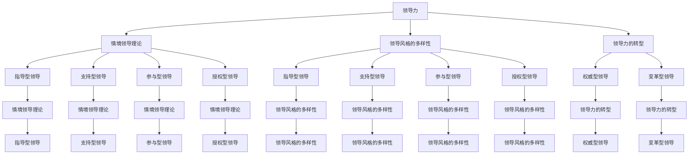
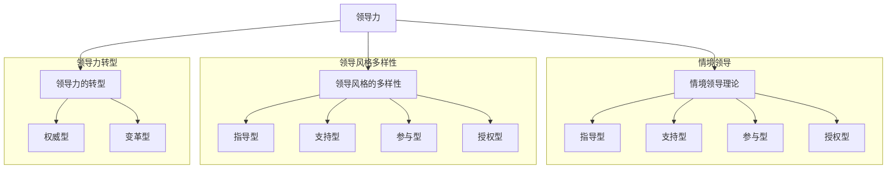

                 

## 背景介绍

### 领导力的重要性

领导力，作为一种关键的软技能，对于组织的发展和个人的职业生涯都有着至关重要的影响。在一个快速变化、竞争激烈的商业环境中，领导者不仅需要具备优秀的组织和管理能力，更重要的是要具备预见未来趋势的能力，即远见。

领导力的本质在于激发和引导团队，实现共同的目标。一个优秀的领导者能够有效地激励团队成员，使其发挥出最大的潜力，从而推动组织实现卓越的业绩。此外，领导力还体现在危机管理、战略规划、文化建设等多个方面。

### 远见能力的重要性

远见能力是领导者必备的核心素质之一。它指的是领导者对未来趋势的洞察力和预见力，能够帮助领导者识别潜在的市场机会和风险，制定出符合时代发展的战略规划。在充满不确定性和变革的时代，远见能力是组织立于不败之地的重要保障。

远见能力的培养并非一朝一夕之事，它需要领导者具备广泛的视野、敏锐的洞察力、创新的思维以及坚定的信念。通过不断的学习和实践，领导者可以逐步提升自己的远见能力，为组织的未来发展奠定坚实的基础。

### 领导力与远见的关系

领导力与远见是相辅相成的。领导力为远见提供了实施的保障，而远见则为领导力提供了明确的方向。一个具备远见能力的领导者能够在复杂多变的环境中找到机遇，抓住先机，带领团队不断前进。

同时，领导力与远见之间也存在一定的互动关系。领导力的提升可以增强远见能力，而远见能力的提高又可以进一步强化领导力。因此，领导者需要在实践中不断探索和平衡这两者之间的关系，以实现组织的持续发展。

### 目的与结构

本文旨在深入探讨领导力与远见之间的关系，以及如何培养和提高远见能力。文章将分为三个主要部分：

第一部分将介绍领导力的核心理论，包括领导力的定义、重要性以及领导力与远见的关系。

第二部分将重点探讨远见能力的培养，分析预见未来趋势的重要性，并介绍培养远见能力的方法和核心要素。

第三部分将结合实际案例，分析领导力与远见在项目管理、危机管理中的应用，并总结领导力与远见的综合实战经验。

通过本文的阅读，读者将能够更深入地理解领导力与远见的重要性，掌握培养和提高远见能力的方法，从而为组织的未来发展提供有力支持。

## 核心概念与联系

### 领导力概述

#### 领导力的定义

领导力是指一种能够激发他人潜力，引领团队实现目标的能力。它不仅仅是一种职位赋予的权力，更是一种影响力和号召力。领导力涉及到多个方面，包括沟通、激励、决策、团队建设等。一个优秀的领导者能够有效地协调团队资源，解决问题，应对挑战，并在变化的环境中保持组织的稳定和持续发展。

#### 领导力的重要性

领导力对于组织的成功至关重要。一个缺乏领导力的团队很难实现共同的目标，也难以应对外部环境的快速变化。领导力能够激发团队成员的积极性，提高工作效率，增强团队凝聚力。同时，领导力还能够塑造组织的文化，推动创新，提升组织的竞争力。

#### 领导力的两大核心要素

领导力与远见是相辅相成的，两者共同构成了领导力的核心要素。远见能力是领导者预见未来、把握机遇、应对挑战的重要素质。一个具备远见能力的领导者能够洞察市场趋势，预见潜在的风险，制定出科学的战略规划，从而为组织的未来发展奠定坚实的基础。

### 领导力的三大核心能力

领导力包括多个方面，但其中最为关键的三大能力是情境领导理论、领导风格的多样性以及领导力的转型。

#### 情境领导理论

情境领导理论是由保罗·赫塞和肯尼斯·布兰查德提出的，它认为领导风格应该根据团队成员的成熟度进行调整。成熟度指的是团队成员的能力和意愿的程度。情境领导理论将团队成员的成熟度分为四种类型：能力高意愿低、能力高意愿高、能力低意愿高、能力低意愿低。

- 对于能力高意愿低的团队成员，领导者应该采取指导型领导风格，明确任务要求和期望，提供具体的指导和支持。
- 对于能力高意愿高的团队成员，领导者应该采取支持型领导风格，鼓励自主性和创新，提供必要的资源和支持。
- 对于能力低意愿高的团队成员，领导者应该采取参与型领导风格，邀请团队成员参与决策过程，增强其责任感和参与感。
- 对于能力低意愿低的团队成员，领导者应该采取授权型领导风格，逐步提高其能力和意愿，给予适当的培训和支持。

#### 领导风格的多样性

领导风格多样性指的是领导者根据不同的情境和团队成员特点，灵活调整自己的领导风格。不同的领导风格适用于不同的情境和团队成员，一个优秀的领导者能够根据实际情况灵活运用不同的领导风格。

常见的领导风格包括：

- 指导型领导：领导者为团队成员提供明确的指导和期望，帮助团队成员完成任务。
- 支持型领导：领导者鼓励团队成员发挥自主性和创造力，提供情感支持和资源。
- 参与型领导：领导者与团队成员共同参与决策过程，增强团队凝聚力和责任感。
- 授权型领导：领导者赋予团队成员更多的权力和责任，鼓励其自主决策和承担责任。

#### 领导力的转型

领导力的转型是指从传统的权威型领导向现代的变革型领导转变。传统的权威型领导依赖于职位赋予的权力，强调控制和管理。而现代的变革型领导则更加注重激发团队成员的潜能，推动组织创新和变革。

变革型领导的核心特征包括：

- 激励与启发：领导者通过激励和启发，激发团队成员的内在动力和创造力。
- 愿景引领：领导者通过明确愿景，引领团队成员朝着共同的目标前进。
- 个人魅力：领导者通过个人魅力和影响力，赢得团队成员的信任和支持。
- 建立信任：领导者通过建立信任，创造一个开放、透明、合作的组织文化。

### 领导力的 Mermaid 流程图

为了更清晰地展示领导力的核心概念和关系，我们可以使用 Mermaid 工具绘制一个流程图。

通过这个 Mermaid 流程图，我们可以直观地理解领导力的核心概念和它们之间的关系。领导力包括了情境领导理论、领导风格的多样性和领导力的转型，这些核心能力共同构成了领导力的基础，并在不同的情境和团队中发挥作用。

## 领导力核心概念与联系：情境领导理论、领导风格的多样性、领导力的转型

### 情境领导理论

情境领导理论是保罗·赫塞和肯尼斯·布兰查德在20世纪60年代提出的，是一种基于团队成员成熟度的领导模型。该理论认为，领导者的有效性取决于他们如何适应团队成员的能力和意愿。成熟度是一个综合指标，包括个人的技能、自我管理能力、对任务的接受程度和对责任的承担能力。

情境领导理论将团队成员的成熟度分为四个层次：

1. **成熟度1（能力低，意愿低）**：这种类型的团队成员既缺乏完成任务的能力，也没有动力去做。领导者应采取指导型领导风格，即提供明确的指示和详细的任务说明，以帮助团队成员克服技能和动力上的不足。

2. **成熟度2（能力低，意愿高）**：这种团队成员有强烈的愿望去完成任务，但缺乏必要的能力。领导者应采取支持型领导风格，通过鼓励和提供必要的资源来增强团队成员的信心和技能。

3. **成熟度3（能力高，意愿低）**：这种团队成员有能力完成任务，但缺乏动机。领导者应采取参与型领导风格，与团队成员共同制定目标，并鼓励他们参与决策过程，以激发他们的内在动力。

4. **成熟度4（能力高，意愿高）**：这种团队成员既有能力也有动力去完成任务。领导者应采取授权型领导风格，给予团队成员自主权和责任，以便他们能够独立地开展工作。

### 领导风格的多样性

领导风格多样性指的是领导者根据不同的情境和团队成员特点，灵活调整自己的领导风格。不同的领导风格适用于不同的情境和团队成员，一个优秀的领导者能够根据实际情况灵活运用不同的领导风格。以下是几种常见的领导风格：

- **指导型领导风格**：领导者为团队成员提供明确的指导和支持，帮助其完成任务。这种风格适合于那些能力低、意愿低的团队成员。

- **支持型领导风格**：领导者鼓励团队成员发挥自主性和创造力，提供情感支持和资源。这种风格适合于那些能力低、意愿高的团队成员。

- **参与型领导风格**：领导者与团队成员共同参与决策过程，增强团队凝聚力和责任感。这种风格适合于那些能力高、意愿低的团队成员。

- **授权型领导风格**：领导者赋予团队成员更多的权力和责任，鼓励其自主决策和承担责任。这种风格适合于那些能力高、意愿高的团队成员。

### 领导力的转型

领导力的转型是指从传统的权威型领导向现代的变革型领导转变。传统的权威型领导依赖于职位赋予的权力，强调控制和管理。而现代的变革型领导则更加注重激发团队成员的潜能，推动组织创新和变革。

变革型领导的核心特征包括：

- **激励与启发**：领导者通过激励和启发，激发团队成员的内在动力和创造力。

- **愿景引领**：领导者通过明确愿景，引领团队成员朝着共同的目标前进。

- **个人魅力**：领导者通过个人魅力和影响力，赢得团队成员的信任和支持。

- **建立信任**：领导者通过建立信任，创造一个开放、透明、合作的组织文化。

### 核心概念与联系：情境领导理论、领导风格的多样性、领导力的转型

情境领导理论、领导风格的多样性以及领导力的转型是领导力的三大核心概念，它们之间存在着紧密的联系。

- **情境领导理论**为领导者提供了根据团队成员成熟度调整领导风格的方法，是领导风格多样性的理论基础。

- **领导风格的多样性**则是情境领导理论在实际应用中的具体体现，领导者需要根据不同的情境和团队成员特点灵活调整领导风格。

- **领导力的转型**则是在传统领导力基础上的一种进化，它强调领导者需要从权威型领导向变革型领导转变，以适应不断变化的外部环境。

### Mermaid 流程图

为了更直观地展示这些核心概念与联系，我们可以使用 Mermaid 工具绘制一个流程图。

这个 Mermaid 流程图展示了领导力的核心概念和它们之间的相互关系。通过这样的结构化展示，读者可以更清晰地理解领导力的本质及其在不同情境下的应用。

## 领导力的三大核心能力：情境领导理论、领导风格的多样性、领导力的转型

### 情境领导理论

情境领导理论是由保罗·赫塞和肯尼斯·布兰查德在1969年提出的，它主张领导者的有效性取决于如何根据团队成员的成熟度来调整领导风格。成熟度是指团队成员在执行任务时，既包括其技能水平，也包括其工作动机。

**情境领导理论的核心观点**：

1. **能力-意愿模型**：情境领导理论将团队成员分为四种类型，根据其能力和意愿的不同，采取不同的领导风格：
   - **能力低、意愿低**：指导型领导风格。领导者提供明确的指导和详细的任务说明，帮助团队成员克服技能和动力不足。
   - **能力低、意愿高**：支持型领导风格。领导者鼓励团队成员，提供必要资源，增强其信心和技能。
   - **能力高、意愿低**：参与型领导风格。领导者与团队成员共同制定目标，鼓励他们参与决策过程，提高其内在动力。
   - **能力高、意愿高**：授权型领导风格。领导者赋予团队成员更多的自主权和责任，让他们独立地开展工作。

**实际应用中的优势**：

- **提高团队效能**：根据团队成员的特点，采用合适的领导风格，有助于提高团队成员的工作效率和工作满意度。
- **促进个人成长**：情境领导理论鼓励团队成员根据自身能力不断提升，从而促进个人的职业发展。

### 领导风格的多样性

领导风格的多样性指的是领导者能够根据不同的情境和团队成员特点，灵活调整自己的领导风格。不同的领导风格适用于不同的情境和团队成员，一个优秀的领导者能够根据实际情况灵活运用不同的领导风格。

**常见的领导风格**：

1. **指导型领导风格**：领导者为团队成员提供明确的指导和期望，帮助他们完成任务。
2. **支持型领导风格**：领导者鼓励团队成员发挥自主性和创造力，提供情感支持和资源。
3. **参与型领导风格**：领导者与团队成员共同参与决策过程，增强团队凝聚力和责任感。
4. **授权型领导风格**：领导者赋予团队成员更多的权力和责任，鼓励他们自主决策和承担责任。

**实际应用中的优势**：

- **适应性强**：领导者能够根据不同的情境和团队成员特点，灵活调整领导风格，提高团队的整体表现。
- **提高团队凝聚力**：通过参与型领导和授权型领导，增强团队成员的参与感和责任感，从而提高团队的凝聚力。

### 领导力的转型

领导力的转型是指从传统的权威型领导向现代的变革型领导转变。传统的权威型领导依赖于职位赋予的权力，强调控制和管理。而现代的变革型领导则更加注重激发团队成员的潜能，推动组织创新和变革。

**变革型领导的核心特征**：

1. **激励与启发**：领导者通过激励和启发，激发团队成员的内在动力和创造力。
2. **愿景引领**：领导者通过明确愿景，引领团队成员朝着共同的目标前进。
3. **个人魅力**：领导者通过个人魅力和影响力，赢得团队成员的信任和支持。
4. **建立信任**：领导者通过建立信任，创造一个开放、透明、合作的组织文化。

**实际应用中的优势**：

- **促进创新**：变革型领导鼓励团队成员提出新的想法和解决方案，从而推动组织创新。
- **提高员工满意度**：变革型领导注重员工的发展和成长，提高员工的工作满意度和忠诚度。

### 总结

领导力的三大核心能力——情境领导理论、领导风格的多样性和领导力的转型，共同构成了现代领导力的基础。通过理解并灵活运用这些核心能力，领导者可以更有效地激发团队成员的潜力，推动组织实现卓越的业绩。

## 领导力核心概念与联系：Mermaid 流程图

为了更直观地展示领导力核心概念与联系，我们可以使用Mermaid工具绘制一个流程图。以下是领导力的核心概念与联系，包括情境领导理论、领导风格的多样性和领导力的转型，通过Mermaid流程图呈现：

此流程图展示了领导力的核心概念及其相互关系。情境领导理论根据团队成员的成熟度，分为指导型、支持型、参与型和授权型四种领导风格。领导风格的多样性则强调在不同情境下灵活运用这些领导风格。领导力的转型从传统的权威型向现代的变革型转变，强调激励与启发、愿景引领、个人魅力和建立信任。

通过Mermaid流程图，我们可以清晰地理解领导力的核心概念及其应用场景，从而在实际工作中更好地发挥领导力，提升团队绩效。

## 领导力核心概念与联系：情景领导理论、领导风格的多样性、领导力的转型

### 情境领导理论

**定义**：情境领导理论，由保罗·赫塞和肯尼斯·布兰查德提出，是一种基于团队成员成熟度的领导模型。它认为领导者的有效性与团队成员的成熟度密切相关，成熟度包括团队成员的工作能力和工作意愿。

**核心要素**：
1. **团队成员的成熟度**：包括四个层次：能力低、意愿低；能力低、意愿高；能力高、意愿低；能力高、意愿高。
2. **领导风格**：根据团队成员的成熟度，领导者需要采取不同的领导风格：
   - **指导型领导**：对能力低、意愿低的团队成员提供详细的任务说明和指导。
   - **支持型领导**：对能力低、意愿高的团队成员提供鼓励和资源。
   - **参与型领导**：对能力高、意愿低的团队成员参与决策过程，鼓励其发挥自主性。
   - **授权型领导**：对能力高、意愿高的团队成员给予自主权和责任，鼓励其独立工作。

**优势**：
- **提高团队效率**：通过适应团队成员的成熟度，提高团队成员的工作效率和满意度。
- **促进团队成员成长**：帮助团队成员根据自身能力不断提升，促进个人职业发展。

### 领导风格的多样性

**定义**：领导风格的多样性指的是领导者根据不同的情境和团队成员特点，灵活调整自己的领导风格。这种多样性包括但不限于指导型、支持型、参与型和授权型领导。

**核心要素**：
1. **情境**：不同的情境（如团队面临的项目、组织文化、工作环境等）可能需要不同的领导风格。
2. **团队成员特点**：团队成员的个性、经验和能力也会影响领导风格的选择。

**优势**：
- **适应性强**：领导者能够根据不同情境和团队成员特点，灵活运用不同的领导风格。
- **提高团队凝聚力**：通过不同领导风格的应用，增强团队成员的参与感和责任感，提高团队凝聚力。

### 领导力的转型

**定义**：领导力的转型指的是从传统的权威型领导向现代的变革型领导转变。变革型领导强调领导者通过激励和启发团队成员，推动组织创新和变革。

**核心要素**：
1. **愿景引领**：领导者通过明确愿景，激励团队成员朝着共同的目标前进。
2. **个人魅力**：领导者通过个人魅力和影响力，赢得团队成员的信任和支持。
3. **建立信任**：领导者通过建立信任，创造一个开放、透明、合作的组织文化。

**优势**：
- **促进创新**：变革型领导鼓励团队成员提出新的想法和解决方案，推动组织创新。
- **提高员工满意度**：变革型领导注重员工的发展和成长，提高员工的工作满意度和忠诚度。

### Mermaid 流程图

为了更直观地展示这些核心概念与联系，我们可以使用Mermaid工具绘制一个流程图：

此流程图展示了领导力的三大核心概念与联系，以及它们之间的相互作用。通过这样的结构化展示，读者可以更清晰地理解领导力的本质及其在不同情境下的应用。

## 远见能力的核心要素

远见能力是领导者预见未来、把握机遇、应对挑战的重要素质。它不仅要求领导者具备敏锐的观察力和深刻的洞察力，还需要他们拥有创新的思维、适应能力以及良好的风险评估与应对策略。以下是远见能力的核心要素及其具体内涵：

### 观察力

观察力是指领导者对周围环境和趋势的敏锐感知能力。一个具备良好观察力的领导者能够及时捕捉到市场变化、技术进步、政策调整等外部因素，从而为组织制定出前瞻性的战略规划。

**具体内涵**：

- **市场趋势**：领导者需要关注市场需求的变化，了解消费者行为和购买习惯的变迁，以便提前调整产品和服务策略。
- **技术进步**：领导者需要关注新技术的发展，评估其对行业的影响，以及如何将这些技术应用于组织的创新和改进。
- **政策法规**：领导者需要关注国家和地区的政策法规变化，确保组织的运营符合法规要求，并抓住政策带来的机遇。

### 洞察力

洞察力是指领导者对复杂现象和趋势的深入理解能力。它要求领导者能够从现象中看到本质，从表面问题中发现潜在的机会和风险。

**具体内涵**：

- **趋势预测**：领导者需要通过对历史数据和现有信息的分析，预测未来趋势，并制定相应的应对策略。
- **问题解决**：领导者需要具备发现问题的能力，能够从问题的表象中挖掘出根本原因，并提出有效的解决方案。
- **战略规划**：领导者需要具备将洞察力转化为战略规划的能力，确保组织能够抓住机遇，规避风险。

### 创新思维

创新思维是指领导者在新思路、新方法、新解决方案上的创造能力。它要求领导者敢于突破传统思维模式，勇于尝试新的方法，从而推动组织的创新和变革。

**具体内涵**：

- **思维模式**：领导者需要摆脱固有的思维定式，培养开放、包容和创新性的思维模式。
- **创新方法**：领导者需要掌握多种创新方法，如头脑风暴、设计思维、敏捷开发等，以应对不同情境下的创新需求。
- **团队激励**：领导者需要激发团队成员的创新潜力，建立鼓励创新的文化氛围，使创新成为组织发展的驱动力。

### 适应能力

适应能力是指领导者应对不确定性、变化和挑战的能力。它要求领导者具备灵活的思维和行动能力，能够在不确定的环境中保持组织的稳定和发展。

**具体内涵**：

- **应变策略**：领导者需要根据环境和情境的变化，灵活调整战略和行动计划，确保组织能够迅速应对变化。
- **资源整合**：领导者需要具备整合内外部资源的能力，以支持组织在变化中的需求。
- **团队协作**：领导者需要建立高效的团队协作机制，确保团队成员在变化中能够协同作战，共同应对挑战。

### 风险评估与应对策略

风险评估与应对策略是指领导者对潜在风险进行识别、评估，并制定相应的应对措施。它要求领导者具备风险管理的意识和能力，确保组织在面临风险时能够及时应对，降低风险带来的损失。

**具体内涵**：

- **风险识别**：领导者需要通过系统的方法，如SWOT分析、风险评估矩阵等，识别潜在的内部和外部风险。
- **风险评估**：领导者需要对识别出的风险进行评估，确定其可能性和影响程度，以便制定有针对性的应对策略。
- **风险应对**：领导者需要制定详细的应对计划，包括风险缓解、风险转移和风险接受等策略，确保在风险发生时能够迅速行动。

通过培养和提升远见能力的核心要素，领导者可以更好地预见未来趋势，把握机遇，应对挑战，从而推动组织的持续发展和成功。

### 观察力与洞察力的关系

观察力与洞察力是远见能力中的两个核心要素，它们之间存在着紧密的联系和相互作用。

首先，观察力是洞察力的基础。一个具备良好观察力的领导者能够敏锐地捕捉到周围环境中的变化和信号。这些变化和信号可能包括市场趋势、技术进步、政策法规等，它们为领导者提供了丰富的信息资源。通过持续的观察，领导者能够积累大量的数据和经验，为后续的洞察提供基础。

其次，洞察力是观察力的升华。在观察的基础上，领导者需要运用洞察力对所观察到的现象进行深入分析和理解。洞察力帮助领导者从复杂的信息中提炼出关键点，看到事物的本质和内在联系。例如，一个领导者可能会观察到某个市场正在快速增长，但只有通过洞察力，他才能理解这一增长背后的驱动因素，如消费者需求的变化、技术创新的推动等。

观察力与洞察力之间的互动关系表现为以下两个方面：

1. **相互促进**：观察力的提升有助于增强洞察力，因为更多的观察经验能够为洞察提供更多的素材。同样，洞察力的提高可以指导观察，使领导者更加关注那些可能影响未来的关键因素。例如，一个具备强大洞察力的领导者可能会特别关注某个新兴技术，因为他对这个技术有深刻的理解，知道它可能对未来市场产生重大影响。

2. **相互校正**：观察力和洞察力之间的互动还可以帮助领导者校正彼此的不足。如果观察力过于表面化，缺乏深度，那么洞察力可能会受到限制。相反，如果洞察力过于偏重于理论分析，而忽视了实际观察，那么洞察力可能无法与实际情况相结合。通过观察与洞察的相互校正，领导者可以更全面、准确地把握未来的发展趋势。

为了更好地理解观察力与洞察力的关系，我们可以通过以下例子来说明：

**例子：市场营销中的观察力与洞察力**

假设一个市场营销领导者观察到某个市场的消费者需求正在发生变化，这可能是由于新产品、新技术或者消费者偏好的变化。这个观察提供了初步的信息，但不足以制定有效的营销策略。

- **观察力**：领导者观察到消费者正在购买更多健康食品，这一现象引起了他的关注。
- **洞察力**：通过深入分析，领导者发现消费者对健康饮食的关注增加是由于健康意识的提升、生活节奏加快以及媒体对健康问题的广泛报道。这一洞察力帮助领导者理解了消费者需求变化的根本原因。

有了这个洞察力，领导者可以制定更加精准的营销策略，如开发健康食品品牌、与健康媒体合作推广等，从而更好地满足消费者的需求，提升市场份额。

总之，观察力与洞察力是远见能力中不可或缺的两个要素，它们相辅相成，共同构成了领导者预见未来、把握机遇的重要基础。

### 创新思维与适应能力的互动关系

创新思维与适应能力是领导者远见能力的两个重要组成部分，它们之间的互动关系对于应对快速变化的环境、抓住机遇和推动组织发展至关重要。

首先，创新思维是指领导者在新思路、新方法、新解决方案上的创造性思考能力。它要求领导者不拘泥于传统模式，敢于挑战现状，勇于尝试新的方法。创新思维能够激发团队的创造力，推动组织的变革和发展。

**创新思维的具体作用**：

1. **推动组织变革**：创新思维帮助领导者发现并利用新的机会，从而推动组织进行必要的变革。例如，在技术日新月异的时代，领导者需要通过创新思维来引导组织采纳新技术，以保持竞争力。
2. **提升竞争力**：创新思维能够帮助组织在市场中找到独特的定位，开发出具有差异化的产品或服务，从而提升竞争力。
3. **促进团队合作**：创新思维鼓励团队成员积极参与，提出新的想法和解决方案，增强团队的凝聚力和协作能力。

其次，适应能力是指领导者应对不确定性、变化和挑战的能力。它要求领导者具备灵活的思维和行动能力，能够在不确定的环境中保持组织的稳定和发展。

**适应能力的作用**：

1. **应对变化**：适应能力使领导者能够在环境发生变化时迅速做出反应，调整战略和行动，确保组织能够及时应对外部环境的变化。
2. **风险管理**：适应能力帮助领导者识别和应对潜在的风险，降低不确定性带来的负面影响。
3. **保持组织活力**：适应能力使组织能够持续适应外部环境的变化，保持组织的活力和竞争力。

**创新思维与适应能力的互动关系**：

1. **相互促进**：创新思维为适应能力提供了新的思路和解决方案，使领导者能够更好地应对变化。例如，当市场环境发生变化时，领导者通过创新思维提出新的业务模式或产品，然后通过适应能力迅速实施这些创新，从而保持组织的竞争力。

2. **相互校正**：适应能力可以为创新思维提供实际反馈，帮助领导者评估创新的有效性和可行性。例如，一个创新思维提出的方案可能在实际应用中遇到困难，这时适应能力可以帮助领导者及时调整方案，确保其成功实施。

**案例说明**：

以一家高科技公司为例，该公司在面临市场竞争加剧和技术变革的挑战时，领导者通过创新思维提出了开发新产品的战略。通过引入新的技术和创新的设计理念，公司成功开发出了一款市场反应热烈的新产品。然而，在产品推出后的市场测试阶段，公司发现消费者对某些功能的需求没有预期那么高。这时，领导者通过适应能力及时调整了产品功能，优化了用户体验，最终使新产品在市场上取得了成功。

总之，创新思维与适应能力是领导者远见能力的两个关键要素，它们相互促进、相互校正，共同帮助领导者应对快速变化的环境，抓住机遇，推动组织的持续发展和成功。

### 远见能力的核心要素：风险评估与应对策略

风险评估与应对策略是远见能力的核心要素之一，对于领导者预见未来、规避风险、确保组织稳定发展至关重要。有效的风险评估和应对策略不仅可以帮助领导者识别潜在的风险，还可以制定出切实可行的应对措施，降低风险带来的负面影响。

**风险评估的过程**：

1. **识别风险**：首先，领导者需要通过系统的方法识别潜在的内部和外部风险。内部风险可能包括运营问题、人力资源问题、财务管理问题等；外部风险可能包括市场变化、政策法规、经济环境等。常用的识别方法包括SWOT分析、PEST分析等。

2. **评估风险**：在识别风险后，领导者需要对每个风险进行评估，确定其可能性和影响程度。可能性是指风险事件发生的概率，影响程度是指风险事件对组织的影响范围和程度。评估方法包括定性评估和定量评估，如风险评估矩阵、风险概率和影响矩阵等。

3. **优先级排序**：根据风险评估结果，将风险按照优先级进行排序，重点关注那些高可能性、高影响程度的风险，以确保有限的资源和精力能够被有效利用。

**应对策略的制定**：

1. **风险缓解**：对于高优先级的风险，领导者需要制定缓解措施，以降低风险发生的可能性和影响程度。缓解措施可能包括调整战略、加强内部控制、增加保险等。

2. **风险转移**：某些风险可以通过转移给第三方来降低组织自身承担的风险。例如，通过外包、合作、保险等方式将风险转移给其他机构或个人。

3. **风险接受**：对于某些不可避免或成本过高的风险，领导者可能选择接受风险，并制定相应的应对措施以减轻风险发生时的损失。例如，制定应急计划、建立备份系统等。

**实际应用中的例子**：

以一家电子商务公司为例，该公司面临以下风险：

- **市场风险**：市场竞争激烈，新进入者不断增多，可能导致市场份额下降。
- **技术风险**：技术更新速度快，如果公司不能及时跟上技术变革，可能导致产品过时，影响竞争力。
- **法律风险**：政策法规不断变化，特别是涉及数据隐私和消费者权益的法规，可能导致公司面临法律诉讼。

**风险评估与应对策略**：

1. **识别风险**：通过SWOT分析，公司识别出市场风险、技术风险和法律风险。

2. **评估风险**：使用风险评估矩阵，公司评估这些风险的可能性和影响程度，发现市场风险的可能性高且影响程度大。

3. **优先级排序**：将市场风险作为优先级最高的风险。

4. **风险缓解**：公司通过推出新产品、改善用户体验来提升竞争力，通过加强研发团队的技术培训来保持技术优势。

5. **风险转移**：公司购买商业保险，以降低法律风险带来的损失。

6. **风险接受**：对于不可避免的风险，公司制定详细的应急预案，确保在风险发生时能够迅速应对，减少损失。

通过有效的风险评估与应对策略，公司能够更好地预见和应对未来可能的风险，确保组织的稳定发展和长期成功。

### 远见能力的核心要素：观察力、洞察力、创新思维、适应能力、风险评估与应对策略

远见能力是领导者预见未来、把握机遇、应对挑战的重要素质。它不仅要求领导者具备敏锐的观察力，还需要他们拥有深刻的洞察力、创新的思维、良好的适应能力和有效的风险评估与应对策略。以下是这些核心要素的详细解释及它们在领导力中的作用。

**1. 观察力**

观察力是远见能力的基础，它要求领导者具备敏锐的感知能力，能够及时捕捉到周围环境和趋势的变化。通过持续地观察市场、技术、政策等方面的动态，领导者可以收集到大量的信息，为后续的分析和决策提供依据。观察力不仅包括对当前形势的感知，还包括对潜在趋势的预判，从而帮助领导者制定前瞻性的战略规划。

**2. 洞察力**

洞察力是远见能力的升华，它要求领导者能够从复杂的现象中看到本质，从表面的变化中捕捉到深层次的趋势。通过深入分析数据和情境，领导者可以预见未来的发展方向，发现潜在的机会和风险。洞察力使领导者能够超越短期的波动，把握长期的趋势，从而为组织制定科学、有效的战略。

**3. 创新思维**

创新思维是远见能力的重要组成部分，它要求领导者具备创造性思考的能力，能够提出新的想法和方法，推动组织变革和发展。创新思维不仅包括对现有技术和方法的改进，还包括对全新业务模式和市场机会的探索。通过创新思维，领导者可以不断推动组织的创新，提升竞争力，抓住市场先机。

**4. 适应能力**

适应能力是远见能力中的重要因素，它要求领导者具备灵活的思维和行动能力，能够迅速应对环境变化和不确定性。在快速变化的市场环境中，领导者需要具备快速调整策略、灵活应对挑战的能力。适应能力使领导者能够在变化中保持组织的稳定，抓住机遇，规避风险。

**5. 风险评估与应对策略**

风险评估与应对策略是远见能力的关键要素，它要求领导者具备识别、评估和管理风险的能力。通过系统的方法识别潜在的内部和外部风险，并对其进行评估和优先级排序，领导者可以制定出有效的应对策略。有效的风险评估和应对策略可以帮助组织在面临风险时迅速行动，降低损失，确保组织的长期稳定和发展。

**6. 核心要素的互动关系**

这些核心要素相互联系、相互促进，共同构成了领导力的远见能力。观察力和洞察力提供了信息和数据基础，创新思维和适应能力则是在这些基础上进行的深入分析和创造性应用。风险评估与应对策略则是在实践中的具体应用，确保领导者能够在面对未来挑战时具备充分的准备和应对能力。

**总结**

远见能力是领导者成功的关键素质，通过培养和提升观察力、洞察力、创新思维、适应能力和风险评估与应对策略，领导者可以更好地预见未来、把握机遇、应对挑战，从而推动组织的持续发展和成功。

## 培养远见能力的方法

培养远见能力是每个领导者都需要面对的重要任务。以下将介绍几种具体的方法，帮助领导者提升自己的远见能力，包括自我反思与学习、实践与经验分享以及建立个人学习网络。

### 自我反思与学习

自我反思是提升远见能力的重要途径。通过定期回顾自己的行为和决策，领导者可以识别成功和失败的原因，从中吸取经验和教训。以下是一些自我反思的具体方法：

1. **定期写日记**：领导者可以每天或每周写日记，记录自己的思考和感受。这种做法有助于领导者更好地理解自己的思维模式和行为习惯。

2. **与导师交流**：寻找一位经验丰富的导师，定期与其交流，探讨自己在领导和管理中的困惑和挑战。导师的建议和指导可以帮助领导者看到问题的不同角度，从而提升远见能力。

3. **学习先进理论**：领导者可以通过阅读相关书籍、参加研讨会和培训课程，学习先进的领导理论和远见实践。例如，了解情境领导理论、变革型领导理论等，这些理论可以为领导者的实践提供有力的指导。

### 实践与经验分享

实践是提升远见能力的最佳途径。通过实际操作和经验积累，领导者可以更深刻地理解远见能力在现实中的应用。以下是一些实践与经验分享的方法：

1. **参与实际项目**：领导者可以积极参与组织的实际项目，通过具体的工作实践，锻炼自己的远见能力。在项目中，领导者需要面对各种挑战和不确定性，这是培养远见能力的重要机会。

2. **交流经验**：与同行和其他领域的领导者进行经验交流，可以帮助领导者拓宽视野，学习不同的领导和管理方法。可以通过参加行业会议、加入专业组织或参与在线论坛等方式进行交流。

3. **反思失败**：领导者应该敢于面对失败，从失败中吸取教训。每次失败都是一次宝贵的学习机会，通过反思失败，领导者可以更好地理解自己的不足，并找到改进的方向。

### 建立个人学习网络

建立个人学习网络是提升远见能力的重要手段。通过与其他专业人士和专家建立联系，领导者可以获取更多的信息和资源，从而提升自己的远见能力。以下是一些建立个人学习网络的方法：

1. **加入专业组织**：加入与自己领域相关的专业组织，可以结识到行业内的专业人士和专家。这些组织通常会定期举办研讨会、培训课程和交流活动，为领导者提供了宝贵的学习机会。

2. **建立学习小组**：与一群志同道合的人组成学习小组，定期进行讨论和分享。这种小组可以是一个线上或线下的组织，成员可以互相学习、交流和分享经验。

3. **利用社交媒体**：利用社交媒体平台，如LinkedIn、Twitter等，关注行业内的知名人士和专家。通过阅读他们的文章、观看他们的演讲和参与讨论，领导者可以不断学习新的知识和观点。

### 持续学习的重要性

持续学习是提升远见能力的关键。在一个快速变化的世界中，领导者需要不断更新自己的知识和技能，以适应新的挑战和机遇。以下是一些持续学习的重要性：

1. **保持好奇心**：好奇心是持续学习的驱动力。领导者应该保持对新知识和新领域的兴趣，不断探索和求知。

2. **适应变化**：领导者需要具备快速适应变化的能力。通过持续学习，领导者可以及时掌握新的技术和方法，从而更好地应对变化。

3. **提升竞争力**：持续学习可以提升领导者的专业能力和领导力，增强其在组织和行业中的竞争力。

通过自我反思与学习、实践与经验分享以及建立个人学习网络，领导者可以不断提升自己的远见能力，为组织的未来发展奠定坚实的基础。

### 持续学习的策略与实践

持续学习是提升领导力与远见能力的关键因素。以下将介绍几种有效的持续学习策略和实践，帮助领导者不断提升自己的技能和知识。

**1. 制定个人学习计划**

- **目标明确**：领导者应明确自己的学习目标，如提升某一特定领域的专业知识、学习新的领导技能等。
- **时间规划**：合理安排学习时间，如每天阅读一定时间的专业书籍，每周参加一次线上或线下培训课程等。
- **持续跟踪**：定期回顾学习进度，确保学习计划得到有效执行。

**2. 利用在线学习资源**

- **在线课程**：利用互联网平台，如Coursera、edX、Udemy等，参加各种在线课程，获取最新的知识和技能。
- **专业论坛**：参与行业论坛、社交媒体群组等，与同行交流和分享经验，拓展自己的视野。
- **专业书籍**：定期阅读专业书籍，特别是那些具有深远影响力的经典著作，以加深对某一领域的理解。

**3. 参与行业研讨会和培训**

- **研讨会**：参加行业研讨会，了解行业最新动态和技术趋势，与专家和同行进行深入交流。
- **培训课程**：参加专业培训课程，如领导力发展课程、战略规划培训等，系统提升自己的专业能力。

**4. 实践与反思**

- **实际项目**：通过参与组织的实际项目，将所学知识应用到实践中，锻炼自己的能力。
- **反思总结**：在项目结束后，进行反思总结，分析成功和失败的原因，从中吸取经验和教训。

**5. 建立学习小组**

- **组建团队**：与一群志同道合的人组成学习小组，定期进行讨论和分享，互相学习和支持。
- **知识共享**：通过学习小组，成员可以分享自己的学习心得和经验，相互启发，共同进步。

**6. 培养阅读习惯**

- **定期阅读**：每天或每周安排一定时间进行阅读，特别是专业书籍和行业报告，以保持对最新知识的敏感度。
- **主题阅读**：针对某一特定主题进行集中阅读，深入了解该领域的知识和观点。

通过以上策略和实践，领导者可以持续提升自己的技能和知识，增强自己的领导力和远见能力，从而为组织的未来发展提供有力支持。

## 领导力与远见在项目管理中的应用

### 项目管理的挑战

在项目管理中，领导力与远见起着至关重要的作用。现代项目管理面临着诸多挑战，如复杂的技术环境、快速变化的市场需求、预算限制、时间压力等。这些挑战要求项目经理具备卓越的领导力和远见能力，以有效应对各种不确定性，确保项目目标的实现。

**1. 复杂的技术环境**：随着技术的飞速发展，项目经理需要具备前沿技术的知识，以便在项目中应用最合适的技术解决方案。例如，人工智能、大数据、云计算等技术的应用，不仅要求项目经理具备相关的技术背景，还需要他们具备预测技术发展趋势的能力。

**2. 快速变化的市场需求**：市场需求的变化往往非常迅速，项目经理需要具备敏锐的市场洞察力，及时调整项目计划和策略，以适应市场变化。例如，一个新产品在市场上的反应可能与预期完全不同，项目经理需要迅速做出决策，调整产品特性或市场策略。

**3. 预算限制**：项目预算往往是有限的，项目经理需要在预算范围内实现项目目标。这就要求他们具备优秀的财务管理和成本控制能力，同时还需要具备预见未来成本变化的能力，以确保项目能够在预算内完成。

**4. 时间压力**：项目往往需要在严格的时间限制内完成，项目经理需要制定合理的项目进度计划，并确保项目团队能够按时完成任务。时间压力要求项目经理具备良好的时间管理能力和危机处理能力，以便在项目遇到问题时能够迅速应对。

### 领导力在项目中的角色

在项目管理中，领导力发挥着关键作用。一个优秀的项目经理不仅需要具备技术和管理能力，还需要具备卓越的领导力，以激发团队成员的潜力，推动项目成功。

**1. 激励团队成员**：项目经理需要通过激励措施，激发团队成员的积极性和创造力。例如，通过设置合理的奖励机制、提供职业发展机会等，增强团队成员的工作动力。

**2. 建立团队文化**：项目经理需要建立积极向上的团队文化，鼓励团队成员之间的合作和沟通。一个良好的团队文化能够提高团队的整体效能，促进项目的顺利进行。

**3. 解决冲突**：项目团队在合作过程中难免会出现冲突，项目经理需要具备良好的沟通和冲突解决能力，及时化解团队内部的矛盾，确保项目能够顺利进行。

**4. 制定清晰的目标和计划**：项目经理需要制定明确的项目目标和详细的实施计划，确保团队成员对项目有清晰的认识，并能够按照计划高效地开展工作。

### 远见能力在项目规划中的作用

远见能力在项目规划中起着至关重要的作用。一个具备远见能力的项目经理能够预见未来的变化和挑战，为项目制定出更加科学和可行的计划。

**1. 预测技术趋势**：项目经理需要具备预测技术发展趋势的能力，以便在项目规划阶段选择最适合的技术方案。例如，通过分析人工智能技术的未来发展趋势，项目经理可以选择是否在项目中应用这一技术。

**2. 识别潜在风险**：项目经理需要具备识别潜在风险的能力，以便在项目规划阶段制定出相应的风险应对策略。例如，通过预测市场需求的变化，项目经理可以提前制定出应对市场波动的策略。

**3. 制定灵活的应对策略**：项目经理需要具备制定灵活的应对策略的能力，以便在项目执行过程中应对各种不确定性。例如，通过制定多种应对方案，项目经理可以确保在项目遇到问题时能够迅速调整计划，确保项目目标的实现。

### 实际案例分析

**案例一：某高科技公司的项目规划**

某高科技公司计划开发一款智能家居产品，项目经理通过以下步骤进行项目规划和执行：

1. **预测技术趋势**：项目经理分析了人工智能、物联网和智能家居市场的未来发展趋势，确定了项目中应用的关键技术。

2. **识别潜在风险**：项目经理通过市场调研和竞争分析，识别出潜在的市场竞争风险和技术实现风险，并制定了相应的应对策略。

3. **制定灵活的应对策略**：项目经理制定了多种应对方案，包括调整产品特性、优化技术实现路径等，以确保项目在遇到问题时能够迅速调整。

4. **激励团队成员**：项目经理通过设置奖励机制、提供职业发展机会等方式，激发团队成员的积极性和创造力。

5. **建立团队文化**：项目经理通过定期团队建设活动和沟通机制，建立了一个积极向上、合作共赢的团队文化。

通过以上措施，项目经理成功地完成了智能家居产品的开发，并在市场上取得了成功。

**案例二：某建筑公司的项目管理**

某建筑公司负责一项大型基础设施建设项目，项目经理通过以下步骤进行项目管理和执行：

1. **预测技术趋势**：项目经理分析了建筑施工技术的未来发展趋势，选择了最先进的施工技术和设备。

2. **识别潜在风险**：项目经理通过风险评估，识别出可能的预算超支、工期延误等风险，并制定了相应的应对策略。

3. **制定灵活的应对策略**：项目经理制定了多种预算和工期调整方案，以确保项目能够在预算和时间内完成。

4. **解决冲突**：项目经理通过有效的沟通和协商，解决了团队内部的矛盾和冲突，确保项目顺利进行。

5. **建立团队文化**：项目经理通过定期团队建设活动和沟通机制，建立了一个积极向上、合作共赢的团队文化。

通过以上措施，项目经理成功地完成了大型基础设施建设项目，并在客户和行业内赢得了良好的口碑。

总之，领导力与远见在项目管理中起着至关重要的作用。通过有效运用领导力和远见能力，项目经理可以更好地应对项目中的挑战，确保项目的成功实施和目标的实现。

## 领导力与远见在危机管理中的应用

### 危机管理的挑战

在现代社会，危机管理成为组织管理中不可或缺的一部分。随着全球化和技术进步的加速，组织面临着日益复杂和不确定的外部环境，危机管理的重要性日益凸显。危机管理面临的挑战主要包括以下几个方面：

**1. 快速变化的环境**：全球化和信息化使得市场变化速度加快，不确定因素增多。组织需要快速应对市场波动、政策变化、自然灾害等突发事件。

**2. 复杂的危机类型**：危机类型多样化，包括自然灾害、经济危机、信息安全事件、公共卫生事件等。每种危机都有其独特的特点和影响范围，组织需要制定针对性的应对策略。

**3. 资源限制**：危机管理往往需要大量的资源投入，包括人力、物力、财力等。组织需要在有限的资源下进行有效配置，确保危机管理的高效性。

**4. 影响范围广泛**：危机不仅影响组织内部，还可能对相关方，如客户、供应商、股东等产生深远影响。组织需要平衡不同利益相关者的需求，制定综合性的危机应对策略。

### 领导力在危机管理中的作用

在危机管理中，领导力发挥着关键作用。一个具备卓越领导力的领导者能够在危机中保持冷静，迅速做出决策，有效调动资源，协调各方力量，确保危机得到有效控制。

**1. 保持冷静与决策力**：危机发生时，领导者需要保持冷静，快速分析问题，做出合理的决策。领导者的决策能力直接影响到危机管理的效果。

**2. 沟通协调**：领导者需要与内部团队、外部合作伙伴、政府部门等各方进行有效沟通，确保信息的及时传递和协调行动。

**3. 资源调配**：领导者需要根据危机管理的需要，迅速调动资源，确保危机应对措施的有效实施。这包括人力、物力、财力等方面的资源配置。

**4. 维护组织稳定**：在危机中，领导者需要维护组织的稳定，确保核心业务的正常运行。同时，领导者需要稳定员工情绪，增强组织的凝聚力。

### 远见能力在危机应对中的应用

远见能力是领导者危机管理中不可或缺的素质。具备远见能力的领导者能够预见潜在危机，制定预防措施，降低危机发生的概率和影响。

**1. 预见潜在危机**：领导者需要具备预见潜在危机的能力，通过分析市场趋势、政策变化、技术发展等，识别潜在的风险。

**2. 制定预防措施**：领导者需要根据预见到的潜在危机，制定预防措施，提前做好应对准备。这包括制定应急预案、加强内部审计、完善风险管理机制等。

**3. 快速应对**：在危机发生时，领导者需要迅速启动应急预案，采取有效的应对措施，降低危机的影响。远见能力使领导者能够在危机中迅速做出决策，有效调动资源，确保危机得到及时控制。

### 实际案例分析

**案例一：某航空公司遭遇大规模航班延误**

某航空公司因天气原因遭遇大规模航班延误，影响了数千名乘客的行程。航空公司的高层领导者通过以下措施进行危机应对：

1. **保持冷静与决策力**：航空公司高层领导者迅速召开紧急会议，分析延误原因，制定应对方案。

2. **沟通协调**：领导者与机场管理部门、政府部门进行沟通，协调资源，确保乘客能够得到及时的安排。

3. **资源调配**：航空公司调动备用飞机和人力资源，确保乘客的转机安排和住宿需求。

4. **维护组织稳定**：航空公司高层领导者通过内部邮件和公告，向员工传达危机应对措施，稳定员工情绪。

5. **远见能力**：航空公司高层领导者通过分析历史数据，预测未来天气变化，提前制定应对方案，降低了危机的负面影响。

**案例二：某金融机构遭遇网络安全攻击**

某金融机构遭遇了一次严重的网络安全攻击，导致大量客户数据泄露。金融机构的领导者通过以下措施进行危机应对：

1. **预见潜在危机**：金融机构的领导者通过安全审计和风险评估，预见到了网络安全攻击的风险。

2. **制定预防措施**：金融机构提前制定了网络安全应急预案，加强了网络安全防护措施。

3. **快速应对**：网络安全攻击发生后，领导者迅速启动应急预案，关闭受影响的系统，防止数据进一步泄露。

4. **沟通协调**：领导者与公安机关、技术专家进行沟通，共同应对网络安全攻击。

5. **维护客户关系**：金融机构通过公开声明和客户沟通，确保客户了解事件的情况，并提供相应的补救措施。

通过以上案例分析，我们可以看到，领导力与远见能力在危机管理中至关重要。领导者需要通过保持冷静、沟通协调、资源调配和预见危机等方式，有效应对各种危机，确保组织的稳定和持续发展。

## 综合实战案例：领导力与远见的成功应用

### 案例一：新兴企业的发展战略

**背景**：某新兴科技公司在市场迅速崛起，但其发展过程中面临激烈的竞争和快速变化的技术环境。公司创始人兼CEO李明意识到，只有具备远见能力和卓越的领导力，公司才能在竞争中脱颖而出。

**领导力应用**：李明通过情境领导理论，根据团队成员的不同成熟度，灵活调整领导风格。他对技术团队采取指导型领导，提供明确的技术方向和详细的任务说明；对市场团队采取参与型领导，鼓励他们参与战略决策，提高团队的自主性和创新能力。

**远见应用**：李明通过持续观察市场趋势和技术发展，预见到了人工智能和大数据在未来市场中的重要性。他制定了公司的发展战略，将资源投入到这些领域，提前布局，为公司的长期发展奠定了基础。

**结果**：通过李明的领导和远见，公司成功推出了多款基于人工智能和大数据的产品，迅速在市场上占据了重要地位。公司业绩持续增长，市场份额不断扩大。

### 案例二：跨国企业的文化融合

**背景**：某跨国企业收购了一家海外公司，但由于文化差异，双方在融合过程中遇到了许多挑战。公司首席执行官王强意识到，只有通过卓越的领导力和远见能力，才能实现有效融合。

**领导力应用**：王强采取变革型领导，通过愿景引领，激发员工的积极性和创造力。他明确表达了公司对文化融合的期望，并鼓励员工积极参与，提出建议和解决方案。

**远见应用**：王强通过深入了解双方公司的文化，预见到了融合过程中的潜在问题。他提前制定了一系列文化融合策略，包括员工培训、跨部门协作和领导力培养等，以确保融合的顺利进行。

**结果**：通过王强的领导和远见，跨国企业的文化融合取得了显著成效。员工之间的合作更加紧密，公司整体业绩得到了提升，市场份额进一步扩大。

### 案例三：公益组织的可持续发展

**背景**：某公益组织致力于帮助贫困地区发展教育，但其资源有限，面临可持续发展的挑战。组织负责人赵华意识到，只有通过卓越的领导力和远见能力，组织才能长期发挥作用。

**领导力应用**：赵华通过情境领导理论，根据不同志愿者的能力和意愿，灵活调整领导风格。她对缺乏经验的志愿者采取指导型领导，提供详细的工作指导和支持；对有经验的志愿者采取参与型领导，鼓励他们参与决策，发挥更大的作用。

**远见应用**：赵华通过持续观察社会变化和政府政策，预见到了未来教育发展的趋势。她制定了组织的长期战略，将资源投入到未来有潜力的教育项目中，确保组织的可持续发展。

**结果**：通过赵华的领导和远见，公益组织在教育领域取得了显著成就，帮助了更多的贫困地区儿童接受教育。组织的资源得到有效利用，影响力不断扩大。

通过以上案例，我们可以看到，领导力与远见能力在新兴企业发展、跨国企业融合和公益组织可持续发展中发挥了重要作用。领导者通过灵活运用领导力和远见，能够应对各种挑战，推动组织实现长期成功。

## 领导力与远见的相关资源

### 学术研究资源

1. **领导力研究期刊**：如《Leadership Quarterly》、《The Leadership Explorer》等，这些期刊发表了许多关于领导力理论和实践的学术文章。

2. **远见能力研究论文**：可以通过学术数据库如Google Scholar、JSTOR等搜索相关论文，了解远见能力的最新研究成果。

3. **经典书籍**：《领导力的五项修炼》（《The Five Dysfunctions of a Team》）作者帕特里克·莱西奥尼，《领导者的语言》（《The Language of Leaders》）作者乔·吉拉等，这些书籍提供了关于领导力和远见能力的深入分析。

### 实践案例分析资源

1. **行业报告**：如麦肯锡、贝恩咨询等知名咨询公司发布的行业报告，这些报告通常包含大量企业实践案例，对领导力与远见的应用有详细的阐述。

2. **专业网站**：如LinkedIn、Harvard Business Review、Fast Company等，这些网站经常发布关于领导力和远见能力的案例分析文章。

3. **在线课程**：Coursera、edX等在线教育平台提供了许多关于领导力和远见能力的课程，包括视频讲座、案例分析等。

### 远见能力培养工具与书籍推荐

1. **工具**：
   - **SWOT分析工具**：用于识别和评估组织的优势、劣势、机会和威胁。
   - **五力分析模型**：用于分析市场竞争结构。

2. **书籍推荐**：
   - 《第五项修炼：学习型组织的艺术与实践》（《The Fifth Discipline: The Art & Practice of The Learning Organization》）作者彼得·圣吉，提供了关于学习型组织的构建和领导力的深入探讨。
   - 《远见：打造持续成功的心理韧性》（《Foresight: How to Think Like History's Greatest Strategists》），作者杰里米·里夫金，通过历史案例展示了远见能力的培养和实践。

通过利用这些资源，领导者可以不断学习和提升自己的领导力与远见能力，为组织的持续发展奠定坚实的基础。

## 结论

### 文章核心观点回顾

本文从领导力的核心理论出发，探讨了领导力与远见之间的关系，以及如何培养和提高远见能力。我们详细介绍了领导力的三大核心能力：情境领导理论、领导风格的多样性和领导力的转型。同时，我们深入分析了远见能力的核心要素，包括观察力、洞察力、创新思维、适应能力和风险评估与应对策略。通过自我反思与学习、实践与经验分享以及建立个人学习网络，领导者可以不断提升自己的远见能力。

### 领导力与远见的重要性

领导力与远见是领导者成功的关键素质。领导力帮助领导者激发团队潜力，实现组织目标；而远见能力则使领导者能够在复杂多变的环境中预见未来趋势，抓住机遇，规避风险。在一个快速变化的时代，领导者只有具备卓越的领导力和远见能力，才能引领组织持续发展和成功。

### 对读者的建议

作为读者，以下是一些建议：

1. **培养观察力和洞察力**：通过定期阅读、观察市场动态和技术进步，提升自己的观察力和洞察力。

2. **实践和创新**：将所学知识应用到实际工作中，不断尝试新的方法，培养创新思维。

3. **建立学习网络**：加入专业组织，参与行业交流，扩大自己的视野和知识面。

4. **持续学习**：保持好奇心和求知欲，不断更新自己的知识和技能。

通过这些实践，读者可以不断提升自己的领导力和远见能力，为组织的未来发展提供有力支持。

### 未来研究方向

未来的研究可以进一步探索领导力与远见能力在不同行业和领域的应用，以及如何通过数字化工具和平台提升领导力和远见能力。此外，研究如何将领导力与远见能力培养融入教育体系中，培养更多具备这些关键素质的人才，也是重要的方向。通过这些研究，我们可以更深入地理解领导力与远见能力的重要性，并为领导者提供更加有效的培养和实践方法。

---

# 附录：领导力与远见相关资源

## 学术研究资源

1. **领导力研究期刊**：
   - 《Leadership Quarterly》
   - 《The Leadership Explorer》

2. **远见能力研究论文**：
   - Google Scholar、JSTOR等学术数据库搜索相关论文。

3. **经典书籍**：
   - 《领导力的五项修炼》（《The Five Dysfunctions of a Team》）作者：帕特里克·莱西奥尼
   - 《领导者的语言》（《The Language of Leaders》）作者：乔·吉拉

## 实践案例分析资源

1. **行业报告**：
   - 麦肯锡、贝恩咨询等知名咨询公司发布的行业报告。

2. **专业网站**：
   - LinkedIn、Harvard Business Review、Fast Company等。

3. **在线课程**：
   - Coursera、edX等在线教育平台提供的相关课程。

## 远见能力培养工具与书籍推荐

1. **工具**：
   - SWOT分析工具
   - 五力分析模型

2. **书籍推荐**：
   - 《第五项修炼：学习型组织的艺术与实践》（《The Fifth Discipline: The Art & Practice of The Learning Organization》）作者：彼得·圣吉
   - 《远见：打造持续成功的心理韧性》（《Foresight: How to Think Like History's Greatest Strategists》）作者：杰里米·里夫金

通过这些资源，读者可以进一步深入学习和实践领导力与远见能力，为组织的未来发展提供有力支持。

