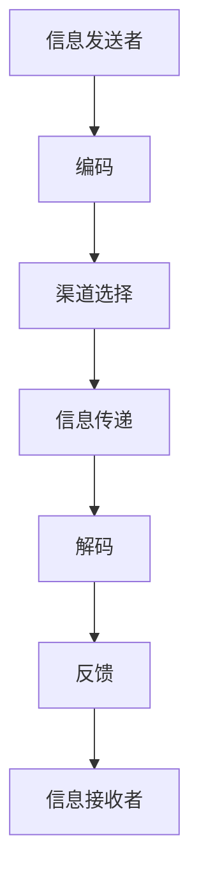

                 

### 沟通的重要性概述

在当今快速发展的信息化社会中，沟通已成为组织运作与个人发展的核心要素。无论是企业、政府机构还是教育领域，沟通都是确保信息准确传递、增强团队凝聚力、提升工作效率的关键。有效沟通能够促进协作，减少误解，增强信任，从而推动组织向前发展。

对于领导者而言，沟通更是其核心职责之一。领导者的沟通能力直接影响团队的士气和执行力，以及整个组织的战略决策和实现。清晰、简洁、有力的沟通能够帮助领导者传达愿景、明确目标，激发团队的潜力和创造力。

本文旨在探讨领导者的沟通艺术，通过深入分析沟通的本质、倾听、表达等关键要素，帮助领导者提升沟通技巧，从而在组织中获得更大的影响力。文章将从以下几个方面进行论述：

1. **沟通的本质**：介绍沟通的定义、类型以及有效沟通的关键要素。
2. **领导者沟通的独特性**：分析领导者沟通的角色与责任，探讨领导者沟通的挑战和策略。
3. **倾听的艺术**：探讨倾听的层次与技巧，强调倾听与反馈的关系。
4. **清晰表达**：介绍信息传递的清晰性、结构化表达的方法以及语言的简洁性与明确性。

在接下来的章节中，我们将逐步深入探讨这些主题，通过实际案例和具体技巧的讲解，帮助领导者掌握高效的沟通艺术。

### 目标读者和预期成果

本文的目标读者主要包括企业领导、项目经理、技术团队负责人以及其他需要频繁进行沟通的管理人员。对于这些读者来说，有效的沟通技能不仅能够提升个人的职业素养，还能显著提高团队的工作效率和组织的整体表现。

本文的预期成果是帮助读者理解沟通在领导角色中的重要性，掌握一系列实用的沟通技巧，并能够将这些技巧应用到实际工作中。通过本文的学习，读者可以期待以下成果：

1. **提升沟通意识**：认识到沟通在领导职责中的核心地位，理解有效沟通对于组织成功的重要性。
2. **增强沟通技巧**：学习并掌握倾听、表达、冲突管理等关键沟通技巧，能够在日常工作中运用这些技巧，提高沟通效果。
3. **改善团队协作**：通过有效的沟通策略，增强团队凝聚力，减少误解和冲突，提高团队工作效率和创造力。
4. **增强领导影响力**：通过清晰、简洁、有力的沟通，提高领导者的个人魅力和影响力，增强对团队的领导力和执行力。

### 书的结构安排

本文将按照以下结构安排，逐步深入探讨领导者的沟通艺术：

1. **前言**：介绍沟通的重要性以及本文的目标读者和预期成果。
2. **第一部分：沟通基础**：包括第1章至第4章，重点介绍沟通的本质、领导者沟通的独特性、倾听的艺术以及清晰表达。
   - **第1章：沟通的本质**：讨论沟通的定义、类型以及有效沟通的关键要素，并通过Mermaid流程图展示沟通的基本要素。
   - **第2章：领导者沟通的独特性**：分析领导者沟通的角色与责任，探讨领导者沟通的挑战和策略。
   - **第3章：倾听的艺术**：深入探讨倾听的层次与技巧，强调倾听与反馈的关系。
   - **第4章：清晰表达**：介绍信息传递的清晰性、结构化表达的方法以及语言的简洁性与明确性。
3. **第二部分：沟通实践**：包括第5章至第8章，主要讨论演讲技巧、团队沟通、冲突管理以及跨文化沟通。
   - **第5章：演讲技巧**：讲解演讲的准备与结构，语言与肢体语言的协调，以及演讲中的互动与控场。
   - **第6章：团队沟通**：探讨团队沟通的重要性，团队沟通的障碍与策略，以及团队沟通的有效性评估。
   - **第7章：冲突管理**：分析冲突的类型与原因，讨论冲突管理的原则与策略，并通过实际案例展示冲突解决的实践。
   - **第8章：跨文化沟通**：讨论跨文化沟通的挑战，文化差异与沟通策略，以及跨文化沟通的实际案例分析。
4. **第三部分：沟通提升**：包括第9章至第11章，主要讨论个人沟通能力提升、领导力与沟通的关系、以及危机沟通。
   - **第9章：个人沟通能力提升**：介绍自我反思与持续学习的方法，倾听与反馈的练习，以及沟通风格的适应性调整。
   - **第10章：领导力与沟通**：探讨领导力与沟通的关系，领导者的沟通影响力，以及如何通过沟通提升领导力。
   - **第11章：危机沟通**：讨论危机沟通的原则，应对危机的沟通策略，以及危机沟通的成功案例分析。
5. **附录**：包括附录A和附录B，提供沟通技巧评估工具和推荐阅读与资源。

通过以上结构安排，本文旨在为领导者提供一套系统、实用的沟通指南，帮助他们在实际工作中提升沟通效果，增强领导力和影响力。

### 第1章：沟通的本质

#### 沟通的定义与类型

沟通是一种信息传递的过程，涉及信息的发出、传递、接收和反馈。简而言之，沟通是人们通过语言、非语言和行为相互交流的过程。有效的沟通不仅仅是信息的传递，还包括对信息的理解和反馈，确保信息在发送和接收双方之间保持一致性。

从类型上划分，沟通可以分为以下几种：

1. **口头沟通**：通过语言进行的信息传递，是最直接、迅速的沟通方式。口头沟通包括会议、演讲、讨论等。
   
2. **书面沟通**：通过文字进行的信息传递，如电子邮件、报告、信件等。书面沟通具有明确的格式和记录功能，便于查询和保存。

3. **非语言沟通**：通过肢体语言、面部表情、姿态等非语言元素进行的信息传递。非语言沟通在人际互动中起着至关重要的作用，能够补充和强化口头和书面沟通。

4. **电子沟通**：通过电子设备进行的信息传递，如短信、社交媒体、视频会议等。电子沟通具有实时性和广泛性，是现代工作环境中不可或缺的沟通方式。

#### 有效沟通的关键要素

有效沟通不仅需要选择合适的沟通方式，还必须具备以下几个关键要素：

1. **明确的目标**：沟通前应明确信息的目标和受众，以确保信息的传递具有针对性和有效性。

2. **信息清晰**：信息应简洁明了，避免歧义和误解。清晰的信息有助于提高沟通效率。

3. **适当的渠道**：选择适当的沟通渠道，如面对面交流、电子邮件或视频会议，根据情况选择最合适的沟通方式。

4. **反馈机制**：建立有效的反馈机制，确保接收者能够理解和确认信息的接收。反馈有助于及时发现并纠正沟通中的问题。

5. **开放的态度**：在沟通中保持开放、诚实的态度，积极倾听对方的观点，有助于建立信任和合作关系。

#### 沟通障碍分析

尽管沟通是组织运作和个人发展的关键，但许多因素可能导致沟通障碍：

1. **语言障碍**：包括语言差异和语言表达不清。对于跨国团队或多元化团队，语言障碍尤为突出。

2. **文化差异**：不同文化背景下的价值观、沟通风格和行为模式可能存在差异，导致沟通不畅。

3. **心理障碍**：包括个人情绪、自信心不足、焦虑等，这些心理因素会影响沟通的效果。

4. **信息过载**：信息量过大或过于复杂，可能导致接收者无法有效处理和理解。

5. **技术障碍**：通信工具和设备的不稳定、技术故障等可能导致沟通中断。

#### Mermaid流程图：沟通的四个基本要素

为了更好地理解沟通的基本要素，我们可以使用Mermaid流程图来展示：

在上述流程图中，信息发送者首先将信息编码，然后选择适当的渠道进行传递。接收者接收到信息后进行解码，并给予反馈，这一过程形成一个完整的沟通循环。

通过分析沟通的本质、定义、类型以及关键要素和障碍，我们可以更好地理解沟通在领导者和组织中的重要性。在下一章中，我们将探讨领导者沟通的独特性，分析领导者在这一角色中的沟通挑战和策略。

### 第2章：领导者沟通的独特性

#### 领导者沟通的角色与责任

领导者是组织的核心人物，其沟通能力直接影响到团队的士气和整体绩效。在领导者沟通中，有三个关键的角色和责任：

1. **信息传递者**：领导者需要将组织的愿景、目标、战略和决策等信息准确传递给团队成员。这一过程不仅要求信息清晰，还需确保信息得到充分理解和执行。

2. **团队建设者**：通过有效的沟通，领导者可以增强团队的凝聚力，建立积极向上的团队文化。领导者需要通过沟通激励团队成员，提升其工作热情和创造力。

3. **冲突调解者**：领导者在团队中往往需要扮演调解者的角色，解决成员之间的冲突和误解。有效的沟通可以帮助领导者识别和缓解潜在的紧张关系，确保团队和谐发展。

#### 领导者沟通的挑战

尽管领导者沟通的角色和责任十分重要，但领导者也面临着多种沟通挑战：

1. **信息复杂性**：领导者的沟通涉及大量的复杂信息，如何将这些信息简洁明了地传达给团队成员是一个挑战。

2. **多样性管理**：在多元化团队中，领导者需要处理来自不同背景、文化和价值观的成员，这要求领导者具备较高的跨文化沟通能力。

3. **时间压力**：领导者的工作节奏通常较快，如何在有限的时间内进行有效的沟通是一个难题。

4. **情绪管理**：领导者需要具备良好的情绪管理能力，确保在高压环境中保持冷静和理性，避免负面情绪对沟通效果的影响。

#### 领导风格与沟通策略

领导风格对沟通策略有着重要的影响。不同领导风格会带来不同的沟通方式和效果。以下是几种常见的领导风格及其对应的沟通策略：

1. **权威型领导风格**：
   - **沟通策略**：强调命令与控制，直接明确地传达信息。
   - **适用场景**：在紧急情况下或需要迅速决策时，这种风格可以确保行动的一致性和速度。
   - **注意事项**：长期使用可能削弱团队自主性和创造力。

2. **参与型领导风格**：
   - **沟通策略**：鼓励团队成员参与决策过程，注重团队意见和建议。
   - **适用场景**：在需要创新和团队协作的项目中，这种风格可以激发团队成员的积极性。
   - **注意事项**：需要确保参与型沟通不导致决策过程的拖延。

3. **变革型领导风格**：
   - **沟通策略**：强调变革和愿景，通过激励和鼓舞团队实现变革目标。
   - **适用场景**：在组织面临重大变革时，这种风格有助于引导团队适应新环境。
   - **注意事项**：需要持续地提供正面激励，以保持团队的士气。

4. **民主型领导风格**：
   - **沟通策略**：尊重团队成员的意见，通过讨论和共识达成决策。
   - **适用场景**：在需要团队广泛参与的决策过程中，这种风格可以增强团队凝聚力。
   - **注意事项**：确保决策过程高效，避免陷入无休止的讨论。

通过理解领导者沟通的角色与责任，以及面对的挑战和不同的领导风格与沟通策略，领导者可以更好地提升自身的沟通技巧，从而在组织中获得更大的影响力。在下一章中，我们将深入探讨倾听的艺术，了解倾听在沟通中的重要性及其技巧。

### 第3章：倾听的艺术

#### 倾听的层次与技巧

倾听不仅是沟通的重要组成部分，也是建立信任和有效沟通的关键。倾听不仅仅是听到对方说话，更重要的是理解和吸收对方的观点。有效的倾听可以分为以下几个层次：

1. **表面倾听**：这是最低层次的倾听，只是听到对方说话，但没有真正理解其含义。表面倾听容易受到外界干扰，无法准确捕捉到信息。

2. **选择性倾听**：在这种层次，倾听者根据个人兴趣或先入为主的观念选择性地听取信息。这种倾听方式可能导致误解和误判，无法全面了解对方的观点。

3. **集中式倾听**：这是更高层次的倾听，倾听者全神贯注，集中精力听取对方说话，并尝试理解其意图和情感。集中式倾听有助于建立信任和深入沟通。

4. **反思性倾听**：这种层次的倾听不仅理解对方的意思，还能从对方的角度思考问题，理解对方的感受。反思性倾听有助于建立深厚的沟通关系，促进问题解决。

#### 有效倾听的方法

为了提升倾听技巧，领导者可以采用以下几种方法：

1. **全神贯注**：在倾听过程中，领导者需要避免分心，将注意力完全集中在对方身上。这包括关闭手机、避免被打扰等。

2. **肢体语言**：通过肢体语言展示关注，如点头、眼神交流、身体前倾等。这些非语言信号可以表明领导者对对方的重视，有助于建立信任。

3. **保持开放态度**：在倾听过程中，领导者应保持开放的态度，不要急于判断或提出意见。开放态度有助于领导者更全面地理解对方的观点。

4. **积极反馈**：在倾听过程中，通过提问、复述或总结对方的话来确认理解。积极反馈不仅表明领导者认真倾听，还能帮助对方更清晰地表达。

5. **避免打断**：在对方说话时，领导者应避免打断，给予对方充分的表达空间。这有助于建立互信，确保信息传递的完整性。

#### 倾听与反馈的关系

倾听和反馈是沟通过程中的两个重要环节，它们相互关联、相辅相成。有效的反馈不仅有助于确认对方的信息接收情况，还能加强双方的理解和信任。

1. **确认理解**：通过反馈，领导者可以确认自己是否准确理解了对方的信息。例如，可以复述对方的话，并询问是否有遗漏或误解。

2. **加强信任**：积极反馈表明领导者重视对方的意见，有助于建立信任和合作关系。反馈中的尊重和理解可以增强团队成员之间的互信。

3. **改进沟通**：通过反馈，领导者可以了解沟通中的不足，及时调整沟通策略，提升整体沟通效果。

4. **促进问题解决**：在冲突或问题解决过程中，有效的反馈可以帮助领导者更好地理解问题的本质，找到解决方案。

总之，倾听不仅是领导者沟通技巧的核心，也是建立信任和有效沟通的关键。通过全神贯注、积极反馈和保持开放态度，领导者可以提升倾听技巧，从而在组织中获得更大的影响力。在下一章中，我们将探讨清晰表达的重要性以及如何通过结构化表达和方法实现有效的信息传递。

### 第4章：清晰表达

#### 信息传递的清晰性

清晰表达是有效沟通的基础，它直接影响信息接收者的理解和反应。为了确保信息传递的清晰性，领导者需要关注以下几个方面：

1. **简洁性**：信息应尽量简洁明了，避免冗长和复杂的句子。简洁的信息能够降低理解难度，提高沟通效率。

2. **明确性**：信息应具体、明确，避免模糊和含糊的表述。明确的信息有助于减少误解和歧义，确保信息传递的准确性。

3. **一致性**：信息传递过程中要保持一致性，避免前后矛盾或自相矛盾。一致性有助于增强信息接收者的信任感。

4. **针对性**：根据信息接收者的背景、知识和理解能力，调整信息的表达方式和深度。针对性的信息能更好地满足接收者的需求，提高沟通效果。

#### 结构化表达的方法

结构化表达是确保信息清晰的重要手段，通过合理的组织结构，使信息更具条理性和逻辑性。以下是几种常见的结构化表达方法：

1. **金字塔原理**：金字塔原理强调先提出结论，然后逐步展开支持结论的事实和理由。这种结构有助于信息接收者快速抓住核心信息，并更好地理解逻辑关系。

2. **MECE原则**：MECE（Mutually Exclusive, Collectively Exhaustive）原则要求信息的各个部分既相互独立又完全覆盖。通过这种方法，可以确保信息覆盖全面，没有遗漏。

3. **逻辑流程**：将信息按照时间、重要性或其他逻辑顺序进行排列，使信息传递更加有序。逻辑流程有助于信息接收者更好地理解信息的整体结构和关联。

#### 语言的简洁性与明确性

为了实现语言的简洁性与明确性，领导者可以采用以下策略：

1. **使用简单词汇**：避免使用复杂、生僻的词汇和句子，尽量使用简单、通俗易懂的语言。简单词汇有助于提高信息的传递效率。

2. **避免过度修饰**：避免使用过多的修辞手法和华丽辞藻，这可能导致信息传递的冗长和模糊。简洁的语言更易被理解。

3. **避免双重否定**：双重否定会使句子复杂且容易产生歧义。应尽量避免使用，例如将“不不可能”改为“可能”。

4. **重复重要信息**：在关键信息处进行适当重复，以确保信息接收者能够注意到并理解这些重要内容。

5. **使用图表和可视化工具**：对于复杂或抽象的信息，可以使用图表、图形等可视化工具来辅助表达，使信息更加直观和易懂。

总之，清晰表达是领导者沟通艺术的重要组成部分。通过关注信息的清晰性、结构化表达以及语言的简洁性与明确性，领导者可以显著提升沟通效果，确保信息准确传递，增强领导力和影响力。在下一章中，我们将探讨演讲技巧，分析如何通过演讲提升领导力。

### 第5章：演讲技巧

#### 演讲的准备与结构

成功的演讲不仅依赖于内容，还需要充分的准备和合理的结构。以下是演讲准备和结构化演讲的几个关键步骤：

1. **确定演讲目标**：明确演讲的目的和预期成果。目标应具体、可衡量，有助于指导后续的内容准备。

2. **了解受众**：深入了解受众的背景、兴趣和需求，以便调整演讲内容和语言风格，使其更具针对性。

3. **构建大纲**：根据演讲目标，构建演讲大纲。大纲应包括引言、主体和结论三个部分，确保演讲内容有条理和逻辑性。

4. **撰写演讲稿**：撰写演讲稿时，应遵循金字塔原理，先提出结论，再逐步展开支持结论的事实和理由。演讲稿应简洁、明了，避免冗长和复杂。

5. ** rehearse**：多次演练演讲稿，确保熟悉内容和表达方式。在演练过程中，可以调整语速、语调和表情，使其更加自然和流畅。

6. **准备辅助材料**：根据需要，准备辅助材料，如PPT、图表、案例等，以增强演讲的直观性和说服力。

#### 语言与肢体语言的协调

演讲的成功不仅取决于内容，还依赖于语言和肢体语言的协调。以下是几个关键技巧：

1. **声音控制**：通过调整音量、语速和语调，使演讲更加生动和引人入胜。注意避免单调的语调和过快的语速，以免听众失去兴趣。

2. **面部表情**：通过丰富的面部表情，展示情感和态度。真诚、积极的表情可以增强演讲的感染力。

3. **姿态和动作**：适当的姿态和动作可以增强演讲的直观性和说服力。站立姿势应挺拔，手势应自然、有力。

4. **眼神交流**：与听众保持眼神交流，展示自信和关注。眼神交流可以拉近与听众的距离，提高演讲的互动性。

5. **肢体语言的一致性**：肢体语言应与口头表达一致，避免矛盾和误导。一致性有助于增强信息的可信度和说服力。

#### 演讲中的互动与控场

成功的演讲不仅仅是信息的传递，还需要与听众的互动和控场。以下是几个关键技巧：

1. **提问与回答**：通过提问和回答，激发听众的思考和参与。提问可以引导听众关注关键内容，回答可以增强演讲的互动性和可信度。

2. **故事讲述**：通过故事讲述，使演讲更加生动和有趣。故事可以引起听众的兴趣和共鸣，提高演讲的吸引力和说服力。

3. **现场反馈**：注意观察听众的反应，及时调整演讲内容和风格。现场反馈可以帮助领导者更好地了解听众的需求和理解程度，从而优化演讲效果。

4. **控场技巧**：在演讲过程中，领导者需要保持冷静和自信，控制演讲的节奏和氛围。通过适当的停顿、调整语速和表情，可以有效地引导听众的注意力，确保演讲的顺利进行。

5. **应对突发情况**：在演讲过程中，可能会遇到各种突发情况，如设备故障、听众提问或情绪波动等。领导者需要具备应对突发情况的能力，保持镇定，灵活调整策略，确保演讲的顺利进行。

总之，演讲技巧是领导者沟通能力的重要组成部分。通过充分的准备、语言和肢体语言的协调，以及互动与控场技巧，领导者可以显著提升演讲的效果，增强领导力和影响力。在下一章中，我们将探讨团队沟通的重要性，分析团队沟通的障碍与策略。

### 第6章：团队沟通

#### 团队沟通的重要性

团队沟通是组织运作和项目成功的关键因素。有效的团队沟通不仅能够促进团队成员之间的理解与合作，还能提高团队的整体效率和创新能力。以下是团队沟通的重要作用：

1. **提高工作效率**：通过有效的沟通，团队成员可以迅速了解任务目标、责任分工和进度安排，从而避免重复工作、减少错误，提高工作效率。

2. **增强团队凝聚力**：沟通有助于建立团队成员之间的信任和合作关系，增强团队凝聚力。团队成员在共同目标和任务中相互支持，能够形成紧密的团队协作氛围。

3. **促进信息共享**：团队沟通能够促进信息在不同角色和部门之间的传递和共享，确保团队内外信息的一致性和透明度。

4. **激发创新思维**：团队沟通可以激发成员之间的思维碰撞，促进新观点和解决方案的生成，推动团队的创新能力。

5. **解决冲突**：有效的团队沟通有助于及时识别和解决团队成员之间的冲突，避免问题升级，确保团队和谐稳定。

#### 团队沟通的障碍与策略

尽管团队沟通对于团队的成功至关重要，但在实际工作中，常常会面临各种沟通障碍。以下是常见的团队沟通障碍及其应对策略：

1. **沟通障碍：信息不对称**
   - **原因**：团队成员之间的信息传递不畅，导致部分成员无法获取完整的信息。
   - **策略**：建立透明化的信息共享平台，确保关键信息及时、全面地传递给所有团队成员。

2. **沟通障碍：角色混淆**
   - **原因**：团队成员对于各自角色和职责的理解不一致，导致任务分工不明确。
   - **策略**：明确团队成员的角色和职责，通过定期会议和任务清单确保角色理解的一致性。

3. **沟通障碍：文化差异**
   - **原因**：团队成员来自不同的文化背景，可能导致沟通风格和行为模式的不同。
   - **策略**：加强跨文化培训，提高团队成员对文化差异的认识和敏感度，促进相互理解和包容。

4. **沟通障碍：时间压力**
   - **原因**：团队成员的工作负荷大，缺乏充足的时间进行沟通。
   - **策略**：合理安排沟通时间，采用高效的沟通工具和方法，如即时通讯工具和视频会议，提高沟通效率。

5. **沟通障碍：情绪因素**
   - **原因**：团队成员的情绪波动，如压力、焦虑或负面情绪，可能影响沟通效果。
   - **策略**：建立积极向上的团队文化，提供情绪管理和压力释放的渠道，如定期的团队活动和心理辅导。

#### 团队沟通的有效性评估

评估团队沟通的有效性是确保团队沟通持续改进的重要环节。以下是几种常用的评估方法：

1. **问卷调查**：通过问卷调查，收集团队成员对沟通效果的反馈，包括沟通频率、内容清晰度、参与度等。

2. **团队会议**：定期召开团队会议，讨论沟通中的问题和改进建议，确保团队成员的参与和反馈。

3. **行为观察**：观察团队成员在实际工作中的沟通行为，评估沟通的透明度、合作性和效率。

4. **关键绩效指标（KPI）**：通过关键绩效指标，如任务完成时间、错误率、团队创新成果等，评估沟通对团队绩效的影响。

5. **反馈与改进**：根据评估结果，制定具体的改进计划，持续优化团队沟通流程和方法。

总之，团队沟通是组织成功的关键因素。通过识别和克服沟通障碍，建立有效的沟通策略和评估机制，领导者可以显著提升团队沟通的有效性，促进团队协作和创新能力，从而实现组织目标。在下一章中，我们将探讨冲突管理，分析冲突的类型与原因，以及冲突管理的原则与策略。

### 第7章：冲突管理

#### 冲突的类型与原因

在团队中，冲突是不可避免的。冲突可以分为以下几种类型：

1. **任务冲突**：这种冲突通常发生在团队成员对任务优先级、工作方式或职责分工存在分歧时。任务冲突可能导致效率低下和工作停滞。

2. **关系冲突**：这种冲突与个人之间的关系问题有关，如信任缺失、沟通不畅或误解。关系冲突可能影响团队的和谐和凝聚力。

3. **价值冲突**：这种冲突源于团队成员对某些价值观念、道德标准或工作原则的不同看法。价值冲突可能导致团队成员之间的紧张关系和分歧。

4. **资源冲突**：当团队面临有限资源时，如时间、资金或人力，团队成员之间可能因争夺资源而产生冲突。资源冲突可能导致项目延误和团队内部紧张。

冲突的原因多种多样，主要包括：

1. **目标不一致**：团队成员对项目目标或个人目标的理解不一致，可能导致冲突。

2. **角色模糊**：团队成员对各自角色的职责和权限理解不一致，容易产生冲突。

3. **沟通障碍**：团队成员之间的沟通不畅，导致误解和冲突。

4. **资源紧张**：资源有限时，团队成员可能为争夺资源而产生冲突。

5. **文化差异**：不同文化背景的团队成员在价值观和行为模式上存在差异，可能导致冲突。

#### 冲突管理的原则与策略

有效管理冲突是领导者的重要职责，以下是一些冲突管理的原则和策略：

1. **预防为主**：预防冲突比解决冲突更为重要。通过明确目标、角色和职责，加强沟通，建立透明和公正的决策机制，可以减少冲突的发生。

2. **早期识别**：领导者需要敏锐地识别潜在的冲突信号，如团队成员的情绪变化、沟通障碍或任务延误。早期识别有助于及时采取干预措施。

3. **积极倾听**：在处理冲突时，领导者应积极倾听各方意见，理解双方的立场和需求。通过倾听，可以更好地了解冲突的本质，找到合理的解决方案。

4. **公正公平**：在解决冲突时，领导者应保持公正和公平，避免偏袒任何一方。公正的处理方式有助于建立信任和尊重，减少进一步的冲突。

5. **协商解决**：通过协商，让冲突双方共同寻找解决方案。协商过程中，领导者应引导双方进行开放和诚实的对话，促进理解和妥协。

6. **冲突后的反思**：解决冲突后，领导者应与团队成员一起进行反思，总结冲突管理过程中的经验和教训，以便在未来的工作中更好地应对冲突。

#### 冲突解决的实际案例

以下是一个关于冲突解决的案例：

**案例背景**：
在一个大型项目中，团队成员A和团队成员B因任务分工和优先级问题产生了严重冲突。A认为B的任务分配不合理，导致他的工作进度受到了影响，而B则认为A对任务的理解有误，未能按时完成任务。

**冲突解决过程**：
1. **初步介入**：项目领导者在了解到冲突后，立即与A和B进行了单独沟通，了解双方的立场和感受。
2. **调解协商**：项目领导者在双方面前组织了一次调解会议，让A和B直接对话，表达各自的看法和需求。在会议中，项目领导者通过提问和引导，帮助双方理解对方的立场。
3. **共同制定解决方案**：在会议中，A和B共同制定了新的任务分配方案，明确了各自的职责和任务优先级，并就工作时间安排进行了调整。
4. **监督实施**：项目领导者监督新方案的实施，定期检查任务进度，确保双方能够遵守新的分工和安排。
5. **后续反思**：在冲突解决后，项目领导者与A和B一起进行了反思，总结了冲突处理的经验，并讨论了如何在未来避免类似冲突。

**案例分析**：
该案例展示了冲突解决的几个关键步骤：初步介入、调解协商、共同制定解决方案、监督实施和后续反思。通过这些步骤，项目领导者成功地解决了冲突，恢复了团队的正常工作状态，并加强了团队成员之间的理解和信任。

总之，冲突管理是领导者的一项重要职责。通过理解冲突的类型与原因，并采用合理的冲突管理策略，领导者可以有效地解决团队中的冲突，促进团队协作和项目成功。在下一章中，我们将探讨跨文化沟通，分析跨文化沟通的挑战、文化差异与沟通策略。

### 第8章：跨文化沟通

#### 跨文化沟通的挑战

跨文化沟通在全球化背景下变得越来越重要。然而，不同文化之间的差异往往给沟通带来了诸多挑战。以下是跨文化沟通中常见的一些挑战：

1. **语言障碍**：不同语言的使用可能导致沟通障碍。语言不仅仅是信息的传递工具，还包含了文化内涵和价值观。即使使用同一种语言，不同的语言背景和习惯也可能导致误解。

2. **非语言沟通差异**：肢体语言、面部表情、手势等非语言元素在不同文化中具有不同的含义。例如，在西方文化中，直视对方表示自信和诚实，而在某些亚洲文化中，这可能被认为是不礼貌的行为。

3. **价值观差异**：不同的文化背景塑造了不同的价值观和行为准则。这些差异可能导致在决策方式、工作态度和团队协作中的冲突。例如，一些文化强调集体主义，而另一些文化则更注重个人主义。

4. **沟通风格差异**：不同文化的人有不同的沟通风格。例如，某些文化倾向于直接和明确地表达意见，而另一些文化则更倾向于委婉和间接地表达。

5. **时间观念差异**：不同文化对时间的重视程度不同。例如，一些文化中，准时被视为尊重他人的表现，而在其他文化中，稍微迟到可能并不被视为问题。

#### 文化差异与沟通策略

为了克服跨文化沟通的挑战，领导者可以采用以下策略：

1. **文化敏感性培训**：为团队成员提供文化敏感性培训，提高他们对不同文化的认识和理解。通过培训，团队成员可以更好地适应和尊重不同的文化差异。

2. **开放式沟通**：鼓励团队成员在沟通中保持开放和诚实的态度，避免因文化差异而产生的误解和偏见。领导者应创造一个安全、包容的环境，让团队成员感到可以自由表达自己的观点。

3. **明确沟通目标**：在跨文化沟通中，明确沟通的目标和期望非常重要。领导者应在开始沟通前，清晰地阐述沟通的目的、内容和预期成果，确保双方对沟通有共同的理解。

4. **使用辅助工具**：在跨文化沟通中，可以使用各种辅助工具，如翻译、图表和可视化工具，帮助解释和澄清复杂的概念和信息。

5. **双向沟通**：跨文化沟通应注重双向沟通，鼓励双方积极参与和互动。通过双向沟通，可以更好地理解对方的文化背景和观点，减少误解和冲突。

6. **尊重差异**：领导者应尊重团队成员的文化差异，避免因文化偏见而歧视或排斥。尊重差异有助于建立包容和多元化的团队氛围。

#### 跨文化沟通的实际案例分析

以下是一个关于跨文化沟通的实际案例：

**案例背景**：
一个跨国公司在全球范围内招聘了多位来自不同国家的员工，包括来自美国、中国、日本和德国的成员。由于文化差异，团队成员在沟通中出现了许多误解和冲突。

**沟通问题**：
1. **语言障碍**：团队成员之间使用不同的语言，导致沟通效率低下，信息传递不准确。
2. **非语言沟通差异**：例如，美国团队成员在会议中直接表达意见，而日本团队成员则倾向于委婉表达，导致意见冲突。
3. **价值观差异**：在某些文化中，团队协作和集体主义很重要，而在另一些文化中，个人主义和竞争更为突出。
4. **时间观念差异**：一些团队成员因时间观念不同，导致会议和任务进度的延误。

**解决策略**：
1. **提供语言培训**：公司为所有新员工提供语言培训，提高语言交流能力，确保沟通的准确性。
2. **使用翻译服务**：在会议和沟通中，提供专业的翻译服务，确保信息的准确传递。
3. **文化敏感性培训**：为所有团队成员提供文化敏感性培训，提高对彼此文化的理解和尊重。
4. **明确沟通目标**：在每次会议和任务开始前，明确沟通的目标和期望，确保团队成员对任务有共同的理解。
5. **使用可视化工具**：在沟通中使用图表、PPT和可视化工具，帮助解释复杂的信息，减少误解。
6. **促进双向沟通**：鼓励团队成员积极参与讨论，表达自己的观点和感受，提高沟通的互动性和有效性。

**案例分析**：
通过上述策略，公司成功地解决了跨文化沟通中的问题，提高了团队协作效率和沟通效果。团队成员之间的误解和冲突减少，团队氛围更加和谐，项目的进展也得到了显著改善。

总之，跨文化沟通在全球化背景下至关重要。通过理解文化差异、采用合适的沟通策略和工具，领导者可以有效地克服跨文化沟通的挑战，促进团队协作和项目成功。在下一章中，我们将探讨个人沟通能力提升的方法和技巧。

### 第9章：个人沟通能力提升

#### 自我反思与持续学习

提升个人沟通能力的第一步是自我反思和持续学习。通过自我反思，领导者可以识别自己的沟通优势和不足，从而有针对性地进行改进。以下是一些自我反思和持续学习的建议：

1. **定期自我评估**：定期对自己在沟通中的表现进行评估，包括语言表达、倾听能力、非语言沟通等方面。可以通过填写自我评估表格或与他人交流来获取反馈。

2. **设定具体目标**：根据自我评估的结果，设定具体的沟通能力提升目标。目标应具体、可衡量，例如“提高50%的倾听能力”或“减少30%的沟通失误”。

3. **持续学习**：学习是提升沟通能力的关键。可以通过阅读相关书籍、参加培训课程、观看讲座视频等方式，不断学习新的沟通技巧和策略。此外，可以关注行业内的最新趋势和研究成果，保持知识的更新。

4. **实践与应用**：将学到的沟通技巧应用到实际工作中，通过不断的实践和反思，提升自己的沟通能力。可以通过模拟演练、角色扮演等方式，提高自己的沟通技巧和自信。

5. **建立反馈机制**：建立反馈机制，定期与同事、下属或导师交流，获取他们对你的沟通表现的评价和建议。通过反馈，可以及时了解自己的不足，并进行调整。

#### 倾听与反馈的练习

倾听和反馈是有效沟通的核心要素，通过倾听和反馈的练习，可以显著提升个人沟通能力。以下是一些具体的练习方法：

1. **倾听练习**：
   - **主动倾听**：在他人讲话时，避免打断或急于表达自己的观点，全神贯注地倾听对方的意见和感受。
   - **复述练习**：在对方讲话结束后，用自己的话复述对方的主要观点，确认自己的理解是否准确。
   - **非语言反馈**：通过点头、微笑、眼神交流等非语言信号，表明自己在倾听，增强对方的表达意愿。

2. **反馈练习**：
   - **具体反馈**：提供具体、建设性的反馈，避免笼统的赞扬或批评。例如，“我注意到你在报告中使用了清晰的逻辑结构，这是一个很好的改进。”
   - **正面反馈**：在反馈中，尽量使用积极、鼓励的语言，肯定对方的努力和进步，避免打击对方的自信心。
   - **双向反馈**：鼓励对方也提供反馈，形成双向的沟通。通过双向反馈，可以更全面地了解沟通的效果，并共同改进。

#### 沟通风格的适应性调整

为了在不同情境下进行有效沟通，领导者需要具备适应性调整沟通风格的能力。以下是一些适应性调整的建议：

1. **根据情境调整**：根据不同的沟通情境，如正式会议、非正式交流或冲突解决，调整自己的沟通风格。在正式场合，可以采用正式、规范的语言和姿态；在非正式场合，可以更放松、亲切。

2. **根据受众调整**：根据不同的受众，如上级、同事、下属或客户，调整沟通的内容、方式和语言风格。了解受众的需求和期望，确保信息传达的准确性和有效性。

3. **文化适应性**：在跨文化沟通中，根据不同的文化背景，调整沟通风格和策略。尊重对方的文化差异，避免因文化偏见导致的误解和冲突。

4. **情感适应性**：在沟通中，根据对方的情绪和反应，调整自己的表达方式和语气。在对方情绪激动时，保持冷静，避免激化冲突；在对方情绪低落时，给予关心和支持，增强信任和合作关系。

5. **情境模拟**：通过情境模拟，提前准备和练习不同情境下的沟通策略，提高沟通的灵活性和适应性。

通过自我反思、持续学习以及倾听和反馈的练习，领导者可以不断提升个人沟通能力。同时，具备适应性调整沟通风格的能力，有助于在不同情境下进行有效沟通，增强领导力和影响力。在下一章中，我们将探讨领导力与沟通之间的关系，以及如何通过沟通提升领导力。

### 第10章：领导力与沟通

#### 领导力与沟通的关系

领导力与沟通是相辅相成的，有效的沟通是领导力的核心组成部分。领导力不仅仅是指导和管理团队，更是一种通过沟通实现目标的能力。以下是领导力与沟通之间的一些关键关系：

1. **传递愿景和目标**：领导者需要通过有效的沟通将组织的愿景和目标传达给团队成员。清晰、有力的沟通能够激发团队成员的积极性和创造力，确保团队朝着共同目标努力。

2. **建立信任和合作关系**：有效的沟通有助于建立团队成员之间的信任和合作关系。通过开放、诚实和尊重的沟通，领导者可以增强团队成员之间的互信，形成紧密的团队协作氛围。

3. **激励和鼓舞团队**：领导者需要通过沟通激励和鼓舞团队成员，激发他们的工作热情和潜能。激励性的沟通能够增强团队成员的自信心和责任感，提高团队的整体绩效。

4. **解决冲突和管理危机**：在团队中，冲突和危机是不可避免的。领导者需要通过有效的沟通解决冲突和管理危机。通过倾听、理解并妥善处理冲突，领导者可以维护团队的和谐与稳定。

5. **反馈和改进**：领导者的沟通能力不仅体现在传达信息，还体现在提供反馈和接受反馈。通过有效的反馈，领导者可以帮助团队成员识别问题和改进方向，促进团队不断进步。

#### 领导者的沟通影响力

领导者的沟通影响力是评估其领导力的重要指标。以下是一些提升领导者沟通影响力的策略：

1. **建立个人品牌**：领导者需要通过良好的沟通建立自己的个人品牌。清晰、简洁、有力的表达方式可以增强领导者的专业形象和权威性，提高其沟通影响力。

2. **提升沟通技巧**：领导者应不断提升自己的沟通技巧，包括口头表达、书面表达、非语言沟通和倾听能力。通过系统的学习和实践，领导者可以显著提升沟通效果，增强影响力。

3. **建立信任关系**：信任是沟通的基础，也是领导者影响力的源泉。通过诚实、透明和尊重的沟通，领导者可以建立与团队成员之间的信任关系，提高沟通影响力。

4. **影响力沟通**：领导者需要学会运用影响力沟通技巧，如讲故事、使用有说服力的论据、运用情感共鸣等，以增强沟通的效果和影响力。

5. **个性化沟通**：根据不同的团队成员和情境，领导者应采用个性化的沟通策略。通过了解团队成员的需求和期望，领导者可以更有效地传达信息，提高沟通影响力。

#### 如何通过沟通提升领导力

为了通过沟通提升领导力，领导者可以采取以下措施：

1. **明确沟通目标**：在每次沟通前，明确沟通的目标和预期结果。这有助于领导者集中精力，确保沟通的高效性。

2. **倾听与理解**：领导者应注重倾听和理解团队成员的意见和需求。通过倾听，领导者可以更好地了解团队动态，发现潜在的问题和机会。

3. **积极反馈**：领导者应积极提供反馈，包括正面反馈和建设性反馈。通过反馈，领导者可以促进团队成员的成长和进步，提高团队的整体绩效。

4. **建立沟通机制**：领导者应建立有效的沟通机制，确保信息在团队内部的高效传递。这包括定期会议、内部通讯平台和公开论坛等。

5. **持续学习和改进**：领导者应不断学习和改进自己的沟通技巧，通过阅读、培训和实践不断提升沟通能力。

通过有效的沟通，领导者可以增强自身的领导力，提升团队绩效，实现组织目标。在下一章中，我们将探讨危机沟通，分析危机沟通的原则、策略和成功案例。

### 第11章：危机沟通

#### 危机沟通的原则

在危机情况下，有效的沟通是维持组织稳定和声誉的关键。危机沟通应遵循以下原则：

1. **及时性**：危机发生后，领导者应立即采取行动，迅速发出信息，防止谣言传播。及时沟通可以减少不确定性，帮助员工和利益相关者应对危机。

2. **透明性**：在危机沟通中，领导者应保持透明，真实地传达危机情况。透明沟通有助于建立信任，减少误解和猜疑。

3. **一致性**：领导者应在所有沟通渠道中保持信息的一致性，确保信息的一致性和连贯性。不一致的信息可能导致混乱和误解。

4. **明确性**：危机沟通的信息应清晰、明确，避免使用模糊或含糊的表述。明确的信息有助于员工和利益相关者正确理解和应对危机。

5. **责任感**：领导者应承担责任，表达对危机的关注和解决方案。责任感有助于恢复信心，减轻危机的影响。

#### 应对危机的沟通策略

以下是一些应对危机的沟通策略：

1. **建立危机沟通团队**：成立一个专门的危机沟通团队，负责危机事件的监测、分析和沟通。团队成员应具备危机管理经验、沟通能力和技术支持。

2. **制定危机沟通计划**：在危机发生前，制定详细的危机沟通计划，明确沟通流程、信息发布和责任分工。沟通计划应涵盖危机的不同阶段，包括危机初期、发展中、解决中和事后恢复。

3. **使用多种沟通渠道**：在危机沟通中，应使用多种沟通渠道，包括内部会议、邮件、社交媒体、电话会议等，确保信息迅速、广泛地传递。

4. **及时发布信息**：在危机发生后，及时发布相关信息，确保员工和利益相关者了解危机的最新进展和应对措施。

5. **主动沟通与回应**：在危机中，领导者应主动沟通，回应员工的疑问和担忧。通过开放、诚实的沟通，可以减少恐慌和焦虑，增强员工的信心。

#### 危机沟通的成功案例分析

以下是一个关于危机沟通的成功案例：

**案例背景**：
一家大型科技公司遭遇了一次严重的网络安全事件，导致大量用户数据泄露。这一事件引发了广泛的关注和恐慌，对公司声誉和业务造成了严重影响。

**危机沟通策略**：
1. **及时行动**：在事件发生后，公司立即成立了危机沟通团队，并启动了危机沟通计划。
2. **透明沟通**：公司通过官方网站、社交媒体和新闻发布，公开了事件的真相和应对措施，确保信息的透明性。
3. **明确信息**：公司发布了详细的声明，明确数据泄露的范围、原因和影响，以及公司采取的具体措施。
4. **责任人发言**：公司CEO在新闻发布会上亲自出面对事件进行道歉，并表达了对用户和数据安全的重视。
5. **持续更新**：公司定期发布事件进展和应对措施，保持与用户的持续沟通。

**案例分析**：
通过上述策略，公司成功地应对了网络安全事件，缓解了公众的恐慌和不安，恢复了用户的信任。公司透明的沟通方式、明确的信息发布和责任人的道歉，增强了危机处理的专业性和公信力，有助于维护公司的声誉和用户关系。

总之，危机沟通是领导者应对危机的重要手段。通过遵循危机沟通的原则和策略，领导者可以有效地管理危机，维护组织稳定和声誉。在下一章中，我们将总结全文，并提供沟通技巧评估工具和推荐阅读与资源。

### 全文总结

本文通过深入探讨领导者的沟通艺术，从沟通的基础、实践到提升，全面阐述了有效沟通在领导角色中的重要性。我们首先介绍了沟通的定义、类型和关键要素，接着分析了领导者沟通的独特性及其面临的挑战，并详细讨论了倾听、清晰表达、演讲技巧、团队沟通、冲突管理、跨文化沟通、个人沟通能力提升、领导力与沟通的关系，以及危机沟通等主题。

有效沟通不仅能够帮助领导者传达愿景、激励团队，还能增强团队凝聚力和执行力，提升组织绩效。本文通过实际案例和具体技巧的讲解，为领导者提供了一套实用的沟通指南，帮助他们提升沟通技巧，增强领导力和影响力。

### 沟通技巧评估工具

为了帮助领导者评估自己的沟通技巧，我们提供了以下两个评估工具：

#### 评估工具一：自我评估表

**评分标准**：每个问题答“是”得2分，答“有时”得1分，答“否”得0分。总分40分。

| 问题 | 是 | 有时 | 否 |
| --- | --- | --- | --- |
| 1. 我能够清晰地表达自己的想法和信息。 |  |  |  |
| 2. 我在沟通中能够有效地倾听对方的意见和需求。 |  |  |  |
| 3. 我能够理解不同文化背景下的沟通方式。 |  |  |  |
| 4. 我能够识别和解决沟通中的障碍和冲突。 |  |  |  |
| 5. 我在沟通中能够保持开放和诚实的态度。 |  |  |  |
| 6. 我能够适应不同的沟通情境和受众。 |  |  |  |
| 7. 我能够通过反馈机制不断改进自己的沟通方式。 |  |  |  |
| 8. 我能够有效地激励和鼓舞团队成员。 |  |  |  |
| 9. 我能够确保团队内部的信息传递是准确和及时的。 |  |  |  |
| 10. 我在危机情况下能够保持冷静和有效沟通。 |  |  |  |

**总分**：_______

#### 评估工具二：团队沟通评估表

**评分标准**：每个问题答“是”得2分，答“有时”得1分，答“否”得0分。总分40分。

| 问题 | 是 | 有时 | 否 |
| --- | --- | --- | --- |
| 1. 团队成员之间能够清晰、准确地传达信息。 |  |  |  |
| 2. 团队成员能够理解并接受不同的沟通风格。 |  |  |  |
| 3. 团队成员之间能够建立信任和合作关系。 |  |  |  |
| 4. 团队成员能够积极参与和互动，分享意见和反馈。 |  |  |  |
| 5. 团队成员能够识别和解决沟通中的障碍。 |  |  |  |
| 6. 团队成员能够适应不同的沟通情境和任务。 |  |  |  |
| 7. 团队成员能够通过反馈机制不断改进沟通方式。 |  |  |  |
| 8. 团队成员能够有效地应对冲突和危机。 |  |  |  |
| 9. 团队成员之间的沟通是透明和公正的。 |  |  |  |
| 10. 团队成员能够保持开放和诚实的沟通态度。 |  |  |  |

**总分**：_______

通过使用这些评估工具，领导者可以更好地了解自己的沟通技巧和团队沟通状况，从而有针对性地进行改进。

### 推荐阅读与资源

为了进一步提升沟通技巧，以下是几本推荐阅读的书籍和在线资源：

#### 推荐书籍

1. **《领导者的语言：如何通过语言建立领导力》** - David Rock
   - 分析领导者的语言习惯和影响力，提供实用的沟通技巧。

2. **《影响力：说服与沟通的艺术》** - Robert B. Cialdini
   - 探讨人类决策过程中的心理因素，提供有效的沟通策略。

3. **《沟通的艺术》** - Andrew L. Hibbeler
   - 详细介绍沟通的基本理论、技巧和应用，适合各种层次的读者。

4. **《高效能人士的七个习惯》** - Stephen R. Covey
   - 强调沟通习惯的重要性，提供具体的行为指导。

#### 在线资源

1. **Coursera** - 提供各种沟通课程，包括《有效沟通》、《跨文化沟通》等。
2. **LinkedIn Learning** - 提供丰富的视频教程，涵盖沟通技巧、演讲技巧等。
3. **TED Talks** - 搜索与沟通相关的TED演讲，获取启发和灵感。

通过阅读这些书籍和利用在线资源，领导者可以进一步提升自己的沟通技巧，增强领导力和影响力。作者：AI天才研究院/AI Genius Institute & 禅与计算机程序设计艺术 /Zen And The Art of Computer Programming

