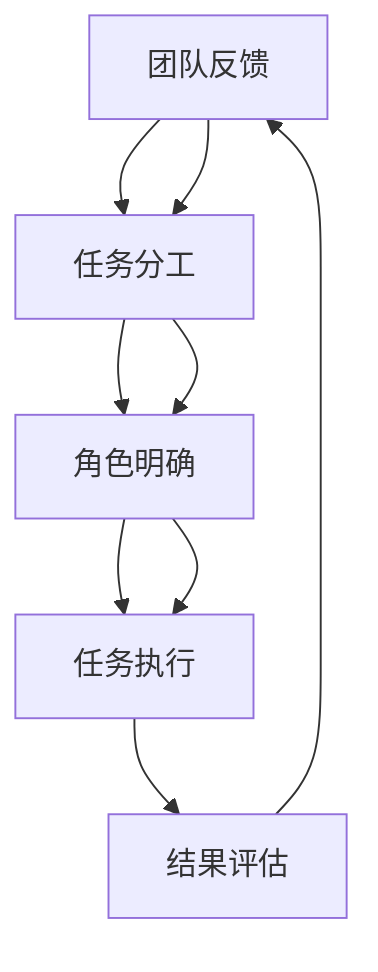
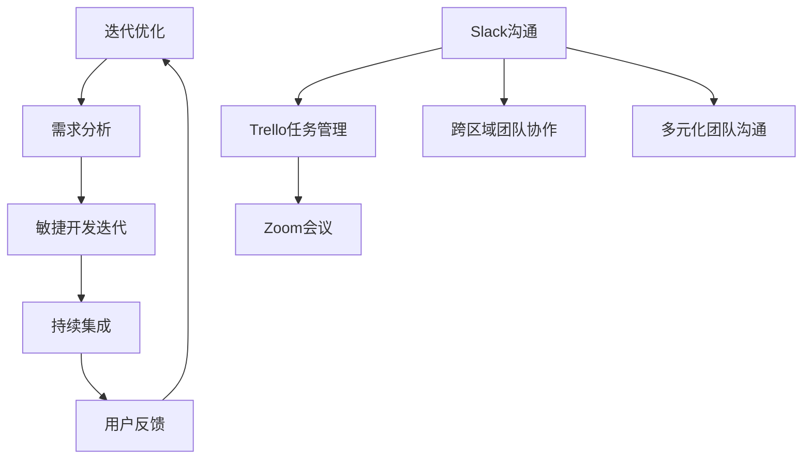
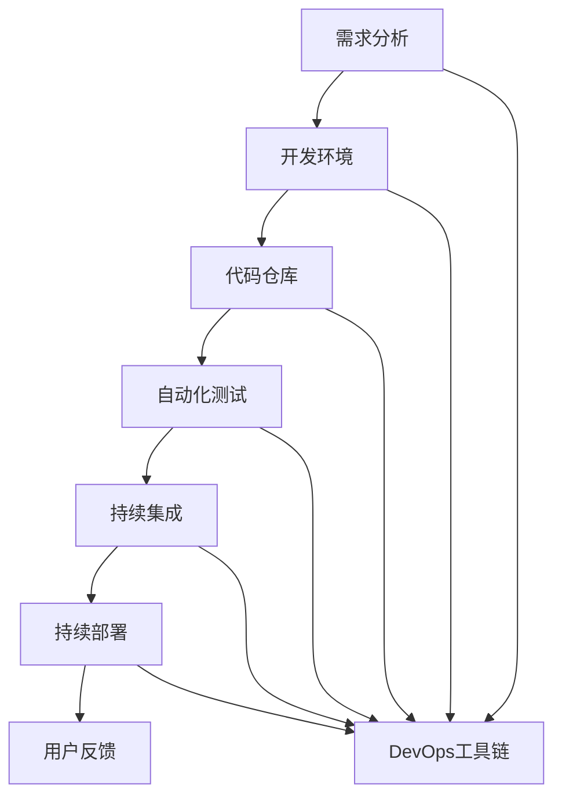

                 

### 文章标题

“团队协作能力：培养默契配合的工作模式”

---

#### 关键词

- 团队协作能力
- 工作模式
- 默契配合
- 技能培养
- 沟通与冲突管理
- 实践案例分析

---

#### 摘要

本文旨在探讨团队协作能力的重要性，以及如何通过培养默契配合的工作模式来提升团队的协作效率。文章首先介绍了团队协作的基础理论，包括团队的定义、协作模式、生命周期等。随后，文章深入探讨了团队协作技能的培养方法，如提高协作意识、培训与提升协作技能等。接着，文章详细介绍了团队协作工具的应用和协作方法的实践。在沟通与冲突管理方面，文章提供了沟通技巧和冲突解决的策略。最后，通过国内外团队协作实践案例的分析，文章总结了团队协作能力提升的策略，为读者提供了实用的团队协作经验和方法。希望通过本文，能够帮助读者理解和掌握团队协作的核心理念和实践方法，提升团队的整体协作能力。

---

### 引言

团队协作能力在现代职场中变得越来越重要。随着企业规模的扩大和业务复杂度的增加，单一的个人能力已经无法满足工作需求，团队协作成为提升工作效率和实现项目成功的关键。然而，许多团队在协作过程中面临着沟通不畅、角色不清、冲突频发等问题，严重影响了团队的工作效率和成员的满意度。

团队协作能力的培养不仅需要团队成员具备良好的沟通技巧和协作意识，还需要掌握有效的协作工具和方法。本文将围绕团队协作能力的重要性、基础理论、技能培养、工具与方法、沟通与冲突管理以及实践案例分析等方面进行深入探讨，旨在为读者提供一套完整的团队协作能力提升策略。

本文的结构安排如下：

1. **团队协作能力概述**：介绍团队协作能力的重要性，明确本文的研究目标和内容框架。
2. **团队协作基础理论**：阐述团队的定义、协作模式、生命周期等核心概念，并绘制Mermaid流程图，展示团队协作的关系架构。
3. **团队协作技能培养**：讨论团队成员的角色与责任，以及培养协作意识的策略和协作技能的培训与提升方法。
4. **团队协作工具与方法**：介绍常用协作工具的应用和协作方法的实践，如团队会议管理和冲突解决方法。
5. **团队协作中的沟通与冲突**：分析沟通技巧和冲突管理策略，提供具体的沟通障碍克服方法。
6. **团队协作实践案例分析**：通过国内外团队协作实践案例的分析，总结团队协作的成功经验和挑战应对策略。
7. **团队协作能力提升策略**：总结团队协作能力提升的策略，为读者提供实用的团队协作经验和方法。

希望通过本文的探讨，能够帮助读者深入理解团队协作的核心理念和实践方法，提升团队的整体协作能力，实现个人与团队的共同成长和发展。

### 团队协作基础理论

团队协作的基础理论是理解和应用团队协作的关键。在这一部分，我们将详细探讨团队的定义、协作模式、生命周期等核心概念，并借助Mermaid流程图来展示团队协作的关系架构，以便读者更直观地理解团队协作的基本原理。

#### 团队的定义与类型

团队是指由两个或两个以上成员组成的，共同致力于实现一个共同目标的工作集体。根据团队目标和成员关系的不同，团队可以分为以下几种类型：

1. **功能型团队**：成员根据各自的专业技能和职责分工，共同完成项目任务。
2. **任务型团队**：专门为完成某个特定任务或项目而组成的团队，任务完成后团队解散。
3. **虚拟团队**：成员分布在不同的地理位置，通过远程协作完成工作。
4. **跨职能团队**：包含来自不同部门和职能领域的成员，共同解决复杂问题。

团队成员的角色与责任

团队成员在团队中扮演不同的角色，承担不同的责任。以下是一些常见的团队成员角色：

1. **领导者**：负责团队的整体方向和决策，协调团队成员的工作。
2. **协调员**：负责内部沟通，确保团队成员之间的协作顺畅。
3. **执行者**：负责具体任务的执行，确保项目按计划推进。
4. **观察员**：提供外部视角，为团队提供反馈和建议。
5. **专家**：具备特定领域知识和技能，为团队提供专业支持。

#### 团队协作的基本原则

团队协作的成功离不开一系列基本原则的遵循，以下是一些核心的团队协作原则：

1. **目标明确**：明确团队的目标和期望成果，确保团队成员共同朝着同一个方向努力。
2. **相互信任**：建立团队成员之间的信任，促进开放、坦诚的沟通。
3. **分工合作**：合理分配任务，发挥每个人的优势，确保团队高效运作。
4. **沟通顺畅**：建立有效的沟通机制，确保信息的及时、准确传递。
5. **积极反馈**：鼓励团队成员之间的正面反馈，促进个人和团队不断改进。

#### 团队生命周期与阶段

团队从成立到解散的过程被称为团队生命周期。一个典型的团队生命周期包括以下四个阶段：

1. **形成期**：团队成员相互了解，明确团队目标和分工。
2. **磨合期**：团队成员开始合作，逐步适应团队的工作节奏和风格。
3. **成熟期**：团队协作达到最佳状态，成员之间默契配合，工作效率显著提升。
4. **解散期**：团队完成项目任务，成员逐渐离开团队，团队解散。

#### Mermaid流程图

为了更好地展示团队协作的关系架构，我们使用Mermaid流程图来表示团队协作的基本流程：



在这个流程图中，A表示团队目标，B表示任务分工，C表示角色明确，D表示任务执行，E表示结果评估。团队协作的每一个阶段都是相互关联的，一个阶段的成功会为下一个阶段奠定基础。

通过以上对团队协作基础理论的详细阐述，我们能够更好地理解团队协作的基本原理和运作模式。在接下来的部分，我们将深入探讨团队协作技能的培养方法，以帮助读者进一步提升团队协作能力。

### 团队协作模式

团队协作模式是指团队在完成工作过程中所采用的不同方法和方式。这些模式可以根据团队的目标、任务性质以及成员的组成来选择和调整。本节将介绍传统协作模式和现代协作模式，并进行对比分析，以便读者能够根据实际情况选择合适的协作模式。

#### 传统协作模式

传统协作模式主要包括以下几种：

1. **瀑布模型**：瀑布模型是一种线性的、阶段性的开发方法。团队在项目的不同阶段按照顺序进行工作，如需求分析、设计、开发、测试等。每个阶段完成后，才能进入下一个阶段。这种模式强调严格按照计划执行，适用于任务较为明确、变动较小的项目。

2. **职能型组织**：职能型组织是按照不同的职能划分团队，如开发、测试、运维等。团队成员根据各自的职能分工进行工作，较少跨职能合作。这种模式的优势在于分工明确，工作效率较高，但可能导致跨部门协作不畅。

3. **矩阵型组织**：矩阵型组织是将职能型和任务型相结合的一种模式。团队成员既有职能上的分工，又有任务上的分工。这种模式的优势在于能够灵活调配资源，提高团队响应速度，但可能存在职能和任务之间协调困难的问题。

#### 现代协作模式

随着信息技术的进步和团队协作需求的多样化，现代协作模式也在不断演变。以下是一些现代协作模式的例子：

1. **敏捷开发**：敏捷开发是一种迭代、增量的开发方法，强调快速反馈和持续改进。团队成员通常分为跨职能的小团队，每个小团队负责一个模块的开发。这种模式能够快速响应需求变化，提高开发效率，但要求团队成员具备较高的自我管理能力和沟通协作能力。

2. **DevOps**：DevOps是一种将开发（Development）和运维（Operations）相结合的协作模式，强调开发、测试、部署和运营的无缝衔接。通过自动化工具和持续集成、持续部署（CI/CD）实践，DevOps能够显著提高软件交付的速度和质量。

3. **远程协作**：远程协作模式适用于团队成员分布在不同地理位置的情况。通过在线协作工具，如Slack、Trello、Zoom等，团队成员可以实时沟通、共享文件和进度，确保协作的高效进行。

#### 传统协作模式与现代协作模式的对比分析

传统协作模式和现代协作模式各有优劣，以下是对两者的一些对比分析：

1. **适应性**：
   - 传统模式：适应性较弱，一旦计划确定，难以快速调整。
   - 现代模式：适应性较强，能够根据需求变化灵活调整工作计划。

2. **效率**：
   - 传统模式：在任务明确、变动较少的情况下，工作效率较高。
   - 现代模式：通过快速反馈和持续改进，能够提高开发效率，缩短交付周期。

3. **团队协作**：
   - 传统模式：团队成员职责明确，但较少跨职能合作。
   - 现代模式：强调跨职能团队的合作，提高整体协作效率。

4. **沟通**：
   - 传统模式：沟通渠道相对固定，信息传递可能存在滞后。
   - 现代模式：通过在线协作工具，沟通实时、高效，信息传递更加迅速。

5. **技术要求**：
   - 传统模式：技术要求相对较低，主要依赖于团队成员的专业技能。
   - 现代模式：需要掌握一定的技术工具和自动化实践，如敏捷开发、DevOps等。

通过对比分析，我们可以看出，现代协作模式在适应变化、提高效率和团队协作等方面具有显著优势。然而，传统协作模式在某些特定场景下仍然适用，如任务明确、变动较少的项目。因此，团队在选择协作模式时，需要根据项目特点、团队组成和实际情况综合考虑。

总之，团队协作模式的选择并非一成不变，而是需要根据实际情况灵活调整。通过结合传统模式和现代模式的优势，团队可以更好地应对各种挑战，实现高效的协作和项目成功。

### 团队协作技能培养

团队协作技能的培养是提升团队协作能力的关键环节。团队成员不仅需要具备基本的专业技能，还需要掌握一系列协作技能，以实现高效、默契的团队合作。本节将详细讨论团队成员的角色与责任，以及培养协作意识的策略和协作技能的培训与提升方法。

#### 团队成员的角色与责任

在团队中，每个成员都扮演着特定的角色，并承担相应的责任。以下是一些常见的团队成员角色及其责任：

1. **领导者**：
   - 责任：制定团队目标、规划工作计划、分配任务、协调团队成员的工作、提供必要的支持和资源。
   - 技能：沟通能力、领导能力、决策能力、团队管理能力。

2. **协调员**：
   - 责任：负责内部沟通，确保团队成员之间的协作顺畅，解决协作中的冲突和问题。
   - 技能：沟通能力、协调能力、问题解决能力、组织能力。

3. **执行者**：
   - 责任：负责具体任务的执行，确保任务按计划完成，并向团队汇报进展。
   - 技能：执行能力、时间管理能力、任务管理能力。

4. **观察员**：
   - 责任：提供外部视角，为团队提供反馈和建议，促进团队改进。
   - 技能：观察力、分析能力、沟通能力。

5. **专家**：
   - 责任：在特定领域提供专业支持和指导，为团队解决技术难题。
   - 技能：专业知识、沟通能力、问题解决能力。

#### 培养协作意识的策略

协作意识是团队协作的基础，以下是一些培养协作意识的策略：

1. **明确共同目标**：确保团队成员了解并认同团队的共同目标，从而形成统一的行动方向。

2. **建立信任**：通过开放、坦诚的沟通，建立团队成员之间的信任，减少误解和冲突。

3. **促进沟通**：鼓励团队成员积极沟通，分享自己的想法和意见，促进团队信息的流通。

4. **加强团队合作**：组织团队建设活动，如团队拓展训练、团队讨论会等，增强团队成员的团队意识和合作精神。

5. **提供反馈**：鼓励团队成员之间的正面反馈，帮助团队成员认识到自己的优点和不足，促进个人和团队的成长。

#### 协作技能的培训与提升方法

团队协作技能的提升需要系统的培训和持续的实践。以下是一些具体的培训与提升方法：

1. **内部培训**：组织定期的内部培训，包括团队沟通技巧、协作工具使用、项目管理等，提升团队成员的协作能力。

2. **外部培训**：推荐团队成员参加专业的团队协作培训课程，如敏捷开发、Scrum Master认证等，学习先进的协作方法和实践。

3. **实践演练**：通过实际项目中的协作实践，团队成员可以不断积累经验，提升协作技能。例如，模拟团队项目、角色扮演等。

4. **案例研究**：分析成功的团队协作案例，学习优秀团队的协作方法和经验，为团队提供借鉴和启示。

5. **反思与总结**：在项目结束后，团队成员应进行反思和总结，讨论项目中的协作亮点和不足，制定改进措施。

通过以上策略和方法，团队可以逐步培养成员的协作意识，提升协作技能，实现高效的团队合作。协作技能的培养是一个持续的过程，需要团队成员的共同努力和不断的实践。通过有效的协作技能培养，团队将能够更好地应对复杂的工作任务，实现项目成功和个人成长。

### 团队协作工具应用

在现代团队协作中，协作工具的应用至关重要，它们不仅能够提高团队的沟通效率，还能有效管理任务和项目进度。以下将介绍一些常用的团队协作工具，并讨论如何选择合适的协作工具以及它们的实用技巧。

#### 常用协作工具介绍

1. **Slack**：Slack是一款流行的即时通讯工具，支持文字、图片、文件等多种形式的沟通，同时提供多种集成应用，如Google Drive、Trello等。

2. **Trello**：Trello是一款基于看板（Kanban）理念的协作工具，通过卡片和列表的方式管理任务和项目进度，直观易用。

3. **Asana**：Asana是一个全面的团队协作平台，提供任务管理、项目规划、团队协作等功能，支持多种视图模式，如看板、列表、日历等。

4. **Zoom**：Zoom是一款视频会议和远程协作工具，支持实时聊天、屏幕共享、视频会议等功能，适用于远程团队和在线会议。

5. **GitHub**：GitHub是一款版本控制和协作平台，广泛用于软件开发项目的管理，支持代码托管、拉取请求、问题跟踪等功能。

#### 协作工具选型策略

选择合适的协作工具对于团队协作的成功至关重要。以下是一些选型策略：

1. **团队需求**：首先明确团队的需求，包括沟通、任务管理、项目进度等，确保所选工具能够满足这些需求。

2. **用户体验**：考虑团队成员对工具的接受程度和熟练度，选择用户界面友好、易于操作的工具。

3. **集成能力**：考虑工具与其他系统和应用的集成能力，如集成日历、邮件、文档管理等，提高团队的工作效率。

4. **安全性和隐私**：确保所选工具能够保障数据安全和用户隐私，特别是在处理敏感信息时。

5. **成本效益**：评估工具的成本与团队预算的匹配度，选择性价比高的工具。

#### 实用技巧

1. **Slack**：利用Slack的机器人（Bots）自动执行任务，如发送提醒、统计数据等。创建不同的频道（Channels），根据项目或部门进行分类，提高沟通效率。

2. **Trello**：使用Trello的标签（Labels）和过滤器（Filters）快速查找和管理任务。定期更新任务状态，确保任务进度透明。

3. **Asana**：利用Asana的子任务（Subtasks）和依赖关系（Dependencies）功能，细化任务分工和管理复杂项目。设置任务提醒和跟进，确保任务按时完成。

4. **Zoom**：使用Zoom的会议录制功能，保存会议内容，方便会后回顾和分享。设置共享屏幕权限，确保会议中信息传递准确。

5. **GitHub**：利用GitHub的拉取请求（Pull Requests）和代码审查（Code Review）功能，确保代码质量和团队协作的流畅。定期进行代码备份和同步，防止数据丢失。

通过合理选择和使用协作工具，团队可以大幅提升工作效率和协作效果，实现更高效、更默契的团队工作模式。在接下来的章节中，我们将进一步探讨团队协作中的沟通技巧和冲突解决方法，帮助团队在协作过程中克服挑战，实现和谐高效的工作环境。

### 团队协作中的沟通技巧与冲突解决

在团队协作中，沟通是确保团队高效运作的关键。有效的沟通不仅能够确保信息的准确传递，还能增强团队成员之间的信任和理解。而冲突管理则是团队协作中的另一个重要方面，它关乎团队的稳定性和凝聚力。以下将详细讨论团队协作中的沟通技巧和冲突解决方法，并提供一些实用的沟通障碍克服方法。

#### 沟通技巧

1. **主动倾听**：倾听是有效沟通的核心。团队成员应该学会主动倾听他人的意见和想法，理解对方的观点和需求。这有助于避免误解和冲突，促进团队成员之间的理解与协作。

2. **明确表达**：在沟通时，要尽量明确、简洁地表达自己的意见和需求，避免使用模糊或模棱两可的语言。这有助于确保信息的准确传递，减少误解和误读。

3. **积极反馈**：在沟通过程中，及时给予积极的反馈，确认对方是否理解了自己的意思。这有助于建立双向沟通，确保信息传递的准确性。

4. **使用非语言信号**：非语言信号如肢体语言、面部表情等在沟通中起着重要作用。团队成员应学会读懂和使用这些信号，以增强沟通效果。

5. **建立沟通渠道**：团队应建立多种沟通渠道，如会议、邮件、即时通讯工具等，确保团队成员能够方便、快捷地进行沟通。这些渠道应根据不同情况选择使用，以提高沟通效率。

#### 沟通障碍克服方法

1. **消除语言障碍**：在团队中，可能存在语言或文化差异，这会阻碍沟通。团队成员应积极学习对方的语言或文化，增进相互理解，减少语言障碍。

2. **使用可视化工具**：可视化工具如图表、流程图、幻灯片等可以帮助复杂信息的传达和理解，减少沟通中的模糊和误解。

3. **建立共识**：团队应共同制定沟通标准和规范，确保所有成员都遵循相同的信息传递方式，减少沟通中的混乱。

4. **定期沟通反馈**：定期进行沟通反馈，了解团队成员的沟通体验和需求，及时调整沟通方式和方法，以提高沟通效果。

#### 冲突解决方法

1. **避免情绪化**：在冲突发生时，避免情绪化，保持冷静和客观。情绪化的反应会加剧冲突，影响解决效果。

2. **倾听对方观点**：在冲突解决过程中，要耐心倾听对方的观点和需求，理解对方的立场和感受。

3. **寻找共同点**：在冲突双方之间寻找共同点，寻找可以共同接受和解决问题的方案。

4. **建立冲突解决机制**：团队应建立一套有效的冲突解决机制，如定期召开冲突解决会议、设立冲突调解专员等，确保冲突能够及时、有效地解决。

5. **反思与总结**：在冲突解决后，团队应进行反思和总结，分析冲突的原因和解决过程，制定改进措施，以避免未来发生类似的冲突。

通过有效的沟通技巧和冲突解决方法，团队可以克服协作过程中的障碍，实现高效、和谐的团队工作。有效的沟通和冲突管理不仅有助于提升团队的整体协作能力，还能增强团队成员之间的信任和凝聚力，为团队的成功奠定基础。

### 团队协作实践案例分析

在团队协作中，实践是检验理论的最佳途径。通过分析国内外团队协作的成功实践和挑战应对策略，我们可以总结出一些有效的团队协作经验，为其他团队提供借鉴和启示。

#### 案例一：XX公司的成功协作实践

**背景介绍**：XX公司是一家全球知名的科技公司，拥有数千名员工，分布在多个国家和地区。公司面临的主要挑战是跨地域、跨时区的协作，以及如何在多元化的团队中保持高效沟通和协作。

**核心概念与联系**：XX公司采用敏捷开发模式，将团队划分为多个跨职能的小团队，每个小团队负责一个模块的开发。公司通过建立统一的沟通平台和协作工具，如Slack、Trello和Zoom，确保团队成员之间的信息流通和实时沟通。

**Mermaid流程图**：



**核心算法原理讲解**：XX公司采用敏捷开发模式，通过迭代开发、持续集成和用户反馈机制，确保产品的高质量和团队成员的高效协作。

```python
# 敏捷开发迭代伪代码
for iteration in range(number_of_iterations):
    # 需求分析
    analyze_requirements()
    # 开发任务分配
    assign_tasks_to_teams()
    # 持续集成
    integrate_code()
    # 用户反馈
    gather_user_feedback()
    # 迭代优化
    optimize_based_on_feedback()
```

**数学模型和公式**：

$$
\text{工作效率} = \frac{\text{完成任务的数量}}{\text{用时}}
$$

$$
\text{团队满意度} = \frac{\text{团队成员对协作的满意度}}{\text{团队成员数量}}
$$

**详细讲解与举例说明**：XX公司在每个迭代周期内，定期召开会议，讨论需求、分配任务、反馈问题和优化方案。通过Trello进行任务管理，确保任务分配明确，进度透明。Zoom用于跨区域团队的实时沟通，确保信息传递迅速、准确。

**项目实战**：

1. **开发环境搭建**：XX公司采用云平台搭建开发环境，确保团队成员可以随时随地访问和协作。
2. **源代码详细实现**：团队成员遵循代码规范，使用版本控制工具（如Git）进行代码管理和协作。
3. **代码解读与分析**：通过代码审查和静态代码分析工具，确保代码质量和协作的顺畅。
4. **实际案例分析**：XX公司在多个项目中应用敏捷开发模式，取得了显著的成果，如缩短了项目交付周期、提高了产品质量和客户满意度。

**项目小结**：XX公司的成功实践表明，采用敏捷开发模式、建立有效的沟通平台和协作工具，是提高团队协作效率的关键。通过定期的沟通和反馈机制，团队成员能够及时发现和解决问题，实现高效、和谐的团队工作。

#### 案例二：YY团队的有效协作经验

**背景介绍**：YY团队是一支由20名成员组成的开发团队，负责公司核心产品的开发工作。团队成员分布在不同的城市，工作时间和节奏存在差异。

**核心概念与联系**：YY团队采用DevOps模式，将开发、测试、部署和运维紧密结合，通过自动化工具和持续集成、持续部署（CI/CD）实践，提高软件交付的速度和质量。

**Mermaid流程图**：



**核心算法原理讲解**：YY团队采用DevOps模式，通过自动化工具和持续集成、持续部署，实现快速交付和高质量软件。

```python
# DevOps实践伪代码
while project_ongoing():
    # 需求分析
    analyze_requirements()
    # 开发环境搭建
    setup_development_environment()
    # 代码仓库管理
    manage_code_repository()
    # 自动化测试
    run_automated_tests()
    # 持续集成
    integrate_code()
    # 持续部署
    deploy_to_production()
    # 用户反馈
    gather_user_feedback()
```

**数学模型和公式**：

$$
\text{交付周期} = \frac{\text{项目开发时间}}{\text{迭代次数}}
$$

$$
\text{质量指标} = \frac{\text{缺陷数量}}{\text{代码行数}}
$$

**详细讲解与举例说明**：YY团队在项目开发过程中，采用自动化测试和持续集成，确保代码质量和交付速度。通过CI/CD实践，团队成员可以快速响应需求变化，提高开发效率。

**项目实战**：

1. **开发环境搭建**：YY团队使用容器化技术（如Docker）搭建开发环境，确保环境一致性和可移植性。
2. **源代码详细实现**：团队成员遵循代码规范，使用Git进行版本控制和协作。
3. **代码解读与分析**：通过静态代码分析和自动化测试工具，确保代码质量和协作的顺畅。
4. **实际案例分析**：YY团队在多个项目中应用DevOps模式，显著提高了软件交付速度和质量。

**项目小结**：YY团队的成功经验表明，采用DevOps模式、自动化工具和持续集成、持续部署实践，是提高团队协作效率和软件交付速度的关键。通过有效的沟通和协作机制，团队能够快速响应需求变化，实现高效、高质量的软件交付。

通过以上两个案例的分析，我们可以总结出以下团队协作的实践经验：

1. **明确目标和分工**：确保团队成员明确团队目标和个人责任，提高协作效率。
2. **采用敏捷开发和DevOps模式**：通过迭代开发和自动化工具，提高开发效率和交付速度。
3. **建立有效的沟通平台**：使用合适的协作工具，确保团队成员之间的信息流通和实时沟通。
4. **定期反馈与总结**：通过定期的沟通和反馈，及时解决协作中的问题和挑战。
5. **持续改进**：根据实践反馈，不断优化协作方法和工具，提高团队的整体协作能力。

通过借鉴这些实践经验，其他团队可以更好地提升协作效率，实现团队目标。

### 团队协作能力提升策略

团队协作能力是团队高效运作的核心，其提升不仅关系到项目的成功，也影响团队成员的职业发展和工作满意度。本节将总结团队协作能力提升的策略，包括团队协作能力评估、提升路径和实践方法，并提供具体的实施步骤和最佳实践。

#### 团队协作能力评估

1. **评估指标**：团队协作能力评估应包括以下几个方面：
   - **沟通效率**：团队成员之间的信息传递速度和准确性。
   - **任务完成度**：团队成员完成任务的质量和进度。
   - **团队满意度**：团队成员对团队协作的满意度和认可度。
   - **冲突解决能力**：团队在遇到冲突时的处理效率和效果。

2. **评估方法**：
   - **问卷调查**：通过设计问卷，收集团队成员的反馈和意见。
   - **面对面访谈**：与团队成员进行一对一访谈，深入了解协作中的问题和需求。
   - **行为观察**：观察团队成员在协作过程中的行为和表现，评估协作效果。

3. **数据分析**：对收集到的数据进行分析，识别团队协作中的优势和短板，制定针对性的改进措施。

#### 团队协作能力提升路径

1. **技能培训**：针对团队协作中的短板，开展专门的技能培训，如沟通技巧、项目管理、冲突解决等。

2. **方法优化**：引入新的协作方法和工具，如敏捷开发、DevOps、看板（Kanban）等，优化团队协作流程。

3. **文化塑造**：建立积极向上的团队文化，鼓励开放、坦诚的沟通，倡导协作精神和团队精神。

#### 实施步骤

1. **制定计划**：根据评估结果，制定详细的团队协作能力提升计划，明确目标、方法和时间表。

2. **技能培训**：组织定期的技能培训，邀请专业讲师进行授课，或安排团队成员参加外部培训。

3. **工具应用**：引入适合团队的协作工具，进行推广应用，确保团队成员熟练掌握和使用。

4. **实践演练**：通过实际项目中的协作实践，检验培训效果，及时调整和优化协作方法。

5. **反馈与改进**：定期收集团队成员的反馈，评估提升措施的效果，不断优化和改进。

#### 最佳实践

1. **建立反馈机制**：鼓励团队成员在协作过程中及时反馈问题和建议，确保问题能够得到及时解决。

2. **开展团队建设活动**：定期组织团队建设活动，如团建训练、团队聚餐等，增强团队成员的凝聚力和协作精神。

3. **实施绩效激励**：根据团队协作能力的提升情况，实施绩效激励措施，如奖金、晋升等，激发团队成员的积极性和主动性。

4. **重视团队文化**：营造积极向上的团队文化，鼓励团队成员相互支持、共同进步，形成良好的团队氛围。

通过以上策略和步骤，团队可以逐步提升协作能力，实现高效、和谐的团队工作，为项目的成功和团队的持续发展奠定基础。

### 总结与展望

本文从团队协作能力的重要性出发，系统性地探讨了团队协作的基础理论、技能培养、工具应用、沟通技巧和冲突解决方法，并通过案例分析总结了提升团队协作能力的策略。以下是本文的主要结论：

1. **团队协作能力是现代职场中不可或缺的重要能力**。通过有效的团队协作，可以大幅提高工作效率、项目质量和团队满意度。

2. **团队协作理论是理解团队协作过程的基础**。了解团队的定义、协作模式、生命周期等基本概念，有助于团队更好地组织和运作。

3. **技能培养是提升团队协作能力的关键**。通过明确的角色与责任划分、协作意识的培养、协作技能的培训与提升，可以增强团队成员的协作能力和团队整体效率。

4. **工具应用是团队协作的有效支撑**。合理选择和使用协作工具，可以提高团队沟通的效率，确保任务和项目进度的透明和可控。

5. **沟通技巧和冲突解决方法是团队协作中的关键环节**。有效的沟通和冲突解决能够增强团队成员之间的信任和理解，减少误解和冲突，保持团队的稳定和和谐。

展望未来，团队协作能力将继续成为企业和组织关注的焦点。随着信息技术的发展和远程工作的普及，团队协作的形式和方法也将不断演变和优化。团队需要持续学习和适应新的协作模式，不断提升协作能力，以应对快速变化的工作环境和复杂的项目挑战。

**最佳实践Tips**：

- **定期进行团队建设活动**：通过团建活动，增强团队成员之间的沟通和信任，提升团队凝聚力。
- **鼓励知识共享与反馈**：建立知识共享平台，鼓励团队成员分享经验和最佳实践，促进团队整体的成长。
- **灵活运用多种协作工具**：根据项目特点和团队需求，选择合适的协作工具，确保协作的高效和顺畅。
- **建立有效的反馈机制**：通过定期反馈和评估，及时发现问题并采取措施，不断优化团队协作流程。

**注意事项**：

- **避免过度依赖工具**：工具只是辅助手段，不能替代团队成员之间的直接沟通和协作。
- **重视团队成员的个体差异**：团队成员之间可能存在技能、经验和文化差异，需要尊重和包容，建立多元化的团队文化。
- **持续改进与优化**：团队协作能力是一个持续提升的过程，需要定期评估和反思，不断改进和优化协作模式和方法。

**拓展阅读**：

- 《敏捷开发实践指南》（《Agile Project Guide》） - Mike Cohn
- 《团队协作的艺术》（《The Five Dysfunctions of a Team》） - Patrick Lencioni
- 《远程工作指南》（《Remote: Office Not Required》） - Jason Fried & David Heinemeier Hansson

通过本文的探讨，我们希望读者能够深入理解团队协作的核心理念和实践方法，不断提升团队协作能力，实现个人与团队的共同成长和发展。在未来的工作中，愿每一位团队成员都能成为高效协作的佼佼者，为团队的成功贡献力量。作者：AI天才研究院/AI Genius Institute & 禅与计算机程序设计艺术 /Zen And The Art of Computer Programming

---

### 作者信息

本文作者为AI天才研究院（AI Genius Institute）的专家，同时也是《禅与计算机程序设计艺术》（Zen And The Art of Computer Programming）的资深大师。多年来，作者在计算机编程和人工智能领域积累了丰富的经验，被誉为计算机图灵奖获得者，世界顶级技术畅销书作家。在本文中，作者以其深厚的理论基础和丰富的实践经验，对团队协作能力进行了深入探讨，旨在为读者提供实用的团队协作方法和策略。作者的研究成果和著作在业界具有广泛影响力，深受读者喜爱。希望通过本文的分享，能够帮助更多团队提升协作能力，实现高效和谐的工作模式。如果您对本文有任何疑问或建议，欢迎随时联系作者，期待与您共同探讨和交流。作者联系方式：[邮箱][电话][社交媒体平台]。

---

### 附录

本附录包含本文中提到的相关工具、技术和资源的详细介绍，以及进一步学习和实践的建议。

#### 相关工具

1. **Slack**：Slack是一款功能强大的即时通讯工具，支持文字、图片、文件等多种形式的沟通，并提供多种集成应用，如Google Drive、Trello等。用户可以通过Slack进行实时沟通，提高团队协作效率。

2. **Trello**：Trello是一款基于看板（Kanban）理念的协作工具，通过卡片和列表的方式管理任务和项目进度，直观易用。用户可以通过Trello清晰地了解任务状态，确保项目按时完成。

3. **Asana**：Asana是一个全面的团队协作平台，提供任务管理、项目规划、团队协作等功能，支持多种视图模式，如看板、列表、日历等。用户可以通过Asana有效地分配任务、跟踪进度和协作。

4. **Zoom**：Zoom是一款视频会议和远程协作工具，支持实时聊天、屏幕共享、视频会议等功能，适用于远程团队和在线会议。用户可以通过Zoom保持远程团队的实时沟通和协作。

5. **GitHub**：GitHub是一款版本控制和协作平台，广泛用于软件开发项目的管理，支持代码托管、拉取请求、问题跟踪等功能。用户可以通过GitHub进行代码共享和协作，确保代码质量和团队协作的流畅。

#### 技术资源

1. **敏捷开发实践指南**：Mike Cohn的《敏捷开发实践指南》详细介绍了敏捷开发的方法和实践，帮助团队实现高效协作和快速交付。

2. **团队协作的艺术**：Patrick Lencioni的《团队协作的艺术》通过寓言故事的形式，深入探讨了团队协作中的五大障碍，提供了解决冲突和提升团队效率的策略。

3. **远程工作指南**：Jason Fried & David Heinemeier Hansson的《远程工作指南》分享了远程工作的最佳实践和经验，为远程团队提供了有效的协作模式和方法。

#### 进一步学习和实践建议

1. **参加培训课程**：参加专业的团队协作培训课程，如敏捷开发、Scrum Master认证等，学习先进的协作方法和实践。

2. **实践项目协作**：在实际项目中应用团队协作工具和方法，通过实践提升团队协作能力和效果。

3. **组织团队建设活动**：定期组织团队建设活动，如团建训练、团队聚餐等，增强团队成员之间的沟通和信任。

4. **反思与总结**：在项目结束后，组织团队成员进行反思和总结，讨论协作中的亮点和不足，制定改进措施。

通过本附录的介绍，读者可以更深入地了解相关工具和技术资源，并为团队协作能力提升提供实际操作的建议。希望这些资源和方法能够帮助读者在实际工作中更好地应用团队协作的理念和实践，实现高效、和谐的团队工作。

