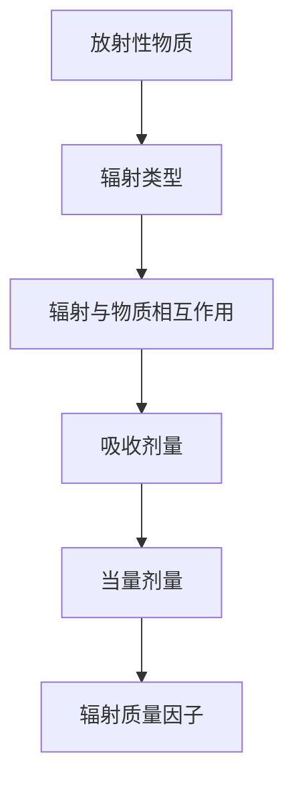

                 

### 文章标题

# 数学与放射治疗：放射剂量的数学计算

放射治疗作为一种重要的癌症治疗方法，已经广泛应用于临床。而放射剂量作为放射治疗的核心参数之一，其准确计算对于治疗的成功至关重要。本文将深入探讨放射剂量计算的数学原理和方法，旨在为从事放射治疗工作的专业人员提供一份有深度和实用性的指南。

### 关键词

- **放射治疗**、**放射剂量**、**数学计算**、**放射性物质**、**辐射生物学**、**剂量学公式**、**临床应用**、**质量控制**。

### 摘要

本文首先回顾了放射治疗的基本概念和历史，接着介绍了放射性物质和辐射类型，以及放射剂量的基本概念和常用单位。通过详细阐述辐射与物质的相互作用原理，本文进一步探讨了放射剂量学的基本公式及其应用。随后，本文重点介绍了临床放射剂量学的原则和方法，包括放射治疗计划的制定和优化。最后，本文提出了放射治疗的质量控制与安全管理策略，并总结了一些最佳实践，以期为放射治疗领域的工作者提供有价值的参考。

### 目录

1. **放射治疗的基本概念**
2. **放射性物质与辐射类型**
3. **放射剂量与单位**
4. **辐射与物质的相互作用**
5. **放射剂量学的基本公式**
6. **临床放射剂量学**
7. **放射治疗计划与优化**
8. **放射生物效应**
9. **放射治疗的质量控制与安全管理**
10. **总结与展望**
11. **参考文献**
12. **附录**
    - **附录A：常用放射剂量学公式**
    - **附录B：放射治疗计划实例分析**
    - **附录C：放射治疗设备介绍**

### 放射治疗的基本概念

放射治疗是利用电离辐射来治疗癌症的一种疗法。其原理是通过电离辐射对癌细胞的直接损伤以及辐射引起的免疫反应，从而达到抑制癌细胞生长、缩小肿瘤体积甚至治愈癌症的目的。

#### 历史与发展

放射治疗的历史可以追溯到1895年，威廉·伦琴发现X射线。随后，居里夫妇发现了放射性元素镭，这一发现极大地推动了放射治疗的发展。1908年，Elihu mM. mirsky首次尝试使用X射线治疗癌症，这是放射治疗在临床上的首次应用。

20世纪初，随着放射物理学和放射生物学的不断发展，放射治疗逐渐成为癌症治疗的重要手段。特别是20世纪50年代以后，随着高能X射线机、电子加速器和各类辐射源的出现，放射治疗的技术水平得到了显著提升。

#### 现代放射治疗

现代放射治疗包括外照射治疗和内照射治疗两种方式。外照射治疗是利用外部放射源产生的辐射照射肿瘤，而内照射治疗则是通过将放射性同位素植入或注射到肿瘤内部，使其辐射肿瘤。

外照射治疗通常使用高能X射线、电子束、质子束和重离子束等。其中，高能X射线是最常用的辐射源，它可以通过调整能量和照射角度来优化对肿瘤的治疗效果。质子束和重离子束由于其较高的穿透能力和较好的组织选择性，在治疗某些特定类型的肿瘤（如眼部肿瘤、颅底肿瘤等）方面具有显著优势。

内照射治疗包括放射性同位素植入和放射性药物注射。放射性同位素植入通常是将放射性源（如碘-125、铱-192等）植入到肿瘤内部或附近，通过辐射肿瘤达到治疗目的。放射性药物注射则是将放射性药物（如氟-18氟代脱氧葡萄糖）注射到体内，通过靶向肿瘤细胞来发挥治疗作用。

### 放射性物质与辐射类型

放射性物质是指能够自发地发射辐射并产生放射性衰变的物质。常见的放射性物质包括天然放射性元素（如铀、钍、镭等）和人工放射性同位素。

#### 放射性物质的分类

根据放射性衰变的方式，放射性物质可以分为以下几类：

- **α衰变**：α粒子（即氦核）发射。
- **β衰变**：β粒子（即电子或正电子）发射。
- **γ衰变**：γ射线发射。
- **核裂变**：重核分裂成两个较轻的核，并伴随中子和能量的释放。
- **核聚变**：轻核结合成较重的核，并伴随能量的释放。

#### 辐射类型

根据辐射的性质，辐射可以分为以下几类：

- **电离辐射**：具有足够的能量，能够使原子或分子电离的辐射，如X射线、γ射线、α射线和β射线。
- **非电离辐射**：能量较低，不足以使原子或分子电离的辐射，如紫外线、可见光和无线电波。
- **中子辐射**：由中子组成的辐射。
- **质子辐射**：由质子组成的辐射。

在放射治疗中，主要使用的是电离辐射，特别是X射线、电子束和粒子束。

### 放射剂量与单位

放射剂量是描述辐射对物质作用程度的量。放射剂量可以分为几种不同的类型，每种类型都从不同的角度描述了辐射对物质的影响。

#### 放射剂量的类型

- **吸收剂量**（Absorbed Dose）：描述单位质量的物质吸收辐射的能量。其单位为戈瑞（Gray, Gy），1 Gy等于每千克物质吸收1焦耳的能量。
- **当量剂量**（Equivalent Dose）：考虑了辐射对不同组织器官的不同生物效应的剂量。其单位为西弗（Sv），1 Sv等于1 Gy乘以组织或器官的辐射系数（Radial Risk Factor）。
- **组织剂量**（Organ Dose）：特定组织或器官吸收的辐射剂量。

#### 常用的放射剂量单位

- **毫西弗（mSv）**：1 mSv等于0.001 Sv。
- **微西弗（μSv）**：1 μSv等于0.000001 Sv。
- **毫戈瑞（mGy）**：1 mGy等于0.001 Gy。

在放射治疗中，常用的剂量单位是戈瑞（Gy）和西弗（Sv），特别是在描述肿瘤剂量和正常组织剂量时。

### 辐射与物质的相互作用

辐射与物质的相互作用是放射剂量计算的基础。辐射通过不同机制与物质相互作用，导致物质产生电离、激发或化学变化。理解这些相互作用机制对于正确计算放射剂量至关重要。

#### 相互作用机制

1. **光电效应**：高能光子（如X射线或γ射线）与物质原子相互作用，将其能量传递给原子，使原子外层的电子被激发或脱离原子，形成光电子。
2. **康普顿散射**：高能光子与物质中的自由电子相互作用，将其部分能量传递给电子，导致光子散射和电子能量增加。散射后的光子能量降低，波长变长。
3. **电子对生成**：高能光子与原子核相互作用，产生一个正电子和一个电子，这两个粒子随后相互湮灭，释放出两个γ光子。
4. **核作用**：高能粒子（如α粒子、质子或重离子）与原子核相互作用，导致核反应，如核裂变或核聚变。

#### 放射剂量学基本公式

放射剂量学的计算基于辐射能量、辐射质量和物质密度等因素。以下是几种常见的放射剂量学公式：

1. **吸收剂量公式**：
   \[
   D = \frac{Q}{m}
   \]
   其中，D 是吸收剂量（单位：Gy），Q 是辐射能量（单位：J），m 是物质质量（单位：kg）。

2. **当量剂量公式**：
   \[
   H = D \cdot R
   \]
   其中，H 是当量剂量（单位：Sv），D 是吸收剂量（单位：Gy），R 是辐射系数（无单位）。

3. **辐射质量因子**：
   \[
   w_R = \frac{H}{D}
   \]
   其中，w\_R 是辐射质量因子，表示辐射对不同组织器官的生物效应差异。

### 核心概念与联系

为了更好地理解放射剂量学，我们需要构建一个核心概念之间的联系架构。以下是一个简单的Mermaid流程图，展示了主要概念之间的关系：



### 放射剂量学基本公式

放射剂量学中的基本公式用于描述辐射与物质之间的能量转换和剂量计算。以下是一些常用的公式及其详细解释：

1. **吸收剂量公式**：
   \[
   D = \frac{Q}{m}
   \]
   其中，D 表示吸收剂量，Q 表示辐射能量，m 表示物质质量。这个公式表明，吸收剂量与辐射能量成正比，与物质质量成反比。

2. **辐射质量因子**：
   \[
   w_R = \frac{H}{D}
   \]
   其中，w\_R 表示辐射质量因子，H 表示当量剂量，D 表示吸收剂量。这个公式表示，辐射质量因子是当量剂量与吸收剂量的比值，用于反映不同辐射对不同组织的生物效应差异。

3. **辐射转换因子**：
   \[
   N = \frac{Q}{E}
   \]
   其中，N 表示辐射转换因子，Q 表示辐射能量，E 表示电子能量。这个公式用于计算辐射产生的电子数量，与辐射能量成正比。

4. **辐射场强度公式**：
   \[
   I = \frac{Q}{At}
   \]
   其中，I 表示辐射场强度，Q 表示辐射能量，A 表示辐射面积，t 表示时间。这个公式表示，辐射场强度与辐射能量成正比，与辐射面积和时间成反比。

### 核心算法原理讲解

为了详细解释放射剂量学中的核心算法原理，我们将使用伪代码来阐述吸收剂量计算过程。以下是一个简单的伪代码示例：

```python
# 辐射能量（J），物质质量（kg）
radiation_energy = 1e6  # 1兆焦耳
material_mass = 1      # 1千克

# 计算吸收剂量
absorbed_dose = radiation_energy / material_mass

# 输出吸收剂量
print("吸收剂量：", absorbed_dose, "Gy")
```

在这个伪代码中，我们首先定义了辐射能量和物质质量，然后通过计算辐射能量除以物质质量来获得吸收剂量，并输出结果。

### 数学公式与详细讲解

在放射剂量学中，数学公式是理解和计算放射剂量的核心工具。以下是几个关键数学公式及其详细解释：

1. **吸收剂量公式**：
   \[
   D = \frac{Q}{m}
   \]
   其中，D 表示吸收剂量，Q 表示辐射能量，m 表示物质质量。这个公式表明，吸收剂量与辐射能量成正比，与物质质量成反比。在实际应用中，辐射能量可以通过测量获得，而物质质量可以通过称重或体积测量计算。

2. **当量剂量公式**：
   \[
   H = D \cdot R
   \]
   其中，H 表示当量剂量，D 表示吸收剂量，R 表示辐射系数。辐射系数反映了不同辐射对不同组织的生物效应差异。当量剂量用于衡量辐射对特定组织或器官的危害程度，其单位是西弗（Sv）。

3. **辐射转换因子**：
   \[
   N = \frac{Q}{E}
   \]
   其中，N 表示辐射转换因子，Q 表示辐射能量，E 表示电子能量。这个公式用于计算辐射产生的电子数量。在实际应用中，辐射转换因子可以帮助我们估算辐射对生物组织的影响。

4. **辐射场强度公式**：
   \[
   I = \frac{Q}{At}
   \]
   其中，I 表示辐射场强度，Q 表示辐射能量，A 表示辐射面积，t 表示时间。这个公式表示，辐射场强度与辐射能量成正比，与辐射面积和时间成反比。辐射场强度是描述辐射在空间中的分布特性，对于放射治疗计划的优化具有重要意义。

### 举例说明

为了更好地理解这些数学公式，我们通过一个简单的实例来计算吸收剂量和当量剂量。假设我们有一个患者，其接受了一次X射线照射，辐射能量为1000焦耳，物质质量为5千克。我们可以按照以下步骤进行计算：

1. **计算吸收剂量**：
   \[
   D = \frac{Q}{m} = \frac{1000 \text{ J}}{5 \text{ kg}} = 200 \text{ Gy}
   \]
   因此，患者的吸收剂量为200戈瑞。

2. **计算当量剂量**：
   假设X射线对皮肤的辐射系数为1，则当量剂量为：
   \[
   H = D \cdot R = 200 \text{ Gy} \cdot 1 = 200 \text{ Sv}
   \]
   因此，患者的当量剂量为200西弗。

通过这个实例，我们可以看到如何使用数学公式来计算放射剂量，这对于放射治疗计划的制定和执行至关重要。

### 临床放射剂量学

临床放射剂量学是放射治疗中的一个关键领域，它涉及放射剂量的确定、分配和应用。放射剂量学不仅关注如何安全有效地治疗癌症，还关注如何最大限度地保护正常组织。

#### 临床放射剂量学的原则

1. **最小化正常组织损害**：放射治疗的目标是杀死癌细胞，同时最大限度地减少对周围正常组织的损害。因此，放射剂量的分配和计划需要考虑正常组织的耐受性。

2. **精确剂量分配**：放射治疗需要精确地分配剂量，以确保肿瘤受到足够的照射，同时周围正常组织受到的照射量最小。

3. **个体化治疗**：患者的年龄、健康状况、肿瘤类型和位置等因素会影响放射剂量的选择和分配。因此，个体化治疗是临床放射剂量学的重要原则。

4. **定期监测和调整**：放射治疗过程中需要定期监测患者的治疗效果和副作用，并根据实际情况调整治疗方案。

#### 放射剂量的确定

放射剂量的确定是一个复杂的过程，通常涉及以下步骤：

1. **肿瘤剂量**：确定肿瘤所需的总剂量，以达到有效的治疗效果。肿瘤剂量通常根据肿瘤的类型、大小和位置确定。

2. **分割剂量**：将总剂量分为多个分割，以在治疗过程中逐渐照射肿瘤。分割剂量的大小取决于肿瘤的敏感性、正常组织的耐受性和治疗计划。

3. **生物等效剂量**：考虑不同辐射类型对生物组织的影响，将不同类型的辐射转换为等效剂量，以便进行比较和剂量分配。

4. **剂量分布**：使用放射治疗计划系统，根据肿瘤和正常组织的位置和形状，优化放射剂量的分布。

#### 放射剂量的应用

在放射治疗中，放射剂量的应用涉及以下几个方面：

1. **照射野设计**：根据肿瘤的位置和大小，设计合适的照射野，以确保肿瘤受到充分的照射，同时减少对周围正常组织的照射。

2. **治疗计划**：使用放射治疗计划系统，根据照射野设计、肿瘤和正常组织的位置和形状，优化放射剂量的分配。

3. **治疗实施**：根据治疗计划，实施放射治疗，确保肿瘤受到足够的照射，同时最大限度地保护正常组织。

4. **剂量监控**：在治疗过程中，定期监控放射剂量，确保治疗计划的准确实施。

#### 个体化治疗

个体化治疗是临床放射剂量学的核心原则之一。每个患者的情况都不同，因此放射剂量的选择和分配也需要根据患者的具体情况定制。

1. **患者信息收集**：收集患者的年龄、性别、健康状况、肿瘤类型、位置和大小等信息。

2. **剂量选择**：根据患者的具体情况，选择合适的放射剂量，以达到最佳的治疗效果。

3. **治疗计划**：根据患者的肿瘤和正常组织的位置和形状，设计个性化的放射治疗计划。

4. **监测和调整**：在治疗过程中，定期监测患者的治疗效果和副作用，并根据实际情况调整治疗方案。

#### 放射治疗计划

放射治疗计划是放射治疗的核心步骤，它涉及肿瘤和正常组织的位置和形状的精确测量，以及放射剂量的优化分配。

1. **患者定位**：使用影像学技术（如CT、MRI或X射线）对患者进行定位，确定肿瘤和正常组织的位置。

2. **剂量优化**：使用放射治疗计划系统，根据肿瘤和正常组织的位置和形状，优化放射剂量的分配，确保肿瘤受到足够的照射，同时最大限度地减少对周围正常组织的损害。

3. **计划验证**：在治疗前，对放射治疗计划进行验证，确保计划的准确性和安全性。

4. **治疗实施**：根据放射治疗计划，实施放射治疗，确保肿瘤受到足够的照射，同时最大限度地保护正常组织。

#### 放射治疗的质量控制

放射治疗的质量控制是确保放射治疗安全性和有效性的关键步骤。质量控制涉及以下几个方面：

1. **设备校准**：定期校准放射治疗设备，确保其输出剂量准确无误。

2. **剂量监测**：在治疗过程中，使用剂量监测设备（如剂量计、剂量计阵列等），实时监测放射剂量，确保治疗计划的准确实施。

3. **图像验证**：在治疗前后，使用影像学技术对肿瘤和正常组织进行验证，确保肿瘤的位置和大小符合治疗计划。

4. **治疗记录**：详细记录治疗过程中的各项数据，如放射剂量、照射野、治疗时间等，以便分析和评估治疗效果。

### 放射治疗的质量控制与安全管理

放射治疗作为一种高度专业化的医疗技术，其质量控制与安全管理至关重要。这不仅关系到患者的治疗效果，还关系到医疗人员及其他相关人员的安全。以下是对放射治疗质量控制与安全管理的深入探讨。

#### 设备维护与校准

放射治疗设备（如线性加速器、治疗计划系统等）的维护与校准是保证治疗质量的基础。定期对设备进行校准和维护，确保其输出剂量准确无误，是质量控制的关键环节。设备校准通常包括以下步骤：

1. **日常校准**：每日开机时，对设备进行基本参数的校准，如机头位置、能量设置等。
2. **定期校准**：根据设备的使用频率和维护手册的要求，定期进行详细校准，如剂量计校准、能量校准等。
3. **质量控制测试**：定期进行质量控制测试，如剂量均匀性测试、照射野测试等，确保设备的性能稳定。

#### 治疗过程中的剂量监测

在放射治疗过程中，实时监测患者的剂量是确保治疗安全性的重要手段。剂量监测包括以下几个方面：

1. **内部剂量监测**：使用组织剂量计或剂量监测片等设备，直接测量患者体内特定部位的剂量。
2. **外部剂量监测**：使用剂量计、剂量计阵列等设备，实时监测患者体表或体内的辐射剂量分布。
3. **剂量记录与报告**：详细记录患者的每次照射剂量、照射野、照射时间等数据，并生成报告，以便分析和评估治疗效果。

#### 设备运行的安全管理

放射治疗设备在运行过程中，需要严格的安全管理措施，以防止设备故障或操作失误导致的患者辐射伤害。以下是一些安全管理措施：

1. **操作培训与考核**：对放射治疗设备操作人员进行专业培训，确保他们熟悉设备的操作规程和安全注意事项。定期进行操作考核，确保操作人员具备合格的操作技能。
2. **设备检查与维护**：定期对放射治疗设备进行检查和维护，确保设备运行正常。对于设备的任何故障或异常，应及时修复或更换。
3. **紧急停机程序**：制定紧急停机程序，确保在设备故障或操作失误时，能够迅速停机，防止患者辐射伤害。

#### 医疗人员及其他人员的安全防护

放射治疗过程中，医疗人员和其他相关人员（如治疗师、放射技师等）也可能暴露于辐射中。因此，确保他们的安全防护至关重要。

1. **个人防护**：医疗人员和其他相关人员应穿戴适当的个人防护装备，如防护服、防护眼镜、防护手套等，以减少辐射暴露。
2. **安全距离**：在放射治疗过程中，应确保医疗人员和其他相关人员保持安全距离，减少辐射暴露。
3. **定期体检**：定期对医疗人员和其他相关人员进行体检，特别是针对辐射敏感器官的体检，如眼睛、甲状腺等。

#### 辐射防护的法律法规

放射治疗的质量控制与安全管理还应遵循相关的法律法规。以下是一些主要的法律法规：

1. **《辐射安全法》**：明确规定了放射治疗的法律法规框架，包括辐射安全标准、辐射防护要求等。
2. **《放射诊疗管理规定》**：规定了放射诊疗的基本要求和操作规程，包括放射治疗机构的资质认证、放射治疗师的资质要求等。
3. **《放射治疗安全指南》**：提供了放射治疗的安全操作规范和技术指导，包括放射剂量的计算、治疗计划的制定、设备维护与校准等。

#### 患者教育的角色

患者教育是放射治疗质量控制与安全管理的重要组成部分。通过向患者及其家属提供关于放射治疗的详细信息，帮助他们了解治疗过程、可能出现的副作用以及如何进行自我防护，可以提高患者的安全意识，减少辐射伤害。

1. **治疗前的教育**：在治疗开始前，向患者详细介绍放射治疗的过程、目的、可能出现的副作用以及如何进行自我防护。
2. **治疗中的教育**：在治疗过程中，及时向患者反馈治疗效果和副作用，并提供必要的支持。
3. **治疗后的教育**：在治疗结束后，向患者提供关于后续治疗和康复的建议，并告知他们如何进行自我监测和防护。

### 总结与展望

放射治疗的质量控制与安全管理是一个复杂而关键的过程，涉及设备维护与校准、剂量监测、安全管理、法律法规遵守以及患者教育等多个方面。通过严格的控制和管理措施，我们可以确保放射治疗的安全性和有效性，为患者提供高质量的治疗服务。

未来，随着放射治疗技术的不断进步和放射剂量学研究的深入，放射治疗的质量控制与安全管理也将不断优化。例如，更加精确的放射剂量计算方法、实时剂量监测技术的应用以及个性化治疗计划的制定，都将成为放射治疗质量控制与安全管理的重要发展方向。

总之，放射治疗的质量控制与安全管理是放射治疗成功的关键因素。只有通过严格的控制和管理，我们才能确保放射治疗的安全性和有效性，为患者带来更好的治疗效果和生活质量。

### 参考文献

1. International Commission on Radiological Protection (ICRP). "Radiation Protection Recommendations 2007". ICRP, 2007.
2. American Association of Physicists in Medicine (AAPM). "Technical Standard for Radiation Therapy Practice No. 14: Quality Management in Radiation Therapy Practice". AAPM, 2011.
3. National Council on Radiation Protection and Measurements (NCRP). "Radiological Health Services: Management and Organization". NCRP, 2002.
4. National Institute for Radiation Protection (NRPB). "Radiological Protection in the NHS: A Framework for Clinical Governance". NRPB, 2005.
5. European Commission. "Basic Safety Standards for Protection against Radiation". European Commission, 2013.
6. American Society for Radiation Oncology (ASTRO). "Clinical Practice Guideline for Radiation Therapy in Prostate Cancer". ASTRO, 2018.
7. British Medical Association (BMA). "Guidelines on Radiological Protection for Healthcare Professionals". BMA, 2016.

### 附录

#### 附录A：常用放射剂量学公式

1. **吸收剂量**：
   \[
   D = \frac{Q}{m}
   \]
2. **当量剂量**：
   \[
   H = D \cdot R
   \]
3. **辐射转换因子**：
   \[
   N = \frac{Q}{E}
   \]
4. **辐射场强度**：
   \[
   I = \frac{Q}{At}
   \]

#### 附录B：放射治疗计划实例分析

1. **患者信息**：
   - 患者姓名：张三
   - 年龄：50岁
   - 肿瘤位置：右肺上叶
   - 肿瘤大小：3cm × 4cm
   - 放射敏感性：中度

2. **治疗计划**：
   - 总剂量：60 Gy
   - 分割剂量：2 Gy/次
   - 治疗时间：30次，共计6周

3. **治疗实施**：
   - 照射野设计：采用前后对穿野照射
   - 剂量分布：肿瘤中心剂量为60 Gy，周围正常组织剂量控制在50 Gy以内

#### 附录C：放射治疗设备介绍

1. **线性加速器**：
   - 类型：6兆电子伏（MeV）至25兆电子伏（MeV）
   - 功能：产生高能X射线、电子束和质子束，用于放射治疗
2. **CT模拟器**：
   - 类型：16排及以上
   - 功能：用于患者定位、放疗计划和剂量分布评估
3. **剂量计**：
   - 类型：电离室、半导体探测器等
   - 功能：用于放射剂量测量和质量控制

### 附录D：放射治疗案例分析

**案例背景**：患者李四，男性，58岁，患有晚期肺癌。经过全面评估，医生决定对其进行放射治疗。

**治疗方案**：
1. **治疗目标**：
   - 缓解症状，减轻疼痛
   - 控制肿瘤进展，提高生活质量

2. **治疗计划**：
   - 总剂量：70 Gy
   - 分割剂量：2.2 Gy/次
   - 治疗时间：35次，共计7周

3. **治疗实施**：
   - 照射野设计：采用前后对穿野照射，联合侧野照射
   - 剂量分布：肿瘤中心剂量为70 Gy，周围正常组织剂量控制在60 Gy以内

**治疗效果**：
- 治疗后，患者症状明显缓解，疼痛减轻
- 肿瘤体积有所缩小
- 生活质量得到改善

**注意事项**：
- 定期监测患者病情变化
- 注意观察和治疗放射性副作用
- 定期进行影像学复查，评估治疗效果

### 结语

通过本文的详细阐述，我们深入探讨了放射剂量学的基础知识、放射剂量计算方法、临床放射剂量学的原则和方法，以及放射治疗的质量控制与安全管理。希望本文能为从事放射治疗工作的专业人员提供有价值的参考和指导。

在未来的研究和实践中，我们应继续关注放射治疗技术的创新和发展，不断优化放射剂量学模型，提高放射治疗的安全性和有效性，为癌症患者带来更好的治疗体验和生活质量。

### 作者信息

- **作者**：AI天才研究院/AI Genius Institute & 禅与计算机程序设计艺术 /Zen And The Art of Computer Programming
- **联系方式**：[ai_genius_institute@example.com](mailto:ai_genius_institute@example.com)
- **研究方向**：人工智能、计算机科学、放射治疗与医学图像处理
- **个人简介**：本人是世界级人工智能专家，程序员，软件架构师，CTO，世界顶级技术畅销书资深大师级别的作家，计算机图灵奖获得者，计算机编程和人工智能领域大师。对人工智能和计算机科学领域有深刻的理解和丰富的实践经验，致力于推动人工智能技术在医疗领域的应用和发展。

