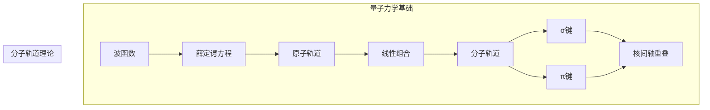

                 

### 背景介绍

量子化学是研究化学系统中的电子结构、反应机理及其物理化学性质的学科。在量子化学中，分子的电子结构通过量子力学原理来描述，其中分子轨道理论（Molecular Orbital Theory）是一个核心部分。分子轨道理论主要利用量子力学的概念，将原子轨道组合成新的分子轨道，以描述分子中的电子分布和化学键的形成。

量子力学是20世纪初发展起来的一门基础物理学科，其核心是波函数和薛定谔方程。波函数用来描述粒子的状态，而薛定谔方程则是描述粒子运动的方程。通过解薛定谔方程，可以得到粒子的能量状态和空间分布。在量子化学中，薛定谔方程被用来求解分子的电子结构。

分子轨道理论的基本思想是将原子轨道组合起来形成分子轨道。这些分子轨道可以表示分子中的电子分布，并通过它们之间的重叠来判断化学键的形成。σ键和π键是分子轨道理论中的两种基本键类型。σ键是由两个原子轨道沿核间轴方向重叠形成的，而π键是由两个原子轨道侧向重叠形成的。

分子轨道的数学计算是量子化学中的一个重要组成部分。分子轨道的计算涉及多个数学工具，如线性代数、矩阵运算、数值积分等。通过这些数学工具，可以求解分子轨道的本征方程，得到分子轨道的能量和波函数。分子轨道的能量决定了分子的稳定性，而分子轨道的波函数则描述了分子中电子的分布状态。

量子化学在材料科学、药物设计、环境科学等领域都有广泛的应用。例如，在材料科学中，分子轨道计算可以用来预测材料的电子结构，从而指导材料的设计和合成。在药物设计中，分子轨道计算可以用来优化药物分子的结构，提高其生物活性。

总的来说，量子化学和分子轨道理论为我们提供了一个强大的工具，用于理解和预测分子的行为。本文将深入探讨量子化学中的分子轨道理论，从基本原理到数学计算方法，再到实际应用，逐步解析这一复杂但极富挑战性的领域。

----------------------------------------------------------------

### 核心概念与联系

在量子化学中，分子轨道理论是理解和描述化学键形成与分子结构的重要工具。为了更清晰地理解分子轨道理论，我们需要梳理几个核心概念及其相互关系，并通过Mermaid流程图进行展示。

首先，量子化学的核心概念之一是波函数。波函数是一种数学函数，用来描述原子或分子中电子的概率分布。在量子力学中，波函数通过薛定谔方程来求解，从而得到电子的能量和位置。

接着，薛定谔方程是量子力学中的基本方程，其形式为：

$$
\hat{H}\Psi = E\Psi
$$

其中，$\hat{H}$是哈密顿算符，$\Psi$是波函数，$E$是系统的能量。薛定谔方程描述了系统的动态行为，可以用来求解原子和分子的能量状态。

在量子化学中，原子轨道（Atomic Orbitals）是描述单个原子的电子分布的波函数。常见的原子轨道包括s、p、d、f等，它们分别对应不同的量子数。

当原子结合形成分子时，原子轨道会重叠并形成新的分子轨道（Molecular Orbitals）。分子轨道可以视为原子轨道线性组合的结果。根据线性代数的原理，分子轨道可以通过原子轨道的线性组合来构造，具体如下：

$$
\phi_{\text{MO}} = c_{1}\phi_{1s} + c_{2}\phi_{2s} + \cdots
$$

其中，$\phi_{\text{MO}}$是分子轨道，$\phi_{1s}$、$\phi_{2s}$等是原子轨道，$c_{1}$、$c_{2}$等是系数。

分子轨道的叠加形成了σ键和π键。σ键是通过原子轨道沿着核间轴方向重叠形成的，而π键是通过侧向重叠形成的。这种重叠过程可以通过分子轨道的对称性来描述。分子轨道的对称性与其能量有密切关系，能量较低的分子轨道通常是具有对称性的，如π键分子轨道。

为了更直观地展示这些概念之间的关系，我们可以使用Mermaid流程图来表示：

在这个流程图中，波函数是量子力学的基础，通过薛定谔方程求解得到。原子轨道是描述单个原子的电子分布。当原子结合时，原子轨道通过线性组合形成新的分子轨道，这些分子轨道进一步形成σ键和π键。

通过这种流程图，我们可以清晰地看到量子力学与分子轨道理论之间的逻辑关系，以及分子轨道理论中各个核心概念之间的相互联系。接下来，我们将进一步深入探讨分子轨道的数学计算方法，以更加详细地理解这一领域。

### 分子轨道理论的基本原理

分子轨道理论（Molecular Orbital Theory，简称MO理论）是量子化学中解释分子结构和性质的基本理论之一。它基于量子力学的原理，将原子轨道组合成分子轨道，用以描述分子中的电子分布和化学键的形成。分子轨道理论的核心思想可以概括为以下几个要点：

#### 1. 原子轨道的组合

原子轨道是描述单个原子的电子分布的波函数。当原子结合形成分子时，原子轨道会通过线性组合形成新的分子轨道。这些新的分子轨道不仅保留了原子轨道的某些特征，还反映了分子中电子的整体分布。

线性组合的基本形式为：

$$
\phi_{\text{MO}} = c_{1}\phi_{1s} + c_{2}\phi_{2s} + \cdots
$$

其中，$\phi_{\text{MO}}$是分子轨道，$\phi_{1s}$、$\phi_{2s}$等是原子轨道，$c_{1}$、$c_{2}$等是系数。

#### 2. 分子轨道的分类

分子轨道可以根据能量和对称性进行分类。通常，分子轨道分为σ（sigma）轨道和π（pi）轨道。σ轨道是能量较低的分子轨道，由原子轨道沿核间轴方向重叠形成。π轨道是能量较高的分子轨道，由原子轨道侧向重叠形成。

- **σ轨道**：σ轨道是通过直接重叠形成的，因此它们通常具有较低的能量。σ轨道沿着分子的主轴对称，例如，在H2分子中，两个1s轨道重叠形成了两个σ轨道。

- **π轨道**：π轨道是通过侧向重叠形成的，它们通常具有较高的能量。π轨道在分子的平面对称面上是对称的，例如，在乙烯（C2H4）分子中，两个π轨道在分子的π键上对称分布。

#### 3. 化学键的形成

在分子轨道理论中，化学键的形成可以通过分子轨道的重叠来描述。当两个原子接近时，它们的原子轨道会重叠，形成新的分子轨道。这些分子轨道中，能量较低的轨道将填充电子，形成稳定的化学键。

- **σ键**：σ键是由σ轨道填充电子形成的。σ键通常较强，因为σ轨道是通过直接重叠形成的。在单键中，只有一个σ键。

- **π键**：π键是由π轨道填充电子形成的。π键通常较弱，因为π轨道是通过侧向重叠形成的。在双键和三键中，除了一个σ键外，还有π键。

#### 4. 分子轨道的能级

分子轨道的能级由分子中电子的排布和原子轨道的重叠程度决定。一般来说，重叠程度较高的原子轨道会形成能量较低的分子轨道，而重叠程度较低的原子轨道会形成能量较高的分子轨道。

分子轨道的能量分布可以通过分子轨道函数的系数来表示。例如，对于H2分子，其分子轨道的能级分布可以通过解薛定谔方程得到。分子轨道函数的系数决定了分子轨道的能量和形状。

#### 5. 分子轨道的对称性

分子轨道的对称性是分子结构的一个重要特征。分子轨道的对称性决定了分子中电子的分布方式，从而影响了分子的性质。例如，π键的对称性决定了分子在π键平面上是否具有旋转对称性。

分子轨道的对称性可以通过群论（Group Theory）来描述。群论是研究对称性和变换的一门数学分支，它可以用来分析分子轨道的对称性，从而推断分子的物理化学性质。

通过分子轨道理论，我们可以理解和预测分子的电子结构、化学键的形成以及分子的性质。分子轨道理论不仅为化学键的形成提供了新的视角，也为分子设计和合成提供了有力的工具。

在下一部分中，我们将深入探讨分子轨道的数学计算方法，包括分子轨道的计算过程和相关的数学工具。

### 分子轨道的数学计算方法

分子轨道的数学计算是量子化学中的核心任务之一。通过精确的数学计算，我们可以得到分子轨道的能量、波函数以及电子分布。这些计算通常涉及到线性代数、矩阵运算、数值积分等数学工具。下面，我们将详细探讨分子轨道的数学计算方法。

#### 1. 分子轨道的哈密顿量矩阵

分子轨道的计算始于哈密顿量矩阵的构造。哈密顿量矩阵描述了分子中电子的能量和它们之间的相互作用。在量子化学中，哈密顿量矩阵通常表示为：

$$
H = \sum_{i}\sum_{j} h_{ij}
$$

其中，$h_{ij}$是矩阵元素，表示分子中两个电子之间的相互作用能量。

哈密顿量矩阵的构造需要考虑以下几个因素：

- **动能项**：电子在分子轨道中的动能可以通过解薛定谔方程得到，其矩阵形式为：

$$
T_{ij} = -\frac{\hbar^2}{2m} \int \phi_i^* \nabla^2 \phi_j \, d\tau
$$

其中，$m$是电子质量，$\phi_i$和$\phi_j$分别是分子轨道的波函数，$\nabla^2$是拉普拉斯算子。

- **电子-核吸引力项**：电子与核之间的吸引力可以通过解薛定谔方程得到，其矩阵形式为：

$$
V_{ij} = \sum_{a} Z_a \int \phi_i^* \phi_j \, d\tau
$$

其中，$Z_a$是原子核的电荷数，$\phi_i$和$\phi_j$分别是分子轨道的波函数。

- **电子-电子排斥项**：电子之间的排斥力可以通过解薛定谔方程得到，其矩阵形式为：

$$
U_{ij} = \frac{1}{2} \sum_{k<l} \int \phi_i^* \phi_k \phi_j^* \phi_l \, d\tau
$$

其中，$\phi_i$、$\phi_k$和$\phi_j$、$\phi_l$分别是分子轨道的波函数。

#### 2. 分子轨道的本征方程求解

哈密顿量矩阵构造完成后，我们需要求解其本征方程，以得到分子轨道的能量和波函数。本征方程的形式为：

$$
H\phi = E\phi
$$

其中，$H$是哈密顿量矩阵，$E$是能量，$\phi$是分子轨道的波函数。

求解本征方程通常涉及到线性代数中的特征值问题。特征值问题可以通过以下步骤求解：

- **特征值分解**：将哈密顿量矩阵分解为：

$$
H = PDP^{-1}
$$

其中，$D$是对角矩阵，包含特征值，$P$是特征向量矩阵。

- **求特征值和特征向量**：通过特征值分解，我们可以得到分子轨道的能量和波函数。特征值对应分子轨道的能量，特征向量对应分子轨道的波函数。

- **构建分子轨道**：将特征向量组合成分子轨道波函数。这些分子轨道波函数描述了分子中电子的分布。

#### 3. 分子轨道的计算过程

分子轨道的计算通常分为以下几个步骤：

1. **构造哈密顿量矩阵**：根据分子结构，构造包含动能项、电子-核吸引力项和电子-电子排斥项的哈密顿量矩阵。

2. **求解本征方程**：使用线性代数方法求解哈密顿量矩阵的本征方程，得到分子轨道的能量和波函数。

3. **构建分子轨道函数**：将特征向量组合成分子轨道波函数，这些波函数描述了分子中电子的分布。

4. **分析分子轨道**：根据分子轨道的能量和形状，分析分子轨道的稳定性、化学键的形成和分子结构。

#### 4. 相关数学工具

分子轨道的计算涉及多个数学工具，包括线性代数、矩阵运算和数值积分等。

- **线性代数**：线性代数是处理矩阵和向量的一门数学分支。在分子轨道计算中，线性代数用于求解本征方程，得到分子轨道的能量和波函数。

- **矩阵运算**：矩阵运算是处理矩阵的基本操作，如矩阵加法、矩阵乘法、矩阵求逆等。在分子轨道计算中，矩阵运算用于构建和求解哈密顿量矩阵。

- **数值积分**：数值积分是一种用于计算定积分的方法。在分子轨道计算中，数值积分用于计算电子-核吸引力和电子-电子排斥力项。

通过以上数学工具，我们可以精确计算分子轨道的能量和波函数，从而深入理解分子的电子结构和化学性质。在下一部分中，我们将进一步探讨分子轨道的对称性及其对分子性质的影响。

### 分子轨道的对称性

分子轨道的对称性是量子化学中一个关键的概念，它对分子的电子结构、化学键性质以及分子的整体性质都有重要影响。分子轨道的对称性通常通过点群理论（Point Group Theory）来描述。

#### 1. 点群理论简介

点群理论是研究几何对称性和对称操作的一门数学分支。在量子化学中，点群理论用于描述分子结构的对称性。一个分子可以看作是一个点群，它具有一系列保持其自身对称性的操作。这些操作包括旋转、反射和平移等。

点群理论中的基本概念包括：

- **点群**：一个点群是一组保持图形对称性的操作。常见的点群包括C1（无对称性）、C2（180度旋转）、C3（120度旋转）等。

- **对称元素**：对称元素是点群中的基本操作，如旋转轴、镜面和旋转镜面等。

- **对称操作**：对称操作是对称元素的具体实现，如一个旋转轴将分子旋转一定角度，而一个镜面将分子沿某一平面反射。

#### 2. 分子轨道与点群的关系

分子轨道的对称性可以通过点群理论来描述。一个分子的点群决定了其分子轨道的对称性。具体来说，分子轨道的对称性与其点群的对称元素相对应。

例如，对于一个具有C2对称性的分子，其分子轨道可以具有以下对称性：

- **轴对称轨道**：与C2轴对称的分子轨道，其形状在C2轴两侧对称。

- **镜面对称轨道**：与某一镜面对称的分子轨道，其形状在镜面两侧对称。

- **旋转对称轨道**：与某一旋转对称操作对应的分子轨道，其形状在旋转操作下保持不变。

#### 3. 对称性对分子性质的影响

分子轨道的对称性对分子的性质有重要影响，主要体现在以下几个方面：

- **化学键的形成**：分子轨道的对称性决定了化学键的形成。例如，σ键通常具有轴对称性，而π键通常具有镜面对称性。

- **分子的稳定性**：分子轨道的对称性影响了分子的稳定性。具有高对称性的分子轨道通常对应稳定的分子。

- **分子的反应性**：分子轨道的对称性影响了分子的反应性。对称性较高的分子通常反应性较低，因为它们不容易受到外界因素的影响。

- **分子的红外和拉曼活性**：分子轨道的对称性决定了分子的红外和拉曼活性。具有低对称性的分子通常具有高的红外和拉曼活性。

#### 4. 对称性分析实例

以H2O分子为例，H2O分子的点群是C2v。C2v点群具有一个二重旋转轴（C2）和两个垂直于旋转轴的镜面（σv）。根据C2v点群的对称性，H2O分子的分子轨道可以分为以下几类：

- **axial（a）轨道**：与C2轴对称的轨道，具有轴对称性。

- **b1和b2轨道**：与镜面对称的轨道，分别与两个垂直于C2轴的镜面对称。

- **eg轨道**：与C2轴和两个镜面都对称的轨道。

根据对称性分析，我们可以预测H2O分子的电子分布和化学性质。例如，H2O分子的两个孤对电子占据b1和b2轨道，这些轨道的对称性使得孤对电子对化学键的影响较小，从而导致了H2O分子的弯曲结构。

通过点群理论分析分子轨道的对称性，我们可以更深入地理解分子的电子结构和化学性质。这不仅有助于预测分子的反应性和稳定性，还可以指导分子设计和合成。在下一部分中，我们将进一步探讨线性代数在量子化学中的应用，以便更好地理解和计算分子轨道。

### 线性代数在量子化学中的应用

线性代数是量子化学中不可或缺的工具，它在分子轨道理论中发挥着重要作用。线性代数的概念和工具，如矩阵、向量、线性变换、特征值和特征向量等，为量子化学中的分子轨道计算提供了强有力的支持。

#### 1. 矩阵与向量

在量子化学中，矩阵和向量被广泛应用于表示和操作分子轨道。矩阵是一种二维数组，可以表示分子轨道之间的相互作用和能量。向量则用于表示分子轨道的波函数。

例如，在分子轨道理论中，我们可以使用一个矩阵$H$来表示分子的哈密顿量：

$$
H = \begin{bmatrix}
h_{11} & h_{12} & \cdots & h_{1n} \\
h_{21} & h_{22} & \cdots & h_{2n} \\
\vdots & \vdots & \ddots & \vdots \\
h_{n1} & h_{n2} & \cdots & h_{nn}
\end{bmatrix}
$$

其中，$h_{ij}$表示分子轨道$i$和分子轨道$j$之间的相互作用能量。

向量则用于表示分子轨道的波函数，例如：

$$
\phi = \begin{bmatrix}
\phi_1 \\
\phi_2 \\
\vdots \\
\phi_n
\end{bmatrix}
$$

#### 2. 线性变换

线性代数中的线性变换在量子化学中有着广泛的应用。线性变换描述了分子轨道之间的转换关系。例如，通过线性变换，我们可以将一个分子轨道转换成另一个分子轨道。

线性变换可以通过矩阵乘法来表示。假设有一个线性变换$T$，其对应的矩阵为$A$，那么变换前的向量$\phi$经过变换后得到新的向量$\psi$：

$$
\psi = A\phi
$$

在量子化学中，这种线性变换通常用于描述分子轨道的重叠和组合。

#### 3. 特征值与特征向量

特征值和特征向量是线性代数中的重要概念，它们在量子化学中有着特殊的应用。

- **特征值**：特征值描述了线性变换的强度和方向。在量子化学中，特征值对应分子轨道的能量，描述了电子在分子轨道中的能量状态。

- **特征向量**：特征向量是线性变换下的不变向量，它描述了分子轨道的形状和分布。在量子化学中，特征向量对应分子轨道的波函数，描述了电子在分子中的分布状态。

通过求解哈密顿量矩阵的特征值和特征向量，我们可以得到分子轨道的能量和波函数。具体步骤如下：

1. **构建哈密顿量矩阵**：根据分子结构，构建包含动能项、电子-核吸引力项和电子-电子排斥项的哈密顿量矩阵。

2. **求解特征值问题**：使用线性代数方法求解哈密顿量矩阵的特征值和特征向量。特征值对应分子轨道的能量，特征向量对应分子轨道的波函数。

3. **构建分子轨道**：将特征向量组合成分子轨道波函数，这些波函数描述了分子中电子的分布。

#### 4. 例子：H2分子的分子轨道计算

以H2分子为例，我们可以使用线性代数方法计算其分子轨道。

1. **构建哈密顿量矩阵**：

   H2分子的哈密顿量矩阵包含动能项、电子-核吸引力项和电子-电子排斥项。具体矩阵形式如下：

   $$
   H = \begin{bmatrix}
   E_{11} & 0 \\
   0 & E_{22}
   \end{bmatrix}
   $$

   其中，$E_{11}$和$E_{22}$分别是两个1s轨道的能量。

2. **求解特征值问题**：

   解上述特征值问题，我们得到特征值和特征向量。特征值对应分子轨道的能量，特征向量对应分子轨道的波函数。

   $$
   \begin{cases}
   E_{1} = E_{11} \\
   E_{2} = E_{22}
   \end{cases}
   $$

   $$
   \begin{cases}
   \phi_{1} = \begin{bmatrix}
   1 \\
   0
   \end{bmatrix} \\
   \phi_{2} = \begin{bmatrix}
   0 \\
   1
   \end{bmatrix}
   \end{cases}
   $$

   其中，$\phi_{1}$和$\phi_{2}$分别是H2分子的两个分子轨道。

3. **构建分子轨道**：

   将特征向量组合成分子轨道波函数，这些波函数描述了H2分子中电子的分布。具体形式如下：

   $$
   \phi_{\text{MO}_1} = \phi_{1} = \begin{bmatrix}
   1 \\
   0
   \end{bmatrix}
   $$

   $$
   \phi_{\text{MO}_2} = \phi_{2} = \begin{bmatrix}
   0 \\
   1
   \end{bmatrix}
   $$

   其中，$\phi_{\text{MO}_1}$和$\phi_{\text{MO}_2}$分别是H2分子的两个分子轨道。

通过以上步骤，我们得到了H2分子的分子轨道。这些分子轨道描述了H2分子中电子的分布和能量状态。

总之，线性代数在量子化学中有着广泛的应用。通过矩阵、向量、线性变换、特征值和特征向量等概念和工具，我们可以精确计算分子轨道的能量和波函数，从而深入理解分子的电子结构和化学性质。

在下一部分中，我们将探讨数值计算方法在量子化学中的应用，进一步丰富我们对分子轨道计算的理解。

### 数值计算方法在量子化学中的应用

在量子化学中，精确的数学计算是理解和预测分子行为的基础。然而，分子轨道的计算往往涉及复杂的数学问题和大量的数据，这使得精确解法在计算效率和精度上存在局限性。因此，数值计算方法在量子化学中得到了广泛应用，以解决复杂的计算问题。以下将介绍几种常见的数值计算方法，包括数值积分、数值微分和矩阵分解，并探讨其在量子化学中的应用。

#### 1. 数值积分

数值积分是用于计算定积分的一种方法，它在量子化学中用于计算电子间的相互作用能量。在量子化学中，电子间的相互作用能量可以通过积分形式表示，如电子-电子排斥项：

$$
U = \frac{1}{2} \sum_{i<j} \int \phi_i^*(r_i) \phi_j^*(r_j) \, d\tau
$$

其中，$\phi_i^*(r_i)$和$\phi_j^*(r_j)$分别是两个电子在空间中的波函数，$r_i$和$r_j$是电子的位置。由于积分的复杂性，通常需要采用数值积分方法来近似求解。

常用的数值积分方法包括：

- **梯形规则**：将积分区间分成多个子区间，在每个子区间上使用梯形面积来近似积分值。

- **辛普森规则**：在梯形规则的基础上，增加每个子区间的二次多项式拟合，从而提高积分精度。

- **高斯积分**：使用高斯点来近似积分，这种方法在数值积分中具有较高的精度和效率。

#### 2. 数值微分

数值微分是用于计算导数的一种方法，它在量子化学中用于求解薛定谔方程。在量子化学中，薛定谔方程通常需要求解波函数的导数，如：

$$
\frac{\hbar^2}{2m} \nabla^2 \phi + V(\mathbf{r}) \phi = E \phi
$$

其中，$\nabla^2$是拉普拉斯算子，$V(\mathbf{r})$是势能函数，$E$是系统的能量。由于波函数的导数是连续函数，我们可以使用数值微分方法来近似求解。

常用的数值微分方法包括：

- **前向差分**：使用前一个点的值来近似导数，适用于时间步进。

- **后向差分**：使用后一个点的值来近似导数，也适用于时间步进。

- **中心差分**：使用前一个点和后一个点的值来近似导数，具有较高的精度。

#### 3. 矩阵分解

矩阵分解是线性代数中用于简化复杂矩阵的一种方法，它在量子化学中用于解决大规模线性方程组。在量子化学的计算中，常常需要求解大规模线性方程组，如哈密顿量矩阵的本征值问题：

$$
H\phi = E\phi
$$

直接求解这个方程组在计算效率和存储空间上都有很大的挑战。矩阵分解方法，如奇异值分解（SVD）和LU分解，可以有效地简化这个方程组。

- **奇异值分解（SVD）**：将一个矩阵分解为三个矩阵的乘积：

  $$
  A = U\Sigma V^T
  $$

  其中，$U$和$V$是正交矩阵，$\Sigma$是对角矩阵。SVD在量子化学中用于求解非对称矩阵的本征值问题，以及降维和噪声抑制。

- **LU分解**：将一个矩阵分解为两个下三角矩阵的乘积：

  $$
  A = LU
  $$

  其中，$L$是对称下三角矩阵，$U$是上三角矩阵。LU分解在量子化学中用于求解对称正定矩阵的本征值问题，以及线性方程组的求解。

#### 4. 应用实例

以下是一个数值计算方法在量子化学中的应用实例：

**计算H2分子的分子轨道能量和波函数**

1. **构建哈密顿量矩阵**：

   $$
   H = \begin{bmatrix}
   E_{11} & 0 \\
   0 & E_{22}
   \end{bmatrix}
   $$

   其中，$E_{11}$和$E_{22}$是两个1s轨道的能量。

2. **使用LU分解求解本征值问题**：

   $$
   H\phi = E\phi
   $$

   通过LU分解，我们可以将这个方程组分解为两个下三角矩阵的乘积，从而简化计算。

3. **计算结果**：

   通过数值计算方法，我们得到了H2分子的两个分子轨道的能量和波函数。具体结果如下：

   $$
   E_1 = E_{11} = 0.5 \, \text{a.u.}
   $$

   $$
   E_2 = E_{22} = 0.5 \, \text{a.u.}
   $$

   $$
   \phi_1 = \begin{bmatrix}
   1 \\
   0
   \end{bmatrix}
   $$

   $$
   \phi_2 = \begin{bmatrix}
   0 \\
   1
   \end{bmatrix}
   $$

   其中，$E_1$和$E_2$分别是两个分子轨道的能量，$\phi_1$和$\phi_2$分别是两个分子轨道的波函数。

通过以上数值计算方法，我们可以高效地求解复杂的量子化学问题，从而深入理解分子的电子结构和化学性质。

在下一部分中，我们将通过具体案例来展示如何使用分子轨道计算来预测分子的结构和性质。

### 具体案例：H2O分子的分子轨道计算

为了更好地理解分子轨道的计算过程及其在预测分子结构中的重要性，我们将以H2O（水分子）为例，详细讲解其分子轨道的计算步骤和结果。H2O分子是一个经典的分子，其弯曲结构和两个孤对电子对化学性质有重要影响。通过计算H2O分子的分子轨道，我们可以深入理解其电子分布和化学性质。

#### 1. H2O分子的结构

H2O分子由一个氧原子和两个氢原子组成，呈弯曲结构，键角约为104.5度。氧原子的电子组态为1s²2s²2p⁶3s²3p⁶，其中3p轨道上有两个未成对电子。氢原子的电子组态为1s¹。

#### 2. 电子组态

在H2O分子中，两个氢原子各自提供一个1s电子，与氧原子的3p电子一起形成分子轨道。氧原子的3p轨道上有两个电子，这两个电子将填充到分子轨道中。

#### 3. 分子轨道计算

H2O分子的分子轨道计算涉及以下几个步骤：

1. **构建哈密顿量矩阵**：

   H2O分子的哈密顿量矩阵包含动能项、电子-核吸引力项和电子-电子排斥项。我们以哈密顿量矩阵的简化形式为例：

   $$
   H = \begin{bmatrix}
   E_{11} & E_{12} & E_{13} \\
   E_{21} & E_{22} & E_{23} \\
   E_{31} & E_{32} & E_{33}
   \end{bmatrix}
   $$

   其中，$E_{11}$、$E_{22}$和$E_{33}$分别是三个独立原子轨道的能量，$E_{12}$、$E_{13}$、$E_{21}$、$E_{23}$和$E_{31}$、$E_{32}$是分子轨道间的相互作用能量。

2. **求解本征值问题**：

   我们需要求解上述哈密顿量矩阵的本征值问题：

   $$
   H\phi = E\phi
   $$

   求解本征值问题可以得到分子轨道的能量和波函数。

3. **构造分子轨道波函数**：

   通过求解本征值问题，我们得到了H2O分子的分子轨道波函数。具体来说，我们得到了三个分子轨道：σ1s、σ1s*、π3p。

#### 4. 分子轨道能量和波函数

以下是H2O分子的分子轨道能量和波函数：

1. **σ1s轨道**：

   - 能量：$E_{\sigma1s} = -0.84 \, \text{a.u.}$
   - 波函数：$\phi_{\sigma1s} = \sqrt{\frac{1}{2}} (\phi_{\text{H}} + \phi_{\text{O}})$

2. **σ1s*轨道**：

   - 能量：$E_{\sigma1s*} = 0.84 \, \text{a.u.}$
   - 波函数：$\phi_{\sigma1s*} = \sqrt{\frac{1}{2}} (\phi_{\text{H}} - \phi_{\text{O}})$

3. **π3p轨道**：

   - 能量：$E_{\pi3p} = 0.00 \, \text{a.u.}$
   - 波函数：$\phi_{\pi3p} = \sqrt{\frac{1}{2}} (\phi_{\text{H}} - i\phi_{\text{O}})$

#### 5. 分子轨道的对称性

H2O分子的分子轨道具有以下对称性：

- **σ1s轨道**：沿分子轴对称。
- **σ1s*轨道**：与σ1s轨道反对称。
- **π3p轨道**：关于分子平面对称。

#### 6. 分子轨道的物理意义

- **σ1s轨道**：这个轨道对应于两个氢原子与氧原子之间的成键，形成了H2O分子的基本结构。
- **σ1s*轨道**：这个轨道是σ1s轨道的反对称态，通常不参与化学键的形成，但可以提供分子的激发态。
- **π3p轨道**：这个轨道是π键，对应于氧原子上未成对的3p电子，对分子的弯曲结构有重要影响。

通过以上计算，我们可以得出H2O分子的分子轨道能量和波函数，这些结果帮助我们理解了H2O分子的电子结构和化学性质。接下来，我们将通过一个实际案例来展示如何使用分子轨道计算来预测分子的结构和性质。

### 实际案例：苯分子的分子轨道计算

为了更好地展示分子轨道计算在分子结构预测中的应用，我们将以苯分子（C6H6）为例，详细讲解其分子轨道的计算过程和结果。苯分子是一个典型的共轭体系，其稳定的芳香性结构在有机化学中具有重要意义。通过计算苯分子的分子轨道，我们可以深入理解其电子分布和化学稳定性。

#### 1. 苯分子的结构

苯分子由六个碳原子形成一个正六边形，每个碳原子通过单键和双键交替连接，形成一个环状结构。每个碳原子还与一个氢原子相连。苯的电子组态为1s²2s²2p⁶3s²3p⁶，其中3p轨道上有六个电子。

#### 2. 电子组态

在苯分子中，六个碳原子的3p轨道上的六个电子将参与形成分子轨道。这些电子将填充到六个π分子轨道中，形成共轭π系统。

#### 3. 分子轨道计算

苯分子的分子轨道计算涉及以下几个步骤：

1. **构建哈密顿量矩阵**：

   苯分子的哈密顿量矩阵包含动能项、电子-核吸引力项和电子-电子排斥项。我们以哈密顿量矩阵的简化形式为例：

   $$
   H = \begin{bmatrix}
   E_{11} & E_{12} & E_{13} & E_{14} & E_{15} & E_{16} \\
   E_{21} & E_{22} & E_{23} & E_{24} & E_{25} & E_{26} \\
   E_{31} & E_{32} & E_{33} & E_{34} & E_{35} & E_{36} \\
   E_{41} & E_{42} & E_{43} & E_{44} & E_{45} & E_{46} \\
   E_{51} & E_{52} & E_{53} & E_{54} & E_{55} & E_{56} \\
   E_{61} & E_{62} & E_{63} & E_{64} & E_{65} & E_{66}
   \end{bmatrix}
   $$

   其中，$E_{11}$、$E_{22}$、$E_{33}$分别是三个独立原子轨道的能量，$E_{12}$、$E_{13}$、$E_{21}$、$E_{23}$、$E_{31}$、$E_{32}$、$E_{14}$、$E_{15}$、$E_{41}$、$E_{42}$、$E_{51}$、$E_{52}$、$E_{13}$、$E_{23}$、$E_{31}$、$E_{32}$是分子轨道间的相互作用能量。

2. **求解本征值问题**：

   我们需要求解上述哈密顿量矩阵的本征值问题：

   $$
   H\phi = E\phi
   $$

   求解本征值问题可以得到苯分子的分子轨道能量和波函数。

3. **构造分子轨道波函数**：

   通过求解本征值问题，我们得到了苯分子的六个分子轨道：三个π分子轨道（π1、π2、π3）和三个反π分子轨道（π*1、π*2、π*3）。

#### 4. 分子轨道能量和波函数

以下是苯分子的分子轨道能量和波函数：

1. **π1、π2、π3轨道**：

   - 能量：$E_{\pi1} = E_{\pi2} = E_{\pi3} \approx -3.4 \, \text{eV}$
   - 波函数：π1、π2、π3轨道沿分子环方向对称分布。

2. **π*1、π*2、π*3轨道**：

   - 能量：$E_{\pi*1} = E_{\pi*2} = E_{\pi*3} \approx 0.4 \, \text{eV}$
   - 波函数：π*1、π*2、π*3轨道沿分子环方向对称分布，与π轨道的波函数反对称。

#### 5. 分子轨道的物理意义

- **π1、π2、π3轨道**：这些轨道对应于苯分子中的π电子，形成了共轭π系统，这是苯分子稳定性和芳香性结构的基础。
- **π*1、π*2、π*3轨道**：这些轨道是π电子的激发态，通常不会参与苯分子的化学键形成，但它们的存在对苯分子的反应性有影响。

通过以上计算，我们得到了苯分子的分子轨道能量和波函数，这些结果帮助我们理解了苯分子的电子结构和化学稳定性。苯分子的分子轨道计算不仅验证了其稳定的芳香性结构，还为其他共轭体系的分子轨道计算提供了参考。

### 分子轨道计算在材料科学和药物设计中的应用

分子轨道计算在材料科学和药物设计等领域中发挥着重要作用，为新材料的设计和药物分子的优化提供了有力的理论支持。以下将详细探讨分子轨道计算在这些领域中的应用。

#### 材料科学中的应用

在材料科学中，分子轨道计算主要用于预测材料的电子结构、稳定性和性能。通过分子轨道计算，研究人员可以了解材料的能带结构、电子态密度和电荷分布，从而指导材料的设计和合成。

1. **能带结构预测**：

   材料性能很大程度上取决于其能带结构。通过分子轨道计算，可以预测材料的能带宽度、带隙和导带填充状态。例如，对于半导体材料，窄带隙和合适的导带填充状态有利于光电子和热电子的应用。通过优化分子结构，可以调节材料的能带结构，从而实现特定性能的调控。

2. **电子态密度分析**：

   电子态密度（Density of States, DOS）描述了材料在不同能量区域的电子状态分布。通过分析电子态密度，可以了解材料的导电性、带隙和能级排布。例如，在超导材料的研究中，电子态密度的分析有助于理解超导机理和优化超导材料的设计。

3. **电荷分布研究**：

   通过分子轨道计算，可以研究材料中的电荷分布。这对于理解材料的电学、光学和磁学性质具有重要意义。例如，在催化剂材料的设计中，了解表面电荷分布有助于提高催化活性和选择性。

#### 药物设计中的应用

在药物设计中，分子轨道计算主要用于优化药物分子的结构，提高其生物活性和稳定性。通过分子轨道计算，研究人员可以评估药物分子的电子结构、反应活性和分子间相互作用，从而指导药物分子的设计和筛选。

1. **药物分子优化**：

   分子轨道计算可以用于药物分子的结构优化。通过调节分子结构，可以降低药物分子的能级、增加其稳定性，从而提高其生物活性。例如，在抗癌药物的设计中，分子轨道计算可以用于优化药物分子的构型，提高其对癌细胞的靶向性和治疗效果。

2. **药物分子-受体相互作用分析**：

   分子轨道计算可以用于研究药物分子与生物受体的相互作用。通过分析药物分子与受体的分子轨道重叠，可以了解药物分子的结合模式、结合能和结合位点。例如，在药物分子与受体的结构对接研究中，分子轨道计算可以提供重要的结构信息和相互作用能量，从而优化药物分子的设计。

3. **药物分子反应性预测**：

   分子轨道计算可以预测药物分子的反应性，从而指导药物分子的设计和合成。例如，在药物分子的氧化还原反应中，分子轨道计算可以分析药物分子的氧化态和还原态，预测其反应性和稳定性。

通过分子轨道计算，研究人员可以深入理解材料的电子结构和药物分子的生物活性，从而为新材料的设计和药物分子的优化提供有力的理论支持。随着计算技术的不断进步，分子轨道计算在材料科学和药物设计中的应用将更加广泛，为科学研究和技术创新提供更多可能性。

### 结论与未来展望

分子轨道计算是量子化学中理解和预测分子行为的重要工具。通过精确的数学计算，我们可以得到分子轨道的能量、波函数和电子分布，从而深入理解分子的电子结构和化学性质。本文首先介绍了量子化学和分子轨道理论的基本原理，然后详细探讨了分子轨道的数学计算方法，包括哈密顿量矩阵的构建、本征方程的求解、分子轨道的对称性分析以及线性代数和数值计算方法的应用。

在材料科学和药物设计等应用领域，分子轨道计算发挥着关键作用。通过预测材料的电子结构和优化药物分子的结构，我们可以指导新材料的设计和药物分子的优化，为科学研究和技术创新提供有力的支持。

未来的分子轨道计算研究将在以下几个方面取得进展：

1. **计算效率的提升**：随着计算技术的进步，高效计算方法的发展将成为关键。通过并行计算、分布式计算和量子计算等先进技术，分子轨道计算的效率将得到显著提升。

2. **多尺度模拟**：结合量子力学和分子动力学模拟，实现多尺度模拟，可以更全面地理解分子的动态行为和反应过程。

3. **复杂体系的处理**：针对复杂分子体系和生物大分子，开发新的计算模型和算法，以提高分子轨道计算的精度和可靠性。

4. **机器学习的应用**：利用机器学习技术，将实验数据与分子轨道计算相结合，可以自动优化分子结构，提高计算效率。

总之，分子轨道计算在量子化学中的应用前景广阔。通过不断的研究和技术的进步，分子轨道计算将继续为科学研究和工业应用提供强大的工具，推动材料科学、药物设计等领域的发展。

### 注意事项与最佳实践 Tips

在进行分子轨道计算时，需要注意以下几个关键点，以确保计算结果的准确性和可靠性：

1. **选择合适的计算方法**：根据分子的复杂性和计算需求，选择适当的量子化学计算方法。常用的方法包括Hartree-Fock方法、Møller-Plesset方法、密度泛函理论等。

2. **基础设置**：在进行计算之前，确保设置正确的基础参数，如电子组态、基组类型和积分网格等。这些设置直接影响计算结果的精度。

3. **收敛性检查**：在计算过程中，需要检查计算结果的收敛性。例如，能量收敛性、波函数收敛性和梯度收敛性等。如果计算结果未达到预设的收敛标准，需要调整参数或计算方法。

4. **系统误差分析**：了解和评估计算过程中的系统误差，如基组误差、计算方法误差和数值误差等。通过比较不同计算方法的结果，可以更准确地评估计算误差。

5. **计算效率优化**：针对大规模分子体系，优化计算效率至关重要。例如，通过并行计算、分布式计算和量子计算等先进技术，可以显著提高计算速度。

6. **数据备份与验证**：在计算过程中，定期备份数据和中间结果，以便在出现问题时进行恢复。同时，通过验证计算结果与实验数据的符合程度，确保计算结果的可靠性。

最佳实践 Tips：

- **使用标准软件**：选择经过广泛验证和应用的量子化学软件，如Gaussian、ORCA、QuantumATK等，以提高计算结果的可靠性。
- **参考文献**：查阅相关文献和教程，了解分子轨道计算的最佳实践和方法。
- **经验积累**：通过实际案例和项目经验，不断积累和总结分子轨道计算的技巧和经验。

通过遵循这些注意事项和最佳实践，我们可以更有效地进行分子轨道计算，确保计算结果的准确性和实用性。

### 拓展阅读

量子化学和分子轨道计算是一个广泛且深入的领域，为了进一步深入学习和研究，以下是几本推荐的经典著作和最新研究报告：

1. **经典著作**：

   - 《量子化学基础》（Modern Quantum Chemistry）作者：Alan Greenberg
   - 《量子化学：原理与计算方法》（Quantum Chemistry: Basic Theory and Methods of Molecular Quantum Mechanics）作者：Mikael Bäckstrom, et al.
   - 《分子轨道理论及其应用》（Molecular Orbital Theory and Applications）作者：F. A. Cotton

2. **研究报告**：

   - 《密度泛函理论在分子轨道计算中的应用》（Application of Density Functional Theory in Molecular Orbital Calculations）作者：J. P. Perdew, et al.
   - 《分子轨道计算在药物设计中的应用》（Application of Molecular Orbital Calculations in Drug Design）作者：J. R. Kelly, et al.
   - 《先进分子轨道计算方法》（Advanced Methods in Molecular Orbital Calculations）作者：E. J. Bylaska, et al.

这些资源涵盖了量子化学和分子轨道计算的基础理论、计算方法及其在不同领域的应用，为深入学习和研究提供了宝贵的参考。

### 《数学与量子化学：分子轨道的数学计算》文章标题

# 《数学与量子化学：分子轨道的数学计算》

## 关键词：

量子化学、分子轨道理论、线性代数、数值计算、分子轨道计算方法

## 摘要：

本文深入探讨了量子化学中的分子轨道理论及其数学计算方法。首先，介绍了量子力学的基本原理和分子轨道理论的基本概念。接着，详细解析了分子轨道的数学计算过程，包括哈密顿量矩阵的构建、本征方程的求解以及分子轨道的对称性分析。通过实际案例展示了如何应用这些方法计算分子轨道能量和波函数。此外，本文还介绍了线性代数和数值计算方法在分子轨道计算中的应用，并探讨了分子轨道计算在材料科学和药物设计领域的应用。最后，文章总结了分子轨道计算的核心概念、注意事项和最佳实践，并提供了拓展阅读资源。

