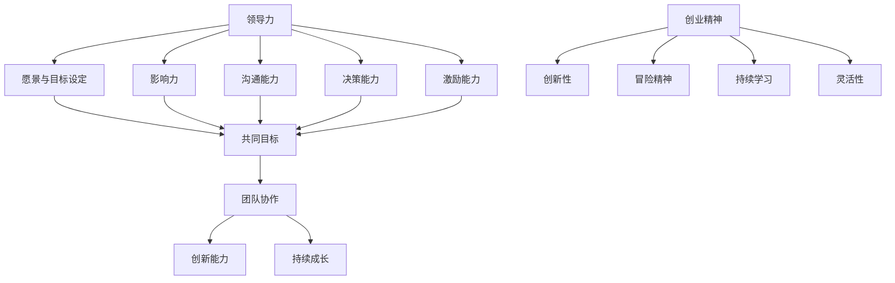

                 

### 文章标题

《领导力与创业精神：激发团队创新》

关键词：领导力、创业精神、团队创新、领导力模型、创业管理

摘要：本文深入探讨了领导力与创业精神在团队创新中的重要性，通过定义和案例分析，详细阐述了如何运用领导力和创业精神激发团队创新能力。文章旨在为IT领域的领导者提供实用的策略和方法，以提升团队的创新效率和成果。

### 引言

在快速变化的科技领域，创新已经成为企业保持竞争力的关键。作为领导者，如何激发团队的创新能力，成为了一个重要的课题。领导力与创业精神在这种背景下显得尤为重要。领导力不仅仅关乎管理，更关乎激励、引导和塑造团队的创新能力。而创业精神则强调勇于尝试、敢于挑战和持续创新的态度。本文将从以下几个方面进行探讨：

1. **领导力与创业精神的定义与重要性**：明确领导力和创业精神的概念，并解释它们在团队创新中的核心作用。
2. **领导力模型与理论**：介绍几种经典的领导力模型，探讨如何将其应用于创业环境中。
3. **创业精神的培养与激发**：探讨创业精神的本质，并提供培养和激发团队创业精神的策略。
4. **领导力与创业精神在实践中的应用**：通过实际案例，展示领导力和创业精神在激发团队创新中的具体应用。
5. **领导力与创业精神的未来发展趋势**：展望数字化时代下领导力和创业精神的发展方向。

通过本文的探讨，我们希望能够为IT领域的领导者提供一套系统且实用的方法论，以更好地激发团队的创新能力，推动企业持续发展。

### 领导力与创业精神的定义与重要性

#### 领导力的定义与特征

领导力是一个广泛讨论但定义多样的概念。根据卡耐基的说法，“领导力不是一种与生俱来的天赋，而是一种可以通过学习和实践获得的技能。”领导力不仅仅是管理，更是一种影响力，能够激励和引导他人朝着共同的目标前进。

领导力的特征可以从以下几个方面进行描述：

1. **愿景与目标设定**：领导者需要具备明确的目标和愿景，并能够将这种愿景传达给团队成员，使他们为之努力。
2. **影响力**：领导者通过个人魅力、专业知识或权威来影响团队成员的行为和决策。
3. **沟通能力**：有效的沟通能力是领导力的核心，领导者需要能够清晰、准确地传达信息，同时也要倾听和理解团队成员的意见。
4. **决策能力**：领导者需要具备快速且明智的决策能力，能够在面对复杂和不确定的环境时做出正确的选择。
5. **激励能力**：领导者能够通过激励措施激发团队成员的积极性和创造力。

#### 创业精神的定义与价值

创业精神是指一种敢于创新、冒险和追求卓越的精神状态。它不仅体现在创业者身上，也可以在普通员工中培养和激发。根据彼得·德鲁克的观点，“创业精神是一种特殊的态度，是对机会的敏锐感知和利用。”创业精神的核心特征包括：

1. **创新性**：创业精神鼓励团队成员敢于尝试新方法和新思路，不断寻找改进和优化的机会。
2. **冒险精神**：创业者往往愿意承担一定的风险，以实现更大的回报。
3. **持续学习**：创业精神强调持续学习和成长，通过不断学习新知识和技能来提升自身竞争力。
4. **灵活性**：面对变化和挑战时，创业精神强调灵活调整策略和行动。

#### 领导力与创业精神的联系

领导力与创业精神之间存在着密切的联系。领导力是创业精神的重要推动力，而创业精神则为领导力提供了新的方向和动力。

1. **领导力激发创业精神**：通过设定明确的目标和愿景，领导者能够激励团队成员追求卓越和创新。同时，领导者的激励措施和积极沟通也有助于培养团队成员的创业精神。

2. **创业精神增强领导力**：创业精神强调创新和灵活性，这种精神状态可以促使领导者更加开放和接受新的想法，从而提升领导力水平。

3. **共同目标**：领导力和创业精神都强调团队的合作和共同目标。通过共同的目标，领导者和团队成员能够更好地协同工作，实现创新和成长。

为了更好地理解领导力与创业精神之间的关系，我们可以通过一个Mermaid流程图来展示它们的核心概念和联系：



通过这个流程图，我们可以清晰地看到领导力和创业精神的核心概念以及它们之间的相互关系。在接下来的章节中，我们将进一步探讨如何将领导力和创业精神应用于实践，以激发团队的创新能力。

### 领导力模型与理论

在探讨领导力如何应用于创业环境之前，有必要了解一些经典的领导力模型和理论。这些模型和理论为我们提供了理解领导力的不同角度，并帮助我们将其应用于激发团队创新。

#### 经典领导力模型

1. **情境领导模型**：由赫赛和布兰查德提出的情境领导模型认为，领导者的风格应该根据团队成员的成熟度进行调节。该模型将领导风格分为四种：指导型、推销型、参与型和授权型。在不同情境下，领导者需要灵活调整自己的领导风格，以适应团队成员的需求。

   ```mermaid
   graph TB

   A[指导型] --> B(高工作-低关系)
   C[推销型] --> D(高工作-高关系)
   E[参与型] --> F(低工作-高关系)
   G[授权型] --> H(低工作-低关系)

   A --> I[低成熟度]
   C --> J[中成熟度]
   E --> K[高成熟度]
   G --> L[高成熟度]

   subgraph 情境领导模型
   B --> D
   D --> F
   F --> H
   end
   ```

2. **变革型领导模型**：变革型领导强调领导者通过激励、启发和激励团队成员来实现变革。变革型领导者的特征包括愿景激励、个性化关怀、智力刺激和理想化影响力。

   ```mermaid
   graph TB

   A[愿景激励] --> B[个性化关怀]
   A --> C[智力刺激]
   A --> D[理想化影响力]

   subgraph 变革型领导模型
   B --> C
   C --> D
   end
   ```

3. **路径-目标模型**：由豪斯提出的路径-目标模型认为，领导者的任务是确保团队成员明确目标，并提供必要的支持和指导，以实现这些目标。

   ```mermaid
   graph TB

   A[路径-目标领导] --> B[结果取向]
   A --> C[支持性领导]
   A --> D[参与性领导]

   subgraph 路径-目标模型
   B --> C
   C --> D
   end
   ```

#### 创新领导力理论

除了上述经典的领导力模型，还有一些专门针对创新环境的领导力理论。以下是两个重要的创新领导力理论：

1. **创新领导力理论**：创新领导力理论强调领导者需要具备创造性和变革能力，以推动创新活动。领导者应该鼓励团队成员提出新想法，并创建一个支持创新的文化。

   ```mermaid
   graph TB

   A[鼓励创新] --> B[创造支持环境]
   A --> C[提供资源]
   A --> D[激励创新行为]

   subgraph 创新领导力理论
   B --> C
   C --> D
   end
   ```

2. **设计思维领导力**：设计思维是一种以用户为中心的思维方式，领导者需要具备设计思维，以更好地理解和满足用户需求。设计思维领导力强调领导者要具备同理心、协作和快速迭代的能力。

   ```mermaid
   graph TB

   A[同理心] --> B[协作]
   A --> C[快速迭代]

   subgraph 设计思维领导力
   B --> C
   end
   ```

#### 领导力模型的应用与选择

在创业环境中，领导者需要根据实际情况选择合适的领导力模型。以下是几种领导力模型在实际应用中的建议：

1. **情境领导模型**：在创业初期，团队成员可能还处于较低的成熟度，领导者可以采用指导型或推销型领导风格，提供具体的指导和激励。随着团队成员逐渐成熟，领导者可以逐渐采用参与型或授权型领导风格，给予更多的自主权和责任。

2. **变革型领导模型**：在面临重大变革或创新挑战时，变革型领导模型能够激发团队成员的积极性和创造力。领导者通过设定明确的愿景和激励措施，引导团队成员共同实现变革目标。

3. **路径-目标模型**：在项目管理和执行阶段，路径-目标模型可以帮助领导者确保团队成员明确目标，并提供必要的支持和指导。领导者需要根据项目的进展情况，灵活调整领导风格，以适应团队成员的需求。

4. **创新领导力和设计思维领导力**：在创新项目中，领导者需要具备创新能力和设计思维，以推动项目的顺利进行。通过鼓励创新、提供资源和支持，领导者可以激发团队成员的创新潜力。

总之，选择合适的领导力模型是领导者的重要任务。通过理解各种领导力模型的理论和实践应用，领导者可以更好地激发团队的创新能力，推动企业持续发展。

### 领导者的角色与责任

在探讨领导力如何激发团队创新时，我们不得不深入探讨领导者的角色与责任。领导者不仅是团队的领导者，更是团队的灵魂人物。他们的行为、态度和决策直接影响团队的创新能力和整体绩效。以下是领导者需要关注的几个关键方面：

#### 领导者的角色转变

1. **从管理者到领导者**：传统的管理者更多地关注流程和效率，而领导者则更注重激励和赋能。领导者需要从管理任务和流程中解放出来，将更多精力投入到团队的发展和激励上。

2. **从控制者到赋能者**：领导者需要从控制团队的每一步转变为赋能团队成员，让他们发挥最大潜力。这要求领导者具备开放心态，鼓励团队成员提出新想法，并给予他们试错的机会。

3. **从决策者到协调者**：在创新过程中，领导者不再是单一决策者，而是一个协调者。领导者需要平衡不同团队成员的意见，协调各方资源，确保创新项目顺利进行。

#### 领导者的责任与义务

1. **设定清晰的目标和愿景**：领导者需要明确团队的目标和愿景，并将其传达给每一位成员。这有助于激发团队成员的积极性和创造力，使他们明确自己的努力方向。

2. **激励和鼓舞团队**：领导者需要通过激励措施和鼓舞人心的演讲，激发团队成员的潜能。领导者应该鼓励团队成员勇于尝试新方法，不畏困难，持续创新。

3. **提供必要的资源和支持**：领导者需要确保团队拥有实现目标所需的资源和支持。这包括技术资源、人力资源和财务支持。领导者应该为团队成员提供必要的培训和发展机会，帮助他们提升能力。

4. **建立积极的团队文化**：领导者需要营造一个积极、开放和创新的团队文化。这包括鼓励团队成员之间的合作和分享，容忍失败，以及倡导持续学习和改进。

#### 领导者如何平衡工作与生活

1. **时间管理**：领导者需要合理安排时间，确保工作与生活之间的平衡。这包括设定优先级，避免过度工作，以及利用空闲时间进行自我提升。

2. **建立健康的工作环境**：领导者需要关注团队成员的工作环境，确保他们能够在一个舒适、安全和有益的环境中工作。这包括提供良好的办公条件、合理安排工作任务，以及关注团队成员的心理健康。

3. **培养家庭观念**：领导者需要认识到家庭的重要性，并努力平衡工作与家庭。这包括花时间与家人相处，参与家庭活动，以及为家庭成员提供必要的支持。

通过以上几个方面的探讨，我们可以看到领导者的角色与责任在激发团队创新中的重要性。领导者需要不断学习和成长，提升自己的领导力，以更好地履行自己的职责，推动团队实现创新目标。

### 创业精神的培养与激发

创业精神是一种特殊的态度和行动模式，它强调创新、冒险和持续学习。在团队中培养和激发创业精神，是领导者的重要任务之一。以下是一些关键步骤和策略：

#### 创业精神的本质与特点

1. **创新性**：创业精神首先表现在对创新的追求上。它鼓励团队成员不断尝试新方法、新技术和新思路，以实现突破性进展。
2. **冒险精神**：创业精神不畏惧风险，愿意承担必要的风险以实现更大的回报。这需要团队成员具备勇气和信心，敢于面对不确定性。
3. **持续学习**：创业精神强调不断学习和提升自己。团队成员需要保持好奇心，勇于接受新知识，并将其应用于实际工作中。
4. **灵活性**：面对变化和挑战时，创业精神强调快速调整策略和行动。这要求团队成员具备灵活的思维和行动能力，以适应快速变化的环境。

#### 创业精神的培养方法

1. **树立榜样**：领导者自身应该具备创业精神，通过自己的行为和态度，树立榜样作用。这有助于激发团队成员的创业精神。
2. **提供资源和支持**：领导者需要为团队成员提供必要的资源和支持，包括技术资源、人力资源和财务支持。这有助于团队成员勇于尝试新想法，并在实践中不断改进。
3. **鼓励试错**：创业者往往会经历多次失败，但关键在于从失败中学习。领导者应该鼓励团队成员勇于尝试，容忍失败，并从中吸取经验教训。
4. **建立创新机制**：企业可以建立创新机制，如创新竞赛、头脑风暴会议和开放论坛，以鼓励团队成员提出新想法。这些机制有助于激发团队的创业精神，促进创新。

#### 创业精神的激发策略

1. **设立明确的目标和挑战**：领导者可以设立明确的目标和挑战，激发团队成员的积极性和创造力。这些目标和挑战应该具有挑战性，但又不失可实现性。
2. **提供反馈和认可**：领导者需要及时给予团队成员反馈和认可，鼓励他们继续努力。正面的反馈和认可能够增强团队成员的自信心，激发他们的创业精神。
3. **建立团队合作文化**：创业精神不仅仅是个人行为，更需要团队合作。领导者应该营造一个团队合作的文化，鼓励团队成员互相支持、分享知识和经验。
4. **提供培训和发展机会**：领导者可以提供培训和发展机会，帮助团队成员提升技能和知识。这有助于团队成员更好地应对创新挑战，激发他们的创业精神。

通过以上培养和激发策略，领导者可以有效地在团队中培养和激发创业精神，推动团队实现创新目标。创业精神不仅能够提高团队的创新能力，还能增强团队的凝聚力和竞争力。

### 团队创新的策略与工具

在创业精神和领导力的推动下，团队创新成为提升企业竞争力的重要手段。为了实现有效的团队创新，领导者需要掌握一系列策略和工具。以下是一些关键策略与工具，以及它们的具体应用和实践。

#### 团队创新的定义与价值

团队创新是指通过团队合作，在现有资源和限制条件下，寻找新的解决方案、方法或产品。它不仅包括技术层面的创新，还包括商业模式、管理方法、工作流程等方面的创新。

1. **技术层面的创新**：通过新技术或新方法的应用，提高产品或服务的性能、质量和效率。
2. **商业模式创新**：重新定义产品或服务的提供方式，创造新的商业机会。
3. **管理方法创新**：改进团队管理方式，提高工作效率和员工满意度。
4. **工作流程创新**：优化工作流程，消除冗余和低效环节，提升整体运营效率。

团队创新的价值体现在以下几个方面：

1. **提升竞争力**：通过不断创新，企业能够保持技术或市场的领先地位，增强竞争力。
2. **提高效率**：创新可以优化现有流程，提高工作效率，降低成本。
3. **激发员工潜力**：创新环境能够激发员工的创造力和积极性，提升整体团队士气。
4. **开拓新市场**：创新可以帮助企业发现新的市场需求，开拓新市场，实现业务增长。

#### 团队创新的策略

1. **开放沟通**：鼓励团队成员之间的开放沟通，分享想法和意见。通过头脑风暴会议、开放式讨论和跨部门协作，激发创意和灵感。

   ```mermaid
   graph TB

   A[头脑风暴] --> B[开放讨论]
   A --> C[跨部门协作]

   subgraph 沟通策略
   B --> C
   end
   ```

2. **设立明确目标**：为团队设立明确的目标和挑战，激发团队成员的积极性和创造力。这些目标和挑战应该具有挑战性，但又不失可实现性。

   ```mermaid
   graph TB

   A[明确目标] --> B[挑战性]
   A --> C[可实现性]

   subgraph 目标设立策略
   B --> C
   end
   ```

3. **提供资源和支持**：确保团队拥有实现创新目标所需的资源和支持。这包括技术资源、人力资源和财务支持。提供必要的培训和指导，帮助团队成员提升技能和知识。

   ```mermaid
   graph TB

   A[技术资源] --> B[人力资源]
   A --> C[财务支持]
   C --> D[培训指导]

   subgraph 资源支持策略
   B --> D
   end
   ```

4. **建立激励机制**：设立激励机制，如创新奖励、绩效奖金和晋升机会，激励团队成员积极参与创新活动。

   ```mermaid
   graph TB

   A[创新奖励] --> B[绩效奖金]
   A --> C[晋升机会]

   subgraph 激励机制策略
   B --> C
   end
   ```

#### 团队创新工具的应用与实践

1. **头脑风暴**：通过头脑风暴会议，团队成员可以自由地分享自己的想法和意见。这种方法能够迅速产生大量创意，并在讨论中不断完善和优化。

   ```mermaid
   graph TB

   A[头脑风暴会议] --> B[自由分享]
   A --> C[讨论优化]

   subgraph 头脑风暴
   B --> C
   end
   ```

2. **思维导图**：思维导图是一种图形化的思维工具，可以帮助团队成员组织和整理思路。通过绘制思维导图，团队成员可以清晰地看到问题、解决方案和关联关系，从而更好地进行创新。

   ```mermaid
   graph TB

   A[问题] --> B[解决方案]
   A --> C[关联关系]

   subgraph 思维导图
   B --> C
   end
   ```

3. **SWOT分析**：SWOT分析是一种用于评估企业或项目优势、劣势、机会和威胁的工具。通过SWOT分析，团队成员可以更全面地了解项目环境，从而制定更有效的创新策略。

   ```mermaid
   graph TB

   A[优势] --> B[劣势]
   A --> C[机会]
   A --> D[威胁]

   subgraph SWOT分析
   B --> C
   C --> D
   end
   ```

4. **敏捷开发**：敏捷开发是一种以用户需求为核心的软件开发方法。通过迭代和增量开发，敏捷开发能够快速响应市场变化，持续优化产品。

   ```mermaid
   graph TB

   A[用户需求] --> B[迭代开发]
   A --> C[增量优化]

   subgraph 敏捷开发
   B --> C
   end
   ```

通过以上策略和工具的应用，领导者可以有效地激发团队的创新能力，推动团队实现持续创新。在实际操作中，领导者需要根据团队的特点和项目需求，灵活选择和运用这些策略和工具，以实现最佳的创新效果。

### 领导力与创业精神在实践中的应用

#### 创业团队构建与领导

1. **明确目标和愿景**：在创业团队构建初期，领导者需要明确团队的目标和愿景，并将其传达给每一位团队成员。这有助于团队成员明确自己的努力方向，增强团队凝聚力。

2. **选拔合适的团队成员**：领导者需要选拔具有创业精神的人才，他们应该具备创新思维、团队合作精神和执行力。同时，团队成员的多样性也是构建成功创业团队的关键，不同背景和技能的成员能够带来更多的创意和视角。

3. **建立有效的沟通机制**：领导者需要建立开放的沟通机制，鼓励团队成员自由地分享想法和意见。通过定期的团队会议、头脑风暴和开放式讨论，团队成员可以更好地理解彼此的需求和目标，形成协同工作的氛围。

4. **赋予团队成员自主权**：在创业环境中，领导者需要赋予团队成员足够的自主权，让他们在各自的职责范围内做出决策。这有助于激发团队成员的积极性和创造力，推动团队快速响应市场变化。

#### 创业项目管理与领导

1. **灵活调整策略**：在创业项目中，领导者需要具备灵活调整策略的能力。市场环境和项目进展往往具有不确定性，领导者需要根据实际情况，及时调整项目计划和方法。

2. **风险管理**：创业项目往往伴随着较高的风险，领导者需要识别和管理项目风险。通过建立风险预警机制、制定应急预案和优化资源分配，领导者可以降低项目风险，确保项目的顺利进行。

3. **持续监控与反馈**：领导者需要持续监控项目进展，并及时给予团队成员反馈。通过定期项目评估和反馈会议，领导者可以及时发现和解决问题，确保项目目标的实现。

4. **激励与奖励**：为了激发团队成员的积极性和创造力，领导者需要设立激励机制，如创新奖励、绩效奖金和晋升机会。这些激励措施能够增强团队成员的归属感和工作热情，推动团队实现创新目标。

#### 创业精神与领导力在困境中的应对策略

1. **积极应对挑战**：在创业过程中，领导者需要积极应对各种挑战和困难。通过保持乐观态度、鼓励团队成员勇于面对困难，领导者可以增强团队的凝聚力，共同克服困难。

2. **灵活调整战略**：当面临困境时，领导者需要灵活调整战略，寻找新的突破口。通过重新审视项目目标和计划，优化资源分配和任务分工，领导者可以找到解决问题的方法，推动项目继续前进。

3. **培养团队精神**：在面对困境时，领导者需要更加注重团队精神的建设。通过组织团队建设活动、加强团队成员之间的交流和合作，领导者可以增强团队的凝聚力，共同应对困境。

4. **寻求外部支持**：在创业过程中，领导者可以寻求外部支持，如咨询专家、合作伙伴和投资者。通过借助外部资源，领导者可以获取更多的信息和帮助，提高解决问题的能力。

通过以上实际案例和应用策略，领导者可以在创业过程中有效激发团队的创新能力，推动企业实现持续发展。领导力和创业精神的结合，不仅能够提升团队的执行力，还能增强企业的竞争力，为企业的未来发展奠定坚实基础。

### 成功创业案例解析

#### 创业成功的关键要素

在科技领域，许多成功的创业故事都展现了领导力和创业精神的强大力量。以下是几个成功的创业案例，以及它们成功的关键要素：

1. **谷歌（Google）**：
   - **领导力**：拉里·佩奇和谢尔盖·布林作为领导者，不仅具备远见卓识，还能够激发团队的创新能力。他们通过设定明确的愿景和目标，鼓励团队成员大胆尝试和冒险。
   - **创业精神**：谷歌的创业精神体现在其不断追求创新和突破的精神上。从搜索算法的创新到云计算和人工智能的领先，谷歌始终保持创业精神，不断开拓新领域。
   - **成功因素**：谷歌的成功关键在于其强大的技术实力、开放的创新文化和以人为本的管理理念。

2. **特斯拉（Tesla）**：
   - **领导力**：埃隆·马斯克是特斯拉的领导者，他以强大的愿景和坚定的决心，引领特斯拉在电动汽车和可再生能源领域取得了巨大突破。马斯克的领导风格强调目标导向和执行力，能够激发团队成员的积极性和创造力。
   - **创业精神**：特斯拉的创业精神体现在其敢于挑战传统汽车行业的决心和勇气上。特斯拉不仅推出了创新性的电动汽车，还推动了太阳能和储能技术的发展，成为全球可持续能源的先锋。
   - **成功因素**：特斯拉的成功关键在于其技术创新、环保理念和强大执行力，这些因素共同推动了企业的快速发展。

3. **Airbnb**：
   - **领导力**：布莱恩·切斯基作为Airbnb的联合创始人，以其独特的领导风格和深厚的人文关怀，带领团队实现了从一个小型住宿分享平台到全球领先的住宿服务公司的转变。
   - **创业精神**：Airbnb的创业精神体现在其对共享经济的深刻理解和勇于创新的决心上。通过创建一个连接房东和房客的平台，Airbnb不仅改变了住宿行业，还推动了共享经济的发展。
   - **成功因素**：Airbnb的成功关键在于其创新的商业模式、强大的社区建设和用户导向的服务理念。

#### 创业过程中的领导力作用

在创业过程中，领导力发挥着至关重要的作用。以下是领导力在创业过程中的几个关键方面：

1. **愿景和目标的设定**：领导者需要明确团队的愿景和目标，并将其传达给团队成员。这有助于统一团队的方向，激发成员的积极性和创造力。

2. **决策和执行力**：领导者需要具备快速决策和高效执行的能力。在创业过程中，领导者需要面对各种不确定性和挑战，快速做出正确决策并确保执行，是创业成功的关键。

3. **团队建设和管理**：领导者需要选拔和培养合适的团队成员，建立高效的团队协作机制。通过鼓励团队成员之间的沟通和合作，领导者可以增强团队的凝聚力，提升团队的整体绩效。

4. **激励和认可**：领导者需要通过激励措施和认可机制，激发团队成员的积极性和创造力。正面的反馈和奖励能够增强团队成员的归属感和工作热情，推动团队实现创新目标。

#### 创业精神的传承与发扬

创业精神不仅是创业者个人的特质，也是整个团队的价值观和行动指南。以下是创业精神在团队中传承与发扬的几个策略：

1. **树立榜样**：领导者自身应该具备创业精神，通过自己的行为和态度，树立榜样作用。这有助于激发团队成员的创业精神，形成积极向上的团队文化。

2. **培养创新文化**：企业需要营造一个支持创新的文化，鼓励团队成员敢于尝试、勇于挑战。通过设立创新机制、提供资源和支持，企业可以激发团队成员的创业精神。

3. **建立反馈机制**：通过定期的反馈和评估，企业可以及时了解团队成员的创新表现和需求，提供有针对性的指导和支持。这有助于团队成员不断提升自己的创业能力。

4. **传承创业精神**：通过团队培训和交流活动，企业可以将创业精神传承给新成员。这有助于保持团队的创新活力和竞争力，推动企业的持续发展。

通过以上成功创业案例的解析，我们可以看到领导力和创业精神在创业过程中的重要作用。领导者需要具备远见卓识和强大的执行力，同时也要激发团队的创业精神，共同推动企业实现创新和成功。

### 领导力与创业精神在多元化团队中的应用

在当今全球化背景下，多元化团队已成为许多企业的重要组成部分。这种多元化不仅体现在文化、性别和年龄等方面，还包括技能、经验和背景的差异。在这种多元化团队中，领导力和创业精神的应用显得尤为重要。

#### 多元化团队的优势与挑战

1. **优势**：
   - **多样性的思维**：多元化团队能够带来不同的观点和思路，有助于创新和解决问题的多样性。
   - **综合能力**：多元化团队能够结合不同成员的技能和经验，形成更全面的解决方案。
   - **适应能力**：面对变化和挑战时，多元化团队能够更好地适应不同的环境和文化。

2. **挑战**：
   - **沟通障碍**：不同文化、语言和背景的成员之间可能存在沟通障碍，影响团队协作。
   - **冲突**：多元化团队中的差异可能导致冲突，影响团队凝聚力和工作效率。
   - **管理复杂性**：多元化团队的管理需要更多的资源和时间，以适应不同成员的需求和期望。

#### 领导力在多元化团队中的关键作用

1. **促进沟通与协作**：领导者需要具备跨文化的沟通能力，通过有效的沟通策略，确保团队成员之间的信息畅通。这包括使用简单明了的语言、建立共同的沟通平台和鼓励开放式的交流。

2. **管理冲突**：领导者需要具备处理冲突的能力，通过公正和客观的方式，解决团队内部的分歧。这包括倾听不同意见、寻找共同点和制定公平的解决方案。

3. **激励与认可**：领导者需要根据不同成员的特点和需求，提供个性化的激励和认可。这有助于增强团队成员的归属感和工作热情，促进团队的整体绩效。

4. **培养团队文化**：领导者需要营造一个包容、尊重和信任的团队文化，使团队成员能够自由表达自己的观点和想法。这有助于增强团队的凝聚力，促进创新和合作。

#### 创业精神在多元化团队中的推动作用

1. **鼓励创新思维**：领导者需要鼓励团队成员敢于挑战现状，提出新想法和解决方案。通过设立创新机制和提供资源支持，领导者可以激发团队成员的创业精神。

2. **促进知识共享**：领导者需要推动团队成员之间的知识共享，通过培训、研讨会和交流平台，使不同背景的成员能够相互学习，共同成长。

3. **鼓励跨部门合作**：领导者需要打破部门壁垒，促进跨部门合作。通过设立跨部门项目组和鼓励跨部门交流，领导者可以促进多元化团队之间的协同创新。

4. **提供发展机会**：领导者需要为团队成员提供发展和晋升的机会，使他们能够充分发挥自己的潜力。这有助于增强团队成员的积极性和忠诚度，推动团队的创新和发展。

通过以上策略，领导者和团队可以充分利用多元化团队的优势，克服挑战，实现创新和成功。在多元化团队中，领导力和创业精神不仅是推动团队发展的关键，也是企业保持竞争优势的重要力量。

### 领导力与创业精神的未来发展趋势

在数字化时代，领导力和创业精神正经历着深刻的变化。未来的领导者需要具备更高的适应能力和创新思维，以应对快速变化的市场环境和技术变革。以下是领导力与创业精神在未来几个方面的发展趋势：

#### 数字化时代领导力的演变

1. **数据驱动的决策**：未来领导者需要具备数据分析和解读的能力，通过数据驱动决策，提高决策的准确性和效率。利用大数据和人工智能技术，领导者可以更好地了解市场需求、优化资源分配和预测未来趋势。

2. **远程领导**：随着远程工作和数字化工具的普及，领导者需要掌握远程领导的艺术。这包括建立有效的沟通机制、管理远程团队和保持团队凝聚力。未来领导者需要更加注重虚拟团队的构建和远程协作工具的运用。

3. **敏捷领导**：敏捷开发方法在数字化时代逐渐成为主流，未来领导者需要具备敏捷领导的能力。这意味着领导者需要能够快速响应变化、灵活调整策略，并推动团队实现持续迭代和改进。

#### 创业精神的未来发展方向

1. **持续学习与创新**：在数字化时代，知识和技能的更新速度极快，未来创业精神将更加注重持续学习和创新能力。领导者需要鼓励团队成员不断学习新知识、掌握新技能，以适应快速变化的环境。

2. **跨界合作与开放创新**：数字化时代带来了跨界合作和开放创新的机遇。未来创业精神将更加注重与其他领域的合作，通过整合不同领域的资源和技术，实现创新突破。

3. **社会创业**：随着社会责任意识的增强，未来创业精神将更加注重社会价值和可持续发展。社会创业将成为创业精神的重要方向，通过创新解决方案解决社会问题，实现商业和社会价值的双重回报。

#### 领导力与创业精神对未来的影响

1. **提高创新能力**：领导力和创业精神将推动企业不断创新，提高产品和服务质量，提升市场竞争力。未来企业将更加注重创新文化的培育，鼓励团队成员勇于尝试、敢于挑战。

2. **促进团队协作**：领导力和创业精神将促进团队协作和知识共享，提升团队的整体绩效。通过建立开放和包容的团队文化，领导者可以激发团队成员的创造力和合作精神。

3. **推动社会进步**：领导力和创业精神不仅对企业有重要影响，还将对整个社会产生积极影响。通过解决社会问题、推动可持续发展，创业精神将促进社会的进步和繁荣。

总之，领导力和创业精神在数字化时代将继续发挥重要作用。未来的领导者需要具备更高的适应能力和创新思维，以应对快速变化的市场环境。同时，创业精神也将不断演变，推动企业和社会的持续发展。

### 结论

本文通过对领导力与创业精神的深入探讨，揭示了它们在团队创新中的核心作用。首先，我们明确了领导力和创业精神的定义和特征，并阐述了它们之间的紧密联系。接着，我们介绍了多种领导力模型和理论，并探讨了如何在实际应用中激发团队创新。

通过成功创业案例的解析，我们看到了领导力和创业精神在实际操作中的具体应用。此外，我们分析了多元化团队中的优势与挑战，提出了有效应对策略。最后，我们展望了数字化时代下领导力与创业精神的发展趋势。

总之，领导力和创业精神不仅是激发团队创新的重要工具，也是企业保持竞争优势的关键因素。领导者需要不断提升自己的领导能力，培养和激发团队的创业精神，以应对快速变化的市场环境和技术变革。通过有效的领导力和创业精神，企业可以持续创新，实现长期发展。希望本文能为IT领域的领导者提供有益的启示和指导。

### 作者信息

作者：AI天才研究院/AI Genius Institute & 禅与计算机程序设计艺术 /Zen And The Art of Computer Programming

