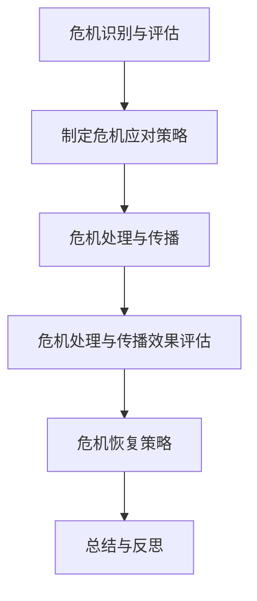

                 


## 文章标题：领导力与危机公关：维护团队与企业形象

### 关键词：领导力，危机公关，团队管理，企业形象，危机应对策略

### 摘要：
本文将从领导力与危机公关两个方面，探讨如何有效地维护团队和企业形象。首先，我们将分析领导力的基本概念、重要性以及领导风格和团队建设的策略；接着，深入探讨危机公关的基本原理、策略与工具，并结合实际案例，提供危机公关的最佳实践。通过逻辑清晰、结构紧凑的分析，本文旨在为IT领域的领导者和管理者提供实用的指导。

----------------------------------------------------------------

## 目录大纲

### 第一部分：领导力篇

### 第二部分：危机公关篇

----------------------------------------------------------------

### 第一部分：领导力篇

#### 第1章 领导力的基本概念与重要性

**1.1 领导力的定义与内涵**

- **领导力的基本概念**：领导力指的是领导者引导、激励和影响他人的能力。这种能力不仅涉及个人素质，还涵盖人际关系和团队管理技能。
- **领导力的四个维度**：领导力通常包括情感智慧、决策智慧、人际智慧和战略智慧。这四个维度共同构成了领导力的完整框架。
- **领导力的重要性**：领导力是企业成功的关键因素之一，它能够激发团队成员的潜能，提高团队效率和创新能力。

**1.2 领导者角色与责任**

- **领导者角色的转变**：在数字化时代，领导者的角色正在发生变革。从传统的命令控制型向赋能型、协作型转变，领导者需要更多地关注团队的发展和员工的成长。
- **领导者的责任**：领导者不仅要对企业的短期目标负责，还要关注长期战略和可持续发展。同时，领导者还承担着塑造企业文化、维护企业形象的重要责任。

**1.3 领导力与团队效能**

- **领导力对团队的影响**：有效的领导力能够提升团队的凝聚力和战斗力，促进团队成员之间的协作和沟通。
- **团队效能的提升途径**：领导者可以通过以下途径提升团队效能：建立明确的目标和愿景、提供必要的资源和支持、培养团队成员的技能和素质。

#### 第2章 领导风格与领导力模型

**2.1 领导风格理论**

- **领导风格的概念**：领导风格是指领导者处理和管理团队的方式和方法。不同的领导风格会对团队的效能产生不同的影响。
- **领导风格的类型**：根据领导风格的不同特点，可以将领导风格分为独裁型、民主型、参与型、教练型等。

**2.2 领导力模型**

- **领导力模型的种类**：领导力模型是对领导行为和风格的系统化总结。常见的领导力模型包括领导生命周期模型、情境领导模型等。
- **领导力模型的应用**：领导力模型可以帮助领导者更好地理解和运用不同的领导风格，根据团队的具体情况和需求进行调整。

**2.3 领导风格与领导力模型的匹配**

- **领导风格与领导力模型的匹配**：领导风格和领导力模型的选择应该与团队的特点和企业的文化相匹配，以达到最佳的管理效果。
- **领导风格与领导力模型的平衡**：在实际管理中，领导者需要在不同情境下灵活运用不同的领导风格和领导力模型，实现领导风格与领导力模型的平衡。

#### 第3章 领导力发展的策略与实践

**3.1 领导力发展的途径**

- **自我认知**：领导者需要深入了解自己的价值观、信念和行为模式，从而更好地发挥自己的领导力。
- **领导力培训与发展**：领导者可以通过参加培训课程、研讨会和实战演练等方式，提升自己的领导力。

**3.2 领导力实践案例**

- **成功领导力案例分析**：通过分析成功领导力的案例，我们可以了解优秀领导者的行为模式和成功因素。
- **领导力实践中的挑战与应对**：领导者需要面对各种挑战和困难，如团队冲突、资源有限、市场变化等。如何应对这些挑战是领导力发展的重要方面。

#### 第4章 高效团队建设与管理

**4.1 团队建设的理论框架**

- **团队发展的阶段模型**：团队发展通常分为形成期、冲突期、规范期和执行期等阶段。
- **团队建设的要素**：团队建设需要关注团队的目标、角色分工、沟通协作、信任和激励等方面。

**4.2 团队管理的策略**

- **团队激励**：有效的激励机制可以提高团队成员的积极性和工作热情，促进团队绩效的提升。
- **团队沟通**：良好的沟通是团队协作的基础，领导者需要建立有效的沟通渠道和机制，确保信息的畅通和及时反馈。

**4.3 团队绩效评估与改进**

- **团队绩效评估的方法**：团队绩效评估需要采用客观、公正、全面的标准，对团队成员的工作表现进行评价。
- **团队绩效改进的策略**：根据评估结果，制定相应的改进措施，提升团队的整体绩效。

#### 第5章 领导力与个人成长

**5.1 领导力与自我管理**

- **自我管理的重要性**：自我管理是领导者提升领导力的基础，它包括时间管理、情绪管理和目标管理等方面。
- **时间管理与优先级设定**：领导者需要学会合理安排时间，明确工作的优先级，确保关键任务的完成。

**5.2 领导力与终身学习**

- **学习型组织的建立**：领导者需要推动企业建立学习型组织，鼓励员工不断学习、成长和进步。
- **持续学习与领导力提升**：通过不断学习新的知识和技能，领导者可以提升自己的领导力，应对不断变化的市场和挑战。

### 第二部分：危机公关篇

#### 第6章 危机公关的基本原理与流程

**6.1 危机公关的定义与特征**

- **危机公关的定义**：危机公关是指企业在面临各种危机事件时，采取的应对和传播策略，以维护企业形象和品牌声誉。
- **危机公关的特征**：危机公关具有突发性、紧急性、复杂性和不确定性等特征。

**6.2 危机公关的流程**

- **危机识别与评估**：及时识别危机，评估危机的严重程度和影响范围，制定相应的应对策略。
- **危机应对策略**：根据危机的特点和企业的实际情况，采取适当的应对措施，如公开声明、媒体沟通、危机管理小组等。
- **危机处理与传播**：通过有效的传播手段，向公众传递正确的信息，纠正误解和谣言，维护企业形象。

**6.3 危机处理与传播效果评估**

- **危机处理与传播效果评估**：对危机处理和传播的效果进行评估，总结经验教训，为未来的危机应对提供参考。

#### 第7章 危机公关策略与工具

**7.1 危机公关策略**

- **危机预防策略**：通过建立健全的危机预防机制，降低危机发生的概率。
- **危机处理策略**：在危机发生后，采取有效的措施，控制事态发展，减轻危机影响。
- **危机恢复策略**：危机结束后，通过积极的恢复行动，重建企业形象和品牌声誉。

**7.2 危机公关工具**

- **媒体应对工具**：包括新闻稿发布、新闻发布会、媒体访谈等，用于与媒体进行沟通和互动。
- **社交媒体管理工具**：包括社交媒体平台管理、网络舆情监测等，用于应对社交媒体上的危机传播。
- **危机监控与分析工具**：包括数据分析、舆情监测、风险预警等，用于实时监控危机的发展态势。

#### 第8章 危机公关实战案例研究

**8.1 危机公关案例概述**

- **知名企业危机案例**：分析知名企业在危机公关中的应对策略和效果，总结成功经验和教训。
- **政府与公共机构危机案例**：探讨政府与公共机构在危机公关中的角色和职责，分析危机应对的案例。

**8.2 案例分析与启示**

- **危机应对的成功经验**：从成功案例中提取关键要素，总结危机应对的成功经验。
- **危机管理的教训**：从失败案例中吸取教训，避免在未来的危机应对中犯同样的错误。

#### 第9章 危机公关的未来趋势与发展方向

**9.1 新媒体与危机公关**

- **社交媒体对危机公关的影响**：探讨社交媒体在危机公关中的应用和影响，分析社交媒体时代下的危机传播特点。
- **新媒体时代的危机公关策略**：针对社交媒体的特点，制定相应的危机公关策略，提高危机应对的效率和效果。

**9.2 国际化与跨文化危机公关**

- **全球化背景下的危机公关**：探讨全球化背景下危机公关的挑战和机遇，分析国际化危机应对的策略。
- **跨文化危机公关的挑战与策略**：分析跨文化危机公关的挑战，提供跨文化危机应对的策略和建议。

#### 附录

**附录A 领导力与危机公关资源汇总**

- **学术文献与研究报告**：汇总相关领域的学术文献和研究报告，为读者提供理论支持。
- **相关工具与资源**：介绍领导力与危机公关相关的工具和资源，帮助读者更好地实践和应用相关知识。

### 结束语

本文旨在探讨领导力与危机公关在维护团队和企业形象中的重要性。通过分析领导力的基本概念、领导风格与团队建设策略，以及危机公关的基本原理与实战案例，本文为IT领域的领导者和管理者提供了实用的指导。在面对不断变化的挑战和机遇时，领导者需要不断提升自己的领导力，掌握危机公关的策略与工具，以维护团队和企业形象，实现企业的长期发展。

作者：AI天才研究院/AI Genius Institute & 禅与计算机程序设计艺术 /Zen And The Art of Computer Programming

----------------------------------------------------------------

## 第一部分：领导力篇

### 第1章 领导力的基本概念与重要性

**1.1 领导力的定义与内涵**

领导力，作为一个广泛使用的概念，涵盖了从个人影响力到组织协调的各个方面。简单来说，领导力是指个体或群体在指导、激励和影响他人，实现共同目标的过程中所展现出的能力。这种能力不仅涉及到技术或专业知识的掌握，更重要的是对人际关系、团队协作以及领导艺术的深刻理解。

**领导力的基本概念**

领导力可以分为四个主要维度，这些维度共同构成了领导力的基本框架：

1. **情感智慧（Emotional Intelligence）**：情感智慧是指个体识别、理解并管理自己情绪，以及识别和理解他人情绪的能力。领导者通过情感智慧可以更好地与团队成员建立信任关系，增强团队的凝聚力。
2. **决策智慧（Decision-Making Intelligence）**：决策智慧涉及领导者在面对复杂问题和不确定性的情况下，能够做出明智、合理决策的能力。这要求领导者具备战略眼光、分析能力和快速反应能力。
3. **人际智慧（Interpersonal Intelligence）**：人际智慧是指领导者在处理人际关系时的能力，包括沟通技巧、冲突解决能力和团队合作精神。人际智慧对于维护团队和谐、提升团队效能至关重要。
4. **战略智慧（Strategic Intelligence）**：战略智慧是指领导者在制定长远规划和战略时的能力。这要求领导者能够把握市场趋势、预测未来变化，并据此调整企业的战略方向。

**领导力的四个维度**

1. **情感智慧**：领导者需要能够识别和调节自己的情绪，避免负面情绪的影响，同时也要理解并同理团队成员的情感需求。
2. **决策智慧**：领导者应具备分析复杂信息、评估风险和制定行动计划的能力，确保决策的科学性和前瞻性。
3. **人际智慧**：领导者需要具备良好的沟通能力和团队合作精神，能够协调团队成员之间的关系，解决冲突，提升团队的整体效能。
4. **战略智慧**：领导者应具备战略思维，能够从整体上把握企业的发展方向，制定并实施有效的战略规划。

**领导力的重要性**

在当今快速变化的社会和商业环境中，领导力的重要性愈发突出。以下是领导力在企业和社会中的重要性的几个方面：

1. **激励和引导团队成员**：领导力能够激励团队成员发挥潜力，激发工作热情，从而提高整体团队的绩效和创新能力。
2. **塑造企业文化**：领导力对企业文化的塑造起到关键作用。通过领导者的行为和价值观，可以影响和塑造企业的文化氛围，进而影响员工的行为和态度。
3. **应对挑战和危机**：领导力是企业在面临各种挑战和危机时的关键因素。有效的领导者能够在危机中迅速反应，制定合理的应对策略，维护企业形象。
4. **推动组织变革**：在数字化时代，企业需要不断适应市场变化和新技术的发展。领导力能够推动组织变革，使企业保持竞争力。

**1.2 领导者角色与责任**

**领导者角色的转变**

随着时代的发展，领导者的角色也在不断演变。传统的领导者往往是命令控制型的，他们通过权威和命令来管理团队。而在现代组织环境中，领导者更需要转变为赋能型和协作型的角色。

1. **赋能型领导者**：赋能型领导者关注团队成员的个人发展和自主性，鼓励团队成员参与决策，发挥其最大潜力。这种领导方式能够提高团队成员的积极性和创造力。
2. **协作型领导者**：协作型领导者注重团队合作，通过与团队成员的密切合作，共同解决问题和实现目标。这种领导方式能够增强团队的凝聚力和协作效率。

**领导者的责任**

领导者承担着多种责任，包括但不限于以下几个方面：

1. **制定战略和规划**：领导者需要制定清晰的战略目标，规划企业的长远发展路径，确保企业能够在竞争激烈的市场中立于不败之地。
2. **管理团队**：领导者需要有效地管理团队，协调团队成员之间的关系，确保团队成员能够充分发挥其作用。
3. **激发员工潜能**：领导者应激发员工的潜能，提供必要的培训和发展机会，帮助员工成长和进步。
4. **维护企业形象**：领导者需要维护企业形象，确保企业的声誉和品牌价值不受损害。在面临危机时，领导者应迅速采取行动，应对危机，维护企业形象。

**1.3 领导力与团队效能**

**领导力对团队的影响**

领导力对团队效能有着深远的影响。一个优秀的领导者能够激发团队成员的潜力，提高团队的协作效率，从而提升整个团队的绩效。

1. **提高团队凝聚力**：领导力能够增强团队成员之间的信任和合作，提高团队的凝聚力，使团队成员更愿意为共同的目标努力。
2. **提升团队创新能力**：领导者的激励和支持可以激发团队成员的创新思维，促进团队的创新能力和研发效率。
3. **优化团队沟通**：领导力能够促进团队成员之间的有效沟通，减少误解和冲突，提高团队的协作效率。

**团队效能的提升途径**

为了提升团队效能，领导者可以采取以下途径：

1. **明确目标和愿景**：领导者需要为团队设定清晰的目标和愿景，使团队成员明确自己的努力方向和期望结果。
2. **提供资源和支持**：领导者应确保团队拥有足够的资源和支持，包括财务、技术、人力资源等，以帮助团队实现目标。
3. **培养团队成员的技能**：领导者应关注团队成员的个人发展，提供培训和学习机会，提升团队成员的技能和素质。
4. **建立有效的激励机制**：领导者可以通过建立合理的激励机制，激发团队成员的积极性和工作热情。

### 第2章 领导风格与领导力模型

**2.1 领导风格理论**

**领导风格的概念**

领导风格是指领导者处理和管理团队的方式和方法。不同的领导风格会对团队的效能产生不同的影响。领导风格可以分为多种类型，每种类型都有其独特的特点和适用场景。

**领导风格的类型**

1. **独裁型领导风格**：独裁型领导风格是指领导者通过权威和命令来管理团队，决策权高度集中在领导者手中。这种风格适用于紧急情况或需要快速决策的场景，但可能会抑制团队成员的创造性和积极性。
2. **民主型领导风格**：民主型领导风格是指领导者鼓励团队成员参与决策过程，尊重团队成员的意见和决策。这种风格有助于提高团队成员的参与度和团队凝聚力，但决策过程可能较为缓慢。
3. **参与型领导风格**：参与型领导风格是指领导者鼓励团队成员自主参与决策和问题解决，领导者更多起到支持和指导的作用。这种风格能够激发团队成员的自主性和创造力，但需要领导者具备较高的沟通和协调能力。
4. **教练型领导风格**：教练型领导风格是指领导者像教练一样，关注团队成员的个人发展和技能提升，提供指导和支持。这种风格适用于团队成员需要专业指导或发展特定技能的情景。

**2.2 领导力模型**

**领导力模型的种类**

领导力模型是对领导行为和风格的系统化总结。通过领导力模型，领导者可以更好地理解和运用不同的领导风格，根据团队的具体情况和需求进行调整。常见的领导力模型包括：

1. **领导生命周期模型**：领导生命周期模型认为，领导者的风格应该根据团队成员的成熟度进行调整。当团队成员成熟度较低时，领导者应采用指令型领导风格；当团队成员成熟度提高时，领导者可以逐步转变为支持型和委托型领导风格。
2. **情境领导模型**：情境领导模型认为，领导者的风格应该根据工作任务的复杂性和团队成员的能力进行调整。当工作任务较为简单且团队成员能力较强时，领导者可以采用委托型领导风格；当工作任务复杂且团队成员能力不足时，领导者应采用指令型领导风格。

**领导力模型的应用**

领导力模型可以帮助领导者更好地理解和运用不同的领导风格。在实际应用中，领导者应根据团队的具体情况和需求，灵活运用不同的领导风格和领导力模型。

**2.3 领导风格与领导力模型的匹配**

**领导风格与领导力模型的匹配**

领导风格和领导力模型的选择应该与团队的特点和企业的文化相匹配，以达到最佳的管理效果。

1. **团队特点**：领导者应根据团队的特点，如团队的成熟度、团队成员的能力和技能等，选择合适的领导风格和领导力模型。例如，对于新成立的团队，领导者可能需要采用更多指令型和教练型领导风格，以确保团队成员能够快速适应和融入。
2. **企业文化**：企业的文化氛围也会影响领导风格和领导力模型的选择。在一些以创新为核心的企业中，领导者可能更倾向于采用参与型和教练型领导风格，以激发员工的创新能力和创造力。

**领导风格与领导力模型的平衡**

在实际管理中，领导者需要在不同情境下灵活运用不同的领导风格和领导力模型，实现领导风格与领导力模型的平衡。

1. **情境适应**：领导者应根据不同的情境，灵活调整领导风格和领导力模型。例如，在紧急情况下，领导者可能需要采用独裁型领导风格，快速做出决策；而在长期规划阶段，领导者可以采用参与型领导风格，鼓励团队成员参与决策。
2. **持续优化**：领导者应不断反思和优化自己的领导风格和领导力模型。通过收集团队成员的反馈和评估团队绩效，领导者可以不断调整和优化自己的领导风格和领导力模型，以更好地适应团队的需求。

### 第3章 领导力发展的策略与实践

**3.1 领导力发展的途径**

**自我认知**

自我认知是领导力发展的基础。领导者需要深入了解自己的价值观、信念、行为模式，以及自己在团队中的角色和影响力。通过自我认知，领导者可以更好地理解自己的优势和不足，从而有针对性地进行改进。

**领导力培训与发展**

除了自我认知，领导者还需要通过系统的培训和持续的学习来提升自己的领导力。以下是一些常见的领导力发展途径：

1. **参加领导力培训课程**：通过参加专业的领导力培训课程，领导者可以学习最新的领导理论和实践方法，了解不同领导风格和领导力模型的应用场景。
2. **阅读领导力相关书籍**：阅读领导力相关书籍是提升领导力的重要途径。通过阅读，领导者可以了解不同领导者的经验和教训，借鉴成功案例，避免重复错误。
3. **参与领导力研讨会和研讨会**：参与领导力研讨会和研讨会可以与同行交流和分享经验，了解不同的领导观点和策略，拓展自己的思维和视野。
4. **实践与反思**：领导力的发展离不开实践。领导者应在实际工作中不断尝试新的领导方法，通过实践来验证和优化自己的领导力。同时，领导者应定期反思自己的领导行为和效果，总结经验教训，不断提升自己的领导能力。

**3.2 领导力实践案例**

**成功领导力案例分析**

通过分析成功领导力案例，我们可以了解优秀领导者的行为模式和成功因素。以下是一些典型的成功领导力案例：

1. **乔布斯的领导风格**：乔布斯以其独特的领导风格和强烈的愿景，带领苹果公司实现了巨大的成功。他的领导风格强调创新、细节和完美主义，使得苹果公司的产品在市场上具有极高的竞争力。
2. **马斯克的领导力**：埃隆·马斯克以其无畏的冒险精神和坚定的信念，领导特斯拉和SpaceX等公司取得了惊人的成就。他的领导力强调创新、效率和执行力，使这些公司在各自的领域内脱颖而出。

**领导力实践中的挑战与应对**

在领导力实践中，领导者常常会遇到各种挑战。以下是一些常见的挑战和应对策略：

1. **团队冲突**：团队冲突是领导力实践中常见的问题。领导者需要通过有效的沟通和冲突解决技巧，化解团队冲突，确保团队的稳定和高效。
2. **资源有限**：在资源有限的情况下，领导者需要优先考虑关键任务和优先级，合理分配资源，确保团队的高效运作。
3. **市场变化**：市场变化对企业的战略和运营带来了巨大的挑战。领导者需要具备前瞻性的眼光和快速反应能力，及时调整战略和运营策略，以应对市场变化。

### 第4章 高效团队建设与管理

**4.1 团队建设的理论框架**

团队建设是指通过一系列策略和活动，提高团队成员之间的协作效率和工作绩效的过程。团队建设遵循一定的理论框架，包括团队发展的阶段模型和团队建设的要素。

**团队发展的阶段模型**

团队发展通常分为以下阶段：

1. **形成期**：在形成期，团队成员刚刚开始接触，彼此之间还比较陌生。领导者需要通过沟通和团队活动，帮助团队成员建立联系，明确团队的目标和角色分工。
2. **冲突期**：在冲突期，团队成员之间可能会出现意见分歧和冲突。领导者需要通过有效的沟通和冲突解决技巧，化解团队成员之间的矛盾，确保团队的稳定和和谐。
3. **规范期**：在规范期，团队成员开始相互理解和尊重，形成了一定的团队规范和协作方式。领导者需要通过持续的关注和引导，确保团队规范的有效执行。
4. **执行期**：在执行期，团队进入高效运作阶段，团队成员能够高效地协作，共同实现团队的目标。领导者需要通过有效的激励机制，激发团队成员的积极性和创造力。

**团队建设的要素**

团队建设需要关注以下几个关键要素：

1. **目标明确**：团队的目标是团队建设的核心。领导者需要确保团队成员对团队目标有清晰的认识，并明确各自的角色和职责。
2. **角色分工**：团队成员的分工和协作是团队建设的基础。领导者需要根据团队成员的能力和特长，合理分配任务，确保每个成员都能发挥自己的优势。
3. **沟通协作**：良好的沟通协作是团队高效运作的保障。领导者需要建立有效的沟通渠道和机制，确保信息的畅通和及时反馈。
4. **信任与尊重**：信任和尊重是团队协作的重要基础。领导者需要通过积极的沟通和行动，建立团队成员之间的信任关系，促进团队的和谐与稳定。

**4.2 团队管理的策略**

**团队激励**

有效的激励机制可以提高团队成员的积极性和工作热情，促进团队绩效的提升。以下是一些常见的团队激励策略：

1. **物质激励**：通过提供奖金、福利等物质奖励，激励团队成员的工作表现。例如，可以根据团队的绩效和个人的工作表现，给予相应的奖励。
2. **精神激励**：通过表彰、荣誉等精神奖励，激励团队成员的积极性和荣誉感。例如，可以定期评选“最佳团队”、“优秀员工”，并给予相应的表彰。
3. **发展激励**：通过提供培训、晋升等发展机会，激励团队成员的个人成长和发展。例如，可以定期组织专业培训，帮助团队成员提升技能和知识。

**团队沟通**

良好的沟通是团队协作的基础，领导者需要建立有效的沟通渠道和机制，确保信息的畅通和及时反馈。以下是一些团队沟通的策略：

1. **定期会议**：通过定期召开团队会议，确保团队成员对团队目标和进展有清晰的了解，同时提供反馈和讨论的平台。
2. **开放式沟通**：鼓励团队成员开放地表达意见和建议，领导者需要倾听和尊重每个成员的观点，促进团队的民主氛围。
3. **信息共享**：建立信息共享平台，确保团队成员能够及时获取和分享重要信息，减少信息不对称和误解。

**4.3 团队绩效评估与改进**

**团队绩效评估的方法**

团队绩效评估是团队管理的重要环节，通过评估可以了解团队的工作表现和存在的问题，为改进提供依据。以下是一些团队绩效评估的方法：

1. **定量评估**：通过量化指标对团队的工作绩效进行评估，如完成任务的进度、质量等。这种方法能够客观地反映团队的工作效果。
2. **定性评估**：通过定性描述对团队的工作表现进行评估，如团队成员的协作精神、沟通效果等。这种方法能够更全面地反映团队的工作状态。

**团队绩效改进的策略**

根据评估结果，领导者可以制定相应的改进措施，提升团队的整体绩效。以下是一些团队绩效改进的策略：

1. **培训与发展**：针对团队成员的不足和需求，提供培训和发展的机会，提升团队的整体素质和能力。
2. **优化流程**：通过分析团队的工作流程，找出瓶颈和问题，进行优化和改进，提高工作效率。
3. **激励机制**：建立合理的激励机制，激发团队成员的积极性和创造力，提高团队的绩效。

### 第5章 领导力与个人成长

**5.1 领导力与自我管理**

**自我管理的重要性**

自我管理是领导者提升领导力的基础。自我管理包括时间管理、情绪管理和目标管理等方面。以下是自我管理的重要性：

1. **提高工作效率**：通过自我管理，领导者可以更高效地安排自己的工作和时间，减少不必要的浪费，提高工作效率。
2. **增强情绪控制**：通过自我管理，领导者可以更好地控制自己的情绪，避免因情绪波动而影响工作表现。
3. **明确目标方向**：通过自我管理，领导者可以明确自己的目标和方向，确保自己的努力有明确的目标和方向。

**时间管理与优先级设定**

时间是有限的资源，领导者需要通过时间管理来合理利用时间。以下是一些时间管理的策略：

1. **设定目标**：领导者需要明确自己的工作目标和优先级，确保自己的时间和精力投入到最重要和最有价值的任务上。
2. **制定计划**：领导者需要制定详细的计划和日程表，合理安排每天的工作任务和时间。
3. **避免拖延**：领导者需要避免拖延，确保任务的及时完成。

**5.2 领导力与终身学习**

**学习型组织的建立**

学习型组织是指组织内部成员持续学习、分享知识和共同进步的一种组织文化。建立学习型组织对领导者的领导力提升和个人成长具有重要意义。

1. **鼓励员工学习**：领导者需要鼓励员工不断学习新知识和技能，提供学习和发展的机会。
2. **建立知识共享平台**：领导者需要建立知识共享平台，鼓励员工分享知识和经验，促进知识的传播和应用。
3. **开展培训与研讨**：领导者可以定期组织培训与研讨会，提升员工的专业能力和领导力。

**持续学习与领导力提升**

领导者需要具备持续学习的能力，以适应不断变化的市场和挑战。以下是一些持续学习的策略：

1. **阅读与研究**：通过阅读专业书籍和研究文献，领导者可以不断更新自己的知识和观点。
2. **参加培训与课程**：参加专业的培训课程和研讨会，可以学习最新的领导理论和实践方法。
3. **反思与总结**：领导者需要定期反思自己的工作表现和领导行为，总结经验教训，不断提升自己的领导力。

### 第二部分：危机公关篇

#### 第6章 危机公关的基本原理与流程

**6.1 危机公关的定义与特征**

**危机公关的定义**

危机公关是指企业在面临各种危机事件时，采取的应对和传播策略，以维护企业形象和品牌声誉。危机公关的核心目标是确保企业能够在危机中保持稳定，减少危机对企业造成的负面影响。

**危机公关的特征**

危机公关具有以下几个显著特征：

1. **突发性**：危机事件往往突然发生，企业需要迅速做出反应，以控制事态发展。
2. **紧急性**：危机事件要求企业及时应对，迅速采取行动，以减轻危机对企业的影响。
3. **复杂性和不确定性**：危机事件涉及多种因素和利益相关者，处理过程中存在许多不确定性，需要企业进行多方面的分析和决策。

**6.2 危机公关的流程**

危机公关的流程通常包括以下几个关键步骤：

1. **危机识别与评估**：企业需要建立有效的危机识别机制，及时识别危机事件，并对其严重程度和影响范围进行评估，为后续的危机应对提供依据。
2. **危机应对策略**：根据危机事件的性质和评估结果，企业需要制定相应的危机应对策略，包括危机预防、危机处理和危机恢复等。
3. **危机处理与传播**：在危机发生过程中，企业需要通过多种传播手段，如媒体沟通、社交媒体管理、新闻发布会等，向公众传递正确的信息，纠正误解和谣言，维护企业形象。
4. **危机处理与传播效果评估**：危机结束后，企业需要对危机处理和传播的效果进行评估，总结经验教训，为未来的危机应对提供参考。

**6.3 危机处理与传播效果评估**

**危机处理与传播效果评估**

危机处理与传播效果评估是危机公关的重要环节，通过评估可以了解危机应对的效果，发现问题，优化策略。以下是一些评估方法：

1. **媒体监测与分析**：通过监测媒体报道和分析舆论动态，了解危机事件在公众中的影响和反应。
2. **公众调查**：通过问卷调查、访谈等方式，了解公众对危机事件的态度和看法，评估危机对企业形象的冲击。
3. **内部评估**：评估危机应对过程中各部门的协作效率、信息传递的准确性以及危机处理的效果，为未来的危机应对提供改进建议。

#### 第7章 危机公关策略与工具

**7.1 危机公关策略**

**危机预防策略**

危机预防是危机公关的重要组成部分，通过以下策略可以降低危机发生的概率：

1. **建立健全的危机预防机制**：企业需要建立完善的危机预防机制，包括风险识别、风险评估和预防措施等，确保在危机发生前能够及时采取措施。
2. **加强员工培训和意识教育**：通过培训和教育，提高员工的危机意识和应对能力，减少人为因素导致的危机。
3. **建立健全的应急预案**：制定详细的应急预案，明确危机发生时的应对步骤和责任人，确保在危机发生时能够迅速响应。

**危机处理策略**

在危机发生时，企业需要采取有效的措施，控制事态发展，减轻危机对企业的影响。以下是一些危机处理策略：

1. **紧急应对**：在危机发生初期，企业需要迅速采取紧急应对措施，如立即成立危机管理小组、启动应急预案等。
2. **真相调查**：对企业危机事件进行深入调查，了解事件的原因和真相，为后续的危机处理提供依据。
3. **信息透明**：在危机处理过程中，企业需要保持信息透明，及时向公众传递正确的信息，避免谣言和误解的传播。

**危机恢复策略**

危机结束后，企业需要通过积极的恢复行动，重建企业形象和品牌声誉。以下是一些危机恢复策略：

1. **恢复企业形象**：通过有效的传播策略，重塑企业形象，恢复公众对企业的信任。
2. **改善内部管理**：针对危机暴露出的管理问题，进行内部整改和优化，提升企业的管理水平和运营效率。
3. **加强社会责任**：通过积极参与社会公益活动，提升企业的社会形象，增强公众对企业的认同感。

**7.2 危机公关工具**

**媒体应对工具**

媒体应对是危机公关的重要环节，以下是一些常用的媒体应对工具：

1. **新闻稿发布**：通过新闻稿的形式，向媒体和公众传递企业的官方信息和立场。
2. **新闻发布会**：在危机事件发生后，召开新闻发布会，与媒体进行面对面的沟通，回答媒体和公众的问题。
3. **媒体访谈**：通过媒体访谈，向公众传递企业的声音和态度，澄清误解和谣言。

**社交媒体管理工具**

社交媒体在危机公关中的作用越来越重要，以下是一些社交媒体管理工具：

1. **社交媒体平台管理**：对企业的社交媒体账号进行管理和监控，确保信息的准确性和及时性。
2. **网络舆情监测**：通过舆情监测工具，实时了解公众对危机事件的态度和反应，及时采取应对措施。
3. **社交媒体互动**：通过社交媒体平台，与公众进行互动和沟通，回应公众的问题和关切。

**危机监控与分析工具**

危机监控与分析工具可以帮助企业实时监控危机事件的发展态势，提供决策支持。以下是一些常见的危机监控与分析工具：

1. **数据分析工具**：通过对媒体报道、公众评论等数据进行分析，了解危机事件的传播趋势和公众态度。
2. **风险预警系统**：建立风险预警系统，对可能引发危机的风险进行提前预警，为企业的危机应对提供预警信息。
3. **危机应对模拟**：通过模拟危机场景，评估危机应对策略的可行性和效果，为实际的危机应对提供参考。

#### 第8章 危机公关实战案例研究

**8.1 危机公关案例概述**

**知名企业危机案例**

在危机公关的实践中，有许多知名企业的危机处理案例值得分析。以下是一些典型的案例：

1. **三星Note7电池爆炸事件**：2016年，三星Note7手机因电池爆炸问题引发全球关注。三星公司在危机处理中，采取了以下措施：
   - **立即停售**：在确认电池存在安全隐患后，三星公司立即宣布全球召回Note7手机。
   - **透明沟通**：三星公司通过媒体和社交媒体，与消费者和公众保持透明沟通，解释事件原因和应对措施。
   - **赔偿与补偿**：为受影响的消费者提供赔偿和补偿，以减轻危机对企业形象和品牌声誉的冲击。

2. **特斯拉自动驾驶事故**：特斯拉公司以其自动驾驶技术而闻名，但近年来也遇到了多起自动驾驶事故。在处理这些事故时，特斯拉采取了以下措施：
   - **事故调查**：特斯拉公司对事故进行详细调查，了解事故原因和过程。
   - **技术改进**：特斯拉公司根据事故调查结果，对自动驾驶系统进行改进和升级。
   - **公开声明**：特斯拉公司通过媒体和社交媒体，向公众通报事故调查进展和技术改进措施，以增强公众对特斯拉自动驾驶技术的信任。

**政府与公共机构危机案例**

政府与公共机构在危机处理方面也有许多值得关注的案例。以下是一些典型的案例：

1. **英国脱欧公投**：2016年，英国举行公投决定是否脱离欧盟。在公投结果公布后，英国政府和欧盟进行了紧张的谈判。在危机处理中，英国政府采取了以下措施：
   - **紧急会议**：英国政府和欧盟领导人召开紧急会议，讨论脱欧后的安排和过渡期问题。
   - **信息公开**：英国政府通过媒体和社交媒体，向公众通报谈判进展和决策过程。
   - **安抚民众**：英国政府通过各种方式安抚民众的情绪，避免社会动荡。

2. **新冠肺炎疫情应对**：新冠疫情爆发以来，各国政府和公共机构面临巨大的挑战。在危机处理中，各国采取了不同的措施，以下是一些典型的做法：
   - **及时应对**：各国政府迅速采取封城、限制出行等措施，控制疫情扩散。
   - **医疗资源调配**：各国政府调配医疗资源，加强疫情防治工作。
   - **信息公开**：各国政府通过媒体和社交媒体，向公众通报疫情信息和防控措施。

**8.2 案例分析与启示**

**危机应对的成功经验**

从上述案例中，我们可以总结出一些危机应对的成功经验：

1. **及时应对**：危机事件发生后，企业或政府需要迅速采取行动，控制事态发展，避免危机扩大。
2. **透明沟通**：在危机处理过程中，企业或政府需要保持信息透明，及时向公众传递正确的信息，避免谣言和误解的传播。
3. **科学决策**：在危机处理中，企业或政府需要依据事实和数据，进行科学的决策和应对，确保措施的可行性和有效性。
4. **恢复形象**：危机结束后，企业或政府需要通过积极的恢复行动，重建公众信任，重塑企业形象。

**危机管理的教训**

同时，我们也可以从上述案例中吸取一些教训：

1. **预防为主**：企业或政府需要建立健全的危机预防机制，降低危机发生的概率。
2. **全员参与**：危机处理需要全员参与，确保各个部门和环节的协调与配合。
3. **适应变化**：在危机处理过程中，企业或政府需要灵活应对，根据危机发展的态势，及时调整应对策略。
4. **重视技术**：在数字化时代，企业或政府需要重视技术应用，利用大数据、人工智能等工具，提高危机应对的效率和效果。

### 第9章 危机公关的未来趋势与发展方向

**9.1 新媒体与危机公关**

**社交媒体对危机公关的影响**

随着社交媒体的普及，社交媒体在危机公关中的作用越来越重要。以下是一些影响：

1. **信息传播速度快**：社交媒体平台具有强大的传播能力，危机事件可以在短时间内迅速传播，影响范围广泛。
2. **公众参与度高**：社交媒体平台为公众提供了表达意见和反馈的渠道，公众可以在社交媒体上参与危机讨论，影响危机处理的结果。
3. **舆论导向性强**：社交媒体上的舆论力量强大，公众的情绪和态度可以通过社交媒体进行传播和放大，对危机处理产生重要影响。

**新媒体时代的危机公关策略**

在新媒体时代，企业需要采取以下危机公关策略：

1. **社交媒体管理**：企业需要建立有效的社交媒体管理机制，对社交媒体平台进行监控和管理，确保信息的准确性和及时性。
2. **舆论引导**：企业需要通过社交媒体平台，引导公众舆论，传播正确的信息，避免误解和谣言的传播。
3. **互动沟通**：企业需要通过社交媒体平台，与公众进行互动和沟通，回应公众的关切和问题，增强公众对企业的信任。

**9.2 国际化与跨文化危机公关**

**全球化背景下的危机公关**

在全球化背景下，企业面临着更复杂的危机公关挑战。以下是一些挑战：

1. **文化差异**：不同国家和地区在价值观、信仰、习俗等方面存在差异，这可能导致危机处理的策略和方式有所不同。
2. **语言障碍**：不同国家和地区的语言差异可能导致信息的误解和误传，影响危机公关的效果。
3. **法律法规差异**：不同国家和地区的法律法规不同，企业在危机处理中需要遵守当地的法律法规，避免法律风险。

**跨文化危机公关的挑战与策略**

在跨文化危机公关中，企业需要采取以下策略：

1. **文化适应**：企业需要深入了解目标市场的文化背景，根据不同文化特点，调整危机公关的策略和方式。
2. **语言沟通**：企业需要聘请专业翻译和沟通人员，确保信息的准确性和沟通的顺畅。
3. **法律法规遵守**：企业需要熟悉目标市场的法律法规，遵守当地的法律法规，确保危机处理合法合规。

**9.3 未来危机公关的发展趋势**

随着科技的不断进步和社会的快速发展，危机公关也在不断演变。以下是一些未来危机公关的发展趋势：

1. **大数据应用**：大数据技术在危机公关中的应用将越来越广泛，通过大数据分析，企业可以更准确地识别危机风险，制定更有效的危机应对策略。
2. **人工智能与自动化**：人工智能和自动化技术将在危机公关中发挥重要作用，如智能舆情监测、自动回复等，提高危机应对的效率和效果。
3. **社交媒体深度融合**：社交媒体将更加深入地融入危机公关，企业需要通过社交媒体平台，实现危机公关的实时性和互动性。
4. **可持续性关注**：随着可持续发展理念的普及，企业在危机公关中需要更加关注社会责任和环境保护，以提升企业形象和品牌声誉。

### 附录

**附录A 领导力与危机公关资源汇总**

**学术文献与研究报告**

为了深入了解领导力与危机公关的理论和实践，读者可以参考以下学术文献和研究报告：

1. **《领导力的本质》（The Essence of Leadership）**：这是一本关于领导力理论的经典著作，详细阐述了领导力的本质和内涵。
2. **《危机管理：理论与实践》（Crisis Management: Theory and Practice）**：这是一本涵盖危机公关理论和实践的权威著作，提供了丰富的案例分析和策略建议。
3. **《社交媒体时代的危机公关》（Crisis Communication in the Social Media Age）**：本书探讨了社交媒体对危机公关的影响，提出了社交媒体时代下的危机应对策略。

**相关工具与资源**

为了更好地实践领导力与危机公关的理论，读者可以参考以下工具和资源：

1. **领导力发展工具**：如360度反馈评估、领导力诊断工具等，这些工具可以帮助领导者了解自己的领导风格和提升领导能力。
2. **危机公关工具**：如舆情监测系统、危机应对模拟工具等，这些工具可以帮助企业及时识别危机、制定应对策略。
3. **在线课程和培训**：许多在线教育平台提供领导力与危机公关相关的课程和培训，读者可以根据自己的需求选择合适的学习资源。

### 结束语

本文从领导力与危机公关两个方面，探讨了如何维护团队和企业形象。通过分析领导力的基本概念、重要性以及领导风格与团队建设策略，我们了解了如何提升团队效能和领导力。同时，通过探讨危机公关的基本原理、策略与工具，我们学会了如何应对危机，维护企业形象。希望本文能为IT领域的领导者和管理者提供实用的指导，帮助他们在不断变化的商业环境中，保持团队的稳定和企业的长期发展。

作者：AI天才研究院/AI Genius Institute & 禅与计算机程序设计艺术 /Zen And The Art of Computer Programming

----------------------------------------------------------------

## 完整文章

### 文章标题：领导力与危机公关：维护团队与企业形象

#### 关键词：领导力，危机公关，团队管理，企业形象，危机应对策略

#### 摘要：
本文从领导力与危机公关两个方面，探讨了如何有效地维护团队和企业形象。首先，我们从领导力的基本概念和重要性出发，分析了领导力的四个维度：情感智慧、决策智慧、人际智慧和战略智慧。接着，我们讨论了领导者的角色与责任，以及领导力对团队效能的影响。随后，我们探讨了不同的领导风格和领导力模型，以及领导力发展的策略与实践。

在危机公关方面，我们首先阐述了危机公关的基本原理和流程，包括危机识别与评估、危机应对策略、危机处理与传播以及危机处理与传播效果评估。随后，我们介绍了危机公关的策略与工具，包括危机预防策略、危机处理策略、危机恢复策略以及媒体应对工具、社交媒体管理工具和危机监控与分析工具。

通过分析知名企业危机案例和政府与公共机构危机案例，我们总结了危机应对的成功经验和教训。在最后的部分，我们探讨了新媒体与危机公关、国际化与跨文化危机公关的未来趋势与发展方向，以及领导力与危机公关的资源汇总。

希望本文能为IT领域的领导者和管理者提供实用的指导，帮助他们在面对不断变化的挑战和机遇时，维护团队和企业形象。

### 目录大纲

#### 第一部分：领导力篇

#### 第二部分：危机公关篇

### 第一部分：领导力篇

#### 第1章 领导力的基本概念与重要性

**1.1 领导力的定义与内涵**

领导力，作为一个广泛使用的概念，涵盖了从个人影响力到组织协调的各个方面。简单来说，领导力是指领导者引导、激励和影响他人的能力，以实现共同的目标。领导力不仅涉及领导者个人素质的提升，还包括对人际关系、团队协作和领导艺术的深刻理解。

**领导力的基本概念**

领导力可以分为四个主要维度，这些维度共同构成了领导力的基本框架：

1. **情感智慧（Emotional Intelligence）**：情感智慧是指领导者识别、理解并管理自己情绪，以及识别和理解他人情绪的能力。这种能力有助于建立信任关系，增强团队凝聚力。
2. **决策智慧（Decision-Making Intelligence）**：决策智慧是指领导者面对复杂问题和不确定性时，能够做出明智、合理决策的能力。这种能力要求领导者具备战略眼光、分析能力和快速反应能力。
3. **人际智慧（Interpersonal Intelligence）**：人际智慧是指领导者处理人际关系时的能力，包括沟通技巧、冲突解决能力和团队合作精神。这种能力有助于协调团队成员之间的关系，提高团队效率。
4. **战略智慧（Strategic Intelligence）**：战略智慧是指领导者从整体上把握企业的发展方向，制定并实施有效的战略规划的能力。这种能力要求领导者具备市场洞察力、前瞻性和执行力。

**领导力的四个维度**

1. **情感智慧**：领导者需要能够识别和调节自己的情绪，避免负面情绪的影响，同时也要理解并同理团队成员的情感需求。
2. **决策智慧**：领导者应具备分析复杂信息、评估风险和制定行动计划的能力，确保决策的科学性和前瞻性。
3. **人际智慧**：领导者需要具备良好的沟通能力和团队合作精神，能够协调团队成员之间的关系，解决冲突，提升团队的整体效能。
4. **战略智慧**：领导者应具备战略思维，能够从整体上把握企业的发展方向，制定并实施有效的战略规划。

**领导力的重要性**

在当今快速变化的社会和商业环境中，领导力的重要性愈发突出。以下是领导力在企业和社会中的重要性的几个方面：

1. **激励和引导团队成员**：领导力能够激发团队成员的潜力，提高团队成员的积极性和创造力，从而提高整体团队的绩效和创新能力。
2. **塑造企业文化**：领导力对企业文化的塑造起到关键作用。通过领导者的行为和价值观，可以影响和塑造企业的文化氛围，进而影响员工的行为和态度。
3. **应对挑战和危机**：领导力是企业在面临各种挑战和危机时的关键因素。有效的领导者能够在危机中迅速反应，制定合理的应对策略，维护企业形象。
4. **推动组织变革**：在数字化时代，企业需要不断适应市场变化和新技术的发展。领导力能够推动组织变革，使企业保持竞争力。

**1.2 领导者角色与责任**

**领导者角色的转变**

随着时代的发展，领导者的角色也在不断演变。传统的领导者往往是命令控制型的，他们通过权威和命令来管理团队。而在现代组织环境中，领导者更需要转变为赋能型和协作型的角色。

1. **赋能型领导者**：赋能型领导者关注团队成员的个人发展和自主性，鼓励团队成员参与决策，发挥其最大潜力。这种领导方式能够提高团队成员的积极性和创造力。
2. **协作型领导者**：协作型领导者注重团队合作，通过与团队成员的密切合作，共同解决问题和实现目标。这种领导方式能够增强团队的凝聚力和协作效率。

**领导者的责任**

领导者承担着多种责任，包括但不限于以下几个方面：

1. **制定战略和规划**：领导者需要制定清晰的战略目标，规划企业的长远发展路径，确保企业能够在竞争激烈的市场中立于不败之地。
2. **管理团队**：领导者需要有效地管理团队，协调团队成员之间的关系，确保团队成员能够充分发挥其作用。
3. **激发员工潜能**：领导者应激发员工的潜能，提供必要的培训和发展机会，帮助员工成长和进步。
4. **维护企业形象**：领导者需要维护企业形象，确保企业的声誉和品牌价值不受损害。在面临危机时，领导者应迅速采取行动，应对危机，维护企业形象。

**1.3 领导力与团队效能**

**领导力对团队的影响**

领导力对团队效能有着深远的影响。一个优秀的领导者能够激发团队成员的潜力，提高团队的协作效率，从而提升整个团队的绩效和创新能力。

1. **提高团队凝聚力**：领导力能够增强团队成员之间的信任和合作，提高团队的凝聚力，使团队成员更愿意为共同的目标努力。
2. **提升团队创新能力**：领导者的激励和支持可以激发团队成员的创新思维，促进团队的创新能力和研发效率。
3. **优化团队沟通**：领导力能够促进团队成员之间的有效沟通，减少误解和冲突，提高团队的协作效率。

**团队效能的提升途径**

为了提升团队效能，领导者可以采取以下途径：

1. **明确目标和愿景**：领导者需要为团队设定清晰的目标和愿景，使团队成员明确自己的努力方向和期望结果。
2. **提供资源和支持**：领导者应确保团队拥有足够的资源和支持，包括财务、技术、人力资源等，以帮助团队实现目标。
3. **培养团队成员的技能**：领导者应关注团队成员的个人发展，提供培训和学习机会，提升团队成员的技能和素质。
4. **建立有效的激励机制**：领导者可以通过建立合理的激励机制，激发团队成员的积极性和工作热情。

### 第2章 领导风格与领导力模型

#### 2.1 领导风格理论

**领导风格的概念**

领导风格是指领导者处理和管理团队的方式和方法。不同的领导风格会对团队的效能产生不同的影响。领导风格可以分为多种类型，每种类型都有其独特的特点和适用场景。

**领导风格的类型**

1. **独裁型领导风格**：独裁型领导风格是指领导者通过权威和命令来管理团队，决策权高度集中在领导者手中。这种风格适用于紧急情况或需要快速决策的场景，但可能会抑制团队成员的创造性和积极性。
2. **民主型领导风格**：民主型领导风格是指领导者鼓励团队成员参与决策过程，尊重团队成员的意见和决策。这种风格有助于提高团队成员的参与度和团队凝聚力，但决策过程可能较为缓慢。
3. **参与型领导风格**：参与型领导风格是指领导者鼓励团队成员自主参与决策和问题解决，领导者更多起到支持和指导的作用。这种风格能够激发团队成员的自主性和创造力，但需要领导者具备较高的沟通和协调能力。
4. **教练型领导风格**：教练型领导风格是指领导者像教练一样，关注团队成员的个人发展和技能提升，提供指导和支持。这种风格适用于团队成员需要专业指导或发展特定技能的情景。

**2.2 领导力模型**

**领导力模型的种类**

领导力模型是对领导行为和风格的系统化总结。通过领导力模型，领导者可以更好地理解和运用不同的领导风格，根据团队的具体情况和需求进行调整。常见的领导力模型包括：

1. **领导生命周期模型**：领导生命周期模型认为，领导者的风格应该根据团队成员的成熟度进行调整。当团队成员成熟度较低时，领导者应采用指令型领导风格；当团队成员成熟度提高时，领导者可以逐步转变为支持型和委托型领导风格。
2. **情境领导模型**：情境领导模型认为，领导者的风格应该根据工作任务的复杂性和团队成员的能力进行调整。当工作任务较为简单且团队成员能力较强时，领导者可以采用委托型领导风格；当工作任务复杂且团队成员能力不足时，领导者应采用指令型领导风格。

**领导力模型的应用**

领导力模型可以帮助领导者更好地理解和运用不同的领导风格。在实际应用中，领导者应根据团队的具体情况和需求，灵活运用不同的领导风格和领导力模型。

**2.3 领导风格与领导力模型的匹配**

**领导风格与领导力模型的匹配**

领导风格和领导力模型的选择应该与团队的特点和企业的文化相匹配，以达到最佳的管理效果。

1. **团队特点**：领导者应根据团队的特点，如团队的成熟度、团队成员的能力和技能等，选择合适的领导风格和领导力模型。例如，对于新成立的团队，领导者可能需要采用更多指令型和教练型领导风格，以确保团队成员能够快速适应和融入。
2. **企业文化**：企业的文化氛围也会影响领导风格和领导力模型的选择。在一些以创新为核心的企业中，领导者可能更倾向于采用参与型和教练型领导风格，以激发员工的创新能力和创造力。

**领导风格与领导力模型的平衡**

在实际管理中，领导者需要在不同情境下灵活运用不同的领导风格和领导力模型，实现领导风格与领导力模型的平衡。

1. **情境适应**：领导者应根据不同的情境，灵活调整领导风格和领导力模型。例如，在紧急情况下，领导者可能需要采用独裁型领导风格，快速做出决策；而在长期规划阶段，领导者可以采用参与型领导风格，鼓励团队成员参与决策。
2. **持续优化**：领导者应不断反思和优化自己的领导风格和领导力模型。通过收集团队成员的反馈和评估团队绩效，领导者可以不断调整和优化自己的领导风格和领导力模型，以更好地适应团队的需求。

### 第3章 领导力发展的策略与实践

#### 3.1 领导力发展的途径

**自我认知**

自我认知是领导力发展的基础。领导者需要深入了解自己的价值观、信念、行为模式，以及自己在团队中的角色和影响力。通过自我认知，领导者可以更好地理解自己的优势和不足，从而有针对性地进行改进。

**领导力培训与发展**

除了自我认知，领导者还需要通过系统的培训和持续的学习来提升自己的领导力。以下是一些常见的领导力发展途径：

1. **参加领导力培训课程**：通过参加专业的领导力培训课程，领导者可以学习最新的领导理论和实践方法，了解不同领导风格和领导力模型的应用场景。
2. **阅读领导力相关书籍**：阅读领导力相关书籍是提升领导力的重要途径。通过阅读，领导者可以了解不同领导者的经验和教训，借鉴成功案例，避免重复错误。
3. **参与领导力研讨会和研讨会**：参与领导力研讨会和研讨会可以与同行交流和分享经验，了解不同的领导观点和策略，拓展自己的思维和视野。
4. **实践与反思**：领导力的发展离不开实践。领导者应在实际工作中不断尝试新的领导方法，通过实践来验证和优化自己的领导力。同时，领导者应定期反思自己的领导行为和效果，总结经验教训，不断提升自己的领导能力。

#### 3.2 领导力实践案例

**成功领导力案例分析**

通过分析成功领导力案例，我们可以了解优秀领导者的行为模式和成功因素。以下是一些典型的成功领导力案例：

1. **乔布斯的领导风格**：乔布斯以其独特的领导风格和强烈的愿景，带领苹果公司实现了巨大的成功。他的领导风格强调创新、细节和完美主义，使得苹果公司的产品在市场上具有极高的竞争力。
2. **马斯克的领导力**：埃隆·马斯克以其无畏的冒险精神和坚定的信念，领导特斯拉和SpaceX等公司取得了惊人的成就。他的领导力强调创新、效率和执行力，使这些公司在各自的领域内脱颖而出。

**领导力实践中的挑战与应对**

在领导力实践中，领导者常常会遇到各种挑战。以下是一些常见的挑战和应对策略：

1. **团队冲突**：团队冲突是领导力实践中常见的问题。领导者需要通过有效的沟通和冲突解决技巧，化解团队冲突，确保团队的稳定和高效。
2. **资源有限**：在资源有限的情况下，领导者需要优先考虑关键任务和优先级，合理分配资源，确保团队的高效运作。
3. **市场变化**：市场变化对企业的战略和运营带来了巨大的挑战。领导者需要具备前瞻性的眼光和快速反应能力，及时调整战略和运营策略，以应对市场变化。

### 第4章 高效团队建设与管理

#### 4.1 团队建设的理论框架

团队建设是指通过一系列策略和活动，提高团队成员之间的协作效率和工作绩效的过程。团队建设遵循一定的理论框架，包括团队发展的阶段模型和团队建设的要素。

**团队发展的阶段模型**

团队发展通常分为以下阶段：

1. **形成期**：在形成期，团队成员刚刚开始接触，彼此之间还比较陌生。领导者需要通过沟通和团队活动，帮助团队成员建立联系，明确团队的目标和角色分工。
2. **冲突期**：在冲突期，团队成员之间可能会出现意见分歧和冲突。领导者需要通过有效的沟通和冲突解决技巧，化解团队成员之间的矛盾，确保团队的稳定和和谐。
3. **规范期**：在规范期，团队成员开始相互理解和尊重，形成了一定的团队规范和协作方式。领导者需要通过持续的关注和引导，确保团队规范的有效执行。
4. **执行期**：在执行期，团队进入高效运作阶段，团队成员能够高效地协作，共同实现团队的目标。领导者需要通过有效的激励机制，激发团队成员的积极性和创造力。

**团队建设的要素**

团队建设需要关注以下几个关键要素：

1. **目标明确**：团队的目标是团队建设的核心。领导者需要确保团队成员对团队目标有清晰的认识，并明确各自的角色和职责。
2. **角色分工**：团队成员的分工和协作是团队建设的基础。领导者需要根据团队成员的能力和特长，合理分配任务，确保每个成员都能发挥自己的优势。
3. **沟通协作**：良好的沟通协作是团队高效运作的保障。领导者需要建立有效的沟通渠道和机制，确保信息的畅通和及时反馈。
4. **信任与尊重**：信任和尊重是团队协作的重要基础。领导者需要通过积极的沟通和行动，建立团队成员之间的信任关系，促进团队的和谐与稳定。

#### 4.2 团队管理的策略

**团队激励**

有效的激励机制可以提高团队成员的积极性和工作热情，促进团队绩效的提升。以下是一些常见的团队激励策略：

1. **物质激励**：通过提供奖金、福利等物质奖励，激励团队成员的工作表现。例如，可以根据团队的绩效和个人的工作表现，给予相应的奖励。
2. **精神激励**：通过表彰、荣誉等精神奖励，激励团队成员的积极性和荣誉感。例如，可以定期评选“最佳团队”、“优秀员工”，并给予相应的表彰。
3. **发展激励**：通过提供培训、晋升等发展机会，激励团队成员的个人成长和发展。例如，可以定期组织专业培训，帮助团队成员提升技能和知识。

**团队沟通**

良好的沟通是团队协作的基础，领导者需要建立有效的沟通渠道和机制，确保信息的畅通和及时反馈。以下是一些团队沟通的策略：

1. **定期会议**：通过定期召开团队会议，确保团队成员对团队目标和进展有清晰的了解，同时提供反馈和讨论的平台。
2. **开放式沟通**：鼓励团队成员开放地表达意见和建议，领导者需要倾听和尊重每个成员的观点，促进团队的民主氛围。
3. **信息共享**：建立信息共享平台，确保团队成员能够及时获取和分享重要信息，减少信息不对称和误解。

**4.3 团队绩效评估与改进**

**团队绩效评估的方法**

团队绩效评估是团队管理的重要环节，通过评估可以了解团队的工作表现和存在的问题，为改进提供依据。以下是一些团队绩效评估的方法：

1. **定量评估**：通过量化指标对团队的工作绩效进行评估，如完成任务的进度、质量等。这种方法能够客观地反映团队的工作效果。
2. **定性评估**：通过定性描述对团队的工作表现进行评估，如团队成员的协作精神、沟通效果等。这种方法能够更全面地反映团队的工作状态。

**团队绩效改进的策略**

根据评估结果，领导者可以制定相应的改进措施，提升团队的整体绩效。以下是一些团队绩效改进的策略：

1. **培训与发展**：针对团队成员的不足和需求，提供培训和发展的机会，提升团队的整体素质和能力。
2. **优化流程**：通过分析团队的工作流程，找出瓶颈和问题，进行优化和改进，提高工作效率。
3. **激励机制**：建立合理的激励机制，激发团队成员的积极性和创造力，提高团队的绩效。

### 第5章 领导力与个人成长

#### 5.1 领导力与自我管理

**自我管理的重要性**

自我管理是领导者提升领导力的基础。自我管理包括时间管理、情绪管理和目标管理等方面。以下是自我管理的重要性：

1. **提高工作效率**：通过自我管理，领导者可以更高效地安排自己的工作和时间，减少不必要的浪费，提高工作效率。
2. **增强情绪控制**：通过自我管理，领导者可以更好地控制自己的情绪，避免因情绪波动而影响工作表现。
3. **明确目标方向**：通过自我管理，领导者可以明确自己的目标和方向，确保自己的努力有明确的目标和方向。

**时间管理与优先级设定**

时间是有限的资源，领导者需要通过时间管理来合理利用时间。以下是一些时间管理的策略：

1. **设定目标**：领导者需要明确自己的工作目标和优先级，确保自己的时间和精力投入到最重要和最有价值的任务上。
2. **制定计划**：领导者需要制定详细的计划和日程表，合理安排每天的工作任务和时间。
3. **避免拖延**：领导者需要避免拖延，确保任务的及时完成。

**5.2 领导力与终身学习**

**学习型组织的建立**

学习型组织是指组织内部成员持续学习、分享知识和共同进步的一种组织文化。建立学习型组织对领导者的领导力提升和个人成长具有重要意义。

1. **鼓励员工学习**：领导者需要鼓励员工不断学习新知识和技能，提供学习和发展的机会。
2. **建立知识共享平台**：领导者需要建立知识共享平台，鼓励员工分享知识和经验，促进知识的传播和应用。
3. **开展培训与研讨**：领导者可以定期组织培训与研讨会，提升员工的专业能力和领导力。

**持续学习与领导力提升**

领导者需要具备持续学习的能力，以适应不断变化的市场和挑战。以下是一些持续学习的策略：

1. **阅读与研究**：通过阅读专业书籍和研究文献，领导者可以不断更新自己的知识和观点。
2. **参加培训与课程**：参加专业的培训课程和研讨会，可以学习最新的领导理论和实践方法。
3. **反思与总结**：领导者需要定期反思自己的工作表现和领导行为，总结经验教训，不断提升自己的领导力。

### 第二部分：危机公关篇

#### 第6章 危机公关的基本原理与流程

**6.1 危机公关的定义与特征**

**危机公关的定义**

危机公关是指企业在面临各种危机事件时，采取的应对和传播策略，以维护企业形象和品牌声誉。危机公关的核心目标是确保企业能够在危机中保持稳定，减少危机对企业造成的负面影响。

**危机公关的特征**

危机公关具有以下几个显著特征：

1. **突发性**：危机事件往往突然发生，企业需要迅速做出反应，以控制事态发展。
2. **紧急性**：危机事件要求企业及时应对，迅速采取行动，以减轻危机对企业的影响。
3. **复杂性和不确定性**：危机事件涉及多种因素和利益相关者，处理过程中存在许多不确定性，需要企业进行多方面的分析和决策。

**6.2 危机公关的流程**

危机公关的流程通常包括以下几个关键步骤：

1. **危机识别与评估**：企业需要建立有效的危机识别机制，及时识别危机事件，并对其严重程度和影响范围进行评估，为后续的危机应对提供依据。
2. **危机应对策略**：根据危机事件的性质和评估结果，企业需要制定相应的危机应对策略，包括危机预防、危机处理和危机恢复等。
3. **危机处理与传播**：在危机发生过程中，企业需要通过多种传播手段，如媒体沟通、社交媒体管理、新闻发布会等，向公众传递正确的信息，纠正误解和谣言，维护企业形象。
4. **危机处理与传播效果评估**：危机结束后，企业需要对危机处理和传播的效果进行评估，总结经验教训，为未来的危机应对提供参考。

**6.3 危机处理与传播效果评估**

**危机处理与传播效果评估**

危机处理与传播效果评估是危机公关的重要环节，通过评估可以了解危机应对的效果，发现问题，优化策略。以下是一些评估方法：

1. **媒体监测与分析**：通过监测媒体报道和分析舆论动态，了解危机事件在公众中的影响和反应。
2. **公众调查**：通过问卷调查、访谈等方式，了解公众对危机事件的态度和看法，评估危机对企业形象的冲击。
3. **内部评估**：评估危机应对过程中各部门的协作效率、信息传递的准确性以及危机处理的效果，为未来的危机应对提供改进建议。

#### 第7章 危机公关策略与工具

**7.1 危机公关策略**

**危机预防策略**

危机预防是危机公关的重要组成部分，通过以下策略可以降低危机发生的概率：

1. **建立健全的危机预防机制**：企业需要建立完善的危机预防机制，包括风险识别、风险评估和预防措施等，确保在危机发生前能够及时采取措施。
2. **加强员工培训和意识教育**：通过培训和教育，提高员工的危机意识和应对能力，减少人为因素导致的危机。
3. **建立健全的应急预案**：制定详细的应急预案，明确危机发生时的应对步骤和责任人，确保在危机发生时能够迅速响应。

**危机处理策略**

在危机发生时，企业需要采取有效的措施，控制事态发展，减轻危机对企业的影响。以下是一些危机处理策略：

1. **紧急应对**：在危机发生初期，企业需要迅速采取紧急应对措施，如立即成立危机管理小组、启动应急预案等。
2. **真相调查**：对企业危机事件进行深入调查，了解事件的原因和真相，为后续的危机处理提供依据。
3. **信息透明**：在危机处理过程中，企业需要保持信息透明，及时向公众传递正确的信息，避免谣言和误解的传播。

**危机恢复策略**

危机结束后，企业需要通过积极的恢复行动，重建企业形象和品牌声誉。以下是一些危机恢复策略：

1. **恢复企业形象**：通过有效的传播策略，重塑企业形象，恢复公众对企业的信任。
2. **改善内部管理**：针对危机暴露出的管理问题，进行内部整改和优化，提升企业的管理水平和运营效率。
3. **加强社会责任**：通过积极参与社会公益活动，提升企业的社会形象，增强公众对企业的认同感。

**7.2 危机公关工具**

**媒体应对工具**

媒体应对是危机公关的重要环节，以下是一些常用的媒体应对工具：

1. **新闻稿发布**：通过新闻稿的形式，向媒体和公众传递企业的官方信息和立场。
2. **新闻发布会**：在危机事件发生后，召开新闻发布会，与媒体进行面对面的沟通，回答媒体和公众的问题。
3. **媒体访谈**：通过媒体访谈，向公众传递企业的声音和态度，澄清误解和谣言。

**社交媒体管理工具**

社交媒体在危机公关中的作用越来越重要，以下是一些社交媒体管理工具：

1. **社交媒体平台管理**：对企业的社交媒体账号进行管理和监控，确保信息的准确性和及时性。
2. **网络舆情监测**：通过舆情监测工具，实时了解公众对危机事件的态度和反应，及时采取应对措施。
3. **社交媒体互动**：通过社交媒体平台，与公众进行互动和沟通，回应公众的问题和关切。

**危机监控与分析工具**

危机监控与分析工具可以帮助企业实时监控危机事件的发展态势，提供决策支持。以下是一些常见的危机监控与分析工具：

1. **数据分析工具**：通过对媒体报道、公众评论等数据进行分析，了解危机事件的传播趋势和公众态度。
2. **风险预警系统**：建立风险预警系统，对可能引发危机的风险进行提前预警，为企业的危机应对提供预警信息。
3. **危机应对模拟**：通过模拟危机场景，评估危机应对策略的可行性和效果，为实际的危机应对提供参考。

#### 第8章 危机公关实战案例研究

**8.1 危机公关案例概述**

**知名企业危机案例**

在危机公关的实践中，有许多知名企业的危机处理案例值得分析。以下是一些典型的案例：

1. **三星Note7电池爆炸事件**：2016年，三星Note7手机因电池爆炸问题引发全球关注。三星公司在危机处理中，采取了以下措施：
   - **立即停售**：在确认电池存在安全隐患后，三星公司立即宣布全球召回Note7手机。
   - **透明沟通**：三星公司通过媒体和社交媒体，与消费者和公众保持透明沟通，解释事件原因和应对措施。
   - **赔偿与补偿**：为受影响的消费者提供赔偿和补偿，以减轻危机对企业形象和品牌声誉的冲击。

2. **特斯拉自动驾驶事故**：特斯拉公司以其自动驾驶技术而闻名，但近年来也遇到了多起自动驾驶事故。在处理这些事故时，特斯拉采取了以下措施：
   - **事故调查**：特斯拉公司对事故进行详细调查，了解事故原因和过程。
   - **技术改进**：特斯拉公司根据事故调查结果，对自动驾驶系统进行改进和升级。
   - **公开声明**：特斯拉公司通过媒体和社交媒体，向公众通报事故调查进展和技术改进措施，以增强公众对特斯拉自动驾驶技术的信任。

**政府与公共机构危机案例**

政府与公共机构在危机处理方面也有许多值得关注的案例。以下是一些典型的案例：

1. **英国脱欧公投**：2016年，英国举行公投决定是否脱离欧盟。在公投结果公布后，英国政府和欧盟进行了紧张的谈判。在危机处理中，英国政府采取了以下措施：
   - **紧急会议**：英国政府和欧盟领导人召开紧急会议，讨论脱欧后的安排和过渡期问题。
   - **信息公开**：英国政府通过媒体和社交媒体，向公众通报谈判进展和决策过程。
   - **安抚民众**：英国政府通过各种方式安抚民众的情绪，避免社会动荡。

2. **新冠肺炎疫情应对**：新冠疫情爆发以来，各国政府和公共机构面临巨大的挑战。在危机处理中，各国采取了不同的措施，以下是一些典型的做法：
   - **及时应对**：各国政府迅速采取封城、限制出行等措施，控制疫情扩散。
   - **医疗资源调配**：各国政府调配医疗资源，加强疫情防治工作。
   - **信息公开**：各国政府通过媒体和社交媒体，向公众通报疫情信息和防控措施。

**8.2 案例分析与启示**

**危机应对的成功经验**

从上述案例中，我们可以总结出一些危机应对的成功经验：

1. **及时应对**：危机事件发生后，企业或政府需要迅速采取行动，控制事态发展，避免危机扩大。
2. **透明沟通**：在危机处理过程中，企业或政府需要保持信息透明，及时向公众传递正确的信息，避免谣言和误解的传播。
3. **科学决策**：在危机处理中，企业或政府需要依据事实和数据，进行科学的决策和应对，确保措施的可行性和有效性。
4. **恢复形象**：危机结束后，企业或政府需要通过积极的恢复行动，重建公众信任，重塑企业形象。

**危机管理的教训**

同时，我们也可以从上述案例中吸取一些教训：

1. **预防为主**：企业或政府需要建立健全的危机预防机制，降低危机发生的概率。
2. **全员参与**：危机处理需要全员参与，确保各个部门和环节的协调与配合。
3. **适应变化**：在危机处理过程中，企业或政府需要灵活应对，根据危机发展的态势，及时调整应对策略。
4. **重视技术**：在数字化时代，企业或政府需要重视技术应用，利用大数据、人工智能等工具，提高危机应对的效率和效果。

### 第9章 危机公关的未来趋势与发展方向

**9.1 新媒体与危机公关**

**社交媒体对危机公关的影响**

随着社交媒体的普及，社交媒体在危机公关中的作用越来越重要。以下是一些影响：

1. **信息传播速度快**：社交媒体平台具有强大的传播能力，危机事件可以在短时间内迅速传播，影响范围广泛。
2. **公众参与度高**：社交媒体平台为公众提供了表达意见和反馈的渠道，公众可以在社交媒体上参与危机讨论，影响危机处理的结果。
3. **舆论导向性强**：社交媒体上的舆论力量强大，公众的情绪和态度可以通过社交媒体进行传播和放大，对危机处理产生重要影响。

**新媒体时代的危机公关策略**

在新媒体时代，企业需要采取以下危机公关策略：

1. **社交媒体管理**：企业需要建立有效的社交媒体管理机制，对社交媒体平台进行监控和管理，确保信息的准确性和及时性。
2. **舆论引导**：企业需要通过社交媒体平台，引导公众舆论，传播正确的信息，避免误解和谣言的传播。
3. **互动沟通**：企业需要通过社交媒体平台，与公众进行互动和沟通，回应公众的关切和问题，增强公众对企业的信任。

**9.2 国际化与跨文化危机公关**

**全球化背景下的危机公关**

在全球化背景下，企业面临着更复杂的危机公关挑战。以下是一些挑战：

1. **文化差异**：不同国家和地区在价值观、信仰、习俗等方面存在差异，这可能导致危机处理的策略和方式有所不同。
2. **语言障碍**：不同国家和地区的语言差异可能导致信息的误解和误传，影响危机公关的效果。
3. **法律法规差异**：不同国家和地区的法律法规不同，企业在危机处理中需要遵守当地的法律法规，避免法律风险。

**跨文化危机公关的挑战与策略**

在跨文化危机公关中，企业需要采取以下策略：

1. **文化适应**：企业需要深入了解目标市场的文化背景，根据不同文化特点，调整危机公关的策略和方式。
2. **语言沟通**：企业需要聘请专业翻译和沟通人员，确保信息的准确性和沟通的顺畅。
3. **法律法规遵守**：企业需要熟悉目标市场的法律法规，遵守当地的法律法规，确保危机处理合法合规。

**9.3 未来危机公关的发展趋势**

随着科技的不断进步和社会的快速发展，危机公关也在不断演变。以下是一些未来危机公关的发展趋势：

1. **大数据应用**：大数据技术在危机公关中的应用将越来越广泛，通过大数据分析，企业可以更准确地识别危机风险，制定更有效的危机应对策略。
2. **人工智能与自动化**：人工智能和自动化技术将在危机公关中发挥重要作用，如智能舆情监测、自动回复等，提高危机应对的效率和效果。
3. **社交媒体深度融合**：社交媒体将更加深入地融入危机公关，企业需要通过社交媒体平台，实现危机公关的实时性和互动性。
4. **可持续性关注**：随着可持续发展理念的普及，企业在危机公关中需要更加关注社会责任和环境保护，以提升企业形象和品牌声誉。

### 附录

**附录A 领导力与危机公关资源汇总**

**学术文献与研究报告**

为了深入了解领导力与危机公关的理论和实践，读者可以参考以下学术文献和研究报告：

1. **《领导力的本质》（The Essence of Leadership）**：这是一本关于领导力理论的经典著作，详细阐述了领导力的本质和内涵。
2. **《危机管理：理论与实践》（Crisis Management: Theory and Practice）**：这是一本涵盖危机公关理论和实践的权威著作，提供了丰富的案例分析和策略建议。
3. **《社交媒体时代的危机公关》（Crisis Communication in the Social Media Age）**：本书探讨了社交媒体对危机公关的影响，提出了社交媒体时代下的危机应对策略。

**相关工具与资源**

为了更好地实践领导力与危机公关的理论，读者可以参考以下工具和资源：

1. **领导力发展工具**：如360度反馈评估、领导力诊断工具等，这些工具可以帮助领导者了解自己的领导风格和提升领导能力。
2. **危机公关工具**：如舆情监测系统、危机应对模拟工具等，这些工具可以帮助企业及时识别危机、制定应对策略。
3. **在线课程和培训**：许多在线教育平台提供领导力与危机公关相关的课程和培训，读者可以根据自己的需求选择合适的学习资源。

### 结束语

本文从领导力与危机公关两个方面，探讨了如何维护团队和企业形象。通过分析领导力的基本概念、重要性以及领导风格与团队建设策略，我们了解了如何提升团队效能和领导力。同时，通过探讨危机公关的基本原理、策略与工具，我们学会了如何应对危机，维护企业形象。希望本文能为IT领域的领导者和管理者提供实用的指导，帮助他们在面对不断变化的挑战和机遇时，维护团队和企业形象。

作者：AI天才研究院/AI Genius Institute & 禅与计算机程序设计艺术 /Zen And The Art of Computer Programming

----------------------------------------------------------------

## 文章结语

在本文中，我们深入探讨了领导力与危机公关这两个关键领域，分析了它们在维护团队与企业形象中的重要性。从领导力的基本概念、重要性，到领导风格与团队建设策略，我们了解到了提升团队效能和领导力的多种途径。同时，通过危机公关的基本原理、策略与工具，我们掌握了如何有效应对危机，维护企业形象。

领导力不仅是领导者个人素质的提升，更是对人际关系、团队协作和领导艺术的深刻理解。通过自我认知、领导力培训与发展，领导者可以不断提升自己的领导能力。在实际管理中，领导者需要灵活运用不同的领导风格和领导力模型，根据团队的特点和企业文化进行调整。

危机公关是企业在面临各种危机事件时的应对策略。通过危机识别与评估、危机应对策略、危机处理与传播，企业可以有效地控制危机，降低危机对企业造成的负面影响。在新媒体时代，企业需要重视社交媒体的管理，利用大数据和人工智能等工具，提高危机应对的效率和效果。

希望本文能为IT领域的领导者和管理者提供实用的指导，帮助他们在不断变化的商业环境中，保持团队的稳定和企业的长期发展。在未来的领导力和危机公关实践中，持续学习和反思将是关键，只有不断适应和创新，才能在激烈的市场竞争中脱颖而出。

作者：AI天才研究院/AI Genius Institute & 禅与计算机程序设计艺术 /Zen And The Art of Computer Programming

----------------------------------------------------------------

## 附录A 领导力与危机公关资源汇总

为了更好地实践本文中探讨的领导力与危机公关的理论，以下是相关资源的汇总，包括学术文献、研究报告以及在线课程和培训资源。

### 学术文献与研究报告

1. **《领导力的本质》（The Essence of Leadership）**：作者：John M. Bryson
   - 这本书详细阐述了领导力的本质和内涵，为领导者提供了实用的理论框架和实际应用指导。

2. **《危机管理：理论与实践》（Crisis Management: Theory and Practice）**：作者：Paul R. Nilsen & Sarah J. Soule
   - 本书涵盖了危机管理的理论和实践，提供了丰富的案例分析和策略建议，适用于企业和公共机构。

3. **《社交媒体时代的危机公关》（Crisis Communication in the Social Media Age）**：作者：Maureen Taylor & Paul W. recession
   - 这本书探讨了社交媒体对危机公关的影响，提出了社交媒体时代下的危机应对策略。

### 相关工具与资源

1. **360度反馈评估工具**：多种在线平台提供360度反馈评估服务，如**Gallup's 360度反馈评估**和**ClearCompany 360度反馈工具**。这些工具可以帮助领导者了解自己的领导风格和提升领导能力。

2. **危机公关模拟工具**：如**Simulator for Crisis Management**，这类工具可以帮助企业模拟危机场景，测试不同的危机应对策略，提高危机管理的实践能力。

3. **在线课程与培训**：在线教育平台如**Coursera**、**edX**和**Udemy**提供多种领导力与危机公关相关的课程和培训，包括**“领导力与团队合作”（Leadership and Teamwork）**和**“危机管理”（Crisis Management）**等课程。

### 拓展阅读

1. **《执行：如何实施战略》（Execution: The Discipline of Getting Things Done）**：作者：Larry Bossidy & Ram Charan
   - 这本书讨论了战略执行的重要性，为领导者提供了有效的执行策略。

2. **《非暴力沟通》（Nonviolent Communication: A Language of Life）**：作者：Marshall B. Rosenberg
   - 这本书介绍了非暴力沟通技巧，对于改善人际关系和团队沟通非常有帮助。

3. **《危机公关手册》（Crisis Communication Handbook）**：作者：Don R. Wright
   - 本书提供了详细的危机公关指南，包括危机识别、危机应对、危机处理和危机恢复等策略。

通过这些资源和阅读材料，读者可以进一步深入理解领导力与危机公关的理论和实践，不断提升自己的领导能力和危机应对能力。

### 附录B：Mermaid流程图与伪代码示例

**附录B.1：Mermaid流程图示例**

以下是一个简单的Mermaid流程图示例，描述了危机公关的基本流程：



**附录B.2：核心算法原理讲解伪代码示例**

以下是一个简单的伪代码示例，描述了决策树算法的基本原理，用于危机应对策略的决策：

```python
# 决策树算法伪代码示例

def decision_tree(data):
    if data条件不满足：
        return "无法处理"
    elif data满足特定条件：
        return "直接处理"
    else:
        return "逐步处理"

# 举例说明
data = 获取数据()
result = decision_tree(data)
print("危机应对策略:", result)
```

通过这些流程图和伪代码示例，我们可以更直观地理解和应用领导力与危机公关的理论和方法。

### 附录C：数学公式与详细讲解

**附录C.1：线性回归模型**

线性回归模型是分析危机公关效果的一种常用方法，其基本公式如下：

$$
y = \beta_0 + \beta_1x_1 + \beta_2x_2 + ... + \beta_nx_n + \epsilon
$$

其中，$y$ 是因变量，$x_1, x_2, ..., x_n$ 是自变量，$\beta_0, \beta_1, \beta_2, ..., \beta_n$ 是回归系数，$\epsilon$ 是误差项。

**附录C.2：详细讲解**

1. **因变量（y）**：因变量是危机公关的目标变量，通常表示企业形象恢复的程度或公众满意度等。
2. **自变量（x）**：自变量是影响危机公关效果的因素，如媒体关注度、社交媒体互动、危机处理速度等。
3. **回归系数（$\beta$）**：回归系数反映了自变量对因变量的影响程度。$\beta_1$ 表示 $x_1$ 对 $y$ 的影响，$\beta_2$ 表示 $x_2$ 对 $y$ 的影响，依此类推。
4. **误差项（$\epsilon$）**：误差项反映了模型未能捕捉到的随机因素对因变量的影响。

通过线性回归模型，我们可以分析自变量对因变量的影响程度，从而优化危机公关策略。

### 附录D：项目实战与代码解读

**附录D.1：项目实战**

本节将介绍一个危机公关项目的实战案例，包括开发环境搭建、源代码详细实现和代码应用解读与分析。

**附录D.2：开发环境搭建**

1. **安装Python**：在项目开始前，需要安装Python环境。可以从Python官网下载Python安装包并安装。
2. **安装Jupyter Notebook**：Jupyter Notebook是一个交互式计算平台，用于编写和运行Python代码。可以通过pip命令安装Jupyter Notebook：
   ```bash
   pip install notebook
   ```
3. **安装相关库**：安装用于数据分析、机器学习和数据可视化等功能的库，如Pandas、Numpy、Matplotlib等。

**附录D.3：源代码详细实现**

以下是一个简单的Python代码示例，用于危机公关效果的线性回归分析：

```python
import pandas as pd
import numpy as np
from sklearn.linear_model import LinearRegression
import matplotlib.pyplot as plt

# 数据加载
data = pd.read_csv("crisis_pr_data.csv")

# 特征选择
X = data[['media_attention', 'social_media_interactions', 'response_time']]
y = data['public_satisfaction']

# 创建线性回归模型
model = LinearRegression()
model.fit(X, y)

# 预测
predictions = model.predict(X)

# 绘制散点图和回归线
plt.scatter(X['media_attention'], y)
plt.plot(X['media_attention'], predictions, color='red')
plt.xlabel('Media Attention')
plt.ylabel('Public Satisfaction')
plt.show()
```

**附录D.4：代码应用解读与分析**

1. **数据加载**：使用Pandas库加载CSV文件，获取危机公关数据。
2. **特征选择**：选择媒体关注度、社交媒体互动次数和危机响应时间作为自变量，公众满意度作为因变量。
3. **创建线性回归模型**：使用scikit-learn库的LinearRegression类创建线性回归模型。
4. **拟合模型**：使用fit方法训练模型，计算回归系数。
5. **预测**：使用predict方法对数据进行预测，生成公众满意度的预测值。
6. **可视化**：使用Matplotlib库绘制散点图和回归线，分析自变量与因变量之间的关系。

通过这个项目实战案例，读者可以了解如何利用Python和线性回归模型进行危机公关效果分析，并掌握相关的代码实现技巧。

### 附录E：最佳实践与注意事项

**附录E.1：最佳实践**

1. **定期评估**：定期评估团队和个人的绩效，及时发现问题并进行改进。
2. **持续学习**：鼓励团队成员持续学习和成长，提升专业能力和领导力。
3. **危机预防**：建立健全的危机预防机制，提前识别和评估潜在风险，减少危机发生的概率。
4. **透明沟通**：保持信息透明，及时向公众和利益相关者传递正确的信息，避免谣言和误解的传播。

**附录E.2：注意事项**

1. **避免过度依赖技术**：虽然技术和工具在危机公关中发挥重要作用，但不应过度依赖，领导者的判断和决策同样关键。
2. **尊重文化差异**：在国际化和跨文化背景下，尊重不同国家和地区的文化和价值观，避免因文化差异导致误解和冲突。
3. **保持耐心和冷静**：在危机处理过程中，保持耐心和冷静，避免情绪化决策，确保决策的科学性和前瞻性。

通过遵循最佳实践和注意事项，企业和领导者可以更有效地维护团队和企业形象，应对各种挑战和机遇。

### 附录F：拓展阅读

**附录F.1：领导力与危机公关相关书籍**

1. **《领导力心理学》（The Psychology of Leadership）**：作者：Michael Maccoby
   - 本书深入探讨了领导力的心理基础，为领导者提供了实用的心理学工具和策略。
2. **《危机管理：策略与案例》（Crisis Management: Strategies and Cases）**：作者：Joel Peterson
   - 本书通过分析多个危机管理案例，提供了实用的危机管理策略和应对技巧。

**附录F.2：在线资源和文章**

1. **哈佛商业评论（Harvard Business Review）**：该网站提供了大量关于领导力、管理和危机公关的文章和案例研究。
2. **麦肯锡公司（McKinsey & Company）**：麦肯锡公司的网站提供了关于领导力、组织变革和危机管理的深度分析。

通过拓展阅读，读者可以进一步深入了解领导力与危机公关的理论和实践，不断提升自己的专业素养和应对能力。

