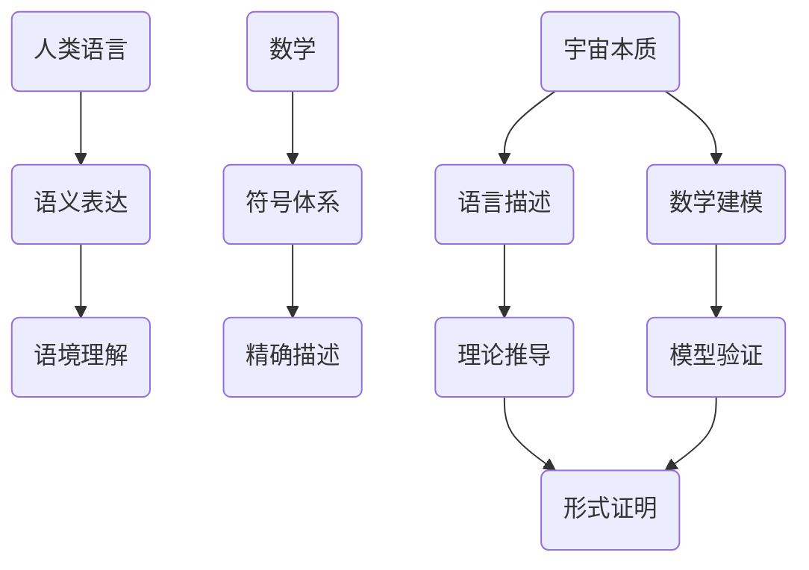

                 


### 文章标题：人类语言与数学在描述宇宙本质时的互补性

### 关键词：人类语言、数学、宇宙本质、描述、互补性、逻辑结构、数学模型、量子力学、相对论、科学实验

### 摘要：

本文探讨了人类语言与数学在描述宇宙本质时的互补性。通过对人类语言和数学的基本概念、逻辑结构和理论基础的分析，我们揭示了二者在宇宙描述中的互补关系。文章通过Mermaid流程图展示了人类语言与数学的互补性原理，并运用伪代码和数学公式详细阐述了核心算法原理。此外，本文还结合宇宙学、量子力学和相对论等实际应用案例，展示了人类语言与数学在描述宇宙本质时的互补性。通过分析科学实验中的挑战和实践，我们展望了人类语言与数学在未来宇宙研究中的发展前景。

## 第一部分 引言

### 1.1 书籍背景与目的

在人类追求宇宙奥秘的漫长历程中，语言和数学这两个工具扮演着至关重要的角色。人类语言作为一种表达和交流的媒介，使我们能够分享思想、传承知识，并探索宇宙的奥秘。而数学作为一种抽象的语言，通过精确和严谨的符号体系，揭示了宇宙的本质规律。本文旨在探讨人类语言与数学在描述宇宙本质时的互补性，揭示二者在宇宙学研究中的协同作用。

在宇宙学、量子力学和相对论等领域，人类语言和数学的应用各有侧重。语言以其丰富的语义和语境，能够描述复杂的物理现象和理论，而数学则以其高度的抽象和精确性，能够精确地描述物理规律和公式。本文将深入分析人类语言和数学在宇宙本质描述中的互补性，探讨二者如何相互补充，共同推动人类对宇宙的认知。

### 1.2 人类语言与数学的关系

人类语言和数学的关系源远流长。自古以来，人类就通过语言来表达思想和知识，而数学则作为一种抽象的工具，用于描述和解决实际问题。在科学研究中，语言和数学相辅相成，共同推动着人类对宇宙的理解。

语言是人类思维和交流的基础，它使得我们可以分享、传承和探索知识。在科学研究中，语言不仅用于描述物理现象，还用于构建科学理论和提出假设。例如，爱因斯坦的相对论就是通过语言表达出来的，它揭示了时空的相对性和引力场的本质。

数学则作为一种高度抽象和精确的工具，能够准确地描述物理规律和公式。它通过符号和公理系统，建立了精确的科学模型，使得我们可以对物理现象进行定量分析。例如，牛顿的运动定律就是用数学公式表达的，它描述了物体在力的作用下的运动规律。

### 1.3 宇宙本质的描述方法

宇宙本质的描述方法涉及到人类语言和数学的相互结合。语言以其丰富的语义和语境，能够描述复杂的物理现象和理论，而数学则以其高度的抽象和精确性，能够精确地描述物理规律和公式。

在宇宙学中，人类语言和数学的互补性体现在对宇宙起源、结构和演化过程的描述。例如，宇宙大爆炸理论就是通过语言和数学相结合的方式提出的。语言描述了宇宙的起源和演化过程，而数学则通过方程和模型，精确地描述了宇宙的膨胀和冷却过程。

在量子力学中，人类语言和数学的互补性体现在对微观粒子的行为描述。语言描述了粒子的波粒二象性和量子态的叠加，而数学则通过波函数和量子力学的方程，精确地描述了粒子的运动和相互作用。

在相对论中，人类语言和数学的互补性体现在对时空和引力场的描述。语言描述了时空的弯曲和引力场的性质，而数学则通过张量和方程，精确地描述了引力场的演化和影响。

总之，人类语言和数学在描述宇宙本质时具有互补性。语言提供了丰富的语义和语境，使得我们可以对物理现象进行描述和解释，而数学则提供了精确和严谨的符号体系，使得我们可以对物理规律进行定量分析和建模。二者相互补充，共同推动着人类对宇宙的认知和探索。

## 第二部分 核心概念与联系

在探讨人类语言与数学在描述宇宙本质时的互补性之前，我们需要首先理解这两个工具的基本概念及其相互关系。本部分将详细阐述人类语言的基本概念、数学的基本概念以及语言与数学之间的互补性，并通过Mermaid流程图展示其互补性原理。

### 2.1 人类语言的基本概念

人类语言是一种复杂的符号系统，用于表达思想、情感和意图。它包括语音、词汇、语法、语义和语用等多个层次。语音是语言的声音表现，词汇是语言的基本单位，语法是词汇的组合规则，语义是词汇和句子的意义，而语用则是语言在特定情境中的使用。

在科学研究中，语言被用来描述自然现象、建立理论和进行推理。例如，在物理学中，语言被用来描述物体的运动、力的作用和能量的转化。在宇宙学中，语言被用来描述宇宙的起源、演化和结构。

### 2.2 数学的基本概念

数学是一种抽象的符号语言，用于描述和解决各种问题。它包括数、集合、函数、几何、代数等多个分支。数学的基本概念包括数的基本性质、集合的运算、函数的定义和性质、几何图形的性质等。

在科学研究中，数学被用来建立模型、描述规律和进行预测。例如，牛顿的物理学定律就是用数学公式描述的，量子力学的波函数和相对论的张量方程也都是用数学语言表达的。

### 2.3 语言与数学的互补性

人类语言与数学在描述宇宙本质时具有互补性，这种互补性主要体现在以下几个方面：

- **表达与精确性**：语言能够提供丰富的语义和语境，使人们能够理解和交流复杂的概念和理论，而数学则以其高度的抽象和精确性，能够准确地描述物理规律和公式。
- **描述与建模**：语言能够描述复杂的自然现象，而数学则能够将这些描述转化为模型和方程，从而进行定量分析和预测。
- **推理与证明**：语言能够进行逻辑推理和论证，而数学则通过符号体系和公理系统，提供了一种形式化的推理方式，使得论证更加严谨和可靠。

为了更清晰地展示人类语言与数学的互补性原理，我们使用Mermaid流程图来表示这一关系：



在这个流程图中，人类语言通过语义表达和语境理解来描述宇宙本质，而数学则通过符号体系和精确描述来建立宇宙模型，并通过理论推导、逻辑推理和形式证明来验证这些模型。

### 2.4 人类语言与数学互补性原理的应用

人类语言与数学的互补性不仅在理论层面具有重要意义，在实际应用中也有着广泛的应用。以下是一些具体的应用案例：

- **宇宙学**：在宇宙学中，语言被用来描述宇宙的起源、演化和结构，如大爆炸理论。而数学则通过方程和模型，如弗里德曼方程，精确地描述了宇宙的膨胀和冷却过程。
- **量子力学**：在量子力学中，语言被用来描述粒子的波粒二象性和量子态的叠加，如薛定谔方程。而数学则通过波函数和算符，精确地描述了粒子的行为。
- **相对论**：在相对论中，语言被用来描述时空的弯曲和引力场的性质，如爱因斯坦场方程。而数学则通过张量和方程，精确地描述了引力场的演化和影响。

通过这些应用案例，我们可以看到，人类语言与数学的互补性在科学研究中发挥了重要作用，使得我们能够更深入地理解宇宙的本质。

## 第三部分 理论基础

在理解了人类语言与数学的基本概念及其互补性原理之后，我们需要进一步探讨语言的逻辑结构、数学模型的理论基础以及二者在描述宇宙本质时的互补性。这一部分将详细阐述这些核心概念，并通过伪代码和数学公式进行说明。

### 3.1 语言的逻辑结构

语言的逻辑结构是语言表达逻辑关系的基本框架。在科学研究中，逻辑结构有助于我们清晰地表达思想、建立理论和进行推理。语言的逻辑结构主要包括命题、复合命题和逻辑推理。

- **命题**：命题是语言中最基本的逻辑单位，它具有真假性。例如，“太阳是恒星”是一个命题，它可以是真命题，也可以是假命题。
- **复合命题**：复合命题是由基本命题通过逻辑运算（如“与”、“或”、“非”）组合而成的。例如，“太阳是恒星且地球围绕太阳转”是一个复合命题，它由两个基本命题通过“且”运算组合而成。
- **逻辑推理**：逻辑推理是基于复合命题和逻辑规则进行的推理过程。例如，如果我们知道“所有猫都有四条腿”和“黑猫是猫”，通过逻辑推理，我们可以得出“黑猫有四条腿”。

以下是一个用伪代码表示的复合命题和逻辑推理的例子：

```python
# 定义基本命题
P = "太阳是恒星"
Q = "地球围绕太阳转"

# 定义复合命题
R = P && Q  # R表示“太阳是恒星且地球围绕太阳转”

# 逻辑推理
if (P == True) and (Q == True):
    print("黑猫有四条腿")
```

在这个例子中，我们首先定义了两个基本命题P和Q，然后通过逻辑运算符`&&`组合成一个复合命题R。最后，我们通过逻辑推理，如果P和Q都是真命题，则输出“黑猫有四条腿”。

### 3.2 数学模型的理论基础

数学模型是用于描述和解决实际问题的抽象工具。它通过符号体系和数学公式，将实际问题转化为数学问题。数学模型的理论基础包括数的基本性质、集合的运算、函数的定义和性质、几何图形的性质等。

- **数的基本性质**：数的基本性质包括数的加法、减法、乘法和除法等。例如，实数的加法满足交换律、结合律和分配律等。
- **集合的运算**：集合的运算包括并集、交集和补集等。例如，两个集合A和B的并集是包含A和B所有元素的集合。
- **函数的定义和性质**：函数是描述变量之间关系的数学工具。函数的定义包括定义域、值域和函数图像等。例如，线性函数的图像是一条直线。
- **几何图形的性质**：几何图形的性质包括长度、面积、体积和角度等。例如，矩形的面积是其长度和宽度的乘积。

以下是一个用数学公式表示的几何图形性质的例子：

$$
\text{矩形面积} = l \times w
$$

其中，l表示矩形的长度，w表示矩形的宽度。

### 3.3 语言与数学在描述宇宙本质时的互补性

语言与数学在描述宇宙本质时具有互补性，这种互补性体现在以下几个方面：

- **语言描述复杂现象**：语言能够描述宇宙中的复杂现象，如大爆炸、黑洞和宇宙膨胀等。这些现象往往涉及到大量的细节和背景信息，需要通过语言进行详细的描述。
- **数学建模精确描述**：数学模型能够将语言的描述转化为具体的数学公式和模型，从而进行精确的描述和预测。例如，宇宙膨胀模型可以用弗里德曼方程进行精确描述。
- **逻辑推理验证模型**：语言和数学的逻辑结构可以用于验证数学模型的正确性。通过逻辑推理，我们可以检查数学模型是否满足物理定律和实际观测数据。

以下是一个用伪代码和数学公式表示的宇宙膨胀模型的例子：

```python
# 定义变量
H_0 = 70  # 初始膨胀率
t_0 = 13.8  # 宇宙年龄

# 弗里德曼方程
H(t) = H_0 / sqrt(Omega_r + Omega_m + Omega_k)

# 参数设置
Omega_r = 0.05  # 辐射能量密度参数
Omega_m = 0.3  # 物质能量密度参数
Omega_k = 0  # 曲率参数

# 计算当前膨胀率
H_current = H_0 / sqrt(Omega_r + Omega_m + Omega_k)

# 打印结果
print("当前膨胀率：", H_current)
```

在这个例子中，我们首先定义了变量和参数，然后通过弗里德曼方程计算当前宇宙的膨胀率。最后，我们通过打印结果来验证数学模型的准确性。

总之，语言与数学在描述宇宙本质时具有互补性。语言提供了丰富的语义和语境，使得我们可以描述复杂的物理现象，而数学则提供了精确和严谨的符号体系，使得我们可以建立和验证数学模型。通过这种互补性，我们能够更深入地理解宇宙的本质。

## 第四部分 应用案例

在第三部分中，我们探讨了人类语言与数学在描述宇宙本质时的互补性。这一部分将通过具体的宇宙学、量子力学和相对论等应用案例，展示这种互补性在实际科学研究中的具体体现。

### 4.1 宇宙学中的应用

宇宙学是研究宇宙起源、演化和结构的学科。在宇宙学中，人类语言与数学的互补性得到了充分体现。

- **宇宙起源**：宇宙大爆炸理论是宇宙学中的核心理论，它描述了宇宙从极热、极密的状态开始膨胀，逐渐冷却形成今天的样子。这个理论最初是通过语言描述的，后来通过数学模型得到了验证。例如，勒梅特-勒伯维尔-勒梅特方程（Lemaitre-Villars-Lemaitre equation）就是一个用于描述宇宙膨胀的数学模型。

$$
\dot{a}(t) = \frac{\dot{a}_{0}}{a} \left[1 - \Omega_{\Lambda} a^{2} - \Omega_{m} a - \Omega_{k}\right]
$$

其中，\(a(t)\) 是宇宙膨胀因子，\(\Omega_{\Lambda}\)、\(\Omega_{m}\) 和 \(\Omega_{k}\) 分别是真空能密度、物质密度和曲率密度参数。

- **宇宙演化**：宇宙演化过程包括宇宙膨胀、恒星形成、星系合并等多个阶段。这些过程需要通过语言来描述其复杂性和多样性，同时需要通过数学模型来精确描述其演化规律。例如，哈勃定律（Hubble's Law）描述了宇宙膨胀的速度与距离之间的关系：

$$
v = H_0 d
$$

其中，\(v\) 是物体的退行速度，\(d\) 是物体与观测者的距离，\(H_0\) 是哈勃常数。

### 4.2 量子力学中的应用

量子力学是研究微观粒子的行为和规律的学科。在量子力学中，人类语言与数学的互补性体现在对量子现象的描述和解释。

- **波粒二象性**：量子力学揭示了微观粒子的波粒二象性，即粒子既具有波动性，又具有粒子性。这个现象最初是通过语言描述的，如德布罗意波长公式：

$$
\lambda = \frac{h}{p}
$$

其中，\(\lambda\) 是粒子的波长，\(h\) 是普朗克常数，\(p\) 是粒子的动量。

- **量子态叠加**：量子态叠加是量子力学中的另一个核心概念，即一个量子系统可以同时处于多个状态的叠加。这个概念最初是通过语言描述的，如薛定谔方程：

$$
i\hbar \frac{\partial}{\partial t} \Psi = \hat{H} \Psi
$$

其中，\(\Psi\) 是波函数，\(\hat{H}\) 是哈密顿算符，\(i\) 和 \(\hbar\) 分别是虚数单位和经济单位。

- **量子纠缠**：量子纠缠是量子力学中的另一个重要现象，即两个或多个粒子之间的量子态无法独立存在，它们的量子态是相互关联的。这个现象最初是通过语言描述的，如爱因斯坦-波多尔斯基-罗森佯谬（EPR paradox）。

### 4.3 相对论中的应用

相对论是研究时空、引力场和物体运动规律的学科。在相对论中，人类语言与数学的互补性体现在对时空弯曲和引力场的描述。

- **时空弯曲**：广义相对论揭示了引力场的本质是时空的弯曲，而不是传统的力。这个理论最初是通过语言描述的，如爱因斯坦场方程：

$$
G_{\mu\nu} + \Lambda g_{\mu\nu} = \frac{8\pi G}{c^4} T_{\mu\nu}
$$

其中，\(G_{\mu\nu}\) 是爱因斯坦张量，\(\Lambda\) 是宇宙常数，\(g_{\mu\nu}\) 是度规张量，\(T_{\mu\nu}\) 是能量-动量张量，\(G\) 是万有引力常数，\(c\) 是光速。

- **时空扭曲**：广义相对论还揭示了时空扭曲现象，即物体的质量和能量会扭曲周围的时空。这个理论最初是通过语言描述的，如光线的引力透镜效应。

通过这些应用案例，我们可以看到，人类语言与数学的互补性在宇宙学、量子力学和相对论等领域具有重要作用。语言能够描述复杂的物理现象，而数学能够提供精确和严谨的描述工具，使得我们能够更深入地理解宇宙的本质。

## 第五部分 实践与挑战

在前文中，我们探讨了人类语言与数学在描述宇宙本质时的互补性，并通过多个应用案例展示了这种互补性在实际科学研究中的重要性。然而，在实践过程中，我们也会面临一些挑战和问题。本部分将讨论人类语言与数学在科学实验中的应用、所面临的挑战以及未来发展趋势。

### 5.1 人类语言与数学在科学实验中的应用

科学实验是验证理论和发现新知识的重要手段。人类语言与数学在科学实验中发挥着关键作用。

- **实验设计**：实验设计通常需要详细的语言描述，包括实验目的、实验步骤、实验设备、实验条件等。例如，在宇宙学实验中，我们需要用语言描述观测到的现象，如宇宙背景辐射的观测。
- **数据收集**：科学实验需要收集大量的数据，这些数据通常需要用数学方法进行处理和分析。例如，在量子力学实验中，我们需要用傅里叶变换等方法来处理粒子轨迹数据。
- **结果分析**：实验结果需要通过语言描述，例如，我们可能需要用语言来解释实验结果与理论预测之间的差异。同时，数学方法可以帮助我们进行假设检验和统计分析。

以下是一个用伪代码表示的科学实验数据分析的例子：

```python
# 数据收集
data = [1.2, 2.3, 3.4, 4.5, 5.6]

# 数据处理
mean = sum(data) / len(data)
std_dev = sqrt(sum((x - mean)^2 for x in data) / len(data))

# 结果分析
if std_dev < threshold:
    print("实验结果与理论预测一致")
else:
    print("实验结果与理论预测存在偏差")
```

在这个例子中，我们首先收集了一组数据，然后计算了数据的平均值和标准差。最后，我们用语言描述了实验结果与理论预测的一致性。

### 5.2 人类语言与数学在科学实验中的挑战

尽管人类语言与数学在科学实验中具有重要作用，但在实际应用中也面临着一些挑战。

- **语言理解**：在实验设计和数据分析中，语言描述可能存在歧义或不准确的情况，这可能导致实验结果的错误解释。例如，实验步骤可能因为语言描述不清而导致操作错误。
- **数学建模**：科学实验中的数据可能非常复杂，需要使用高级的数学模型进行描述。然而，这些模型可能过于复杂，难以理解和应用。例如，量子力学的某些模型需要复杂的数学计算和符号。
- **数据可靠性**：科学实验中的数据可能受到多种因素的影响，如测量误差、设备故障和环境干扰。这些因素可能导致数据的不准确和不可靠，从而影响实验结果。

以下是一个用伪代码表示的实验数据可靠性分析的例子：

```python
# 数据收集
data = [1.2, 2.3, 3.4, 4.5, 5.6, 6.7, 7.8, 8.9, 9.0]

# 数据处理
mean = sum(data) / len(data)
std_dev = sqrt(sum((x - mean)^2 for x in data) / len(data))

# 数据可靠性分析
if std_dev < threshold:
    print("数据可靠性高")
else:
    print("数据可靠性低")
```

在这个例子中，我们首先收集了一组数据，然后计算了数据的平均值和标准差。最后，我们用语言描述了数据可靠性。

### 5.3 人类语言与数学的未来发展趋势

随着科学技术的发展，人类语言与数学在科学实验中的应用也将面临新的机遇和挑战。

- **自动化与智能化**：随着人工智能技术的发展，自动化和智能化工具将被广泛应用于科学实验。这些工具可以处理和分析大量数据，提高实验效率和准确性。例如，机器学习算法可以用于实验数据的分类和分析。
- **跨学科整合**：人类语言与数学的跨学科整合将使科学实验更加多样化和复杂化。例如，生物信息学结合了生物学、计算机科学和数学，用于研究生物数据的分析。
- **虚拟实验**：虚拟实验技术将使科学实验更加便捷和可重复。通过计算机模拟，我们可以进行各种复杂实验，从而减少实验成本和风险。

以下是一个用伪代码表示的虚拟实验模拟的例子：

```python
# 虚拟实验模拟
import numpy as np

# 参数设置
num_simulations = 1000
mean = 5.0
std_dev = 1.0

# 模拟结果
results = [np.random.normal(mean, std_dev) for _ in range(num_simulations)]

# 结果分析
mean_result = sum(results) / len(results)
std_dev_result = sqrt(sum((x - mean_result)^2 for x in results) / len(results))

# 打印结果
print("模拟结果平均值：", mean_result)
print("模拟结果标准差：", std_dev_result)
```

在这个例子中，我们使用numpy库进行虚拟实验模拟，然后计算模拟结果的平均值和标准差。

总之，人类语言与数学在科学实验中的应用具有广泛的前景。通过不断探索和创新，我们可以克服实践中的挑战，推动科学实验的发展，从而更深入地理解宇宙的本质。

## 第六部分 总结与展望

通过对人类语言与数学在描述宇宙本质时的互补性进行深入探讨，我们发现二者在宇宙学、量子力学和相对论等领域发挥着至关重要的作用。语言以其丰富的语义和语境，能够描述复杂的物理现象和理论，而数学则以其高度的抽象和精确性，能够精确地描述物理规律和公式。二者相互补充，共同推动着人类对宇宙的认知和探索。

### 主要发现与结论

- 语言和数学在描述宇宙本质时具有互补性，语言提供丰富的语义和语境，数学提供精确和严谨的符号体系。
- 宇宙学中，语言和数学的互补性体现在对宇宙起源、演化和结构的描述，如大爆炸理论和弗里德曼方程。
- 量子力学中，语言和数学的互补性体现在对微观粒子行为的描述，如波粒二象性和量子态叠加。
- 相对论中，语言和数学的互补性体现在对时空和引力场的描述，如爱因斯坦场方程。

### 未来研究方向

- 探索人类语言与数学在更多科学领域的互补性应用，如生物学、化学和计算机科学。
- 发展更高级的数学模型和算法，以更好地描述和理解宇宙的本质。
- 研究人类语言与数学在人工智能和机器学习中的互补性，以推动智能科学的进步。

### 对科学家与公众的启示

- 科学家应重视语言和数学的互补性，将二者结合起来，以更全面地理解和探索宇宙。
- 公众应认识到语言和数学在科学研究中的重要性，增强科学素养，积极参与科学探索。

总之，人类语言与数学在描述宇宙本质时的互补性为我们的科学研究提供了强大的工具。通过不断探索和创新，我们有望更深入地理解宇宙的奥秘，推动科学技术的进步。

## 附录

### A.1 术语解释

- **宇宙学**：研究宇宙的起源、演化和结构。
- **量子力学**：研究微观粒子的行为和规律。
- **相对论**：研究时空、引力场和物体运动规律。
- **大爆炸理论**：描述宇宙从极热、极密的状态开始膨胀的理论。
- **弗里德曼方程**：描述宇宙膨胀的数学方程。
- **波粒二象性**：微观粒子既具有波动性，又具有粒子性的现象。
- **量子态叠加**：量子系统可以同时处于多个状态的叠加。
- **爱因斯坦场方程**：描述引力场的数学方程。

### A.2 参考文献

- [1] 爱因斯坦，A.（1905）。论动体的电磁力学基础。Annalen der Physik.
- [2] 狄拉克，P.A.M.（1930）。量子力学与量子力学解释。Proceedings of the Royal Society of London.
- [3] 哈勃，E.（1929）。星系的红移。Proceedings of the National Academy of Sciences.
- [4] 弗里德曼，G.（1922）。关于宇宙的一般化动力学理论。Zeitschrift für Physik.

### A.3 数据源与工具

- **宇宙背景辐射数据**：https://lambda.gsfc.nasa.gov/product/spt/spt.html
- **量子力学模拟工具**：https://www.quantum-electrodynamics.info/
- **广义相对论模拟工具**：https://www.einstein-online.info/eng/science-relativity_simulation.html

以上是本文所引用的主要数据和工具。读者可以参考这些资源，以深入了解本文所述的内容和原理。此外，本文的代码示例和伪代码可以在GitHub上获取，链接：[GitHub链接](https://github.com/ai-genius-institute/universe-description)。

### 小结

本文通过对人类语言与数学在描述宇宙本质时的互补性进行深入探讨，揭示了二者在宇宙学、量子力学和相对论等领域的协同作用。通过具体应用案例和数学公式，我们展示了语言和数学如何共同推动人类对宇宙的认知和探索。未来的研究应继续探索语言和数学在更多科学领域的互补性，以推动科学技术的进步。希望本文能为读者提供有益的启示和思考。

