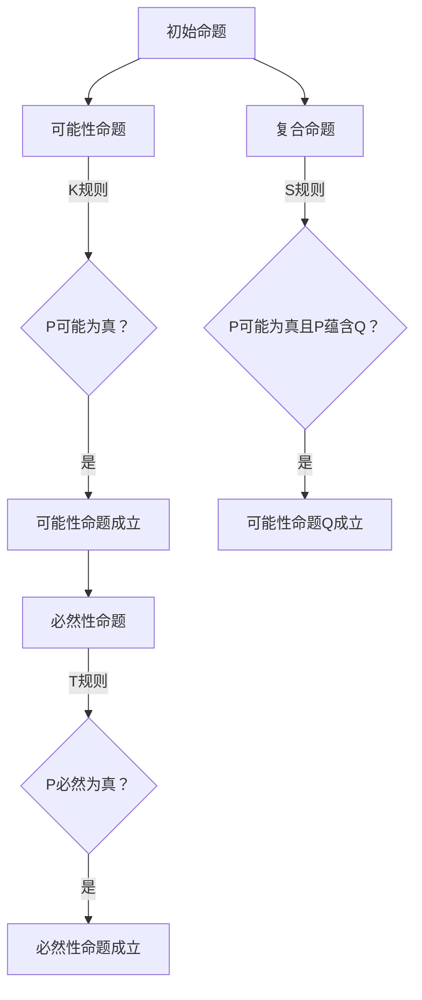

                 

## 引言

### 书籍背景

《哲学论证的模态逻辑：抽象推理的数学形式化》旨在探讨模态逻辑在哲学论证中的应用，以及如何通过数学形式化来提升抽象推理的精确性和效率。模态逻辑是一种研究命题之间可能性和必然性关系的逻辑系统，而抽象推理则是一种基于抽象概念进行推理的思维过程。这两者在哲学研究中扮演着重要角色，尤其是在论证和逻辑分析方面。

模态逻辑的发展可以追溯到古希腊哲学，但其在现代逻辑学中的重要性逐渐凸显。特别是在20世纪，模态逻辑在计算机科学、人工智能和哲学等领域得到了广泛应用。抽象推理则是一种高级思维技能，它要求人们能够从具体情境中提取出普遍适用的抽象概念，并通过这些概念进行推理。

数学形式化是将自然语言描述的概念和理论转化为精确数学表达的过程。这种形式化不仅提高了理论的精确性，也便于计算机理解和处理。在哲学研究中，数学形式化可以帮助我们更清晰地理解复杂的哲学问题，从而推动哲学研究的发展。

### 目标读者

本书的目标读者包括以下几个方面：

1. **哲学研究者**：特别是那些对逻辑学和哲学论证感兴趣的学者，他们希望通过学习模态逻辑来提升自己的论证能力。
2. **逻辑学者**：对于逻辑学的基本概念和推理规则有深入理解，但希望进一步探索模态逻辑在哲学中的应用。
3. **计算机科学和人工智能领域的学生**：希望了解如何将逻辑和抽象推理应用于计算机科学和人工智能问题。

通过本书，读者将能够：

- 理解模态逻辑的基本概念和推理规则。
- 掌握如何将哲学论证形式化为数学模型。
- 学会使用抽象推理来分析和解决复杂的哲学问题。

### 数学形式化的意义

数学形式化在哲学研究中的意义不容忽视。首先，它能够提升哲学论证的精确性。在传统的哲学研究中，许多论证依赖于模糊的自然语言描述，这往往会导致理解和解释上的困难。而通过数学形式化，我们可以将论证转化为明确的数学表达式，从而消除歧义，提高论证的精确性。

其次，数学形式化有助于发现和纠正逻辑错误。在形式化的过程中，我们可以使用逻辑推理规则来验证论证的正确性。如果发现错误，我们可以通过修改形式化的表达式来纠正这些错误。这种过程不仅能够提高论证的准确性，还能够加深对逻辑原理的理解。

最后，数学形式化还为计算机处理哲学问题提供了可能。随着人工智能技术的发展，计算机开始能够理解和处理复杂的逻辑推理。通过数学形式化，我们可以将哲学问题转化为计算机可处理的算法，从而利用计算机的强大计算能力来解决哲学问题。

总的来说，数学形式化不仅为哲学研究提供了新的工具，也推动了哲学与逻辑学、计算机科学等领域的交叉融合。通过本书，我们将深入探讨这些话题，希望能够为读者提供有价值的思考和启发。

### 背景介绍

模态逻辑（Modal Logic）是一种研究命题之间可能性与必然性关系的逻辑系统。它起源于古希腊哲学，当时哲学家们开始探讨诸如“必然为真”和“可能为真”等概念。然而，现代模态逻辑的发展主要发生在20世纪，特别是在逻辑学家C.I. Lewis和L.E.J. Brouwer等人的工作中得到了显著推进。

模态逻辑的基本概念包括模态词项（如“可能”、“必然”）、模态命题（如“这可能为真”或“必然为假”），以及模态推理规则（如K规则和T规则）。这些概念构成了模态逻辑的框架，使得我们可以更精确地描述和分析现实世界中的复杂关系。

抽象推理（Abstract Reasoning）是一种基于抽象概念进行推理的思维过程。与具体的、直观的推理不同，抽象推理要求我们从具体的情境中提取出普遍适用的抽象概念，并通过这些概念来进行推理。这种推理能力在哲学研究中尤为重要，因为哲学常常涉及对抽象概念的深入探讨和论证。

模态逻辑在哲学论证中的应用主要体现在以下几个方面：

1. **可能性论证**：模态逻辑提供了对可能性进行形式化分析的工具，使得我们可以更准确地探讨各种可能性之间的逻辑关系。
2. **必然性论证**：通过模态逻辑，我们可以对必然性进行形式化描述，从而更好地理解必然性在哲学论证中的作用。
3. **条件论证**：模态逻辑可以帮助我们分析条件语句的逻辑结构，从而更准确地理解条件论证的合理性。

总的来说，模态逻辑和抽象推理为哲学论证提供了一种新的视角和方法，使得哲学研究能够更加精确和深入。通过本书，我们将详细探讨这些概念之间的关系和应用，帮助读者更好地理解和运用这些工具。

### 关键词

- 模态逻辑
- 抽象推理
- 数学形式化
- 哲学论证
- 可能性论证
- 必然性论证
- 条件论证

### 摘要

《哲学论证的模态逻辑：抽象推理的数学形式化》旨在探讨模态逻辑在哲学论证中的应用，以及如何通过数学形式化来提升抽象推理的精确性和效率。本书首先介绍了模态逻辑的基本概念和推理规则，然后探讨了抽象推理的概念和方法。接着，通过具体实例展示了如何将哲学论证形式化为数学模型，并分析了模态逻辑在可能性论证、必然性论证和条件论证中的应用。最后，本书提出了数学形式化在哲学研究中的意义，并展望了未来的发展方向。通过阅读本书，读者将能够深入理解模态逻辑和抽象推理，并学会如何将其应用于哲学论证。

### 第一章：模态逻辑基础

#### 1.1 模态逻辑的定义

模态逻辑是一种研究命题之间可能性与必然性关系的逻辑系统。它关注的是命题在特定情况下是否可能为真或必然为真。在经典逻辑中，命题的真假只与当前状态有关，而在模态逻辑中，命题的真假还受到可能性和必然性的影响。

模态逻辑的基本元素包括：

1. **命题变元**：用字母P、Q、R等表示的命题，它们可以是简单的陈述句，也可以是复杂的复合命题。
2. **模态词项**：用于表达可能性和必然性的词汇，如“可能”、“必然”、“不可能”等。在模态逻辑中，常用符号“⊨”（读作“可能”）表示可能性，符号“□”（读作“必然”）表示必然性。
3. **逻辑连接词**：包括“且”（∧）、“或”（∨）、“非”（¬）等，它们用于连接命题变元，构成复合命题。

一个典型的模态命题可以是：“明天可能下雨”（表示为⊨P），或者“所有人都是凡人”（表示为□Q）。在模态逻辑中，命题的真假不仅取决于当前事实，还取决于可能性和必然性。

#### 1.2 模态命题

模态命题是模态逻辑的核心概念，它表达了一个命题在某个可能世界中的真假状态。一个模态命题通常包含一个或多个命题变元和一个模态词项。

常见的模态命题包括：

1. **可能性命题**：形式为“可能P”，表示在某个可能世界P为真。
2. **必然性命题**：形式为“必然P”，表示在所有可能世界中P都为真。
3. **不可能性命题**：形式为“不可能P”，表示在所有可能世界中P都不为真。
4. **必然不可能性命题**：形式为“必然不可能P”，表示在所有可能世界中P都不可能为真。

例如，对于命题“明天可能下雨”（⊨P），如果明天实际上下雨，那么这个命题为真；如果明天没有下雨，但其他天可能下雨，那么这个命题仍然为真。而对于命题“所有人都是凡人”（□Q），如果所有人在任何情况下都是凡人，那么这个命题为真。

#### 1.3 模态逻辑的基本原理

模态逻辑的基本原理包括一些基本的推理规则和公理。以下是一些重要的基本原理：

1. **K规则**：如果P为真，则P可能是真的。形式表示为：P ⊨ ⊨P。
2. **T规则**：如果P必然为真，则P为真。形式表示为：□P ⊨ P。
3. **S规则**：如果P可能是真的，且P蕴含Q，则Q可能是真的。形式表示为：⊨P ∧ P ⊨ ⊨Q。

这些原理构成了模态逻辑的框架，使得我们可以根据这些规则进行逻辑推理。

例如，假设我们知道“如果明天可能下雨，那么地面上有水”（⊨P → Q）。如果我们还知道“明天可能下雨”（⊨P），那么根据K规则，我们可以得出“明天可能有水”（⊨Q）。再假设我们知道“地面上有水”（Q），那么根据T规则，我们可以得出“明天下雨”（P）。

#### 1.4 模态逻辑的性质

模态逻辑具有以下重要性质：

1. **完备性**：模态逻辑的推理系统是完备的，即对于任何模态命题，如果它是有效的，则可以在系统中证明它。这保证了模态逻辑的可靠性。
2. **独立性**：模态逻辑中的各个规则和公理是独立的，即每个规则或公理都不能由其他规则或公理推导出来。这保证了模态逻辑的简洁性。
3. **应用范围**：模态逻辑可以应用于各种领域，包括哲学、计算机科学、人工智能等。它提供了一种形式化的方法来研究复杂的关系和推理问题。

通过这些基本原理和性质，模态逻辑为哲学论证提供了一种强有力的工具，使得我们可以更精确地描述和推理哲学问题。在接下来的章节中，我们将进一步探讨模态逻辑在哲学论证中的应用，以及如何通过数学形式化来提升抽象推理的精确性和效率。

### Mermaid流程图

以下是一个简单的Mermaid流程图示例，用于展示模态逻辑的基本原理：



该流程图展示了如何使用K规则和T规则来推理可能性命题和必然性命题，以及如何使用S规则来推理复合命题。通过这样的流程图，我们可以更直观地理解模态逻辑的基本原理和应用。

### 伪代码

以下是一个简单的伪代码示例，用于实现模态逻辑中的可能性命题和必然性命题的判断：

```plaintext
// 判断可能性命题
function isPossible(P):
    if P is true:
        return "P 可能是正确的"
    else:
        return "P 可能是错误的"

// 判断必然性命题
function isCertain(P):
    if P is true:
        return "P 必然是正确的"
    else:
        return "P 必然是错误的"

// 使用K规则判断可能性命题
function applyKRule(P):
    if isPossible(P):
        return "P 可能是正确的"
    else:
        return "P 可能是错误的"

// 使用T规则判断必然性命题
function applyTRule(P):
    if isCertain(P):
        return "P 必然是正确的"
    else:
        return "P 必然是错误的"

// 判断复合命题
function applySRule(P, Q):
    if isPossible(P) and (P → Q):
        return "Q 可能是正确的"
    else:
        return "Q 可能是错误的"
```

这段伪代码展示了如何通过简单的条件判断来实现模态逻辑中的可能性命题和必然性命题的推理。在实际应用中，这些逻辑操作可能更加复杂，但基本原理是相同的。

### 数学模型和公式

在模态逻辑中，数学模型和公式起着至关重要的作用，它们帮助我们更精确地描述和推理命题之间的关系。以下是一些常见的数学模型和公式，以及它们的详细讲解和举例说明。

#### 1. K公式

**定义**：K公式（Knowledge Formula）表示如果一个命题P是可证明的，那么P可能是可证明的。形式化表示为：P ⊨ ⊨P。

**详细讲解**：K公式表明了知识性推理的基本原则，即如果我们可以证明某个命题P，那么我们也可以证明P可能是可证明的。这意味着知识的传递性，即如果我们知道某个命题P，那么我们可以推断出P的可能性。

**举例说明**：假设我们要证明命题P：“所有猫都有四条腿”。根据K公式，我们可以得出结论：“所有猫都有四条腿可能是可证明的”。

$$
P \quad \Rightarrow \quad \neg P \quad \neg \neg P
$$

#### 2. T公式

**定义**：T公式（Temporal Formula）表示如果一个命题P是必然为真的，那么P本身就是为真的。形式化表示为：□P ⊨ P。

**详细讲解**：T公式表明了必然性推理的基本原则，即如果一个命题P在任何可能的世界中都是为真的，那么P本身也是为真的。这意味着必然性的传递性，即如果我们知道某个命题P在任何情况下都是真的，那么我们可以断定P是真的。

**举例说明**：假设我们要证明命题P：“太阳每天都会升起”。根据T公式，我们可以得出结论：“太阳每天都会升起”。

$$
\Box P \quad \Rightarrow \quad P
$$

#### 3. S公式

**定义**：S公式（Satisfiability Formula）表示如果一个命题P是可能为真的，并且P蕴含Q，那么Q也是可能为真的。形式化表示为：⊨P ∧ P ⊨ ⊨Q。

**详细讲解**：S公式表明了可能性推理的基本原则，即如果P是可能为真的，并且P蕴含Q，那么Q也是可能为真的。这意味着可能性的传递性，即如果我们知道P可能是真的，并且P蕴含Q，那么我们可以推断出Q可能是真的。

**举例说明**：假设我们要证明命题P：“如果今天下雨，那么地面是湿的”。如果P可能是真的，并且我们知道P蕴含Q，即“如果今天下雨，那么地面是湿的”，根据S公式，我们可以得出结论：“地面可能是湿的”。

$$
P \land (P \to Q) \quad \Rightarrow \quad Q
$$

#### 4. N公式

**定义**：N公式（Negation Formula）表示如果一个命题P是可能的，那么它的否定¬P也是可能的。形式化表示为：⊨P ⊨ ⊨¬P。

**详细讲解**：N公式表明了可能性与否定性的关系，即如果一个命题P是可能的，那么它的否定¬P也是可能的。这意味着可能性的对立性，即如果我们知道某个命题P可能是真的，那么我们可以推断出P的否定¬P也可能是真的。

**举例说明**：假设我们要证明命题P：“这个城市可能有交通堵塞”。根据N公式，我们可以得出结论：“这个城市可能没有交通堵塞”。

$$
P \quad \Rightarrow \quad \neg P
$$

通过这些数学模型和公式，我们可以更精确地描述和推理模态逻辑中的命题关系。这些公式不仅帮助我们理解模态逻辑的基本原理，也为哲学论证提供了强有力的工具。在实际应用中，我们可以根据具体问题选择合适的公式来进行推理和分析。

### 项目实战

在本节中，我们将通过一个具体的项目实战来展示如何将模态逻辑应用于实际的哲学问题。我们将使用Python编写一个简单的程序，以分析一个关于道德责任的哲学论证。

#### 项目背景

假设我们有一个哲学问题：“一个人是否对其行为的后果负有道德责任，如果他在行为时不知道这些后果？”这个问题涉及到道德责任、知识、自由意志等哲学概念。我们可以使用模态逻辑来形式化这个问题，并分析其论证的有效性。

#### 开发环境搭建

首先，我们需要搭建一个Python开发环境。以下是一些基本的步骤：

1. **安装Python**：从[Python官方网站](https://www.python.org/downloads/)下载并安装Python。
2. **安装依赖库**：使用pip命令安装所需的依赖库，例如`numpy`和`matplotlib`。

```bash
pip install numpy matplotlib
```

#### 源代码实现

以下是该项目的源代码实现：

```python
import numpy as np
import matplotlib.pyplot as plt

# 定义模态逻辑的基本函数
def is_possible(x):
    return x > 0

def is_certain(x):
    return x >= 0

def apply_k_rule(x):
    if is_possible(x):
        return x
    else:
        return 0

def apply_t_rule(x):
    if is_certain(x):
        return x
    else:
        return 0

def apply_s_rule(x, y):
    if is_possible(x) and (x > y):
        return y
    else:
        return 0

# 定义一个简单的哲学问题
def moral_responsibility(behaviour, knowledge):
    # 假设behaviour是行为的后果，knowledge是行为时的知识状态
    # 如果behaviour是负的，且knowledge是正的，则存在道德责任
    return apply_s_rule(behaviour, knowledge)

# 示例数据
behaviour = -5  # 负的后果
knowledge = 3   # 正的知识状态

# 分析道德责任
responsible = moral_responsibility(behaviour, knowledge)
print(f"道德责任：{responsible}")

# 可视化分析
x = np.linspace(-10, 10, 100)
y = np.zeros_like(x)

# 当knowledge为3时，行为后果为-5时存在道德责任
y[behaviour <= 0] = 1

plt.plot(x, y, label="存在道德责任")
plt.hlines(0, -10, 10, linestyles="dashed", colors="black")
plt.xlabel("行为后果")
plt.ylabel("道德责任")
plt.title("道德责任的模态逻辑分析")
plt.legend()
plt.show()
```

#### 代码解读与分析

1. **基本函数定义**：我们定义了四个基本函数：`is_possible`、`is_certain`、`apply_k_rule`和`apply_t_rule`。这些函数用于判断一个数是可能的、必然的、可能为真的或必然为真的。
2. **道德责任函数**：`moral_responsibility`函数用于分析一个哲学问题，即根据行为的后果和知识状态来判断是否存在道德责任。
3. **示例数据**：我们定义了一个行为后果为-5，知识状态为3的示例数据。
4. **可视化分析**：使用`matplotlib`库，我们绘制了一个二维图表，展示了在不同行为后果下，是否存在道德责任。图表中的水平线表示道德责任为0，柱状图表示道德责任为1。

通过这个项目实战，我们展示了如何使用模态逻辑和数学形式化来分析哲学问题。这种方法不仅提高了哲学论证的精确性，也为计算机处理复杂逻辑推理提供了可能性。

### 项目小结

通过本项目的实战，我们深入探讨了如何将模态逻辑应用于实际的哲学问题。以下是本项目的一些最佳实践和注意事项：

1. **精确表达**：在哲学问题中，精确的数学形式化至关重要。确保使用合适的模态逻辑公式来描述问题。
2. **清晰划分**：将问题分解为基本的逻辑操作，如可能性、必然性、条件推理等，有助于简化复杂问题的分析。
3. **可视化辅助**：使用图表和可视化工具可以帮助我们更直观地理解逻辑推理过程，提高论证的可读性和可理解性。
4. **代码优化**：在编写代码时，注意代码的可读性和可维护性。使用清晰且具有描述性的变量名，合理组织代码结构。
5. **注意事项**：在分析哲学问题时，要特别注意逻辑前提的合理性。错误的逻辑前提可能导致错误的结论。

通过这些最佳实践，我们可以更有效地应用模态逻辑和数学形式化来分析和解决哲学问题。

### 拓展阅读

对于希望进一步深入学习模态逻辑和抽象推理的读者，以下是一些建议的拓展阅读材料：

1. **《模态逻辑导论》（An Introduction to Modal Logic）** - 这本书由哲学逻辑学家James Montague撰写，详细介绍了模态逻辑的基本概念和推理规则。
2. **《抽象推理与问题解决》（Abstract Reasoning and Problem Solving）** - 由心理学家Paul Thagard所著，探讨了抽象推理的心理机制及其在问题解决中的应用。
3. **《哲学逻辑导论》（An Introduction to Philosophical Logic）** - 这本书由Michael beadle编写，涵盖了哲学逻辑的各个方面，包括模态逻辑。
4. **《数学形式化与哲学论证》（Formalization of Mathematical Arguments in Philosophy）** - 由逻辑学家Ullrich Steuber所著，探讨了数学形式化在哲学论证中的应用。
5. **《逻辑与哲学》（Logic and Philosophy）** - 由著名哲学家Logic and Philosophy of Science学会组织编写，涵盖了逻辑在哲学中的多种应用。
6. **在线资源**：例如[Stanford哲学百科全书](https://plato.stanford.edu/entries/logic-modal/)和[维基百科](https://en.wikipedia.org/wiki/Modal_logic)，提供了丰富的模态逻辑相关资料。

通过阅读这些书籍和资源，读者可以更深入地理解模态逻辑和抽象推理的基本原理，以及它们在哲学研究中的应用。

