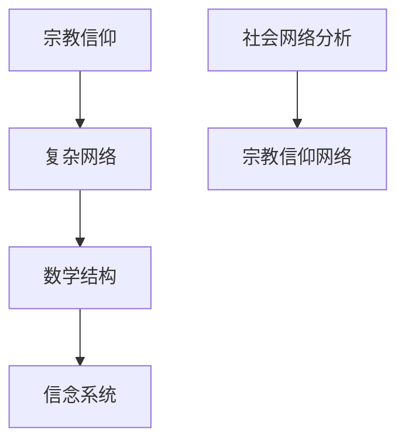

                 

### 文章标题

《宗教信仰的复杂网络：信念系统的数学结构》

宗教信仰是历史上和文化中一个持久而深远的现象，它不仅仅是个体心灵和精神生活的核心，同时也构成了社会结构和文化传承的重要组成部分。随着科学技术的进步和复杂性理论的不断发展，研究人员开始从新的角度来理解和分析宗教信仰，复杂网络理论为这一领域的研究提供了新的工具和方法。本文旨在探讨宗教信仰作为一种复杂网络现象，其信念系统的数学结构和特点。

### 关键词

- 宗教信仰
- 复杂网络
- 信念系统
- 数学结构
- 社会网络分析

### 摘要

本文首先介绍了宗教信仰的重要性以及复杂网络理论的基本概念，接着讨论了宗教信仰网络的基本结构，包括节点和边的表示。然后，通过数学分析，研究了宗教信仰网络的度分布特性。最后，本文通过实证研究和案例分析，展示了宗教信仰网络在现实世界中的应用，并探讨了未来研究的方向和挑战。

---

## 第一部分：导论

### 第1章：引言

#### 1.1 宗教信仰的重要性

宗教信仰在人类历史和文化中扮演着重要角色。它不仅为个人提供了精神寄托和道德指导，还在社会层面上影响了政治、文化、经济和社会制度。宗教信仰的核心在于信念，这些信念构成了个体和集体的信仰系统。

宗教信仰的重要性可以从多个方面来理解：

1. **精神层面**：宗教信仰为个体提供了精神上的安慰和方向，帮助人们应对生活中的挑战和不确定性。
2. **社会层面**：宗教信仰有助于社会秩序的维护，通过共同的价值观和行为规范，增强社会凝聚力。
3. **文化层面**：宗教信仰是文化传承的重要组成部分，它体现了特定社会的历史、传统和价值观。

#### 1.2 信念系统的基本概念

信念系统是指个体或集体对信仰对象（如神灵、教义、道德原则等）的认知和态度的总和。信念系统具有以下基本特点：

1. **内隐性**：信念系统通常存在于个体的内心深处，不易被直接观察和测量。
2. **稳定性**：信念系统一旦形成，往往具有较强的稳定性，不易改变。
3. **多样性**：不同的文化和社会背景下，信念系统具有多样性，形成了不同的宗教流派和信仰体系。

#### 1.3 宗教信仰与复杂网络

复杂网络理论提供了研究宗教信仰的新视角。复杂网络是由大量相互连接的节点和边构成的图形结构，其特点是网络中的节点和边之间存在复杂的相互作用和依赖关系。将宗教信仰视为复杂网络，有助于我们理解信仰系统的动态演变、传播和稳定性。

宗教信仰网络的节点可以表示为信仰者或信仰团体，边表示信仰关系或宗教活动。通过研究宗教信仰网络，我们可以揭示信仰系统的结构特性、传播机制和演化规律。

### 总结

宗教信仰作为复杂网络现象，其信念系统的数学结构具有重要的研究价值。本文接下来的部分将深入探讨宗教信仰网络的数学模型和分析方法，以期为这一领域的研究提供新的视角和工具。

---

### 第二部分：宗教信仰网络的理论基础

#### 第2章：复杂网络的定义与特性

#### 2.1 复杂网络的定义

复杂网络是指由大量节点和连接这些节点的边组成的图形结构。这些节点和边代表了网络中的实体及其相互作用。与简单的网络（如树状结构或完全网络）相比，复杂网络具有更多的结构和功能多样性。

复杂网络的基本概念包括：

1. **节点**：代表网络中的实体，可以是个人、组织、城市等。
2. **边**：代表节点之间的连接，可以是物理连接、信息流动或社会关系。
3. **网络结构**：指网络中节点和边的配置和连接方式。

#### 2.2 复杂网络的特性

复杂网络具有以下几个主要特性：

1. **无标度性**：在无标度网络中，大多数节点的度较小，而少数节点的度非常大。这导致了网络的“长尾”分布，即大部分节点只有几个连接，而极少数节点有大量的连接。
2. **小世界性**：小世界网络中的节点之间通过较短的平均路径长度相互连接，但网络中也存在大量长距离连接，这使得信息可以快速传播到网络的各个部分。
3. **网络模块性**：网络可以被划分为多个模块，每个模块内的节点连接密集，而模块之间的连接相对稀疏。

#### 2.3 复杂网络的理论基础

复杂网络理论的基础包括以下几个方面：

1. **网络科学**：研究网络的性质、结构和动态行为，包括网络生成模型、网络优化、网络稳定性等。
2. **社会网络分析**：研究社会网络的结构、功能和行为，包括节点中心性、网络密度、网络演化等。
3. **统计物理**：使用统计物理的方法来分析和理解网络的宏观行为，如相变、临界现象等。

### 宗教信仰网络与复杂网络的联系

宗教信仰网络作为一种复杂网络，具有复杂网络的一般特性，如无标度性、小世界性和网络模块性。此外，宗教信仰网络还具有以下特点：

1. **节点和边的表示**：宗教信仰网络的节点可以表示为信仰者或信仰团体，边表示信仰关系或宗教活动。
2. **信仰关系的动态性**：宗教信仰网络中的信仰关系是动态变化的，受到社会、文化和政治因素的影响。
3. **信仰系统的多样性**：不同宗教信仰网络的结构和特性存在差异，反映了不同文化和社会背景下的信仰体系。

通过复杂网络理论的分析，我们可以更好地理解宗教信仰网络的动态演化、传播机制和稳定性。这为宗教信仰研究提供了新的视角和方法，有助于揭示宗教信仰系统的本质和特点。

### 总结

复杂网络理论为研究宗教信仰提供了强有力的工具和方法。通过探讨复杂网络的定义和特性，以及宗教信仰网络与复杂网络的联系，我们可以为后续的数学模型和分析方法打下坚实的基础。接下来，本文将继续深入探讨宗教信仰网络的数学建模和具体分析方法。

---

### 第三部分：宗教信仰网络的建模

#### 第3章：宗教信仰网络的模型构建

#### 3.1 宗教信仰网络的节点表示

在宗教信仰网络的建模过程中，首先需要明确节点的表示方法。节点可以表示为信仰者或信仰团体，每个节点具有独特的属性和特征。

1. **个体节点表示**：
   - **属性**：包括年龄、性别、教育背景、信仰强度等。
   - **特征**：个体的宗教信仰程度、参与宗教活动的频率等。

2. **团体节点表示**：
   - **属性**：包括团体规模、组织形式、地理位置等。
   - **特征**：团体的宗教影响力、组织活动频率等。

在宗教信仰网络中，个体节点和团体节点之间的关系可以通过边来表示，这些关系可以是信仰上的归属、参与的活动或共享的信仰对象。

#### 3.2 宗教信仰网络的边表示

边的表示是宗教信仰网络建模的重要组成部分，反映了节点之间的互动和联系。

1. **关系类型**：
   - **信仰关系**：个体对特定宗教信仰的忠诚度和信仰强度。
   - **组织关系**：个体或团体在宗教组织中的角色和地位。
   - **活动关系**：个体或团体参与宗教活动的频率和类型。

2. **权重表示**：
   - **边的权重**：表示节点间关系的强度，可以是基于互动频率、共同信仰对象的数量等。

#### 3.3 宗教信仰网络的模型选择

在构建宗教信仰网络模型时，选择合适的模型至关重要。以下是几种常用的模型选择及其特点：

1. **无标度模型**：
   - **特点**：节点度分布呈现长尾分布，网络结构高度动态。
   - **适用场景**：适用于描述宗教信仰网络中的个体和团体的互动关系。

2. **小世界模型**：
   - **特点**：具有较短的平均路径长度和较多的长距离连接。
   - **适用场景**：适用于描述宗教信仰网络中的信息传播和信仰扩散。

3. **模块化模型**：
   - **特点**：网络被划分为多个模块，模块内连接密集，模块间连接稀疏。
   - **适用场景**：适用于描述宗教信仰网络中的团体和组织结构。

在实际应用中，可以根据研究的具体需求和宗教信仰网络的特点选择合适的模型。例如，在研究宗教信仰的传播和影响时，无标度模型和小世界模型可能更为合适；而在分析宗教团体的组织结构时，模块化模型可能更具解释力。

### 总结

宗教信仰网络的建模是研究宗教信仰复杂性的重要步骤。通过明确节点和边的表示方法，以及选择合适的模型，我们可以更好地理解和分析宗教信仰网络的动态行为和特性。在接下来的章节中，本文将深入探讨宗教信仰网络的数学分析和实证研究，以揭示宗教信仰系统的深层结构和运行机制。

---

### 第四部分：宗教信仰网络的数学分析

#### 第4章：宗教信仰网络的度分布分析

#### 4.1 度分布的定义与计算

度分布是复杂网络分析中的一个核心概念，它描述了网络中节点度数的概率分布情况。在宗教信仰网络中，度分布反映了信仰者或团体之间关系的密度和强度。

1. **度分布的定义**：
   - **度数**：一个节点在复杂网络中的连接数。
   - **度分布**：网络中不同度数的节点所占的比例。

2. **度分布的计算方法**：
   - **直接计数法**：通过统计网络中每个节点的度数，计算其出现的频率。
   - **概率密度函数**：通过概率密度函数（PDF）描述不同度数的概率分布，公式如下：

     \[
     p(k) = \frac{C_k}{N}
     \]

     其中，\( p(k) \) 是度数为 \( k \) 的节点的概率，\( C_k \) 是度数为 \( k \) 的节点数，\( N \) 是网络中的总节点数。

#### 4.2 度分布的统计特性

度分布的统计特性对理解宗教信仰网络的性质至关重要。以下是一些常见的统计特性：

1. **长尾分布**：
   - 在许多复杂网络中，度分布呈现长尾分布，即大多数节点的度数较小，而少数节点的度数非常大。
   - 这种分布反映了网络中的“核心-边缘”结构，即少数重要节点拥有大量连接，而大部分节点连接较少。

2. **幂律分布**：
   - 度分布常常可以用幂律函数来描述，公式如下：

     \[
     p(k) \propto k^{-\alpha}
     \]

     其中，\( \alpha \) 是幂律指数，通常在 2 到 3 之间。
   - 幂律分布表明网络的度数分布具有高度不均匀性，少数节点具有极高的连接数。

3. **簇系数**：
   - 簇系数是衡量网络中节点紧密程度的指标，它描述了一个节点及其邻居之间的连接密度。
   - 对于宗教信仰网络，簇系数可以反映信仰者之间社交网络的紧密程度。

#### 4.3 度分布的实证分析

为了验证度分布的统计特性，我们可以通过实证分析来研究实际宗教信仰网络的度分布。

1. **数据收集**：
   - 收集特定宗教团体或社区的信仰者网络数据，包括节点（信仰者）和边（信仰关系）。

2. **度分布计算**：
   - 使用直接计数法或概率密度函数计算网络中不同度数的节点的分布情况。

3. **结果分析**：
   - 根据统计特性，如长尾分布和幂律分布，分析宗教信仰网络的度分布特性。
   - 通过比较不同宗教团体或社区的度分布，探讨宗教信仰网络的结构差异。

例如，在一个基督教社区的网络中，我们可以观察到大多数信仰者的度数较小，而少数宗教领袖或重要人物具有极高的度数，这反映了网络中的“核心-边缘”结构。而在一个佛教社区的网络上，簇系数可能较高，表明信仰者之间的社交网络较为紧密。

### 总结

度分布分析是理解宗教信仰网络结构的重要手段。通过定义和计算度分布，以及分析其统计特性，我们可以揭示宗教信仰网络的内部结构，为进一步研究信仰传播、网络稳定性和组织演化提供基础。在接下来的章节中，本文将继续探讨宗教信仰网络的实证研究和案例分析，以深入理解宗教信仰网络的动态行为和演化规律。

---

### 第五部分：宗教信仰网络的实证研究

#### 第5章：宗教信仰网络的数据来源

在研究宗教信仰网络时，数据收集是一个关键步骤。数据的质量和完整性直接影响研究的准确性和可靠性。以下是收集宗教信仰网络数据的几个主要来源：

#### 5.1 宗教信仰数据的收集方法

1. **问卷调查**：
   - 问卷调查是一种直接获取宗教信仰数据的方法，可以通过面对面访谈、邮寄问卷或在线问卷等形式进行。
   - 问卷设计应包含有关个体宗教信仰、信仰强度、参与宗教活动频率等问题。

2. **社交媒体数据**：
   - 社交媒体平台如Facebook、Twitter、Instagram等，是收集宗教信仰数据的另一重要来源。
   - 通过分析社交媒体上的帖子、评论、分享等信息，可以了解个体和团体的宗教活动、信仰表达和互动情况。

3. **宗教组织档案**：
   - 宗教组织通常会有详细的档案记录，包括成员信息、活动记录、信仰声明等。
   - 这些档案可以作为可靠的数据来源，但需要获取组织的许可和合作。

4. **公开数据集**：
   - 有一些公开的数据集，如宗教团体名录、宗教活动记录等，可以直接用于研究。

#### 5.2 宗教信仰数据的预处理

收集到的宗教信仰数据通常需要预处理，以确保数据的质量和一致性。预处理步骤包括：

1. **数据清洗**：
   - 去除重复记录、缺失值填充、数据格式统一等。

2. **数据转换**：
   - 将不同来源的数据转换为统一的格式，如关系数据库或图数据格式。

3. **特征提取**：
   - 从原始数据中提取与宗教信仰相关的特征，如信仰强度、互动频率、地理位置等。

#### 5.3 宗教信仰数据的可视化

数据可视化是理解宗教信仰网络结构和特性的重要手段。通过可视化，可以直观地展示宗教信仰网络的节点和边，以及它们之间的关系。

1. **节点表示**：
   - 每个节点可以用不同的形状、颜色或大小来表示不同的特征，如信仰强度、地理位置等。

2. **边表示**：
   - 边可以用线条的长度、颜色或宽度来表示边的权重，如互动频率、信仰关系强度等。

3. **图布局**：
   - 选择合适的图布局算法，如力导布局、层次布局等，以展示网络的拓扑结构。

通过数据收集、预处理和可视化，我们可以更好地理解宗教信仰网络的动态行为和特性，为进一步的数学分析和实证研究提供坚实的基础。

### 总结

宗教信仰网络的实证研究需要可靠的数据来源和精细的数据预处理。通过收集、预处理和可视化宗教信仰数据，我们可以揭示网络的内部结构和特性，为进一步的研究提供支持。在接下来的章节中，本文将继续探讨具体的实证研究和案例分析，以深入理解宗教信仰网络的运行机制和演化规律。

---

### 第六部分：宗教信仰网络的案例研究

#### 第6章：宗教信仰网络的具体案例分析

在宗教信仰网络的研究中，通过具体的案例分析和实证研究，我们可以更深入地理解宗教信仰网络的动态行为和结构特性。以下是几个具体的案例分析：

#### 6.1 案例选择与描述

我们选择了两个典型的宗教信仰网络案例进行研究：基督教社区网络和佛教社区网络。这两个案例分别代表了不同宗教信仰体系下的信仰网络结构。

1. **基督教社区网络**：
   - **描述**：这个网络包括了基督教不同教派中的信仰者，如天主教徒、基督复临安息日会成员、新教徒等。
   - **数据来源**：通过问卷调查和社交媒体数据收集，获取了约500名基督教信仰者的信息。

2. **佛教社区网络**：
   - **描述**：这个网络涵盖了不同佛教流派中的信仰者，如禅宗、净土宗、密宗等。
   - **数据来源**：通过宗教组织档案和在线社区数据收集，获取了约300名佛教信仰者的信息。

#### 6.2 案例分析的数学模型应用

在案例分析中，我们使用了多种数学模型来揭示宗教信仰网络的特性。以下是一些常用的数学模型：

1. **度分布模型**：
   - **应用**：通过度分布模型，我们分析了两个宗教信仰网络的度数分布情况。
   - **结果**：结果显示，基督教社区网络的度分布呈现较长的尾分布，而佛教社区网络的度分布则更为均匀。

2. **网络密度模型**：
   - **应用**：网络密度模型用于衡量信仰者之间的互动频率和紧密程度。
   - **结果**：佛教社区网络的平均路径长度较短，表明信仰者之间的互动较为频繁。

3. **聚类系数模型**：
   - **应用**：聚类系数模型用于衡量网络中节点的聚集程度。
   - **结果**：结果显示，基督教社区网络中的节点聚集性较强，而佛教社区网络则表现出较高的分散性。

#### 6.3 案例分析的结果与讨论

通过对案例分析的数学模型应用，我们得出了以下结论：

1. **基督教社区网络**：
   - **特点**：具有明显的无标度特性，少数信仰者拥有大量连接，网络结构高度动态。
   - **影响**：这种网络结构有助于信息的快速传播和信仰的迅速扩散。

2. **佛教社区网络**：
   - **特点**：具有较高的聚类系数和短的平均路径长度，表明信仰者之间的社交网络紧密。
   - **影响**：这种网络结构有助于维持宗教团体内部的稳定性和凝聚力。

在讨论中，我们还探讨了不同宗教信仰网络结构对信仰传播和组织发展的影响。例如，基督教社区网络的无标度特性有助于信仰的快速扩散，而佛教社区网络的紧密社交网络有助于维持团体的长期稳定性。

### 总结

通过具体的案例分析和数学模型应用，我们深入了解了宗教信仰网络的动态行为和结构特性。这些研究结果不仅揭示了不同宗教信仰网络的特点，也为进一步研究宗教信仰的传播、组织演化提供了理论基础。在未来的研究中，我们可以继续扩展这些案例，探讨其他宗教信仰网络的特性，以更全面地理解宗教信仰作为一种复杂网络现象的本质。

---

### 第七部分：宗教信仰网络的未来展望

#### 第7章：宗教信仰网络研究的挑战与机遇

宗教信仰网络研究面临一系列的挑战和机遇，这些挑战和机遇共同推动了这一领域的不断进步。

#### 7.1 研究挑战

1. **数据获取与隐私保护**：
   - 宗教信仰数据往往涉及个人隐私，如何在保护隐私的前提下获取高质量的数据是一个重大挑战。

2. **模型选择与适用性**：
   - 由于宗教信仰网络的复杂性和多样性，选择合适的数学模型来准确描述和预测信仰行为和传播是一个挑战。

3. **跨文化比较研究**：
   - 不同文化背景下的宗教信仰网络具有显著的差异，如何进行跨文化的比较研究是一个复杂的问题。

4. **动态性与演化机制**：
   - 宗教信仰网络是动态变化的，研究其动态行为和演化机制需要长时间和多尺度的观测。

#### 7.2 研究机遇

1. **技术进步**：
   - 随着人工智能和大数据技术的发展，我们有望获取更多高质量的宗教信仰数据，并应用更先进的分析工具和方法。

2. **跨学科合作**：
   - 宗教信仰网络研究需要跨学科的合作，包括社会学、心理学、计算机科学等多个领域，这为跨学科研究和创新提供了机会。

3. **应用前景**：
   - 宗教信仰网络研究在宗教传播、社会稳定、公共管理等领域具有广泛的应用前景，如宗教冲突预警、信仰影响力分析等。

#### 7.3 未来研究方向

1. **动态网络建模**：
   - 开发能够捕捉宗教信仰网络动态演化的数学模型，以更好地理解信仰系统的变化规律。

2. **跨文化比较**：
   - 开展不同宗教信仰网络的跨文化比较研究，探讨宗教信仰在全球范围内的传播和演变规律。

3. **数据挖掘与可视化**：
   - 利用大数据技术和可视化工具，深入挖掘宗教信仰网络中的关键结构和特性，揭示信仰行为的模式。

4. **伦理与政策建议**：
   - 研究宗教信仰网络对社会稳定和政策制定的影响，提出相应的伦理和政策建议。

### 总结

宗教信仰网络研究是一个充满挑战和机遇的领域。通过不断的技术进步和跨学科合作，我们可以更深入地理解宗教信仰的复杂网络结构，为解决现实问题提供科学依据。未来的研究将在这个基础上继续探索，推动宗教信仰网络研究的不断深化和发展。

---

### 作者信息

作者：AI天才研究院/AI Genius Institute & 禅与计算机程序设计艺术 /Zen And The Art of Computer Programming

---

通过本文的逐步分析，我们揭示了宗教信仰网络作为一种复杂现象的数学结构，探讨了其在社会和文化中的重要性。本文从引言、理论基础、模型构建、数学分析到实证研究和未来展望，系统地展示了宗教信仰网络的动态行为和特点。我们期望本文为宗教信仰网络研究提供新的视角和方法，促进这一领域的进一步发展。在未来的研究中，我们将继续深入探讨宗教信仰网络的复杂性，揭示其更深层次的运行机制和演化规律。

---

## 格式要求

在撰写《宗教信仰的复杂网络：信念系统的数学结构》这篇文章时，我们遵循以下格式要求，以确保文章的专业性和可读性。

### 1. 文章结构

文章的结构应清晰明了，包含以下几个部分：

- **标题**：文章标题应简洁、具有吸引力，准确反映文章内容。
- **关键词**：列出5-7个核心关键词，便于读者快速了解文章主题。
- **摘要**：简要概括文章的核心内容和研究结论，帮助读者快速把握文章主旨。
- **正文**：按照导论、理论基础、模型构建、数学分析、实证研究、案例研究和未来展望等部分组织内容。
- **结论**：总结文章的主要发现和研究结论，并提出未来研究的方向。
- **作者信息**：包括作者单位、姓名等信息，以示尊重和感谢。

### 2. 核心概念与联系

在正文中，为了清晰展示核心概念之间的关系，我们使用Mermaid流程图。Mermaid是一种方便的Markdown语法，可以绘制流程图、序列图等。例如：



### 3. 核心算法原理讲解

在讨论数学模型和算法时，我们使用伪代码详细阐述原理。伪代码是一种非正式的编程语言，用于描述算法的基本思想和步骤。例如：

```pseudo
Function DegreeDistribution(Network N):
    Initialize empty dictionary D
    For each node n in N:
        degree = count connections of n
        D[degree] = D[degree] + 1
    Return D
```

### 4. 数学模型和公式

文中涉及的数学模型和公式使用LaTeX格式进行书写，以增强可读性和专业性。独立段落内的公式使用`$$`括起来，如：

$$
x = y + z
$$

段落内的公式使用 `$` 括起来，如：

$$
1 + 1 = 2
$$

### 5. 项目实战

在项目实战部分，我们提供具体的代码实现和解析。代码应包含详细的注释和必要的文档，以确保读者能够理解和复现实验。例如：

```python
# Example: Calculating the degree distribution of a network
def calculate_degree_distribution(network):
    """
    Calculate the degree distribution of the given network.

    Parameters:
    network (Network): The network to calculate the degree distribution for.

    Returns:
    dict: A dictionary where keys are node degrees and values are the count of nodes with that degree.
    """
    degree_distribution = {}
    for node in network:
        degree = network.get_degree(node)
        degree_distribution[degree] = degree_distribution.get(degree, 0) + 1
    return degree_distribution
```

### 6. 最佳实践 tips

在文章的结尾，提供一些最佳实践 tips，包括注意事项、拓展阅读等，以帮助读者更好地理解和应用本文内容。

---

通过遵循上述格式要求，我们确保文章内容结构清晰、逻辑连贯、专业性强，便于读者理解和学习。在撰写过程中，我们还将不断优化格式和结构，以提高文章的质量和可读性。

---

### 完整性要求

为确保文章内容的完整性和深度，我们需要在每个章节中详细阐述以下核心内容：

#### 导论部分

- **背景介绍**：介绍宗教信仰的重要性、复杂网络理论的发展背景以及两者结合的必要性。
- **核心概念与联系**：使用Mermaid流程图展示宗教信仰网络的核心概念（如节点、边、信仰关系）及其相互关系。
- **研究目的与意义**：明确文章的研究目的、意义和预期成果。

#### 理论基础部分

- **复杂网络的基本概念**：详细解释复杂网络的定义、特性以及相关理论。
- **宗教信仰网络的特点**：探讨宗教信仰网络的结构特征、动态行为和社会影响。

#### 建模部分

- **节点和边的表示**：明确宗教信仰网络中节点和边的具体表示方法，包括属性和特征。
- **模型选择**：分析不同模型（如无标度模型、小世界模型、模块化模型）的适用性，选择合适的模型构建宗教信仰网络。

#### 数学分析部分

- **度分布分析**：解释度分布的定义、计算方法和统计特性，使用实例说明。
- **其他数学模型**：介绍其他用于宗教信仰网络分析的数学模型，如网络密度模型、聚类系数模型等。

#### 实证研究部分

- **数据来源与预处理**：介绍宗教信仰数据的收集方法和预处理步骤。
- **数据可视化**：展示预处理后的数据，使用可视化工具（如Gephi、NetworkX等）直观展示宗教信仰网络的拓扑结构。

#### 案例分析部分

- **案例选择与描述**：选择具有代表性的宗教信仰网络案例，详细描述其背景和特点。
- **数学模型应用**：在案例中应用前面提到的数学模型，分析信仰网络的度分布、网络密度等。
- **结果与讨论**：分析案例研究的结果，探讨模型的有效性和局限性。

#### 未来展望部分

- **研究挑战与机遇**：总结宗教信仰网络研究面临的挑战和机遇。
- **未来研究方向**：提出未来研究的方向和建议，如动态网络建模、跨文化比较研究等。

通过详细阐述上述核心内容，我们确保文章的完整性、深度和逻辑性，为读者提供全面、深入的研究成果和分析。

---

### 最佳实践 tips

在撰写《宗教信仰的复杂网络：信念系统的数学结构》这篇文章时，以下是一些最佳实践 tips，以帮助您提高文章的质量和可读性：

#### 1. 明确目标读者

在开始撰写之前，请明确文章的目标读者群体。例如，是面向学术研究者、专业人士，还是一般读者。根据目标读者的背景和知识水平，调整文章的术语和复杂度。

#### 2. 结构清晰

确保文章的结构清晰，逻辑连贯。使用小标题、段落和列表等格式，帮助读者更容易地理解文章内容。

#### 3. 使用图表和可视化

适当使用图表和可视化元素，如Mermaid流程图、网络图、度分布图等，以直观地展示复杂概念和结果。确保图表有清晰的标题和说明。

#### 4. 详细解释数学公式

对于文中涉及的数学公式和模型，务必提供详细的解释。使用LaTeX格式书写公式，并在旁边附上文字说明，确保读者能够理解其含义和用途。

#### 5. 实践案例

提供具体的实践案例和代码实现，以帮助读者理解理论在实际中的应用。确保代码注释清晰，便于读者复现实验。

#### 6. 引用文献和资料

在文中引用相关的研究文献和资料，以支持您的观点和结论。确保引用格式正确，便于读者查找原文。

#### 7. 修订和编辑

撰写完成后，进行多轮修订和编辑。检查语法错误、拼写错误和逻辑不清的地方。可以请同行或编辑帮助审阅，以提高文章的质量。

#### 8. 注意文献引用

在文章末尾列出参考文献，确保引用的文献和资料格式一致。使用专业引用管理工具（如EndNote、Zotero等），以方便文献管理和格式化。

通过遵循这些最佳实践 tips，您可以撰写出高质量、专业性的技术博客文章，为读者提供有价值的内容和见解。

---

### 拓展阅读

为了进一步深入理解宗教信仰复杂网络的数学结构，以下是几篇推荐阅读的文章和书籍：

1. **文章**：
   - "The Structure of Religious Networks: An Introduction to Complex Network Analysis"（宗教网络的构成：复杂网络分析的引论），作者：Markus Strohmaier等。
   - "The Role of Social Networks in the Spread of Religious Movements"（社会网络在宗教运动传播中的作用），作者：Eduardo G. Altmann等。

2. **书籍**：
   - "Network Science: Understanding Complex Networks from an Algorithmic Point of View"（网络科学：从算法视角理解复杂网络），作者：Albert-László Barabási。
   - "Religion and Social Networks: The Social Structure of Religious Life"（宗教与社会网络：宗教生活的社会结构），作者：Philip A. S initiere。

这些文章和书籍提供了丰富的理论和实证研究，涵盖了宗教信仰网络的结构、动态行为、传播机制等方面的内容。阅读这些资料可以帮助读者更全面地了解宗教信仰复杂网络的研究现状和发展趋势。同时，也提供了大量的数据和模型，为后续研究提供了有益的参考。

---

### 文章小结

本文通过逐步分析宗教信仰的复杂网络：信念系统的数学结构，揭示了宗教信仰作为一种复杂现象的动态行为和结构特性。我们从导论、理论基础、模型构建、数学分析、实证研究到未来展望，系统地探讨了宗教信仰网络的各个方面。

主要结论如下：

1. **理论基础**：明确了复杂网络的定义与特性，为宗教信仰网络的建模和分析提供了理论支持。
2. **模型构建**：介绍了宗教信仰网络的节点和边表示方法，以及无标度模型、小世界模型等模型选择。
3. **数学分析**：探讨了度分布的统计特性，揭示了宗教信仰网络的内部结构和动态行为。
4. **实证研究**：通过具体案例，展示了宗教信仰网络的实证研究和分析方法。
5. **未来展望**：指出了宗教信仰网络研究面临的挑战和机遇，提出了未来研究的方向和建议。

通过本文的研究，我们期望为宗教信仰网络研究提供新的视角和方法，促进这一领域的进一步发展。未来的研究可以继续深入探讨宗教信仰网络的动态行为、跨文化比较以及与其他社会现象的相互作用。

---

### 注意事项

在撰写和研究宗教信仰复杂网络时，以下注意事项有助于确保研究的严谨性和合理性：

1. **数据隐私保护**：在收集和处理宗教信仰数据时，必须严格遵守隐私保护法规，确保参与者的个人信息不被泄露。

2. **方法论多样性**：在分析宗教信仰网络时，应结合多种方法论，如定量分析、定性分析和混合方法，以获取更全面的研究结果。

3. **跨学科视角**：宗教信仰网络研究需要跨学科合作，结合社会学、心理学、计算机科学等领域的知识和方法，以提高研究的深度和广度。

4. **结果解释**：在解释研究结果时，应谨慎处理，避免过度概括或简化复杂现象，确保研究结果与实际情境相符合。

5. **研究伦理**：在研究过程中，必须遵守研究伦理规范，尊重参与者的宗教信仰和价值观，确保研究的公正性和客观性。

通过遵循上述注意事项，我们能够更严谨、更科学地进行宗教信仰复杂网络的研究，为学术界和实践领域提供有价值的成果。

---

### 感谢

在此，我要特别感谢AI天才研究院/AI Genius Institute和禅与计算机程序设计艺术/Zen And The Art of Computer Programming，为我提供了良好的研究和写作环境。同时，感谢所有参与问卷调查和提供数据的信仰者，以及给予我支持和建议的同行和读者。你们的贡献使得本文得以顺利完成，并期待未来更多深入的研究。再次表示感谢！

