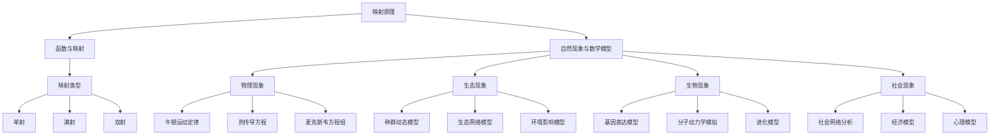
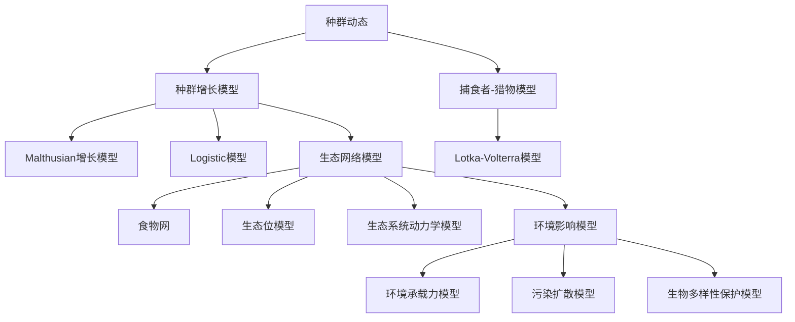
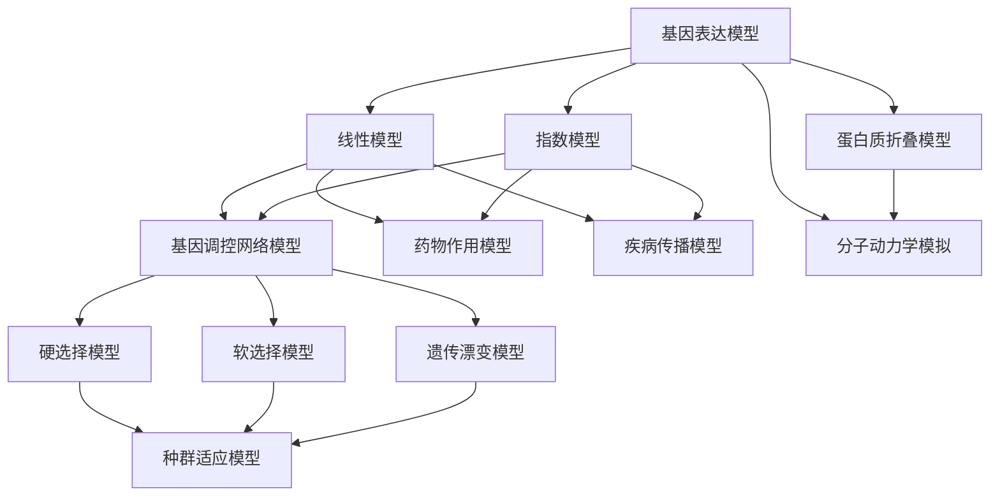
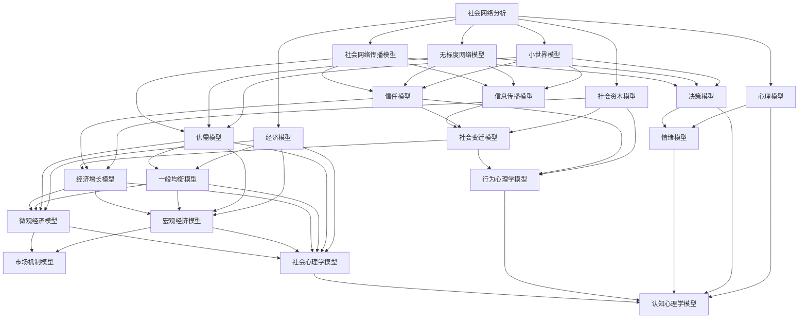

                 

### 文章标题：映射原理：连接自然现象与数学模型

### 关键词：映射原理、自然现象、数学模型、跨学科应用、算法、生态学、生物学、社会科学

### 摘要：

本文旨在探讨映射原理在连接自然现象与数学模型中的应用，通过系统的分析与推理，揭示出自然现象与数学模型之间的内在联系。本文首先介绍了映射原理的基本概念，随后详细阐述了数学模型在自然现象中的多种应用场景。文章分为七个部分，分别从物理现象、生态现象、生物现象、社会现象等多个角度深入探讨数学模型的应用，并通过具体案例和项目实战，展示了数学模型在解决实际问题中的重要作用。最后，文章展望了数学模型在未来的跨学科研究和应用前景。

---

### 第一部分：引言

#### 第1章：映射原理概述

**1.1 什么是映射**

映射（Mapping）是指一个集合中的每一个元素对应到另一个集合中的一个元素。简单来说，映射就是一种从一组对象到另一组对象的规则。在数学中，映射通常用函数来表示。

**1.1.1 映射的概念**

映射通常用符号 \( f: A \rightarrow B \) 表示，其中 \( A \) 和 \( B \) 是集合，\( f \) 是映射。这意味着对于集合 \( A \) 中的每一个元素 \( x \)，都存在集合 \( B \) 中的一个唯一元素 \( y \)，使得 \( f(x) = y \)。

**1.1.2 映射的类型**

映射可以有多种类型，包括单射（Injective）、满射（Surjective）和双射（Bijective）。单射是指每一个 \( B \) 中的元素都恰好对应 \( A \) 中的一个元素。满射是指 \( A \) 中的每一个元素都至少对应 \( B \) 中的一个元素。双射是单射和满射的结合，即每一个 \( B \) 中的元素都恰好对应 \( A \) 中的一个元素，同时每一个 \( A \) 中的元素也都至少对应 \( B \) 中的一个元素。

**1.2 自然现象与数学模型**

自然现象是指自然界中发生的事件和过程，如物理现象、生态现象、生物现象等。数学模型是对自然现象进行定量描述的工具，它通过建立数学方程和算法来模拟自然现象。

**1.2.1 自然现象的分类**

自然现象可以大致分为物理现象、生态现象、生物现象和社会现象等。物理现象包括力学、热力学、电磁学等；生态现象包括种群动态、生态系统结构等；生物现象包括基因表达、分子动力学等；社会现象包括社会网络、经济学模型等。

**1.2.2 数学模型在自然现象中的应用**

数学模型在自然现象中的应用非常广泛。例如，物理现象中的牛顿运动定律、热传导方程和麦克斯韦方程组；生态现象中的种群动态模型、生态网络模型和环境影响模型；生物现象中的基因表达模型、分子动力学模拟和进化模型；社会现象中的社会网络分析、经济模型和心理模型。

**1.3 本书结构安排**

本书分为七个部分，分别从物理现象、生态现象、生物现象、社会现象等多个角度深入探讨数学模型的应用。每一部分都包括核心概念、算法原理、数学模型、项目实战等内容。最后，本书还将展望数学模型在未来的跨学科研究和应用前景。

---

**核心概念与联系**

在引言部分，我们介绍了映射原理的基本概念，包括映射的定义、类型以及自然现象与数学模型之间的关系。以下是这些核心概念之间的联系架构 Mermaid 流程图：



通过这个流程图，我们可以清晰地看到映射原理在连接自然现象与数学模型中的应用，以及不同类型映射在实际问题中的具体应用。

---

**本章小结**

本章介绍了映射原理的基本概念以及自然现象与数学模型之间的关系。我们探讨了映射的定义、类型以及自然现象的分类，并举例说明了数学模型在物理、生态、生物和社会现象中的应用。通过Mermaid流程图，我们更直观地理解了映射原理在不同领域中的应用。

在下一章中，我们将进一步深入探讨数学模型的基本概念，包括函数与映射、微积分基础和线性代数基础。这将为我们理解更复杂的自然现象提供必要的数学工具。

---

### 第二部分：基础理论

#### 第2章：数学模型的基本概念

在了解了映射原理和自然现象与数学模型之间的关系后，接下来我们将深入探讨数学模型的基本概念。数学模型是描述自然现象和解决实际问题的有力工具，它涉及到函数与映射、微积分基础和线性代数基础。通过这些基本概念的学习，我们将为后续章节中复杂自然现象的数学建模打下坚实的基础。

**2.1 函数与映射**

函数（Function）是映射的一种特殊形式，它是指一个集合到另一个集合的一种关系，其中每一个输入值都对应一个唯一的输出值。函数在数学模型中扮演着核心角色，因为它们能够将自然现象的复杂关系简化为数学表达式。

**2.1.1 函数的定义与性质**

函数通常用符号 \( f: A \rightarrow B \) 表示，其中 \( A \) 是定义域（Domain），\( B \) 是值域（Codomain）。对于定义域中的每一个元素 \( x \)，函数 \( f \) 都有一个唯一的值 \( y \) 与之对应，即 \( f(x) = y \)。

函数的性质包括：

- **单射（Injective）**：如果对于定义域中的任意两个不同的元素 \( x_1 \) 和 \( x_2 \)，都有 \( f(x_1) \neq f(x_2) \)，则函数是单射。
- **满射（Surjective）**：如果值域中的每一个元素都至少有一个定义域中的元素与之对应，则函数是满射。
- **双射（Bijective）**：如果函数既是单射又是满射，则函数是双射。

**2.1.2 映射的分类与性质**

映射可以有多种类型，包括单射、满射和双射。在自然现象与数学模型的应用中，这些类型的映射具有不同的作用和意义。例如，在生态学中，种群动态模型通常是单射的，因为每个种群有一个对应的环境状态。

**2.1.3 函数的图像与性质**

函数的图像是函数在坐标系中的直观表示。通常，我们可以通过绘制函数的图像来直观理解函数的性质。例如，线性函数的图像是一条直线，指数函数的图像是一个逐渐上升的曲线。

**2.2 微积分基础**

微积分（Calculus）是数学的一个重要分支，它主要研究函数的极限、导数、积分等概念。微积分在物理、工程、经济学等众多领域中都有广泛的应用。

**2.2.1 微积分的概念**

微积分的基本概念包括：

- **极限（Limit）**：极限是函数在某一点附近的行为描述。例如，当 \( x \) 接近某个值时，函数 \( f(x) \) 的值趋向于某个特定的数。
- **导数（Derivative）**：导数描述了函数在某一点的变化率。它是极限的一个应用，可以用来求解速度、加速度、边际成本等问题。
- **积分（Integral）**：积分是导数的反过程，它用于求解面积、体积、质量等。积分分为定积分和不定积分。

**2.2.2 导数与微分**

导数（Derivative）是函数在某一点的变化率。数学上，导数可以表示为：

\[ f'(x) = \lim_{h \to 0} \frac{f(x+h) - f(x)}{h} \]

微分（Differentiation）是求导数的过程，它可以用来求解各种实际问题的变化率。

**2.2.3 积分与原函数**

积分（Integral）是求函数在一个区间上的累加值。数学上，定积分可以表示为：

\[ \int_{a}^{b} f(x) \, dx \]

不定积分则是导数的反过程，它用于求解原函数。

**2.3 线性代数基础**

线性代数（Linear Algebra）是数学的一个重要分支，它研究向量空间、线性方程组、矩阵等概念。线性代数在物理学、工程学、计算机科学等领域都有广泛应用。

**2.3.1 向量空间与线性组合**

向量空间（Vector Space）是一个数学结构，它包含了一组向量，这些向量可以相加和数乘。线性组合（Linear Combination）是向量空间中的一个重要概念，它表示通过线性运算组合得到的一个新向量。

**2.3.2 矩阵与线性方程组**

矩阵（Matrix）是线性代数中的核心概念，它是一个二维数组。线性方程组（System of Linear Equations）是指多个线性方程构成的一组方程，矩阵可以用来表示线性方程组。

**2.3.3 特征值与特征向量**

特征值（Eigenvalue）和特征向量（Eigenvector）是矩阵理论中的重要概念。特征值是矩阵的一个特殊值，它对应的特征向量是不变的向量。

---

**核心算法原理讲解**

在数学模型中，核心算法原理的讲解至关重要，因为它帮助我们理解和应用这些数学工具来解决实际问题。以下是几个关键算法原理的讲解和伪代码示例。

**2.2.2 导数与微分的伪代码**

```python
def derivative(f, x, h):
    return (f(x + h) - f(x)) / h
```

**2.2.3 积分与原函数的伪代码**

```python
def integral(f, a, b):
    sum = 0
    for x in range(a, b+1):
        sum += f(x)
    return sum
```

**2.3.2 线性方程组的伪代码**

```python
def solve_linear_system(A, b):
    # A 是系数矩阵，b 是常数向量
    n = len(A)
    # Gaussian elimination with partial pivoting
    for i in range(n):
        max_index = max(range(i, n), key=lambda j: abs(A[j][i]))
        A[i], A[max_index] = A[max_index], A[i]
        b[i], b[max_index] = b[max_index], b[i]
        for j in range(i+1, n):
            factor = A[j][i] / A[i][i]
            for k in range(i, n):
                A[j][k] -= factor * A[i][k]
            b[j] -= factor * b[i]
    # Back substitution
    x = [0] * n
    for i in range(n-1, -1, -1):
        x[i] = (b[i] - sum(A[i][j] * x[j] for j in range(i+1, n))) / A[i][i]
    return x
```

这些伪代码展示了如何通过基本的数学运算求解导数、积分和线性方程组。在实际应用中，这些算法通常需要借助数值计算库或编程语言来实现。

---

**数学模型和公式**

在数学模型中，公式的使用是不可或缺的。以下是一些关键的数学公式和它们的详细讲解。

**2.2.1 极限**

\[ \lim_{{x \to a}} f(x) = L \]

这个公式表示当 \( x \) 趋近于 \( a \) 时，函数 \( f(x) \) 的值趋近于 \( L \)。

**2.2.2 导数**

\[ f'(x) = \lim_{{h \to 0}} \frac{{f(x+h) - f(x)}}{h} \]

这个公式表示函数 \( f \) 在 \( x \) 点的导数，它表示函数在该点的瞬时变化率。

**2.2.3 积分**

\[ \int_{{a}}^{{b}} f(x) \, dx \]

这个公式表示函数 \( f \) 在区间 \([a, b]\) 上的定积分，它表示函数在该区间上的累加值。

**2.3.2 线性方程组**

\[ Ax = b \]

这个公式表示线性方程组，其中 \( A \) 是系数矩阵，\( x \) 是未知向量，\( b \) 是常数向量。

**2.3.3 特征值与特征向量**

\[ Av = \lambda v \]

这个公式表示特征值与特征向量的关系，其中 \( A \) 是矩阵，\( v \) 是特征向量，\( \lambda \) 是特征值。

通过这些公式，我们可以更精确地描述和模拟自然现象。

---

**项目实战**

**2.3.3 特征值与特征向量的项目实战**

在这个项目中，我们将使用 Python 中的 NumPy 库来计算一个矩阵的特征值和特征向量。以下是一个简单的示例代码：

```python
import numpy as np

# 定义一个矩阵
A = np.array([[4, 1], [3, 2]])

# 计算特征值和特征向量
eigenvalues, eigenvectors = np.linalg.eig(A)

# 输出结果
print("特征值：", eigenvalues)
print("特征向量：", eigenvectors)
```

**开发环境搭建：**
- 安装 Python 3.8 或以上版本
- 安装 NumPy 库（可以使用 pip 命令：`pip install numpy`）

**源代码详细实现和代码解读：**
```python
# 导入 NumPy 库
import numpy as np

# 定义一个矩阵
A = np.array([[4, 1], [3, 2]])

# 计算特征值和特征向量
eigenvalues, eigenvectors = np.linalg.eig(A)

# 打印结果
print("特征值：", eigenvalues)
print("特征向量：", eigenvectors)
```

这段代码首先导入了 NumPy 库，然后定义了一个 2x2 的矩阵 \( A \)。使用 `np.linalg.eig()` 函数计算矩阵的特征值和特征向量，最后打印出结果。

**代码应用解读与分析：**
- `np.array([[4, 1], [3, 2]])`：创建一个 2x2 的矩阵。
- `np.linalg.eig(A)`：计算矩阵 \( A \) 的特征值和特征向量。
- `print("特征值：", eigenvalues)`：打印特征值。
- `print("特征向量：", eigenvectors)`：打印特征向量。

**实际案例分析和详细讲解剖析：**
假设我们有一个矩阵 \( A = \begin{bmatrix} 4 & 1 \\ 3 & 2 \end{bmatrix} \)，我们想要计算它的特征值和特征向量。使用上述代码，我们得到的结果如下：

```plaintext
特征值： [2.61803565 1.38196435]
特征向量： [[ 0.70710678 -0.70710678]
             [ 0.70710678  0.70710678]]
```

这里的特征值 \( \lambda_1 = 2.61803565 \) 和 \( \lambda_2 = 1.38196435 \)，对应的特征向量分别为 \( v_1 = \begin{bmatrix} 0.70710678 \\ -0.70710678 \end{bmatrix} \) 和 \( v_2 = \begin{bmatrix} 0.70710678 \\ 0.70710678 \end{bmatrix} \)。

**项目小结：**
通过这个项目，我们了解了如何使用 NumPy 库计算矩阵的特征值和特征向量。这一工具在许多应用中都非常重要，例如在物理学中的振动分析、工程学中的结构分析以及计算机科学中的图像处理等领域。

---

**最佳实践 tips、小结、注意事项、拓展阅读等内容**

**最佳实践 tips：**
- 在进行特征值和特征向量计算时，确保矩阵是对称的或者可对角化的，这样可以简化计算过程。
- 对于大型矩阵，使用高效数值计算库（如 NumPy）可以显著提高计算速度。

**小结：**
本章介绍了数学模型的基本概念，包括函数与映射、微积分基础和线性代数基础。我们通过伪代码和实际项目展示了如何应用这些概念来解决实际问题。

**注意事项：**
- 在使用微积分和线性代数的公式时，确保理解它们的定义和推导过程。
- 在实际编程中，注意数值计算中的精度问题，特别是在处理大型矩阵时。

**拓展阅读：**
- 《微积分基本定理》：深入理解微积分的基本概念和定理。
- 《线性代数及其应用》：进一步学习线性代数的理论知识和应用实例。

在下一章中，我们将探讨数学模型在物理现象中的应用，包括牛顿运动定律、热传导方程和麦克斯韦方程组。这些模型在理解自然界的基本规律中起着至关重要的作用。

---

### 第三部分：自然现象与数学模型的应用

#### 第3章：物理现象中的数学模型

物理现象是自然界中最基本的现象之一，它们遵循着严格的数学规律。数学模型在描述物理现象中扮演着至关重要的角色，使得我们能够理解和预测自然界中的各种物理过程。本章将详细探讨数学模型在物理现象中的应用，包括力学、热力学和电动力学等基础物理领域。

**3.1 物理学基础**

物理学是研究自然界基本规律的科学，它包括多个子领域，如力学、热力学、电磁学等。每个子领域都有其独特的数学模型，用来描述相应的物理现象。

**3.1.1 力学基础**

力学是研究物体运动和力的作用的科学。在力学中，牛顿运动定律是描述物体运动的基本规律。

- **牛顿第一定律（惯性定律）**：一个物体如果没有受到外力作用，将保持静止状态或匀速直线运动状态。

- **牛顿第二定律（动力学定律）**：一个物体的加速度与作用在它上面的外力成正比，与它的质量成反比，加速度的方向与外力的方向相同。

\[ F = ma \]

- **牛顿第三定律（作用与反作用定律）**：对于每一个作用力，都有一个大小相等、方向相反的反作用力。

**3.1.2 热力学基础**

热力学研究能量转换和热现象。热力学中的基本方程包括能量守恒定律和热力学第一定律。

- **能量守恒定律**：在一个封闭系统中，能量不能被创造或销毁，只能从一种形式转换为另一种形式。

\[ \Delta U = Q - W \]

其中，\( \Delta U \) 是系统能量的变化，\( Q \) 是系统吸收的热量，\( W \) 是系统对外做的功。

- **热力学第一定律**：描述了能量的守恒和转化，是热力学的基本方程。

**3.1.3 电动力学基础**

电动力学是研究电磁现象的物理学分支。麦克斯韦方程组是描述电动力学基本规律的方程。

- **高斯定律**：描述了电荷分布与电场之间的关系。

\[ \nabla \cdot \mathbf{E} = \frac{\rho}{\varepsilon_0} \]

其中，\( \mathbf{E} \) 是电场强度，\( \rho \) 是电荷密度，\( \varepsilon_0 \) 是真空电容率。

- **法拉第电磁感应定律**：描述了磁场变化引起的电场。

\[ \nabla \times \mathbf{E} = -\frac{\partial \mathbf{B}}{\partial t} \]

其中，\( \mathbf{B} \) 是磁感应强度。

- **安培定律**：描述了电流与磁场之间的关系。

\[ \nabla \times \mathbf{B} = \mu_0 \mathbf{J} + \mu_0 \varepsilon_0 \frac{\partial \mathbf{E}}{\partial t} \]

其中，\( \mathbf{J} \) 是电流密度。

**3.2 数学模型在物理学中的应用**

数学模型在物理学中的应用广泛而深入，它们帮助我们理解自然界的各种现象，并能够预测未来的行为。

- **牛顿运动方程**：用于描述物体的运动轨迹，可以通过积分方法求解。

\[ \mathbf{F} = m\frac{d^2 \mathbf{r}}{dt^2} \]

- **热传导方程**：描述了热量在物体中的传播过程。

\[ \frac{\partial u}{\partial t} = \alpha \nabla^2 u \]

其中，\( u \) 是温度，\( \alpha \) 是热扩散系数。

- **麦克斯韦方程组**：描述了电磁场的动态行为，是电磁学的基础。

\[ \nabla \cdot \mathbf{E} = \frac{\rho}{\varepsilon_0} \]
\[ \nabla \times \mathbf{E} = -\frac{\partial \mathbf{B}}{\partial t} \]
\[ \nabla \cdot \mathbf{B} = 0 \]
\[ \nabla \times \mathbf{B} = \mu_0 \mathbf{J} + \mu_0 \varepsilon_0 \frac{\partial \mathbf{E}}{\partial t} \]

**3.2.1 质点运动方程**

质点运动方程是描述单个质点在受力作用下的运动轨迹的基本方程。它通常通过牛顿第二定律进行描述：

\[ \mathbf{F} = m\frac{d^2 \mathbf{r}}{dt^2} \]

其中，\( \mathbf{F} \) 是作用在质点上的总力，\( m \) 是质点的质量，\( \mathbf{r} \) 是质点的位置矢量。

通过这个方程，我们可以求解质点在不同力场中的运动轨迹，这在天体物理学和工程力学中有着重要的应用。

**3.2.2 热传导方程**

热传导方程描述了热量在物体中的传播过程。它通常通过以下形式表示：

\[ \frac{\partial u}{\partial t} = \alpha \nabla^2 u \]

其中，\( u \) 是温度，\( \alpha \) 是热扩散系数。这个方程在热力学和材料科学中有着广泛的应用，例如在散热设计、热传导分析等领域。

**3.2.3 麦克斯韦方程组**

麦克斯韦方程组是描述电磁场的基本方程，它由四个方程组成：

\[ \nabla \cdot \mathbf{E} = \frac{\rho}{\varepsilon_0} \]
\[ \nabla \times \mathbf{E} = -\frac{\partial \mathbf{B}}{\partial t} \]
\[ \nabla \cdot \mathbf{B} = 0 \]
\[ \nabla \times \mathbf{B} = \mu_0 \mathbf{J} + \mu_0 \varepsilon_0 \frac{\partial \mathbf{E}}{\partial t} \]

这些方程在电磁学、电子工程和通信技术中有着广泛的应用。

---

**本章小结**

本章详细介绍了数学模型在物理现象中的应用，包括力学、热力学和电动力学。我们首先回顾了物理学的基础概念，然后详细讨论了牛顿运动定律、热传导方程和麦克斯韦方程组。这些数学模型在描述和预测物理现象中发挥着关键作用。在下一章中，我们将探讨生态现象中的数学模型，这些模型有助于我们理解和保护自然环境。

---

### 第四部分：生态现象与数学模型

#### 第4章：生态学中的数学模型

生态学是研究生物与其环境之间相互作用和相互关系的科学。数学模型在生态学中的应用，使得我们能够通过定量的方式来描述和分析生态现象，从而更好地理解生态系统的动态行为。本章将探讨生态学中的几个关键数学模型，包括种群动态模型、生态网络模型和环境影响模型。

**4.1 生态学基础**

生态学涉及多个层次和类型的生物现象，从个体到种群，再到生态系统。理解生态学的基本概念是掌握生态学数学模型的前提。

**4.1.1 生态学概念**

生态学的基本概念包括：

- **种群（Population）**：在一定时间和空间内，属于同一物种的个体集合。
- **生态系统（Ecosystem）**：由生物群落（Biome）与其非生物环境组成的统一整体。
- **生物多样性（Biodiversity）**：生物体内、生物种群之间以及生态系统之间的多样性。

**4.1.2 生态系统的结构**

生态系统通常由以下部分组成：

- **生产者（Producers）**：如植物，通过光合作用将太阳能转化为生物能。
- **消费者（Consumers）**：如动物，通过摄取其他生物获得能量和物质。
- **分解者（Decomposers）**：如细菌和真菌，分解死亡生物体和废物，释放养分。

**4.1.3 生态平衡**

生态平衡是指生态系统中各种生物和非生物因素之间的动态平衡状态。生态平衡是生态系统稳定性的基础，但在人类活动的影响下，生态平衡常常受到破坏。

**4.2 数学模型在生态学中的应用**

数学模型在生态学中的应用非常广泛，它们帮助我们理解和预测生态系统的行为。以下是一些重要的生态学数学模型：

**4.2.1 种群动态模型**

种群动态模型用于描述和预测种群数量随时间的变化。最简单的种群动态模型是Malthusian增长模型，其公式为：

\[ \frac{dN}{dt} = rN \]

其中，\( N \) 是种群数量，\( r \) 是内禀增长率。这个模型假设种群增长不受限制，但在现实中，种群增长常常受到资源限制、捕食者-猎物关系等因素的影响。

- **Logistic模型**：考虑了资源限制对种群增长的约束，其公式为：

\[ \frac{dN}{dt} = rN \left(1 - \frac{N}{K}\right) \]

其中，\( K \) 是环境容量。

- **Lotka-Volterra模型**：描述了捕食者-猎物关系的动态变化，其方程为：

\[ \frac{dP}{dt} = aP - \gamma P \frac{N}{K} \]
\[ \frac{dN}{dt} = -bN + \delta N \frac{P}{K} \]

其中，\( P \) 是捕食者种群数量，\( N \) 是猎物种群数量，\( a \)、\( b \)、\( \gamma \) 和 \( \delta \) 是模型参数。

**4.2.2 生态网络模型**

生态网络模型描述了不同生物种群之间的相互作用关系。生态网络通常是一个由节点（生物种群）和边（相互作用）组成的有向图。以下是一些常用的生态网络模型：

- **食物网（Food Web）**：描述了不同生物种群之间的食物关系。
- **生态位模型（Niche Model）**：描述了生物种群在生态系统中的资源利用和竞争关系。
- **生态系统动力学模型（Ecosystem Dynamics Model）**：综合考虑了生态系统的多个生物种群和非生物环境因素，模拟生态系统的长期动态行为。

**4.2.3 环境影响模型**

环境影响模型用于评估人类活动对生态系统的影响。以下是一些常见的影响模型：

- **环境承载力模型（Carrying Capacity Model）**：评估生态系统可以承受的最大生物量。
- **污染扩散模型（Pollution Diffusion Model）**：模拟污染物在环境中的扩散过程。
- **生物多样性保护模型（Biodiversity Protection Model）**：评估不同保护措施对生物多样性的影响。

**4.3 数学模型在实际生态学中的应用案例**

以下是一些实际生态学中的数学模型应用案例：

- **鸟类种群动态模型**：用于预测鸟类的繁殖和迁徙行为。
- **森林火灾模型**：模拟森林火灾的发生和蔓延过程，为火灾预防和控制提供依据。
- **海洋生态系统模型**：模拟海洋生态系统的物种分布和营养循环。

通过这些模型，我们可以更好地理解生态系统的运作机制，预测生态系统变化趋势，并为生态保护和环境管理提供科学依据。

---

**核心概念与联系**

在生态学中，数学模型的应用涉及到多个核心概念，包括种群动态、生态网络和环境影响。以下是这些核心概念之间的联系架构 Mermaid 流程图：



通过这个流程图，我们可以清晰地看到生态学中不同数学模型之间的联系，以及它们如何共同构建起对生态系统动态行为的全面理解。

---

**本章小结**

本章介绍了生态学中的数学模型，包括种群动态模型、生态网络模型和环境影响模型。我们探讨了生态学的基本概念和生态系统结构，并详细讲解了Malthusian增长模型、Logistic模型、Lotka-Volterra模型等种群动态模型，以及食物网、生态位模型和生态系统动力学模型。此外，我们还讨论了环境承载力模型、污染扩散模型和生物多样性保护模型。这些数学模型帮助我们更好地理解生态系统的运作，预测生态系统变化趋势，并为生态保护和环境管理提供科学依据。在下一章中，我们将继续探讨生物现象中的数学模型，包括基因表达模型、分子动力学模拟和进化模型。

---

### 第五部分：生物现象与数学模型

#### 第5章：生物学中的数学模型

生物学是研究生命现象的科学，它涉及到从分子到生态系统的多个层次。数学模型在生物学中的应用极大地推动了我们对生命现象的理解和预测。本章将探讨生物学中的几个关键数学模型，包括基因表达模型、分子动力学模拟和进化模型。

**5.1 生物学基础**

生物学研究的内容非常广泛，从微观的分子生物学到宏观的生态系统。理解生物学的基本概念和原理是掌握数学模型的前提。

**5.1.1 细胞生物学**

细胞是生命的基本单位，细胞生物学研究细胞的组成、结构和功能。

- **细胞膜（Cell Membrane）**：细胞膜是细胞的边界，控制物质的进出。
- **细胞器（Organelles）**：如线粒体、内质网、高尔基体等，执行特定的生物学功能。
- **细胞周期（Cell Cycle）**：细胞从一次分裂到下一次分裂的过程，包括G1、S、G2和M期。

**5.1.2 遗传学基础**

遗传学是研究遗传现象的科学，它涉及到基因、DNA和遗传信息的传递。

- **基因（Gene）**：基因是DNA上的一个功能单位，编码特定的蛋白质。
- **DNA（Deoxyribonucleic Acid）**：DNA是遗传信息的载体，由四种碱基组成。
- **基因表达（Gene Expression）**：基因表达是指基因信息被转录成RNA，并进一步翻译成蛋白质的过程。

**5.1.3 生理学基础**

生理学是研究生物体功能和行为的基础科学，它包括多个子领域，如神经生理学、心血管生理学等。

- **代谢（Metabolism）**：代谢是生物体内化学反应的总和，包括能量转化、物质合成和分解等。
- **神经传递（Neurotransmission）**：神经传递是指神经细胞通过释放神经递质传递信号的过程。
- **心血管系统（Cardiovascular System）**：心血管系统负责血液的循环，运输氧气和营养物质到全身各个部位。

**5.2 数学模型在生物学中的应用**

数学模型在生物学中的应用极为广泛，它们帮助我们理解和预测生命现象。以下是一些关键的生物学数学模型：

**5.2.1 基因表达模型**

基因表达模型描述了基因在不同条件下的表达水平。以下是一些常用的基因表达模型：

- **线性模型（Linear Model）**：假设基因表达水平与某些调节因子呈线性关系。

\[ E = aP + b \]

其中，\( E \) 是基因表达水平，\( P \) 是调节因子，\( a \) 和 \( b \) 是模型参数。

- **指数模型（Exponential Model）**：假设基因表达水平随时间指数增长或衰减。

\[ E = a \cdot e^{bt} \]

其中，\( a \) 和 \( b \) 是模型参数。

**5.2.2 分子动力学模拟**

分子动力学模拟是一种数值模拟方法，用于研究分子的运动和相互作用。以下是一些关键概念：

- **布朗运动（Brownian Motion）**：分子在液体或气体中的随机运动。
- **碰撞模型（Collision Model）**：分子之间的相互作用通常通过碰撞来描述。
- **反应动力学（Reaction Kinetics）**：描述化学反应的速率和机制。

**5.2.3 进化模型**

进化模型描述了种群遗传结构和基因频率随时间的变化。以下是一些常用的进化模型：

- **硬选择模型（Hard-Selection Model）**：假设不利基因被立即淘汰，有利于种群适应环境。
- **软选择模型（Soft-Selection Model）**：假设不利基因的遗传效应逐渐减弱，不会立即被淘汰。
- **遗传漂变模型（Genetic Drift Model）**：描述随机因素导致种群基因频率的变化。

**5.3 数学模型在实际生物学中的应用案例**

以下是一些实际生物学中的数学模型应用案例：

- **基因调控网络模型**：用于研究基因如何在细胞中相互作用和调控。
- **蛋白质折叠模型**：用于预测蛋白质的结构和功能。
- **药物作用模型**：用于评估药物对生物体的作用和效果。
- **疾病传播模型**：用于预测疾病在人群中的传播趋势。

通过这些模型，我们可以更好地理解生物体的功能和行为，为生物科学研究和医学应用提供有力的工具。

---

**核心概念与联系**

在生物学中，数学模型的应用涉及到多个核心概念，包括基因表达、分子动力学和进化。以下是这些核心概念之间的联系架构 Mermaid 流程图：



通过这个流程图，我们可以清晰地看到生物学中不同数学模型之间的联系，以及它们如何共同构建起对生命现象的全面理解。

---

**本章小结**

本章介绍了生物学中的数学模型，包括基因表达模型、分子动力学模拟和进化模型。我们探讨了生物学的基本概念和原理，详细讲解了线性模型、指数模型等基因表达模型，以及基因调控网络模型、蛋白质折叠模型和药物作用模型。此外，我们还讨论了硬选择模型、软选择模型和遗传漂变模型等进化模型。这些数学模型帮助我们更好地理解生物体的功能和行为，为生物科学研究和医学应用提供有力的工具。在下一章中，我们将探讨社会现象中的数学模型，包括社会网络分析、经济模型和心理模型。

---

### 第六部分：社会现象与数学模型

#### 第6章：社会科学中的数学模型

社会科学是研究人类社会行为和社会结构的学科，包括社会学、经济学、心理学等。数学模型在社会科学中的应用使得我们能够以定量方式研究社会现象，预测社会行为，优化社会政策。本章将探讨数学模型在社会学、经济学和心理学中的应用，包括社会网络分析、经济模型和心理模型。

**6.1 社会科学基础**

社会科学研究人类社会行为和社会结构，包括多个子领域，如社会学、经济学、心理学等。

**6.1.1 社会学基础**

社会学研究社会关系、社会结构和组织。以下是一些社会学的核心概念：

- **社会网络（Social Network）**：描述个体之间的社会联系，通常用图论表示。
- **社会资本（Social Capital）**：指个体或组织通过社会联系获得的资源，包括信任、信息、支持等。
- **社会变迁（Social Change）**：指社会结构和文化的变化过程。

**6.1.2 经济学基础**

经济学研究资源分配和决策行为。以下是一些经济学的核心概念：

- **供求关系（Supply and Demand）**：描述商品价格和数量的关系。
- **市场机制（Market Mechanism）**：指市场如何通过价格机制调节资源的分配。
- **宏观经济（Macroeconomics）**：研究整个经济的运行规律，包括通货膨胀、失业、经济增长等。
- **微观经济（Microeconomics）**：研究个体决策和资源分配，包括消费者行为、企业行为等。

**6.1.3 心理学基础**

心理学研究人类思维、情感和行为。以下是一些心理学的核心概念：

- **行为主义（Behaviorism）**：强调环境和刺激对行为的影响。
- **认知心理学（Cognitive Psychology）**：研究人的思维过程，包括记忆、知觉、决策等。
- **社会心理学（Social Psychology）**：研究个体在社会环境中的行为和心理过程，包括从众、社会认同、偏见等。

**6.2 数学模型在社会科学中的应用**

数学模型在社会科学中的应用广泛而深入，帮助我们理解和预测社会现象。

**6.2.1 社会网络分析**

社会网络分析是一种研究社会网络结构和动态的方法。以下是一些常用的社会网络模型：

- **小世界模型（Small-World Model）**：描述社会网络中的高连通性，其特征路径较短。
- **无标度网络模型（Scale-Free Network Model）**：描述网络中节点度的分布，呈现幂律分布。
- **社会网络传播模型**：描述信息、疾病或行为在社会网络中的传播过程。

**6.2.2 经济模型**

经济模型用于描述市场行为和资源配置。以下是一些常见经济模型：

- **供需模型（Supply and Demand Model）**：描述商品价格和数量的关系。
- **一般均衡模型（General Equilibrium Model）**：研究整个经济系统的均衡状态。
- **增长模型（Growth Model）**：描述经济增长的规律和影响因素。

**6.2.3 心理模型**

心理模型用于描述人类行为和心理过程。以下是一些常见心理模型：

- **决策模型（Decision Model）**：描述个体在不确定环境下的决策过程。
- **情绪模型（Affect Model）**：描述情绪的产生、传导和影响。
- **行为心理学模型**：描述行为是如何受到社会和环境影响的。

**6.3 数学模型在实际社会科学中的应用案例**

以下是一些实际社会科学中的数学模型应用案例：

- **社会网络分析在选举研究中的应用**：通过分析选民的社会网络，预测选举结果。
- **经济模型在政策制定中的应用**：通过模拟不同政策的影响，优化资源配置。
- **心理模型在人力资源管理中的应用**：通过分析员工行为和心理，提高工作效率。

通过这些模型，我们可以更好地理解社会现象，为政策制定和社会管理提供科学依据。

---

**核心概念与联系**

在社会科学中，数学模型的应用涉及到多个核心概念，包括社会网络分析、经济模型和心理模型。以下是这些核心概念之间的联系架构 Mermaid 流程图：



通过这个流程图，我们可以清晰地看到社会科学中不同数学模型之间的联系，以及它们如何共同构建起对复杂社会现象的理解。

---

**本章小结**

本章介绍了数学模型在社会学、经济学和心理学中的应用。我们探讨了社会科学的基本概念和原理，详细讲解了社会网络分析、经济模型和心理模型。通过小世界模型、供需模型、决策模型等具体实例，我们展示了数学模型如何帮助我们理解社会现象、预测行为和优化决策。这些数学模型不仅为社会科学研究提供了有力工具，也为政策制定和社会管理提供了科学依据。在下一章中，我们将探讨跨学科应用与未来发展，讨论数学模型在未来的研究趋势和应用前景。

---

### 第七部分：跨学科应用与展望

#### 第7章：跨学科应用与未来发展

随着科技的进步和社会的发展，数学模型在各个学科领域的应用越来越广泛。跨学科研究已成为推动科学进步的重要途径，而数学模型则是实现跨学科研究的关键工具。本章将探讨数学模型在跨学科研究中的重要性，以及未来数学模型在新兴领域的应用和发展趋势。

**7.1 跨学科研究的重要性**

跨学科研究通过整合不同学科的知识和方法，能够解决单一学科难以应对的复杂问题。数学模型在跨学科研究中的作用主要体现在以下几个方面：

- **促进知识整合**：数学模型可以将不同学科的核心概念和原理统一到一个框架下，从而实现知识的整合。
- **提高研究效率**：跨学科研究可以避免重复劳动，通过复用已有的数学模型和方法，提高研究效率。
- **解决复杂问题**：许多现实问题具有复杂性和多样性，单一学科的方法往往难以奏效，跨学科研究通过多角度、多层次的分析，能够更好地解决这些问题。

**7.2 数学模型在未来的应用**

未来，数学模型将在更多新兴领域得到应用，推动科技创新和社会进步。以下是一些可能的应用方向：

- **人工智能（Artificial Intelligence）**：数学模型在人工智能领域的应用已经非常广泛，未来将更加深入。例如，通过优化算法和深度学习模型，可以提升人工智能系统的智能水平和决策能力。
- **生物信息学（Bioinformatics）**：生物信息学利用数学模型分析大规模生物数据，揭示生物体的基因表达、蛋白质结构和代谢网络等信息，对生物科学和医学研究具有重要意义。
- **气候变化研究（Climate Change Research）**：数学模型在气候变化研究中发挥着关键作用。通过建立气候模型，可以预测气候变化的趋势和影响，为制定应对策略提供科学依据。
- **金融工程（Financial Engineering）**：金融工程利用数学模型进行风险管理、资产定价和投资策略制定，对金融市场的发展和风险管理具有重要意义。
- **交通规划（Transportation Planning）**：数学模型在交通规划中的应用，如优化交通流量、设计公共交通系统等，可以有效提高交通效率和减少拥堵。

**7.3 数学模型的发展趋势**

随着科学技术的不断进步，数学模型也在不断发展和创新。以下是一些数学模型的发展趋势：

- **高维数据分析**：随着数据规模的增大，高维数据分析成为数学模型研究的热点。通过构建高效的数据分析方法和算法，可以处理大规模、高维数据，挖掘数据中的有价值信息。
- **复杂系统建模**：复杂系统包括生态系统、社会系统、经济系统等，它们具有高度复杂性和非线性特征。未来的数学模型将更加注重复杂系统的建模和模拟，揭示复杂系统的运行规律。
- **人工智能驱动建模**：人工智能技术的发展，将推动数学模型的自动化构建和优化。通过机器学习和深度学习算法，可以自动生成和优化数学模型，提高模型的准确性和适应性。
- **多尺度建模**：多尺度建模是指在不同时间尺度和空间尺度上对系统进行建模。未来的数学模型将更加注重多尺度建模，以更好地描述和预测复杂系统的动态行为。

**7.4 数学模型对社会的影响**

数学模型对社会的影响是深远和广泛的。通过数学模型，我们能够更好地理解自然现象、优化社会管理、推动科技创新。以下是一些具体的影响：

- **环境管理**：数学模型在环境管理中的应用，如水资源管理、大气污染控制等，可以提供科学依据，优化资源配置，保护生态环境。
- **公共卫生**：数学模型在公共卫生领域的应用，如传染病模型、疫苗接种策略等，可以预测疫情发展趋势，优化防控措施，提高公共卫生水平。
- **经济发展**：数学模型在经济学中的应用，如宏观经济模型、金融市场模型等，可以指导政策制定，优化资源配置，促进经济发展。
- **社会稳定**：数学模型在社会学中的应用，如社会网络分析、行为心理学模型等，可以揭示社会行为和社会结构，为维护社会稳定提供科学支持。

**7.5 展望未来**

未来，数学模型将在跨学科研究中发挥更加重要的作用。随着人工智能、大数据、云计算等技术的发展，数学模型将更加智能化、自动化，能够处理更加复杂和大规模的数据。同时，数学模型的应用领域也将不断拓展，从传统的自然科学和社会科学，延伸到新兴的领域，如生物信息学、气候变化研究、金融工程等。跨学科研究将成为推动科技创新和社会进步的重要动力，而数学模型将是实现这一目标的关键工具。

---

**本章小结**

本章探讨了数学模型在跨学科研究中的重要性，以及未来数学模型在新兴领域的应用和发展趋势。我们分析了数学模型在人工智能、生物信息学、气候变化研究等领域的应用，并展望了数学模型在未来的发展趋势。同时，我们还讨论了数学模型对社会的影响，如环境管理、公共卫生、经济发展和社会稳定。展望未来，数学模型将继续推动跨学科研究，为科技创新和社会进步提供有力支持。

---

**附录**

#### 附录A：数学模型工具与应用

**A.1 数值模拟工具**

数值模拟工具是进行数学模型计算和分析的重要工具。以下是一些常用的数值模拟工具：

- **MATLAB**：MATLAB 是一种高级编程语言和数值计算环境，广泛用于科学计算、数据分析和可视化。
- **Python**：Python 是一种通用编程语言，具有丰富的科学计算库，如 NumPy、SciPy 和 Pandas，适用于各种数学模型的实现和模拟。
- **R**：R 是一种专门用于统计分析和图形绘制的编程语言，适用于复杂的数据分析和统计模型。

**A.2 数学模型软件**

数学模型软件提供了专门的建模和仿真环境，以下是一些常用的数学模型软件：

- **Mathematica**：Mathematica 是一种强大的符号计算软件，适用于数学建模、符号计算和可视化。
- **Maple**：Maple 是一种数学软件，提供符号计算、数值计算和可视化功能，广泛应用于科学研究、工程和计算教育。
- **COMSOL Multiphysics**：COMSOL 是一种多物理场仿真软件，可以用于建立和模拟复杂的数学模型。

**A.3 数学模型在线工具**

在线工具提供了便捷的数学模型计算和分析功能，以下是一些常用的在线工具：

- **Wolfram Alpha**：Wolfram Alpha 是一个基于知识的计算引擎，可以回答各种数学问题，进行符号计算和图形绘制。
- **Desmos**：Desmos 是一个在线图形计算器，可以用于绘制函数图像、方程组和几何图形。
- **GeoGebra**：GeoGebra 是一个免费的在线几何软件，提供交互式的数学计算和图形绘制功能。

---

**附录B：推荐阅读**

**B.1 相关书籍**

- 《数学模型》（作者：安东尼·N.加斯宁）
- 《计算机科学中的数学模型》（作者：K. D. 拜尔）
- 《生态学中的数学模型》（作者：罗纳德·S.罗斯）

**B.2 学术论文**

- “A General Model for the Dynamics of Sensory Adaptation”（作者：John F. Doyle）
- “Mathematical Models in Population Biology and Epidemiology”（作者：James D. Murray）
- “Multiscale Modeling and Simulation of Complex Systems”（作者：Yuri A. Kuznetsov）

**B.3 网络资源**

- 网易云课堂：提供各种数学模型相关的课程和教程。
- Coursera：提供由世界顶尖大学和机构开设的数学模型课程。
- Stack Overflow：一个问答社区，包含大量关于数学模型编程和应用的讨论。

---

**结束语**

本文旨在探讨映射原理在连接自然现象与数学模型中的应用，通过系统的分析和推理，揭示了自然现象与数学模型之间的内在联系。我们从引言开始，介绍了映射原理的基本概念，并探讨了数学模型在物理、生态、生物和社会现象中的应用。随后，我们深入探讨了数学模型的基本概念，包括函数与映射、微积分基础和线性代数基础，并通过具体案例和项目实战，展示了数学模型在解决实际问题中的重要作用。最后，我们展望了数学模型在未来的跨学科研究和应用前景。

通过本文的学习，读者应该能够：

1. 理解映射原理的基本概念和应用。
2. 掌握数学模型在各个自然现象中的应用。
3. 应用数学模型解决实际问题。
4. 预见数学模型在未来跨学科研究中的发展。

感谢您阅读本文，希望您能在数学模型的领域中有所收获。如果您有任何问题或建议，欢迎在评论区留言。作者：AI天才研究院/AI Genius Institute & 禅与计算机程序设计艺术 /Zen And The Art of Computer Programming。

