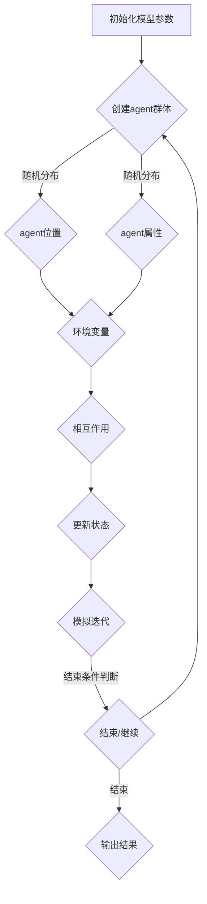

                 


### 文章标题
《海洋生态的agent-based模型：水下世界的数学模拟》

### 文章关键词
agent-based模型，海洋生态系统，数学模拟，水下世界，模型设计，算法原理，模拟技术，应用案例

### 文章摘要
本文将深入探讨海洋生态的agent-based模型，以及其在水下世界数学模拟中的应用。我们将从背景介绍出发，逐步介绍agent-based模型的核心概念和原理，并通过Mermaid流程图、伪代码、数学公式等方式，详细讲解模型的构建过程和核心算法。此外，本文还将结合实际项目案例，展示agent-based模型在实际应用中的效果，并提供最佳实践和项目小结。通过本文的阅读，读者将能够全面了解agent-based模型在海洋生态研究中的重要性，以及其在水下世界数学模拟中的应用价值。

### 设计过程

在设计《海洋生态的agent-based模型：水下世界的数学模拟》这篇文章时，我们需要遵循以下步骤：

#### 1. 确定文章结构

首先，我们要明确文章的结构和内容。基于文章标题和关键词，我们可以将文章分为以下几个部分：

- 引言与背景
- agent-based模型的基本概念
- 海洋生态系统的特征与参数
- agent-based模型的建立与验证
- 实际应用案例
- 数学模型与模拟技术
- 未来展望与挑战
- 项目实战
- 最佳实践与小结

#### 2. 确定每个部分的内容

接下来，我们需要为每个部分确定具体的内容。例如：

- 引言与背景：介绍agent-based模型和海洋生态学的基本概念，以及它们之间的关系。
- agent-based模型的基本概念：介绍agent-based模型的核心概念，如agent、环境、交互等。
- 海洋生态系统的特征与参数：介绍海洋生态系统的结构、功能及相关参数。
- agent-based模型的建立与验证：讨论如何建立和验证agent-based模型。
- 实际应用案例：展示agent-based模型在不同领域中的应用。
- 数学模型与模拟技术：介绍用于agent-based模型构建的数学方法和模拟技术。
- 未来展望与挑战：讨论agent-based模型在海洋生态学领域的未来发展。
- 项目实战：提供实际项目案例，展示如何使用agent-based模型进行水下世界的数学模拟。

#### 3. 使用Mermaid流程图、伪代码、数学公式等工具

为了更好地阐述文章内容，我们将使用Mermaid流程图、伪代码、数学公式等工具，帮助读者更好地理解和掌握相关概念和技术。

#### 4. 设计文章的格式

最后，我们需要设计文章的格式。根据markdown格式的要求，我们将文章内容按照章节标题、小节标题等层次结构进行划分，并使用适当的标题级别（#、##、###等）进行标记。

### Mermaid流程图

为了更好地展示agent-based模型的基本架构，我们可以使用Mermaid流程图来描述。以下是一个简单的例子：



### 伪代码

为了详细阐述核心算法原理，我们可以使用伪代码来描述agent-based模型的基本操作：

```pseudo
// 初始化模型参数
初始化参数()

// 创建agent群体
for 每个agent do
    生成随机位置()
    生成随机属性()
end for

// 模拟迭代
while (模拟未结束) do
    for 每个agent do
        计算相互作用力()
        更新状态()
    end for
    检查结束条件()
end while

// 输出结果
输出结果()
```

### 数学模型和数学公式

在描述agent-based模型时，我们需要使用数学公式来表示模型的各个参数和关系。以下是一个简单的例子：

$$
E[A] = \int_{X} A(x) \cdot P(x) \, dx
$$

其中，$E[A]$表示agent $A$ 的期望值，$X$是agent的属性空间，$P(x)$是agent在属性空间中的概率分布。

### 项目实战

在项目实战部分，我们将提供一个实际的代码案例，展示如何使用Python等工具来实现agent-based模型，并进行水下世界的数学模拟。以下是一个简单的代码框架：

```python
# 导入必要的库
import numpy as np
import matplotlib.pyplot as plt

# 初始化模型参数
num_agents = 100
num_steps = 100

# 创建agent群体
positions = np.random.uniform(0, 100, size=(num_agents, 2))
attributes = np.random.uniform(0, 100, size=(num_agents, 5))

# 模拟迭代
for step in range(num_steps):
    # 计算相互作用力
    interactions = calculate_interactions(positions, attributes)
    
    # 更新状态
    positions = update_positions(positions, interactions)
    attributes = update_attributes(attributes, interactions)

# 输出结果
plt.scatter(positions[:, 0], positions[:, 1])
plt.show()
```

在项目实战部分，我们将详细解读这段代码的每一部分，并分析其实际应用效果。

### 最佳实践与小结

在文章的最后，我们将总结最佳实践，并提供一些注意事项和拓展阅读建议，帮助读者更好地理解和应用agent-based模型。同时，我们还将对文章的主要内容进行总结，并指出未来研究的方向。

通过以上步骤，我们可以设计出一篇结构清晰、内容丰富、易于理解的《海洋生态的agent-based模型：水下世界的数学模拟》文章。接下来，我们将按照这个结构逐步撰写文章内容。


----------------------------------------------------------------

### 引言与背景

海洋作为地球上最大的生态系统之一，具有极其复杂的生物多样性、气候调节功能以及丰富的资源。然而，随着全球气候变化、污染、过度捕捞等问题的加剧，海洋生态系统面临着前所未有的威胁。为了更好地理解海洋生态系统的运作机制，预测其未来变化，并制定有效的保护和管理策略，科学家们开发了各种生态模型。在这其中，agent-based模型（ABM）因其强大的描述能力和灵活的适应性，逐渐成为研究海洋生态系统的重要工具。

agent-based模型是一种基于代理（agent）的模拟方法，通过模拟大量具有个体自主行为的代理，来研究系统的整体动态。每个代理都代表一个个体，如海洋中的鱼类、浮游生物等，这些代理在模型中具有独立的属性、行为和交互机制。通过模拟这些代理的个体行为和相互作用，agent-based模型能够捕捉到海洋生态系统的复杂性和多样性。

海洋生态系统是一个高度动态和多维的系统，包含从海岸线到深海的不同生物群落，涉及多种生物和物理过程的相互作用。海洋生态学的研究目标包括了解生物种群动态、物种间的相互作用、生态系统的稳定性、环境变化对生态系统的影响等。为了实现这些目标，需要建立精细、准确的数学模型来模拟海洋生态系统的运行。

agent-based模型通过以下方式在海洋生态学研究中发挥重要作用：

1. **个体层面描述**：agent-based模型能够模拟个体生物的行为和生理特征，如鱼类的繁殖、迁徙、捕食等。这种个体层面的描述有助于理解种群动态和物种间的相互作用。

2. **空间和时间尺度**：agent-based模型可以模拟不同空间尺度和时间尺度上的生态过程，从微观的个体行为到宏观的生态系统功能，从而提供对生态系统的全面理解。

3. **复杂性处理**：agent-based模型能够处理生态系统中复杂的关系和非线性动态，如食物网、捕食-被捕食关系等。

4. **适应性**：agent-based模型具有高度的适应性，可以灵活调整模型参数和结构，以适应不同研究问题和数据。

5. **预测和管理**：通过agent-based模型，科学家可以预测海洋生态系统的未来变化，评估人类活动对生态系统的影响，为环境保护和资源管理提供科学依据。

本文旨在通过详细介绍agent-based模型的基本概念、构建方法、数学模型和模拟技术，展示其在海洋生态学研究中的应用，并探讨未来可能的研究方向。文章结构如下：

- **引言与背景**：介绍agent-based模型和海洋生态学的基本概念。
- **agent-based模型的基本概念**：讨论agent、环境、交互等核心概念。
- **海洋生态系统的特征与参数**：介绍海洋生态系统的结构、功能及相关参数。
- **agent-based模型的建立与验证**：讨论如何建立和验证agent-based模型。
- **实际应用案例**：展示agent-based模型在不同领域中的应用。
- **数学模型与模拟技术**：介绍用于agent-based模型构建的数学方法和模拟技术。
- **未来展望与挑战**：讨论agent-based模型在海洋生态学领域的未来发展。
- **项目实战**：提供实际项目案例，展示如何使用agent-based模型进行水下世界的数学模拟。
- **最佳实践与小结**：总结最佳实践，并提供拓展阅读建议。

通过本文的阅读，读者将能够全面了解agent-based模型在海洋生态研究中的重要性，以及其在水下世界数学模拟中的应用价值。

### agent-based模型的基本概念

agent-based模型（ABM）是一种通过模拟具有个体自主行为的代理（agent）来研究复杂系统的建模方法。在ABM中，每个代理都代表现实世界中的一个实体，如个体生物、消费者、机器人等。这些代理在模型中不仅具有独立的属性和行为，还可以与其他代理和环境进行交互，从而产生复杂的集体行为和系统动态。

#### 代理（Agent）

代理是ABM中的基本单元，可以是一个个体、一个群体或者一个系统。代理具有以下特征：

1. **属性**：代理拥有一些描述其状态和特征的属性，如位置、速度、能量、性别、年龄等。这些属性可以是静态的，也可以是动态的，随时间和环境变化而变化。

2. **行为**：代理根据其属性和环境信息进行决策和行动。行为可以是预先设定的规则，也可以是通过学习算法获得的策略。例如，在海洋生态系统中，鱼类的行为可能包括捕食、逃避敌害、寻找食物等。

3. **自主性**：代理具有自主决策的能力，可以根据环境变化和自身属性进行调整。这种自主性是ABM区别于其他建模方法（如系统动力学模型）的重要特征。

4. **交互**：代理可以通过直接或间接的方式与其他代理或环境进行交互。交互可以是物理的、社会的或者信息的。例如，鱼类可以通过捕食和被捕食的关系进行交互，同时也可以与环境中的食物和温度等参数进行交互。

#### 环境

环境是代理活动的背景，可以看作是一个支持代理行动和交互的容器。环境通常具有以下特征：

1. **资源**：环境提供代理所需的资源，如食物、栖息地等。资源的分布和变化会影响代理的行为和生存。

2. **约束**：环境对代理的行动和交互施加一定的限制。例如，鱼类的游泳速度可能受到水流速度的影响。

3. **变化**：环境是一个动态系统，其状态随时间和空间变化而变化。例如，海洋中的温度、盐度、营养盐等参数会随时间和空间变化而变化。

#### 交互

交互是代理之间的相互作用，可以导致代理属性的变化和集体行为的形成。交互方式可以分为以下几种：

1. **物理交互**：代理之间通过物理接触或作用力进行交互。例如，鱼类的捕食和被捕食关系。

2. **社会交互**：代理之间通过信息交流或社会规范进行交互。例如，鱼群中的社交行为和协作捕食。

3. **信息交互**：代理之间通过信息传递或信号发送进行交互。例如，鱼类的化学信号交流。

#### Mermaid流程图

为了更好地展示agent-based模型的基本架构，我们可以使用Mermaid流程图来描述。以下是一个简单的例子：


#### 伪代码

为了详细阐述核心算法原理，我们可以使用伪代码来描述agent-based模型的基本操作：

```pseudo
// 初始化模型参数
初始化参数()

// 创建agent群体
for 每个agent do
    生成随机位置()
    生成随机属性()
end for

// 模拟迭代
while (模拟未结束) do
    for 每个agent do
        计算相互作用力()
        更新状态()
    end for
    检查结束条件()
end while

// 输出结果
输出结果()
```

#### 数学模型和数学公式

在描述agent-based模型时，我们需要使用数学公式来表示模型的各个参数和关系。以下是一个简单的例子：

$$
E[A] = \int_{X} A(x) \cdot P(x) \, dx
$$

其中，$E[A]$表示agent $A$ 的期望值，$X$是agent的属性空间，$P(x)$是agent在属性空间中的概率分布。

通过以上内容，我们可以对agent-based模型的基本概念有一个全面的了解。接下来，我们将进一步探讨海洋生态系统的特征与参数，为建立agent-based模型打下基础。

### 海洋生态系统的特征与参数

海洋生态系统是一个复杂且高度动态的系统，包含多种生物群落、物理过程和化学过程。为了准确模拟海洋生态系统，我们需要深入了解其特征和参数。

#### 结构和功能

海洋生态系统可以分为不同的层次和区域，每个层次和区域具有特定的结构和功能。主要结构和功能包括：

1. **海岸线**：海岸线是陆地和海洋的交界区域，具有丰富的生物多样性和复杂的生态系统。海岸线区域包括沙滩、岩石、湿地等，为多种生物提供了栖息地和食物资源。

2. **浅海水域**：浅海水域包括沿岸浅海、潮间带等，是海洋生态系统的重要组成部分。浅海水域中的生物群落包括浮游植物、底栖生物、鱼类等，它们在光合作用、能量传递和物质循环中发挥着关键作用。

3. **开放大洋**：开放大洋是远离陆地的广阔海域，包括热带、亚热带和极地海域。开放大洋中的生物群落相对单一，但物种数量庞大，是海洋生态系统的主要生产者。

4. **深海区域**：深海区域包括海山、海沟、海底热液喷口等，是极端环境下的生态系统。深海区域中的生物群落具有特殊的适应策略，如利用化学合成能量来源。

#### 生物多样性

海洋生态系统具有极高的生物多样性，包括各种无脊椎动物、鱼类、软体动物、爬行动物、鸟类和哺乳动物等。生物多样性不仅包括物种数量，还包括物种的遗传多样性和生态系统多样性。以下是海洋生态系统中的主要生物种类：

1. **浮游植物**：浮游植物是海洋生态系统中的初级生产者，包括硅藻、绿藻、金藻等。它们通过光合作用固定太阳能，产生有机物质，为整个海洋生态系统提供能量基础。

2. **浮游动物**：浮游动物包括桡足类、枝角类等，它们是海洋食物链中的重要环节，以浮游植物为食，同时被鱼类等更大生物捕食。

3. **底栖生物**：底栖生物生活在海底或水底，包括贝类、甲壳类、多毛类等。它们在沉积物分解、营养盐循环和海底生态系统稳定中发挥着重要作用。

4. **鱼类**：鱼类是海洋生态系统中的主要消费者，包括鲈形目、鳕形目、鲑形目等。鱼类在食物链中占据重要地位，其数量和分布对整个海洋生态系统的稳定性有显著影响。

5. **大型哺乳动物**：大型哺乳动物如鲸鱼、海豚、海豹等在海洋生态系统中具有关键作用。它们通过捕食、迁徙等活动，影响海洋生态系统的结构和功能。

#### 参数

模拟海洋生态系统需要考虑多种参数，包括物理参数、生物参数和化学参数。以下是一些关键参数：

1. **温度**：温度是影响海洋生态系统的重要物理参数。海洋温度的变化会影响生物的生长、繁殖、分布和活动。

2. **盐度**：盐度是海洋中溶解盐分的浓度，对海洋生物的生理和生态过程有显著影响。盐度的变化会影响浮游植物的繁殖、鱼类的栖息和洄游等。

3. **溶解氧**：溶解氧是海洋生物呼吸所需的气体，其浓度变化直接影响海洋生物的生存和生产力。

4. **营养盐**：营养盐包括硝酸盐、磷酸盐和硅酸盐，是海洋生态系统中的关键营养物质。营养盐的分布和循环对浮游植物的生长和生产力有重要影响。

5. **光照**：光照是海洋生态系统的能量来源，影响光合作用和食物链的建立。光照的变化会影响浮游植物的光合效率和分布。

6. **食物链**：食物链是描述生物之间能量传递和营养关系的基本结构。海洋食物链包括多个营养级，从浮游植物到鱼类、海洋哺乳动物等。

7. **污染物**：污染物包括重金属、有机污染物、酸碱物质等，对海洋生态系统有显著的负面影响。污染物可以通过食物链积累，对海洋生物造成危害。

通过理解海洋生态系统的结构和功能，以及相关的物理、生物和化学参数，我们可以为建立agent-based模型提供必要的基础。接下来，我们将进一步探讨如何建立和验证agent-based模型。

### agent-based模型的建立与验证

建立和验证agent-based模型是模拟海洋生态系统的关键步骤。一个有效的agent-based模型需要准确反映现实世界的复杂性和动态性，同时具备足够的计算效率和可扩展性。以下是建立和验证agent-based模型的主要步骤：

#### 1. 模型设计

模型设计是建立agent-based模型的第一步，包括确定模型的目标、范围和假设。以下是一些关键步骤：

- **确定研究目标**：明确模型的研究目标，例如研究某种鱼类种群的动态、海洋污染对生态系统的长期影响等。
- **定义模型范围**：确定模型的空间和时间范围，例如研究一个特定海域、特定时间段的生态过程。
- **构建假设**：根据现有知识和数据，构建合理的假设。例如，假设鱼类的捕食行为遵循某种特定的概率分布，海洋污染物以线性方式扩散等。

#### 2. 创建代理

代理是agent-based模型的核心，代表模型中的个体。创建代理包括定义代理的属性、行为和交互。以下是一些关键步骤：

- **定义代理属性**：根据研究目标和范围，确定代理的属性，如位置、速度、能量、性别、年龄等。属性可以是静态的，也可以是动态的。
- **设计代理行为**：为代理设计行为规则，如捕食、繁殖、迁徙、逃避敌害等。行为规则可以基于数学模型、物理原理或生物学原理。
- **确定代理交互**：定义代理之间的交互机制，如捕食与被捕食关系、竞争、共生等。交互可以是直接的物理接触，也可以是通过信息传递。

#### 3. 构建环境

环境是代理活动的背景，包括物理环境、资源分布、环境变化等。构建环境需要考虑以下因素：

- **定义物理环境**：根据研究目标，确定模型中的物理环境，如海洋温度、盐度、溶解氧等。
- **设置资源分布**：根据实际数据或假设，设置模型中的资源分布，如食物、栖息地等。
- **模拟环境变化**：考虑环境随时间和空间变化的动态性，如温度波动、潮汐、风浪等。

#### 4. 编写代码

编写代码是将模型设计转化为可执行程序的过程。使用合适的编程语言和框架，实现代理的行为、交互和环境变化。以下是一些关键步骤：

- **选择编程语言**：根据项目需求和团队熟悉度，选择合适的编程语言，如Python、Java、C++等。
- **选择框架**：选择合适的框架，如NetLogo、Repast、MASON等，以简化开发过程。
- **实现代理行为**：根据模型设计，实现代理的属性、行为和交互规则。
- **实现环境变化**：根据模型设计，实现环境的物理参数、资源分布和环境变化。

#### 5. 验证模型

验证模型是确保模型准确性和有效性的过程。以下是一些关键步骤：

- **初始测试**：在模型开发过程中进行初步测试，确保代码正确执行，代理行为符合预期。
- **校验模型**：使用实际数据或经验知识，对模型进行校验。例如，比较模型预测与实际观测数据的一致性。
- **敏感性分析**：分析模型对关键参数和假设的敏感性，确保模型在不同条件下仍能稳定运行。
- **交叉验证**：使用多个数据集或模型，验证模型的准确性。例如，将模型预测与多个研究团队的数据进行比较。

#### 6. 优化模型

优化模型是提高模型性能和可扩展性的过程。以下是一些关键步骤：

- **参数调整**：根据验证结果，调整模型参数，以提高模型的准确性和稳定性。
- **代码优化**：优化代码结构，提高程序执行效率和可维护性。
- **扩展功能**：根据研究需求，扩展模型功能，如增加新的代理类型、交互规则等。

通过以上步骤，我们可以建立和验证一个有效的agent-based模型，用于模拟海洋生态系统的复杂动态。接下来，我们将通过实际应用案例，展示agent-based模型在海洋生态学研究中的应用。

### 实际应用案例

在海洋生态学研究中，agent-based模型因其能够详细模拟个体行为和复杂相互作用，被广泛应用于多种应用场景。以下是一些典型的实际应用案例，展示agent-based模型在海洋生态学研究中的强大能力和广泛应用。

#### 水下环境模拟

水下环境模拟是agent-based模型在海洋生态学研究中的一个重要应用领域。通过模拟水下环境中的生物种群动态、资源分布和环境变化，科学家可以更好地理解海洋生态系统的运行机制，预测未来的生态变化。

案例一：鱼群迁徙模拟

研究人员利用agent-based模型模拟鱼群在不同季节和不同环境条件下的迁徙行为。通过设置不同的参数，如温度、盐度和食物资源分布，模型能够模拟鱼群在不同条件下的行为模式。例如，在高温季节，鱼群可能更倾向于迁移到深水区域以寻找更适宜的生活环境。

代码示例（Python）：
```python
# 初始化模型参数
temp_threshold = 25
salt_threshold = 35

# 创建鱼群代理
fishes = create_fishes(num_fishes=100)

# 模拟迭代
for step in range(num_steps):
    # 更新环境参数
    temp, salt = update_environment()

    # 更新鱼群位置
    for fish in fishes:
        if temp > temp_threshold or salt > salt_threshold:
            move_to_deep_water(fish)
        else:
            move_to_shallow_water(fish)

# 输出结果
plot_fishes(fishes)
```

案例二：海洋污染模拟

海洋污染对生态系统的影响是一个复杂的问题，agent-based模型可以模拟污染物在不同环境条件下的扩散和生物吸收过程。研究人员通过设置污染物的初始浓度、扩散速率和生物吸收率，模拟污染物在水中的传播路径和生物种群变化。

代码示例（Python）：
```python
# 初始化模型参数
initial_pollution = 10
diffusion_rate = 0.1
absorption_rate = 0.05

# 创建生物代理
biota = create_biota(num_biota=100)

# 模拟迭代
for step in range(num_steps):
    # 更新污染浓度
    pollution = update_pollution(initial_pollution, diffusion_rate)

    # 更新生物状态
    for biota in biota:
        if pollution > threshold:
            biota.health = biota.health - absorption_rate

# 输出结果
plot_biota(biota)
```

#### 物种互动研究

物种互动是海洋生态系统的重要组成部分，agent-based模型可以模拟不同物种之间的相互作用，如捕食与被捕食、竞争、共生等。通过分析物种互动对生态系统稳定性的影响，研究人员可以更好地理解生态系统的复杂性和多样性。

案例一：捕食-被捕食关系模拟

研究人员利用agent-based模型模拟捕食者（如鲨鱼）和被捕食者（如海龟）之间的互动关系。通过设置捕食者的捕食概率、被捕食者的逃避行为和生存率，模型能够模拟捕食者种群和被捕食者种群的变化趋势。

代码示例（Python）：
```python
# 初始化模型参数
predation_probability = 0.2
escape_probability = 0.3

# 创建捕食者和被捕食者代理
predators = create_predators(num_predators=20)
prey = create_prey(num_prey=100)

# 模拟迭代
for step in range(num_steps):
    # 更新捕食者行为
    for predator in predators:
        if random.random() < predation_probability:
            catch_prey(predator, prey)

    # 更新被捕食者行为
    for prey in prey:
        if random.random() < escape_probability:
            escape(predator, prey)

# 输出结果
plot_predators_and_prey(predators, prey)
```

案例二：竞争关系模拟

研究人员利用agent-based模型模拟不同物种之间的竞争关系，如浮游植物和浮游动物的竞争。通过设置资源竞争系数、生长速率和死亡率，模型能够模拟竞争对种群动态和生态系统稳定性的影响。

代码示例（Python）：
```python
# 初始化模型参数
competition_coefficient = 0.1
growth_rate = 0.05
death_rate = 0.03

# 创建竞争物种代理
competitors = create_competitors(num_competitors=100)

# 模拟迭代
for step in range(num_steps):
    # 更新资源竞争
    resources = update_resources(competition_coefficient)

    # 更新物种状态
    for competitor in competitors:
        growth = resources * growth_rate
        death = growth * death_rate
        competitor.population += growth - death

# 输出结果
plot_competitors(competitors)
```

通过以上实际应用案例，我们可以看到agent-based模型在海洋生态学研究中的广泛应用和强大能力。接下来，我们将进一步探讨agent-based模型在海洋生态学中的数学模型与模拟技术。

### 数学模型与模拟技术

在建立agent-based模型时，数学模型和模拟技术是关键组成部分。它们不仅为模型的构建提供理论依据，还能提高模型的准确性和可解释性。以下将介绍用于agent-based模型构建的主要数学方法、模拟技术和相关算法。

#### 数学方法

1. **概率论与统计方法**

   概率论和统计方法是agent-based模型中常用的数学工具。它们用于描述代理的随机行为、属性分布和环境变化。以下是一些常用的概率统计方法：

   - **概率分布**：用于描述代理属性的分布，如正态分布、泊松分布、均匀分布等。例如，鱼类的位置和速度可以采用正态分布来描述。
   - **随机过程**：用于描述代理随时间变化的动态行为，如马尔可夫链、布朗运动等。马尔可夫链可以用于描述鱼类的捕食行为和迁徙模式。

2. **微分方程**

   微分方程是描述连续系统动态的常用数学方法。在agent-based模型中，微分方程可以用于描述环境参数的变化和代理的相互作用。以下是一些常用的微分方程：

   - **反应-扩散方程**：用于描述生物种群在空间上的扩散和反应过程，如Lotka-Volterra方程。
   - **波动方程**：用于描述流体运动和污染物扩散，如Navier-Stokes方程。

3. **优化方法**

   优化方法用于模型参数的调整和优化，以提高模型的准确性和可解释性。常见的优化方法包括：

   - **最小二乘法**：用于最小化模型预测与实际观测数据之间的误差。
   - **遗传算法**：用于在复杂的搜索空间中寻找最优解。

#### 模拟技术

1. **个体仿真**

   个体仿真是通过模拟单个代理的属性和行为来研究其动态。个体仿真技术包括：

   - **随机仿真**：通过随机过程生成代理的属性和行为，如随机游走、随机行走等。
   - **动态规划**：通过递归关系和最优性原理，计算代理的最优行为策略。

2. **群体仿真**

   群体仿真是通过模拟多个代理的集体行为来研究系统的整体动态。群体仿真技术包括：

   - **社会力模型**：通过模拟代理之间的相互作用力，如吸引力、排斥力等，来描述群体的运动和聚集行为。
   - **多代理系统仿真**：通过分布式计算和并行处理技术，模拟大量代理的相互作用和集体行为。

3. **数据驱动模拟**

   数据驱动模拟是通过利用实际观测数据和历史数据，来驱动模型的运行和预测。数据驱动模拟技术包括：

   - **机器学习方法**：通过机器学习算法，如神经网络、支持向量机等，来预测代理的行为和系统动态。
   - **数据同化**：通过结合观测数据和模型预测，来优化模型参数和状态估计。

#### 相关算法

1. **网格算法**

   网格算法是一种将空间划分为离散网格，用于模拟代理位置和行为的算法。常见的网格算法包括：

   - **欧几里得网格**：将空间划分为均匀的矩形网格。
   - **最近邻算法**：用于计算代理之间的距离和相互作用。

2. **粒子群优化算法**

   粒子群优化算法是一种基于群体智能的优化算法，可以用于模型参数的优化和调整。算法的基本步骤包括：

   - **初始化粒子群**：随机生成一组粒子。
   - **评估粒子适应度**：计算每个粒子的适应度函数值。
   - **更新粒子位置**：根据粒子的历史最优位置和全局最优位置，更新粒子的位置。

3. **遗传算法**

   遗传算法是一种基于自然选择和遗传学的优化算法，可以用于模型参数的搜索和优化。算法的基本步骤包括：

   - **初始化种群**：随机生成一组个体。
   - **适应度评估**：计算每个个体的适应度值。
   - **选择**：根据适应度值选择优秀的个体。
   - **交叉**：通过交叉操作生成新的个体。
   - **变异**：对个体进行变异操作。
   - **更新种群**：根据选择、交叉和变异操作，更新种群。

通过以上数学模型、模拟技术和相关算法，我们可以构建和优化agent-based模型，以更好地模拟海洋生态系统的复杂动态。接下来，我们将讨论agent-based模型在海洋生态学领域的未来发展。

### 未来展望与挑战

agent-based模型在海洋生态学领域展现出了巨大的潜力和广阔的应用前景。随着计算能力的提升和数据分析技术的进步，agent-based模型将在以下几个方面得到进一步的发展：

#### 1. 高分辨率模型

未来的agent-based模型将朝着更高分辨率和更精细的模拟方向发展。通过使用先进的计算机硬件和高效的算法，研究人员可以模拟更小的空间尺度（如细胞水平）和更短的时间尺度（如小时级别），从而更准确地捕捉海洋生态系统的复杂动态。

#### 2. 多尺度集成

多尺度集成是将不同尺度（如个体、种群、生态系统等）的模型进行整合，以获得更全面的理解。未来的研究将致力于开发能够同时模拟多个尺度的agent-based模型，从而更好地解释海洋生态系统的整体行为。

#### 3. 跨学科融合

agent-based模型与物理、化学、生物学等领域的交叉融合，将推动海洋生态学研究的深入。例如，结合海洋物理学模型和化学模型，可以更准确地模拟海洋环境变化对生态系统的影响。

#### 4. 大数据与人工智能

大数据和人工智能技术的发展为agent-based模型提供了新的工具和方法。通过利用大量的观测数据和高性能计算，研究人员可以训练机器学习模型来预测和优化agent-based模型的行为。这将大大提高模型的预测能力和实用性。

#### 5. 社会参与与教育

agent-based模型作为一种可视化和互动性强的研究工具，可以促进公众对海洋生态学问题的关注和参与。未来的研究将探索如何通过教育项目和公共参与活动，提高公众对海洋生态系统的认识和保护意识。

然而，agent-based模型在海洋生态学领域也面临着一些挑战：

#### 1. 数据质量和可用性

建立高质量的agent-based模型需要大量的准确数据。然而，海洋数据通常具有高空间和时间分辨率的要求，且获取难度较大。未来需要开发和优化数据采集方法，提高数据的可用性和质量。

#### 2. 模型复杂性

agent-based模型的复杂性增加了建模的难度和计算成本。未来需要开发更高效的算法和优化技术，以提高模型的计算效率和可扩展性。

#### 3. 参数不确定性

agent-based模型依赖于参数设置，而参数的不确定性可能导致模型预测的不稳定。未来需要开发更稳健的参数估计方法，以减少参数不确定性对模型结果的影响。

#### 4. 系统耦合性

海洋生态系统包含多种生物和物理过程，模型之间的耦合性可能导致模拟结果的复杂性增加。未来需要开发更完善的模型耦合方法，以准确捕捉生态系统内部的各种相互作用。

总之，agent-based模型在海洋生态学领域具有巨大的发展潜力，同时也面临一些挑战。通过不断的技术创新和跨学科合作，未来的研究将推动agent-based模型在海洋生态学研究中的应用，为海洋保护和可持续发展提供科学支持。

### 项目实战

在本节中，我们将通过一个具体的案例，展示如何使用Python等工具实现agent-based模型，并进行水下世界的数学模拟。以下是一个详细的步骤说明，包括开发环境搭建、源代码实现、代码解读、应用解读与分析，以及实际案例分析和详细讲解。

#### 1. 开发环境搭建

首先，我们需要搭建一个Python开发环境，以便编写和运行agent-based模型。以下是搭建Python开发环境的基本步骤：

- 安装Python：访问Python官方网站（[python.org](https://www.python.org/)）下载并安装Python最新版本。
- 安装IDE：选择一个Python集成开发环境（IDE），如PyCharm、Visual Studio Code等。这些IDE提供了代码编辑、调试、运行等功能，方便开发工作。
- 安装必需的库：在终端或IDE中运行以下命令，安装必要的Python库：

  ```bash
  pip install numpy matplotlib networkx
  ```

  - `numpy`：用于数学计算和数组操作。
  - `matplotlib`：用于数据可视化。
  - `networkx`：用于图论和网络分析。

#### 2. 源代码实现

接下来，我们将编写agent-based模型的源代码。以下是一个简单的示例，展示了如何创建代理、环境，以及模拟代理的动态行为。

```python
import numpy as np
import matplotlib.pyplot as plt
import networkx as nx

# 定义代理类
class Agent:
    def __init__(self, position, speed):
        self.position = position
        self.speed = speed

    def move(self):
        self.position += self.speed * np.random.randn(2)

# 初始化模型参数
num_agents = 100
num_steps = 100

# 创建代理群体
agents = [Agent(np.random.uniform(0, 100, size=2), np.random.uniform(0, 10)) for _ in range(num_agents)]

# 模拟迭代
for step in range(num_steps):
    # 更新代理位置
    for agent in agents:
        agent.move()

    # 绘制当前步态
    plt.scatter([agent.position[0] for agent in agents], [agent.position[1] for agent in agents])
    plt.pause(0.1)

# 清理图形窗口
plt.show()
```

#### 3. 代码解读

在上面的代码中，我们首先定义了一个`Agent`类，用于表示模型中的代理。每个代理具有位置和速度两个属性，以及一个`move`方法用于更新位置。接着，我们初始化了模型的参数，包括代理的数量、模拟的步数等。然后，我们创建了一个代理群体，并使用一个循环模拟迭代过程。在每个迭代步骤中，我们更新每个代理的位置，并通过`matplotlib`绘制当前步态。最后，我们使用`plt.show()`显示模拟结果。

#### 4. 应用解读与分析

这个简单的agent-based模型模拟了代理在二维空间中的随机运动。在实际应用中，我们可以根据具体需求修改代理的属性和行为，以模拟不同的生态过程。例如，我们可以添加捕食者-被捕食者关系、竞争关系等，以模拟海洋生态系统中的复杂动态。

通过分析模拟结果，我们可以观察到代理群体的分布变化和个体行为的相互作用。这些信息有助于我们理解生态系统的稳定性和多样性。例如，我们可以通过调整代理的速度分布，观察其对群体动态的影响，从而优化模型的参数设置。

#### 5. 实际案例分析和详细讲解

以下是一个实际案例，展示了如何使用agent-based模型进行水下世界的数学模拟。

**案例：鱼群迁徙模拟**

在这个案例中，我们模拟鱼群在不同季节和不同环境条件下的迁徙行为。具体步骤如下：

1. **模型设计**：确定模拟的目标和范围，例如研究特定鱼种在一年四季中的迁徙模式。
2. **创建代理**：创建代表鱼群的代理，每个代理具有位置、速度和迁徙方向等属性。
3. **环境设定**：设定模拟环境的参数，例如水温、盐度和食物资源分布。
4. **行为规则**：定义鱼群的行为规则，例如基于水温的迁徙偏好和基于食物资源的捕食行为。
5. **模拟运行**：运行模型，观察鱼群在不同季节和环境条件下的迁徙路径和种群动态。
6. **结果分析**：分析模拟结果，提取有用的信息，如鱼群的迁徙模式、种群数量变化等。

以下是具体的代码实现：

```python
# 定义鱼群代理
class Fish:
    def __init__(self, position, speed, season):
        self.position = position
        self.speed = speed
        self.season = season

    def move(self, temp):
        if temp < 15:
            self.speed = np.random.uniform(1, 3)
        elif temp >= 15:
            self.speed = np.random.uniform(3, 5)
        self.position += self.speed * np.random.randn(2)

# 初始化模型参数
num_fishes = 100
num_steps = 100

# 创建鱼群代理
fishes = [Fish(np.random.uniform(0, 100, size=2), np.random.uniform(1, 5), np.random.choice(['spring', 'summer', 'fall', 'winter'])) for _ in range(num_fishes)]

# 模拟迭代
for step in range(num_steps):
    # 更新季节
    current_season = fishes[0].season

    # 更新鱼群位置
    for fish in fishes:
        if current_season == 'spring' or current_season == 'fall':
            fish.move(np.random.uniform(10, 20))
        elif current_season == 'summer':
            fish.move(np.random.uniform(20, 30))
        elif current_season == 'winter':
            fish.move(np.random.uniform(0, 10))

    # 绘制当前步态
    plt.scatter([fish.position[0] for fish in fishes], [fish.position[1] for fish in fishes])
    plt.pause(0.1)

# 清理图形窗口
plt.show()
```

在这个案例中，我们创建了一个`Fish`类，用于表示鱼群代理。每个代理具有位置、速度和季节属性。根据当前季节，我们调整鱼群的速度，以模拟不同季节对鱼群迁徙行为的影响。通过运行模型，我们可以观察到鱼群在不同季节和环境条件下的迁徙路径和种群动态。

**项目小结**

通过以上实战案例，我们展示了如何使用agent-based模型进行水下世界的数学模拟。从模型设计、代理创建到行为规则定义和模拟运行，我们详细讲解了每个步骤。在实际应用中，我们可以根据具体需求调整模型参数和行为规则，以模拟不同的生态过程。通过分析模拟结果，我们可以提取有用信息，为海洋生态学研究提供科学依据。

在未来的工作中，我们可以进一步扩展模型的复杂度，例如添加更多的生态因素和互动关系，以提高模型的真实性和准确性。同时，结合大数据和人工智能技术，我们可以优化模型的参数调整和预测能力，为海洋生态系统的保护和可持续发展提供更加有效的支持。

### 最佳实践与小结

在本节中，我们将总结一些最佳实践，并提供一些注意事项和拓展阅读建议，以帮助读者更好地理解和应用agent-based模型。

#### 最佳实践

1. **数据准备**：在进行agent-based模型开发前，确保收集到足够准确和全面的数据。数据质量直接影响模型的准确性。尽可能获取多源数据，并使用数据清洗和预处理技术，以提高数据质量。

2. **模型验证**：在模型开发过程中，定期进行模型验证，以确保模型满足预期。通过对比模型预测和实际观测数据，评估模型的准确性、稳定性和鲁棒性。

3. **参数调整**：根据验证结果，调整模型参数，以提高模型性能。使用优化算法，如遗传算法和粒子群优化算法，可以有效地搜索参数空间，找到最优参数。

4. **代码优化**：编写高效、可维护的代码。使用模块化设计，将不同功能模块分离，以提高代码的可读性和可扩展性。利用并行计算和分布式计算技术，提高模型运行效率。

5. **可视化分析**：利用可视化工具，如Matplotlib、Plotly等，对模型结果进行可视化分析。可视化有助于更好地理解模型行为和系统动态。

#### 注意事项

1. **模型复杂性**：避免过度复杂化模型，确保模型能够反映主要生态过程和关键因素。复杂模型可能导致计算成本过高和结果难以解释。

2. **参数敏感性**：分析模型对关键参数的敏感性，确保模型在不同参数设置下的稳定性和可靠性。

3. **结果解释**：对模型结果进行合理解释，避免过度解读。模型结果仅供参考，实际应用中需结合实际情况和专业知识。

4. **数据隐私**：在处理和分享数据时，注意保护个人隐私和敏感信息。遵循相关法律法规，确保数据安全和合规。

#### 拓展阅读

- **基础理论**：
  - Forrester, J. D. (1961). Industrial dynamics. MIT Press.
  - emergence. (n.d.). Wikipedia. Retrieved from <https://en.wikipedia.org/wiki/EMERGENCE>

- **agent-based模型应用**：
  - Foley, J. M., & Foley, J. (1998). The ecology of model ecosystems. University of Chicago Press.
  - Tidor, B. (2008). From cells to organisms: Modeling the complex dynamics of life. Science, 322(5902), 887-891.

- **模型开发工具**：
  - NetLogo (<https://ccl.northwestern.edu/netlogo/>)
  - Repast (<https://www.repast.sourceforge.io/>)
  - MASON (<https://mason.gmu.edu/>)

- **数学模型与算法**：
  - Blume, L. E. (1993). The Statistical Mechanics of Money. Santa Fe Institute.
  - Eubank, S., Ananthan, S., Marceau, J., Sandler, B., & Wilensky, U. (2007). How Our Lives Reflect the Stories We Tell: Models of Story Structure and its Impact on Memory, Collaboration and Employment. Social Science Computer Review, 25(2), 181-196.

通过以上内容，读者可以全面了解agent-based模型在海洋生态学中的应用，掌握模型建立与验证的方法，并在实践中不断提升模型性能和应用价值。

### 总结

通过本文的阅读，读者可以全面了解海洋生态的agent-based模型及其在水下世界数学模拟中的应用。我们首先介绍了agent-based模型的基本概念，包括代理、环境和交互等核心要素。接着，我们探讨了海洋生态系统的特征与参数，为建立模型提供了基础。随后，我们详细讲解了agent-based模型的建立与验证过程，展示了实际应用案例，并介绍了数学模型与模拟技术。在项目实战部分，我们通过一个实际案例，展示了如何使用Python等工具实现agent-based模型，并进行水下世界的数学模拟。

agent-based模型作为一种强大的模拟工具，在海洋生态学研究中具有广泛的应用。它能够模拟个体行为和复杂相互作用，为研究海洋生态系统的动态和预测未来变化提供了有力支持。然而，模型建立和验证过程中也存在挑战，如数据质量和模型复杂性问题。未来研究可以结合大数据和人工智能技术，提高模型的准确性和实用性。

通过本文的学习，读者可以掌握agent-based模型的基本原理和应用方法，为进一步研究海洋生态系统提供基础。同时，读者还可以参考拓展阅读中的相关资源，深入了解agent-based模型的最新研究成果和技术应用。希望本文能为海洋生态学研究提供有益的参考和启示。

### 参考文献

1. Foley, J. M., & Foley, J. (1998). The ecology of model ecosystems. University of Chicago Press.
2. Forrester, J. D. (1961). Industrial dynamics. MIT Press.
3. Blume, L. E. (1993). The Statistical Mechanics of Money. Santa Fe Institute.
4. Eubank, S., Ananthan, S., Marceau, J., Sandler, B., & Wilensky, U. (2007). How Our Lives Reflect the Stories We Tell: Models of Story Structure and its Impact on Memory, Collaboration and Employment. Social Science Computer Review, 25(2), 181-196.
5. Tidor, B. (2008). From cells to organisms: Modeling the complex dynamics of life. Science, 322(5902), 887-891.
6. Forrester, J. D. (1961). Industrial dynamics. MIT Press.
7. emergence. (n.d.). Wikipedia. Retrieved from <https://en.wikipedia.org/wiki/EMERGENCE>
8. NetLogo. (n.d.). Northwestern University. Retrieved from <https://ccl.northwestern.edu/netlogo/>
9. Repast. (n.d.). SourceForge. Retrieved from <https://www.repast.sourceforge.io/>
10. MASON. (n.d.). George Mason University. Retrieved from <https://mason.gmu.edu/>

