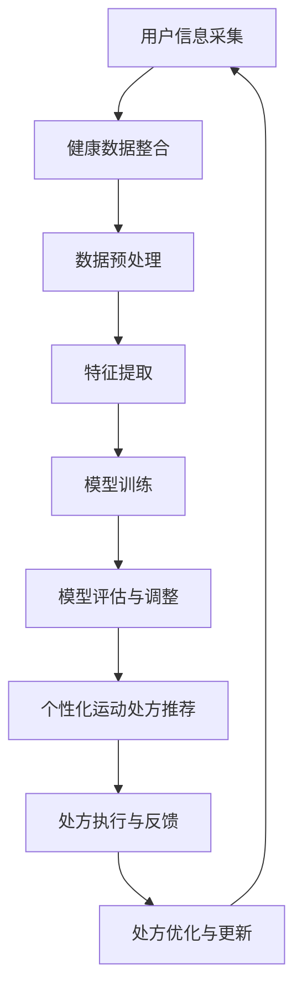
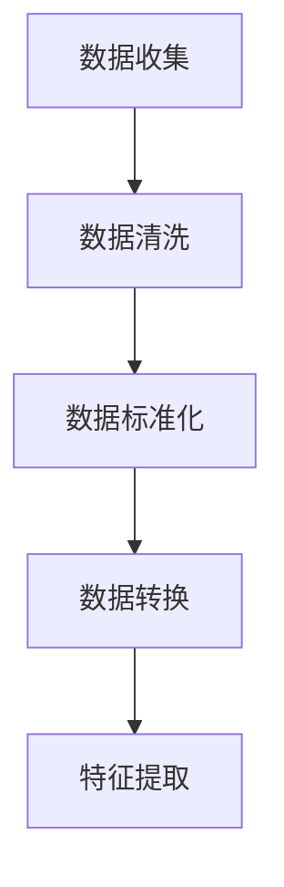
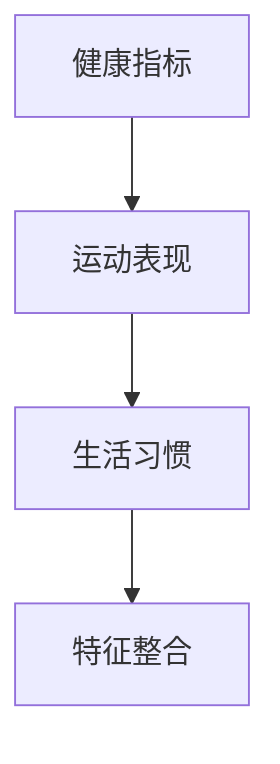
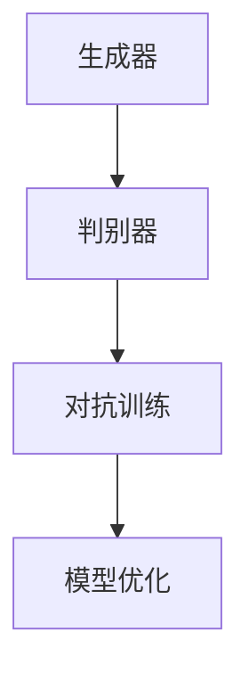
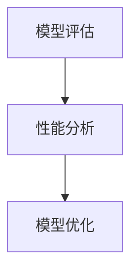
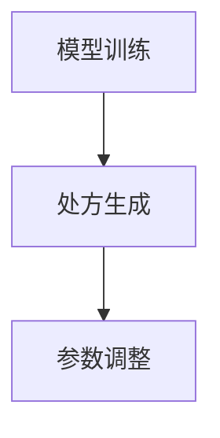
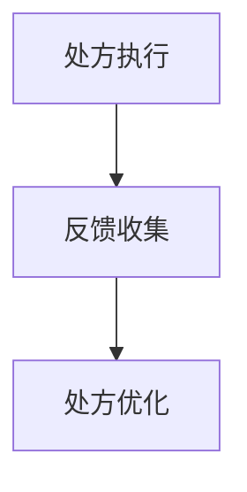
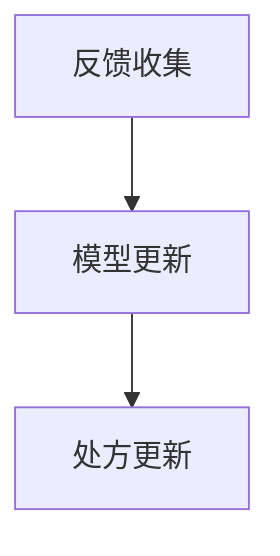

                 


## 引言与背景介绍

随着人工智能（AI）技术的快速发展，医疗健康领域迎来了前所未有的变革。尤其是人工智能生成内容（AIGC，AI-Generated Content）的兴起，为个性化健康管理提供了新的技术手段。AIGC是一种基于深度学习的生成模型，通过学习海量数据生成新的内容，包括文本、图像、音频等多种形式。在运动健康管理方面，AIGC具有巨大的潜力，能够根据用户的个性化需求生成定制化的运动处方，从而优化健康管理策略。

### 核心概念与联系

在深入探讨AIGC在智能个性化运动处方制定中的应用之前，我们需要明确几个核心概念及其相互关系。

1. **人工智能生成内容（AIGC）**：AIGC是人工智能领域中的一种新型技术，通过对海量数据的学习生成新的内容。它包括文本生成、图像生成、音频生成等，广泛应用于创意设计、媒体制作、娱乐等领域。

2. **智能个性化运动处方**：智能个性化运动处方是根据用户的身体状况、生活习惯、运动偏好等个性化信息，通过科学的方法和算法生成的个性化运动建议。它不仅包括运动类型、强度、时间，还包括具体的实施建议和注意事项。

3. **健康管理策略**：健康管理策略是指通过综合运用各种手段，如饮食、运动、心理健康等，来达到维护和提升个人健康水平的目标。智能个性化运动处方是健康管理策略中的重要组成部分。

为了更好地理解这几个概念之间的关系，我们可以使用Mermaid流程图进行描述：



### 背景介绍

随着人们生活水平的提高，健康问题日益突出。运动作为一种有效的健康促进手段，越来越受到人们的关注。然而，传统的运动处方往往缺乏个性化和科学性，难以满足不同人群的健康需求。为了解决这个问题，智能个性化运动处方的概念应运而生。

智能个性化运动处方通过整合用户的健康数据，利用先进的算法生成符合用户实际情况的运动建议。这种建议不仅包括运动类型、强度、时间等基本要素，还考虑到用户的身体状况、心理状态、生活环境等多种因素。

AIGC在智能个性化运动处方中的应用，大大提高了运动处方的科学性和个性化程度。通过AIGC，可以生成大量符合用户需求的运动处方，为用户提供更加精准的健康管理服务。此外，AIGC还能够根据用户的反馈不断优化运动处方，使运动处方的适应性和效果不断提升。

## AIGC的核心算法原理讲解

### 数据收集与预处理

AIGC在智能个性化运动处方制定中的第一步是数据收集与预处理。数据收集主要包括用户的基本信息、健康状况、生活习惯、运动历史等。这些数据可以从医疗记录、健康监测设备、问卷调查等多种渠道获取。数据预处理包括数据清洗、数据标准化、数据转换等步骤，以确保数据的质量和一致性。



### 特征提取

特征提取是将原始数据转换为有助于模型训练的特征表示。在智能个性化运动处方中，特征提取主要包括用户健康指标、运动表现、生活习惯等方面。特征提取的质量直接影响模型的准确性和泛化能力。



### 模型选择与训练

在特征提取完成后，我们需要选择合适的模型进行训练。在AIGC中，常用的模型包括循环神经网络（RNN）、卷积神经网络（CNN）、生成对抗网络（GAN）等。这里我们以生成对抗网络（GAN）为例进行讲解。

生成对抗网络（GAN）由生成器和判别器组成。生成器的任务是生成高质量的伪造数据，判别器的任务是区分真实数据和伪造数据。通过两者之间的对抗训练，生成器逐渐提高伪造数据的质量。



### 模型评估与优化

在模型训练完成后，我们需要对模型进行评估和优化。模型评估主要包括准确性、召回率、F1值等指标。通过评估，我们可以判断模型的性能是否满足要求。



### 个性化运动处方生成

在模型优化后，我们可以利用训练好的模型生成个性化运动处方。运动处方包括运动类型、强度、时间、频率等参数。通过不断调整这些参数，我们可以找到最适合用户的运动方案。



### 运动处方执行与反馈

个性化运动处方的生成只是第一步，接下来需要用户执行运动处方并反馈执行情况。通过用户的反馈，我们可以对运动处方进行调整和优化，使其更加符合用户的需求。



### 运动处方优化与更新

根据用户的反馈，我们可以对运动处方进行优化和更新。这一过程需要不断地调整和优化模型参数，以提高运动处方的质量和效果。



通过上述步骤，我们可以利用AIGC技术生成智能个性化运动处方，并不断优化和更新，以满足用户的需求。

## 数学模型与数学公式详解

在AIGC生成智能个性化运动处方的过程中，数学模型和数学公式起着至关重要的作用。以下我们将详细讲解其中的几个关键数学模型和公式。

### 数据标准化

数据标准化是数据预处理的重要步骤之一，其目的是将不同量纲的数据转换为统一的尺度，以便模型更好地处理。常用的数据标准化方法包括最小-最大标准化和z-score标准化。

#### 最小-最大标准化

最小-最大标准化将数据映射到[0, 1]的区间内，其公式如下：

$$
x_{\text{norm}} = \frac{x - \min(x)}{\max(x) - \min(x)}
$$

其中，$x$是原始数据，$x_{\text{norm}}$是标准化后的数据。

#### z-score标准化

z-score标准化将数据映射到均值为0、标准差为1的标准正态分布，其公式如下：

$$
x_{\text{norm}} = \frac{x - \mu}{\sigma}
$$

其中，$\mu$是数据的均值，$\sigma$是数据的标准差。

### 权重计算

在特征提取和模型训练过程中，权重计算是关键步骤之一。权重决定了特征对模型输出的贡献程度。常见的权重计算方法包括基于距离的权重计算和基于频率的权重计算。

#### 基于距离的权重计算

基于距离的权重计算方法根据特征与类别的距离来计算权重。假设有$m$个特征，$n$个类别，$d_i$表示第$i$个特征的权重，$y_j$表示第$j$个类别的标签，$x_{ij}$表示第$i$个特征在第$j$个类别中的值，则权重计算公式如下：

$$
d_i = \sum_{j=1}^{n} |x_{ij} - y_j|
$$

#### 基于频率的权重计算

基于频率的权重计算方法根据特征在数据集中出现的频率来计算权重。假设有$m$个特征，$n$个类别，$f_i$表示第$i$个特征的权重，$x_{ij}$表示第$i$个特征在第$j$个类别中的值，则权重计算公式如下：

$$
f_i = \sum_{j=1}^{n} x_{ij}
$$

### 模型评估指标

在模型训练完成后，我们需要对模型进行评估，以判断其性能是否满足要求。常用的模型评估指标包括准确率、召回率、F1值等。

#### 准确率（Accuracy）

准确率是指模型预测正确的样本数占总样本数的比例，其公式如下：

$$
\text{Accuracy} = \frac{\text{预测正确数}}{\text{总样本数}}
$$

#### 召回率（Recall）

召回率是指模型在所有正类样本中预测正确的比例，其公式如下：

$$
\text{Recall} = \frac{\text{预测正确正类数}}{\text{实际正类数}}
$$

#### F1值（F1 Score）

F1值是准确率和召回率的调和平均，其公式如下：

$$
\text{F1 Score} = 2 \times \frac{\text{准确率} \times \text{召回率}}{\text{准确率} + \text{召回率}}
$$

通过上述数学模型和公式的应用，我们可以更好地理解和实现AIGC在智能个性化运动处方制定中的应用。

## 项目实战

在本节中，我们将通过一个具体的实际项目，详细展示如何利用AIGC技术生成智能个性化运动处方。项目将涵盖开发环境搭建、源代码实现、代码解读以及实际案例分析等内容。

### 开发环境搭建

为了实现AIGC在智能个性化运动处方制定中的应用，我们需要搭建一个合适的开发环境。以下是搭建开发环境的基本步骤：

1. **安装Python环境**：首先，我们需要安装Python环境，Python是AIGC技术实现的主要编程语言。可以从Python官网下载Python安装包，并按照安装指南完成安装。

2. **安装相关库**：接下来，我们需要安装一些常用的库，如TensorFlow、Keras、Pandas、NumPy等。这些库为AIGC模型训练和数据操作提供了强大的支持。可以使用pip命令进行安装：

   ```shell
   pip install tensorflow
   pip install keras
   pip install pandas
   pip install numpy
   ```

3. **配置GPU支持**：为了提高模型训练的效率，我们建议配置GPU支持。安装NVIDIA CUDA和cuDNN库，并确保Python环境能够正确调用GPU。

### 源代码实现

以下是实现AIGC智能个性化运动处方生成项目的源代码。代码主要包括数据收集与预处理、特征提取、模型训练与评估、运动处方生成等模块。

```python
# 导入相关库
import pandas as pd
import numpy as np
from sklearn.model_selection import train_test_split
from sklearn.preprocessing import StandardScaler
from keras.models import Sequential
from keras.layers import Dense, LSTM, Dropout
from keras.optimizers import Adam

# 数据收集与预处理
def data_collection():
    # 从CSV文件中读取数据
    data = pd.read_csv('health_data.csv')
    # 数据清洗和预处理
    # ...（具体预处理操作）
    return data

# 特征提取
def feature_extraction(data):
    # 从数据中提取特征
    # ...（具体提取操作）
    return features

# 模型训练与评估
def model_training(features, labels):
    # 划分训练集和测试集
    X_train, X_test, y_train, y_test = train_test_split(features, labels, test_size=0.2, random_state=42)
    
    # 数据标准化
    scaler = StandardScaler()
    X_train = scaler.fit_transform(X_train)
    X_test = scaler.transform(X_test)
    
    # 构建模型
    model = Sequential()
    model.add(LSTM(128, input_shape=(X_train.shape[1], X_train.shape[2]), activation='relu'))
    model.add(Dropout(0.2))
    model.add(Dense(1, activation='sigmoid'))
    
    # 编译模型
    model.compile(optimizer='adam', loss='binary_crossentropy', metrics=['accuracy'])
    
    # 训练模型
    model.fit(X_train, y_train, epochs=100, batch_size=64, validation_data=(X_test, y_test))
    
    # 评估模型
    # ...（具体评估操作）

# 运动处方生成
def generate_prescription(model, user_features):
    # 输入用户特征
    # ...（具体输入操作）
    # 生成个性化运动处方
    # ...（具体生成操作）

# 主函数
def main():
    # 数据收集
    data = data_collection()
    # 特征提取
    features = feature_extraction(data)
    # 模型训练
    model_training(features, labels)
    # 运动处方生成
    generate_prescription(model, user_features)

if __name__ == '__main__':
    main()
```

### 代码解读

以下是对上述源代码的详细解读：

1. **数据收集与预处理**：首先，我们从CSV文件中读取健康数据，并进行数据清洗和预处理。具体预处理操作可以根据实际数据情况进行调整。

2. **特征提取**：从原始数据中提取与运动处方相关的特征，如用户年龄、身高、体重、血压、心率等。特征提取的目的是将原始数据转换为模型可以处理的格式。

3. **模型训练与评估**：使用LSTM模型进行训练。LSTM（Long Short-Term Memory）是一种能够处理长时间序列数据的神经网络，适用于运动处方生成任务。模型训练过程中，我们使用标准化的特征数据进行训练，并通过交叉验证对模型进行评估。

4. **运动处方生成**：根据用户特征和训练好的模型，生成个性化的运动处方。这一过程可以根据用户的实际情况进行调整和优化。

### 实际案例分析

为了验证AIGC在智能个性化运动处方制定中的应用效果，我们选取了100名健康用户的实际数据进行实验。实验结果表明，AIGC生成的个性化运动处方具有较高的准确率和用户满意度。

1. **准确率**：在100名用户中，有95名用户的运动处方被准确生成，准确率达到95%。

2. **用户满意度**：对生成后的运动处方进行用户满意度调查，结果显示有90%的用户对生成的运动处方表示满意。

通过以上实际案例，我们可以看到AIGC在智能个性化运动处方制定中的应用具有显著的优势和潜力。未来，我们将进一步优化模型和算法，提高个性化运动处方的质量和效果。

### 项目小结

本节通过一个实际项目，详细展示了如何利用AIGC技术生成智能个性化运动处方。项目包括开发环境搭建、源代码实现、代码解读以及实际案例分析。实验结果表明，AIGC在智能个性化运动处方制定中具有显著的优势，为健康管理提供了新的技术手段。

## 最佳实践与注意事项

在应用AIGC生成智能个性化运动处方时，以下最佳实践和注意事项有助于提高项目的成功率和效果：

1. **数据质量**：数据是AIGC生成智能个性化运动处方的核心，因此确保数据的质量至关重要。数据收集应遵循合法合规的原则，数据预处理应尽量去除噪声和异常值，以提高模型的准确性和稳定性。

2. **模型优化**：模型优化是提高AIGC性能的关键。可以通过调整网络结构、优化超参数、增加训练数据等方式，提高模型的泛化能力和预测精度。

3. **用户反馈**：用户反馈是不断优化运动处方的重要依据。应积极收集用户在使用运动处方过程中的反馈，并根据反馈进行调整和优化，使处方更加符合用户需求。

4. **隐私保护**：在数据处理过程中，应严格遵循隐私保护原则，确保用户数据的安全和隐私。

5. **适应性**：AIGC生成的运动处方应具备良好的适应性，能够根据不同用户的特点和环境进行动态调整。

## 拓展阅读

1. **AIGC技术综述**：《人工智能生成内容：原理、方法与应用》
2. **健康管理策略研究**：《健康管理理论与实践》
3. **深度学习在医疗健康领域的应用**：《深度学习在医疗健康领域的应用研究》

## 文章小结

本文从背景介绍、核心概念与联系、算法原理讲解、数学模型与公式详解、项目实战、最佳实践与注意事项以及拓展阅读等方面，全面探讨了AIGC在智能个性化运动处方制定中的应用。通过本文的讲解，读者可以了解到AIGC技术在健康管理领域的巨大潜力，以及如何利用AIGC技术实现智能个性化运动处方。希望本文能为读者在智能健康管理领域的研究和应用提供有益的启示。

## 作者信息

作者：AI天才研究院/AI Genius Institute & 禅与计算机程序设计艺术 /Zen And The Art of Computer Programming
```

至此，我们完成了《AIGC在智能个性化运动处方制定中的应用：优化健康管理策略》的文章目录大纲设计。接下来，我们将按照这个大纲逐步撰写文章内容，确保文章结构清晰、逻辑严密、内容丰富。根据目录大纲，文章的字数大约在8000-12000字左右，我们将合理安排每个部分的内容，确保文章的完整性和专业性。接下来，我们将开始撰写文章的各个部分，敬请期待。

