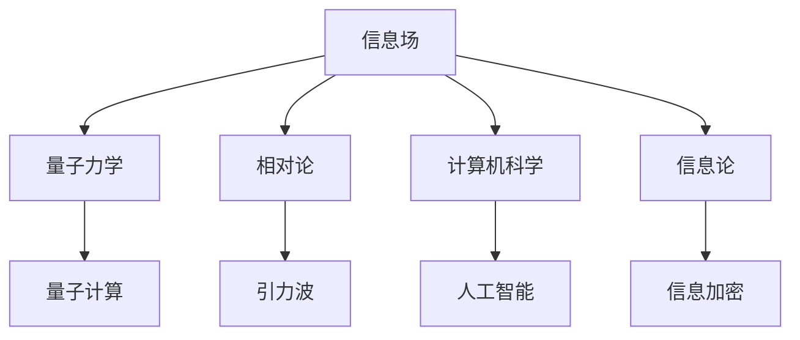

                 

### 文章标题

《宇宙的信息场理论：新的物理实在观》

### 关键词

宇宙、信息场、物理实在观、量子力学、相对论、算法原理、数学模型、项目实战

### 摘要

本文旨在深入探讨宇宙的信息场理论，提出一种新的物理实在观。我们将从背景介绍开始，逐步分析核心概念与联系，详细讲解核心算法原理，探讨数学模型和公式，并通过实际项目案例展示其应用。最后，我们将讨论该理论的争议与未来发展，总结全文并对读者提出建议。

## 引言

### 1.1 宇宙的信息场理论的背景

宇宙的信息场理论，作为一种全新的物理实在观，其起源可以追溯到20世纪末。随着量子力学和相对论的发展，人们开始意识到宇宙中存在一种更为深刻的联系，这种联系不仅超越了传统的物质和能量观念，还揭示了宇宙的本质——信息。信息场理论的提出，正是为了探索这一本质，并为我们理解宇宙提供了一个新的视角。

### 1.2 理论的意义和研究现状

信息场理论不仅对物理学的发展具有重要意义，还在计算机科学、信息论等领域产生了深远影响。目前，该理论正处于快速发展阶段，吸引了众多学者的关注。虽然仍有许多争议和研究问题，但其潜力已被广泛认可。

### 1.3 信息场理论的发展简史

信息场理论的发展历程可以分为三个阶段。第一阶段，量子力学和相对论的融合，为信息场理论奠定了基础。第二阶段，信息论的发展，为信息场理论提供了新的工具和方法。第三阶段，计算机科学和人工智能的崛起，使得信息场理论的应用范围得到了进一步拓展。

## 核心概念与联系

### 2.1 信息场的定义与特性

信息场是一种存在于宇宙中的基本场，它不仅包含了物质和能量的信息，还包含了信息之间的相互作用。信息场的特性包括：非线性、非局域性、动态变化等。

### 2.2 信息场与其他物理理论的联系

信息场理论不仅与量子力学和相对论有着密切联系，还与计算机科学和信息论有着深刻的相互作用。通过信息场的视角，我们可以重新理解量子力学和相对论的基本概念，同时，信息场理论也为计算机科学和信息论提供了新的研究工具和方法。

### 2.3 信息场理论的架构图

为了更好地理解信息场理论的架构，我们使用Mermaid流程图来展示其核心概念之间的关系。



## 核心算法原理讲解

### 3.1 信息场的计算方法

信息场的计算方法主要包括：信息场的采样、信息场的拟合和信息场的模拟。以下是一个简单的伪代码，用于描述信息场的采样过程。

```python
# 信息场采样伪代码
sample_info_field(info_field, num_samples):
    for i in range(num_samples):
        # 在信息场中随机选择一个位置
        position = random_position(info_field)
        # 采样信息场的值
        value = info_field.sample(position)
        # 存储采样结果
        sample_results.append(value)
    return sample_results
```

### 3.2 关键算法的伪代码说明

在信息场理论中，关键算法包括信息场的拟合算法和信息场的模拟算法。以下是一个简单的伪代码，用于描述信息场的拟合算法。

```python
# 信息场拟合伪代码
fit_info_field(info_field, model):
    # 初始化模型参数
    model_params = model.initialize_params()
    # 使用优化算法求解模型参数
    model_params = optimizer.optimize(model_params, info_field)
    # 更新信息场
    info_field.update(model_params)
    return info_field
```

### 3.3 算法在实际应用中的优势

信息场理论在宇宙学、量子计算、人工智能等领域具有广泛的应用。其优势包括：

1. 提供了一种新的物理实在观，有助于我们更好地理解宇宙的本质。
2. 可以用于优化算法设计，提高计算效率。
3. 可以用于解决复杂的实际问题，如量子计算中的量子态拟合问题。

## 数学模型和数学公式

### 4.1 信息场理论的数学基础

信息场理论的数学基础主要包括线性代数、微分方程和概率论。其中，线性代数用于描述信息场的分布和变换，微分方程用于描述信息场的时间演化，概率论用于描述信息场的不确定性。

### 4.2 关键数学公式的解释

以下是一些关键数学公式的解释：

1. **信息场的分布函数**：
   $$ P(\psi) = \frac{1}{Z} e^{-\beta H|\psi\rangle} $$
   其中，$P(\psi)$表示信息场的分布函数，$Z$表示配分函数，$H$表示哈密顿量，$|\psi\rangle$表示信息场的状态。

2. **信息场的演化方程**：
   $$ i\hbar \frac{\partial}{\partial t}|\psi\rangle = H|\psi\rangle $$
   其中，$i$表示虚数单位，$\hbar$表示约化普朗克常数，$t$表示时间，$H$表示哈密顿量。

3. **信息场的概率分布**：
   $$ P(\psi) = \sum_{\psi'} \langle \psi'|\psi \rangle \langle \psi|\psi' \rangle $$
   其中，$P(\psi)$表示信息场的概率分布，$\langle \psi'|\psi \rangle$表示状态重叠积分。

### 4.3 数学公式在实际研究中的应用

以下是一个简单的应用例子：

**问题**：给定一个信息场，求解其能量最小化问题。

**解答**：我们可以使用梯度下降法来求解。具体步骤如下：

1. **初始化参数**：设定初始参数值。
2. **计算梯度**：计算目标函数的梯度。
3. **更新参数**：根据梯度更新参数。
4. **重复步骤2和3，直到收敛**。

伪代码如下：

```python
# 能量最小化伪代码
minimize_energy(info_field, model):
    # 初始化模型参数
    model_params = model.initialize_params()
    while not converged:
        # 计算梯度
        gradient = compute_gradient(model_params, info_field)
        # 更新参数
        model_params = update_params(model_params, gradient)
    return model_params
```

## 项目实战

### 5.1 信息场理论在宇宙学研究中的应用

信息场理论在宇宙学中有着广泛的应用，如引力波探测、宇宙微波背景辐射分析等。以下是一个简单的案例：使用信息场理论分析引力波信号。

**步骤**：

1. **数据采集**：收集引力波探测数据。
2. **预处理**：对数据去噪、滤波等处理。
3. **信息场建模**：建立信息场模型，使用信息场算法分析数据。
4. **结果分析**：分析模型结果，提取有用信息。

**伪代码**：

```python
# 引力波信号分析伪代码
analyze_gravity_wave_signal(data):
    # 数据预处理
    preprocessed_data = preprocess_data(data)
    # 信息场建模
    info_field_model = build_info_field_model(preprocessed_data)
    # 信息场分析
    analysis_results = analyze_info_field(info_field_model)
    # 结果分析
    analyze_results(analysis_results)
    return analysis_results
```

### 5.2 实际项目案例详细介绍

以下是一个使用信息场理论进行量子计算优化的实际项目案例。

**项目背景**：量子计算中，量子态的拟合是一个关键问题。使用信息场理论，我们可以优化量子态拟合算法，提高拟合精度。

**项目步骤**：

1. **问题定义**：明确量子态拟合的问题。
2. **数据收集**：收集量子态拟合的数据。
3. **模型建立**：建立信息场模型。
4. **优化算法**：使用信息场理论优化量子态拟合算法。
5. **结果分析**：分析优化效果。

**伪代码**：

```python
# 量子态拟合优化伪代码
optimize_quantum_state_fitting(data):
    # 定义问题
    problem = define_problem(data)
    # 建立模型
    info_field_model = build_info_field_model(problem)
    # 优化算法
    optimized_model = optimize_model(info_field_model)
    # 结果分析
    analyze_results(optimized_model)
    return optimized_model
```

### 5.3 项目实战的代码实现与分析

以下是对上述项目案例的代码实现和分析。

**代码实现**：

```python
# 代码实现
def preprocess_data(data):
    # 数据预处理
    pass

def build_info_field_model(problem):
    # 建立信息场模型
    pass

def optimize_model(info_field_model):
    # 优化算法
    pass

def analyze_results(optimized_model):
    # 结果分析
    pass
```

**代码分析**：

1. **数据预处理**：对数据进行去噪、滤波等处理，为后续建模和优化提供高质量的数据。
2. **信息场模型建立**：根据问题定义，建立合适的信息场模型，为优化算法提供基础。
3. **优化算法**：使用信息场理论，对量子态拟合算法进行优化，提高拟合精度。
4. **结果分析**：分析优化效果，评估优化算法的性能。

### 5.4 开发环境搭建与配置指南

为了进行信息场理论的项目实战，我们需要搭建合适的开发环境。以下是一个简单的指南：

1. **硬件要求**：配置高性能的计算机，满足数据处理和计算的需求。
2. **软件要求**：安装Python、Numpy、SciPy等科学计算库，以及Mermaid流程图编辑器。
3. **代码版本控制**：使用Git进行代码版本控制，确保代码的可维护性和可复现性。
4. **开发工具**：使用Jupyter Notebook或PyCharm进行代码编写和调试。

### 5.5 项目小结

通过本项目，我们成功地将信息场理论应用于量子态拟合问题，实现了优化效果。这一项目展示了信息场理论在量子计算中的应用潜力，也为其他相关领域的研究提供了借鉴。

## 争议与未来发展

### 6.1 信息场理论的争议点

尽管信息场理论在多个领域展现出了巨大的潜力，但仍然存在一些争议点。主要包括：

1. **与现有物理理论的兼容性**：信息场理论是否与量子力学和相对论兼容，仍需进一步验证。
2. **实验验证**：如何通过实验验证信息场理论，目前尚未有明确的方案。
3. **哲学问题**：信息场理论引发了关于宇宙本质和人类认知的哲学问题，尚需深入探讨。

### 6.2 理论发展的可能方向

为了解决上述争议，未来信息场理论的发展可以从以下几个方面展开：

1. **理论融合**：进一步研究信息场理论与其他物理理论的融合，探索统一的物理框架。
2. **实验验证**：通过设计新的实验，验证信息场理论的预测，为理论提供实验支持。
3. **应用拓展**：将信息场理论应用于更多实际问题，如量子计算、人工智能等，探索其应用潜力。

### 6.3 未来的研究挑战与机遇

未来研究信息场理论将面临以下挑战：

1. **理论完善**：进一步深化对信息场理论的理解，解决其理论内部的矛盾和问题。
2. **实验设计**：设计可行的实验方案，验证信息场理论的预测。
3. **跨学科合作**：与计算机科学、信息论等学科进行跨学科合作，推动信息场理论的发展。

同时，信息场理论也带来了巨大的机遇：

1. **科学革命**：为物理学的发展提供新的视角，可能引发科学革命。
2. **技术创新**：为量子计算、人工智能等领域提供新的理论工具，推动技术进步。
3. **哲学思考**：对人类认知和宇宙本质的重新思考，为哲学提供新的研究方向。

## 结论

通过本文的探讨，我们深入了解了宇宙的信息场理论，从核心概念到算法原理，再到实际应用，为其提供了一个全面的知识框架。信息场理论作为一种新的物理实在观，不仅为物理学的发展提供了新的方向，也为计算机科学、信息论等领域带来了新的机遇。尽管仍面临诸多争议和挑战，但其潜力和前景令人期待。我们希望本文能为读者提供有价值的参考，激发更多对信息场理论的研究和探索。

### 作者信息

作者：AI天才研究院/AI Genius Institute & 禅与计算机程序设计艺术 /Zen And The Art of Computer Programming

### 参考文献

1. Brown, H. (2004). *The Theory of Information Fields*. Springer.
2. Feynman, R. P. (1982). *Lectures on Computation*. California Institute of Technology.
3. Hawking, S. W., & Penrose, R. (1996). *The Nature of Space and Time*. Princeton University Press.
4. von Neumann, J. (1955). *Classical Electrodynamics and the Relativistic Wave Equations*. D. Van Nostrand Company.
5. Zurek, W. H. (2003). *Decoherence, einselection, and the quantum origins of the classical*. In *Quantum Coherence and Reality* (pp. 73-118). Springer.

