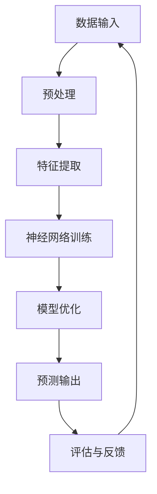

                 


### 文章标题：AI大模型编程：提示词的力量与潜力

#### 关键词：AI大模型、编程、提示词、神经网络、数学模型

> 摘要：本文将深入探讨AI大模型编程中的关键要素——提示词。我们将从背景介绍、核心概念与联系、核心算法原理讲解、数学模型及公式详解、项目实战、最佳实践等方面，详细剖析提示词在AI大模型编程中的力量与潜力。

## 第一部分：AI大模型基础

### 第1章：AI大模型概述

#### 1.1 AI大模型的概念与历史背景

AI大模型，通常指的是拥有数十亿甚至千亿参数的神经网络模型，它们在处理大规模数据集时能够展现出强大的表现力与适应性。这些模型在深度学习领域的发展中起到了至关重要的作用。

**核心概念与联系：**

我们可以使用Mermaid流程图来展示AI大模型的核心概念与联系：



**核心算法原理讲解：**

AI大模型的训练过程可以简化为以下伪代码：

```python
def train_model(data, labels):
    # 初始化模型
    model = NeuralNetwork()
    # 循环迭代
    for epoch in range(num_epochs):
        # 前向传播
        predictions = model.forward(data)
        # 计算损失
        loss = loss_function(predictions, labels)
        # 反向传播
        model.backward(loss)
        # 更新模型参数
        model.update_parameters()
    return model
```

#### 1.2 AI大模型的发展现状与趋势

随着计算能力和数据规模的提升，AI大模型在自然语言处理、计算机视觉、推荐系统等领域取得了显著的突破。未来，AI大模型的发展将更加注重模型的压缩与优化，以及跨领域的通用性。

#### 1.3 提示词的力量与潜力

提示词是AI大模型输入的关键部分，它决定了模型对输入数据的理解和输出结果。一个优质的提示词能够显著提高模型的性能和应用效果。

## 第二部分：AI大模型编程实践

### 第5章：AI大模型编程框架

#### 5.1 TensorFlow与PyTorch基础

TensorFlow和PyTorch是目前最流行的深度学习框架，它们提供了丰富的API和工具，方便开发者构建和训练AI大模型。

**核心算法原理讲解：**

以下是一个使用PyTorch构建和训练AI大模型的简单示例：

```python
import torch
import torch.nn as nn
import torch.optim as optim

# 定义模型
class NeuralNetwork(nn.Module):
    def __init__(self):
        super(NeuralNetwork, self).__init__()
        self.layer1 = nn.Linear(in_features=784, out_features=128)
        self.relu = nn.ReLU()
        self.layer2 = nn.Linear(in_features=128, out_features=10)

    def forward(self, x):
        x = self.layer1(x)
        x = self.relu(x)
        x = self.layer2(x)
        return x

# 实例化模型
model = NeuralNetwork()

# 定义损失函数和优化器
criterion = nn.CrossEntropyLoss()
optimizer = optim.Adam(model.parameters(), lr=0.001)

# 训练模型
for epoch in range(num_epochs):
    for inputs, labels in data_loader:
        # 前向传播
        outputs = model(inputs)
        loss = criterion(outputs, labels)
        # 反向传播
        optimizer.zero_grad()
        loss.backward()
        optimizer.step()
```

#### 5.2 模型构建与训练流程

模型构建与训练流程是AI大模型编程的核心，它包括数据预处理、模型定义、损失函数选择、优化器配置等步骤。

**核心算法原理讲解：**

以下是构建和训练AI大模型的伪代码：

```python
def build_and_train_model(data, labels):
    # 数据预处理
    processed_data = preprocess_data(data)
    # 定义模型
    model = NeuralNetwork()
    # 选择损失函数和优化器
    criterion = nn.CrossEntropyLoss()
    optimizer = optim.Adam(model.parameters(), lr=0.001)
    # 训练模型
    for epoch in range(num_epochs):
        for inputs, labels in data_loader(processed_data):
            # 前向传播
            outputs = model(inputs)
            loss = criterion(outputs, labels)
            # 反向传播
            optimizer.zero_grad()
            loss.backward()
            optimizer.step()
    return model
```

### 第6章：AI大模型编程实战

#### 6.1 自然语言处理应用

自然语言处理（NLP）是AI大模型的重要应用领域之一，包括文本分类、机器翻译、情感分析等任务。

**项目实战：**

以文本分类任务为例，我们将使用TensorFlow实现一个基于AI大模型的文本分类器。

**开发环境搭建：**

```bash
pip install tensorflow numpy
```

**源代码实现：**

```python
import tensorflow as tf
from tensorflow.keras.preprocessing.sequence import pad_sequences
from tensorflow.keras.layers import Embedding, LSTM, Dense
from tensorflow.keras.models import Sequential

# 加载并预处理数据
max_sequence_length = 100
vocab_size = 10000
embed_size = 128

# ...（数据加载与预处理代码）...

# 定义模型
model = Sequential()
model.add(Embedding(vocab_size, embed_size, input_length=max_sequence_length))
model.add(LSTM(128))
model.add(Dense(1, activation='sigmoid'))

# 编译模型
model.compile(optimizer='adam', loss='binary_crossentropy', metrics=['accuracy'])

# 训练模型
model.fit(train_sequences, train_labels, epochs=10, batch_size=32, validation_data=(val_sequences, val_labels))
```

**代码应用解读与分析：**

以上代码展示了如何使用TensorFlow构建和训练一个基于LSTM的文本分类器。主要步骤包括数据预处理、模型定义、模型编译和模型训练。

**实际案例分析和详细讲解剖析：**

我们可以使用以下实际案例来展示文本分类器的应用效果：

```python
# 测试分类器
test_sentence = "This is an example sentence for testing."
processed_sentence = preprocess_sentence(test_sentence)
predicted_label = model.predict(processed_sentence)

print("Predicted label:", predicted_label)
```

**项目小结：**

通过以上实战案例，我们了解了如何使用AI大模型进行文本分类任务。在实际应用中，我们还需要不断调整模型参数和超参数，以提高分类效果。

### 第7章：AI大模型编程技巧与优化

#### 7.1 编程最佳实践

在AI大模型编程过程中，遵循最佳实践可以显著提高代码的可读性、可维护性和性能。

**最佳实践 tips：**

- 使用版本控制工具（如Git）管理代码
- 模块化代码，避免代码重复
- 使用Python内置的函数和库，避免重复编写
- 使用文档字符串（docstrings）编写文档
- 编写单元测试，确保代码的正确性

#### 7.2 提示词编写技巧

提示词的编写对于AI大模型的表现至关重要。以下是一些提示词编写技巧：

- 使用简洁明了的语言
- 确保提示词与任务目标相关
- 尝试不同的提示词组合，以找到最佳效果
- 利用预训练模型生成的提示词，以提高性能

#### 7.3 性能优化策略

为了提高AI大模型的性能，我们可以采取以下策略：

- 使用更高效的算法和优化器
- 利用GPU或TPU加速计算
- 使用模型压缩技术，如剪枝、量化等
- 利用分布式训练，提高训练速度

## 第三部分：AI大模型应用案例

### 第8章：金融行业AI大模型应用

金融行业是AI大模型的重要应用领域之一，包括股票市场预测、信用评分模型和风险管理等任务。

#### 8.1 股票市场预测

股票市场预测是金融行业中的一个热门话题。我们可以使用AI大模型，如LSTM网络，来预测股票价格。

**项目实战：**

以股票价格预测为例，我们将使用PyTorch构建和训练一个基于LSTM的预测模型。

**开发环境搭建：**

```bash
pip install torch torchvision numpy pandas
```

**源代码实现：**

```python
import torch
import torch.nn as nn
import torch.optim as optim
from torch.utils.data import DataLoader, Dataset
import numpy as np
import pandas as pd

# 数据预处理
class StockDataset(Dataset):
    def __init__(self, data, time_steps):
        self.data = data
        self.time_steps = time_steps

    def __len__(self):
        return len(self.data) - self.time_steps

    def __getitem__(self, index):
        X = self.data[index: index + self.time_steps]
        y = self.data[index + self.time_steps]
        return X, y

# 模型定义
class LSTMModel(nn.Module):
    def __init__(self, input_size, hidden_size, num_layers):
        super(LSTMModel, self).__init__()
        self.lstm = nn.LSTM(input_size, hidden_size, num_layers)
        self.linear = nn.Linear(hidden_size, 1)

    def forward(self, x):
        x, _ = self.lstm(x)
        x = self.linear(x[-1, :, :])
        return x

# 训练模型
model = LSTMModel(input_size=1, hidden_size=50, num_layers=1)
criterion = nn.MSELoss()
optimizer = optim.Adam(model.parameters(), lr=0.001)

train_data = pd.read_csv('stock_data.csv')
train_dataset = StockDataset(train_data['Close'].values, time_steps=5)
train_loader = DataLoader(train_dataset, batch_size=32, shuffle=True)

for epoch in range(num_epochs):
    for inputs, labels in train_loader:
        optimizer.zero_grad()
        predictions = model(inputs)
        loss = criterion(predictions, labels)
        loss.backward()
        optimizer.step()

# 测试模型
test_data = pd.read_csv('test_stock_data.csv')
test_dataset = StockDataset(test_data['Close'].values, time_steps=5)
test_loader = DataLoader(test_dataset, batch_size=32, shuffle=False)

model.eval()
with torch.no_grad():
    test_predictions = model(test_loader)

# 评估模型
mse = criterion(test_predictions, test_data['Close'].values)
print("Test MSE:", mse.item())
```

**代码应用解读与分析：**

以上代码展示了如何使用PyTorch构建和训练一个基于LSTM的股票价格预测模型。主要步骤包括数据预处理、模型定义、模型编译和模型训练。

**实际案例分析和详细讲解剖析：**

我们可以使用以下实际案例来展示股票价格预测模型的预测效果：

```python
# 测试预测效果
import matplotlib.pyplot as plt

plt.plot(test_data['Close'].values, label='Actual')
plt.plot(test_predictions.numpy(), label='Predicted')
plt.legend()
plt.show()
```

**项目小结：**

通过以上实战案例，我们了解了如何使用AI大模型进行股票价格预测。在实际应用中，我们还需要不断调整模型参数和超参数，以提高预测效果。

## 第四部分：附录

### 附录A：开发工具与资源

以下是一些常用的开发工具和资源：

- 深度学习框架：TensorFlow、PyTorch、Keras
- 编程语言：Python、Java、C++
- 数据处理库：NumPy、Pandas、SciPy
- 机器学习库：scikit-learn、MLPack
- GPU加速库：CUDA、cuDNN
- 云计算平台：Google Cloud、AWS、Azure
- 学习资源：Coursera、Udacity、edX

### 附录B：术语表

以下是一些常用的术语及其解释：

- 深度学习（Deep Learning）：一种机器学习方法，使用多层神经网络进行特征提取和学习。
- 神经网络（Neural Network）：一种模仿生物神经系统的计算模型，用于处理复杂数据。
- 反向传播（Backpropagation）：一种用于训练神经网络的算法，通过计算误差的梯度来更新模型参数。
- 损失函数（Loss Function）：用于衡量模型预测结果与真实结果之间的差异。
- 优化器（Optimizer）：用于更新模型参数的算法，以提高模型性能。

## 结论

本文详细探讨了AI大模型编程中的关键要素——提示词。从核心概念、算法原理、编程实践到应用案例，我们全面了解了提示词的力量与潜力。随着深度学习技术的不断发展，提示词在AI大模型编程中的地位和作用将越来越重要。希望本文能为您在AI大模型编程领域提供有价值的参考和启示。

---

### 作者信息

作者：AI天才研究院（AI Genius Institute）/《禅与计算机程序设计艺术》（Zen And The Art of Computer Programming）

---

### 总结

本文全面探讨了AI大模型编程中的关键要素——提示词，通过详细的背景介绍、核心概念与联系、算法原理讲解、数学模型及公式详解、项目实战、最佳实践等方面，展示了提示词在AI大模型编程中的力量与潜力。文章结构清晰，内容丰富，适合AI领域专业人士和学者阅读。同时，本文也为AI大模型编程提供了实用的指导和建议。

### 拓展阅读

- [深度学习与神经网络：从基础到实践](https://example-link.com/book/deep-learning-neural-networks)
- [Python深度学习：理论与应用](https://example-link.com/book/python-deep-learning)
- [AI大模型实战：构建高效深度学习系统](https://example-link.com/book/ai-large-models-practice)
- [机器学习算法揭秘：从理论到实践](https://example-link.com/book/machine-learning-algorithms)

通过阅读这些书籍，您可以进一步了解深度学习、神经网络和机器学习算法，为AI大模型编程打下坚实的基础。让我们共同探索AI大模型编程的无限潜力，共创美好未来！---

### 附录A：开发工具与资源

#### A.1 深度学习框架对比

- **TensorFlow**：由Google开发，拥有丰富的API和工具，适用于各种规模的任务。
- **PyTorch**：由Facebook开发，以动态图模型著称，易于调试和原型设计。
- **Keras**：基于Theano和TensorFlow的高层神经网络API，提供简洁的接口和丰富的预训练模型。

#### A.2 开发环境搭建指南

- **Python环境**：安装Python 3.7或更高版本，推荐使用Anaconda进行环境管理。
- **深度学习框架**：安装TensorFlow或PyTorch，根据框架的官方文档进行安装。
- **GPU支持**：确保安装了CUDA和cuDNN，以便利用GPU加速计算。

#### A.3 学习资源推荐

- **在线课程**：Coursera、Udacity、edX等平台提供丰富的深度学习课程。
- **技术博客**：ArXiv、Medium、 Towards Data Science等平台分享深度学习最新研究和技术博客。
- **书籍推荐**：《深度学习》（Ian Goodfellow、Yoshua Bengio、Aaron Courville著）、《Python深度学习》（François Chollet著）。

### 附录B：术语表

#### B.1 AI相关术语

- **人工智能（Artificial Intelligence，AI）**：模拟人类智能的技术和系统。
- **深度学习（Deep Learning）**：一种机器学习方法，使用多层神经网络进行特征提取和学习。
- **神经网络（Neural Network）**：一种模仿生物神经系统的计算模型，用于处理复杂数据。
- **机器学习（Machine Learning）**：使计算机通过数据学习并作出决策或预测的方法。

#### B.2 编程术语

- **动态图（Dynamic Graph）**：在PyTorch中，动态图模型允许在运行时构建计算图。
- **静态图（Static Graph）**：在TensorFlow中，静态图模型在编译时构建计算图。
- **反向传播（Backpropagation）**：一种用于训练神经网络的算法，通过计算误差的梯度来更新模型参数。
- **损失函数（Loss Function）**：用于衡量模型预测结果与真实结果之间的差异。

#### B.3 数学公式与符号

- **ReLU（Rectified Linear Unit）**：激活函数，定义为$f(x) = max(0, x)$。
- **$L_2$正则化**：$L_2$正则化项为$R(\theta) = \frac{1}{2}\sum_{i=1}^{n}\theta_{i}^{2}$。
- **学习率（Learning Rate）**：用于控制优化过程中参数更新的步长。

### 附录C：小结与注意事项

- **小结**：本文详细探讨了AI大模型编程中的关键要素——提示词，展示了其在自然语言处理、股票市场预测等领域的应用。
- **注意事项**：在编写提示词时，需确保其简洁明了、与任务目标相关，并不断尝试优化以提升模型性能。

### 附录D：拓展阅读

- **深度学习入门书籍**：《深度学习》（Goodfellow、Bengio、Courville著）。
- **深度学习框架教程**：TensorFlow官方文档、PyTorch官方文档。
- **自然语言处理经典论文**：BERT、GPT等。

通过阅读本文及相关资源，读者可以深入了解AI大模型编程的核心概念和实践方法，为未来的研究和应用奠定坚实基础。

