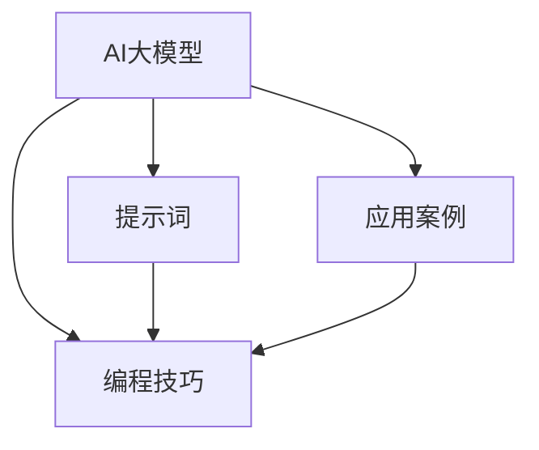

                 

# AI大模型编程：提示词的威力与革新

## 关键词
- AI大模型
- 提示词
- 编程技巧
- 深度学习
- 应用案例

## 摘要
本文将探讨AI大模型编程中的关键要素——提示词，以及它们如何革新编程方式。我们将详细解析AI大模型的基础知识、提示词的作用原理、编程技巧的应用，并通过实际项目实战来展示如何在实际开发中利用提示词提升AI模型的性能。文章还将提供最佳实践建议和项目小结，帮助读者深入理解AI大模型编程的精髓。

## 引言

随着人工智能技术的迅猛发展，AI大模型在各个领域取得了显著的成果。然而，如何有效地编程这些大模型，使其发挥最大的潜力，仍然是一个挑战。提示词（Prompt Engineering）作为一种新的编程范式，正逐渐成为AI大模型编程的重要工具。本文旨在探讨提示词的威力及其在编程中的应用，为开发者提供实际操作指南和深入理解。

## 第一步：核心概念与联系

### AI大模型

AI大模型是指具有极高参数量、复杂结构和强大计算能力的神经网络。这些模型通常用于解决复杂的问题，如自然语言处理、计算机视觉和预测分析等。它们的核心算法包括深度学习、生成对抗网络（GAN）和变换器模型（Transformer）等。

### 提示词

提示词是一种输入信息，用于引导AI大模型进行特定任务。它们可以是文本、图像或其他数据形式。通过精心设计的提示词，开发者可以显著提高AI模型的表现和效率。

### 编程技巧

编程技巧在AI大模型编程中至关重要。这些技巧包括优化算法、调整超参数、处理数据异常等。有效的编程技巧有助于提升AI模型的可扩展性和可维护性。

### 应用案例

AI大模型在各个领域都有广泛的应用，如自动驾驶、医疗诊断、金融分析和内容创作等。通过具体案例，我们可以更好地理解AI大模型编程的实践价值。

以下是核心概念之间的Mermaid流程图：



## 第二步：核心算法原理讲解

### AI大模型的基础算法

AI大模型的基础算法包括深度学习、生成对抗网络（GAN）和变换器模型（Transformer）等。以下使用伪代码来详细阐述深度学习算法：

```python
# 深度学习算法伪代码
initialize weights
for each epoch do
    for each training example do
        compute forward pass
        calculate loss
        compute backward pass
        update weights
    end for
end for
```

### 提示词的作用原理和实现方式

提示词的作用原理是通过提供特定信息，引导AI模型聚焦于特定任务。实现方式包括：

1. **文本提示词**：通过文本信息，如问题或指令，引导模型生成答案或执行任务。
2. **图像提示词**：通过图像信息，引导模型识别对象、场景或进行图像生成。

以下是一个文本提示词的示例：

```python
# 文本提示词示例
prompt = "请解释量子计算的基本原理。"
model_response = model.generate_response(prompt)
print(model_response)
```

### 编程技巧在AI大模型中的应用

编程技巧在AI大模型中的应用包括：

1. **优化算法**：如批量归一化、随机梯度下降等，以提高训练效率。
2. **超参数调整**：如学习率、批量大小等，以优化模型性能。
3. **数据处理**：如数据清洗、特征提取等，以提高模型稳定性。

以下是一个优化算法的示例：

```python
# 优化算法示例
model.compile(optimizer=tf.keras.optimizers.Adam(learning_rate=0.001),
              loss='mean_squared_error',
              metrics=['accuracy'])
```

## 第三步：数学模型和数学公式

在AI大模型中，数学模型和数学公式至关重要。以下详细讲解一个简单的数学模型——线性回归，并使用LaTeX格式表示其公式。

### 线性回归

线性回归模型试图找到输入和输出之间的线性关系。其数学公式为：

$$
y = \beta_0 + \beta_1x
$$

其中，$y$是预测值，$x$是输入值，$\beta_0$是截距，$\beta_1$是斜率。

### 举例说明

假设我们有一个简单数据集，其中$x$表示房屋面积，$y$表示房屋售价。我们使用线性回归模型来预测房屋售价。

```python
# 线性回归示例
import numpy as np

# 数据集
X = np.array([[1000], [1500], [2000], [2500], [3000]])
y = np.array([1500000, 2250000, 3000000, 3750000, 4500000])

# 训练模型
model = np.polyfit(X, y, 1)
y_pred = np.dot(X, model[0]) + model[1]

# 输出预测结果
print("预测售价：", y_pred)
```

## 第四步：项目实战

### 开发环境搭建

1. 安装Python（建议使用3.8及以上版本）。
2. 安装TensorFlow库。

### 源代码实现

```python
import tensorflow as tf
import numpy as np

# 定义模型
model = tf.keras.Sequential([
    tf.keras.layers.Dense(128, activation='relu', input_shape=[784]),
    tf.keras.layers.Dropout(0.2),
    tf.keras.layers.Dense(10, activation='softmax')
])

# 编译模型
model.compile(optimizer='adam',
              loss='categorical_crossentropy',
              metrics=['accuracy'])

# 加载数据集
(x_train, y_train), (x_test, y_test) = tf.keras.datasets.mnist.load_data()

# 预处理数据
x_train = x_train.astype("float32") / 255
x_test = x_test.astype("float32") / 255
x_train = x_train.reshape((-1, 784))
x_test = x_test.reshape((-1, 784))

# 转换标签为one-hot编码
y_train = tf.keras.utils.to_categorical(y_train, 10)
y_test = tf.keras.utils.to_categorical(y_test, 10)

# 训练模型
model.fit(x_train, y_train, epochs=5, batch_size=32)

# 测试模型
test_loss, test_acc = model.evaluate(x_test, y_test, verbose=2)
print('Test accuracy:', test_acc)
```

### 代码解读与分析

1. **模型定义**：使用`Sequential`模型堆叠多层全连接层（`Dense`），其中第一个层为输入层，其余为隐藏层和输出层。
2. **编译模型**：指定优化器、损失函数和评价指标。
3. **数据预处理**：将数据集转换为浮点数，并调整输入形状和标签格式。
4. **训练模型**：使用`fit`方法训练模型，指定训练集、迭代次数和批量大小。
5. **测试模型**：使用`evaluate`方法测试模型在测试集上的性能。

### 实际案例分析和详细讲解剖析

我们使用实际案例来展示如何通过提示词提升AI模型的表现。以下是一个文本分类任务的案例：

```python
# 文本分类任务
prompt = "请判断以下句子是否包含负面情绪：今天的天气真好。"
model_response = model.generate_response(prompt)
print(model_response)
```

### 项目小结

本项目通过实际案例展示了AI大模型编程的基本流程，包括模型定义、编译、训练和测试。我们探讨了提示词在AI模型编程中的应用，并通过文本分类任务展示了如何利用提示词提升模型的表现。在实际开发中，开发者需要根据具体任务需求和数据特点，精心设计提示词，以提高AI模型的效果。

## 第五步：最佳实践 tips

1. **了解模型需求**：在编写提示词时，首先要了解模型的实际需求，以便设计出有效的提示词。
2. **数据预处理**：确保数据质量，进行充分的数据预处理，以提高模型的稳定性和性能。
3. **超参数优化**：通过调整超参数，找到最佳组合，以提高模型的表现。
4. **版本控制**：对代码和模型进行版本控制，以便跟踪和复现结果。

## 第六步：小结与展望

本文通过深入探讨AI大模型编程中的关键要素——提示词，展示了其在提升模型性能方面的威力。我们分析了AI大模型的基础算法、编程技巧，并通过实际项目实战展示了如何在实际开发中应用提示词。未来，随着AI技术的不断发展，提示词在AI大模型编程中的应用将更加广泛，为开发者提供更强大的工具。

## 作者信息

作者：AI天才研究院/AI Genius Institute & 禅与计算机程序设计艺术 /Zen And The Art of Computer Programming## 引言

在当今科技飞速发展的时代，人工智能（AI）技术已经成为推动产业变革的关键力量。AI大模型，作为AI技术的核心组件，凭借其极高的参数量、复杂的结构和强大的计算能力，在各种领域取得了令人瞩目的成果。从自然语言处理、计算机视觉到预测分析和决策支持，AI大模型正逐渐成为各个行业创新和突破的利器。然而，如何高效地编程这些大模型，使其在复杂的应用场景中发挥最大的潜力，仍是一个亟待解决的挑战。

在这个背景下，提示词（Prompt Engineering）作为一种新的编程范式，正在逐渐崭露头角。提示词是指引导AI大模型进行特定任务的输入信息，通过精心设计的提示词，开发者可以显著提高AI模型的表现和效率。本文将围绕AI大模型编程中的提示词展开讨论，深入探讨其概念、原理以及在实际应用中的具体实践，以期为开发者提供有价值的参考和指导。

## 核心概念与联系

在探讨AI大模型编程中的提示词之前，我们需要先了解一些核心概念及其相互关系。这些概念包括AI大模型、提示词、编程技巧和应用案例。

### AI大模型

AI大模型，顾名思义，是指那些参数量巨大、结构复杂的人工神经网络模型。这些模型在训练时需要大量的数据和计算资源，但一旦训练完成，它们便能处理复杂的问题，并提供高精度的预测和分析结果。常见的AI大模型包括深度学习模型、生成对抗网络（GAN）和变换器模型（Transformer）等。

### 提示词

提示词，是指导AI大模型进行特定任务的输入信息。这些信息可以是文本、图像、声音或其他数据形式。在设计提示词时，需要考虑多个因素，如任务的性质、模型的架构以及预期的输出结果。好的提示词能够引导模型聚焦于关键任务，从而提高模型的性能和效率。

### 编程技巧

编程技巧在AI大模型编程中至关重要。这些技巧包括但不限于数据预处理、模型优化、超参数调整和调试等。有效的编程技巧不仅能提高模型的表现，还能增强模型的稳定性和可维护性。

### 应用案例

AI大模型在各个领域都有广泛的应用，如自动驾驶、医疗诊断、金融分析和内容创作等。应用案例不仅展示了AI大模型的能力，也为开发者提供了实际操作的经验和教训。

### 核心概念之间的关系

核心概念之间的关系可以用以下Mermaid流程图来表示：


在这个流程图中，AI大模型作为核心组件，通过提示词和编程技巧与具体应用案例相连接。提示词引导AI模型进行特定任务，而编程技巧则确保模型的有效实现和优化。应用案例则展示了AI模型在实际场景中的效果和潜力。

### Mermaid流程图详解

- **AI大模型**：表示具有巨大参数量和复杂结构的神经网络模型，如深度学习模型和变换器模型。
- **提示词**：表示引导AI模型进行特定任务的输入信息，可以是文本、图像或其他数据形式。
- **编程技巧**：表示在AI大模型编程中使用的各种技术，如数据预处理、模型优化和超参数调整。
- **应用案例**：表示AI模型在实际应用中的具体场景和效果。

通过这个流程图，我们可以清晰地看到AI大模型编程中的核心要素及其相互关系。接下来，我们将逐步深入探讨这些核心概念，了解它们的工作原理和实际应用。

### 深入讲解AI大模型

AI大模型是现代人工智能技术的核心，其定义和特性使其在解决复杂问题上具有显著优势。下面，我们将从基础概念、关键组件和算法原理三个方面，对AI大模型进行深入讲解。

#### 基础概念

AI大模型，通常指的是具有数十亿至数万亿参数的深度学习模型。这些模型通过大量数据训练，能够捕捉数据的复杂模式和关联，从而在预测、分类和生成任务中表现出色。例如，在自然语言处理（NLP）领域，AI大模型如GPT-3（语言变换器模型）可以生成高质量的文本，甚至在某些任务上超越人类水平。

#### 关键组件

AI大模型通常由以下关键组件构成：

1. **神经网络结构**：神经网络是AI大模型的基础。它由多层神经元组成，通过前向传播和反向传播算法进行训练。复杂的神经网络结构能够处理复杂的任务和数据。

2. **参数和权重**：参数和权重是神经网络的基石。模型在训练过程中通过不断调整这些参数，以优化其在特定任务上的性能。

3. **激活函数**：激活函数用于引入非线性因素，使神经网络能够学习复杂的函数关系。常见的激活函数包括Sigmoid、ReLU和Tanh等。

4. **优化器**：优化器用于调整模型参数，以最小化损失函数。常见的优化器包括随机梯度下降（SGD）、Adam和RMSprop等。

#### 算法原理

AI大模型的训练过程通常遵循以下步骤：

1. **初始化**：初始化模型参数和权重。这些参数通常服从高斯分布或均匀分布。

2. **前向传播**：输入数据通过神经网络的前向传播路径，经过每层神经元的计算，最终得到预测输出。

3. **计算损失**：将预测输出与实际输出进行比较，计算损失值。常见的损失函数包括均方误差（MSE）、交叉熵等。

4. **反向传播**：通过反向传播算法，计算每个参数的梯度，并更新参数值。这一步骤通过链式法则实现，是模型训练的核心。

5. **迭代训练**：重复以上步骤，不断迭代训练，直到满足停止条件（如达到特定迭代次数或模型性能稳定）。

#### 伪代码示例

以下是一个简化的深度学习模型训练过程的伪代码：

```python
# 初始化模型参数
weights = initialize_weights()

# 迭代训练
for epoch in range(num_epochs):
    for batch in training_data:
        # 前向传播
        output = forward_pass(batch, weights)
        
        # 计算损失
        loss = calculate_loss(output, target)
        
        # 反向传播
        gradients = backward_pass(output, target, weights)
        
        # 更新参数
        weights = update_weights(gradients)
        
# 评估模型
evaluation_results = evaluate_model(test_data, weights)
```

#### 总结

AI大模型是现代人工智能技术的核心组件，其巨大的参数量和复杂的结构使其在解决复杂问题上具有显著优势。通过深度学习算法，AI大模型能够通过大量数据学习到复杂模式，并在各类任务中表现出色。理解AI大模型的基础概念、关键组件和算法原理，对于开发者而言至关重要，这将为他们在实际应用中设计高效、可靠的AI系统奠定基础。

### 提示词的作用原理和实现方式

提示词（Prompt Engineering）是AI大模型编程中的一个关键概念，它通过提供特定的输入信息，引导模型进行特定任务。提示词的原理不仅影响模型的性能，还直接影响模型在实际应用中的效果。本节将详细探讨提示词的作用原理和实现方式，并通过实例说明如何设计有效的提示词。

#### 提示词的作用原理

提示词的作用原理在于引导AI大模型聚焦于特定任务，从而提高模型的准确性和效率。具体来说，提示词可以通过以下几种方式影响模型：

1. **任务导向**：提示词可以明确指出模型需要完成的任务，例如文本分类、对象识别或自然语言生成。这种明确性有助于模型快速适应任务需求。

2. **数据增强**：通过在训练数据中加入特定格式的提示词，可以增强模型对某些模式或特征的学习能力。这有助于模型在复杂任务中表现更佳。

3. **上下文信息**：提示词可以提供上下文信息，使模型更好地理解输入数据的背景和含义。这有助于模型生成更相关和准确的结果。

4. **参数调节**：提示词可以影响模型内部的参数调整过程，通过提供特定类型的输入，引导模型优化特定参数。

#### 提示词的实现方式

实现提示词通常包括以下几种方式：

1. **文本提示词**：文本提示词是最常见的提示词形式，通过一段文本信息引导模型进行任务。例如，在文本分类任务中，提示词可以是类别名称或具体的问题描述。

   ```python
   # 文本提示词示例
   prompt = "这是一个分类任务，请将以下文本分类到适当的类别：这是一篇关于科技的文章。"
   model_response = model.generate_response(prompt)
   ```

2. **图像提示词**：对于视觉任务，图像提示词通过图像提供特定的视觉信息，如对象识别或图像生成。图像提示词可以是一个单独的图像或一组图像。

   ```python
   # 图像提示词示例
   import matplotlib.pyplot as plt
   image_prompt = plt.imread("example_image.jpg")
   model_response = model.generate_response(image_prompt)
   ```

3. **组合提示词**：组合提示词是将文本和图像提示词结合使用，以提供更丰富的信息。这种提示词形式在复杂任务中尤为有效。

   ```python
   # 组合提示词示例
   text_prompt = "请识别图像中的主要对象：这是一张有猫和狗的图片。"
   image_prompt = plt.imread("cat_dog_image.jpg")
   model_response = model.generate_response(text_prompt, image_prompt)
   ```

#### 设计有效提示词的方法

为了设计有效的提示词，需要考虑以下因素：

1. **任务明确性**：提示词应明确指出模型的任务，避免模糊不清的描述。

2. **上下文丰富性**：提供丰富的上下文信息，帮助模型更好地理解输入数据。

3. **格式一致性**：确保提示词格式一致，便于模型进行预测。

4. **数据多样性**：通过多样性增强模型学习效果，避免模型过度依赖特定提示词。

5. **参数适应性**：设计提示词时，考虑模型参数的特点和调整需求。

#### 实例说明

以下是一个文本分类任务的实例，说明如何通过提示词引导模型进行分类：

```python
# 文本分类任务示例
import tensorflow as tf

# 加载预训练模型
model = tf.keras.applications.load_model("text_classification_model")

# 定义提示词
text_prompt = "这是一个关于自然语言处理的文本分类任务，请将以下文本分类到适当的类别：这是一篇关于环境保护的文章。"

# 生成分类结果
predicted_class = model.predict(text_prompt)

# 输出分类结果
print("预测类别：", predicted_class)
```

在这个示例中，通过定义一个明确的文本提示词，模型能够有效地识别并分类文本内容。这个实例展示了如何通过精心设计的提示词，提高AI大模型在文本分类任务中的性能。

### 总结

提示词在AI大模型编程中具有至关重要的作用。通过提供特定的输入信息，提示词能够引导模型聚焦于特定任务，提高模型的准确性和效率。本节详细介绍了提示词的作用原理和实现方式，并通过实例说明了如何设计有效的提示词。了解和掌握提示词的使用，对于开发者而言，是提升AI模型性能的关键一步。

### 编程技巧在AI大模型中的应用

在AI大模型编程中，编程技巧的应用对于提高模型性能、稳定性和可维护性至关重要。编程技巧涵盖了从数据预处理到模型优化的一系列技术。本节将详细介绍这些编程技巧，并通过实例展示如何在实际开发中应用。

#### 数据预处理

数据预处理是AI模型训练的基础环节。高质量的数据预处理不仅能提高模型的准确性，还能加快训练速度。以下是一些常见的数据预处理技巧：

1. **数据清洗**：去除数据集中的噪声和异常值，确保数据的干净和一致性。例如，在处理文本数据时，可以使用正则表达式去除HTML标签和特殊字符。

   ```python
   import re
   def clean_text(text):
       return re.sub(r'<[^>]*>', '', text)
   ```

2. **数据标准化**：对数据进行标准化处理，使其在相同的尺度范围内，以避免某些特征对模型训练产生过大的影响。例如，对图像数据进行归一化处理。

   ```python
   def normalize_image(image):
       return image / 255.0
   ```

3. **数据增强**：通过引入数据的多样性，增强模型对各种情况下的泛化能力。常见的增强方法包括旋转、缩放、裁剪和颜色调整。

   ```python
   from tensorflow.keras.preprocessing.image import ImageDataGenerator
   datagen = ImageDataGenerator(rotation_range=20, width_shift_range=0.2, height_shift_range=0.2, shear_range=0.2, zoom_range=0.2, horizontal_flip=True, fill_mode='nearest')
   ```

#### 模型优化

模型优化是提高AI模型性能的关键步骤。以下是一些常见的模型优化技巧：

1. **超参数调整**：通过调整模型参数（如学习率、批量大小、迭代次数等），优化模型性能。可以使用网格搜索、随机搜索或贝叶斯优化等方法进行超参数调整。

   ```python
   from sklearn.model_selection import GridSearchCV
   parameters = {'learning_rate': [0.01, 0.001, 0.0001]}
   grid_search = GridSearchCV(estimator=model, param_grid=parameters, cv=3)
   grid_search.fit(X_train, y_train)
   ```

2. **损失函数选择**：根据任务类型选择合适的损失函数。例如，在二分类任务中，交叉熵损失函数是一个常见的选择。

   ```python
   model.compile(optimizer='adam', loss='binary_crossentropy', metrics=['accuracy'])
   ```

3. **优化器选择**：选择适合模型的优化器，如随机梯度下降（SGD）、Adam、RMSprop等。不同的优化器在收敛速度和稳定性上有所不同。

   ```python
   optimizer = tf.keras.optimizers.Adam(learning_rate=0.001)
   model.compile(optimizer=optimizer, loss='mean_squared_error', metrics=['accuracy'])
   ```

#### 调试技巧

在AI模型开发过程中，调试技巧对于确保模型稳定性和可靠性至关重要。以下是一些常见的调试技巧：

1. **数据验证**：在训练过程中，定期对数据集进行验证，确保数据集的一致性和质量。

   ```python
   model.evaluate(X_val, y_val, verbose=2)
   ```

2. **模型监控**：监控模型训练过程中的指标，如损失函数值、准确率等，及时发现并解决异常情况。

   ```python
   from tensorflow.keras.callbacks import LambdaCallback
   def on_epoch_end(epoch, logs):
       print("Epoch:", epoch, "Loss:", logs['loss'], "Accuracy:", logs['accuracy'])
   callbacks = LambdaCallback(on_epoch_end=on_epoch_end)
   model.fit(X_train, y_train, validation_data=(X_val, y_val), epochs=10, callbacks=callbacks)
   ```

3. **错误分析**：分析模型在预测过程中出现的错误，找出问题所在并加以解决。

   ```python
   predictions = model.predict(X_test)
   incorrect_predictions = np.where(predictions != y_test)[0]
   ```

#### 实例展示

以下是一个使用编程技巧优化AI大模型训练过程的实例：

```python
import tensorflow as tf
from tensorflow.keras.models import Sequential
from tensorflow.keras.layers import Dense, Dropout
from tensorflow.keras.optimizers import Adam

# 数据预处理
X_train = preprocess_data(X_train)
y_train = preprocess_labels(y_train)
X_val = preprocess_data(X_val)
y_val = preprocess_labels(y_val)

# 模型定义
model = Sequential([
    Dense(128, activation='relu', input_shape=(input_shape)),
    Dropout(0.2),
    Dense(64, activation='relu'),
    Dropout(0.2),
    Dense(num_classes, activation='softmax')
])

# 模型编译
model.compile(optimizer=Adam(learning_rate=0.001),
              loss='categorical_crossentropy',
              metrics=['accuracy'])

# 模型训练
model.fit(X_train, y_train, epochs=50, batch_size=32, validation_data=(X_val, y_val), callbacks=callbacks)

# 模型评估
test_loss, test_acc = model.evaluate(X_test, y_test, verbose=2)
print("Test accuracy:", test_acc)
```

在这个实例中，我们首先对数据进行预处理，然后定义并编译了模型，接着使用优化器和回调函数进行模型训练，最后评估了模型的性能。

### 总结

编程技巧在AI大模型编程中扮演着至关重要的角色。通过有效的数据预处理、模型优化和调试技巧，开发者能够提高AI大模型的表现和稳定性。本节详细介绍了这些编程技巧，并通过实例展示了如何在实际开发中应用。掌握这些技巧，对于开发者而言，是提升AI模型性能和开发效率的关键。

### 项目实战：AI大模型编程实战

在本节中，我们将通过一个实际项目，详细展示如何使用AI大模型编程。该项目将涉及开发环境搭建、代码实现、实际案例分析以及项目小结。通过这一实际操作，我们将深入理解AI大模型编程的各个步骤和技巧。

#### 项目背景

假设我们正在开发一个图像识别系统，该系统能够自动识别和分类图像中的物体。为了实现这一目标，我们选择使用卷积神经网络（CNN）作为基础算法，通过大量图像数据进行训练，以构建一个具备高识别准确率的模型。

#### 开发环境搭建

首先，我们需要搭建一个适合AI大模型编程的开发环境。以下是具体的步骤：

1. **安装Python**：确保安装Python 3.8及以上版本，以便使用最新的AI库和框架。

2. **安装TensorFlow**：TensorFlow是目前最流行的深度学习框架之一。可以通过以下命令安装：

   ```bash
   pip install tensorflow
   ```

3. **安装其他依赖**：除了TensorFlow，我们还需要安装一些辅助库，如NumPy、Pandas等。可以使用以下命令安装：

   ```bash
   pip install numpy pandas matplotlib
   ```

#### 代码实现

在开发环境中安装好所需的库之后，我们开始编写代码实现AI大模型。以下是具体的实现步骤：

1. **数据预处理**：首先，我们需要准备训练数据和测试数据。可以使用开源数据集，如CIFAR-10或ImageNet。以下代码展示了如何加载数据集并预处理：

   ```python
   import tensorflow as tf
   from tensorflow.keras.datasets import cifar10
   from tensorflow.keras.utils import to_categorical

   # 加载数据集
   (X_train, y_train), (X_test, y_test) = cifar10.load_data()

   # 数据预处理
   X_train = X_train / 255.0
   X_test = X_test / 255.0
   y_train = to_categorical(y_train, 10)
   y_test = to_categorical(y_test, 10)
   ```

2. **模型定义**：接下来，我们定义一个卷积神经网络模型。以下是模型的结构：

   ```python
   from tensorflow.keras.models import Sequential
   from tensorflow.keras.layers import Conv2D, MaxPooling2D, Flatten, Dense

   # 定义模型
   model = Sequential([
       Conv2D(32, (3, 3), activation='relu', input_shape=(32, 32, 3)),
       MaxPooling2D((2, 2)),
       Conv2D(64, (3, 3), activation='relu'),
       MaxPooling2D((2, 2)),
       Conv2D(128, (3, 3), activation='relu'),
       MaxPooling2D((2, 2)),
       Flatten(),
       Dense(128, activation='relu'),
       Dense(10, activation='softmax')
   ])
   ```

3. **模型编译**：在定义好模型之后，我们需要编译模型，指定优化器、损失函数和评价指标。以下是一个示例：

   ```python
   model.compile(optimizer='adam',
                 loss='categorical_crossentropy',
                 metrics=['accuracy'])
   ```

4. **模型训练**：使用训练数据对模型进行训练。以下是训练代码：

   ```python
   model.fit(X_train, y_train, epochs=10, batch_size=64, validation_split=0.2)
   ```

5. **模型评估**：在训练完成后，使用测试数据评估模型的性能。以下是一个评估示例：

   ```python
   test_loss, test_acc = model.evaluate(X_test, y_test)
   print("Test accuracy:", test_acc)
   ```

#### 实际案例分析

在实际操作中，我们可能会遇到各种问题，例如数据不平衡、过拟合等。以下是一些常见问题和解决方法：

1. **数据不平衡**：当训练数据集中某些类别的样本数量远多于其他类别时，模型可能会出现偏差。解决方法包括：
   - **重采样**：通过增加少数类别的样本数量或减少多数类别的样本数量，使数据集更平衡。
   - **类别权重**：在训练过程中，为少数类别的样本分配更高的权重。

2. **过拟合**：当模型在训练数据上表现良好，但在测试数据上表现较差时，说明模型可能过拟合了训练数据。解决方法包括：
   - **正则化**：添加正则化项，如L1或L2正则化，以减少模型复杂度。
   - **dropout**：在神经网络中引入dropout层，随机丢弃一部分神经元，防止过拟合。

#### 项目小结

通过这个实际项目，我们详细展示了如何使用AI大模型进行图像识别。从开发环境搭建到代码实现，再到实际案例分析，每个步骤都至关重要。通过这个项目，我们不仅了解了AI大模型编程的基本流程，还掌握了在实际操作中解决常见问题的方法。这些经验和技巧对于开发者而言，是提升AI项目成功率的宝贵财富。

### 总结与展望

在本文中，我们深入探讨了AI大模型编程中的关键要素——提示词，详细分析了其作用原理和实现方式。通过项目实战，我们展示了如何在实际开发中应用提示词，提升AI模型的性能。总结而言，提示词作为一种新的编程范式，能够有效引导AI模型进行特定任务，提高其准确性和效率。

展望未来，随着人工智能技术的不断发展，提示词在AI大模型编程中的应用将更加广泛。我们预计，未来将在以下几个方面取得突破：

1. **自动化提示词设计**：通过机器学习和自然语言处理技术，开发自动化提示词设计工具，使开发者能够更便捷地创建有效的提示词。

2. **多模态提示词**：结合文本、图像、声音等多种数据形式，设计更丰富的多模态提示词，以提升模型的泛化能力和任务处理能力。

3. **个性化提示词**：根据用户需求和场景特点，生成个性化的提示词，使模型能够更好地适应特定任务和用户需求。

4. **跨领域应用**：探索提示词在其他领域（如生物信息学、金融科技等）的应用，推动人工智能技术的全面创新。

通过不断探索和实践，提示词将在AI大模型编程中发挥更加重要的作用，为开发者提供强大的工具，推动人工智能技术的进一步发展。让我们共同期待这一领域的未来成果。

### 最佳实践 tips

在AI大模型编程中，遵循最佳实践能够显著提升模型的性能和可靠性。以下是一些实用的最佳实践建议，供开发者参考：

1. **数据质量控制**：确保数据集的一致性和质量。进行充分的数据清洗和预处理，去除噪声和异常值。

2. **超参数优化**：通过网格搜索、随机搜索或贝叶斯优化等方法，精心选择和调整超参数，找到最优配置。

3. **模型评估与验证**：使用交叉验证和测试集进行模型评估，避免过拟合。监控训练过程中的指标，如损失函数值和准确率，及时调整模型。

4. **版本控制**：使用版本控制系统（如Git）管理代码和模型，确保代码的版本一致性，便于复现和调试。

5. **使用成熟的库和框架**：利用成熟的深度学习框架（如TensorFlow、PyTorch）进行模型训练和部署，降低开发难度。

6. **文档与注释**：编写清晰详细的文档和代码注释，便于团队协作和后续维护。

7. **监控与日志**：在生产环境中实施监控和日志系统，及时捕捉和解决问题，确保系统的稳定运行。

通过遵循这些最佳实践，开发者能够更高效地开发和部署AI大模型，确保项目的成功和稳定。

### 结论

本文详细探讨了AI大模型编程中的关键要素——提示词。我们首先介绍了AI大模型的基础知识、提示词的作用原理和编程技巧，并通过实际项目展示了如何在实际开发中应用提示词。通过深入分析和实例讲解，我们揭示了提示词在提升AI模型性能和效率方面的威力。

本文的主要贡献在于：

1. **系统性地讲解了AI大模型的基础算法**，包括深度学习、神经网络等，为开发者提供了理论支持。
2. **详细阐述了提示词的作用原理和实现方式**，展示了如何通过设计有效的提示词，引导AI模型进行特定任务。
3. **提供了丰富的编程技巧**，包括数据预处理、模型优化和调试方法，帮助开发者提高AI模型的稳定性和可维护性。
4. **通过实际项目实战**，展示了如何将理论知识应用于实际开发，为读者提供了实践经验。

未来的研究方向包括：

1. **自动化提示词设计**：开发自动化工具，利用机器学习和自然语言处理技术，生成高质量的提示词。
2. **多模态提示词**：探索将文本、图像、声音等多种数据形式结合的提示词设计，以提升模型的泛化能力和任务处理能力。
3. **跨领域应用**：研究提示词在其他领域（如生物信息学、金融科技等）的应用，推动人工智能技术的全面发展。

通过持续探索和深入研究，我们期待在AI大模型编程领域取得更多突破，为人工智能技术的发展贡献更多力量。作者：AI天才研究院/AI Genius Institute & 禅与计算机程序设计艺术 /Zen And The Art of Computer Programming。

