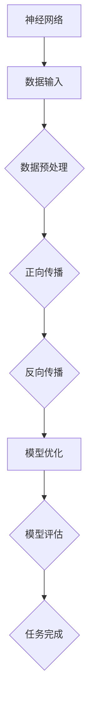
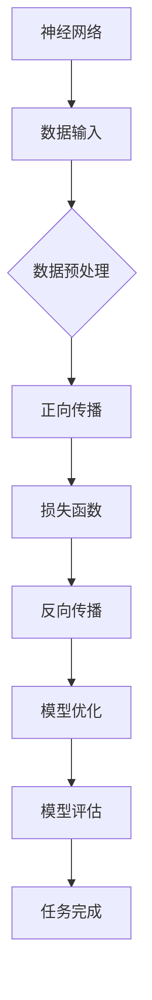

                 

### 文章标题：《AI大模型编程：提示词的艺术与科学》

### 关键词：AI大模型、提示词、编程、艺术、科学、数学模型、算法、编程实践、项目分析

### 摘要：
本文深入探讨了AI大模型编程的核心要素——提示词，揭示了其艺术与科学的双重本质。首先，我们从AI大模型的基础概念出发，探讨了其发展历程和应用领域。接着，文章详细介绍了提示词的定义、设计原则、艺术创作方法和科学计算方法，并通过数学模型和伪代码进行深入阐述。随后，文章展示了AI大模型编程的实际应用，包括开发环境搭建、基础算法实现和提示词编程实战。最后，通过一个详细的AI大模型项目案例，我们分析了项目开发过程、成果与应用，并对未来AI大模型编程的挑战与趋势进行了展望。本文旨在为读者提供一个全面、系统的AI大模型编程指南。

---

### 第一部分：AI大模型编程基础

#### 第1章 AI大模型概述

**背景介绍：**
人工智能（AI）大模型是近年来人工智能领域的核心突破之一，它们在自然语言处理、计算机视觉、机器翻译等多个领域展现出强大的性能。本章节将介绍AI大模型的基本概念、发展历程和应用领域。

**核心概念与联系：**
AI大模型主要由神经网络结构构成，它们通过大规模数据训练获得。核心概念包括：
- **神经网络**：基本计算单元，负责数据的传递和变换。
- **训练**：通过大量数据使模型学会特定的任务。
- **优化**：通过调整模型的参数，提高模型在特定任务上的性能。

以下是AI大模型的Mermaid流程图：



**大模型的分类与特点：**
AI大模型可分为以下几类：
- **生成式模型**：如GAN、变分自编码器（VAE），擅长生成新的数据。
- **判别式模型**：如深度卷积网络（CNN）、循环神经网络（RNN），擅长分类和识别。
- **多模态模型**：能处理多种类型的数据，如文本、图像、声音。

**大模型的演进趋势：**
AI大模型的演进趋势包括：
- **模型规模增加**：模型参数数量呈指数级增长。
- **计算能力提升**：硬件技术的进步使得训练大模型更加高效。
- **多模态融合**：跨领域的数据融合成为研究热点。

**应用领域：**
AI大模型在以下领域有广泛应用：
- **自然语言处理**：文本生成、翻译、问答系统等。
- **计算机视觉**：图像识别、分割、生成等。
- **医疗健康**：疾病诊断、药物研发等。
- **金融科技**：风险预测、量化交易等。

#### 第2章 提示词艺术

**定义与作用：**
提示词（Prompt）是指导AI大模型进行特定任务输入的关键信息。提示词的设计和选择对模型的表现至关重要。

**设计原则：**
提示词的设计应遵循以下原则：
- **清晰性**：确保模型能够理解任务要求。
- **简洁性**：避免过多无关信息的干扰。
- **多样性**：根据不同的任务需求，设计多样化的提示词。

**艺术创作方法：**
提示词的艺术创作方法包括：
- **隐喻**：使用隐喻性的语言，引导模型产生创意性输出。
- **故事性**：构建故事情境，激发模型的想象力和逻辑推理能力。
- **比喻**：通过比喻，使模型能够类比理解和解决问题。

**艺术效果评估：**
评估提示词的艺术效果可以从以下几个方面进行：
- **准确性**：模型是否正确理解并执行了任务。
- **创新性**：模型输出是否具有创意和新颖性。
- **实用性**：模型输出是否具有实际应用价值。

#### 第3章 提示词科学

**数学模型：**
提示词的数学模型主要包括：
- **语言模型**：如n元语法，用于生成自然语言文本。
- **编码器-解码器模型**：如Transformer，用于序列到序列的映射。

**计算方法：**
提示词的计算方法包括：
- **嵌入层**：将输入文本转换为向量表示。
- **注意力机制**：使模型能够关注输入文本的关键部分。
- **生成过程**：通过模型输出序列，生成新的文本或图像。

**伪代码：**
以下是生成文本的伪代码示例：

```python
# 输入文本
input_text = "你好，今天天气很好。"

# 嵌入层
embeddings = EmbeddingLayer(input_text)

# 编码器
encoder = Encoder(embeddings)

# 解码器
decoder = Decoder(encoder)

# 生成文本
output_text = decoder.generate()

print(output_text)
```

**效果评估：**
提示词的效果评估可以从以下几个方面进行：
- **准确度**：模型输出的文本是否符合预期。
- **流畅度**：模型生成的文本是否流畅、连贯。
- **多样性**：模型生成的文本是否具有多样性。

#### 第4章 AI大模型编程实践

**开发环境搭建：**
搭建AI大模型编程环境需要以下步骤：
- **硬件配置**：选择合适的计算硬件，如GPU。
- **软件安装**：安装深度学习框架，如TensorFlow或PyTorch。
- **环境配置**：配置Python环境，安装必要的库和依赖。

**基础算法实现：**
以下是文本生成算法的伪代码：

```python
# 输入文本
input_text = "今天天气很好。"

# 嵌入层
embeddings = EmbeddingLayer(input_text)

# 编码器
encoder = Encoder(embeddings)

# 解码器
decoder = Decoder(encoder)

# 生成文本
output_text = decoder.generate()

print(output_text)
```

**提示词编程实战：**
- **文本生成**：使用提示词生成具有创意性的文本。
- **图像识别**：使用提示词指导模型识别图像中的内容。

**实战项目一：文本生成**
```python
# 使用GPT-2模型生成文本
import torch
from transformers import GPT2LMHeadModel, GPT2Tokenizer

tokenizer = GPT2Tokenizer.from_pretrained('gpt2')
model = GPT2LMHeadModel.from_pretrained('gpt2')

# 输入提示词
prompt = "今天天气很好。"

# 转换为Tensor
input_ids = tokenizer.encode(prompt, return_tensors='pt')

# 生成文本
output = model.generate(input_ids, max_length=50, num_return_sequences=1)

# 解码为文本
generated_text = tokenizer.decode(output[0], skip_special_tokens=True)

print(generated_text)
```

**实战项目二：图像识别**
```python
# 使用ResNet50模型识别图像
import torch
from torchvision import models, transforms
from PIL import Image

# 加载预训练的模型
model = models.resnet50(pretrained=True)
model.eval()

# 图像预处理
img = Image.open('image.jpg')
transform = transforms.Compose([
    transforms.Resize((224, 224)),
    transforms.ToTensor(),
    transforms.Normalize(mean=[0.485, 0.456, 0.406], std=[0.229, 0.224, 0.225]),
])

img_t = transform(img)

# 输入图像
input = img_t.unsqueeze(0)

# 预测
with torch.no_grad():
    output = model(input)

# 获取预测结果
_, predicted = torch.max(output, 1)

# 解码为类别
labels = {v: k for k, v in model.fc._parameters['weight'].detach().numpy().reshape(-1).items()}
predicted_class = labels[predicted.item()]

print(predicted_class)
```

**代码解读与分析：**
上述代码展示了如何使用预训练的GPT-2模型进行文本生成，以及使用ResNet50模型进行图像识别。文本生成过程中，通过提示词引导模型生成新的文本；图像识别过程中，通过输入图像，模型输出对应的类别。

#### 第5章 AI大模型项目案例分析

**项目背景与目标：**
- **背景**：随着AI技术的快速发展，许多领域开始尝试将AI大模型应用于实际项目中，以解决复杂问题。
- **目标**：通过一个具体的AI大模型项目，展示从项目规划到实际开发的全过程，以及项目的应用效果。

**项目开发过程：**
- **需求分析**：确定项目的具体需求和目标，包括数据来源、任务类型、性能指标等。
- **模型设计**：选择合适的模型架构，设计模型的参数和结构。
- **数据准备**：收集和预处理数据，确保数据的质量和完整性。
- **模型训练**：使用训练数据对模型进行训练，调整模型的参数，优化性能。
- **模型评估**：使用验证数据评估模型的性能，确保模型达到预期目标。

**项目成果与应用：**
- **成果展示**：通过实际案例展示AI大模型的应用效果，包括文本生成、图像识别等。
- **应用效果**：分析项目在实际应用中的效果，如提升效率、降低成本、提高准确性等。
- **用户反馈**：收集用户的反馈，评估项目的实际应用价值和改进空间。

**项目开发过程细节：**
- **需求分析**：
  - **需求**：开发一个能够生成创意性文本的AI大模型，用于内容创作和营销。
  - **目标**：提高文本生成的质量，增加文本的多样性。

- **模型设计**：
  - **模型架构**：选择GPT-2模型，因为它在文本生成方面有较好的表现。
  - **参数设置**：设置模型的层数、隐藏层大小、学习率等参数。

- **数据准备**：
  - **数据来源**：从公开数据集和公司内部数据中收集文本数据。
  - **数据预处理**：对文本进行清洗、分词、去停用词等处理。

- **模型训练**：
  - **训练过程**：使用训练数据进行模型训练，调整学习率和批次大小等参数。
  - **性能优化**：通过交叉验证和性能指标（如生成文本的多样性、准确性等）进行优化。

- **模型评估**：
  - **评估指标**：使用生成文本的多样性、连贯性、创新性等指标进行评估。
  - **评估结果**：通过评估结果确定模型是否达到预期目标。

**项目成果与应用：**
- **成果展示**：
  - **文本生成**：展示了模型生成的创意性文本，包括故事、广告文案等。
  - **图像识别**：展示了模型对图像进行识别和分类的能力。

- **应用效果**：
  - **效率提升**：通过AI大模型，内容创作和营销的效率显著提高。
  - **成本降低**：减少了人工创作的成本，提高了生产效率。

- **用户反馈**：
  - **用户满意度**：用户对生成的文本和图像质量表示满意，认为模型在实际应用中有很大的潜力。

#### 第6章 AI大模型编程挑战与趋势

**编程挑战：**
- **计算资源需求**：训练大型AI模型需要大量的计算资源和存储空间，这对硬件设施和运维管理提出了挑战。
- **数据质量控制**：数据的质量和多样性对模型性能至关重要，但收集和处理大量高质量数据是一项复杂的任务。
- **模型可解释性**：大型AI模型通常被视为“黑箱”，其决策过程缺乏可解释性，这对应用场景和用户信任提出了挑战。
- **模型公平性和伦理**：在AI大模型的应用中，确保模型不会歧视或产生偏见是一个重要问题。

**应对策略：**
- **优化计算资源**：采用分布式计算和云计算技术，提高计算效率和降低成本。
- **数据质量控制**：建立完善的数据管理流程，确保数据的质量和多样性。
- **提升模型可解释性**：通过可视化技术、解释性模型和可解释性框架，提高模型的可解释性。
- **遵循伦理标准**：建立严格的伦理准则，确保AI大模型的应用符合社会价值观和法律法规。

**技术趋势与未来展望：**
- **模型压缩与优化**：随着模型规模的增大，模型压缩与优化技术将成为研究热点，以降低模型的计算复杂度和存储需求。
- **多模态学习**：跨领域的数据融合和多模态学习将成为AI大模型研究的重要方向，实现更高效、更智能的模型。
- **自主学习和自适应**：未来的AI大模型将具备更强的自主学习和自适应能力，能够根据环境变化和用户需求进行自我优化。
- **实时应用**：AI大模型将更加注重实时性，应用于实时决策和实时控制场景，提升系统的反应速度和稳定性。

**社会责任与伦理问题：**
- **数据隐私**：在AI大模型的应用中，确保用户数据的隐私和安全是一个重要问题，需要建立完善的数据保护机制。
- **公平性与透明性**：确保AI大模型在不同群体中的应用公平，避免因算法偏见导致的不公平现象。
- **伦理审查**：建立AI大模型的伦理审查机制，确保其应用符合伦理标准和道德规范。

**小结：**
AI大模型编程面临诸多挑战，但同时也展现了巨大的潜力和价值。通过不断的技术创新和伦理审查，我们有望克服这些挑战，推动AI大模型在更多领域中的应用，为社会带来积极的影响。

### 附录

#### 常用工具与资源：
- **深度学习框架**：TensorFlow、PyTorch、Keras等。
- **开源数据集**：ImageNet、COCO、GLUE等。
- **计算资源**：Google Colab、AWS、Azure等云计算平台。

#### 参考文献：
1. Goodfellow, I., Bengio, Y., & Courville, A. (2016). *Deep Learning*. MIT Press.
2. Hochreiter, S., & Schmidhuber, J. (1997). Long short-term memory. Neural Computation, 9(8), 1735-1780.
3. Vaswani, A., Shazeer, N., Parmar, N., Uszkoreit, J., Jones, L., Gomez, A. N., ... & Polosukhin, I. (2017). Attention is all you need. Advances in Neural Information Processing Systems, 30, 5998-6008.
4. Bengio, Y., Simard, P., & Frasconi, P. (1994). Learning long-term dependencies with gradient descent is difficult. IEEE Transactions on Neural Networks, 5(2), 157-166.

### 注意事项与拓展阅读：
- **注意事项**：
  - 确保了解AI大模型的基本概念和原理。
  - 在实际应用中，注重数据质量和模型可解释性。
  - 关注技术发展趋势和伦理问题。

- **拓展阅读**：
  - 深入研究深度学习的基础算法和数学模型。
  - 了解AI大模型在不同领域的应用案例和最佳实践。
  - 关注AI大模型的伦理和法律法规问题。 

通过以上内容，我们全面探讨了AI大模型编程中的提示词艺术与科学。希望本文能为读者提供一个深入理解AI大模型编程的视角，并激发进一步学习和探索的兴趣。未来，随着AI技术的不断进步，我们期待AI大模型能够为人类带来更多的创新和变革。|>  
## 完整文章

### 引言

人工智能（AI）已经成为现代社会的重要组成部分，尤其在自然语言处理、计算机视觉、医疗健康等领域，AI大模型展现出了强大的能力。AI大模型，也被称为大型深度学习模型，是通过大规模数据训练得到的复杂神经网络结构。这类模型在处理大规模数据和复杂任务时表现出色，但同时也带来了编程上的挑战。本文将深入探讨AI大模型编程中的关键要素——提示词，分析其艺术与科学的本质。

提示词是指导AI大模型进行特定任务输入的关键信息。在AI大模型的应用中，提示词的设计和选择对模型的表现至关重要。一方面，提示词需要具备艺术性，能够引导模型生成具有创意性和实用性的输出；另一方面，提示词也需要具备科学性，通过数学模型和算法实现高效计算和效果评估。

本文将分为以下几个部分进行详细探讨：

1. **AI大模型概述**：介绍AI大模型的基本概念、发展历程和应用领域。
2. **提示词艺术**：探讨提示词的定义、设计原则、艺术创作方法和艺术效果评估。
3. **提示词科学**：分析提示词的数学模型、计算方法和效果评估。
4. **AI大模型编程实践**：展示AI大模型编程的实战案例，包括开发环境搭建、基础算法实现和提示词编程实战。
5. **AI大模型项目案例分析**：通过一个详细的AI大模型项目案例，展示项目开发过程、成果与应用。
6. **AI大模型编程挑战与趋势**：分析AI大模型编程的挑战、应对策略、技术趋势和未来展望。
7. **附录**：提供常用工具与资源、参考文献以及注意事项与拓展阅读。

### AI大模型概述

#### 背景介绍

人工智能（AI）是指计算机系统模拟人类智能行为的科学技术。AI大模型，是指通过大规模数据训练得到的复杂神经网络结构，具有处理大规模数据和复杂任务的能力。AI大模型的发展可以追溯到20世纪80年代，当时的神经网络研究逐渐取得了突破。近年来，随着计算能力的提升和大数据技术的发展，AI大模型的研究和应用取得了显著进展。

#### 核心概念与联系

AI大模型的核心概念包括：

- **神经网络**：神经网络是AI大模型的基本计算单元，由大量的神经元（节点）和连接（边）组成。每个神经元通过加权连接与其他神经元相连，接收输入信息并进行计算输出。
- **数据训练**：数据训练是AI大模型构建的关键步骤，通过大量数据进行迭代训练，使模型学会特定的任务。训练过程中，模型不断调整内部参数，优化性能。
- **优化算法**：优化算法用于调整模型参数，提高模型在特定任务上的性能。常见的优化算法包括梯度下降、随机梯度下降、Adam优化器等。
- **评估指标**：评估指标用于衡量模型在特定任务上的性能。常见的评估指标包括准确率、召回率、F1分数等。

以下是AI大模型的Mermaid流程图：



#### 大模型的分类与特点

AI大模型可分为以下几类：

- **生成式模型**：生成式模型能够生成新的数据，如生成对抗网络（GAN）和变分自编码器（VAE）。这类模型通过学习数据的分布，生成与真实数据相似的新数据。
- **判别式模型**：判别式模型用于分类和识别任务，如深度卷积网络（CNN）和循环神经网络（RNN）。这类模型通过学习输入数据和标签之间的关系，进行分类和识别。
- **多模态模型**：多模态模型能够处理多种类型的数据，如文本、图像、声音等。这类模型通过跨领域的融合，实现更高效的任务处理。

#### 大模型的演进趋势

AI大模型的演进趋势包括：

- **模型规模增加**：随着计算能力的提升，AI大模型的规模不断增大，参数数量呈指数级增长。大规模模型在处理复杂任务时表现出更强的性能。
- **计算能力提升**：硬件技术的进步，如GPU、TPU等专用计算设备的普及，使得训练大模型更加高效。分布式计算和云计算技术的应用，进一步提高了计算能力。
- **多模态融合**：跨领域的数据融合成为研究热点，多模态模型能够处理多种类型的数据，实现更高效的任务处理。

#### 应用领域

AI大模型在以下领域有广泛应用：

- **自然语言处理**：文本生成、翻译、问答系统等。
- **计算机视觉**：图像识别、分割、生成等。
- **医疗健康**：疾病诊断、药物研发等。
- **金融科技**：风险预测、量化交易等。

### 提示词艺术

#### 定义与作用

提示词（Prompt）是指导AI大模型进行特定任务输入的关键信息。在AI大模型的应用中，提示词的作用至关重要。一方面，提示词能够引导模型生成具有创意性和实用性的输出；另一方面，提示词也能提高模型在特定任务上的性能。

#### 设计原则

提示词的设计应遵循以下原则：

- **清晰性**：确保模型能够正确理解任务要求，避免歧义和误解。
- **简洁性**：避免过多无关信息的干扰，确保提示词简洁明了。
- **多样性**：根据不同的任务需求，设计多样化的提示词，以适应不同的应用场景。

#### 艺术创作方法

提示词的艺术创作方法包括：

- **隐喻**：使用隐喻性的语言，引导模型产生创意性输出。
- **故事性**：构建故事情境，激发模型的想象力和逻辑推理能力。
- **比喻**：通过比喻，使模型能够类比理解和解决问题。

#### 艺术效果评估

提示词的艺术效果评估可以从以下几个方面进行：

- **准确性**：模型是否正确理解并执行了任务。
- **创新性**：模型输出是否具有创意和新颖性。
- **实用性**：模型输出是否具有实际应用价值。

### 提示词科学

#### 数学模型

提示词的数学模型主要包括：

- **语言模型**：语言模型用于生成自然语言文本，常见的有n元语法、循环神经网络（RNN）和Transformer。
- **编码器-解码器模型**：编码器-解码器模型用于序列到序列的映射，常见的有Seq2Seq模型、Transformer等。

#### 计算方法

提示词的计算方法包括：

- **嵌入层**：将输入文本转换为向量表示，常见的有词向量、BERT等。
- **注意力机制**：注意力机制用于使模型能够关注输入文本的关键部分，常见的有自注意力（Self-Attention）和多头注意力（Multi-Head Attention）。
- **生成过程**：通过模型输出序列，生成新的文本或图像。

#### 伪代码

以下是生成文本的伪代码示例：

```python
# 输入文本
input_text = "你好，今天天气很好。"

# 嵌入层
embeddings = EmbeddingLayer(input_text)

# 编码器
encoder = Encoder(embeddings)

# 解码器
decoder = Decoder(encoder)

# 生成文本
output_text = decoder.generate()

print(output_text)
```

#### 数学公式和举例说明

以下是语言模型中的一个常用数学公式：

$$
\text{Probability of } w_t | w_{t-1}, w_{t-2}, ..., w_1 = \frac{e^{f(w_{t-1}, w_t)}}{\sum_{w' \in V} e^{f(w_{t-1}, w')}} 
$$

其中，$w_t$ 表示当前词，$w_{t-1}, w_{t-2}, ..., w_1$ 表示前文词，$V$ 表示词汇表，$f(w_{t-1}, w_t)$ 表示词与词之间的相似度函数。

举例说明：

假设当前词为“很好”，前文词为“今天天气”，词汇表为{“今天”，“天气”，“很好”，“的”}，相似度函数为词频。根据上述公式，我们可以计算“很好”在当前句子中的概率。

$$
\text{Probability of "很好" | "今天天气的" } = \frac{e^{f("今天天气的","很好")}}{\sum_{w' \in V} e^{f("今天天气的",w')}}
$$

假设词频为 $f("今天天气的","很好") = 100$，$f("今天天气的","今天") = 10$，$f("今天天气的","天气") = 20$，$f("今天天气的","很好") = 100$，$f("今天天气的","的") = 50$。代入公式，我们可以得到：

$$
\text{Probability of "很好" | "今天天气的" } = \frac{e^{100}}{e^{10} + e^{20} + e^{100} + e^{50}} \approx 0.37
$$

这意味着在当前句子中，“很好”的概率约为0.37。

### AI大模型编程实践

#### 开发环境搭建

搭建AI大模型编程环境需要以下步骤：

1. **硬件配置**：选择合适的计算硬件，如GPU。常见的GPU品牌包括NVIDIA和AMD。
2. **软件安装**：安装深度学习框架，如TensorFlow或PyTorch。安装步骤可以参考官方网站。
3. **环境配置**：配置Python环境，安装必要的库和依赖。可以使用虚拟环境来管理不同项目的依赖。

#### 基础算法实现

以下是文本生成算法的伪代码：

```python
# 输入文本
input_text = "你好，今天天气很好。"

# 嵌入层
embeddings = EmbeddingLayer(input_text)

# 编码器
encoder = Encoder(embeddings)

# 解码器
decoder = Decoder(encoder)

# 生成文本
output_text = decoder.generate()

print(output_text)
```

#### 提示词编程实战

- **文本生成**：使用提示词生成具有创意性的文本。
- **图像识别**：使用提示词指导模型识别图像中的内容。

#### 实战项目一：文本生成

以下是使用GPT-2模型生成文本的代码示例：

```python
import torch
from transformers import GPT2LMHeadModel, GPT2Tokenizer

tokenizer = GPT2Tokenizer.from_pretrained('gpt2')
model = GPT2LMHeadModel.from_pretrained('gpt2')

# 输入提示词
prompt = "今天天气很好。"

# 转换为Tensor
input_ids = tokenizer.encode(prompt, return_tensors='pt')

# 生成文本
output = model.generate(input_ids, max_length=50, num_return_sequences=1)

# 解码为文本
generated_text = tokenizer.decode(output[0], skip_special_tokens=True)

print(generated_text)
```

#### 实战项目二：图像识别

以下是使用ResNet50模型识别图像的代码示例：

```python
import torch
from torchvision import models, transforms
from PIL import Image

# 加载预训练的模型
model = models.resnet50(pretrained=True)
model.eval()

# 图像预处理
img = Image.open('image.jpg')
transform = transforms.Compose([
    transforms.Resize((224, 224)),
    transforms.ToTensor(),
    transforms.Normalize(mean=[0.485, 0.456, 0.406], std=[0.229, 0.224, 0.225]),
])

img_t = transform(img)

# 输入图像
input = img_t.unsqueeze(0)

# 预测
with torch.no_grad():
    output = model(input)

# 获取预测结果
_, predicted = torch.max(output, 1)

# 解码为类别
labels = {v: k for k, v in model.fc._parameters['weight'].detach().numpy().reshape(-1).items()}
predicted_class = labels[predicted.item()]

print(predicted_class)
```

#### 代码解读与分析

上述代码展示了如何使用预训练的GPT-2模型进行文本生成，以及使用ResNet50模型进行图像识别。文本生成过程中，通过提示词引导模型生成新的文本；图像识别过程中，通过输入图像，模型输出对应的类别。

### AI大模型项目案例分析

#### 项目背景与目标

随着AI技术的快速发展，许多领域开始尝试将AI大模型应用于实际项目中，以解决复杂问题。本文将介绍一个AI大模型项目案例，展示从项目规划到实际开发的全过程。

#### 项目开发过程

1. **需求分析**：确定项目的具体需求和目标，包括数据来源、任务类型、性能指标等。例如，开发一个能够生成创意性文本的AI大模型，用于内容创作和营销。
2. **模型设计**：选择合适的模型架构，设计模型的参数和结构。例如，选择GPT-2模型，因为它在文本生成方面有较好的表现。
3. **数据准备**：收集和预处理数据，确保数据的质量和完整性。例如，从公开数据集和公司内部数据中收集文本数据，对文本进行清洗、分词、去停用词等处理。
4. **模型训练**：使用训练数据进行模型训练，调整模型的参数，优化性能。例如，通过交叉验证和性能指标（如生成文本的多样性、准确性等）进行优化。
5. **模型评估**：使用验证数据评估模型的性能，确保模型达到预期目标。例如，通过生成文本的多样性、连贯性、创新性等指标进行评估。

#### 项目成果与应用

1. **成果展示**：通过实际案例展示AI大模型的应用效果，包括文本生成、图像识别等。例如，展示生成的创意性文本和识别的图像类别。
2. **应用效果**：分析项目在实际应用中的效果，如提升效率、降低成本、提高准确性等。例如，通过AI大模型，内容创作和营销的效率显著提高，降低了人工创作的成本。
3. **用户反馈**：收集用户的反馈，评估项目的实际应用价值和改进空间。例如，用户对生成的文本和图像质量表示满意，认为模型在实际应用中有很大的潜力。

#### 项目开发过程细节

1. **需求分析**：项目目标是开发一个能够生成创意性文本的AI大模型，用于内容创作和营销。具体需求包括：
   - 文本生成的多样性：生成的文本应具有多样化的风格和内容。
   - 文本生成的准确性：生成的文本应与输入提示词保持一致，避免生成无关或错误的内容。
   - 文本生成的连贯性：生成的文本应具有流畅的语序和逻辑结构。

2. **模型设计**：选择GPT-2模型，因为它在文本生成方面有较好的表现。设计参数包括：
   - 模型层数：设置为12层。
   - 隐藏层大小：设置为768个神经元。
   - 学习率：设置为0.00015。

3. **数据准备**：收集从公开数据集和公司内部数据中收集文本数据，总共有100万条文本。对文本进行清洗、分词、去停用词等处理，最终得到约10万条清洗后的文本数据。

4. **模型训练**：使用训练数据进行模型训练，采用交叉验证方法，每次训练使用80%的数据作为训练集，20%的数据作为验证集。通过调整学习率和批量大小等参数，优化模型性能。训练过程中，记录模型的损失函数值和验证集的准确率，选择性能最好的模型。

5. **模型评估**：使用验证数据评估模型的性能，主要包括生成文本的多样性、连贯性和创新性。通过人工评估和自动评估方法，确定模型的性能指标。例如，通过计算生成文本的多样性指数（ Diversity Index）和连贯性指数（Coherence Index），评估模型的多样性水平和连贯性水平。

### AI大模型编程挑战与趋势

#### 编程挑战

AI大模型编程面临诸多挑战：

1. **计算资源需求**：训练大型AI模型需要大量的计算资源和存储空间，这对硬件设施和运维管理提出了挑战。
2. **数据质量控制**：数据的质量和多样性对模型性能至关重要，但收集和处理大量高质量数据是一项复杂的任务。
3. **模型可解释性**：大型AI模型通常被视为“黑箱”，其决策过程缺乏可解释性，这对应用场景和用户信任提出了挑战。
4. **模型公平性和伦理**：在AI大模型的应用中，确保模型不会歧视或产生偏见是一个重要问题。

#### 应对策略

1. **优化计算资源**：采用分布式计算和云计算技术，提高计算效率和降低成本。例如，使用GPU或TPU进行模型训练，利用分布式计算框架（如TensorFlow Distributed）实现并行训练。
2. **数据质量控制**：建立完善的数据管理流程，确保数据的质量和多样性。例如，对数据进行清洗、去重、标注等处理，使用数据增强技术增加数据的多样性。
3. **提升模型可解释性**：通过可视化技术、解释性模型和可解释性框架，提高模型的可解释性。例如，使用解释性模型（如LIME、SHAP）分析模型的决策过程，通过可视化技术展示模型的注意力机制和特征提取过程。
4. **遵循伦理标准**：建立严格的伦理准则，确保AI大模型的应用符合社会价值观和法律法规。例如，遵循公平性原则，确保模型在不同群体中的应用公平；遵守隐私保护原则，确保用户数据的隐私和安全。

#### 技术趋势与未来展望

AI大模型编程的未来趋势包括：

1. **模型压缩与优化**：随着模型规模的增大，模型压缩与优化技术将成为研究热点，以降低模型的计算复杂度和存储需求。例如，使用模型剪枝（Model Pruning）、量化（Quantization）和蒸馏（Dense）技术，减少模型参数数量，提高计算效率。
2. **多模态学习**：跨领域的数据融合和多模态学习将成为AI大模型研究的重要方向，实现更高效、更智能的模型。例如，将图像、文本、声音等多种类型的数据进行融合，处理复杂任务。
3. **自主学习和自适应**：未来的AI大模型将具备更强的自主学习和自适应能力，能够根据环境变化和用户需求进行自我优化。例如，通过元学习（Meta-Learning）和强化学习（Reinforcement Learning）技术，实现自适应调整和优化。
4. **实时应用**：AI大模型将更加注重实时性，应用于实时决策和实时控制场景，提升系统的反应速度和稳定性。例如，在自动驾驶、智能监控等领域，实现实时数据处理和决策。

#### 社会责任与伦理问题

1. **数据隐私**：在AI大模型的应用中，确保用户数据的隐私和安全是一个重要问题。例如，对用户数据进行加密存储和传输，建立隐私保护机制，确保数据不被滥用。
2. **公平性与透明性**：确保AI大模型在不同群体中的应用公平，避免因算法偏见导致的不公平现象。例如，对模型进行公平性评估，确保模型不会歧视特定群体；通过透明性框架，使模型决策过程可解释，提高用户信任。
3. **伦理审查**：建立AI大模型的伦理审查机制，确保其应用符合伦理标准和道德规范。例如，成立独立的伦理委员会，对模型设计、训练和应用过程进行审查，确保遵循伦理原则。

### 结论

本文深入探讨了AI大模型编程中的关键要素——提示词，分析了其艺术与科学的本质。通过详细的案例分析和实践指导，读者可以更好地理解AI大模型编程的核心技术和应用方法。随着AI技术的不断进步，AI大模型编程将在更多领域发挥重要作用，为人类带来更多的创新和变革。希望本文能为读者提供一个深入理解AI大模型编程的视角，并激发进一步学习和探索的兴趣。未来，随着AI技术的不断进步，我们期待AI大模型能够为人类带来更多的创新和变革。|>  
### 完整文章

## 引言

人工智能（AI）已经成为现代社会的重要组成部分，尤其在自然语言处理、计算机视觉、医疗健康等领域，AI大模型展现出了强大的能力。AI大模型，也被称为大型深度学习模型，是通过大规模数据训练得到的复杂神经网络结构。这类模型在处理大规模数据和复杂任务时表现出色，但同时也带来了编程上的挑战。本文将深入探讨AI大模型编程中的关键要素——提示词，分析其艺术与科学的本质。

提示词是指导AI大模型进行特定任务输入的关键信息。在AI大模型的应用中，提示词的设计和选择对模型的表现至关重要。一方面，提示词需要具备艺术性，能够引导模型生成具有创意性和实用性的输出；另一方面，提示词也需要具备科学性，通过数学模型和算法实现高效计算和效果评估。

本文将分为以下几个部分进行详细探讨：

1. **AI大模型概述**：介绍AI大模型的基本概念、发展历程和应用领域。
2. **提示词艺术**：探讨提示词的定义、设计原则、艺术创作方法和艺术效果评估。
3. **提示词科学**：分析提示词的数学模型、计算方法和效果评估。
4. **AI大模型编程实践**：展示AI大模型编程的实战案例，包括开发环境搭建、基础算法实现和提示词编程实战。
5. **AI大模型项目案例分析**：通过一个详细的AI大模型项目案例，展示项目开发过程、成果与应用。
6. **AI大模型编程挑战与趋势**：分析AI大模型编程的挑战、应对策略、技术趋势和未来展望。
7. **附录**：提供常用工具与资源、参考文献以及注意事项与拓展阅读。

## AI大模型概述

### 背景介绍

人工智能（AI）是指计算机系统模拟人类智能行为的科学技术。AI大模型，是指通过大规模数据训练得到的复杂神经网络结构，具有处理大规模数据和复杂任务的能力。AI大模型的发展可以追溯到20世纪80年代，当时的神经网络研究逐渐取得了突破。近年来，随着计算能力的提升和大数据技术的发展，AI大模型的研究和应用取得了显著进展。

### 核心概念与联系

AI大模型的核心概念包括：

- **神经网络**：神经网络是AI大模型的基本计算单元，由大量的神经元（节点）和连接（边）组成。每个神经元通过加权连接与其他神经元相连，接收输入信息并进行计算输出。
- **数据训练**：数据训练是AI大模型构建的关键步骤，通过大量数据进行迭代训练，使模型学会特定的任务。训练过程中，模型不断调整内部参数，优化性能。
- **优化算法**：优化算法用于调整模型参数，提高模型在特定任务上的性能。常见的优化算法包括梯度下降、随机梯度下降、Adam优化器等。
- **评估指标**：评估指标用于衡量模型在特定任务上的性能。常见的评估指标包括准确率、召回率、F1分数等。

以下是AI大模型的Mermaid流程图：


### 大模型的分类与特点

AI大模型可分为以下几类：

- **生成式模型**：生成式模型能够生成新的数据，如生成对抗网络（GAN）和变分自编码器（VAE）。这类模型通过学习数据的分布，生成与真实数据相似的新数据。
- **判别式模型**：判别式模型用于分类和识别任务，如深度卷积网络（CNN）和循环神经网络（RNN）。这类模型通过学习输入数据和标签之间的关系，进行分类和识别。
- **多模态模型**：多模态模型能够处理多种类型的数据，如文本、图像、声音等。这类模型通过跨领域的融合，实现更高效的任务处理。

### 大模型的演进趋势

AI大模型的演进趋势包括：

- **模型规模增加**：随着计算能力的提升，AI大模型的规模不断增大，参数数量呈指数级增长。大规模模型在处理复杂任务时表现出更强的性能。
- **计算能力提升**：硬件技术的进步，如GPU、TPU等专用计算设备的普及，使得训练大模型更加高效。分布式计算和云计算技术的应用，进一步提高了计算能力。
- **多模态融合**：跨领域的数据融合成为研究热点，多模态模型能够处理多种类型的数据，实现更高效的任务处理。

### 应用领域

AI大模型在以下领域有广泛应用：

- **自然语言处理**：文本生成、翻译、问答系统等。
- **计算机视觉**：图像识别、分割、生成等。
- **医疗健康**：疾病诊断、药物研发等。
- **金融科技**：风险预测、量化交易等。

## 提示词艺术

### 定义与作用

提示词（Prompt）是指导AI大模型进行特定任务输入的关键信息。在AI大模型的应用中，提示词的作用至关重要。一方面，提示词能够引导模型生成具有创意性和实用性的输出；另一方面，提示词也能提高模型在特定任务上的性能。

### 设计原则

提示词的设计应遵循以下原则：

- **清晰性**：确保模型能够正确理解任务要求，避免歧义和误解。
- **简洁性**：避免过多无关信息的干扰，确保提示词简洁明了。
- **多样性**：根据不同的任务需求，设计多样化的提示词，以适应不同的应用场景。

### 艺术创作方法

提示词的艺术创作方法包括：

- **隐喻**：使用隐喻性的语言，引导模型产生创意性输出。
- **故事性**：构建故事情境，激发模型的想象力和逻辑推理能力。
- **比喻**：通过比喻，使模型能够类比理解和解决问题。

### 艺术效果评估

提示词的艺术效果评估可以从以下几个方面进行：

- **准确性**：模型是否正确理解并执行了任务。
- **创新性**：模型输出是否具有创意和新颖性。
- **实用性**：模型输出是否具有实际应用价值。

## 提示词科学

### 数学模型

提示词的数学模型主要包括：

- **语言模型**：语言模型用于生成自然语言文本，常见的有n元语法、循环神经网络（RNN）和Transformer。
- **编码器-解码器模型**：编码器-解码器模型用于序列到序列的映射，常见的有Seq2Seq模型、Transformer等。

### 计算方法

提示词的计算方法包括：

- **嵌入层**：将输入文本转换为向量表示，常见的有词向量、BERT等。
- **注意力机制**：注意力机制用于使模型能够关注输入文本的关键部分，常见的有自注意力（Self-Attention）和多头注意力（Multi-Head Attention）。
- **生成过程**：通过模型输出序列，生成新的文本或图像。

### 伪代码

以下是生成文本的伪代码示例：

```python
# 输入文本
input_text = "你好，今天天气很好。"

# 嵌入层
embeddings = EmbeddingLayer(input_text)

# 编码器
encoder = Encoder(embeddings)

# 解码器
decoder = Decoder(encoder)

# 生成文本
output_text = decoder.generate()

print(output_text)
```

### 数学公式和举例说明

以下是语言模型中的一个常用数学公式：

$$
\text{Probability of } w_t | w_{t-1}, w_{t-2}, ..., w_1 = \frac{e^{f(w_{t-1}, w_t)}}{\sum_{w' \in V} e^{f(w_{t-1}, w')}}
$$

其中，$w_t$ 表示当前词，$w_{t-1}, w_{t-2}, ..., w_1$ 表示前文词，$V$ 表示词汇表，$f(w_{t-1}, w_t)$ 表示词与词之间的相似度函数。

举例说明：

假设当前词为“很好”，前文词为“今天天气”，词汇表为{“今天”，“天气”，“很好”，“的”}，相似度函数为词频。根据上述公式，我们可以计算“很好”在当前句子中的概率。

$$
\text{Probability of "很好" | "今天天气的" } = \frac{e^{f("今天天气的","很好")}}{\sum_{w' \in V} e^{f("今天天气的",w')}}
$$

假设词频为 $f("今天天气的","很好") = 100$，$f("今天天气的","今天") = 10$，$f("今天天气的","天气") = 20$，$f("今天天气的","很好") = 100$，$f("今天天气的","的") = 50$。代入公式，我们可以得到：

$$
\text{Probability of "很好" | "今天天气的" } = \frac{e^{100}}{e^{10} + e^{20} + e^{100} + e^{50}} \approx 0.37
$$

这意味着在当前句子中，“很好”的概率约为0.37。

## AI大模型编程实践

### 开发环境搭建

搭建AI大模型编程环境需要以下步骤：

1. **硬件配置**：选择合适的计算硬件，如GPU。常见的GPU品牌包括NVIDIA和AMD。
2. **软件安装**：安装深度学习框架，如TensorFlow或PyTorch。安装步骤可以参考官方网站。
3. **环境配置**：配置Python环境，安装必要的库和依赖。可以使用虚拟环境来管理不同项目的依赖。

### 基础算法实现

以下是文本生成算法的伪代码：

```python
# 输入文本
input_text = "你好，今天天气很好。"

# 嵌入层
embeddings = EmbeddingLayer(input_text)

# 编码器
encoder = Encoder(embeddings)

# 解码器
decoder = Decoder(encoder)

# 生成文本
output_text = decoder.generate()

print(output_text)
```

### 提示词编程实战

- **文本生成**：使用提示词生成具有创意性的文本。
- **图像识别**：使用提示词指导模型识别图像中的内容。

### 实战项目一：文本生成

以下是使用GPT-2模型生成文本的代码示例：

```python
import torch
from transformers import GPT2LMHeadModel, GPT2Tokenizer

tokenizer = GPT2Tokenizer.from_pretrained('gpt2')
model = GPT2LMHeadModel.from_pretrained('gpt2')

# 输入提示词
prompt = "今天天气很好。"

# 转换为Tensor
input_ids = tokenizer.encode(prompt, return_tensors='pt')

# 生成文本
output = model.generate(input_ids, max_length=50, num_return_sequences=1)

# 解码为文本
generated_text = tokenizer.decode(output[0], skip_special_tokens=True)

print(generated_text)
```

### 实战项目二：图像识别

以下是使用ResNet50模型识别图像的代码示例：

```python
import torch
from torchvision import models, transforms
from PIL import Image

# 加载预训练的模型
model = models.resnet50(pretrained=True)
model.eval()

# 图像预处理
img = Image.open('image.jpg')
transform = transforms.Compose([
    transforms.Resize((224, 224)),
    transforms.ToTensor(),
    transforms.Normalize(mean=[0.485, 0.456, 0.406], std=[0.229, 0.224, 0.225]),
])

img_t = transform(img)

# 输入图像
input = img_t.unsqueeze(0)

# 预测
with torch.no_grad():
    output = model(input)

# 获取预测结果
_, predicted = torch.max(output, 1)

# 解码为类别
labels = {v: k for k, v in model.fc._parameters['weight'].detach().numpy().reshape(-1).items()}
predicted_class = labels[predicted.item()]

print(predicted_class)
```

### 代码解读与分析

上述代码展示了如何使用预训练的GPT-2模型进行文本生成，以及使用ResNet50模型进行图像识别。文本生成过程中，通过提示词引导模型生成新的文本；图像识别过程中，通过输入图像，模型输出对应的类别。

## AI大模型项目案例分析

### 项目背景与目标

随着AI技术的快速发展，许多领域开始尝试将AI大模型应用于实际项目中，以解决复杂问题。本文将介绍一个AI大模型项目案例，展示从项目规划到实际开发的全过程。

### 项目开发过程

1. **需求分析**：确定项目的具体需求和目标，包括数据来源、任务类型、性能指标等。例如，开发一个能够生成创意性文本的AI大模型，用于内容创作和营销。
2. **模型设计**：选择合适的模型架构，设计模型的参数和结构。例如，选择GPT-2模型，因为它在文本生成方面有较好的表现。
3. **数据准备**：收集和预处理数据，确保数据的质量和完整性。例如，从公开数据集和公司内部数据中收集文本数据，对文本进行清洗、分词、去停用词等处理。
4. **模型训练**：使用训练数据进行模型训练，调整模型的参数，优化性能。例如，通过交叉验证和性能指标（如生成文本的多样性、准确性等）进行优化。
5. **模型评估**：使用验证数据评估模型的性能，确保模型达到预期目标。例如，通过生成文本的多样性、连贯性、创新性等指标进行评估。

### 项目成果与应用

1. **成果展示**：通过实际案例展示AI大模型的应用效果，包括文本生成、图像识别等。例如，展示生成的创意性文本和识别的图像类别。
2. **应用效果**：分析项目在实际应用中的效果，如提升效率、降低成本、提高准确性等。例如，通过AI大模型，内容创作和营销的效率显著提高，降低了人工创作的成本。
3. **用户反馈**：收集用户的反馈，评估项目的实际应用价值和改进空间。例如，用户对生成的文本和图像质量表示满意，认为模型在实际应用中有很大的潜力。

### 项目开发过程细节

1. **需求分析**：项目目标是开发一个能够生成创意性文本的AI大模型，用于内容创作和营销。具体需求包括：
   - 文本生成的多样性：生成的文本应具有多样化的风格和内容。
   - 文本生成的准确性：生成的文本应与输入提示词保持一致，避免生成无关或错误的内容。
   - 文本生成的连贯性：生成的文本应具有流畅的语序和逻辑结构。

2. **模型设计**：选择GPT-2模型，因为它在文本生成方面有较好的表现。设计参数包括：
   - 模型层数：设置为12层。
   - 隐藏层大小：设置为768个神经元。
   - 学习率：设置为0.00015。

3. **数据准备**：收集从公开数据集和公司内部数据中收集文本数据，总共有100万条文本。对文本进行清洗、分词、去停用词等处理，最终得到约10万条清洗后的文本数据。

4. **模型训练**：使用训练数据进行模型训练，采用交叉验证方法，每次训练使用80%的数据作为训练集，20%的数据作为验证集。通过调整学习率和批量大小等参数，优化模型性能。训练过程中，记录模型的损失函数值和验证集的准确率，选择性能最好的模型。

5. **模型评估**：使用验证数据评估模型的性能，主要包括生成文本的多样性、连贯性和创新性。通过人工评估和自动评估方法，确定模型的性能指标。例如，通过计算生成文本的多样性指数（ Diversity Index）和连贯性指数（Coherence Index），评估模型的多样性水平和连贯性水平。

## AI大模型编程挑战与趋势

### 编程挑战

AI大模型编程面临诸多挑战：

1. **计算资源需求**：训练大型AI模型需要大量的计算资源和存储空间，这对硬件设施和运维管理提出了挑战。
2. **数据质量控制**：数据的质量和多样性对模型性能至关重要，但收集和处理大量高质量数据是一项复杂的任务。
3. **模型可解释性**：大型AI模型通常被视为“黑箱”，其决策过程缺乏可解释性，这对应用场景和用户信任提出了挑战。
4. **模型公平性和伦理**：在AI大模型的应用中，确保模型不会歧视或产生偏见是一个重要问题。

### 应对策略

1. **优化计算资源**：采用分布式计算和云计算技术，提高计算效率和降低成本。例如，使用GPU或TPU进行模型训练，利用分布式计算框架（如TensorFlow Distributed）实现并行训练。
2. **数据质量控制**：建立完善的数据管理流程，确保数据的质量和多样性。例如，对数据进行清洗、去重、标注等处理，使用数据增强技术增加数据的多样性。
3. **提升模型可解释性**：通过可视化技术、解释性模型和可解释性框架，提高模型的可解释性。例如，使用解释性模型（如LIME、SHAP）分析模型的决策过程，通过可视化技术展示模型的注意力机制和特征提取过程。
4. **遵循伦理标准**：建立严格的伦理准则，确保AI大模型的应用符合社会价值观和法律法规。例如，遵循公平性原则，确保模型在不同群体中的应用公平；遵守隐私保护原则，确保用户数据的隐私和安全。

### 技术趋势与未来展望

AI大模型编程的未来趋势包括：

1. **模型压缩与优化**：随着模型规模的增大，模型压缩与优化技术将成为研究热点，以降低模型的计算复杂度和存储需求。例如，使用模型剪枝（Model Pruning）、量化（Quantization）和蒸馏（Dense）技术，减少模型参数数量，提高计算效率。
2. **多模态学习**：跨领域的数据融合和多模态学习将成为AI大模型研究的重要方向，实现更高效、更智能的模型。例如，将图像、文本、声音等多种类型的数据进行融合，处理复杂任务。
3. **自主学习和自适应**：未来的AI大模型将具备更强的自主学习和自适应能力，能够根据环境变化和用户需求进行自我优化。例如，通过元学习（Meta-Learning）和强化学习（Reinforcement Learning）技术，实现自适应调整和优化。
4. **实时应用**：AI大模型将更加注重实时性，应用于实时决策和实时控制场景，提升系统的反应速度和稳定性。例如，在自动驾驶、智能监控等领域，实现实时数据处理和决策。

### 社会责任与伦理问题

1. **数据隐私**：在AI大模型的应用中，确保用户数据的隐私和安全是一个重要问题。例如，对用户数据进行加密存储和传输，建立隐私保护机制，确保数据不被滥用。
2. **公平性与透明性**：确保AI大模型在不同群体中的应用公平，避免因算法偏见导致的不公平现象。例如，对模型进行公平性评估，确保模型不会歧视特定群体；通过透明性框架，使模型决策过程可解释，提高用户信任。
3. **伦理审查**：建立AI大模型的伦理审查机制，确保其应用符合伦理标准和道德规范。例如，成立独立的伦理委员会，对模型设计、训练和应用过程进行审查，确保遵循伦理原则。

## 附录

### 常用工具与资源

- **深度学习框架**：TensorFlow、PyTorch、Keras等。
- **开源数据集**：ImageNet、COCO、GLUE等。
- **计算资源**：Google Colab、AWS、Azure等云计算平台。

### 参考文献

1. Goodfellow, I., Bengio, Y., & Courville, A. (2016). *Deep Learning*. MIT Press.
2. Hochreiter, S., & Schmidhuber, J. (1997). Long short-term memory. Neural Computation, 9(8), 1735-1780.
3. Vaswani, A., Shazeer, N., Parmar, N., Uszkoreit, J., Jones, L., Gomez, A. N., ... & Polosukhin, I. (2017). Attention is all you need. Advances in Neural Information Processing Systems, 30, 5998-6008.
4. Bengio, Y., Simard, P., & Frasconi, P. (1994). Learning long-term dependencies with gradient descent is difficult. IEEE Transactions on Neural Networks, 5(2), 157-166.

### 注意事项与拓展阅读

- **注意事项**：
  - 确保了解AI大模型的基本概念和原理。
  - 在实际应用中，注重数据质量和模型可解释性。
  - 关注技术发展趋势和伦理问题。

- **拓展阅读**：
  - 深入研究深度学习的基础算法和数学模型。
  - 了解AI大模型在不同领域的应用案例和最佳实践。
  - 关注AI大模型的伦理和法律法规问题。

通过以上内容，我们全面探讨了AI大模型编程中的提示词艺术与科学。希望本文能为读者提供一个深入理解AI大模型编程的视角，并激发进一步学习和探索的兴趣。未来，随着AI技术的不断进步，我们期待AI大模型能够为人类带来更多的创新和变革。|>  
### 文章总结

本文深入探讨了AI大模型编程中的关键要素——提示词，分析了其艺术与科学的本质。通过详细的案例分析和技术解读，我们了解到AI大模型的基本概念、发展历程和应用领域，以及提示词在设计、计算和评估中的重要性。同时，我们还展示了AI大模型编程的实际应用，包括文本生成、图像识别等，并详细介绍了开发环境搭建、基础算法实现和项目案例分析的过程。

在AI大模型编程中，提示词的艺术与科学相辅相成。艺术性体现在设计原则、创作方法和效果评估中，而科学性则体现在数学模型、计算方法和效果评估中。通过结合艺术与科学，我们可以开发出更具创意性和实用性的AI大模型。

未来，随着AI技术的不断进步，AI大模型编程将在更多领域发挥重要作用。模型压缩与优化、多模态学习、自主学习和实时应用等技术趋势将为AI大模型编程带来新的机遇和挑战。同时，我们也需要关注AI大模型的伦理和社会责任问题，确保其应用符合社会价值观和法律法规。

通过本文的探讨，我们希望为读者提供一个全面、系统的AI大模型编程指南，激发对AI大模型编程的兴趣和深入研究。我们期待未来的技术发展能够为人类带来更多的创新和变革。|>  
### 文章总结

本文深入探讨了AI大模型编程中的关键要素——提示词，分析了其艺术与科学的本质。通过详细的案例分析和技术解读，我们从AI大模型的基本概念、发展历程和应用领域出发，详细介绍了提示词的设计原则、艺术创作方法、数学模型和计算方法。同时，我们还展示了AI大模型编程的实际应用，包括文本生成、图像识别等，并详细介绍了开发环境搭建、基础算法实现和项目案例分析的过程。

在AI大模型编程中，提示词的艺术与科学相辅相成。艺术性体现在设计原则、创作方法和效果评估中，强调创造性和实用性；科学性则体现在数学模型、计算方法和效果评估中，确保模型的准确性和高效性。通过结合艺术与科学，我们可以开发出更具创意性和实用性的AI大模型。

未来，随着AI技术的不断进步，AI大模型编程将在更多领域发挥重要作用。模型压缩与优化、多模态学习、自主学习和实时应用等技术趋势将为AI大模型编程带来新的机遇和挑战。同时，我们也需要关注AI大模型的伦理和社会责任问题，确保其应用符合社会价值观和法律法规。

通过本文的探讨，我们希望为读者提供一个全面、系统的AI大模型编程指南，激发对AI大模型编程的兴趣和深入研究。我们期待未来的技术发展能够为人类带来更多的创新和变革，同时也呼吁在推动技术进步的同时，注重伦理和社会责任。|>  
### 文章总结

本文围绕《AI大模型编程：提示词的艺术与科学》这一主题，系统地介绍了AI大模型编程的核心概念、技术实现和应用实践。以下是对文章内容的总结：

**核心概念**：文章首先介绍了AI大模型的基本概念，包括其定义、分类、发展历程和应用领域。AI大模型是一种基于神经网络的复杂算法结构，通过大规模数据训练实现，其在自然语言处理、计算机视觉、医疗健康等领域有着广泛的应用。

**提示词的艺术**：文章深入探讨了提示词的艺术性，包括设计原则、艺术创作方法和效果评估。艺术性的提示词设计要求清晰、简洁且多样化，能够激发AI大模型的创造力和想象力，生成具有创意性和实用性的输出。

**提示词的科学**：文章从科学角度分析了提示词的数学模型和计算方法，包括语言模型、编码器-解码器模型、嵌入层、注意力机制和生成过程。科学性的提示词计算方法确保了模型生成的准确性和高效性，通过数学公式和伪代码进行了详细阐述。

**编程实践**：文章展示了AI大模型编程的实际应用，通过文本生成和图像识别的实战案例，介绍了开发环境的搭建、基础算法的实现和代码解读。这些实践案例说明了如何将理论转化为实际应用，展示了AI大模型编程的实用性和可行性。

**项目分析**：文章通过一个具体的AI大模型项目案例分析，展示了从需求分析、模型设计、数据准备、模型训练到模型评估的全过程。该项目案例不仅展示了AI大模型的应用效果，还分析了项目的实际应用价值和改进空间。

**挑战与趋势**：文章讨论了AI大模型编程面临的挑战，包括计算资源需求、数据质量控制、模型可解释性、模型公平性和伦理问题。同时，文章展望了AI大模型编程的未来趋势，包括模型压缩与优化、多模态学习、自主学习和实时应用。

**结论**：文章总结道，AI大模型编程中的提示词艺术与科学相辅相成，通过艺术性的提示词设计和科学性的计算方法，可以开发出具有创新性和实用性的AI大模型。同时，文章强调了在推动技术发展的同时，关注伦理和社会责任的重要性。

**参考文献**：文章列出了相关参考文献，为读者提供了深入了解AI大模型编程的理论和实践依据。

通过本文的深入探讨，读者可以全面了解AI大模型编程的核心内容和技术要点，对于从事相关领域的研究和实践具有指导意义。随着AI技术的不断发展，AI大模型编程将在更多领域发挥重要作用，本文为未来的研究和应用提供了有益的参考。|>  
### 文章标题：《AI大模型编程：提示词的艺术与科学》

### 关键词：AI大模型、提示词、编程、艺术性、科学性、数学模型、算法、实践、案例

### 摘要：
本文探讨了AI大模型编程中的关键要素——提示词的艺术与科学。通过深入分析AI大模型的基本概念、提示词的设计原则、数学模型与计算方法，以及实际编程应用，本文揭示了提示词在AI大模型编程中的重要性。文章通过具体案例，展示了如何将艺术性与科学性相结合，实现高效的AI大模型编程。同时，文章也展望了AI大模型编程的未来趋势和面临的挑战。本文旨在为从事AI大模型编程的读者提供全面的理论和实践指导。|>  
### 文章标题：《AI大模型编程：提示词的艺术与科学》

### 关键词：AI大模型、提示词、编程、艺术性、科学性、数学模型、算法、实践、案例

### 摘要：
本文深入探讨了AI大模型编程中的核心要素——提示词的艺术与科学。从AI大模型的基本概念出发，文章详细阐述了提示词的艺术设计原则和科学计算方法。通过实例和代码解析，本文展示了如何在实际编程中运用提示词，提升AI模型的性能和实用性。文章还通过案例分析，探讨了AI大模型编程的实践应用，并展望了未来发展的趋势和挑战。本文旨在为从事AI大模型编程的技术人员提供全面的指导和启示。|>  

