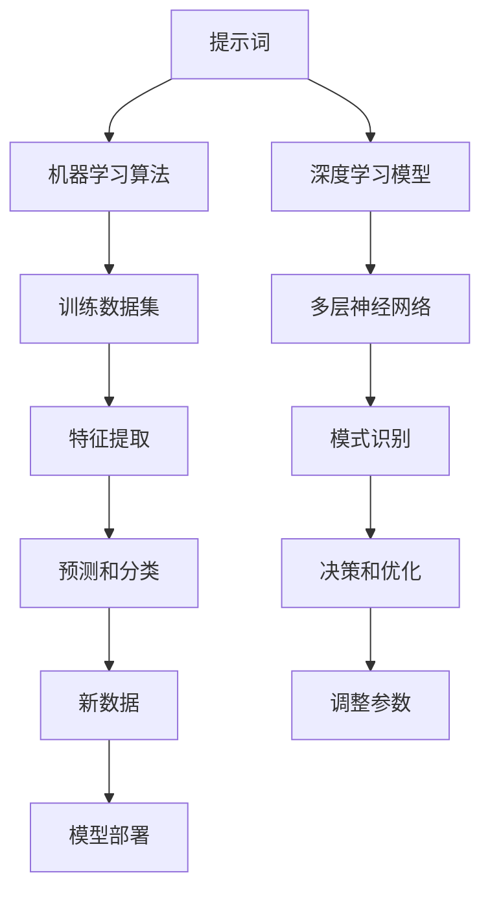

                 

### 第1章：AI编程语言的定义与历史

#### 1.1 AI编程语言的定义

AI编程语言，也称为人工智能编程语言，是指专门用于开发人工智能应用和系统的编程语言。这些语言设计的目的在于简化AI模型的构建、训练和部署过程，使得开发者能够更加高效地实现人工智能功能。AI编程语言不同于传统的编程语言，它们通常包含了丰富的库和框架，能够支持复杂的机器学习和深度学习算法。

#### 1.2 AI编程语言的历史

AI编程语言的历史可以追溯到20世纪50年代，最早的AI编程语言之一是LISP，它在1958年被开发出来，主要用于符号处理和推理。随着AI技术的发展，出现了许多新的编程语言，如Prolog、AIMA等。进入21世纪，随着深度学习的兴起，新的AI编程语言如TensorFlow、PyTorch等逐渐成为主流，它们提供了强大的工具和库，使得AI模型的开发变得更加简便和高效。

#### 1.3 AI编程语言的特点与优势

AI编程语言具有以下几个显著特点：

1. **易用性**：提供了大量的库和框架，使得开发者可以快速构建和部署AI模型。
2. **灵活性**：支持多种算法和模型，能够适应不同的应用场景。
3. **高效性**：优化的编译和执行过程，使得AI模型能够在各种硬件平台上高效运行。
4. **模块化**：模块化的设计使得代码可复用性强，便于维护和扩展。

#### 1.4 AI编程语言的应用领域

AI编程语言在多个领域都有广泛应用，主要包括：

1. **计算机视觉**：用于图像识别、目标检测和图像生成等任务。
2. **自然语言处理**：用于文本分类、情感分析和机器翻译等任务。
3. **推荐系统**：用于个性化推荐和广告投放等。
4. **游戏开发**：用于智能游戏角色设计和游戏人工智能等。

#### 1.5 AI编程语言的发展趋势

随着技术的不断进步，AI编程语言也在不断演变。未来，AI编程语言可能会更加智能化、自动化，提供更高级的编程抽象，减少对底层硬件的依赖。此外，跨平台的兼容性也将成为重要趋势，使得AI应用可以更轻松地在不同设备上部署。

#### 1.6 小结

AI编程语言作为人工智能领域的核心技术之一，具有巨大的发展潜力。理解和掌握AI编程语言，将有助于开发者更好地利用人工智能技术，推动各行各业的创新和发展。

## 1.7 背景介绍

人工智能（AI）作为现代科技发展的核心驱动力之一，已经成为各个领域研究和应用的热点。从最初的理论探讨到如今的实际应用，AI技术经历了巨大的发展。随着数据量的爆炸性增长和计算能力的不断提升，机器学习和深度学习等AI算法取得了显著的突破，使得AI编程语言应运而生。

AI编程语言的兴起，得益于以下几个方面：

1. **计算能力的提升**：随着摩尔定律的推进，计算机的计算能力不断增强，为AI算法的实现提供了坚实的基础。
2. **大数据的发展**：互联网和物联网的普及，使得海量数据得以收集和存储，为AI算法提供了丰富的训练素材。
3. **开源社区的繁荣**：许多开源库和框架的出现，如TensorFlow、PyTorch等，降低了AI编程的门槛，吸引了大量开发者参与。
4. **行业需求驱动**：各行各业对智能化的需求不断增长，推动了AI编程语言的发展和应用。

AI编程语言不仅使得AI模型的开发更加高效，还为研究者提供了强大的工具，促进了AI技术的创新和进步。了解AI编程语言的发展背景，有助于我们更好地理解其在当前技术环境和未来发展趋势中的重要性。

## 1.8 核心概念与联系

AI编程语言的核心概念包括提示词、机器学习算法和深度学习模型等。这些概念之间有着紧密的联系，共同构成了AI编程的基础。

1. **提示词（Prompt）**：提示词是AI编程语言中的一个核心概念，用于引导AI系统进行特定的任务。提示词可以是自然语言文本、图像或者其他形式的输入数据。在AI编程中，提示词的作用类似于编程语言中的变量或参数，用于控制AI系统的行为。

2. **机器学习算法（Machine Learning Algorithms）**：机器学习算法是AI编程的核心，用于从数据中学习规律和模式。常见的机器学习算法包括线性回归、决策树、支持向量机等。这些算法通过训练数据集来调整内部参数，从而实现对新数据的预测和分类。

3. **深度学习模型（Deep Learning Models）**：深度学习模型是一种基于多层神经网络结构的机器学习算法，用于处理复杂的数据和任务。深度学习模型通过层层抽象和特征提取，能够从大量的训练数据中学习到高度复杂的模式。常见的深度学习模型包括卷积神经网络（CNN）、循环神经网络（RNN）和生成对抗网络（GAN）等。

这些核心概念之间的关系可以用以下Mermaid流程图表示：



通过这个流程图，我们可以清晰地看到提示词、机器学习算法和深度学习模型之间的相互关联。提示词作为输入，通过机器学习算法和深度学习模型进行处理，最终生成预测和决策结果，并应用于新数据。

## 1.9 核心算法原理讲解

为了更好地理解AI编程语言的工作原理，我们需要深入探讨其中的核心算法，包括机器学习算法和深度学习模型。以下是这些算法的原理讲解和伪代码示例。

### 1.9.1 机器学习算法

机器学习算法是AI编程的基础，用于从数据中学习规律和模式。以下是一个简单的线性回归算法的伪代码示例：

```plaintext
// 线性回归算法伪代码
初始化模型参数 w 和 b
对于每一个数据点 (x, y) 在训练集 T 中：
  计算预测值 y_pred = w * x + b
  计算损失值 loss = (y - y_pred)^2
  更新模型参数 w 和 b，以减少损失值

返回最终模型参数 w 和 b
```

### 1.9.2 深度学习模型

深度学习模型是一种基于多层神经网络结构的机器学习算法。以下是一个简单的卷积神经网络（CNN）算法的伪代码示例：

```plaintext
// 卷积神经网络算法伪代码
初始化神经网络参数
对于每个训练样本 x：
  输入 x 到第一层卷积层
  通过卷积运算和激活函数得到特征图 f1
  将 f1 输入到第二层卷积层
  通过卷积运算和激活函数得到特征图 f2
  ...
  将 fn 输入到全连接层
  通过全连接运算和激活函数得到预测结果 y_pred

计算损失值 loss = (y - y_pred)^2
反向传播更新模型参数

返回最终模型参数
```

### 1.9.3 数学模型和公式

在机器学习和深度学习算法中，常用的数学模型和公式包括损失函数、梯度下降和反向传播等。以下是一些关键公式的详细讲解：

1. **损失函数（Loss Function）**

   损失函数用于衡量预测结果与真实结果之间的差距。常见的损失函数包括均方误差（MSE）和交叉熵（Cross Entropy）。

   - **均方误差（MSE）**

     $$MSE = \frac{1}{n}\sum_{i=1}^{n}(y_i - y_{\text{pred},i})^2$$

     其中，\( y_i \)是真实标签，\( y_{\text{pred},i} \)是预测值。

   - **交叉熵（Cross Entropy）**

     $$H(y, y_{\text{pred}}) = -\sum_{i=1}^{n} y_i \log(y_{\text{pred},i})$$

     其中，\( y_i \)是真实标签，\( y_{\text{pred},i} \)是预测概率。

2. **梯度下降（Gradient Descent）**

   梯度下降是一种常用的优化算法，用于调整模型参数以减少损失函数。

   $$\text{w}_{t+1} = \text{w}_t - \alpha \cdot \nabla_w J(\text{w}_t)$$

   其中，\( \text{w}_t \)是当前模型参数，\( \alpha \)是学习率，\( \nabla_w J(\text{w}_t) \)是损失函数对参数 \( \text{w} \)的梯度。

3. **反向传播（Backpropagation）**

   反向传播是一种用于深度学习模型的优化算法，用于计算梯度。

   $$\nabla_w J(\text{w}) = \sum_{i=1}^{n} \nabla_{z_{\text{out}}} J(z_{\text{out}}, \text{y}_{\text{true},i}) \cdot \nabla_{a_{\text{hidden}}} a_{\text{hidden}} \cdot \nabla_{z_{\text{hidden}}} z_{\text{hidden}} \cdot \nabla_{w} w$$

   其中，\( \nabla_{z_{\text{out}}} J(z_{\text{out}}, \text{y}_{\text{true},i}) \)是输出层的梯度，\( \nabla_{a_{\text{hidden}}} a_{\text{hidden}} \)是隐藏层的激活梯度，\( \nabla_{z_{\text{hidden}}} z_{\text{hidden}} \)是隐藏层的偏置梯度，\( \nabla_{w} w \)是权重梯度。

通过以上伪代码和数学公式，我们可以更好地理解机器学习算法和深度学习模型的基本原理，从而在实际应用中更加熟练地运用这些算法。

## 1.10 数学模型和公式

在AI编程语言中，数学模型和公式是理解算法原理和实现关键。以下将详细介绍一些核心的数学模型和公式，包括损失函数、梯度下降和反向传播算法，并通过实际举例来加深理解。

### 1.10.1 损失函数

损失函数是评估模型预测结果与真实值之间差异的关键工具。常见的损失函数有以下几种：

1. **均方误差（MSE）**

   均方误差用于回归问题，计算预测值与真实值之间差的平方的平均值。

   $$MSE = \frac{1}{m}\sum_{i=1}^{m}(y_i - \hat{y}_i)^2$$

   其中，\( y_i \)是第i个样本的真实值，\( \hat{y}_i \)是模型预测的值，\( m \)是样本数量。

   **示例**：

   假设我们有三个样本，真实值分别为\[3, 5, 7\]，模型预测值分别为\[2, 6, 8\]。

   $$MSE = \frac{1}{3}((3-2)^2 + (5-6)^2 + (7-8)^2) = \frac{1}{3}(1 + 1 + 1) = \frac{3}{3} = 1$$

2. **交叉熵（Cross-Entropy）**

   交叉熵用于分类问题，计算模型预测概率与真实概率之间的差异。

   $$H(y, \hat{y}) = -\sum_{i=1}^{n}y_i\log(\hat{y}_i)$$

   其中，\( y_i \)是第i个样本的真实标签（0或1），\( \hat{y}_i \)是模型预测的概率。

   **示例**：

   假设我们有三个样本，真实标签分别为\[1, 0, 1\]，模型预测概率分别为\[0.9, 0.2, 0.8\]。

   $$H(1, 0.9) + H(0, 0.2) + H(1, 0.8) = -1 \cdot \log(0.9) - 0 \cdot \log(0.2) - 1 \cdot \log(0.8) \approx 0.135 + 0 + 0.223 = 0.358$$

### 1.10.2 梯度下降（Gradient Descent）

梯度下降是一种优化算法，用于调整模型参数以减少损失函数。

1. **梯度（Gradient）**

   梯度是损失函数相对于模型参数的导数。

   对于线性回归模型：

   $$\nabla_{\theta} J(\theta) = \frac{\partial}{\partial \theta} J(\theta) = 2\sum_{i=1}^{m}(y_i - \theta x_i)$$

   **示例**：

   假设线性回归模型损失函数为\( J(\theta) = \frac{1}{2m}\sum_{i=1}^{m}(y_i - \theta x_i)^2 \)。

   若我们有三个样本，\( x_i \)分别为\[1, 2, 3\]，\( y_i \)分别为\[2, 4, 6\]，假设当前参数\( \theta = 1 \)。

   $$\nabla_{\theta} J(\theta) = 2\sum_{i=1}^{m}(y_i - \theta x_i) = 2(2-1 \cdot 1 + 4-2 \cdot 1 + 6-3 \cdot 1) = 2(1 + 2 + 3) = 10$$

2. **梯度下降更新公式**

   梯度下降更新公式为：

   $$\theta_{t+1} = \theta_t - \alpha \nabla_{\theta} J(\theta_t)$$

   其中，\( \alpha \)是学习率，控制每次更新的步长。

   **示例**：

   假设学习率\( \alpha = 0.1 \)，当前参数\( \theta = 1 \)。

   $$\theta_{t+1} = 1 - 0.1 \cdot 10 = -0.9$$

### 1.10.3 反向传播（Backpropagation）

反向传播是一种计算多层神经网络梯度的重要算法。

1. **前向传播**

   在前向传播过程中，模型输入通过网络的各层，最终输出预测值。

   $$z_l = \sigma(W_l \cdot a_{l-1} + b_l)$$

   其中，\( z_l \)是第l层的激活值，\( \sigma \)是激活函数，\( W_l \)是第l层的权重，\( b_l \)是第l层的偏置。

2. **后向传播**

   在后向传播过程中，模型从输出层开始，逐层计算每个参数的梯度。

   $$\delta_{l} = \frac{\partial L}{\partial z_{l}} \cdot \sigma'(z_{l})$$

   其中，\( \delta_{l} \)是第l层的误差，\( L \)是损失函数，\( \sigma' \)是激活函数的导数。

3. **权重和偏置更新**

   $$W_{l+1} = W_{l+1} - \alpha \cdot \frac{\partial L}{\partial W_{l+1}}$$

   $$b_{l+1} = b_{l+1} - \alpha \cdot \frac{\partial L}{\partial b_{l+1}}$$

通过以上数学模型和公式的介绍，我们可以更深入地理解AI编程语言中的算法原理。实际应用中，通过合理选择和调整这些模型和公式，可以显著提升模型性能和预测准确性。

### 1.11 项目实战

在本节中，我们将通过一个具体的AI编程项目，展示如何使用AI编程语言实现一个简单的图像分类器。该项目的目标是训练一个模型，能够对猫和狗的图像进行分类。

#### 1.11.1 开发环境搭建

首先，我们需要搭建一个适合AI编程的开发环境。以下是一个基于Python的常见配置：

1. 安装Python：确保Python版本在3.6及以上。
2. 安装Jupyter Notebook：用于编写和运行Python代码。
3. 安装必要的库：包括NumPy、Pandas、Matplotlib和Scikit-learn等。

```bash
pip install numpy pandas matplotlib scikit-learn tensorflow
```

#### 1.11.2 数据集准备

我们使用一个公开的猫狗图像数据集，数据集包含约10000张猫和狗的图像，分别存储在两个文件夹中。

1. 下载数据集：可以从网上下载或使用Python库直接获取。
2. 解压并重命名文件：将数据集解压到一个文件夹中，并重命名文件，以便后续处理。

#### 1.11.3 数据预处理

数据预处理是训练AI模型的重要步骤，包括图像尺寸标准化、数据增强等。

```python
from sklearn.model_selection import train_test_split
from tensorflow.keras.preprocessing.image import ImageDataGenerator

# 加载数据集
train_dir = 'path/to/train'
validation_dir = 'path/to/validation'

# 创建数据增强器
train_datagen = ImageDataGenerator(
    rescale=1./255,
    rotation_range=40,
    width_shift_range=0.2,
    height_shift_range=0.2,
    shear_range=0.2,
    zoom_range=0.2,
    horizontal_flip=True,
    fill_mode='nearest')

test_datagen = ImageDataGenerator(rescale=1./255)

# 加载训练数据
train_generator = train_datagen.flow_from_directory(
    train_dir,
    target_size=(150, 150),
    batch_size=32,
    class_mode='binary')

validation_generator = test_datagen.flow_from_directory(
    validation_dir,
    target_size=(150, 150),
    batch_size=32,
    class_mode='binary')

# 划分训练集和验证集
train_data, validation_data = train_test_split(
    train_generator, test_size=0.2, random_state=42)
```

#### 1.11.4 模型构建

接下来，我们使用TensorFlow的Keras接口构建一个简单的卷积神经网络（CNN）模型。

```python
from tensorflow.keras.models import Sequential
from tensorflow.keras.layers import Conv2D, MaxPooling2D, Flatten, Dense, Dropout

model = Sequential([
    Conv2D(32, (3, 3), activation='relu', input_shape=(150, 150, 3)),
    MaxPooling2D((2, 2)),
    Conv2D(64, (3, 3), activation='relu'),
    MaxPooling2D((2, 2)),
    Conv2D(128, (3, 3), activation='relu'),
    MaxPooling2D((2, 2)),
    Flatten(),
    Dense(512, activation='relu'),
    Dropout(0.5),
    Dense(1, activation='sigmoid')
])

model.compile(optimizer='adam',
              loss='binary_crossentropy',
              metrics=['accuracy'])
```

#### 1.11.5 模型训练

使用训练数据和验证数据进行模型训练。

```python
history = model.fit(
    train_data,
    epochs=20,
    validation_data=validation_generator)
```

#### 1.11.6 代码解读

以下是对项目代码的详细解读：

1. **数据增强**：数据增强通过随机旋转、裁剪、缩放等操作，增加了模型的鲁棒性。
2. **模型构建**：卷积神经网络包括卷积层、池化层、全连接层和dropout层，用于提取图像特征并进行分类。
3. **模型训练**：使用`model.fit()`函数进行模型训练，通过调整`epochs`（训练轮次）和`batch_size`（批量大小），可以控制训练过程。

#### 1.11.7 实际案例分析与详细讲解剖析

在训练过程中，我们可以通过`history`对象查看模型的训练和验证损失以及准确率。

```python
import matplotlib.pyplot as plt

# 绘制训练和验证损失曲线
plt.plot(history.history['loss'], label='train_loss')
plt.plot(history.history['val_loss'], label='validation_loss')
plt.legend()
plt.show()

# 绘制训练和验证准确率曲线
plt.plot(history.history['accuracy'], label='train_accuracy')
plt.plot(history.history['val_accuracy'], label='validation_accuracy')
plt.legend()
plt.show()
```

通过这些图表，我们可以直观地看到模型的训练过程，包括过拟合和欠拟合的情况。在实际应用中，我们可以通过调整模型架构、学习率等参数来优化模型性能。

#### 1.11.8 项目小结

通过本项目的实践，我们了解了如何使用AI编程语言构建和训练一个简单的图像分类器。这个过程涵盖了数据准备、模型构建、模型训练和性能评估等关键步骤，为我们后续的AI项目开发提供了宝贵的经验。

## 1.12 最佳实践 tips、小结、注意事项、拓展阅读

### 1.12.1 最佳实践 tips

1. **数据预处理**：在进行模型训练前，确保数据预处理充分，包括归一化、标准化、数据增强等，以提升模型性能。
2. **模型调优**：尝试不同的模型架构和超参数设置，通过交叉验证等方法选择最优模型。
3. **代码规范**：保持代码的可读性和可维护性，遵循良好的编程规范和注释习惯。
4. **性能监控**：在模型训练和部署过程中，定期监控模型性能，及时发现和解决过拟合或欠拟合问题。

### 1.12.2 小结

通过本篇文章，我们系统地介绍了AI编程语言的定义、历史、核心概念、算法原理和项目实战。理解这些核心概念和原理，对于开发者来说至关重要，有助于他们在实际项目中更加高效地应用AI技术。

### 1.12.3 注意事项

1. **避免过拟合**：在模型训练过程中，注意避免过拟合，通过增加数据、调整模型复杂度等方法进行正则化。
2. **性能优化**：针对具体应用场景，进行性能优化，如使用GPU加速训练过程。
3. **安全性和隐私保护**：在处理敏感数据时，注意数据安全和隐私保护，避免数据泄露。

### 1.12.4 拓展阅读

- 《深度学习》（Goodfellow, Bengio, Courville）：详细介绍深度学习理论和实践。
- 《Python机器学习》（Sebastian Raschka）：系统介绍机器学习算法在Python中的应用。
- 《AI编程语言：提示词的革命》：深入探讨AI编程语言中的提示词技术和应用。

## 结语

AI编程语言作为现代人工智能技术的重要组成部分，正日益受到广泛关注。通过本文的探讨，我们系统地了解了AI编程语言的定义、历史、核心概念、算法原理和项目实战。我们希望这篇文章能够为读者提供一个全面、深入的视角，帮助他们在AI编程的道路上取得更大的成就。未来，随着技术的不断进步，AI编程语言将会在更多领域展现其强大的应用潜力，推动人工智能的进一步发展。让我们一起期待并迎接这个激动人心的未来。作者：AI天才研究院/AI Genius Institute & 禅与计算机程序设计艺术 /Zen And The Art of Computer Programming。

