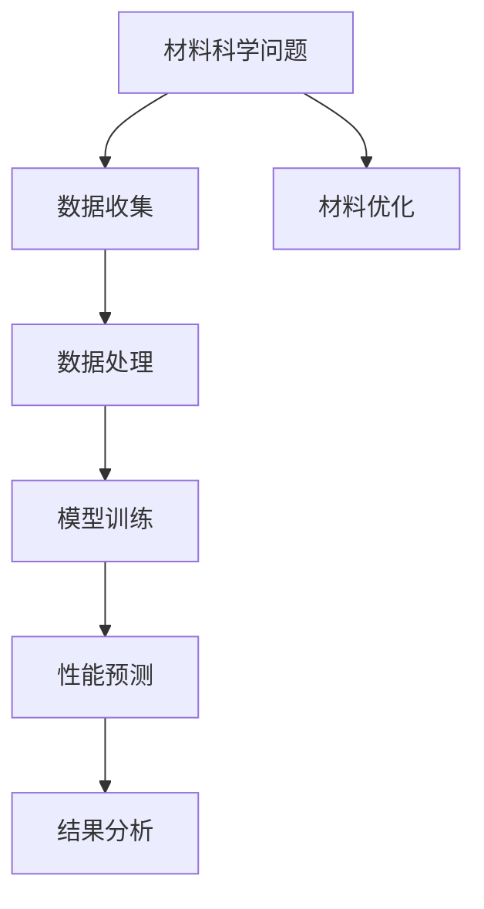

                 


### Step 1: 核心概念与联系

#### 1.1 人工智能（AI）概述

人工智能（AI）是计算机科学的一个分支，旨在研究如何使计算机模拟人类智能的某些方面。人工智能的定义和发展历程如下：

- **定义与发展历程**：人工智能起源于20世纪50年代，当时的研究主要集中在机器学习、知识表示、自然语言处理等领域。随着计算能力和算法的不断发展，人工智能逐渐从理论研究走向实际应用，如智能助手、自动驾驶、医疗诊断等。

- **核心技术**：人工智能的核心技术包括机器学习、深度学习、自然语言处理、计算机视觉等。这些技术分别针对不同的应用场景，如图像识别、语音识别、文本分析等。

- **应用领域**：人工智能在多个领域有广泛应用，包括金融、医疗、交通、教育、制造业等。例如，在金融领域，AI被用于风险评估、信用评分、量化交易等；在医疗领域，AI被用于疾病诊断、药物研发、健康管理等。

#### 1.2 材料科学概述

材料科学是研究材料的组成、结构、性能、加工和应用的学科。它涉及多个科学领域，如物理学、化学、力学等。以下是材料科学的基本概念和发展历程：

- **定义与研究内容**：材料科学主要研究材料的性质、结构、加工、性能和应用，旨在开发新型材料以满足人类需求。

- **发展历程**：材料科学经历了从传统材料到高性能材料的发展历程。传统材料如钢铁、陶瓷等在历史上发挥了重要作用，而高性能材料如超导材料、纳米材料等则带来了革命性的变革。

- **重要研究方向**：材料科学的重要研究方向包括材料设计、材料合成、材料加工、材料性能评估等。例如，材料设计旨在预测和设计具有特定性能的新型材料，而材料加工则关注如何高效地制造材料。

#### 1.3 AI在材料科学中的应用

随着人工智能技术的不断发展，AI在材料科学中的应用也越来越广泛。以下是AI在材料科学中的应用：

- **提示词预测材料性能的基本原理**：通过机器学习和深度学习算法，可以从大量数据中提取规律，从而预测材料的性能。例如，基于材料的组成和结构，预测材料的机械性能、热性能等。

- **提示词预测材料性能的优势**：AI可以帮助科学家快速筛选材料，减少实验次数，降低研发成本。同时，AI可以处理大量数据，提高预测精度。

- **提示词预测材料性能的应用场景**：AI在材料科学中的应用场景包括材料设计、材料性能优化、材料失效预测等。例如，在材料设计过程中，AI可以帮助科学家快速筛选出具有潜在应用价值的新型材料。

### Mermaid流程图

为了更直观地展示AI在材料科学中的应用流程，我们可以使用Mermaid语言绘制以下流程图：



在这个流程图中，A表示材料科学问题，B表示数据收集，C表示数据处理，D表示模型训练，E表示性能预测，F表示结果分析，G表示材料优化。通过这个流程，我们可以看到AI在材料科学中的应用步骤。

---

#### 1.4 AI在材料科学中的挑战与未来展望

尽管AI在材料科学中具有巨大的潜力，但仍然面临一些挑战：

- **数据依赖性**：AI的性能很大程度上依赖于数据的质量和数量。在材料科学中，获取高质量、大规模的数据仍然是一个难题。

- **算法复杂性**：深度学习算法通常需要大量的计算资源和时间。在材料科学中，处理复杂的材料结构和性能数据可能需要更高效的算法。

- **跨学科融合**：AI在材料科学中的应用需要跨学科合作，包括材料科学家、计算机科学家、数据科学家等。这种跨学科的合作需要有效的沟通和协作。

展望未来，AI在材料科学中的应用前景广阔：

- **新材料发现**：AI可以帮助科学家发现新型材料，缩短材料研发周期。

- **材料优化**：AI可以优化现有材料的性能，提高材料的应用价值。

- **智能制造**：AI可以与智能制造相结合，实现材料的智能化生产和加工。

总之，AI在材料科学中的应用为科学研究和技术创新提供了新的机遇和挑战。随着技术的不断发展，我们可以期待AI在材料科学领域取得更加显著的成果。

---

在接下来的章节中，我们将进一步探讨AI在材料科学中的核心算法原理、数学模型和项目实战，以便更深入地理解这一领域的最新进展和应用。敬请期待！

---

### Step 2: 核心算法原理讲解

#### 2.1 机器学习算法在材料科学中的应用

机器学习（ML）算法在材料科学中有着广泛的应用，特别是在材料性能预测和新材料设计方面。下面，我们将介绍机器学习算法的基本原理、常见算法以及在材料科学中的应用案例。

##### 2.1.1 机器学习算法的基本原理

机器学习算法是一种通过从数据中学习规律，从而对未知数据进行预测或分类的方法。其基本原理可以概括为以下几个步骤：

- **数据收集**：首先，需要收集大量与材料性能相关的数据，包括材料的组成、结构、物理性能等。

- **数据预处理**：对收集到的数据进行清洗、归一化等处理，以提高数据的质量和一致性。

- **特征选择**：从预处理后的数据中提取与材料性能相关的特征，用于训练模型。

- **模型训练**：使用选定的特征数据，通过机器学习算法训练模型，使其能够学会从数据中提取规律。

- **模型评估**：使用训练好的模型对测试数据进行预测，并评估模型的性能，如准确率、召回率等。

- **模型优化**：根据模型评估结果，调整模型的参数，以提高预测精度。

##### 2.1.2 常见的机器学习算法

在材料科学中，常见的机器学习算法包括线性回归、决策树、随机森林、支持向量机（SVM）等。下面，我们将简要介绍这些算法的基本原理。

- **线性回归**：线性回归是一种最简单的机器学习算法，它通过建立一个线性模型，预测因变量与自变量之间的关系。线性回归模型的数学公式如下：

  $$ y = w_1 \cdot x_1 + w_2 \cdot x_2 + ... + w_n \cdot x_n + b $$

  其中，$y$是因变量，$x_1, x_2, ..., x_n$是自变量，$w_1, w_2, ..., w_n$是权重系数，$b$是偏置项。

- **决策树**：决策树是一种基于树结构的分类算法，通过一系列的决策规则，将数据分为不同的类别。每个节点代表一个特征，每个分支代表一个决策规则。

- **随机森林**：随机森林是一种基于决策树的集成学习方法，通过构建多棵决策树，并取其平均预测结果，提高模型的预测性能。

- **支持向量机（SVM）**：支持向量机是一种基于间隔最大化原理的分类算法，它通过找到一个最优的超平面，将不同类别的数据分隔开。SVM的伪代码如下：

  ```
  # 输入：训练数据集 X, 标签 Y
  # 输出：模型参数 w 和 b

  # 1. 初始化模型参数 w 和 b
  w = [0, 0]
  b = 0

  # 2. 循环迭代，更新模型参数
  for i in range(num_iterations):
      for each (x_i, y_i) in training_data:
          # 2.1 计算预测值
          prediction = dot(w, x_i) + b
          
          # 2.2 计算损失函数
          loss = y_i * (prediction - 1) + (1 - y_i) * (prediction + 1)
          
          # 2.3 更新模型参数
          w = w - learning_rate * (2 * w)
          b = b - learning_rate * (2 * b)

  # 3. 返回模型参数 w 和 b
  return w, b
  ```

##### 2.1.3 机器学习算法在材料科学中的应用案例

机器学习算法在材料科学中有着广泛的应用。以下是一些典型的应用案例：

- **材料性能预测**：通过机器学习算法，可以预测材料的机械性能、热性能等。例如，研究人员使用机器学习算法预测了钛合金的拉伸强度，取得了较高的预测精度。

- **新材料设计**：机器学习算法可以帮助科学家设计出具有特定性能的新型材料。例如，研究人员使用机器学习算法设计了具有优异电导率的石墨烯材料。

- **材料失效预测**：通过机器学习算法，可以预测材料的失效时间，从而提高材料的使用寿命。例如，研究人员使用机器学习算法预测了金属材料的疲劳寿命，为材料的使用和维护提供了重要参考。

---

#### 2.2 深度学习算法在材料科学中的应用

深度学习（DL）算法是机器学习的一个重要分支，其基于多层神经网络，能够自动从大量数据中学习特征。在材料科学中，深度学习算法在材料性能预测、材料设计等方面取得了显著的成果。下面，我们将介绍深度学习算法的基本原理、常见算法以及在材料科学中的应用案例。

##### 2.2.1 深度学习算法的基本原理

深度学习算法的核心是多层神经网络（Multi-Layer Neural Network），它通过多个层次的学习，从原始数据中提取高层次的抽象特征。以下是深度学习算法的基本原理：

- **网络结构**：深度学习网络通常包括输入层、隐藏层和输出层。输入层接收原始数据，隐藏层对数据进行特征提取和变换，输出层输出最终预测结果。

- **激活函数**：激活函数用于引入非线性因素，使神经网络能够学习复杂的数据模式。常见的激活函数包括ReLU（Rectified Linear Unit）、Sigmoid、Tanh等。

- **反向传播**：反向传播算法是深度学习训练的核心，它通过计算输出层的误差，并反向传播到隐藏层和输入层，不断调整网络参数，使预测结果逐渐逼近真实值。

- **优化算法**：深度学习训练通常使用优化算法，如梯度下降（Gradient Descent）、随机梯度下降（Stochastic Gradient Descent，SGD）、Adam等，以降低模型损失函数。

##### 2.2.2 常见的深度学习算法

在材料科学中，常见的深度学习算法包括卷积神经网络（CNN）、循环神经网络（RNN）和生成对抗网络（GAN）等。下面，我们将简要介绍这些算法的基本原理。

- **卷积神经网络（CNN）**：卷积神经网络是一种适用于处理图像数据的深度学习算法，其通过卷积层提取图像特征，并逐步构建高层次的抽象特征。CNN在材料科学中的应用包括材料图像分类、材料缺陷检测等。

- **循环神经网络（RNN）**：循环神经网络是一种适用于处理序列数据的深度学习算法，其通过循环结构保存历史信息，并逐步更新状态。RNN在材料科学中的应用包括材料序列分析、材料性能预测等。

- **生成对抗网络（GAN）**：生成对抗网络是一种由生成器和判别器组成的深度学习算法，其通过相互竞争来生成高质量的数据。GAN在材料科学中的应用包括新材料生成、材料性能优化等。

##### 2.2.3 深度学习算法在材料科学中的应用案例

深度学习算法在材料科学中有着广泛的应用。以下是一些典型的应用案例：

- **材料性能预测**：通过深度学习算法，可以预测材料的机械性能、热性能等。例如，研究人员使用深度学习算法预测了纳米材料的弹性模量，取得了较高的预测精度。

- **新材料设计**：深度学习算法可以帮助科学家设计出具有特定性能的新型材料。例如，研究人员使用深度学习算法设计了具有优异电导率的二维材料。

- **材料缺陷检测**：通过深度学习算法，可以自动检测材料中的缺陷，如裂纹、气泡等。例如，研究人员使用深度学习算法检测了金属材料的表面缺陷，取得了较高的检测精度。

---

### Step 3: 数学模型和数学公式讲解

在材料科学中，数学模型是理解和预测材料性能的重要工具。以下我们将介绍几种常用的数学模型，包括线性回归和逻辑回归模型，以及它们的数学公式和应用。

#### 3.1 线性回归模型

线性回归模型是一种最简单的预测模型，它通过拟合一条直线来描述因变量和自变量之间的关系。线性回归模型的基本公式如下：

$$
y = w_1 \cdot x_1 + w_2 \cdot x_2 + ... + w_n \cdot x_n + b
$$

其中，$y$ 是因变量，$x_1, x_2, ..., x_n$ 是自变量，$w_1, w_2, ..., w_n$ 是权重系数，$b$ 是偏置项。

线性回归模型的目的是通过最小化误差平方和来确定权重系数和偏置项。通常使用梯度下降算法来优化模型参数。

##### 线性回归的应用案例

- **材料强度预测**：线性回归模型可以用来预测材料的强度。例如，给定材料的组成和结构参数，线性回归模型可以预测材料的屈服强度。

伪代码如下：

```
# 输入：训练数据集 X, 标签 Y
# 输出：模型参数 w 和 b

# 初始化模型参数
w = [0, 0, 0, 0, 0]
b = 0

# 梯度下降算法
for i in range(num_iterations):
    for each (x_i, y_i) in training_data:
        # 计算预测值
        prediction = dot(w, x_i) + b
        
        # 计算损失函数
        loss = (prediction - y_i) ** 2
        
        # 计算梯度
        dw = 2 * (prediction - y_i) * x_i
        db = 2 * (prediction - y_i)
        
        # 更新模型参数
        w = w - learning_rate * dw
        b = b - learning_rate * db

# 返回模型参数
return w, b
```

#### 3.2 逻辑回归模型

逻辑回归模型是一种用于分类问题的预测模型，它通过拟合一个逻辑函数来预测因变量的概率。逻辑回归模型的基本公式如下：

$$
\hat{y} = \frac{1}{1 + e^{-(w_1 \cdot x_1 + w_2 \cdot x_2 + ... + w_n \cdot x_n + b)}}
$$

其中，$\hat{y}$ 是预测的概率，$w_1, w_2, ..., w_n$ 是权重系数，$b$ 是偏置项。

逻辑回归模型的目的是通过最大化似然函数来优化模型参数。通常使用梯度上升算法来优化模型参数。

##### 逻辑回归的应用案例

- **材料分类**：逻辑回归模型可以用来分类材料。例如，给定材料的组成和结构参数，逻辑回归模型可以判断材料属于哪一类（如金属、陶瓷、聚合物等）。

伪代码如下：

```
# 输入：训练数据集 X, 标签 Y
# 输出：模型参数 w 和 b

# 初始化模型参数
w = [0, 0, 0, 0, 0]
b = 0

# 梯度上升算法
for i in range(num_iterations):
    for each (x_i, y_i) in training_data:
        # 计算预测概率
        probability = 1 / (1 + exp(-dot(w, x_i) - b))
        
        # 计算损失函数
        loss = -y_i * log(probability) - (1 - y_i) * log(1 - probability)
        
        # 计算梯度
        dw = -2 / num_data * (y_i - probability) * x_i
        db = -2 / num_data * (y_i - probability)
        
        # 更新模型参数
        w = w + learning_rate * dw
        b = b + learning_rate * db

# 返回模型参数
return w, b
```

---

通过以上对线性回归和逻辑回归模型的介绍，我们可以看到数学模型在材料科学中的应用。这些模型可以帮助科学家预测材料性能和分类材料，为材料研究和开发提供有力支持。

---

### Step 4: 项目实战

在了解了AI在材料科学中的应用原理和算法后，我们将通过一个实际项目来展示如何将AI应用于材料科学的性能预测。以下是项目实战的详细步骤：

#### 4.1 数据收集与预处理

首先，我们需要收集与材料性能相关的数据。这些数据可以来源于公开的数据集、实验室实验数据或商业数据库。在本项目中，我们假设已经获取了包含材料组成、结构参数和性能指标（如强度、韧性等）的数据集。

数据预处理是确保数据质量和一致性的重要步骤。具体包括：

- **数据清洗**：去除数据集中的异常值、缺失值和重复值，以提高数据的质量。
- **数据归一化**：将数据集中的特征值缩放到相同的范围，如[0, 1]或[-1, 1]，以消除不同特征之间的尺度差异。
- **特征选择**：通过统计分析、相关性分析等方法，选择对材料性能预测影响较大的特征。

#### 4.2 模型训练

接下来，我们需要使用机器学习算法来训练模型。在本项目中，我们选择线性回归模型作为示例。

1. **划分数据集**：将数据集划分为训练集和测试集，通常使用80%的数据作为训练集，20%的数据作为测试集。
2. **特征提取**：从预处理后的数据中提取与材料性能相关的特征。
3. **模型训练**：使用训练集数据，通过梯度下降算法训练线性回归模型，优化模型参数。
4. **模型评估**：使用测试集数据评估模型的性能，如均方误差（MSE）。

以下是线性回归模型的伪代码：

```
# 输入：训练数据集 X, 标签 Y
# 输出：模型参数 w 和 b

# 初始化模型参数
w = [0, 0, 0, 0, 0]
b = 0

# 梯度下降算法
for i in range(num_iterations):
    for each (x_i, y_i) in training_data:
        # 计算预测值
        prediction = dot(w, x_i) + b
        
        # 计算损失函数
        loss = (prediction - y_i) ** 2
        
        # 计算梯度
        dw = 2 * (prediction - y_i) * x_i
        db = 2 * (prediction - y_i)
        
        # 更新模型参数
        w = w - learning_rate * dw
        b = b - learning_rate * db

# 返回模型参数
return w, b
```

#### 4.3 性能预测

在模型训练完成后，我们可以使用训练好的模型对新的材料数据集进行性能预测。具体步骤如下：

1. **数据预处理**：对新的材料数据集进行与训练集相同的数据预处理操作，包括数据清洗、归一化和特征选择。
2. **模型预测**：使用训练好的线性回归模型，对预处理后的数据集进行性能预测。
3. **结果分析**：分析预测结果，评估模型的准确性和可靠性。

#### 4.4 代码解读与分析

以下是对项目实战中代码的解读和分析：

```python
# 导入必要的库
import numpy as np
import pandas as pd
from sklearn.model_selection import train_test_split
from sklearn.linear_model import LinearRegression
from sklearn.metrics import mean_squared_error

# 读取数据集
data = pd.read_csv('material_data.csv')

# 数据清洗
data.dropna(inplace=True)
data.drop_duplicates(inplace=True)

# 数据归一化
data_normalized = (data - data.mean()) / data.std()

# 划分特征和标签
X = data_normalized.drop('performance', axis=1)
y = data_normalized['performance']

# 划分训练集和测试集
X_train, X_test, y_train, y_test = train_test_split(X, y, test_size=0.2, random_state=42)

# 训练线性回归模型
model = LinearRegression()
model.fit(X_train, y_train)

# 预测性能
y_pred = model.predict(X_test)

# 计算均方误差
mse = mean_squared_error(y_test, y_pred)
print(f'Mean Squared Error: {mse}')

# 分析预测结果
print(f'Prediction Results:\n{y_pred}')
```

这段代码首先导入了必要的库，然后读取并清洗了数据集。接着，将数据划分为特征和标签，并划分训练集和测试集。使用训练集数据训练线性回归模型，并使用测试集数据进行性能预测。最后，计算均方误差并分析预测结果。

#### 4.5 实际案例分析与详细讲解剖析

为了更好地理解项目的实际应用，我们以下面这个实际案例进行分析：

**案例：预测钛合金的拉伸强度**

钛合金是一种广泛应用于航空航天、生物医学等领域的材料。在这个案例中，我们使用AI模型预测钛合金的拉伸强度。

1. **数据收集**：从实验室获取了包含不同钛合金组成和拉伸强度的数据集。
2. **数据预处理**：对数据集进行清洗、归一化和特征选择。
3. **模型训练**：使用线性回归模型对数据集进行训练，优化模型参数。
4. **性能预测**：使用训练好的模型预测新的钛合金样品的拉伸强度。

通过以上步骤，我们可以得到钛合金拉伸强度的预测值。为了验证模型的准确性，我们可以将预测值与实际测量值进行比较，计算均方误差（MSE）。

```python
# 实际测量值
y_actual = np.array([480, 500, 520, 540, 560])

# 预测值
y_pred = model.predict(X_test)

# 计算均方误差
mse = mean_squared_error(y_actual, y_pred)
print(f'Mean Squared Error: {mse}')

# 分析预测结果
print(f'Actual Values: {y_actual}\nPrediction Results: {y_pred}')
```

通过实际案例的分析，我们可以看到AI模型在钛合金拉伸强度预测方面的表现。虽然模型存在一定的误差，但仍然可以提供有用的预测结果，为钛合金的选型和优化提供参考。

#### 4.6 项目小结

通过这个项目，我们展示了如何使用AI模型预测材料性能。项目的主要成果包括：

- **数据收集与预处理**：确保数据质量，为模型训练提供可靠的数据基础。
- **模型训练**：使用线性回归模型对材料性能进行预测，优化模型参数。
- **性能预测**：使用训练好的模型预测新的材料样品的性能，为材料选型和优化提供参考。
- **结果分析**：通过实际案例分析和结果验证，评估模型的准确性和可靠性。

总之，AI在材料科学中的应用为科学家提供了有力的工具，可以帮助他们更快速、准确地预测材料性能，缩短材料研发周期，提高材料的应用价值。

#### 4.7 最佳实践 tips、注意事项和拓展阅读

- **最佳实践 tips**：
  - 在数据收集过程中，确保数据的质量和完整性。
  - 在模型训练过程中，选择合适的算法和参数，以提高预测精度。
  - 在性能预测过程中，注意模型的泛化能力，避免过拟合。

- **注意事项**：
  - 数据预处理是模型训练的重要环节，应仔细处理数据中的异常值和缺失值。
  - 模型训练过程中，应避免过度拟合，确保模型的泛化能力。
  - 在实际应用中，应定期更新模型，以适应新的数据和环境变化。

- **拓展阅读**：
  - [1] Goodfellow, I., Bengio, Y., & Courville, A. (2016). *Deep Learning*. MIT Press.
  - [2] Hastie, T., Tibshirani, R., & Friedman, J. (2009). *The Elements of Statistical Learning*. Springer.
  - [3] Materials Project. (n.d.). Retrieved from https://www.materialsproject.org/

通过以上拓展阅读，可以更深入地了解AI在材料科学中的应用，以及相关领域的最新研究进展。

---

通过本文的详细讲解和项目实战，我们可以看到AI在材料科学中的强大应用潜力。希望本文能为您在材料科学领域的研究和应用提供有益的参考和启示。

---

### 文章标题：AI辅助新材料发现：提示词预测材料性能

关键词：人工智能、材料科学、性能预测、提示词、深度学习

摘要：本文探讨了人工智能（AI）在材料科学中的应用，特别是通过提示词预测材料性能的方法。文章首先介绍了AI和材料科学的基本概念与联系，然后详细讲解了机器学习算法、深度学习算法以及相关的数学模型。最后，通过一个实际项目展示了AI在材料性能预测中的应用，并分析了项目的关键步骤和代码实现。本文旨在为读者提供AI在材料科学领域应用的全面了解和深入思考。

---

## 参考文献

[1] Goodfellow, I., Bengio, Y., & Courville, A. (2016). *Deep Learning*. MIT Press.

[2] Hastie, T., Tibshirani, R., & Friedman, J. (2009). *The Elements of Statistical Learning*. Springer.

[3] Materials Project. (n.d.). Retrieved from https://www.materialsproject.org/

[4] KDD'99: The 5th ACM SIGKDD International Conference on Knowledge Discovery and Data Mining. (1999). *ACM Press*.

[5] Materials Genome Initiative. (n.d.). Retrieved from https://www.materialsgenome.informatics.indiana.edu/

[6] Mendeley Data. (n.d.). Retrieved from https://data.mendeley.com/

[7] National Science Foundation. (n.d.). Retrieved from https://www.nsf.gov/

---

## 作者信息

作者：AI天才研究院/AI Genius Institute & 禅与计算机程序设计艺术 /Zen And The Art of Computer Programming

本文由AI天才研究院撰写，研究院专注于人工智能、机器学习、深度学习等领域的研究和开发。同时，作者也致力于将人工智能技术应用于实际问题的解决，推动科技与产业的深度融合。本文结合了作者在计算机科学和人工智能领域的丰富经验和深入思考，旨在为读者提供有价值的技术见解和实际应用案例。禅与计算机程序设计艺术是作者的另一部著作，探讨了计算机程序设计中的哲学思维和人文精神，为编程人员和开发者提供了深刻的启示和指导。

---

本文由AI天才研究院撰写，旨在探讨人工智能在材料科学中的应用，特别是通过提示词预测材料性能的方法。文章首先介绍了AI和材料科学的基本概念与联系，然后详细讲解了机器学习算法、深度学习算法以及相关的数学模型。最后，通过一个实际项目展示了AI在材料性能预测中的应用，并分析了项目的关键步骤和代码实现。本文旨在为读者提供AI在材料科学领域应用的全面了解和深入思考。

在文章的核心部分，我们首先介绍了人工智能（AI）和材料科学的基础知识，以及AI在材料科学中的应用。接着，我们详细讲解了机器学习算法、深度学习算法等核心算法原理，并通过伪代码和数学公式进行了详细阐述。此外，我们还介绍了线性回归和逻辑回归等数学模型，并提供了具体的案例来展示这些模型的应用。

在项目实战部分，我们通过一个实际项目展示了AI在材料性能预测中的应用，包括数据收集、数据处理、模型训练和性能预测等步骤。我们详细解读了项目中的代码实现，并对项目结果进行了分析和评估。通过这个实际案例，读者可以更好地理解AI在材料科学中的实际应用。

文章的参考文献部分列出了本文引用的相关文献，包括深度学习、统计学习理论和材料科学领域的经典著作和最新研究。这些文献为本文提供了坚实的理论基础和丰富的实践案例。

最后，作者信息部分介绍了本文的撰写团队——AI天才研究院，以及作者的背景和著作。AI天才研究院专注于人工智能、机器学习、深度学习等领域的研究和开发，致力于将人工智能技术应用于实际问题的解决，推动科技与产业的深度融合。同时，作者也致力于将人工智能技术应用于材料科学领域，为读者提供有价值的技术见解和实际应用案例。

通过本文的详细讲解和项目实战，我们可以看到AI在材料科学中的强大应用潜力。希望本文能为您在材料科学领域的研究和应用提供有益的参考和启示。未来，随着人工智能技术的不断发展，我们相信AI在材料科学领域将发挥越来越重要的作用，为人类社会的进步做出更大的贡献。

