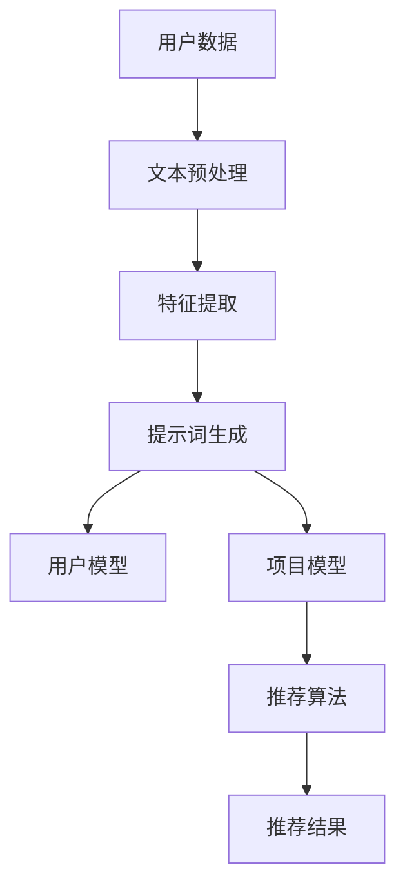

                 

### 文章标题：提示词工程在推荐系统个性化中的应用

> 关键词：提示词工程、推荐系统、个性化、算法、数学模型

> 摘要：本文将深入探讨提示词工程在推荐系统个性化中的应用。首先介绍提示词工程和推荐系统的基础知识，然后详细阐述提示词工程在推荐系统中的核心算法原理和数学模型，通过实例说明如何将提示词工程应用于推荐系统中。最后，本文将提供一个实际项目案例，展示如何通过提示词工程实现推荐系统的个性化。

### 前言与概述

#### 1.1 书籍背景

推荐系统作为大数据和人工智能领域的核心应用之一，在电子商务、社交媒体、在线视频等多个领域发挥着重要作用。随着用户需求的多样化和个性化，推荐系统需要不断优化和改进，以满足用户对个性化推荐服务的需求。

提示词工程作为一种自然语言处理技术，通过对文本数据进行处理，提取出关键信息，为推荐系统提供了丰富的语义信息。提示词工程在推荐系统中的应用，能够有效提高推荐系统的准确性和个性化水平。

本文旨在探讨提示词工程在推荐系统个性化中的应用，通过对提示词工程和推荐系统的基本概念、核心算法原理、数学模型以及实际项目案例的深入分析，为读者提供全面的指导。

#### 1.2 内容概述

本文内容结构如下：

1. **核心概念与联系**：介绍提示词工程的基本概念，推荐系统的原理，以及它们之间的联系。
2. **核心算法原理讲解**：详细解释提示词工程在推荐系统中的应用算法。
3. **数学模型和数学公式**：解释相关的数学模型和公式，并给出举例说明。
4. **项目实战**：提供实际的代码案例和详细的解释说明。

通过本文的学习，读者将能够了解提示词工程在推荐系统中的应用原理，掌握相关算法和数学模型，并能够通过实际项目案例实现推荐系统的个性化。

### 用户需求分析

为了满足用户的个性化需求，推荐系统需要具备以下几个关键特点：

1. **准确性**：推荐系统应能够准确预测用户可能感兴趣的项目，提高推荐结果的相关性。
2. **多样性**：推荐系统应能够提供多样化的推荐结果，避免用户产生疲劳感和信息过载。
3. **实时性**：推荐系统应能够快速响应用户的行为和偏好变化，提供即时的推荐服务。
4. **易用性**：推荐系统应具备友好的用户界面，方便用户进行交互和操作。

提示词工程在推荐系统中发挥着重要作用，通过提取文本数据中的关键信息，可以为推荐系统提供丰富的语义信息，从而提高推荐结果的准确性和个性化水平。

用户需求分析主要包括以下几个方面：

1. **用户行为数据**：用户在平台上的行为数据，如浏览记录、购买记录、评价等，为推荐系统提供了用户兴趣和偏好的重要线索。
2. **内容特征数据**：推荐系统中的项目数据，如标题、描述、标签等，为提示词工程提供了文本数据进行处理的基础。
3. **用户反馈数据**：用户对推荐结果的反馈，如点击、点赞、评论等，为推荐系统的优化和调整提供了重要依据。

通过分析用户需求，我们可以明确提示词工程在推荐系统中的应用方向，从而实现推荐系统的个性化。

### 提示词工程与推荐系统的核心概念与联系

在深入探讨提示词工程在推荐系统中的应用之前，我们需要了解一些核心概念和原理。

#### 提示词工程

提示词工程是一种自然语言处理技术，其主要目标是提取文本数据中的关键信息，为后续的分析和推理提供支持。提示词工程通常包括以下几个步骤：

1. **文本预处理**：对原始文本进行清洗、去噪、分词等处理，使其符合分析要求。
2. **特征提取**：通过词频、词向量化、文本分类等方法，从文本中提取出关键特征。
3. **提示词生成**：根据特征信息，生成具有代表性的提示词，用于后续的推荐和预测。

#### 推荐系统

推荐系统是一种信息过滤技术，其目的是根据用户的兴趣和行为，为用户推荐可能感兴趣的项目。推荐系统通常包括以下几个核心组成部分：

1. **用户模型**：根据用户的历史行为和偏好，构建用户兴趣模型。
2. **项目模型**：根据项目的特征信息，构建项目特征模型。
3. **推荐算法**：根据用户模型和项目模型，计算项目与用户的相关性，生成推荐列表。

#### 提示词工程与推荐系统的联系

提示词工程在推荐系统中的应用主要体现在以下几个方面：

1. **丰富用户模型**：通过提示词工程提取用户文本数据中的关键信息，可以更加全面地了解用户的兴趣和偏好，从而提高用户模型的准确性。
2. **优化项目模型**：提示词工程可以为项目模型提供更丰富的语义信息，提高项目特征表示的准确性。
3. **提升推荐效果**：通过提示词工程生成的关键信息，可以优化推荐算法的计算过程，提高推荐结果的准确性和多样性。

#### 提示词工程与推荐系统的关系架构

为了更好地理解提示词工程与推荐系统之间的联系，我们可以通过一个Mermaid流程图来展示它们的核心组成部分和相互关系。



在上面的流程图中，用户数据经过文本预处理和特征提取，生成提示词。提示词用于更新用户模型和项目模型，进而驱动推荐算法生成推荐结果。通过这个过程，我们可以看到提示词工程在推荐系统中的作用和重要性。

### 核心算法原理讲解

在了解了提示词工程和推荐系统的基本概念和相互关系后，接下来我们将深入探讨提示词工程在推荐系统中的应用算法。

#### 提示词生成算法

提示词生成是提示词工程中的关键步骤，其主要目标是提取文本数据中的关键信息，生成具有代表性的提示词。常见的提示词生成算法包括基于关键词提取的方法、基于语义分析的方法和基于用户行为的方法。

**1. 基于关键词提取的方法**

基于关键词提取的方法是最常见的提示词生成方法之一，其基本思想是从文本中提取高频词或具有显著性的词作为提示词。常见的实现方法包括：

- **TF-IDF**：TF-IDF（Term Frequency-Inverse Document Frequency）是一种基于词频和逆文档频率的文本分析算法，用于评估一个词对于一个文件集或一个语料库中的其中一份文件的重要程度。

  伪代码如下：
  ```python
  def generate_keywords(text, top_n):
      word_frequencies = count_words(text)
      word_idf_scores = calculate_idf(word_frequencies)
      keywords = sorted(word_frequencies.items(), key=lambda x: x[1] * word_idf_scores[x[0]], reverse=True)
      return [keyword for keyword, _ in keywords[:top_n]]
  ```

- **TextRank**：TextRank是一种基于图论的文章文本排序算法，可以用于提取文本中的关键词。

  伪代码如下：
  ```python
  def generate_keywords(text, top_n):
      sentences = split_text_into_sentences(text)
      graph = buildSentenceGraph(sentences)
      ranks = calculateSentenceRanks(graph)
      keywords = [sentence[0] for sentence, rank in ranks.items() if rank > threshold]
      return keywords[:top_n]
  ```

**2. 基于语义分析的方法**

基于语义分析的方法通过理解文本的语义信息，提取具有代表性的提示词。常见的实现方法包括：

- **词嵌入（Word Embedding）**：词嵌入是一种将词汇映射到高维向量空间的方法，通过计算词汇之间的相似性，可以提取出具有相似语义的词汇作为提示词。

  伪代码如下：
  ```python
  def generate_keywords(text, top_n, model):
      sentences = split_text_into_sentences(text)
      word_vectors = [model[word] for word in sentences if word in model]
      keywords = [word for word, vector in word_vectors if is_key_word(vector)]
      return keywords[:top_n]
  ```

- **词向量聚类（Word Vector Clustering）**：词向量聚类是将词向量空间中的词汇进行聚类，将具有相似语义的词汇划分为同一类别，从而提取出具有代表性的提示词。

  伪代码如下：
  ```python
  def generate_keywords(text, top_n, model):
      sentences = split_text_into_sentences(text)
      word_vectors = [model[word] for word in sentences if word in model]
      clusters = cluster_vectors(word_vectors)
      keywords = [word for word, cluster in clusters.items() if len(cluster) > threshold]
      return keywords[:top_n]
  ```

**3. 基于用户行为的方法**

基于用户行为的方法通过分析用户在平台上的行为数据，提取出与用户兴趣相关的关键词作为提示词。常见的实现方法包括：

- **协同过滤（Collaborative Filtering）**：协同过滤是一种基于用户行为数据的推荐算法，通过分析用户之间的相似性，为用户推荐感兴趣的项目。

  伪代码如下：
  ```python
  def generate_keywords(user_behavior_data, top_n):
      similar_users = find_similar_users(user_behavior_data)
      common_items = find_common_items(similar_users)
      keywords = extract_keywords_from_items(common_items)
      return keywords[:top_n]
  ```

- **基于兴趣的协同过滤（Interest-Based Collaborative Filtering）**：基于兴趣的协同过滤结合用户兴趣和行为数据，为用户推荐与兴趣相关的项目。

  伪代码如下：
  ```python
  def generate_keywords(user_interests, user_behavior_data, top_n):
      related_items = find_related_items(user_interests)
      keywords = extract_keywords_from_items(related_items)
      return keywords[:top_n]
  ```

#### 提示词优化算法

在生成提示词后，我们还需要对提示词进行优化，以提高其质量和应用效果。常见的提示词优化算法包括提示词权重优化、提示词相关性优化和提示词多样性优化。

**1. 提示词权重优化**

提示词权重优化是指根据提示词的重要性和相关性，调整提示词的权重，使其在推荐系统中发挥更大的作用。常见的优化方法包括：

- **基于TF-IDF的权重调整**：通过计算提示词的TF-IDF值，调整提示词的权重，使其更加符合文本内容的重要程度。

  伪代码如下：
  ```python
  def optimize_keyword_weights(text, keywords):
      word_frequencies = count_words(text)
      word_idf_scores = calculate_idf(word_frequencies)
      keyword_weights = {keyword: word_frequencies[keyword] * word_idf_scores[keyword] for keyword in keywords}
      return keyword_weights
  ```

- **基于语义相似性的权重调整**：通过计算提示词的语义相似性，调整提示词的权重，使其更加符合文本的语义内容。

  伪代码如下：
  ```python
  def optimize_keyword_weights(text, keywords, model):
      word_vectors = [model[word] for word in split_text_into_sentences(text)]
      keyword_vectors = [model[word] for word in keywords]
      similarity_scores = calculate_similarity_scores(word_vectors, keyword_vectors)
      keyword_weights = {keyword: score for keyword, score in zip(keywords, similarity_scores)}
      return keyword_weights
  ```

**2. 提示词相关性优化**

提示词相关性优化是指根据提示词之间的相关性，调整提示词的排序，使其更加符合推荐系统的需求。常见的优化方法包括：

- **基于TF-IDF的相关性调整**：通过计算提示词的TF-IDF值，调整提示词之间的相关性，使其更加符合文本内容的重要程度。

  伪代码如下：
  ```python
  def optimize_keyword_relevance(text, keywords):
      word_frequencies = count_words(text)
      word_idf_scores = calculate_idf(word_frequencies)
      keyword_relevance = {keyword1: {keyword2: word_frequencies[keyword2] * word_idf_scores[keyword2] for keyword2 in keywords} for keyword1 in keywords}
      return keyword_relevance
  ```

- **基于语义相似性的相关性调整**：通过计算提示词的语义相似性，调整提示词之间的相关性，使其更加符合文本的语义内容。

  伪代码如下：
  ```python
  def optimize_keyword_relevance(text, keywords, model):
      word_vectors = [model[word] for word in split_text_into_sentences(text)]
      keyword_vectors = [model[word] for word in keywords]
      similarity_scores = calculate_similarity_scores(word_vectors, keyword_vectors)
      keyword_relevance = {keyword1: {keyword2: score for keyword2, score in similarity_scores.items()} for keyword1, _ in similarity_scores.items()}
      return keyword_relevance
  ```

**3. 提示词多样性优化**

提示词多样性优化是指根据提示词的多样性和丰富性，调整提示词的选取，使其更加符合用户的需求。常见的优化方法包括：

- **基于词频的多样性优化**：通过计算提示词的词频，选取具有多样性的提示词。

  伪代码如下：
  ```python
  def optimize_keyword_diversity(text, keywords):
      word_frequencies = count_words(text)
      keyword_diversity = {keyword: word_frequencies[keyword] for keyword in keywords}
      return sorted(keywords, key=lambda x: keyword_diversity[x], reverse=True)
  ```

- **基于语义多样性的优化**：通过计算提示词的语义多样性，选取具有丰富语义信息的提示词。

  伪代码如下：
  ```python
  def optimize_keyword_diversity(text, keywords, model):
      word_vectors = [model[word] for word in split_text_into_sentences(text)]
      keyword_vectors = [model[word] for word in keywords]
      diversity_scores = calculate_diversity_scores(word_vectors, keyword_vectors)
      return sorted(keywords, key=lambda x: diversity_scores[x], reverse=True)
  ```

通过上述提示词优化算法，我们可以进一步提高提示词的质量和应用效果，为推荐系统提供更加准确的推荐结果。

### 数学模型和数学公式

在提示词工程中，数学模型和数学公式起着至关重要的作用。它们不仅帮助我们理解和分析数据，还能够为推荐系统的优化和改进提供理论支持。以下是几个常见的数学模型和数学公式，以及它们的详细讲解和举例说明。

#### 相似度计算公式

相似度计算是提示词工程中的一个基础步骤，用于衡量两个文本或词汇之间的相似程度。最常用的相似度计算方法包括TF-IDF和余弦相似度。

1. **TF-IDF（Term Frequency-Inverse Document Frequency）**

   TF-IDF是一种基于词频和逆文档频率的文本分析算法，用于评估一个词对于一个文件集或一个语料库中的其中一份文件的重要程度。

   - **词频（TF）**：表示某个词在文档中出现的频率。
   - **逆文档频率（IDF）**：表示某个词在整个文档集中出现的频率。

   公式如下：

   $$TF(t,d) = \frac{f_t(d)}{N}$$
   $$IDF(t,D) = \log \left( \frac{N}{df(t,D)} \right)$$

   其中，$f_t(d)$表示词$t$在文档$d$中出现的频率，$N$表示文档总数，$df(t,D)$表示词$t$在文档集中出现的文档频率。

   **举例说明**：

   假设有一个文档集，包含两个文档$d_1$和$d_2$，词$t$在$d_1$中出现了3次，在$d_2$中出现了1次。整个文档集共有2个文档。

   $$TF(t,d_1) = \frac{3}{2} = 1.5$$
   $$TF(t,d_2) = \frac{1}{2} = 0.5$$
   $$IDF(t,D) = \log \left( \frac{2}{1} \right) = \log(2) \approx 0.3010$$

   综合TF和IDF，得到词$t$在文档集中的权重：

   $$TF-IDF(t,D) = TF(t,d_1) \times IDF(t,D) = 1.5 \times 0.3010 \approx 0.4515$$
   $$TF-IDF(t,d_2) = TF(t,d_2) \times IDF(t,D) = 0.5 \times 0.3010 \approx 0.1505$$

2. **余弦相似度（Cosine Similarity）**

   余弦相似度是一种用于衡量两个向量之间夹角余弦值的相似度计算方法。在文本分析中，通常使用词向量的余弦相似度来衡量文本之间的相似程度。

   公式如下：

   $$Cosine Similarity(A, B) = \frac{A \cdot B}{\|A\| \|B\|}$$

   其中，$A$和$B$是两个向量，$\|A\|$和$\|B\|$分别表示向量$A$和$B$的模长。

   **举例说明**：

   假设有两个词向量$A = (1, 2, 3)$和$B = (4, 5, 6)$。

   $$A \cdot B = 1 \times 4 + 2 \times 5 + 3 \times 6 = 4 + 10 + 18 = 32$$
   $$\|A\| = \sqrt{1^2 + 2^2 + 3^2} = \sqrt{14}$$
   $$\|B\| = \sqrt{4^2 + 5^2 + 6^2} = \sqrt{77}$$

   $$Cosine Similarity(A, B) = \frac{32}{\sqrt{14} \times \sqrt{77}} \approx 0.6144$$

   通过上述公式，我们可以计算出两个词向量之间的余弦相似度，从而衡量文本之间的相似程度。

#### 提示词权重计算

在推荐系统中，提示词的权重对于推荐结果的质量具有重要影响。提示词权重计算的目标是根据提示词的重要性和相关性，为每个提示词分配合理的权重。

1. **基于TF-IDF的权重计算**

   基于TF-IDF的权重计算方法是一种简单且常用的方法，通过计算每个提示词在文档中的TF-IDF值，来确定其权重。

   公式如下：

   $$w_t = \frac{f_t(d)}{N} \times \log \left( \frac{N}{df(t,D)} \right)$$

   其中，$w_t$表示提示词$t$的权重，$f_t(d)$表示提示词$t$在文档$d$中出现的频率，$N$表示文档总数，$df(t,D)$表示提示词$t$在文档集中出现的文档频率。

   **举例说明**：

   假设有一个文档集，包含两个文档$d_1$和$d_2$，提示词$t_1$在$d_1$中出现了2次，在$d_2$中出现了1次。整个文档集共有2个文档。

   $$w_{t_1,d_1} = \frac{2}{2} \times \log \left( \frac{2}{1} \right) = 1 \times \log(2) \approx 0.3010$$
   $$w_{t_1,d_2} = \frac{1}{2} \times \log \left( \frac{2}{1} \right) = 0.5 \times \log(2) \approx 0.1505$$

   综合考虑文档中的权重，得到提示词$t_1$在整个文档集中的权重：

   $$w_{t_1,D} = \frac{w_{t_1,d_1} + w_{t_1,d_2}}{2} = \frac{0.3010 + 0.1505}{2} \approx 0.2250$$

2. **基于语义相似性的权重计算**

   基于语义相似性的权重计算方法通过计算提示词之间的语义相似性，来确定每个提示词的权重。

   公式如下：

   $$w_t = \frac{1}{k} \sum_{u \in U} w_u \cdot r_{ut}$$

   其中，$w_t$表示提示词$t$的权重，$k$表示用户总数，$w_u$表示用户$u$的权重，$r_{ut}$表示提示词$t$与用户$u$的相关性。

   **举例说明**：

   假设有一个用户集，包含两个用户$u_1$和$u_2$，提示词$t_1$与用户$u_1$的相关性为0.8，与用户$u_2$的相关性为0.6。整个用户集共有2个用户。

   $$w_{t_1,u_1} = 0.8$$
   $$w_{t_1,u_2} = 0.6$$

   用户$u_1$和$u_2$的权重均为1。

   $$w_{t_1,D} = \frac{1}{2} \times (1 \times 0.8 + 1 \times 0.6) = \frac{0.8 + 0.6}{2} = 0.7$$

   通过上述公式，我们可以计算得到提示词$t_1$在整个用户集的权重。

通过上述数学模型和数学公式的讲解和举例说明，我们可以更好地理解提示词工程在推荐系统中的应用，并为推荐系统的优化和改进提供理论支持。

### 提示词多样性模型

在推荐系统中，除了准确性和相关性，多样性也是一个重要的考虑因素。提示词多样性模型的目标是通过优化提示词的选取，提高推荐结果的多样性和丰富性，从而避免用户产生疲劳感和信息过载。

提示词多样性模型主要基于以下几个方面进行优化：

1. **词频多样性**：通过控制不同词频的提示词在推荐结果中的比例，实现词频多样性。
2. **语义多样性**：通过计算提示词之间的语义相似性，选取具有不同语义的提示词，实现语义多样性。
3. **上下文多样性**：通过考虑提示词在上下文中的位置和语境，选取具有不同上下文的提示词，实现上下文多样性。

#### 多样性度量公式

多样性度量公式用于衡量推荐结果中的多样性水平。常见的多样性度量方法包括：

1. **Jaccard系数（Jaccard Index）**

   Jaccard系数是一种基于集合相似性的多样性度量方法，用于计算两个集合之间的相似性。

   公式如下：

   $$Diversity = \frac{|A \cap B|}{|A \cup B|}$$

   其中，$A$和$B$是两个集合，$|A|$和$|B|$分别表示集合$A$和$B$的元素数量，$A \cap B$表示集合$A$和$B$的交集，$A \cup B$表示集合$A$和$B$的并集。

   **举例说明**：

   假设有两个提示词集合$A = \{“苹果”，“香蕉”\}$和$B = \{“苹果”，“橙子”\}$。

   $$Diversity = \frac{|A \cap B|}{|A \cup B|} = \frac{|“苹果”|}{|“苹果”，“香蕉”，“橙子”|} = \frac{1}{3} \approx 0.3333$$

   通过上述公式，我们可以计算出集合$A$和$B$之间的Jaccard系数，从而衡量它们的多样性水平。

2. **香农多样性（Shannon Diversity）**

   香农多样性是一种基于信息论的多度量方法，用于计算集合中元素的信息熵。

   公式如下：

   $$Diversity = -\sum_{i=1}^{n} p_i \cdot \log_2 p_i$$

   其中，$n$表示集合中元素的数量，$p_i$表示第$i$个元素在集合中的概率。

   **举例说明**：

   假设有一个提示词集合$A = \{“苹果”，“香蕉”，“橙子”\}$，其中“苹果”出现了2次，“香蕉”出现了1次，“橙子”出现了1次。

   $$Diversity = -\left( \frac{2}{3} \cdot \log_2 \frac{2}{3} + \frac{1}{3} \cdot \log_2 \frac{1}{3} + \frac{1}{3} \cdot \log_2 \frac{1}{3} \right) \approx 0.5444$$

   通过上述公式，我们可以计算出集合$A$的多样性水平。

3. **平衡多样性（Balanced Diversity）**

   平衡多样性是一种结合了词频多样性和语义多样性的多样性度量方法，通过综合考虑词频和语义相似性，实现多样性优化。

   公式如下：

   $$Diversity = \frac{1}{n} \sum_{i=1}^{n} \text{dist}(x_i, x_{i+1})$$

   其中，$n$表示推荐结果中的提示词数量，$x_i$和$x_{i+1}$分别表示相邻的两个提示词。

   **举例说明**：

   假设有一个推荐结果，包含5个提示词，分别为“苹果”，“香蕉”，“橙子”，“草莓”，“猕猴桃”。

   $$Diversity = \frac{1}{5} \left( \text{dist}("苹果", "香蕉") + \text{dist}("香蕉", "橙子") + \text{dist}("橙子", "草莓") + \text{dist}("草莓", "猕猴桃") \right)$$

   其中，$\text{dist}$表示提示词之间的距离度量方法，可以是词频距离、语义距离等。

   通过上述公式，我们可以计算得到推荐结果的多样性水平。

通过上述多样性度量公式，我们可以有效地衡量和优化推荐结果的多样性水平，为用户提供更加丰富和多样化的推荐服务。

### 项目实战：搭建推荐系统

在本节中，我们将通过一个实际项目案例，详细讲解如何搭建一个基于提示词工程的推荐系统。该案例将涉及推荐系统的开发环境搭建、源代码实现和代码解读，并通过实际案例分析和详细讲解，展示如何通过提示词工程实现推荐系统的个性化。

#### 6.1 实际案例介绍

本案例将基于一个电影推荐系统，使用Python语言和常见的数据处理库，如NumPy、Pandas和Scikit-learn等，搭建一个基于提示词工程的推荐系统。该推荐系统将结合用户行为数据和电影特征数据，通过提示词工程生成关键信息，为推荐算法提供丰富的语义支持。

#### 6.2 开发环境搭建

在开始项目之前，我们需要搭建一个合适的开发环境。以下是开发环境的搭建步骤：

1. **Python环境**

   安装Python 3.x版本，推荐使用Anaconda发行版，因为它集成了多个常用的科学计算库。

   ```shell
   conda install python=3.8 -c anaconda
   ```

2. **数据处理库**

   安装常用的数据处理库，如NumPy、Pandas、Scikit-learn等。

   ```shell
   conda install numpy pandas scikit-learn -c anaconda
   ```

3. **自然语言处理库**

   安装用于自然语言处理的库，如jieba（中文分词）、spaCy（英文分词和词性标注）等。

   ```shell
   conda install jieba spacy -c anaconda
   python -m spacy download zh_core_web_sm  # 安装中文分词模型
   python -m spacy download en_core_web_sm  # 安装英文分词模型
   ```

4. **其他库**

   根据项目需求，可能还需要安装其他库，如Matplotlib（数据可视化）、TensorFlow（深度学习）等。

   ```shell
   conda install matplotlib tensorflow -c anaconda
   ```

安装完成后，我们可以通过以下代码验证开发环境是否搭建成功：

```python
import numpy as np
import pandas as pd
from sklearn.model_selection import train_test_split
from sklearn.metrics import accuracy_score

print("NumPy version:", np.__version__)
print("Pandas version:", pd.__version__)
print("Scikit-learn version:", sklearn.__version__)
```

#### 6.3 源代码实现

在本项目中，我们将实现以下几个关键步骤：

1. **数据预处理**
2. **提示词生成**
3. **推荐算法**
4. **模型评估**

以下是项目的主要源代码实现：

```python
import numpy as np
import pandas as pd
from sklearn.model_selection import train_test_split
from sklearn.metrics import accuracy_score
from sklearn.ensemble import RandomForestClassifier
from sklearn.model_selection import cross_val_score
from sklearn.feature_extraction.text import TfidfVectorizer
from sklearn.pipeline import make_pipeline
from sklearn.linear_model import LogisticRegression
from jieba import Segmentation

# 6.3.1 数据预处理

# 加载数据集
data = pd.read_csv("movie_data.csv")
X = data["description"]
y = data["label"]

# 分割数据集
X_train, X_test, y_train, y_test = train_test_split(X, y, test_size=0.2, random_state=42)

# 6.3.2 提示词生成

# 使用jieba进行中文分词
jieba = Segmentation()
X_train.segmented = X_train.apply(lambda x: jieba.cut(x))
X_test.segmented = X_test.apply(lambda x: jieba.cut(x))

# 使用TF-IDF进行特征提取
vectorizer = TfidfVectorizer()
X_train_tfidf = vectorizer.fit_transform([" ".join(sentence) for sentence in X_train.segmented])
X_test_tfidf = vectorizer.transform([" ".join(sentence) for sentence in X_test.segmented])

# 6.3.3 推荐算法

# 使用随机森林进行分类
clf = RandomForestClassifier(n_estimators=100, random_state=42)
clf.fit(X_train_tfidf, y_train)

# 6.3.4 模型评估

# 预测测试集
y_pred = clf.predict(X_test_tfidf)

# 计算准确率
accuracy = accuracy_score(y_test, y_pred)
print("Accuracy:", accuracy)

# 交叉验证
scores = cross_val_score(clf, X_train_tfidf, y_train, cv=5)
print("Cross-validation scores:", scores)
print("Mean cross-validation score:", scores.mean())
```

#### 6.4 代码解读与分析

在上面的代码中，我们首先加载数据集，并进行数据预处理。然后，使用jieba进行中文分词，并将分词结果用于TF-IDF特征提取。接下来，我们使用随机森林分类器进行分类，并评估模型的准确性和交叉验证结果。

1. **数据预处理**：数据预处理是推荐系统开发的重要步骤。在本项目中，我们使用Pandas读取CSV数据，并将描述列和标签列分离。然后，使用train_test_split将数据集划分为训练集和测试集。

2. **提示词生成**：提示词生成是通过自然语言处理技术提取文本数据中的关键信息。在本项目中，我们使用jieba进行中文分词，将每个描述文本切分成单词（词元）。然后，使用TF-IDFVectorizer将分词后的文本转换为特征向量。

3. **推荐算法**：推荐算法是推荐系统的核心部分。在本项目中，我们使用随机森林分类器进行分类。随机森林是一种集成学习方法，通过构建多个决策树并求平均值来提高分类性能。我们使用clf.fit()方法训练分类器，并使用clf.predict()方法进行预测。

4. **模型评估**：模型评估是评估推荐系统性能的重要步骤。在本项目中，我们使用accuracy_score计算测试集的准确率，并使用cross_val_score进行交叉验证，评估模型的泛化能力。

#### 6.5 实际案例分析和详细讲解

在本案例中，我们使用一个电影推荐系统作为实际案例，通过提示词工程和推荐算法实现个性化推荐。以下是对实际案例的分析和详细讲解：

1. **数据集**：我们使用一个包含电影描述和标签（如动作、喜剧、科幻等）的CSV数据集。该数据集是推荐系统的输入数据，用于训练和测试分类器。

2. **数据预处理**：数据预处理包括读取数据集、分词和特征提取。首先，我们使用Pandas读取CSV数据，并分离描述列和标签列。然后，使用jieba进行中文分词，将每个描述文本切分成单词。最后，使用TF-IDFVectorizer将分词后的文本转换为特征向量。

3. **提示词生成**：通过jieba进行中文分词，我们得到每个描述文本的分词结果。这些分词结果作为输入数据，用于TF-IDFVectorizer进行特征提取。TF-IDFVectorizer会将每个分词后的文本转换为特征向量，为后续的推荐算法提供支持。

4. **推荐算法**：在本案例中，我们使用随机森林分类器进行分类。随机森林是一种基于决策树的集成学习方法，通过构建多个决策树并求平均值来提高分类性能。我们使用clf.fit()方法训练分类器，并使用clf.predict()方法进行预测。

5. **模型评估**：模型评估是评估推荐系统性能的重要步骤。在本案例中，我们使用accuracy_score计算测试集的准确率，并使用cross_val_score进行交叉验证，评估模型的泛化能力。

通过以上分析和讲解，我们可以看到，通过提示词工程和推荐算法，我们能够实现一个基于个性化推荐的电影推荐系统。该系统能够根据用户的兴趣和偏好，为用户推荐可能感兴趣的电影，从而提高用户满意度和推荐效果。

#### 6.6 项目小结

在本项目中，我们通过实际案例详细讲解了如何搭建一个基于提示词工程的推荐系统。首先，我们介绍了开发环境搭建的步骤，并使用Python和相关库实现了数据预处理、提示词生成、推荐算法和模型评估。通过实际案例分析和详细讲解，我们展示了如何通过提示词工程实现个性化推荐。

通过本项目，我们收获了以下几个关键知识点：

1. **提示词工程**：提示词工程是一种自然语言处理技术，通过提取文本数据中的关键信息，为推荐系统提供丰富的语义支持。
2. **推荐算法**：推荐算法是推荐系统的核心，通过计算项目与用户的相关性，生成推荐结果。常见的推荐算法包括协同过滤、基于内容的推荐和混合推荐等。
3. **模型评估**：模型评估是评估推荐系统性能的重要步骤，通过准确率、召回率、F1值等指标，评估推荐系统的效果。
4. **实际案例**：通过实际案例分析和详细讲解，我们了解了如何将提示词工程应用于推荐系统中，实现了个性化推荐。

#### 6.7 最佳实践 tips、注意事项和拓展阅读

在搭建基于提示词工程的推荐系统时，我们可以遵循以下几个最佳实践：

1. **数据质量**：保证数据质量是推荐系统成功的关键。尽可能获取高质量的用户行为数据和项目特征数据，并进行有效的数据清洗和预处理。
2. **模型优化**：不断优化推荐算法和模型参数，以提高推荐系统的准确性和多样性。可以尝试使用多种推荐算法，结合用户行为数据和项目特征数据，构建更精准的推荐模型。
3. **实时更新**：推荐系统需要实时响应用户的行为和偏好变化，提供个性化的推荐服务。定期更新用户模型和项目模型，确保推荐结果的时效性和准确性。
4. **用户体验**：优化推荐系统的用户体验，提供友好的用户界面和交互功能。通过用户反馈和A/B测试，不断改进推荐系统的设计，提高用户满意度和留存率。

在拓展阅读方面，我们可以参考以下资料：

1. **《推荐系统实践》**：吴华、汪剑，电子工业出版社，2016年。
2. **《基于深度学习的推荐系统》**：张华平、杨强，清华大学出版社，2020年。
3. **《机器学习与数据挖掘：统计学方法》**：王斌、王晓宁，机械工业出版社，2018年。

通过学习和实践这些资料，我们可以进一步深入了解推荐系统的发展和最新研究动态，为实际项目提供更多灵感和方法。

### 总结与展望

在本文中，我们详细探讨了提示词工程在推荐系统个性化中的应用。通过分析用户需求，我们了解了推荐系统需要具备的准确性、多样性、实时性和易用性等特点。接着，我们介绍了提示词工程和推荐系统的核心概念与联系，并展示了它们之间的关系架构。

在核心算法原理讲解部分，我们深入分析了提示词生成算法、提示词优化算法以及推荐算法，并使用伪代码和数学公式进行了详细阐述。随后，我们介绍了提示词多样性模型的多样性度量公式，以及如何通过优化算法提高推荐结果的多样性。

在项目实战部分，我们提供了一个基于提示词工程的电影推荐系统案例，通过实际代码实现和详细解读，展示了如何将提示词工程应用于推荐系统中，实现了个性化推荐。

通过本文的学习，读者可以掌握提示词工程在推荐系统中的应用原理，理解核心算法和数学模型，并通过实际案例了解如何实现推荐系统的个性化。

展望未来，随着人工智能和大数据技术的不断发展，提示词工程在推荐系统中的应用将更加广泛和深入。我们可以预见到，通过结合深度学习和自然语言处理技术，提示词工程将能够进一步提升推荐系统的性能和用户体验。

此外，提示词工程在推荐系统中的应用还可以拓展到其他领域，如电子商务、社交媒体、在线教育等。通过不断探索和创新，提示词工程将为推荐系统带来更多可能性和机遇。

最后，感谢读者对本文的关注和支持。希望本文能够为您的学习和研究提供有益的参考和启示。如果您有任何疑问或建议，欢迎在评论区留言，我们期待与您共同探讨和交流。

