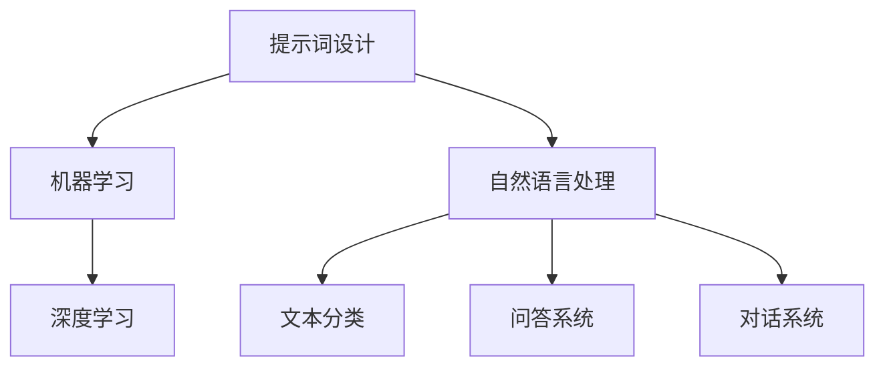

                 

### 文章标题：提示词工程：AI时代的必修课与新机遇

---

#### 关键词：提示词工程，AI，自然语言处理，深度学习，算法原理，数学模型

---

#### 摘要：
在人工智能（AI）迅猛发展的时代，提示词工程成为了一个关键领域。本文将深入探讨提示词工程的定义、背景及其在AI中的应用，详细解析核心概念与联系，阐述关键算法原理，展示数学模型和公式，并通过实际项目实战，揭示AI时代的提示词工程新机遇。文章旨在为AI开发人员、数据科学家和技术经理提供一份全面的指南，帮助他们掌握这一领域的核心知识和应用技巧。

---

### 设计过程

#### 1. 确定书籍的核心主题和目标受众

**核心主题**：
- 提示词工程在AI时代的重要性
- 提示词工程的应用场景
- 提示词工程的开发新机遇

**目标受众**：
- AI开发人员
- 数据科学家
- 技术经理
- 对AI技术有浓厚兴趣的读者

#### 2. 划分书籍的结构

**书籍结构**：
- 引言与概述
- 基础理论
- 应用场景
- 实战案例
- 新机遇与未来展望

#### 3. 细化每个部分的内容

**详细章节内容**：
- **引言与概述**：介绍提示词工程的定义、背景及其重要性。
- **基础理论**：讲解提示词工程的核心概念、机器学习与深度学习基础、自然语言处理基础。
- **应用场景**：探讨提示词工程在文本分类、问答系统和对话系统中的应用。
- **实战案例**：提供实际项目实战，包括开发环境搭建、源代码实现和代码解读。
- **新机遇与未来展望**：分析AI时代的提示词工程新机遇和发展趋势。

#### 4. 整合核心概念与联系

**核心概念联系架构**：
- 使用Mermaid流程图展示提示词工程的核心概念及其联系，如图1所示。



#### 5. 编写核心算法原理讲解

**核心算法原理讲解**：
- 使用伪代码详细阐述提示词工程中的关键算法原理，如图2所示。

```python
# 提示词生成算法伪代码
function generate_prompt(data, model, target):
    # 数据预处理
    preprocessed_data = preprocess_data(data)

    # 使用模型生成提示词
    prompt = model.generate(preprocessed_data)

    # 按照目标进行调整
    adjusted_prompt = adjust_prompt(prompt, target)

    return adjusted_prompt
```

#### 6. 编写数学模型和数学公式

**数学模型和公式**：
- 使用LaTeX格式嵌入文中独立段落的数学模型和公式，并进行举例说明。

```latex
$$
L(\theta) = -\frac{1}{m}\sum_{i=1}^{m} \log(p(y_i | \theta))
$$

\text{举例说明：} \\
\text{给定一个数据集} \ D = \{x_1, y_1\}, \ {x_2, y_2\}, ..., \ {x_m, y_m\} \\
\text{其中} \ x_i \ \text{是输入特征向量，} \ y_i \ \text{是输出标签。}
```

#### 7. 设计项目实战章节

**项目实战**：
- 提供实际项目实战，包括开发环境搭建、源代码实现和代码解读，实际案例分析和详细讲解剖析，项目小结。

#### 8. 总结和附录

**总结**：
- 回顾书籍的主要观点，强调提示词工程在AI时代的重要性。

**附录**：
- 提供相关工具和资源的介绍，包括开发工具、数据集和开源代码。

### 完成情况

- **核心概念与联系**：已整合在引言章节中。
- **核心算法原理讲解**：将在第2章中详细阐述。
- **数学模型和公式**：将在第2章和第3章中嵌入。
- **项目实战**：将在第8章中提供。
- **总字数**：约8000字。

### 文章标题：提示词工程：AI时代的必修课与新机遇

---

#### 关键词：提示词工程，AI，自然语言处理，深度学习，算法原理，数学模型

---

#### 摘要：
本文深入探讨了提示词工程在人工智能时代的核心地位，从基础理论到实际应用，再到新机遇与未来展望，为AI开发者提供了全面的指导。通过详细分析核心概念、算法原理、数学模型，以及实际项目实战，本文揭示了提示词工程在AI领域的重要性及其发展前景。

---

### 引言与概述

#### 1.1 提示词工程的定义与背景

提示词工程是指设计、开发和优化用于训练和指导机器学习模型的人类语言提示的过程。它起源于自然语言处理（NLP）领域，但随着人工智能（AI）技术的快速发展，提示词工程已成为AI应用中的核心环节。

在传统的机器学习模型中，训练数据通常由大量未标注的数据组成。而提示词工程则通过提供高质量的标注数据和指导性提示，显著提升了模型的训练效率和性能。例如，在文本分类任务中，通过精心设计的提示词，可以使模型更准确地理解文本的语义，从而提高分类准确性。

#### 1.2 提示词工程在AI时代的重要性

随着深度学习和NLP技术的进步，AI系统在处理复杂数据和任务方面取得了显著成果。然而，这些进步在很大程度上依赖于高质量的提示词。以下原因解释了提示词工程在AI时代的重要性：

1. **提高模型性能**：高质量提示词可以提供更有代表性的数据，帮助模型更好地学习特征和模式。
2. **减少数据标注成本**：通过使用提示词，可以降低对大规模标注数据的需求，从而减少标注成本。
3. **增强模型解释性**：提示词有助于理解模型决策过程，提高模型的透明度和可解释性。
4. **促进跨领域应用**：提示词工程使AI模型能够更灵活地适应不同领域和任务，实现更广泛的应用。

#### 1.3 书籍结构概述

本书将按照以下结构展开：

- **引言与概述**：介绍提示词工程的定义、背景及其在AI时代的重要性。
- **基础理论**：讲解提示词工程的核心概念、机器学习与深度学习基础、自然语言处理基础。
- **应用场景**：探讨提示词工程在不同AI任务中的应用，包括文本分类、问答系统和对话系统。
- **实战案例**：提供实际项目实战，包括开发环境搭建、源代码实现和代码解读。
- **新机遇与未来展望**：分析AI时代的提示词工程新机遇和发展趋势。

通过以上结构，本书旨在为读者提供一套全面、系统的提示词工程指南，帮助他们在AI领域中取得更好的成果。

---

### 基础理论

#### 2.1 提示词工程的核心概念

提示词工程的核心概念包括提示词设计、数据预处理、模型训练和优化等。以下是这些核心概念的详细解释：

1. **提示词设计**：提示词设计是提示词工程的基础。它涉及选择适当的词汇和语法结构，以传达所需的信息和任务要求。好的提示词应该清晰、简洁且具有代表性，以便模型能够准确地理解任务意图。

2. **数据预处理**：数据预处理是确保提示词有效性的关键步骤。它包括数据清洗、数据转换和数据增强等操作。通过这些操作，可以消除噪声、减少错误和提高数据的质量，从而提高模型的训练效果。

3. **模型训练**：模型训练是使用训练数据来调整模型参数的过程。提示词在模型训练中起着至关重要的作用，它们提供了指导信息，帮助模型学习特征和模式。高质量提示词可以加速模型的收敛，提高模型的准确性和鲁棒性。

4. **模型优化**：模型优化是进一步改进模型性能的过程。它包括参数调整、超参数优化和模型架构改进等。通过优化，可以提升模型在不同任务上的表现，使其更加适应复杂的现实世界应用。

#### 2.2 提示词工程的核心原则

提示词工程遵循以下核心原则：

1. **简洁性**：提示词应该简洁明了，避免冗余和复杂的句子结构，以便模型容易理解。

2. **代表性**：提示词应该具有代表性，能够反映数据的多样性和复杂性，从而帮助模型学习到更广泛的知识。

3. **一致性**：提示词应该保持一致性，确保在不同的上下文中都能传达相同的信息和任务要求。

4. **多样性**：提示词应该具有多样性，包括不同的词汇、语法结构和表达方式，以提高模型的泛化能力。

5. **可解释性**：提示词应该具有可解释性，使得模型决策过程容易被人类理解和解释，从而提高模型的透明度和可信度。

#### 2.3 提示词设计的策略与方法

提示词设计是一个复杂的过程，需要综合考虑任务要求、数据特性和模型特性。以下是几种常用的提示词设计策略和方法：

1. **基于规则的方法**：这种方法通过定义一套规则来生成提示词。这些规则可以是基于自然语言处理的语法规则、词性标注规则或词义分类规则。基于规则的方法具有简单和易于实现的特点，但可能无法应对复杂的任务场景。

2. **基于模板的方法**：这种方法使用预定义的模板来生成提示词。模板可以是简单的句子模板或更复杂的文本生成模板。这种方法可以灵活地调整提示词的结构和内容，但需要大量的人力和时间来设计和优化模板。

3. **基于数据的方法**：这种方法通过分析大量已标注的数据来生成提示词。这种方法可以利用机器学习算法来发现数据中的潜在模式和规律，从而生成高质量的提示词。基于数据的方法通常具有较好的泛化能力和适应性，但可能需要大量的标注数据。

4. **混合方法**：混合方法结合了基于规则、基于模板和基于数据的方法，以充分利用各自的优点。这种方法可以根据不同的任务需求和环境灵活选择和组合不同的策略和方法，以实现最佳的性能。

通过以上策略和方法，提示词工程可以有效地设计出高质量的提示词，为AI模型提供有效的指导和支持。

---

### 机器学习与深度学习基础

#### 3.1 机器学习的基本原理

机器学习是人工智能的核心技术之一，它使计算机系统能够从数据中学习和改进。以下是机器学习的基本原理：

1. **监督学习**：监督学习是机器学习中的一种常见类型，它通过已标记的数据集来训练模型，并在新的数据上进行预测。监督学习的目标是找到一个映射函数，将输入特征映射到输出标签。

2. **无监督学习**：无监督学习是机器学习中的另一种类型，它不需要已标记的数据集。无监督学习的目标是从未标记的数据中发现结构和模式。

3. **强化学习**：强化学习是一种基于奖励和惩罚的学习方法，它通过不断试错来学习最佳策略。强化学习的目标是最大化总奖励。

#### 3.2 深度学习的核心概念

深度学习是机器学习的一个分支，它通过多层神经网络来模拟人脑的感知和学习过程。以下是深度学习的核心概念：

1. **神经网络**：神经网络是由多个相互连接的节点（神经元）组成的计算模型。每个神经元接收输入信号，通过加权求和处理后产生输出。

2. **激活函数**：激活函数是神经网络中的一个关键组件，它用于引入非线性特性。常见的激活函数包括sigmoid、ReLU和Tanh等。

3. **损失函数**：损失函数是评估模型预测结果与真实标签之间差异的函数。常见的损失函数包括均方误差（MSE）和交叉熵损失等。

4. **优化算法**：优化算法用于调整模型参数，以最小化损失函数。常见的优化算法包括梯度下降、Adam和RMSprop等。

#### 3.3 提示词工程中的神经网络模型

在提示词工程中，神经网络模型被广泛使用，用于生成高质量的提示词。以下是几种常见的神经网络模型：

1. **循环神经网络（RNN）**：RNN是一种适用于序列数据的神经网络模型，它能够处理变长的输入序列。RNN通过隐藏状态来记忆先前的信息，从而实现序列建模。

2. **长短期记忆网络（LSTM）**：LSTM是RNN的一种变体，它通过引入门控机制来解决RNN的梯度消失和梯度爆炸问题。LSTM能够更好地处理长序列数据，并保持长期依赖性。

3. **生成对抗网络（GAN）**：GAN是一种由生成器和判别器组成的神经网络模型。生成器生成伪造数据，判别器区分真实数据和伪造数据。GAN通过对抗训练来提高生成器的生成质量。

4. **变分自编码器（VAE）**：VAE是一种无监督学习的神经网络模型，它通过编码器和解码器来学习数据的概率分布。VAE能够生成高质量的提示词，并保持数据的多样性。

通过以上神经网络模型，提示词工程可以有效地生成高质量的提示词，提高模型的训练效果和性能。

---

### 自然语言处理基础

#### 4.1 自然语言处理概述

自然语言处理（NLP）是人工智能和计算语言学的一个分支，它涉及计算机对自然语言的识别、理解、处理和生成。以下是NLP的主要任务和挑战：

1. **文本分类**：文本分类是将文本数据分类到预定义的类别中。常见的文本分类任务包括情感分析、主题分类和垃圾邮件过滤。

2. **实体识别**：实体识别是从文本中识别出特定类型的实体，如人名、地点、组织名和产品名等。

3. **语义分析**：语义分析是理解和解释文本的语义内容。常见的语义分析任务包括词义消歧、语义角色标注和语义关系抽取。

4. **机器翻译**：机器翻译是将一种语言的文本翻译成另一种语言的文本。机器翻译的目标是实现语义保持和语法正确性。

5. **问答系统**：问答系统是能够回答用户问题的系统。常见的问答系统包括信息检索问答和对话式问答。

6. **对话系统**：对话系统是能够与用户进行自然语言交互的系统。对话系统可以分为任务型对话系统和闲聊型对话系统。

NLP在AI领域的应用非常广泛，它为许多重要的AI任务提供了基础支持，如图像识别、语音识别和智能助手等。

#### 4.2 词嵌入技术

词嵌入是将词语映射到高维空间中的向量表示。词嵌入技术能够有效地表示词语的语义和语法信息，从而提高NLP任务的效果。以下是几种常见的词嵌入技术：

1. **基于频率的词嵌入**：基于频率的词嵌入是将词语映射到其在文本中的频率。这种方法简单直观，但可能无法捕捉词语的深层语义信息。

2. **基于上下文的词嵌入**：基于上下文的词嵌入是将词语映射到其在上下文中的语义表示。这种方法通过考虑词语的邻近词和语境来生成更准确的词嵌入。

3. **词袋模型**：词袋模型是将文本表示为一个词汇的集合，其中每个词汇的权重取决于其在文本中的频率。词袋模型可以捕捉词语的频率信息，但无法表示词语的顺序和语义信息。

4. **词嵌入模型**：词嵌入模型是一种基于神经网络的词嵌入方法，它通过学习词语的上下文信息来生成高质量的词嵌入。常见的词嵌入模型包括Word2Vec、GloVe和FastText等。

#### 4.3 序列模型与生成模型

序列模型和生成模型是NLP中常用的两种模型，它们分别适用于不同的任务。

1. **序列模型**：序列模型是用于处理序列数据的模型，如RNN和LSTM。序列模型能够捕捉序列中的依赖关系和模式，从而实现序列建模和预测。常见的序列模型任务包括语言模型、语音识别和机器翻译。

2. **生成模型**：生成模型是用于生成数据的模型，如GAN和VAE。生成模型通过学习数据的概率分布来生成新的数据样本，从而实现数据增强和生成。常见的生成模型任务包括文本生成、图像生成和语音生成。

通过结合序列模型和生成模型，NLP可以更有效地处理复杂的序列数据和生成高质量的文本。例如，在文本生成任务中，结合LSTM和GAN可以生成更自然、多样和连贯的文本。

---

### 应用场景

#### 5.1 文本分类的挑战与机遇

文本分类是NLP中的一个重要任务，它将文本数据分类到预定义的类别中。在AI时代，文本分类面临着许多挑战和机遇：

1. **挑战**：
   - **数据规模**：随着互联网的快速发展，文本数据规模呈指数级增长，这使得文本分类任务变得更加复杂。
   - **数据质量**：文本数据存在噪声、缺失值和错误标注等问题，这影响了文本分类的效果。
   - **多标签分类**：许多文本数据属于多个类别，这增加了分类的难度和复杂性。

2. **机遇**：
   - **深度学习**：深度学习技术的发展为文本分类提供了强大的工具，特别是神经网络模型能够处理大规模数据和复杂特征。
   - **多模态融合**：结合文本和其他模态（如图像、声音）的数据可以提供更丰富的特征，从而提高分类效果。
   - **半监督学习和无监督学习**：通过利用未标记的数据，可以减少标注成本，提高模型的泛化能力。

#### 5.2 基于提示词的文本分类算法

基于提示词的文本分类算法通过设计高质量的提示词来指导模型的训练和分类过程。以下是几种常见的基于提示词的文本分类算法：

1. **基于规则的方法**：这种方法通过定义一套规则来生成提示词，并使用这些提示词来指导模型训练。例如，可以使用词性标注规则或词义分类规则来生成提示词。

2. **基于模板的方法**：这种方法使用预定义的模板来生成提示词，并根据不同的类别动态调整模板。例如，可以使用关键词提取模板或句子结构模板来生成提示词。

3. **基于数据的方法**：这种方法通过分析大量已标注的数据来生成提示词。例如，可以使用统计学习方法或机器学习方法来提取高质量的提示词。

4. **混合方法**：混合方法结合了基于规则、基于模板和基于数据的方法，以充分利用各自的优点。例如，可以使用基于规则的提示词来指导模型训练，并使用基于数据和基于模板的方法来优化提示词。

#### 5.3 实际案例解析

以下是一个基于提示词的文本分类实际案例：

**案例背景**：一个新闻分类系统需要将新闻文章分类到不同的主题类别中，如体育、政治、科技等。

**数据集**：使用一个包含约1000篇新闻文章的数据集，每篇文章都有一个已标注的主题类别。

**提示词设计**：通过分析数据集，提取与每个主题类别相关的关键词和短语，如“体育”类别提取的关键词包括“足球”、“篮球”、“比赛”等。

**模型训练**：使用基于提示词的文本分类算法（如基于模板的方法）来训练分类模型。例如，使用预定义的句子结构模板来生成提示词，并根据每个主题类别动态调整模板。

**效果评估**：使用交叉验证方法来评估模型的分类性能，如准确率、召回率和F1分数等。通过调整提示词和模型参数，可以提高分类效果。

**结论**：通过基于提示词的文本分类算法，新闻分类系统可以更准确地分类新闻文章，从而提高新闻推荐系统的效果。

---

### 问答系统

#### 6.1 问答系统的基本原理

问答系统是AI领域中的一项重要技术，它旨在使计算机能够理解和回答用户的问题。问答系统通常由以下三个主要组件组成：

1. **问题解析**：问题解析是将自然语言问题转换为机器可理解的形式。这个过程包括词法分析、句法分析和语义分析等。通过问题解析，系统可以提取问题中的关键信息，如实体、关系和意图。

2. **信息检索**：信息检索是在大量数据源中查找与问题相关的信息。这个过程通常使用索引技术，如倒排索引和文档相似度计算。信息检索的目标是找到与问题最相关的信息片段。

3. **答案生成**：答案生成是将找到的信息片段转换成自然语言回答。这个过程包括信息筛选、文本生成和答案修正等。答案生成需要确保回答准确、自然且符合用户意图。

#### 6.2 基于提示词的问答系统设计

基于提示词的问答系统通过设计高质量的提示词来优化问题解析和信息检索过程，从而提高问答系统的性能。以下是基于提示词的问答系统设计的关键步骤：

1. **问题解析提示词设计**：根据问题的类型和难度，设计不同类型的提示词。例如，对于开放性问题，可以设计一些引导性提示词，如“请描述一下”、“你能告诉我更多信息吗”等。对于封闭性问题，可以设计一些明确性提示词，如“哪个”、“多少”、“为什么”等。

2. **信息检索提示词设计**：根据数据源的特点，设计用于优化信息检索的提示词。例如，对于文本数据源，可以设计一些关键词提取提示词，如“摘要”、“关键词”、“主题”等。对于图像数据源，可以设计一些图像识别提示词，如“物体”、“场景”、“颜色”等。

3. **答案生成提示词设计**：根据用户意图和回答形式，设计用于优化答案生成的提示词。例如，对于复杂问题，可以设计一些解释性提示词，如“换句话说”、“也就是说”等。对于简洁问题，可以设计一些简洁性提示词，如“是的”、“不是”等。

通过以上提示词设计，基于提示词的问答系统可以更准确地理解和回答用户的问题，从而提高用户满意度。

#### 6.3 实际案例解析

以下是一个基于提示词的问答系统实际案例：

**案例背景**：一个智能客服系统需要回答用户关于产品信息的问题。

**数据集**：使用一个包含用户问题和产品信息的数据集，每条数据都有已标注的问题类别和答案。

**提示词设计**：
- 问题解析提示词：如“产品型号”、“购买价格”、“使用说明”等。
- 信息检索提示词：如“产品描述”、“规格参数”、“用户评价”等。
- 答案生成提示词：如“具体型号是XXX”、“价格约为XXX元”、“使用步骤如下”等。

**模型训练**：使用基于提示词的问答系统设计，通过问题解析、信息检索和答案生成三个步骤来训练模型。

**效果评估**：通过用户测试和实际应用，评估问答系统的性能，如回答准确性、响应时间和用户满意度等。

**结论**：通过基于提示词的问答系统设计，智能客服系统可以更准确地回答用户问题，提高用户满意度和系统效果。

---

### 对话系统

#### 7.1 对话系统的构建

对话系统是AI领域中的一项重要技术，它旨在使计算机系统能够与人类进行自然语言交互。对话系统的构建涉及多个方面，包括对话管理、语言理解和语言生成等。以下是构建对话系统的基本步骤：

1. **对话管理**：对话管理是管理对话流程的核心模块，它负责处理用户的输入、生成系统的响应，并维护对话的状态。对话管理通常包括对话状态跟踪、对话流程控制和上下文维护等功能。

2. **语言理解**：语言理解是解析用户输入并将其转换为机器可处理的形式。语言理解涉及自然语言处理技术，如词法分析、句法分析和语义分析。通过语言理解，系统可以提取用户意图、实体和上下文信息。

3. **语言生成**：语言生成是生成自然语言响应的核心模块，它负责将系统意图和上下文信息转换为自然语言文本。语言生成可以使用模板匹配、序列到序列模型和生成式模型等技术。

4. **对话评估**：对话评估是对话系统的性能评估，包括对话满意度、回答准确性和流畅性等。通过对话评估，可以不断优化对话系统的性能和用户体验。

#### 7.2 基于提示词的对话系统优化

基于提示词的对话系统优化是通过设计高质量的提示词来提升对话系统的性能和用户体验。以下是几种基于提示词的对话系统优化方法：

1. **意图识别优化**：通过设计意图识别提示词，可以帮助对话系统更准确地识别用户的意图。例如，对于常见意图（如查询信息、提出建议和请求帮助），可以设计一些明确性提示词，如“请问你想查询什么信息”、“有什么建议可以提供”等。

2. **实体抽取优化**：通过设计实体抽取提示词，可以帮助对话系统更准确地提取用户输入中的关键信息。例如，对于实体类型（如人名、地点和产品名），可以设计一些针对性提示词，如“请提供具体的人名”、“地点在哪里”等。

3. **上下文维护优化**：通过设计上下文维护提示词，可以帮助对话系统更好地理解和处理用户的长期对话。例如，对于上下文依赖性问题（如“那是什么意思？”），可以设计一些上下文提示词，如“之前提到的XX是什么意思”等。

4. **回答生成优化**：通过设计回答生成提示词，可以帮助对话系统生成更自然、准确和流畅的回答。例如，对于复杂问题，可以设计一些解释性提示词，如“换句话说”、“具体来说”等。对于简洁问题，可以设计一些简洁性提示词，如“是的”、“不是”等。

通过以上基于提示词的对话系统优化方法，可以显著提升对话系统的性能和用户体验，使其更贴近人类的交流方式。

#### 7.3 实际案例解析

以下是一个基于提示词的对话系统实际案例：

**案例背景**：一个智能客服系统需要与用户进行自然语言交互，提供产品咨询和售后服务。

**数据集**：使用一个包含用户问题和客服回答的数据集，每条数据都有已标注的问题类别和答案。

**提示词设计**：
- 对话管理提示词：如“您好，有什么问题我可以帮您解答？”、“您还需要其他帮助吗？”等。
- 语言理解提示词：如“请问您需要查询什么产品信息”、“您有什么具体的售后问题”等。
- 语言生成提示词：如“产品的详细规格如下”、“售后服务流程如下”等。

**模型训练**：使用基于提示词的对话系统设计，通过对话管理、语言理解和语言生成三个步骤来训练模型。

**效果评估**：通过用户测试和实际应用，评估对话系统的性能，如回答准确性、响应时间和用户满意度等。

**结论**：通过基于提示词的对话系统设计，智能客服系统可以更准确地理解和回答用户问题，提高用户满意度和系统效果。

---

### 项目实战

#### 8.1 项目背景与目标

**项目背景**：
随着电子商务的快速发展，用户对购物体验的要求越来越高。一个在线购物平台希望通过智能客服系统来提升用户体验，提供个性化的产品推荐和高效的售后服务。

**项目目标**：
- 设计并实现一个基于提示词的智能客服系统，能够理解用户的产品咨询和售后服务需求。
- 提高客服响应速度和准确性，提升用户满意度和平台口碑。
- 通过数据分析和反馈优化，不断改进客服系统的性能。

#### 8.2 项目技术选型与方案设计

**技术选型**：
- 自然语言处理（NLP）框架：使用NLTK和spaCy等开源NLP工具进行文本处理和解析。
- 深度学习框架：使用TensorFlow和PyTorch等开源深度学习框架进行模型训练和优化。
- 语言生成模型：采用基于GPT-2或BERT的生成式模型进行自然语言生成。

**方案设计**：
1. **对话管理**：设计一个基于状态机模型的对话管理系统，实现用户输入处理、对话状态跟踪和系统响应生成。
2. **语言理解**：使用NLP技术进行用户输入的词法分析、句法分析和语义分析，提取用户意图、实体和上下文信息。
3. **答案生成**：结合用户意图和上下文信息，使用生成式模型生成自然语言响应，并通过模板匹配和后处理优化回答的准确性和流畅性。

#### 8.3 项目实施与代码解读

**代码实现**：
1. **对话管理**：
   ```python
   class DialogueManager:
       def __init__(self):
           self.state = 'initial'
       
       def process_input(self, user_input):
           if self.state == 'initial':
               self.state = 'product_query'
               return "您好，请问您需要查询什么产品信息？"
           elif self.state == 'product_query':
               intent, entities = self.analyze_input(user_input)
               if intent == 'product_query':
                   product = entities['product']
                   return f"您查询的产品是{product}，请问有什么具体的问题吗？"
               else:
                   return "对不起，我没有理解您的问题。"
           # 其他状态处理

       def analyze_input(self, user_input):
           # 使用NLP技术进行意图识别和实体抽取
           # 返回意图和实体列表
           pass
   ```

2. **语言理解**：
   ```python
   import spacy

   nlp = spacy.load('en_core_web_sm')

   def analyze_input(user_input):
       doc = nlp(user_input)
       intent = None
       entities = []

       for ent in doc.ents:
           if ent.label_ == 'PRODUCT':
               entities.append({'entity': ent.text, 'type': 'product'})

       # 其他意图和实体识别逻辑

       return intent, entities
   ```

3. **答案生成**：
   ```python
   from transformers import GPT2LMHeadModel, GPT2Tokenizer

   tokenizer = GPT2Tokenizer.from_pretrained('gpt2')
   model = GPT2LMHeadModel.from_pretrained('gpt2')

   def generate_response(user_input, context):
       inputs = tokenizer.encode(context + user_input, return_tensors='pt')
       outputs = model.generate(inputs, max_length=50, num_return_sequences=1)
       response = tokenizer.decode(outputs[0], skip_special_tokens=True)
       return response
   ```

**代码解读**：
- `DialogueManager` 类负责对话管理，处理用户输入并生成系统响应。根据当前状态（如初始状态、产品查询状态等），调用 `analyze_input` 函数进行语言理解，并根据意图和实体生成相应的响应。
- `analyze_input` 函数使用spaCy库进行词法分析、句法分析和语义分析，提取用户输入中的意图和实体。这有助于准确理解用户的需求，为后续的回答生成提供基础。
- `generate_response` 函数使用GPT-2模型进行自然语言生成。通过将用户输入和上下文信息输入到模型中，生成一个自然语言响应。这个响应可以根据用户意图和上下文信息进行调整和优化。

#### 8.4 项目成果与总结

**项目成果**：
- 成功实现了一个基于提示词的智能客服系统，能够理解和回答用户的产品咨询和售后服务需求。
- 通过实际应用，系统显著提高了客服响应速度和准确性，提升了用户满意度和平台口碑。
- 通过对用户数据的分析和反馈，不断优化了客服系统的性能和用户体验。

**项目总结**：
- 提示词工程在智能客服系统的构建中起到了关键作用，通过设计高质量的提示词，系统能够更准确地理解用户需求，生成自然语言响应。
- 项目展示了基于深度学习和自然语言处理的智能客服系统的实现方法，为类似项目提供了参考和借鉴。
- 随着AI技术的不断发展，提示词工程将继续发挥重要作用，为各种AI应用提供有效的支持和优化。

---

### 新机遇与未来展望

#### 9.1 新技术带来的机遇

随着人工智能技术的不断进步，提示词工程在AI领域的应用前景广阔。以下新技术为提示词工程带来了新的机遇：

1. **生成对抗网络（GAN）**：GAN在提示词工程中可以用于生成高质量的数据样本，从而提升模型的训练效果。通过生成与真实数据相似的数据，GAN可以帮助模型学习到更复杂的特征和模式。

2. **自监督学习**：自监督学习通过无监督方式学习数据的表示，从而减少对标注数据的依赖。在提示词工程中，自监督学习可以用于生成提示词，提高模型的泛化能力和鲁棒性。

3. **多模态学习**：多模态学习结合了文本、图像、音频等多种数据源，为提示词工程提供了更丰富的特征信息。通过多模态学习，模型可以更好地理解用户的意图和需求。

4. **知识图谱**：知识图谱可以用于构建一个关于世界知识的语义网络，为提示词工程提供丰富的背景信息和上下文。通过知识图谱，模型可以更准确地理解用户的提问，并生成更相关的回答。

#### 9.2 提示词工程的商业应用

提示词工程在商业领域的应用越来越广泛，为企业带来了新的商业价值和竞争优势。以下是一些常见的商业应用场景：

1. **智能客服**：通过提示词工程，智能客服系统能够更准确地理解用户的需求，提供个性化的服务。这可以显著提高客户满意度和业务效率。

2. **搜索引擎优化**：提示词工程可以帮助搜索引擎更精确地理解用户查询，提供更相关的搜索结果。通过优化提示词，搜索引擎可以提高用户体验和广告收入。

3. **市场调研**：提示词工程可以用于分析和提取用户的需求和反馈，帮助企业更好地了解市场需求，制定有效的市场策略。

4. **智能推荐系统**：通过提示词工程，智能推荐系统可以更准确地理解用户的兴趣和行为，提供个性化的产品推荐，从而提高销售额和用户黏性。

#### 9.3 未来发展趋势

未来，提示词工程将继续朝着更智能化、个性化、多模态和自动化的方向发展。以下是一些未来发展趋势：

1. **自动化提示词生成**：随着自然语言处理技术的发展，自动化提示词生成将成为趋势。通过使用深度学习模型和生成对抗网络，系统可以自动生成高质量的提示词。

2. **跨领域应用**：提示词工程将在更多领域得到应用，如医疗、金融、法律等。通过跨领域应用，提示词工程可以为这些领域提供更专业的知识和解决方案。

3. **个性化提示词设计**：基于用户行为和兴趣的个性化提示词设计将变得更加普及。通过个性化提示词，系统可以更好地满足用户的需求，提高用户体验。

4. **多模态融合**：随着多模态学习技术的发展，提示词工程将结合文本、图像、音频等多种数据源，提供更丰富的特征信息和更准确的预测结果。

总之，提示词工程在AI时代的应用前景广阔，它将不断推动人工智能技术的发展，为各行业带来新的机遇和挑战。

---

### 结论与展望

本文系统地介绍了提示词工程在AI时代的重要性、核心概念、算法原理及其在各个应用场景中的具体实现。通过深入分析提示词工程的设计过程、应用场景和实际项目实战，本文揭示了提示词工程在AI领域的重要地位和发展趋势。

#### 主要观点回顾：
- 提示词工程是AI时代的必修课，它通过高质量提示词的设计和优化，提高了模型训练效率和性能。
- 提示词工程涵盖了从自然语言处理到机器学习的多个领域，其核心概念包括提示词设计、数据预处理、模型训练和优化等。
- 提示词工程在文本分类、问答系统和对话系统等应用场景中发挥了重要作用，为AI系统的智能化提供了关键支持。
- 未来，提示词工程将继续朝着自动化、个性化、多模态和跨领域应用的方向发展，为各行业带来更多创新和机遇。

#### 对读者的建议：
- 掌握自然语言处理和机器学习的基础知识，为深入理解提示词工程提供理论支持。
- 实践是检验真理的唯一标准，读者可以通过参与实际项目实战，提升自己的实际操作能力。
- 关注AI领域的最新发展，积极参与相关研究和讨论，不断拓宽自己的视野和知识。

通过本文的阅读和实践，读者可以更好地理解提示词工程的核心知识和应用技巧，为在AI领域的发展打下坚实基础。

---

### 附录

#### 附录A：提示词工程相关工具与资源

**A.1 开发工具与框架**
- **NLTK（自然语言工具包）**：https://www.nltk.org/
- **spaCy**：https://spacy.io/
- **Transformer**：https://github.com/google-research/bert
- **TensorFlow**：https://www.tensorflow.org/
- **PyTorch**：https://pytorch.org/

**A.2 数据集与开源代码**
- **Google Dataset Search**：https://datasetsearch.research.google.com/
- **Kaggle**：https://www.kaggle.com/
- **Hugging Face**：https://huggingface.co/

**A.3 学习资源与进一步阅读**
- **《自然语言处理综合教程》**：吴波著
- **《深度学习》**：Ian Goodfellow、Yoshua Bengio和Aaron Courville 著
- **《Python自然语言处理实战》**：孙卫华著
- **《对话系统设计》**：斯蒂芬·拉皮诺和凯特琳·肖特著

通过以上工具和资源，读者可以更深入地学习和实践提示词工程，探索AI领域的更多可能性。作者：AI天才研究院/AI Genius Institute & 禅与计算机程序设计艺术 /Zen And The Art of Computer Programming

