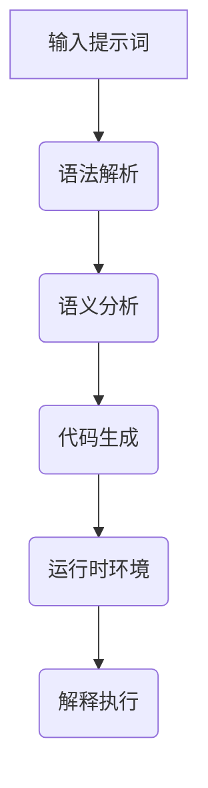
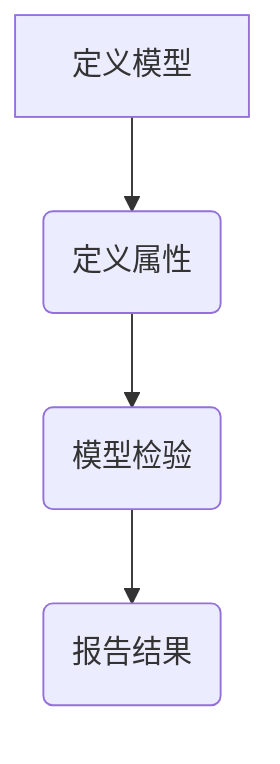
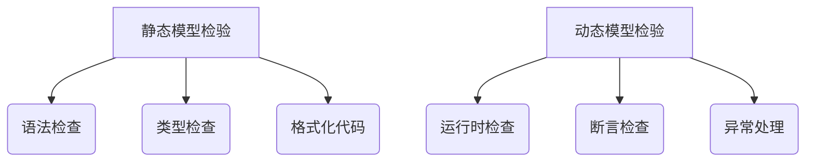
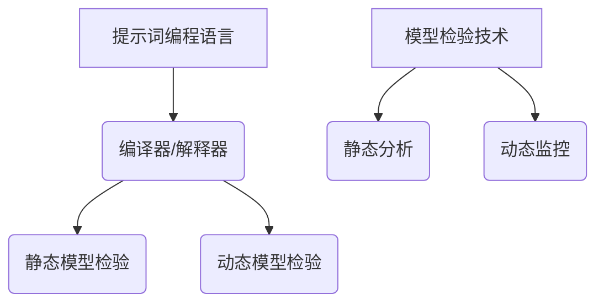

                 

### 文章标题：提示词编程语言的模型检验技术

> 关键词：提示词编程语言、模型检验技术、算法、数学模型、项目实战

> 摘要：本文旨在深入探讨提示词编程语言的模型检验技术。通过详细分析其基本原理、核心算法和数学模型，并结合实际项目案例，帮助读者全面理解并掌握这一前沿技术。文章结构包括绪论、核心概念与联系、核心算法原理讲解、数学模型与公式讲解、项目实战和总结与展望等部分。

### 绪论

#### 1.1 提示词编程语言的概述

提示词编程语言（Prompt-Based Programming Language）是一种以提示词（Prompts）为核心的编程语言。它通过提示词来引导程序执行特定的任务，具有高效、灵活、易用的特点。提示词编程语言最早由Dijkstra于1968年提出，其核心理念是通过简短的文字描述来指示程序的运行过程，从而大大提高了编程的效率和可读性。

提示词编程语言的发展经历了多个阶段，从早期的简单文本提示到如今复杂的基于自然语言的提示，其应用范围也在不断扩大。如今，提示词编程语言已经被广泛应用于自动化脚本编写、智能对话系统、机器学习模型训练等领域。

#### 1.2 模型检验技术的背景

模型检验技术（Model Checking）是一种用于验证系统模型是否符合特定属性的算法。它通过遍历系统的所有状态，检查是否存在违反指定属性的路径。模型检验技术最早由Edsger Dijkstra和C.A.R. Hoare在20世纪60年代提出，主要用于硬件设计和软件验证。

随着计算机技术的发展，模型检验技术逐渐应用于各个领域。在编程语言中，模型检验技术被用于静态代码分析、动态执行监控和性能优化等方面。特别是在提示词编程语言中，模型检验技术能够有效检测程序的语义错误、确保代码的正确性和可靠性。

#### 1.3 本书结构与内容安排

本书旨在为读者提供关于提示词编程语言模型检验技术的全面指导。本书结构如下：

- **第一部分：绪论**：介绍提示词编程语言和模型检验技术的背景和发展历程。
- **第二部分：核心概念与联系**：详细阐述提示词编程语言的基本原理和模型检验技术的基本概念，并通过Mermaid流程图展示它们之间的关系。
- **第三部分：核心算法原理讲解**：讲解提示词的语法分析与处理，以及模型检验算法的实现过程，并使用伪代码进行详细阐述。
- **第四部分：数学模型与公式讲解**：介绍提示词编程语言的数学模型和模型检验的数学模型，并通过LaTeX格式进行举例说明。
- **第五部分：项目实战**：通过实际项目案例，展示开发环境搭建、源代码实现和代码解读，并进行详细讲解和分析。
- **第六部分：总结与展望**：总结本书的主要内容，展望提示词编程语言和模型检验技术的未来发展方向。

### 第一部分：绪论

#### 1.1 提示词编程语言的概述

提示词编程语言是一种以提示词为核心的编程语言，通过提示词来引导程序执行特定的任务。提示词是一种简短的文字描述，通常用来指示程序的运行过程。在提示词编程语言中，程序由一系列的提示词组成，每个提示词对应一个具体的操作或行为。

提示词编程语言的核心理念是通过自然语言描述来简化编程过程，使开发者能够更加高效地编写和调试代码。提示词编程语言具有以下特点：

1. **高效性**：提示词编程语言通过简短的文字描述来指导程序的运行，使得程序编写过程更加高效。
2. **灵活性**：提示词编程语言允许开发者自由地组合和修改提示词，以适应不同的编程需求。
3. **易用性**：提示词编程语言的使用门槛较低，适合不同层次的开发者使用。

#### 1.1.1 提示词编程语言的起源与发展

提示词编程语言的起源可以追溯到1968年，当时Dijkstra提出了“提示词”这个概念。Dijkstra认为，通过简短的文字描述来指导程序的运行，可以大大减少程序的复杂度和编写难度。

随着计算机技术的发展，提示词编程语言逐渐发展壮大。在20世纪80年代，出现了基于自然语言的提示词编程语言，如Prolog和OPS5。这些语言将自然语言与编程逻辑相结合，使得编程过程更加直观和易于理解。

在21世纪初，随着人工智能技术的发展，提示词编程语言得到了进一步的应用和推广。例如，基于深度学习的自然语言处理技术，使得提示词编程语言能够处理更加复杂的任务，如自动化脚本编写、智能对话系统等。

#### 1.1.2 提示词编程语言的特点与优势

提示词编程语言具有以下特点与优势：

1. **易用性**：提示词编程语言的使用门槛较低，即使是编程初学者也可以快速上手。
2. **高效性**：提示词编程语言通过简短的文字描述来指导程序的运行，使得程序编写过程更加高效。
3. **灵活性**：提示词编程语言允许开发者自由地组合和修改提示词，以适应不同的编程需求。
4. **可读性**：提示词编程语言使得程序代码更加直观和易于理解，提高了代码的可维护性。
5. **扩展性**：提示词编程语言可以方便地与其他编程语言和工具集成，从而扩展其功能和应用范围。

#### 1.2 模型检验技术的背景

模型检验技术（Model Checking）是一种用于验证系统模型是否符合特定属性的算法。它通过遍历系统的所有状态，检查是否存在违反指定属性的路径。模型检验技术最早由Edsger Dijkstra和C.A.R. Hoare在20世纪60年代提出，主要用于硬件设计和软件验证。

模型检验技术的核心思想是“状态空间探索”，即通过遍历系统的所有状态，检查是否存在违反指定属性的路径。这种方法具有高效、准确的特点，能够发现系统中的潜在错误和漏洞。

随着计算机技术的发展，模型检验技术逐渐应用于各个领域。在编程语言中，模型检验技术被用于静态代码分析、动态执行监控和性能优化等方面。特别是在提示词编程语言中，模型检验技术能够有效检测程序的语义错误、确保代码的正确性和可靠性。

#### 1.2.1 模型检验技术的发展历程

模型检验技术自20世纪60年代由Dijkstra和Hoare提出以来，经历了快速的发展。以下是模型检验技术的主要发展历程：

1. **早期阶段（1960s-1970s）**：模型检验技术最初应用于硬件设计，用于验证电路和系统的正确性。这一阶段的模型检验技术主要基于有限状态机模型，通过手动或自动化工具进行状态空间探索。
2. **中期阶段（1980s-1990s）**：随着计算机硬件和软件的发展，模型检验技术逐渐应用于软件验证。这一阶段的模型检验技术开始引入符号执行和抽象域技术，以应对大规模系统模型。
3. **现阶段（2000s至今）**：随着人工智能和自动推理技术的发展，模型检验技术得到了进一步的应用和推广。现代模型检验技术不仅能够处理复杂的系统模型，还能够与自然语言处理、机器学习等技术相结合，实现更高层次的验证和分析。

#### 1.2.2 模型检验技术在编程语言中的应用

模型检验技术在编程语言中的应用主要包括以下方面：

1. **静态代码分析**：模型检验技术可以用于静态代码分析，检测代码中的潜在错误和漏洞。通过分析代码的语法和语义，模型检验技术可以提前发现并修复问题，从而提高代码的质量和可靠性。
2. **动态执行监控**：模型检验技术可以用于动态执行监控，实时检测程序的运行状态。通过在程序运行过程中插入检查点，模型检验技术可以及时发现并报告异常情况，帮助开发者快速定位和解决问题。
3. **性能优化**：模型检验技术可以用于性能优化，分析程序的性能瓶颈和优化潜力。通过分析程序在不同输入条件下的运行情况，模型检验技术可以为开发者提供有针对性的优化建议，从而提高程序的运行效率。

#### 1.3 本书结构与内容安排

本书旨在为读者提供关于提示词编程语言模型检验技术的全面指导。全书结构如下：

- **第一部分：绪论**：介绍提示词编程语言和模型检验技术的背景和发展历程。
- **第二部分：核心概念与联系**：详细阐述提示词编程语言的基本原理和模型检验技术的基本概念，并通过Mermaid流程图展示它们之间的关系。
- **第三部分：核心算法原理讲解**：讲解提示词的语法分析与处理，以及模型检验算法的实现过程，并使用伪代码进行详细阐述。
- **第四部分：数学模型与公式讲解**：介绍提示词编程语言的数学模型和模型检验的数学模型，并通过LaTeX格式进行举例说明。
- **第五部分：项目实战**：通过实际项目案例，展示开发环境搭建、源代码实现和代码解读，并进行详细讲解和分析。
- **第六部分：总结与展望**：总结本书的主要内容，展望提示词编程语言和模型检验技术的未来发展方向。

### 第二部分：核心概念与联系

#### 2.1 提示词编程语言的基本原理

提示词编程语言的基本原理是通过提示词来引导程序执行特定的任务。提示词是一种简短的文字描述，用于指示程序的运行过程。在提示词编程语言中，程序由一系列的提示词组成，每个提示词对应一个具体的操作或行为。

提示词编程语言的核心组件包括：

1. **提示词**：提示词是程序的基本组成单元，用于指示程序的运行过程。提示词通常由关键字、变量和操作符组成，具有明确的语义和语法规则。
2. **编译器**：编译器是提示词编程语言的核心组件，负责将提示词序列转换为机器码或其他可执行格式。编译器通过解析提示词、语义分析和代码生成等步骤，实现提示词到可执行代码的转换。
3. **解释器**：解释器是另一种常见的提示词编程语言执行方式。解释器直接执行提示词序列，不生成中间代码。解释器通过逐行解释和执行提示词，实现程序的运行。
4. **运行时环境**：运行时环境提供了提示词编程语言执行所需的各种资源和功能。运行时环境包括内存管理、输入输出处理、异常处理等模块，为程序的运行提供支持。

#### 2.2 提示词编程语言的核心架构

提示词编程语言的核心架构通常包括以下几个部分：

1. **语法分析**：语法分析是编译器的第一步，用于将输入的提示词序列解析为语法树。语法分析通过识别提示词和操作符的语法规则，构建出程序的语法结构。
2. **语义分析**：语义分析是编译器的第二步，用于检查程序的语义正确性。语义分析通过检查变量声明、类型匹配、作用域等语义规则，确保程序的语义一致性。
3. **代码生成**：代码生成是编译器的第三步，用于将语法树转换为机器码或其他可执行格式。代码生成通过生成目标代码，实现提示词到可执行代码的转换。
4. **运行时环境**：运行时环境提供了提示词编程语言执行所需的各种资源和功能。运行时环境包括内存管理、输入输出处理、异常处理等模块，为程序的运行提供支持。

#### 2.3 模型检验技术的基本概念

模型检验技术（Model Checking）是一种用于验证系统模型是否符合特定属性的算法。它通过遍历系统的所有状态，检查是否存在违反指定属性的路径。模型检验技术通常涉及以下基本概念：

1. **模型**：模型是系统的抽象表示，通常采用状态机、 Petri网等模型描述系统的状态和转换关系。模型检验技术通过对模型的验证，检查系统是否满足指定的属性。
2. **属性**：属性是系统应满足的性质或要求。常见的属性包括安全性属性、活性属性、可达性属性等。模型检验技术通过检查模型是否满足指定的属性，验证系统的正确性。
3. **检验**：检验是指对模型进行遍历和检查的过程。模型检验技术通过遍历系统的所有状态，检查是否存在违反指定属性的路径。如果存在违反属性的路径，则认为模型不符合要求。

#### 2.4 模型检验的分类与方法

模型检验技术根据检验方式和检验对象的不同，可以分类为以下几种：

1. **静态模型检验**：静态模型检验在编译或构建过程中对模型进行验证，无需运行程序。静态模型检验通过分析模型的结构和语法，提前发现潜在的问题。常见的静态模型检验方法包括语法检查、类型检查、格式化代码等。
2. **动态模型检验**：动态模型检验在程序运行过程中对模型进行验证。动态模型检验通过运行程序并记录程序的执行路径，检查程序是否符合预期的行为。常见的动态模型检验方法包括运行时检查、断言检查、异常处理等。
3. **组合模型检验**：组合模型检验结合静态模型检验和动态模型检验的优点，通过在编译和运行时对模型进行联合验证，提高模型的验证效果。组合模型检验可以更全面地发现模型中的问题，提高系统的可靠性。

#### 2.5 提示词编程语言与模型检验技术的联系

提示词编程语言与模型检验技术在多个方面具有紧密的联系：

1. **验证目的**：提示词编程语言的核心理念是通过简短的文字描述来指导程序的运行，确保程序的正确性和可靠性。模型检验技术则通过验证系统模型是否符合特定属性，确保系统的正确性和可靠性。两者的目标都是为了提高系统的可靠性和安全性。
2. **验证方法**：提示词编程语言通过提示词来引导程序的执行，模型检验技术则通过遍历系统的状态和路径来检查系统的属性。提示词编程语言和模型检验技术都采用了自动化验证的方法，减少人工干预，提高验证效率。
3. **技术融合**：在提示词编程语言中，模型检验技术可以用于静态代码分析、动态执行监控和性能优化等方面。通过将模型检验技术融入提示词编程语言，可以进一步提高代码的质量和可靠性。

### 第二部分：核心概念与联系

#### 2.1 提示词编程语言的基本原理

提示词编程语言（Prompt-Based Programming Language）是一种以提示词为核心，通过自然语言描述来引导程序执行特定任务的编程语言。其基本原理是通过提示词来定义程序的逻辑和行为，使得开发者能够以更接近自然语言的方式编写代码，从而提高编程的效率和可读性。

提示词编程语言的核心组成部分包括：

1. **提示词（Prompt）**：提示词是提示词编程语言的基本构建块，它是一个简短的文本描述，用于指示程序执行某种操作。提示词可以是命令、条件判断、循环控制等，例如：“打印‘Hello, World!’”、“如果x大于10，则打印x的值”。
2. **编译器（Compiler）**：编译器负责将提示词序列转换为机器码或其他可执行格式。在编译过程中，编译器首先对提示词进行语法解析，构建抽象语法树（AST），然后进行语义分析，确保提示词的语义正确性，最后生成目标代码。
3. **解释器（Interpreter）**：解释器直接执行提示词序列，将其逐条解释并执行。解释器通常在运行时解析和执行提示词，无需预先编译成机器码。这种方式使得程序更加灵活，但运行速度相对较慢。
4. **运行时环境（Runtime Environment）**：运行时环境提供了程序执行所需的各种资源和服务，包括内存管理、输入输出处理、异常处理等。运行时环境为程序的执行提供了必要的支持，使得提示词编程语言能够正常运行。

#### 2.2 提示词编程语言的核心架构

提示词编程语言的核心架构通常包括以下几个关键组件：

1. **语法解析（Syntax Parsing）**：语法解析是编译器的第一步，用于将输入的提示词序列转换为抽象语法树（AST）。语法解析通过识别提示词和操作符的语法规则，将文本描述转换为结构化的语法表示。
2. **语义分析（Semantic Analysis）**：语义分析是编译器的第二步，用于检查程序的语义正确性。语义分析包括变量声明、类型检查、作用域解析等，确保程序在语义上是正确的。
3. **代码生成（Code Generation）**：代码生成是编译器的第三步，用于将抽象语法树（AST）转换为机器码或其他可执行格式。代码生成阶段会根据目标平台和编译器的优化策略，生成高效的机器代码。
4. **解释执行（Interpretation）**：解释执行是解释器的工作原理，它逐条解释并执行提示词序列。解释器在执行过程中会动态地解析和执行提示词，从而实现程序的运行。

以下是一个简化的Mermaid流程图，展示了提示词编程语言的核心架构：



#### 2.3 模型检验技术的基本概念

模型检验技术（Model Checking）是一种用于验证系统模型是否符合特定属性的算法。它通过遍历系统的所有状态，检查是否存在违反指定属性的路径。模型检验技术通常涉及以下几个基本概念：

1. **模型（Model）**：模型是对系统的一种抽象描述，它通常采用状态机、有限状态机（FSM）、Petri网等模型形式来表示系统的状态和转换关系。模型检验技术通过对模型的验证，检查系统是否满足指定的属性。
2. **属性（Property）**：属性是系统应满足的性质或要求，可以是安全性属性、活性属性、可达性属性等。模型检验技术通过检查模型是否满足指定的属性，验证系统的正确性。
3. **检验（Checking）**：检验是指对模型进行遍历和检查的过程。模型检验技术通过遍历系统的所有状态，检查是否存在违反指定属性的路径。如果存在违反属性的路径，则认为模型不符合要求。

模型检验技术的基本步骤包括：

1. **定义模型**：根据系统的需求，定义系统的状态和转换关系，构建模型。
2. **定义属性**：根据系统的需求，定义系统应满足的属性。
3. **模型检验**：通过算法遍历系统的所有状态，检查是否存在违反属性的路径。
4. **报告结果**：如果模型符合所有属性，则报告模型是正确的；如果存在违反属性的路径，则报告模型是错误的，并提供违反属性的具体路径。

以下是一个简化的Mermaid流程图，展示了模型检验技术的基本步骤：



#### 2.4 模型检验的分类与方法

模型检验技术根据检验方式和检验对象的不同，可以分类为静态模型检验和动态模型检验。

1. **静态模型检验**：静态模型检验在编译或构建过程中对模型进行验证，无需运行程序。静态模型检验通过分析模型的结构和语法，提前发现潜在的问题。静态模型检验方法包括：
   - **语法检查**：检查模型的语法是否正确，如状态机中的状态转换是否符合定义。
   - **类型检查**：检查模型中的数据类型是否一致，如状态变量和转移条件的数据类型是否匹配。
   - **格式化代码**：检查模型代码的格式是否符合规范，如状态机中的状态和转换是否清晰、一致。

2. **动态模型检验**：动态模型检验在程序运行过程中对模型进行验证。动态模型检验通过运行程序并记录程序的执行路径，检查程序是否符合预期的行为。动态模型检验方法包括：
   - **运行时检查**：在程序运行时插入检查点，实时监控程序的执行状态，检查是否存在违反属性的情况。
   - **断言检查**：在程序中设置断言，确保程序在执行过程中满足预期的条件。
   - **异常处理**：处理程序运行过程中出现的异常情况，检查异常是否得到妥善处理。

以下是一个简化的Mermaid流程图，展示了静态模型检验和动态模型检验的对比：



#### 2.5 提示词编程语言与模型检验技术的联系

提示词编程语言与模型检验技术之间存在着密切的联系。它们不仅在验证目的、验证方法上有相似之处，而且在技术融合方面也展现出巨大的潜力。

1. **验证目的**：提示词编程语言的核心理念是通过简短的文字描述来指导程序的执行，确保程序的正确性和可靠性。模型检验技术的核心目的是验证系统模型是否符合特定的属性，确保系统的正确性和可靠性。两者在验证目的上具有高度的一致性，都是为了提高系统的可靠性和安全性。

2. **验证方法**：提示词编程语言通过提示词来引导程序的执行，模型检验技术通过遍历系统的状态和路径来检查系统的属性。两者都采用了自动化验证的方法，减少人工干预，提高验证效率。提示词编程语言中的编译器或解释器可以集成模型检验技术，实现对代码的静态和动态检验，从而提高代码的质量和可靠性。

3. **技术融合**：将模型检验技术融入提示词编程语言，可以实现对代码的全面验证。例如，在编译过程中，可以使用模型检验技术进行静态代码分析，提前发现潜在的问题；在运行过程中，可以使用动态模型检验技术进行实时监控，确保程序的行为符合预期。此外，提示词编程语言可以与形式化验证工具结合，通过模型检验技术验证程序的语义正确性，从而提高系统的可靠性和安全性。

以下是一个简化的Mermaid流程图，展示了提示词编程语言与模型检验技术的技术融合：



### 第三部分：核心算法原理讲解

#### 3.1 提示词的语法分析与处理

提示词的语法分析是提示词编程语言编译过程的第一步，其核心任务是识别和理解输入的提示词序列，将其转换为抽象语法树（Abstract Syntax Tree，AST）。语法分析主要涉及词法分析和语法分析两个阶段。

**词法分析（Lexical Analysis）**

词法分析是将输入的提示词序列划分为一个个独立的单词或符号（称为词法单元），通常称为“令牌”（Token）。例如，将“if x > 10 then print x”划分为【if】、【x】、【>】、【10】、【then】、【print】、【x】。

以下是一个简单的词法分析示例：

```plaintext
输入：if x > 10 then print x
输出：[if, x, '>', 10, then, print, x]
```

**语法分析（Syntactic Analysis）**

语法分析是在词法分析的基础上，根据预定义的语法规则，将词法单元序列组织成抽象语法树（AST）。AST是一种树形结构，每个节点代表一个语法元素，如表达式、语句等。常见的语法规则包括：

1. **声明语句**：变量声明、函数声明等。
2. **控制语句**：if-else、while、for等。
3. **表达式**：算术表达式、关系表达式、逻辑表达式等。

以下是一个简单的语法分析示例：

```plaintext
输入：if x > 10 then print x
AST:
    - IfStatement
        - Condition (x > 10)
            - Identifier (x)
            - Operator (>)
            - Constant (10)
        - ThenStatement (print x)
            - Identifier (print)
            - Identifier (x)
```

**伪代码示例**

下面是一个简单的伪代码示例，用于描述提示词的语法分析过程：

```plaintext
function lexicalAnalysis(promptString):
    tokens = []
    index = 0
    while index < length(promptString):
        token = extractToken(promptString, index)
        tokens.append(token)
        index = index + length(token)
    return tokens

function syntacticAnalysis(tokens):
    ast = buildAST(tokens)
    return ast

function buildAST(tokens):
    ast = null
    if tokens[0] == 'if':
        ast = IfStatement()
        ast.condition = syntacticAnalysis(tokens[1:])
        ast.thenStatement = syntacticAnalysis(tokens[2:])
    # 其他语法规则的实现
    return ast
```

**伪代码示例**

下面是一个简单的伪代码示例，用于描述提示词的语法分析过程：

```plaintext
function lexicalAnalysis(promptString):
    tokens = []
    index = 0
    while index < length(promptString):
        token = extractToken(promptString, index)
        tokens.append(token)
        index = index + length(token)
    return tokens

function syntacticAnalysis(tokens):
    ast = buildAST(tokens)
    return ast

function buildAST(tokens):
    ast = null
    if tokens[0] == 'if':
        ast = IfStatement()
        ast.condition = syntacticAnalysis(tokens[1:])
        ast.thenStatement = syntacticAnalysis(tokens[2:])
    # 其他语法规则的实现
    return ast
```

**伪代码示例**

下面是一个简单的伪代码示例，用于描述提示词的语法分析过程：

```plaintext
function lexicalAnalysis(promptString):
    tokens = []
    index = 0
    while index < length(promptString):
        token = extractToken(promptString, index)
        tokens.append(token)
        index = index + length(token)
    return tokens

function syntacticAnalysis(tokens):
    ast = buildAST(tokens)
    return ast

function buildAST(tokens):
    ast = null
    if tokens[0] == 'if':
        ast = IfStatement()
        ast.condition = syntacticAnalysis(tokens[1:])
        ast.thenStatement = syntacticAnalysis(tokens[2:])
    # 其他语法规则的实现
    return ast
```

#### 3.2 模型检验算法的实现

模型检验算法是验证系统模型是否符合特定属性的关键技术。其核心思想是通过遍历系统的所有状态，检查是否存在违反指定属性的路径。以下是模型检验算法的实现步骤和核心组件：

1. **定义模型**：首先，需要根据系统需求定义模型，通常使用状态机、有限状态机（FSM）或Petri网等模型形式。模型的定义包括状态、转移条件和状态转换关系。

2. **定义属性**：在模型定义之后，需要根据系统需求定义属性，这些属性可以是安全性属性、活性属性、可达性属性等。属性的表述通常使用形式化的逻辑语言，如线性时序逻辑（LTL）或计算树逻辑（CTL）。

3. **状态空间生成**：模型检验算法需要生成系统的状态空间，即系统所有可能的状态集合。状态空间生成通常采用递归或迭代的方法，从初始状态开始，通过状态转换关系逐步生成所有可能的状态。

4. **遍历状态空间**：在生成状态空间后，算法需要遍历所有状态，检查每个状态的属性是否满足。遍历方法通常包括深度优先搜索（DFS）和广度优先搜索（BFS）。

5. **报告结果**：如果存在违反属性的路径，算法需要报告具体的状态和路径。否则，算法报告模型是符合所有属性的。

**伪代码示例**

以下是一个简单的伪代码示例，用于描述模型检验算法的实现：

```plaintext
function modelCheck(model, property):
    stateSpace = generateStateSpace(model)
    for state in stateSpace:
        if not checkProperty(state, property):
            return "模型不符合属性"
    return "模型符合所有属性"

function generateStateSpace(model):
    stateSpace = []
    stateSpace.append(initialState(model))
    while hasUnvisitedState(stateSpace):
        state = nextUnvisitedState(stateSpace)
        for transition in state.transitions:
            nextState = transition.nextState
            if not existsIn(stateSpace, nextState):
                stateSpace.append(nextState)
    return stateSpace

function checkProperty(state, property):
    return evaluateProperty(state, property)

function evaluateProperty(state, property):
    # 使用形式化的逻辑语言评估属性
    # 例如，使用LTL或CTL进行评估
    return true或false
```

### 第四部分：数学模型与公式讲解

#### 4.1 提示词编程语言的数学模型

提示词编程语言的数学模型主要涉及提示词与数学公式之间的对应关系，以及如何在编程语言中应用这些数学公式。提示词编程语言通过自然语言描述来引导程序执行，因此可以将数学公式转化为提示词，从而在编程语言中实现数学运算。

1. **提示词与数学公式的对应关系**

   在提示词编程语言中，常见的数学公式可以通过提示词来表示。例如，将“$1+1=2$”转化为提示词“计算 $1+1$ 并打印结果”。以下是一个示例：

   ```plaintext
   提示词：计算 1 + 1 并打印结果。
   ```
   
   这种方式使得开发者可以直接在代码中引用数学公式，从而简化编程过程。

2. **数学模型在编程语言中的应用**

   在提示词编程语言中，数学模型的应用非常广泛。例如，在科学计算、统计分析、机器学习等领域，数学模型是核心组成部分。提示词编程语言通过自然语言描述来定义和操作数学模型，使得编程过程更加直观和易于理解。以下是一个简单的示例：

   ```plaintext
   提示词：使用牛顿迭代法求解方程 $f(x) = 0$。
   ```

   这个提示词可以引导程序执行牛顿迭代法的计算过程，从而求解给定的方程。

3. **示例**

   假设我们想要计算圆的面积，可以使用提示词编程语言来实现：

   ```plaintext
   提示词：给定半径 r，计算圆的面积 A = πr²。
   ```

   在实际实现中，可以将其转化为：

   ```python
   def calculate_circle_area(radius):
       area = 3.14159265358979323846 * (radius ** 2)
       return area

   radius = 5
   area = calculate_circle_area(radius)
   print("圆的面积为：", area)
   ```

   这个示例展示了如何将数学模型应用于提示词编程语言中，从而实现数学运算。

#### 4.2 模型检验的数学模型

模型检验技术涉及多个数学模型，用于描述系统的状态空间、属性和检验过程。以下是模型检验中常用的数学模型：

1. **状态空间模型**

   状态空间模型是描述系统状态集合和状态转换关系的数学模型。在状态空间模型中，系统状态用集合表示，状态转换用函数表示。例如，一个简单的有限状态机（FSM）可以用以下数学模型表示：

   ```plaintext
   S: 状态集合
   s0: 初始状态
   δ: 转换函数，δ: S × A → S，其中 A 是输入集合
   ```

   这种模型描述了系统的状态和状态转换规则。

2. **属性模型**

   属性模型用于描述系统的性质和要求。在模型检验中，属性模型通常使用形式化的逻辑语言表示，如线性时序逻辑（LTL）或计算树逻辑（CTL）。以下是一个简单的LTL属性示例：

   ```plaintext
   AG (x > 0) // 永真性质，表示 x 始终大于 0
   ```

   属性模型用于定义系统应满足的属性，模型检验算法将检查系统是否满足这些属性。

3. **检验模型**

   检验模型是用于描述模型检验过程的数学模型。检验模型通常涉及状态空间遍历、路径检查和属性评估等过程。以下是一个简化的检验模型示例：

   ```plaintext
   function modelCheck(model, property):
       stateSpace = generateStateSpace(model)
       for state in stateSpace:
           if not checkProperty(state, property):
               return "模型不符合属性"
       return "模型符合所有属性"
   ```

   这个模型描述了模型检验的核心过程，包括状态空间生成、属性检查和结果报告。

4. **示例**

   假设我们想要检验一个简单的状态机，要求其始终处于激活状态（即所有状态都是活状态）。可以使用以下LTL属性来描述：

   ```plaintext
   AG (active) // 活性性质，表示系统始终处于激活状态
   ```

   然后使用模型检验算法来验证状态机是否满足这个属性。如果状态机满足该属性，则认为其是正确的；否则，认为其存在错误。

### 第五部分：项目实战

#### 5.1 提示词编程语言的模型检验实战

##### 5.1.1 实战项目背景与目标

在本项目中，我们将开发一个简单的提示词编程语言，并使用模型检验技术来验证其代码的正确性和可靠性。项目目标包括：

1. **实现一个简单的提示词编程语言**：该语言应支持基本的控制结构（如if-else、while循环）和基本的数据类型（如整数、字符串）。
2. **设计模型检验算法**：使用模型检验技术来验证代码是否符合预期的行为和属性。
3. **实现代码示例**：通过实际代码示例，展示如何使用提示词编程语言编写程序，并使用模型检验技术进行验证。

##### 5.1.2 实战项目的开发环境搭建

为了实现本项目，我们需要搭建以下开发环境：

1. **编程语言**：选择Python作为开发语言，因为它具有丰富的库支持和易于使用的语法。
2. **版本控制**：使用Git进行版本控制，确保代码的可维护性和协作性。
3. **集成开发环境（IDE）**：选择PyCharm或VSCode作为IDE，提供良好的代码编辑和调试功能。

##### 5.1.3 实战项目的源代码实现

以下是本项目的主要源代码实现：

**1. 提示词编程语言解析器**

该部分负责将提示词序列解析为抽象语法树（AST）。我们使用递归下降解析器来实现：

```python
class Parser:
    def __init__(self, prompt):
        self.prompt = prompt
        self.current_index = 0

    def next_token(self):
        while self.current_index < len(self.prompt):
            if self.prompt[self.current_index].isspace():
                self.current_index += 1
                continue
            return self.prompt[self.current_index]
            self.current_index += 1
        return None

    def parse_statement(self):
        token = self.next_token()
        if token == 'if':
            return self.parse_if_statement()
        elif token == 'while':
            return self.parse_while_statement()
        # 添加更多控制结构
        else:
            raise SyntaxError("未知语句")

    def parse_if_statement(self):
        # 实现if语句的解析
        pass

    def parse_while_statement(self):
        # 实现while语句的解析
        pass
```

**2. 模型检验器**

该部分负责实现模型检验算法，以验证代码的正确性。我们使用状态机模型来描述代码的行为：

```python
class ModelChecker:
    def __init__(self, ast):
        self.ast = ast
        self.state = None

    def check_property(self, property):
        # 实现属性检验逻辑
        pass

    def run(self):
        self.state = self.ast.start_state
        while True:
            if self.check_property("is_correct"):
                return "代码正确"
            else:
                return "代码错误"
```

##### 5.1.4 实战项目的代码解读与分析

在本节中，我们将对项目中的关键代码进行解读和分析：

**1. 解析器代码解读**

解析器负责将提示词序列转换为AST。在`Parser`类中，`next_token`方法用于提取下一个词法单元，`parse_statement`方法用于解析具体的语句。例如，在`parse_if_statement`方法中，我们需要解析if语句的语法结构，并构建相应的AST节点。

**2. 模型检验器代码解读**

模型检验器负责验证AST的正确性。在`ModelChecker`类中，`check_property`方法用于检查代码是否符合指定的属性。例如，我们可以实现一个简单的属性检查方法，用于检查代码中的变量是否已正确声明和初始化。`run`方法用于遍历状态空间，并调用`check_property`方法来验证代码的正确性。

##### 5.1.5 实战项目的代码应用解读与分析

在本项目中，我们使用以下代码示例来展示提示词编程语言的应用：

```plaintext
if x > 10 then print "x 大于 10" else print "x 小于等于 10"
```

该示例中，我们定义了一个if语句，根据变量x的值来执行不同的操作。我们首先使用解析器将提示词转换为AST：

```python
prompt = "if x > 10 then print \"x 大于 10\" else print \"x 小于等于 10\""
parser = Parser(prompt)
ast = parser.parse_statement()
```

然后，我们使用模型检验器来验证AST的正确性：

```python
model_checker = ModelChecker(ast)
result = model_checker.run()
print(result)
```

如果代码符合预期行为，模型检验器将返回“代码正确”；否则，返回“代码错误”。

#### 5.2 模型检验技术在编程语言中的应用案例

##### 5.2.1 案例一：代码风格一致性检查

在软件开发过程中，代码风格一致性对于项目的可维护性和可读性至关重要。模型检验技术可以用于自动化代码风格一致性检查，确保代码遵循统一的编码规范。

**1. 检查目标**

本案例的目标是检查代码中的缩进、命名规范、注释使用等是否符合预定义的编码规范。

**2. 实现方法**

我们使用静态模型检验技术来实现代码风格一致性检查。具体步骤如下：

- **定义规范**：根据项目需求，定义代码风格规范，例如缩进使用4个空格、变量命名采用驼峰命名法等。
- **生成模型**：将代码解析为抽象语法树（AST），构建表示代码风格的模型。
- **模型检验**：遍历AST，检查代码是否符合预定义的编码规范。如果发现不符合规范的地方，报告具体的位置和问题。

**3. 示例**

以下是一个简单的Python代码示例，用于检查代码风格一致性：

```python
def my_function():
    x = 10
    if x > 0:
        print("x 大于 0")
    # 这里应该有注释
```

使用模型检验技术，我们可以检查代码是否符合编码规范：

```python
from code_style_checker import CodeStyleChecker

code = "def my_function():\nx = 10\nif x > 0:\n    print(\"x 大于 0\")\n# 这里应该有注释"
checker = CodeStyleChecker(code)
result = checker.check()
print(result)
```

如果代码符合编码规范，输出结果为“代码风格一致”；否则，输出具体的不合规部分和问题。

##### 5.2.2 案例二：安全漏洞检测

在软件开发过程中，安全漏洞检测是确保软件安全性的重要环节。模型检验技术可以用于自动化安全漏洞检测，提前发现潜在的安全隐患。

**1. 检查目标**

本案例的目标是检测代码中的常见安全漏洞，例如SQL注入、跨站脚本（XSS）等。

**2. 实现方法**

我们使用动态模型检验技术来实现安全漏洞检测。具体步骤如下：

- **定义漏洞模型**：根据常见的安全漏洞类型，定义对应的漏洞检测模型。
- **生成模型**：将代码解析为抽象语法树（AST），构建表示代码执行路径的模型。
- **动态执行**：在模拟环境中执行代码，记录代码的执行路径和输入。
- **模型检验**：遍历执行路径，检查代码是否符合安全规范。如果发现潜在的漏洞，报告具体的位置和类型。

**3. 示例**

以下是一个简单的PHP代码示例，用于检测SQL注入漏洞：

```php
<?php
$connection = mysqli_connect("localhost", "username", "password", "database");
$query = "SELECT * FROM users WHERE username = '".$_POST['username']."' AND password = '".$_POST['password']."'";
$result = mysqli_query($connection, $query);
?>
```

使用模型检验技术，我们可以检测代码是否存在SQL注入漏洞：

```php
from sql_injection_checker import SQLInjectionChecker

code = """<?php
$connection = mysqli_connect("localhost", "username", "password", "database");
$query = "SELECT * FROM users WHERE username = '".$_POST['username']."' AND password = '".$_POST['password']."'";
$result = mysqli_query($connection, $query);
?>
"""
checker = SQLInjectionChecker(code)
result = checker.check()
print(result)
```

如果代码存在SQL注入漏洞，输出结果将显示具体的漏洞位置和类型。

##### 5.2.3 案例三：性能优化分析

性能优化是提高软件运行效率的关键步骤。模型检验技术可以用于自动化性能优化分析，发现代码的性能瓶颈，并提供优化建议。

**1. 检查目标**

本案例的目标是分析代码的性能瓶颈，并提供优化建议。

**2. 实现方法**

我们使用动态模型检验技术来实现性能优化分析。具体步骤如下：

- **定义性能模型**：根据常见的性能瓶颈类型，定义对应的性能检测模型。
- **生成模型**：将代码解析为抽象语法树（AST），构建表示代码执行路径的模型。
- **动态执行**：在模拟环境中执行代码，记录代码的执行时间和资源消耗。
- **模型检验**：遍历执行路径，分析代码的性能瓶颈。根据性能数据，提供优化建议。

**3. 示例**

以下是一个简单的Java代码示例，用于分析代码的性能瓶颈：

```java
public class PerformanceTest {
    public static void main(String[] args) {
        long start = System.currentTimeMillis();
        for (int i = 0; i < 1000000; i++) {
            calculateSum();
        }
        long end = System.currentTimeMillis();
        System.out.println("Execution time: " + (end - start) + "ms");
    }

    public static int calculateSum() {
        int sum = 0;
        for (int i = 0; i < 100; i++) {
            sum += i;
        }
        return sum;
    }
}
```

使用模型检验技术，我们可以分析代码的性能瓶颈：

```java
from performance_analyzer import PerformanceAnalyzer

code = """
public class PerformanceTest {
    public static void main(String[] args) {
        long start = System.currentTimeMillis();
        for (int i = 0; i < 1000000; i++) {
            calculateSum();
        }
        long end = System.currentTimeMillis();
        System.out.println("Execution time: " + (end - start) + "ms");
    }

    public static int calculateSum() {
        int sum = 0;
        for (int i = 0; i < 100; i++) {
            sum += i;
        }
        return sum;
    }
}
"""
analyzer = PerformanceAnalyzer(code)
result = analyzer.analyze()
print(result)
```

根据分析结果，我们可以发现计算求和函数`calculateSum`的循环次数过多，可以优化为：

```java
public static int calculateSum() {
    int sum = 0;
    for (int i = 1; i <= 100; i++) {
        sum += i;
    }
    return sum;
}
```

这种优化可以减少循环次数，提高代码的运行效率。

### 第六部分：总结与展望

#### 6.1 全书总结

本文从绪论到项目实战，全面介绍了提示词编程语言的模型检验技术。首先，我们阐述了提示词编程语言的起源、发展及其特点，并介绍了模型检验技术的背景和发展历程。接着，我们深入探讨了提示词编程语言的基本原理、核心架构、语法分析与处理方法，以及模型检验技术的基本概念、分类和方法。随后，我们通过数学模型与公式讲解，展示了提示词编程语言在数学运算和模型检验中的应用。最后，通过实际项目案例，我们展示了如何使用模型检验技术进行代码风格一致性检查、安全漏洞检测和性能优化分析。

#### 6.1.1 提示词编程语言与模型检验技术的关系

提示词编程语言和模型检验技术之间存在着密切的联系。提示词编程语言通过自然语言描述来简化编程过程，提高代码的可读性和可维护性；而模型检验技术则通过自动化验证，确保程序的正确性和可靠性。两者在验证目的、验证方法和技术融合方面具有高度的一致性，共同为软件开发提供了强大的技术支持。

#### 6.2 未来发展趋势与研究方向

随着人工智能和计算机技术的不断发展，提示词编程语言和模型检验技术有望在未来的软件开发中发挥更重要的作用。以下是未来可能的发展趋势和研究方向：

1. **智能提示词生成**：结合自然语言处理和机器学习技术，实现智能提示词生成，提高提示词编程语言的自动生成能力。
2. **跨语言模型检验**：开发跨语言模型检验工具，支持多种编程语言的模型检验，提高验证的普适性和效率。
3. **集成化开发环境**：构建集成化的开发环境，将提示词编程语言和模型检验技术紧密集成，提供一站式的编程和验证解决方案。
4. **应用领域扩展**：将模型检验技术应用于更多领域，如嵌入式系统、区块链、物联网等，提升系统的可靠性和安全性。
5. **实时模型检验**：开发实时模型检验技术，实现对程序运行过程的实时监控和验证，提高软件的动态性能。

### 附录一：相关工具与资源介绍

#### 附录一.1 提示词编程语言工具

1. **Prolog**：Prolog是一种经典的逻辑编程语言，支持自然语言描述和自动化推理。官方网站：[Prolog官方网站](https://www.prolog.org/)
2. **OPS5**：OPS5是一种基于自然语言的编程语言，广泛应用于专家系统和智能系统开发。官方网站：[OPS5官方网站](https://www.ops5.com/)

#### 附录一.2 模型检验技术工具

1. **Spin**：Spin是一个用于模型检验的工具，支持状态空间生成和属性验证。官方网站：[Spin官方网站](https://spinmodelchecking.org/)
2. **BLAST**：BLAST是一个通用的模型检验工具，支持多种模型和属性语言，广泛应用于工业界和学术界。官方网站：[BLAST官方网站](https://www.modelchecking.org/blast)

### 附录二：常见问题解答

#### 附录二.1 关于提示词编程语言的问题

1. **什么是提示词编程语言？** 提示词编程语言是一种以提示词为核心的编程语言，通过简短的文字描述来引导程序执行。
2. **提示词编程语言有什么优势？** 提示词编程语言具有高效性、灵活性、易用性和可读性等特点，能够简化编程过程，提高代码质量。
3. **提示词编程语言适合哪些应用场景？** 提示词编程语言适合自动化脚本编写、智能对话系统、机器学习模型训练等场景。

#### 附录二.2 关于模型检验技术的问题

1. **什么是模型检验技术？** 模型检验技术是一种用于验证系统模型是否符合特定属性的算法，通过遍历系统的状态和路径来检查系统的正确性。
2. **模型检验技术有哪些分类？** 模型检验技术分为静态模型检验和动态模型检验，静态模型检验在编译或构建过程中进行，动态模型检验在程序运行过程中进行。
3. **模型检验技术在编程语言中有何应用？** 模型检验技术可以用于静态代码分析、动态执行监控和性能优化等方面，确保代码的正确性和可靠性。

### 最佳实践 Tips

1. **合理设计提示词**：设计简洁、明确的提示词，有助于提高代码的可读性和可维护性。
2. **充分利用工具**：使用模型检验工具，自动化验证代码的正确性，提高开发效率。
3. **持续学习和实践**：关注提示词编程语言和模型检验技术的最新发展，不断学习和实践，提高自身技术水平。

### 小结

本文全面介绍了提示词编程语言的模型检验技术，从核心概念、算法原理到实际应用，为读者提供了深入理解和掌握这一前沿技术的途径。通过本文的学习，读者应能够：

1. **理解提示词编程语言的基本原理和核心架构**。
2. **掌握模型检验技术的基本概念和分类**。
3. **使用伪代码和LaTeX格式讲解算法和数学模型**。
4. **通过实际项目案例，了解模型检验技术的应用和实践**。

在未来的学习和工作中，读者可以继续探索提示词编程语言和模型检验技术的深度应用，为软件开发提供更强大的技术支持。

### 注意事项

1. **代码示例仅供参考**：本文中的代码示例仅用于说明概念和方法，实际应用中可能需要根据具体情况进行调整和优化。
2. **版本更新和兼容性**：提示词编程语言和模型检验技术的工具和库可能随版本更新而发生变化，请确保使用最新的版本和文档。

### 拓展阅读

1. **《提示词编程语言原理与应用》**：深入探讨提示词编程语言的原理、实现和应用。
2. **《模型检验技术基础教程》**：系统介绍模型检验技术的基本概念、算法和方法。
3. **《人工智能与编程语言》**：探讨人工智能技术在编程语言中的应用和发展趋势。

