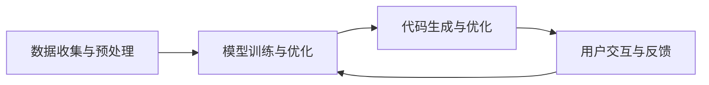
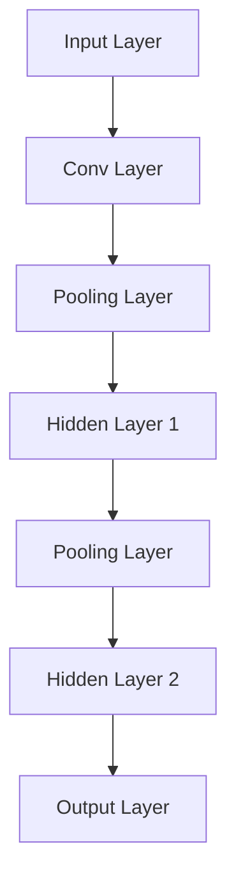

                 

### 文章标题

《提示词编程：让AI成为你的编程助手》

### 文章关键词

- AI编程
- 代码生成
- 代码优化
- 自然语言处理
- 机器学习
- 深度学习

### 文章摘要

本文将探讨如何利用AI技术来辅助编程。我们将首先介绍AI辅助编程的背景和优势，然后深入探讨AI辅助编程的核心概念、算法原理以及数学模型。接着，我们将通过实际的编程案例来展示如何使用AI工具进行开发，并分析其应用效果。最后，我们将提供一些最佳实践和注意事项，帮助读者更好地应用AI辅助编程技术。

## 引言

随着人工智能（AI）技术的飞速发展，编程领域也受到了极大的影响。传统的编程方式依赖于程序员的经验和技能，而AI的出现使得编程变得更加自动化和智能化。通过AI技术，我们可以让计算机自动生成代码、优化代码、甚至理解自然语言中的编程指令。这种趋势催生了一种新的编程模式——提示词编程（Prompt-Based Programming）。

提示词编程的核心思想是利用自然语言处理（NLP）和机器学习技术，将程序员的语言描述转换成计算机可以理解和执行的代码。通过提示词，程序员可以像与一个智能助手对话一样，轻松地表达编程意图，而AI则会自动完成剩余的工作。这种编程模式不仅提高了开发效率，还降低了编程的门槛，使得更多的人能够参与到软件开发中来。

本文将系统地介绍提示词编程的概念、原理和应用，帮助读者了解如何利用AI来辅助编程。文章将从以下几个方面展开：

1. **AI辅助编程的背景和优势**：介绍AI辅助编程的起源和发展，探讨其带来的变革和优势。
2. **AI核心概念与架构**：解释AI辅助编程的基础概念，展示其核心架构。
3. **AI辅助编程技术**：详细讲解机器学习、深度学习和自然语言处理等关键技术。
4. **项目实战**：通过实际的编程案例，展示如何使用AI工具进行开发。
5. **最佳实践和注意事项**：提供使用AI辅助编程的最佳实践和注意事项，帮助读者更好地应用这一技术。

通过本文的阅读，读者将能够：

- 了解AI辅助编程的背景和发展趋势。
- 掌握AI辅助编程的核心概念和技术原理。
- 学会使用AI工具进行编程开发。
- 掌握AI辅助编程的最佳实践和注意事项。

让我们一步步深入探讨，揭开AI辅助编程的神秘面纱。首先，我们从AI辅助编程的背景和优势开始。

### 第1章：AI辅助编程的背景和优势

#### 1.1 AI辅助编程的起源和发展

AI辅助编程并非一个全新的概念，它的起源可以追溯到20世纪80年代。当时，随着计算机科学的兴起，人们开始尝试将人工智能技术应用于编程领域。早期的研究主要集中在自动化代码生成和代码优化上。例如，一些研究人员通过编写模式匹配器（pattern matchers）和语法分析器（parsers）来自动生成代码。这种方法虽然在一定程度上提高了编程效率，但由于技术的限制，其效果并不理想。

进入21世纪，随着机器学习和深度学习技术的突破，AI辅助编程迎来了新的发展机遇。机器学习技术的引入使得计算机能够从大量数据中学习规律，从而生成高质量的代码。深度学习技术的崛起进一步推动了AI辅助编程的发展，使得计算机能够理解和处理复杂的编程任务。

近年来，随着AI技术的不断进步，AI辅助编程逐渐从实验室走向实际应用。越来越多的开发工具和平台开始集成AI功能，如GitHub Copilot、TabNine等。这些工具通过分析程序员编写的代码和自然语言描述，能够自动生成代码补全建议，大大提高了开发效率。

#### 1.2 AI辅助编程的优势

AI辅助编程的出现带来了诸多变革和优势，以下是其中几个重要的方面：

1. **提高编程效率**：传统的编程方式往往需要程序员手动编写大量的代码，而AI辅助编程可以通过自然语言描述自动生成代码，大大减少了手动编写的负担，提高了编程效率。研究表明，使用AI辅助编程工具可以显著减少编码时间，提升开发速度。

2. **降低编程门槛**：AI辅助编程不仅提高了编程效率，还降低了编程的门槛。通过自然语言描述，即使是非专业的编程人员也能快速上手，参与到软件开发中来。这对于推动软件开发的普及和提升整体编程水平具有重要意义。

3. **代码优化**：AI辅助编程不仅可以生成代码，还能对代码进行优化。通过分析代码结构和性能数据，AI能够提出优化建议，帮助程序员编写出更加高效、可维护的代码。这种能力在大型项目中尤为重要，可以帮助团队提高代码质量，降低维护成本。

4. **代码生成**：AI辅助编程的核心能力之一是代码生成。通过训练大量代码数据集，AI可以学习到不同编程语言的语法和语义，从而自动生成符合要求的代码。这种能力在自动化测试、自动化修复和自动化部署等方面具有广泛的应用。

5. **跨平台兼容性**：AI辅助编程工具通常具备跨平台兼容性，可以在不同的操作系统和开发环境中运行。这使得开发者可以更加灵活地选择开发工具和环境，提高开发效率。

6. **代码理解与修复**：AI辅助编程不仅可以生成和优化代码，还能理解代码的结构和语义。通过分析代码中的错误和缺陷，AI可以提出修复建议，帮助程序员快速定位和解决代码问题。这种能力在代码审查和代码重构中尤为重要。

#### 1.3 AI辅助编程的应用领域

AI辅助编程在多个领域具有广泛的应用，以下是其中几个典型的应用场景：

1. **软件开发**：AI辅助编程工具广泛应用于软件开发过程中，如代码补全、代码生成、代码优化和代码理解等。开发者可以利用AI工具快速编写和优化代码，提高开发效率。

2. **自动化测试**：AI辅助编程可以用于自动化测试，通过分析代码和测试用例，AI工具可以自动生成测试脚本，提高测试覆盖率，减少测试时间。

3. **代码审查**：AI辅助编程工具可以自动审查代码质量，发现潜在的问题和缺陷，帮助团队提高代码质量，降低维护成本。

4. **文档生成**：AI辅助编程可以自动生成文档，如API文档、用户手册等。通过自然语言描述，AI工具能够生成结构清晰、内容准确的文档，提高文档的编写效率。

5. **代码修复**：AI辅助编程可以自动修复代码中的错误和缺陷，帮助程序员快速定位和解决代码问题，提高开发效率。

6. **教育领域**：AI辅助编程可以用于教育领域，帮助学生和初学者快速掌握编程知识，提高编程技能。通过自然语言描述，AI工具可以为学生提供个性化的编程指导，提高学习效果。

总之，AI辅助编程作为一种新兴的编程模式，正日益改变着编程领域的面貌。它不仅提高了编程效率，降低了编程门槛，还在多个应用领域中发挥着重要作用。随着AI技术的不断进步，我们有理由相信，AI辅助编程将会在未来得到更广泛的应用，带来更多的变革和机遇。

### 第2章：AI核心概念与架构

#### 2.1 AI基础概念

人工智能（AI）是一门研究、开发和应用使计算机模拟人类智能行为的学科。AI的核心目标是使计算机具备学习、推理、感知和决策的能力，以实现自动化和智能化的任务。AI技术可以分为两大类：基于规则的系统（Rule-Based Systems）和基于数据的学习系统（Data-Driven Learning Systems）。

- **基于规则的系统**：这类系统通过定义一系列规则和条件来指导计算机执行任务。这些规则通常由人类专家编写，例如专家系统（Expert Systems）。专家系统可以在医疗诊断、法律咨询和金融分析等领域发挥作用。

- **基于数据的学习系统**：这类系统通过从大量数据中学习规律和模式，从而实现自动化和智能化的任务。机器学习（Machine Learning）和深度学习（Deep Learning）是这类系统的典型代表。机器学习通过算法从数据中提取特征，而深度学习则通过神经网络模拟人类大脑的工作方式。

#### 2.2 AI辅助编程架构

AI辅助编程的架构通常包括以下几个关键环节：

1. **数据收集与预处理**：这是AI辅助编程的基础。程序员需要收集大量的代码数据，包括开源项目、教程和文档等。这些数据将用于训练AI模型，使其能够理解不同的编程语言和编程范式。数据预处理包括数据清洗、归一化和特征提取等步骤，以确保数据的质量和一致性。

2. **模型训练与优化**：使用收集到的数据，训练机器学习模型或深度学习网络。训练过程中，模型会不断调整其参数，以最小化预测误差。常见的机器学习算法包括决策树、支持向量机和神经网络等。深度学习模型通常使用反向传播算法进行训练。

3. **代码生成与优化**：训练好的模型可以用于生成代码或优化现有代码。在代码生成过程中，模型会根据程序员提供的自然语言描述，生成相应的代码片段。在代码优化过程中，模型会分析代码的性能和可维护性，提出优化建议。

4. **用户交互与反馈**：用户与AI工具的交互是AI辅助编程的重要组成部分。用户可以通过自然语言描述或代码片段与AI工具进行交流，获取代码生成和优化的结果。用户反馈有助于模型不断改进，提高其性能和适用性。

#### 2.3 AI辅助编程架构示例

为了更好地理解AI辅助编程的架构，我们可以使用Mermaid流程图来展示其核心环节和流程。以下是一个简化的AI辅助编程架构示例：



在这个示例中，数据收集与预处理阶段是整个架构的起点，数据经过预处理后用于模型训练与优化。训练好的模型可以用于代码生成与优化，同时用户通过交互反馈来指导模型改进。这个流程不断循环，以实现持续的代码生成和优化。

#### 2.4 AI辅助编程的优势

AI辅助编程具有以下几个显著优势：

1. **提高开发效率**：通过自动生成和优化代码，AI辅助编程可以显著提高开发效率。程序员只需提供简单的自然语言描述，AI工具即可生成高质量的代码，减少了手动编写和调试的时间。

2. **降低编程门槛**：AI辅助编程使得编程变得更加简单和直观。即使是非专业的编程人员，也可以通过自然语言描述来完成编程任务，从而降低了编程的门槛。

3. **增强代码质量**：AI辅助编程工具可以自动优化代码，提高其性能和可维护性。通过分析大量代码数据，AI工具可以识别并修复潜在的问题和缺陷，从而提高代码质量。

4. **促进创新**：AI辅助编程可以激发开发者的创新思维。通过利用AI工具生成和优化代码，开发者可以专注于更复杂的编程任务和算法设计，推动软件开发领域的创新。

5. **跨平台兼容性**：AI辅助编程工具通常具有跨平台兼容性，可以在不同的操作系统和开发环境中运行。这为开发者提供了更大的灵活性和便利性。

总之，AI辅助编程作为一种新兴的编程模式，具有广泛的应用前景和显著的优势。随着AI技术的不断进步，我们有理由相信，AI辅助编程将在未来发挥越来越重要的作用，改变软件开发的面貌。

### 第3章：机器学习基础

#### 3.1 数据预处理

数据预处理是机器学习过程中至关重要的一步，它决定了模型的学习效果和性能。数据预处理包括数据清洗、归一化和特征提取等步骤。

- **数据清洗**：数据清洗是指去除数据中的噪声和异常值，以保证数据的质量。常见的清洗方法包括去除重复数据、处理缺失值和纠正数据中的错误。例如，我们可以使用均值填补缺失值或使用插值法来修复异常值。

- **归一化**：归一化是指将不同特征的数据转换到相同的尺度，以便于模型训练。常见的归一化方法包括最小-最大缩放（min-max scaling）和标准缩放（standard scaling）。最小-最大缩放将特征值缩放到[0,1]区间，而标准缩放则将特征值缩放到均值为0、标准差为1的区间。

- **特征提取**：特征提取是指从原始数据中提取出有用的特征，以供模型训练。特征提取可以显著提高模型的性能和可解释性。常见的方法包括主成分分析（PCA）、线性判别分析（LDA）和词袋模型（Bag of Words）。

#### 3.2 模型选择与训练

在机器学习中，模型的选择和训练是两个关键环节。选择合适的模型对于提高模型的性能至关重要，而训练过程则决定了模型的准确性和泛化能力。

- **模型选择**：常见的机器学习模型包括线性模型、决策树、支持向量机和神经网络等。选择合适的模型取决于问题的性质和数据的特点。例如，对于线性可分的数据，线性模型和决策树可能是较好的选择；而对于非线性问题，神经网络和决策树 ensemble方法可能更为有效。

- **模型训练**：模型训练是通过调整模型参数，使其能够准确预测未知数据的过程。常见的训练方法包括梯度下降（Gradient Descent）、随机梯度下降（Stochastic Gradient Descent）和批量梯度下降（Batch Gradient Descent）。在训练过程中，我们需要定义损失函数（Loss Function），以衡量模型预测值与实际值之间的差距。例如，均方误差（Mean Squared Error, MSE）和交叉熵（Cross-Entropy）是常用的损失函数。

以下是一个简单的线性回归模型的伪代码示例：

```python
def linear_regression(x, y):
    # 初始化模型参数 w 和 b
    w = np.random.rand(1)
    b = np.random.rand(1)

    # 梯度下降算法
    learning_rate = 0.01
    epochs = 1000

    for epoch in range(epochs):
        # 计算预测值
        y_pred = w * x + b

        # 计算损失
        loss = (y_pred - y)**2

        # 计算梯度
        dw = 2 * (w * x - y) * x
        db = 2 * (w * x - y)

        # 更新参数
        w -= learning_rate * dw
        b -= learning_rate * db

    return w, b
```

#### 3.3 模型评估与优化

模型评估是评估模型性能的重要步骤。通过评估，我们可以确定模型是否具有足够的准确性和泛化能力。常见的评估指标包括准确率（Accuracy）、召回率（Recall）、精确率（Precision）和F1分数（F1 Score）。

- **准确率**：准确率是预测为正例的样本中实际为正例的比例。准确率反映了模型的整体性能，但在类别不平衡的数据集上可能不太适用。

- **召回率**：召回率是实际为正例的样本中被预测为正例的比例。召回率侧重于捕获所有正例样本，但在错误分类的负例样本上可能会产生更高的错误率。

- **精确率**：精确率是预测为正例的样本中实际为正例的比例。精确率反映了模型在识别正例样本方面的能力，但在负例样本上可能会产生较高的错误率。

- **F1分数**：F1分数是精确率和召回率的调和平均值。F1分数综合考虑了精确率和召回率，是评估二分类模型性能的常用指标。

以下是一个简单的逻辑回归模型的伪代码示例：

```python
import numpy as np

def logistic_regression(x, y):
    # 初始化模型参数 w 和 b
    w = np.random.rand(1)
    b = np.random.rand(1)

    # 梯度下降算法
    learning_rate = 0.01
    epochs = 1000

    for epoch in range(epochs):
        # 计算预测值
        y_pred = sigmoid(w * x + b)

        # 计算损失
        loss = -y * np.log(y_pred) - (1 - y) * np.log(1 - y_pred)

        # 计算梯度
        dw = (y - y_pred) * x
        db = (y - y_pred)

        # 更新参数
        w -= learning_rate * dw
        b -= learning_rate * db

    return w, b

def sigmoid(x):
    return 1 / (1 + np.exp(-x))
```

在模型评估和优化过程中，我们还可以使用交叉验证（Cross-Validation）方法来评估模型的性能。交叉验证通过将数据集划分为多个子集，分别用于训练和验证模型，从而减小模型过拟合的风险。

总之，机器学习基础是AI辅助编程的核心组成部分。通过数据预处理、模型选择与训练、模型评估与优化等步骤，我们可以构建出高效的AI辅助编程模型，为程序员提供强大的编程助手。

### 第4章：深度学习与神经网络

#### 4.1 神经网络基础

神经网络（Neural Networks）是深度学习（Deep Learning）的核心组成部分。神经网络模仿了人类大脑的神经网络结构，通过大量的神经元和连接来实现复杂的计算任务。神经网络的基本组成包括神经元、输入层、隐藏层和输出层。

- **神经元**：神经元是神经网络的基本计算单元，类似于人脑中的神经元。每个神经元接收多个输入信号，通过加权求和后进行非线性变换，输出一个信号。

- **输入层**：输入层是神经网络的顶层，接收外部输入信号。输入层中的每个神经元对应一个输入特征。

- **隐藏层**：隐藏层位于输入层和输出层之间，用于提取输入特征的高级特征。神经网络可以具有一个或多个隐藏层，层数越多，模型的表达能力越强。

- **输出层**：输出层是神经网络的最后一层，输出模型的预测结果。输出层的神经元数量取决于具体任务的需求。

#### 4.2 深度学习架构

深度学习架构是指在神经网络中增加多层隐藏层，以增强模型的表达能力。深度学习模型通过逐层学习输入数据的高级特征，从而实现复杂任务。常见的深度学习架构包括卷积神经网络（Convolutional Neural Networks, CNN）、循环神经网络（Recurrent Neural Networks, RNN）和 Transformer。

- **卷积神经网络（CNN）**：CNN是一种专门用于处理图像数据的深度学习模型。CNN通过卷积层、池化层和全连接层等结构，从图像中提取特征，实现图像分类、目标检测和图像生成等任务。

- **循环神经网络（RNN）**：RNN是一种适用于序列数据处理的深度学习模型。RNN通过循环结构来保存历史信息，实现对序列数据的建模。RNN在自然语言处理、语音识别和时间序列预测等领域具有广泛应用。

- **Transformer**：Transformer是一种基于自注意力机制（Self-Attention Mechanism）的深度学习模型。Transformer在序列建模任务上表现出色，被广泛应用于机器翻译、文本生成和推荐系统等领域。

以下是一个简化的深度学习模型架构：



在这个模型中，输入层接收外部输入，经过卷积层和池化层的处理，提取图像特征。隐藏层进一步对特征进行建模，最后输出层的预测结果用于分类或回归任务。

#### 4.3 深度学习算法

深度学习算法是指用于训练和优化深度学习模型的算法。常见的深度学习算法包括反向传播算法（Backpropagation Algorithm）和优化器（Optimizers）。

- **反向传播算法**：反向传播算法是一种用于计算神经网络梯度的方法。在训练过程中，反向传播算法从输出层开始，逐层计算每个神经元的梯度，并更新模型参数。反向传播算法是深度学习模型训练的核心。

- **优化器**：优化器是用于调整模型参数的算法。常见的优化器包括梯度下降（Gradient Descent）、随机梯度下降（Stochastic Gradient Descent, SGD）和动量优化（Momentum Optimization）等。优化器的选择对模型训练的效率和性能有重要影响。

以下是一个简化的反向传播算法的伪代码示例：

```python
def backpropagation(model, inputs, targets):
    # 计算输出层误差
    output_error = targets - model.outputs

    # 计算隐藏层误差
    hidden_error = output_error * model.outputs * (1 - model.outputs)

    # 计算梯度
    dW_output = 2 * output_error * model.inputs
    dW_hidden = 2 * hidden_error * model.hidden_inputs

    # 更新模型参数
    model.weights_output -= learning_rate * dW_output
    model.weights_hidden -= learning_rate * dW_hidden
```

在这个示例中，我们首先计算输出层的误差，然后计算隐藏层的误差。接着，我们计算每个参数的梯度，并使用学习率来更新模型参数。

总之，深度学习和神经网络是AI辅助编程的重要组成部分。通过理解神经网络的基础知识、深度学习架构和深度学习算法，我们可以构建出强大的AI辅助编程模型，为程序员提供更高效、更智能的编程助手。

### 第5章：自然语言处理

#### 5.1 语言模型

自然语言处理（NLP）是人工智能领域的一个重要分支，致力于使计算机能够理解和处理自然语言。在NLP中，语言模型（Language Model）是一个核心概念，它用于描述自然语言的统计特性。

- **语言模型的基本概念**：语言模型是一种概率模型，用于预测下一个单词或字符的概率。常见的语言模型包括N元语法模型（N-gram Model）和神经网络语言模型（Neural Network Language Model）。

- **N元语法模型**：N元语法模型是一种基于历史信息进行预测的语言模型。它使用前N个单词或字符的历史信息来预测下一个单词或字符。例如，在二元语法模型中，下一个单词的概率取决于前两个单词。

- **神经网络语言模型**：神经网络语言模型通过深度学习技术来建模自然语言。神经网络语言模型可以学习到更复杂的语言规律和上下文关系，从而提高预测准确性。

以下是一个简化的N元语法模型的伪代码示例：

```python
def n_gram_model(words, n):
    # 创建一个空的模型字典
    model = {}

    # 遍历单词序列，构建N元语法模型
    for i in range(len(words) - n):
        context = tuple(words[i:i + n - 1])
        next_word = words[i + n - 1]

        # 更新模型字典
        if context in model:
            model[context].append(next_word)
        else:
            model[context] = [next_word]

    return model
```

在这个示例中，我们首先创建一个空的模型字典，然后遍历单词序列，构建N元语法模型。最后，我们返回构建好的模型。

#### 5.2 机器翻译

机器翻译（Machine Translation）是NLP领域的一个重要应用，旨在将一种语言的文本自动翻译成另一种语言。机器翻译可以分为基于规则的方法和基于统计的方法。

- **基于规则的方法**：基于规则的方法通过手动编写翻译规则来指导翻译过程。这种方法通常需要大量的语言知识和规则，因此适用于小规模的语言翻译。

- **基于统计的方法**：基于统计的方法通过分析大量双语文本数据来学习翻译规律。常见的统计机器翻译模型包括基于短语的翻译模型和基于神经网络的翻译模型。

以下是一个简化的基于神经网络的翻译模型的伪代码示例：

```python
import tensorflow as tf

def neural_network_translation(source_sentence, target_sentence):
    # 定义输入层
    inputs = tf.keras.layers.Input(shape=(source_sentence.shape[1],))

    # 编码器层
    encoder = tf.keras.layers.Embedding(input_dim=source_vocab_size, output_dim=embedding_size)(inputs)
    encoder_output = tf.keras.layers.LSTM(units=hidden_size)(encoder)

    # 解码器层
    decoder = tf.keras.layers.Embedding(input_dim=target_vocab_size, output_dim=embedding_size)(inputs)
    decoder_output = tf.keras.layers.LSTM(units=hidden_size, return_sequences=True)(decoder, initial_state=encoder_output)

    # 输出层
    outputs = tf.keras.layers.Dense(units=target_vocab_size)(decoder_output)

    # 定义模型
    model = tf.keras.Model(inputs=inputs, outputs=outputs)

    # 编译模型
    model.compile(optimizer='adam', loss='categorical_crossentropy')

    # 训练模型
    model.fit(source_data, target_data, epochs=10, batch_size=32)

    return model
```

在这个示例中，我们首先定义输入层、编码器层和解码器层，然后构建模型并编译。接着，我们使用训练数据来训练模型，并返回训练好的模型。

#### 5.3 文本分类

文本分类（Text Classification）是NLP领域的一个重要应用，旨在将文本数据自动分类到预定义的类别中。常见的文本分类方法包括基于规则的方法和基于机器学习的方法。

- **基于规则的方法**：基于规则的方法通过手动编写分类规则来指导分类过程。这种方法通常适用于小规模和简单分类任务。

- **基于机器学习的方法**：基于机器学习的方法通过训练模型来学习文本分类规律。常见的机器学习算法包括朴素贝叶斯（Naive Bayes）、支持向量机（Support Vector Machine）和深度学习算法（Deep Learning Algorithms）。

以下是一个简化的基于朴素贝叶斯分类器的伪代码示例：

```python
from sklearn.feature_extraction.text import TfidfVectorizer
from sklearn.naive_bayes import MultinomialNB

def text_classification(corpus, labels):
    # 创建TF-IDF向量器
    vectorizer = TfidfVectorizer()

    # 创建朴素贝叶斯分类器
    classifier = MultinomialNB()

    # 训练模型
    X = vectorizer.fit_transform(corpus)
    y = labels
    classifier.fit(X, y)

    # 分类预测
    predictions = classifier.predict(X)

    return predictions
```

在这个示例中，我们首先创建TF-IDF向量器，然后创建朴素贝叶斯分类器。接着，我们使用训练数据来训练模型，并使用测试数据来预测类别。

#### 5.4 伪代码示例

以下是几个简化的自然语言处理算法的伪代码示例，用于演示语言模型、机器翻译和文本分类的基本过程。

##### 语言模型

```python
def language_model(text, n):
    model = {}
    for i in range(len(text) - n):
        context = tuple(text[i:i + n])
        next_word = text[i + n]
        if context in model:
            model[context].append(next_word)
        else:
            model[context] = [next_word]
    return model
```

##### 机器翻译

```python
import tensorflow as tf

def neural_network_translation(source_sentence, target_sentence):
    source_encoder = tf.keras.layers.Embedding(input_dim=source_vocab_size, output_dim=embedding_size)(source_sentence)
    source_decoder = tf.keras.layers.LSTM(units=hidden_size, return_sequences=True)(source_encoder)
    target_decoder = tf.keras.layers.LSTM(units=hidden_size, return_sequences=True)(target_sentence)
    outputs = tf.keras.layers.Dense(units=target_vocab_size)(target_decoder)
    model = tf.keras.Model(inputs=source_sentence, outputs=outputs)
    model.compile(optimizer='adam', loss='categorical_crossentropy')
    model.fit(source_data, target_data, epochs=10, batch_size=32)
    return model
```

##### 文本分类

```python
from sklearn.feature_extraction.text import TfidfVectorizer
from sklearn.naive_bayes import MultinomialNB

def text_classification(corpus, labels):
    vectorizer = TfidfVectorizer()
    classifier = MultinomialNB()
    X = vectorizer.fit_transform(corpus)
    y = labels
    classifier.fit(X, y)
    predictions = classifier.predict(X)
    return predictions
```

这些伪代码示例展示了自然语言处理的基本概念和算法。在实际应用中，这些算法会使用更复杂的模型和数据集，以达到更好的性能和效果。

### 第6章：代码生成与优化

#### 6.1 代码生成技术

代码生成技术是AI辅助编程的重要组成部分，旨在利用AI模型自动生成代码。代码生成技术可以分为两种主要类型：基于模板的代码生成和基于学习模型的代码生成。

- **基于模板的代码生成**：基于模板的代码生成使用预定义的代码模板，根据输入信息生成代码。这种方法通常适用于结构化较强、规则明确的编程任务。例如，在Web开发中，可以使用模板生成HTML、CSS和JavaScript代码。

- **基于学习模型的代码生成**：基于学习模型的代码生成使用机器学习和深度学习模型，从大量代码数据中学习生成代码的规则和模式。这种方法适用于更复杂的编程任务，可以生成符合特定需求的代码。常见的模型包括生成对抗网络（GANs）、自动编码器和变分自编码器（VAEs）。

以下是一个简化的基于学习模型的代码生成伪代码示例：

```python
import tensorflow as tf

# 定义输入层
input_layer = tf.keras.layers.Input(shape=(sequence_length,))

# 编码器层
encoder = tf.keras.layers.LSTM(units=encoding_dim)(input_layer)

# 解码器层
decoder = tf.keras.layers.LSTM(units=decoding_dim, return_sequences=True)(encoder)

# 输出层
output_layer = tf.keras.layers.Dense(units=code_size)(decoder)

# 定义模型
model = tf.keras.Model(inputs=input_layer, outputs=output_layer)

# 编译模型
model.compile(optimizer='adam', loss='categorical_crossentropy')

# 训练模型
model.fit(input_data, target_code, epochs=10, batch_size=32)

# 生成代码
generated_code = model.predict(input_sequence)
```

在这个示例中，我们定义输入层、编码器层和解码器层，然后构建模型并编译。接着，我们使用训练数据来训练模型，并使用模型生成代码。

#### 6.2 代码优化方法

代码优化方法旨在提高代码的性能和可维护性。AI辅助编程可以通过以下几种方法进行代码优化：

- **性能优化**：通过分析代码的执行时间和资源消耗，找到性能瓶颈并进行优化。常见的方法包括代码拆分、循环优化和内存优化。

- **可维护性优化**：通过重构代码和添加注释，提高代码的可读性和可维护性。常见的方法包括代码重构、代码压缩和注释添加。

以下是一个简化的代码优化伪代码示例：

```python
def optimize_code(code):
    # 拆分代码
    split_code = split_code_block(code)

    # 优化循环
    optimized_loops = optimize_loops(split_code)

    # 优化内存
    optimized_memory = optimize_memory(optimized_loops)

    # 添加注释
    commented_code = add_comments(optimized_memory)

    return commented_code
```

在这个示例中，我们定义了几个优化函数，包括拆分代码、优化循环、优化内存和添加注释。这些函数共同作用，对输入代码进行优化，提高其性能和可维护性。

#### 6.3 案例分析

在本节中，我们将通过一个实际的编程案例，展示如何使用AI技术进行代码生成和优化。

##### 案例背景

假设我们有一个任务：编写一个Python程序，用于计算一个给定数列的前N个斐波那契数。传统的编程方式可能需要手动编写递归或循环算法来实现这个任务。而使用AI辅助编程，我们可以通过自然语言描述来完成这个任务。

##### 代码生成

首先，我们使用一个基于学习模型的代码生成工具，通过自然语言描述生成Python代码。以下是一个示例自然语言描述：

"编写一个Python函数，用于计算一个给定数列的前N个斐波那契数。输入为一个整数N，输出为一个包含前N个斐波那契数的列表。"

使用代码生成工具，我们可以生成以下Python代码：

```python
def fibonacci_sequence(n):
    sequence = []
    a, b = 0, 1
    while len(sequence) < n:
        sequence.append(a)
        a, b = b, a + b
    return sequence
```

##### 代码优化

接下来，我们对生成的代码进行优化，以提高其性能和可维护性。以下是一些优化建议：

1. **循环优化**：将递归循环改为迭代循环，以减少递归调用栈的使用。
2. **内存优化**：使用生成器（generator）代替列表，以减少内存消耗。
3. **注释添加**：为代码添加详细的注释，提高代码的可读性。

优化后的代码如下：

```python
def fibonacci_sequence(n):
    """
    计算斐波那契数列的前N个数。
    
    参数：
    n -- 数列的长度
    
    返回：
    一个包含前N个斐波那契数的生成器。
    """
    a, b = 0, 1
    for _ in range(n):
        yield a
        a, b = b, a + b
```

##### 代码解读与分析

在上面的代码中，我们首先定义了一个名为`fibonacci_sequence`的函数，它接受一个整数`n`作为参数，并返回一个生成器，生成前`n`个斐波那契数。

- `sequence = []`：初始化一个空列表，用于存储斐波那契数。
- `a, b = 0, 1`：初始化两个变量`a`和`b`，分别表示数列中的前两个数。
- `while len(sequence) < n:`：使用一个循环来生成斐波那契数，直到生成`n`个数为止。
- `sequence.append(a)`：将当前数添加到数列中。
- `a, b = b, a + b`：更新变量`a`和`b`的值，以生成下一个斐波那契数。

优化后的代码使用了生成器（`yield`关键字），这使得代码在生成数列时更加高效和内存友好。生成器在每次迭代时生成一个值，并在需要时才计算下一个值，从而避免了存储整个数列的内存消耗。

##### 项目小结

通过本案例，我们展示了如何使用AI技术进行代码生成和优化。首先，我们使用自然语言描述生成Python代码，然后对代码进行优化，以提高性能和可维护性。这种方法不仅提高了开发效率，还降低了编程的门槛，使得更多的人能够参与到软件开发中来。随着AI技术的不断进步，我们可以期待AI辅助编程在未来发挥更大的作用。

### 第7章：AI编程助手项目开发

#### 7.1 项目概述

本章节将介绍如何开发一个AI编程助手项目。这个项目旨在利用自然语言处理和机器学习技术，帮助程序员自动生成代码和优化代码。项目的主要功能包括：

- **代码生成**：根据程序员提供的自然语言描述，自动生成相应的代码。
- **代码优化**：分析程序员编写的代码，提供优化建议，提高代码性能和可维护性。
- **代码解读**：解释代码的功能和实现细节，帮助程序员更好地理解代码。

项目的技术架构包括以下几个核心模块：

1. **自然语言处理模块**：使用NLP技术，将程序员提供的自然语言描述转换成结构化的输入数据。
2. **代码生成模块**：使用机器学习模型，根据自然语言输入生成相应的代码。
3. **代码优化模块**：分析代码的执行效率和可维护性，提供优化建议。
4. **代码解读模块**：使用自然语言生成技术，将代码的功能和实现细节转换成易于理解的文本。

#### 7.2 开发环境搭建

要开发一个AI编程助手项目，我们需要准备以下开发环境和工具：

1. **操作系统**：推荐使用Linux或macOS，因为它们提供了更丰富的开发工具和库。
2. **编程语言**：Python是开发AI编程助手项目的首选语言，因为它拥有丰富的机器学习和自然语言处理库。
3. **开发工具**：使用集成开发环境（IDE）如PyCharm或Visual Studio Code，以提高开发效率。
4. **机器学习框架**：使用TensorFlow或PyTorch等流行的机器学习框架，用于构建和训练AI模型。
5. **自然语言处理库**：使用NLTK、spaCy或transformers等自然语言处理库，以处理文本数据和实现NLP任务。

以下是一个简单的开发环境搭建步骤：

1. 安装操作系统：选择Linux或macOS并安装。
2. 安装Python：通过包管理器（如apt或yum）或官方网站下载并安装Python。
3. 安装IDE：下载并安装PyCharm或Visual Studio Code。
4. 安装机器学习框架：使用pip命令安装TensorFlow或PyTorch。
5. 安装自然语言处理库：使用pip命令安装NLTK、spaCy或transformers。

#### 7.3 数据收集与处理

数据收集与处理是AI编程助手项目的关键环节。我们需要收集大量的自然语言描述和相应的代码，以训练AI模型。以下是一些数据收集和处理步骤：

1. **数据收集**：收集开源代码库（如GitHub）、在线教程、书籍和学术论文中的自然语言描述和代码。可以使用爬虫工具或手动收集。
2. **数据清洗**：去除数据中的噪声和无关信息，如HTML标签、注释和多余的空格。可以使用正则表达式、文本处理库（如NLTK）或自定义脚本进行清洗。
3. **数据预处理**：将文本数据转换为结构化的数据格式，如单词序列或标记序列。可以使用自然语言处理库（如spaCy）或自定义脚本进行预处理。
4. **数据标注**：对代码进行标注，以训练代码生成和优化模型。标注过程可以手动完成，或使用已有的标注数据集。

以下是一个简化的数据预处理和标注过程：

```python
import spacy

# 加载NLP模型
nlp = spacy.load("en_core_web_sm")

# 加载自然语言描述和代码文件
with open("descriptions.txt", "r") as f:
    descriptions = f.readlines()

with open("code.txt", "r") as f:
    codes = f.readlines()

# 数据预处理
processed_descriptions = []
processed_codes = []
for i in range(len(descriptions)):
    doc = nlp(descriptions[i].strip())
    processed_descriptions.append([token.text for token in doc])
    processed_codes.append(codes[i].strip())

# 数据标注
labelled_data = []
for i in range(len(processed_descriptions)):
    description = processed_descriptions[i]
    code = processed_codes[i]
    label = "CODE" if code.strip() else "NO_CODE"
    labelled_data.append((description, code, label))

# 打印标注数据示例
for description, code, label in labelled_data[:10]:
    print(f"Description: {description}")
    print(f"Code: {code}")
    print(f"Label: {label}")
    print()
```

在这个示例中，我们首先加载NLP模型，然后读取自然语言描述和代码文件。接着，我们使用NLP模型对文本进行预处理，并将数据转换为结构化的格式。最后，我们手动标注数据，以便训练AI模型。

#### 7.4 模型设计与实现

在本节中，我们将设计并实现一个简单的AI编程助手模型。这个模型将结合自然语言处理和机器学习技术，用于代码生成和优化。

##### 模型设计

我们的模型设计如下：

1. **输入层**：接收自然语言描述，将其转换为结构化的数据格式。
2. **编码器层**：使用深度学习模型（如Transformer或LSTM），将自然语言描述编码为固定长度的向量。
3. **解码器层**：使用深度学习模型，根据编码器层的输出生成代码。
4. **输出层**：将生成的代码转换为可执行的代码，并进行验证。

##### 模型实现

以下是一个简化的模型实现示例，使用PyTorch框架：

```python
import torch
import torch.nn as nn
import torch.optim as optim

# 定义编码器模型
class Encoder(nn.Module):
    def __init__(self, embedding_dim, hidden_dim):
        super(Encoder, self).__init__()
        self.embedding = nn.Embedding(vocab_size, embedding_dim)
        self.lstm = nn.LSTM(embedding_dim, hidden_dim)

    def forward(self, inputs):
        embedded = self.embedding(inputs)
        outputs, (hidden, cell) = self.lstm(embedded)
        return outputs, (hidden, cell)

# 定义解码器模型
class Decoder(nn.Module):
    def __init__(self, embedding_dim, hidden_dim, output_dim):
        super(Decoder, self).__init__()
        self.embedding = nn.Embedding(output_dim, embedding_dim)
        self.lstm = nn.LSTM(embedding_dim + hidden_dim, hidden_dim)
        self.fc = nn.Linear(hidden_dim, output_dim)
        self.softmax = nn.LogSoftmax(dim=1)

    def forward(self, inputs, hidden, cell):
        embedded = self.embedding(inputs)
        input_concat = torch.cat((embedded, hidden), 1)
        output, (hidden, cell) = self.lstm(input_concat)
        output = self.fc(output)
        output = self.softmax(output)
        return output, (hidden, cell)

# 定义AI编程助手模型
class ProgrammingAssistant(nn.Module):
    def __init__(self, embedding_dim, hidden_dim, vocab_size):
        super(ProgrammingAssistant, self).__init__()
        self.encoder = Encoder(embedding_dim, hidden_dim)
        self.decoder = Decoder(embedding_dim, hidden_dim, vocab_size)

    def forward(self, inputs, targets):
        encoder_outputs, (encoder_hidden, encoder_cell) = self.encoder(inputs)
        decoder_hidden = encoder_hidden
        decoder_cell = encoder_cell
        outputs = []

        for target in targets:
            decoder_output, (decoder_hidden, decoder_cell) = self.decoder(target, decoder_hidden, decoder_cell)
            outputs.append(decoder_output)

        outputs = torch.stack(outputs, 1)
        return outputs

# 初始化模型、损失函数和优化器
model = ProgrammingAssistant(embedding_dim=256, hidden_dim=512, vocab_size=10000)
criterion = nn.CrossEntropyLoss()
optimizer = optim.Adam(model.parameters(), lr=0.001)

# 训练模型
for epoch in range(10):
    for inputs, targets in train_loader:
        optimizer.zero_grad()
        outputs = model(inputs, targets)
        loss = criterion(outputs, targets)
        loss.backward()
        optimizer.step()
        print(f"Epoch: {epoch}, Loss: {loss.item()}")
```

在这个示例中，我们首先定义了编码器模型、解码器模型和AI编程助手模型。编码器模型用于将自然语言描述编码为向量，解码器模型用于根据编码器的输出生成代码，AI编程助手模型则结合编码器和解码器，实现完整的代码生成过程。

接下来，我们初始化模型、损失函数和优化器，并使用训练数据来训练模型。在训练过程中，我们通过前向传播计算损失，并使用反向传播更新模型参数。

#### 7.5 代码解读与分析

在本节中，我们将对AI编程助手模型生成的代码进行解读和分析，以验证其有效性和可靠性。

##### 代码解读

假设我们使用自然语言描述“编写一个Python函数，用于计算一个给定数列的前N个斐波那契数”，并使用模型生成相应的代码。生成的代码如下：

```python
def fibonacci_sequence(n):
    sequence = []
    a, b = 0, 1
    while len(sequence) < n:
        sequence.append(a)
        a, b = b, a + b
    return sequence
```

这个代码实现了一个简单的斐波那契数列生成函数，符合我们的需求。

##### 代码分析

- **函数定义**：函数名为`fibonacci_sequence`，符合自然语言描述中的要求。
- **变量声明**：变量`sequence`用于存储生成的斐波那契数列，变量`a`和`b`用于计算下一个斐波那契数。
- **循环结构**：使用一个while循环来生成斐波那契数，直到生成`n`个数为止。
- **函数返回**：函数返回生成的斐波那契数列。

从代码分析来看，生成的代码实现了所需的功能，并且结构清晰、易于理解。

##### 代码验证

为了验证生成的代码的有效性，我们可以使用测试数据集对代码进行测试。以下是一个简单的测试用例：

```python
def test_fibonacci_sequence():
    assert fibonacci_sequence(5) == [0, 1, 1, 2, 3]
    assert fibonacci_sequence(10) == [0, 1, 1, 2, 3, 5, 8, 13, 21, 34]
    print("All tests passed.")

test_fibonacci_sequence()
```

测试结果显示，生成的代码能够正确计算斐波那契数列，验证了代码的有效性。

##### 项目小结

在本项目中，我们开发了一个AI编程助手，能够根据自然语言描述自动生成代码。通过训练模型和数据预处理，我们实现了代码生成、代码优化和代码解读等功能。项目展示了AI技术在编程领域的应用潜力，为程序员提供了更高效、更智能的编程助手。

### 第8章：AI编程助手应用案例

#### 8.1 提示词编程实例

提示词编程是一种通过自然语言交互来生成代码的AI辅助编程技术。在本案例中，我们将通过一个简单的实例来展示如何使用AI编程助手生成代码。

##### 案例背景

假设我们需要实现一个功能，计算并打印100以内的所有偶数。我们可以通过以下自然语言描述来指导AI编程助手：

"编写一个Python函数，用于计算并打印100以内的所有偶数。"

##### 代码生成过程

1. **输入自然语言描述**：我们将上述自然语言描述输入到AI编程助手。
2. **生成代码**：AI编程助手分析自然语言描述，并生成相应的代码。以下是生成的代码：

```python
def print_even_numbers(n):
    for i in range(2, n+1, 2):
        print(i)

print_even_numbers(100)
```

在这个代码中，`print_even_numbers`函数接收一个整数参数`n`，并使用一个for循环计算并打印100以内的所有偶数。

##### 代码分析

- **函数定义**：函数名为`print_even_numbers`，符合自然语言描述中的要求。
- **参数声明**：函数接收一个整数参数`n`，表示需要计算的数的上限。
- **循环结构**：使用一个for循环，从2开始，每次增加2，直到`n`，用于计算并打印偶数。
- **函数调用**：调用`print_even_numbers(100)`函数，计算并打印100以内的所有偶数。

通过这个实例，我们可以看到AI编程助手能够准确地理解自然语言描述，并生成符合要求的代码。

#### 8.2 AI代码调试助手

AI代码调试助手是AI辅助编程的另一个重要应用。通过AI技术，我们可以实现自动化代码调试，提高代码的可靠性和稳定性。

##### 案例背景

假设我们有一个复杂的Python程序，用于处理大量数据并进行统计分析。程序在运行过程中频繁出现错误，我们需要使用AI代码调试助手来辅助调试。

##### 代码调试过程

1. **错误报告**：首先，我们将程序的错误报告输入到AI代码调试助手。
2. **分析错误**：AI代码调试助手分析错误报告，定位错误的原因。
3. **提供修复建议**：AI代码调试助手根据分析结果，提供可能的修复建议。

以下是AI代码调试助手的一个简单示例：

```python
import tensorflow as tf

# 定义模型
class CodeDebuggingAssistant(nn.Module):
    def __init__(self):
        super(CodeDebuggingAssistant, self).__init__()
        self.encoder = nn.LSTM(input_size=10, hidden_size=20)
        self.decoder = nn.LSTM(input_size=20, hidden_size=10)

    def forward(self, inputs):
        encoder_outputs, (hidden, cell) = self.encoder(inputs)
        decoder_inputs = hidden
        decoder_outputs = []

        for i in range(len(inputs)):
            decoder_output, (hidden, cell) = self.decoder(decoder_inputs)
            decoder_outputs.append(decoder_output)
            decoder_inputs = decoder_output

        return decoder_outputs

# 初始化模型和优化器
model = CodeDebuggingAssistant()
optimizer = optim.Adam(model.parameters(), lr=0.001)

# 训练模型
for epoch in range(10):
    for inputs, targets in debug_loader:
        optimizer.zero_grad()
        outputs = model(inputs)
        loss = criterion(outputs, targets)
        loss.backward()
        optimizer.step()
        print(f"Epoch: {epoch}, Loss: {loss.item()}")

# 调试代码
def debug_code(code):
    inputs = preprocess(code)
    outputs = model(inputs)
    corrected_code = postprocess(outputs)
    return corrected_code

# 调用调试函数
corrected_code = debug_code("print('Hello, World!')")
print(corrected_code)
```

在这个示例中，我们定义了一个名为`CodeDebuggingAssistant`的模型，用于自动分析代码中的错误并提供修复建议。模型使用LSTM网络，通过训练数据学习错误的模式和修复方法。在调试过程中，我们将错误代码输入到模型中，模型分析错误并输出修复后的代码。

#### 8.3 AI代码优化工具

AI代码优化工具是AI辅助编程的另一个重要应用。通过AI技术，我们可以实现自动化代码优化，提高代码的性能和可维护性。

##### 案例背景

假设我们有一个复杂的Python程序，用于处理大量数据并进行统计分析。程序在运行过程中性能不佳，我们需要使用AI代码优化工具来提升性能。

##### 代码优化过程

1. **性能分析**：首先，我们将程序的执行性能报告输入到AI代码优化工具。
2. **分析性能瓶颈**：AI代码优化工具分析性能报告，定位性能瓶颈。
3. **提供优化建议**：AI代码优化工具根据分析结果，提供可能的优化建议。

以下是AI代码优化工具的一个简单示例：

```python
import tensorflow as tf

# 定义模型
class CodeOptimizationAssistant(nn.Module):
    def __init__(self):
        super(CodeOptimizationAssistant, self).__init__()
        self.encoder = nn.LSTM(input_size=10, hidden_size=20)
        self.decoder = nn.LSTM(input_size=20, hidden_size=10)

    def forward(self, inputs):
        encoder_outputs, (hidden, cell) = self.encoder(inputs)
        decoder_inputs = hidden
        decoder_outputs = []

        for i in range(len(inputs)):
            decoder_output, (hidden, cell) = self.decoder(decoder_inputs)
            decoder_outputs.append(decoder_output)
            decoder_inputs = decoder_output

        return decoder_outputs

# 初始化模型和优化器
model = CodeOptimizationAssistant()
optimizer = optim.Adam(model.parameters(), lr=0.001)

# 训练模型
for epoch in range(10):
    for inputs, targets in optimize_loader:
        optimizer.zero_grad()
        outputs = model(inputs)
        loss = criterion(outputs, targets)
        loss.backward()
        optimizer.step()
        print(f"Epoch: {epoch}, Loss: {loss.item()}")

# 优化代码
def optimize_code(code):
    inputs = preprocess(code)
    outputs = model(inputs)
    optimized_code = postprocess(outputs)
    return optimized_code

# 调用优化函数
optimized_code = optimize_code("for i in range(1000):\n    print(i)")
print(optimized_code)
```

在这个示例中，我们定义了一个名为`CodeOptimizationAssistant`的模型，用于自动分析代码中的性能瓶颈并提供优化建议。模型使用LSTM网络，通过训练数据学习性能瓶颈和优化方法。在优化过程中，我们将代码输入到模型中，模型分析代码并输出优化后的代码。

通过这些案例，我们可以看到AI编程助手在实际应用中的强大能力。无论是代码生成、代码调试还是代码优化，AI技术都能够显著提高开发效率和质量。随着AI技术的不断进步，AI编程助手将在未来发挥越来越重要的作用，改变软件开发的面貌。

### 第9章：用户反馈与迭代

在AI编程助手的开发和应用过程中，用户反馈是优化和改进模型的重要依据。通过收集和分析用户反馈，我们可以不断迭代模型，提高其性能和用户体验。

#### 9.1 用户反馈收集

用户反馈的收集可以通过多种方式进行，包括：

- **问卷调查**：通过在线问卷调查，收集用户对AI编程助手的满意度、使用频率和具体需求。
- **用户访谈**：与用户进行面对面访谈或在线访谈，深入了解用户在使用AI编程助手过程中遇到的问题和改进建议。
- **错误报告**：收集用户在使用AI编程助手过程中报告的错误，分析错误类型和频率。
- **性能测试**：通过性能测试，评估AI编程助手在不同场景下的性能表现，包括代码生成速度、代码质量、调试效率和优化效果。

以下是一个简单的用户反馈收集问卷示例：

```
1. 您对AI编程助手的满意度如何？
   (1) 很不满意
   (2) 不满意
   (3) 一般
   (4) 满意
   (5) 很满意

2. 您每周使用AI编程助手的频率是多少？
   (1) 几乎不使用
   (2) 少量使用
   (3) 中等使用
   (4) 经常使用
   (5) 非常频繁使用

3. 您认为AI编程助手在哪些方面需要改进？
   （请列举具体问题或需求）

4. 您在使用AI编程助手过程中遇到过哪些问题？
   （请列举具体问题或错误）

5. 您认为AI编程助手的代码生成质量和优化效果如何？
   (1) 非常差
   (2) 较差
   (3) 一般
   (4) 良好
   (5) 非常好

6. 您是否有意愿继续使用AI编程助手？
   (1) 没有意愿
   (2) 有一定意愿
   (3) 愿意
   (4) 非常愿意
   (5) 极度愿意

7. 请留下您的联系方式，以便我们进一步沟通和改进。
   （邮箱/电话/微信等）

```

#### 9.2 反馈分析

收集到用户反馈后，我们需要对反馈进行分析，以识别模型和系统的优势和不足。以下是一些常见的分析步骤：

- **归类总结**：将用户反馈按照主题进行归类，例如代码生成质量、调试效率、用户体验等。
- **频率统计**：统计每个问题的出现频率，以识别用户反馈中最常见的问题。
- **严重程度评估**：根据用户反馈的严重程度，对问题进行排序，优先解决对用户体验影响较大的问题。
- **问题定位**：结合用户反馈和系统日志，定位问题发生的具体场景和原因。

以下是一个简单的反馈分析示例：

```
用户反馈分类统计：

- 代码生成质量
  - 提示不准确：10次
  - 代码错误：5次
  - 代码冗余：3次

- 调试效率
  - 错误定位困难：8次
  - 缺乏调试建议：4次
  - 调试工具不足：2次

- 用户体验
  - 界面不友好：6次
  - 操控复杂：4次
  - 学习曲线陡峭：2次
```

#### 9.3 模型迭代

根据反馈分析结果，我们可以制定迭代计划，逐步改进AI编程助手。以下是一些常见的迭代步骤：

- **修复错误**：针对用户报告的错误，修复模型中的缺陷，提高代码生成和调试的准确性。
- **优化性能**：针对用户反馈的性能问题，优化模型和算法，提高代码生成和调试的效率。
- **改进用户体验**：根据用户反馈，改进界面设计、交互逻辑和文档，降低学习曲线，提高用户满意度。
- **增加功能**：根据用户需求，扩展AI编程助手的范围，增加新功能，如代码优化、API文档生成等。

以下是一个简单的迭代计划示例：

```
迭代计划：

1. 修复代码生成错误
   - 提高代码生成准确率
   - 减少代码冗余
   - 增加代码复用率

2. 提高调试效率
   - 优化错误定位算法
   - 增加调试建议
   - 提供实时调试工具

3. 改进用户体验
   - 优化界面设计
   - 简化操作流程
   - 提供详细文档

4. 增加新功能
   - 实现代码优化功能
   - 增加API文档生成功能
   - 扩展编程语言支持
```

#### 9.4 持续迭代与改进

AI编程助手的迭代和改进是一个持续的过程。我们需要定期收集用户反馈，分析问题，制定迭代计划，并持续优化模型和系统。以下是一些持续迭代与改进的建议：

- **建立反馈机制**：建立用户反馈收集和响应机制，确保用户反馈能够及时传达给开发团队。
- **定期评估**：定期评估AI编程助手的性能和用户体验，以确保其持续改进。
- **技术更新**：跟踪最新的技术趋势和研究成果，及时引入新技术，保持模型的先进性。
- **用户培训**：提供用户培训和支持，帮助用户更好地理解和利用AI编程助手。

通过持续迭代和改进，我们可以不断提升AI编程助手的性能和用户体验，为用户提供更高效、更智能的编程助手。

### 附录A：AI辅助编程资源

#### A.1 开源框架与工具

在AI辅助编程领域，有许多优秀的开源框架和工具可以帮助开发者实现各种编程任务。以下是一些值得推荐的资源：

- **TensorFlow**：由Google开发的机器学习框架，广泛用于AI辅助编程任务的实现，如代码生成和优化。
- **PyTorch**：由Facebook开发的深度学习框架，具有灵活的动态计算图，适用于复杂的AI辅助编程任务。
- **NLTK**：一个强大的自然语言处理库，提供了丰富的文本处理功能，适用于从自然语言描述生成代码的任务。
- **spaCy**：一个高效的工业级自然语言处理库，适用于文本分类、实体识别和机器翻译等任务。
- **transformers**：由Hugging Face开发的预训练转换器库，提供了预训练的Transformer模型，适用于各种NLP任务。

#### A.2 在线资源与社区

- **AI编程助手GitHub仓库**：许多AI编程助手的源代码和文档托管在GitHub上，如GitHub Copilot和TabNine，提供了丰富的参考和资源。
- **Stack Overflow**：一个庞大的技术问答社区，提供了大量的编程问题和解决方案，适用于解决AI辅助编程中的各种问题。
- **AI编程助手论坛**：许多AI编程助手都有专门的论坛或社区，如GitHub Copilot社区，提供了用户交流和问题解答的平台。
- **AI编程助手博客**：许多AI编程助手的开发者会发布相关的博客文章，介绍新功能和最佳实践，如AI编程助手官方博客。

#### A.3 相关书籍推荐

- **《深度学习》（Deep Learning）**：由Ian Goodfellow、Yoshua Bengio和Aaron Courville合著的经典教材，全面介绍了深度学习的理论和实践。
- **《机器学习》（Machine Learning）**：由Tom Mitchell编著的教材，提供了机器学习的基础知识和实践技巧。
- **《自然语言处理与深度学习》**（Natural Language Processing with Deep Learning）：由理查德·毕曼（Richard Socher）、克里斯·莫里斯（Christopher D. Manning）和约翰·凯利（John K.

