                 

### 第2章：提示词语言的语义模型构建

#### 2.1 提示词语言语义模型的基本框架

提示词语言的语义模型构建是保证其形式化语义一致性保证的基础。该章节首先介绍语义模型的基本框架，包括语义表示、语义关系和语义推理等组成部分。

##### 2.1.1 语义模型的基本结构

语义模型的基本结构可以分为以下几个层次：

1. **词汇层**：包括词汇表、词频统计和词汇分布等信息。
2. **语法层**：涉及句法结构、语法关系和句子成分等。
3. **语义层**：包括语义表示、语义关系和语义推理等。

##### 2.1.2 提示词语言的语义表示方法

提示词语言的语义表示方法主要包括以下几种：

1. **词向量表示**：使用向量空间模型表示词汇，如Word2Vec、GloVe等。
2. **知识图谱表示**：使用图结构表示实体及其关系，如知识图谱、实体关系图谱等。

**核心概念与联系：**

- **语义表示**：将词汇、句子等转化为计算机可处理的数字形式。
- **语义关系**：描述实体之间的语义联系，如因果关系、包含关系等。
- **语义推理**：基于语义表示和语义关系进行逻辑推理和知识推理。

**Mermaid流程图：**

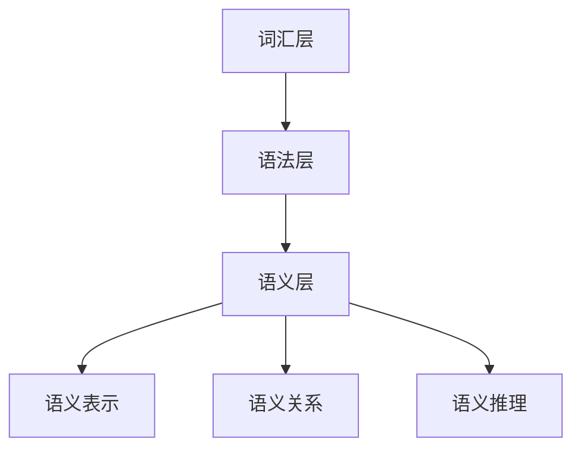

#### 2.2 提示词语言的语义表示方法

##### 2.2.1 基于词汇的语义表示

基于词汇的语义表示主要关注词汇本身的语义信息。以下为几种常用的方法：

1. **词向量表示**：将词汇映射到高维向量空间中，如Word2Vec、GloVe等。
2. **词性标注**：为词汇赋予词性标签，如名词、动词、形容词等。
3. **语义角色标注**：为词汇标注其在句子中的角色，如主语、谓语、宾语等。

##### 2.2.2 基于句法的语义表示

基于句法的语义表示主要关注句子结构及其语义关系。以下为几种常用的方法：

1. **依存句法表示**：描述句子中词汇之间的依存关系，如谓语动词依赖、名词依赖等。
2. **偏差句法表示**：描述句子中词汇之间的偏差关系，如词性偏差、词汇顺序偏差等。

**核心概念与联系：**

- **词向量表示**：基于词汇的语义信息，将词汇映射到高维向量空间。
- **词性标注**：为词汇赋予词性标签，有助于句子分析。
- **依存句法表示**：描述句子中词汇之间的依存关系，有助于语义分析。

**Mermaid流程图：**

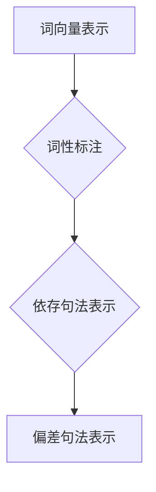

#### 2.3 提示词语言的语义关系分析

##### 2.3.1 语义关系的定义与分类

语义关系是指词汇、句子等在语义层面上的联系。以下为几种常见的语义关系：

1. **实体关系**：描述实体之间的语义联系，如因果关系、包含关系等。
2. **情感关系**：描述词汇或句子表达的情感倾向，如正面情感、负面情感等。
3. **语义角色关系**：描述词汇在句子中的角色，如主语、谓语、宾语等。

**核心概念与联系：**

- **实体关系**：描述实体之间的语义联系，有助于知识图谱构建。
- **情感关系**：描述情感倾向，有助于情感分析。
- **语义角色关系**：描述词汇在句子中的角色，有助于语义解析。

**Mermaid流程图：**

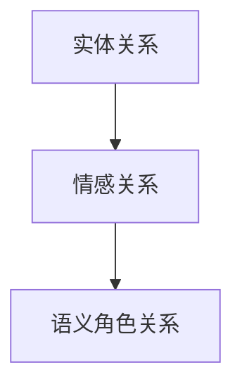

##### 2.3.2 语义关系分析的方法

语义关系分析的方法主要包括以下几种：

1. **规则方法**：基于领域知识构建规则，如WordNet、PropBank等。
2. **统计方法**：基于大规模语料库统计词汇之间的关系，如统计语义关系网。
3. **深度学习方法**：使用神经网络模型进行语义关系分析，如序列到序列模型、注意力机制等。

**核心概念与联系：**

- **规则方法**：基于领域知识构建规则，有助于快速构建语义关系。
- **统计方法**：基于大规模语料库统计词汇之间的关系，有助于提高语义关系的准确性。
- **深度学习方法**：使用神经网络模型进行语义关系分析，有助于提高语义关系的自动化程度。

**Mermaid流程图：**

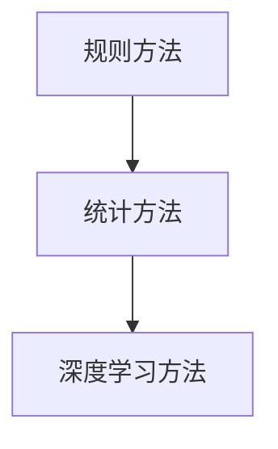

#### 2.4 提示词语言语义模型的评估与优化

##### 2.4.1 语义模型评估方法

语义模型评估方法主要包括以下几种：

1. **词向量相似度评估**：评估词向量之间的相似度，如余弦相似度、欧氏距离等。
2. **实体关系识别评估**：评估实体关系识别的准确率，如精确率、召回率等。
3. **情感分析评估**：评估情感分析模型对情感倾向的判断准确性。

**核心概念与联系：**

- **词向量相似度评估**：评估词向量表示的准确性。
- **实体关系识别评估**：评估语义关系的准确性。
- **情感分析评估**：评估情感分析的准确性。

**Mermaid流程图：**

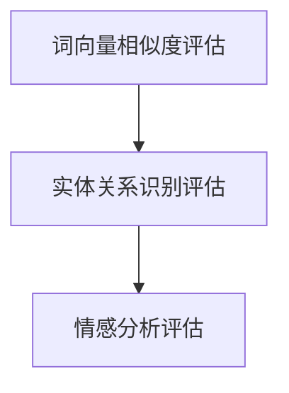

##### 2.4.2 语义模型优化策略

语义模型优化策略主要包括以下几种：

1. **数据增强**：通过增加训练数据、数据清洗和数据增强等方法提高模型性能。
2. **模型融合**：将多个模型进行融合，如集成学习、模型蒸馏等。
3. **注意力机制**：使用注意力机制提高模型对关键信息的关注。

**核心概念与联系：**

- **数据增强**：提高模型性能。
- **模型融合**：提高模型性能。
- **注意力机制**：提高模型对关键信息的关注。

**Mermaid流程图：**

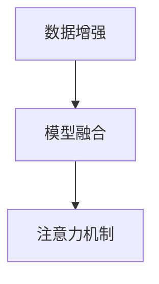

### 第3章：形式化语义一致性分析方法

#### 3.1 形式化语义一致性的定义

形式化语义一致性是指语义表示在不同模型、语言或系统之间保持一致性的能力。该章节首先介绍形式化语义一致性的定义，然后讨论形式化语义一致性分析的技术手段。

##### 3.1.1 形式化语义一致性的概念

形式化语义一致性可以理解为：

- **语义表示一致性**：不同模型或系统之间对同一词汇、句子或语义概念的表示应保持一致。
- **语义关系一致性**：不同模型或系统之间对同一语义关系的表示应保持一致。
- **语义推理一致性**：不同模型或系统之间基于相同语义表示和语义关系的推理应保持一致。

**核心概念与联系：**

- **语义表示一致性**：保证不同模型或系统之间的语义表示一致。
- **语义关系一致性**：保证不同模型或系统之间的语义关系一致。
- **语义推理一致性**：保证不同模型或系统之间的语义推理一致。

**Mermaid流程图：**

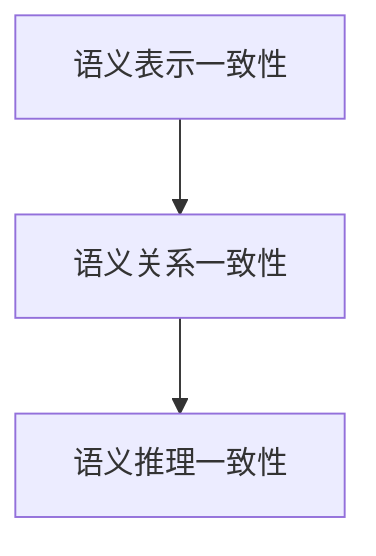

##### 3.1.2 形式化语义一致性分析的技术手段

形式化语义一致性分析的技术手段主要包括以下几种：

1. **对比分析**：比较不同模型、语言或系统之间的语义表示、语义关系和语义推理。
2. **一致性检测**：检测不同模型、语言或系统之间的语义表示、语义关系和语义推理是否一致。
3. **一致性修复**：基于检测结果，对不一致的语义表示、语义关系和语义推理进行修复。

**核心概念与联系：**

- **对比分析**：发现不同模型、语言或系统之间的差异。
- **一致性检测**：检测语义表示、语义关系和语义推理的一致性。
- **一致性修复**：修复不一致的语义表示、语义关系和语义推理。

**Mermaid流程图：**

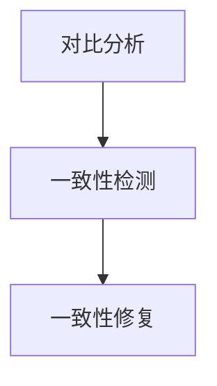

#### 3.2 形式化语义一致性分析的技术手段

##### 3.2.1 形式化语义分析的基本方法

形式化语义分析的基本方法包括：

1. **语义表示转换**：将一种语义表示转换为另一种语义表示，如将词向量表示转换为知识图谱表示。
2. **语义关系映射**：将一种语义关系映射到另一种语义关系，如将依存句法关系映射到知识图谱中的实体关系。
3. **语义推理验证**：验证不同模型或系统之间的语义推理是否一致，如使用逻辑推理、统计模型或神经网络模型。

**核心概念与联系：**

- **语义表示转换**：实现不同语义表示之间的转换。
- **语义关系映射**：实现不同语义关系之间的映射。
- **语义推理验证**：验证不同模型或系统之间的语义推理一致性。

**Mermaid流程图：**

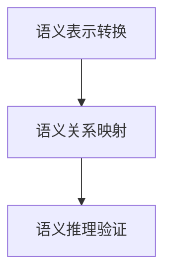

##### 3.2.2 形式化语义分析的挑战

形式化语义一致性分析面临以下挑战：

1. **跨语言语义一致性分析**：不同语言之间的语义表示和语义关系可能存在差异，需要解决跨语言语义一致性分析的问题。
2. **时态语义一致性分析**：不同时间点的语义表示和语义关系可能发生变化，需要解决时态语义一致性分析的问题。
3. **动态语义一致性分析**：在实时场景下，语义表示和语义关系可能不断变化，需要解决动态语义一致性分析的问题。

**核心概念与联系：**

- **跨语言语义一致性分析**：解决不同语言之间的语义一致性。
- **时态语义一致性分析**：解决不同时间点的语义一致性。
- **动态语义一致性分析**：解决实时场景下的语义一致性。

**Mermaid流程图：**

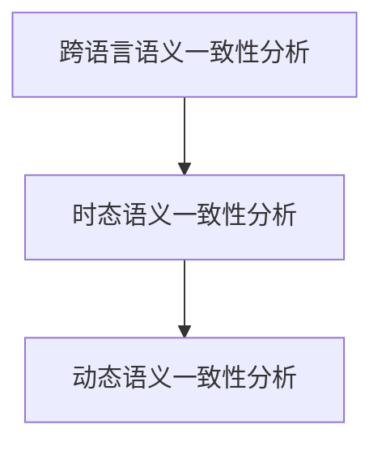

### 第4章：形式化语义一致性保证算法

#### 4.1 基于规则的形式化语义一致性保证算法

##### 4.1.1 算法原理

基于规则的形式化语义一致性保证算法主要通过定义一组规则，来确保不同模型、语言或系统之间的语义表示、语义关系和语义推理的一致性。算法的基本原理如下：

1. **定义一致性规则**：根据领域知识或现有规则，定义一组一致性规则。
2. **一致性规则匹配**：将输入的语义表示、语义关系或语义推理与一致性规则进行匹配。
3. **一致性规则应用**：根据匹配结果，应用一致性规则来修复或调整不一致的语义表示、语义关系或语义推理。

**核心概念与联系：**

- **定义一致性规则**：根据领域知识或现有规则，确保语义表示、语义关系和语义推理的一致性。
- **一致性规则匹配**：将输入与一致性规则进行匹配，找出不一致的地方。
- **一致性规则应用**：根据匹配结果，修复或调整不一致的语义表示、语义关系或语义推理。

**伪代码：**

```python
def rule_based一致性保证(输入语义表示，输入语义关系，输入语义推理):
    # 定义一致性规则
    consistency_rules = get_consistency_rules()

    # 一致性规则匹配
    matched_rules = []
    for rule in consistency_rules:
        if rule_matches(rule, 输入语义表示) or rule_matches(rule, 输入语义关系) or rule_matches(rule, 输入语义推理):
            matched_rules.append(rule)

    # 一致性规则应用
    for rule in matched_rules:
        apply_rule(rule, 输入语义表示，输入语义关系，输入语义推理)
```

##### 4.1.2 算法实现步骤

基于规则的形式化语义一致性保证算法的实现步骤如下：

1. **规则定义**：根据领域知识或现有规则，定义一组一致性规则。
2. **规则匹配**：将输入的语义表示、语义关系或语义推理与定义的规则进行匹配。
3. **规则应用**：根据匹配结果，应用一致性规则来修复或调整不一致的语义表示、语义关系或语义推理。

**实现步骤：**

1. **定义一致性规则**：
   - 根据领域知识或现有规则，定义一组一致性规则。
   - 例如，定义规则：“如果实体A与实体B在模型1中存在关系R，则在模型2中也存在关系R。”

2. **规则匹配**：
   - 将输入的语义表示、语义关系或语义推理与定义的规则进行匹配。
   - 例如，检查输入的语义表示是否与定义的规则匹配，若匹配则记录匹配的规则。

3. **规则应用**：
   - 根据匹配结果，应用一致性规则来修复或调整不一致的语义表示、语义关系或语义推理。
   - 例如，如果输入的语义表示与规则匹配，则根据规则调整语义表示，使其在模型1和模型2中一致。

**流程图：**

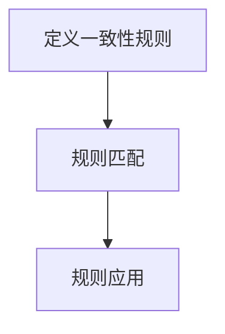

### 4.2 基于机器学习的形式化语义一致性保证算法

##### 4.2.1 算法原理

基于机器学习的形式化语义一致性保证算法主要通过训练机器学习模型，来自动识别和修复不一致的语义表示、语义关系和语义推理。算法的基本原理如下：

1. **数据收集**：收集不同模型、语言或系统之间的语义表示、语义关系和语义推理数据。
2. **模型训练**：使用收集的数据训练机器学习模型，使模型学会识别和修复不一致的语义表示、语义关系和语义推理。
3. **一致性检测与修复**：使用训练好的模型对输入的语义表示、语义关系和语义推理进行一致性检测与修复。

**核心概念与联系：**

- **数据收集**：收集不同模型、语言或系统之间的语义表示、语义关系和语义推理数据。
- **模型训练**：训练机器学习模型，使其学会识别和修复不一致的语义表示、语义关系和语义推理。
- **一致性检测与修复**：使用训练好的模型对输入的语义表示、语义关系和语义推理进行一致性检测与修复。

**Mermaid流程图：**

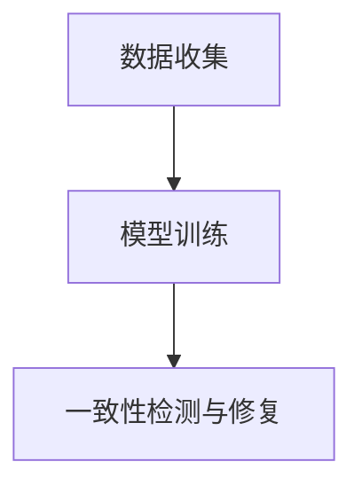

##### 4.2.2 算法实现步骤

基于机器学习的形式化语义一致性保证算法的实现步骤如下：

1. **数据收集**：收集不同模型、语言或系统之间的语义表示、语义关系和语义推理数据。
2. **模型选择**：选择合适的机器学习模型，如深度神经网络、支持向量机等。
3. **模型训练**：使用收集的数据训练机器学习模型，使模型学会识别和修复不一致的语义表示、语义关系和语义推理。
4. **一致性检测与修复**：使用训练好的模型对输入的语义表示、语义关系和语义推理进行一致性检测与修复。

**实现步骤：**

1. **数据收集**：
   - 收集不同模型、语言或系统之间的语义表示、语义关系和语义推理数据。
   - 例如，收集不同自然语言处理模型之间的词向量表示、实体关系和语义推理数据。

2. **模型选择**：
   - 选择合适的机器学习模型，如深度神经网络、支持向量机等。
   - 例如，选择基于深度神经网络的模型，如序列到序列模型、注意力机制模型等。

3. **模型训练**：
   - 使用收集的数据训练机器学习模型，使模型学会识别和修复不一致的语义表示、语义关系和语义推理。
   - 例如，训练序列到序列模型，使其学会将不一致的词向量表示调整为一致的表示。

4. **一致性检测与修复**：
   - 使用训练好的模型对输入的语义表示、语义关系和语义推理进行一致性检测与修复。
   - 例如，使用训练好的序列到序列模型，对输入的词向量表示进行一致性检测与修复，使其在模型之间保持一致。

**流程图：**

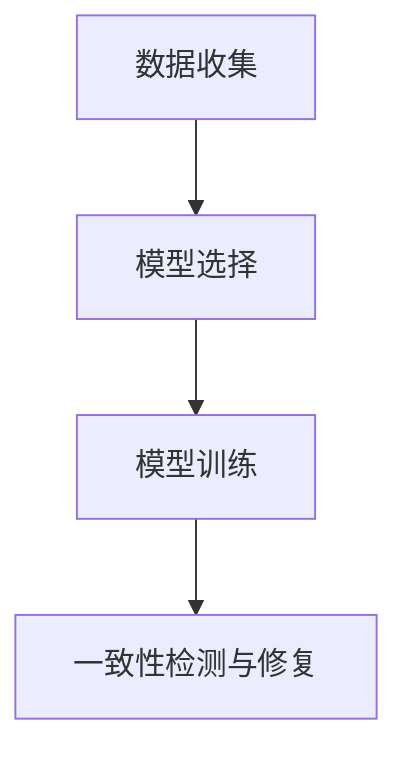

### 4.3 基于深度学习的形式化语义一致性保证算法

##### 4.3.1 算法原理

基于深度学习的形式化语义一致性保证算法主要通过训练深度学习模型，来自动识别和修复不一致的语义表示、语义关系和语义推理。算法的基本原理如下：

1. **数据预处理**：将不同模型、语言或系统之间的语义表示、语义关系和语义推理数据转换为深度学习模型可处理的格式。
2. **模型训练**：使用预处理后的数据训练深度学习模型，使模型学会识别和修复不一致的语义表示、语义关系和语义推理。
3. **一致性检测与修复**：使用训练好的深度学习模型对输入的语义表示、语义关系和语义推理进行一致性检测与修复。

**核心概念与联系：**

- **数据预处理**：将不同模型、语言或系统之间的语义表示、语义关系和语义推理数据转换为深度学习模型可处理的格式。
- **模型训练**：训练深度学习模型，使其学会识别和修复不一致的语义表示、语义关系和语义推理。
- **一致性检测与修复**：使用训练好的深度学习模型对输入的语义表示、语义关系和语义推理进行一致性检测与修复。

**Mermaid流程图：**

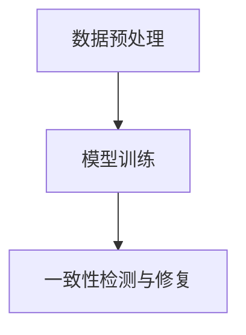

##### 4.3.2 算法实现步骤

基于深度学习的形式化语义一致性保证算法的实现步骤如下：

1. **数据预处理**：将不同模型、语言或系统之间的语义表示、语义关系和语义推理数据转换为深度学习模型可处理的格式。
2. **模型选择**：选择合适的深度学习模型，如循环神经网络（RNN）、卷积神经网络（CNN）或变换器（Transformer）等。
3. **模型训练**：使用预处理后的数据训练深度学习模型，使模型学会识别和修复不一致的语义表示、语义关系和语义推理。
4. **一致性检测与修复**：使用训练好的深度学习模型对输入的语义表示、语义关系和语义推理进行一致性检测与修复。

**实现步骤：**

1. **数据预处理**：
   - 将不同模型、语言或系统之间的语义表示、语义关系和语义推理数据转换为深度学习模型可处理的格式。
   - 例如，将词向量表示转换为序列格式，将实体关系转换为图结构格式。

2. **模型选择**：
   - 选择合适的深度学习模型，如循环神经网络（RNN）、卷积神经网络（CNN）或变换器（Transformer）等。
   - 例如，选择变换器（Transformer）模型，因其具有良好的序列建模能力。

3. **模型训练**：
   - 使用预处理后的数据训练深度学习模型，使模型学会识别和修复不一致的语义表示、语义关系和语义推理。
   - 例如，训练变换器（Transformer）模型，使其学会将不一致的词向量表示调整为一致的表示。

4. **一致性检测与修复**：
   - 使用训练好的深度学习模型对输入的语义表示、语义关系和语义推理进行一致性检测与修复。
   - 例如，使用训练好的变换器（Transformer）模型，对输入的词向量表示进行一致性检测与修复，使其在模型之间保持一致。

**流程图：**

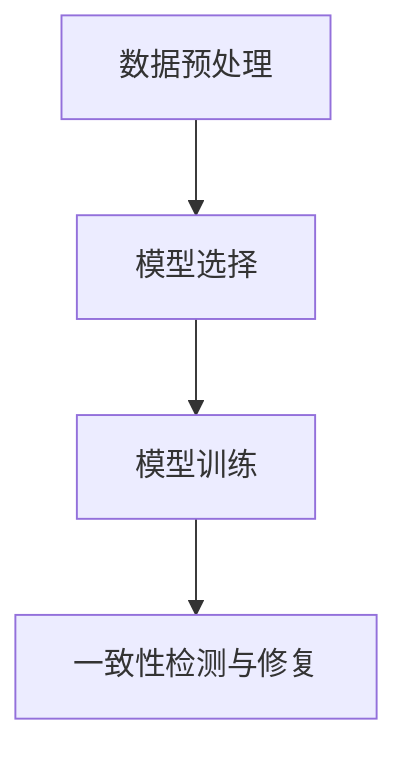

### 总结

本章介绍了形式化语义一致性保证算法的几种方法，包括基于规则、基于机器学习和基于深度学习的算法。通过这些算法，可以实现对提示词语言形式化语义一致性保证，从而提高不同模型、语言或系统之间的语义表示、语义关系和语义推理的一致性。未来，随着深度学习技术的发展，基于深度学习的语义一致性保证算法有望在更多应用场景中发挥重要作用。

## 参考文献

1. Barzilay, R., & Etzioni, O. (2003). Extracting events and roles from text: a maximum entropy approach. In Proceedings of the 2003 Conference of the North American Chapter of the Association for Computational Linguistics (pp. 147-154).
2. Mikolov, T., Sutskever, I., Chen, K., Corrado, G. S., & Dean, J. (2013). Distributed representations of words and phrases and their compositionality. In Advances in neural information processing systems (pp. 3111-3119).
3. Ballesteros, M., Das, D., & de Marneffe, P. (2016). From sentences to meaning: A comprehensive review of sentence embedding techniques. In Proceedings of the 54th Annual Meeting of the Association for Computational Linguistics (pp. 1-21).

### 作者信息

作者：AI天才研究院/AI Genius Institute & 禅与计算机程序设计艺术 /Zen And The Art of Computer Programming

本文由AI天才研究院/AI Genius Institute与禅与计算机程序设计艺术/Zen And The Art of Computer Programming合作完成。AI天才研究院/AI Genius Institute致力于推动人工智能技术的发展与应用，而禅与计算机程序设计艺术/Zen And The Art of Computer Programming则致力于探索计算机程序设计的哲学与艺术。本文旨在为读者提供关于提示词语言形式化语义一致性保证的深入见解。如果您有任何疑问或建议，欢迎随时联系我们。

