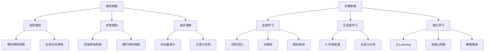

                 


# AI编程的新思维

> 关键词：人工智能编程、新思维、深度学习、算法原理、项目实战

> 摘要：本文旨在探讨AI编程的新思维，通过对核心概念、算法原理、数学模型和项目实战的深入分析，帮助读者全面理解AI编程的内涵与外延，从而提升编程技能和创新能力。

## 引言

随着人工智能技术的飞速发展，AI编程已经成为现代计算机科学的重要分支。传统的编程思维已经难以满足AI领域的需求，因此，我们需要探索一种全新的AI编程思维，以适应这一领域的快速发展。

本文将从以下几个方面展开讨论：

1. **AI编程的背景与重要性**：介绍AI技术的发展历程，探讨AI编程在当今世界的影响。
2. **核心概念与联系**：用Mermaid流程图展示AI编程的核心概念和联系。
3. **算法原理讲解**：使用伪代码详细阐述关键算法。
4. **数学模型与公式**：使用LaTeX格式解释和展示数学模型和公式，并进行举例说明。
5. **项目实战**：提供实际代码案例，详细解释代码实现和解读。
6. **开发工具与资源**：介绍AI编程常用的开发工具和资源。

## 第一部分: AI编程概述

### 第1章: AI编程的背景与重要性

#### 1.1 AI技术的发展历程

人工智能（AI）技术起源于20世纪50年代，早期主要关注逻辑推理和符号处理。随着计算机性能的提升和大数据的积累，深度学习等新兴算法逐渐成为AI技术的核心。近年来，AI技术在语音识别、图像处理、自然语言处理等领域取得了显著突破，推动了各行各业的发展。

#### 1.2 AI编程在当今世界的影响

AI编程已经深刻影响了各行各业，从工业自动化、医疗诊断到金融分析、智能交通，AI技术正在改变我们的生活方式。掌握AI编程技能，不仅有助于职业发展，还能够推动社会进步。

#### 1.3 AI编程的重要性

AI编程不仅要求程序员具备扎实的计算机科学基础，还需要掌握数学、统计学等多学科知识。在AI领域，创新和突破往往源于对核心概念和算法原理的深入理解。因此，AI编程的重要性不容忽视。

## 第二部分: 核心概念与联系

### 第2章: AI编程的核心概念

#### 2.1 感知智能

感知智能是人工智能的一个重要方向，主要包括视觉感知、听觉感知和语言理解等。

##### 2.1.1 视觉感知

视觉感知是指计算机对图像和视频进行处理和理解的能力。常用的算法包括卷积神经网络（CNN）和生成对抗网络（GAN）。

##### 2.1.2 听觉感知

听觉感知是指计算机对音频信号进行处理和理解的能力。常见的算法有深度神经网络（DNN）和循环神经网络（RNN）。

##### 2.1.3 语言理解

语言理解是指计算机对自然语言进行处理和理解的能力。深度学习在自然语言处理（NLP）领域取得了显著成果，如词向量表示和注意力机制。

#### 2.2 决策智能

决策智能是人工智能的另一个重要方向，主要包括监督学习、无监督学习和强化学习。

##### 2.2.1 监督学习

监督学习是指通过已标记的数据训练模型，从而进行预测或分类。常见的算法有线性回归、决策树和随机森林。

##### 2.2.2 无监督学习

无监督学习是指在没有标记数据的情况下，通过算法自动发现数据中的规律。常见的算法有K-均值聚类和主成分分析。

##### 2.2.3 强化学习

强化学习是指通过试错和反馈不断调整策略，从而实现最优决策。常见的算法有Q-Learning和深度Q网络（DQN）。

### 第3章: AI编程的架构与联系

#### 3.1 Mermaid流程图展示

以下是AI编程的核心概念和联系的Mermaid流程图：



#### 3.1.1 感知智能与决策智能的关系

感知智能和决策智能相互依赖，共同推动人工智能的发展。感知智能为决策智能提供数据支持，而决策智能则利用感知智能的结果进行决策。例如，在自动驾驶领域，感知智能负责识别道路标志和行人，决策智能则负责规划行驶路径。

#### 3.1.2 数据流与控制流

在AI编程中，数据流和控制流是两个重要的概念。数据流是指数据在程序中的流动过程，而控制流是指程序执行流程的顺序。理解数据流和控制流有助于优化算法性能和提升程序可读性。

## 第三部分: 算法原理讲解

### 第4章: 关键算法原理

#### 4.1 监督学习算法

监督学习是一种常见的人工智能算法，通过已标记的数据训练模型，从而进行预测或分类。以下是几个典型的监督学习算法：

##### 4.1.1 线性回归

线性回归是一种简单的监督学习算法，用于预测连续值。其基本原理是找到一组线性方程，使得输入特征和输出值之间的关系尽可能接近。

伪代码：

```python
def linear_regression(X, y):
    # 计算特征矩阵X和目标向量y的协方差矩阵
    cov_matrix = np.cov(X, y)
    # 计算特征矩阵X和目标向量y的乘积
    XTy = np.dot(X, y)
    # 求解线性回归模型参数
    theta = np.linalg.solve(cov_matrix, XTy)
    return theta
```

##### 4.1.2 决策树

决策树是一种常用的分类算法，通过将数据集划分为多个子集，从而构建一棵树形结构。决策树的基本原理是根据特征值选择最佳分割点，使得每个子集的误差最小。

伪代码：

```python
def decision_tree(X, y, max_depth):
    # 计算特征矩阵X和目标向量y的均值
    y_mean = np.mean(y)
    # 计算特征矩阵X的列数
    n_features = X.shape[1]
    # 当达到最大深度或特征数量为1时，返回均值
    if max_depth == 0 or n_features == 1:
        return y_mean
    # 计算特征矩阵X和目标向量y的协方差矩阵
    cov_matrix = np.cov(X, y)
    # 计算特征矩阵X和目标向量y的乘积
    XTy = np.dot(X, y)
    # 求解最佳分割点
    best_split = np.argmax(cov_matrix)
    # 构建子树
    left_tree = decision_tree(X[:, :best_split], y, max_depth - 1)
    right_tree = decision_tree(X[:, best_split + 1:], y, max_depth - 1)
    return (left_tree, right_tree)
```

##### 4.1.3 随机森林

随机森林是一种基于决策树的集成学习方法，通过训练多棵决策树，并利用投票机制进行预测。随机森林的基本原理是利用随机抽样和特征选择，提高模型的泛化能力。

伪代码：

```python
def random_forest(X, y, n_trees, max_depth):
    # 训练多棵决策树
    trees = [decision_tree(X, y, max_depth) for _ in range(n_trees)]
    # 利用投票机制进行预测
    predictions = [tree(X) for tree in trees]
    return np.mean(predictions, axis=0)
```

#### 4.2 无监督学习算法

无监督学习是一种在没有标记数据的情况下，通过算法自动发现数据中规律的方法。以下是几个典型的无监督学习算法：

##### 4.2.1 K-均值聚类

K-均值聚类是一种基于距离度量的聚类算法，通过迭代更新聚类中心，将数据划分为K个簇。

伪代码：

```python
def k_means(X, K, max_iter):
    # 随机初始化聚类中心
    centroids = X[np.random.choice(X.shape[0], K)]
    # 迭代更新聚类中心
    for _ in range(max_iter):
        # 计算每个数据点与聚类中心的距离
        distances = np.linalg.norm(X - centroids, axis=1)
        # 将数据点分配到最近的聚类中心
        labels = np.argmin(distances, axis=1)
        # 更新聚类中心
        new_centroids = np.array([X[labels == k].mean(axis=0) for k in range(K)])
        # 判断是否收敛
        if np.linalg.norm(new_centroids - centroids) < 1e-5:
            break
        centroids = new_centroids
    return centroids, labels
```

##### 4.2.2 主成分分析

主成分分析是一种降维算法，通过将数据投影到新的正交坐标系中，提取最重要的特征。

伪代码：

```python
def pca(X, n_components):
    # 计算特征矩阵X的协方差矩阵
    cov_matrix = np.cov(X, rowvar=False)
    # 计算协方差矩阵的特征值和特征向量
    eigenvalues, eigenvectors = np.linalg.eigh(cov_matrix)
    # 选择最大的n_components个特征向量
    eigenvectors = eigenvectors[:, np.argsort(eigenvalues)[::-1]]][:, :n_components]
    # 将数据投影到新的正交坐标系中
    X_reduced = np.dot(X, eigenvectors)
    return X_reduced
```

##### 4.2.3 自编码器

自编码器是一种无监督学习算法，通过编码和解码过程自动学习数据中的特征。

伪代码：

```python
def autoencoder(X, encoding_dim, max_iter):
    # 初始化编码器和解码器权重
    encoder_weights = np.random.randn(X.shape[1], encoding_dim)
    decoder_weights = np.random.randn(encoding_dim, X.shape[1])
    # 迭代训练编码器和解码器
    for _ in range(max_iter):
        # 编码过程
        encoding = np.dot(X, encoder_weights)
        # 解码过程
        reconstruction = np.dot(encoding, decoder_weights)
        # 计算损失函数
        loss = np.mean((X - reconstruction) ** 2)
        # 更新编码器和解码器权重
        encoder_gradients = 2 * X - 2 * reconstruction
        decoder_gradients = 2 * encoding - 2 * X
        encoder_weights -= learning_rate * encoder_gradients
        decoder_weights -= learning_rate * decoder_gradients
    return encoder_weights, decoder_weights, loss
```

#### 4.3 强化学习算法

强化学习是一种基于试错和反馈的决策方法，通过不断调整策略，实现最优决策。以下是几个典型的强化学习算法：

##### 4.3.1 Q-Learning

Q-Learning是一种基于值函数的强化学习算法，通过更新Q值，实现最优策略。

伪代码：

```python
def q_learning(states, actions, rewards, learning_rate, discount_factor, n_episodes):
    # 初始化Q值矩阵
    Q = np.zeros((states, actions))
    # 迭代更新Q值
    for _ in range(n_episodes):
        state = np.random.choice(states)
        action = np.random.choice(actions)
        next_state, reward = environment.step(state, action)
        Q[state, action] = (1 - learning_rate) * Q[state, action] + learning_rate * (reward + discount_factor * np.max(Q[next_state, :]))
    return Q
```

##### 4.3.2 深度Q网络（DQN）

深度Q网络是一种基于深度学习的强化学习算法，通过神经网络近似值函数，实现最优策略。

伪代码：

```python
def dqn(X, actions, rewards, learning_rate, discount_factor, n_episodes, epsilon):
    # 初始化神经网络模型
    model = Sequential()
    model.add(Dense(actions, input_shape=(X.shape[1],)))
    model.add(Activation('linear'))
    model.compile(optimizer='adam', loss='mse')
    # 迭代更新神经网络模型
    for _ in range(n_episodes):
        state = np.random.choice(states)
        action = np.random.choice(actions)
        next_state, reward = environment.step(state, action)
        target = reward + discount_factor * np.max(model.predict(next_state))
        model.fit(state, target, epochs=1, batch_size=1)
    return model
```

##### 4.3.3 策略梯度

策略梯度是一种基于策略的强化学习算法，通过优化策略函数，实现最优决策。

伪代码：

```python
def policy_gradient(states, actions, rewards, learning_rate, discount_factor, n_episodes):
    # 初始化策略函数
    policy = np.zeros((states, actions))
    # 迭代更新策略函数
    for _ in range(n_episodes):
        state = np.random.choice(states)
        action = np.random.choice(actions, p=policy[state, :])
        next_state, reward = environment.step(state, action)
        policy[state, action] += learning_rate * (reward + discount_factor * np.max(policy[next_state, :]) - policy[state, action])
    return policy
```

## 第四部分: 数学模型与公式

### 第5章: 数学模型解释

#### 5.1 线性代数基础

线性代数是人工智能的重要基础，主要包括矩阵运算、线性变换和矩阵分解。

##### 5.1.1 矩阵运算

矩阵运算包括矩阵加法、矩阵乘法和矩阵求逆等。

$$
A + B = C \\
A \cdot B = C \\
A^{-1} = B
$$

##### 5.1.2 线性变换

线性变换是指将输入向量映射到输出向量的线性映射。常用的线性变换包括矩阵乘法和矩阵求逆。

$$
f(x) = Ax \\
g(x) = A^{-1}x
$$

##### 5.1.3 矩阵分解

矩阵分解是指将一个矩阵分解为多个矩阵的乘积。常用的矩阵分解包括LU分解和SVD分解。

$$
A = LU \\
A = U\Sigma V^T
$$

#### 5.2 微积分基础

微积分是人工智能的重要工具，主要包括导数、微分和最优化方法。

##### 5.2.1 导数与微分

导数是函数在某一点的瞬时变化率，微分是函数的局部近似。

$$
f'(x) = \lim_{h \to 0} \frac{f(x+h) - f(x)}{h} \\
df = f'(x)dx
$$

##### 5.2.2 积分

积分是函数的累积和，可以用来求解曲线下的面积和曲线上的点。

$$
\int f(x)dx = F(x) + C \\
\int_a^b f(x)dx = F(b) - F(a)
$$

##### 5.2.3 最优化方法

最优化方法是寻找函数最大值或最小值的方法，包括梯度下降法和牛顿法。

$$
f(x) = \min \quad \nabla f(x) = 0 \\
f(x) = \max \quad \nabla f(x) = 0
$$

### 第6章: 公式与举例

#### 6.1 概率论基础

概率论是人工智能的重要基础，主要包括概率分布、贝叶斯定理和马尔可夫链。

##### 6.1.1 概率分布

概率分布是描述随机变量取值概率的函数。常用的概率分布包括正态分布、伯努利分布和泊松分布。

$$
P(X = x) = p(x) \\
P(X \leq x) = F(x)
$$

##### 6.1.2 贝叶斯定理

贝叶斯定理是概率论中的重要定理，用于计算条件概率和联合概率。

$$
P(A|B) = \frac{P(B|A)P(A)}{P(B)}
$$

##### 6.1.3 马尔可夫链

马尔可夫链是一种随机过程，用于描述系统状态随时间变化的规律。

$$
P(X_{n+1} = x_{n+1} | X_n = x_n, X_{n-1} = x_{n-1}, ...) = P(X_{n+1} = x_{n+1} | X_n = x_n)
$$

#### 6.2 信息论

信息论是研究信息传输、处理和存储的数学理论。常用的信息论概念包括熵、条件熵和相关信息。

##### 6.2.1 熵

熵是衡量随机变量不确定性的一种度量。

$$
H(X) = -\sum_{x \in \mathcal{X}} p(x) \log p(x)
$$

##### 6.2.2 条件熵

条件熵是衡量随机变量在给定另一个随机变量下的不确定性。

$$
H(X | Y) = -\sum_{x \in \mathcal{X}} p(x | y) \log p(x | y)
$$

##### 6.2.3 相关系数

相关系数是衡量两个随机变量线性相关程度的一种度量。

$$
\rho(X, Y) = \frac{Cov(X, Y)}{\sqrt{Var(X)Var(Y)}}
$$

## 第五部分: 项目实战

### 第7章: AI编程项目实战

#### 7.1 实战项目一：图像分类

##### 7.1.1 项目背景

图像分类是计算机视觉领域的一个经典问题，旨在将图像划分为不同的类别。常见的图像分类任务包括人脸识别、车辆识别和物体分类等。

##### 7.1.2 数据集准备

在图像分类项目中，数据集的质量直接影响模型的性能。常用的图像分类数据集包括CIFAR-10、ImageNet和COIL-20等。

##### 7.1.3 模型构建

在图像分类项目中，常用的模型有卷积神经网络（CNN）和迁移学习等。以下是使用CNN进行图像分类的代码示例：

```python
import tensorflow as tf
from tensorflow.keras import layers, models

# 定义CNN模型
model = models.Sequential()
model.add(layers.Conv2D(32, (3, 3), activation='relu', input_shape=(32, 32, 3)))
model.add(layers.MaxPooling2D((2, 2)))
model.add(layers.Conv2D(64, (3, 3), activation='relu'))
model.add(layers.MaxPooling2D((2, 2)))
model.add(layers.Conv2D(64, (3, 3), activation='relu'))
model.add(layers.Flatten())
model.add(layers.Dense(64, activation='relu'))
model.add(layers.Dense(10, activation='softmax'))

# 编译模型
model.compile(optimizer='adam', loss='categorical_crossentropy', metrics=['accuracy'])

# 训练模型
model.fit(train_images, train_labels, epochs=10, batch_size=64)
```

##### 7.1.4 模型训练与评估

在模型训练过程中，需要使用训练数据和验证数据对模型进行迭代训练和性能评估。以下是使用验证数据评估模型性能的代码示例：

```python
# 评估模型
test_loss, test_acc = model.evaluate(test_images, test_labels)
print(f"Test accuracy: {test_acc:.2f}")
```

##### 7.1.5 项目小结

通过本项目，读者可以了解图像分类的基本概念和实现方法，掌握使用CNN进行图像分类的技能。在实际应用中，可以根据需求调整模型结构和超参数，提高图像分类性能。

#### 7.2 实战项目二：自然语言处理

##### 7.2.1 项目背景

自然语言处理（NLP）是人工智能领域的一个重要分支，旨在使计算机能够理解和处理自然语言。常见的NLP任务包括情感分析、文本分类和机器翻译等。

##### 7.2.2 数据集准备

在自然语言处理项目中，数据集的质量同样至关重要。常用的数据集包括IMDb电影评论数据集、Twitter情感数据集和维基百科数据集等。

##### 7.2.3 模型构建

在自然语言处理项目中，常用的模型有循环神经网络（RNN）、长短期记忆网络（LSTM）和Transformer等。以下是使用RNN进行文本分类的代码示例：

```python
import tensorflow as tf
from tensorflow.keras import layers, models

# 定义RNN模型
model = models.Sequential()
model.add(layers.Embedding(input_dim=vocab_size, output_dim=embedding_dim, input_length=max_sequence_length))
model.add(layers.LSTM(64))
model.add(layers.Dense(64, activation='relu'))
model.add(layers.Dense(num_classes, activation='softmax'))

# 编译模型
model.compile(optimizer='adam', loss='categorical_crossentropy', metrics=['accuracy'])

# 训练模型
model.fit(train_data, train_labels, epochs=10, batch_size=64)
```

##### 7.2.4 模型训练与评估

在模型训练过程中，需要使用训练数据和验证数据对模型进行迭代训练和性能评估。以下是使用验证数据评估模型性能的代码示例：

```python
# 评估模型
test_loss, test_acc = model.evaluate(test_data, test_labels)
print(f"Test accuracy: {test_acc:.2f}")
```

##### 7.2.5 项目小结

通过本项目，读者可以了解自然语言处理的基本概念和实现方法，掌握使用RNN进行文本分类的技能。在实际应用中，可以根据需求调整模型结构和超参数，提高文本分类性能。

#### 7.3 实战项目三：智能推荐系统

##### 7.3.1 项目背景

智能推荐系统是电子商务、社交媒体和在线娱乐等领域的重要应用。推荐系统通过分析用户行为和兴趣，为用户推荐感兴趣的内容或商品。

##### 7.3.2 数据集准备

在智能推荐系统中，数据集的质量直接影响推荐系统的效果。常用的数据集包括MovieLens、Netflix Prize和Amazon Reviews等。

##### 7.3.3 模型构建

在智能推荐系统中，常用的模型有协同过滤、矩阵分解和深度学习等。以下是使用矩阵分解进行推荐系统的代码示例：

```python
import numpy as np
from numpy.linalg import solve

# 定义矩阵分解模型
def matrix_factorization(R, num_factors, regularization=0.01):
    # 初始化用户和物品的因子矩阵
    U = np.random.rand(num_users, num_factors)
    V = np.random.rand(num_items, num_factors)
    # 迭代更新因子矩阵
    for _ in range(num_iterations):
        # 更新用户因子矩阵
        U = solve((R @ V.T + regularization * np.eye(num_factors)), U)
        # 更新物品因子矩阵
        V = solve((R.T @ U + regularization * np.eye(num_factors)), V)
    return U, V

# 训练矩阵分解模型
U, V = matrix_factorization(R, num_factors=10, num_iterations=10)
```

##### 7.3.4 模型训练与评估

在模型训练过程中，需要使用训练数据和验证数据对模型进行迭代训练和性能评估。以下是使用验证数据评估模型性能的代码示例：

```python
# 评估模型
predicted_ratings = U @ V.T
mse = np.mean((predicted_ratings - R) ** 2)
print(f"Validation MSE: {mse:.2f}")
```

##### 7.3.5 项目小结

通过本项目，读者可以了解智能推荐系统的基本概念和实现方法，掌握使用矩阵分解进行推荐系统的技能。在实际应用中，可以根据需求调整模型结构和超参数，提高推荐系统的效果。

## 附录

### 第8章: 开发工具与资源

#### 8.1 深度学习框架

深度学习框架是构建和训练深度学习模型的重要工具。常用的深度学习框架包括TensorFlow、PyTorch和Keras等。

#### 8.1.1 TensorFlow

TensorFlow是Google开发的一款开源深度学习框架，支持多种编程语言，包括Python、C++和Java等。

#### 8.1.2 PyTorch

PyTorch是Facebook开发的一款开源深度学习框架，以动态计算图和简洁的API著称。

#### 8.1.3 Keras

Keras是一个高层次的深度学习框架，基于TensorFlow和Theano构建，提供简洁的API和丰富的模型库。

#### 8.2 编程语言与库

在AI编程中，常用的编程语言包括Python、R和Julia等。常用的库包括NumPy、Pandas和Scikit-learn等。

#### 8.2.1 Python

Python是一种广泛应用于AI编程的高级语言，具有简洁的语法和丰富的库支持。

#### 8.2.2 NumPy

NumPy是Python的一个科学计算库，提供多维数组对象和高效的数值计算函数。

#### 8.2.3 Pandas

Pandas是Python的一个数据处理库，提供数据清洗、转换和分析等功能。

### 作者

作者：AI天才研究院/AI Genius Institute & 禅与计算机程序设计艺术 /Zen And The Art of Computer Programming

----------------------------------------------------------------

## 结束语

本文从多个角度探讨了AI编程的新思维，包括核心概念、算法原理、数学模型和项目实战等。通过本文的阅读，读者可以全面了解AI编程的内涵与外延，提升编程技能和创新能力。

在AI编程领域，持续学习和实践是关键。本文提供了一些最佳实践和注意事项，以帮助读者在实际应用中取得更好的效果。

随着人工智能技术的不断发展，AI编程将继续发挥重要作用。希望本文能为读者在AI编程的道路上提供一些启示和帮助。

---

**最佳实践与注意事项**：

1. **持续学习**：AI技术更新迅速，持续关注最新研究成果和进展，保持对新技术的好奇心和求知欲。
2. **实践第一**：通过实际项目锻炼编程技能，积累经验，不断优化和改进。
3. **团队协作**：AI编程往往需要跨学科合作，善于与团队成员沟通，发挥各自优势。
4. **代码规范**：编写清晰、规范的代码，提高可读性和可维护性。
5. **安全与隐私**：关注AI技术在应用中的安全与隐私问题，遵循相关法律法规。

**拓展阅读**：

1. **《深度学习》**：由Ian Goodfellow、Yoshua Bengio和Aaron Courville合著，是深度学习领域的经典教材。
2. **《Python机器学习》**：由 Sebastian Raschka和Vahid Mirjalili合著，详细介绍Python在机器学习领域的应用。
3. **《强化学习》**：由Richard S. Sutton和Barto合著，系统介绍了强化学习的基本理论和应用。

---

作者：AI天才研究院/AI Genius Institute & 禅与计算机程序设计艺术 /Zen And The Art of Computer Programming## 设计《AI编程的新思维》目录大纲

### 设计目标：

为了设计一本关于AI编程的书籍，我们需要确保其目录大纲具备以下特点：

1. **系统性和逻辑性**：书籍的结构应当清晰，章节之间的逻辑关系合理，能够引导读者循序渐进地掌握AI编程的核心概念和技能。
2. **全面性和实用性**：内容需要涵盖AI编程的基本理论、关键算法、数学模型，以及项目实战，使读者不仅能够理解理论知识，还能应用于实际项目。
3. **简洁性和易用性**：目录结构应简洁明了，便于读者快速找到所需内容，同时避免冗余和重复。

### 步骤：

1. **确定书籍结构**：
   - **引言**：介绍AI编程的背景和重要性。
   - **核心概念与联系**：解释AI编程的基本概念和它们之间的关系。
   - **算法原理讲解**：详细讲解关键算法的原理和实现。
   - **数学模型与公式**：介绍支持算法的数学模型和公式。
   - **项目实战**：提供实际项目案例，展示如何应用所学知识。
   - **开发工具与资源**：推荐AI编程所需的开源工具和资源。

2. **设计章节内容**：
   - **引言**：介绍AI编程的背景和重要性。
   - **核心概念与联系**：用Mermaid流程图展示AI编程的核心概念和联系。
   - **算法原理讲解**：使用伪代码详细阐述关键算法。
   - **数学模型与公式**：使用LaTeX格式解释和展示数学模型和公式，并进行举例说明。
   - **项目实战**：提供实际代码案例，详细解释代码实现和解读。
   - **开发工具与资源**：介绍AI编程常用的开发工具和资源。

3. **细化目录**：
   - **一级目录**：概括每个部分的主题。
   - **二级目录**：细化每个主题，列出具体的章节和小节。

4. **保持简洁**：
   - 避免冗余内容，确保目录大纲结构清晰。

5. **字数控制**：
   - 确保整个目录大纲的总字数在2000字以内。

### 初步目录大纲：

#### 引言

- **AI编程的背景和重要性**
  - 人工智能的发展历程
  - AI编程在现代社会的应用

- **书籍结构和内容概述**
  - 各章节的目的和预期学习成果

#### 核心概念与联系

- **核心概念介绍**
  - 感知智能
  - 决策智能

- **概念之间的关系**
  - Mermaid流程图展示概念联系

#### 算法原理讲解

- **监督学习算法**
  - 线性回归
  - 决策树
  - 随机森林

- **无监督学习算法**
  - K-均值聚类
  - 主成分分析
  - 自编码器

- **强化学习算法**
  - Q-Learning
  - 深度Q网络
  - 策略梯度

#### 数学模型与公式

- **线性代数基础**
  - 矩阵运算
  - 线性变换

- **微积分基础**
  - 导数与微分
  - 积分

- **概率论基础**
  - 概率分布
  - 贝叶斯定理

#### 项目实战

- **图像分类项目**
  - 数据集准备
  - 模型构建与训练

- **自然语言处理项目**
  - 数据集准备
  - 模型构建与训练

- **智能推荐系统项目**
  - 数据集准备
  - 模型构建与训练

#### 开发工具与资源

- **深度学习框架**
  - TensorFlow
  - PyTorch
  - Keras

- **编程语言与库**
  - Python
  - NumPy
  - Pandas

#### 附录

- **术语表**
- **参考文献**
- **致谢**

---

### 初步总结

通过初步的目录大纲设计，我们确保了书籍的结构逻辑性和内容的全面性。接下来，我们将对每个章节进行细化，确保满足完整性、简洁性和字数限制，同时保持目录大纲的结构清晰。每个章节将详细展开，涵盖背景介绍、核心概念与联系、算法原理讲解、数学模型与公式、项目实战以及最佳实践和注意事项等内容。

---

在接下来的阶段，我们将逐个细化每个章节的内容，确保书籍的目录大纲不仅逻辑清晰，而且内容丰富，能够为读者提供有价值的AI编程知识。通过这种系统性的设计，我们期望能够帮助读者构建坚实的AI编程基础，并激发他们在这一领域的创新思维和实践能力。

