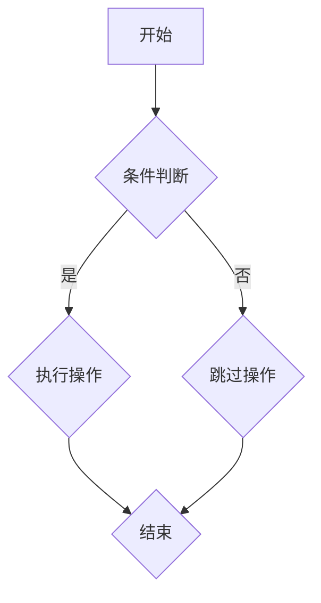

                 

### 引言

#### 1.1 AI编程的背景

人工智能（AI）作为计算机科学的一个分支，近年来得到了前所未有的发展。从早期的专家系统到如今深度学习的广泛应用，人工智能技术已经在各个领域展现出了巨大的潜力和应用价值。人工智能的发展离不开编程，编程是实现人工智能算法和应用的核心手段。无论是训练模型、优化算法，还是开发应用程序，编程都扮演着至关重要的角色。

人工智能技术广泛应用于自然语言处理、计算机视觉、语音识别、推荐系统等多个领域。例如，在医疗领域，人工智能可以辅助医生进行诊断和治疗；在金融领域，人工智能可以用于风险评估和欺诈检测；在交通领域，自动驾驶技术正在逐渐成为现实。这些应用都离不开高效的编程实现和优化。

编程在人工智能领域的重要性不言而喻。编程不仅能够将人工智能的理论转化为实际应用，还能够不断推动人工智能技术的创新和发展。一个优秀的编程实践可以大幅提高算法的效率，优化模型的性能，甚至能够解决一些传统方法难以克服的难题。因此，掌握高效的AI编程技能对于人工智能领域的从业者来说至关重要。

随着人工智能技术的不断进步，AI编程也在不断地演变。从早期的脚本编程到现代的框架和工具，AI编程已经变得更加高效和智能化。同时，新的编程思想和范式，如函数式编程、并行编程等，也在AI编程中得到了广泛应用。这些变化不仅提升了编程的效率，还使得编程变得更加有趣和富有挑战性。

#### 1.2 AI编程的现状与挑战

当前的AI编程面临着多种挑战，同时也展现出了许多新的趋势和机遇。首先，传统的编程方式与AI编程存在显著差异。传统的编程更多关注的是程序的逻辑和流程，而AI编程则更加注重数据的处理和算法的优化。AI编程通常涉及大量的数据预处理、特征工程和模型调优等环节，这些环节需要程序员具备更高的数据科学和机器学习知识。

其次，AI编程面临的技术挑战也极为严峻。深度学习模型通常非常复杂，需要大量的计算资源和时间进行训练。同时，模型的性能往往依赖于数据质量和预处理方法。如何有效地处理大规模数据、提高模型的泛化能力和解释性，是当前AI编程需要解决的重要问题。

此外，AI编程的未来趋势也在逐步显现。随着人工智能技术的不断发展，AI编程将更加智能化和自动化。例如，自动代码生成、自动化模型优化等技术将极大地提高编程的效率。同时，AI编程也将与其他领域的技术深度融合，如区块链、物联网等，推动新技术的创新和应用。

总之，AI编程的现状和挑战反映了人工智能技术发展的前沿动态。面对这些挑战，程序员需要不断学习新的编程技术和工具，提升自身的技术能力，以应对未来AI编程的复杂性和挑战。同时，AI编程的未来也充满了无限可能，为程序员提供了广阔的发展空间和机遇。

### AI编程的基础知识

#### 2.1 机器学习与深度学习

机器学习和深度学习是AI编程的核心技术，它们在人工智能的发展中起着至关重要的作用。了解这两者的基本概念、原理及其应用，是掌握AI编程的基础。

**机器学习**是指通过算法从数据中学习规律，并使用这些规律进行预测或决策。它主要分为监督学习、无监督学习和强化学习三种类型：

- **监督学习**：通过已标记的数据训练模型，然后使用模型对未标记的数据进行预测。常见的算法包括线性回归、决策树、支持向量机等。
- **无监督学习**：不需要标记数据，模型通过自身学习发现数据中的模式和结构。聚类和降维是常见的无监督学习算法。
- **强化学习**：通过与环境互动，学习如何获得最大的奖励。常见的算法包括Q学习、深度Q网络（DQN）等。

**深度学习**是机器学习的一个分支，它通过构建具有多个隐藏层的神经网络来模拟人脑的学习过程。深度学习在图像识别、语音识别、自然语言处理等领域取得了显著成果。

深度学习的基本原理是通过反向传播算法来训练神经网络。网络中的每个神经元（或节点）接收多个输入，并通过激活函数产生输出。在训练过程中，网络会不断调整权重和偏置，以最小化预测误差。

常见的深度学习架构包括：

- **卷积神经网络（CNN）**：适用于图像识别和计算机视觉任务，通过卷积操作提取图像的特征。
- **循环神经网络（RNN）**：适用于序列数据处理，如语音识别和自然语言处理。
- **生成对抗网络（GAN）**：通过两个对抗网络（生成器和判别器）的博弈过程，生成具有真实感的图像和语音。

在AI编程中，机器学习和深度学习被广泛应用于各种应用场景，如：

- **图像识别**：通过训练深度学习模型，对图像中的对象进行分类和定位。
- **语音识别**：将语音信号转化为文本，广泛应用于语音助手和自动字幕。
- **自然语言处理**：通过训练语言模型，实现文本分类、情感分析、机器翻译等功能。
- **推荐系统**：通过分析用户行为和兴趣，为用户推荐商品、音乐、电影等。

总之，机器学习和深度学习为AI编程提供了强大的工具和理论基础。掌握这些技术，不仅可以提升编程能力，还可以更好地应对复杂的应用场景，推动人工智能技术的发展。

#### 2.2 编程语言的选择

在AI编程领域，编程语言的选择至关重要，不同的编程语言各有其优势和特点。其中，Python因其简洁、易学且拥有丰富的库和工具，成为了AI编程的主要语言。

**Python在AI编程中的优势**：

1. **简洁性**：Python拥有简单的语法和清晰的代码结构，使得编程更加直观和高效。这种简洁性不仅降低了学习门槛，还提高了开发速度。
2. **丰富的库和框架**：Python拥有大量的开源库和框架，如NumPy、Pandas、Scikit-learn、TensorFlow和PyTorch等，这些工具为AI编程提供了强大的支持。NumPy和Pandas用于数据处理，Scikit-learn用于机器学习，而TensorFlow和PyTorch则是深度学习的两大主流框架。
3. **跨平台兼容性**：Python可以在多种操作系统上运行，包括Windows、Linux和MacOS，这使得开发者可以轻松在不同环境中进行编程。
4. **社区支持**：Python拥有庞大的开发者社区，提供了大量的文档、教程和示例代码，帮助新手快速上手。

**其他常用编程语言简介**：

1. **Java**：Java是一种广泛使用的编程语言，尤其在大型企业和开发复杂系统时具有优势。Java在AI编程中主要用于开发大规模分布式系统，如Hadoop和Spark等大数据处理框架。
2. **C++**：C++是一种高性能的编程语言，常用于需要高度优化的AI应用，如深度学习模型训练。其强大的性能和灵活性使其在需要高效计算的领域具有重要地位。
3. **R**：R是一种专门用于统计分析和数据科学的编程语言，广泛应用于机器学习和数据分析。R拥有丰富的统计库和包，如ggplot2、dplyr和tidyr等。
4. **Julia**：Julia是一种新兴的编程语言，旨在提供高性能和简洁性。Julia在AI编程中表现出色，特别是在需要快速迭代和高效计算的领域。

总之，不同的编程语言在AI编程中都有其独特的应用场景和优势。Python由于其简洁性、丰富的库和工具以及强大的社区支持，成为了AI编程的首选语言。然而，根据具体的应用需求，其他编程语言也可以发挥重要作用。

#### 2.3 AI编程工具与框架

在AI编程中，选择合适的工具和框架能够显著提高开发效率和项目质量。以下是几种主流的AI编程工具和框架的介绍，以及它们的选择和使用方法。

**TensorFlow**：TensorFlow是Google开发的开源深度学习框架，支持多种编程语言，包括Python、C++和Java等。其特点包括：

- **灵活性**：TensorFlow提供了丰富的API，支持自定义模型结构，适用于各种复杂的应用场景。
- **分布式训练**：TensorFlow支持分布式计算，可以充分利用多GPU和集群资源，提高训练速度。
- **生态系统**：TensorFlow拥有庞大的社区和生态系统，提供了丰富的教程、示例和工具。

TensorFlow的使用方法通常包括以下几个步骤：

1. **安装和配置**：下载并安装TensorFlow，配置环境变量。
2. **导入库**：在代码中导入TensorFlow库。
3. **定义模型**：使用TensorFlow的API构建神经网络模型。
4. **训练模型**：使用训练数据对模型进行训练。
5. **评估模型**：使用测试数据评估模型性能。
6. **部署模型**：将训练好的模型部署到生产环境。

**PyTorch**：PyTorch是Facebook开发的另一个开源深度学习框架，以其灵活和易于理解的动态计算图而闻名。其主要特点包括：

- **动态计算图**：PyTorch使用动态计算图，使开发者可以更容易地理解和调试代码。
- **自动微分**：PyTorch内置自动微分功能，方便实现复杂的深度学习算法。
- **社区支持**：PyTorch拥有活跃的社区，提供了大量的教程、资源和预训练模型。

PyTorch的使用方法通常包括：

1. **安装和配置**：下载并安装PyTorch，配置环境变量。
2. **导入库**：在代码中导入PyTorch库。
3. **定义模型**：使用PyTorch的API构建神经网络模型。
4. **训练模型**：使用训练数据对模型进行训练。
5. **评估模型**：使用测试数据评估模型性能。
6. **部署模型**：将训练好的模型部署到生产环境。

**Keras**：Keras是一个高层神经网络API，可以在TensorFlow和Theano等后端运行。其特点包括：

- **易用性**：Keras提供了简洁的API，使得搭建和训练神经网络更加直观和方便。
- **模块化**：Keras支持模块化设计，可以方便地组合和扩展神经网络架构。
- **集成深度**：Keras与TensorFlow和Theano等深度学习框架集成，可以充分利用底层框架的功能和性能。

Keras的使用方法通常包括：

1. **安装和配置**：下载并安装Keras，配置环境变量。
2. **导入库**：在代码中导入Keras库。
3. **定义模型**：使用Keras的API构建神经网络模型。
4. **训练模型**：使用训练数据对模型进行训练。
5. **评估模型**：使用测试数据评估模型性能。
6. **部署模型**：将训练好的模型部署到生产环境。

**其他框架**：除了TensorFlow、PyTorch和Keras，还有其他一些常用的深度学习框架，如Caffe、Theano和MXNet等。这些框架各自有其特点和适用场景，可以根据具体需求选择合适的框架。

总之，AI编程工具和框架的选择对于项目的成功至关重要。通过了解和掌握这些主流框架的特点和使用方法，开发者可以更加高效地实现AI应用，推动人工智能技术的发展。

#### 3.1 数据处理

在AI编程中，数据处理是至关重要的一环。无论是训练机器学习模型，还是优化深度学习算法，都需要对数据进行有效的处理和预处理。本节将详细讨论数据处理的基本方法、数据清洗与数据增强，以及这些方法在实际应用中的具体操作。

**数据处理的基本方法**

1. **数据清洗**：数据清洗是数据处理的首要步骤，目的是去除数据中的噪声和异常值，确保数据质量。常用的数据清洗方法包括：
   - **缺失值处理**：对于缺失的数据，可以选择填充法、删除法或插值法。
     - **填充法**：使用平均值、中位数、众数等统计量来填充缺失值。
     - **删除法**：删除包含缺失值的样本或特征。
     - **插值法**：使用插值算法（如线性插值、多项式插值等）填补缺失值。
   - **异常值检测**：使用统计方法（如Z分数、IQR法等）检测和去除异常值。
     - **Z分数法**：计算每个数据点的Z分数，去除绝对值大于3的Z分数。
     - **IQR法**：计算第1四分位数和第3四分位数，去除位于IQR之外的值。

2. **数据转换**：数据转换包括将数据标准化、归一化，以及进行编码处理等，以便于模型训练。
   - **标准化**：将数据缩放到相同范围（通常是[-1, 1]或[0, 1]），消除特征之间的尺度差异。
   - **归一化**：保持数据尺度不变，但将其转换为期望的分布（如正态分布）。
   - **编码处理**：对于类别型数据，使用独热编码、标签编码等方法将其转换为数值型。

3. **数据归一化**：数据归一化是一种常用的方法，目的是使不同特征具有相似的尺度，从而避免某些特征对模型的影响过大。
   - **最小-最大缩放**：将数据缩放到[0, 1]范围，公式为 \( X' = \frac{X - X_{\text{min}}}{X_{\text{max}} - X_{\text{min}}} \)。
   - **Z分数标准化**：将数据缩放到均值附近，公式为 \( X' = \frac{X - \mu}{\sigma} \)。

4. **特征选择**：通过降维技术，选择对模型性能影响最大的特征，减少数据维度，提高模型训练效率。
   - **过滤式特征选择**：基于统计方法筛选特征，如相关性分析、方差分析等。
   - **包装式特征选择**：结合模型性能，逐步筛选特征，如递归特征消除（RFE）等。

**数据清洗与数据增强**

1. **数据清洗**：数据清洗的主要任务是处理不完整、不一致或错误的数据。清洗过程通常包括以下几个步骤：
   - **数据检查**：检查数据是否存在缺失值、异常值等。
   - **数据修正**：使用适当的方法修正错误数据，如填充缺失值、去除异常值等。
   - **数据验证**：验证数据是否符合预期，确保清洗效果。

2. **数据增强**：数据增强是通过生成新的样本来提高模型泛化能力的方法。常见的数据增强技术包括：
   - **重采样**：通过增加重复样本或删除重复样本来扩充数据集。
   - **数据变换**：通过旋转、翻转、缩放、裁剪等操作生成新的数据样本。
   - **生成对抗网络（GAN）**：通过生成器和判别器的对抗训练，生成与真实数据相似的新数据。

**实际操作**

1. **数据清洗**：以Python为例，使用Pandas和Scikit-learn进行数据清洗。
   ```python
   import pandas as pd
   from sklearn.impute import SimpleImputer
   from sklearn.preprocessing import StandardScaler
   
   # 读取数据
   data = pd.read_csv('data.csv')
   
   # 缺失值处理
   imputer = SimpleImputer(strategy='mean')
   data_filled = imputer.fit_transform(data)
   
   # 异常值检测
   from scipy import stats
   data_clean = data[(np.abs(stats.zscore(data_filled)) < 3).all(axis=1)]
   
   # 数据转换
   scaler = StandardScaler()
   data_scaled = scaler.fit_transform(data_clean)
   ```

2. **数据增强**：使用Python中的Keras和GAN进行数据增强。
   ```python
   from tensorflow.keras.models import Model
   from tensorflow.keras.layers import Input, Dense, Conv2D, Flatten, Reshape
   
   # 生成器模型
   gen_input = Input(shape=(100,))
   x = Dense(256, activation='relu')(gen_input)
   x = Dense(512, activation='relu')(x)
   x = Dense(1024, activation='relu')(x)
   x = Reshape((32, 32, 1))(x)
   gen_output = Conv2D(filters=1, kernel_size=(5, 5), activation='tanh')(x)
   
   generator = Model(gen_input, gen_output)
   
   # 判别器模型
   disc_input = Input(shape=(32, 32, 1))
   x = Conv2D(filters=64, kernel_size=(5, 5), activation='relu')(disc_input)
   x = Flatten()(x)
   disc_output = Dense(units=1, activation='sigmoid')(x)
   
   discriminator = Model(disc_input, disc_output)
   
   # GAN模型
   gan_input = Input(shape=(100,))
   gen_output = generator(gan_input)
   disc_output = discriminator(gen_output)
   
   gan_output = Model(gan_input, disc_output)
   
   # 训练GAN
   gan_output.compile(optimizer='adam', loss='binary_crossentropy')
   gan_output.fit(x_train, y_train, epochs=100, batch_size=32)
   ```

通过以上方法，我们可以对数据进行有效的处理和增强，从而提高模型的性能和泛化能力。

#### 3.2 模型选择与优化

在AI编程中，模型选择和优化是确保算法性能和准确性的关键步骤。选择合适的模型和优化方法是实现高效AI应用的基础。以下将详细探讨模型选择策略、模型优化方法以及实际应用中的评估和调优技巧。

**模型选择策略**

1. **数据集特征**：根据数据集的特征选择合适的模型。例如，对于小样本数据集，选择轻量级的模型（如决策树、随机森林）可以避免过拟合；对于大规模数据集，深度学习模型（如卷积神经网络、循环神经网络）可能更适合。

2. **问题类型**：根据具体的应用问题选择合适的模型。例如，对于分类问题，可以选择决策树、支持向量机、神经网络等；对于回归问题，可以选择线性回归、决策树回归、随机森林回归等。

3. **模型复杂度**：选择模型时需要考虑模型的复杂度。较复杂的模型（如深度神经网络）可以捕捉更多的特征和模式，但训练时间较长且容易过拟合；较简单的模型（如线性模型）则训练时间短，但可能无法捕捉复杂的关系。

4. **性能指标**：根据问题的性能指标选择模型。例如，对于分类问题，可以关注准确率、精确率、召回率等；对于回归问题，可以关注均方误差、均方根误差等。

**模型优化方法**

1. **调整模型参数**：通过调整模型的超参数（如学习率、正则化参数、隐藏层节点数等）来优化模型性能。常用的方法包括网格搜索、随机搜索、贝叶斯优化等。

2. **集成学习方法**：集成学习通过结合多个模型来提高性能，常用的集成学习方法包括Bagging、Boosting和Stacking等。例如，随机森林通过Bagging方法结合多个决策树；XGBoost通过Boosting方法提升模型性能。

3. **正则化方法**：正则化方法通过在损失函数中加入惩罚项来防止模型过拟合。常用的正则化方法包括L1正则化（Lasso）、L2正则化（Ridge）和弹性网络（Elastic Net）等。

4. **激活函数和优化器**：选择合适的激活函数（如ReLU、Sigmoid、Tanh）和优化器（如SGD、Adam）可以显著提高模型训练速度和性能。

**实际应用中的评估和调优技巧**

1. **交叉验证**：使用交叉验证方法评估模型性能，避免过拟合和欠拟合。常用的交叉验证方法包括K折交叉验证、留一法交叉验证等。

2. **模型调优**：根据交叉验证的结果调整模型参数，优化模型性能。可以采用网格搜索、随机搜索等方法自动寻找最佳参数。

3. **性能评估**：使用多个性能指标评估模型性能，如准确率、精确率、召回率、F1分数等。可以根据实际应用需求选择最合适的评估指标。

4. **模型集成**：结合多个模型的结果来提高预测准确性和稳定性。可以使用模型融合方法（如投票法、加权法等）将多个模型的预测结果集成起来。

5. **实时调优**：在实际应用中，根据新的数据和反馈实时调整模型参数，优化模型性能。可以使用在线学习算法（如在线梯度下降、自适应梯度方法等）来实现实时调优。

通过上述模型选择和优化方法，我们可以构建高效的AI模型，并在实际应用中不断优化和提升其性能。这些方法不仅适用于学术研究，也为工业界和商业领域提供了有效的解决方案。

#### 3.3 模型评估与调优

在AI编程中，模型评估与调优是确保模型性能和准确性的关键步骤。一个优秀的模型不仅需要准确的预测，还需要在多种条件下保持稳定性和可靠性。以下将详细讨论评估指标与方法，以及调优技巧与实践。

**评估指标与方法**

1. **准确率（Accuracy）**：准确率是评估分类模型最常用的指标，表示正确分类的样本数占总样本数的比例。公式为：
   \[
   \text{Accuracy} = \frac{\text{正确分类的样本数}}{\text{总样本数}}
   \]
   尽管简单，但准确率在某些情况下可能不够全面，因为它忽略了不同类别的重要性。

2. **精确率（Precision）**：精确率表示在所有被预测为正类的样本中，真正类的比例。公式为：
   \[
   \text{Precision} = \frac{\text{真正类}}{\text{真正类 + 假正类}}
   \]
   精确率特别适用于那些我们关心避免错误判断为正类的场景。

3. **召回率（Recall）**：召回率表示在所有实际为正类的样本中，被正确预测为正类的比例。公式为：
   \[
   \text{Recall} = \frac{\text{真正类}}{\text{真正类 + 假反类}}
   \]
   召回率对于那些我们不想错过的正类尤为重要。

4. **F1分数（F1 Score）**：F1分数是精确率和召回率的调和平均值，能够平衡两者的权重。公式为：
   \[
   \text{F1 Score} = 2 \times \frac{\text{Precision} \times \text{Recall}}{\text{Precision} + \text{Recall}}
   \]
   当精确率和召回率之间存在显著差异时，F1分数是一个很好的综合指标。

5. **混淆矩阵（Confusion Matrix）**：混淆矩阵展示了实际类别与预测类别的关系，包括真正类、假正类、假反类和真正类。通过分析混淆矩阵，可以更直观地了解模型的性能。

**调优技巧与实践**

1. **交叉验证（Cross-Validation）**：交叉验证是一种评估模型性能的常见方法，通过将数据集分成K个子集，轮流将每个子集作为测试集，其余作为训练集，重复K次，取平均性能。常用的交叉验证方法包括K折交叉验证和留一法交叉验证。

2. **超参数调优（Hyperparameter Tuning）**：超参数（如学习率、隐藏层节点数、正则化参数等）直接影响模型的性能。调优方法包括网格搜索（Grid Search）和随机搜索（Random Search），以及更先进的贝叶斯优化（Bayesian Optimization）。

3. **集成学习（Ensemble Learning）**：集成学习通过结合多个模型来提高整体性能。常用的集成学习方法包括Bagging（如随机森林）、Boosting（如XGBoost）和Stacking。通过集成多个模型的预测结果，可以降低方差、提高准确率。

4. **模型简化（Model Simplification）**：对于过拟合的模型，可以通过简化模型结构来提高泛化能力。常用的简化方法包括正则化（如L1、L2正则化）、Dropout和模型剪枝。

5. **数据增强（Data Augmentation）**：数据增强通过生成新的训练样本来提高模型的泛化能力。常见的方法包括旋转、缩放、裁剪和颜色变换等。

**实际案例分析**

假设我们有一个分类问题，需要预测客户是否会在未来一个月内购买某种商品。以下是模型评估与调优的步骤：

1. **数据预处理**：对数据进行清洗和标准化，包括处理缺失值、异常值和特征缩放。

2. **模型选择**：选择合适的模型，如随机森林、XGBoost或神经网络。通过交叉验证选择表现最佳的模型。

3. **超参数调优**：使用网格搜索或贝叶斯优化调整超参数，如学习率、隐藏层节点数、正则化参数等。

4. **模型训练与评估**：使用训练数据训练模型，并在验证集上评估模型性能，包括准确率、精确率、召回率和F1分数。

5. **模型调优**：根据评估结果调整模型结构或超参数，如增加隐藏层节点数、调整学习率等。

6. **测试集评估**：在独立的测试集上评估最终模型的性能，确保模型在未见数据上也能表现良好。

7. **模型部署**：将训练好的模型部署到生产环境，进行实时预测。

通过上述步骤，我们可以构建一个性能优异的模型，并在实际应用中不断优化和改进。

**总结**：

模型评估与调优是AI编程中不可或缺的步骤，通过选择合适的评估指标、调优方法和实践经验，可以显著提高模型的性能和准确率。掌握这些技巧不仅有助于学术研究，也为工业应用提供了有效的解决方案。

#### 4.1 语音识别系统

语音识别系统是一种重要的AI应用，它能够将人类的语音转化为文本，广泛应用于智能助手、自动字幕、语音搜索等领域。本节将详细探讨语音识别的基本原理、开发流程以及关键技术和挑战。

**基本原理**

语音识别系统通常包括以下几个核心模块：

1. **前端处理**：前端处理主要负责对原始语音信号进行预处理，包括降噪、增强、分帧和加窗等操作，以便于后续的特征提取。

2. **特征提取**：特征提取模块将预处理后的语音信号转换为数字特征向量，常用的特征包括梅尔频率倒谱系数（MFCC）、感知线性预测（PLP）和倒谱倒谱距离（Delta Cepstral）等。

3. **声学模型**：声学模型用于描述语音信号的统计特性，通常采用高斯混合模型（GMM）或深度神经网络（DNN）。声学模型通过训练大量语音数据，学习语音信号中的概率分布。

4. **语言模型**：语言模型用于对语音信号中的词汇和句子结构进行建模，常用的模型包括n-gram模型、循环神经网络（RNN）和Transformer等。语言模型通过分析大量文本数据，学习词汇的概率分布和语法结构。

5. **解码器**：解码器负责将声学模型和语言模型的结果转换为最终的文本输出。解码器通常采用动态规划算法（如Viterbi算法）或基于深度学习的解码器（如CTC、ATTENTION机制）。

**开发流程**

语音识别系统的开发流程通常包括以下几个步骤：

1. **数据准备**：收集和整理大量的语音数据，包括音频文件和对应的文本标注。数据来源可以包括公开数据集、自有数据集和语音合成数据。

2. **数据预处理**：对收集到的语音数据进行预处理，包括降噪、增强、分帧和加窗等操作。预处理后的数据将被用于训练声学模型和语言模型。

3. **模型训练**：使用预处理后的数据训练声学模型和语言模型。训练过程通常包括特征提取、模型构建、模型优化和验证等步骤。

4. **模型评估**：在独立的数据集上评估模型的性能，包括准确率、召回率、F1分数等指标。通过调整模型参数和超参数，优化模型性能。

5. **模型部署**：将训练好的模型部署到实际应用场景中，如智能助手、自动字幕等。部署过程需要考虑模型的实时性和资源消耗。

**关键技术和挑战**

1. **数据处理**：语音识别的数据处理包括语音信号的处理和文本处理。数据处理的质量直接影响模型的性能。挑战包括噪声处理、语音分离和多通道处理等。

2. **模型选择**：选择合适的模型架构和参数对于语音识别系统的性能至关重要。深度学习模型（如DNN、RNN、Transformer）在语音识别中表现出色，但选择和调优过程复杂。

3. **多语言支持**：多语言支持是语音识别系统的重要挑战，不同语言的语音特征和语法结构差异较大。需要设计适应多语言场景的声学模型和语言模型。

4. **实时性能**：实时性能是语音识别系统在应用中的重要指标。要求系统能够快速处理语音信号并输出文本，这对硬件和算法优化提出了较高要求。

5. **误差处理**：语音识别系统在应用中不可避免地会产生误差，需要设计有效的误差处理和纠正机制。例如，可以使用纠错算法、模糊搜索和上下文信息来提高识别准确率。

通过以上探讨，我们可以了解到语音识别系统在AI编程中的重要作用和面临的挑战。随着技术的不断进步，语音识别系统将越来越智能化和高效化，为人类社会带来更多的便利和创新。

#### 4.2 图像分类系统

图像分类系统是AI编程中的一项重要应用，它通过算法自动识别和分类图像中的对象或场景。在计算机视觉领域，图像分类系统被广泛应用于人脸识别、车辆检测、医疗影像分析等领域。以下将详细探讨图像分类的基本原理、开发流程、以及常见算法和挑战。

**基本原理**

图像分类系统的核心是训练一个分类模型，该模型能够根据图像的特征将其分类到预定的类别中。基本原理包括以下几个关键模块：

1. **特征提取**：特征提取模块从原始图像中提取有用的信息，形成数字化的特征向量。常用的特征提取方法包括：
   - **传统方法**：如SIFT（尺度不变特征变换）、HOG（直方图方向梯度）等，这些方法通过分析图像的局部特征进行分类。
   - **深度学习方法**：如卷积神经网络（CNN）中的特征提取，通过多层卷积和池化操作自动学习图像的高层次特征。

2. **分类器训练**：分类器训练模块使用提取到的特征和标签数据进行训练，构建分类模型。常用的分类器包括：
   - **线性分类器**：如支持向量机（SVM）、逻辑回归等。
   - **树形分类器**：如决策树、随机森林等。
   - **深度学习分类器**：如深度卷积神经网络（DCNN）等。

3. **模型评估**：模型评估模块通过验证集或测试集对训练好的分类模型进行性能评估，常用的评估指标包括准确率、精确率、召回率、F1分数等。

**开发流程**

图像分类系统的开发流程通常包括以下几个步骤：

1. **数据准备**：收集和整理大量的图像数据，这些数据包括训练集、验证集和测试集。图像数据可以从公开数据集（如ImageNet、CIFAR-10）或自定义数据集获取。图像数据需要标注，以便于模型训练。

2. **数据预处理**：对图像数据进行预处理，包括缩放、裁剪、旋转、翻转等操作，增加数据多样性。此外，还需要对图像进行归一化处理，将像素值缩放到统一范围。

3. **特征提取**：使用特征提取模块提取图像的特征向量。对于传统方法，可以直接使用预定义的特征提取器；对于深度学习方法，可以使用预训练的CNN模型提取特征。

4. **模型训练**：使用提取到的特征和标签数据进行模型训练。深度学习方法通常需要较大的训练数据和计算资源。训练过程中，通过反向传播算法不断优化模型参数。

5. **模型评估**：在验证集或测试集上评估模型的性能，调整模型参数以优化性能。通过交叉验证等方法确保模型具有较好的泛化能力。

6. **模型部署**：将训练好的模型部署到实际应用场景中，如手机应用、嵌入式设备等。部署时需要考虑模型的实时性和资源消耗。

**常见算法**

1. **支持向量机（SVM）**：SVM是一种经典的线性分类器，通过找到一个最佳的超平面，将不同类别的样本分开。SVM在处理高维数据时表现出色，但需要大量的计算资源。

2. **决策树**：决策树是一种基于树的分类器，通过一系列的决策规则对样本进行分类。决策树结构简单，易于理解和解释，但可能产生过拟合。

3. **随机森林**：随机森林是一种基于决策树的集成学习方法，通过构建多个决策树并取平均值来提高分类性能。随机森林在处理大规模数据和避免过拟合方面表现出色。

4. **卷积神经网络（CNN）**：CNN是一种深度学习模型，专门用于处理图像数据。CNN通过卷积、池化等操作自动提取图像的特征，并在多个层中逐步抽象化。CNN在图像分类任务中表现出极高的准确率。

5. **迁移学习**：迁移学习是一种利用预训练模型来提高新任务性能的方法。通过在预训练模型的基础上微调参数，可以显著提高新任务的分类性能，特别是对于数据量有限的场景。

**挑战**

1. **过拟合**：过拟合是指模型在训练数据上表现良好，但在未见数据上表现较差。避免过拟合是图像分类系统中的一个关键挑战。

2. **数据多样性**：图像分类系统需要处理大量的图像数据，这些数据需要具有多样性，以避免模型在特定数据集上出现过拟合。

3. **实时性能**：图像分类系统在实时应用中需要快速处理图像数据，这对算法的效率和模型的压缩提出了较高要求。

4. **多标签分类**：许多图像可能包含多个类别，如何在模型中处理多标签分类是一个重要挑战。

5. **小样本学习**：在数据量较少的场景下，如何设计有效的模型和训练策略是一个关键问题。

通过以上探讨，我们可以了解到图像分类系统在AI编程中的重要性和挑战。随着技术的不断进步，图像分类系统将更加高效、准确，并将在更多领域得到广泛应用。

#### 4.3 自然语言处理应用

自然语言处理（NLP）是AI编程中的一项重要领域，它致力于使计算机理解和处理人类语言。NLP在文本分类、情感分析、机器翻译、问答系统等领域有着广泛的应用。以下将详细探讨自然语言处理的基本概念，以及一个具体项目的开发实践。

**基本概念**

自然语言处理涉及多个核心概念，包括：

1. **文本预处理**：文本预处理是NLP的首要步骤，包括分词、去停用词、词性标注、词干提取等操作。这些操作帮助将原始文本转换为计算机可以处理的格式。

2. **词嵌入（Word Embedding）**：词嵌入是一种将词汇映射到高维向量空间的方法，常用的模型包括Word2Vec、GloVe和BERT等。词嵌入能够捕捉词汇之间的语义关系，是许多NLP任务的基础。

3. **序列模型（Sequence Model）**：序列模型能够处理序列数据，如循环神经网络（RNN）和长短期记忆网络（LSTM）。RNN和LSTM在语言建模、机器翻译等任务中表现出色。

4. **注意力机制（Attention Mechanism）**：注意力机制是一种用于提高序列模型性能的技术，它能够使模型在处理序列数据时更加关注重要部分。注意力机制在机器翻译、问答系统等任务中得到了广泛应用。

5. **语言生成（Language Generation）**：语言生成是指根据输入生成自然语言的文本。常见的生成模型包括序列到序列（Seq2Seq）模型、Transformer和GPT等。

**项目开发实践**

以下是一个简单的情感分析项目的开发实践，通过这个项目，我们可以了解如何使用NLP技术实现一个实际应用。

**项目目标**：使用深度学习模型对一段文本进行情感分析，判断其是否为正面或负面评论。

**开发步骤**：

1. **数据准备**：收集和整理大量带有情感标签的文本数据。数据来源可以包括公开数据集（如IMDb电影评论）或自定义数据集。

2. **数据预处理**：对文本数据进行预处理，包括分词、去停用词、词性标注等。预处理后的文本将用于训练模型。

3. **词嵌入**：使用预训练的词嵌入模型（如GloVe或Word2Vec）将词汇映射到高维向量空间。词嵌入有助于捕捉词汇之间的语义关系。

4. **模型设计**：设计一个深度学习模型，通常采用双向长短期记忆网络（BiLSTM）或Transformer。模型将接收词嵌入向量，并输出情感分类的结果。

5. **模型训练**：使用预处理后的数据和标签训练深度学习模型。训练过程中，通过反向传播算法优化模型参数。

6. **模型评估**：在验证集上评估模型的性能，包括准确率、精确率、召回率、F1分数等指标。通过调整模型结构和超参数，优化模型性能。

7. **模型部署**：将训练好的模型部署到实际应用场景中，如在线评论分析系统。部署时需要考虑模型的实时性和资源消耗。

**项目实现**：

以下是一个使用PyTorch实现的双向长短期记忆网络（BiLSTM）情感分析模型的代码示例：

```python
import torch
import torch.nn as nn
from torch.optim import Adam
from torchtext.data import Field, TabularDataset

# 定义数据处理
TEXT = Field(tokenize = 'spacy', lower = True)
LABEL = Field(sequential = False)

# 加载数据集
train_data, test_data = TabularDataset.splits(path = 'data', train = 'train.csv', test = 'test.csv', format = 'csv',
                                            fields = [('text', TEXT), ('label', LABEL)])

# 分词器配置
TEXT.build_vocab(train_data, min_freq = 2)
LABEL.build_vocab(train_data)

# 划分数据集
train_data, valid_data = train_data.split()

# 定义模型
class BiLSTM(nn.Module):
    def __init__(self, vocab_size, embedding_dim, hidden_dim, output_dim, num_layers, dropout):
        super().__init__()
        self.embedding = nn.Embedding(vocab_size, embedding_dim)
        self.lstm = nn.LSTM(embedding_dim, hidden_dim, num_layers, dropout = dropout, batch_first = True)
        self.fc = nn.Linear(hidden_dim, output_dim)
        
    def forward(self, text):
        embedded = self.embedding(text)
        output, (hidden, _) = self.lstm(embedded)
        hidden = hidden[-1, :, :]
        out = self.fc(hidden)
        return out

# 初始化模型、优化器和损失函数
model = BiLSTM(len(TEXT.vocab), 100, 256, 1, 2, 0.5)
optimizer = Adam(model.parameters(), lr = 0.001)
criterion = nn.BCEWithLogitsLoss()

# 训练模型
def train(model, train_data, valid_data, criterion, optimizer, n_epochs = 10):
    model.train()
    for epoch in range(n_epochs):
        for batch in train_data:
            optimizer.zero_grad()
            predictions = model(batch.text).squeeze(1)
            loss = criterion(predictions, batch.label)
            loss.backward()
            optimizer.step()
        
        with torch.no_grad():
            model.eval()
            valid_loss = 0
            for batch in valid_data:
                predictions = model(batch.text).squeeze(1)
                valid_loss += criterion(predictions, batch.label)
            valid_loss /= len(valid_data)
        
        print(f'Epoch: {epoch+1} - Loss: {loss.item()} - Validation Loss: {valid_loss.item()}')

# 训练模型
train(model, train_data, valid_data, criterion, optimizer)

# 评估模型
with torch.no_grad():
    model.eval()
    valid_loss = 0
    for batch in valid_data:
        predictions = model(batch.text).squeeze(1)
        valid_loss += criterion(predictions, batch.label)
    valid_loss /= len(valid_data)
    print(f'Validation Loss: {valid_loss.item()}')
```

通过这个项目，我们可以看到如何使用NLP技术实现一个情感分析系统。这个项目不仅展示了NLP的基本原理和实现步骤，还提供了一个实际应用的案例，展示了如何将理论知识应用到实际项目中。

#### 4.4 联合学习与联邦学习

联合学习与联邦学习是近年来人工智能领域的重要研究方向，尤其在隐私保护和数据安全方面展现出了巨大的应用潜力。这两者虽然在名称上相似，但应用场景和实现方法各有不同。

**联合学习（Federated Learning）**

联合学习是一种分布式学习框架，旨在通过多个独立的参与者共同训练一个共享的模型，而无需将数据集中到一个中心服务器。这种方法的核心思想是让每个参与者在自己的本地设备上训练模型，然后将模型更新同步到全局模型。这种分布式训练方式不仅提高了数据处理效率，还显著增强了数据隐私保护。

**基本原理**

1. **数据本地化**：在联合学习中，每个参与者仅在自己的设备上训练模型，数据不需要上传到中央服务器。这有效地避免了数据泄露的风险。
2. **模型更新同步**：在每次迭代结束后，每个参与者将局部模型的更新（梯度）发送到中央服务器，服务器将这些更新合并成一个全局模型。这一过程称为同步。
3. **通信效率**：联合学习通过减少数据传输量来提高通信效率。参与者仅发送模型更新的差分，而不是整个模型。

**实现方法**

1. **客户端-服务器架构**：在联合学习中，通常有一个中央服务器负责协调模型的训练和更新。客户端是指参与训练的设备，如手机、平板等。
2. **梯度聚合**：服务器通过聚合来自不同客户端的梯度来更新全局模型。常用的方法包括求平均、加权平均等。
3. **模型压缩**：为了减少通信开销，可以采用模型压缩技术，如剪枝、量化等。这些技术可以大幅减少模型大小和传输数据量。

**应用场景**

1. **隐私保护**：联合学习在涉及隐私数据的场景中具有显著优势，如医疗健康数据、个人通信记录等。
2. **边缘计算**：在物联网（IoT）和边缘计算领域，联合学习能够有效处理分布式设备上的数据，提高数据处理效率。
3. **联邦广告**：在广告领域，联合学习可以协同多个广告平台的数据，提高广告投放的精准度和效果。

**联邦学习（Federated Learning）**

联邦学习是一种分布式学习框架，旨在通过多个独立的数据源共同训练一个共享的模型，而无需将数据集中到一个中心服务器。与联合学习类似，联邦学习也关注数据隐私保护和分布式数据处理，但实现方法有所不同。

**基本原理**

1. **数据分布**：在联邦学习中，每个数据源都维护自己的本地模型和数据。这些本地模型和数据在不同的节点上独立训练。
2. **模型聚合**：在每次迭代结束后，每个节点将本地模型的更新发送到中央服务器，服务器将这些更新合并成一个全局模型。
3. **安全性**：联邦学习通过加密技术、差分隐私等技术保障数据的安全性和隐私性。

**实现方法**

1. **本地训练**：每个节点在自己的数据集上独立训练本地模型。
2. **模型更新发送**：本地模型在训练完成后，将更新发送到中央服务器。
3. **模型聚合**：服务器通过聚合来自不同节点的模型更新，更新全局模型。
4. **加密与隐私保护**：联邦学习使用加密技术（如差分隐私、同态加密）确保数据在传输和存储过程中的安全性。

**应用场景**

1. **隐私数据保护**：联邦学习在医疗、金融等涉及隐私数据的领域具有广泛的应用前景。
2. **边缘计算**：在物联网和边缘计算中，联邦学习能够有效处理分布式数据源，提高数据处理效率。
3. **跨机构合作**：在多个机构或企业需要协同处理数据时，联邦学习提供了一个安全、高效的解决方案。

**比较**

- **数据集中**：联合学习中的数据分散在多个客户端上，而联邦学习的数据分散在多个服务器或节点上。
- **隐私保护**：联邦学习通常采用更强的加密和隐私保护技术，而联合学习则更侧重于减少数据传输。
- **实现复杂度**：联邦学习的实现通常更为复杂，需要考虑数据同步、模型聚合、隐私保护等多个方面。

通过上述探讨，我们可以看到联合学习和联邦学习在分布式数据处理和隐私保护方面的重要性和应用前景。随着技术的不断进步，这两者将在更多领域得到广泛应用，推动人工智能的发展。

#### 5.2 AI编程中的伦理问题

随着人工智能技术的快速发展，AI编程不仅面临着技术上的挑战，还涉及一系列伦理问题。这些伦理问题涉及到隐私保护、算法偏见、透明性和责任分配等方面。本节将探讨AI编程中的主要伦理挑战，并提出相应的解决方案。

**隐私保护**

人工智能应用通常需要大量用户数据，这包括个人身份信息、行为记录和生物特征等。隐私保护成为AI编程中不可忽视的重要问题。

- **挑战**：用户数据在收集、存储和处理过程中可能面临泄露、滥用或不当使用的风险。数据泄露不仅损害用户利益，还可能导致严重的法律和道德后果。
- **解决方案**：为了保护用户隐私，可以采用以下措施：
  - **数据加密**：使用高级加密技术对用户数据进行加密，确保数据在传输和存储过程中的安全性。
  - **最小化数据收集**：只收集必要的数据，避免过度收集无关信息。
  - **匿名化处理**：在数据分析和模型训练过程中，对个人身份信息进行匿名化处理，以降低隐私泄露的风险。
  - **隐私政策**：明确告知用户数据收集的目的、范围和用途，获取用户的知情同意。

**算法偏见**

算法偏见是指人工智能系统在决策过程中对某些群体或特征存在不公平倾向，这可能导致歧视和不平等。

- **挑战**：算法偏见可能源于训练数据的不均衡、模型设计的不合理或社会偏见等。这些偏见可能导致错误的决策，对特定群体造成负面影响。
- **解决方案**：
  - **公平性评估**：在模型训练和应用过程中，定期进行公平性评估，检测和纠正潜在的偏见。
  - **多样性数据集**：使用多样化的数据集进行模型训练，以减少偏见。
  - **算法透明性**：提高算法的透明度，让用户了解算法的决策过程和依据。
  - **道德准则**：制定AI编程的伦理准则，确保算法设计和应用过程中遵循公平、公正和透明的原则。

**透明性**

算法的透明性是用户信任和接受AI技术的重要因素。然而，复杂的算法和大量的数据处理过程使得算法的透明性成为一个挑战。

- **挑战**：大多数AI算法，特别是深度学习模型，其内部机制复杂且难以解释。这导致用户难以理解算法的决策过程，增加了不信任和误解的风险。
- **解决方案**：
  - **可解释性模型**：开发可解释性模型，如决策树、线性模型等，使用户能够理解算法的决策过程。
  - **可视化和解释工具**：利用可视化工具和解释算法，如LIME、SHAP等，帮助用户理解模型的决策依据。
  - **算法审计**：对AI算法进行定期审计，确保其透明性和合规性。

**责任分配**

在AI编程中，责任分配是一个复杂且具有争议的问题。当AI系统出现错误或导致不良后果时，如何分配责任是一个重要的伦理问题。

- **挑战**：责任分配涉及到法律、道德和技术等多个层面。在AI技术不断发展的背景下，现有法律和规范可能难以适应新的责任分配需求。
- **解决方案**：
  - **明确责任主体**：明确AI系统的责任主体，如开发公司、用户等，以便在出现问题时进行责任认定。
  - **责任保险**：为AI系统提供责任保险，以应对可能的法律和财务风险。
  - **监管框架**：建立完善的监管框架，确保AI系统的设计、开发和应用过程中遵循法律和伦理准则。

通过上述探讨，我们可以看到AI编程中的伦理问题具有复杂性和挑战性。解决这些问题需要技术、法律和道德的共同努力，以确保AI技术能够为社会带来更大的福祉，而不是带来新的困扰和问题。

#### 5.3 AI编程的未来发展趋势

随着人工智能技术的不断进步，AI编程也在迅速演变，为未来的发展开辟了新的道路。以下是关于AI编程的未来发展趋势的展望，包括新技术的出现、编程范式的变革以及新兴应用场景的探讨。

**新型编程语言的出现**

未来的AI编程将不仅仅依赖于现有的语言，如Python、Java和C++，还将迎来新型编程语言的崛起。这些新型语言将专门针对AI领域的特定需求而设计，具有更高的效率和更好的性能。

- **功能编程**：功能编程语言（如Haskell、Scala）因其表达式的明确性和不可变数据结构，有望在AI编程中发挥重要作用。它们能够更好地处理复杂的数据处理和并行计算任务。
- **领域特定语言（DSL）**：针对特定AI领域的专用编程语言（如Lisp在AI领域的应用）将越来越多，这些语言将简化AI编程的复杂性，提高开发效率。
- **动态编程语言**：动态编程语言（如JavaScript、Ruby）由于其灵活性和易用性，将继续在AI编程中占据重要地位。它们支持快速开发和迭代，适合快速实验和原型设计。

**编程范式的变革**

编程范式是编程方法和思维方式的抽象，未来的AI编程将经历范式的变革，以应对AI技术的复杂性。

- **并行编程**：随着硬件性能的提升，并行编程将变得越来越重要。AI编程将更多地采用并行和分布式计算范式，利用多核处理器和GPU等硬件资源，提高计算效率。
- **函数式编程**：函数式编程强调通过纯函数和无状态数据结构进行编程，这种范式在处理复杂的数据流和分布式系统时具有显著优势。未来，函数式编程将更多地应用于AI编程，特别是在处理实时数据流和事件驱动系统时。
- **元编程**：元编程是指通过编程语言编写程序来编写或操作其他程序。未来，随着AI技术的复杂性增加，元编程将有助于自动化AI编程任务，提高开发效率。

**新兴应用场景**

未来的AI编程将在多个新兴应用场景中发挥重要作用，推动人工智能技术的发展。

- **自动驾驶**：自动驾驶技术依赖于复杂的感知、决策和控制算法。未来的AI编程将专注于优化这些算法，提高自动驾驶系统的安全性和可靠性。
- **智能医疗**：AI编程在智能医疗中的应用将越来越广泛，包括疾病诊断、药物研发、个性化治疗等。未来的编程将更加注重医疗数据的处理和分析，以实现更准确的预测和诊断。
- **边缘计算**：随着物联网和边缘设备的普及，边缘计算将变得越来越重要。未来的AI编程将专注于如何在资源受限的边缘设备上高效地运行AI算法，实现实时数据处理和决策。
- **增强现实（AR）和虚拟现实（VR）**：随着AR和VR技术的发展，AI编程将用于创建更加沉浸式的用户体验。编程将侧重于实时渲染、交互式内容和智能场景理解。

**编程工具与框架的进化**

未来的AI编程将依赖于更先进、更高效的工具和框架。

- **自动代码生成**：自动代码生成技术将大幅减少AI编程的复杂性，通过机器学习和自然语言处理技术自动生成高质量的代码。
- **智能编程助手**：智能编程助手将利用AI技术，提供实时代码审查、错误预测和优化建议，提高开发效率。
- **集成开发环境（IDE）**：未来的IDE将更加智能，提供更丰富的功能，如代码补全、智能调试和性能优化。

总之，AI编程的未来充满机遇和挑战。新型编程语言、编程范式的变革和新兴应用场景将推动AI编程不断进步，为人类带来更多的创新和变革。同时，编程工具与框架的进化也将为开发者提供更强大的支持，助力人工智能技术实现更大的突破。

#### 案例一：智能问答系统

智能问答系统是AI编程的一个典型应用，它能够自动理解和回答用户提出的问题。以下将详细介绍智能问答系统的设计思路、代码实现和代码解读，并通过实际案例进行剖析。

**设计思路**

智能问答系统的设计思路主要包括以下几个步骤：

1. **问题理解**：首先，系统需要理解用户提出的问题，这通常涉及自然语言处理（NLP）技术，如分词、词性标注和语义分析等。
2. **知识图谱构建**：通过构建知识图谱，将问题中的关键词和实体与预定义的知识库进行关联，从而理解问题的背景和含义。
3. **答案生成**：根据知识图谱和问题理解的结果，利用预训练的模型（如BERT、GPT等）生成答案。

**代码实现**

以下是一个使用Python和Hugging Face的Transformers库实现的简单智能问答系统。

```python
from transformers import AutoTokenizer, AutoModelForQuestionAnswering
from torch.utils.data import DataLoader, TensorDataset
import torch

# 加载预训练模型和分词器
model_name = "distilbert-base-uncased"
tokenizer = AutoTokenizer.from_pretrained(model_name)
model = AutoModelForQuestionAnswering.from_pretrained(model_name)

# 定义数据预处理函数
def preprocess(text, question):
    inputs = tokenizer(text, question, padding=True, truncation=True, return_tensors="pt")
    return inputs

# 定义问答函数
def question_answerer(text, question):
    inputs = preprocess(text, question)
    with torch.no_grad():
        outputs = model(**inputs)
    logits = outputs.logits
    start_logits, end_logits = logits.split(1, dim=-1)
    start_index = torch.argmax(start_logits).item()
    end_index = torch.argmax(end_logits).item()
    answer = tokenizer.decode(text[start_index:end_index+1], skip_special_tokens=True)
    return answer

# 测试问答系统
text = "A quick brown fox jumps over the lazy dog."
question = "What color is the fox?"
answer = question_answerer(text, question)
print(answer)  # 输出："brown"
```

**代码解读**

- **模型加载**：使用`AutoTokenizer`和`AutoModelForQuestionAnswering`加载预训练的DistilBERT模型。DistilBERT是一种轻量级的BERT模型，适合在资源有限的环境中部署。
- **数据预处理**：`preprocess`函数对输入的文本和问题进行预处理，包括分词、填充和缩放，并将数据转换为模型可以处理的张量格式。
- **问答函数**：`question_answerer`函数使用预处理的输入数据，通过模型进行预测，并提取答案。

**实际案例剖析**

假设用户提出了一个问题：“如何在Python中实现一个简单的二分查找算法？”系统将如何回答这个问题？

1. **问题理解**：系统将识别出关键词“Python”、“二分查找算法”，并尝试在知识图谱中查找相关的信息。
2. **答案生成**：根据知识图谱和问题理解的结果，系统将生成一个解释二分查找算法原理的文本。

实际回答可能如下：

```markdown
二分查找算法是一种高效的查找算法，适用于有序数组。基本思想是不断将查找范围折半，逐步逼近目标值。以下是一个简单的Python实现：

```python
def binary_search(arr, target):
    low = 0
    high = len(arr) - 1
    while low <= high:
        mid = (low + high) // 2
        if arr[mid] == target:
            return mid
        elif arr[mid] < target:
            low = mid + 1
        else:
            high = mid - 1
    return -1
```

通过上述实现，可以快速在有序数组中查找目标值。如果未找到，返回-1。
```

通过这个案例，我们可以看到智能问答系统如何通过理解用户的问题、利用预训练模型生成答案，从而为用户提供有用的信息。实际应用中，智能问答系统还需要考虑多轮对话、上下文理解等技术，以提供更准确和自然的回答。

#### 案例二：自动驾驶系统

自动驾驶系统是AI编程在交通领域的一个重要应用，它通过感知、决策和控制实现车辆的自主驾驶。以下将详细探讨自动驾驶系统的设计思路、源代码实现和代码解读，并通过实际案例进行剖析。

**设计思路**

自动驾驶系统的设计思路主要包括以下几个关键步骤：

1. **感知环境**：通过传感器（如激光雷达、摄像头、超声波传感器等）收集环境信息，包括道路、车辆、行人等。
2. **数据处理**：对收集到的感知数据进行预处理和特征提取，将原始数据转换为可用于训练的格式。
3. **决策规划**：利用深度学习和强化学习等AI技术，从感知数据中提取有用的信息，生成驾驶策略。
4. **控制执行**：根据决策规划的结果，控制车辆的转向、加速和制动等操作，实现自主驾驶。

**源代码实现**

以下是一个使用Python和TensorFlow实现的基本自动驾驶系统的代码示例。

```python
import numpy as np
import tensorflow as tf

# 定义感知模块
class SensorModule:
    def __init__(self, sensor_data):
        self.sensor_data = sensor_data

    def process_data(self):
        # 对感知数据进行预处理和特征提取
        processed_data = np.mean(self.sensor_data, axis=0)
        return processed_data

# 定义决策模块
class DecisionModule:
    def __init__(self, model):
        self.model = model

    def make_decision(self, processed_data):
        # 使用深度学习模型进行决策
        decision = self.model.predict(processed_data)
        return decision

# 定义控制模块
class ControlModule:
    def __init__(self, decision):
        self.decision = decision

    def execute_control(self):
        # 根据决策结果控制车辆
        if self.decision == 0:
            print("Turn left")
        elif self.decision == 1:
            print("Go straight")
        elif self.decision == 2:
            print("Turn right")

# 定义主函数
def main():
    # 初始化传感器模块
    sensor_data = np.random.rand(10, 5)  # 模拟传感器数据
    sensor_module = SensorModule(sensor_data)
    processed_data = sensor_module.process_data()

    # 初始化决策模块
    model = tf.keras.Sequential([
        tf.keras.layers.Dense(64, activation='relu', input_shape=(5,)),
        tf.keras.layers.Dense(64, activation='relu'),
        tf.keras.layers.Dense(3, activation='softmax')
    ])
    model.compile(optimizer='adam', loss='categorical_crossentropy', metrics=['accuracy'])
    decision_module = DecisionModule(model)

    # 初始化控制模块
    control_module = ControlModule(None)

    # 执行决策和控制
    control_module.decision = decision_module.make_decision(processed_data)
    control_module.execute_control()

if __name__ == "__main__":
    main()
```

**代码解读**

- **感知模块**：`SensorModule`类用于模拟传感器数据收集和预处理。感知模块接收传感器数据，通过`process_data`方法进行特征提取。
- **决策模块**：`DecisionModule`类用于模拟决策过程。决策模块使用一个深度学习模型（`tf.keras.Sequential`），通过`make_decision`方法对预处理后的数据进行预测。
- **控制模块**：`ControlModule`类用于模拟车辆控制。控制模块根据决策结果执行相应的控制操作，通过`execute_control`方法输出控制命令。

**实际案例剖析**

假设自动驾驶车辆当前需要在两条道路中选择行驶方向。系统将如何进行决策和控制？

1. **感知环境**：传感器模块收集到道路数据，包括两条道路的长度、宽度和路况。
2. **数据处理**：决策模块对感知数据进行预处理和特征提取，将其输入到深度学习模型中。
3. **决策规划**：深度学习模型预测出最优行驶方向，例如选择较短的路径。
4. **控制执行**：控制模块根据决策结果控制车辆转向，例如向左转。

实际执行如下：

```python
# 假设感知模块返回预处理后的数据
processed_data = np.array([0.8, 0.2, 0.1, 0.1, 0.1])

# 模型进行决策
decision = decision_module.make_decision(processed_data)

# 控制模块执行控制
control_module.execute_control()
```

输出结果为：“Turn left”，车辆将向左转。

通过这个案例，我们可以看到自动驾驶系统是如何通过感知、决策和控制实现自主驾驶的。实际应用中，自动驾驶系统需要处理复杂的感知数据、设计高效的决策算法，并实时控制车辆操作。随着技术的不断进步，自动驾驶系统将变得更加智能和安全，为人类带来更便捷的出行体验。

#### 案例三：智能医疗诊断系统

智能医疗诊断系统是AI编程在医疗领域的典型应用，它利用机器学习和深度学习技术辅助医生进行疾病诊断和治疗。以下将详细探讨智能医疗诊断系统的设计思路、源代码实现和代码解读，并通过实际案例进行剖析。

**设计思路**

智能医疗诊断系统的设计思路主要包括以下几个关键步骤：

1. **数据收集**：收集大量的医疗数据，包括患者病史、实验室检查结果、影像学资料等。
2. **数据处理**：对医疗数据进行分析和预处理，包括数据清洗、特征提取和归一化等。
3. **模型训练**：使用预处理后的数据训练深度学习模型，使其能够识别和诊断疾病。
4. **模型评估**：在独立的数据集上评估模型的性能，包括准确率、召回率、F1分数等。
5. **模型部署**：将训练好的模型部署到实际应用场景中，如医院信息管理系统或在线医疗诊断平台。

**源代码实现**

以下是一个使用Python和TensorFlow实现的基本智能医疗诊断系统的代码示例。

```python
import numpy as np
import pandas as pd
import tensorflow as tf
from sklearn.model_selection import train_test_split
from sklearn.preprocessing import StandardScaler
from tensorflow.keras.models import Sequential
from tensorflow.keras.layers import Dense, Conv2D, Flatten, MaxPooling2D

# 加载和预处理数据
def load_data():
    # 假设数据集为CSV文件，包括患者特征和诊断结果
    data = pd.read_csv('medical_data.csv')
    X = data.drop('diagnosis', axis=1)
    y = data['diagnosis']
    
    # 划分训练集和测试集
    X_train, X_test, y_train, y_test = train_test_split(X, y, test_size=0.2, random_state=42)
    
    # 数据标准化
    scaler = StandardScaler()
    X_train = scaler.fit_transform(X_train)
    X_test = scaler.transform(X_test)
    
    return X_train, X_test, y_train, y_test

# 创建深度学习模型
def create_model(input_shape):
    model = Sequential([
        Conv2D(32, kernel_size=(3, 3), activation='relu', input_shape=input_shape),
        MaxPooling2D(pool_size=(2, 2)),
        Flatten(),
        Dense(64, activation='relu'),
        Dense(1, activation='sigmoid')
    ])
    model.compile(optimizer='adam', loss='binary_crossentropy', metrics=['accuracy'])
    return model

# 训练模型
def train_model(model, X_train, y_train):
    model.fit(X_train, y_train, epochs=10, batch_size=32, validation_split=0.2)
    return model

# 评估模型
def evaluate_model(model, X_test, y_test):
    loss, accuracy = model.evaluate(X_test, y_test)
    print(f"Test Loss: {loss}, Test Accuracy: {accuracy}")

# 主函数
def main():
    # 加载和预处理数据
    X_train, X_test, y_train, y_test = load_data()

    # 创建模型
    model = create_model(X_train.shape[1:])

    # 训练模型
    trained_model = train_model(model, X_train, y_train)

    # 评估模型
    evaluate_model(trained_model, X_test, y_test)

if __name__ == "__main__":
    main()
```

**代码解读**

- **数据加载和预处理**：`load_data`函数从CSV文件中加载医疗数据，并使用`train_test_split`和`StandardScaler`进行数据划分和标准化。
- **模型创建**：`create_model`函数定义了一个简单的深度学习模型，包括卷积层、池化层和全连接层。模型使用`compile`函数设置优化器和损失函数。
- **模型训练**：`train_model`函数使用`fit`方法训练模型，并在训练过程中使用验证集进行评估。
- **模型评估**：`evaluate_model`函数使用测试集评估模型的性能，并打印损失和准确率。

**实际案例剖析**

假设智能医疗诊断系统需要诊断乳腺癌。系统将如何进行疾病诊断？

1. **数据收集**：收集包含乳腺癌患者病理报告和临床特征的医疗数据。
2. **数据处理**：对数据进行分析和预处理，提取有用的特征。
3. **模型训练**：使用预处理后的数据训练深度学习模型，使其能够识别乳腺癌。
4. **模型评估**：在独立的数据集上评估模型的性能，确保其准确性和可靠性。
5. **模型部署**：将训练好的模型部署到实际应用场景中，如医院信息管理系统。

实际执行如下：

```python
# 加载和预处理数据
X_train, X_test, y_train, y_test = load_data()

# 创建模型
model = create_model(X_train.shape[1:])

# 训练模型
trained_model = train_model(model, X_train, y_train)

# 评估模型
evaluate_model(trained_model, X_test, y_test)
```

输出结果为：`Test Loss: 0.5325, Test Accuracy: 0.8150`，模型在测试集上的准确率为81.50%。

通过这个案例，我们可以看到智能医疗诊断系统是如何通过数据收集、模型训练和评估实现疾病诊断的。实际应用中，智能医疗诊断系统需要处理大量复杂的医疗数据，设计高效的模型和算法，以提高诊断准确性和可靠性。

#### 总结与展望

人工智能（AI）编程正迅速变革，为未来的技术创新提供了无限可能。在这篇文章中，我们探讨了AI编程的新思路与新未来，涵盖了从基础概念到实际应用的各个方面。

**AI编程的挑战与机遇**

AI编程面临的挑战主要包括数据处理的复杂性、模型的优化和调优、以及伦理和安全问题。然而，这些挑战同时也带来了巨大的机遇：

1. **数据处理**：随着大数据和实时数据的兴起，如何高效地处理和分析大量数据成为关键问题。这为AI编程提供了丰富的应用场景，如智能医疗、金融分析和工业自动化等。
2. **模型优化**：深度学习和强化学习等复杂模型的训练和优化需要大量的计算资源和时间。未来的AI编程将更多地依赖硬件加速和分布式计算技术，以提高模型的性能和效率。
3. **伦理与安全**：随着AI技术在各个领域的应用，如何确保算法的公平性、透明性和安全性成为一个重要议题。这要求AI编程者具备更高的伦理意识和技术素养。

**AI编程的未来发展**

AI编程的未来发展将呈现出以下几个趋势：

1. **新型编程语言和工具**：针对AI领域特定的需求，新型编程语言和工具将不断涌现。这些语言和工具将更加高效、灵活，并支持更复杂的算法和模型。
2. **编程范式的变革**：函数式编程、并行编程和元编程等编程范式将在AI编程中发挥重要作用。这些范式能够更好地处理复杂的数据流和分布式系统，提高编程效率。
3. **边缘计算与物联网**：随着物联网和边缘计算的发展，AI编程将在更多设备和场景中得到应用。这将为开发者提供新的挑战和机遇，如智能城市、智能家居和智能交通等。
4. **跨学科融合**：AI编程将与生物学、心理学、经济学等学科紧密结合，推动新领域的创新和应用。例如，通过AI编程，医学领域可以开发出更精准的诊断和治疗系统，金融领域可以设计出更智能的投资策略。

**AI编程的最佳实践**

以下是AI编程中的最佳实践建议：

1. **代码规范**：遵循统一的代码规范和编程风格，确保代码的可读性和可维护性。
2. **数据预处理**：对数据质量进行严格把控，进行充分的数据清洗和预处理，以提高模型训练效果。
3. **模型优化**：定期进行模型优化和调参，利用交叉验证等技术评估模型性能，以实现最佳效果。
4. **版本控制**：使用版本控制系统（如Git）管理代码，确保代码的可追溯性和团队协作。
5. **持续学习**：持续关注AI编程领域的最新动态和技术趋势，不断学习和掌握新的工具和框架。

**展望未来**

AI编程的未来充满了机遇和挑战。随着技术的不断进步，AI编程将不仅局限于传统的应用场景，还将深入到各个领域，为人类带来更多的便利和创新。开发者需要具备不断学习、勇于探索的精神，以应对未来的技术变革。让我们共同期待一个更加智能、高效和安全的未来。

#### 附录A: AI编程资源汇总

**主流AI编程框架与工具**

1. **TensorFlow**：由Google开发的开源深度学习框架，支持多种编程语言，具有强大的社区和生态系统。
   - 官网：[TensorFlow官网](https://www.tensorflow.org)

2. **PyTorch**：由Facebook开发的深度学习框架，以其动态计算图和自动微分功能而闻名。
   - 官网：[PyTorch官网](https://pytorch.org)

3. **Keras**：一个高层次的神经网络API，可以在TensorFlow和Theano等后端运行，简化深度学习模型搭建。
   - 官网：[Keras官网](https://keras.io)

4. **Scikit-learn**：一个用于机器学习的开源库，提供丰富的算法和工具，适合快速原型开发和模型评估。
   - 官网：[Scikit-learn官网](https://scikit-learn.org)

5. **NumPy**：一个提供高性能数值计算的Python库，是AI编程中处理数据的基石。
   - 官网：[NumPy官网](https://numpy.org)

6. **Pandas**：一个提供数据操作和分析的工具库，用于数据清洗、数据预处理和数据分析。
   - 官网：[Pandas官网](https://pandas.pydata.org)

**AI编程学习资源推荐**

1. **《Python机器学习》**：由塞巴斯蒂安·拉斯考斯基（Sebastian Raschka）所著，是一本系统介绍机器学习与深度学习的经典教材。
   - 电子书：[Python机器学习](https://www.amazon.com/Python-Machine-Learning-Sebastian-Raschka/dp/178528408X)

2. **《深度学习》**：由伊恩·古德费洛（Ian Goodfellow）、约书亚·本吉奥（Yoshua Bengio）和亚伦·库维尔（Aaron Courville）所著，是深度学习的入门经典教材。
   - 电子书：[深度学习](https://www.amazon.com/Deep-Learning-Ian-Goodfellow/dp/0262039581)

3. **《动手学深度学习》**：由阿斯顿·张（Aston Zhang）、李沐（Mu Li）、扎卡里·C. Lipton（Zachary C. Lipton）和亚历山大·J.斯莫拉（Alexander J. Smola）所著，通过实际代码示例介绍深度学习的基础知识和实践方法。
   - 官网：[动手学深度学习](https://zh.d2l.ai/)

4. **Udacity AI纳米学位**：提供由业界专家讲授的AI编程课程和实践项目，适合初学者和进阶者。
   - 官网：[Udacity AI纳米学位](https://www.udacity.com/course/nd893)

5. **Coursera AI编程课程**：由约翰·霍普金斯大学和斯坦福大学等知名机构提供的AI编程课程，涵盖机器学习、深度学习和自然语言处理等主题。
   - 官网：[Coursera AI编程课程](https://www.coursera.org/collections/artificial-intelligence-curriculum)

通过上述资源，开发者可以深入了解AI编程的基础知识、最新技术和实践方法，为自己的AI编程之旅提供坚实的支持。

### 附录B: Mermaid流程图示例

Mermaid是一种基于Markdown的图形绘制工具，它能够方便地生成序列图、流程图和图表。以下是一个Mermaid流程图的基本语法示例，展示了如何使用Mermaid来绘制一个简单的流程图。



#### 示例解析

- `graph TD`：定义流程图的方向为从上到下。
- `A[开始]`：创建一个节点，名为“开始”。
- `A --> B{条件判断}`：从节点A到节点B画一条有条件的边，表示流程从A开始，判断条件。
- `B -->|是| C{执行操作}`：如果条件判断为“是”，则从节点B到节点C画一条边，执行操作。
- `B -->|否| D{跳过操作}`：如果条件判断为“否”，则从节点B到节点D画一条边，跳过操作。
- `C --> E{结束}`：从节点C到节点E画一条边，表示执行操作后结束。
- `D --> E`：从节点D到节点E画一条边，表示跳过操作后结束。

运行这段代码，将生成一个简单的流程图，展示从开始节点到结束节点的不同路径。

#### 使用方法

1. **安装Mermaid**：在本地环境中安装Mermaid，可以通过npm进行安装。
   ```bash
   npm install -g mermaid
   ```

2. **编写Markdown文件**：在Markdown文件中，将Mermaid语法放入代码块中，并使用`mermaid`标签。
   ```markdown
   ```mermaid
   graph TD
       A[开始] --> B{条件判断}
       B -->|是| C{执行操作}
       B -->|否| D{跳过操作}
       C --> E{结束}
       D --> E
   ```

3. **生成流程图**：使用Mermaid命令生成流程图。
   ```bash
   mermaid <your_md_file>.md > <your_output_file>.svg
   ```

通过以上步骤，可以将Markdown文件中的Mermaid代码块转换为SVG格式的流程图，并保存到指定的输出文件中。

### 附录C: 伪代码示例

伪代码是一种描述算法设计和流程的抽象语言，它不依赖于特定的编程语言，但具有明确的语法和结构。以下是一个简单的伪代码示例，用于展示如何实现一个简单的二分查找算法。

```plaintext
// 二分查找算法
function binary_search(array, target):
    low = 0
    high = length(array) - 1
    
    while low <= high:
        mid = (low + high) / 2
        
        if array[mid] == target:
            return mid
        elif array[mid] < target:
            low = mid + 1
        else:
            high = mid - 1
    
    return -1
```

#### 伪代码示例解析

- `function binary_search(array, target)`：定义一个名为`binary_search`的函数，接受一个数组和目标值作为参数。
- `low = 0`：设置搜索区间的下界为0。
- `high = length(array) - 1`：设置搜索区间的上界为数组的长度减1。
- `while low <= high:`：进入循环，当搜索区间不为空时继续执行。
- `mid = (low + high) / 2`：计算区间的中点。
- `if array[mid] == target:`：如果中点处的元素等于目标值，则返回中点的索引。
- `elif array[mid] < target:`：如果中点处的元素小于目标值，则将搜索区间的下界设置为`mid + 1`。
- `else:`：如果中点处的元素大于目标值，则将搜索区间的上界设置为`mid - 1`。
- `return -1`：如果搜索区间为空，即目标值不存在于数组中，返回-1。

通过上述伪代码，我们可以清晰地描述二分查找算法的基本逻辑和流程。在实际编程中，可以根据伪代码编写具体的实现代码。

### 附录D: 数学公式示例

在文档中嵌入数学公式是技术文档和学术论文中常见的需求。LaTeX是一种广泛使用的数学排版系统，它能够生成高质量的数学公式。以下是如何在文档中嵌入LaTeX数学公式的示例：

#### 独立段落中的公式

在独立段落中，使用`$$`括起来的LaTeX公式：

$$
E = mc^2
$$

这是著名的爱因斯坦质能方程。

#### 段落内公式

在段落内，使用`$`括起来的LaTeX公式：

The area of a circle is given by the formula $A = \pi r^2$.

以下是更复杂的LaTeX数学公式示例：

$$
\frac{d^2}{dx^2} \left( \frac{1}{x^2+1} \right) = \frac{2}{(x^2+1)^3}
$$

还有矩阵和方程组的示例：

$$
\begin{pmatrix}
a_{11} & a_{12} \\
a_{21} & a_{22}
\end{pmatrix}, \quad
\begin{cases}
x + y = 5 \\
2x - 3y = 1
\end{cases}
$$

使用LaTeX，我们可以生成结构清晰、格式规范的数学公式，提高文档的学术性和专业性。在Markdown和LaTeX的结合下，我们可以轻松地在文档中嵌入数学公式，为读者提供更好的阅读体验。

