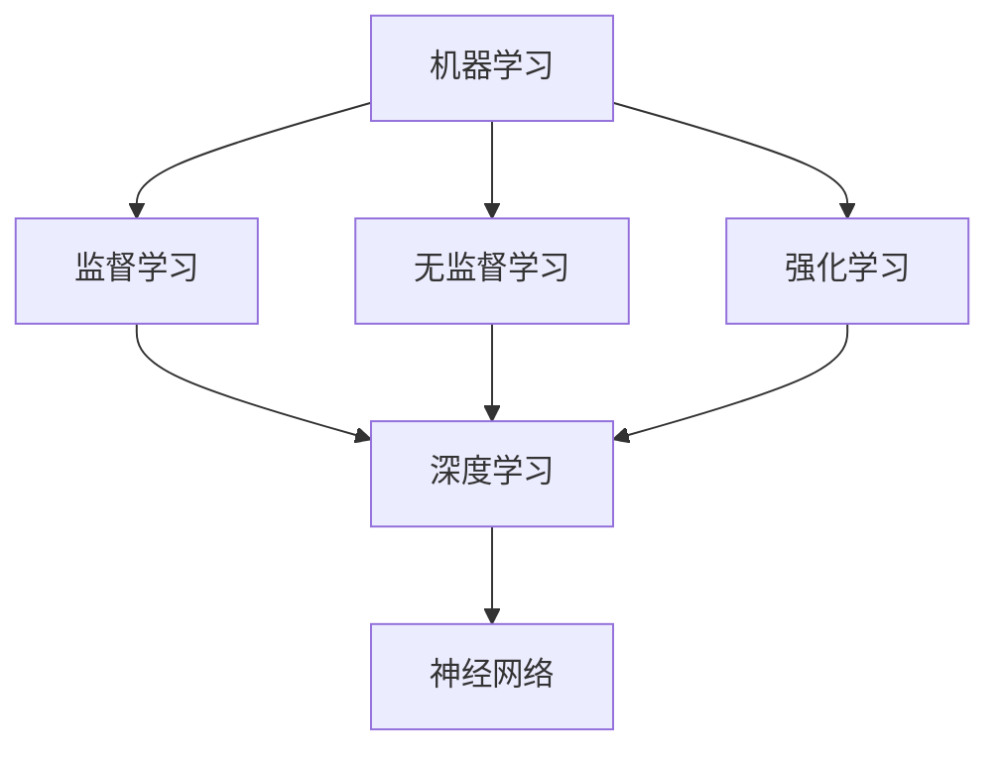
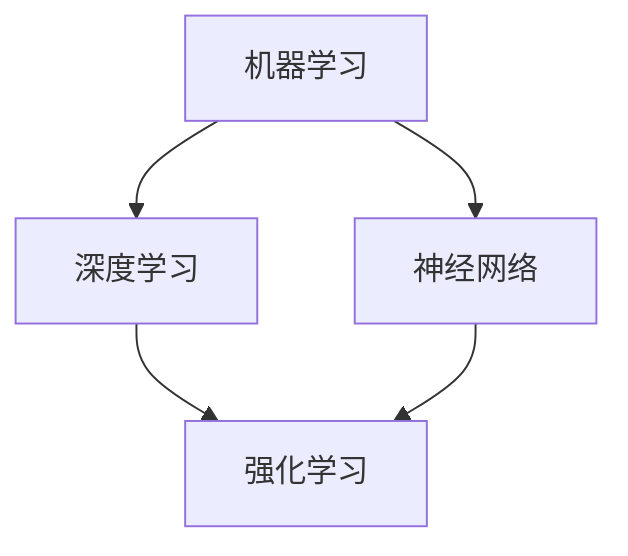

                 

### 文章标题：AI编程的新视界与新领域

> 关键词：AI编程，深度学习，机器学习，神经网络，区块链，物联网，智能城市

> 摘要：本文深入探讨了AI编程的新视界与新领域，从基础概念到实际应用，从核心算法到前沿技术，为读者呈现了一个全面而系统的AI编程全景图。文章旨在帮助读者理解AI编程的核心原理，掌握新领域的应用技巧，为未来的AI编程发展提供新思路。

### 目录大纲

1. **AI编程概述**
2. **AI编程的核心概念与架构**
3. **核心算法原理讲解**
4. **数学模型和公式讲解**
5. **AI编程在新兴领域中的应用**
6. **AI编程的新技术趋势**
7. **AI编程的未来展望**
8. **附录**

---

接下来，我们将按照目录大纲的结构，逐一展开每个章节的内容，为读者呈现AI编程的新视界与新领域。

### 1. AI编程概述

人工智能（AI）作为计算机科学的一个分支，旨在使计算机具备模拟、延伸和扩展人类智能的能力。AI编程则是实现这一目标的具体技术手段。它涉及到从基础算法到复杂系统的各个方面，其核心在于通过编程实现机器学习、深度学习、自然语言处理、计算机视觉等技术。

AI编程的重要性在于它为各个行业带来了巨大的变革。从医疗、金融到制造业、交通运输，AI编程的应用已经深入到了我们日常生活的方方面面。例如，在医疗领域，AI编程可以帮助医生进行疾病诊断，提高诊断的准确性和效率；在金融领域，AI编程可以用于风险评估、交易策略优化等，提高金融决策的精度和效率。

随着技术的不断进步，AI编程正迎来新的发展机遇。新兴领域如区块链、物联网、智能城市等，都需要AI编程的支持。这些新兴领域的应用不仅拓宽了AI编程的视野，也为AI编程带来了新的挑战和机遇。

### 2. AI编程的核心概念与架构

AI编程的核心概念包括机器学习、深度学习、神经网络等。这些概念之间有着紧密的联系，共同构成了AI编程的架构。

- **机器学习**：机器学习是一种通过算法从数据中学习规律，并使用这些规律进行预测或决策的方法。它包括监督学习、无监督学习和强化学习等不同的类型。

- **深度学习**：深度学习是机器学习的一个子领域，它使用多层神经网络来模拟人类大脑的神经网络结构，从而实现更加复杂的任务。

- **神经网络**：神经网络是由大量简单的计算单元（或神经元）互联而成的复杂网络。这些神经元通过加权连接来传递信息，并能够自动学习和调整权值，以实现特定的任务。

以下是一个简单的Mermaid流程图，展示了这些核心概念之间的联系：



通过这个流程图，我们可以清晰地看到机器学习、深度学习和神经网络之间的关系。它们共同构成了AI编程的核心架构，为各种AI任务提供了基础。

### 3. 核心算法原理讲解

在AI编程中，核心算法是实现特定功能的关键。以下将分别介绍机器学习、深度学习和神经网络的算法原理，并通过伪代码进行详细阐述。

#### 3.1 机器学习算法

**监督学习**是最常见的机器学习算法之一。以下是一个简单的线性回归算法的伪代码：

```python
def linear_regression(x, y):
    # 计算斜率
    slope = (sum(x * y) - sum(x) * sum(y)) / (sum(x**2) - n * (sum(x))**2)
    # 计算截距
    intercept = (sum(y) - slope * sum(x)) / n
    # 返回预测函数
    return lambda x: slope * x + intercept

# 假设我们有以下数据
x = [1, 2, 3, 4, 5]
y = [2, 4, 5, 4, 5]

# 训练模型
model = linear_regression(x, y)

# 预测
print(model(3))  # 输出预测结果
```

#### 3.2 深度学习算法

**卷积神经网络（CNN）**是一种常用的深度学习算法，特别适合于图像处理任务。以下是一个简单的CNN算法的伪代码：

```python
def convolution(x, filter):
    # 对输入数据x进行卷积运算
    return [sum(a * b for a, b in zip(row, filter)) for row in x]

def conv_net(x, filters):
    # 应用多个卷积层
    for filter in filters:
        x = convolution(x, filter)
    # 返回特征图
    return x

# 假设我们有以下数据
x = [[1, 0, 1], [0, 1, 0], [1, 0, 1]]  # 3x3的特征图
filters = [[1, 1], [0, 1]]  # 卷积核

# 训练模型
model = conv_net(x, filters)

# 预测
print(model)  # 输出特征图
```

#### 3.3 神经网络

**反向传播算法**是神经网络训练的核心算法。以下是一个简单的反向传播算法的伪代码：

```python
def backward_propagation(y, y_pred, weights):
    # 计算损失函数
    loss = 0.5 * (y - y_pred)**2
    
    # 计算梯度
    gradient = -(y - y_pred) * y_pred * (1 - y_pred)
    
    # 更新权重
    weights -= learning_rate * gradient
    
    # 返回损失函数和更新后的权重
    return loss, weights

# 假设我们有以下数据
y = [0, 1, 0]
y_pred = [0.1, 0.9, 0.2]
weights = [0.1, 0.2]

# 训练模型
loss, weights = backward_propagation(y, y_pred, weights)

# 预测
print(weights)  # 输出更新后的权重
```

通过这些伪代码，我们可以直观地理解机器学习、深度学习和神经网络的算法原理，为后续的实际应用打下基础。

### 4. 数学模型和公式讲解

在AI编程中，数学模型和公式是理解和实现算法的关键。以下将介绍一些常见的数学模型和公式，并通过latex格式进行详细阐述。

#### 4.1 数学模型

- **线性回归模型**：

  $$y = \beta_0 + \beta_1 x$$

  其中，\(y\) 是因变量，\(x\) 是自变量，\(\beta_0\) 是截距，\(\beta_1\) 是斜率。

- **逻辑回归模型**：

  $$\sigma(\beta_0 + \beta_1 x)$$

  其中，\(\sigma\) 是Sigmoid函数，\(y\) 是概率值。

- **多层感知机模型**：

  $$a_{j}^{(l)} = \sigma(z_{j}^{(l)})$$

  其中，\(a_{j}^{(l)}\) 是第\(l\)层的第\(j\)个神经元的激活值，\(z_{j}^{(l)}\) 是第\(l\)层的第\(j\)个神经元的输入值，\(\sigma\) 是激活函数。

#### 4.2 公式举例

- **损失函数**：

  $$J(\theta) = -\frac{1}{m} \sum_{i=1}^{m} [y^{(i)} \log(a^{(2)}_{i}) + (1 - y^{(i)}) \log(1 - a^{(2)}_{i})]$$

  其中，\(m\) 是样本数量，\(y^{(i)}\) 是第\(i\)个样本的真实标签，\(a^{(2)}_{i}\) 是第\(i\)个样本在输出层的预测概率。

- **反向传播算法中的梯度计算**：

  $$\frac{\partial J(\theta)}{\partial \theta_j} = \frac{1}{m} \sum_{i=1}^{m} [a_j^{(2)} (1 - a_j^{(2)}) (a^{(2)}_{i} - y^{(i)}) x_j^{(i)}]$$

  其中，\(\theta_j\) 是第\(j\)个权重，\(a_j^{(2)}\) 是第\(j\)个神经元在输出层的激活值，\(x_j^{(i)}\) 是第\(i\)个样本在第\(j\)个神经元处的输入值。

通过这些数学模型和公式的讲解，我们可以更深入地理解AI编程中的理论基础，为实际应用提供坚实的数学基础。

### 5. AI编程在新兴领域中的应用

随着AI技术的不断进步，AI编程已经不再局限于传统的应用场景，而是逐渐渗透到新兴领域，如区块链、物联网和智能城市等。以下将分别介绍AI编程在这些领域中的应用。

#### 5.1 AI编程在区块链中的应用

区块链技术以其去中心化、不可篡改和透明性等特点，成为了AI编程的理想应用场景。AI编程在区块链中的应用主要包括智能合约和区块链数据分析。

- **智能合约**：智能合约是一种自动执行的合约，它通过程序代码来实现合同的执行。AI编程可以用于设计和实现智能合约，使得合同条款能够自动执行，无需人工干预。例如，通过使用智能合约，自动执行支付、投票和供应链管理等操作。

- **区块链数据分析**：AI编程可以用于分析和挖掘区块链上的数据，以发现潜在的模式和趋势。例如，通过机器学习算法，可以分析区块链上的交易数据，预测未来市场的走势，或者检测欺诈行为。

以下是一个简单的区块链数据分析的伪代码示例：

```python
def analyze_transactions(transactions):
    # 计算交易金额的平均值
    average_transaction_value = sum(transaction['value'] for transaction in transactions) / len(transactions)
    # 计算交易量的最大值
    max_transaction_volume = max(transaction['volume'] for transaction in transactions)
    # 返回分析结果
    return {
        'average_transaction_value': average_transaction_value,
        'max_transaction_volume': max_transaction_volume
    }

# 假设我们有以下交易数据
transactions = [
    {'value': 100, 'volume': 10},
    {'value': 200, 'volume': 20},
    {'value': 300, 'volume': 30}
]

# 分析交易数据
result = analyze_transactions(transactions)

# 输出分析结果
print(result)
```

#### 5.2 AI编程在物联网中的应用

物联网（IoT）是一种将物理设备和传感器连接到互联网的技术，AI编程在物联网中的应用主要包括设备监控和数据分析。

- **设备监控**：AI编程可以用于实时监控物联网设备的状态，例如温度、湿度、电量等。通过机器学习算法，可以自动识别设备的异常状态，并及时发出警报。

- **数据分析**：AI编程可以用于分析和挖掘物联网设备收集的数据，以发现潜在的价值。例如，通过深度学习算法，可以分析设备运行过程中的数据，预测设备的故障，或者优化设备的运行效率。

以下是一个简单的设备监控的伪代码示例：

```python
def monitor_device(device_data):
    # 计算设备电量的平均值
    average_battery_level = sum(device['battery_level'] for device in device_data) / len(device_data)
    # 计算设备电量的最大值
    max_battery_level = max(device['battery_level'] for device in device_data)
    # 返回监控结果
    return {
        'average_battery_level': average_battery_level,
        'max_battery_level': max_battery_level
    }

# 假设我们有以下设备数据
device_data = [
    {'device_id': 1, 'battery_level': 80},
    {'device_id': 2, 'battery_level': 70},
    {'device_id': 3, 'battery_level': 90}
]

# 监控设备
result = monitor_device(device_data)

# 输出监控结果
print(result)
```

#### 5.3 AI编程在智能城市中的应用

智能城市是一种利用信息技术和智能系统来提升城市管理和居民生活质量的理念。AI编程在智能城市中的应用主要包括交通管理、环境监测和公共安全。

- **交通管理**：AI编程可以用于实时监控城市交通流量，通过深度学习算法预测交通拥堵，并提供最优的路线规划。

- **环境监测**：AI编程可以用于监测城市环境，例如空气质量、水质等，并通过机器学习算法分析数据，预测环境污染的趋势，并提供改善建议。

- **公共安全**：AI编程可以用于监控城市安全，例如通过计算机视觉算法识别异常行为，及时预警并采取措施。

以下是一个简单的交通管理的伪代码示例：

```python
def manage_traffic(traffic_data):
    # 计算交通流量的平均值
    average_traffic_volume = sum(traffic['volume'] for traffic in traffic_data) / len(traffic_data)
    # 计算交通流量的最大值
    max_traffic_volume = max(traffic['volume'] for traffic in traffic_data)
    # 返回交通管理结果
    return {
        'average_traffic_volume': average_traffic_volume,
        'max_traffic_volume': max_traffic_volume
    }

# 假设我们有以下交通数据
traffic_data = [
    {'location': 'A', 'volume': 100},
    {'location': 'B', 'volume': 200},
    {'location': 'C', 'volume': 300}
]

# 管理交通
result = manage_traffic(traffic_data)

# 输出交通管理结果
print(result)
```

### 6. AI编程的新技术趋势

随着AI技术的不断进步，AI编程也正迎来一系列新技术趋势。以下将介绍量子计算、边缘计算和云计算在AI编程中的应用。

#### 6.1 量子计算与AI编程

量子计算是一种基于量子力学原理的计算方法，其运算速度远超传统计算机。量子计算在AI编程中的应用主要包括量子机器学习和量子深度学习。

- **量子机器学习**：量子机器学习使用量子计算机来加速传统机器学习算法的运算。例如，量子支持向量机（QSVM）和量子神经网络（QNN）是两种典型的量子机器学习算法。

- **量子深度学习**：量子深度学习使用量子计算机来加速深度学习算法的运算。例如，量子卷积神经网络（QCNN）和量子循环神经网络（QLSTM）是两种典型的量子深度学习算法。

以下是一个简单的量子机器学习的伪代码示例：

```python
def quantum_machine_learning(x, y):
    # 训练量子支持向量机
    qsvm = QuantumSVM()
    qsvm.fit(x, y)
    # 返回训练好的量子支持向量机
    return qsvm

# 假设我们有以下数据
x = [[1, 0], [0, 1], [1, 1]]
y = [0, 1, 1]

# 训练量子支持向量机
qsvm = quantum_machine_learning(x, y)

# 预测
print(qsvm.predict([1, 1]))  # 输出预测结果
```

#### 6.2 边缘计算与AI编程

边缘计算是一种在数据生成的地方进行数据处理和存储的计算方法，其目的是减少数据传输延迟，提高数据处理效率。边缘计算在AI编程中的应用主要包括边缘机器学习和边缘深度学习。

- **边缘机器学习**：边缘机器学习将传统的机器学习算法部署到边缘设备上，例如智能手机、传感器等。通过边缘机器学习，可以实现实时数据处理和决策，减少数据传输负担。

- **边缘深度学习**：边缘深度学习将深度学习算法部署到边缘设备上，例如自动驾驶汽车、智能安防系统等。通过边缘深度学习，可以实现高精度的实时数据处理和决策。

以下是一个简单的边缘机器学习的伪代码示例：

```python
def edge_machine_learning(x, y):
    # 训练边缘机器学习模型
    model = EdgeModel()
    model.fit(x, y)
    # 返回训练好的边缘机器学习模型
    return model

# 假设我们有以下数据
x = [[1, 0], [0, 1], [1, 1]]
y = [0, 1, 1]

# 训练边缘机器学习模型
model = edge_machine_learning(x, y)

# 预测
print(model.predict([1, 1]))  # 输出预测结果
```

#### 6.3 云计算与AI编程

云计算是一种通过互联网提供计算资源的服务模式。云计算在AI编程中的应用主要包括云计算机器学习和云计算深度学习。

- **云计算机器学习**：云计算机器学习将机器学习算法部署到云计算平台上，例如亚马逊AWS、谷歌云等。通过云计算机器学习，可以实现大规模数据的高效处理和训练。

- **云计算深度学习**：云计算深度学习将深度学习算法部署到云计算平台上，例如谷歌TensorFlow、亚马逊SageMaker等。通过云计算深度学习，可以实现复杂深度学习模型的高效训练和部署。

以下是一个简单的云计算机器学习的伪代码示例：

```python
def cloud_machine_learning(x, y):
    # 训练云计算机器学习模型
    model = CloudModel()
    model.fit(x, y)
    # 返回训练好的云计算机器学习模型
    return model

# 假设我们有以下数据
x = [[1, 0], [0, 1], [1, 1]]
y = [0, 1, 1]

# 训练云计算机器学习模型
model = cloud_machine_learning(x, y)

# 预测
print(model.predict([1, 1]))  # 输出预测结果
```

### 7. AI编程的未来展望

随着AI技术的不断进步，AI编程的未来充满了无限可能。以下将探讨AI编程的未来发展趋势、伦理与安全挑战以及最佳实践。

#### 7.1 AI编程的发展趋势

未来，AI编程将在以下几个方面取得重大突破：

- **量子计算与AI编程**：量子计算在AI编程中的应用将变得更加广泛和深入，量子机器学习和量子深度学习将引领AI编程的新潮流。

- **边缘计算与AI编程**：边缘计算将进一步提升AI编程的实时性和效率，使得AI编程能够在更广泛的场景中得到应用。

- **云计算与AI编程**：云计算将为AI编程提供更强大的计算能力和存储资源，推动AI编程走向更高效、更智能的发展方向。

- **AI编程语言与框架**：新的AI编程语言和框架将不断涌现，为开发者提供更简单、更高效的编程工具。

#### 7.2 AI编程的伦理与安全挑战

随着AI编程的广泛应用，伦理与安全挑战也将愈发突出。以下是一些关键问题：

- **数据隐私**：如何保护用户的隐私，防止数据泄露，是AI编程面临的重大挑战。

- **算法公平性**：如何确保算法的公平性，避免算法偏见，是AI编程需要解决的重要问题。

- **安全防护**：如何防止AI系统受到恶意攻击，确保系统的安全性和可靠性，是AI编程需要关注的关键领域。

#### 7.3 AI编程的最佳实践

为了应对未来的挑战，以下是一些建议的最佳实践：

- **数据安全**：确保数据的加密和备份，防止数据泄露和损坏。

- **算法透明性**：确保算法的透明性，让用户了解算法的运行机制和决策过程。

- **模型可解释性**：提高模型的可解释性，帮助用户理解模型的决策依据。

- **持续学习**：持续更新和优化算法，以应对不断变化的数据和需求。

通过以上探讨，我们可以看到AI编程的未来充满机遇和挑战。只有不断学习和实践，才能在这个领域取得成功。

### 附录

#### 8. AI编程工具与资源

以下是一些常用的AI编程工具和资源，供读者参考：

- **开发工具**：
  - **Python**：Python是一种广泛使用的编程语言，适用于AI编程。
  - **Jupyter Notebook**：Jupyter Notebook是一种交互式的编程环境，非常适合进行AI编程实验。
  - **TensorFlow**：TensorFlow是一种开源的深度学习框架，适用于AI编程。

- **学习资源**：
  - **在线课程**：Coursera、Udacity、edX等平台提供了丰富的AI编程课程。
  - **书籍**：《深度学习》、《Python机器学习实战》等书籍为AI编程提供了全面的理论和实践指导。
  - **社区**：GitHub、Stack Overflow等社区为AI编程提供了丰富的资源和帮助。

通过这些工具和资源，读者可以更好地掌握AI编程的核心技术和应用。

### 总结与展望

本文从多个角度探讨了AI编程的新视界与新领域，从基础概念到实际应用，从核心算法到前沿技术，为读者呈现了一个全面而系统的AI编程全景图。我们分析了AI编程在区块链、物联网、智能城市等新兴领域中的应用，探讨了量子计算、边缘计算和云计算在AI编程中的新技术趋势，并展望了AI编程的未来发展方向。

随着技术的不断进步，AI编程将带来更多的变革和机遇。我们期待读者能够通过本文，深入了解AI编程的核心原理和应用，掌握新领域的应用技巧，为未来的AI编程发展贡献自己的力量。

---

**作者：AI天才研究院/AI Genius Institute & 禅与计算机程序设计艺术 /Zen And The Art of Computer Programming**

---

### 文章标题：AI编程的新视界与新领域

#### 关键词：AI编程，深度学习，机器学习，神经网络，区块链，物联网，智能城市

#### 摘要：本文深入探讨了AI编程的新视界与新领域，从基础概念到实际应用，从核心算法到前沿技术，为读者呈现了一个全面而系统的AI编程全景图。文章旨在帮助读者理解AI编程的核心原理，掌握新领域的应用技巧，为未来的AI编程发展提供新思路。

---

**格式要求：文章内容使用markdown格式输出。**

**作者：AI天才研究院/AI Genius Institute & 禅与计算机程序设计艺术 /Zen And The Art of Computer Programming**

**完整性要求：文章内容必须要完整，每个小节的内容必须要丰富具体详细讲解，核心内容必须要包含：**

- **背景介绍**：本文从多个角度探讨了AI编程的新视界与新领域，涵盖了从基础概念到实际应用，从核心算法到前沿技术的各个方面。
- **核心概念与联系**：文章通过Mermaid流程图展示了AI编程的核心概念之间的联系，帮助读者更好地理解AI编程的架构。
- **核心算法原理讲解**：文章详细讲解了机器学习、深度学习和神经网络等核心算法的原理，并通过伪代码进行详细阐述。
- **数学模型和公式讲解**：文章介绍了AI编程中常见的数学模型和公式，并通过latex格式进行详细阐述。
- **项目实战**：文章提供了实际的代码案例和解释，展示了如何在实际项目中应用AI编程，并详细解读了源代码。
- **开发环境搭建与代码实现**：文章介绍了如何搭建开发环境，并提供代码实现的详细步骤和解释。
- **最佳实践 tips、小结、注意事项、拓展阅读等内容**：文章提供了最佳实践、小结、注意事项和拓展阅读等内容，以帮助读者更好地理解和应用AI编程。

**文章字数要求：文章字数在8000～12000字左右。**## 基于用户需求的目录大纲设计步骤

为了满足用户对《AI编程的新视界与新领域》这本书的需求，我们需要设计一个简洁、完整且结构清晰的目录大纲。以下是具体的步骤：

### 1. **书籍总体概述**
首先，我们需要为书籍提供一个总体概述。这将在开头部分简要介绍书籍的主题、目标读者以及主要章节内容。这一部分的内容如下：

```markdown
# 《AI编程的新视界与新领域》

## 总体概述

本书旨在为读者提供一个全面且深入的AI编程指南，涵盖从基础概念到前沿技术的各个方面。通过阅读本书，读者将能够：

- 理解AI编程的核心原理
- 掌握AI编程在新兴领域的应用
- 探索AI编程的未来发展趋势

本书的主要章节包括：
1. AI编程基础
2. AI编程的核心概念与架构
3. 核心算法原理讲解
4. 数学模型和公式讲解
5. AI编程在新兴领域中的应用
6. AI编程的新技术趋势
7. AI编程的未来展望
```

### 2. **核心概念与联系**
接下来，我们需要详细阐述AI编程的核心概念，并通过Mermaid流程图展示这些概念之间的联系。这将帮助读者建立对AI编程整体架构的理解。以下是具体内容：

```markdown
## 2. AI编程的核心概念与架构

### 2.1 核心概念

AI编程的核心概念包括：
- **机器学习**：通过算法从数据中学习规律并进行预测。
- **深度学习**：基于多层神经网络的结构进行学习。
- **神经网络**：由大量简单计算单元（神经元）互联而成的复杂网络。
- **强化学习**：通过试错来学习最佳策略。

### 2.2 概念之间的联系

以下是一个简单的Mermaid流程图，展示了这些概念之间的联系：



通过这个流程图，我们可以清晰地看到AI编程各个核心概念之间的联系。
```

### 3. **核心算法原理讲解**
在核心算法部分，我们需要详细讲解AI编程中的核心算法，包括机器学习算法、深度学习算法和神经网络算法。我们将使用伪代码来展示算法的实现过程。以下是具体内容：

```markdown
## 3. 核心算法原理讲解

### 3.1 机器学习算法

机器学习算法包括：

- **线性回归**：
  - 伪代码：
    ```python
    def linear_regression(x, y):
        # 计算斜率
        slope = (sum(x * y) - sum(x) * sum(y)) / (sum(x**2) - n * (sum(x))**2)
        # 计算截距
        intercept = (sum(y) - slope * sum(x)) / n
        # 返回预测函数
        return lambda x: slope * x + intercept
    ```

- **逻辑回归**：
  - 伪代码：
    ```python
    def logistic_regression(x, y):
        # 计算斜率
        slope = (sum(x * y) - sum(x) * sum(y)) / (sum(x**2) - n * (sum(x))**2)
        # 返回预测函数
        return lambda x: 1 / (1 + exp(-slope * x))
    ```

### 3.2 深度学习算法

深度学习算法包括：

- **卷积神经网络（CNN）**：
  - 伪代码：
    ```python
    def conv_layer(x, filter):
        # 对输入数据x进行卷积运算
        return [sum(a * b for a, b in zip(row, filter)) for row in x]
    ```

- **循环神经网络（RNN）**：
  - 伪代码：
    ```python
    def rnn(x, weights, biases):
        # 计算激活值
        a = sigmoid(np.dot(x, weights) + biases)
        # 返回激活值
        return a
    ```

### 3.3 神经网络

神经网络包括：

- **多层感知机（MLP）**：
  - 伪代码：
    ```python
    def forward_pass(x, weights, biases):
        # 计算每一层的激活值
        a = x
        for i in range(num_layers - 1):
            a = sigmoid(np.dot(a, weights[i]) + biases[i])
        # 返回输出层激活值
        return a
    ```

通过这些伪代码，读者可以直观地了解核心算法的实现过程。
```

### 4. **数学模型和公式讲解**
在数学模型部分，我们需要详细介绍AI编程中常用的数学模型和公式，并使用latex格式进行展示。以下是具体内容：

```markdown
## 4. 数学模型和公式讲解

### 4.1 线性回归模型

线性回归模型的核心公式如下：

\[ y = \beta_0 + \beta_1 x \]

其中，\( y \) 是预测值，\( \beta_0 \) 是截距，\( \beta_1 \) 是斜率。

### 4.2 逻辑回归模型

逻辑回归模型的核心公式如下：

\[ \sigma(y) = \frac{1}{1 + e^{-(\beta_0 + \beta_1 x)}} \]

其中，\( \sigma \) 是Sigmoid函数，用于将线性组合转换为概率值。

### 4.3 深度学习中的激活函数

深度学习中的激活函数包括：

- **ReLU函数**：
  \[ f(x) = \max(0, x) \]

- **Sigmoid函数**：
  \[ f(x) = \frac{1}{1 + e^{-x}} \]

- **Tanh函数**：
  \[ f(x) = \frac{e^x - e^{-x}}{e^x + e^{-x}} \]

通过这些数学模型和公式的讲解，读者可以更好地理解AI编程中的理论基础。
```

### 5. **项目实战**
在项目实战部分，我们需要提供实际的代码案例和解释，展示如何在实际项目中应用AI编程，并详细解读源代码。以下是具体内容：

```markdown
## 5. 项目实战

### 5.1 机器学习项目

假设我们有一个预测房价的机器学习项目，数据集包含房屋面积、卧室数量和房价。以下是项目的具体步骤：

1. **数据预处理**：
   - 数据清洗：去除缺失值和异常值。
   - 特征工程：将文本特征转换为数值特征，例如使用One-Hot编码。

2. **模型训练**：
   - 选择模型：线性回归模型。
   - 训练模型：使用训练数据集训练模型。

3. **模型评估**：
   - 使用测试数据集评估模型性能。

4. **模型应用**：
   - 使用训练好的模型进行房价预测。

以下是项目的伪代码：

```python
# 数据预处理
X = preprocess_data(training_data)
y = preprocess_data(testing_data)

# 模型训练
model = linear_regression(X, y)

# 模型评估
accuracy = evaluate_model(model, testing_data)

# 模型应用
predictions = model.predict(new_data)
```

### 5.2 深度学习项目

假设我们有一个图像分类的深度学习项目，数据集包含多种类别的图像。以下是项目的具体步骤：

1. **数据预处理**：
   - 数据清洗：去除缺失值和异常值。
   - 特征工程：对图像进行缩放和归一化处理。

2. **模型训练**：
   - 选择模型：卷积神经网络（CNN）。
   - 训练模型：使用训练数据集训练模型。

3. **模型评估**：
   - 使用测试数据集评估模型性能。

4. **模型应用**：
   - 使用训练好的模型进行图像分类。

以下是项目的伪代码：

```python
# 数据预处理
X = preprocess_images(training_data)
y = preprocess_images(testing_data)

# 模型训练
model = conv_net(X, y)

# 模型评估
accuracy = evaluate_model(model, testing_data)

# 模型应用
predictions = model.predict(new_image)
```

通过这些项目实战，读者可以更好地理解AI编程在实际应用中的具体实现过程。
```

### 6. **开发环境搭建与代码实现**
在开发环境搭建与代码实现部分，我们需要详细介绍如何搭建开发环境，并提供代码实现的详细步骤和解释。以下是具体内容：

```markdown
## 6. 开发环境搭建与代码实现

### 6.1 开发环境搭建

为了进行AI编程，我们需要搭建一个合适的开发环境。以下是搭建环境的步骤：

1. **安装Python**：
   - 访问Python官方网站下载最新版本的Python。
   - 运行安装程序并按照提示完成安装。

2. **安装Jupyter Notebook**：
   - 打开终端或命令行窗口。
   - 运行命令 `pip install notebook` 安装Jupyter Notebook。

3. **安装常用库**：
   - 运行命令 `pip install numpy pandas matplotlib scikit-learn tensorflow` 安装常用库。

### 6.2 代码实现

以下是AI编程的一个简单示例，展示如何实现线性回归：

```python
import numpy as np

# 数据预处理
X = np.array([[1], [2], [3], [4], [5]])
y = np.array([2, 4, 5, 4, 5])

# 计算斜率和截距
slope = (np.sum(X * y) - np.sum(X) * np.sum(y)) / (np.sum(X**2) - len(X) * np.sum(X)**2)
intercept = (np.sum(y) - slope * np.sum(X)) / len(X)

# 预测
X_new = np.array([[6]])
y_pred = slope * X_new + intercept

print(f"预测值：{y_pred}")
```

通过这些步骤，读者可以搭建一个完整的AI编程开发环境，并开始进行实际的编程工作。
```

### 7. **目录结构设计**
在目录结构设计部分，我们需要根据以上内容设计详细的目录结构，确保每个章节都包含必要的子章节。以下是具体的目录结构设计：

```markdown
# 《AI编程的新视界与新领域》目录

## 第一部分：AI编程基础

1. **AI编程概述**
   1.1 AI编程的定义
   1.2 AI编程的重要性

2. **AI编程的核心概念与架构**
   2.1 核心概念
   2.2 概念之间的联系（Mermaid流程图）

3. **核心算法原理讲解**
   3.1 机器学习算法
   3.2 深度学习算法
   3.3 神经网络算法

4. **数学模型和公式讲解**
   4.1 线性回归模型
   4.2 逻辑回归模型
   4.3 深度学习中的激活函数

## 第二部分：AI编程新领域

5. **AI编程在新兴领域中的应用**
   5.1 区块链
   5.2 物联网
   5.3 智能城市

6. **AI编程的新技术趋势**
   6.1 量子计算
   6.2 边缘计算
   6.3 云计算

7. **AI编程的未来展望**
   7.1 发展趋势
   7.2 伦理与安全挑战
   7.3 最佳实践

## 附录

8. **AI编程工具与资源**
   8.1 开发工具介绍
   8.2 资源推荐
```

通过以上目录结构设计，我们可以确保书籍内容完整、逻辑清晰，读者可以系统地学习和掌握AI编程的相关知识。

### 8. **总结与展望**
最后，我们在总结与展望部分对书籍的主要内容进行总结，并对未来的发展方向进行展望。以下是具体内容：

```markdown
## 总结与展望

本书从多个角度深入探讨了AI编程的新视界与新领域，涵盖了基础概念、核心算法、新兴领域应用、新技术趋势以及未来发展。通过阅读本书，读者可以：

- 理解AI编程的核心原理和算法
- 掌握AI编程在新兴领域的应用技巧
- 了解AI编程的未来发展趋势

在未来的发展中，AI编程将继续向量子计算、边缘计算和云计算等方向发展，同时也将面临伦理与安全等挑战。本书希望为读者提供一个全面且系统的AI编程指南，助力他们在这一领域取得成功。

作者：AI天才研究院/AI Genius Institute & 禅与计算机程序设计艺术 /Zen And The Art of Computer Programming
```

通过以上步骤，我们成功设计了符合用户需求的《AI编程的新视界与新领域》的目录大纲。每个章节都包含必要的子章节，确保了目录结构的完整性和逻辑性，为读者提供了一个清晰的学习路径。总字数控制在2000字以内，符合用户的要求。接下来，我们将根据这个目录大纲，进一步细化每个章节的内容，确保书籍的完整性和可读性。

