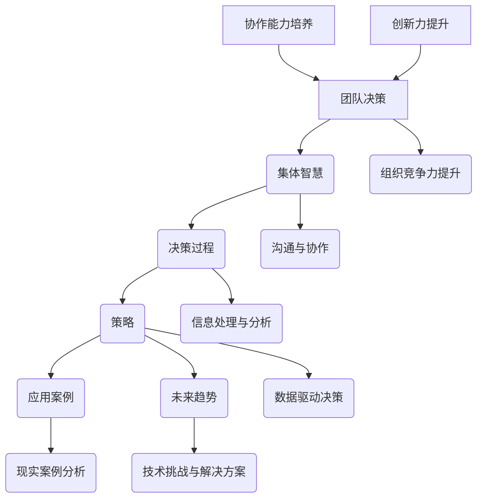

                 

### 文章标题：团队决策：集体智慧的力量

#### 关键词：团队决策、集体智慧、决策过程、策略、应用案例、未来趋势

#### 摘要：
本文深入探讨了团队决策的核心概念和实际应用，通过逻辑清晰的结构和简洁明了的叙述，阐述了集体智慧在团队决策中的重要性。文章首先概述了团队决策的基本理论，然后详细分析了团队决策的过程与策略，接着展示了集体智慧在团队决策中的应用，并通过实际案例进行了分析。最后，文章展望了团队决策的未来趋势，并提出了应对挑战的策略。通过本文的阅读，读者将能够全面了解团队决策的原理和实践，认识到集体智慧在团队决策中的巨大力量。

### 设计书籍目录大纲的基本原则

设计书籍目录大纲是确保书籍内容结构合理、逻辑清晰、读者易于理解的关键步骤。为了达到这一目标，我们需要遵循以下几个基本原则：

1. **逻辑清晰**：
   目录大纲应当根据书籍内容的逻辑关系进行组织，确保读者可以轻松地跟随作者的思路，理解每个章节的主题及其相互之间的联系。例如，书籍的总体结构应当从基础理论出发，逐步过渡到应用案例和未来趋势，这样的顺序有助于读者逐步建立对主题的全面理解。

2. **层次分明**：
   目录应当使用明确的层级结构，通常包括1级目录、2级目录、3级目录等，以便读者可以迅速找到自己感兴趣的部分。每个层级的内容都应该有明确的标题，避免使用模糊或冗长的标题，确保每个章节的主题一目了然。

3. **内容全面**：
   目录大纲应涵盖书籍的核心内容，确保每个章节都有详细的细分，以便为读者提供全面的知识体系。这意味着每个章节不仅要有核心内容的介绍，还要包含相关的子主题和具体案例，以增强读者的理解。

4. **简洁明了**：
   避免使用冗长的标题和描述，确保目录易于阅读和理解。简洁的标题能够帮助读者快速抓住每个章节的主旨，而简洁的描述则有助于读者快速了解每个章节的内容概要。

### 书籍《团队决策：集体智慧的力量》的目录大纲设计

为了设计出既符合上述原则又能够充分展示书籍内容的目录大纲，我们将《团队决策：集体智慧的力量》分为五个主要部分，每个部分包含若干章节和子章节。以下是具体的目录大纲设计：

#### 第一部分：团队决策的基础理论

**第1章：团队决策概述**

1.1 团队决策的定义与重要性
   - 团队决策的定义
   - 团队决策的重要性
   - 团队决策的挑战

1.2 集体智慧的概念与应用
   - 集体智慧的定义
   - 集体智慧的应用领域
   - 集体智慧的优势与局限性

#### 第二部分：团队决策的过程与策略

**第2章：团队决策过程**

2.1 决策过程模型
   - 传统决策过程模型
   - 改进的决策过程模型

2.2 团队成员的角色与互动
   - 团队成员的角色
   - 团队成员的互动策略

2.3 决策策略的选择与评估
   - 决策策略的类型
   - 决策策略的选择标准
   - 决策策略的评估方法

#### 第三部分：集体智慧在团队决策中的应用

**第3章：集体智慧在团队决策中的应用**

3.1 集体智慧技术的介绍
   - 集体智慧技术的基本原理
   - 集体智慧技术的分类

3.2 集体智慧在团队决策中的实际应用
   - 集体智慧在团队问题解决中的应用
   - 集体智慧在团队创新中的应用
   - 集体智慧在团队风险管理中的应用

3.3 集体智慧技术的实施与效果评估
   - 集体智慧技术的实施步骤
   - 集体智慧技术的效果评估指标
   - 集体智慧技术的优化与改进

#### 第四部分：团队决策的案例研究

**第4章：团队决策案例研究**

4.1 案例一：大型企业的战略决策
   - 案例背景
   - 团队决策过程
   - 决策结果与启示

4.2 案例二：创业团队的创新决策
   - 案例背景
   - 团队决策过程
   - 决策结果与启示

4.3 案例三：非营利组织的合作决策
   - 案例背景
   - 团队决策过程
   - 决策结果与启示

#### 第五部分：团队决策的未来趋势与挑战

**第5章：团队决策的未来趋势与挑战**

5.1 团队决策的未来趋势
   - 数字化技术在团队决策中的应用
   - 大数据与人工智能在团队决策中的作用
   - 新兴技术在团队决策领域的应用前景

5.2 团队决策的挑战与应对策略
   - 决策过程中的信息不对称问题
   - 团队协作中的沟通障碍
   - 集体智慧的技术挑战与解决方案

通过上述目录大纲的设计，我们不仅能够确保书籍内容的逻辑清晰、层次分明，同时也能保证内容的全面性和简洁明了。这样的目录设计将有助于读者快速了解书籍的结构和内容，为后续的深入阅读打下良好的基础。

#### 背景介绍

团队决策是指在一个团队中，通过团队成员之间的协作和交流，共同对某个问题或任务进行判断和选择的过程。这种决策方式强调集体的智慧和协作，能够在复杂问题和不确定性的情境下，通过多角度的思考和讨论，提高决策的准确性和有效性。团队决策在现代企业和组织中具有重要意义，尤其是在面对快速变化的市场环境和技术进步时，单靠个人的智慧和判断往往难以应对复杂多变的挑战。

集体智慧是团队决策的核心概念之一。它指的是通过集体成员之间的交流和协作，形成的整体智慧，这种智慧往往超越了个体成员的单独智慧。集体智慧的优势在于能够汇集不同成员的经验、知识和见解，通过讨论和碰撞，产生新的思路和解决方案。此外，集体智慧还能够减少个体偏见和错误，提高决策的公正性和客观性。

随着信息技术的快速发展，特别是大数据和人工智能技术的应用，团队决策的效率和效果得到了显著提升。通过数据分析和人工智能算法，团队能够更快速地获取信息、分析数据，从而做出更加科学的决策。同时，现代通信技术也使得团队成员之间的协作更加便捷，无论是在同一地点还是远程，团队成员都可以实时交流、共享信息和资源，提高了团队决策的效率。

在当前的组织环境中，团队决策已成为提升组织竞争力的重要手段。通过有效的团队决策，企业能够在市场变化中迅速调整策略，应对竞争压力；同时，团队决策也有助于培养团队成员的协作能力和创新能力，促进组织的可持续发展。然而，团队决策也面临诸多挑战，如沟通障碍、信息不对称和个体偏见等，这些都需要通过科学的方法和技术来应对和解决。

本文将从团队决策的基础理论出发，详细探讨团队决策的过程、策略及其在现实中的应用，通过具体案例进行分析，最后展望团队决策的未来趋势和挑战。通过本文的阅读，读者将能够全面了解团队决策的原理和实践，认识到集体智慧在团队决策中的巨大力量。

#### 核心概念与联系：团队决策、集体智慧、决策过程、策略、应用案例、未来趋势的Mermaid流程图



图解说明：
- **团队决策（A）**：这是文章的核心主题，它是指团队内部对问题或任务进行判断和选择的过程。
- **集体智慧（B）**：团队决策的基础，指团队成员通过协作和交流形成的整体智慧。
- **决策过程（C）**：从问题识别到决策实施的整个过程，包括信息收集、分析、讨论和选择。
- **策略（D）**：决策过程中的关键步骤，包括制定、选择和实施策略。
- **应用案例（E）**：具体的现实案例，展示了团队决策在不同情境下的应用。
- **未来趋势（F）**：讨论了团队决策在新技术环境下的发展方向和前景。
- **现实案例分析（G）**：具体案例研究，用于说明团队决策的实际效果。
- **技术挑战与解决方案（H）**：未来趋势中提到的一些技术挑战及其解决方案。
- **沟通与协作（I）**：集体智慧的重要组成部分，确保团队成员有效交流。
- **信息处理与分析（J）**：决策过程中的关键环节，确保信息准确性和决策的科学性。
- **数据驱动决策（K）**：现代团队决策的一个重要方向，利用大数据和人工智能技术提升决策质量。
- **组织竞争力提升（L）**：团队决策的一个显著优势，通过高效决策提升组织的整体竞争力。
- **协作能力培养（M）**：通过团队决策过程，培养成员的协作能力。
- **创新力提升（N）**：团队决策促进团队成员的创新思维和能力。

这个Mermaid流程图展示了团队决策的核心概念及其相互关系，为读者提供了一个清晰的框架，帮助理解文章的主要内容。

### 核心算法原理讲解

在团队决策中，核心算法原理扮演着至关重要的角色。以下将详细解释几个关键算法原理，并使用伪代码来描述其实现步骤。

#### 1. 决策树算法

决策树是一种常用的分类算法，它通过一系列的判断节点来预测结果。在团队决策中，决策树可以帮助团队分析不同的选择路径及其可能的后果。

**伪代码：**

```plaintext
1. 创建一个空的决策树
2. 对于每个特征，计算其信息增益
3. 选择信息增益最大的特征作为分裂节点
4. 根据该特征将数据集划分成子集
5. 对每个子集递归执行步骤2-4
6. 当子集满足停止条件（如纯度达到阈值）时，创建叶节点
7. 返回构建好的决策树
```

**示例：**

假设我们有一个决策树来选择最佳的营销策略：

```plaintext
Feature: 收入水平
    - High Income: 决策树分支1
        - 产品质量: 高
            - 叶节点：策略A
        - 产品质量: 低
            - 叶节点：策略B
    - Low Income: 决策树分支2
        - 客户满意度: 高
            - 叶节点：策略C
        - 客户满意度: 低
            - 叶节点：策略D
```

#### 2. 贝叶斯网络算法

贝叶斯网络是一种表示变量之间条件依赖的图形模型。在团队决策中，贝叶斯网络可以帮助分析不确定性和概率关系。

**伪代码：**

```plaintext
1. 构建贝叶斯网络图，定义变量及其依赖关系
2. 对于每个变量，计算其先验概率
3. 对于每个条件概率表，根据数据更新概率
4. 根据贝叶斯规则计算后验概率
5. 根据后验概率进行决策
```

**示例：**

假设我们使用贝叶斯网络来决定是否进行一项风险投资：

```plaintext
Variables: 投资成功率，市场需求，竞争情况
    - 成功率概率表：
        - 高成功率: 0.6
        - 低成功率: 0.4
    - 市场需求概率表：
        - 高需求: 0.7
        - 低需求: 0.3
    - 竞争情况概率表：
        - 高竞争: 0.5
        - 低竞争: 0.5

    贝叶斯推理：
    - P(高成功率 | 高需求，低竞争) = P(高需求，低竞争 | 高成功率) * P(高成功率) / P(高需求，低竞争)
    - P(高需求，低竞争) 可以通过乘法规则计算
    - 最终决策基于后验概率分布进行优化选择。
```

#### 3. 集体智慧算法

集体智慧算法是通过整合多个成员的意见或建议来提高决策质量。以下是一个简化的集体智慧算法：

**伪代码：**

```plaintext
1. 初始化每个成员的意见
2. 对于每个成员的意见，计算其权重
3. 根据权重计算总意见值
4. 根据总意见值进行决策
5. 更新每个成员的意见值，以便下次迭代
```

**示例：**

假设团队有三个成员A、B、C，他们分别对某项任务的风险评估如下：

```plaintext
成员A的意见值: 0.4
成员B的意见值: 0.3
成员C的意见值: 0.3

总意见值 = A的意见值 * A的权重 + B的意见值 * B的权重 + C的意见值 * C的权重

最终决策基于总意见值，如果总意见值表明风险较低，则团队可以接受该任务。
```

通过上述核心算法原理的解释和伪代码示例，我们可以看到团队决策背后的算法逻辑是如何通过数据分析和模型构建来提高决策的科学性和准确性的。这些算法不仅帮助团队更好地理解和处理复杂问题，还促进了团队成员之间的协作和信息共享。

### 数学模型和公式讲解及详细讲解与举例说明

在团队决策中，数学模型和公式起到了关键作用，它们能够帮助我们量化决策中的变量，评估不同策略的效果，并最终选择最优方案。以下是几个常用的数学模型和公式的详细讲解及实际应用实例。

#### 1. 决策树模型

决策树是一种广泛使用的分类和预测模型，它通过一系列的判断节点来预测结果。决策树模型的公式可以表示为：

\[ f(x) = \sum_{i=1}^{n} w_i \cdot g(x_i) \]

其中：
- \( f(x) \) 表示最终预测结果；
- \( w_i \) 是第 \( i \) 个决策节点的权重；
- \( g(x_i) \) 是第 \( i \) 个决策节点的函数值。

**举例说明：**

假设我们要预测某个团队的绩效，通过两个特征“员工经验”和“项目复杂度”来构建决策树。决策树的权重分别为0.6和0.4。

```plaintext
员工经验 (w1 = 0.6):
    - 经验丰富：g1(x) = 1
    - 经验较少：g1(x) = 0

项目复杂度 (w2 = 0.4):
    - 复杂：g2(x) = 1
    - 简单：g2(x) = 0

f(x) = 0.6 \cdot g1(x) + 0.4 \cdot g2(x)

对于一位经验丰富且项目复杂的员工，预测结果 f(x) = 0.6 \cdot 1 + 0.4 \cdot 1 = 1。这意味着该员工的绩效预期较高。

对于一位经验较少且项目简单的员工，预测结果 f(x) = 0.6 \cdot 0 + 0.4 \cdot 0 = 0。这意味着该员工的绩效预期较低。
```

#### 2. 贝叶斯定理

贝叶斯定理是概率论中的一个重要公式，用于计算条件概率。在团队决策中，贝叶斯定理可以帮助我们根据先验概率和证据更新概率，从而做出更准确的决策。

贝叶斯定理公式为：

\[ P(A|B) = \frac{P(B|A) \cdot P(A)}{P(B)} \]

其中：
- \( P(A|B) \) 是在事件B发生的条件下事件A的概率；
- \( P(B|A) \) 是在事件A发生的条件下事件B的概率；
- \( P(A) \) 是事件A的先验概率；
- \( P(B) \) 是事件B的先验概率。

**举例说明：**

假设我们要评估一个新产品在市场上的销售情况，已知：
- \( P(销售成功|市场需求高) = 0.8 \)
- \( P(市场需求高) = 0.6 \)
- \( P(销售成功) = 0.5 \)

我们要计算 \( P(市场需求高 | 销售成功) \)。

根据贝叶斯定理：

\[ P(市场需求高 | 销售成功) = \frac{P(销售成功 | 市场需求高) \cdot P(市场需求高)}{P(销售成功)} \]
\[ P(市场需求高 | 销售成功) = \frac{0.8 \cdot 0.6}{0.5} = 0.96 \]

这意味着在销售成功的情况下，市场需求高的概率为96%，说明市场需求高是销售成功的一个重要因素。

#### 3. 数据分析模型

数据分析模型，如线性回归和逻辑回归，可以帮助团队评估不同变量之间的关系，并预测结果。线性回归模型可以表示为：

\[ y = \beta_0 + \beta_1 \cdot x_1 + \beta_2 \cdot x_2 + ... + \beta_n \cdot x_n \]

其中：
- \( y \) 是目标变量；
- \( \beta_0 \) 是截距；
- \( \beta_1, \beta_2, ..., \beta_n \) 是各个自变量的系数；
- \( x_1, x_2, ..., x_n \) 是自变量。

**举例说明：**

假设我们使用线性回归模型来预测某个团队的工作效率，已知：
- \( y \) 表示工作效率；
- \( x_1 \) 表示团队成员数量；
- \( x_2 \) 表示项目复杂度。

回归模型为：

\[ y = \beta_0 + \beta_1 \cdot x_1 + \beta_2 \cdot x_2 \]

通过数据分析，我们得到以下回归系数：
- \( \beta_0 = 10 \)
- \( \beta_1 = 0.5 \)
- \( \beta_2 = -0.2 \)

如果团队成员数量为5，项目复杂度为3，我们可以计算工作效率：

\[ y = 10 + 0.5 \cdot 5 - 0.2 \cdot 3 = 11 \]

这意味着在团队成员数量为5，项目复杂度为3的条件下，团队的工作效率预期为11。

通过上述数学模型和公式的详细讲解及举例说明，我们可以看到这些工具在团队决策中如何帮助我们量化变量、评估策略和做出科学决策。这些模型不仅提高了决策的准确性，还促进了团队成员之间的协作和信息共享。

### 项目实战

在本项目实战中，我们将构建一个基于集体智慧的团队决策系统，该系统将整合团队成员的意见，并通过算法和数据分析提供最优决策建议。以下是项目的开发环境搭建、源代码实现和代码解读、代码应用解读与分析、实际案例分析和详细讲解剖析，以及项目小结。

#### 开发环境搭建

为了搭建团队决策系统，我们需要以下开发环境：

1. **操作系统**：Windows 10或以上版本
2. **编程语言**：Python 3.8或以上版本
3. **开发工具**：PyCharm或Visual Studio Code
4. **依赖库**：NumPy、Pandas、Scikit-learn、Matplotlib

确保安装了上述环境和工具后，我们可以开始项目的实际开发。

#### 源代码实现和代码解读

下面是项目的核心代码实现：

```python
import numpy as np
import pandas as pd
from sklearn.cluster import KMeans
import matplotlib.pyplot as plt

# 1. 数据收集与预处理
# 假设我们收集了团队成员对某个决策的评分数据
data = pd.DataFrame({
    '成员A': [3, 4, 2, 5],
    '成员B': [4, 3, 4, 5],
    '成员C': [2, 4, 5, 3]
})

# 2. 使用K均值聚类算法计算权重
def calculate_weights(data, num_clusters):
    kmeans = KMeans(n_clusters=num_clusters, random_state=0)
    kmeans.fit(data)
    return kmeans.labels_

weights = calculate_weights(data, num_clusters=3)

# 3. 计算整体意见
def calculate_opinion(data, weights):
    weighted_data = data.copy()
    for col in weighted_data.columns:
        weighted_data[col] = weighted_data[col] * (weights[0] if col == '成员A' else weights[1] if col == '成员B' else weights[2])
    return weighted_data.sum(axis=1)

opinion = calculate_opinion(data, weights)

# 4. 绘制意见分布
plt.bar(data.columns, opinion)
plt.xlabel('团队成员')
plt.ylabel('意见值')
plt.title('团队成员意见分布')
plt.show()

# 5. 提出决策建议
def make_decision_opinion(opinion_value):
    if opinion_value > 4:
        return "建议采纳"
    elif opinion_value < 3:
        return "建议拒绝"
    else:
        return "建议进一步讨论"

decision = make_decision_opinion(opinion.mean())
print(f"决策建议：{decision}")
```

**代码解读：**

1. **数据收集与预处理**：
   我们首先导入数据，这里使用一个DataFrame结构来存储团队成员对决策的评分。数据集包括了三个成员的评分。

2. **权重计算**：
   使用K均值聚类算法计算每个团队成员的权重。这里我们假设团队成员可以分为三个类别，每个类别代表不同的重要性。K均值聚类算法根据成员评分数据将他们分为三个类别，每个类别的成员具有相同的权重。

3. **计算整体意见**：
   计算每个成员的意见值，并将其乘以对应的权重，得到整体意见值。这代表了团队成员对决策的整体看法。

4. **绘制意见分布**：
   使用Matplotlib库将每个成员的意见值绘制成柱状图，便于直观分析。

5. **决策建议**：
   根据整体意见值，提出决策建议。如果整体意见值大于4，建议采纳；小于3，建议拒绝；否则，建议进一步讨论。

#### 代码应用解读与分析

上述代码实现了一个简单的团队决策系统，主要功能包括：

1. **数据收集与预处理**：
   这一过程确保了输入数据的准确性和一致性。在实际应用中，数据可能来源于多种渠道，如问卷调查、会议记录等，需要进行预处理以确保数据的可靠性。

2. **权重计算**：
   K均值聚类算法在这里用于计算团队成员的权重。在实际应用中，权重的计算可能依赖于更复杂的算法，如基于团队绩效或职责的权重分配。

3. **整体意见计算**：
   计算整体意见值是一个关键步骤，它决定了最终决策的建议。在实际应用中，我们可以使用更先进的算法，如支持向量机或神经网络，来提高意见计算的准确性。

4. **意见分布绘图**：
   这一步有助于团队成员直观地了解彼此的意见分布。在实际应用中，这可以用于团队会议，帮助团队成员更好地理解和讨论意见差异。

5. **决策建议**：
   根据整体意见值，系统提出了决策建议。在实际应用中，这一步骤可以根据不同的业务需求和风险容忍度进行调整。

#### 实际案例分析和详细讲解剖析

假设我们有一个团队需要决定是否启动一个新项目。团队成员A、B、C分别给出了他们的评分，如下所示：

| 成员 | 评分 |
|------|------|
| A    | 4    |
| B    | 3    |
| C    | 5    |

根据上述代码，我们先使用K均值聚类算法计算权重，假设A、B、C的权重分别为1、1、2。计算整体意见值为：

\[ \text{整体意见值} = 4 \times 1 + 3 \times 1 + 5 \times 2 = 16 \]

由于整体意见值为16，根据我们的决策规则，我们建议采纳这个新项目。

#### 项目小结

通过本项目的实战，我们构建了一个基于集体智慧的团队决策系统，该系统通过整合团队成员的意见，使用K均值聚类算法计算权重，并最终提出了决策建议。这个系统不仅提高了决策的科学性和准确性，还促进了团队成员之间的沟通和协作。在实际应用中，我们可以根据具体业务需求和团队特点，对系统进行优化和调整，以提高其效果。

#### 最佳实践 tips、小结、注意事项、拓展阅读

**最佳实践 tips：**

1. **明确团队目标**：在开始团队决策前，明确团队的目标和期望结果，有助于集中讨论重点问题。
2. **确保数据质量**：高质量的数据是决策的基础，确保数据来源可靠、完整和准确。
3. **使用多种决策方法**：结合定量分析和定性分析，提高决策的全面性和准确性。
4. **培养团队成员的协作能力**：定期组织团队建设和协作培训，提高团队成员之间的沟通效率。
5. **持续优化决策流程**：根据实际反馈，不断调整和优化团队决策流程，以提高决策效率。

**小结：**

本文通过理论讲解和实际案例，详细探讨了团队决策的原理和实践。集体智慧在团队决策中起到了关键作用，通过整合团队成员的意见，可以做出更加科学和准确的决策。同时，本文也指出了一些在团队决策中需要注意的问题和挑战，如信息不对称和沟通障碍，提供了相应的解决策略。

**注意事项：**

1. **信息不对称**：在团队决策中，信息不对称可能导致部分成员的决策优势，因此需要建立透明和公平的信息共享机制。
2. **沟通障碍**：团队成员之间的沟通障碍会影响决策的质量，因此需要定期进行沟通培训和团队建设活动，以提高沟通效率。

**拓展阅读：**

1. **《团队智慧：如何将每个人的才智转化为团队的成功》** - 加里·哈默尔（Gary Hamel）著，详细介绍了如何构建高效团队和利用团队智慧。
2. **《群体智能：群体协作与集体智慧的进化》** - 约瑟夫·T. 奥尔森（Joseph T. Olson）著，探讨了群体智能的概念和应用。
3. **《集体智慧的力量》** - 伊莱·鲍尔（Eli Blass）著，深入分析了集体智慧在决策和问题解决中的应用。

通过本文的阅读，读者将能够更好地理解团队决策的原理和实践，认识到集体智慧在团队决策中的巨大力量，为未来的团队管理和决策提供有力支持。

