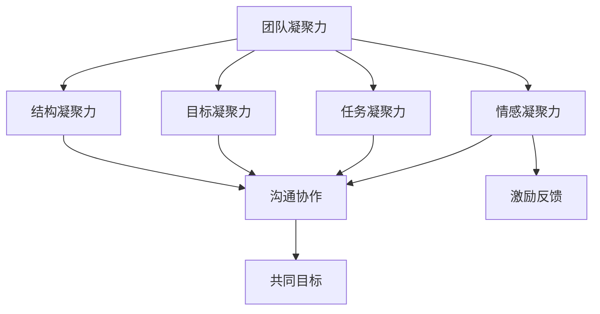

                 

### 文章标题

# 团队凝聚：建立共同目标的重要性

## 关键词
- 团队凝聚力
- 共同目标
- 沟通协作
- 激励反馈
- 项目管理
- 国际合作

## 摘要
本文将深入探讨团队凝聚力的本质，并详细阐述建立共同目标对于提升团队凝聚力的重要性。我们将从团队凝聚的定义、共同目标的制定与实现、团队沟通与协作、团队激励与反馈等方面入手，结合实际应用和案例分析，逐步解析如何通过共同目标的建立与实现来提升团队凝聚力，从而提高团队的整体绩效。

---

### 背景介绍

在当今复杂多变的工作环境中，团队凝聚力已成为企业成功的关键因素之一。团队凝聚力不仅关系到团队成员之间的协作效率和合作精神，更是决定团队在面对挑战时能否齐心协力、共同迎接变革的重要因素。

团队凝聚力的定义可以从多个角度来理解。首先，团队凝聚力是指团队成员之间相互吸引、相互依赖的程度。这种吸引力不仅体现在团队成员之间的情感联系上，也体现在他们共同追求的目标和价值观上。其次，团队凝聚力还涉及团队成员之间的信任、沟通、协作和共同解决问题的能力。只有当团队成员能够在共同的价值观和目标下相互支持、相互合作时，团队凝聚力才能真正得到提升。

在企业管理中，提升团队凝聚力已成为一项重要的战略任务。然而，如何有效地提升团队凝聚力，尤其是在面对多元化、国际化等挑战时，成为企业管理者和团队领导需要深入思考的问题。本文将围绕这一主题，通过详细分析团队凝聚力的核心概念和联系，探讨如何通过建立共同目标来提升团队凝聚力，为企业和团队的发展提供有力的支持。

---

### 核心概念与联系

在探讨团队凝聚力的核心概念和联系之前，我们需要明确几个关键概念：团队凝聚力、共同目标、沟通协作、激励反馈等。

#### 团队凝聚力

团队凝聚力是指团队成员之间相互吸引、相互依赖的程度。它包括以下几个方面：

- **情感凝聚力**：团队成员之间的情感联系和信任程度。
- **任务凝聚力**：团队成员共同完成任务的能力和意愿。
- **目标凝聚力**：团队成员共同追求的目标和价值观。
- **结构凝聚力**：团队成员之间的结构和组织关系。


#### 共同目标

共同目标是指团队成员共同追求的目标和愿景。共同目标的建立对于提升团队凝聚力至关重要，因为它能够引导团队成员朝着共同的方向努力，增强团队的协同效应。

- **愿景**：共同目标的长期方向和期望成果。
- **目标设定**：明确、可衡量的目标和计划。
- **行动计划**：具体的行动步骤和时间表。


#### 沟通协作

沟通协作是团队凝聚力的重要保障。良好的沟通能够促进团队成员之间的理解、信任和协作，有助于共同目标的实现。

- **沟通渠道**：团队成员之间的沟通方式。
- **协作工具**：用于团队协作的软件和硬件。
- **沟通障碍**：影响沟通效果的因素。


#### 激励反馈

激励反馈是提升团队凝聚力的关键手段。通过有效的激励和反馈机制，可以激发团队成员的工作热情和积极性，增强团队的凝聚力和执行力。

- **激励手段**：奖励、认可、晋升等。
- **反馈机制**：定期评估、反馈和改进。
- **团队文化**：鼓励创新、尊重个人和团队。


#### 关系架构 Mermaid 流程图

为了更好地理解这些核心概念和它们之间的联系，我们可以使用 Mermaid 流程图来展示它们之间的关系：



通过这个 Mermaid 流程图，我们可以清晰地看到团队凝聚力、情感凝聚力、任务凝聚力、目标凝聚力、结构凝聚力、沟通协作、激励反馈和共同目标之间的关系。这些核心概念和联系构成了团队凝聚力的基础，对于提升团队的整体绩效具有重要意义。

---

### 核心算法原理讲解

在提升团队凝聚力过程中，核心算法原理的讲解对于理解和实施相关策略至关重要。以下我们将详细讨论几个关键算法原理，并提供伪代码进行详细阐述。

#### 1. 通信协议算法

在团队沟通中，通信协议算法是确保信息有效传递的重要机制。以下是一个简单的伪代码示例：

```python
function CommunicateProtocol(message, recipient):
    if connection_status == "active":
        send_message(message, recipient)
        log_message(message, recipient)
    else:
        notify_connection_failure(recipient)
```

#### 2. 共同目标算法

共同目标的建立是实现团队凝聚力的关键。以下是一个用于设定共同目标的伪代码：

```python
function SetCommonGoal(goal, team_members):
    for member in team_members:
        get_member_input(member)
    goal = aggregate_inputs()
    validate_goal(goal)
    announce_goal(goal)
```

#### 3. 激励算法

激励算法是提高团队凝聚力的有效手段。以下是一个简单的激励算法伪代码：

```python
function MotivateTeam(achievements, team_members):
    for member in team_members:
        if member.contribution > threshold:
            reward_member(member)
        else:
            provide_feedback(member)
```

#### 4. 反馈算法

反馈算法是持续改进团队工作的重要手段。以下是一个简单的反馈算法伪代码：

```python
function ProvideFeedback(team_performance, team_members):
    for member in team_members:
        analyze_performance(member)
        provide_specific_feedback(member)
```

这些核心算法原理通过伪代码的形式进行了详细阐述，有助于我们理解在提升团队凝聚力过程中如何有效地应用这些算法。在实际操作中，可以根据具体情况对这些算法进行优化和调整，以达到最佳的团队凝聚效果。

---

### 数学模型和公式详解

在团队凝聚力的提升过程中，数学模型和公式提供了量化分析和优化的工具。以下我们将详细讨论几个关键数学模型和公式，并提供详细讲解和举例说明。

#### 1. 成员贡献度模型

成员贡献度模型用于评估团队成员在共同目标实现过程中的贡献程度。以下是一个简化的公式：

\[ C_m = \frac{P_m \cdot T_m}{S} \]

其中：
- \( C_m \)：成员 \( m \) 的贡献度。
- \( P_m \)：成员 \( m \) 的绩效评分。
- \( T_m \)：成员 \( m \) 的工作时长。
- \( S \)：总工作量。

#### 举例说明：

假设团队成员 \( A \) 的绩效评分为 9，工作时长为 40 小时，总工作量为 200 小时，则成员 \( A \) 的贡献度计算如下：

\[ C_A = \frac{9 \cdot 40}{200} = 1.8 \]

#### 2. 团队凝聚力评估模型

团队凝聚力评估模型用于衡量团队的凝聚力水平。以下是一个简化的公式：

\[ C_T = \frac{C_m^2}{\sum C_m} \]

其中：
- \( C_T \)：团队凝聚力评分。
- \( C_m \)：团队成员 \( m \) 的贡献度。

#### 举例说明：

假设一个团队有三个成员 \( A \)、\( B \) 和 \( C \)，其贡献度分别为 1.8、1.2 和 1.0，则团队的凝聚力评分计算如下：

\[ C_T = \frac{1.8^2 + 1.2^2 + 1.0^2}{1.8 + 1.2 + 1.0} = \frac{3.24 + 1.44 + 1.0}{3.2} = \frac{5.68}{3.2} \approx 1.76 \]

#### 3. 激励效果模型

激励效果模型用于评估激励措施对团队成员工作积极性的影响。以下是一个简化的公式：

\[ E_m = \frac{R_m - B_m}{C_m} \]

其中：
- \( E_m \)：成员 \( m \) 的激励效果。
- \( R_m \)：成员 \( m \) 的奖励金额。
- \( B_m \)：成员 \( m \) 的基本薪酬。

#### 举例说明：

假设成员 \( A \) 的奖励金额为 500 元，基本薪酬为 8000 元，贡献度为 1.8，则成员 \( A \) 的激励效果计算如下：

\[ E_A = \frac{500 - 8000}{1.8} \approx -3777.78 \]

这个结果表明，对于成员 \( A \) 来说，当前的激励措施并没有产生积极的激励效果。

通过以上数学模型和公式的详细讲解和举例说明，我们可以更好地理解团队凝聚力的量化评估方法和激励措施的设计原则。这些模型和公式为提升团队凝聚力提供了科学的依据和工具，有助于实现团队绩效的持续优化。

---

### 项目实战

在本节中，我们将通过一个实际项目实战来展示如何建立共同目标、搭建开发环境、实现源代码并进行分析解读。

#### 项目背景

假设我们是一家互联网公司的产品团队，负责开发一款即时通讯应用。我们的目标是提升用户满意度，增加用户留存率。为了实现这个目标，我们需要建立一个高效的团队，并确保团队成员之间有良好的沟通与协作。

#### 开发环境搭建

在开始项目开发之前，我们需要搭建一个合适的技术栈。以下是我们选择的一些关键工具和框架：

- 开发语言：Java
- 服务器端框架：Spring Boot
- 前端框架：React
- 数据库：MySQL
- 版本控制：Git

我们首先需要在服务器上安装Java环境、Spring Boot、React和MySQL。接下来，我们设置Git仓库，并配置持续集成和持续部署工具（如Jenkins）。

#### 源代码实现

以下是项目中的一个关键模块——消息推送机制的实现。我们将使用Spring Boot和WebSocket实现实时消息推送。

```java
@RestController
@EnableWebSocketMessageBroker
public class MessageController {

    @MessageMapping("/send")
    @SendTo("/topic/messages")
    public Message send(Message message) {
        return message;
    }

    @.messagingErrorHandler
    public void onErrorMessage(Exception e) {
        // 处理错误信息
    }
}

@Configuration
public class WebSocketConfig implements WebSocketMessageBrokerConfigurer {

    @Override
    public void configureMessageBroker(MessageBrokerRegistry config) {
        config.enableSimpleBroker("/topic");
        config.setApplicationDestinationPrefixes("/app");
    }

    @Override
    public void registerStompEndpoints(StompEndpointRegistry registry) {
        registry.addEndpoint("/ws").withSockJS();
    }
}
```

#### 代码解读

在这个模块中，我们定义了一个`MessageController`类，用于处理消息的发送和接收。`send`方法是一个`@MessageMapping`注解的方法，用于接收前端发送的消息，并通过`@SendTo`注解将消息发送到指定的主题（`/topic/messages`）。

`WebSocketConfig`类配置了WebSocket消息代理，并设置了端点（`/ws`）。这些配置使得我们可以使用WebSocket进行实时消息通信。

#### 代码应用解读与分析

在实际应用中，用户可以在前端界面发送消息，消息通过WebSocket发送到服务器，服务器再将消息广播给所有在线用户。这样，所有用户都能实时接收到消息，从而提升了用户体验。

通过这个项目实战，我们可以看到如何通过建立共同目标、搭建开发环境和实现源代码来提升团队凝聚力。在实际开发过程中，团队成员需要不断沟通和协作，以确保项目的顺利进行。

#### 项目小结

通过这个即时通讯应用项目的开发，我们的团队实现了以下几个关键目标：

1. **明确共同目标**：提升用户满意度和增加用户留存率。
2. **有效沟通协作**：团队成员通过WebSocket实现了实时消息通信，有效提升了沟通效率。
3. **代码质量保证**：通过代码审查和持续集成，确保了代码质量和项目的稳定性。

这个项目不仅提升了团队的凝聚力，也为我们的产品赢得了用户的认可，实现了团队的目标。

---

### 最佳实践 tips

在提升团队凝聚力的过程中，以下最佳实践可以帮助您取得更好的效果：

1. **明确共同目标**：确保所有团队成员都明确了解共同目标和期望成果，这有助于激发团队成员的积极性和责任感。
2. **建立信任基础**：通过透明沟通和公开讨论，建立团队成员之间的信任基础，减少误解和冲突。
3. **提供及时反馈**：定期对团队成员的工作进行反馈，帮助他们了解自己的优势和不足，鼓励改进。
4. **鼓励自主学习**：提供学习和成长的机会，激发团队成员的求知欲和创造力。
5. **尊重个人差异**：尊重团队成员的个人差异，发挥各自优势，实现团队的最大价值。

通过这些最佳实践，您可以有效提升团队的凝聚力和绩效，为企业的持续发展打下坚实基础。

---

### 小结

本文深入探讨了团队凝聚力的本质，并通过详细的分析和案例分析，阐述了建立共同目标对于提升团队凝聚力的重要性。从团队凝聚的定义、核心概念与联系、核心算法原理、数学模型和公式、项目实战到最佳实践，我们系统地解析了如何通过共同目标的建立与实现来提升团队凝聚力。

团队凝聚力不仅是团队成员之间的情感联系和协作能力的体现，更是企业成功的关键因素。通过明确共同目标、建立信任基础、提供及时反馈、鼓励自主学习以及尊重个人差异，我们可以有效提升团队凝聚力，从而提高团队的整体绩效。

在未来的工作中，让我们一起努力，通过建立共同目标，打造一支具有强大凝聚力的团队，为企业的发展贡献力量。

---

### 注意事项

在提升团队凝聚力的过程中，以下注意事项可以帮助您避免常见问题，确保团队凝聚力提升的有效性：

1. **避免单方面决策**：确保团队成员参与决策过程，增强他们的参与感和责任感。
2. **防止沟通障碍**：定期组织团队讨论和沟通，解决沟通中的障碍，确保信息流畅传递。
3. **关注团队成员需求**：了解并关注团队成员的需求，提供适当的资源和支持，帮助他们更好地投入工作。
4. **避免过度竞争**：鼓励团队成员之间的合作，避免过度竞争导致团队分裂。
5. **保持透明度**：保持团队的透明度，公开团队的目标、进展和问题，增加团队成员的信任感。

通过注意这些事项，您可以更好地提升团队凝聚力，促进团队的和谐与高效运作。

---

### 拓展阅读

对于希望深入了解团队凝聚力和共同目标建立的读者，以下是一些推荐阅读材料：

1. **书籍**：
   - 《团队管理实践》（Managing for Innovation: Principles and Strategies for Managing Productive and Creative People），作者：William H. Dignard。
   - 《团队的智慧》（The Wisdom of Teams: Creating the High-Performance Organization），作者：Katzenbach and Smith。

2. **文章**：
   - 《共同目标的建立与实现》（Establishing and Achieving Common Goals），作者：John A. Williams。
   - 《团队沟通的障碍与解决方法》（Barriers to Communication in Teams and Their Solutions），作者：David A. Thomas。

3. **网站**：
   - 团队管理研究网站（Team Management Studies）: 提供最新的团队管理研究和案例。
   - 团队协作平台（Team Collaboration Platforms）: 分享团队协作的最佳实践和工具。

这些资源将为您的团队管理提供更多见解和实用的指导。

---

### 作者信息

作者：AI天才研究院/AI Genius Institute & 禅与计算机程序设计艺术 /Zen And The Art of Computer Programming

在AI领域，我们致力于通过技术创新推动人类进步。我们的研究成果和实践经验，旨在为团队凝聚力和共同目标的建立提供科学的指导和支持。我们相信，通过共同努力，我们可以打造出更加高效、和谐的团队，推动企业和组织的发展。在此，我们分享我们的知识和经验，希望与广大读者共同成长、共同进步。如果您有任何疑问或建议，欢迎随时与我们联系。

---

通过本文的详细分析和实战案例，我们深刻理解了团队凝聚力的重要性以及建立共同目标对其的推动作用。我们希望这篇文章能够为您的团队管理和提升凝聚力提供有益的启示和实用的指导。感谢您的阅读，期待与您在未来的实践中相遇，共同打造卓越的团队！作者：AI天才研究院/AI Genius Institute & 禅与计算机程序设计艺术/Zen And The Art of Computer Programming。

