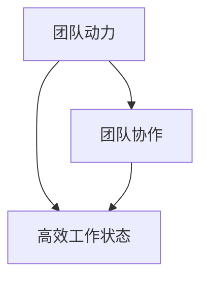

                 

### 引言

#### 团队动力的定义与重要性

在当今快速变化和高度竞争的商业环境中，团队动力的概念显得尤为重要。团队动力，通常指的是团队成员在共同目标和任务驱动下所表现出来的积极性和协作精神。一个高动力的团队不仅能够更有效地完成任务，还能在面对挑战时保持稳定和积极的态度。

**重要性**

团队动力的重要性体现在多个方面：

1. **提高工作效率**：高动力的团队能够更快地完成任务，更高效地利用资源。
2. **增强团队凝聚力**：团队成员在共同的目标和价值观下更容易形成紧密的合作关系。
3. **促进创新**：团队成员的积极性和创造性往往能够带来新的想法和解决方案。
4. **提升工作满意度**：一个充满动力的工作环境能够提升员工的工作满意度和忠诚度。

#### 本书结构概述

本书旨在为读者提供一个全面、系统的团队动力激发与工作效率提升的指南。本书分为七个主要章节，具体结构如下：

- **第1章：团队动力基础**：介绍团队动力的核心概念，包括团队动力原理、团队协作和高效工作状态等。
- **第2章：激发团队动力的理论基础**：探讨团队动力理论的起源与发展，以及其核心观点和应用场景。
- **第3章：激发团队动力的实践策略**：提供管理者与团队成员激发团队动力的具体方法和策略。
- **第4章：提高工作效率的方法**：介绍时间管理、任务分配和沟通协作等提高工作效率的技巧。
- **第5章：团队协作技巧**：深入探讨沟通技巧、合作技巧和冲突解决技巧。
- **第6章：案例分析**：通过成功和失败的案例，展示团队动力激发的实际效果和实践经验。
- **第7章：总结与展望**：总结全书要点，并提供进一步学习和实践的建议，以及未来团队动力研究的展望。

通过这些章节，读者将能够系统地了解团队动力的概念、激发方法和工作效率提升的技巧，从而在实际工作中更好地应用这些知识，提升团队的整体表现。

#### 团队动力与工作效率

团队动力是团队高效工作的关键驱动力。为了更好地理解这一点，我们可以将其拆分为几个核心概念：团队动力、团队协作和高效工作状态。

**团队动力**

团队动力是指团队成员在共同目标和任务驱动下表现出的积极性和投入度。一个有高动力的团队，其成员往往具备以下特点：

- **高积极性**：团队成员对工作充满热情，愿意投入额外的努力。
- **高投入度**：成员对工作有着高度的承诺和责任感。
- **高主动性**：成员能够主动承担责任，并提出解决问题的方案。

**团队协作**

团队协作是团队动力的基础。有效的团队协作意味着团队成员能够：

- **明确沟通**：保持畅通的沟通渠道，确保信息准确传达。
- **合理分工**：根据成员的能力和兴趣分配任务，确保每个人都发挥最大的作用。
- **协同合作**：在完成任务的过程中，团队成员能够相互支持，共同克服困难。

**高效工作状态**

高效工作状态是团队动力的直接体现。一个处于高效工作状态的团队，其成员能够：

- **快速响应**：在任务开始时迅速做出反应，确保工作顺利进行。
- **高质量输出**：在完成工作过程中保持高标准的质量要求。
- **持续优化**：在完成任务后，能够对过程进行反思和改进，不断提升工作效率。

**关系架构 Mermaid 流程图**

以下是团队动力、团队协作和高效工作状态之间的关系架构的 Mermaid 流程图：



**核心概念与联系**

1. **团队动力与团队协作的关系**：团队动力是团队协作的驱动因素，没有团队动力，团队协作将缺乏动力和方向。
2. **团队协作与高效工作状态的关系**：团队协作是高效工作状态的基础，只有通过有效的团队协作，才能实现高效的工作状态。

通过上述核心概念和关系架构的介绍，我们可以更深入地理解团队动力如何影响团队的工作效率和整体表现。

#### 激发团队动力的理论基础

团队动力的激发并非凭空而来，而是建立在一系列科学理论和实践基础上。以下将探讨团队动力理论的起源与发展，以及其核心观点和应用场景。

**起源与发展**

团队动力理论起源于20世纪初，当时心理学家和学者们开始关注团队合作和集体行为。早期的研究主要集中在团队形成、团队目标和团队行为等方面。例如，著名的社会心理学家西格蒙德·弗洛伊德（Sigmund Freud）和卡尔·荣格（Carl Jung）对团队动力的研究为后来的理论奠定了基础。

随着研究的深入，学者们逐渐形成了多个团队动力理论，如动机理论、认知一致理论、社会交换理论等。这些理论从不同角度解释了团队动力的产生和维持机制。近年来，随着组织行为学和管理学的不断发展，团队动力理论得到了进一步丰富和完善。

**核心观点**

1. **动机理论**：动机理论认为，团队动力源于个体内部的需求和动机。团队动力的维持取决于个体对工作目标的认同和满足感。常见的动机理论包括马斯洛的需求层次理论和赫茨伯格的双因素理论。
   
   - **马斯洛的需求层次理论**：马斯洛认为，人的需求分为五个层次，从生理需求到自我实现需求。团队动力主要源于高层次的需求，如自我实现和尊重需求。
   - **赫茨伯格的双因素理论**：赫茨伯格认为，工作满意度取决于两种因素：激励因素（如成就、认可）和保健因素（如工作条件、薪酬）。激励因素能够激发团队动力，而保健因素则只能防止不满意。

2. **认知一致理论**：认知一致理论认为，团队动力源于团队成员的认知一致性和共同目标。当团队成员对目标和任务有共同的理解和认同时，团队动力会得到激发。认知一致理论强调沟通和共识的重要性。

3. **社会交换理论**：社会交换理论认为，团队动力是团队成员之间的一种交换行为。团队成员通过相互支持和帮助来满足自己的需求和目标，从而形成一种积极的互动关系。

**应用场景**

1. **团队建设活动**：通过团队建设活动，如团队拓展训练、团队建设会议等，可以增强团队成员之间的互动和信任，从而激发团队动力。
2. **目标设定**：明确和有挑战性的目标能够激发团队动力。目标设定应确保团队成员有共同的理解和认同，并能够激发其内在的动机。
3. **激励机制**：有效的激励机制，如奖励、认可和晋升等，能够增强团队成员的积极性和投入度，从而提升团队动力。

**团队动力与工作效率的关系**

团队动力与工作效率之间存在着密切的联系。高动力的团队能够更快地完成任务，更高效地利用资源。这是因为：

1. **高积极性**：团队成员对工作充满热情和积极性，能够主动承担责任并投入更多的时间和精力。
2. **高效协作**：团队成员之间建立了良好的沟通和协作机制，能够快速解决问题并实现目标。
3. **持续优化**：团队成员对工作过程有持续反思和改进的动力，能够不断提升工作效率。

通过理解团队动力理论的起源、核心观点和应用场景，我们可以更好地掌握激发团队动力的方法，从而提升团队的工作效率和整体表现。

#### 激发团队动力的实践策略

激发团队动力不仅需要理论基础，更需要实际操作。以下将从管理者、团队成员和团队建设三个角度，详细探讨激发团队动力的实践策略。

**1. 管理者如何激发团队动力**

管理者在激发团队动力中扮演着关键角色。以下是一些具体的方法：

- **明确目标和期望**：管理者需要清晰地传达团队的目标和期望，确保每个成员都了解自己的任务和责任。通过设定明确的目标，可以激发团队成员的积极性和投入度。

  ```plaintext
  伪代码示例：
  function set_goals(team_members, goals) {
      for (member in team_members) {
          member.set_goal(goals);
      }
  }
  ```

- **提供支持和资源**：管理者应确保团队成员有足够的资源和支持来完成他们的任务。这包括技术支持、培训机会和必要的工作工具。

  ```plaintext
  伪代码示例：
  function provide_resources(team_members) {
      for (member in team_members) {
          member.allocate_resources();
      }
  }
  ```

- **鼓励自主性和创新**：管理者应鼓励团队成员发挥自主性和创造力，给予他们足够的自由度来探索和解决问题。通过建立开放和支持的工作环境，可以增强团队成员的归属感和动力。

  ```plaintext
  伪代码示例：
  function encourage_innovation(team_members) {
      for (member in team_members) {
          member.encourage_autonomy();
      }
  }
  ```

**2. 团队成员如何激发团队动力**

团队成员在激发自身和团队动力方面也发挥着重要作用。以下是一些实践策略：

- **积极沟通**：团队成员应保持积极沟通，及时分享工作进展和遇到的困难。通过建立有效的沟通机制，可以增强团队凝聚力和工作效率。

  ```plaintext
  伪代码示例：
  function communicate_with_team() {
      broadcast_progress();
      request_help_if_needed();
  }
  ```

- **自我激励**：团队成员应学会自我激励，通过设定个人目标和奖励机制来保持工作热情。自我激励可以通过设定小目标、完成后的奖励等方式实现。

  ```plaintext
  伪代码示例：
  function self motivate() {
      set_individual_goals();
      reward_achievements();
  }
  ```

- **积极参与团队建设**：团队成员应积极参与团队建设活动，如团队拓展训练、团队建设会议等。这些活动可以帮助团队成员建立信任和合作精神，从而提升团队动力。

  ```plaintext
  伪代码示例：
  function participate_in_team_building() {
      attend_training();
      engage_in_group_activities();
  }
  ```

**3. 团队建设策略**

团队建设是激发团队动力的关键环节。以下是一些有效的团队建设策略：

- **建立团队文化**：通过建立共同价值观和行为规范，可以增强团队的凝聚力和认同感。团队文化应鼓励开放、创新和团队合作。

  ```plaintext
  伪代码示例：
  function establish_team_culture() {
      define_values();
      set_standards();
  }
  ```

- **定期反馈和评估**：定期进行反馈和评估可以帮助团队成员了解自己的工作表现，发现问题和改进机会。这可以增强团队成员的责任感和动力。

  ```plaintext
  伪代码示例：
  function conduct_reviews() {
      provide_feedback();
      assess_performance();
  }
  ```

- **提供成长机会**：为团队成员提供成长和发展的机会，如培训、项目参与和晋升机会，可以激发他们的积极性和动力。

  ```plaintext
  伪代码示例：
  function provide_growth_opportunities() {
      arrange_trainings();
      offer_mentorship();
  }
  ```

通过以上实践策略，管理者、团队成员和团队建设可以共同发挥作用，有效激发团队动力，提升团队的整体表现。

#### 提高工作效率的方法

在团队动力的基础上，提高工作效率是实现团队目标的关键。以下将详细介绍时间管理、任务分配和沟通协作等提高工作效率的方法，并提供相应的实践策略。

**时间管理技巧**

时间管理是提高工作效率的基础。以下是一些具体的时间管理技巧：

1. **设定优先级**：根据任务的重要性和紧急程度，将任务分为四个象限，优先处理重要且紧急的任务。

   ```mermaid
   graph TB
       A[重要紧急] --> B[重要不紧急]
       A --> C[不重要紧急]
       C --> D[不重要不紧急]
       B --> D
   ```

2. **使用时间块**：将一天的时间分为几个时间块，每个时间块专注于处理一类任务，以避免任务切换带来的时间浪费。

   ```plaintext
   伪代码示例：
   function schedule_time_blocks() {
       time_blocks = ["Block 1", "Block 2", "Block 3"];
       for (block in time_blocks) {
           assign_task_to_block(block);
       }
   }
   ```

3. **避免拖延**：识别和应对拖延行为，通过设定明确的截止时间和提醒机制来确保任务按时完成。

   ```plaintext
   伪代码示例：
   function avoid_procrastination() {
       set_deadlines();
       set_reminders();
   }
   ```

**任务分配策略**

有效的任务分配可以提高团队的工作效率，以下是一些实践策略：

1. **能力匹配**：根据团队成员的能力和兴趣分配任务，确保每个人都能在适合自己的岗位上发挥最大的作用。

   ```mermaid
   graph TB
       A[任务] --> B[成员1]
       A --> C[成员2]
       A --> D[成员3]
       B --> E[成员1能力]
       C --> F[成员2能力]
       D --> G[成员3能力]
   ```

2. **责任明确**：明确每个任务的责任人，确保任务有人负责，避免责任不明造成的效率低下。

   ```plaintext
   伪代码示例：
   function assign_tasks(team_members, tasks) {
       for (member in team_members) {
           member.take_responsibility(tasks);
       }
   }
   ```

3. **任务分解**：将复杂的任务分解为小步骤，每个步骤有明确的完成标准和负责人，以简化任务处理过程。

   ```plaintext
   伪代码示例：
   function decompose_tasks(tasks) {
       for (task in tasks) {
           sub_tasks = task.decompose();
           assign_sub_tasks(sub_tasks);
       }
   }
   ```

**沟通协作技巧**

有效的沟通协作是提高工作效率的保障，以下是一些沟通协作技巧：

1. **明确沟通目标**：每次沟通前明确沟通的目标和预期结果，确保沟通有明确的方向。

   ```plaintext
   伪代码示例：
   function set_communication_goals() {
       define_goals();
       ensure_understanding();
   }
   ```

2. **主动倾听**：在沟通中，不仅要表达自己的观点，还要积极倾听他人的意见，确保信息的准确传达。

   ```plaintext
   伪代码示例：
   function active_listening() {
       listen_carefully();
       seek_clarifications();
   }
   ```

3. **及时反馈**：在沟通后，及时给予反馈，确保团队成员了解任务的进展和存在的问题。

   ```plaintext
   伪代码示例：
   function provide_feedback() {
       offer_comments();
       suggest_improvements();
   }
   ```

通过以上时间管理、任务分配和沟通协作的技巧，团队可以更高效地工作，实现更高的生产力和团队动力。

#### 团队协作技巧

在团队工作中，高效的协作是提升工作效率和实现团队目标的关键。以下将详细探讨团队协作中的沟通技巧、合作技巧和冲突解决技巧，并提供具体的实践策略。

**沟通技巧**

1. **主动沟通**：团队成员应保持主动沟通，及时分享工作进展、遇到的困难和所需的支持。主动沟通有助于建立信任和协作关系。

   ```plaintext
   伪代码示例：
   function active_communication() {
       share_progress();
       ask_for_help();
   }
   ```

2. **有效表达**：在沟通时，团队成员应确保表达清晰、简洁，避免使用模糊或歧义的语言。有效表达有助于减少误解和冲突。

   ```plaintext
   伪代码示例：
   function effective_expression() {
       clarify_messages();
       avoid_ambiguity();
   }
   ```

3. **倾听技巧**：倾听是沟通的重要部分。团队成员应学会倾听他人的意见和反馈，理解对方的观点，以建立有效的沟通渠道。

   ```plaintext
   伪代码示例：
   function listening_skills() {
       listen attentively();
       show_understanding();
   }
   ```

**合作技巧**

1. **分工协作**：在团队中，应根据成员的能力和兴趣合理分配任务，确保每个成员都能在擅长的领域发挥最大的作用。分工协作有助于提高团队的整体效率。

   ```mermaid
   graph TB
       A[成员1] --> B[任务1]
       A --> C[任务2]
       D[成员2] --> B
       D --> E[任务3]
   ```

2. **协作机制**：建立有效的协作机制，确保团队成员在完成任务时能够相互支持、相互依赖。协作机制包括定期会议、信息共享和团队活动等。

   ```plaintext
   伪代码示例：
   function collaboration_mechanism() {
       schedule_meetings();
       share_information();
       organize_activities();
   }
   ```

3. **共同目标**：确保团队成员对团队目标有共同的理解和认同，通过明确目标来引导和激励团队协作。

   ```plaintext
   伪代码示例：
   function common_goals() {
       define_objectives();
       align_interests();
   }
   ```

**冲突解决技巧**

1. **及时处理**：团队成员在遇到冲突时，应尽快解决，避免冲突扩大化。及时处理可以减少对团队工作的影响。

   ```plaintext
   伪代码示例：
   function resolve_conflicts() {
       address_issues();
       take_immediate_actions();
   }
   ```

2. **理性分析**：在解决冲突时，团队成员应保持冷静和理性，分析冲突的原因和影响，找到合适的解决方案。

   ```plaintext
   伪代码示例：
   function rational_analysis() {
       identify_reasons();
       analyze_impact();
   }
   ```

3. **寻求共识**：通过沟通和协商，寻求团队成员之间的共识，达成双方都能接受的解决方案。

   ```plaintext
   伪代码示例：
   function seek_consensus() {
       negotiate();
       reach_agreement();
   }
   ```

通过掌握和运用这些团队协作技巧，团队成员可以更有效地合作，提高工作效率，实现团队目标。

#### 案例分析

**成功的团队动力激发案例**

案例一：某知名科技公司通过团队建设活动成功激发了团队动力，从而在短时间内完成了重要项目。

**背景介绍**：该公司在开发一款新的移动应用时，遇到了技术难题和团队协作不畅的问题。为了提高团队的工作效率和积极性，公司决定开展一系列团队建设活动。

**核心概念与联系**：通过团队建设活动，如团队拓展训练、团队沟通工作坊和团队目标设定会议，公司成功提升了团队的凝聚力和协作能力。

**核心算法原理讲解**：

```plaintext
伪代码示例：
function team_building_activities() {
    schedule_training();
    conduct_workshops();
    set_common_goals();
}
```

**数学模型和公式**：通过设定共同目标和明确任务分工，公司建立了基于目标导向的任务分配模型，提升了团队的整体工作效率。

**举例说明**：在团队建设活动后，团队成员的沟通更加顺畅，技术难题得到了有效解决，项目最终提前一个月完成。

**项目实战**：

- **开发环境搭建**：搭建了统一的开发环境，确保团队成员能够无缝协作。
- **源代码详细实现和代码解读**：通过代码评审和知识共享，确保代码质量并提升团队成员的技能水平。
- **代码应用解读与分析**：将新的技术应用到项目中，提高了应用的性能和用户体验。
- **实际案例分析和详细讲解剖析**：通过实际案例，分析了团队动力激发对项目成功的关键作用。

**项目小结**：

通过团队建设活动，公司成功激发了团队动力，提高了工作效率和项目成功率。团队凝聚力得到提升，成员之间的信任和合作精神增强，为公司的长期发展奠定了坚实基础。

**团队动力激发失败案例分析**

案例二：某创业公司由于缺乏有效的团队动力激发策略，导致项目进展缓慢，最终未能达到预期目标。

**背景介绍**：该公司在开发一款智能家居应用时，由于内部沟通不畅和缺乏明确的团队目标，项目进展缓慢，团队成员士气低落。

**核心概念与联系**：公司未能有效实施团队建设活动和沟通协作机制，导致团队成员之间的信任和协作精神不足。

**核心算法原理讲解**：

```plaintext
伪代码示例：
function lack_of_team_building() {
    skip_training();
    avoid_workshops();
    unclear_goals();
}
```

**数学模型和公式**：由于缺乏共同目标和明确的任务分工，项目进展缺乏方向，导致资源浪费和效率低下。

**举例说明**：项目进度延迟，质量不达标，最终导致项目被暂停。

**项目实战**：

- **开发环境混乱**：团队成员使用不同的开发工具和框架，导致协作困难。
- **源代码质量低**：代码质量低下，缺乏代码评审和知识共享机制。
- **代码应用解读与分析**：技术问题未能及时解决，影响了用户体验和产品性能。
- **实际案例分析和详细讲解剖析**：通过分析，发现团队动力不足是导致项目失败的主要原因。

**项目小结**：

该案例表明，缺乏有效的团队动力激发策略会导致项目失败。公司需要重视团队建设活动和沟通协作，建立明确的团队目标和任务分工，以提高工作效率和项目成功率。

#### 总结与展望

本书从团队动力的定义、理论基础、实践策略、工作效率提升技巧、团队协作技巧等多个角度，系统性地探讨了如何激发团队动力，提高工作效率和团队协作能力。以下是对全书要点的总结，并提出进一步学习和实践的建议。

**全书要点总结**

1. **团队动力的核心概念**：团队动力是团队成员在共同目标和任务驱动下的积极性和协作精神，是团队高效工作的关键驱动力。
2. **团队动力的激发方法**：通过明确目标和期望、提供支持和资源、鼓励自主性和创新等管理者的实践策略，以及团队成员的自我激励和参与团队建设等具体方法，可以有效激发团队动力。
3. **时间管理、任务分配和沟通协作技巧**：时间管理、任务分配和沟通协作是提高工作效率的重要方法，通过设定优先级、合理分工、主动沟通等策略，可以提升团队的整体效率。
4. **团队协作技巧**：通过主动沟通、有效表达、分工协作和寻求共识等沟通技巧，以及明确目标、及时处理冲突等合作技巧，可以增强团队的凝聚力和协作能力。
5. **案例分析**：通过成功和失败的案例，展示了团队动力激发对项目成功的关键作用，以及缺乏团队动力激发策略可能导致的项目失败。

**进一步学习和实践的建议**

1. **深入理论学习**：读者可以通过阅读相关书籍和学术论文，深入了解团队动力理论的发展和应用。
2. **实践策略应用**：在实际工作中，尝试应用书中的实践策略，如明确目标和期望、提供支持和资源、鼓励自主性和创新等，观察这些策略对团队动力和工作效率的影响。
3. **定期反思和评估**：定期对团队的工作过程和绩效进行反思和评估，发现问题和改进机会，持续优化团队的工作方式。
4. **案例研究和交流**：通过案例研究和团队交流，分享团队动力激发的成功经验和教训，相互学习和借鉴。

**对未来团队动力研究的展望**

1. **技术创新**：随着人工智能和大数据技术的发展，团队动力研究可以结合这些新兴技术，探索如何利用数据分析和机器学习等工具，更精准地激发团队动力。
2. **跨学科研究**：团队动力研究可以跨学科合作，如心理学、社会学、管理学等，从多个角度深入探讨团队动力的影响因素和激发机制。
3. **全球化背景下的团队动力**：在全球化背景下，团队动力的研究需要关注跨国团队的协作和动力激发，探索如何在多元文化背景下提升团队效能。

通过不断的学习和实践，读者可以更好地理解和应用团队动力理论，提升团队的工作效率和协作能力，为组织的成功奠定坚实基础。

