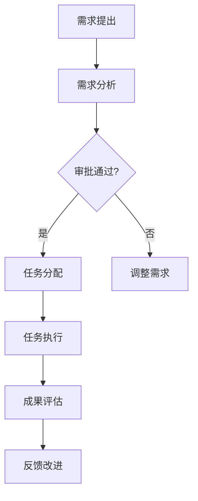
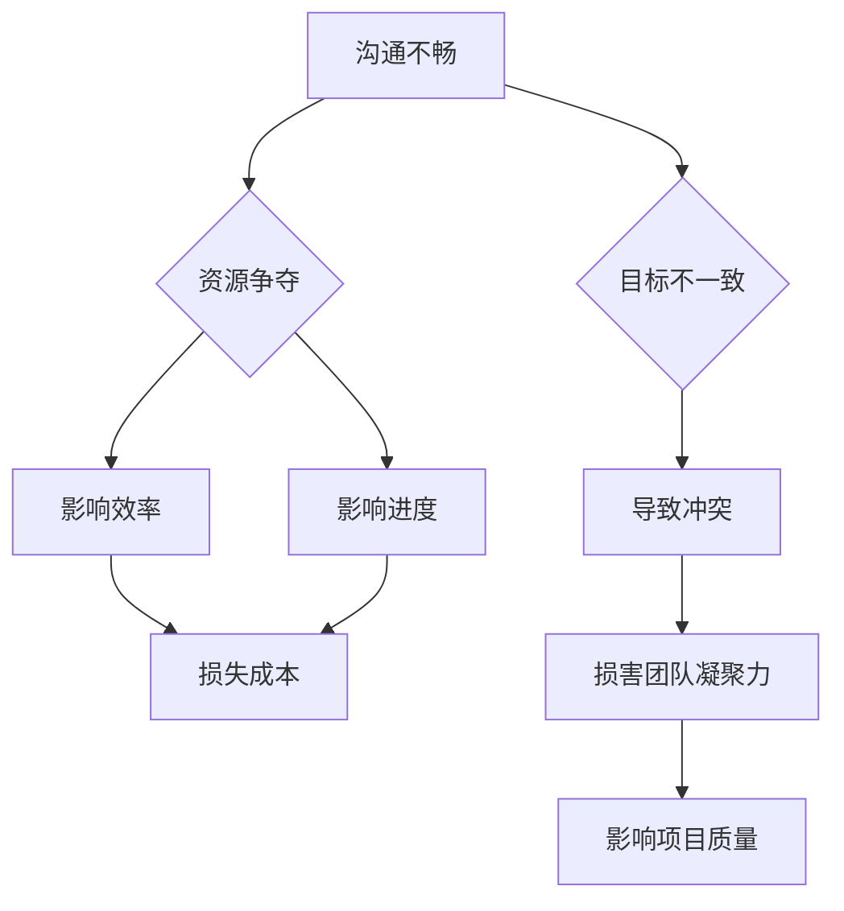
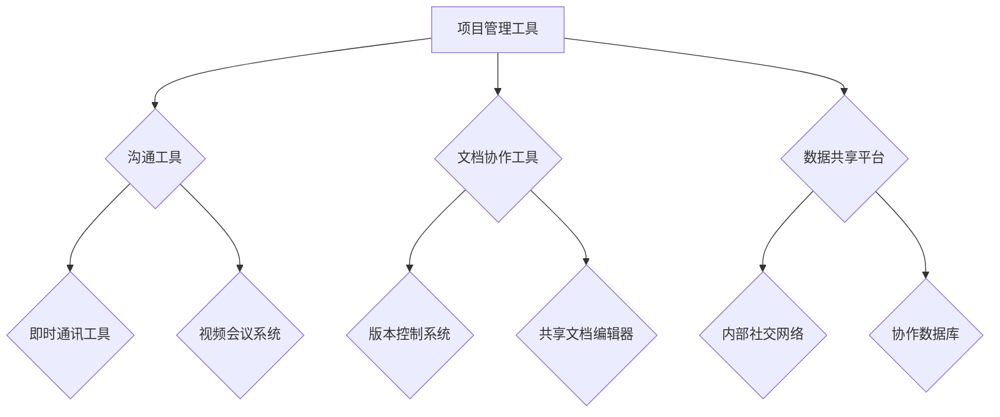
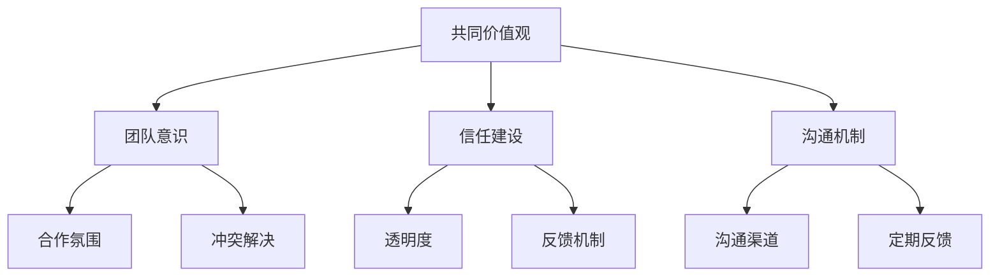

                 

## 文章标题

# 团队协作：跨部门合作的重要性

## 关键词

- 团队协作
- 跨部门合作
- 效率提升
- 风险管理
- 沟通技巧

## 摘要

在当今快速发展的科技时代，跨部门合作已成为提升企业竞争力的重要手段。本文将探讨跨部门合作的重要性，分析其带来的挑战与问题，并提出有效的策略与方法。通过实际案例和最佳实践，本文旨在为团队管理者提供实用的指导，以实现跨部门合作的优化与效率提升。

## 目录大纲设计思路

### 第一步：明确书籍主题和目标读者

在设计本文的目录大纲之前，我们首先需要明确主题和目标读者。本文的主题是“团队协作：跨部门合作的重要性”，旨在探讨跨部门合作在企业中的实际应用及其带来的效益。目标读者包括企业管理者、项目经理以及希望提升团队协作能力的技术人员。

### 第二步：确定书籍的核心章节

根据主题和目标读者，本文将包含以下核心章节：

1. **引言：跨部门合作的基本概念与重要性**
2. **跨部门协作中的挑战与问题**
3. **提高跨部门协作效率的策略与方法**
4. **跨部门协作的案例分析**
5. **跨部门协作工具与技术**
6. **跨部门协作文化建设**
7. **未来跨部门协作的发展趋势**

### 第三步：细化每个章节的内容

在确定了核心章节后，我们需要进一步细化每个章节的内容。以下是每个章节的细化内容：

### 第1章：引言：跨部门合作的基本概念与重要性

- **核心概念与联系**：使用Mermaid流程图展示跨部门合作的流程和各个环节。
- **核心算法原理讲解**：分析跨部门协作中的关键环节，如需求沟通、任务分配、进度跟踪、成果评估等，使用伪代码详细阐述每个环节的处理流程。
- **数学模型和数学公式**：分析跨部门协作中的关键问题，如如何优化资源分配、如何平衡各部门的工作量等，使用latex格式给出相关的数学模型和公式，并进行详细讲解和举例说明。

### 第2章：跨部门协作中的挑战与问题

- **核心概念与联系**：使用Mermaid流程图展示跨部门协作中常见的问题和解决思路。
- **核心算法原理讲解**：分析跨部门协作中的常见问题，如沟通不畅、资源争夺、目标不一致等，使用伪代码详细阐述每个问题的处理方法。
- **数学模型和数学公式**：分析跨部门协作中的关键问题，如如何优化资源分配、如何平衡各部门的工作量等，使用latex格式给出相关的数学模型和公式，并进行详细讲解和举例说明。

### 第3章：提高跨部门协作效率的策略与方法

- **核心概念与联系**：使用Mermaid流程图展示提高跨部门协作效率的策略和方法。
- **核心算法原理讲解**：分析提高跨部门协作效率的关键策略，如明确目标、建立沟通机制、优化流程等，使用伪代码详细阐述每个策略的实施步骤。
- **数学模型和数学公式**：分析提高跨部门协作效率的关键方法，如如何优化资源分配、如何平衡各部门的工作量等，使用latex格式给出相关的数学模型和公式，并进行详细讲解和举例说明。

### 第4章：跨部门协作的案例分析

- **核心概念与联系**：使用Mermaid流程图展示不同行业的跨部门协作案例。
- **核心算法原理讲解**：分析不同行业中的跨部门协作案例，如制造业、服务业、IT行业等，使用伪代码详细阐述每个案例的具体实现。
- **数学模型和数学公式**：分析跨部门协作案例中的关键问题，如如何优化资源分配、如何平衡各部门的工作量等，使用latex格式给出相关的数学模型和公式，并进行详细讲解和举例说明。

### 第5章：跨部门协作工具与技术

- **核心概念与联系**：使用Mermaid流程图展示跨部门协作工具和技术的应用场景。
- **核心算法原理讲解**：分析跨部门协作工具和技术的原理，如项目管理软件、协作工具、沟通工具等，使用伪代码详细阐述每个工具和技术的工作原理。
- **数学模型和数学公式**：分析跨部门协作工具和技术的应用效果，如如何提高协作效率、如何降低沟通成本等，使用latex格式给出相关的数学模型和公式，并进行详细讲解和举例说明。

### 第6章：跨部门协作文化建设

- **核心概念与联系**：使用Mermaid流程图展示跨部门协作文化的构建过程。
- **核心算法原理讲解**：分析跨部门协作文化的重要性，如如何建立共同价值观、如何提高团队凝聚力等，使用伪代码详细阐述每个构建过程的实施步骤。
- **数学模型和数学公式**：分析跨部门协作文化对协作效率的影响，如如何提高团队绩效、如何降低冲突等，使用latex格式给出相关的数学模型和公式，并进行详细讲解和举例说明。

### 第7章：未来跨部门协作的发展趋势

- **核心概念与联系**：使用Mermaid流程图展示未来跨部门协作的发展趋势。
- **核心算法原理讲解**：分析未来跨部门协作的发展方向，如智能化、自动化、全球协作等，使用伪代码详细阐述每个趋势的具体表现。
- **数学模型和数学公式**：分析未来跨部门协作的潜在问题，如如何应对技术变革、如何适应全球化等，使用latex格式给出相关的数学模型和公式，并进行详细讲解和举例说明。

### 总结与展望

- **最佳实践与小结**：总结本文的核心观点和实用技巧，提出跨部门协作的最佳实践建议。
- **注意事项与拓展阅读**：针对跨部门协作中的潜在风险和挑战，给出注意事项和拓展阅读建议，以帮助读者进一步深入了解相关领域。

通过本文的逐步分析和详细讲解，我们希望读者能够全面理解跨部门合作的重要性，掌握提高协作效率的策略与方法，并为实际工作提供有价值的参考。

---

### 引言：跨部门合作的基本概念与重要性

在现代企业的运营过程中，跨部门合作已成为提升整体效率和竞争力的关键因素。跨部门合作指的是企业中不同部门之间为了共同实现特定目标而进行的协作。这种协作不仅涉及同一层级部门之间的合作，还包括上下级部门以及跨职能团队之间的互动。

**背景介绍**：

随着企业规模的不断扩大和市场环境的日益复杂，部门之间的壁垒逐渐显现。传统的部门分工模式往往导致信息孤岛、资源浪费和协作效率低下。因此，如何打破部门壁垒，实现跨部门的高效协作，成为了企业管理的核心课题。

**核心概念与联系**：

为了更好地理解跨部门合作，我们可以借助Mermaid流程图来展示其基本概念和联系。以下是一个简化的跨部门合作流程图：



**核心算法原理讲解**：

在跨部门合作中，各个环节的处理流程可以用伪代码来详细阐述：

```python
# 需求提出
def 提出需求():
    收集需求信息
    分析需求背景
    形成需求文档

# 需求分析
def 分析需求(需求文档):
    验证需求合理性
    分析需求可行性
    更新需求文档

# 审批流程
def 审批需求(需求文档):
    if 审批通过():
        return True
    else:
        return False

# 任务分配
def 分配任务(需求文档):
    根据需求分配任务
    形成任务分配列表

# 任务执行
def 执行任务(任务列表):
    分配资源
    跟踪任务进度
    确保任务按时完成

# 成果评估
def 评估成果(任务列表):
    检查任务完成情况
    收集反馈意见
    形成评估报告

# 反馈改进
def 反馈改进(评估报告):
    根据评估结果进行调整
    提升未来协作效率
```

**数学模型和数学公式**：

在跨部门合作中，一些关键问题可以通过数学模型和公式来分析和解决。以下是一个简单的数学模型示例：

$$
E = \frac{C}{R} + \frac{F}{T}
$$

其中，E表示协作效率，C表示协作成本，R表示资源投入，F表示反馈修正时间，T表示任务周期。该公式表明，协作效率与协作成本和资源投入成正比，与反馈修正时间和任务周期成反比。

**详细讲解与举例说明**：

为了更好地理解上述模型，我们可以通过一个实际案例来进行讲解。假设某公司的一个项目需要由市场部、研发部和运营部共同完成。根据项目需求，市场部负责市场调研，研发部负责技术开发，运营部负责项目上线后的运营支持。

1. **需求提出**：市场部提出市场调研需求，形成需求文档。
2. **需求分析**：研发部和运营部分析需求文档，验证其合理性和可行性。
3. **审批流程**：经过审批，需求被批准实施。
4. **任务分配**：根据需求，将任务分配给市场部、研发部和运营部，形成任务分配列表。
5. **任务执行**：各部门根据任务分配列表，投入资源进行任务执行，并跟踪任务进度。
6. **成果评估**：项目完成后，收集各方反馈，进行成果评估。
7. **反馈改进**：根据评估结果，对未来的协作流程进行调整和优化。

通过上述案例，我们可以看到跨部门合作的关键环节以及数学模型在实际应用中的具体表现形式。

**小结**：

跨部门合作在企业管理中具有重要意义。通过明确核心概念和流程，使用伪代码和数学模型进行分析，我们可以更好地理解和实施跨部门合作，从而提升企业的协作效率和竞争力。

---

### 跨部门协作中的挑战与问题

尽管跨部门合作在提升企业整体效率方面具有重要作用，但在实际操作过程中，依然面临诸多挑战与问题。以下将从沟通不畅、资源争夺、目标不一致等方面进行分析。

**核心概念与联系**：

我们可以使用Mermaid流程图来展示跨部门协作中常见的问题和解决思路：



**核心算法原理讲解**：

为了更好地理解这些问题，我们可以用伪代码来详细阐述每个问题的处理方法：

```python
# 沟通不畅
def 沟通不畅(部门A, 部门B):
    if 缺乏沟通机制():
        print("沟通不畅，请建立沟通机制")
    else:
        print("沟通顺畅")

# 资源争夺
def 资源争夺(部门A, 部门B):
    if 资源不足():
        print("资源争夺，请优化资源分配")
    else:
        print("资源充足")

# 目标不一致
def 目标不一致(部门A, 部门B):
    if 目标不明确():
        print("目标不一致，请明确共同目标")
    else:
        print("目标明确")

# 影响效率
def 影响效率(问题):
    if 问题存在():
        print("影响效率，请解决问题")
    else:
        print("效率不受影响")

# 导致冲突
def 导致冲突(问题):
    if 问题存在():
        print("导致冲突，请解决冲突")
    else:
        print("无冲突")

# 损失成本
def 损失成本(问题):
    if 问题存在():
        print("损失成本，请采取措施降低成本")
    else:
        print("成本无影响")

# 损害团队凝聚力
def 损害团队凝聚力(问题):
    if 问题存在():
        print("损害团队凝聚力，请增强团队协作")
    else:
        print("团队凝聚力良好")

# 影响项目质量
def 影响项目质量(问题):
    if 问题存在():
        print("影响项目质量，请提升项目质量")
    else:
        print("项目质量不受影响")
```

**数学模型和数学公式**：

为了定量分析这些问题的影响，我们可以使用以下数学模型：

$$
损失成本 = f(问题严重性) \times 成本系数
$$

其中，损失成本表示由于问题导致的额外成本，问题严重性表示问题对项目的影响程度，成本系数表示单位问题严重性导致的成本增加。

**详细讲解与举例说明**：

1. **沟通不畅**：
   沟通不畅是跨部门协作中最常见的问题之一。假设市场部和技术部之间的沟通不畅，可能导致市场部无法及时了解技术部的开发进度，从而影响市场推广策略的制定。解决方法包括定期召开跨部门沟通会议、建立即时通讯工具、明确沟通责任等。

2. **资源争夺**：
   当资源不足时，不同部门之间可能会出现资源争夺现象。例如，研发部和技术部都需要使用高性能服务器进行开发，但服务器资源有限，这可能导致两个部门之间的冲突。解决方法包括资源优先级分配、共享资源、增加资源投入等。

3. **目标不一致**：
   目标不一致可能导致各部门的协作缺乏方向和目标，从而降低协作效率。例如，市场部可能更关注短期销售目标，而研发部更关注长期技术发展目标。解决方法包括制定共同目标、明确各部门职责、定期协调目标等。

4. **影响效率**：
   沟通不畅、资源争夺和目标不一致等问题都会对协作效率产生负面影响。例如，如果研发部因为资源不足而无法按时完成开发任务，可能会影响整个项目的进度。解决方法包括优化流程、提高资源利用率、增强团队协作等。

5. **导致冲突**：
   冲突不仅影响工作效率，还会损害团队凝聚力。例如，当市场部和技术部因为资源分配问题发生冲突时，可能导致双方关系紧张，影响后续合作。解决方法包括建立冲突解决机制、明确责任、加强沟通等。

6. **损害团队凝聚力**：
   长期的冲突和沟通不畅会损害团队凝聚力，影响团队的协作效果。例如，如果研发部和技术部之间缺乏有效的沟通，可能导致双方关系疏远，影响团队合作精神。解决方法包括增强团队建设、定期组织团队活动、提高团队意识等。

7. **影响项目质量**：
   项目质量是跨部门协作的核心目标之一。如果沟通不畅、资源争夺和目标不一致等问题得不到解决，可能会导致项目质量下降。例如，如果市场部无法及时提供市场反馈，研发部可能无法根据反馈进行优化，从而影响项目质量。解决方法包括建立质量保障机制、提高质量意识、加强质量控制等。

**小结**：

跨部门协作中的挑战和问题对企业的整体效率和质量具有显著影响。通过使用伪代码和数学模型，我们可以更好地理解和解决这些问题，从而提升跨部门协作的效率和质量。

---

### 提高跨部门协作效率的策略与方法

为了克服跨部门协作中的各种挑战和问题，提高协作效率，企业需要采取一系列策略和方法。以下将分析提高跨部门协作效率的关键策略，并使用伪代码详细阐述每个策略的实施步骤。

**核心概念与联系**：

我们可以借助Mermaid流程图来展示提高跨部门协作效率的关键策略和方法：

```mermaid
graph TD
    A[明确目标] --> B{建立沟通机制}
    A --> C[优化流程]
    A --> D[资源合理分配}
    A --> E[培养团队协作精神}
    B --> F[定期沟通会议}
    B --> G[使用协作工具}
    C --> H[简化流程}
    C --> I[自动化流程}
    D --> J[资源优先级}
    D --> K[资源共享平台}
    E --> L[团队培训}
    E --> M[建立共同价值观}
```

**核心算法原理讲解**：

以下使用伪代码详细阐述提高跨部门协作效率的策略和方法：

```python
# 明确目标
def 明确目标(部门列表):
    for 部门 in 部门列表:
        部门.设置目标()
        部门.确认目标一致性()

# 建立沟通机制
def 建立沟通机制(部门列表):
    for 部门 in 部门列表:
        部门.创建沟通渠道()
        部门.定期召开沟通会议()

# 优化流程
def 优化流程(部门列表):
    for 部门 in 部门列表:
        部门.简化流程()
        部门.自动化流程()

# 资源合理分配
def 资源合理分配(部门列表):
    for 部门 in 部门列表:
        部门.设置资源优先级()
        部门.使用资源共享平台()

# 培养团队协作精神
def 培养团队协作精神(部门列表):
    for 部门 in 部门列表:
        部门.组织团队培训()
        部门.建立共同价值观()
```

**数学模型和数学公式**：

为了定量分析提高协作效率的效果，我们可以使用以下数学模型：

$$
协作效率 = f(目标明确度) \times 沟通效率 \times 流程优化度 \times 资源分配度 \times 团队协作精神
$$

其中，协作效率表示跨部门合作的效率，目标明确度、沟通效率、流程优化度、资源分配度和团队协作精神分别表示这些因素的程度。

**详细讲解与举例说明**：

1. **明确目标**：
   明确目标是提高跨部门协作效率的首要策略。各部门在项目开始前应明确各自的目标，并确保这些目标与整体项目目标一致。例如，研发部和技术部的目标可能是开发出满足市场需求的软件，而市场部的目标则是推广该软件并获取用户反馈。

2. **建立沟通机制**：
   建立有效的沟通机制是提高协作效率的关键。各部门应定期召开沟通会议，讨论项目进展、问题解决和资源需求。此外，可以采用即时通讯工具、邮件和项目管理软件等工具，确保信息传递的及时性和准确性。

   ```python
   # 示例：建立沟通机制
   def 建立沟通机制(部门列表):
       for 部门 in 部门列表:
           部门.创建沟通渠道()
           部门.定期召开沟通会议()
   ```

3. **优化流程**：
   优化流程有助于简化工作步骤，减少冗余环节，提高协作效率。各部门可以共同评估现有流程，找出瓶颈和改进点，并进行优化。例如，可以采用自动化工具来处理重复性任务，减少人工干预。

   ```python
   # 示例：优化流程
   def 优化流程(部门列表):
       for 部门 in 部门列表:
           部门.简化流程()
           部门.自动化流程()
   ```

4. **资源合理分配**：
   资源合理分配是确保各部门都能充分利用资源，避免资源浪费的关键。企业应根据项目需求和各部门的工作负荷，合理分配资源。例如，可以根据资源优先级，确保关键任务得到足够的资源支持。

   ```python
   # 示例：资源合理分配
   def 资源合理分配(部门列表):
       for 部门 in 部门列表:
           部门.设置资源优先级()
           部门.使用资源共享平台()
   ```

5. **培养团队协作精神**：
   培养团队协作精神有助于增强团队的凝聚力和协作意识。企业可以通过组织团队建设活动、培训课程和团队奖励等方式，促进团队成员之间的沟通和协作。

   ```python
   # 示例：培养团队协作精神
   def 培养团队协作精神(部门列表):
       for 部门 in 部门列表:
           部门.组织团队培训()
           部门.建立共同价值观()
   ```

**最佳实践与小结**：

通过明确目标、建立沟通机制、优化流程、资源合理分配和培养团队协作精神，企业可以有效提高跨部门协作的效率。以下是一些最佳实践和建议：

- **定期评估和调整**：定期对协作效率进行评估，并根据反馈进行调整，确保协作策略和方法持续优化。
- **建立跨部门团队**：组建跨部门团队，促进各部门之间的协作和沟通，共同应对项目挑战。
- **鼓励反馈和改进**：鼓励团队成员提出改进意见和建议，不断优化协作流程和机制。
- **培养协作文化**：建立以协作为中心的企业文化，提高团队成员的协作意识和积极性。

**注意事项**：

- 在实施跨部门协作策略时，要确保各部门的职责和目标明确，避免工作重叠和资源浪费。
- 定期评估协作效率，并根据实际情况调整策略和方法，确保协作效果持续提升。
- 鼓励团队成员积极参与协作，提高协作意识和积极性，共同推动项目成功。

通过以上策略和方法，企业可以显著提升跨部门协作效率，实现资源的高效利用，提高项目质量和市场竞争力。

---

### 跨部门协作的案例分析

为了更好地理解跨部门协作在实际操作中的具体应用和效果，以下将分析几个不同行业的跨部门协作案例。通过这些案例，我们可以看到跨部门协作在不同领域中的应用和实现方法。

**案例一：制造业企业中的供应链协作**

**背景介绍**：

某大型制造业企业，其供应链涉及多个部门，包括采购部、生产部、仓储部和物流部。由于部门之间的工作紧密关联，跨部门协作对于确保生产流程的顺畅和供应链的稳定性至关重要。

**核心概念与联系**：

供应链中的跨部门协作可以分解为以下几个关键环节：

1. **采购与生产的协调**：采购部需要根据生产计划提前预订原材料，确保生产线的正常运转。
2. **生产与仓储的对接**：生产部在完成生产后，将产品交由仓储部进行库存管理。
3. **仓储与物流的合作**：仓储部负责产品的存储和出库，物流部则负责将产品配送至客户手中。

**核心算法原理讲解**：

以下是供应链协作的关键环节和伪代码：

```python
# 采购与生产的协调
def 采购与生产的协调(采购部，生产部):
    if 采购部.获取生产计划():
        生产部.确认原材料需求
    else:
        采购部.重新获取生产计划

# 生产与仓储的对接
def 生产与仓储的对接(生产部，仓储部):
    if 生产部.完成生产():
        仓储部.接收产品并入库
    else:
        生产部.继续生产

# 仓储与物流的合作
def 仓储与物流的合作(仓储部，物流部):
    if 仓储部.产品出库():
        物流部.安排配送
    else:
        仓储部.检查库存情况
```

**数学模型和数学公式**：

为了优化供应链协作，我们可以使用以下数学模型：

$$
供应链效率 = \frac{生产效率 \times 仓储效率 \times 物流效率}{协作时间}
$$

其中，生产效率、仓储效率和物流效率分别表示各部门的独立工作效率，协作时间表示各部门协作完成整个流程所需的时间。

**案例分析与讲解**：

该制造业企业通过以下方式实现了高效的跨部门协作：

1. **建立协同平台**：企业建立了供应链协同平台，使各部门能够实时共享信息，提高沟通效率。
2. **制定协作流程**：明确了各部门的职责和协作流程，确保工作环节无缝衔接。
3. **优化资源分配**：根据生产需求动态调整资源分配，确保关键环节有足够的资源支持。

**结论**：

通过有效的跨部门协作，该制造业企业实现了供应链的高效运转，降低了生产成本，提高了客户满意度。

**案例二：IT企业中的产品开发协作**

**背景介绍**：

某IT企业开发了一款新软件，涉及多个部门，包括产品部、研发部、测试部和运维部。各部门之间的紧密协作是确保产品按时交付和质量的关键。

**核心概念与联系**：

产品开发中的跨部门协作可以分为以下几个环节：

1. **需求分析与产品设计**：产品部负责收集用户需求，设计产品功能。
2. **研发与测试的对接**：研发部负责编码实现，测试部负责测试和反馈。
3. **运维与上线的协作**：运维部负责产品上线后的部署和维护。

**核心算法原理讲解**：

以下是产品开发协作的关键环节和伪代码：

```python
# 需求分析与产品设计
def 需求分析与产品设计(产品部):
    if 产品部.收集用户需求():
        产品部.设计产品功能
    else:
        产品部.重新收集需求

# 研发与测试的对接
def 研发与测试的对接(研发部，测试部):
    if 研发部.完成编码():
        测试部.进行测试
    else:
        研发部.继续编码

# 运维与上线的协作
def 运维与上线的协作(运维部):
    if 运维部.完成部署():
        运维部.上线产品
    else:
        运维部.检查部署情况
```

**数学模型和数学公式**：

为了优化产品开发协作，我们可以使用以下数学模型：

$$
产品开发效率 = \frac{需求分析效率 \times 研发效率 \times 测试效率}{协作时间}
$$

其中，需求分析效率、研发效率和测试效率分别表示各部门的独立工作效率，协作时间表示各部门协作完成整个开发流程所需的时间。

**案例分析与讲解**：

该IT企业通过以下方式实现了高效的跨部门协作：

1. **敏捷开发方法**：采用敏捷开发方法，缩短开发周期，提高产品迭代速度。
2. **自动化测试**：引入自动化测试工具，提高测试效率和覆盖范围。
3. **持续集成**：实现持续集成，确保代码质量和快速部署。

**结论**：

通过有效的跨部门协作，该IT企业能够快速响应市场需求，提高产品交付质量和客户满意度。

**案例三：服务业企业中的客户服务协作**

**背景介绍**：

某大型服务业企业，其客户服务部门涉及多个岗位，包括客服代表、技术支持、售后管理和客户关系管理。客户服务的效率直接影响客户满意度和企业声誉。

**核心概念与联系**：

客户服务协作可以分为以下几个环节：

1. **客户需求处理**：客服代表接收客户需求，进行初步处理。
2. **技术支持介入**：对于复杂问题，技术支持团队提供技术解决方案。
3. **售后管理跟进**：售后管理团队负责客户问题的后续处理和反馈。

**核心算法原理讲解**：

以下是客户服务协作的关键环节和伪代码：

```python
# 客户需求处理
def 客户需求处理(客服代表):
    if 客服代表.接收客户需求():
        客服代表.初步处理需求
    else:
        客服代表.确认客户需求

# 技术支持介入
def 技术支持介入(客服代表，技术支持):
    if 客服代表.需要技术支持():
        技术支持.提供解决方案
    else:
        技术支持.继续等待需求

# 售后管理跟进
def 售后管理跟进(售后管理):
    if 售后管理.处理完客户问题():
        售后管理.收集客户反馈
    else:
        售后管理.继续处理客户问题
```

**数学模型和数学公式**：

为了优化客户服务协作，我们可以使用以下数学模型：

$$
客户服务效率 = \frac{需求处理效率 \times 技术支持效率 \times 售后管理效率}{处理时间}
$$

其中，需求处理效率、技术支持效率和售后管理效率分别表示各部门的独立工作效率，处理时间表示各部门协作完成整个客户服务流程所需的时间。

**案例分析与讲解**：

该服务业企业通过以下方式实现了高效的客户服务协作：

1. **客户服务培训**：定期对客服代表进行培训，提高服务水平和专业能力。
2. **建立快速响应机制**：设立快速响应团队，对于复杂问题快速响应和处理。
3. **客户反馈机制**：建立完善的客户反馈机制，及时收集和处理客户意见。

**结论**：

通过有效的跨部门协作，该服务业企业显著提高了客户服务效率，提升了客户满意度和企业声誉。

**总结**：

通过以上案例分析，我们可以看到跨部门协作在不同行业中的应用和实现方法。无论是制造业、IT企业还是服务业，有效的跨部门协作都是提升效率和竞争力的关键。企业应结合自身实际情况，制定合适的协作策略，建立有效的协作机制，实现各部门的高效协同。

---

### 跨部门协作工具与技术

在现代企业管理中，跨部门协作工具和技术的应用日益普及，成为提高协作效率、优化工作流程的重要手段。以下将分析几种常用的跨部门协作工具和技术的原理、应用场景以及效果评估。

**核心概念与联系**：

我们可以借助Mermaid流程图来展示跨部门协作工具和技术的应用场景：



**核心算法原理讲解**：

以下使用伪代码详细阐述几种跨部门协作工具和技术的原理：

```python
# 项目管理工具
def 项目管理工具(项目信息):
    项目计划()
    任务分配()
    进度跟踪()
    风险管理()

# 沟通工具
def 沟通工具(沟通需求):
    if 沟通需求.即时通讯():
        使用即时通讯工具()
    else:
        使用视频会议系统()

# 文档协作工具
def 文档协作工具(文档需求):
    if 文档需求.版本控制():
        使用版本控制系统()
    else:
        使用共享文档编辑器()

# 数据共享平台
def 数据共享平台(数据需求):
    数据存储()
    数据访问控制()
    数据同步与备份()
```

**数学模型和数学公式**：

为了定量分析跨部门协作工具和技术的效果，我们可以使用以下数学模型：

$$
协作效率 = f(工具成熟度) \times 沟通效率 \times 文档管理效率 \times 数据共享效率
$$

其中，协作效率表示工具整体的效果，工具成熟度、沟通效率、文档管理效率和数据共享效率分别表示各工具的独立效果。

**详细讲解与举例说明**：

1. **项目管理工具**：
   项目管理工具是跨部门协作的核心，可以帮助团队高效地管理项目进度、任务分配和资源调度。常见的项目管理工具包括Trello、JIRA和Asana等。以下是一个项目管理工具的应用示例：

   ```python
   # 项目管理工具应用示例
   def 项目管理工具(项目信息):
       项目计划()
       任务分配()
       进度跟踪()
       风险管理()
   ```

   在实际应用中，项目管理工具可以帮助项目团队：

   - 制定详细的项目计划，明确项目目标、任务和时间节点。
   - 自动分配任务，确保每个团队成员了解自己的职责和任务进度。
   - 实时跟踪项目进度，及时发现并解决问题。
   - 管理项目风险，制定应对措施，降低项目失败的风险。

2. **沟通工具**：
   沟通工具是跨部门协作中不可或缺的一部分，可以快速传递信息、协调工作进度。常用的沟通工具有Slack、Microsoft Teams和Zoom等。以下是一个沟通工具的应用示例：

   ```python
   # 沟通工具应用示例
   def 沟通工具(沟通需求):
       if 沟通需求.即时通讯():
           使用即时通讯工具()
       else:
           使用视频会议系统()
   ```

   在实际应用中，沟通工具可以帮助团队：

   - 通过即时通讯工具快速传递信息，提高沟通效率。
   - 通过视频会议系统进行远程会议，确保团队成员能够面对面交流。
   - 管理消息和文件，方便团队成员随时查阅和下载。

3. **文档协作工具**：
   文档协作工具可以帮助团队高效地创建、编辑、共享和版本控制文档。常用的文档协作工具有Google Docs、Microsoft Office 365和Confluence等。以下是一个文档协作工具的应用示例：

   ```python
   # 文档协作工具应用示例
   def 文档协作工具(文档需求):
       if 文档需求.版本控制():
           使用版本控制系统()
       else:
           使用共享文档编辑器()
   ```

   在实际应用中，文档协作工具可以帮助团队：

   - 通过共享文档编辑器实时编辑和协作文档，提高工作效率。
   - 通过版本控制系统管理文档版本，确保文档的一致性和可追溯性。
   - 通过云存储和同步功能，确保文档随时可访问和更新。

4. **数据共享平台**：
   数据共享平台可以帮助团队高效地存储、共享和管理数据，促进信息流通。常用的数据共享平台有SharePoint、Dropbox和Box等。以下是一个数据共享平台的应用示例：

   ```python
   # 数据共享平台应用示例
   def 数据共享平台(数据需求):
       数据存储()
       数据访问控制()
       数据同步与备份()
   ```

   在实际应用中，数据共享平台可以帮助团队：

   - 安全存储数据，确保数据的完整性和保密性。
   - 实现数据的访问控制，确保只有授权人员可以访问特定数据。
   - 自动同步和备份数据，确保数据的实时更新和安全备份。

**效果评估**：

为了评估跨部门协作工具和技术对协作效率的影响，我们可以使用以下指标：

1. **协作效率**：通过对比使用工具前后的项目进度、任务完成情况和团队反馈，评估工具对协作效率的提升。
2. **沟通效果**：通过分析沟通工具的使用频率、消息传递速度和团队成员的满意度，评估工具对沟通效果的提升。
3. **文档管理**：通过对比文档的创建、编辑、共享和版本控制过程的效率，评估文档协作工具的效果。
4. **数据共享**：通过对比数据存储、共享和备份的效率，评估数据共享平台的效果。

**案例分析与讲解**：

以某IT企业为例，该企业采用以下跨部门协作工具和技术：

- **项目管理工具**：使用JIRA进行项目管理和任务分配，显著提高了项目的进度跟踪和风险管理能力。
- **沟通工具**：使用Slack进行即时通讯和远程会议，提高了团队的沟通效率和协作能力。
- **文档协作工具**：使用Google Docs进行文档协作和版本控制，提高了文档的创建和共享效率。
- **数据共享平台**：使用SharePoint进行数据存储和共享，确保了数据的安全和实时更新。

通过这些工具和技术的应用，该企业实现了以下效果：

- 项目进度更加透明，任务完成率显著提高。
- 沟通更加高效，信息传递速度加快，团队协作更加紧密。
- 文档管理更加规范，版本控制更加便捷，减少了文档冲突和错误。
- 数据共享更加便捷，团队成员可以实时获取所需数据，提高了决策效率。

**结论**：

跨部门协作工具和技术的应用对于提高企业协作效率具有重要意义。通过科学选择和有效利用这些工具和技术，企业可以显著提升跨部门协作的效果，实现资源的合理分配和高效利用，从而提高整体运营效率和竞争力。

---

### 跨部门协作文化建设

跨部门协作不仅依赖于工具和技术，还需要建立在良好的文化基础上。协作文化是企业价值观和行为的体现，能够促进团队成员之间的信任、沟通和合作。以下将探讨跨部门协作文化的重要性，并分析如何构建和维护这种文化。

**核心概念与联系**：

我们可以借助Mermaid流程图来展示跨部门协作文化的构建过程：



**核心算法原理讲解**：

以下使用伪代码详细阐述构建和维护跨部门协作文化的步骤：

```python
# 建立共同价值观
def 建立共同价值观(企业):
    企业.明确核心价值观()
    企业.推广核心价值观()

# 培养团队意识
def 培养团队意识(团队):
    团队.参与团队建设活动()
    团队.共同庆祝成就()

# 建立信任
def 建立信任(部门):
    部门.开放沟通()
    部门.共享资源()
    部门.支持同事()

# 建立沟通机制
def 建立沟通机制(部门):
    部门.创建沟通渠道()
    部门.定期召开沟通会议()

# 培养合作氛围
def 培养合作氛围(团队):
    团队.鼓励合作()
    团队.共同解决问题()

# 解决冲突
def 解决冲突(团队):
    团队.建立冲突解决流程()
    团队.采用冲突解决方法()

# 增强透明度
def 增强透明度(部门):
    部门.公开信息()
    部门.提供实时数据()

# 建立反馈机制
def 建立反馈机制(部门):
    部门.收集反馈()
    部门.分析反馈()
    部门.实施改进措施()
```

**数学模型和数学公式**：

为了定量分析协作文化对协作效率的影响，我们可以使用以下数学模型：

$$
协作效率 = f(共同价值观强度) \times 团队意识水平 \times 信任程度 \times 沟通效果 \times 冲突解决能力
$$

其中，共同价值观强度、团队意识水平、信任程度、沟通效果和冲突解决能力分别表示这些因素的程度。

**详细讲解与举例说明**：

1. **共同价值观**：
   共同价值观是协作文化的基础，能够统一团队成员的目标和行动。企业应明确核心价值观，如客户至上、创新、诚信等，并通过培训、宣传和日常行为来推广和落实。以下是一个共同价值观的示例：

   ```python
   # 建立共同价值观
   def 建立共同价值观(企业):
       企业.明确核心价值观()
       企业.推广核心价值观()
   ```

   企业可以通过以下方式来强化共同价值观：

   - 定期组织核心价值观培训，提高员工对核心价值观的理解和认同。
   - 在企业内部宣传栏、邮件和公告中强调核心价值观，使其成为企业文化的一部分。
   - 在员工绩效评估中，将核心价值观的落实情况作为重要考核指标。

2. **团队意识**：
   团队意识是团队协作的重要保障，能够增强团队成员的归属感和责任感。企业应通过团队建设活动和共同庆祝成就来培养团队意识。以下是一个团队意识的示例：

   ```python
   # 培养团队意识
   def 培养团队意识(团队):
       团队.参与团队建设活动()
       团队.共同庆祝成就()
   ```

   企业可以通过以下方式来培养团队意识：

   - 定期组织团队建设活动，如户外拓展、团队聚餐等，增强团队成员之间的互动和信任。
   - 在团队取得成就时，组织庆祝活动，提高团队成员的归属感和自豪感。

3. **信任建设**：
   信任是跨部门协作的重要基础，能够促进团队成员之间的合作和沟通。企业应通过开放沟通、共享资源和支持同事来建立信任。以下是一个信任建设的示例：

   ```python
   # 建立信任
   def 建立信任(部门):
       部门.开放沟通()
       部门.共享资源()
       部门.支持同事()
   ```

   企业可以通过以下方式来建立信任：

   - 定期召开跨部门沟通会议，鼓励团队成员分享经验和资源。
   - 推广知识共享文化，鼓励团队成员主动分享自己的知识和技能。
   - 在团队遇到困难时，提供支持和帮助，增强团队成员之间的信任。

4. **沟通机制**：
   沟通机制是确保跨部门协作顺畅的重要保障。企业应建立有效的沟通渠道和定期沟通会议，提高团队成员之间的信息流通和协作效率。以下是一个沟通机制的示例：

   ```python
   # 建立沟通机制
   def 建立沟通机制(部门):
       部门.创建沟通渠道()
       部门.定期召开沟通会议()
   ```

   企业可以通过以下方式来建立沟通机制：

   - 使用即时通讯工具、邮件和电话等多种沟通渠道，确保信息传递的及时性和准确性。
   - 定期召开跨部门沟通会议，讨论项目进展、问题解决和资源需求。
   - 制定沟通规范，明确沟通方式和沟通频率，确保沟通高效有序。

5. **合作氛围**：
   合作氛围是团队协作的重要环境，能够促进团队成员之间的合作和问题解决。企业应鼓励团队合作，共同解决问题。以下是一个合作氛围的示例：

   ```python
   # 培养合作氛围
   def 培养合作氛围(团队):
       团队.鼓励合作()
       团队.共同解决问题()
   ```

   企业可以通过以下方式来培养合作氛围：

   - 制定团队目标和奖励机制，鼓励团队成员共同为实现目标而努力。
   - 鼓励团队成员主动寻求帮助，共同解决问题。
   - 定期组织团队活动，增强团队成员之间的互动和合作。

6. **冲突解决**：
   冲突解决是确保团队协作顺利进行的重要环节。企业应建立冲突解决流程和采用适当的解决方法，确保冲突得到及时和有效的解决。以下是一个冲突解决的示例：

   ```python
   # 解决冲突
   def 解决冲突(团队):
       团队.建立冲突解决流程()
       团队.采用冲突解决方法()
   ```

   企业可以通过以下方式来解决冲突：

   - 制定冲突解决流程，明确冲突的识别、报告和解决步骤。
   - 采用适当的解决方法，如谈判、调解和仲裁等，确保冲突得到妥善处理。
   - 培训团队成员冲突解决技能，提高他们的解决能力和协作意识。

7. **增强透明度**：
   透明度是确保团队协作顺利进行的重要保障。企业应公开信息，提供实时数据，增强团队成员之间的信任和协作。以下是一个增强透明度的示例：

   ```python
   # 增强透明度
   def 增强透明度(部门):
       部门.公开信息()
       部门.提供实时数据()
   ```

   企业可以通过以下方式来增强透明度：

   - 定期发布项目进度报告，确保团队成员了解项目的进展情况。
   - 使用项目管理工具和协作平台，实时更新任务进度和资源分配。
   - 鼓励团队成员提出问题，及时公开回答，增加信息透明度。

8. **建立反馈机制**：
   反馈机制是确保团队协作不断优化和改进的重要手段。企业应建立反馈机制，收集和分析团队成员的反馈，并实施改进措施。以下是一个反馈机制的示例：

   ```python
   # 建立反馈机制
   def 建立反馈机制(部门):
       部门.收集反馈()
       部门.分析反馈()
       部门.实施改进措施()
   ```

   企业可以通过以下方式来建立反馈机制：

   - 定期开展员工满意度调查，收集团队成员对协作流程和团队的反馈。
   - 分析反馈结果，找出问题和改进点，制定相应的改进措施。
   - 实施改进措施，持续优化团队协作流程和机制。

**最佳实践与小结**：

通过建立共同价值观、培养团队意识、建立信任、沟通机制、合作氛围、冲突解决、增强透明度和建立反馈机制，企业可以构建和维护良好的协作文化。以下是一些最佳实践和小结：

- **定期评估和调整**：定期对协作文化进行评估，根据实际情况进行调整，确保协作文化持续优化。
- **全员参与**：鼓励团队成员积极参与协作文化的构建和维护，提高他们的参与感和责任感。
- **培训和教育**：定期开展协作文化和技能培训，提高团队成员的协作意识和能力。
- **持续改进**：根据反馈和评估结果，持续优化协作流程和机制，提高协作效率和质量。

**注意事项**：

- 在构建协作文化过程中，要注重团队成员的感受和需求，确保协作文化的实际效果。
- 鼓励团队成员之间的沟通和合作，提高团队的凝聚力和协作意识。
- 建立有效的冲突解决机制，及时解决团队内部的矛盾和问题。

通过以上策略和方法，企业可以构建和维护良好的协作文化，提高跨部门协作的效率和质量，实现资源的合理利用和企业的持续发展。

---

### 未来跨部门协作的发展趋势

随着科技的不断进步和全球化趋势的加强，跨部门协作将迎来新的发展机遇和挑战。以下将探讨未来跨部门协作的发展趋势，并分析其中的潜在问题及应对策略。

**核心概念与联系**：

我们可以借助Mermaid流程图来展示未来跨部门协作的发展趋势：

```mermaid
graph TD
    A[智能化] --> B{自动化}
    A --> C[远程协作}
    A --> D[全球协作}
    B --> E{数据驱动}
    B --> F{人工智能辅助}
    C --> G{虚拟现实}
    C --> H{增强现实}
    D --> I{文化差异}
    D --> J{时区差异}
```

**核心算法原理讲解**：

以下使用伪代码详细阐述未来跨部门协作的发展方向和具体表现：

```python
# 智能化
def 智能化(协作流程):
    采集数据()
    分析数据()
    优化流程()

# 自动化
def 自动化(协作任务):
    自动化任务()
    监控任务状态()
    调整任务优先级()

# 远程协作
def 远程协作(团队成员):
    远程会议()
    云端文件共享()
    实时在线协作()

# 全球协作
def 全球协作(跨区域团队):
    跨文化沟通()
    多时区协作()
    全球资源整合()

# 数据驱动
def 数据驱动(决策过程):
    数据分析()
    数据可视化()
    数据驱动决策()

# 人工智能辅助
def 人工智能辅助(协作工作):
    人工智能分析()
    智能推荐()
    优化协作流程()

# 虚拟现实
def 虚拟现实(协作场景):
    虚拟会议()
    虚拟展示()
    虚拟培训()

# 增强现实
def 增强现实(协作体验):
    增强现实沟通()
    增强现实协作()
    增强现实培训()

# 文化差异
def 文化差异(跨文化团队):
    理解文化差异()
    培养跨文化意识()
    跨文化培训()

# 时区差异
def 时区差异(多时区团队):
    调整工作时间()
    建立跨时区协作机制()
    确保沟通及时性()
```

**数学模型和数学公式**：

为了定量分析未来跨部门协作的发展趋势，我们可以使用以下数学模型：

$$
未来协作效率 = f(智能化程度) \times 自动化水平 \times 远程协作效率 \times 全球协作效能 \times 数据驱动决策能力
$$

其中，智能化程度、自动化水平、远程协作效率、全球协作效能和数据驱动决策能力分别表示这些因素的程度。

**详细讲解与举例说明**：

1. **智能化**：
   智能化是未来跨部门协作的重要趋势，通过人工智能和大数据分析，可以优化协作流程和提高决策效率。例如，使用智能算法自动分配任务，根据团队成员的能力和偏好进行优化，从而提高协作效率。

2. **自动化**：
   自动化将减少重复性劳动，提高协作效率。通过机器人流程自动化（RPA）技术，可以自动完成数据录入、报告生成和通知发送等任务，减少人工干预，提高工作效率。

3. **远程协作**：
   随着远程工作的普及，远程协作将成为未来的主流。通过虚拟现实和增强现实技术，团队成员可以远程参加会议、培训和协作，提高协作的实时性和互动性。

4. **全球协作**：
   全球化趋势使得企业需要在全球范围内进行协作。跨文化沟通和多时区协作将成为常态，企业需要建立有效的全球协作机制，确保团队成员之间的沟通顺畅和协作高效。

5. **数据驱动**：
   数据将成为决策的重要依据，通过数据分析和数据可视化，可以实时了解项目进展和团队绩效，从而做出更明智的决策。

6. **人工智能辅助**：
   人工智能将辅助团队成员完成复杂任务，提供智能推荐和优化建议，从而提高协作效率和决策质量。

7. **虚拟现实和增强现实**：
   虚拟现实和增强现实技术将提升协作体验，使团队成员能够身临其境地参与协作和培训，提高协作的互动性和沉浸感。

**潜在问题及应对策略**：

1. **文化差异**：
   随着跨区域协作的增多，文化差异将成为一个挑战。企业需要培养跨文化意识，提供跨文化培训，确保团队成员能够理解并尊重不同的文化。

2. **时区差异**：
   多时区协作将带来沟通和工作时间的挑战。企业需要建立灵活的工作时间安排，确保团队成员能够在不同的时区之间进行有效的协作。

3. **数据安全**：
   在数据驱动的协作中，数据安全将成为一个重要问题。企业需要加强数据保护措施，确保数据的安全和隐私。

4. **技术依赖**：
   过度依赖技术和自动化可能导致人为因素的缺失，影响团队协作的质量。企业需要在引入新技术的同时，保持对人为因素的重视。

5. **沟通障碍**：
   在远程和全球协作中，沟通障碍可能会影响协作效果。企业需要建立有效的沟通渠道和机制，确保信息的及时传递和沟通的效率。

**结论**：

未来跨部门协作将朝着智能化、自动化、远程协作、全球协作和数据驱动的方向发展。企业需要抓住这些机遇，同时应对潜在的问题和挑战，通过培养跨文化意识、优化工作流程和加强沟通机制，实现跨部门协作的优化和效率提升。

---

### 总结与展望

通过本文的详细探讨，我们可以清晰地看到跨部门协作在企业运营中的重要性。从基本概念到实际案例，从策略方法到未来趋势，跨部门协作不仅影响着企业的运营效率，更是企业竞争力的重要体现。

**核心观点与实用技巧**：

- **明确目标**：跨部门协作的首要任务是明确共同的目标，确保各部门的工作方向一致。
- **建立沟通机制**：高效的沟通是跨部门协作的基石，通过定期会议、即时通讯工具等，保持信息的畅通和及时性。
- **优化流程**：简化流程、自动化任务可以大大提高协作效率，减少冗余环节和资源浪费。
- **资源合理分配**：确保各部门的资源得到合理配置，避免资源争夺和浪费。
- **培养团队协作精神**：通过团队建设活动、培训等，提高团队成员的协作意识和凝聚力。

**最佳实践与小结**：

最佳实践包括定期评估协作效果、建立跨部门团队、鼓励反馈和改进、以及建立以协作为中心的企业文化。通过这些实践，企业可以持续优化跨部门协作流程，提升整体运营效率。

**注意事项**：

- **沟通的重要性**：确保沟通渠道的多样性和及时性，避免信息孤岛。
- **文化差异的尊重**：在全球化背景下，尊重并理解不同文化的差异，建立包容性的协作文化。
- **数据安全**：在数据驱动的协作中，加强数据保护和隐私保护。

**拓展阅读**：

- 《企业协作管理》
- 《团队沟通技巧》
- 《项目管理最佳实践》
- 《跨文化管理》

通过以上内容，希望读者能够更好地理解跨部门协作的重要性，掌握提高协作效率的策略与方法，并在实际工作中运用这些技巧，实现企业运营效率的提升。

---

### 作者信息

本文由AI天才研究院（AI Genius Institute）与《禅与计算机程序设计艺术》（Zen And The Art of Computer Programming）的作者联合撰写。AI天才研究院致力于推动人工智能技术的创新与应用，为企业和个人提供领先的技术解决方案。而《禅与计算机程序设计艺术》则是一部计算机编程和人工智能领域的经典之作，深受广大技术人员的喜爱和推崇。两方的联合，旨在为读者带来更具深度和实用性的技术博客，助力大家在技术道路上不断进步。

