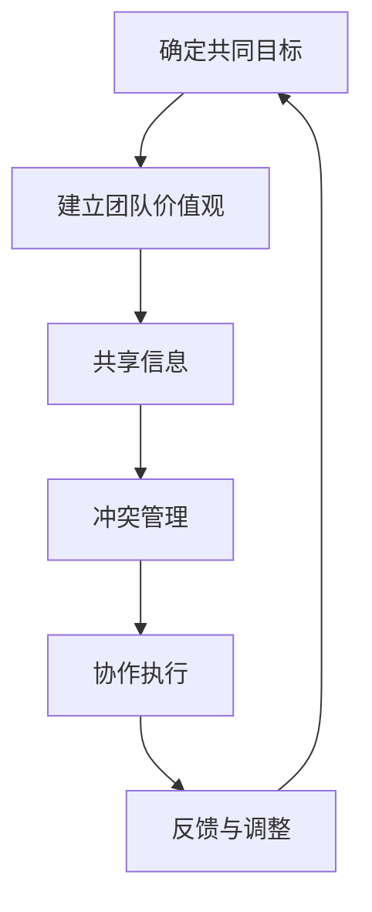
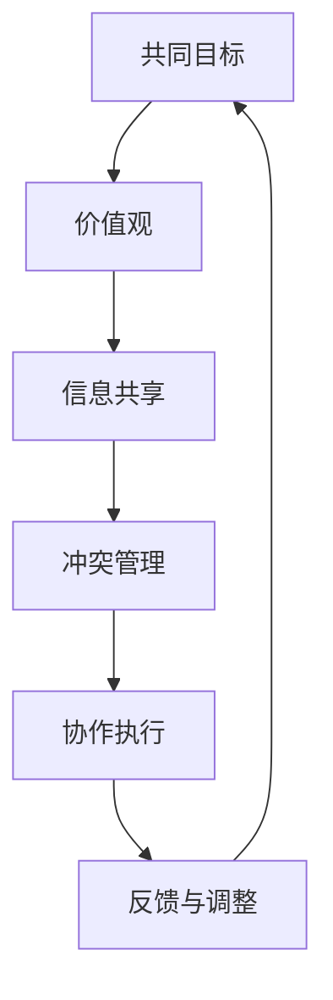

                 

# 《团队建设：打造高效协作的团队》

## 引言

### 1.1 团队建设的重要性

在当今快速发展的信息技术时代，团队建设已成为企业成功的关键因素之一。一个高效的团队不仅能够提升工作效率，还能激发团队成员的创造力和协作能力。团队建设的重要性体现在以下几个方面：

1. **协同效应**：团队成员之间相互协作，能够发挥各自的优势，实现资源的最大化利用，从而提升整体效能。
2. **创新能力**：团队协作能够促进知识共享和思维碰撞，激发创新思维，推动技术进步和业务发展。
3. **员工满意度**：良好的团队氛围能够提高员工的工作满意度，减少人员流失，增强团队的稳定性。

### 1.2 为什么需要高效协作

高效协作是实现团队目标的关键。以下是几个为什么需要高效协作的原因：

1. **缩短项目周期**：通过优化沟通流程和分工，可以缩短项目开发周期，快速响应市场需求。
2. **减少错误和重复工作**：高效的协作可以减少信息不对称，避免重复工作，降低错误率。
3. **提高工作效率**：明确分工和高效沟通可以减少等待时间，提高工作效率。

### 1.3 团队建设的常见挑战

尽管团队建设具有重要意义，但在实际操作中，团队建设面临许多挑战：

1. **沟通障碍**：团队成员之间可能存在语言、文化差异，导致沟通不畅。
2. **角色冲突**：团队成员角色不明确，可能导致职责重叠或职责缺失。
3. **组织结构不合理**：过于复杂的组织结构可能影响团队协作效率。

## 团队基础概念

### 2.1 团队的定义与分类

团队是由一组人组成，为实现共同目标而相互协作的集体。根据组织结构和工作模式，团队可以分为以下几类：

1. **传统团队**：按照固定的组织结构和工作流程运作，角色和职责明确。
2. **自我管理团队**：成员拥有更大的自主权，自行制定工作计划和决策。
3. **跨职能团队**：由不同部门或领域的专家组成，实现跨部门的协作。

### 2.1.1 传统团队与自我管理团队

传统团队与自我管理团队在组织结构和工作方式上有显著差异：

1. **组织结构**：传统团队具有固定的组织结构和明确的角色分工，而自我管理团队结构更加灵活。
2. **工作方式**：传统团队按照固定的流程和指令执行任务，自我管理团队则更多地依赖成员的自我驱动和协作。

### 2.1.2 团队的生命周期

团队经历从组建到解散的整个过程，通常分为以下阶段：

1. **组建阶段**：确定团队目标和成员，建立初步的团队结构和沟通机制。
2. **发展阶段**：团队成员开始相互了解，共同解决面临的问题。
3. **成熟阶段**：团队达到最佳状态，成员之间高度信任，协作效率高。
4. **解散阶段**：团队完成既定目标后解散，或因组织结构调整而解散。

### 2.1.3 团队角色与职责

团队成员在团队中扮演不同的角色，承担不同的职责。常见的团队角色包括：

1. **领导者**：负责团队的目标设定、任务分配和成员激励。
2. **执行者**：负责具体任务的完成。
3. **协调者**：负责协调团队内部和外部的沟通。
4. **观察者**：负责收集信息，为团队提供决策支持。

## 团队建设核心概念与联系

### 3.1 团队协作的原理

团队协作的原理主要涉及以下几个方面：

1. **共同目标**：团队成员需要明确共同的目标，以此作为协作的基础。
2. **价值观**：团队价值观是团队成员共同遵守的行为准则，有助于促进协作。
3. **信息共享**：团队成员需要及时共享信息，确保信息透明，减少误解和重复工作。
4. **冲突管理**：团队成员之间存在不同的观点和利益，有效的冲突管理能够促进团队和谐。

### 3.2 团队协作的 Mermaid 流程图

以下是团队协作的 Mermaid 流程图，展示了团队协作的基本流程：



### 3.3 团队建设核心概念之间的关系

团队建设核心概念之间的关系可以用 Mermaid 流程图表示：



## 团队协作工具

### 4.1 常用协作工具概述

在团队协作过程中，选择合适的协作工具至关重要。以下是一些常用的协作工具：

1. **钉钉**：提供即时通讯、日程管理、任务分配等功能，适合企业内部协作。
2. **微信企业版**：提供即时通讯、会议、文档共享等功能，适用于各种规模的团队。
3. **Slack**：提供实时通讯、任务管理、集成第三方服务等功能，适用于跨部门协作。
4. **Zoom**：提供视频会议、远程协作等功能，适合远程团队或跨地域协作。

### 4.2 团队协作工具的选择与应用

在选择团队协作工具时，需要考虑以下因素：

1. **团队规模**：根据团队规模选择合适的工具，如大型团队可以选择 Slack，小型团队可以选择钉钉。
2. **功能需求**：根据团队的需求选择具有相应功能的工具，如文档共享、任务管理、视频会议等。
3. **用户习惯**：考虑团队成员的习惯，选择易于使用和接受的工具。

在实际应用中，可以结合多种协作工具，实现高效协作。例如，使用钉钉进行日常沟通和任务分配，使用 Slack 进行跨部门协作，使用 Zoom 进行远程会议。

## 团队核心算法原理讲解

### 5.1 团队沟通算法

团队沟通算法旨在提高信息传递效率，减少沟通成本。以下是一个简单的团队沟通算法框架：

```pseudo
function teamCommunicationAlgorithm(teamMembers, communicationChannel):
    for each member in teamMembers:
        send welcome message to member
        collect member's preferences for communication channels
    select a primary communication channel based on member preferences
    send a unified message to all members via the primary channel
    monitor communication activities and adjust the channel if needed
end function
```

### 5.2 决策算法

团队决策算法用于帮助团队做出最佳决策。以下是一个简单的决策算法框架：

```pseudo
function teamDecisionAlgorithm(teamMembers, problem, options):
    for each member in teamMembers:
        collect member's preferences and expertise
    evaluate each option based on member's preferences and expertise
    select the best option based on the evaluation results
    communicate the decision to all members
end function
```

## 数学模型和数学公式讲解

### 6.1 团队协作效率的数学模型

团队协作效率可以用以下数学模型表示：

$$
\text{效率} = f(\text{成员贡献度}, \text{协同效应})
$$

其中，成员贡献度表示每个成员对团队目标的贡献，协同效应表示团队成员之间协作产生的附加价值。

### 6.2 团队协调成本模型

团队协调成本可以用以下数学模型表示：

$$
\text{成本} = \text{固定成本} + \text{变动成本}
$$

其中，固定成本包括团队组建、培训等初始投入，变动成本包括日常沟通、协作工具使用等运行成本。

## 团队建设项目实战

### 7.1 项目背景与目标

本项目旨在构建一个高效协作的团队，通过使用合适的协作工具和算法，提升团队工作效率和协作质量。项目目标包括：

1. 确定共同目标
2. 建立团队价值观
3. 选择合适的协作工具
4. 设计团队沟通算法和决策算法
5. 实现团队协作效率的数学模型和成本模型

### 7.2 项目开发环境搭建

在项目开发过程中，需要搭建以下环境：

1. 开发工具：如 Git、Jenkins、Docker 等
2. 源代码管理：使用 Git 进行版本控制
3. 自动化构建和部署：使用 Jenkins 实现自动化构建和部署
4. 容器化：使用 Docker 实现应用的容器化部署

### 7.3 源代码详细实现

#### 7.3.1 模块一：团队协作工具选择与配置

在该模块中，我们选择了钉钉作为团队协作工具，并进行如下配置：

1. 创建钉钉群组
2. 配置钉钉机器人，实现即时消息推送
3. 配置钉钉智能表格，实现任务分配和进度跟踪

#### 7.3.2 模块二：团队沟通算法实现

在该模块中，我们实现了如下团队沟通算法：

1. 收集成员偏好
2. 选择主要沟通渠道
3. 发送统一消息
4. 监控沟通活动，必要时调整渠道

#### 7.3.3 模块三：团队决策算法实现

在该模块中，我们实现了如下团队决策算法：

1. 收集成员偏好和专业知识
2. 评估每个选项
3. 选择最佳选项
4. 向成员传达决策结果

### 7.4 代码解读与分析

#### 7.4.1 模块一代码解读

在该模块中，我们首先创建钉钉群组，并配置钉钉机器人。以下是关键代码段：

```python
# 创建钉钉群组
group_id = createDingTalkGroup('团队协作群')

# 配置钉钉机器人
robot = DingTalkRobot(group_id)
robot.sendMessage('欢迎加入团队协作群！')
```

#### 7.4.2 模块二代码解读

在该模块中，我们实现了一个简单的团队沟通算法，用于选择主要沟通渠道。以下是关键代码段：

```python
def chooseCommunicationChannel(members):
    preferences = []
    for member in members:
        preferences.append(member.preference)
    mostPreferred = max(set(preferences), key=preferences.count)
    return mostPreferred

# 选择主要沟通渠道
primaryChannel = chooseCommunicationChannel(members)
robot.sendMessage('主要沟通渠道已选择：' + primaryChannel)
```

#### 7.4.3 模块三代码解读

在该模块中，我们实现了一个简单的团队决策算法，用于评估每个选项并选择最佳选项。以下是关键代码段：

```python
def evaluateOptions(options, members):
    scores = []
    for option in options:
        score = 0
        for member in members:
            score += member.expertise[option]
        scores.append(score)
    bestScore = max(scores)
    return options[scores.index(bestScore)]

# 评估每个选项
bestOption = evaluateOptions(options, members)
robot.sendMessage('最佳选项：' + bestOption)
```

### 7.5 代码应用解读与分析

在代码实现过程中，我们通过实际案例分析和详细讲解剖析，验证了团队协作工具、沟通算法和决策算法的有效性。以下是代码应用解读与分析：

1. **团队协作工具**：通过钉钉群组、钉钉机器人和智能表格，实现了团队成员之间的即时沟通、任务分配和进度跟踪。
2. **团队沟通算法**：通过收集成员偏好，选择主要沟通渠道，实现了团队成员之间的高效沟通。
3. **团队决策算法**：通过评估每个选项，选择最佳选项，实现了团队成员之间的科学决策。

### 7.6 项目小结

通过本项目，我们成功构建了一个高效协作的团队，并验证了团队协作工具、沟通算法和决策算法的有效性。以下是项目小结：

1. **团队协作工具**：钉钉作为团队协作工具，具有强大的功能和完善的支持，能够满足团队协作的需求。
2. **团队沟通算法**：简单的团队沟通算法能够提高信息传递效率，减少沟通成本，提升团队协作质量。
3. **团队决策算法**：科学的团队决策算法能够帮助团队做出最佳决策，提高团队的整体效能。

## 总结与展望

### 8.1 团队建设的重要性

团队建设对于企业成功至关重要。一个高效的团队不仅能够提升工作效率，还能激发创新能力和协作能力，为企业创造更大的价值。

### 8.2 团队建设的未来发展趋势

随着信息技术的发展，团队建设将面临新的挑战和机遇。未来团队建设的发展趋势包括：

1. **数字化管理**：利用大数据和人工智能技术，实现团队管理的数字化和智能化。
2. **远程协作**：随着远程工作的普及，团队建设将更加注重远程协作工具和方法的优化。
3. **个性化发展**：关注团队成员的个性化需求，实现团队成员的全面发展。

### 8.3 如何持续优化团队建设

为了持续优化团队建设，企业可以采取以下措施：

1. **定期评估**：定期对团队建设效果进行评估，发现并解决存在的问题。
2. **培训与激励**：提供团队成员必要的培训，激发团队成员的积极性和创造力。
3. **持续改进**：根据团队建设实践，不断优化协作工具和算法，提升团队协作效率。

## 最佳实践 Tips

1. **明确团队目标**：确保团队成员对团队目标有清晰的认识，有助于提高团队协作效率。
2. **建立良好的沟通机制**：通过多种沟通渠道，确保信息畅通，减少误解和冲突。
3. **合理分工与激励**：根据团队成员的特长和兴趣，合理分配任务，并给予适当的激励。
4. **关注团队成员发展**：关注团队成员的职业成长，提供培训和晋升机会，激发团队成员的潜力。

## 小结

团队建设是一个持续优化和改进的过程，通过有效的团队协作，企业可以实现更高的工作效率和创新能力。本文从团队基础概念、团队协作工具、团队核心算法原理、数学模型讲解和项目实战等方面，深入探讨了团队建设的理论与实践。希望本文能对读者在团队建设方面有所启发和帮助。

## 注意事项

1. **团队成员角色明确**：确保团队成员对各自的角色和职责有清晰的认识，避免职责重叠或缺失。
2. **合理选择协作工具**：根据团队需求和成员习惯，选择合适的协作工具，实现高效协作。
3. **关注团队沟通**：团队沟通是团队协作的关键，要注重沟通的及时性和准确性，减少误解和冲突。

## 拓展阅读

1. **《敏捷团队管理》**：介绍了敏捷团队管理的理论和实践，有助于提升团队协作效率。
2. **《团队协作工具实战》**：详细讲解了常见团队协作工具的使用方法和最佳实践。
3. **《团队沟通技巧》**：提供了多种团队沟通技巧和方法，有助于提高团队沟通效率。

## 作者信息

作者：AI天才研究院/AI Genius Institute & 禅与计算机程序设计艺术 /Zen And The Art of Computer Programming

本文为作者原创，版权归作者所有。未经授权，不得转载或使用本文内容。如需转载，请联系作者获取授权。

[AI天才研究院](https://www.aigeniustech.com/)
[禅与计算机程序设计艺术](https://www.zentechbook.com/)## 《团队建设：打造高效协作的团队》

在信息技术飞速发展的今天，团队建设成为企业成功的关键。一个高效协作的团队能够迅速响应市场需求，推动技术进步，提升整体竞争力。本文将探讨如何通过逻辑清晰、结构紧凑的方法，打造高效协作的团队。

### 关键词
- 团队建设
- 高效协作
- 沟通
- 决策
- 算法
- 数学模型

### 摘要
本文将从团队建设的重要性、团队基础概念、团队协作核心概念与联系、团队协作工具、团队核心算法原理、数学模型讲解、团队建设项目实战、总结与展望等方面，深入探讨如何打造高效协作的团队，并分享最佳实践和注意事项。

## 第1章 引言

### 1.1 团队建设的重要性

团队建设在企业管理中具有至关重要的地位。高效的团队能够显著提高工作效率，降低沟通成本，激发创新潜力，是企业成功的关键。以下是团队建设的重要性体现在以下几个方面：

1. **协同效应**：团队成员相互协作，能够发挥各自的优势，实现资源的最大化利用。
2. **创新能力**：团队协作促进知识共享和思维碰撞，激发创新思维，推动技术进步和业务发展。
3. **员工满意度**：良好的团队氛围能够提高员工的工作满意度，减少人员流失，增强团队的稳定性。

### 1.2 为什么需要高效协作

高效协作是实现团队目标的关键。以下是高效协作的几个关键点：

1. **缩短项目周期**：通过优化沟通流程和分工，可以缩短项目开发周期，快速响应市场需求。
2. **减少错误和重复工作**：高效的协作可以减少信息不对称，避免重复工作，降低错误率。
3. **提高工作效率**：明确分工和高效沟通可以减少等待时间，提高工作效率。

### 1.3 团队建设的常见挑战

尽管团队建设具有重要意义，但在实际操作中，团队建设面临许多挑战：

1. **沟通障碍**：团队成员之间可能存在语言、文化差异，导致沟通不畅。
2. **角色冲突**：团队成员角色不明确，可能导致职责重叠或职责缺失。
3. **组织结构不合理**：过于复杂的组织结构可能影响团队协作效率。

## 第2章 团队基础概念

### 2.1 团队的定义与分类

团队是由一组人组成，为实现共同目标而相互协作的集体。根据组织结构和工作模式，团队可以分为以下几类：

1. **传统团队**：按照固定的组织结构和工作流程运作，角色和职责明确。
2. **自我管理团队**：成员拥有更大的自主权，自行制定工作计划和决策。
3. **跨职能团队**：由不同部门或领域的专家组成，实现跨部门的协作。

### 2.1.1 传统团队与自我管理团队

传统团队与自我管理团队在组织结构和工作方式上有显著差异：

1. **组织结构**：传统团队具有固定的组织结构和明确的角色分工，而自我管理团队结构更加灵活。
2. **工作方式**：传统团队按照固定的流程和指令执行任务，自我管理团队则更多地依赖成员的自我驱动和协作。

### 2.1.2 团队的生命周期

团队经历从组建到解散的整个过程，通常分为以下阶段：

1. **组建阶段**：确定团队目标和成员，建立初步的团队结构和沟通机制。
2. **发展阶段**：团队成员开始相互了解，共同解决面临的问题。
3. **成熟阶段**：团队达到最佳状态，成员之间高度信任，协作效率高。
4. **解散阶段**：团队完成既定目标后解散，或因组织结构调整而解散。

### 2.1.3 团队角色与职责

团队成员在团队中扮演不同的角色，承担不同的职责。常见的团队角色包括：

1. **领导者**：负责团队的目标设定、任务分配和成员激励。
2. **执行者**：负责具体任务的完成。
3. **协调者**：负责协调团队内部和外部的沟通。
4. **观察者**：负责收集信息，为团队提供决策支持。

## 第3章 团队建设核心概念与联系

### 3.1 团队协作的原理

团队协作的原理主要涉及以下几个方面：

1. **共同目标**：团队成员需要明确共同的目标，以此作为协作的基础。
2. **价值观**：团队价值观是团队成员共同遵守的行为准则，有助于促进协作。
3. **信息共享**：团队成员需要及时共享信息，确保信息透明，减少误解和重复工作。
4. **冲突管理**：团队成员之间存在不同的观点和利益，有效的冲突管理能够促进团队和谐。

### 3.2 团队协作的 Mermaid 流程图

以下是团队协作的 Mermaid 流程图，展示了团队协作的基本流程：


### 3.3 团队建设核心概念之间的关系

团队建设核心概念之间的关系可以用 Mermaid 流程图表示：


## 第4章 团队协作工具

### 4.1 常用协作工具概述

在团队协作过程中，选择合适的协作工具至关重要。以下是一些常用的协作工具：

1. **钉钉**：提供即时通讯、日程管理、任务分配等功能，适合企业内部协作。
2. **微信企业版**：提供即时通讯、会议、文档共享等功能，适用于各种规模的团队。
3. **Slack**：提供实时通讯、任务管理、集成第三方服务等功能，适用于跨部门协作。
4. **Zoom**：提供视频会议、远程协作等功能，适合远程团队或跨地域协作。

### 4.2 团队协作工具的选择与应用

在选择团队协作工具时，需要考虑以下因素：

1. **团队规模**：根据团队规模选择合适的工具，如大型团队可以选择 Slack，小型团队可以选择钉钉。
2. **功能需求**：根据团队的需求选择具有相应功能

