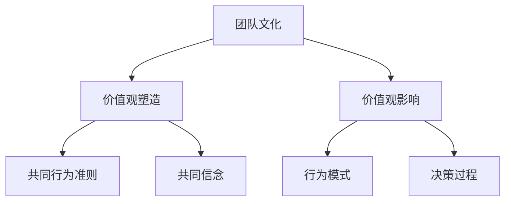
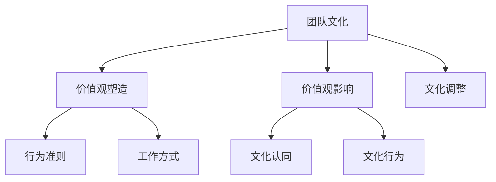

                 

### 文章标题

### 团队文化：价值观的塑造与传播

在当今快速变化的工作环境中，团队文化已经成为组织成功的关键因素之一。而团队文化的核心，便是价值观的塑造与传播。本文旨在深入探讨团队文化及其与价值观之间的紧密联系，以及如何有效地塑造和传播团队价值观，以促进团队的发展和组织的成功。

本文将分为以下几个部分进行讨论：

1. **引言与核心概念**：介绍团队文化的基本概念，阐述价值观的重要性，并探讨团队文化与价值观之间的联系。
2. **团队文化与价值观的关系**：分析团队文化对价值观的影响，以及价值观对团队文化的作用。
3. **团队价值观的塑造**：探讨塑造团队价值观的原则和方法，包括领导层的角色和团队成员的参与。
4. **价值观的传播**：讨论如何有效地在团队内部传播价值观，包括沟通策略和实践。
5. **团队价值观的实施**：分析如何将团队价值观融入到团队日常工作中，包括行为规范和工作流程。
6. **团队价值观的维护与更新**：探讨如何维护和更新团队价值观，以适应组织的变化和发展。
7. **案例分析**：提供实际案例，展示团队文化塑造与价值观传播的成功实践。
8. **结论**：总结全文，强调团队文化在组织成功中的重要性，并对未来的发展趋势进行展望。

通过这一步步的深入分析和讨论，我们希望能够为读者提供关于团队文化及其价值观塑造与传播的全面理解和实用指导。让我们开始这段思维的旅程，一同探索团队文化在组织中的关键作用。

### 文章关键词

- 团队文化
- 价值观塑造
- 价值观传播
- 组织发展
- 团队协作
- 沟通策略

### 文章摘要

本文深入探讨了团队文化的核心要素——价值观的塑造与传播。首先，我们介绍了团队文化的基本概念，阐述了其在组织中的重要性。接着，我们分析了团队文化与价值观之间的密切联系，探讨了如何通过有效的策略和方法来塑造和传播团队价值观。文章还讨论了价值观在团队日常工作中的实施与维护，以及如何适应组织变化进行更新。通过实际案例的分析，我们展示了这些原则和方法在现实环境中的应用。最终，文章总结了团队文化对组织成功的重要性，并对未来发展趋势进行了展望。希望本文能为团队管理者提供有价值的参考和指导。

## 引言与核心概念

在探讨团队文化的塑造与传播之前，我们首先需要了解团队文化的定义和基本概念。团队文化是指团队成员在长期合作过程中共同形成的价值观、行为准则、工作方式以及共同信念的总和。它不仅仅体现在团队成员之间的互动和沟通中，更渗透在团队的日常工作和决策过程中。

### 团队文化的定义

团队文化是一种共享的价值观和行为模式，它由一系列规范和传统构成，指导着团队成员如何相互协作、如何处理问题以及如何实现共同目标。团队文化的定义可以从以下几个方面进行理解：

1. **价值观**：团队文化建立在共同的价值观基础上，这些价值观指导团队成员的行为和决策。例如，一个注重创新和学习的团队可能会鼓励成员尝试新的想法，不断改进工作方法。

2. **行为准则**：团队文化通过行为准则来规范成员的行为。这些准则可以是正式的，如公司政策，也可以是非正式的，如团队内形成的默契。

3. **工作方式**：团队文化影响着团队成员的工作方式，包括工作流程、沟通方式以及团队协作的模式。

4. **共同信念**：团队文化是团队成员共同认同和遵循的信念体系，这种信念体系能够增强团队的凝聚力，促进团队成员之间的信任与合作。

### 团队文化的形成与发展

团队文化的形成是一个长期的过程，通常与组织的创建、发展和变革紧密相关。以下是团队文化形成和发展的几个关键步骤：

1. **创始阶段**：在团队成立初期，创始人或领导者会通过自己的行为和理念来塑造团队文化。他们的价值观和信念会潜移默化地影响团队成员，成为团队文化的核心。

2. **稳定阶段**：随着团队的稳定发展，共同经历的成功和挑战会进一步巩固团队文化。团队成员在长期的合作中，逐渐形成一套共同遵循的行为准则和工作方式。

3. **变革阶段**：在组织面临重大变革或外部环境发生变化时，团队文化可能会发生调整。团队成员需要适应新的挑战和机会，从而推动团队文化的发展和演变。

### 团队文化的类型

团队文化可以根据其特点进行分类，常见的类型包括：

1. **竞争型文化**：这种文化强调竞争和获胜，成员之间常常存在竞争关系。竞争型文化可以激发成员的积极性和创造力，但也可能导致团队合作精神的削弱。

2. **合作型文化**：这种文化强调团队合作和协作，成员之间互相支持，共同追求团队目标。合作型文化有助于提高团队的凝聚力和协作效率。

3. **创新型文化**：这种文化鼓励创新和尝试新方法，成员敢于冒险和接受失败。创新型文化能够推动团队不断进步，提高组织的竞争力。

4. **稳定性文化**：这种文化强调稳定和持续发展，成员重视长期规划和执行力。稳定性文化有助于保持组织的稳定性和持续性。

### 团队文化的重要性

团队文化对组织的成功具有深远的影响。以下是团队文化的重要性：

1. **提高团队凝聚力**：共同的文化价值观和行为准则能够增强团队成员之间的认同感和归属感，提高团队的凝聚力。

2. **促进团队合作**：团队文化为团队成员提供了共同的语言和沟通框架，有助于团队协作和沟通效率。

3. **提高工作效率**：团队文化规范了工作流程和行为模式，减少了无效沟通和冲突，提高了工作效率。

4. **增强组织竞争力**：强大的团队文化有助于组织在市场竞争中脱颖而出，提高组织的整体竞争力。

### 价值观的概念与类型

在讨论团队文化时，价值观是一个不可忽视的核心概念。价值观是个人或组织认为重要并值得追求的东西。在团队中，价值观是团队文化的核心，它指导着团队成员的行为和决策。

#### 价值观的概念

价值观是人们对于什么是好、什么是重要的普遍认知。它不仅仅是个人的信仰和偏好，也是组织和社会的共同价值观。在团队中，价值观是团队成员共同认同并遵循的原则，它影响着团队成员的行为和工作方式。

#### 价值观的类型

根据不同的分类标准，价值观可以分为以下几种类型：

1. **个人价值观**：个人价值观是个人在成长过程中形成的，对于个人生活和工作具有指导意义的价值观。例如，诚信、尊重、责任感等。

2. **团队价值观**：团队价值观是团队成员共同认同并遵循的价值观，它是团队文化的核心。例如，团队合作、创新、客户至上等。

3. **组织价值观**：组织价值观是组织全体成员共同遵循的价值观，它指导着组织的决策和行为。例如，社会责任、可持续发展、透明度等。

#### 团队文化与价值观的关系

团队文化和价值观之间存在着密切的联系。团队文化塑造了价值观，而价值观又影响了团队文化。

1. **团队文化对价值观的塑造**：团队文化通过共同的行为准则和价值观，塑造了团队成员的行为和思维模式。一个强大的团队文化能够促进团队成员对共同价值观的认同和遵循。

2. **价值观对团队文化的反作用**：团队成员的价值观也会影响团队文化。如果团队成员的价值观与团队文化不一致，可能会导致团队内部矛盾和冲突。

3. **相互影响与互动机制**：团队文化和价值观之间存在着动态的相互影响和互动机制。团队文化会影响成员的价值观，同时成员的价值观也会反作用于团队文化。例如，一个注重创新和学习的团队文化可能会促进成员形成创新和学习的价值观。

为了更好地理解团队文化与价值观之间的联系，我们可以使用 Mermaid 流程图来展示它们之间的关系架构：

在这个流程图中，团队文化通过共同的行为准则和信念塑造了价值观，而价值观又通过影响行为模式和决策过程反作用于团队文化。这种互动机制使得团队文化能够不断适应组织的变化和发展。

### 团队文化与价值观的关系图解

通过这张图，我们可以更直观地看到团队文化和价值观之间的相互作用和影响。团队文化通过价值观来塑造团队成员的行为和思维模式，而价值观又通过团队文化来指导团队的日常运作和发展方向。

在接下来的章节中，我们将进一步探讨团队价值观的塑造、传播和实施，以帮助团队管理者更好地理解和应用这些原则和方法，从而推动团队的发展和组织的成功。

## 团队文化与价值观的关系

团队文化不仅是组织价值观的具体体现，更是价值观在团队层面的应用和延伸。团队文化对价值观的影响是深远的，同时，价值观也在不断地塑造和影响团队文化。在这一节中，我们将详细探讨团队文化对价值观的塑造以及价值观对团队文化的影响，并分析两者之间的互动机制。

### 团队文化对价值观的塑造

团队文化对价值观的塑造主要体现在以下几个方面：

1. **共同价值观的形成**：团队文化通过共同的行为准则和信念，帮助团队成员形成共同的价值观。例如，在一个注重创新和学习的团队中，成员可能会更加重视尝试新方法和不断学习，这种价值观会逐渐成为团队文化的一部分。

2. **价值观的强化**：团队文化通过持续的沟通和互动，强化团队成员对共同价值观的认同和遵循。例如，一个强调团队合作和协作的团队，会通过团队活动和工作流程来不断强化成员的团队合作意识。

3. **行为规范的建立**：团队文化通过建立一系列行为规范，引导团队成员的行为。这些规范通常是基于团队价值观的，例如，诚信、尊重、责任感等。这些行为规范不仅规范了团队成员的行为，也塑造了团队成员的价值观。

### 价值观对团队文化的影响

价值观对团队文化的影响同样重要，主要体现在以下几个方面：

1. **文化认同的形成**：团队成员的价值观会影响他们对团队文化的认同程度。如果一个团队成员的价值观与团队文化不一致，可能会产生文化冲突，影响团队的凝聚力和合作效率。

2. **文化行为的驱动**：团队成员的价值观会驱动他们在团队中的行为。例如，一个重视创新和学习的团队成员可能会主动提出新的想法，推动团队文化的创新。

3. **文化调整的推动**：团队成员的价值观也会推动团队文化的调整和更新。在一个快速变化的环境中，团队成员可能会根据外部环境和内部需求，对团队文化进行调整，以保持团队文化的活力和适应性。

### 团队文化与价值观的互动机制

团队文化和价值观之间的互动机制是动态的，二者相互影响，相互作用。以下是一个简化的互动机制模型：

1. **价值观塑造团队文化**：团队文化通过共同价值观的形成、强化和行为规范，塑造了团队成员的行为和工作方式。

2. **价值观影响文化认同**：团队成员的价值观会影响他们对团队文化的认同程度。如果团队成员认同团队文化，他们会更加积极地参与团队工作，提高团队合作的效率。

3. **文化行为驱动价值观**：团队成员的行为受到价值观的驱动。例如，一个重视创新和学习的团队成员会在工作中表现出更多的创新行为，从而推动团队文化的创新。

4. **文化调整推动价值观更新**：团队文化会根据外部环境和内部需求进行调整，这种调整会推动团队成员的价值观更新。例如，随着外部环境的改变，一个团队可能会从竞争型文化转向合作型文化，这会要求团队成员调整他们的价值观。

### 团队文化与价值观互动机制的案例

以下是一个简单的案例，说明团队文化与价值观的互动机制：

在一个初创公司中，团队文化强调创新和快速迭代。公司创始人通过招聘具有创新精神的团队成员，并鼓励他们提出新的想法和改进措施，从而形成了以创新为核心的文化价值观。这种文化价值观不仅激励了团队成员的创新行为，也促进了团队内部的知识共享和合作。

随着时间的推移，公司面临的市场环境发生了变化，竞争对手的压力增加。为了保持竞争优势，公司决定调整其团队文化，从竞争型文化转向合作型文化。这一调整不仅要求团队成员更新他们的价值观，从竞争转向合作，还要求公司在工作流程和沟通方式上进行相应的调整，以支持这种文化的转变。

这个案例展示了团队文化与价值观之间是如何互动和相互影响的。团队文化通过塑造和强化价值观，影响团队成员的行为和工作方式。而团队成员的价值观又会驱动他们的行为，并对团队文化进行调整和更新。

通过这个案例，我们可以看到团队文化和价值观之间的紧密联系和相互作用。团队文化不仅是价值观的具体体现，也是价值观在团队层面的应用和延伸。了解和把握这种互动机制，对于团队管理者来说至关重要，它能够帮助他们在塑造和传播团队文化时，更好地理解和应用价值观的影响。

在接下来的章节中，我们将进一步探讨如何塑造团队价值观、如何传播和实施这些价值观，以及如何维护和更新团队价值观，以适应组织的变化和发展。

## 团队价值观的塑造

团队价值观的塑造是构建强大团队文化的关键步骤。通过明确的原则和方法，团队可以形成共同的价值观，从而提高团队的凝聚力和工作效率。在这一节中，我们将详细探讨塑造团队价值观的原则、方法和步骤，并讨论领导层和团队成员在这一过程中各自的角色和责任。

### 塑造团队价值观的原则

1. **明确性**：团队价值观需要清晰明确，这样团队成员才能理解和认同。价值观应该具体、明确，避免模糊和含糊不清的表述。

2. **一致性**：团队价值观需要与组织的使命、愿景和战略保持一致。这确保了团队价值观不仅仅是口号，而是真正指导团队行为的核心原则。

3. **可感知性**：团队价值观应该能够被团队成员感知和体验。这意味着价值观需要通过日常的行为和决策来体现，而不是仅仅停留在口号层面。

4. **适应性**：团队价值观需要具有一定的适应性，能够随着时间和环境的变化进行调整。这有助于团队在面对新的挑战和机遇时，保持灵活性和适应性。

5. **包容性**：团队价值观应该包容多元观点和不同背景的团队成员。这有助于建立包容性和多元化的团队文化，促进团队成员之间的合作和沟通。

### 塑造团队价值观的方法

1. **高层领导参与**：高层领导在塑造团队价值观中扮演着关键角色。他们需要通过自己的行为和决策来体现和传播团队价值观。例如，通过在关键决策中强调某些价值观，或者通过公开演讲和内部沟通来传达团队价值观的重要性。

2. **团队成员参与**：团队成员的参与是塑造团队价值观的重要环节。通过团队讨论、头脑风暴和角色扮演等活动，团队成员可以共同定义和塑造团队价值观。这种方法不仅增加了团队成员的认同感，也有助于发现和解决潜在的冲突。

3. **文化和环境建设**：团队价值观的塑造需要通过文化和环境建设来实现。例如，通过创建一个开放和包容的工作环境，鼓励团队成员分享观点和想法，从而促进价值观的传播和认同。

4. **培训和指导**：定期的培训和指导可以帮助团队成员更好地理解和遵循团队价值观。例如，通过价值观培训课程、角色扮演和案例分析，团队成员可以更深入地理解团队价值观，并在实际工作中应用这些价值观。

### 塑造团队价值观的步骤

1. **明确目标**：首先，团队需要明确团队价值观的塑造目标。这包括确定团队期望的价值观类型、范围和具体目标。

2. **调研和分析**：接下来，团队需要通过调研和分析来了解现有团队文化和价值观的现状。这可以通过问卷调查、访谈和观察等方法进行。

3. **定义价值观**：在调研和分析的基础上，团队可以共同定义一套明确的价值观。这需要团队成员的参与和讨论，确保价值观的明确性和一致性。

4. **传播和宣传**：一旦价值观被定义，团队需要通过多种渠道进行传播和宣传。例如，通过内部邮件、公告板、团队会议和培训等方式，确保每位成员都能理解和认同这些价值观。

5. **实施和监督**：在价值观被传播和认同后，团队需要将其融入到日常工作和行为中。通过定期的监督和评估，确保团队成员在实际行动中遵循这些价值观。

### 领导层的角色和责任

1. **示范作用**：领导层需要通过自己的行为来示范和践行团队价值观。只有领导层真正践行这些价值观，才能赢得团队成员的信任和尊重。

2. **沟通和引导**：领导层需要通过有效的沟通和引导，帮助团队成员理解团队价值观的重要性。例如，通过定期会议、一对一谈话和公开演讲等方式，领导层可以传递和解释团队价值观。

3. **支持和激励**：领导层需要为团队成员提供支持和激励，以鼓励他们践行团队价值观。例如，通过奖励和认可，领导层可以激励团队成员在实际行动中体现和传播团队价值观。

### 团队成员的角色和责任

1. **参与和反馈**：团队成员需要积极参与到团队价值观的塑造过程中，通过讨论和反馈，帮助团队定义和优化价值观。

2. **践行和传播**：团队成员需要在日常工作中践行和传播团队价值观。通过自身的行动，帮助其他成员理解和认同这些价值观。

3. **持续学习和改进**：团队成员需要持续学习和改进，以适应团队价值观的变化和发展。通过不断学习和实践，团队成员可以更好地理解和应用团队价值观。

通过明确的原则、科学的方法和系统的步骤，团队可以有效地塑造团队价值观。这不仅有助于建立强大的团队文化，还能提高团队的凝聚力和工作效率，为组织的长期发展奠定坚实基础。

### 价值观的传播

一旦团队价值观被明确和塑造，接下来便是如何有效地在团队内部传播这些价值观。传播价值观是一个复杂且持续的过程，需要多种策略和方法的综合应用。在这一节中，我们将详细探讨传播价值观的途径、策略和技巧，并通过具体案例来展示这些方法的实际应用。

#### 传播价值观的途径

1. **正式沟通渠道**：正式沟通渠道是传播价值观的主要途径，包括内部邮件、公告板、公司内部网站和会议等。这些渠道可以确保价值观的传播覆盖到所有团队成员，并形成正式的记录和档案。

2. **非正式沟通渠道**：非正式沟通渠道如团队讨论、社交活动和一对一谈话等，有助于加强团队成员对价值观的认同和理解。这些渠道可以促进价值观的深入传播，增强团队成员之间的互动。

3. **培训和研讨会**：定期的培训和研讨会是传播价值观的重要手段。通过专家讲座、角色扮演和案例分析，团队成员可以更深入地理解和应用价值观。

4. **领导层示范**：领导层的示范作用在价值观传播中至关重要。领导层通过自身的言行来示范价值观，能够为团队成员树立榜样，增强价值观的传播效果。

5. **文化活动和庆典**：通过文化活动和庆典，如团队建设活动、表彰大会和文化节等，可以加强团队成员对价值观的认同和参与感。这些活动不仅能够传播价值观，还能增强团队的凝聚力。

#### 传播价值观的策略

1. **一致性**：在传播价值观时，需要保持一致性和连贯性。通过统一的传播内容和方式，确保价值观在团队内部得到一致的理解和认同。

2. **个性化**：根据不同团队成员的特点和需求，制定个性化的传播策略。例如，对于新手员工，可以通过一对一的指导和培训来传播价值观；对于老员工，可以通过团队合作和案例分析来强化价值观。

3. **持续性和重复性**：价值观的传播是一个持续和重复的过程。需要通过不断的宣传和提醒，确保团队成员能够长期记忆和践行价值观。

4. **激励和认可**：通过激励和认可，如奖励、表彰和晋升等，来鼓励团队成员践行价值观。这种正向激励能够增强价值观的传播效果。

#### 传播价值观的技巧

1. **故事化**：通过故事化手段，将价值观融入到真实的生活和工作场景中。故事能够引起共鸣，增强价值观的传播效果。

2. **互动性**：通过互动性活动，如讨论会、角色扮演和模拟演练等，增强团队成员对价值观的参与感和理解。

3. **视觉化**：通过视觉化的手段，如海报、视频和动画等，使价值观更加生动和易于理解。视觉化的内容能够更好地吸引团队成员的注意力，提高传播效果。

4. **个性化沟通**：针对不同团队成员的特点和需求，采用个性化的沟通方式。例如，对于技术型员工，可以通过技术案例来解释价值观；对于销售型员工，可以通过商业案例来传播价值观。

#### 案例分析

以下是一个具体案例，展示如何通过多种策略和技巧来传播团队价值观：

**案例：一家科技公司传播创新价值观**

1. **正式沟通渠道**：公司通过内部邮件和公司内部网站，定期发布关于创新价值观的文章和案例研究，使每位员工都能了解和认同公司的创新价值观。

2. **非正式沟通渠道**：公司组织定期的团队讨论会，鼓励员工分享自己的创新想法和经验。这些讨论会在一个开放和包容的环境中举行，增加了员工之间的互动和合作。

3. **培训和研讨会**：公司定期举办创新培训和工作坊，邀请行业专家和内部资深员工分享创新经验和技巧。这些活动不仅提高了员工对创新价值观的理解，也提供了实际操作的机会。

4. **领导层示范**：公司的领导层通过自己的言行来示范创新价值观。他们积极参与创新项目的讨论和决策，并为员工提供支持和资源，以推动创新。

5. **文化活动和庆典**：公司每年举办一次创新文化节，展示员工的创新成果和故事。这个活动不仅增强了员工对创新价值观的认同，也提高了员工的参与感和自豪感。

通过这个案例，我们可以看到多种策略和技巧的综合应用如何有效地传播团队价值观。公司不仅通过正式和非正式的沟通渠道来传播创新价值观，还通过培训和领导层示范来强化这些价值观。此外，文化活动和庆典为员工提供了一个展示和创新的空间，增强了价值观的传播效果。

在传播价值观的过程中，团队需要灵活应用各种策略和技巧，根据实际情况进行调整。通过持续的努力和有效的传播，团队可以建立起强大的价值观基础，从而推动团队的发展和组织的成功。

### 团队价值观的实施

一旦团队价值观被明确和传播，下一步便是将其融入到团队日常工作中。实施团队价值观不仅是理念上的认同，更需要在实际行动中体现出来。在这一节中，我们将探讨如何将团队价值观融入到团队日常工作中，包括行为规范和工作流程的调整，以及如何通过具体项目和团队活动来实现价值观的落实。

#### 行为规范与工作流程的调整

1. **制定具体的行为规范**：团队需要将价值观具体化为可操作的行为规范。例如，如果团队价值观强调“诚信”，那么行为规范可以包括遵守公司政策和法律法规，诚实报告工作进展，以及避免任何形式的不当行为。

2. **调整工作流程**：工作流程的调整应与团队价值观相一致。例如，如果团队价值观强调“协作”，那么工作流程可以设计成更加开放和透明，鼓励团队成员之间的沟通和协作。

3. **培训与指导**：定期为团队成员提供关于价值观的培训和指导，确保他们理解和如何在工作中应用这些价值观。培训内容可以包括价值观的理论讲解、实际案例分析和角色扮演。

4. **监督与评估**：通过定期的监督和评估，确保团队成员在实际行动中遵循价值观。评估可以通过绩效评估、匿名反馈和团队内部审查等方式进行。

#### 项目中的价值观落实

1. **项目目标与价值观的结合**：在项目启动阶段，明确项目目标与团队价值观的结合点。例如，如果一个项目的目标包括创新，那么可以结合团队价值观中的“创新”元素，鼓励团队成员在项目中尝试新方法和创新思维。

2. **项目计划中的价值观体现**：在项目计划中，将价值观融入到具体的任务和时间表中。例如，可以通过设置里程碑、阶段性评估和反思环节，确保团队成员在整个项目过程中都能践行价值观。

3. **项目过程中的沟通与协作**：在项目执行过程中，通过定期的团队会议、工作汇报和反馈机制，确保团队成员之间的沟通和协作。例如，可以定期举行“价值观分享会”，让团队成员分享他们在项目中的经验和感悟。

4. **项目结果与价值观的评估**：在项目结束后，对项目结果进行评估，不仅考虑项目目标的完成情况，还要评估价值观的落实情况。例如，可以通过问卷调查、团队讨论和案例分析，评估团队成员在项目中对价值观的践行程度。

#### 团队活动的价值观落实

1. **团队建设活动**：通过定期的团队建设活动，如团建培训、拓展训练和文化节等，增强团队成员对价值观的认同和实践。这些活动不仅能够提升团队的凝聚力，还能通过实际体验，让团队成员更深刻地理解价值观的重要性。

2. **团队文化日活动**：设立团队文化日，专门用于讨论和践行价值观。在这一天，团队成员可以分享自己在工作中的价值观实践，讨论遇到的问题和挑战，以及如何更好地落实价值观。

3. **价值观激励机制**：通过激励机制，如奖励和表彰，鼓励团队成员在工作和团队活动中践行价值观。例如，可以设立“价值观之星”奖项，每月评选出在价值观践行方面表现突出的团队成员。

4. **价值观复盘会议**：在每次重要项目或活动结束后，举行价值观复盘会议。团队成员可以共同回顾和总结在项目或活动中的价值观实践情况，识别问题并提出改进措施。

#### 实践案例

以下是一个具体案例，展示如何通过具体项目和团队活动来落实团队价值观：

**案例：一家科技公司通过项目实施和团队活动落实团队价值观**

1. **项目实施**：
   - 项目目标：开发一款具有创新功能的产品。
   - 行为规范：鼓励团队成员在项目中积极提出新想法，遵守项目规范，确保产品功能创新。
   - 项目流程：设立阶段性目标和评估机制，定期召开团队会议，确保团队成员之间的沟通和协作。

2. **团队活动**：
   - 团队建设活动：组织创新思维培训和工作坊，提升团队成员的创新能力和思维模式。
   - 团队文化日活动：设立每月一次的团队文化日，让团队成员分享创新想法和项目经验，讨论如何更好地践行团队价值观。
   - 价值观激励机制：设立“创新之星”奖项，每月评选出在项目创新方面表现突出的团队成员。

通过这个案例，我们可以看到团队如何通过项目和团队活动来落实团队价值观。通过明确的项目目标和行为规范，以及定期的团队活动和激励机制，团队成员能够更深刻地理解和践行团队价值观，从而推动团队的发展和组织的成功。

### 团队价值观的维护与更新

团队价值观的维护和更新是确保团队文化持续健康发展的重要环节。随着时间的推移，外部环境的变化和内部需求的变化，团队价值观也需要进行相应的调整和更新，以保持其相关性和有效性。在这一节中，我们将探讨如何维护和更新团队价值观，以及如何适应组织的变化和发展。

#### 维护团队价值观的策略

1. **持续沟通**：定期与团队成员进行沟通，了解他们对团队价值观的看法和反馈。通过开放式对话，发现价值观实施中的问题和挑战，以及团队成员对价值观的认同度和适应性。

2. **监督和评估**：建立监督和评估机制，定期对团队价值观的实施情况进行检查和评估。通过绩效评估、员工反馈和团队内部审查等方式，确保价值观在实际行动中得到贯彻。

3. **培训和教育**：定期为团队成员提供价值观的培训和教育，帮助团队成员加深对价值观的理解和认同。通过案例分析和实践演练，提升团队成员在日常工作中的应用能力。

4. **文化宣传**：通过多种渠道进行价值观宣传，确保团队成员对价值观保持高度的意识和认同。例如，通过内部邮件、公告板、培训课程和团队活动等，持续强化价值观。

#### 更新团队价值观的方法

1. **适应性调整**：根据外部环境的变化和内部需求，对团队价值观进行适应性调整。例如，如果市场环境发生变化，团队可能需要更加重视创新和快速响应，相应地调整团队价值观。

2. **反馈机制**：建立有效的反馈机制，收集团队成员对团队价值观的意见和建议。通过定期的问卷调查、团队讨论和一对一访谈等方式，了解团队成员对价值观的满意度和适应性。

3. **核心价值观保留**：在更新团队价值观时，保留核心价值观，确保团队文化的连续性和稳定性。例如，即使团队价值观需要调整，一些基础价值观如诚信、责任和尊重等仍然需要保持不变。

4. **领导层引导**：领导层在价值观更新过程中起到关键作用。他们需要通过自己的言行示范，引导团队成员参与价值观的更新过程，并确保更新后的价值观得到有效实施。

#### 适应组织变化

1. **外部环境分析**：定期分析外部环境的变化，如市场趋势、技术进步和法律法规等，评估这些变化对团队价值观的影响。

2. **内部需求调研**：通过内部调研，了解团队成员对团队价值观的需求和期望，以及团队在实现目标过程中遇到的挑战。

3. **灵活性和适应性**：团队价值观需要具有一定的灵活性和适应性，能够迅速响应外部环境和内部需求的变化。例如，通过设置灵活的价值观框架和模块，团队可以在需要时快速调整价值观。

4. **持续改进**：建立持续改进机制，不断对团队价值观进行评估和优化。通过定期反馈和持续改进，确保团队价值观能够适应组织的变化和发展。

#### 案例分析

以下是一个具体案例，展示如何维护和更新团队价值观，以适应组织的变化和发展：

**案例：一家互联网公司维护和更新团队价值观**

1. **维护阶段**：
   - 持续沟通：公司定期召开团队会议，与团队成员讨论团队价值观的实施情况，收集反馈和改进建议。
   - 监督和评估：通过季度评估和年度考核，监督团队成员对团队价值观的践行情况，确保价值观得到有效实施。
   - 培训和教育：公司组织定期的价值观培训课程，帮助团队成员加深对价值观的理解和认同。

2. **更新阶段**：
   - 适应性调整：随着市场环境的不断变化，公司对团队价值观进行了适应性调整。例如，增加了“快速响应”和“持续创新”的价值观，以应对市场的快速变化。
   - 反馈机制：公司通过内部问卷调查和团队讨论，收集团队成员对团队价值观的意见和建议，评估价值观的适应性和有效性。
   - 领导层引导：公司领导层积极参与价值观更新过程，通过示范和引导，确保更新后的价值观得到有效实施。

通过这个案例，我们可以看到公司如何在维护和更新团队价值观方面进行有效操作。通过持续沟通、监督和评估，公司确保了团队价值观在维护阶段的有效实施。在更新阶段，公司通过适应性调整和反馈机制，确保了价值观能够适应组织的变化和发展。

### 结论

维护和更新团队价值观是确保团队文化持续健康发展的重要措施。通过持续沟通、监督和评估，以及适应性调整和反馈机制，团队可以确保价值观的有效实施。同时，领导层的示范作用和团队成员的积极参与也是维护和更新团队价值观的关键。在不断变化的环境中，团队需要保持灵活性和适应性，以确保价值观能够持续指导团队行为和工作方式。

### 案例分析

为了更好地理解团队文化塑造与价值观传播在实际环境中的应用，我们将通过三个具体案例来分析这些原则和方法。这些案例将展示在不同类型的组织中，如何通过有效的团队文化塑造和价值观传播，实现团队发展和组织成功。

#### 案例一：成功塑造与传播价值观的团队

**案例来源**：谷歌（Google）

**背景介绍**：
谷歌以其开放、创新和员工优先的企业文化著称。这种文化由创始人拉里·佩奇和谢尔盖·布林共同塑造，并贯穿于公司的核心价值观中，如“不作恶”（Don’t Be Evil）和“快速学习，快速适应”（Fast Iteration）。

**团队文化塑造**：
1. **创始人示范**：佩奇和布林通过自己的行为和决策，展现了他们对公司价值观的坚守和践行。
2. **员工参与**：谷歌鼓励员工参与公司的价值观塑造过程，例如，员工可以提交对公司文化改进的建议。
3. **培训和宣传**：公司定期举办培训课程和文化活动，如谷歌年会，通过故事化手段和互动体验，强化员工对价值观的认同。

**价值观传播**：
1. **沟通渠道**：通过内部邮件、公告板和谷歌内部社交平台，公司持续传播核心价值观。
2. **文化标识**：公司办公环境设计体现出核心价值观，如开放的工作空间和鼓励创新的设施。
3. **激励措施**：公司通过绩效奖励和晋升机制，激励员工践行核心价值观。

**结果**：
谷歌通过有效的团队文化塑造和价值观传播，建立了强大的组织文化。这种文化不仅提升了员工的满意度和忠诚度，还促进了公司的创新和持续发展。

#### 案例二：遇到挑战的价值观塑造与传播

**案例来源**：福特汽车公司（Ford Motor Company）

**背景介绍**：
福特汽车公司在过去几十年中面临着巨大的转型压力，特别是在面对电动汽车市场的竞争中。为了应对这些挑战，公司决定重新审视和塑造其团队文化，以适应新的市场环境。

**团队文化塑造**：
1. **顶层设计**：公司领导层意识到文化变革的必要性，通过制定新的企业文化目标和战略，为团队文化塑造提供方向。
2. **员工沟通**：公司通过全员大会和内部会议，与员工沟通文化变革的必要性和目标，争取员工的理解和支持。
3. **培训与辅导**：公司提供了大量的培训课程，帮助员工适应新的工作方式和价值观。

**价值观传播**：
1. **多重渠道**：通过内部邮件、企业内刊、在线培训和团队会议等多种渠道，公司传播新的价值观。
2. **领导示范**：公司领导层通过实际行动，成为价值观传播的榜样。
3. **文化建设**：公司通过创建新的文化和活动，如员工创新挑战赛，鼓励员工积极参与文化变革。

**结果**：
尽管面临诸多挑战，福特汽车公司通过坚定的文化变革和价值观传播，逐渐实现了文化转型。这一过程虽然充满困难，但最终帮助公司适应了新的市场环境，提升了竞争力。

#### 案例三：适应变化的价值观更新与维护

**案例来源**：特斯拉（Tesla）

**背景介绍**：
特斯拉是一家以电动汽车和清洁能源技术为核心的企业。随着公司规模的不断扩大和市场环境的快速变化，特斯拉需要不断更新和调整其团队价值观，以保持企业的活力和竞争力。

**团队文化塑造**：
1. **灵活应变**：特斯拉的团队文化强调快速适应和灵活应变。公司鼓励员工不断学习和尝试新方法。
2. **员工参与**：特斯拉通过定期的员工会议和反馈机制，让员工参与到公司价值观的更新过程中。
3. **持续改进**：公司建立了持续改进机制，通过定期的文化评估和反馈，确保价值观能够适应公司的发展。

**价值观传播**：
1. **互动培训**：特斯拉通过互动式培训和文化日活动，强化员工对价值观的理解和认同。
2. **领导层引导**：公司领导层通过公开演讲和内部沟通，引导员工践行和传播价值观。
3. **文化展示**：特斯拉在其官方网站和社交媒体上展示公司文化和价值观，提高外部对公司文化的认知。

**结果**：
特斯拉通过不断的价值观更新与维护，成功保持了企业的创新和竞争力。这种灵活的文化和价值观体系帮助公司快速适应市场变化，持续推动公司发展。

### 总结

通过上述三个案例，我们可以看到团队文化塑造与价值观传播在不同类型和组织中的成功实践。有效的团队文化塑造和价值观传播不仅能够提升团队凝聚力和工作效率，还能为组织的长期发展提供坚实基础。在快速变化的环境中，团队需要灵活适应并持续更新其价值观，以保持活力和竞争力。未来，随着技术的进步和市场的变化，团队文化塑造与价值观传播将继续成为组织成功的关键因素。

## 结论

通过本文的探讨，我们深入了解了团队文化的核心要素——价值观的塑造与传播。团队文化不仅是团队成员共同遵循的行为准则和价值观体系，更是组织成功的重要保障。本文首先介绍了团队文化的定义、形成与发展，以及其与价值观之间的密切联系。接着，我们分析了团队文化对价值观的塑造以及价值观对团队文化的影响，并通过 Mermaid 流程图展示了二者之间的互动机制。

在团队价值观的塑造过程中，我们探讨了明确性、一致性、可感知性和适应性等原则，以及高层领导参与、团队成员参与、文化和环境建设、培训和指导等具体方法。传播价值观则通过正式和非正式沟通渠道、培训和研讨会、领导层示范和文化活动等多种途径来实现。在实施团队价值观时，我们强调了行为规范和工作流程的调整、项目中的价值观落实以及团队活动的价值观落实。

为了确保团队文化的持续健康发展，我们提出了维护和更新团队价值观的策略，包括持续沟通、监督和评估、培训和教育以及文化宣传等。同时，我们通过实际案例展示了团队文化塑造与价值观传播在不同类型组织中的成功实践。

展望未来，随着全球化、数字化和人工智能等趋势的不断发展，团队文化将面临更多挑战和机遇。团队管理者需要不断适应这些变化，灵活调整团队文化和价值观，以确保团队能够在快速变化的环境中保持竞争力和活力。我们期待未来能有更多的研究和实践，进一步探索团队文化及其价值观的塑造与传播之道。

## 附录

### 最佳实践 Tips

1. **明确核心价值观**：确保团队核心价值观简单、明确且易于理解，有助于团队成员快速认同和践行。
2. **强化领导层示范作用**：领导层通过言行一致，成为价值观的践行者和传播者。
3. **建立有效的沟通机制**：通过多种渠道和方式，确保价值观的传播覆盖到每位团队成员。
4. **持续培训和教育**：定期开展培训活动，帮助团队成员深化对价值观的理解和认同。
5. **灵活调整价值观**：根据外部环境和内部需求的变化，及时调整和更新团队价值观，保持其相关性和适应性。

### 小结

团队文化的塑造与价值观的传播是构建高效团队和实现组织成功的关键。通过明确的原则、科学的方法和系统的步骤，团队可以形成共同的价值观，并将其融入到日常工作和行为中。有效的价值观传播和实施不仅能够提高团队凝聚力和工作效率，还能促进组织的长期发展。

### 注意事项

1. **避免空洞口号**：价值观应该具体、明确，避免成为空洞的口号。
2. **尊重多样性**：在塑造和传播价值观时，要尊重团队成员的多样性和差异，确保价值观的包容性。
3. **持续监督和反馈**：建立有效的监督和反馈机制，确保价值观在实际行动中得到贯彻和落实。
4. **灵活应对变化**：随着外部环境和内部需求的变化，及时调整和更新价值观，以保持其相关性和适应性。

### 拓展阅读

1. **《五项管理：塑造高绩效团队的五大法则》** - 彼得·德鲁克
2. **《团队协作的力量》** - 汤姆·彼得斯
3. **《企业文化：成功企业的心脏》** - 罗伯特·海特
4. **《变革之舞：驱动企业成功的团队协作》** - 帕特里克·莱西尼和史蒂夫·贝尼尼

通过这些扩展阅读，您可以进一步深入了解团队文化和价值观塑造与传播的深层理论和实践应用。

