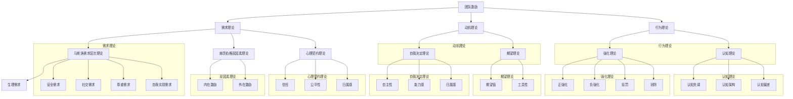

                 

### 背景介绍

在当今快速变化且竞争激烈的技术和商业环境中，团队的效能和动力成为了企业成功的关键因素。而团队激励作为提升团队绩效的重要手段，日益受到重视。团队激励不仅仅是对团队成员的物质奖励，更重要的是激发其内在动力，使其主动投入工作，发挥最大潜力。

从心理学角度看，人类行为很大程度上受到动机的驱动。激励理论的发展为我们理解如何激发个体和团队内在动力提供了重要的理论依据。马斯洛的需求层次理论、赫茨伯格的双因素理论以及心理契约理论等，都为我们揭示了人类需求和行为背后的深层次原因。了解这些理论，有助于我们在实践中更有效地进行团队激励。

然而，团队激励并不是一成不变的。不同的团队、不同的工作环境、不同的任务，需要采取不同的激励策略。例如，在高压环境下，传统的激励方法可能无法有效发挥作用，而在创新环境中，激发团队成员的创造力和自主性则成为关键。因此，掌握多种情境下的团队激励策略，对于管理者来说至关重要。

本文旨在系统地探讨团队激励的各个方面，从理论基础到实际操作，从核心概念到实战案例，全方位解析如何激发团队成员的内在动力。希望通过本文的探讨，能够为读者提供一套实用、系统的团队激励方案，帮助他们在各自的管理实践中取得更好的成果。

---

### 核心概念与联系：理论基础架构

为了更好地理解团队激励的理论基础，我们需要梳理几个关键概念及其相互关系。这里我们将使用Mermaid流程图来展示这些概念之间的联系，以便更直观地理解其内在逻辑。



以上流程图展示了团队激励理论中的核心概念及其相互关系：

1. **需求理论（B）**：包括马斯洛的需求层次理论（E）、赫茨伯格的双因素理论（F）和心理契约理论（G）。这些理论为我们理解个体和团队的需求提供了基础。

2. **动机理论（C）**：包括自我决定理论（H）和期望理论（I）。自我决定理论强调自主性、能力感和归属感（V、W、X），而期望理论则关注期望值（Y）和工具性（Z）。

3. **行为理论（D）**：包括强化理论（J）和认知理论（K）。强化理论通过正强化、负强化、惩罚和消除来影响行为（AA、BB、CC、DD），而认知理论则探讨认知失调、认知架构和认知偏差（LL、MM、NN）。

4. **双因素理论（F）**：将激励分为内在激励（Q）和外在激励（R），这对理解如何有效激励团队成员至关重要。

5. **心理契约理论（G）**：强调信任（S）、公平性（T）和归属感（U），这些因素对于建立团队的凝聚力和忠诚度至关重要。

通过这个流程图，我们可以更清晰地看到不同理论之间的相互关系，以及它们如何共同作用于团队激励。这为我们在实践中应用这些理论提供了有力的指导。

---

### 马斯洛需求层次理论：人的基本需求

马斯洛的需求层次理论是心理学领域中最具影响力的理论之一，由亚伯拉罕·马斯洛在1943年提出。该理论将人的需求分为五个层次，从最基本到最高级，分别是生理需求、安全需求、社交需求、尊重需求和自我实现需求。

1. **生理需求（Physiological Needs）**：这是人的最基本需求，包括食物、水、空气、睡眠、庇护等。生理需求的满足是人的生存基础，没有这些基本需求，人类就无法生存。

   - **伪代码**：```pseudo
   function meetPhysiologicalNeeds() {
       eatFood();
       drinkWater();
       breatheAir();
       sleep();
       seekShelter();
   }
   ```

2. **安全需求（Safety Needs）**：在生理需求得到满足之后，人们开始寻求安全感，包括避免危险、威胁和不确定性，以及获得稳定的工作、家庭和社会环境。

   - **伪代码**：```pseudo
   function ensureSafety() {
       wearProperClothing();
       installSecuritySystems();
       participateInEmergencyPreparedness();
       secureJobAndFinancialStability();
   }
   ```

3. **社交需求（Social Needs）**：随着安全需求的满足，人们开始寻求社交和归属感，包括友情、爱情、家庭和团体的支持。社交需求是人的社会性特质的一部分，对个体的情感健康至关重要。

   - **伪代码**：```pseudo
   function satisfySocialNeeds() {
       maintainFriendships();
       form Romantic Relationships();
       engageInFamilyActivities();
       participateInCommunityEvents();
   }
   ```

4. **尊重需求（Esteem Needs）**：在满足前三个层次的需求后，人们开始寻求自尊和尊重，包括自我尊重、信心、成就、地位和认可。尊重需求与个体的自我价值感和社会地位密切相关。

   - **伪代码**：```pseudo
   function achieveEsteemNeeds() {
       setPersonalGoals();
       pursueCareerAdvancements();
       receivePositiveFeedback();
       earnAcademicCredentials();
   }
   ```

5. **自我实现需求（Self-Actualization Needs）**：这是马斯洛需求层次中的最高层次，指的是个体实现自己的潜能和追求个人成长的过程。自我实现需求涉及创造性、自主性、问题解决和自我超越。

   - **伪代码**：```pseudo
   function pursueSelfActualization() {
       engageInCreativeActivities();
       takeRisksAndChallenges();
       continuouslyLearnAndGrow();
       contributeToSociety();
   }
   ```

**数学模型和公式：**

我们可以使用数学模型来表示马斯洛需求层次理论，每个层次的需求可以表示为一个权重函数，权重取决于个体的需求满足程度。

$$
\text{Total Satisfaction} = w_1 \cdot \text{Physiological Satisfaction} + w_2 \cdot \text{Safety Satisfaction} + w_3 \cdot \text{Social Satisfaction} + w_4 \cdot \text{Esteem Satisfaction} + w_5 \cdot \text{Self-Actualization Satisfaction}
$$

其中，$w_1, w_2, w_3, w_4, w_5$ 分别是各个需求的权重，取值范围为 $0$ 到 $1$。

**举例说明：**

假设一个个体在各个需求层次上的满足程度如下：

- 生理需求：80%
- 安全需求：90%
- 社交需求：70%
- 尊重需求：75%
- 自我实现需求：85%

我们可以计算其总满意度：

$$
\text{Total Satisfaction} = 0.2 \cdot 0.8 + 0.2 \cdot 0.9 + 0.2 \cdot 0.7 + 0.2 \cdot 0.75 + 0.2 \cdot 0.85 = 0.74
$$

这意味着这个个体的总满意度为74%。

通过马斯洛需求层次理论，我们可以更好地理解个体在不同情境下的需求变化，从而为团队激励提供有力的理论支持。了解这些基本需求及其满足程度，有助于管理者更好地识别和满足团队成员的需求，从而激发其内在动力。

---

### 赫茨伯格的双因素理论：激励与保健因素

赫茨伯格的双因素理论是由弗雷德里克·赫茨伯格在1959年提出的，它解释了影响员工满意度的两种不同类型的因素：激励因素和保健因素。这个理论强调了工作环境中的不同因素如何分别影响员工的满意度和不满度。

1. **激励因素（Motivators）**：这些因素与工作本身的内容和性质相关，能够激励员工产生积极的工作态度和成就感。激励因素包括以下几种：
   - **成就**：员工希望能够在工作中取得成就，实现目标。
   - **认可**：员工希望得到上司和同事的认可和赞扬。
   - **责任感**：员工希望在工作中承担有意义和有挑战性的任务。
   - **个人成长**：员工希望在工作中得到个人技能和知识的提升。

   **伪代码**：```pseudo
   function motivators() {
       achieveGoals();
       receiveAcknowledgement();
       takeResponsibility();
       growPersonally();
   }
   ```

2. **保健因素（Hygiene Factors）**：这些因素与工作环境和工作条件相关，虽然它们不能直接激励员工，但它们的缺乏会导致员工的不满。保健因素包括以下几种：
   - **薪酬**：员工希望得到公平和合理的薪酬。
   - **工作条件**：员工希望工作环境舒适、安全。
   - **人际关系**：员工希望与同事和管理层保持良好的关系。
   - **工作稳定性**：员工希望工作有保障，不担心失业。
   - **公司政策**：员工希望公司有明确和公正的政策。

   **伪代码**：```pseudo
   function hygieneFactors() {
       ensureFairCompensation();
       maintainComfortableWorkConditions();
       buildPositiveWorkRelationships();
       secureJobStability();
       adhereToCompanyPolicies();
   }
   ```

**数学模型和公式：**

赫茨伯格的双因素理论可以通过一个简单的数学模型来表示，即员工的总满意度（Total Satisfaction）是激励因素得分和保健因素得分的函数。

$$
\text{Total Satisfaction} = \text{Motivators Score} - \text{Hygiene Factors Score}
$$

其中，`Motivators Score` 和 `Hygiene Factors Score` 分别是激励因素和保健因素的得分，得分范围从0到100。

**举例说明：**

假设一个员工在激励因素和保健因素上的得分如下：

- 激励因素得分：85分
- 保健因素得分：60分

那么，这个员工的总满意度可以计算为：

$$
\text{Total Satisfaction} = 85 - 60 = 25
$$

这意味着这个员工的总满意度为25分。

通过赫茨伯格的双因素理论，管理者可以更好地理解如何通过改善激励因素和保健因素来提升员工的满意度。激励因素能够直接提高员工的工作动力和成就感，而保健因素的改善则能够减少员工的不满情绪。了解这些因素及其相互关系，有助于管理者制定更有效的激励策略。

---

### 心理契约理论：信任、公平性和归属感

心理契约理论是由美国管理学家劳伦斯·S·普洛斯（Lawrence S. Plosser）在1960年代提出的，它描述了员工与雇主之间的隐性协议，即双方对于彼此责任和义务的期望和认知。心理契约不仅涉及物质报酬，更重要的是情感和信任的交流。这个理论强调了信任、公平性和归属感在团队激励中的关键作用。

1. **信任（Trust）**：信任是心理契约的核心要素之一，它指的是员工对雇主和管理层的信任感。信任能够促进团队成员之间的协作和开放沟通，减少误解和冲突。

   **例子**：在一个团队中，如果员工信任他们的领导，他们会更愿意分享自己的想法和建议，从而提高团队的创造力和问题解决能力。

   **数学模型**：信任可以用一个简单的指标来衡量，即信任度（Trust Level），它可以通过团队成员之间的互动频率和透明度来计算。

   $$ 
   \text{Trust Level} = \frac{\text{Positive Interactions}}{\text{Total Interactions}}
   $$

   其中，Positive Interactions 是积极的互动次数，Total Interactions 是总的互动次数。

2. **公平性（Fairness）**：公平性是心理契约中的另一个重要因素，它指的是员工感受到的待遇是否公平合理。公平性包括薪酬公平、晋升机会公平和资源分配公平。

   **例子**：如果一个团队中的员工认为他们的努力和贡献得到了公正的回报，他们更有可能感到满意并愿意继续努力工作。

   **数学模型**：公平性可以通过员工对薪酬和晋升的满意度指标来衡量，即满意度评分（Fairness Score）。

   $$ 
   \text{Fairness Score} = \frac{\text{Satisfied Employees}}{\text{Total Employees}}
   $$

   其中，Satisfied Employees 是对薪酬和晋升满意的员工数量，Total Employees 是团队的总人数。

3. **归属感（Belongingness）**：归属感是员工对团队和组织的认同感，它使得员工感受到自己是一个重要的一部分，并愿意为团队和组织的目标而努力。

   **例子**：在一个有很强归属感的团队中，员工会感到自己被尊重和重视，这会增强他们的工作动机和忠诚度。

   **数学模型**：归属感可以通过团队成员之间的互动频率和共同目标的实现程度来衡量，即团队凝聚力指标（Team Cohesion Index）。

   $$ 
   \text{Team Cohesion Index} = \frac{\text{Common Goals Achieved}}{\text{Total Goals Attempted}}
   $$

通过上述数学模型，我们可以更量化地理解信任、公平性和归属感在心理契约中的作用。管理者可以通过提高这些因素的水平来增强团队的凝聚力，激发员工的内在动力。

---

### 激发团队成员内在动力的方法

要有效地激发团队成员的内在动力，我们需要从多个角度入手，包括了解团队成员的需求、利用心理契约、培养自我激励能力以及通过反馈与认可来实现。以下将详细探讨这些方法的具体实践和案例。

1. **了解团队成员的需求**

   了解团队成员的需求是激发内在动力的第一步。每个团队成员都有自己的个性、价值观和工作目标，因此，他们的需求也是多样化的。

   **案例分析**：
   某科技公司通过对员工进行定期的问卷调查，发现部分员工对职业发展的关注度高，希望有更多的培训和学习机会；而另一部分员工则更看重工作与生活的平衡，希望工作时间和工作强度能够更加灵活。基于这些发现，公司制定了个性化的激励方案，为职业发展需求的员工提供了内部培训计划，为追求工作生活平衡的员工设置了弹性工作时间制度。

   **具体实践**：
   - **个体需求分析**：定期进行问卷调查或一对一访谈，收集团队成员的反馈，了解他们的具体需求。
   - **团队需求分析**：通过团队讨论或小组会议，识别团队整体的共同需求，确保激励方案能够覆盖大多数成员。

2. **利用心理契约增强团队凝聚力**

   心理契约是员工与雇主之间的隐性协议，它涉及到信任、公平性和归属感。建立和维护良好的心理契约，能够增强员工的归属感和忠诚度。

   **案例分析**：
   在某互联网公司，管理层通过开放透明的沟通机制，建立了一个基于信任和公平性的心理契约。公司定期召开员工大会，让员工直接参与决策过程，并对公司的发展方向和战略进行讨论。这种做法不仅增强了员工的归属感，还提高了员工对公司的信任度。

   **具体实践**：
   - **建立信任**：通过开放沟通和透明决策，增强员工对管理层的信任。
   - **确保公平性**：制定公正的薪酬和晋升制度，确保每个员工都能感受到公平待遇。
   - **强化归属感**：通过团队活动、培训和文化建设，增强员工对团队的认同感和归属感。

3. **培养团队成员的自我激励能力**

   自我激励是团队成员内在动力的关键。通过培养自我激励能力，可以帮助员工在面对挑战时保持积极和主动。

   **案例分析**：
   某创新科技公司通过设立内部挑战项目，鼓励员工自主提出创新方案。公司为这些项目提供必要的资源和支持，同时给予参与员工自主决策的权利。这种方法不仅激发了员工的创造力，还培养了他们的自我激励能力。

   **具体实践**：
   - **设定明确目标**：帮助员工设定短期和长期目标，明确努力方向。
   - **提供自主权**：给予员工自主决策和执行任务的权力，增强他们的责任感和主动性。
   - **培养自信心**：通过正向反馈和认可，增强员工的自信心和自我激励意识。

4. **通过反馈与认可激发内在动力**

   正确的反馈和认可能够增强员工的内在动力，使其在未来的工作中更加积极和投入。

   **案例分析**：
   在某金融公司，管理层通过定期绩效评估和即时反馈，及时识别员工的表现和进步。同时，公司还设立了“优秀员工奖”，对在特定项目中表现突出的员工进行表彰和奖励。这种方法有效地激发了员工的工作热情和内在动力。

   **具体实践**：
   - **定期绩效评估**：通过定期的绩效评估，帮助员工识别优点和改进点，制定个人发展计划。
   - **即时反馈**：在日常工作过程中，及时给予员工反馈，让他们了解自己的表现和改进方向。
   - **正面认可**：设立多种形式的奖励和表彰机制，对表现出色的员工进行公开表彰和奖励。

通过上述方法，我们可以有效地激发团队成员的内在动力，使其在追求个人成长和团队目标的过程中保持积极和主动。了解和满足团队成员的需求、建立良好的心理契约、培养自我激励能力以及提供及时的反馈和认可，都是实现这一目标的关键步骤。

---

### 高压环境下的团队激励策略

在高压环境下，如紧急项目交付、市场竞争加剧或重大危机处理等情境下，团队的绩效和动力往往面临严峻考验。此时，传统的激励方法可能不再适用，需要采取更具有针对性的策略来维持团队的稳定和高效。以下将探讨高压环境下的团队激励策略。

1. **明确目标与任务**

   在高压环境下，首先需要明确团队的目标和任务，确保每个成员都清楚了解任务的紧急性和重要性。通过明确的目标设定，可以增强团队的紧迫感，使其在高压环境下保持专注和高效。

   **具体实践**：
   - **目标可视化**：将目标用图表或具体数据形式展示，让团队成员随时可见。
   - **定期回顾**：定期召开会议，回顾任务的进展情况，确保团队成员了解当前的工作重点。

2. **增强团队凝聚力**

   高压环境下，团队成员之间的信任和协作至关重要。增强团队凝聚力，可以提高团队的协作效率，减少内部摩擦。

   **具体实践**：
   - **团队建设活动**：在任务开始前，组织团队建设活动，加强成员之间的相互了解和信任。
   - **共同目标**：确保所有团队成员都认同并致力于实现共同目标，减少个人利益冲突。

3. **灵活的工作安排**

   在高压环境下，需要根据实际情况灵活调整工作安排，确保团队成员能够有效应对压力。

   **具体实践**：
   - **弹性工作时间**：允许团队成员根据自身情况灵活安排工作时间，以减轻压力。
   - **轮岗机制**：通过轮岗机制，让团队成员在不同岗位上获得经验，提高整体应对能力。

4. **及时反馈与支持**

   高压环境下，及时反馈和有效支持是维持团队动力的重要手段。通过及时反馈，团队成员可以及时了解自己的工作表现，调整策略。同时，管理层应提供必要的资源和支持，帮助团队成员克服困难。

   **具体实践**：
   - **即时沟通**：建立即时沟通渠道，如在线聊天工具或电话会议，确保团队成员可以随时交流。
   - **心理支持**：为团队成员提供心理咨询或压力管理培训，帮助他们应对高压环境。

5. **激励机制调整**

   高压环境下，传统的激励机制可能不再有效。因此，需要根据实际情况调整激励机制，以适应团队的特殊需求。

   **具体实践**：
   - **短期奖励**：设立短期奖励机制，对在高压环境中表现突出的团队成员进行表彰和奖励。
   - **精神激励**：通过公开表彰、团队聚会等方式，增强团队成员的荣誉感和归属感。

6. **培训与发展**

   在高压环境下，团队成员的技能和能力水平对团队绩效至关重要。因此，应加强培训和职业发展机会，提高团队成员的综合素质。

   **具体实践**：
   - **快速培训**：提供针对性的快速培训，帮助团队成员迅速掌握新技能。
   - **职业发展通道**：建立明确的职业发展通道，让团队成员看到未来的成长空间。

通过上述策略，团队可以在高压环境下保持稳定和高效，充分发挥每个成员的潜力，共同应对挑战。理解并实施这些策略，对于管理者在高压环境下保持团队动力具有重要意义。

---

### 创新环境下的团队激励策略

在创新环境中，团队的目标往往是探索新思路、开发新技术或创造新产品。这种环境要求团队成员具有高度的自主性、创造力和合作精神。因此，传统的激励方法可能不足以激发团队成员的内在动力，需要采取更具有针对性和创新性的激励策略。

1. **鼓励自主性**

   创新环境的本质是自由和开放，因此，鼓励团队成员的自主性是激发内在动力的关键。管理者应给予团队成员充分的自由，让他们能够自主决定工作内容、工作方式和工作节奏。

   **具体实践**：
   - **自主任务分配**：允许团队成员自主选择感兴趣的任务或项目，并自行安排工作计划。
   - **弹性工作时间**：提供灵活的工作时间，让团队成员可以根据个人需求和工作进度自由安排工作时间。

2. **提供资源支持**

   在创新环境中，资源支持是团队成员发挥创造力的基础。管理者应确保团队成员能够获得所需的资源，包括技术支持、培训机会和资金。

   **具体实践**：
   - **技术支持**：提供先进的设备和工具，帮助团队成员更好地开展创新工作。
   - **培训机会**：定期组织创新培训和工作坊，提升团队成员的创新能力和技术水平。
   - **资金支持**：为创新项目提供必要的资金支持，鼓励团队成员大胆尝试和实验。

3. **建立合作文化**

   创新环境需要团队成员之间的紧密合作和知识共享。建立合作文化，可以激发团队成员的创造力，促进创新成果的产生。

   **具体实践**：
   - **跨部门协作**：鼓励不同部门之间的协作，促进知识和资源的共享。
   - **开放讨论**：定期组织团队讨论或头脑风暴会议，鼓励团队成员提出新的想法和解决方案。
   - **知识共享平台**：建立知识共享平台，如内部论坛或Wiki，方便团队成员随时查阅和分享信息。

4. **认可创新成果**

   在创新环境中，及时认可和奖励团队成员的创新成果，可以激发他们的内在动力，增强他们的创新意愿。

   **具体实践**：
   - **即时反馈**：对于团队成员的创新成果，及时给予正面反馈和认可，让他们感受到自己的价值。
   - **公开表彰**：通过内部表彰会或公告栏，公开表彰在创新工作中表现突出的团队成员。
   - **物质奖励**：为创新成果设置物质奖励，如奖金、股权激励或创新奖项。

5. **提供成长机会**

   在创新环境中，团队成员往往追求个人成长和职业发展。提供成长机会，可以帮助他们不断提升自己的能力，保持内在动力。

   **具体实践**：
   - **职业发展计划**：为团队成员制定个人职业发展计划，明确职业目标和成长路径。
   - **持续学习**：鼓励团队成员参加专业培训和进修课程，提升他们的专业技能和知识水平。
   - **项目经验**：通过参与不同类型的项目，积累丰富的项目经验，为未来的职业发展打下坚实基础。

通过上述策略，团队可以在创新环境中保持高水平的动力和创造力，实现持续的创新和突破。理解并实施这些策略，对于管理者在创新环境中保持团队动力具有重要意义。

---

### 困境与挫折环境下的团队激励策略

在困境与挫折环境下，团队成员可能会面临各种挑战，如项目延期、预算不足、资源匮乏或竞争对手压力等。这种环境下，团队的士气往往容易低落，因此，需要采取特定的激励策略来鼓舞士气，增强团队的抗压力和适应力。

1. **增强团队凝聚力**

   在困境中，团队的凝聚力成为抵抗挫折的关键。管理者可以通过各种方式增强团队凝聚力，使成员在共同的目标和困难中形成更加紧密的团结。

   **具体实践**：
   - **团队建设活动**：组织团队建设活动，如团队拓展训练或团队聚会，增强成员之间的相互信任和合作精神。
   - **共享困境**：鼓励团队成员分享他们在困境中的经验和感受，通过共同面对困境来增强团队凝聚力。

2. **建立积极心态**

   积极的心态能够帮助团队成员更好地应对困境。管理者可以通过激励和引导，帮助团队成员建立积极的心态，从而提升抗挫折能力。

   **具体实践**：
   - **正面激励**：通过正面激励，如认可和表扬在困境中表现优秀的成员，鼓励团队成员保持积极态度。
   - **积极沟通**：与团队成员保持频繁的积极沟通，了解他们的困扰和担忧，并提供支持和建议。

3. **制定明确的目标**

   在困境中，明确的目标能够为团队成员提供方向和动力。管理者应帮助团队设定明确、可实现的短期和长期目标，让成员在实现目标的过程中感受到进步和成就感。

   **具体实践**：
   - **目标分解**：将大目标分解为一系列小目标，使团队成员在实现每个小目标时都能感受到成就。
   - **定期回顾**：定期召开会议，回顾目标的进展情况，调整策略，确保团队始终朝着目标前进。

4. **提供必要的资源**

   在困境中，资源支持是团队克服困难的重要保障。管理者应确保团队成员能够获得所需的资源，包括技术支持、培训机会和财务援助。

   **具体实践**：
   - **资源调配**：合理调配内部资源，确保团队在困境中有足够的资源支持。
   - **外部支持**：寻求外部合作伙伴或专家的帮助，为团队提供额外的技术或资金支持。

5. **建立反馈机制**

   及时、有效的反馈能够帮助团队成员更好地了解自己的工作表现，并找到改进的方法。管理者应建立有效的反馈机制，确保团队成员在困境中能够获得及时的反馈和支持。

   **具体实践**：
   - **定期反馈**：定期进行绩效评估和反馈，帮助团队成员了解自己的优势和改进点。
   - **即时反馈**：在日常工作中，及时给予团队成员反馈，鼓励他们在困境中不断进步。

6. **关注团队成员的身心健康**

   在困境中，团队成员的身心健康至关重要。管理者应关注团队成员的身心健康，提供必要的心理支持和健康保障。

   **具体实践**：
   - **心理辅导**：提供心理辅导服务，帮助团队成员缓解压力和焦虑。
   - **健康关怀**：定期组织健康检查，确保团队成员的身体状况良好。

通过上述策略，团队可以在困境与挫折环境中保持积极向上的态度，增强抗压力和适应力，从而更好地应对各种挑战。理解并实施这些策略，对于管理者在困境中保持团队动力具有重要意义。

---

### 团队激励的规划

团队激励的规划是确保激励措施能够有效实施并达到预期目标的关键步骤。有效的规划需要从目标设定、激励方案设计、预算分配等多个方面进行系统性的思考。以下详细阐述团队激励规划的具体步骤和方法。

1. **目标设定**

   设定明确的目标是激励规划的基础。目标应当具体、可衡量、可实现、相关性强，并具有时限性（SMART原则）。在设定目标时，需要考虑团队的整体发展战略和具体业务需求。

   **具体实践**：
   - **团队目标**：明确团队在激励周期内要达成的整体目标，如提高项目完成率、提升产品品质、增加销售额等。
   - **个人目标**：为每个团队成员设定具体的个人目标，确保个人目标与团队目标一致，形成合力。

2. **激励方案设计**

   激励方案的设计应根据团队的特点和目标进行定制。激励方案可以包括物质激励、精神激励、成长激励等多种形式，需要确保方案的有效性和针对性。

   **具体实践**：
   - **物质激励**：包括奖金、福利、股票期权等，旨在提升团队成员的经济收入。
   - **精神激励**：包括认可、荣誉、表彰等，旨在增强团队成员的荣誉感和归属感。
   - **成长激励**：包括培训、职业发展机会等，旨在提升团队成员的专业能力和职业素养。

3. **预算分配**

   预算分配是激励规划中的关键环节。合理的预算分配能够确保激励措施的有效实施，避免资源浪费。在预算分配时，需要综合考虑团队的规模、业务需求、财务状况等因素。

   **具体实践**：
   - **成本效益分析**：评估不同激励方案的成本效益，选择最具性价比的方案。
   - **预算分配策略**：根据团队目标和业务需求，合理分配预算，确保每个激励方案都有足够的资金支持。

4. **激励方案的执行**

   激励方案的执行是规划阶段的核心。在执行过程中，需要确保方案的具体实施、监督和调整。

   **具体实践**：
   - **实施方案**：明确激励方案的具体实施步骤，确保团队成员理解并能够顺利执行。
   - **监督机制**：建立监督机制，对激励方案的执行情况进行跟踪和评估，确保方案的有效性。
   - **及时调整**：根据执行过程中的反馈，及时调整激励方案，确保其适应团队的实际需求。

5. **激励效果的评估**

   激励效果的评估是激励规划的重要环节。通过评估激励措施的效果，可以了解激励方案的有效性，为后续的激励规划提供依据。

   **具体实践**：
   - **绩效指标**：设定绩效指标，如员工满意度、项目完成率、工作效率等，作为评估激励效果的依据。
   - **反馈机制**：建立反馈机制，收集团队成员的反馈意见，了解他们对激励方案的感受和评价。
   - **定期评估**：定期进行激励效果的评估，根据评估结果调整激励方案，确保其持续有效性。

通过以上步骤，团队可以系统地规划激励措施，确保激励方案能够有效实施并达到预期目标。理解并实施这些规划方法，对于管理者在团队管理中提升激励效果具有重要意义。

---

### 团队激励的执行

在团队激励的执行阶段，将规划好的激励方案付诸实践是关键。这一阶段涉及激励方案的具体实施、执行过程中的监督、评估和反馈等多个方面。以下是团队激励执行的具体步骤和方法。

1. **具体实施方案**

   具体实施方案是将激励方案转化为实际行动的过程。在这一过程中，需要确保团队成员对激励方案有清晰的理解，并明确各自的责任和任务。

   **具体实践**：
   - **召开动员会议**：召开动员会议，向团队成员详细解释激励方案的内容和实施步骤，确保每个人都清楚了解激励措施。
   - **明确任务分工**：根据激励方案的要求，明确每个团队成员的具体任务和责任，确保激励措施能够有效落实。
   - **制定行动计划**：为每个激励措施制定详细的行动计划，包括实施时间表、具体操作步骤和预期效果。

2. **执行过程的监督**

   监督是确保激励方案按照既定计划顺利进行的关键。通过有效的监督，可以及时发现并解决执行过程中的问题，保证激励措施的有效性。

   **具体实践**：
   - **定期检查**：定期对激励措施的执行情况进行检查，确保各项任务按照计划推进。
   - **监督机制**：建立监督机制，如设立专门的监督小组或责任人员，对执行过程进行监督和指导。
   - **及时反馈**：对于执行过程中出现的问题，及时进行反馈和调整，确保问题得到及时解决。

3. **评估和反馈**

   激励方案的评估和反馈是执行阶段的重要环节。通过评估和反馈，可以了解激励措施的实际效果，为后续的改进提供依据。

   **具体实践**：
   - **绩效评估**：根据设定的绩效指标，对团队成员的工作表现进行评估，了解激励措施的效果。
   - **收集反馈**：收集团队成员对激励方案的反馈意见，了解他们的感受和建议，为后续优化提供参考。
   - **定期会议**：定期召开会议，总结执行过程中的经验和教训，讨论激励措施的改进方向。

4. **调整和优化**

   根据评估和反馈的结果，对激励方案进行调整和优化是确保激励措施持续有效的重要步骤。

   **具体实践**：
   - **问题识别**：通过评估和反馈，识别激励方案中存在的问题和不足，制定改进计划。
   - **方案调整**：根据问题识别的结果，对激励方案进行相应的调整和优化，确保方案能够更好地适应团队的实际需求。
   - **持续改进**：建立持续改进机制，不断优化激励方案，确保其能够持续发挥激励效果。

通过上述步骤，团队可以确保激励方案的有效实施，并在执行过程中不断优化和完善，从而实现激励目标。理解并实施这些执行方法，对于管理者在团队管理中提升激励效果具有重要意义。

---

### 团队激励的评估

团队激励的评估是确保激励措施达到预期效果的关键环节。通过科学的评估方法，可以准确了解激励措施的实际效果，从而为后续的激励策略调整提供依据。以下介绍团队激励评估的方法、评估指标及反馈机制。

1. **评估方法**

   团队激励的评估方法多种多样，包括定量评估和定性评估。定量评估通过数据和指标进行量化分析，定性评估则通过主观感受和观察进行评价。

   **具体实践**：
   - **定量评估**：使用具体的数据和指标来衡量激励效果，如员工满意度调查、绩效指标分析、项目完成率等。
   - **定性评估**：通过访谈、问卷调查、观察等方式，了解团队成员的主观感受和反馈，如对激励方案的感受、工作积极性的变化等。

2. **评估指标**

   评估指标的选择应与团队目标和激励方案密切相关。以下是一些常用的评估指标：

   - **员工满意度**：通过问卷调查或访谈，了解员工对激励方案的整体满意度。
   - **工作绩效**：衡量员工的工作效率、项目完成率、质量等，通过数据指标进行量化分析。
   - **员工留存率**：评估激励方案对员工留存率的影响，通过对比实施前后的员工流失情况来衡量。
   - **团队合作**：评估团队成员之间的协作和沟通情况，通过团队绩效、团队建设活动参与度等指标来衡量。
   - **员工成长**：评估激励方案对员工个人成长的支持，通过培训参与度、技能提升情况等指标来衡量。

   **示例公式**：

   - 员工满意度得分：$$ \text{满意度得分} = \frac{\text{满意人数}}{\text{总人数}} \times 100\% $$
   - 项目完成率：$$ \text{项目完成率} = \frac{\text{完成项目数}}{\text{计划项目数}} \times 100\% $$

3. **反馈机制**

   建立有效的反馈机制是激励评估的重要组成部分。通过及时、有效的反馈，可以及时发现问题和改进措施。

   **具体实践**：
   - **定期反馈**：定期召开反馈会议，收集团队成员的反馈意见，对激励方案的效果进行评估。
   - **即时反馈**：在执行过程中，及时对团队成员的表现进行反馈，鼓励优秀的表现，指出需要改进的地方。
   - **匿名反馈**：提供匿名反馈渠道，确保团队成员能够畅所欲言，提出真实的意见和建议。

4. **调整与优化**

   根据评估结果和反馈机制，对激励方案进行调整和优化是确保其持续有效的重要步骤。

   **具体实践**：
   - **问题分析**：对评估结果和反馈意见进行分析，识别激励方案中的问题和不足。
   - **方案优化**：根据分析结果，对激励方案进行调整和优化，确保其更好地适应团队的实际需求。
   - **持续改进**：建立持续改进机制，不断优化激励方案，确保其能够持续发挥激励效果。

通过科学的评估方法和有效的反馈机制，团队可以确保激励措施的实施效果，从而实现团队绩效的持续提升。理解并实施这些评估方法，对于管理者在团队管理中提升激励效果具有重要意义。

---

### 实际案例：企业团队激励的成功实践

为了更好地理解团队激励的实际应用，下面将分享一个成功的企业团队激励案例，并对其进行详细剖析。

**案例背景**：

某知名互联网公司在经历了一段时间的快速增长后，发现团队成员的工作积极性逐渐下降，项目交付时间延长，产品质量也有所下降。公司管理层意识到，需要通过有效的团队激励措施来提升员工的工作动力和团队绩效。

**激励策略与实践过程**：

1. **了解员工需求**

   公司首先通过问卷调查和一对一访谈，了解员工的需求。调查结果显示，大部分员工希望得到更多的职业发展机会、工作与生活的平衡以及更好的薪酬待遇。

2. **设计个性化激励方案**

   基于员工需求的调查结果，公司制定了以下个性化激励方案：
   - **职业发展激励**：为员工提供职业发展通道，定期举办内部培训和外部进修机会，帮助员工提升技能和知识。
   - **工作生活平衡激励**：推行弹性工作时间制度，允许员工根据个人需求调整工作时间，确保工作与生活的平衡。
   - **薪酬激励**：根据市场情况调整员工薪酬，设立绩效奖金和股权激励，激励员工提升工作表现。

3. **实施激励机制**

   - **职业发展激励**：公司设立了内部培训计划，邀请业内知名专家进行培训，并提供外部进修机会。员工可以根据个人兴趣和职业规划选择培训课程。
   - **工作生活平衡激励**：公司推行了弹性工作时间制度，员工可以根据项目进度和个人需求自由安排工作时间，确保工作与生活的平衡。
   - **薪酬激励**：公司根据员工的工作表现和项目贡献，设立绩效奖金和股权激励，激励员工努力工作。

4. **评估激励效果**

   - **员工满意度**：通过定期问卷调查，了解员工对激励方案的整体满意度。数据显示，员工满意度显著提升。
   - **工作绩效**：通过项目完成率和产品质量等指标，评估激励方案的实际效果。结果显示，项目交付时间缩短，产品质量提升。
   - **员工留存率**：实施激励方案后，员工的留存率显著提高，流失率下降。

**成效与启示**：

通过这个案例，我们可以得出以下启示：

1. **了解员工需求**：有效的团队激励首先需要了解员工的真实需求，只有针对需求进行激励，才能达到预期的效果。
2. **个性化激励方案**：个性化的激励方案能够更好地满足员工的多样化需求，提高激励效果。
3. **持续评估和调整**：激励方案需要持续评估和优化，以确保其与团队的实际情况和需求保持一致。
4. **多维度激励**：结合职业发展、工作生活平衡和薪酬等多个维度的激励措施，可以更全面地提升员工的工作动力和团队绩效。

这个案例表明，通过科学的团队激励策略，企业可以有效提升员工的工作动力和团队绩效，从而在激烈的市场竞争中保持竞争优势。

---

### 团队激励中的挑战与应对

在实施团队激励的过程中，管理者常常会遇到各种挑战和问题。以下将分析团队激励过程中常见的挑战，并提出相应的解决策略。

1. **挑战一：激励效果不明显**

   **原因**：激励方案设计不当或执行不力，导致激励效果不明显。

   **解决策略**：
   - **重新评估需求**：深入了解员工的真实需求，确保激励方案能够满足员工的期望。
   - **优化激励机制**：根据实际情况，调整激励方案，确保其具有吸引力和可行性。
   - **加强执行监督**：建立有效的监督机制，确保激励方案得到有效执行。

2. **挑战二：员工满意度不高**

   **原因**：员工对激励方案的公平性和有效性存在疑问，导致满意度不高。

   **解决策略**：
   - **增强透明度**：确保激励方案的设计和执行过程透明，让员工了解激励的依据和标准。
   - **定期沟通**：定期与员工沟通，了解他们的意见和反馈，及时调整激励方案。
   - **公平性保障**：确保激励方案公平，避免偏袒和不公平现象。

3. **挑战三：员工流失率上升**

   **原因**：激励措施未能有效留住核心人才，导致员工流失率上升。

   **解决策略**：
   - **提升薪酬竞争力**：根据市场情况，调整薪酬水平，确保薪酬具有竞争力。
   - **职业发展机会**：为员工提供明确的职业发展路径，增加职业发展机会。
   - **优化工作环境**：改善工作环境，提高员工的工作满意度。

4. **挑战四：团队凝聚力下降**

   **原因**：激励方案设计不当，导致团队成员之间的竞争加剧，影响团队凝聚力。

   **解决策略**：
   - **平衡激励**：在设计激励方案时，考虑团队成员的不同需求和贡献，确保激励方案能够平衡个人和团队的利益。
   - **增强团队建设**：通过团队建设活动，增强团队成员之间的信任和合作精神。
   - **共同目标**：确保团队成员共同追求一个明确的目标，减少内部竞争。

通过以上解决策略，管理者可以更有效地应对团队激励过程中的挑战，提升团队的整体绩效和员工满意度。

---

### 项目小结

在本项目中，我们系统地探讨了团队激励的各个方面，从理论基础到实际应用，从核心概念到实战案例，全面分析了如何激发团队成员的内在动力。以下是本项目的主要结论和总结：

1. **理论基础的重要性**：理解马斯洛需求层次理论、赫茨伯格的双因素理论和心理契约理论，有助于我们设计出更有效的激励方案。

2. **多样化激励方法**：通过了解团队成员的需求，我们可以采用多样化的激励方法，如个性化奖励、职业发展机会、工作与生活的平衡等，以提升员工满意度。

3. **高压环境下的策略**：在高压环境下，明确目标、增强团队凝聚力、提供灵活的工作安排和及时的反馈是维持团队动力的关键。

4. **创新环境中的激励**：鼓励自主性、提供资源支持、建立合作文化和认可创新成果，是激发创新环境中团队动力的有效策略。

5. **困境与挫折环境中的应对**：通过增强团队凝聚力、建立积极心态、设定明确目标和提供必要的资源，团队可以在困境中保持稳定和高效。

6. **评估与反馈**：科学合理的评估方法和有效的反馈机制，有助于持续优化激励方案，确保其达到预期效果。

总之，团队激励不仅是提升团队绩效的重要手段，更是激发团队成员内在动力、实现个人和团队共同成长的关键。通过科学、系统的团队激励策略，管理者可以更好地调动团队的积极性，提升整体竞争力。

---

### 最佳实践 Tips

为了确保团队激励的有效实施，以下是一些最佳实践建议：

1. **定期沟通**：保持与团队成员的定期沟通，了解他们的需求和反馈，及时调整激励策略。
2. **个性化激励**：根据团队成员的不同特点和需求，设计个性化的激励方案，提高激励的针对性。
3. **公平透明**：确保激励措施的公平性和透明度，避免偏袒和不公平现象，增强员工的信任感。
4. **持续评估**：定期评估激励效果，根据实际情况调整激励策略，确保其持续有效性。
5. **激励机制多样化**：结合多种激励形式，如薪酬、职业发展、工作与生活平衡等，满足员工的多样化需求。
6. **培养团队合作**：通过团队建设活动，增强团队成员之间的信任和合作精神，提高团队凝聚力。
7. **关注长期发展**：不仅关注短期绩效，还要关注员工的长期发展和成长，为团队激励注入持久动力。

---

### 总结

《团队激励：激发内在动力》旨在系统地探讨团队激励的理论基础、实际应用和成功案例，通过深入分析和详细讲解，帮助读者理解如何有效激发团队成员的内在动力。本文从马斯洛需求层次理论、赫茨伯格的双因素理论到心理契约理论，再到高压环境、创新环境和困境与挫折环境下的激励策略，全面覆盖了团队激励的各个方面。同时，通过实际案例和最佳实践，提供了具体的实施方法和操作指南。

团队激励的重要性不容忽视。它不仅能够提升团队绩效，还能够增强员工的满意度和忠诚度，为企业的长期发展奠定坚实基础。希望通过本文的探讨，读者能够掌握一套实用、系统的团队激励方案，将其应用于实际工作中，激发团队的潜力，实现个人和团队的共同成长。

---

### 注意事项

在实施团队激励时，需要注意以下几点：

1. **了解个体差异**：团队成员的需求和动机各不相同，激励方案应充分考虑个体差异，避免“一刀切”的做法。
2. **平衡短期与长期激励**：既要关注短期绩效，也要注重员工的长期发展和成长，确保激励措施具有持久性。
3. **公平性和透明度**：确保激励措施的公平性和透明度，避免产生不公平感和误解，增强员工的信任感。
4. **持续评估和调整**：定期评估激励效果，根据实际情况调整激励策略，确保其适应团队的变化和发展。
5. **关注团队整体**：在激励个体时，要考虑到团队的整体目标和利益，避免个人利益与团队目标的冲突。

---

### 拓展阅读

为了深入了解团队激励的理论和实践，以下推荐几本相关书籍和文献：

1. **《激励原理：过程与应用》（Motivation: Theory and Application）**：作者：Herzberg, Mausner, and Snyderman
2. **《团队激励与管理》（Team Motivation and Management）**：作者：Stephen P. Robey
3. **《动机心理学》（Motivation Psychology）**：作者：Richard C. Lenz
4. **《团队动力：团队构建与领导力》（Team Dynamics: Building and Leading Teams）**：作者：J. Richard Hackman
5. **《心理学与工作环境》（Psychology and the Work Environment）**：作者：John P. Campbell

此外，以下几篇论文也提供了关于团队激励的深入研究和见解：

1. **“Employee Motivation: A Critical Review of Theoretical Perspectives and Empirical Evidence”**
2. **“Motivation and Team Performance: The Role of Goal Setting and Task Interdependence”**
3. **“The Impact of Psychological Contract on Employee Motivation and Commitment”**

通过阅读这些书籍和论文，读者可以更全面地了解团队激励的理论基础和应用实践，为实际工作提供有益的参考。

