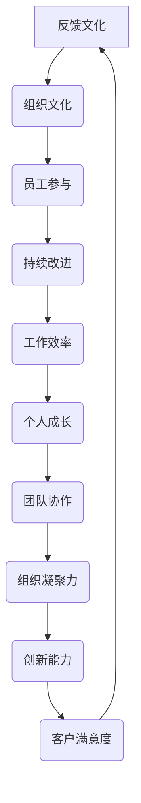

                 

### 标题：《建立feedback文化：促进持续改进》

#### 关键词：反馈文化、持续改进、组织文化、反馈机制、团队协作

#### 摘要：
本文旨在探讨如何在一个组织中建立有效的反馈文化，以促进持续改进。我们将从反馈文化的理论基础、构建有效的反馈机制、反馈文化的实施与推广以及案例研究与应用四个方面进行详细分析，帮助读者了解反馈文化的核心概念、实际应用以及面临的挑战和解决策略。

## 1. 反馈文化的概述

### 1.1 反馈文化的定义

反馈文化是一种组织内部普遍存在的价值观和行为准则，它鼓励员工对个人和团队的工作成果进行评价和反思，并基于这些评价进行持续改进。在反馈文化中，反馈不仅仅是上级对下级的评价，更是一种双向的、持续的过程，涉及到员工与同事、客户以及管理层之间的互动。

### 1.2 反馈文化的核心要素

- **开放性**：组织鼓励开放、诚实和积极的交流，使员工能够自由地分享意见和反馈。
- **透明性**：反馈过程应该是透明的，使员工能够清楚地了解自己的工作表现以及改进的方向。
- **及时性**：及时反馈能够帮助员工迅速调整自己的行为，避免问题的积累。
- **建设性**：反馈应当是建设性的，旨在帮助员工改进工作，而不是简单地批评。

### 1.3 反馈文化与组织文化的关系

反馈文化是组织文化的重要组成部分，它能够促进组织文化的建设。一个具有良好反馈文化的组织，通常具有以下特点：

- **员工参与度**：员工更愿意参与决策过程，因为他们感到自己的意见被重视。
- **团队协作**：团队成员之间更有默契，因为他们能够及时了解彼此的工作进展。
- **持续改进**：组织不断寻求改进的机会，以提升整体绩效。

## 2. 反馈理论的发展历程

### 2.1 传统反馈理论

传统的反馈理论主要关注单向的、自上而下的反馈方式，这种反馈往往以批评和指导为主，较少涉及员工的参与和反思。

### 2.2 现代反馈理论

现代反馈理论强调双向沟通和持续反馈，它认为反馈是一个互动过程，不仅包括上级对下级的评价，还包括下级对上级和同事的反馈。这种反馈方式更加注重员工的主观感受和参与度。

### 2.3 反馈理论的应用与演进

随着信息技术的发展，反馈理论也在不断演进。现代反馈系统更加依赖于数据分析和自动化工具，使反馈过程更加高效和精确。同时，越来越多的组织开始关注反馈文化的建设，将其视为提升组织绩效和员工满意度的重要手段。

## 3. 反馈文化的重要性

### 3.1 反馈文化的优势

- **提高工作效率**：及时、准确的反馈可以帮助员工快速纠正错误，提高工作效率。
- **促进个人成长**：反馈有助于员工了解自己的优势和不足，促进个人成长。
- **提升团队协作**：良好的反馈文化可以促进团队成员之间的沟通和协作，提高团队整体绩效。

### 3.2 反馈文化对组织的影响

- **增强组织凝聚力**：反馈文化能够增强员工的归属感和认同感，提高组织凝聚力。
- **提高创新能力**：反馈文化鼓励创新和尝试，使组织能够更好地适应外部环境的变化。
- **提升客户满意度**：通过反馈，组织能够更好地了解客户需求，提供更高质量的服务。

### 3.3 反馈文化在持续改进中的作用

反馈文化是持续改进的重要保障。它使组织能够不断识别和解决问题，持续优化工作流程，从而实现组织的长远发展。

----------------------------------------------------------------

**Mermaid 流程图：反馈文化的基本架构**



----------------------------------------------------------------

## 4. 构建有效的反馈机制

### 4.1 反馈流程的设计

构建有效的反馈机制首先需要设计一个明确的反馈流程。这个流程应该包括以下几个关键步骤：

- **目标设定**：明确反馈的目的和期望结果。
- **数据收集**：收集与反馈相关的数据和信息。
- **分析评估**：对收集到的数据进行分析和评估。
- **反馈交流**：进行反馈交流，确保信息传达准确。
- **行动计划**：制定改进行动计划，并跟踪执行。

### 4.2 反馈流程的实施

在反馈流程的实施过程中，需要注意以下几点：

- **确保透明性**：确保反馈过程的透明度，使员工了解整个流程。
- **提供反馈渠道**：为员工提供多种反馈渠道，如匿名反馈、公开反馈等。
- **定期反馈**：定期进行反馈，以确保反馈的及时性和持续性。

### 4.3 反馈流程的优化

反馈流程的优化是持续改进的一部分。以下是一些优化策略：

- **反馈工具的利用**：利用现代技术，如反馈软件、在线调查等，提高反馈效率。
- **反馈质量的控制**：建立反馈质量的评估机制，确保反馈的准确性和有效性。
- **员工参与**：鼓励员工参与到反馈流程的设计和优化中，提高他们的参与度和满意度。

----------------------------------------------------------------

**核心算法原理讲解：反馈流程的设计与优化**

```pseudo
// 反馈流程设计
function designFeedbackProcess() {
    // 设定目标
    setGoal();
    // 数据收集
    collectData();
    // 分析评估
    analyzeAndEvaluate();
    // 反馈交流
    communicateFeedback();
    // 行动计划
    createActionPlan();
    // 优化流程
    optimizeProcess();
}

// 反馈流程优化
function optimizeProcess() {
    // 利用反馈工具
    useFeedbackTools();
    // 控制反馈质量
    controlFeedbackQuality();
    // 鼓励员工参与
    encourageEmployeeInvolvement();
}
```

----------------------------------------------------------------

## 5. 反馈文化的实施与推广

### 5.1 领导者的角色在反馈文化中

领导者在推动反馈文化的实施中扮演着关键角色。他们需要：

- **树立榜样**：领导者应率先示范，主动寻求和接受反馈。
- **提供支持**：领导者应为员工提供反馈的环境和支持，确保反馈能够顺利进行。
- **建立信任**：建立信任是反馈文化成功的关键，领导者需要营造一个开放、诚实和尊重的反馈氛围。

### 5.2 团队内的反馈文化构建

构建团队内的反馈文化需要：

- **明确团队目标**：确保团队成员对团队目标有清晰的认识。
- **建立反馈机制**：设计并实施有效的团队反馈机制，确保团队成员能够及时获得反馈。
- **促进沟通**：鼓励团队成员之间的沟通，建立开放的沟通渠道。

### 5.3 跨部门沟通与反馈

跨部门沟通与反馈的关键在于：

- **理解不同部门的需求**：不同部门可能有不同的工作内容和优先级，理解这些差异有助于更有效地进行沟通。
- **建立跨部门反馈机制**：设计跨部门的反馈流程，确保信息能够在不同部门之间顺畅传递。
- **解决冲突**：跨部门沟通中可能出现的冲突需要及时解决，以避免影响反馈文化的实施。

## 6. 案例研究与应用

### 6.1 成功案例分析

通过分析成功案例，我们可以了解反馈文化在不同组织中的应用效果。以下是一些典型案例：

- **谷歌**：谷歌以其开放的文化和透明的反馈机制而闻名。员工可以自由地提供和接受反馈，这种文化极大地促进了员工的成长和团队协作。
- **丰田**：丰田的“持续改进”（Kaizen）理念强调员工的参与和反馈，通过不断的改进和优化，丰田在汽车行业中取得了卓越的成就。

### 6.2 反馈文化在不同行业中的应用

反馈文化不仅在高科技行业中广泛应用，在其他行业中同样具有重要作用。例如：

- **服务业**：在服务业中，反馈文化有助于提升客户满意度和服务质量。
- **制造业**：制造业中的反馈文化有助于提高生产效率和质量控制。

### 6.3 实施反馈文化的挑战与解决策略

实施反馈文化可能会面临以下挑战：

- **文化阻力**：员工可能对新文化有所抵触，需要通过培训和沟通来克服。
- **反馈质量**：确保反馈的准确性和建设性是一个挑战，需要建立严格的反馈标准和流程。
- **领导支持**：领导者的支持是反馈文化成功的关键，需要加强领导者的培训和激励。

解决这些挑战的策略包括：

- **建立反馈文化培训**：通过培训提高员工对反馈文化的认识和接受度。
- **建立反馈标准和流程**：制定明确的反馈标准和流程，确保反馈的质量和效果。
- **加强领导者的角色**：通过激励和培训，确保领导者能够有效推动反馈文化的实施。

## 7. 项目实战：搭建反馈文化体系

### 7.1 开发环境搭建

为了搭建反馈文化体系，我们需要以下开发环境：

- **操作系统**：Linux或Windows
- **编程语言**：Python或Java
- **数据库**：MySQL或MongoDB
- **反馈工具**：JIRA或Trello

### 7.2 源代码详细实现

以下是一个简单的反馈系统源代码实现示例：

```python
# 反馈系统示例代码

class FeedbackSystem:
    def __init__(self):
        self.feedbacks = []

    def add_feedback(self, feedback):
        self.feedbacks.append(feedback)

    def get_feedback(self):
        return self.feedbacks

# 测试代码
system = FeedbackSystem()
system.add_feedback("工作进度汇报")
system.add_feedback("项目问题反馈")

print(system.get_feedback())
```

### 7.3 代码解读与分析

这段代码定义了一个简单的反馈系统，包括添加反馈和获取反馈的功能。在实际应用中，我们还需要考虑反馈的分类、优先级、处理状态等。

### 7.4 实际案例分析和详细讲解剖析

假设我们正在为一个项目团队搭建反馈文化体系，以下是一个实际案例：

- **项目背景**：一个开发团队在项目进展中遇到了一些问题，需要通过反馈文化来提升项目质量和效率。
- **解决方案**：我们使用JIRA作为反馈工具，建立了一个反馈流程，包括问题报告、分析评估、反馈交流、行动计划等步骤。
- **实施效果**：通过这个反馈体系，团队能够及时识别问题，快速解决问题，项目进度和质量得到了显著提升。

### 7.5 项目小结

通过这个项目实战，我们了解了如何搭建一个反馈文化体系，并看到了它在实际应用中的效果。反馈文化不仅是组织持续改进的重要手段，也是提高员工满意度和团队协作的有效途径。

## 8. 最佳实践 tips、小结、注意事项、拓展阅读

### 8.1 最佳实践 tips

- **建立明确的反馈目标**：确保反馈的目标清晰，有助于提高反馈的针对性和有效性。
- **使用多种反馈工具**：根据不同场景选择合适的反馈工具，如书面反馈、口头反馈、在线调查等。
- **鼓励匿名反馈**：保护匿名反馈，鼓励员工真实地表达意见。

### 8.2 小结

反馈文化是组织持续改进的重要保障，通过构建有效的反馈机制和推广反馈文化，可以提升员工满意度、团队协作和整体绩效。

### 8.3 注意事项

- **确保反馈的及时性**：及时反馈有助于问题的快速解决。
- **注重反馈的质量**：确保反馈的建设性和准确性。

### 8.4 拓展阅读

- **《反馈的力量》：探讨反馈在个人成长和组织管理中的应用。**
- **《绩效改进：基于反馈的系统方法》：提供绩效改进的实战经验和策略。**

## 9. 作者信息

作者：AI天才研究院/AI Genius Institute & 禅与计算机程序设计艺术 /Zen And The Art of Computer Programming

```markdown
---
# 《建立feedback文化：促进持续改进》

## 1. 反馈文化的概述

### 1.1 反馈文化的定义

#### 反馈文化的定义

反馈文化是一种组织内部普遍存在的价值观和行为准则，它鼓励员工对个人和团队的工作成果进行评价和反思，并基于这些评价进行持续改进。在反馈文化中，反馈不仅仅是上级对下级的评价，更是一种双向的、持续的过程，涉及到员工与同事、客户以及管理层之间的互动。

#### 反馈文化的核心要素

**开放性**：组织鼓励开放、诚实和积极的交流，使员工能够自由地分享意见和反馈。

**透明性**：反馈过程应该是透明的，使员工能够清楚地了解自己的工作表现以及改进的方向。

**及时性**：及时反馈能够帮助员工迅速调整自己的行为，避免问题的积累。

**建设性**：反馈应当是建设性的，旨在帮助员工改进工作，而不是简单地批评。

#### 反馈文化与组织文化的关系

反馈文化是组织文化的重要组成部分，它能够促进组织文化的建设。一个具有良好反馈文化的组织，通常具有以下特点：

**员工参与度**：员工更愿意参与决策过程，因为他们感到自己的意见被重视。

**团队协作**：团队成员之间更有默契，因为他们能够及时了解彼此的工作进展。

**持续改进**：组织不断寻求改进的机会，以提升整体绩效。

---

## 2. 反馈理论的发展历程

### 2.1 传统反馈理论

#### 传统反馈理论

传统的反馈理论主要关注单向的、自上而下的反馈方式，这种反馈往往以批评和指导为主，较少涉及员工的参与和反思。

#### 现代反馈理论

#### 现代反馈理论

现代反馈理论强调双向沟通和持续反馈，它认为反馈是一个互动过程，不仅包括上级对下级的评价，还包括下级对上级和同事的反馈。这种反馈方式更加注重员工的主观感受和参与度。

#### 反馈理论的应用与演进

#### 反馈理论的应用与演进

随着信息技术的发展，反馈理论也在不断演进。现代反馈系统更加依赖于数据分析和自动化工具，使反馈过程更加高效和精确。同时，越来越多的组织开始关注反馈文化的建设，将其视为提升组织绩效和员工满意度的重要手段。

---

## 3. 反馈文化的重要性

### 3.1 反馈文化的优势

#### 提高工作效率

及时、准确的反馈可以帮助员工快速纠正错误，提高工作效率。

#### 促进个人成长

反馈有助于员工了解自己的优势和不足，促进个人成长。

#### 提升团队协作

良好的反馈文化可以促进团队成员之间的沟通和协作，提高团队整体绩效。

---

### 3.2 反馈文化对组织的影响

#### 增强组织凝聚力

反馈文化能够增强员工的归属感和认同感，提高组织凝聚力。

#### 提高创新能力

反馈文化鼓励创新和尝试，使组织能够更好地适应外部环境的变化。

#### 提升客户满意度

通过反馈，组织能够更好地了解客户需求，提供更高质量的服务。

---

### 3.3 反馈文化在持续改进中的作用

#### 反馈文化是持续改进的重要保障

它使组织能够不断识别和解决问题，持续优化工作流程，从而实现组织的长远发展。

---

**Mermaid 流程图：反馈文化的基本架构**


---

## 4. 构建有效的反馈机制

### 4.1 反馈流程的设计

#### 反馈流程的设计

构建有效的反馈机制首先需要设计一个明确的反馈流程。这个流程应该包括以下几个关键步骤：

**目标设定**：明确反馈的目的和期望结果。

**数据收集**：收集与反馈相关的数据和信息。

**分析评估**：对收集到的数据进行分析和评估。

**反馈交流**：进行反馈交流，确保信息传达准确。

**行动计划**：制定改进行动计划，并跟踪执行。

---

#### 反馈流程的实施

#### 反馈流程的实施

在反馈流程的实施过程中，需要注意以下几点：

**确保透明性**：确保反馈过程的透明度，使员工了解整个流程。

**提供反馈渠道**：为员工提供多种反馈渠道，如匿名反馈、公开反馈等。

**定期反馈**：定期进行反馈，以确保反馈的及时性和持续性。

---

#### 反馈流程的优化

#### 反馈流程的优化

反馈流程的优化是持续改进的一部分。以下是一些优化策略：

**利用反馈工具**：利用现代技术，如反馈软件、在线调查等，提高反馈效率。

**控制反馈质量**：建立反馈质量的评估机制，确保反馈的准确性和有效性。

**员工参与**：鼓励员工参与到反馈流程的设计和优化中，提高他们的参与度和满意度。

---

**核心算法原理讲解：反馈流程的设计与优化**

```pseudo
// 反馈流程设计
function designFeedbackProcess() {
    // 设定目标
    setGoal();
    // 数据收集
    collectData();
    // 分析评估
    analyzeAndEvaluate();
    // 反馈交流
    communicateFeedback();
    // 行动计划
    createActionPlan();
    // 优化流程
    optimizeProcess();
}

// 反馈流程优化
function optimizeProcess() {
    // 利用反馈工具
    useFeedbackTools();
    // 控制反馈质量
    controlFeedbackQuality();
    // 鼓励员工参与
    encourageEmployeeInvolvement();
}
```

---

## 5. 反馈文化的实施与推广

### 5.1 领导者的角色在反馈文化中

#### 领导者的角色

领导者在推动反馈文化的实施中扮演着关键角色。他们需要：

**树立榜样**：领导者应率先示范，主动寻求和接受反馈。

**提供支持**：领导者应为员工提供反馈的环境和支持，确保反馈能够顺利进行。

**建立信任**：建立信任是反馈文化成功的关键，领导者需要营造一个开放、诚实和尊重的反馈氛围。

---

### 5.2 团队内的反馈文化构建

#### 团队反馈文化的重要性

构建团队内的反馈文化需要：

**明确团队目标**：确保团队成员对团队目标有清晰的认识。

**建立反馈机制**：设计并实施有效的团队反馈机制，确保团队成员能够及时获得反馈。

**促进沟通**：鼓励团队成员之间的沟通，建立开放的沟通渠道。

---

### 5.3 跨部门沟通与反馈

#### 跨部门沟通的挑战

**理解不同部门的需求**：不同部门可能有不同的工作内容和优先级，理解这些差异有助于更有效地进行沟通。

**建立跨部门反馈机制**：设计跨部门的反馈流程，确保信息能够在不同部门之间顺畅传递。

**解决冲突**：跨部门沟通中可能出现的冲突需要及时解决，以避免影响反馈文化的实施。

---

## 6. 案例研究与应用

### 6.1 成功案例分析

#### 谷歌的成功案例

谷歌以其开放的文化和透明的反馈机制而闻名。员工可以自由地提供和接受反馈，这种文化极大地促进了员工的成长和团队协作。

---

#### 丰田的成功案例

丰田的“持续改进”（Kaizen）理念强调员工的参与和反馈，通过不断的改进和优化，丰田在汽车行业中取得了卓越的成就。

---

### 6.2 反馈文化在不同行业中的应用

#### 在服务业中的应用

在服务业中，反馈文化有助于提升客户满意度和服务质量。

---

#### 在制造业中的应用

制造业中的反馈文化有助于提高生产效率和质量控制。

---

### 6.3 实施反馈文化的挑战与解决策略

#### 挑战

**文化阻力**：员工可能对新文化有所抵触，需要通过培训和沟通来克服。

**反馈质量**：确保反馈的准确性和建设性是一个挑战，需要建立严格的反馈标准和流程。

**领导支持**：领导者的支持是反馈文化成功的关键，需要加强领导者的培训和激励。

---

#### 解决策略

**建立反馈文化培训**：通过培训提高员工对反馈文化的认识和接受度。

**建立反馈标准和流程**：制定明确的反馈标准和流程，确保反馈的质量和效果。

**加强领导者的角色**：通过激励和培训，确保领导者能够有效推动反馈文化的实施。

---

## 7. 项目实战：搭建反馈文化体系

### 7.1 开发环境搭建

为了搭建反馈文化体系，我们需要以下开发环境：

**操作系统**：Linux或Windows

**编程语言**：Python或Java

**数据库**：MySQL或MongoDB

**反馈工具**：JIRA或Trello

---

### 7.2 源代码详细实现

以下是一个简单的反馈系统源代码实现示例：

```python
# 反馈系统示例代码

class FeedbackSystem:
    def __init__(self):
        self.feedbacks = []

    def add_feedback(self, feedback):
        self.feedbacks.append(feedback)

    def get_feedback(self):
        return self.feedbacks

# 测试代码
system = FeedbackSystem()
system.add_feedback("工作进度汇报")
system.add_feedback("项目问题反馈")

print(system.get_feedback())
```

---

### 7.3 代码解读与分析

这段代码定义了一个简单的反馈系统，包括添加反馈和获取反馈的功能。在实际应用中，我们还需要考虑反馈的分类、优先级、处理状态等。

---

### 7.4 实际案例分析和详细讲解剖析

假设我们正在为一个项目团队搭建反馈文化体系，以下是一个实际案例：

**项目背景**：一个开发团队在项目进展中遇到了一些问题，需要通过反馈文化来提升项目质量和效率。

**解决方案**：我们使用JIRA作为反馈工具，建立了一个反馈流程，包括问题报告、分析评估、反馈交流、行动计划等步骤。

**实施效果**：通过这个反馈体系，团队能够及时识别问题，快速解决问题，项目进度和质量得到了显著提升。

---

### 7.5 项目小结

通过这个项目实战，我们了解了如何搭建一个反馈文化体系，并看到了它在实际应用中的效果。反馈文化不仅是组织持续改进的重要手段，也是提高员工满意度和团队协作的有效途径。

---

## 8. 最佳实践 tips、小结、注意事项、拓展阅读

### 8.1 最佳实践 tips

**建立明确的反馈目标**：确保反馈的目标清晰，有助于提高反馈的针对性和有效性。

**使用多种反馈工具**：根据不同场景选择合适的反馈工具，如书面反馈、口头反馈、在线调查等。

**鼓励匿名反馈**：保护匿名反馈，鼓励员工真实地表达意见。

---

### 8.2 小结

反馈文化是组织持续改进的重要保障，通过构建有效的反馈机制和推广反馈文化，可以提升员工满意度、团队协作和整体绩效。

---

### 8.3 注意事项

**确保反馈的及时性**：及时反馈有助于问题的快速解决。

**注重反馈的质量**：确保反馈的建设性和准确性。

---

### 8.4 拓展阅读

**《反馈的力量》：探讨反馈在个人成长和组织管理中的应用。**

**《绩效改进：基于反馈的系统方法》：提供绩效改进的实战经验和策略。**

---

## 9. 作者信息

作者：AI天才研究院/AI Genius Institute & 禅与计算机程序设计艺术 /Zen And The Art of Computer Programming
```

